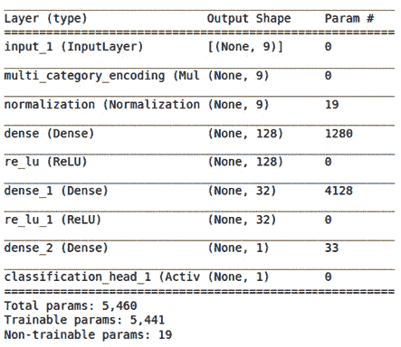
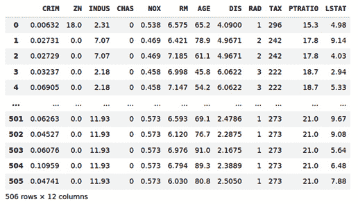
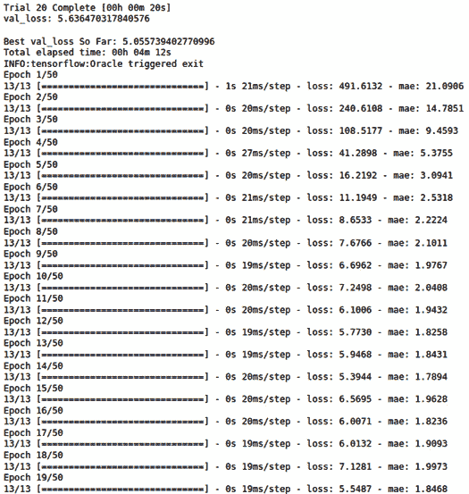
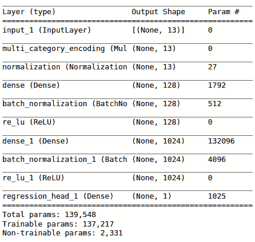
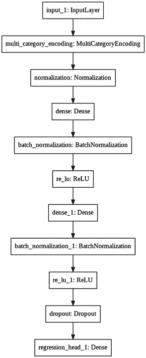

# 六、使用 AutoKeras 处理结构化数据

在本章中，我们将重点介绍如何使用 AutoKeras 处理结构化数据，也称为表格数据。我们将学习如何探索这种类型的数据集，以及应用什么技术来解决基于这种数据源的问题。

完成本章后，您将能够探索结构化数据集、对其进行转换、将其用作特定模型的数据源，以及创建自己的分类和回归模型来解决基于结构化数据的任务。

具体来说，在本章中，我们将讨论以下主题:

*   理解结构化数据
*   使用结构化数据
*   创建结构化数据分类器来预测泰坦尼克号幸存者
*   创建结构化数据回归器来预测波士顿房价

# 技术要求

本书中的所有编码示例都以 Jupyter 笔记本的形式提供，可以从本书的 GitHub 资源库下载:[https://colab . research . Google . com/GitHub/packt publishing/Automated-Machine-Learning-with-AutoKeras/blob/main/chapter 06/chapter 6 _ housingpricepredictor . ipynb](https://colab.research.google.com/github/PacktPublishing/Automated-Machine-Learning-with-AutoKeras/blob/main/Chapter06/Chapter6_HousingPricePredictor.ipynb)。

由于代码单元可以执行，每个笔记本都可以自安装，因此您可以根据需要添加代码片段。因此，在每个笔记本的开头，都有一个用于环境设置的代码单元，用于安装 AutoKeras 及其依赖项。

因此，要运行本书中的代码示例，您只需要一台装有 Ubuntu Linux 的计算机作为您的操作系统，并安装相应的 Jupyter 笔记本，代码如下:

```
$ apt-get install python3-pip jupyter-notebook
```

或者，您也可以使用 Google Colaboratory 运行这些笔记本。在这种情况下，你只需要一个网络浏览器。更多详情，请参见 [*第二章*](B16953_02_Final_PG_ePub.xhtml#_idTextAnchor029) 、*AutoKeras*入门的 *AutoKeras 与谷歌联合实验室*部分。此外，在该章的*安装 AutoKeras* 部分，您将找到其他安装选项。

# 了解结构化数据

结构化数据基本是表格数据；即由数据库的行和列表示的数据。这些表包含以下两种类型的结构化数据:

*   **Numerical data**: This is data that is expressed on a numerical scale. Furthermore, it is represented in two ways, as follows:

    a.**连续**:一个区间内可以取任意值的数据，如温度、速度、高度等。例如，一个人的身高可以是任何值(在人类身高范围内)，而不仅仅是某些固定的高度。

    b.**离散**:只能取不可整除的整数值的数据，如作为计数器。例子包括银行账户里的钱数，一个国家的人口，等等。

*   **Categorical data**: This is data that can take only a specific set of values corresponding to possible categories. In turn, they are divided into the following categories:

    a.**二进制**:数据只能接受两个值(0/1)

    b.**序数**:有明确顺序的数据，如周的天数

有必要了解每个要素的数据类型，以便应用适当的预处理方法。例如，如果 DataFrame 中的某一列包含顺序数据，那么在将它传递给模型之前，必须对它进行一次热编码预处理。

# 使用结构化数据

AutoKeras 允许我们快速、轻松地创建高性能模型，以解决基于结构化数据的任务。

根据每个列的格式，AutoKeras 会在输入模型之前自动对它们进行预处理。例如，如果列包含文本，它会将其转换为嵌入，如果列值是固定的类别，它会将其转换为 one-hot 编码数组，等等。

在下面几节中，我们将看到使用表格数据集是多么容易。

# 创建结构化数据分类器来预测泰坦尼克号幸存者

这个模型将根据从泰坦尼克号卡格尔数据集中提取的特征，预测泰坦尼克号乘客是否能在沉船中幸存。尽管运气是生存的一个重要因素，但一些群体比其他群体更有可能生存下来。

此数据集中有一个训练数据集和一个测试数据集。两者都是相似的数据集，包含乘客信息，如姓名、年龄、性别、社会经济阶层等。

火车数据集(`train.csv`)包含关于车上乘客子集的详细信息(准确地说是 891 人)，在`survived`列中揭示他们是否幸存。

测试数据集(`test.csv`)将用于最终评估，并包含其他 418 名乘客的类似信息。

AutoKeras 将在列车数据中找到模式，以预测车上的其他 418 名乘客(在`test.csv`中找到)是否幸存。

完整的源代码笔记本可以在[https://github . com/packt publishing/Automated-Machine-Learning-with-AutoKeras/blob/main/chapter 06/chapter 6 _ titanic classifier . ipynb](https://github.com/PacktPublishing/Automated-Machine-Learning-with-AutoKeras/blob/main/Chapter06/Chapter6_TitanicClassifier.ipynb)找到。

现在，我们来详细看看笔记本的相关单元格:

*   **安装 AutoKeras** :正如我们在其他例子中提到的，笔记本顶部的这个代码片段负责使用 pip 包管理器安装 AutoKeras 及其依赖项:

    ```
    !pip3 install autokeras
    ```

*   **导入必要的包**:以下代码行加载 TensorFlow、pandas 和 AutoKeras 作为该项目的必要依赖:

    ```
    import tensorflow as tf
    import autokeras as ak
    import pandas as pd
    ```

*   **Creating the datasets**: First, we will load the Titanic datasets as pandas DataFrames:

    ```
    train_file_url = "https://storage.googleapis.com/tf-datasets/titanic/train.csv"
    test_file_url = "https://storage.googleapis.com/tf-datasets/titanic/eval.csv"
    train_df = pd.read_csv(train_file_url)
    test_df = pd.read_csv(test_file_url)
    ```

    现在，我们必须将标签(目标)与其他乘客特征(输入)分开:

    ```
    x_train_df, y_train_df = train_df.drop(['survived'], axis=1), train_df['survived']
    ```

*   **Showing some samples**: Next, we will print the first few rows to see the column's values:

    ```
    train_df.head()
    ```

    以下是上述代码的输出:


图 6.1–训练数据集前几行的笔记本输出

前面的截图显示了不同列中的乘客信息。第一个(`survived`)将是预测的目标。

现在，是时候创建分类器模型了。

## 创建分类器

现在，我们将使用 AutoKeras `StructuredDataClassifier`来寻找最佳分类模型。对于这个例子，我们将把`max_trials`(可以尝试的不同 Keras 型号的最大数量)设置为`2`，把 epochs 参数设置为`10`:

```
clf = ak.StructuredDataClassifier(
max_trials=2, 
overwrite=True)
```

让我们运行训练过程来搜索训练数据集的最佳分类器:

```
clf.fit(
    x_train_df,
    y_train_df,
    epochs=10,
)
```

`StructuredDataClassifier`接受不同的输入格式。您可以向它传递 pandas DataFrame，正如我们在前面的代码中所做的那样，但它也接受其他格式，如 NumPy 数组和 TensorFlow 数据集。它还允许您直接传递 URL 或文件路径，它将被模型自动下载和获取。要使用后一个选项，必须将目标列的名称指定为第二个参数:

```
clf.fit(
    train_file_url,
    'survived',
    epochs=10,
)
```

两种情况下的输出是相似的:


图 6.2–结构化数据分类器培训的笔记本输出

先前的输出显示训练数据集的准确性正在提高。

正如我们所看到的，我们在验证集中获得了最好的预测准确性。这是一个号仅仅进行了几秒钟的训练。我们将搜索限制在 10 个时代和两种架构(`max_trials = 2`)。简单地增加这些数字会给我们一个更好的准确性，但也需要更长的时间来完成。

## 评估模型

让我们用测试数据集来评估最佳模型:

```
clf.evaluate(test_file_url, 'survived')
```

以下是上述代码的输出:

```
9/9 [==============================] - 0s 2ms/step - loss: 0.4322 - accuracy: 0.8068
[0.4321742355823517, 0.8068181872367859]
```

正如我们可以看到的，`0.80`对于我们投入的训练时间来说也是一个非常好的最终预测分数。

## 可视化模型

现在我们有了一个成功的模型，让我们来看一下它的架构:

```
model = clf.export_model()
model.summary()
```

以下是上述代码的输出:



图 6.3–最佳模型架构总结

正如我们所看到的，AutoKeras 已经为我们完成了所有的预处理工作，将 category 列转换成类别，并对它们进行规范化。

让我们来看看这个的视觉表现:


图 6.4–最佳模型架构可视化

在数据预处理模块(多类别和标准化)之后，AutoKeras 选择了一个完全连接的神经网络。这是适合表格数据的经典 ML 架构。这是有意义的，因为结构化数据更容易用经典的机器学习模型来训练，因为数据中的模式更明确。

在下一节中，我们将通过预测房价来解决结构化数据回归问题。

# 创建结构化数据回归器来预测波士顿房价

在下面的例子中，我们将尝试预测 20 世纪 70 年代中期波士顿郊区的房价中值，给出当时该郊区的数据特征，如犯罪率、房产税、当地房产等。

我们将创建一个模型，根据其特征找出特定郊区的房价。为此，我们将使用`boston_housing`数据集训练模型，我们必须将它添加到我们的存储库中([https://github . com/packt publishing/Automated-Machine-Learning-with-AutoKeras/blob/main/Boston . CSV](https://github.com/PacktPublishing/Automated-Machine-Learning-with-AutoKeras/blob/main/boston.csv))。我们将使用的数据集相对较小，506 个样本分为 404 个训练样本和 102 个测试样本。请注意，数据集没有被归一化，这意味着输入数据中的每个特征对其值应用不同的比例。例如，某些列的值在 0 到 1 的范围内，而其他列的值在 1 到 12、0 到 100 之间，依此类推。因此，这是测试 AutoKeras 自动预处理功能的一个很好的数据集。

数据集的特征(列)可总结如下:

*   **CRIM** :城镇犯罪率(人均)
*   **ZN** :面积超过 25，000 平方英尺的住宅用地比例
*   **INDUS** :城镇非零售营业亩数比例
*   **CHAS** : Charles River 虚拟变量(1 如果区域以河流为界；否则为 0)
*   **NOX** :氮氧化物浓度(百万分之一)
*   **RM** :每个住所的平均房间数
*   **楼龄**:1940 年前建成的自住单位比例
*   **DIS** :到五个波士顿就业中心的加权平均距离
*   **RAD** :放射状公路可达性指标
*   **税**:每万美元的全价值财产税税率
*   **PTRATIO** :各城镇的师生比
*   LSTAT :人口的低地位百分比
*   **MEDV** :以千美元计的自有住房中值

以下屏幕截图显示了该数据集中的一些样本:



图 6.5-波士顿住房数据集中的几个样本

因为我们想估算一个价格，所以我们将使用结构化数据回归器来完成这项任务。

本例的笔记本以及完整的源代码可以在[https://github . com/packt publishing/Automated-Machine-Learning-with-AutoKeras/blob/main/chapter 06/chapter 6 _ housingpricepredictor . ipynb](https://github.com/PacktPublishing/Automated-Machine-Learning-with-AutoKeras/blob/main/Chapter06/Chapter6_HousingPricePredictor.ipynb)找到。

下面我们来详细解释一下笔记本的相关代码单元格:

*   **获取波士顿房屋数据集**:在训练之前，我们必须下载包含每个郊区特征的数据集，包括中位价格:

    ```
     df = pd.read_csv("https://raw.githubusercontent.com/PacktPublishing/Automated-Machine-Learning-with-AutoKeras/main/boston.csv")
    y = df.pop('MEDV')
    X = df
    train_data, test_data, train_targets, test_targets = train_test_split(X,y,test_size=0.2)
    ```

*   **数据预处理**:由于我们将数据集打包，我们将创建训练集和测试集，同时使用**中值价格列** ( **MEDV** )作为目标值。注意一些列在输入到我们的模型之前会被预处理。AutoKeras 将自动预处理这些列，对连续值执行规范化(设置值在 0 和 1 之间)并对离散值进行分类(一键编码)。在模型架构的后面，我们将看到为此目的创建的数据预处理块。

## 创建结构数据回归器

因为我们希望从一组特性中预测价格，并且该价格是一个标量值，所以我们将使用 AutoKeras `StructuredDataRegressor`，这是一个结构化数据回归类，它创建一个回归模型，接受集合`x`作为结构化数据集(作为 CSV 文件名、NumPy 数组、pandas 数据帧或 TensorFlow 数据集)和集合`y`作为标签数据集(与输入集格式相同的一列集，或者如果输入数据来自 CSV 文件，则为目标列名)作为输入。

在这种情况下，数据集很小，训练时期将比其他示例更快，因此我们将将`max_trials`设置为 20，并将时期参数设置为 50:

```
reg = ak.StructuredDataRegressor(
    max_trials=20,
    overwrite=True,
    metrics=['mae']
)
```

对于回归模型，AutoKeras 使用**均方差** ( **MSE** )作为默认损失。正如我们在前面章节中解释的，这是预测值和目标值之差的平方。但是对于这个例子，我们还在训练期间监控一个新的度量，它将为我们提供更多信息:**平均绝对误差** ( **MAE** )。这是预测值和目标值之差的绝对值。例如，在这个问题中，MAE 为 1.5 意味着你的预测平均误差为 1500 美元。

让我们运行培训流程来搜索最佳模型:

```
reg.fit(
    train_data,
    train_targets,
    epochs=50,
)
```

以下是上述代码的输出:



图 6.6-训练我们的房价预测者的笔记本输出

如前面的输出所示，不到 5 分钟后，我们就有了一个具有最佳验证损失(MSE)的`5.05`模型。这意味着预测在最终得分的平均值为`2.24`(5.05 的平方根)时失败。这是 2200 多美元。对于仅仅 5 分钟的训练时间来说，这是一个不坏的结果，所以让我们用测试集来评估一下。

## 评估模型

我们已经准备好用测试数据集评估我们的最终模型。让我们开始吧:

```
reg.evaluate(test_data, test_targets)
```

以下是上述代码的输出:

```
4/4 [==============================] - 0s 5ms/step - loss: 13.9013 - mae: 2.4202
[13.901305198669434, 2.420168161392212]
```

让我们看看我们的新指标，梅。它的值为`2.420`，这意味着我们的预测平均相差 2420 美元。对于我们投入的时间来说，这是一个非常好的预测误差。如果我们用更多的试验和时期运行 AutoKeras，我们可能会得到更好的结果。

## 可视化模型

现在，是时候看看我们的引擎盖下有什么了:

```
keras_model = reg.export_model()
keras_model.summary()
```

以下是上述代码的输出:



图 6.7-最佳模型架构总结

在前面的分类示例中，AutoKeras 已经为我们完成了所有的预处理工作，通过`multi_category_encoding`块将具有离散值的列转换成类别，并使用`normalization`块对连续值列执行规范化。

让我们看看它的视觉表现:



图 6.8–最佳模型架构可视化

在前面的图中，我们可以以一种更示意性的方式看到模型的不同层。现在，让我们总结一下本章所学的内容。

# 总结

在本章中，我们学习了什么是结构化数据及其不同的类别，如何为我们的 AutoKeras 模型提供不同的结构化数据格式(pandas、CSV 文件等)，以及如何使用一些 pandas 函数加载和浏览表格数据集。

最后，我们应用这些概念，创建了一个强大的结构化数据分类器模型来预测泰坦尼克号幸存者，并创建了一个强大的结构化数据回归模型来预测波士顿房价。

至此，您已经了解了如何使用 AutoKeras 处理基于结构化数据的任何问题的基本知识。使用这些技术，任何`CSV`文件都可以是数据集，您可以用它来训练您的模型。

在下一章，我们将学习如何使用 AutoKeras 对文本进行情感分析。