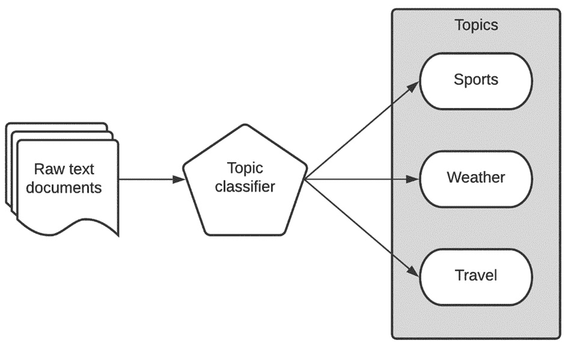

# *第八章*:使用 AutoKeras 进行主题分类

有时，我们需要通过分配标签或主题，将一些特定的文本(如产品或电影评论)归类到一个或多个类别中。主题分类是一种有监督的机器学习技术，它可以准确地完成这项工作:预测给定文本属于哪个类别。作为一个监督模型，它需要用一组已经分类的训练数据，以及文本和每个文本所属的类别来训练。

本章主要是实践性的，因为我们在前几章已经为基于文本的任务打下了基础。本章结束时，您将学会如何使用 AutoKeras 创建主题分类器，以及如何将其应用于任何主题或基于类别的数据集。

本章将涉及的主要主题如下:

*   了解主题分类
*   用 AutoKeras 创建主题分类器
*   自定义模型搜索空间

首先，让我们看看本章的技术要求。

# 技术要求

本书中的所有代码示例都以 Jupyter 笔记本的形式提供，可以从[https://github . com/packt publishing/Automated-Machine-Learning-with-AutoKeras](https://github.com/PacktPublishing/Automated-Machine-Learning-with-AutoKeras)下载。

由于代码单元可以执行，每个笔记本都可以自行安装；只需添加一个代码片段来满足您的需求。因此，在每个笔记本的开头，都有一个安装 AutoKeras 及其依赖项的环境设置代码单元。

因此，要运行本章的代码示例，您只需要一台安装了 Ubuntu Linux 操作系统和 Jupyter Notebook 的计算机，您可以使用下面一行代码来完成:

```
$ apt-get install python3-pip jupyter-notebook
```

或者，你可以使用谷歌协作实验室运行这些笔记本，在这种情况下，你只需要一个网络浏览器。详见 [*第二章*](B16953_02_Final_PG_ePub.xhtml#_idTextAnchor029) 、 *AutoKeras 与谷歌合作*。此外，在该章的*安装 AutoKeras* 部分，您将找到其他安装选项。

现在，让我们通过看一些实际的例子来把我们所学的付诸实践。

# 了解话题分类

我们在 [*第 5 章*](B16953_05_Final_PG_ePub.xhtml#_idTextAnchor077)*中看到了一个主题分类的小例子，使用 AutoKeras* 进行文本分类和回归，用给出了垃圾邮件分类器的例子。在这种情况下，我们根据电子邮件的内容预测了一个类别(垃圾邮件/非垃圾邮件)。在这一节中，我们将使用一个类似的文本分类器将每篇文章分类到其相应的主题中。通过这样做，我们将获得一个模型，该模型确定哪些主题(类别)对应于每个新闻条目。

例如，假设我们的模型输入了以下标题:

```
"The match could not be played due to the eruption of a tornado"
```

这将输出`weather`和`sports`主题，如下图所示:



图 8.1-新闻主题分类器的工作流程

上图显示了主题分类器管道的简化版本。原始文本由分类器处理，输出将是一个或多个类别。

在本章的后面，我们将把文本分类器应用于路透社的新闻报道数据集，将每篇文章归入 46 个类别中的一个或多个。文本分类的大部分概念已经在 [*第 5 章*](B16953_05_Final_PG_ePub.xhtml#_idTextAnchor077) 、*使用 AutoKeras 的文本分类和回归*中解释过，因此在本章中，我们将通过实现主题分类器以实用的方式简单回顾其中的一些概念。

# 创建新闻主题分类器

我们将要创建的模型将对路透社新闻专线分类数据集中的新闻进行分类。它将读取每个新闻条目的原始文本，并将其分类到各个部分，根据它们所属的部分(体育、天气、旅游等)分配一个标签。

路透社新闻专线是一个数据集，包含来自路透社的 11，228 条新闻专线，标记了超过 46 个主题。

每个新闻条目的文本都被编码为一个单词索引列表。这些是在数据集中按频率索引的整数。所以，在这里，整数 *1* 编码数据中第一个最频繁的单词， *2* 编码第二个最频繁的单词，以此类推。

包含完整源代码的笔记本可以在[https://github . com/packt publishing/Automated-Machine-Learning-with-AutoKeras/blob/main/chapter 08/chapter 8 _ Reuters . ipynb](https://github.com/PacktPublishing/Automated-Machine-Learning-with-AutoKeras/blob/main/Chapter08/Chapter8_Reuters.ipynb)找到。

现在，我们来详细看看笔记本的相关单元格:

*   **安装 AutoKeras** :正如我们在前面章节中提到的，笔记本顶部的这个代码片段负责使用 pip 包管理器安装 AutoKeras 及其依赖项:

    ```
    !pip3 install autokeras
    ```

*   `tensorflow`，内置的 Keras Reuters 数据集，以及`numpy`和`AutoKeras`，作为该项目的必要依赖:

    ```
    import tensorflow as tf
    from tensorflow.keras.datasets import reuters 
    import numpy as np
    import autokeras as ak
    ```

*   `reuters_raw` function. Have a look at the code in the notebook for more details:

    ```
    (x_train, y_train), (x_test, y_test) = reuters_raw()
    print(x_train.shape)  # (8982,)
    print(y_train.shape)  # (8982, 1)
    ```

    以下是上述代码的输出:

    ```
    Downloading data from https://storage.googleapis.com/tensorflow/tf-keras-datasets/reuters.npz
    2113536/2110848 [==============================] - 0s 0us/step
    Downloading data from https://storage.googleapis.com/tensorflow/tf-keras-datasets/reuters_word_index.json
    557056/550378 [==============================] - 0s 0us/step
    (8982,)
    (8982, 1)
    ```

*   **Visualizing the dataset samples**: Next, we can print some words from the first sample to have an idea of what it contains:

    ```
    print(x_train[0][:50])
    ```

    以下是上述代码的输出:

    ```
    <START> <UNK> <UNK> said as a result of its decemb
    ```

我们来看一个词云中出现频率最高的词的分布。单词云(也称为标签云)是一种基于文本的数据可视化技术，根据单词在文本中出现的频率，以不同的大小显示单词:


图 8.2-新闻专线数据集的单词云

现在，让我们创建新闻专线分类器模型。

## 创建分类器

现在，我们将使用 AutoKeras `TextClassifier`找到最佳分类模型。就这个例子来说，我们将把`max_trials`(可以尝试的不同 Keras 型号的最大数量)设置为 2。我们将不设置 epochs 参数；相反，我们将定义一个`2`时期的`EarlyStopping`回调。我们这样做的目的是，如果验证损失在两个连续时期内没有改善，则训练过程停止:

```
clf = ak.TextClassifier(max_trials=2)
cbs = [tf.keras.callbacks.EarlyStopping(patience=2)]
```

让我们运行训练过程来搜索训练数据集的最佳分类器:

```
clf.fit(x_train, y_train, callbacks=cbs)
```

以下是输出:


图 8.3-文本分类器训练的笔记本输出

先前的输出显示训练数据集的准确性正在提高。

如我们所见，我们在验证集中获得了 0.965 的损失值。对于 1 分钟的训练来说，这是一个非常好的数字。我们将搜索限制在两种架构(`max_trials = 2`)。增加这个数字会给我们一个更精确的模型，尽管这也需要更长的时间来完成。

## 评估模型

现在，是时候用测试数据集评估最佳模型了:

```
Clf.evaluate(x_test, y_test)
```

以下是输出:

```
71/71 [==============================] – 1s 7ms/step – loss: 0.9743 – accuracy: 0.7778
[0.9742580652236938, 0.777827262878418]
```

正如我们所看到的，对于我们投入的训练时间(不到几分钟)，0.77 (77%)是一个很好的最终预测分数。

## 可视化模型

现在，让我们来看一个关于最佳生成模型的架构的简短总结:

```
Model = clf.export_model()
model.summary()
```

以下是输出:


图 8.4-最佳模型架构总结

正如我们所看到的，AutoKeras 选择了卷积模型(Conv1D)来执行这项任务。正如我们在本章开始时解释的，当序列中元素的顺序对预测不重要时，这种体系结构非常有用。

这是一个直观的表示:


图 8.5–最佳模型架构可视化

## 评估模型

正如您已经知道的，生成模型并选择最佳模型是由 AutoKeras 自动完成的，但是让我们更详细地解释这些模块。

每个块代表一个层，每个块的输出连接到下一个块的输入，除了第一个块的输入是文本，最后一个块的输出是预测的数字。Conv1D 之前的模块都是数据预处理模块，它们负责向量化文本生成嵌入以馈入 Conv1D 模块，并通过 max pooling 层降低过滤器的维度。请注意，AutoKeras 还添加了几个下降块来减少过度拟合。

# 定制模型搜索空间

我们可以通过使用`AutoModel`而不是`TextClassifier`来定制模型的搜索，以限制搜索空间，例如，通过为一些特定的配置设置`TextBlock`。

在下面的代码片段中，我们告诉 AutoKeras 只生成使用`'ngram'`对句子进行矢量化的模型。请记住，如果我们不指定这些参数中的任何一个，AutoKeras 将自动尝试所有可能的组合，直到数字达到`max_trial`参数:

```
input_node = ak.TextInput()
output_node = ak.TextBlock(block_type="ngram")(input_node)
output_node = ak.ClassificationHead()(output_node)
clf = ak.AutoModel(inputs=input_node, 
                   outputs=output_node, overwrite=True,
                   max_trials=1)
clf.fit(x_train, y_train, epochs=2)
```

现在，让我们总结一下本章所学的内容。

# 总结

在这一章中，我们学习了如何通过实现一个高性能的文本分类器来解决主题分类任务，这个分类器只用几行代码就可以对新闻文章进行分类。

现在我们已经为处理文本打下了基础，我们准备进入下一章，在这里你将学习如何使用 AutoKeras 处理多模态和多任务数据。