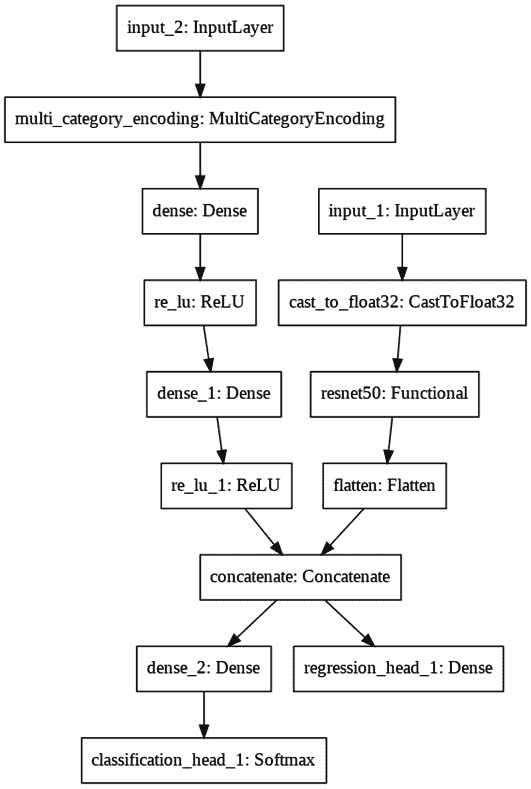

# *第九章*:处理多模态和多任务数据

在本章中，我们将学习如何使用 AutoModel API 来处理多模态和多任务数据。

本章结束时，您将学会如何使用必要的概念和工具来创建具有多个输入和多个输出的模型。通过从头开始创建一个模型，或者将本章中展示的实际例子应用到其他类似的数据集中，你将能够将这些概念应用到你自己的项目中。

在本章中，我们将讨论以下主题:

*   探索具有多个输入或输出的模型
*   创建多任务/多模式模型
*   自定义搜索空间

但是首先，让我们解释一下本章的技术要求。

# 技术要求

本书中的所有代码示例都以 Jupyter 笔记本的形式提供，可以从[https://github . com/packt publishing/Automated-Machine-Learning-with-AutoKeras](https://github.com/PacktPublishing/Automated-Machine-Learning-with-AutoKeras)下载。

由于可以执行代码单元，每个笔记本都可以自行安装；只需添加包含您需要的需求的代码片段。因此，在每个笔记本的开头，都有一个安装 AutoKeras 及其依赖项的环境设置代码单元。

因此，要运行本章中的代码示例，您只需要一台装有 Ubuntu Linux 操作系统的计算机，并且必须安装 Jupyter Notebook，代码如下:

```
$ apt-get install python3-pip jupyter-notebook
```

或者，您也可以使用 Google Colaboratory 运行这些笔记本，在这种情况下，您只需要一个网络浏览器。详见 [*第二章*](B16953_02_Final_PG_ePub.xhtml#_idTextAnchor029) 、 *AutoKeras 与谷歌合作*。此外，在该章的*安装 AutoKeras* 部分，您将找到其他安装选项。

现在，让我们通过一个实际的例子来将我们在介绍中提到的这些概念付诸实践。

# 探索具有多个输入或输出的模型

正如我们将在后面看到的，有时，我们可能会对我们的模型从不同来源(多模态)获取信息和/或同时预测多个目标(多任务)感兴趣。AutoKeras 有一个名为 **AutoModel** 的类，它允许我们将几个源和目标定义为一个参数列表。在看一个实际例子之前，让我们更深入地探讨一下这个问题。

## 什么是自动模型？

AutoModel 是一个类，它允许我们通过定义模型的输入和输出以及中间层来定义模型。

它有两种不同的用途:

*   **基本**:这里指定输入/输出节点，AutoModel 推断模型的剩余部分。
*   **高级**:在这里，高层架构是通过用功能 API 连接层(块)来定义的，与 Keras 功能 API 相同。

让我们来看一个例子。

### 基本示例

用户只需指定输入节点和输出头:

```
import autokeras as ak
ak.AutoModel(
    inputs=[ak.ImageInput(), ak.TextInput()],
    outputs[ak.ClassificationHead(), ak.RegressionHead()])
```

接下来，我们来看一个进阶的例子。

### 高级示例

用户指定高层架构:

```
import autokeras as ak
image_input = ak.ImageInput()
image_output = ak.ImageBlock()(image_input)
text_input = ak.TextInput()
text_output = ak.TextBlock()(text_input)
output = ak.Merge()([image_output, text_output])
classification_output = ak.ClassificationHead()(output)
regression_output = ak.RegressionHead()(output)
ak.AutoModel(
   inputs=[image_input, text_input],
   outputs=[classification_output, regression_output])
```

在前面的代码中，我们配置了 AutoModel 来创建一个具有多个输入(多模式)和多个输出(多任务)的模型。接下来，我们将解释这些概念，并通过创建我们自己的多模型来看它们的实际应用。

## 什么是多模态？

当每个数据实例包含多种形式的信息时，我们说数据是多模态的。例如，我们可以将照片保存为图像，但是除了该图像之外，它还包含关于其拍摄地点的 *meta* 信息。这个元信息可以被视为结构化数据。

## 什么是多任务处理？

我们说一个模型在预测具有相同输入特征的多个目标时是多任务的。例如，假设我们想按民族对人的照片进行分类，但同时我们想将他们的年龄指定为 0 到 100 之间的一个数字。

下图显示了一个多模态多任务神经网络模型的示例:


图 9.1–多模态和多任务神经网络模型示例

这里我们可以看到有两个条目:**图像** ( **图像输入**)和**结构化数据** ( **结构化数据输入**)。每个图像都与结构化数据中的一组属性相关联。从这些数据中，我们可以尝试同时预测**分类标签** ( **分类头**)和**回归值** ( **回归头**)。

让我们通过一个实际的例子来更详细地了解这些概念。

# 创建多任务/多模态模型

基于本章开头提供的示例，我们将要创建的模型将图像及其结构化数据属性作为输入，并将预测类别值和标量值。在这种情况下，我们将生成自己的数据，而不是使用数据集。我们将使用的包含完整源代码的笔记本可以在[https://github . com/packt publishing/Automated-Machine-Learning-with-AutoKeras/blob/main/chapter 09/chapter 9 _ multimodel . ipynb](https://github.com/PacktPublishing/Automated-Machine-Learning-with-AutoKeras/blob/main/Chapter09/Chapter9_MultiModel.ipynb)找到。

现在，我们来详细看看笔记本的相关单元格:

*   **安装 AutoKeras** :正如我们在前面章节中提到的，笔记本顶部的这个代码片段负责使用 pip 包管理器安装 AutoKeras 及其依赖项:

    ```
    !pip3 install autokeras
    ```

*   `numpy`和`AutoKeras`作为该项目的必要依赖:

    ```
    import numpy as np
    import autokeras as ak
    ```

*   **Creating the datasets**: First, we are going to create the datasets by generating a random image and structured data as multimodal data:

    ```
    import numpy as npnum_instances = 100
    image_data = np.random.rand(num_instances, 32, 32, 3).astype(np.float32)
    structured_data = np.random.rand(num_instances, 20).astype(np.float32)
    ```

    现在，为分类和回归生成一些多任务目标:

    ```
    regression_target = np.random.rand(num_instances, 1).astype(np.float32)
    classification_target = np.random.randint(5, size=num_instances)
    ```

现在，是创建模型的时候了。

## 创建模型

现在，我们将使用`AutoModel`创建模型，首先是它的基本配置，然后是它的高级配置。和前面的例子一样，我们将设置少量的`max_trials`和`epochs`，这样训练过程不会花费太长时间。

首先，我们将使用多个输入和输出来初始化模型:

```
import autokeras as akmodel = ak.AutoModel(
    inputs=[ak.ImageInput(), ak.StructuredDataInput()],
    outputs=[
        ak.RegressionHead(metrics=['mae']),
        ak.ClassificationHead(loss='categorical_crossentropy', metrics=['accuracy'])
    ],
    overwrite=True,
    max_trials=2)
```

在前面的代码中，我们定义了两个输入(图像和结构化数据)和两个输出(回归和分类)。这里，我们告诉模型，我们希望同时用回归器和分类器来训练我们的输入数据。

现在，让我们运行训练过程来搜索训练数据集的最佳模型:

```
model.fit(
    [image_data, structured_data],
    [regression_target, classification_target],
    epochs=3)
```

以下是输出结果:


图 9.2–模型培训的笔记本输出

与前面的示例不同，在这里，我们可以看到输出显示了两个损失——一个是回归器的损失，一个是分类器的损失。在这种情况下，数据是随机生成的，因此查看性能进行评估是没有意义的。

## 可视化模型

现在，让我们来看一下最佳生成模型的架构的一个小总结:

```
keras_model = model.export_model()
keras_model.summary()
```

以下是输出:


图 9.3-最佳模型架构总结

让我们简要描述一下这个模型使用的模块。

在这种情况下，AutoKeras 会创建两个子模型，每条输入数据一个子模型。它选择了深度残差网络架构( **resnet50** )，我们已经在 [*第 4 章*](B16953_04_Final_PG_ePub.xhtml#_idTextAnchor063) 、*使用 AutoKeras* 进行图像分类和回归中介绍过，以处理图像数据和几个完全连接的层来摄取结构化数据。在消化了两个数据源之后，两个子模型的结果被连接起来并再次分离，以生成两个不同的输出(一个标量值和一个类别值)。

这是一个直观的表示:



图 9.4–最佳模型架构可视化

现在，让我们在更高级的模式下使用 AutoModel 来定制中间块。

# 定制搜索空间

正如我们在本章开始时提到的，有一种使用 AutoModel 的高级方法。我们可以通过用功能 API 连接层(块)来定义整个模型架构，这与 Keras 功能 API 是一样的。

让我们在下面的例子中这样做:

```
input_node1 = ak.ImageInput()
output_node = ak.Normalization()(input_node1)
output_node = ak.ImageAugmentation()(output_node)
output_node1 = ak.ConvBlock()(output_node)
output_node2 = ak.ResNetBlock(version='v2')(output_node)
output_node1 = ak.Merge()([output_node1, output_node2])

input_node2 = ak.StructuredDataInput()
output_node = ak.CategoricalToNumerical()(input_node2)
output_node2 = ak.DenseBlock()(output_node)

output_node = ak.Merge()([output_node1, output_node2])
output_node1 = ak.ClassificationHead()(output_node)
output_node2 = ak.RegressionHead()(output_node)

model = ak.AutoModel(
    inputs=[input_node1, input_node2], 
    outputs=[output_node1, output_node2],
    overwrite=True,
    max_trials=2)

model.fit(
    [image_data, structured_data],
    [classification_target, regression_target],
    batch_size=32,
    epochs=3)
```

这里，我们已经通过将一个模块的输出连接到下一个模块的输入，顺序定义了每个模块。在这种情况下，我们通过添加一些图像预处理块来定制模型，以进行标准化和增强。我们还放置了一个与 ResNet 层平行的卷积层来训练图像数据，这也是定制的。您甚至可以指定想要使用的 ResNet 体系结构的版本。

虽然这种模式更复杂，但它更强大、更灵活。注意，您甚至可以指定您想要使用的 ResNet 架构的版本(v2)。需要注意的是，对于尚未定制的参数(如版本), AutoKeras 会尝试不同的值组合，以找到最佳值。

# 总结

在本章中，我们学习了什么是多任务模型，什么是多模态模型，以及如何使用强大的 AutoModel 类来创建具有多个输入和输出的高效模型。现在，您已经准备好将这些概念应用到您自己的多模型项目中，方法是从头开始创建它们，或者将这个实际的例子应用到您自己的数据集。

在下一章中，我们将学习如何导出我们的模型，以及如何使用强大的可视化工具来跟踪和可视化实时图表中的损失和准确性等指标。