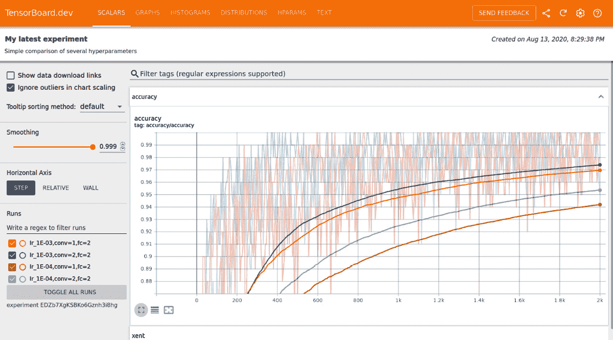
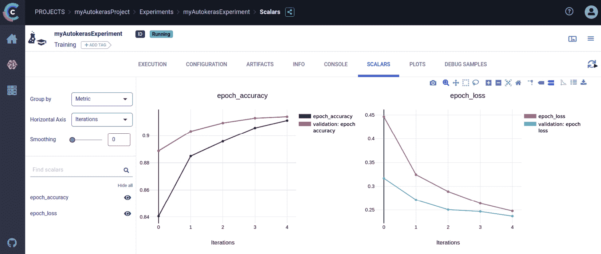
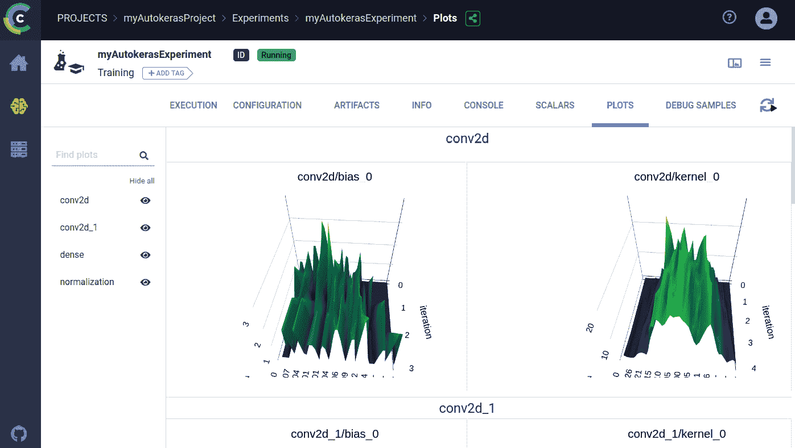

# *第十章*:导出并可视化模型

在本章中，我们将了解如何导出和导入 AutoKeras 模型。一旦接受训练，我们还将学会以图形方式实时可视化模型训练过程中发生的事情。

完成本章后，您将能够将您的模型导出和导入到磁盘，并且您的工具包中会有一个强大的可视化工具，它将帮助您了解模型训练过程中发生的情况。

具体来说，在本章中，我们将涵盖以下要点:

*   导出您的模型:如何从磁盘保存和加载您的模型
*   使用 TensordBoard 可视化您的模型:如何使用这个强大的工具实时可视化您的模型
*   使用 ClearML 可视化和比较您的模型

让我们从第一点开始，但是首先像往常一样，确保我们已经安装了所有的需求。

# 技术要求

本书中的所有编码示例都以 Jupyter 笔记本的形式提供，可以从网站下载:[https://github . com/packt publishing/Automated-Machine-Learning-with-AutoKeras](https://github.com/PacktPublishing/Automated-Machine-Learning-with-AutoKeras)。

由于可以执行代码单元，每个笔记本都可以自行安装，添加一个代码片段来满足您的需求。因此，在每个笔记本的开头，都有一个用于环境设置的代码单元，用于安装 AutoKeras 及其依赖项。

因此，为了运行编码示例，您只需要一台安装了 Ubuntu Linux 操作系统的计算机，并且可以使用以下命令安装 Jupyter 笔记本:

```
$ apt-get install python3-pip jupyter-notebook
```

或者，您也可以使用 Google Colaboratory 运行这些笔记本。在这种情况下，您只需要一个 web 浏览器；更多详情请参考 [*第二章*](B16953_02_Final_PG_ePub.xhtml#_idTextAnchor029) 、*AutoKeras*入门中的 *AutoKeras 与谷歌合作*章节。此外，在主要部分*安装 AutoKeras* ，您还可以找到其他安装选项。

现在，让我们用一个实际的例子来实践上一节的概念。

# 导出您的模型

AutoKeras 找到的最佳模型可以轻松导出为 Keras 模型。

将模型保存到磁盘时，可以使用两种不同的格式:TensorFlow SavedModel 格式和较旧的 Keras H5 格式。推荐的格式是 SavedModel，这是我们调用`model.save()`时默认使用的选项。

## 如何保存和加载模型

现在让我们看看如何一步一步地导出和恢复模型:

1.  Export the model to a Keras model using the following code block:

    ```
    model = my_autokeras_model.export_model() 
    ```

    现在，尝试使用 h5 格式保存到 TensorFlow 格式作为备份，因为有些地方出错了:

    ```
    try:
        model.save("model_autokeras", save_format="tf")
    except:
        model.save("model_autokeras.h5")
    ```

2.  重新加载模型，如下面的代码块所示:

    ```
    from tensorflow.keras.models import load_model
    loaded_model = load_model("model_autokeras", custom_objects=ak.CUSTOM_OBJECTS)
    ```

代码几乎是不言自明的，但是我们将更详细地解释加载函数。在这个负责将我们的模型从磁盘加载到内存的函数中，我们将把`ak.CUSTOM_OBJECTS`值作为一个`custom_objects`参数传递。这向 Keras 函数表明，我们要加载的模型具有自定义的 AutoKeras 对象。

一旦我们知道了如何导入和导出我们的模型，是时候进入下一部分了，在培训过程中，我们将学习可视化。这将帮助我们从学习过程中提取观点。

# 使用 TensorBoard 可视化您的模型

为了开发高效和成功的模型，你需要知道在你的实验过程中发生了什么，以便你可以通过纠正可能的异常或不想要的结果，如过度拟合和缓慢学习，尽快做出反应。这就是触觉回调的概念发挥作用的地方。

回调是在调用 fit 时传递给模型的对象(实现特定方法的类实例),它由模型在训练期间的不同点调用。您可以访问关于模型状态及其性能的所有可用数据，并在此基础上采取以下措施:

*   中断训练，因为你已经停止学习或过度适应
*   保存模型；这样，将来可以从保存的点重新开始训练
*   记录度量，如精度或损失
*   改变其状态，并修改其结构或超参数，如学习率

以下是一些使用回调的方法示例:

*   模型检查点:在训练过程中的不同点保存当前的模型权重。
*   早期停止:当验证损失不再改善时，中断训练(当然，保存训练期间获得的最佳模型)。
*   在训练过程中动态调整某些参数的值，例如学习率。
*   记录培训期间的培训和验证指标，或者在模型更新时查看模型学习到的表示。

有两个特别有用的训练回调函数，`EarlyStopping`和`ModelCheckpoint`。第一个用于在观察到的度量已经停止提高初始设置的次数时中断训练。例如，此回调允许您在开始过度拟合时立即中断训练，从而避免必须用较少的时期重新训练您的模型。该回调通常与`ModelCheckpoint`一起使用，它允许您在训练期间持续保存模型。


图 10.1–如何通过回调训练模型的示例

AutoKeras 总是在训练期间保存最佳模型，并默认使用`EarlyStopping`，根据我们正在训练的模型类型设置不同的时期数。然而，这种行为可以通过`fit`函数的回调参数进行定制。

## 使用回调来记录模型状态

记录指标的回调对于监控来说是必不可少的，因为它们允许 TensorBoard 等工具(我们将在这里看到)在模型训练期间实时可视化模型的学习进度。

因此，在我们的例子中，我们将使用以下命令设置回调来记录训练进度:

```
logdir = os.path.join("logs", datetime.datetime.now().strftime("%Y%m%d-%H%M%S"))
tensorboard_callback = tf.keras.callbacks.TensorBoard(logdir, histogram_freq=1)
```

在前面的代码中，我们定义了一个日志目录(`log_dir`)并创建了一个回调来保存那里的模型检查点，这意味着 AutoKeras 会自动将每个时期的指标保存在这个文件夹的多个日志文件中。我们还激活了直方图(`histogram_freq=1`)，所以在 TensorBoard 的**直方图**选项卡中，你可以查看每一层的激活值直方图。

在下一节中，我们将使用 TensorBoard 可视化日志，tensor board 是一个用于查看 TensorFlow 模型相关信息的 web 应用程序。由于 AutoKeras 有 TensorFlow，我们可以用一种简单的方式使用这个工具来可视化我们的模型。

## 设置和加载张量板

TensorBoard 允许我们实时可视化不同的指标，如损失和精度，以及渲染模型图(通过层和操作)，以及权重、偏差或其他张量的直方图。

TensorBoard 可以直接在 Jupyter 笔记本和 Colab 中使用。这是通过将 TensorBoard 扩展加载到笔记本中来实现的。这是我们将在本章中使用的方法。

注意

如果你已经在同一个 virtualenv 上安装了 Jupyter 和 TensorBoard，你就可以开始了。如果您正在使用一个更复杂的设置，例如针对不同 Conda/virtualenv 环境的 Jupyter 和内核的全局安装，您需要确保 TensorBoard 二进制文件在您的`PATH`中，在 Jupyter 笔记本的上下文中。

首先，我们必须设置`callbacks`，正如我们在上一节中所解释的，以便在`logs`目录中记录训练进度:

```
logdir = os.path.join("logs", datetime.datetime.now().strftime("%Y%m%d-%H%M%S"))
tensorboard_callback = tf.keras.callbacks.TensorBoard(logdir)
```

现在我们将 `callbacks`传递给训练函数:

```
model.fit(x_train, 
        y_train,
        epochs=1, 
        callbacks=[tensorboard_callback])
```

一旦训练完成，我们就可以加载`tensorboard`扩展来可视化结果:

```
%load_ext tensorboard
%tensorboard --logdir logs
```

前面几行代码加载 TensorBoard 仪表板，向其提供 model `logs`目录:


图 10.2–显示模型训练结果的张量板

在前面的截图中，有两个图表，每个图表有四条不同的线，代表两个候选模型的学习进度。

在第一个图中，最高的两条线分别显示了训练集和验证集的历元精度，而较低的线显示了另一个模型的训练和验证数据集的历元精度。

第二张图中也出现了同样的情况，但在这种情况下，它代表的是损失而不是精度。

我们还可以在**图**选项卡中看到模型的元素。**图形**选项卡显示了您的 AutoKeras 模型使用的功能的交互式低级别张量流图形显示:


图 10.3–显示模型图的张量板

在前面的屏幕截图中，我们可以看到模型图的一部分及其不同的层和操作。如您所见，这个模型比您想象的要复杂得多。当您定义分类器时，它只有三行代码，但是在幕后，AutoKeras 构建了一个相当复杂的图形结构来使它工作。

这里，我们还可以可视化不同层中的权重/偏差分布:


图 10.4–显示模型层分布的张量板

我们还有很多选择，这里就不解释了。TensorBoard 是一个非常强大和完整的工具，它的领域超出了本书的范围。以下网址是一个很好的起点:[https://www.tensorflow.org/tensorboard/get_started](https://www.tensorflow.org/tensorboard/get_started)。

让我们在下一节看看如何与世界分享我们的实验。

## 与 TensorBoard.dev 分享您的 ML 实验结果

TensorBoard.dev 是一项免费的公共服务，允许你上传你的 TensorBoard 记录，并获得一个永久链接，可以与任何你想分享的人分享，同时也可以用于你的学术文章、博客帖子、社交媒体等。这可以允许更好的再现性和协作。

您可以通过运行以下命令来使用 TensorBoard.dev:

```
!tensorboard dev upload \
  --logdir logs/fit \
  --name "(optional) My latest AutoKeras experiment" \
  --description "(optional) Simple comparison of several hyperparameters" \
  --one_shot
```

前面的命令将模型目录`logs`上传到 TensorBoard.dev:

```
New experiment created. View your TensorBoard at: https://tensorboard.dev/experiment/TPcKbLPeRAqZ1GmRWDAdow/
```

现在，单击该链接将打开一个浏览器，我们将在其中看到 TensorBoard.dev 网站上的 TensorBoard 面板，如下所示:



图 10.5–tensor board . dev 上分享的模型训练结果

正如我们所见，TensorBoard 是一个非常强大的工具，用于监控您的模型，但如果您需要跟踪您的实验，如以及与其他团队进行比较和共享，有一个名为 ClearML 的 AutoKeras 扩展，它是专门为监控和跟踪实验而设计的，允许访问 TensorBoard 日志，并使用许多更多的附加功能来补充它。让我们在下一节看看这个。

# 使用 ClearML 可视化和比较您的模型

ClearML(以前称为 Trains)是一个完整的开源 ML/DL 实验解决方案，它可以自动跟踪您需要的一切，以记录您的工作，可视化结果，并使用直观的 web 界面再现、调整和比较 T4 实验。

ClearML 允许您执行以下任务:

*   在 ClearML Web UI 中可视化实验结果。
*   跟踪和上传模型。
*   跟踪模特表现并创建跟踪排行榜。
*   重新运行实验，在任何目标机器上重现实验，并调优实验。
*   对比实验。

要在您的 AutoKeras 项目中使用它，您只需在您的代码中初始化一个 ClearML 任务，ClearML 会自动记录标量、图形和图像，并报告给 TensorBoard、Matplotlib、Plotly 和 Seaborn，以及您添加到代码中的所有其他自动日志和显式报告。

## 将 ClearML 添加到代码中

只需将这两行代码添加到您的项目中:

```
from clearml import Task
task = Task.init(project_name="myAutokerasProject", task_name="myAutokerasExperiment")
```

当代码运行时，它在 ClearML 服务器中初始化一个任务。实验日志的超链接输出到控制台:

```
CLEARML Task: created new task id=c1f1dc6cf2ee4ec88cd1f6184344ca4e
CLEARML results page: https://app.clearml-master.hosted.allegro.ai/projects/1c7a45633c554b8294fa6dcc3b1f2d4d/experiments/c1f1dc6cf2ee4ec88cd1f6184344ca4e/output/log
```

ClearML 将检查 AutoKeras 训练过程，寻找 TensorBoard 回调，以及任何类型的输出，包括日志、度量、图像等等。

在 generated experiment 链接中，您可以实时看到带有不同图形的仪表板，这些图形与 AutoKeras 自动生成的模型相关。这是在训练期间完成的，还可以看到它们的准确性、它们在训练和评估数据集中的性能、控制台输出以及更多指标:



图 10.6–显示 TensorBoard 指标的 ClearML 仪表板

在上一个屏幕截图中，我们可以看到我们的模型的精度和损失如何在各个时期演变，在下一个截图中，我们可以看到其中一个卷积层的权重分布:



图 10.7–显示一些模型层分布的 ClearML 仪表板

在之前的截图中，我们可以看到类似于之前在 TensorBoard 仪表盘中显示的 ClearML 面板。

AutoKeras 在训练过程中会生成多个模型，所以让我们看看 ClearML 是如何同时向我们展示每个模型的结果的。

## 对比实验

有了这个工具，你还可以以一种强有力的方式比较实验和对比结果。有许多比较选项，例如比较模型工件、超参数、数据系列图以及每次迭代的调试样本。它还允许您使用查看器(针对图像和视频)和播放器(针对音频)浏览样本:


图 10.8–比较两个模型的训练结果的 ClearML 仪表板

关于这些选项和更多选项的详细信息可以在 ClearML Web UI 文档中找到。

# 总结

在这一章中，我们学习了如何定义 Keras 回调来在训练期间监控你的模型，如何使用 TensorBoard 来查看直方图、模型图和更多的度量，以及如何使用 ClearML 扩展来监控和跟踪你的实验。

有了这些新工具，你将能够更好地在现实世界中构建你的深度学习模型，并调试潜在的问题。

在本书中，我们学习了使用 AutoKeras 解决任何基于文本、图像或结构化数据的任务所需的基本概念，以及本章中的可视化技术。AutoKeras、Keras 和 TensorFlow 拥有优秀的文档，您可以根据需要深入研究。基础已经奠定；现在是完成建筑的时候了。

## 最后几句话

这就是使用 AutoKeras 的*自动化机器学习的终结！我希望你已经了解到它将帮助你实现你自己的 AI 项目或改进你已经有的项目，尤其是在 AI 领域，每天都有新的概念诞生。所以，我鼓励你继续走下去，钻研这个激动人心的世界，享受每一步。*

在西班牙的 Camino de Santiago 路上，人们经常重复这样一句话:“流浪者，这里没有路。路是走出来的。”

我希望这本书能成为继续这条道路的起点。