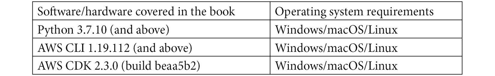

<title>B17649_Preface_ePub</title>

# 前言

AWS 提供了广泛的解决方案来帮助自动化一个**机器学习** ( **ML** )工作流，只需要几行代码。通过这本实用的书，您将学习如何使用各种 AWS 服务来自动化 ML 管道。

*AWS 上的自动机器学习*从快速概述 ML 管道/流程开始，并强调了您在构建管道时可能面临的典型挑战。通过阅读这本书，你将精通各种 AWS 解决方案，如 Amazon SageMaker Autopilot、AutoGluon、AWS Step Functions 等，并将学习如何在实践示例的帮助下自动化端到端 ML 流程。本书将向您展示如何为 ML 流程构建、监控和执行 CI/CD 管道，以及如何使用**云开发套件**(**)*将 AWS 中的各种 CI/CD 服务应用于一个用例。*通过与 Amazon Managed Services for Apache Airflow 合作，您将了解什么是以数据为中心的 ML 流程，并将构建一个托管 air flow 环境。您还将从平台工程团队的角度讲述**机器学习软件开发生命周期(MLSDLC)** 实施的关键成功标准，以及使用 CDK 创建自变异 CI/CD 管道的流程。**

 **到本书结束时，你将能够有效地自动化一个完整的 ML 管道，并将其部署到生产中*。*

# 这本书是给谁的

这本书是为新手和有经验的 ML 从业者准备的，他们希望使用专门构建的和其他的 AWS 服务，将构建、培训和部署基于 ML 的解决方案的过程自动化。对端到端 ML 过程和概念、Python 编程和 AWS 的基本理解是充分利用本书的必要条件。

# 这本书涵盖了什么

[*第 1 章*](B17649_01_ePub.xhtml#_idTextAnchor015) ，*AWS 上的自动机器学习入门*，概述了 ML 管道/流程，并强调了构建管道时将面临的典型挑战。要强调的主要挑战是克服流程的交互性，以及为什么自动化对成功的流程至关重要。随后，我们将介绍 AutoML 的概念，并强调它如何缓解上述挑战。

[*第 2 章*](B17649_02_ePub.xhtml#_idTextAnchor032)*使用 SageMaker Autopilot* 自动化机器学习模型开发，概述了什么是 SageMaker Autopilot，以及它如何在自动化 ML 过程中发挥作用。通过使用一个示例用例(ACME Fishing Logistics)，本章将进一步指导您如何实际利用 SageMaker Autopilot 并将其应用到用例中。本章通过引导您完成流程的每一步，并将其与模型框架示例进行比较来突出流程自动化的好处。

[*第 3 章*](B17649_03_ePub.xhtml#_idTextAnchor048) ，*用 autoglon*实现复杂模型开发的自动化，向您概述了什么是 autoglon，它与 SageMaker Autopilot 有何不同，以及它为涉及利用文本、图像和表格数据的深度学习模型的用例增加的价值。它通过指导您实践 ACME Fishing Logistics 示例和基于深度学习的计算机视觉模型，进一步阐述了 AutoGluon 的流程自动化功能。

[*第四章*](B17649_04_ePub.xhtml#_idTextAnchor061) ，*机器学习的持续集成和持续交付(CI/CD)*，向您介绍**持续集成和持续部署** ( **CI/CD** )的概念，以及如何具体应用于一个 ML 用例。本章通过介绍 DevOps 文化并强调 DevOps 流程如何演变为 MLOps 流程来实现这一点。本章还通过向您介绍**云开发套件(CDK)** 和 Cloud9 开发环境，介绍并关注如何将 AWS 中的各种 CI/CD 服务应用于用例。本章还将向您实际展示如何设置开发工作区，安装和配置 CDK，设置工件存储库，并开始编码 CI/CD 管道将利用的主要工件。

[*第 5 章*](B17649_05_ePub.xhtml#_idTextAnchor078)*生产 ML 模型的持续部署*，向您介绍 ML 从业者在已部署的 CI/CD 管道和 DevOps 文化的背景下执行的典型任务。本章将引导您创建模型资产，这将触发管道执行，并向您展示如何管理和监控进度。

[*第 6 章*](B17649_06_ePub.xhtml#_idTextAnchor094) ，*使用 AWS 步骤函数自动化机器学习流程*，强调如何通过将 ML 从业者纳入大部分管道构建流程来进一步优化 CI/CD 流程。本章通过介绍 AWS 阶跃函数和用于阶跃函数的 Data Science SDK 来说明如何实现这一点。然后，它将带您了解如何将 Data Science SDK 集成到 CI/CD 管道流程中。

[*第 7 章*](B17649_07_ePub.xhtml#_idTextAnchor106) ，*使用 AWS 步骤函数构建 ML 工作流*，通过向您介绍如何构建已编码的 ML 工作流、对工作流执行集成测试，以及使用工作流将 ML 模型部署到生产中，详细阐述了在进一步优化 CI/CD 管道的背景下 ML 从业者的角色和任务。

[*第八章*](B17649_08_ePub.xhtml#_idTextAnchor115) ，*使用 Apache Airflow* 自动化机器学习流程，向您介绍以数据为中心的工作流，为什么它在 ML 流程中的应用很重要，以及通常负责执行这部分流程的团队成员。本章详细阐述了用于执行该功能的常用工具，即 Apache Airflow 和 Apache Airflow 的 Amazon 托管服务。本章将向您介绍如何建立一个可控的气流环境。

[*第 9 章*](B17649_09_ePub.xhtml#_idTextAnchor123)*使用 Amazon Managed Workflows for Apache air flow 构建 ML 工作流*，利用前一章创建的环境，并在进一步优化 CI/CD 管道的背景下，重点关注 ML 从业者执行的角色和任务。本章通过向您介绍如何构建编码的 ML 工作流，对工作流执行集成测试，以及使用在 MWAA 环境中运行的工作流将 ML 模型部署到生产中来实现这一点。

[*第 10 章*](B17649_10_ePub.xhtml#_idTextAnchor133) ，*【机器学习软件开发生命周期(MLSDLC)介绍】*，向您介绍 MLSDLC 方法学，并解释为什么采用这种方法学包含自动化整个基于 ML 的应用程序的整体解决方案。本章强调了 MLSDLC 实施的关键成功标准——跨职能和敏捷团队。它通过遍历每个团队成员角色，他们如何与其他团队成员交互，以及构建每个角色负责的编码工件来展示这个成功标准。

[*第 11 章*](B17649_11_ePub.xhtml#_idTextAnchor149) 、*mls DLC*的持续集成、部署和培训，从平台工程团队的角度，介绍了使用 CDK 创建自变异 CI/CD 管道的过程。本章将向您展示如何获取各种跨职能团队的工件，并在开发和 QA 环境中将它们合并到 ACME Fishing Logistics 应用程序和 ML 模型的 CI 自动化流程中。本章还将强调如何在整个 MLSDLC 工作流程中包含 web 应用程序的自动化集成和 QA 测试过程，以及 ML 模型推理。本章将向您展示如何将应用程序从测试环境带入生产环境，以生成整个 ML 应用程序的生产版本。本章的最后一部分将从数据工程团队的角度关注各种任务和程序，本质上是*关闭 MLSDLC 流程的循环*，带您了解如何根据新数据和从 [*第 8 章*](B17649_08_ePub.xhtml#_idTextAnchor115) 、*中吸取的经验教训，使用 Apache Airflow* 自动执行机器学习流程。

# 为了充分利用这本书

您将需要一个功能性的 AWS 帐户来运行这些示例。



建议您使用 AWS Cloud9 集成开发环境，因为它符合软件/硬件和操作系统要求。

如果你正在使用这本书的数字版本，我们建议你自己输入代码或者从这本书的 GitHub 库中获取代码(下一节有链接)。这样做将帮助您避免任何与复制和粘贴代码相关的潜在错误。

在可能的情况下，已使用适用的 AWS 服务来自动化示例 ML 工作流程。我们鼓励您查看如何进一步调整所提供的示例，以使用其他 AWS 服务，如 Amazon SageMaker 管道，甚至开源替代方案，如 Kubeflow 管道。

# 下载示例代码文件

你可以从 GitHub 的 https://GitHub . com/packt publishing/Automated-Machine-Learning-on-AWS 下载本书的示例代码文件。如果代码有更新，它会在 GitHub 库中更新。

我们在[https://github.com/PacktPublishing/](https://github.com/PacktPublishing/)也有丰富的书籍和视频目录中的其他代码包。看看他们！

# 下载彩色图片

我们还提供了一个 PDF 文件，其中有本书中使用的截图和图表的彩色图像。可以在这里下载:https://static . packt-cdn . com/downloads/9781801811828 _ color images . pdf

# 使用的惯例

本书通篇使用了许多文本约定。

`Code in text`:表示文本中的码字、数据库表名、文件夹名、文件名、文件扩展名、路径名、伪 URL、用户输入和 Twitter 句柄。下面是一个例子:“我们定义了一个`train()`函数来捕获输入参数，并将一个`ImagePredictor()`拟合到`training_data`。”

代码块设置如下:

```
import boto3 
import sagemaker
aws_region = sagemaker.Session().boto_session.region_name
!sm-docker build --build-arg REGION={aws_region} .
```

当我们希望将您的注意力吸引到代码块的特定部分时，相关的行或项目以粗体显示:

```
import sagemaker
import datetime
image_uri = "<Enter the Image URI from the sm-docker output>"
role = sagemaker.get_execution_role()
session = sagemaker.session.Session()
bucket = session.default_bucket()
```

**Bold** :表示一个新术语、一个重要单词或您在屏幕上看到的单词。例如，菜单或对话框中的单词以**粗体**出现。这里有一个例子:“使用**亚马逊 SageMaker** 管理控制台，点击**打开 SageMaker Studio** 按钮。”

提示或重要注意事项

像这样出现。

# 取得联系

我们随时欢迎读者的反馈。

**总体反馈**:如果您对本书的任何方面有疑问，请发邮件至 customercare@packtpub.com[给我们，并在邮件主题中提及书名。](mailto:customercare@packtpub.com)

**勘误表**:虽然我们已经尽力确保内容的准确性，但错误还是会发生。如果你在这本书里发现了一个错误，请告诉我们，我们将不胜感激。请访问 www.packtpub.com/support/errata[并填写表格。](http://www.packtpub.com/support/errata)

**盗版**:如果您在互联网上遇到我们作品的任何形式的非法拷贝，如果您能提供我们的地址或网站名称，我们将不胜感激。请通过 copyright@packt.com 的[联系我们，并提供材料链接。](mailto:copyright@packt.com)

**如果你有兴趣成为一名作家**:如果有你擅长的主题，并且你有兴趣写书或投稿，请访问 authors.packtpub.com。**  **# 分享你的想法

一旦你阅读了 AWS 上的*自动机器学习，我们很想听听你的想法！请[点击这里直接进入亚马逊对这本书的评论页面](https://packt.link/r/1801811822)，并分享你的反馈。*

您的评论对我们和技术社区非常重要，将有助于我们确保提供高质量的内容。**