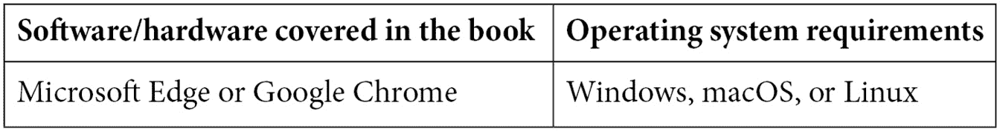

# 前言

*微软 Azure 的自动化机器学习*将帮助你在创纪录的时间内建立高性能、精确的机器学习模型。它允许任何人轻松利用人工智能的力量，并提高其业务的生产率和盈利能力。通过在**图形用户界面** ( **GUI** )上的一系列点击，新手和经验丰富的数据科学家都可以轻松地训练和部署机器学习解决方案到生产中。

这本书将教你如何以谨慎、循序渐进的方式将 Azure AutoML 与 GUI 和 Azure Machine Learning Python SDK 一起使用。首先，你将学习如何准备数据，训练模型，并将它们注册到你的 Azure 机器学习工作区。然后，您将学习如何采用这些模型，并使用它们来创建使用机器学习管道的自动化批量解决方案和使用 **Azure Kubernetes 服务** ( **AKS** )的实时评分解决方案。

当你使用微软 Azure 完成*自动化机器学习时，你将能够对你自己的数据使用 AutoML，不仅训练回归、分类和预测模型，还可以用它们来解决各种各样的业务问题。你将能够通过自动生成的图表和图形向你的商业伙伴展示你的机器学习模型是如何做出预测的，赢得他们的信任和尊重。*

# 这本书是给谁的

数据科学家、有抱负的数据科学家、机器学习工程师以及任何对在业务中应用人工智能或机器学习感兴趣的人都会发现这本书很有用。在开始阅读这本书之前，你需要有人工智能的初级知识和计算机科学、统计学或信息技术的技术背景。拥有 Python 的背景将有助于你实现这本书更高级的功能，但即使是数据分析师和 SQL 专家在读完这本书后也将能够训练机器学习模型。

# 这本书涵盖了什么

[*第 1 章*](B16595_01_ePub.xhtml#_idTextAnchor014) ，*介绍 AutoML，*首先解释数据科学和人工智能在行业中的现状，以及为什么如此多的公司难以从数据中提取价值。它解释了数据科学家如何工作，为什么他们的过程天生缓慢，以及为什么他们需要更快。最后，介绍了 AutoML 作为实现行业所需投资回报的解决方案。

[*第二章*](B16595_02_ePub.xhtml#_idTextAnchor023) ，*Azure 机器学习服务入门，*深入解释了 Azure 机器学习的不同工件，以及它们如何集成以形成端到端的机器学习解决方案。您将了解数据存储、数据集、计算实例、计算集群、环境和实验，以及如何使用它们在 Azure 上创建机器学习解决方案。

[*第三章*](B16595_03_ePub.xhtml#_idTextAnchor044)*训练你的第一个 AutoML 模型，*将让你使用公开可用的 Titanic 数据创建你的第一个 AutoML 模型。您将使用 Azure Machine Learning Studio GUI 将您的数据上传到您的工作空间，创建数据集，并运行 AutoML 分类作业来预测泰坦尼克号幸存者。最后，您将使用 AutoML 的可解释特性来查看哪些因素对预测存活率最为重要。

[*第四章*](B16595_04_ePub.xhtml#_idTextAnchor056) ，*构建 AutoML 回归解决方案，*将帮助你使用 Python 中的 Azure 机器学习 SDK 训练一个 AutoML 回归模型。您将了解如何在 Azure Machine Learning 中访问 Jupyter 笔记本，使用计算集群在云上进行远程训练，以及创建预测数字的 AutoML 模型。到本章结束时，你将能够为将来遇到的任何回归问题复制这项工作。

[*第五章*](B16595_05_ePub.xhtml#_idTextAnchor068)*构建一个 AutoML 分类解决方案*，将通过两种方式帮助你使用 Python 中的 Azure 机器学习 SDK 训练一个 AutoML 分类模型。首先，您将训练一个二元分类模型来预测两个类别中的一个。然后，您将训练一个多类分类模型来预测三个类别中的一个。在本章结束时，你将成为使用 AutoML 训练所有类型分类模型的专家。

[*第六章*](B16595_06_ePub.xhtml#_idTextAnchor081) ，*构建 AutoML 预测解决方案，*着眼于预测，最常见的机器学习问题之一，也是最难掌握的问题之一。在这一章中，您将学习如何用 AutoML 编写一个预测解决方案，利用高级的特定于预测的算法和特性。您将了解预测的来龙去脉，并能够避免人们在预测时犯的许多常见错误。

[*第七章*](B16595_07_ePub.xhtml#_idTextAnchor094) ，*使用多模型解决方案加速器，*详述了**多模型解决方案加速器** ( **MMSA** )是一项尖端的 Azure 技术，它让公司可以快速而轻松地训练成千上万的模型。在这里，您将学习如何访问 MMSA 并根据您自己的问题进行调整。这是一个针对经验丰富的数据科学家的强大的纯代码解决方案，但即使是新手在本章结束时也能使用它。

[*第八章*](B16595_08_ePub.xhtml#_idTextAnchor112) ，*选择实时与批量评分，*探讨了实时解决方案和批量解决方案如何代表机器学习模型评分的两种方式。本章深入探讨了常见的业务场景，并解释了您应该如何选择创建哪种类型的解决方案。本章结尾有一个测验，测试您将业务问题与正确的解决方案相匹配的能力，为您节省时间和金钱。

[*第九章*](B16595_09_ePub.xhtml#_idTextAnchor129) ，*实现批量评分解决方案，*强调机器学习管道如何成为 Azure 机器学习的批量评分解决方案的选择。机器学习管道是容器化的代码，一旦你创建了它们，你就可以很容易地自动重新运行和调度它们。本章要求您使用在前面章节中创建的 AutoML 模型来创建功能强大的批量评分解决方案，这些解决方案可以根据您选择的时间表运行。

[*第 10 章*](B16595_10_ePub.xhtml#_idTextAnchor151) ，*创建端到端的 AutoML 解决方案，*强调了**Azure Data Factory**(**ADF**)是一个与机器学习管道轻松集成的无代码数据编排工具。在本章中，你将学习如何无缝地将数据移入和移出 Azure，以及如何将该流程与你的评分管道相集成。本章结束时，您将了解 ADF 和 AMLS 是如何结合起来创造终极数据科学体验的。

[*第十一章*](B16595_11_ePub.xhtml#_idTextAnchor172) ，*实现实时评分解决方案，*教你如何创建托管在 AKS 和 **Azure 容器实例** ( **ACI** )上的实时评分端点。您将学习如何从 Azure Machine Learning Studio GUI 中单击一下，并通过 Jupyter 笔记本中的 Python 代码将 AutoML 模型部署到端点，从而完成您的 AutoML 训练。

[*第十二章*](B16595_12_ePub.xhtml#_idTextAnchor184) ，*用 AutoML 实现商业价值，*重点讲述如何打造端到端的解决方案只是实现商业价值的第一步；你还需要获得最终用户的信任。本章重点关注如何通过架构图、模型可解释性以及以直观、易于理解的方式呈现结果来获得这种信任。您将学习如何成为并被视为您业务中值得信赖、可靠的合作伙伴。

# 为了充分利用这本书

您需要具备以下要求:



为了在微软 Azure 上使用*自动机器学习，你需要一个可用的互联网连接。我们推荐微软 Edge 或者谷歌 Chrome 来获得 Azure 门户的最佳体验。此外，如果您还没有 Azure 帐户，您将需要创建一个(免费)Azure 帐户。*

如果您使用的是这本书的数字版本，我们建议您自己键入代码，或者通过 GitHub 资源库访问代码(下一节提供了链接)。这样做将帮助您避免任何与复制和粘贴代码相关的潜在错误。

当您阅读本书时，请随意使用您自己的数据尝试 AutoML。解决你感兴趣的问题对你的学习经历有很大帮助。在每章的结尾，尝试根据示例代码调整您自己的数据集。

# 下载示例代码文件

你可以从 GitHub 的 https://GitHub . com/packt publishing/Automated-Machine-Learning-with-Microsoft-Azure 下载本书的示例代码文件。如果代码有更新，它将在现有的 GitHub 库中更新。

我们在[https://github.com/PacktPublishing/](https://github.com/PacktPublishing/)也有丰富的书籍和视频目录中的其他代码包。看看他们！

# 下载彩色图片

我们还提供了一个 PDF 文件，其中有本书中使用的截图/图表的彩色图像。可以在这里下载:[https://static . packt-cdn . com/downloads/9781800565319 _ color images . pdf](https://static.packt-cdn.com/downloads/9781800565319_ColorImages.pdf)。

# 使用的惯例

本书通篇使用了许多文本约定。

`Code in text`:表示文本中的码字、数据库表名、文件夹名、文件名、文件扩展名、路径名、伪 URL、用户输入和 Twitter 句柄。这里有一个例子:“你在这里有另一个助手函数，`get_forecasting_output`”

代码块设置如下:

```
from azureml.core import Workspace, Dataset, Datastore
from azureml.core import Experiment
from azureml.core.compute import ComputeTarget
from azureml.train.automl import AutoMLConfig
from azureml.train.automl.run import AutoMLRun
from azureml.widgets import RunDetails
```

任何命令行输入或输出都按如下方式编写:

```
from azureml.pipeline.core import PipelineRun
experiment = Experiment(ws, 'your-experiment_name')
pipeline_run = PipelineRun(experiment, 'your-pipeline-run-id')
```

**Bold** :表示一个新术语、一个重要单词或您在屏幕上看到的单词。例如，菜单或对话框中的单词出现在文本中，如下所示。这里有一个例子:“在 Azure Machine Learning Studio 中，转到**资产**下的**实验**，单击你的实验名称，选择你的运行 ID，单击**模型**选项卡，选择性能最高的算法，然后单击**指标**选项卡。”

提示或重要注意事项

像这样出现。

# 取得联系

我们随时欢迎读者的反馈。

**总体反馈**:如果您对本书的任何方面有疑问，请在邮件主题中提及书名，并发邮件至 customercare@packtpub.com联系我们。

**勘误表**:虽然我们已经尽力确保内容的准确性，但错误还是会发生。如果你在这本书里发现了一个错误，请告诉我们，我们将不胜感激。请访问 www.packtpub.com/support/errata，选择您的图书，点击勘误表提交表格链接，并输入详细信息。

**盗版**:如果您在互联网上遇到我们作品的任何形式的非法拷贝，如果您能提供我们的地址或网站名称，我们将不胜感激。请通过 copyright@packt.com 的[联系我们，并提供材料链接。](mailto:copyright@packt.com)

**如果你有兴趣成为一名作家**:如果有你擅长的主题，并且你有兴趣写书或投稿，请访问 authors.packtpub.com。

# 评论

请留下评论。一旦你阅读并使用了这本书，为什么不在你购买它的网站上留下评论呢？潜在的读者可以看到并使用您不带偏见的意见来做出购买决定，我们 Packt 可以了解您对我们产品的看法，我们的作者可以看到您对他们的书的反馈。谢谢大家！

更多关于 Packt 的信息，请访问[packt.com](http://packt.com)。