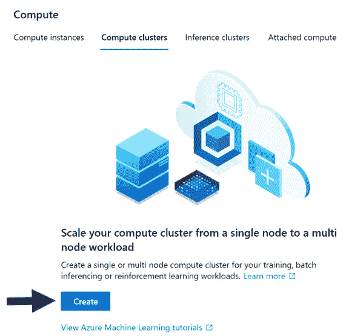

# 二、Azure 机器学习服务入门

既然我们知道交付人工智能投资回报的关键是快速交付机器学习(ML)项目，我们需要学习如何使用**自动化机器学习** ( **AutoML** )来实现这一目标。然而，在我们这样做之前，我们需要学习如何使用 **Azure 机器学习服务** ( **AMLS** )。AMLS 是微软在 Azure 云上的首要 ML 平台。

我们将从创建一个 Azure 账户和一个 AMLS 工作区开始这一章。创建工作空间后，您将继续创建不同类型的计算，以使用机器集群远程运行 Python 代码和 ML 作业。接下来，您将学习如何使用 Azure 数据集和数据存储结构来处理数据。最后，我们将提供 AutoML 的概述。这将提高您创建高性能模型的能力。

在本章中，我们将讨论以下主题:

*   创建您的第一个 AMLS 工作空间
*   构建计算来运行您的自动作业
*   在 AMLS 使用数据
*   了解 AutoML 如何在 Azure 上工作

# 技术要求

为了完成本章中的练习，您需要以下内容:

*   访问互联网
*   网络浏览器，最好是谷歌 Chrome 或微软 Edge Chromium
*   微软账户

# 创建你的第一个 AMLS 工作室

第一次浏览微软 Azure 可能是一次令人畏惧的经历。数百个具有类似功能的服务很容易让人迷失。因此，从创建 Azure 帐户开始，一步一步地遵循本指南非常重要。如果你已经有一个 Azure 账户，你可以跳到*创建 AMLS 工作区*部分。

## 创建 Azure 帐户

让我们开始吧:

1.  要创建一个 Azure 帐户，请导航到 https://azure.microsoft.com 的。
2.  Click the green **Start free** button, as shown in the following screenshot. Depending on your location, this button may be located in a slightly different location. Once you've clicked this button, you will be asked to select an email address associated with your Microsoft account:

    注意

    如果你使用微软视窗系统，你应该有一个微软帐户。如果你没有，那么你可以按照[https://account.microsoft.com/account](https://account.microsoft.com/account)的指示创建一个微软账户。


图 2.1–Microsoft Azure 帐户创建屏幕

Microsoft 将要求您填写一些关于您的国家、名字、姓氏、电子邮件地址和电话号码的信息。然后，您必须通过电话号码验证您的身份，并输入您的信用卡信息。

请注意，除非您升级，否则不会向您收取创建 Azure 帐户的费用。一旦您签署协议，您将获得 200 美元的免费点数，用于 Azure 的前 30 天。30 天期限结束时，不会自动向您收费。

重要提示

如果您已经使用电子邮件地址注册了 Microsoft Azure 免费帐户，您将不会获得额外的 200 美元免费点数。它只能接收一次，并且您只能选择现收现付选项。在这种情况下，请使用不同的电子邮件地址创建一个新的 Microsoft 帐户，然后重试。

有了帐户,您现在可以在 Microsoft Azure 中创建资源。有数百种资源可供使用，探索它们可能很有诱惑力。保持专注。设置 AMLS 是使用 AutoML 的第一步。

## 创建 AMLS 工作区

一旦你创建了一个 Azure 账户，你就可以创建一个 **Azure 机器学习服务(AMLS)** 工作空间。AMLS 工作区是 Azure 上所有 ML 工作的集中资源。它还提供对**反洗钱工作室**的访问。这个工作室是一个图形化的门户网站，可以方便、直观地访问 AMLS 工作区的所有不同组件。让我们开始吧:

1.  首先导航到[https://portal.azure.com](https://portal.azure.com)。
2.  单击**创建资源**按钮，该按钮应该在蓝色十字中。资源只是 Azure 服务。每一项 Azure 服务，无论是虚拟机、云数据库还是 ML 工具，都可以算作一种资源。
3.  点击蓝色十字后，在搜索框中输入`Machine Learning`，按*进入*。你会看到一个新的屏幕，右上角有一个蓝色的大瓶子。这是反洗钱标志。
4.  Click **Create**. The following screenshot shows the process flow:

    图 2.2–创建 AMLS 资源

5.  You will then be presented with a screen asking you to select a subscription, fill in a resource group, create a workspace name, select a region, and select a workspace edition. If you have multiple Azure subscriptions, select the one associated with the account you would like to use. A **resource group** is simply a collection of Azure resources. Create a new one by following the naming conventions.

    重要提示

    不同的 Azure 资源有不同的命名约定。资源组必须由字母数字字符、句点、连字符、括号和下划线组成，而 AMLS 工作区必须由字母数字字符、连字符和下划线组成。如果您提供的名称不正确，只需按照出现的任何说明进行操作。

6.  Fill in the rest of the form by naming your AMLS workspace and selecting a region. Pick a region close to where you live. For example, if you live in Chicago, select North Central US or East US, but don't select North Europe. After filling out all the values, your form should look similar to what's shown in the following screenshot.

    请注意，除了 AMLS 工作区之外，您还会自动创建其他资源。如果您需要的话，会自动为您创建一个保存容器化代码的**容器注册表**,所以不要创建:

    

    图 2.3–填写好的 AMLS 工作区创建表单示例

7.  Finish creating your AMLS workspace by clicking **Review + create**, followed by **Create**.

    你会看到一个屏幕，显示**部署正在进行**，四个不同的 Azure 资源将被创建。这将包括您的 AMLS 工作区，一个用于存储您的数据的**存储帐户**实例，一个用于存储您的密码的 **Azure Key Vault** 实例，以及一个用于监控您的 ML 作业的**应用洞察**资源。这些资源一旦创建，请勿删除。

    重要提示

    一旦您创建了 ML 管道或实时端点，Azure 容器注册中心就会自动创建。像其他自动创建的资源一样，不要删除它。

## 用代码创建 AMLS 工作区

或者，你可以通过使用带有 **Bash** 或 **PowerShell** 的 **Azure CLI** 来创建一个 AMLS 工作区。 **Azure 命令行界面** ( **Azure CLI** )是一个可以用来创建和管理 Azure 资源的界面。Bash 是 UNIX shell 和命令语言，而 PowerShell 是微软特有的框架。点击左上方的电脑屏幕图标，即可通过[https://portal.azure.com](https://portal.azure.com)首页进入 Azure CLI。当你悬停在上面时，会弹出**云壳**字样。

要创建 AMLS 工作空间，请按此处显示的顺序键入以下命令:

1.  使用以下代码安装 Azure CLI ML 扩展:

    ```
    az extension add -n azure-cli-ml
    ```

2.  接下来，创建一个资源组。确保您指定了 Azure 位置。`-n`表示资源组的名称，而`-l`指定其位置:

    ```
    az group create -n automl-cli-group -l eastus
    ```

3.  实例化您的 AMLS 工作空间。`-w`表示您的工作区名称，而`-g`指定您的资源组。确保它与您在上一步中创建的资源组相匹配:

    ```
    az ml workspace create -w automl-ws -g automl-cli-group
    ```

你可以在[https://docs . Microsoft . com/en-us/azure/machine-learning/reference-azure-machine-learning-CLI](https://docs.microsoft.com/en-us/azure/machine-learning/reference-azure-machine-learning-cli)了解更多关于工作区特定命令的信息。

现在您已经创建了一个 AMLS 工作区，您已经准备好探索它的许多对象了。您将通过 AML studio 完成这项工作，AML studio 是构建在您的 AMLS 工作区之上的 GUI。

## 浏览反洗钱工作室

创建好 AMLS 工作区后，您现在可以导航至 AML studio。

导航至[https://ml.azure.com](https://ml.azure.com)或打开您的 AMLS 工作区，点击屏幕中间的**立即启动**。AML studio 是满足您 AMLS 需求的一站式商店。下面的屏幕截图显示了工作室及其导航栏:


图 2.4–AML studio 主页和导航

一开始，你的反洗钱工作室可能会很吓人。由于需要导航的标签太多，而且有太多不熟悉的术语，许多第一次使用的用户会迷路。为了让您的旅程更轻松，以下是对每个选项卡及其功能的描述:

*   **主页**返回 AML studio 主页。
*   **笔记本**让你使用 **Jupyter** 或 **JupyterLab** 编写代码。
*   **Automated ML (preview)** 允许您使用引导式用户界面运行 AutoML 作业。它目前处于预览模式。
*   **Designer (preview)** 允许您使用受指导的用户界面转换数据和创建 ML 模型。它目前处于预览模式。
*   **数据集**是指向 Azure 存储账户中的文件或者 Azure SQL 数据库中的 SQL 查询的指针。您可以使用此选项卡创建新的数据集或分析、更新和检索现有数据集的信息。
*   **实验**是你在 Azure 上 ML 训练工作的记录。实验包含您的运行结果，以及日志，图表和图形。
*   **管道**跟踪你创建的任何 ML 管道。管道用于批量评分或模型训练，通常使用 Azure Data Factory 进行调度。使用此选项卡检索管道名称和 id。
*   **Models** 跟踪你训练并注册到你的 AMLS 工作区的任何 ML 模型。使用此选项卡跟踪它们。
*   **端点**跟踪您为实时评分创建的任何实时端点，以及您创建的任何管道端点。您也可以在**管道**选项卡中找到管道端点。
*   **计算**让你创建和访问**计算实例**来运行 Jupyter、JupyterLab 和 R Studio 笔记本。它还允许您创建**计算集群**来运行远程训练任务。我们将在下一节中创建这两者。
*   **数据存储**是指向 Azure 存储帐户上的 blob 容器或 Azure SQL 数据库的指针。您可以使用此选项卡创建新的数据存储，并检索有关现有数据存储的信息。
*   **数据标注**用于标注图像数据。当您手动标记图像时，您可以训练一个机器模型，以便在将来自动执行此过程。

在本章的其余部分，我们将探索**计算**、**数据集**和**数据存储**选项卡。在本书中，我们将使用**自动化 ML** 、**实验**、**模型**、**管道**和**终点**标签。我们将不涉及**笔记本**、**设计者**或**数据标签**标签。要通过 GUI 或代码运行 AutoML 作业，您首先需要计算，所以让我们从这里开始。

# 构建计算机来运行您的自动作业

第一次打开 AML studio 时，导航到**计算**选项卡，创建一个计算实例和一个计算集群。打开选项卡后，您会在顶部看到四个标题:**计算实例**、**计算集群**、**推理集群**和**附属计算**。让我们更详细地看看这些:

*   **计算实例**是虚拟机，可以用来在 Jupyter 或 JupyterLab 笔记本上编写和运行 Python 代码；您还可以使用 compute 实例通过 R Studio 编写 R 代码。
*   **计算集群**是用于远程训练 ML 模型的虚拟机组。您可以在计算集群上启动作业，并继续在您的计算实例中处理代码。
*   **推理集群**是一组虚拟机，用于对数据进行实时评分。
*   **附属计算**是指使用 Databricks 或 HDInsight compute 运行大数据作业。

让我们看看他们的行动。

## 创建计算实例

我们将从一个计算实例开始:

1.  Make sure the tab at the top is highlighted in black. Then, click the **Add New** button, which is the blue cross highlighted in the following screenshot:

    图 2.5–创建计算实例

    您将被要求选择虚拟机类型和虚拟机大小。选择 **CPU** 作为您的虚拟机类型，选择**标准 _DS3_v2** 作为您的虚拟机大小。 **Standard_DS3_v2** 是大多数使用中小型数据集的 ML 作业的推荐虚拟机。

    对于较大的数据集，您将需要具有更多 RAM 的虚拟机。作为一个粗略的指导原则，我们建议使用比 CSV 格式的数据大 20 倍的 RAM。一旦输入了您的设置，如下图所示，点击**下一步**:

    重要提示–CPU 与 GPU

    对于大多数 AutoML 和 ML 作业，CPU 就足够了。然而，当你训练深度学习模型时，你希望选择更昂贵的 GPU 虚拟机。

    

    图 2.6–计算实例设置

2.  You will then be asked to name your compute instance. Give it any name you wish or use `automl-compute-instance`, as shown in the following screenshot, and click **Create**:

    图 2.7–命名您的计算实例

3.  Now that you have created a compute instance, you can start coding to complete the rest of your tasks or you can continue to use the GUI. To write in Python, simply open the link to **Jupyter**, as shown in the following screenshot:

    图 2.8–打开 Jupyter 笔记本

4.  您可以通过在 Jupyter 中创建一个 Python 笔记本来开始编码。为此，点击屏幕右上角的**新**按钮。从下拉列表中，选择最新版本的 Python with AzureML，如下图所示:


图 2.9–创建新的 Python 笔记本

现在，您已经准备好开始编码了！

## 创建计算集群

下一步是创建一个计算集群，这样您就可以使用可视化界面运行 AutoML 作业。您可以使用 Jupyter 笔记本中的代码或通过 GUI 来创建计算集群。

1.  To create a compute cluster through the GUI, click the **Compute** tab, click **Compute clusters**, and then click the **Create** button, as shown in the following screenshot:

    图 2.10–创建计算集群

2.  There are more settings when it comes to creating a compute cluster. First, create a name by following the naming convention. Compute clusters can only have names that are 16 characters long, so think carefully. Your region is automatically selected so that it matches your workspace.

    正如我们之前所做的，选择 **CPU** 作为虚拟机的类型，选择 **Standard_DS3_v2** 作为虚拟机的大小。对于虚拟机优先级，选择**专用**而不是**低优先级**。在低优先级虚拟机上运行的作业可能会在高使用率期间中断。然后，点击**下一个**，如下截图所示:

    

    图 2.11–计算集群设置–第 1 部分

3.  On the next page, begin by naming your compute cluster while following the naming convention. Compute clusters can only have names that are 16 characters long, so think carefully. Then, select the number of nodes. This is the most important difference between compute clusters and compute instances.

    使用计算实例，您可以通过单个节点运行作业；使用集群，您可以设置最小和最大节点数，它们将根据您的工作自动扩展。AutoML 通过在不同的节点上并行训练不同的模型来利用计算集群。

将您的最小节点数设置为`0`，以便在没有作业运行时最小化您的成本，并将您的最大节点数设置为`4`。最后，更改节点缩减到`1200`秒或`20`分钟之前的秒数，以防止您的机器在工作时关闭。对照以下截图检查您的设置，并点击**创建**按钮:


图 2.12–计算集群设置–第 2 部分

### 使用代码创建计算集群

您还可以在 Jupyter 笔记本中使用 Python 代码创建一个计算集群。让我们来看看:

1.  首先，导入必要的包，以便您可以连接到您的 AMLS 工作区并创建您的计算集群:

    ```
    import azureml.core
    from azureml.core.workspace import Workspace
    from azureml.core.compute import ComputeTarget, AmlCompute
    ```

2.  现在，用下面的代码连接到您的 AMLS 工作区:

    ```
    ws = Workspace.from_config()
    ```

3.  接下来，设置您的变量，使它们与您在 GUI 上创建集群时使用的设置相匹配:

    ```
    compute_name = 'automl-cluster'
    compute_min_nodes = 0
    compute_max_nodes = 4
    vm_size = 'Standard_DS3_v2' 
    idle_seconds = 1200
    ```

4.  存储完变量后，使用以下代码为您的计算集群创建一个配置配置:

    ```
    Compute_Config = AmlCompute.provisioning_configuration(vm_size=vm_size, min_nodes=compute_min_nodes, max_nodes=compute_max_nodes, idle_seconds_before_scaledown = idle_seconds)
    ```

5.  最后，创建计算目标:

    ```
    compute_target = ComputeTarget.create(ws, compute_name, provisioning_config)
    compute_target.wait_for_completion(show_output=True)
    ```

接下来，我们将看到创建计算集群和实例的另一种方式。

## 使用 Azure CLI 创建计算集群和计算实例

创建计算集群和计算实例的第三种方式是通过 Azure CLI。为此，通过导航到[https://portal.azure.com](https://portal.azure.com)并点击屏幕右上角的计算机屏幕图标来打开 Azure CLI。当你将鼠标悬停在图标上时，它会显示*云壳*。打开后，请执行以下操作:

1.  创建一个计算实例。`-n`表示您的计算实例的名称，而`-s`指定您的虚拟机的大小:

    ```
    az ml computetarget create computeinstance -n clicompute -s "STANDARD_DS3_V2" -v
    ```

2.  创建一个计算集群。`-n`表示您的计算集群的名称，而`-s`指定您的虚拟机的大小。您还需要设置您的最小和最大节点数:

    ```
    az ml computetarget create amlcompute -n clicluster –min-nodes 0 –max-nodes 1 -s STANDARD_DS3_V2
    ```

现在你知道了在 AMLS 上创建计算的三种方式:通过 GUI、通过 Python 代码和通过 Azure CLI。通过创建 compute，您现在可以运行所有想要的 AutoML 作业。把计算想象成汽车的引擎。然而，像任何引擎一样，它需要燃料来运转。如果说计算是汽车的引擎，那么数据就是它的燃料。

# 在 AMLS 处理数据

现在你已经创建了一台计算机，你需要做的就是创建一个数据集，然后你就可以运行你的第一个 AutoML 任务了。**数据集**只是指向你的**存储账户**上的文件的指针，或者指向 Azure SQL 数据库上的 SQL 查询的指针。

数据集本身不是文件。您可以从本地文件、SQL 查询或您的存储帐户中的文件创建数据集。 **Azure Open Datasets** ，由微软策划的公开可用数据，也可以注册为数据集。在本练习中，我们将使用糖尿病开放数据集创建一个数据集。

## 使用图形用户界面创建数据集

让我们开始吧:

1.  点击**数据集**选项卡。
2.  Click the **Create dataset** button, indicated by the blue cross, and you will be presented with a dropdown. Select **From Open Datasets**, as shown in the following screenshot.

    请注意，您还可以使用此下拉列表从计算机上的本地文件、web 文件或数据存储中的数据创建数据集。像数据集一样，**数据存储库**是指针，但它们指向 Azure 存储帐户上的 blob 容器或 Azure SQL 数据库:

    重要提示

    可以从 Azure Blob 存储、Azure 文件共享、Azure 数据湖第一代、Azure 数据湖第二代、Azure SQL 数据库、Azure PostgreSQL 数据库和 Azure MySQL 数据库创建数据存储。

    

    图 2.13–使用 GUI 创建数据集

    您将会看到一组数据集。有些，比如`Sample: Diabetes`、`Sample: OJ Sales Simulated Data`和`The MNIST database of handwritten digits`对于演示 ML 很有用。你可以使用糖尿病进行回归，使用 OJ 销售进行预测，使用 MNIST 进行深度学习图像识别。

3.  Type `Diabetes` into the search bar, click the **Sample: Diabetes** box, and then click **Next**, as shown in the following screenshot:

    图 2.14–选择样本–糖尿病开放数据集

4.  You will now be asked to name your dataset. Dataset names must be unique in your workspace. Unlike many other Azure artifacts, dataset names may contain spaces, but they may not begin or end with a white space. Datasets also contain version numbers, beginning with 1.

    每次更新数据集，使其指向包含更新数据的不同文件时，都会创建一个新版本。给你的数据集命名为`Diabetes Sample`，点击**创建**，如下图所示:


图 2.15–命名数据集

恭喜你！现在，您有了一个可以用于 AutoML 的数据集。

## 使用代码创建数据集

像 compute clusters 一样，您也可以完全从代码中创建数据集:

1.  从加载下列包开始。`Diabetes`使`Sample: Diabetes`可用，而`Dataset`让您创建、注册和使用数据集:

    ```
    from azureml.opendatasets import Diabetes
    from azureml.core import Dataset
    ```

2.  导入包后，运行下面的代码将糖尿病数据作为一个表格数据集导入。**表格数据集**是指包含行和列的数据，而**文件数据集**用于图像文件等非表格数据:

    ```
    diabetes_tabular = Diabetes.get_tabular_dataset()
    ```

3.  接下来，为您的数据集命名，并将其注册到您的工作空间中。为此，您将需要我们之前在创建计算集群时使用的工作空间代码:

    ```
    from azureml.core.workspace import Workspace	
    ws = Workspace.from_config()
    diabetes = diabetes_tabular.register(workspace=ws, name='Diabetes Sample')
    ```

4.  一旦数据集被注册到您的 AMLS 工作空间，在将来调用它就变得非常容易。只需导航到**数据集**选项卡，选择您的数据集，并点击**消费**以获得调用数据集所需的代码。单击**示例用法**旁边的折叠页面图标，将代码复制到您的剪贴板，如以下截图所示:


图 2.16–使用数据集

现在，您已经学习了如何使用 GUI 和代码创建数据集。数据集不仅对 AutoML 有用，而且对 AMLS 内的所有任务都有用。访问数据集就像将自动生成的代码复制到 studio 中一样简单。在进入下一节之前，尝试使用 GUI 从本地文件创建您自己的文件。

您的 AutoML 已经准备好运行。在前面的部分中，您制造了发动机，现在您有了燃料；也就是你的数据。然而，在尝试 AutoML 之前，理解它的工作原理是很重要的。毕竟，你不会想把它开到沟里。

# 了解 AutoML 如何在 Azure 上工作

在运行你的第一个 AutoML 实验之前，理解 AutoML 如何在 Azure 上工作是很重要的。毕竟，AutoML 不仅仅是机器学习。它还涉及数据转换和操作。

如下图所示，你可以将 AutoML 的阶段大致分为五个部分:**数据护栏检查**、**智能特征工程**、**迭代数据转换**、**迭代 ML 建模**、**模型组装**。只有在这个过程的最后，AutoML 才会产生一个确定的最佳模型:


图 2.17–Azure AutoML 流程

让我们仔细看看这个过程中的每一步。

## 利用数据护栏确保数据质量

**数据护栏**检查以确保确保您的数据是 AutoML 的正确格式，如果不是，它将相应地更改数据。目前对您的数据执行六种主要检查。两种检查——一种是检测缺失值，另一种是检测高基数列——将在每个数据集上进行。其他四项检查取决于问题或设置。

**缺失特征值插补**将检测数据集中的任何空值。**另一方面，高基数特性处理**将识别任何具有大量唯一值的分类列。这些对下一步都很重要；也就是**智能特征工程**。

与前两个检查不同，**验证分割处理**只有在您将验证配置设置为**自动**时才会发生。我们将在*第 4 章*、*第 5 章*和*第 6 章*中查看所有不同的设置。这种检查会自动将数据分为定型集和测试集，这样您就不必这样做了。这是 AutoML 加速数据科学进程的众多方式之一。

**类别平衡检测**专门针对试图预测类别的分类问题，而**内存问题检测**和**频率检测**专门针对试图预测未来数字的预测问题。关于这些检查的更多内容将在第 5 章 *构建一个 AutoML 分类解决方案*和 [*第 6 章*](B16595_06_ePub.xhtml#_idTextAnchor081) *构建一个 AutoML 预测解决方案*中讨论，它们分别涉及分类和预测。

## 利用智能特征工程改善数据

一旦你的数据通过了数据护栏检查，下一步就是**智能特征工程**。这包括填充缺失值、处理高基数分类特征、生成附加特征和一次性编码分类特征。这里还应用了使用 k-means 聚类、证据权重和高级文本分析的更高级的特征工程技术。

首先，包含所有缺失值、相同值或极高基数(ID 字段、GUIDs 等)的任何列都将被自动删除。接下来，将使用该列的平均值填充缺失的数值，而使用最常见的值填充缺失的分类值。

缺失值插补后，将为日期时间特征和文本特征生成额外的列。日期时间功能包括年、月、日、星期、星期、季度、星期、小时、分钟和秒。文本特征包括一个词、两个词和三个词的组的词频。

小费

有时，用平均值或最常见值之外的度量值来填充缺失值会更好。在这种情况下，请在数据到达 AutoML 之前填写您的数据。

**然后将一键编码**应用于所有的分类列。简单地说，这个意味着创建 1 和 0 的列来表示原始列中的每个唯一值。如果您原来的栏是*动物*，那么在新创建的狗栏中，一只狗将有一个 *1* ，在所有其他动物栏中有一个 *0* 。高基数分类列将改为创建分组列( *dog-cat* )。

重要说明

还应用了高级特征工程；这些技术需要高度的数据科学和文本分析专业知识。如果你想了解更多，请查看微软的自动化 ML 文档中的*特征，位于[https://docs . Microsoft . com/en-us/azure/machine-learning/how-to-configure-auto-features](https://docs.microsoft.com/en-us/azure/machine-learning/how-to-configure-auto-features)。*

## 使用迭代数据转换对 ML 数据进行归一化

当你缩放数据时，模型通常表现得更好。例如，如果有一列数值数据的值在 5 到 10 之间，而另一列的值在 1 到 1000 万之间，通常最好对每一列进行规范化，使其最小值为 0，最大值为 1。有许多类型的规范化，幸运的是，AutoML 通过**迭代数据转换**为您执行它们。

每次 AutoML 训练一个新模型时，它都会使用七种方法中的一种来缩放您的数据。这七种方法如下:

*   **标准定标器**
*   **最小最大缩放器**
*   **最大绝对值缩放器**
*   **RobustScaler**
*   **PCA**
*   **截断奇异值分解**
*   **稀疏归一化器**

通常，你不得不自己编写代码，并尝试每一种方法来决定哪种缩放方法效果最好，但是有了 AutoML，你甚至不用考虑这个问题。

## 通过迭代 ML 建模快速训练模型

Azure AutoML 的核心是**迭代 ML 建模**。AutoML 将根据您的设置从大量的算法列表中并行训练模型。微软的 AutoML 团队只选择了性能最好的算法模型来包含在 AutoML 中，在添加新的模型之前，它会经过广泛的测试。这确保了高模型性能。

当您观看 AutoML train 模型时，您会经常注意到它一遍又一遍地使用相同的算法。在这种情况下，它尝试不同的超参数组合以获得更高的分数。超参数是您可以简单设置的特定于算法的设置，例如决策树的**树深度**或随机梯度下降中的**损失**。

说到分数，每种类型的问题——回归、分类和预测——都有不同的度量标准可以用来评分。AutoML 还为每种问题类型使用不同的算法。有关评分标准和算法的更多信息，请参见第 4 章*、第 5 章*和第 6 章*，它们分别涉及回归、分类和预测。*

 *## 利用最大似然模型组合获得最佳结果

AutoML 将继续训练 ML 模型，直到它达到设定的时间限制或模型数量的设定限制。一旦超过这些限制，它将使用**投票集合**和**堆栈集合**来执行**机器学习模型集合**。投票集成根据您的最佳模型的加权平均值对数据评分，而堆栈集成根据您的最佳模型的预测训练元模型。

在训练你的集合模型后，AutoML 将停止运行并输出最佳模型。投票集合或堆栈集合通常是你表现最好的模型。然而，有时另一个模型会比两者都略胜一筹。

# 总结

在这一章中，你已经了解了在 Azure 中创建 AutoML 解决方案所必需的所有先决条件。在创建运行和写入 AutoML 作业所需的计算之前，您创建了一个 AMLS 工作区并访问了 AML studio。然后，您将数据加载到一个数据存储中，并将其注册为一个数据集，使其可用于您的 AutoML 运行。

重要的是，您现在应该了解 AutoML 过程的四个步骤:数据护栏检查、智能特征工程、数据转换和迭代 ML 模型构建。你在这一章所做的一切将使你在创纪录的时间内创建一个 ML 模型。

你现在已经准备好 [*第三章*](B16595_03_ePub.xhtml#_idTextAnchor044) ，*训练你的第一个 AutoML 模型*，在这里你将通过 **GUI** 构建你的第一个 AutoML 模型。本章将涵盖一系列主题，从检查数据到评分模型和解释结果。到这一章结束时，你不仅能够用 AutoML 训练模型，还能够向最终用户展示和解释你的结果，并保证赢得他们的信任。*