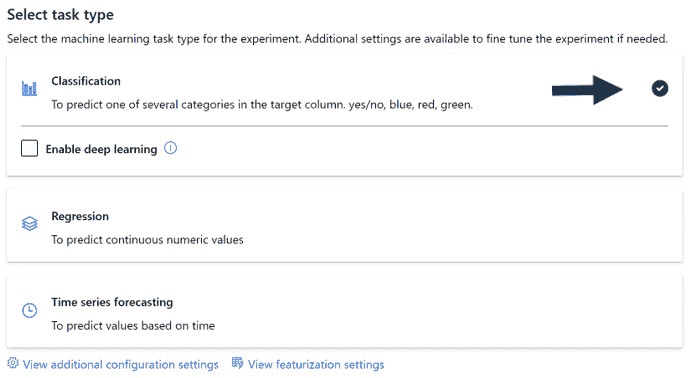

# 三、训练你的第一个自动化模型

有了 Azure 账户、Azure 机器学习工作区、计算集群，以及对 AutoML 如何工作的基本了解，你现在就可以训练你的第一个自动化机器学习模型了。这将是简单明了的:AutoML 是一个均衡器，即使新手也能在短短几分钟内创建高级模型，不管你的背景如何，在本章结束时你都会体会到它的威力。熟能生巧，这一章是你成为自动化从业者的第一步。

本章一开始，你将把数据从你的本地机器加载到你的 **Azure 机器学习工作室** ( **AML 工作室**)，只选择你需要训练的列。然后，您将继续使用指导用户界面来训练 AutoML 模型。训练完模型后，您将学习如何直接从 AMLS 门户解释您的结果。这不仅包括准确性、误报率和漏报率等标准指标，还包括让您的业务最终用户惊叹不已的可解释仪表板。最后，有一个提示和技巧部分，将有助于您在未来的项目。

在本章中，我们将讨论以下主题:

*   正在为 AutoML 将数据加载到 AMLS
*   创建 AutoML 解决方案
*   解释您的 AutoML 结果
*   解释您的 AutoML 模型
*   获得更好的自动化性能

# 技术要求

要学习本章内容，您需要具备以下条件:

*   访问互联网
*   网络浏览器，最好是谷歌 Chrome 或微软 Edge Chromium
*   Microsoft Azure 帐户
*   Azure 机器学习服务工作区

# 将数据加载到 AMLS 以用于 AutoML

正如您在第二章 、【Azure 机器学习服务入门中注册糖尿病开放数据集一样，您现在将使用 AMLS 注册一个公开可用的 Titanic 数据集。

然而，与糖尿病数据集不同的是，您将直接从桌面向门户加载数据。泰坦尼克号数据集保存着关于在臭名昭著的不幸航行中谁幸存谁死亡的信息。您将构建一个基于人口统计信息(如年龄和性别)以及机票信息(如乘客等级和机票价格)预测幸存者的模型:

1.  首先，您需要从 GitHub 存储库中下载 Titanic 数据。
2.  然后，你需要通过导航到 http://ml.azure.com[打开你的 **Azure 机器学习工作室**。](http://ml.azure.com)
3.  进入工作室后，点击工作室右侧**资产**下的**数据集**。
4.  Then, click **Create dataset** and select **From local files** from the drop-down menu as seen in *Figure 3.1*:

    图 3.1–从本地文件创建数据集

5.  在加载泰坦尼克号数据之前，你必须命名你的数据集。在**数据集名称**文本框中写入`Titanic Training Data`。与许多其他 Azure 资源不同，您可以在数据集名称中包含空格。
6.  Since the Titanic data contains columns and rows, select `Titanic data containing passenger demographic information and ticket information. We will use this data to model who survived the Titanic voyage`.

    一般来说，在数据集名称中包含项目名称和用途是个不错的主意，例如，*泰坦尼克号训练数据*或*泰坦尼克号评分数据*。在描述字段中，最好列出在数据中发现的信息类型，以及您试图解决的问题。请参考*图 3.2* 。

7.  Click **Next** at the bottom of the screen:

    图 3.2–命名和描述数据集

8.  现在，您将把您的 Titanic 数据加载到您的默认数据存储中。默认的数据存储指向用 Azure 机器学习工作空间创建的存储账户。通过单击适当的圆圈选择您的默认数据存储，如图*图 3.3* 所示。
9.  点击本地机器上的`titanic.csv`，然后点击**打开**。注意，它会告诉你文件加载到 Azure 后的大小。
10.  选择数据存储和文件后，您还可以确定数据存储上保存文件的路径。在标有`/titanic/train`的空白字段中。这将创建一个目录结构，其中包含一个名为`titanic`的文件夹，一个名为`train`的子文件夹，以及另一个以 UTC 格式显示当前日期和时间的文件夹。您也可以使用数据存储上的现有文件夹。请参见*图 3.3* 进行参考。
11.  Click **Next** at the bottom of the screen to advance:

    图 3.3–上传大量数据到你的数据库

12.  With your data loaded onto your datastore, it's now time to set up your dataset so that the file enters your Azure Machine Learning workspace correctly. Here, there are five options:

    a)从**文件格式**中，您可以选择分隔文件、拼花文件、文本文件或 JSON 文件。从下拉菜单中选择由**分隔的**。

    b)然后，在**分隔符**下选择合适的选项。因为这是一个 CSV，一个逗号分隔的值文件，从下拉菜单中选择**逗号**。请注意，每次您做出更改时，AMLS 都会在屏幕底部生成一个新的数据预览。

    c)你将很少需要改变**编码**，并且通常最好保持默认设置，在这种情况下， **UTF-8** 。

    d) **列标题**，另一方面，你总是想要指定。AMLS 默认**没有头文件**，但是你使用的大多数文件都会有。选择**使用第一个文件的标题**来导入您合适的列标题。

    e) **跳过行**当您导入文件顶部或底部有无关行的数据时，这是一个有用的选项。虽然 Titanic 数据缺少这些额外的行，但您通常会发现数据在最下面一行包含名称、日期或组织信息。

    移除这些额外的行很重要，否则当您尝试构建机器学习模型时，这将导致错误。请参见*图 3.4* 中的设置示例。

13.  Click **Next** to select only the appropriate columns for your dataset:

    图 3.4–为文件选择正确的设置

14.  有某些栏目不适合机器学习。虽然 AutoML 会自动为您删除大部分，但最好还是自己删除。要删除的列的类型按重要性排序如下:
    *   每行包含唯一值的列，如*姓名*、 *ID* 和*车票*
    *   空值过多的列，如*舱*
    *   不包含有用信息的列
    *   从目标列派生的列
15.  To remove these columns from your dataset, all you need to do is move the slider to the left, as shown in *Figure 3.5*. Remove **PassengerId**, **Name**, **Ticket**, and **Cabin**:

    注意

    从数据集中移除列时，数据存储上的文件不会改变。因此，您可以使来自同一文件的多个数据集指向不同的列。

    

    图 3.5–选择您的色谱柱

16.  从菜单，你也可以指定每一列的类型。共有五种:**字符串**、**布尔**、**整数**、**小数**、**日期**。布尔值用于有两个可能值的列，比如 0 或 1。将**幸存**改为**布尔**，将**年龄**改为**整数**。
17.  点击**下一个**。
18.  You are now presented with a confirmation screen. From this screen, you can see the name you assigned to your dataset and its description, the datastore, and the path in the datastore on which the base file is located, along with the file settings. Profiling the data is also possible from this screen, as shown in *Figure 3.6*.

    如果您选择分析您的数据，您将需要选择一个计算群集。这个选项将为您提供每一列的汇总统计数据，包括平均值、最小值、最大值、标准偏差、缺失值的数量、错误的数量和唯一值的数量。打开或关闭分析，然后单击下一个的**来创建您的数据集:**

图 3.6–确认数据集详细信息

您现在已经创建了一个可以在 AMLS 使用的数据集。有了它，你将建立一个机器学习模型，预测哪些乘客幸存，哪些乘客死亡。下一步是使用 AutoML 指导的用户界面来训练机器学习模型。

# 创建 AutoML 解决方案

现在您已经将大量数据加载到您的数据存储中，并将其注册为数据集，您已经准备好通过几次有指导的点击来训练 AutoML 模型:

1.  To get started, click **Automated ML** from the left-hand menu under **Author**. Then, click **New Automated ML run**, marked by a blue cross, near the top left of the new page, as shown in *Figure 3.7*:

    图 3.7–开始您的 AutoML 训练

2.  进入下一个屏幕后，您将看到所有符合训练条件的数据集。目前，只有表格数据集支持从 AutoML GUI 运行。您也可以通过点击**创建数据集**按钮从该视图创建一个新的数据集。选择**泰坦尼克号训练数据**，如图*图 3.8* 所示。
3.  Click **Next**:

    图 3.8–为训练选择数据集

    选择数据集后，接下来的步骤包括命名您的实验、选择要预测的列，以及选择用于远程训练的计算集群。请记住，**实验**会记录与您的跑步训练相关的所有信息。

4.  要创建新实验，选择`Titanic-Training`。实验名称中不允许有空格；唯一允许的特殊字符是破折号或下划线。
5.  接下来，从下拉菜单中选择您的**目标列**。你的目标列是你试图用你的机器学习模型预测的数字或类。在这种情况下，选择**躲过了**。
6.  同样，选择一个计算集群，AutoML 将在其上创建机器学习模型。从下拉菜单中选择您创建的任何计算集群。AutoML 将在这台计算机上远程运行，允许您继续在 AMLS 工作区上进行其他工作。
7.  Please confirm your settings using *Figure 3.9* for reference and click **Next** to advance to the final screen:

    重要提示

    在训练自动化机器学习模型时，选择正确的计算规模和类型非常重要。为了安全起见，计算集群上的 RAM 应该是数据集的 20 倍左右。使用深度学习算法时使用 GPU，其他一切使用 CPU。在您应该切换到基于 Spark 的解决方案之前，您可以在高达 10gb 的数据上训练 AutoML 模型。

    

    图 3.9–配置 AutoML 运行

    你只需点击几下鼠标就能创建你的 AutoML 模型。下一级菜单有三个选项:**分类**、**预测**、**回归**。**分类**是当你试图预测一个类别时用的，比如一个人是否有可能拖欠贷款或还贷。**回归**适用于当你试图预测一个数字而不是一个类时，例如，试图预测一个基于房屋的特征的价格，比如它的大小。**另一方面，预测**适用于你试图预测未来数字的时候。

8.  Since we are trying to predict whether or not a person survived the Titanic disaster, select **Classification**. A green checkmark will appear next to the box on the right-hand side, as seen in *Figure 3.10*:

    图 3.10–选择正确的任务类型

    有两组额外的设置可以配置——**额外配置设置**和**特色化设置**。**附加配置设置**允许您更改 AutoML 将使用哪些指标对算法进行评分，允许您阻止 AutoML 尝试某些算法，并允许您设置 AutoML 运行的总时间。

    **特征设置**允许您取消选择列，设置列类型，并决定 AutoML 如何处理每列的空值。更高级的数据科学家能够利用这些功能对 AutoML 如何处理缺失值以及 AutoML 如何表征数据集进行更细粒度的控制。

9.  导航至**查看附加配置设置**。
10.  Click `0.25`, as shown in *Figure 3.11*. If you accidentally set it to 15, your job will run for 15 hours before terminating:

    重要提示

    现在，坚持默认的度量和默认的验证机制，分别是**准确性**和**自动**。在后面的章节中，我们将深入探究 Azure 上 AutoML 支持的各种度量和验证机制。

    

    图 3.11–设置您的训练工作时间

11.  点击**保存**和**完成**，为接下来的 15 分钟找点事做。

您已经推出了您的第一个 AutoML 模型，并且很快就会有结果。

# 解读您的 AutoML 结果

您的训练运行应该花费大约 15 分钟，并生成一个准确率大约为 80%的模型。然而，您的结果不仅仅是这个简单的指标。有数据护栏会通知你数据的任何问题。对于这三种问题类型中的每一种，还有一系列不同的指标和附带的图表，可以帮助您向企业展示您的结果:

1.  To begin, click `Titanic-Training` experiment, as seen in *Figure 3.12*:

    图 3.12-检查您的结果

    您将进入一个屏幕，显示与您的模型相关的各种指标，包括用于训练最佳性能模型的算法类型、其准确度分数、创建日期和时间，以及您的 AutoML 运行执行了多长时间。利用屏幕右下角的**描述**区域，详细记录您的跑步记录。

2.  Click the pen icon and write `My first AutoML model`.

    你会注意到屏幕上方有六个标签:**详细信息**、**数据** **护栏**、**模型**、**输出+日志**、**子运行**和**快照**。为了解释结果，只有**数据护栏**和**模型**是重要的。

3.  点击**数据护栏**选项卡并读取结果。

## 了解数据护栏

**数据护栏**识别并纠正数据集中的任何问题，了解这些问题是什么非常重要。根据您是试图解决分类、回归还是预测问题，有不同的防护栏。分类问题使用以下内容:

*   **验证分割处理**:这个护栏查看你的数据集大小和你的列内的唯一值，以确定你的机器学习模型应该如何训练和验证。对于这个泰坦尼克号数据集，它将选择 10 重交叉验证。交叉验证以 10 种方式分割您的数据，根据 9 个部分训练模型，并对剩余部分的数据进行评分。这个过程重复 10 次，取平均值。
*   **类平衡检测**:该护栏查看您的目标列，以确定每个唯一值是否有足够的样本。根据泰坦尼克号的数据，这个护栏将会通过，因为有足够数量的幸存者和足够数量的死者来建立一个有效的模型。
*   `Age`列，并且它们填充了该列的含义。对于`Embarked`列也有两个空值，它们被填充了`--`，这是该列最常见的值。
*   **高基数特征检测**:这个护栏会查看你的分类列，看看是否有太多的唯一值，在这种情况下，它们将被入库。对于 Titanic 数据，这个护栏被通过，数据保持不变。

## 了解模型指标

探索完数据护栏后，下一步涉及解释您的模型:

1.  点击**数据护栏**选项卡旁边的**模型**。在此选项卡上，您将看到一个由 AutoML 生成的模型列表，该列表按准确性排序，得分最高的模型位于顶部。
2.  Click your highest-scoring model's name, as shown in *Figure 3.13*:

    图 3.13–导航到您的模型

    这将把你带到一个类似的屏幕，在顶部有一组新的选项卡。**指标**，顶部的第四个选项卡，不仅包含准确性，还包含与分类问题相关的所有其他指标和图表。你可以勾选或取消任何你想要的。有 20 多个复选框，但是，出于本练习的目的，我们将选中三个。

3.  检查**准确度**、**混淆 _ 矩阵**和**马修斯 _ 相关性**框。

**准确性**是一个简单的指标，很容易理解，它是你的 AutoML 运行用来建立和确定你的最佳模型。简单来说，就是在做预测时，你的模型有多大可能是正确的。我的情况是 83.84%。与行列式系统不同，机器学习模型不会完全相同，但你最好的模型应该相似。

马修斯相关系数是一个更加复杂的指标，它考虑到了不平衡的阶级 T2。它是真阳性率、假阳性率、真阴性率和假阴性率的组合，范围在-1 和 1 之间。

1 分意味着你的模型预测完美，而 0 分意味着你的模型是随机猜测。分数为-1 意味着你的模型每次都是完全错误的。我的分数是 0.6541，远低于我的准确度分数，如图 3.14 中的*所示。你的模型应该有相似的得分。这表明您的模型在识别这两个类中的一个方面可能要差得多。接下来你会看到，你的困惑矩阵证实了这一点:*

图 3.14-准确性和马修斯相关性

**混淆矩阵**是你的分类输出的视觉表示，集中在真的和假的肯定和否定上。虽然你的准确性很高，但你的马修斯相关系数很低，而混淆矩阵是你研究这种关系的完美工具。请参见*图 3.15* :

图 3.15-混淆矩阵

这个输出的意思是，我的模型已经正确识别了泰坦尼克号上的 509 个死亡案例和 238 个有人居住的案例。然而，该模型将 40 名死亡的人误认为幸存者，将 104 名死亡的人误认为幸存者。*图 3.16* 通过下拉框选择**归一化**显示相对百分比:

图 3.16-标准化混淆矩阵

在这里，我们可以看到真正的阴性率，即被正确分类为已死亡的死亡人数为 92.71%。存活但分类错误的假阴性率仅为 7.29%。这些分数确实很高。然而，真正的阳性率，即模型预测谁正确存活的能力，仅为 69.59%。同样，假阳性率为 30.41%。我们所拥有的是一个比预测幸存者更能预测灾难受害者的模型。

在**指标**选项卡下还有许多其他有用的指标和图表。试着勾选几个方框，研究它们的含义。您也可以从右边的下一个选项卡**输出+日志**中直接下载任何图表到您的计算机上。在**指标**选项卡下，你找不到一组有用的信息，这些信息与创建你的模型所使用的特性有关。这些数据可以在**解释**选项卡下找到，目前在预览中。

# 解释你的自动化模型

知道你的结果是重要的，但是知道你的模型如何得到它的结果对于使用机器学习是不可或缺的。这就是模型可解释性发挥关键作用的地方。**可解释性**是说在构建你的 AutoML 模型时哪些特性最重要的能力。这在你必须能够合法解释你的机器学习模型的行业中尤其重要，例如，如果你建立了一个模型来确定谁被批准贷款:

1.  首先，单击指标旁边的解释选项卡。
2.  单击屏幕右侧解释 ID 下的第一个 ID。
3.  单击“查看以前的仪表板体验”旁边的滑块按钮。
4.  Click Global Importance.

    您将立即看到您的列按重要性排序。`Sex`是最重要的一列，其次是`Pclass`和`Age`，如图 3.17 所示。重要性值为`1.1`，性的重要性大约是 Pclass 的两倍，得分为`0.59`。所有的值都是相对的。从这个图表中，你可以说性别是创建你的模型时最重要的特征。

    

    图 3.17-可解释性

    既然你可以解释你的整个模型，那么解释单个点也同样重要。

5.  To achieve this, click **Summary Importance** and select any individual data point.

    下面将出现一个图表，显示哪些特征对模型产生了负面或正面影响，以预测该个体是幸存还是死亡。*图 3.18* 显示了一名持有头等舱机票的男性的个人资料。请注意，他的性别对他的生存预测有负面影响，而他的阶级对前时代的预言有正面影响:

图 3.18-对一名持有头等舱机票的男性的解释

正如我们将在后面的章节中看到的，可解释性既可以通过这个仪表板接口访问，也可以通过 Python 编程访问。使用 Python，您可以将这些信息存储在数据库中，以便安全保存和方便检索。这样，你将能够解释你所有的机器学习预测，并为任何可能出现的法律挑战辩护。

构建并理解了一个 AutoML 模型后，您现在准备构建更多的模型。为了更有效地做到这一点，您可以做许多小的调整来提高性能。

# 获得更好的自动化性能

恭喜你！你已经建立了你的第一个模型，它表现得非常好。然而，你可以做很多小事来提高性能。毕竟，将来您会构建更多的模型，为了构建最好的模型，您需要知道所有的技巧和诀窍。以下是结束本章的提示和技巧列表:

*   额外的**特征工程**通常会提供更好的结果。特征工程只是意味着以某种方式转换数据，使机器学习算法更容易找到模式。例如，与仅使用价格和年龄作为数字列相比，将宁滨票价和年龄放入泰坦尼克号数据的桶中可能会为您提供更好的结果。
*   说到宁滨，你总是可以把一个回归问题转化成一个分类问题。例如，如果你试图预测一个人的平均寿命，你可以尝试预测一个数字范围而不是一个直线数字，比如 *60-65 岁，*而不是一个精确的数字。当 AutoML 没有返回很好的结果时，这是一个有用的策略。在给定相同数据集的情况下，分类问题比回归问题更容易解决，并且您通常可以为您的业务问题获得类似的价值。
*   启用深度学习通常会通过 AutoML 提供出色的结果，但这是以使用更多计算能力和时间为代价的。深度学习算法创建复杂的神经网络来进行预测，当您将文本数据作为输入特征时，它对 AutoML 尤其有用。不要使用基于 CPU 的计算集群，而是使用基于 GPU 的计算集群来获得必要的能力和性能。
*   AutoML 中的预测需要精心构建的数据集和对特定于预测的设置的敏锐理解。在使用 AutoML 创建预测解决方案之前，请仔细阅读 [*第 6 章*](B16595_06_ePub.xhtml#_idTextAnchor081) 、*构建 AutoML 预测解决方案*。
*   让您的 AutoML 作业运行更长的时间通常意味着更好的结果，但只是在一定程度上。尝试让它运行一段时间，并注意观察算法是否返回更好的结果。
*   AutoML 智能地调整其算法的参数，试图获得更高的分数。如果您注意到它一遍又一遍地尝试相同的算法，请记住这是预期的行为，它正在尝试找到该算法的最佳参数组合。
*   投票或堆栈组合很可能是你最好的模型，尽管很难向人们解释这些模型是如何工作的。如果你的最终用户需要知道你的模型背后的数学，你可以**将**的集合模型列入黑名单。虽然您目前还不能通过 AutoML GUI 做到这一点，但是通过代码来做到这一点是可能的。请参考 [*第 4 章*](B16595_04_ePub.xhtml#_idTextAnchor056) 、*构建自动回归解决方案*，了解关于将集成模型列入黑名单的更多详细信息。
*   在由小型虚拟机组成的计算集群上运行 AutoML 成本很低。在使用低内存虚拟机时，请随意进行试验。

# 总结

微软 Azure 自动化机器学习*的第 1 部分到此结束，你已经完成了很多！您了解了如何将文件从本地机器加载到数据存储中，并将其注册为数据集。您已经创建了您的第一个 AutoML 模型。你不仅可以用图表和指标解释模型的结果，还可以解释模型是如何做出预测的。最后，您学习了各种技巧和诀窍，这些技巧和诀窍将允许您微调您的模型。你已经向掌握 Azure 上的 AutoML 迈出了第一步。*

您旅程的下一部分将涉及大量 Python 编码。在 [*第四章*](B16595_04_ePub.xhtml#_idTextAnchor056) 、*构建 AutoML 回归解决方案*中，您将使用 **AzureML Python 软件开发工具包** ( **AzureML SDK** )构建一个回归模型。这个 SDK 是允许 Python 笔记本与 Azure 工作空间交互的命令集合。您将学习如何用 Python 编写 AutoML 脚本，并使用这些脚本创建预测数字的强大解决方案。