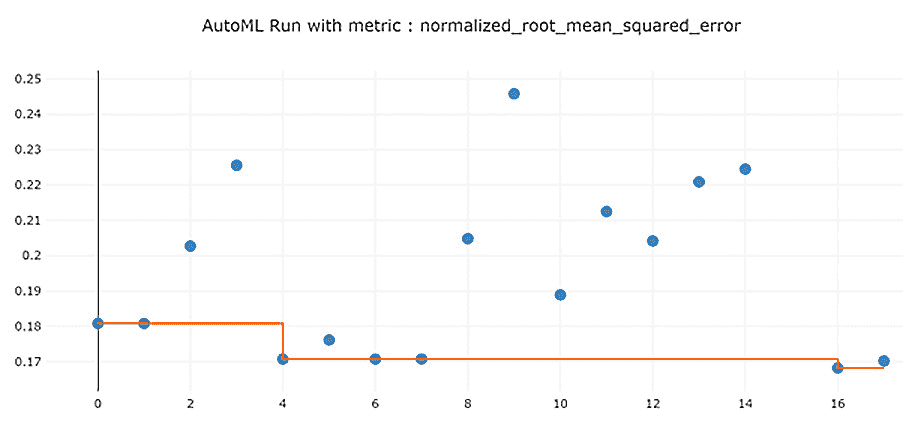
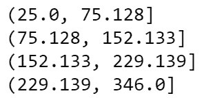

<title>B16595_04_ePub</title>

# 第四章:构建一个自动回归解决方案

通过构建一个具有 AutoML 指导用户界面的解决方案，你已经迈出了成为 Azure AutoML 专家的第一步。现在，是时候通过用 **Azure 机器学习 Python 软件开发工具包** ( **AzureML Python SDK** )创建一个解决方案来提升你的技能了。使用我们在 [*第 2 章*](B16595_02_ePub.xhtml#_idTextAnchor023) 、【Azure 机器学习服务入门中构建的糖尿病数据集，您将构建一个回归解决方案来预测一个人的糖尿病在过去一年中发展了多少。

本章开始时，您将从您的计算实例中打开一个 Jupyter 笔记本，这将允许您编写 Python 代码。首先，您将加载糖尿病数据。然后，您将训练一个 AutoML 模型，并将训练好的模型注册到您的 **Azure 机器学习服务(AMLS)** 工作区。您将通过使用易于重用的 Python 脚本来实现这一点。检查模型结果后，您将了解如何注册模型，以便针对各种特定于回归的指标进行优化，并微调您的解决方案以提高性能。

到本章结束时，你将完全掌握和了解 Azure AutoML 的回归功能，并能够使用自己的数据训练回归模型。

在本章中，我们将讨论以下主题:

*   为自动回归准备数据
*   训练自动回归模型
*   注册训练好的回归模型
*   微调您的自动回归模型

# 技术要求

以下是本章的先决条件:

*   访问互联网
*   网络浏览器，最好是谷歌 Chrome 或微软 Edge Chromium
*   Microsoft Azure 帐户
*   Azure 机器学习服务工作区
*   来自 [*的`titanic-compute-instance`计算实例第二章*](B16595_02_ePub.xhtml#_idTextAnchor023) ，【Azure 机器学习服务入门
*   来自 [*的`compute-cluster`计算集群第二章*](B16595_02_ePub.xhtml#_idTextAnchor023) ，【Azure 机器学习服务入门
*   来自 [*的`Diabetes Sample`数据集第二章*](B16595_02_ePub.xhtml#_idTextAnchor023) ，【Azure 机器学习服务入门

本章代码可在此处获得:[https://github . com/packt publishing/Automated-Machine-Learning-with-Microsoft-Azure/blob/master/Chapter 04/Chapter-4-AutoML-on-Azure . ipynb](https://github.com/PacktPublishing/Automated-Machine-Learning-with-Microsoft-Azure/blob/master/Chapter04/Chapter-4-AutoML-on-Azure.ipynb)。

# 为自动回归准备数据

在使用 AutoML 训练任何模型之前，必须有一个经过适当清理的数据集。本节将向您介绍如何为任何 AutoML 回归解决方案准备数据。首先，您将使用 compute 实例访问 Jupyter notebook，这是一个代码编辑器,允许您使用 Python 进行编码。接下来，您将清理、转换和注册您的数据作为 Azure 数据集。这将为您提供一个数据集，为下一部分的培训做好准备。

你们中的一些人可能不熟悉 Python，甚至不熟悉一般的编码，但是不要担心。虽然编写一个 AutoML 解决方案看起来比使用 *GUI* 要困难得多，但实际上，这只是对样板代码做一点小小的修改。

使用这本书的 GitHub 资源库中的代码，您只需稍微修改一下，就可以使用您自己的定制数据使它适应您自己的定制解决方案。此外，对于本练习，您已经完成了大部分先决条件。您已经准备好了您的**计算实例**、**计算集群**和**数据集**，并且您距离准备好训练自动回归解决方案只有几行代码了。

## 设置您的 Jupyter 环境

要自己写代码，必须打开 Jupyter 笔记本。Jupyter notebook 是一个环境，在这里你可以编写、编辑和运行 Python 代码。 **Python** 是一种通用的编程语言，在机器学习从业者中非常流行，并形成了 Azure 机器学习服务的基础。

以下步骤将教你如何通过 Azure 计算实例访问 Jupyter 笔记本环境。然后，您将学习如何在此环境中创建一个笔记本，以便编写 AutoML 回归解决方案:

1.  首先，通过导航到[http://ml.azure.com](http://ml.azure.com)打开 Azure Machine Learning Studio。
2.  一旦你进入工作室，点击工作室右侧**管理**下的**计算**。
3.  如果您的计算实例当前处于暂停状态，请选中`titanic-compute-instance`旁边的圆形复选框，然后单击**开始**按钮。
4.  Then, click **Jupyter** under **Application URI**, as shown in *Figure 4.1*:

    图 4.1–访问您的 Jupyter 环境

    一旦您访问了 Jupyter 环境，下一步就是创建一个 Jupyter 笔记本。您可以创建任意多的 Jupyter 笔记本，也可以使用这个环境上传和下载文件，创建文件夹结构，运行 Python 和 R 脚本。 **R** 是另一种受机器学习从业者欢迎的编程语言，但我们不会在本书中涉及。

5.  点击屏幕右上角的 **New** 进入下拉菜单。
6.  Select **Python 3.6 – AzureML** from the drop-down menu, as shown in the *Figure 4.2*:

    图 4.2–创建 Jupyter 笔记本

7.  点击屏幕左上角出现的新 Jupyter 笔记本；也就是`Untitled.ipynb`。
8.  在弹出的文本框中点击`Diabetes_Regression_AutoML`，将`Untitled.ipynb`重命名为`Diabetes_Regression_AutoML`，点击**重命名**，如图*图 4.3* 所示:


图 4.3-重命名 Jupyter 笔记本

通过创建并重命名 Jupyter 笔记本，您现在就可以开始用 Python 编码了。这也是一个逐步的、可重复的过程，其中主要由样板代码组成。**样板文件**指的是可以在项目间重用的代码，几乎不需要定制。因此，你可以在没有 Python 经验的情况下编写 Azure AutoML 脚本。

## 为 AutoML 准备数据

每个 AutoML 脚本都以完全相同的方式开始。首先，加载 Python 库。**库**仅仅是有用函数的集合，让你不用自己写复杂的代码就能完成复杂的任务。然后，您必须设置您的**工作区、数据存储、计算集群、**和**数据集**。一旦你做到了这一点，如果必要的话，操作你的数据，并保存到一个新的数据集。如果这不是必需的，那么在加载数据集之后，只需进入*训练自动回归模型*部分。

在下面的步骤中，您将加载从头到尾运行整个笔记本所需的所有必要的库。这些库足以运行本章的数据准备、模型训练和模型注册部分。然后，您将加载之前在第 2 章*【Azure 机器学习服务入门】中创建的糖尿病数据集[。加载数据后，您将在将其注册为新数据集之前进行一些轻微的数据转换。让我们开始吧:](B16595_02_ePub.xhtml#_idTextAnchor023)*

1.  Load in all the libraries you will need to run everything in this chapter by using the following code:

    ```
    from azureml.core import Workspace, Dataset, Datastore
    from azureml.core import Experiment
    from azureml.core.compute import ComputeTarget
    from azureml.train.automl import AutoMLConfig
    from azureml.train.automl.run import AutoMLRun
    from azureml.widgets import RunDetails
    ```

    `Workspace`让您连接到您的`Dataset`和`Datastore`让您访问您以前创建的数据集和数据存储，而`Experiment`让您记录您的 AutoML 的结果。

    `ComputeTarget`允许您使用计算集群运行 AutoML 作业。另一方面，`AutoMLConfig`使您能够配置您的跑步，而`AutoMLRun`是训练您的模型所必需的。最后，`RunDetails`让你实时跟踪你的工作。

2.  特别是在`pandas`中加载，对于查看数据集中的数据是必要的:

    ```
    import pandas as pd
    import numpy as np
    ```

3.  使用以下代码将您的 Jupyter 笔记本连接到您的 AMLS 工作区:

    ```
    ws = Workspace.from_config()
    ```

4.  通过使用下面的代码:

    ```
    compute_name = 'compute-cluster'
    compute_target = ComputeTarget(ws, compute_name)
    ```

    ，将您的计算集群设置为您在《Azure 机器学习服务入门第 2 章 *中创建的集群*
5.  使用以下代码设置您的数据存储。在本练习中，我们将使用`workspaceblobstore`和您的数据存储库名称:

    ```
    datastore = Datastore.get_default(ws)
    my_datastore_name = 'workspaceblobstore'
    my_datastore = Datastore.get(ws, my_datastore_name)
    ```

6.  Set your dataset by using the following code. Use the `Diabetes Sample` dataset you created in [*Chapter 2*](B16595_02_ePub.xhtml#_idTextAnchor023)*, Getting Started with Azure Machine Learning Service*, for this. You can reuse this code by replacing the name shown in the following code:

    ```
    dataset_name = "Diabetes Sample"
    dataset = Dataset.get_by_name(ws, dataset_name, 
    version='latest')
    ```

    重要说明

    对于此代码，您将始终需要使用数据集的最新版本。如果您希望使用数据集的早期版本，您可以用一个数字替换`'latest'`。

7.  View the first 10 rows of your data, as shown in the following screenshot, by using the following code:

    ```
    dataset.take(10).to_pandas_dataframe()
    ```

    无论何时查看数据，确保数据看起来正确是很重要的。验证这些列的名称是否与预期的相符。确保值是正确的类型，数字或字符串，并且值本身看起来合适。例如，如果您在`AGE`列中看到一个大于 120 的数字，那么您可能在数据集中遇到了问题。

    如果发现数据中有任何不一致的地方，在使用 AutoML 训练模型之前修复它们是很重要的。在应该是数字的列中保留字符串值会导致 AutoML 将这些列视为分类列。

    在某些情况下，这将导致较差的性能。同样，在数据中留下错误可能会导致模型无法做出准确的预测。正如老数据科学所说，“垃圾进来*，垃圾出去*总是检查你的数据，以确保它不是垃圾。

    输出应类似于*图 4.4* :

    

    图 4.4–查看数据集

8.  如果你想改变你的数据，使用 pandas 通过使用下面的代码把你的数据集转换成 pandas 数据框架来实现
9.  您可能想做的一件常见的事情是删除列。您应该删除从您试图预测的几乎包含所有空值的字段派生的任何列，或者在您处理新数据时将不可用的任何列。例如，如果不知道新患者的`Sex`和`Age`，可以使用熊猫`drop`函数，如下面的代码所示:

    ```
    df = dfRaw.drop(['AGE','SEX'], axis=1)
    ```

10.  重新注册更改后的数据，并为数据集指定一个新名称；也就是`Diabetes Sample Age/Sex Dropped`。使用下面的代码，您可以将修改后的 pandas 数据帧保存到您的数据存储中:

    ```
    Dataset.Tabular.register_pandas_dataframe(df, 
    datastore,
                                "Diabetes Sample Age/Sex 
    Dropped")
    ```

11.  另一个你可能想尝试的常见转换是宁滨。`Age`列成三个不同的组:18 岁以下的儿童、18 岁至 64 岁的成人和 64 岁以上的老年人。下面的代码说明了这一点:

    ```
    ageBins = [0, 18, 65, 200] 
    dfRaw['BinnedFares'] = pd.cut(titanic['Age'], ageBins)
    ```

12.  数据科学家也可以剔除异常值。`Age`列:

    ```
    AgeThreeSD = np.std(dfRaw.Age)*3
    AgeMean = np.mean(dfRaw.Age)
    print(round(AgeThreeSD + AgeMean)) # Prints Outlier 
    Threshold
    # Replace all values above Threshold with Threshold 
    Value
    dfRaw['Age'] = dfRaw['Age'].mask(dfRaw.Age > AgeMean, 
    AgeMean)
    ```

13.  最后一个常见的数据转换是基于分界点从数值列创建分类列。肥胖被定义为身体质量指数为 30 或更高。我们可以创建一个列`Obesity_Flag`，它包含一个`1`或`0`值，用下面的代码表示一个人是否肥胖:

    ```
    dfRaw['BMI'] = np.where(dfRaw['BMI'] > 30, 1,0)
    ```

14.  再次将修改后的数据保存到数据存储中，并使用下面的代码将其注册为名为`Diabetes Sample Full Transform`的数据集:

    ```
    Dataset.Tabular.register_pandas_dataframe(dfRaw,
     datastore,
                                "Diabetes Sample Full 
    Transform")
    ```

你在这一部分已经完成了很多。您的库已经被加载，您的工作空间已经被设置，并且您已经有了所有必要的编码资源来轻松地创建一个 AutoML 运行。此外，您有多个版本的糖尿病数据保存为不同的数据集，您将在下一节中使用这些数据集来训练三个 AutoML 模型。

# 训练自动回归模型

与设置 Jupyter 环境和准备数据相比，训练 AutoML 模型涉及的步骤更少。首先，你需要为你的**实验**起一个名字。请记住，实验会自动记录有关 AutoML 运行的信息。接下来，您需要设置您的**目标**列，这是您希望预测的列，以及其他一些设置。最后，您将使用 AutoML 训练一个模型，并实时观察结果。

在本节中，您将创建一个实验，配置特定于 AutoML 回归任务的各种参数和设置，并使用您在上一节中创建的数据集来训练三个 AutoML 回归模型。让我们开始吧:

1.  使用下面的代码设置`Experiment`并给它一个名称。AML studio 将在此存储您跑步的所有日志和指标:

    ```
    experiment_name = 'Diabetes-Sample-Regression'
    exp = Experiment(workspace=ws, name=experiment_name) 
    ```

2.  用下面的代码设置您的`Target`列。AutoML 将训练一个模型来预测此列的值，在本例中，是`Y`列:

    ```
    target_column = 'Y'
    ```

3.  Create a variable for your `task` using the following code. `task` is the type of AutoML model you are trying to train, and the options for this are regression, forecasting, and classification. For predicting numeric values that do not have a time element, enter `regression`:

    ```
    task = 'regression'
    ```

    重要说明

    如果你试图预测有时间元素的数据，使用*预测*，而不是*回归*。如果`date`是您的列之一，或者您试图根据当前情况预测未来值，请使用*预测*。

4.  Create a variable for your primary metric. This **primary metric** is how your model will be scored. You should use **normalized root mean squared error** here. This metric, referred to as **RSME**, takes the prediction and subtracts it from the actual value for each observation, squares it, and averages the score across all observations. The lower the score, the better your model. Other options for regression include **R2 score**, **Spearman correlation**, and **normalized mean absolute error**.

    以下代码创建一个变量，并将其设置为规范化 RMSE。此变量将在以后传递到您的 AutoML 配置设置中:

    ```
    primary_metric = 'normalized_root_mean_squared_error'
    ```

5.  Create a variable for `featurization`. You can set featurization to `auto` or `off`. If you set featurization to `auto`, you will have to drop high-cardinality features, impute null values, one-hot encode your data, and generate additional features yourself.

    除非你是数据科学家专家，并且喜欢自己做每件事，否则一定要将它设置为`auto`。以下代码还创建了一个新变量，您将把它传递到 AutoML 配置设置中:

    ```
    featurization = 'auto'
    ```

6.  To configure your AutoML, run the following code. Here, you will pass in your task, primary metric, featurization settings, compute target, dataset, and target column. You created all of these previously.

    您还必须传递实验将运行多长时间，如果模型的性能没有改善，它是否会提前停止，交叉验证的数量，以及您的实验是否会记录模型解释。`5`和`20`:

    ```
    config = AutoMLConfig(task=task,
                         primary_metric=primary_metric,
                         featurization=featurization,
                         compute_target=compute_target,
                         training_data=dataset,
                         label_column_name=target_column,
                         experiment_timeout_minutes=15,
                         enable_early_stopping=True,
                         n_cross_validations=5,
                         model_explainability=True)
    ```

7.  Train your model and watch the results in real time. The following code trains the AutoML model with your configuration settings and logs the results of the run to the experiment you created earlier.

    运行时，这段代码将允许您实时跟踪会话的进度。在这里，您可以观看 AutoML 检查数据的有效性，迭代训练模型，并选择最佳模型:

    ```
    AutoML_run = exp.submit(config, show_output = True)
    RunDetails(AutoML_run).show()
    ```

如果你做了所有正确的事情，你的 AutoML 运行将会开始，你可以坐下来，放松，看它训练模型。首先，你会看到它执行一个**数据护栏**检查，如图*图 4.5* 所示:


图 4.5–数据护栏检查

接下来，AutoML 将开始训练您的模型。你会注意到 AutoML 将训练不同的特性转换和算法的组合。在复制相同的特征变换/算法对的情况下，AutoML 测试该算法的不同超参数组合。随着它的运行，您将能够跟踪每个模型花费了多长时间来训练，它的得分如何，以及表现最好的模型的得分，如图*图 4.6* 所示:


图 4.6–AutoML 结果

请注意，AutoML 训练的模型并没有随着每次运行而逐渐变好。被训练的第一个模型具有归一化的 RMSE`0.1808`。第三个训练出来的模型的分数是`0.2027`。使用标准化的 RMSE，你的分数越低越好。

在实验的最后，最佳模型的得分为`0.1682`。当您运行模型时，您应该会看到类似但不精确的结果，这取决于 AutoML 训练的模型。虽然您可以在`PIPELINE`列下看到正在使用的模型和转换，但是超参数仍然是隐藏的，因为它们对于某些算法来说数量很大。

您还可以获得这些结果的可视化效果，如下图所示。给你足够的时间，你会发现 AutoML 变得越来越好。这是因为它遵循自己的内部逻辑，尝试不同的特征工程/算法对，直到它无法再找到更高性能的模型，在此基础上，AutoML 将完成两个集成算法并结束运行。

一般来说，要么使用`Diabetes Sample Age/Sex Dropped`数据集，另一个使用`Diabetes Sample Full Transform`数据集。

*图 4.7* 提供了结果的可视化:



图 4.7–可视化的 AutoML 结果

除了可以在 Jupyter 笔记本中找到的这两个图表之外，您还可以通过 AML studio 访问另外两个可视化效果。这些是**预测对比真实**图和你的**残差**直方图。*预测与真实*向您展示您的模型相对于理想模型的表现，而*残差*让您了解您的误差是否正态分布。

您可以通过以下步骤访问这些图表:

1.  导航至 AML studio 的首页。
2.  点击左侧面板上**资产**下的**型号**。
3.  点击`Diabetes-AllData-Regression-AutoML`。这是你训练的模型的名字。
4.  点击**运行 ID** 下的蓝色链接。它应该以 AutoML 开头，后跟一长串字母和数字。这是你实验的登录账号。
5.  点击**指标**。
6.  勾选**预测 _ 真实**和**残差**的复选框。

*预测与真实*向您展示您的预测与完美预测每个数据点的模型相比表现如何。横轴代表你的真实值，而纵轴代表你的预测值。同样，绿色虚线代表完美模型，而蓝色实线代表实际模型。在你的实际模型周围也有浅蓝色的边界，向你显示置信区间。置信区间估计模型在现实世界中的表现范围。请仔细检查*图 4.8* :


图 4.8-预测与真实图表

*残差*，另一方面，是一个直方图，它对你的误差值进行分类，并计算每个分类中数据点的数量。误差就是你的预测值与真实值的差距。例如，在*图 4.9* 中，我们可以看到大约有 100 个数据点的误差落在-38.5 和 0 之间，大约有 115 个数据点的误差落在 0 和 38.5 之间。

当检查这个图表时，你应该确定它是钟形的。如果你的图表不是钟形的，这个意味着某些事情导致了你的错误模式，你需要调查原因；通常，这意味着你遗漏了一个重要的变量:


图 4.9–残差

虽然你用 AutoML 训练了一个高性能的机器学习模型，但是你的工作还没有结束。最终，机器学习模型只有在你可以用它来预测新的数据点时才有用。毕竟过去的就过去了，商业价值永远在于未来的情况。

在这种情况下，你试图预测患者的结果，这样你就可以识别并先发制人地治疗疾病进展最快的患者。为此，您必须首先注册您的模型以供将来使用。我们将在下一节中讨论这一点。

# 注册您训练好的回归模型

AutoML 让您可以方便地注册已训练的模型以供将来使用。在 [*第 9 章*](B16595_09_ePub.xhtml#_idTextAnchor129) *中，实现一个批处理评分解决方案*，以及 [*第 11 章*](B16595_11_ePub.xhtml#_idTextAnchor172) *，实现一个实时评分解决方案*，您将创建将使用您的模型的批处理执行推理管道和实时评分端点。注册模型时，您可以添加标签和描述以便于跟踪。

一个特别有用的特性是能够根据除了用来给模型评分的指标之外的指标来注册模型。因此，即使您使用归一化 RMSE 来训练模型，您也可以注册具有最佳 R2 分数的模型，即使该模型是不同的。

在本节中，您将为您的模型编写一个简单的描述，标记它，并给它一个名称。之后，您将把模型注册到您的 AMLS 工作区。它还包含允许您基于其他指标注册不同模型的代码。让我们开始吧:

1.  首先，给你的模型一个名字，一个描述，和一些标签。`tags`如您所愿，您可以随意详细描述:

    ```
    description = 'Best AutoML Regression Run using 
    Diabetes Sample Data. This model requires the Age and 
    Sex Columns.' 
    tags = {'project' : "Diabetes", "creator" : "your 
    name"} 
    model_name = 'Diabetes-AllData-Regression-AutoML' 
    ```

2.  Next, register your model to your AMLS workspace, passing in your model's name, tags, and description. Use the `AutoML_run` process you trained in the previous section:

    ```
    AutoML_run.register_model(model_name=model_name, 
    description=description, tags=tags)
    ```

    重要说明

    如果自您训练 AutoML 模型以来已经过去了一段时间，您可以通过使用此 ID 找到它的`AutoML_run`来检索它，如下所示:

    `experiment_name = 'Diabetes-Sample-Regression'`

    `exp = Experiment(workspace=ws, name=experiment_name)`

    `AutoML_run = AutoMLRun(experiment = exp, run_id = 'your_run_id')`

3.  尝试根据 R2 分数注册不同的型号。给它一个稍微不同的名字，添加一个额外的标签，并使用相同的描述:

    ```
    description = 'Best AutoML Regression Run using \
    Diabetes Sample Data. This model requires the Age and \
    Sex Columns.' 
    tags = {'project' : "Diabetes", "creator" : "your 
    name", "metric" : "R2"} 
    model_name = 'Diabetes-AllData-Regression-AutoML-R2' 
    AutoML_run.register_model(model_name=model_name, 
    description=description, tags=tags, metric = 
    'r2_score')
    ```

至此，您的模型已经注册并可以使用了。您已经创建了一个回归模型，该模型可用于根据患者的性别、年龄、血压、身体质量指数和六项血清测量值来确定患者在一年内糖尿病可能会如何发展。尝试使用您在本章中创建的其他数据集注册您已训练的其他 AutoML 模型。给它们适当的标签、名称和描述，以区分它们。

强调好的标记策略和健壮描述的重要性是很重要的。当你在做一个机器学习项目时，这没什么大不了的，因为你会记得你训练了哪些模型，以及你用什么数据集来训练它们。然而，随着你转向其他项目和久而久之，你的记忆变得越来越不可靠。如果你没有好的标签，定位你的模型就变得困难了。

正确的标记策略将包括项目名称、项目创建者、模型被训练的度量、模型被训练的数据集以及关于模型的其他相关信息。不需要包含版本号，因为 AutoML 会自动包含一个版本号。如果您使用相同的名称注册不同的模型，将会注册模型的新版本，并且仍然可以通过指定其版本号来访问旧版本。

一旦您注册了几个不同的模型，尝试使用下面的代码访问一个模型:

```
model = Model(ws,' 'Diabetes-AllData-Regression-AutoML-R2')
```

现在，你知道如何注册和调用你用 AutoML 训练过的模型。完成这些后，我们可以继续看一些提示和技巧，它们会在你将来训练回归模型时改进你的回归模型。

# 微调您的自动回归模型

在本节中，您将首先回顾改进 AutoML 回归模型的技巧和诀窍，然后回顾 AutoML 用于回归的算法。

## 改进自回归模型

虽然 AutoML 将为您处理大多数复杂的数据转换和特征工程，但您可以遵循一些提示来提高模型的准确性。这些提示中的一些适用于所有三个 AutoML 任务——*回归*、*分类*和*预测*——而其他的则是回归特有的。遵循它们将产生更高性能的模型，更重要的是，磨练你对机器学习技术的理解。我在这里列出了一些提示和技巧，以供快速参考:

*   Fill in null values before passing them on to AutoML. Alternatively, drop any rows that contain a null value. Just because AutoML will automatically fill your null values does not mean that it will do a great job.

    在某些情况下，用列的平均值填充空值是合适的。例如，如果您遗漏了一个项目的价格，那么平均价格很可能会接近遗漏的价值。对于噪音较大的列，深入思考应该如何填充缺失的值，或者是否应该包含这些数据点。下面是一些将为您填充空值的 Python 代码:

    ```
    mean_age = dfRaw.AGE.mean()
    dfRaw.AGE = dfRaw.AGE.fillna(value=meanAge)
    ```

*   熟悉所有不同的 AutoML 配置选项。可以在这个链接找到:[https://docs . Microsoft . com/en-us/python/API/azure ml-train-automl-client/azure ml . train . automl . automlconfig . automlconfig？view=azure-ml-py](https://docs.microsoft.com/en-us/python/api/azureml-train-automl-client/azureml.train.automl.automlconfig.automlconfig?view=azure-ml-py) 。
*   Use `y_min` and `y_max` to take care of any outliers in your `Target` column. If you have values that are outliers, such as values that are `3` or more standard deviations away from the mean value of your `Target` column, setting `y_min` and `y_max` to `3` standard deviations below and above your mean, respectively, can yield better performing models. This only applies to regression models.

    以下代码计算`Target`列的平均值和标准偏差，并使用它们来设置`y_min`和`y_max`:

    ```
    TargetSD = np.std(dfRaw.Y)*3
    TargetMean = np.mean(dfRaw.Y)
    y_min = TargetMean – TargetSD
    y_max = TargetMean + TargetSD
    ```

*   研究四个不同的主要指标，了解哪些指标最适合您的问题。标准化的 RMSE 将满足大多数回归问题，但许多研究论文存在使用其他指标的利弊。
*   使用[https://docs . Microsoft . com/en-us/azure/machine-learning/how-to-understand-automated-ml](https://docs.microsoft.com/en-us/azure/machine-learning/how-to-understand-automated-ml)来了解一个好的回归模型是什么样子的。一个好的模型会有无偏的残差，这意味着你的模型过度预测和预测不足是一样的。一个好的模型也将更加符合图 4.8 所示的*预测与真实* gra ph 中的理想线。
*   转到 AML studio 中**资产**下的**实验**，单击您的实验名称，选择您的运行 ID，单击**模型**选项卡，选择性能最高的算法，然后单击**指标**选项卡。这将为您提供评估您的算法所需的所有不同的指标和图表。
*   You can use the `weight_column_name` configuration option to assign a weight column to your dataset. If some observations are more important to get right than others, assign a higher weight to those observations.

    例如，您可以将权重 2 分配给重要观察，而将权重 1 分配给普通观察，这样重要观察的权重就增加了一倍。例如，如果您正在构建一个预测工厂用电量的算法，您可能希望高峰使用时间更长。

*   支持更长的实验运行时间，以获得更高性能的模型。有时，这使 AutoML 能够为其训练的模型找到更好的超参数。其他时候，增加运行时间不会有太大帮助，但总是值得一试。
*   If AutoML does not provide a satisfactory model, try adding more data. You can add either more historical data (more rows) or additional information (more columns). Be careful not to add too many columns to a very small dataset, however, as this can lead to overfitting.

    **过度拟合**是指你产生一个非常好的模型，而不是推广到新的数据点。如果您遇到这种情况，请尝试添加更多历史数据或从数据集中删除列。

*   In the end, if, after applying all of these tips and tricks, your model is still unsatisfactory, try changing your regression problem to a classification problem. Generally, classification problems are easier to solve than regression problems. The way you achieve this is by binning your target column.

    你的算法将尝试预测一系列数字，而不是试图预测一个特定的数字。要让这种方法奏效，你必须有创造性。例如，对于`Diabetes Sample`数据集，尝试使用以下代码宁滨`Target`列:

    ```
    ySD = np.std(dfRaw.Y)
    yMean = np.mean(dfRaw.Y)
    yMin = np.min(dfRaw.Y)
    yMax = np.max(dfRaw.Y)
    low = yMean - ySD
    high = yMean + ySD
    yBins = [yMin, low, yMean, high, yMax] 
    dfRaw['BinnedY'] = pd.cut(dfRaw['Y'], yBins)
    ```

每当您使用将回归问题转化为分类问题的技巧时，请记住结果目标列必须是有意义的。在下面的屏幕截图中，我们可以看到`Target`列的值表示疾病在患者中的发展程度。

如果在四个不同的箱之间存在实质性的、有意义的差异，那么这是解决问题的有效方法。但是，如果每个箱中的患者在医疗结果方面没有差异，那么您应该对数据进行箱处理，以确保患者被正确地集中在一起。

在*图 4.10* 中，我们可以看到`Target`栏中的值表示患者的疾病进展程度:



图 4.10-宁滨糖尿病数据的结果

现在，您已经熟悉了数据科学家用来实现更高性能模型和解决业务问题的许多小技巧。这个列表并不详尽，随着您使用 AutoML 构建更多的模型，您将会遇到更多的技术。任何时候你发现一些有趣的方法来提高你的模型的性能，重要的是把它写在某个地方，并把代码存储在一个存储库中。

每当你遇到一个似乎不可能解决的难题时，重读本节中的所有提示，然后搜索你的知识库。大多数时候，通过正确的数据和正确的转换，AutoML 将能够生成与大多数数据科学家不相上下的解决方案。其他时候就是微调设置的问题。有时候，你唯一能做的就是试着把你的回归问题变成分类问题，然后再试一次。

帮助你更有效地使用 AutoML 的最后一件事是理解该技术背后的算法。

## 了解自动回归算法

AutoML 使用了许多最先进的机器学习算法。虽然使用 AutoML 并不一定要理解它们，但是学习更多关于它们的知识将有助于你成为一名数据科学家。某些算法在某些情况下表现更好。此外，您可以将算法大致分为五组。

**标准回归算法**是那些为解释变量分配系数以预测目标列的算法。AutoML 使用了其中的两种技术:**弹性网**和**拉尔斯** ( **最小角度回归** ) **套索**。

弹性网络使用 L1 和 L2 正则化技术训练回归模型。 **L1** ，也叫**拉索**，把不太重要的变量上的系数降低到 0，而 **L2** ，叫**山脊**，降低不太重要的变量的系数值。弹性网络结合了这两种技术来创建更简单的模型，更容易解释，同时不会像套索回归那样丢弃太多变量。LARS lasso 是一种用于具有大量列的数据的技术，它迭代地使用最重要的列，但是对于有噪声的数据表现不佳。

**树算法**根据一系列 if-then 决策规则分割数据，产生一个类似分支树的映射。沿着树往下走，算法最终会根据它创建的一系列规则预测一个值。AutoML 使用这些技术中的三种:

*   **决策树**是一种简单的算法，易于解释，但容易过度拟合，在训练数据上表现良好，但代价是推广到新数据。
*   **随机森林**创建一个决策树集合，并将它们平均在一起。每棵树都是从训练集的随机样本中创建的，并且随机选择列来创建决策规则。
*   **极度随机化的树**更进了一步，它还随机化了被选择来进行分割的值。当推广到新数据时，这种随机性减少了模型的方差，从而创建了更好的模型。

**梯度推进算法**通过将许多表现不佳的决策树模型(称为**弱学习器**)组合在一起工作。这些算法首先创建一个弱学习器，寻找它表现不好的数据点，并在该数据子集上创建另一个弱学习器。重复这个过程，直到达到某个阈值。AutoML 使用这些算法中的三种: **XGBoost** 、 **LightGBM** 和**梯度增强**。这三种方法的工作原理相似，都是根据它们的高性能选择的，但是必须仔细调整以避免过度拟合。

**最近邻算法**的工作原理是查看每一行数据，计算相似数据点的平均值，称为最近邻。k-最近邻是 AutoML 使用的唯一类型的最近邻算法。k 是指算法在进行预测时检查的最近邻的数量。当数据的列数很少时，KNN 工作得很好，因为当您使用许多列来预测目标列时，它往往会溢出。

**优化算法**是那些迭代最小化目标函数以试图收敛于最佳预测的算法。AutoML 使用其中的三种:**随机梯度下降** ( **SGD** )、**在线梯度下降回归器**和**快速线性回归器**。这些算法中的每一个都是通过找到每一列的目标函数的斜率来工作的，并且通过调整权重沿着斜率向下工作，直到它尽可能地接近 0。

这是一个非常缓慢的过程，SGD 通过沿着斜坡随机选取数据点来尽可能快地达到最小值；在线梯度下降回归器工作类似，但具有不同的权重选项。快速线性回归器使用一种新的最先进的优化技术，称为**随机对偶坐标上升** ( **SDCA** )，它优化双损失函数，而不是像其他算法那样优化单损失。

图 4.11 总结了 12 种算法。


图 4.11–自动回归算法

除了前面的 12 种算法，AutoML 还在每次 AutoML 训练运行结束时执行**模型集合**。模型集成是将多个机器学习模型的预测一起使用来进行预测。AutoML 使用两种组装技术:投票和堆叠。

**投票集合**对你的回归模型进行加权平均，并用它来做预测。**堆栈集成**，相反，使用其他模型的输出来训练弹性网络模型。AutoML 将在每次训练运行中训练一个投票集合和一个堆栈集合。通常，这两个整体模型中的一个将是你表现最好的模型。

有关这些模型的更多信息，请参考位于[https://docs . Microsoft . com/en-us/azure/machine-learning/how-to-configure-auto-train # configure-your-experiment-settings](https://docs.microsoft.com/en-us/azure/machine-learning/how-to-configure-auto-train#configure-your-experiment-settings)的 AutoML 文档

# 总结

通过这一章，你已经成功地使用 AzureML Python SDK 构建了一个回归模型。无论您是 Python 新手还是专家，您都已经加载了数据，使用 pandas 对其进行了广泛的转换，并使用 AutoML 构建了一个有用的机器学习模型。然后，您将模型注册到 AMLS 工作区。在以后的章节中，您将使用相同的模型来创建推理管道和使用 REST APIs 的实时评分端点。

通过完成本章的所有练习，你已经掌握了 Azure AutoML 回归解决方案。现在，您可以获取任何一组对预测数字有用的数据，并使用它来创建高性能的机器学习模型。此外，您可以用 Python 编写所有这些代码，如果模型无法执行，您知道许多提高性能的小方法，或者，如果最坏的情况发生，将您的回归问题转换为分类问题。

在 [*第五章*](B16595_05_ePub.xhtml#_idTextAnchor068) 、*构建 AutoML 分类解决方案*中，你将学习如何使用 AutoML 解决这些分类问题，然后构建一个预测类别而不是数字的机器学习模型。