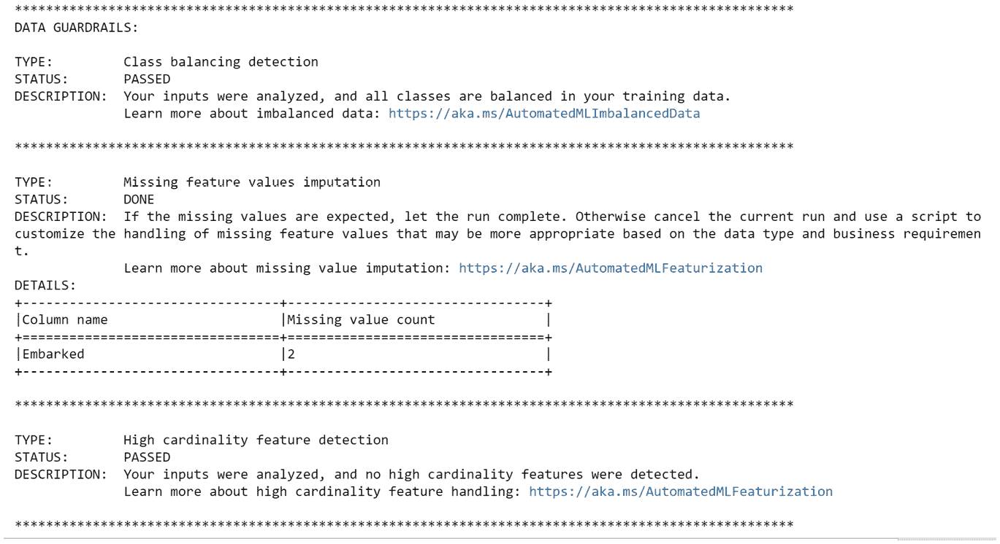
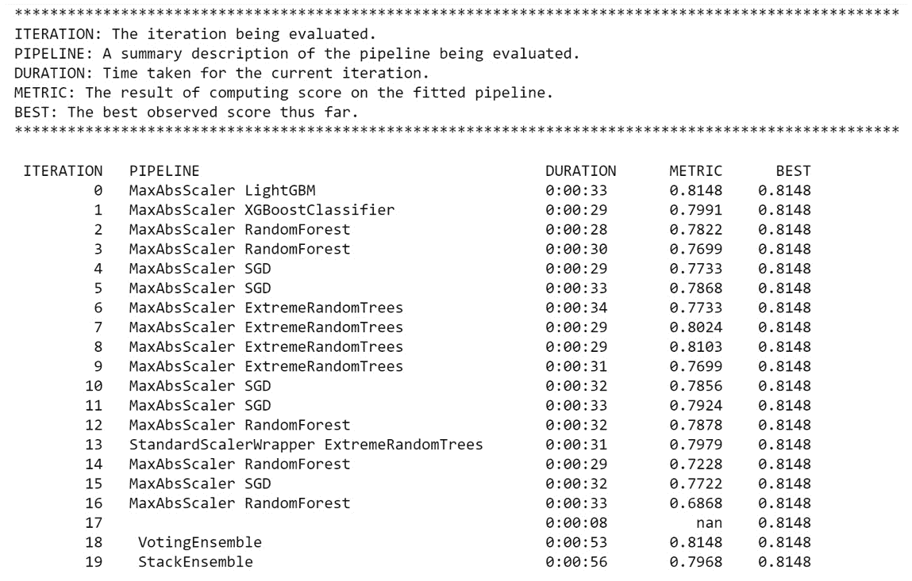
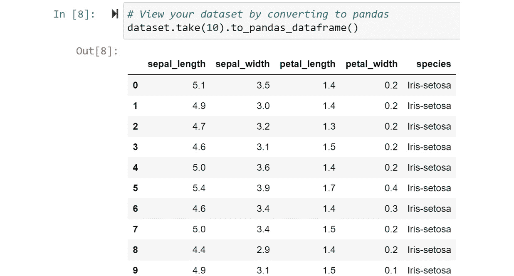

# 五、构建自动分类解决方案

在 [*第四章*](B16595_04_ePub.xhtml#_idTextAnchor056) *用 Python 构建了你的 AutoML 回归解决方案之后，构建一个 AutoML 回归解决方案*，你应该对自己的编码能力充满信心。在本章中，您将构建一个分类解决方案。与回归不同，**分类**用于预测感兴趣对象的类别。例如，如果你试图预测谁可能在未来五年内成为房主，分类是正确的机器学习方法。

**二元分类**是当你试图预测两个类别时，比如是否有房，而**多类别分类**涉及试图预测三个或更多类别，比如有房、租房或与家人同住。你可以在 Azure AutoML 中利用这两种技术，本章将教你如何使用不同的数据集训练这两种模型。

在本章中，您将像在第四章 *中所做的那样，直接导航到 Jupyter 环境，构建一个 AutoML 回归解决方案*。然后，你将载入你在第三章 *中用来建立模型的相同的数据，训练你的第一个 AutoML 模型*。重新训练一个相同的模型会很无聊，所以您将通过添加几个派生列来丰富数据集。

一旦你完成了这些，你将训练、检查和注册你的二进制分类模型。然后，您将使用流行的、公开可用的 Iris 数据集训练一个多类分类模型，该模型将根据单个植物的尺寸来预测其花的类型。你将通过学习一些关于如何微调分类模型的技巧和诀窍来结束这一章。请密切关注，因为即使是经验丰富的数据科学家也无法修改他们的分类模型，以与手头的业务问题保持一致。

到本章结束时，你将能够轻松地独立构建所有类型的分类模型，而不管你以前的机器学习经验如何。

在本章中，我们将讨论以下主题:

*   为自动分类准备数据
*   训练自动分类模型
*   注册您训练过的分类模型
*   训练 AutoML 多类模型
*   微调您的 AutoML 分类模型

# 技术要求

对于这一章，你将通过 **Azure 机器学习** ( **AML** ) **工作室**在 Jupyter 笔记本上用 Python 代码构建模型。此外，您将使用您应该在前面章节中创建的数据集和 Azure 资源。因此，要求的完整列表如下:

*   访问互联网
*   网络浏览器，最好是谷歌 Chrome 或微软 Edge Chromium
*   Microsoft Azure 帐户
*   一个 **Azure 机器学习**工作空间
*   《Azure 机器学习入门》 [*第二章*](B16595_02_ePub.xhtml#_idTextAnchor023)中创建的`titanic-compute-instance`计算实例
*   在 [*第二章*](B16595_02_ePub.xhtml#_idTextAnchor023) *中创建的`compute-cluster`计算集群，Azure 机器学习入门*
*   来自 [*的`Titanic Training Data`数据集第三章*](B16595_03_ePub.xhtml#_idTextAnchor044) *，训练你的第一个 AutoML 模型*
*   了解如何从 Azure 计算实例导航到 Jupyter 环境，如第 4 章 *中的 [*所示，构建自动回归解决方案*](B16595_04_ePub.xhtml#_idTextAnchor056)*

# 为自动分类准备数据

分类，或者说根据属性预测事物的类别，是机器学习的关键技术之一。就像回归一样，在用 AutoML 训练数据之前，首先需要准备数据。在本节中，您将首先导航到您的 Jupyter 笔记本，加载您的数据，并转换它以用于 AutoML。

正如您通过 Jupyter 笔记本加载到`Diabetes Sample`数据集进行回归一样，您将对`Titanic Training Data`数据集进行同样的操作。然而，这一次您将在训练 AutoML 模型之前进行更广泛的数据转换。这是建立在你的学习之上的；分类数据集不一定比回归数据集需要更多的转换。与前一章相同，您将从从您的计算实例打开一个 Jupyter 笔记本开始。

## 导航到您的 Jupyter 环境

与第 4 章 *的类似，构建一个自动回归解决方案*，您将开始创建一个新的 Jupyter 笔记本，用于创建您的分类模型，如下所示:

1.  首先，通过导航到[http://ml.azure.com](http://ml.azure.com)打开 AML studio。
2.  一旦你进入工作室，点击**管理**下工作室右侧的**计算**。
3.  如果您的计算实例当前处于暂停状态，请选中`titanic-compute-instance`旁边的圆形复选框，然后单击**开始**按钮。
4.  Then, click **Jupyter** under **Application URL** as seen in the following screenshot:

    图 5.1–访问您的 Jupyter 环境

    您应该看到您之前创建的`Diabetes_Regression_AutoML`笔记本。每次创建 Jupyter 笔记本时，即使您或其他用户从不同的计算实例访问 Jupyter，它也将保留在您的 AMLS 工作区中。在此空间中，您可以随意创建任意数量的笔记本，并仔细命名，以便您可以轻松跟踪不同的项目。

5.  点击屏幕右上角的 **New** 进入下拉菜单。
6.  从下拉菜单中选择**Python 3.6–azure ml**。
7.  点击出现在屏幕左上角的新 Jupyter 笔记本`Untitled.ipynb`。
8.  在弹出的文本框中点击`Titanic_Classification_AutoML`，将`Untitled.ipynb`重命名为`Titanic Classification_AutoML`，点击**重命名**，如下图所示:


图 5.2-重命名 Jupyter 笔记本

随着笔记本的创建，您现在可以加载您的数据了。

## 加载和转换您的数据

所有的 AutoML 解决方案使用大致相同的样板代码。如果你完成了 [*第四章*](B16595_04_ePub.xhtml#_idTextAnchor056) *，构建一个自动回归解决方案*，开始一个单元一个单元地复制你的代码。这样做之后，只需一步一步地遵循说明，并在必要时修改代码。如果你直接跳到这一章，你将不得不从头开始编码。

与之前一样，您将加载 Python 库并设置工作空间、数据存储、计算集群和数据集。然后，您将按如下方式转换和注册丰富的数据:

1.  加载运行所有代码所需的所有库。参考 [*第 4 章*](B16595_04_ePub.xhtml#_idTextAnchor056) *，构建 AutoML 回归解决方案*，获得所有这些包的详细解释:

    ```
    from azureml.core import Workspace, Dataset, Datastore
    from azureml.core import Experiment
    from azureml.core.compute import ComputeTarget
    from azureml.train.automl import AutoMLConfig
    from azureml.train.automl.run import AutoMLRun
    from azureml.widgets import RunDetails
    ```

2.  载入`pandas`和`numpy`。这些是帮助你转换数据的流行 Python 包。特别是`pandas`，查看数据集中的数据是必不可少的:

    ```
    import pandas as pd
    import numpy as np
    ```

3.  将您的 Jupyter 笔记本连接到您的 AMLS 工作区:

    ```
    ws = Workspace.from_config()
    ```

4.  设置您的计算机集群:

    ```
    compute_name = 'compute-cluster'
    compute_target = ComputeTarget(ws, compute_name)
    ```

5.  设置您的`datastore`。在本练习中，我们将使用您的 AMLS 工作区附带的默认数据存储。如果您想要使用不同的数据存储，您可以替换名称:

    ```
    datastore = Datastore.get_default(ws)
    my_datastore_name = 'workspaceblobstore'
    my_datastore = Datastore.get(ws, my_datastore_name)
    ```

6.  Set your `dataset`:

    ```
    dataset_name = "Titanic Training Data"
    dataset = Dataset.get_by_name(ws, dataset_name, version='latest')
    ```

    注意

    *步骤 6* 是第一个地方，在这里你应该修改你的代码。每次你在 Azure 中创建一个新的分类或回归 AutoML 解决方案时，使用这个模板。

7.  The following is the code to view the first 10 rows of data. Make sure that it looks correct:

    ```
    dataset.take(10).to_pandas_dataframe()
    ```

    前 10 行应该如下所示:

    

    图 5.3–查看泰坦尼克号数据集

8.  将你的数据集转换成列`Age`。很有可能乘客的年龄会因`Sex`等其他栏目而异。与其用整个`Age`列的平均值替换这些空值，不如用按性别划分的平均年龄替换它们。
9.  Calculate the mean age of women and men in your `Titanic` dataset:

    ```
    dfRaw = dataset.to_pandas_dataframe()
    round(dfRaw.groupby(['Sex'])['Age'].mean())
    ```

    这个代码会告诉你女性的平均年龄是 28 岁，男性的平均年龄是 31 岁。您将在下一个单元格中使用这些数字。

10.  Replace null values in the `Age` column with the appropriate number for each gender using this conditional Python code:

    ```
    dfRaw['Age'] = dfRaw.apply(
       lambda row: 31 if np.isnan(row['Age'])\
        and row['Sex']=='male'\
        else (28 if np.isnan(row['Age'])\
              and row['Sex']=='female'\
        else row['Age']),axis=1)
    ```

    另一种常见转换是绑定数字数据。**宁滨**数字数据意味着从单个数字列创建多个分类列，例如，将年龄列拆分成年龄范围。当您怀疑数字的范围比绝对数字更重要时，您应该对数字数据进行分类。

    例如，如果你怀疑一个人是年轻还是年老关系到他们是否在泰坦尼克号上幸存，而不是他们的确切年龄，你应该将数据分组。AutoML 不会自动为您绑定数据，但是一些算法，例如决策树，不需要宁滨就可以达到类似的效果。

11.  Bin the `Age` column into four different age groups: Under 15, 15-35, 35-60, and over 60:

    ```
    dfRaw['BinUnder15'] = np.where(dfRaw.Age < 15,1,0)
    dfRaw['Bin15to34'] = np.where((dfRaw.Age>14)\
                                & (dfRaw.Age < 35),1,0)
    dfRaw['Bin35to60'] = np.where((dfRaw.Age>34)\
                                & (dfRaw.Age < 61),1,0)
    dfRaw['BinOver60'] = np.where(dfRaw.Age > 60,1,0)
    ```

    你可以尝试不同的年龄组合，如果喜欢的话。

12.  既然您已经将`Age`列入库，那么就删除它。这将是您的最终数据帧:

    ```
    df = dfRaw.drop(['Age'],axis=1)
    ```

13.  Reregister your altered data and give the dataset a new name, `Titanic Transformed`. This will save your transformed pandas DataFrame to your datastore, creating a new file on disk:

    ```
    Dataset.Tabular.register_pandas_dataframe(df, datastore,
                                "Titanic Transformed")
    ```

    您可能会得到一个警告，提示`register_pandas_dataframe`是一个实验性的方法，因为它是 AML SDK 的一个新特性。您可以安全地忽略此警告。

如果您是 Python 的新手，这些代码中的一些会让您困惑，这没关系。您会发现学习`pandas`和`numpy`库有很大的价值，因为它们是两个最流行的数据转换包。每次你学习一个新的`pandas`或`numpy`函数，保存一个例子到你的个人代码库中以备后用。然而，即使你从未成为 Python 专家，你仍然能够使用 Azure AutoML 来交付一个伟大的模型。然而，Python 专家仍然能够通过仔细、细致和精明的数据转换来交付最佳模型。

现在，您可以使用您的 Titanic 数据集训练另一个模型了。在智能地填充空值和宁滨`Age`列之间，你可能期望产生一个优于你在 [*第 3 章*](B16595_03_ePub.xhtml#_idTextAnchor044) *中构建的模型，训练你的第一个 AutoML 模型*。我们来看看是不是这样。

# 训练一个自动分类模型

训练一个 AutoML 分类模型与训练一个 AutoML 回归模型非常相似，但是有一些关键的区别。在 [*第 4 章*](B16595_04_ePub.xhtml#_idTextAnchor056) *中，构建一个 AutoML 回归解决方案*，你开始为你的实验设置一个名字。之后，设置目标列，然后设置 AutoML 配置。最后，您使用 AutoML 来训练模型，执行数据护栏检查，并产生结果。

本节中的所有步骤几乎都是相同的。但是，请密切注意数据护栏检查和结果，因为它们在训练分类模型时有很大的不同:

1.  设置你的`experiment`并给它一个名字:

    ```
    experiment_name = 'Titanic-Transformed-Classification'
    exp = Experiment(workspace=ws, name=experiment_name) 
    ```

2.  将您的`dataset`设置为您转换后的`Titanic`数据:

    ```
    dataset_name = "Titanic Transformed"
    dataset = Dataset.get_by_name(ws, dataset_name, version='latest')
    ```

3.  设置你的目标列，`Survived`。资本化事项:

    ```
    target_column = 'Survived'
    ```

4.  Create a variable for your `task`: now, `task` is the type of AutoML model you are trying to train. For predicting categories, enter `classification`:

    ```
    task = 'classification'
    ```

    重要说明

    你总是可以把一个回归问题变成一个分类问题，而这通常是一个更容易解决的机器学习问题。例如，对于糖尿病问题，您可以基于`Y`列创建一个新列。设置一个数字阈值，为超过阈值的患者分配一个`1`，为低于阈值的患者分配一个`0`。然后，尝试用 AutoML 训练一个分类模型。

5.  为您的主要指标创建一个变量:**主要指标**是您的模型将如何评分。使用**精度**。此度量将您的模型准确预测的类别(存活与否)的案例数除以案例总数。分数越高，你的模型越好。其他分类选项包括 **AUC 加权**、**平均精度分数加权**、**规范宏召回**和**精度分数加权** :

    ```
    primary_metric = 'accuracy'
    ```

6.  Create a variable for `featurization` and set it to `auto`:

    ```
    featurization = 'auto'
    ```

    您可以将`featurization`设置为`auto`或`off`。如果您将`featurization`设置为`off`，您将不得不放弃高基数特性，估算空值，一次性编码您的数据，并自己生成额外的特性。

    有了分类，您还必须平衡您的类别，这意味着您应该重新采样您的数据，以使泰坦尼克号上幸存和死亡的乘客数量接近相等。除非你是专业的数据科学家，并且喜欢自己做每件事，否则请始终将其设置为`auto`:

7.  Set the number of classes:

    ```
    num_classes = df[target_column].nunique()  
    ```

    这是训练分类模型时的主要区别。通过使用下面的代码以编程的方式来实现这一点，您将永远不会犯手动输入数字时可能犯的错误。

    重要说明

    AutoML 可以处理大量的类，但是如果你有过度不平衡的类，你可能会遇到麻烦。当您的最大事例数是最小事例数的 20 倍时，您可能希望对数据进行重新采样或对目标列进行装箱以减少差异。

8.  Configure your AutoML run: here, you will pass in your task, primary metric, featurization settings, compute target, dataset, target column, and the number of classes. All of these you have previously created. You will also pass in how long the experiment will run, whether it will stop early if the model performance does not improve, the number of cross-validations, and whether your experiment will record model explanations.

    此外，无论您是否想要使用`5`和`20`拆分，您都将传入:

    ```
    config = AutoMLConfig(task=task,
                         primary_metric=primary_metric,
                         num_classes=num_classes,
                         featurization=featurization,
                         compute_target=compute_target,
                         training_data=dataset,
                         label_column_name=target_column,
                         experiment_timeout_minutes=15,
                         enable_early_stopping=True,
                         n_cross_validations=5,
                         model_explainability=True,
                         enable_stack_ensemble=True,
                         enable_voting_ensemble=True)
    ```

9.  训练您的模型并实时观察结果:

    ```
    AutoML_run = exp.submit(config, show_output = True)
    RunDetails(remote_run).show()
    ```

这段代码的大部分应该很熟悉。开始你的自动跑步，给自己弄点咖啡，回来，看你的模型跑步。然后你会看到一个数据护栏检查，如图*图 5.4* 所示。注意它是如何因分类而改变的。

首先，它将检查您的目标列，以确保类是平衡的。然后，它将估算缺失值。这里，`Embarked`列中有两个值缺失。因为这是一个分类列，所以将用最常见的值填充。最后，像回归一样，它寻找具有**高基数**或给定数据集有太多唯一值的分类列:



图 5.4–分类数据护栏检查

就像之前一样，在完成数据护栏检查后，AutoML 将开始使用不同的特征转换、算法和超参数组合来训练模型。使用的一些算法将是分类特有的，如朴素贝叶斯、线性 SVC 和**逻辑回归**，而其他算法如**随机森林**、**轻型 GBM** 和 **XGBoost** 与回归共享。您的输出应该类似于*图 5.5* :



图 5.5–自动分类结果

关于这些结果有两个惊人的事情:第一个被训练的模型是最好的模型，你在 [*第三章*](B16595_03_ePub.xhtml#_idTextAnchor044) *中训练的算法，训练你的第一个 AutoML 模型*，稍微好一点。当模型对于机器学习寻找模式来说相对简单的时候，你的第一个模型可能就是你最好的模型。我们试图通过填充自己和宁滨的空值来智胜 AutoML，但失败了。

尽管我们没能生产出一个模型，但这是展示 AutoML 内在力量的一个很好的练习。通常，让数据保持原样会产生一个优秀的模型。其他时候，从现有特征创建新特征会产生更好的模型。尝试使用`Titanic`数据集，看看是否可以获得更高性能的结果。请参见*图 5.6* 了解可视化结果，请注意，您可以从左上角的下拉列表中选择其他指标:


图 5.6–可视化分类的 AutoML 结果

一旦对`Titanic`数据进行了彻底的实验，并且达到了最高的精确度，你就可以进入下一部分来注册你的模型了。注册的模型对于以后通过机器学习管道或实时端点对新数据进行评分是必要的。

# 注册您训练过的分类模型

注册分类模型的代码与您在 [*第 4 章*](B16595_04_ePub.xhtml#_idTextAnchor056) *构建 AutoML 回归解决方案*中使用的代码相同，用于注册您的回归模型。始终注册新模型，因为您将根据您的用例使用实时评分端点或批处理执行推理管道来使用它们对新数据进行评分。这将在 [*第 9 章*](B16595_09_ePub.xhtml#_idTextAnchor129) *实现批量评分解决方案*和 [*第 11 章*](B16595_11_ePub.xhtml#_idTextAnchor172) *实现实时评分解决方案*中解释。同样，在注册您的模型时，始终添加标签和描述以便于跟踪:

1.  First, give your model a name, a description, and some tags:

    ```
    description = 'Best AutoML Classification Run using Transformed Titanic Data.' 
    tags = {'project' : "Titanic", "creator" : "your name"} 
    model_name = 'Titanic-Transformed-Classification-AutoML' 
    ```

    标签让您可以轻松地搜索模型，所以在实现它们时要仔细考虑。

2.  接下来，将您的模型注册到您的 AMLS 工作区，传递您的模型名称、标签和描述。使用您在上一节中训练的`AutoML_run`实例:

    ```
    AutoML_run.register_model(model_name=model_name, \
    description=description, tags=tags)
    ```

3.  Try registering a different model based on `AutoML_run` using this:

    `ID.experiment_name = 'Titanic-Transformed-Classification-AutoML'`

    `exp = Experiment(workspace=ws, name=experiment_name)`

    `AutoML_run = AutoMLRun(experiment = exp, run_id = 'your_run_id')`

您已经注册了您的模型，现在可以使用了。你已经创建了一个分类模型，可以用来预测谁在命运多舛的泰坦尼克号航行中幸存，谁没有。它比你在第三章 *中建立的 [*分类模型少了，训练你的第一个 AutoML 模型*，但是这样做，你学到了很多。记住您的经验教训，我们可以继续学习提示和技巧，以便在您将来进行更多训练时改进您的分类模型。](B16595_03_ePub.xhtml#_idTextAnchor044)*

# 训练一个自动多类模型

多类分类涉及预测三个或更多类，而不是标准的二进制分类。使用定制的机器学习，训练多类模型通常是一件混乱而复杂的事情，你必须仔细考虑你试图预测的类的数量，这些类相对于彼此的不平衡程度，你是否应该将类组合在一起，以及你应该如何呈现你的结果。幸运的是，AutoML 为您考虑了所有这些因素，并使训练多类模型像训练二分类模型一样简单。

在本节中，您将使用公开的 Iris 数据集加载数据。然后，您将为多类分类设置 AutoML 分类，训练和注册模型，并检查结果。您会注意到大部分代码与上一节相同。通过理解 AutoML 中二进制和多类分类之间的区别，您将有信心解决任何类型的分类问题，而不管其复杂性如何。

1.  从 GitHub 库下载`Iris.csv`文件，[https://GitHub . com/packt publishing/Automated-Machine-Learning-with-Microsoft-Azure](https://github.com/PacktPublishing/Automated-Machine-Learning-with-Microsoft-Azure)。
2.  将`Iris.csv`加载到 Azure 中，并按照你在 [*第 3 章*](B16595_03_ePub.xhtml#_idTextAnchor044) *中采取的相同步骤创建一个名为`Iris Training`的数据集，训练你的第一个 AutoML 模型*。
3.  加载运行所有代码所需的所有库。注意，这些库与您用于二进制分类的库

    ```
    from azureml.core import Workspace, Dataset, Datastore
    from azureml.core import Experiment
    from azureml.core.compute import ComputeTarget
    from azureml.train.automl import AutoMLConfig
    from azureml.train.automl.run import AutoMLRun
    from azureml.widgets import RunDetails
    ```

    相同
4.  载入`pandas`和`numpy`。无论你在处理什么数据，你都会发现这些软件包很有用:

    ```
    Import pandas as pd
    import numpy as np
    ```

5.  将您的 Jupyter 笔记本连接到您的 AMLS 工作区:

    ```
    ws = Workspace.from_config()
    ```

6.  设置您的计算机集群:

    ```
    compute_name = 'compute-cluster'
    compute_target = ComputeTarget(ws, compute_name)
    ```

7.  设置您的`datastore` :

    ```
    datastore = Datastore.get_default(ws)
    my_datastore_name = 'workspaceblobstore'
    my_datastore = Datastore.get(ws, my_datastore_name)
    ```

8.  设置您的`dataset`。注意，这是第一段不同于二进制分类的代码，因为您使用了一个完全不同的数据集:

    ```
    dataset_name = "Iris Training"
    dataset = Dataset.get_by_name(ws, dataset_name, version='latest')
    ```

9.  View the first 10 rows of your data using the following code. Make sure that it looks correct. With Iris data, you are trying to predict the `species` column:

    ```
    dataset.take(10).to_pandas_dataframe()
    ```

    前 10 行应类似于*图 5.7* :

    

    图 5.7–虹膜数据

10.  使用`species`列上的 pandas `unique`函数，查看需要预测多少个类。你应该看到三个类，*鸢尾-刚毛鸢尾*，*鸢尾-杂色鸢尾*，和*鸢尾-海滨鸢尾* :

    ```
    dataset.to_pandas_dataframe().species.unique()
    ```

11.  Set your experiment and give it a name:

    ```
    experiment_name = 'Iris-Multi-Classification'
    exp = Experiment(workspace=ws, name=experiment_name) 
    ```

    在命名您的实验时，请尽量使用描述性的方法，以便于跟踪它们，例如，通过明确指出本次训练运行是针对多类分类的。

12.  Set your target column to `species`. Capitalization matters:

    ```
    target_column = 'species'
    ```

    与大多数定制的机器学习代码不同，您不必将三个不同的类转换为整数。AutoML 在后端处理所有这些。

13.  Create a variable for your task: the task is the type of AutoML model you are trying to train. For predicting categories, enter `classification`:

    ```
    task = 'classification'
    ```

    对于二进制和多类分类问题，应将`task`设置为`classification`。

14.  Create a variable for your primary metric. Use `accuracy`:

    ```
    primary metric = 'accuracy'
    ```

    对于二进制和多类分类问题，所有度量都是相同的，除了通过平均每个类的度量而不是简单地比较真阳性和真阴性来计算一些稍微不同的度量。然而，不管问题是二进制的还是多类的，计算精度都是一样的。

15.  Create a variable for `featurization` and set it to `auto`:

    ```
    featurization = 'auto'
    ```

    您可以将`featurization`设置为`auto`或`off`。对于多类问题，将它设置为`auto`特别重要，这样类就能得到适当的平衡。否则会影响模型性能。

16.  Set the number of classes to `3`:

    ```
    num_classes = 3  
    ```

    虽然您可以通过编程来实现这一点，但是在您已经知道并确认了类的数量的情况下，您也可以将它设置为一个数字。

    重要说明

    当训练多类分类问题时，有时你应该硬编码类的数量。这确保了如果损坏的数据进入您的系统，您的训练运行将失败，并给您一个额外的、意外的类。

17.  配置您的自动运行。当涉及到配置运行本身时，多类和二分类问题之间没有什么不同。一个警告是，多类分类问题通常受益于略高的交叉验证设置。这有助于确保每个训练部分的课程更加统一。设置为`10` :

    ```
    config = AutoMLConfig(task=task,
                         primary_metric=primary_metric,
                         num_classes=num_classes,
                         featurization=featurization,
                         compute_target=compute_target,
                         training_data=dataset,
                         label_column_name=target_column,
                         experiment_timeout_minutes=15,
                         enable_early_stopping=True,
                         n_cross_validations=10,
                         model_explainability=True,
                         enable_stack_ensemble=True,
                         enable_voting_ensemble=True)
    ```

18.  训练你的模型并实时观察结果:

    ```
    AutoML_run = exp.submit(config, show_output = True)
    RunDetails(remote_run).show()
    ```

19.  一旦你的模型完成训练，注册你的模型:

    ```
    description = 'AutoML Multiclass Run using Iris Data.' 
    tags = {'project' : "Iris", "creator" : "your name"} 
    model_name = 'Iris-Multi-Classification-AutoML' 
    AutoML_run.register_model(model_name=model_name,description=\
    description,tags=tags)
    ```

当您的 AutoML 模型运行时，它将执行通常的数据护栏检查，然后是。二元和多类分类也是如此，检查类平衡、缺失的特征和高基数。你的虹膜数据应该很容易通过所有这些检查。

一旦数据护栏检查完成，AutoML 将照常开始训练模型。比较在多类虹膜数据和二类泰坦尼克数据上训练的模型。你应该注意到大多数模型都是一样的。您的输出应该类似于*图 5.8* :


图 5.8–多类分类的 AutoML 结果

有极好的结果。AutoML 在 Iris 数据集上表现异常出色。还有一种简单的方法可以直接在你的 Jupyter 笔记本上绘制你的表现。稍微向下滚动你的模型输出，直到你看到每个模型的蓝色链接，如图*图 5.9* 所示。点击您表现最好的模型。例如，它是投票集合模型，但在您的情况下可能有所不同:


图 5.9–模型链接

点击这个链接将会为你的 AutoML 分类实验展示大量的可视化效果。具体来说，有一条**精确召回曲线**，一条 **ROC 曲线**，一条**升力曲线**，一条**增益曲线**，一条**校准曲线**，以及一个**混淆矩阵**。业务用户最容易理解混淆矩阵，它显示了被准确分类的类的数量以及被错误分类的类的数量。如图*图 5.10* 所示，AutoML 仅错误分类了总共 150 个数据点中的两个数据点。在这两个案例中，模型错误地将杂色鸢尾归类为海滨鸢尾:


图 5.10–虹膜分类模型的混淆矩阵

现在，您已经使用 AutoML 训练了二元和多类分类模型，您可以将这些技术应用于您自己的数据和业务问题。如果你正在训练定制的机器学习模型，你将不得不记住二进制和多类分类之间的许多细微差别，但是 Azure AutoML 为你处理所有这些复杂性。您甚至不必将分类列更改为整数。

因此，您应该对使用 AutoML 解决任何分类问题感到满意。最后一节给出了获得更好模型性能的提示和技巧。

# 微调您的自动分类模型

在本节中，您将首先回顾改进 AutoML 分类模型的技巧和诀窍，然后回顾 AutoML 用于二进制和多类分类的算法。

## 改进自动分类模型

记住来自 [*第 4 章*](B16595_04_ePub.xhtml#_idTextAnchor056) *的提示和技巧，构建一个 AutoML 回归解决方案*，这里是专门针对分类的新提示和技巧:

*   Unlike regression problems, nearly all classification problems in the real world require you to weigh your target column. The reason is that, for most business problems, one class is nearly always more important than the others.

    例如，假设你正在经营一家企业，你正试图预测哪些客户会停止与你做生意，离开你去找竞争对手。这是一个常见的问题，称为客户流失或客户流失。如果你误认为一个客户可能会流失，你所浪费的只是一个不必要的电话或电子邮件。然而，如果你的算法错过了一个会流失的客户，你就失去了那个客户和他们的钱。

    如果您在 AutoML 中使用正常的准确性度量，这对于这个问题来说是一个很差的度量。这是因为将某人误认为*可能会跳槽*，比将某人误认为*可能会留在*要好得多。这个问题的解决方案是使用 AutoML 中的`weight_column_name`特性。这允许您创建一个对命中和未命中进行不同加权的列。

    例如，如果您的算法错过了一个可能会流失的客户，那么您可以通过为流失的客户分配 100 的权重，为没有流失的客户分配 1 的权重，来惩罚这个错过的客户，惩罚程度是算法预测客户会流失但客户不会流失的情况的 100 倍。这将训练出一个模型，它擅长于不遗漏将会流失的客户，尽管它也会有许多误报。

*   熟悉所有不同的 AutoML 分类配置选项。可以在这个链接找到:[https://docs . Microsoft . com/en-us/python/API/azure ml-train-automl-client/azure ml . train . automl . automlconfig . automlconfig？view=azure-ml-py](https://docs.microsoft.com/en-us/python/api/azureml-train-automl-client/azureml.train.automl.automlconfig.automlconfig?view=azure-ml-py) 。
*   如果目标列的比率大于 20 比 1，那么最好是从较小的类中收集更多的数据，或者对数据进行重新采样以达到 20 比 1 的比率。
*   研究五个不同的主要指标，了解哪些指标最适合您的问题。分类需要对业务问题有更加细致入微的理解，以便做出明智的度量选择。
*   使用[https://docs . Microsoft . com/en-us/azure/machine-learning/how-to-understand-automated-ml](https://docs.microsoft.com/en-us/azure/machine-learning/how-to-understand-automated-ml)来了解一个好的分类模型是什么样子的。混乱矩阵在决定你的模型是否更擅长预测一个类别时特别有价值。根据您的业务用例，这可能是也可能不是问题。
*   转到 AML studio 中**资产**下的**实验**，点击您的实验名称，选择**运行 ID** ，点击**模型**选项卡，选择性能最高的算法，然后点击**指标**选项卡。这将为您提供评估算法所需的所有不同指标和图表。
*   Explore using the `weight_column_name` configuration option to weigh your data. It is important you understand how this works. If some observations are more important to get right than others, you should always assign a higher weight to those observations.

    这对于分类模型来说尤其重要，因为正如前面提到的，一些观察结果几乎总是比其他的更重要。尝试使用`Titanic`数据将`0.1`分配给幸存者，将`1`分配给受害者，并建立一个模型。然后，尝试相反的方法。

*   **过度拟合**，即你产生一个非常好的模型，但不能推广到新的数据点，这在分类中是一个和在回归中一样大的问题。如果您遇到这种情况，请尝试添加更多历史数据或从数据集中删除列。如果你的目标列有两个以上的类，试着用宁滨创建一个简单的不容易过度拟合的模型。
*   注意分类问题中的模型偏差。当你的模型为了另一个类而牺牲一个类的性能时，偏差就会发生。最糟糕的偏差发生在模型只预测单一类别时，例如，总是预测泰坦尼克号乘客死亡。由于类别不平衡，这些模型偶尔会非常准确。有了泰坦尼克号的数据，这样的模型将有 61.6%的准确性。
*   在处理大型数据集时，计算实例的大小并不重要，但是计算集群的大小非常重要。这是因为您的计算实例仅用于编写和提交代码，而 AutoML 训练作业在计算集群上远程运行。用适当大小的**虚拟机** ( **虚拟机**)来训练你的 AutoML 是很重要的。
*   The size of the VMs on your compute cluster should be determined by the size of your dataset used for training. Roughly speaking, the RAM of your VM should be 20 times as large as the size of the data you are training in uncompressed CSV format, or twice as large as the size of the data you are training while in a pandas DataFrame. This is because CSV files grow up to 10 times in size when converted into a DataFrame. This guarantees a smooth run.

    例如，如果您的基本 CSV 文件大小为 5 GB，那么计算集群上每个虚拟机的 RAM 应该至少为 100 GB。相比之下，如果您的数据在转换为 pandas 数据帧后大小为 5 GB，那么您只需要 10gb RAM 的虚拟机。

*   `AutoMLConfig`有许多您应该熟悉的选项。一个这样的选项是`max_cores_per_iteration`。将此项设置为`-1`,这样每次模型训练运行都会充分利用每个虚拟机上的所有内核，为您提供更多的处理能力。
*   您可以通过另一个名为`max_concurrent_iterations`的`AutoMLConfig`选项并行训练 AutoML 模型。这决定了 AutoML 并行训练的模型数量。将此设置为计算集群上的最大节点数。如果您的计算集群上有 8 个节点，并将`max_concurrent_iterations`设置为`8`，那么 AutoML 将一次训练 8 个模型。

这些只是使用 AutoML 微调分类模型的许多方法中的几种。你可以通过阅读关于机器学习的科学文章、博客文章和操作指南来学习更多技术。当然，没有什么能打败经验。

尝试下载尽可能多的开源分类数据集，将其加载到 Azure 中，并使用来训练和微调 AutoML 模型。经验带来智慧，智慧带来用自动化机器学习技术解决最棘手的商业问题的能力。了解有关 AutoML 分类算法的细节对于拓展您的数据科学知识也很重要。

## 了解 AutoML 分类算法

AutoML 用于分类的许多算法与 AutoML 用于回归的算法相同。像回归一样，某些算法在某些情况下表现更好。与回归不同，AutoML 使用更多种算法进行分类，包括神经网络。

AutoML 用于分类的**树**、**梯度提升**和**最近邻**算法与用于回归的算法相同，您可以在 [*第 4 章*](B16595_04_ePub.xhtml#_idTextAnchor056) *构建 AutoML 回归解决方案*中查看。唯一的区别是分类版本预测概率而不是值。**随机梯度下降** ( **SGD** )也被 AutoML 用于分类。分类的独特之处在于逻辑回归、朴素贝叶斯、平均感知机分类器和三种不同的算法，它们使用**支持向量机** ( **SVM** )。

**逻辑回归**使用一个逻辑函数，一个 s 形的 sigmoid 曲线，来模拟你的数据属于某一类的概率。尽管它的名字，它与回归无关。像回归的弹性网一样，逻辑回归使用 **L1** ( **套索**)和 **L2** ( **岭**)正则化，通过调整输入变量的系数来创建更简单的模型。逻辑回归简单易用，但对于小数据集或当数据具有非线性关系时，它就不太好用了。

**朴素贝叶斯**是另一种简单的分类算法。它使用贝叶斯定理来计算给定数据行中每个输入要素的类的概率。然后，在决定类别时，它会对每个输入要素进行同等加权。因为它假设输入特征是相互独立的，所以它是天真的。朴素贝叶斯即使在小数据的情况下也表现良好，但是它的独立性的主要假设在现实生活中几乎总是被违反。

**平均感知机分类器**是一种简单的类型的**神经网络**，它使用一个权重和线性函数系统来进行预测。像逻辑回归一样，它最适合于输入变量和目标列之间具有线性关系的数据集。它只用于二元分类。

**支持向量算法**通过在数据的超平面之间进行划分来对数据进行分类。想象一下在 n 维空间中可视化数据，其中 n 是输入列的数量。SVM 的工作原理是找到最能分割你的数据的线。它们适用于线性和非线性数据，甚至适用于高维数据。AutoML 使用其中的三种算法:**支持向量分类** ( **SVC** )、线性 SVC 和线性 SVM 分类器。

SVC 是支持向量机的标准实现，适用于多类和二分类问题。线性 SVC 是一种线性划分数据的实现，而 SVC 可以使用非线性核函数来划分数据。另一方面，线性 SVM 分类器类似于线性 SVC，但是只能用于二元分类。

下表总结了 14 种算法:


图 5.11–自动分类算法

像回归一样，AutoML 在每次 AutoML 训练运行结束时执行**模型集合**。**投票集成**采用预测类别概率的加权平均值，并使用它来预测单个输入数据行的类别。**相反，堆栈集成**使用其他模型的输出来训练逻辑回归模型。通常情况下，这两个套装模特中的一个会是你的最佳模特。

有关这些模型的更多信息，请参考位于[https://docs . Microsoft . com/en-us/azure/machine-learning/how-to-configure-auto-train # configure-your-experiment-settings](https://docs.microsoft.com/en-us/azure/machine-learning/how-to-configure-auto-train#configure-your-experiment-settings)的 AutoML 文档。

# 总结

通过使用 AML Python SDK 成功训练分类模型，您已经丰富了自己的技能。您已经加载了数据，使用 pandas 和 Numpy 对其进行了大量转换，并构建了一个玩具 AutoML 模型。然后，您将该模型注册到您的 AMLS 工作区。

现在，您可以开始使用自己的数据构建分类模型。您可以很容易地解决二进制和多类分类问题，并且可以用他们理解混淆矩阵的方式向企业展示结果。许多最常见的业务问题，如客户流失，都是分类问题，利用您在本章中学到的知识，您可以解决这些问题，并在您的组织中赢得信任和尊重。

下一章， [*第六章*](B16595_06_ePub.xhtml#_idTextAnchor081) *，构建一个 AutoML 预测解决方案*，将与前两章大相径庭。与分类和回归问题相比，预测问题有更多需要使用和理解的设置，并且它们总是要求您对数据集有更深入的理解。数据科学家新手在训练此类模型时也会犯很多错误，AutoML 将使您能够避免所有这些错误。