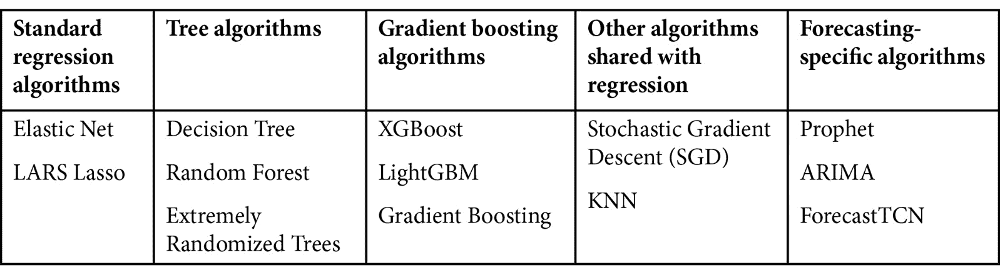

# *第六章*:构建自动预测解决方案

已经构建了一个自动回归和分类解决方案，您现在准备处理一个更复杂的问题:**预测**。预测本质上是一种比分类或回归复杂得多的技术。那两个**机器学习** ( **ML** )题型假设时间无关。不管过去了多少时间，你的糖尿病模型总是能够准确地预测谁的病情会随着时间的推移而恶化。你的泰坦尼克模型总是能够预测谁生谁死。相比之下，对于预测问题，你总是试图根据过去的事件来预测未来的事件；时间永远是你模型中的一个因素。

你将以类似的方式开始本章:第四章[](B16595_04_ePub.xhtml#_idTextAnchor056)**构建 AutoML 回归解决方案*，第五章*构建 AutoML 分类解决方案*。首先，您将导航到 Jupyter 环境，加载数据，训练模型，并评估结果。您将学习两种内在不同的方法来使用 AutoML 训练预测模型。一种方法仅使用 **ARIMA** 和**先知**算法；另一种方法使用所有其他可用的算法。*

 *在本章结束时，您将了解如何通过调整 AutoML 设置来微调预测模型的提示和技巧；有许多特定于预测的设置，因此您将花费大量时间来介绍它们的各种用例。

到本章结束时，你将能够使用 AutoML 训练预测模型而不会出错。相对于其他技术，预测问题更容易搞砸，所以这是一项相当大的成就。您将了解如何转换和安排用于预测的数据，以及如何调整 AutoML 设置以生成更准确、更值得信赖的模型，从而巩固您在 Azure AutoML 方面的专业知识。

在本章中，我们将讨论以下主题:

*   为自动预测准备数据
*   训练自动预测模型
*   注册您训练过的预测模型
*   微调您的自动预测模型

# 技术要求

就像 [*第四章*](B16595_04_ePub.xhtml#_idTextAnchor056) ，*构建自动回归解决方案*一样，你将在运行在 Azure 计算实例上的 Jupyter 笔记本中用 Python 代码创建和训练模型。因此，你将需要一个有效的互联网连接、一个 Azure 机器学习服务和一个计算实例。同样，当您继续在笔记本上工作时，您将需要一个工作计算集群来远程训练模型。要求的完整列表如下:

*   上网。
*   网络浏览器，最好是谷歌 Chrome 或微软 Edge Chromium。
*   一个 Microsoft Azure 帐户。
*   您应该已经创建了一个 AMLS 工作区。
*   您应该已经创建了一个计算实例。
*   您应该已经在第 2 章 、【Azure 机器学习服务入门中创建了计算集群。
*   您应该了解如何从 Azure 计算实例导航到 Jupyter 环境，如 [*第 4 章*](B16595_04_ePub.xhtml#_idTextAnchor056) 、*构建 AutoML 回归解决方案中所示。*

本章的代码可以在这里找到:[https://github . com/packt publishing/Automated-Machine-Learning-with-Microsoft-Azure/tree/master/chapter 06](https://github.com/PacktPublishing/Automated-Machine-Learning-with-Microsoft-Azure/tree/master/Chapter06)。

# 为自动预测准备数据

预测与分类或回归非常不同。用于回归或分类的 ML 模型基于一些输入数据预测一些输出。另一方面，用于预测的 ML 模型基于过去发现的模式预测未来状态。这意味着在对数据进行整形时，需要注意一些与时间相关的关键细节。

在这个练习中，您将使用`OJ Sales Simulated Data` Azure Open 数据集进行预测。类似于您用于回归的`Diabetes Sample` Azure Open Dataset，`OJ Sales Simulated Data`只需拥有一个 Azure 帐户即可使用。您将使用这些数据创建一个模型来预测未来不同品牌和商店的橙汁销售情况。

还有一个额外的关键区别；`OJ Sales Simulated Data`是**文件数据集**而不是**表格数据集**。表格数据集由一个包含列和行的文件组成，而文件数据集由许多文件组成，表格或其他。

像您在 AMLS 工作区中执行的所有其他编码工作一样，您将从从您的计算实例打开 Jupyter 并创建一个新的 Jupyter 笔记本开始。然后，您将加载您的数据，将其转换为 pandas 数据框架，并将其注册为数据集，使您能够使用它来训练具有 AutoML 的 ML 模型。

## 导航到您的 Jupyter 环境

您将通过以下步骤创建一个新的 Jupyter 笔记本:

1.  首先，通过导航到[http://ml.azure.com](http://ml.azure.com)打开你的 **Azure 机器学习** ( **AML** ) **工作室**。
2.  点击左侧面板上的**计算**。
3.  Select your compute instance. Click **Start** if it's not running.

    重要提示

    为了在使用 Azure 时节省资金，请在不使用计算实例时将其关闭。计算实例按小时付费。

4.  点击 **Jupyter** 进入您的 Jupyter 环境。
5.  点击屏幕右侧的**新建**，选择**Python 3.6–azure ml**，创建一个新的 Jupyter 笔记本。Python 的版本可能会因更新而有所不同。
6.  将的 Jupyter 笔记本重命名为`OJ Forecasting_AutoML`。如果你需要复习如何做，请回顾第四章[](B16595_04_ePub.xhtml#_idTextAnchor056)*，*构建一个 AutoML 回归解决方案*。*

 *创建好笔记本后，现在就可以加载橙汁销售数据并使用 Python 对其进行转换了。

## 加载和转换您的数据

现在是时候处理您的数据了，遵循您在 [*第 4 章*](B16595_04_ePub.xhtml#_idTextAnchor056)*构建 AutoML 回归解决方案*[*第 5 章*](B16595_05_ePub.xhtml#_idTextAnchor068)*构建 AutoML 分类解决方案*中使用的模式。本节的目的是获取一个包含许多文件的文件数据集，将所有文件组合在一起，并创建一个新的表格数据集。执行以下步骤:

1.  Load in all of the Azure libraries you will need with the following code:

    ```
    from azureml.core import Workspace, Dataset, Datastore
    from azureml.core import Experiment
    from azureml.core.compute import ComputeTarget
    from azureml.train.automl import AutoMLConfig
    from azureml.train.automl.run import AutoMLRun
    from azureml.widgets import RunDetails
    from azureml.opendatasets import OjSalesSimulated
    from azureml.automl.core.forecasting_parameters import ForecastingParameters
    ```

    你应该从 [*第四章*](B16595_04_ePub.xhtml#_idTextAnchor056)*构建 AutoML 回归解决方案*中认出`Workspace``Dataset``Datastore``Experiment``ComputeTarget``AutoMLConfig``AutoMLRun``RunDetails`。

    `OjSalesSimulated`让您通过`ForecastingParameters`直接访问`OJ Sales Simulated Data` Azure Open Dataset 对于 AutoML 预测任务是必要的，因为您不能简单地将特定于预测的参数传递给`AutoMLConfig`对象。您必须首先将它们分配给`ForecastingParameters`，然后将这些参数传递到您的 AutoML 配置中。

    重要说明

    如果你在加载任何 Azure 库时遇到问题，请通过运行此处的`Update` `AzureML` `SDK.ipynb`笔记本来更新 Azure ML SDK:https://github . com/packt publishing/Automated-Machine-Learning-with-Microsoft-Azure/blob/master/Update-Azure ML-SDK . ipynb

2.  Load in `pandas`, `numpy`, `os`, and `path` with the following code:

    ```
    import pandas as pd
    import numpy as np
    import os
    from pathlib import Path
    ```

    你应该从第四章 ，*构建 AutoML 回归解决方案*中认出`pandas`和`numpy`。`os`和`Path`对你来说会很陌生。这些软件包允许您在 Jupyter 笔记本中创建和操作 Jupyter 环境中的文件和文件夹。此外，当处理像`OjSimulatedSales`这样的文件数据集时，将它们转换成用于 AutoML 训练的表格数据集是必要的。

3.  Connect your Jupyter notebook to your AMLS workspace:

    ```
    ws = Workspace.from_config()
    ```

    如果系统提示您登录，请按照说明进行操作。

4.  Set your compute cluster:

    ```
    compute_name = 'compute-cluster'
    compute_target = ComputeTarget(ws, compute_name)
    ```

    你在 [*第二章*](B16595_02_ePub.xhtml#_idTextAnchor023) 、【Azure 机器学习服务入门中创建了这个计算集群。

5.  设置您的数据存储。在本练习中，我们将使用您的 AMLS 工作区附带的默认数据存储:

    ```
    datastore = Datastore.get_default(ws)
    ```

6.  Pull in a subset of `10` files from `OJ Sales Simulated Data` with this code:

    ```
    oj_sales_files = OjSalesSimulated.get_file_dataset()
    oj_sales = oj_sales_files.take(10)
    ```

    重要提示

    在`OJ Sales Simulated Data` Azure 开放数据集中有超过 4000 个文件。把它们都拉出来会导致训练时间延长。

7.  Make a folder to download the files to your Jupyter environment with the following code:

    ```
    folder_name = "OJ_Sales"
    os.makedirs(folder_name, exist_ok=True)
    ```

    为了使用文件数据集，您首先需要将它们下载到本地 Jupyter 环境中。然后，您可以通过连接文件将它们作为 pandas 数据帧读入。

8.  Download the 10 files to your newly created `OJ_Sales` folder with the following code:

    ```
    oj_sales.download(folder_name, overwrite=True)
    ```

    如果您导航到 Jupyter 环境中的`OJ Sales`文件夹，那么在运行这段代码之后，您应该会看到那里的文件。

9.  Read in the 10 files as a single pandas dataframe with the following code:

    ```
    OJ_file_path = Path('OJ_Sales').rglob('*.csv')
    OJ_files = [x for x in OJ_file_path]
    df = pd.concat((pd.read_csv(f) for f in OJ_files))
    ```

    为此，我们将需要使用`Path`包来指示文件夹和文件扩展名，以及`pandas`将 10 个文件连接成一个数据帧。请注意，这段代码将读取您的`OJ Sales`文件夹中的所有内容。不要在这个文件夹中放置额外的文件，否则会破坏这部分代码。

10.  View the first 10 rows of your data. Make sure that it looks correct:

    ```
    df.head(10)
    ```

    橙汁销售数据有七列:`WeekStarting`、`Store`、`Brand`、`Quantity`、`Advert`、`Price`和`Revenue`。`Advert`表示该品牌橙汁在那一周是否有广告活动。其他列不言自明。前 10 行数据如下所示:

    

    图 6.1–查看您的橙汁销售数据集

11.  Register your pandas dataframe as a dataset:

    ```
    Dataset.Tabular.register_pandas_dataframe(df, datastore,
                                "OJ Sales Sample")
    ```

    虽然将文件数据集注册为表格数据集可能看起来很奇怪，但表格数据集本质上更容易处理。文件数据集只是指向包含大量文件的文件夹的指针；在使用这些文件之前，必须对它们进行大量的数据预处理工作。另一方面，表格数据集经过格式化，可以立即用于 AutoML。

这里，重要的是要注意到`WeekStarting`和之间的主要区别。时间列需要某种有规律的节奏，例如，每天、每周、每月或每年。在这种情况下，是每周的星期四。

某些算法，比如*先知*和 *ARIMA* ，要求你有一个没有间隙的时间列。其他的 AutoML 算法可以处理 gap，但是只有在您没有在目标列中启用某些特性，比如时间延迟的情况下。

重要提示

时间栏中的间隙还会阻止您使用特定于预测的某些功能，特别是目标栏的滞后时间和这些滞后时间的移动平均值。这些功能通常可以提高性能。仔细研究您的数据以消除差距，从而在预测解决方案中获得最佳性能。

时间序列数据的另一个基本元素是你的`Store`和`Brand`是你的颗粒列；商店和品牌的每种组合都有单独的时间序列。

如果 AutoML 在单个晶粒上检测到多个时间序列，它将自动失败。换句话说，一粒谷物不能有重复的日期。因此，在使用 AutoML 预测时，请仔细研究您的数据，以删除相同粒度的重复日期。

记住这些内容后，您现在就可以训练一个自动预测模型了。首先，你将在不使用 *ARIMA* 和*先知*的情况下训练一个模型。然后，您将使用这两种算法训练一个模型。

# 训练一个自动预测模型

训练一个自动预测最类似于训练一个自动回归模型。与回归相似，与分类不同，你试图预测一个数字。与回归不同，这个数字总是基于过去发现的模式而出现在未来。此外，与回归不同，您可以预测未来的一系列数字。例如，您可以选择预测未来一个月，也可以选择预测未来 6 个月、12 个月、18 个月甚至 24 个月。

重要提示

你试图预测的越远，你的预测模型就越不准确。

遵循您在 [*第 4 章*](B16595_04_ePub.xhtml#_idTextAnchor056) 、*构建 AutoML 回归解决方案*和 [*第 5 章*](B16595_05_ePub.xhtml#_idTextAnchor068) 、*构建 AutoML 分类解决方案*中看到的相同步骤。首先，为你的实验取一个名字。然后，设置目标列和 AutoML 配置。

对于预测，还有一个额外的步骤:设置您的**预测参数**。你可以在这里设置时间栏、纹理栏和延迟设置。然后，这些设置需要作为单个预测参数对象传递到您的 AutoML 配置中。一旦完成了这一步，您就可以使用 AutoML 来训练一个预测模型。

在本节中，您将重复此过程两次，第一次是使用 AutoML 中可用于预测的标准算法正常训练模型，第二次是使用略有不同的设置重复此过程，以启用 ARIMA 和 Prophet，并比较两个 AutoML 模型的性能。

## 使用标准算法训练预测模型

为了使用 AutoML 训练您的预测模型，请遵循这些步骤，继续`OJ Forecasting AutoML` Jupyter 笔记本:

1.  Set your experiment and give it a name with the following code:

    ```
    experiment_name = 'OJ-Sales-Forecasting'
    exp = Experiment(workspace=ws, name=experiment_name)
    ```

    需要记住的一件重要事情是，一个实验可以是一组多次训练，而不仅仅是一次训练。换句话说，我们可以在同一个实验名称下训练多个不同设置的模型。

2.  使用以下代码检索您的`OJ Sales Sample`数据集:

    ```
    dataset_name = "OJ Sales Sample"
    dataset = Dataset.get_by_name(ws, dataset_name, version='latest')
    ```

3.  Set your target column to `Quantity`:

    ```
    target_column = 'Quantity'
    ```

    Python 的大写很重要；记住这一点。

4.  Create a variable for your AutoML task. `task` is the type of AutoML model you are trying to train. To predict future numbers, enter `forecasting`:

    ```
    task = 'forecasting'
    ```

    重要说明

    将预测问题训练成回归问题总是不正确的。尽管它们名义上做的是同样的事情，预测一个数字，但预测需要更加谨慎的方法，以便在训练模型时不包括未来值。用于回归的标准交叉验证方法不适用于预测问题，所以一定要将`task`设置为`forecasting`。

5.  为您的主要指标创建一个变量。**主要指标**是你的模型将如何被评分。使用**归一化均方根误差** ( **归一化 RMSE** )。这个指标获取预测值，并从每个观察值的实际值中减去预测值，对其求平方，然后对所有观察值的得分求平均值。分数越低，你的模型越好。预测的其他选项包括 **R2 评分**、**斯皮尔曼相关**、**归一化平均绝对误差** ( **归一化平均误差**)。注意这些与回归指标相同:

    ```
    primary_metric = 'normalized_root_mean_squared_error'
    ```

6.  Create a variable for `featurization`. You can set `featurization` to `auto` or `off`. Set it to `auto`:

    ```
    featurization = 'auto'
    ```

    如果您将`featurization`设置为`off`，您将不得不放弃高基数特性，估算空值，一次性编码您的数据，并自己生成额外的特性。当特征设置为`auto`时，AutoML 自动为您处理这些。

7.  With forecasting, featurization also creates a variety of date/time features from your time column, including year, month, week, day of week, A.M./P.M., and hour of day. Always set `featurization` to `auto` unless you are an expert data scientist who can do everything yourself.

    设置您的预测参数。有很多这样的问题，我们将逐一讨论如下:

    a) `country_or_region_for_holidays`确定使用哪个国家来生成指示不同国家假日的列。您可以将该参数设置为无、单个国家或国家列表。对于美国，将其设置为`US`。每个假期都会有一个单独的栏目。

    b) `drop_columns_names`允许您在训练预测模型之前输入要删除的列的列表。将`Revenue`列放在这里，因为它部分派生自您的目标列`Quantity`。

    ```
    params=\
    ForecastingParameters.from_parameters_dict( 
    {'country_or_region_for_holidays':'US',\
                    'drop_columns_names':'Revenue',\
                    'forecast_horizon': 6,\
                    'target_rolling_window_size': 'auto',\
                    'target_lags': 'auto',\
                    'feature_lags': 'auto',\
                    'seasonality': 'auto',\
                    'short_series_handling': True,\
                    'use_stl': 'season_trend',\
                    'time_column_name':'WeekStarting',\
                    'time_series_id_column_names':\
                    ['Store','Brand'],\
                   'short_series_handling_configuration':\
                    'auto'},\
                    validate_params=True)
    ```

    重要说明

    有相当多的特定于预测的参数。请阅读此处的*Azure AutoML forecasting parameters*文档，慢慢深入了解这些设置:[https://docs . Microsoft . com/en-us/python/API/Azure ml-AutoML-core/Azure ml . AutoML . core . forecasting _ parameters . forecasting parameters？view=azure-ml-py](https://docs.microsoft.com/en-us/python/api/azureml-automl-core/azureml.automl.core.forecasting_parameters.forecastingparameters?view=azure-ml-py) 。

8.  Configure your AutoML run. Here, you will pass in your task, primary metric, featurization settings, compute target, dataset, target column, and forecasting parameters. All of these you have previously created. You will also pass in how long the experiment will run for, whether it will stop early if model performance does not improve, the number of cross-validations, and model explainability settings.

    此外，你将会传入你是否想要使用`3`拆分；与分类或回归不同，当您将交叉验证设置为较低的数字时，预测运行会更加准确。这是由于 AutoML 为了对性能评分而将数据分成不同组的性质:

    ```
    config = AutoMLConfig(task=task,
                         primary_metric=primary_metric,
                         featurization=featurization,
                         compute_target=compute_target,
                         training_data=dataset,
                         label_column_name=target_column,
                         experiment_timeout_minutes=15,
                         enable_early_stopping=True,
                         n_cross_validations=3,
                         model_explainability=True,
                         enable_stack_ensemble=False,
                         enable_voting_ensemble=True,
                         forecasting_parameters=params)
    ```

    重要说明

    `False`。这不是回归或分类的情况。

9.  训练你的模型并实时观察的结果:

    ```
    AutoML_run = exp.submit(config, show_output = True)
    RunDetails(AutoML_run).show()
    ```

像以前一样，开始你的自动跑步，给自己冲些咖啡，然后回来看你的模型得到实时训练。您将看到一个**数据护栏**检查，如图*图 6.2* 所示。请注意它在预测方面的变化:


图 6.2–用于预测的数据护栏检查

首先，data guardrails 将检查您的时间列，以确保所有数据点都符合正确的频率。对于您的`OJ Sales Sample`数据，这意味着确保每个数据点都落在星期四，并且相隔 1 周。

然后，data guardrails 会像处理分类和回归一样处理缺失值。这里，任何列中都没有丢失值。最后，它会寻找太短的时间序列，以你的设置训练。如果 AutoML 检测到短序列，它将创建更简单的模型来处理这些情况。

完成数据护栏检查后，AutoML 将开始使用不同的特征变换、算法和超参数组合来训练模型。如果除了时间列、颗粒列和目标列之外没有其他功能，除了标准的预测模型套件之外，它还将训练 ARIMA 和预言家模型。您的输出应该类似于*图 6.3* :


图 6.3–预测的自动结果

## 用预言家和 ARIMA 训练预测模型

预测和其他两种自动问题的一个重要区别是 T2 预言家和 ARIMA 算法。Prophet 和 ARIMA 与所有其他算法的本质区别在于，为了训练它们，你需要的只是颗粒列、目标列和时间列。就是这样。添加任何其他列都会限制 AutoML 使用这些算法。

先知和 ARIMA 的不同之处在于，他们只使用在目标列中找到的模式来进行预测。其他变量被忽略。有时候，它们会胜过其他算法；其他时候，他们不会。不尝试很难知道什么时候。

因为很难知道 ARIMA 和先知相对于其他算法的表现如何，所以如果可以的话，建议总是尝试训练它们。也就是说，如果您的时间列中有连续的时间序列数据，请始终首先训练 ARIMA 和先知模型作为基线。它们需要较长的训练时间，因此建议您增加实验超时，尤其是在数据集较大的情况下。

要使用 ARIMA 和 Prophet 构建自动预测解决方案，请按照下列步骤操作:

1.  复制上一节中的*步骤 1-6* ，直到您获得预测参数。
2.  Within forecasting parameters, remove all of your feature columns, leaving only your time, grain, and target columns. Also, turn off all AutoML generated features, such as holidays, feature lags, and targets lags, by setting them to `None`, as seen in the following code block:

    ```
    params=\
    ForecastingParameters.from_parameters_dict(\
    {'country_or_region_for_holidays':None,\
                      'drop_columns_names':\
                      ['Revenue','Price','Advert'],\
                      'forecast_horizon': 6,\
                      'target_rolling_window_size': None,\
                      'target_lags': None,\
                      'feature_lags': None,\
                      'seasonality': 'auto',\
                      'short_series_handling': True,\
                      'use_stl': 'season_trend',\
                      'time_column_name':'WeekStarting',\
                      'time_series_id_column_names':\
                      ['Store','Brand'],
                   'short_series_handling_configuration':\
                      'auto'},\
                      validate_params=True)
    ```

    特征滞后和目标滞后通过创建附加变量来工作。这就是为什么他们需要从你的数据中删除，以便 AutoML 运行先知和 ARIMA。

3.  按照您在*步骤 8* 中所做的那样配置您的 AutoML 运行，传递您更新的预测参数。
4.  训练你的模型并实时观察结果:

    ```
    Prophet_ARIMA_run = exp.submit(config, show_output = True)
    RunDetails(Prophet_ARIMA_run).show()
    ```

一旦使用这些设置重新运行 AutoML，您的结果应该类似于*图 6.4* 。请注意，对于这个问题，ARIMA 和先知并没有返回更好的结果，投票组合一如既往地优于所有模型:


图 6.4-ARIMA 和预言家的自动预测结果

现在，您已经用您的`OJ Sales Sample`数据训练了两组模型，并获得了相当低的归一化 RMSE。现在，您可以进入下一部分，注册您的模型。注册模型对于以后通过 ML 管道或实时端点对新数据进行评分是必要的。

# 注册您训练过的预测模型

注册预测模型的代码与您在 [*第 4 章*](B16595_04_ePub.xhtml#_idTextAnchor056) 、*构建 AutoML 回归解决方案*中使用的代码相同，以便注册您的回归模型，以及在 [*第 5 章*](B16595_05_ePub.xhtml#_idTextAnchor068) 、*构建 AutoML 分类解决方案*中使用的代码，以便注册您的分类模型。始终注册新模型，因为根据您的业务场景，您将在实时评分端点或批处理执行推理管道中使用它们。同样，始终添加标签和描述以便于跟踪:

1.  首先，给你的模型一个名字，一个描述，和一些标签。**标签**让你可以轻松搜索模型，所以在实现它们的时候要仔细考虑:

    ```
    description = 'Best AutoML Forecasting Run using OJ Sales Sample Data.' 
    tags = {'project' : "OJ Sales", "creator" : "your name"} 
    model_name = 'OJ-Sales-Sample-Forecasting-AutoML' 
    ```

2.  接下来，将您的模型注册到您的 AMLS 工作区，传递您的模型名称、标签和描述。使用您在*培训自动预测模型*部分培训的`AutoML_run`模型:

    ```
    AutoML_run.register_model(model_name=model_name, description=description, tags=tags)
    ```

3.  尝试根据 R2 分数注册不同的型号。给它一个稍微不同的名字，添加一个额外的标签，并使用相同的描述:

    ```
    description = 'Best AutoML Forecasting Run using OJ Sales Sample Data.'
    tags = {'project' : "OJ Sales", "creator" : "your name", "metric" : "R2 Score"} 
    model_name = 'OJ-Sales-Sample-Forecasting-AutoML-R2'
    AutoML_run.register_model(model_name=model_name, description=description, tags=tags, metric = 'r2_score')
    ```

在某些情况下，您会执行 AutoML 训练运行，但是您会忘记注册模型。不要烦恼。您可以使用实验名称和运行 ID 检索 AutoML 训练运行，并从那里注册模型。使用以下代码:

```
experiment_name = 'OJ-Sales-Forecasting'
exp = Experiment(workspace=ws, name=experiment_name) 
AutoML_run = AutoMLRun(experiment = exp, run_id = 'your_run_id') 
description = 'Retrieved AutoML Forecasting Run for OJ Sales Data.'
tags = {'project' : "OJ Sales", "creator" : "your name"} 
model_name = 'OJ-Sales-Sample-Forecasting-AutoML-Retrieved'
AutoML_run.register_model(model_name=model_name, description=description, tags=tags)
```

现在，您已经注册了预测模型，可以使用了。你可以用它来预测未来 6 周各种商店和品牌对橙汁的需求。你也可以用多种方式修改它，比如预测 3 周、12 周或者仅仅是下周的销售额。

预测是一门艺术，比分类或回归更重要，这使得下一部分更重要:微调自动预测模型的技巧和诀窍。

# 微调您的自动预测模型

在此部分，您将首先回顾改进 AutoML 预测模型的技巧和诀窍，然后回顾 AutoML 用于预测的算法。

## 改进自动预测模型

预测很容易出错。很容易产生一个在开发中看似有效的模型，但是一旦部署到生产中就无法做出准确的预测。许多数据科学家，即使是经验丰富的，也会犯错误。虽然 AutoML 将帮助您避免一些常见的错误，但还有一些错误需要您谨慎对待。为了避开这些陷阱，尽可能做出最好的模型，请遵循以下提示和技巧:

*   Any feature column that you train with has to be available in the future when you make a prediction. With `OJ Sales Sample`, this means that, if you want to predict the quantity of sales 6 weeks out and include price as an input variable, you need to know the price of each product 6 weeks out.

    请与您的业务合作伙伴和 IT 人员确认，看看您将有哪些数据可用于预测。如果您无法知道您尝试预测的时间范围内某个要素列的值，请从定型数据集中删除该列。

*   标准的交叉验证技术不适用于预测。如果您试图预测未来状态，AutoML 会使用`task`到`forecasting`。将它设置为回归可能会得到结果，但是它们没有意义，因为它们忽略了时间部分。
*   熟悉用于预测的所有不同的 AutoML 配置选项。可以在这个链接找到:[https://docs . Microsoft . com/en-us/python/API/azure ml-train-automl-client/azure ml . train . automl . automlconfig . automlconfig？view=azure-ml-py](https://docs.microsoft.com/en-us/python/api/azureml-train-automl-client/azureml.train.automl.automlconfig.automlconfig?view=azure-ml-py) 。
*   总是先尝试只使用 ARIMA 和预言家来构建预测模型。这两个模型提供了一个很好的基线，因为它们只使用您的时间列和目标列来构建 ML 模型。如果使用附加功能的模型没有胜过 ARIMA 和先知，你知道这些附加功能与你的业务问题无关。从数据集中删除这些要素。
*   Think carefully when deciding your forecast horizon. Usually, forecasting algorithms perform better when forecasting short horizons, either the next one or two time periods. When forecasting longer horizons, expect less accuracy the further out you go. Knowing this, please push back against your business partners when they ask you to forecast many time periods out.

    一般来说，人们总是想知道未来，你预测的越远，他们就越快乐。请解释他们应该更加相信短期预测，而不是长期预测。

*   Forecasting the future works best when the present situation resembles the past. Shock events will often disrupt even well-performing forecast models. When this happens, try training a model using only recent data points. This is an iterative process, as it's often difficult to tell which training points are still relevant.

    在某些情况下，你能做的最好的事情是只从休克事件开始时使用数据开始训练模型。例如，与疫情之前的情况相比，许多商店在冠状病毒疫情期间经历了完全不同的产品需求。

*   When shock events pass and things return to normal, try training forecasting models using the weighted column feature in AutoML. Set time periods during the shock event to `0`.

    请记住，AutoML 预测模型不应在时间列中有间隙的情况下进行定型。然而，在冲击事件中出现的数据点与正常情况无关。通过使用加权列并将权重设置为`0`和`1`，您可以训练一个预测模型，该模型可以有效地忽略冲击事件，而不会违反无间隙规则。

*   同样，使用权重列对最近的过去进行加权，使其大于更远的过去。对于许多问题，最近的数据比过去的数据更相关。采访你的商业伙伴，找出你的行业发生变化的关键日期。
*   Furthermore, more data only helps forecasting models if the past situation resembles the present situation. Forecasting models often produce better results when you train models using only recent, relevant data. Do not be afraid to drop data points that are too far in the past to help predict the current situation.

    再次，采访商业伙伴，找出你的行业经历巨大变化的关键日期。丢弃发生在大规模变更之前的数据通常会产生更好的模型。

*   预测是挑剔的，比回归或分类问题更挑剔。这是因为公司喜欢预测的事物类型是由市场需求驱动的，而人们想要的东西经常变化。市场上流行的东西可能会在没有任何警告的情况下快速变化，因此，每当您获得最新数据时，预测模型都需要重新训练。
*   当您使用自动训练的预测模型进行预测时，它总是从预测下一个时间段的值开始。因此，在对数据评分时，数据必须从下一个时间段开始。例如，如果您根据 1 月 5 日结束的数据训练了一个每日预测模型，那么您的评分数据必须从 1 月 6 日开始。
*   如果您的时间列是以二月结束的月度节奏，并且您预测两个时间段之后，AutoML 将预测三月和四月。您不能使用该模型来预测五月或六月。为此，您必须使用稍后结束的训练数据重新训练模型。因此，您需要不断重新训练 AutoML 预测模型，以确保您的预测是最新的。
*   要确定季节性，在使用 AutoML 之前，绘制目标列以寻找任何重复出现的季节性模式。这将让你知道你是否应该使用季节性特征。
*   当您尝试在全球范围内进行预测时，请确保在生成假日要素时包括所有国家。在预测需求和市场趋势时，假期往往非常重要。想想圣诞节如何影响美国的销售，或者中国的春节如何影响中国的旅游方式。

提示和技巧列表到此结束。它决不是完整的；你应该把它看作是一个开始。预测是一个丰富而有趣的领域，有许多警告。尽管如此，记住这些事情将使你能够做出准确、可靠的预测，并避免新手数据科学家所犯的许多错误。

最重要的是，记住预测是它自己的艺术，独立于其他类型的 ML 问题，并以此来处理它。最后，您将了解 AutoML 使用哪些算法进行预测。

## 了解自动预测算法

自动预测算法与自动回归算法几乎相同。预测使用所有相同的**树**、**标准回归**、**梯度推进**和**最近邻**算法作为回归，还使用**随机梯度下降**。参考，请参考 [*第四章*](B16595_04_ePub.xhtml#_idTextAnchor056) 、*构建 AutoML 回归解决方案*。

除了这些算法，还有三种特定于预测的算法:自动 ARIMA、Prophet 和 ForecastTCN。在本章的前面，你已经了解了使 ARIMA 和预言家不同于其他算法的某些关键差异。ForecastTCN 是一个**时态卷积网络**，一种类型的神经网络。

**自动 ARIMA** ( **自回归综合移动平均线**)使用目标柱的移动平均线进行预测。与标准 ARIMA 不同，自动 ARIMA 优化 ARIMA 参数，以创建最佳模型。对于只有关于目标列的可靠信息的单变量时间序列，它表现得非常好。

**Prophet** 是类似于 Auto-ARIMA，它专门用于单变量时间序列。此外，当您的数据具有强烈的季节性模式时，它表现得非常好。与许多预测算法不同，Prophet 对数据集中的异常值和剧烈波动具有很强的鲁棒性。像自动 ARIMA 一样，您应该在任何预测项目开始时使用 Prophet 建立基线模型。

自动预测参数中的`enable_dnn`到`True`。该算法非常适合最复杂的预测任务，因为它可以捕捉数据中极其复杂的非线性趋势。深度学习是一个复杂的话题，很难用一章来解释，因此超出了本书的范围。与其他深度学习模型一样，ForecastTCN 在用非常大量的数据进行训练时表现最佳。

*图 6.5* 提供了这 13 种算法的总结:



图 6.5–自动预测算法

像回归一样，AutoML 在每次 AutoML 训练运行结束时执行**模型组装**。**投票集合**对你的预测模型取一个加权平均值，并用它来做预测。**堆栈集成**，与相反，使用其他模型的输出训练一个弹性网络模型。当使用带有预报的堆栈集合时，存在过度拟合的危险；因此，建议将其关闭。

有关这些模型的更多信息，请参考位于[https://docs . Microsoft . com/en-us/azure/machine-learning/how-to-configure-auto-train # configure-your-experiment-settings](https://docs.microsoft.com/en-us/azure/machine-learning/how-to-configure-auto-train#configure-your-experiment-settings)的 AutoML 文档。

# 总结

现在，您已经成功地训练了所有三种类型的 AutoML 模型-分类、回归和预测。您不仅可以训练一个简单的预测模型，而且还知道如何使用各种预测参数改进模型，以及如何使用 ARIMA 和 Prophet 构建高性能的基线模型。

此外，您已经获得了许多关于预测如何不同于其他问题以及如何避免常见陷阱的知识。通过明智地利用预测展望期功能，您可以预测未来几天、几个月或几年，现在是时候为您的清单添加一个强大的工具了。

在第七章[](B16595_07_ePub.xhtml#_idTextAnchor094)**中使用多模型解决方案加速器*，你将能够为每个时间序列颗粒建立单独的模型。您可以同时构建数以千计的模型，并对它们进行评分，就好像它们是一个模型一样，而不是构建一个预测模型。您会发现这种方法可以极大地增强您的模型的性能，并且只有使用云原生技术才有可能。***