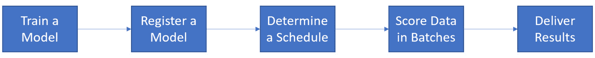
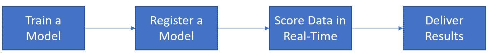

# 八、选择实时评分还是批量评分

正如您在前面的章节中所体验到的，训练 AutoML 模型既简单又直接。无论你是选择使用 **Azure 机器学习工作室** ( **AMLS** ) **GUI** 训练模型，还是使用 Jupyter 用 Python 编写 AutoML 解决方案，你都可以在几分钟内构建高度精确的**机器学习** ( **ML** )模型。但是，您仍然需要学习如何部署它们。在 Azure 中，有两种主要方式可以部署之前训练过的 ML 模型来对新数据进行评分:**实时**和**批处理**。

在本章中，您将从学习什么是**批评分解决方案**开始，何时使用它，以及何时重新训练批模型是有意义的。接下来，您将了解什么是**实时评分解决方案**，何时使用它，以及何时重新训练实时模型是有意义的。最后，您将通过阅读各种不同的情景并确定您应该使用哪种类型的评分来得出结论。所有场景都是基于真实公司面临的共同问题。

当你完成这一章时，你将获得一项无价的技能:能够确定何时应该构建一个批量评分解决方案，何时应该构建一个实时解决方案。

批量评分场景需要您构建 ML 管道，您将在第九章 *的 [*中了解到，实现批量评分解决方案*。另一方面，实时评分场景要求您构建托管在 **Azure Kubernetes 服务** ( **AKS** )上的实时评分端点，这些将在](B16595_09_ePub.xhtml#_idTextAnchor129) [*第 11 章*](B16595_11_ePub.xhtml#_idTextAnchor172) *中介绍，实现实时评分解决方案*。很多时候，组织会错误地实现错误类型的解决方案，但是您可以避免这个陷阱。*

在本章中，我们将讨论以下主题:

*   构建批量评分解决方案
*   构建实时评分解决方案
*   确定批处理与实时评分方案

# 技术要求

[*第七章*](B16595_07_ePub.xhtml#_idTextAnchor094) *，使用了众多模型的解决方案加速器*，精选了大量笨重的 Python 编码。这一章是一个缓刑；你不需要编写代码，但是你将通过阅读业务场景和应用适当的解决方案来学习重要的技能。因此，本章没有技术要求。

# 设计批量评分解决方案

**批推断**指的是在基于时间的循环时间表上对批中的新数据点进行评分。随着时间的推移收集新数据，随后进行评分，生成新的预测。这是现代公司使用 ML 模型最常见的方式。

在本节中，您将学习如何使用 Azure AutoML 训练的模型构建完整的端到端批量评分解决方案。您还将了解为什么以及在什么情况下，您应该将批量评分优先于实时评分解决方案。

## 了解五步批量评分流程

您制作的每批评分解决方案都应遵循五个步骤。这个过程从训练和注册一个 ML 模型开始，就像你在前面章节中使用 AMLS 所做的那样。回归、分类和预测模型都遵循相同的模式。这五个步骤依次如下:

1.  **训练一个模型**。您可以使用 AMLS GUI 来训练模型，就像您在 [*第 3 章*](B16595_03_ePub.xhtml#_idTextAnchor044) *中所做的那样，训练您的第一个 AutoML 模型*，或者在计算实例上使用 Python，就像您在 [*第 4 章*](B16595_04_ePub.xhtml#_idTextAnchor056) *中所做的那样，构建一个 AutoML 回归解决方案*、 [*第 5 章*](B16595_05_ePub.xhtml#_idTextAnchor068) *，构建一个 AutoML 分类解决方案*以及 [*第 6 章*](B16595_06_ePub.xhtml#_idTextAnchor081)
2.  **注册你的模型**。同样，您可以使用 AMLS GUI 或在计算实例上运行 Python 来实现这一点。注册模型会将其保存到您的 AMLS 工作空间中，供您以后引用。
3.  **确定一个日程**。批处理推理的常见时间表是每小时、每周或每月，尽管您可能希望根据业务问题的需要或多或少地安排时间。
4.  **批量评分数据**。批量大小可以从单个数据点到数十亿个数据点同时运行。这一步是运行批处理推理代码的地方。在 Azure 中，我们使用 ML 管道。你将在第九章 *的 [*中学习如何编写 ML 管道，实现一个批量评分解决方案*。](B16595_09_ePub.xhtml#_idTextAnchor129)*
5.  **交付结果**。一旦您运行 ML 管道并做出新的预测或预报，您需要将这些结果发送到报告或数据库。在 Azure 中，从 AMLS 向其他数据库发送结果是通过一个叫做**Azure Data Factory**(**ADF**)的工具来完成的。您将在第 10 章 *中学习如何使用 ADF，创建端到端的 AutoML 解决方案*。

*图 8.1* 显示了整个端到端的过程。虽然您将为您的 AutoML 训练的模型实现批量推理解决方案，但是您可以使用相同的过程来部署任何 ML 模型。确保您的解决方案成功的关键在于使您的批处理作业计划与您的业务需求保持一致:

图 8.1–批量评分流程

现在您已经了解了这个过程，是时候更深入地研究每个步骤了。您已经熟悉了训练 AutoML 模型并将它们注册到您的 AMLS 工作区。接下来，您将了解在确定批量评分解决方案的时间表时需要考虑的事项。

## 安排您的批量评分解决方案

最终，你已经训练了一个 AutoML 模型来满足一些商业目标。也许你需要决定哪些产品要保留，哪些要放弃。也许你需要预测下个季度的产品需求。你可能负责一个职业运动队，需要决定为即将到来的赛季挑选哪些球员。在任何情况下，您都需要确保以一种有意义并满足您的业务需求的方式来安排您的批处理推理作业。

决定何时安排工作的关键基于三点:

*   企业需要多长时间做一次决策
*   数据可用性
*   运行批量评分作业需要多长时间

首先，您需要知道企业做出您的模型试图协助的决策的频率。在职业运动队做出选秀决定的情况下，这意味着你只需要一年跑一次职。如果你为一个按季度决定产品组合的企业工作，你的产品需求模型应该安排一年运行四次。同样，如果你为一家快餐店建立了一个模型，告诉他们下一个小时应该准备什么食物，你的批量推理解决方案应该每小时运行一次。你运行模型的频率被称为**模型步调**。

第二，您需要确保新数据可用于您的模型评分。这被称为**数据可用性**。即使您的业务问题需要每小时进行一次新的预测，如果您的数据每天只刷新一次，您也应该构建一个每天对数据进行一次评分的模型。换句话说，您需要训练一个预测 24 小时并每天计算一次的预测模型，而不是一个预测 1 小时并每天运行 24 次的预测模型。在项目开始时，一定要弄清楚数据的可用性。这会节省你很多时间。

最后，您需要注意批处理作业运行的时间。即使您希望每隔 5 分钟对数据进行评分，并且每隔 5 分钟就有新数据可用，但如果您的批量评分作业需要 10 分钟才能完成，那么您的评分和提交结果的频率就会受到限制。在这种情况下，考虑切换到实时解决方案。

一旦您确定了模型步调、数据可用性以及批处理作业运行所需的时间，下一步就是确定作业应该运行的时间，精确到秒。

在理想情况下，只有在所有相关数据都可用的情况下，您才会运行您的模型。对于职业体育的例子，你可能想要选秀中所有球员的数据。对于每小时的餐馆数据，您可能需要最新的客流量、销售额、天气和交通数据来进行预测。

然而，在现实世界中，您应该始终预料到会有数据可用性问题。一些玩家数据会随机丢失。有时，天气或步行交通数据会毫无理由地延迟。销售数据可能被取消的订单或刷爆的信用卡损坏。由于这个原因，你应该简单地安排你的任务在最后一秒运行。确保您包括一个缓冲区，以考虑到**计算集群启动时间**。

计算集群的启动时间可能会有很大差异，因此对您的解决方案进行大量测试以了解启动所需的最大时间非常重要。将您的缓冲区设置为您的集群启动所需的最大时间，只要它看起来合理。通常，这应该不超过 5 到 10 分钟。如果需要更长时间，请开一张支持票。这样，你将确保你的工作总是按时进行。

重要提示

虽然您可以将最少计算集群节点设置为`1`以实现更快、更一致的加速时间，但这意味着您要为每周 7 天、每天 24 小时的使用付费，从而抵消了批处理解决方案固有的成本节约优势。随着时间的推移，将计算集群节点设置为`0`将会节省大量成本。

通过将您的工作安排在业务部门审查您的预测以帮助他们做出决策的同时运行，您可以为上游系统提供尽可能多的时间来收集、转换和修复数据。您还可以根据最新的数据，为企业提供最佳的预测。还需要考虑如何批量评分数据。

## 批量评分数据并交付结果

在 AMLS，批次评分在 ML 管道中进行。ML 管道要求您指定一个环境，编写一个访问您的模型的评分脚本，并将结果写入数据存储，最有可能的是以 CSV 文件的形式写入 Azure 存储帐户中 blob 容器上的文件系统。你将在第九章 *的 [*中学习如何做所有这些，实现一个批量评分解决方案*。](B16595_09_ePub.xhtml#_idTextAnchor129)*

但是，运行 ML 管道只会生成和存储预测。这与交付结果是不同的。直接咨询企业是确定数据最终去向的最佳方式。有时，他们会希望您将预测存储在他们可以直接访问的 SQL 数据库中。其他时候，他们希望在电子邮件中收到一个 Excel 文件。通常，他们会要求您将结果推送到他们的移动设备可访问的 web 应用。

AMLS 本身可以将结果直接写入 Azure Data Lake 存储帐户(Gen 1 和 Gen 2)、Azure SQL 数据库、Azure Blob 存储、Azure 文件共享、Azure PostGreSQL、Azure Database for MySQL 和 Databricks 文件系统。ML 管道可以将数据直接移动到这些类型的存储中。不过，仅此而已。你不能只通过 ML 管道直接将数据移出 Azure。

然而，通常业务人员会要求您将 AutoML 模型的结果放在其他地方，比如本地数据库或文件共享。ADF 是将数据移入和移出 Azure 的完美工具。您将在第十章 *中学习如何使用 ADF，创建端到端的 AutoML 解决方案*，来解决这个常见的任务。

理解过程是第一步。下一步是了解何时以及为什么应该使用批量评分解决方案而不是实时评分解决方案。

## 实时选择批次

实时解决方案在新数据点出现时对其进行评分。与批处理不同，不需要等待计算集群启动；实时评分集群从不停止运转。新数据一进来，新的预测就会自动生成。虽然这似乎是一个有吸引力的替代批量评分的方法，但是有两个主要原因可以说明为什么应该优先使用批量推理而不是实时推理:成本和复杂性。

使用云计算时，您只是在需要资源时才付费。借助批处理推理，当您的作业运行时，计算集群会加速运行，一旦完成作业运行，它就会减速。通过实时推理，您的集群将一周 7 天、一天 24 小时不间断运行。这意味着实时推理解决方案比批量推理解决方案的成本要高几个数量级。

复杂性也是一个关键问题。有了批处理解决方案，你需要做的就是将新数据移入你的 Azure datastore，对其进行评分，然后将其发送到另一个数据库进行最终交付。这是一个简单的、可重复的模式，适用于各种各样的问题。

另一方面，实时解决方案从来没有这么简单。任何实时解决方案的核心都是一个**评分终点**。这些端点可以用在任何代码的任何地方。有时，您会希望将它们与 web 应用集成在一起；其他时候，您会希望将它们与支持永不停止流入的流数据的应用集成在一起。批量评分解决方案遵循千篇一律的模板，而实时解决方案通常更加复杂和独特。

总的来说，批量评分解决方案相对于实时解决方案具有以下优势:

*   它们运行起来更便宜。
*   它们不太复杂。
*   他们很容易复制，因为他们遵循一个样板。

现在您已经了解了什么是批量推理解决方案以及为什么应该使用它们，是时候看看实时解决方案了。实时解决方案不像批处理解决方案那样普遍，但它们确实专门支持大量用例。它们也很强大，需要思考，创造起来很有趣。

# 构建实时评分解决方案

**实时推理**是指在新数据点到达时对其进行评分，而不是根据时间表进行评分。新的数据流入，新的预测出来。虽然不像批量推理那样常见，但实时推理被公司用于许多场景，如信用卡欺诈检测、工厂异常检测以及在线购物时推荐产品。

在本节中，您将学习如何使用 Azure AutoML 训练的模型构建一个完整的端到端实时评分解决方案。您还将了解为什么以及在什么情况下，您应该优先考虑实时评分而不是批量评分解决方案。

## 了解四步实时评分流程

实时评分解决方案遵循与批量评分解决方案略有不同的流程。只有四个步骤。像批处理解决方案一样，这个过程从训练一个 ML 模型并注册它开始，就像你在前面章节中所做的那样。您可以使用任何类型的 ML 模型，包括回归、分类和预测，所有这些都遵循相同的模式。这四个步骤如下:

1.  **训练一个模型**。当为实时部署训练一个模型时，要额外注意在评分时哪些数据对你的模型是可用的。实际上，很容易错误地包含实时解决方案并不总是可用的数据。
2.  **注册你的模型**。您可以在计算实例中使用 AMLS GUI 或运行在 Jupyter 笔记本上的 Python 代码进行注册。
3.  **实时评分数据**。这一步是运行实时推理代码的地方。在 Azure 中，我们使用 AKS 来创建实时评分端点。您将在第十一章 *的 [*中学习如何创建和使用 AK 和实时评分端点，实现实时评分解决方案*。](B16595_11_ePub.xhtml#_idTextAnchor172)*
4.  **交付结果**。实时交付结果与批量交付结果有很大的不同，并且取决于问题。通常情况下，结果会显示在一些面向用户的 app 上。在其他情况下，你的结果将被汇集到一个数据库，如果满足某个条件，就会触发警报。想象一下，如果一种算法检测到你的账户上有欺诈性的信用卡使用，你可能会收到一条短信。

*图 8.2* 显示了整个端到端的过程。虽然您将为 AutoML 训练的模型实现实时推理解决方案，但是您可以使用相同的过程来实时部署任何 ML 模型。确保您的解决方案成功的关键在于使您的实时解决方案符合您的业务需求:

图 8.2-实时评分流程

现在你已经知道了这个过程，是时候深入每个步骤了。首先，您需要回顾为实时部署训练模型的独特考虑。

## 为实时部署训练模型

当您使用 AutoML 或定制 ML 模型实时训练部署模型时，最重要的考虑是您的数据的可用性。批量评分解决方案不会经常运行；数据越来越多，你一次就把它传了进去。使用实时解决方案，数据会不断生成并不断评分。因此，您需要问问自己，您的解决方案是否总是能够及时访问数据。

这方面的一个很好的例子是对快餐产品每分钟需求的实时评分。需求的最大预测者之一是目前有多少车在免下车排队。如果您有可靠的视频技术，可以记录汽车，计数汽车，并在每分钟的基础上将它们传送到您的实时评分端点，您应该使用这些数据。然而，如果视频馈送需要 3-5 分钟来传递该数据，则您不应该使用它来进行逐分钟评分。

因此，在每个项目开始的时候，你应该花很多时间来弄清楚什么时候你可以得到什么数据。这是另一种类型的数据可用性问题。如果您的数据与评分节奏相匹配，请使用它。如果没有，丢弃它。此外，如果数据只是由于可靠性问题而有时可用，例如天气 API 经常返回空值，则丢弃它。

现在，您应该对数据可用性对于实时评分的重要性有了深刻的理解。是时候考虑一下你应该如何获得数据并交付结果了。

## 实时交付结果

使用 AMLS 创建实时解决方案意味着创建一个 AKS 托管的实时评分端点。你将在第十一章*[*中了解关于这个主题的更多信息，实现一个实时计分解决方案*。一个**评分端点**是一个](B16595_11_ePub.xhtml#_idTextAnchor172) web 服务，您将数据传递到其中以生成预测。创建之后，您可以将这些端点放在任何地方，任何代码中。*

最常见的情况是，实时评分解决方案的结果将被嵌入到应用中。考虑交付时，您应该始终考虑三件事:

*   是人类还是自动化系统接收到了你的预测？
*   人类将如何接受你的结果？
*   自动化系统会对你的预测做什么？

如果一个人收到了你的预测，你需要确定他们期望如何收到这些预测。通常情况下，他们可以通过电脑或移动设备访问某种应用。餐馆里的预测可能会显示在面向员工的店内应用上。工厂车间的预测可能会被发送到移动设备上。

在你的预测被发送到自动化系统的情况下，你需要弄清楚系统是否会根据一些事件向人类发送警报，或者预测是否仅仅用于控制一些过程。如果是后者，您只需要编写代码将预测移动到该进程使用的适当数据库中。

另一方面，如果自动化系统需要向人类发出警报，您需要决定向人类发出警报的事件。想想信用卡欺诈检测。您只想提醒用户注意欺诈性交易；您不会希望每笔交易都有大量警报。

考虑到交付的重要性，您接下来需要掌握何时使用实时评分解决方案，而不是批量评分解决方案。

## 知道何时使用实时评分

批处理推理是数据科学家使用的默认评分类型。这是因为它便宜、可靠、易于复制。然而，许多情况要求实时推理。问自己的关键问题是，“*一旦数据可用，我有多少时间给企业一个预测？*“这真的是唯一的考虑。从新数据可用并准备评分的那一刻起，如果用户期望在一段时间内获得批处理评分无法实现的结果，则必须使用实时评分。

考虑这样一种情况，用户向基于 web 的应用发送数据，然后在屏幕上返回一个预测。在这种情况下，如果使用批处理，预测可能需要 5 到 15 分钟才能显示在屏幕上。这是因为计算集群需要时间来启动，环境需要一点时间来创建，并且您的代码需要时间来运行。

但是，如果使用实时评分，只需要运行您的代码，这大大减少了总运行时间。如果您的用户期望近乎即时的结果，您需要构建一个实时的解决方案。如果他们愿意等待，那么你应该构建一个更便宜的批量解决方案。

重要提示

当选择实时解决方案的 CPU 时，总是选择最便宜的，能够及时记录数据的 CPU。虽然更强大的 CPU 可能会节省您的时间，但它们每月也会额外花费数百美元，因为您的解决方案每个月都会存在。

其他需要实时解决方案的常见场景包括**交易欺诈检测**、**工厂设置中的异常检测**，以及**推荐引擎**。这是因为这些情况需要在数据可用时立即进行预测。同样，这也是关键的考虑因素。然而，在类似的情况下，批处理可能更合适。

考虑异常检测的情况。如果你有许多机器在工厂车间里运行，并且需要知道一台机器什么时候坏了，这样你就可以*立即*用备用机器替换它，这种情况需要一个实时的解决方案；关键词是*马上*。你越快用备份替换机器，你的工厂运行得越好，你节省的钱就越多。

另一方面，想象一下这些机器也有磨损的迹象，提前几天，你可以安排一名工程师来进行维护，以保持它们正常运行。在这种情况下，您仍然可以使用异常检测 ML 解决方案来检测机器何时需要维护，但是您应该分批对数据进行评分。这是因为没有立即修理机器的迫切需要。因此，您应该每天在一天结束时对数据进行一次评分，并根据需要安排一名工程师。

您在创建实时评分解决方案方面获得的经验越多，您就越能够判断何时需要这样做。总是问自己，*“一旦我的数据可用，我的客户还能等多久才能得到预测？”*如果他们能等，就造一批解决方案。如果他们不能，建立一个实时的解决方案。

在决定使用哪种类型的解决方案时，还需要考虑其他一些因素。

## 选择实时而非批量解决方案

总的来说，如果不迫切需要在数据到达后立即对其进行评分，那么批量解决方案应始终优先于实时解决方案。这是因为实时评分解决方案本质上比批量评分解决方案更昂贵，因为您的计算集群永远不会停止运转。另一方面，如果迫切需要在数据可用时立即对其进行评分，您需要使用实时解决方案来避免批处理固有的滞后。

复杂性也是一个问题。批量评分解决方案总是遵循相同的模板:收集数据，评分数据，将结果发送到一些文件或数据库。实时解决方案不是这种情况；它们需要被仔细地集成到应用中。比较实时和批量评分解决方案:

图 8.3–比较批量评分和实时评分

能够理解批处理和实时评分解决方案之间的差异是一回事；能够运用这些知识是另一回事。在下一部分，您将测试您的知识。

# 确定批处理与实时评分场景

当面对真实的业务用例时，通常很难区分你应该如何部署你的 ML 模型。许多数据科学家在需要实时解决方案时会错误地实现批处理解决方案，而其他人则在更便宜的批处理解决方案就足够了的情况下实现实时解决方案。

在接下来的部分中，您将看到不同的问题场景和解决方案。阅读六个场景中的每一个，并确定您应该实现实时还是批量推理解决方案。首先，您将查看每个场景。然后，你将阅读每个答案及其解释。

## 实时或批量评分的场景

在这一部分，您将会看到六种场景。仔细阅读每一个问题，并决定是批处理还是实时评分解决方案最合适。

### 场景 1–需求预测

一家快餐公司正试图确定在任何一天需要多少袋冷冻薯条。您的 ML 回归算法生成的预测将用于确定向每个位置发送多少袋薯条。每周一次，卡车车队将薯条从位于中心的仓库运送到每个商店。你的评分方案应该是实时的还是批量的？如果解决方案是批处理，您应该多久对新数据进行一次评分？

### 场景 2–基于网络的供应链优化应用

一家化学公司正试图优化其供应链，并在每个仓库安排了现场操作员。每天一次，他们将数据输入到一个基于网络的应用中，该应用将用于确定第二天的递送路线。

由 ML 回归算法生成的预测将预测每条可能路线的总盈利能力，并生成最佳路线。操作员需要每天手动将数据输入到应用中一次。这个解决方案应该是批处理的还是实时的？如果解决方案是实时的，它会带来什么好处？

### 场景 3–欺诈检测

一家信用卡公司正在实现欺诈检测算法。最近，客户报告了许多可疑交易，并因此而离开。一旦检测到欺诈活动，公司就会阻止交易，并通知客户他们的交易被阻止。

由您的 ML 分类算法生成的预测将阻止任何可疑交易，并且应用将向客户的手机发送短信。这个解决方案应该是批处理的还是实时的？如果是批处理，你应该多长时间记录一次新数据？

### 场景 4–预测性维护

一家汽车公司遇到机器故障的困难。每次机器发生故障，公司都会损失数万美元，因为整个装配线都要停工等待机器修理。大约每月一次，工程师对机器进行维护，但只有足够的工程师来维修 20%的机器。

你的 ML 分类算法会告诉这些工程师要维修哪些机器，并按优先级排序维修。这个解决方案应该是批处理的还是实时的？如果是批处理，你应该多长时间记录一次新数据？

### 场景 5–基于网络的产品成本规划

一家航空航天公司试图预测一种新飞机的盈利能力，并希望根据规格预测原材料和人工的成本。定价经理会将相关数据手动输入到基于网络的应用中，并希望立即从您的 ML 回归算法中看到预计价格。没有规定他们这样做的时间，他们可能在一个会话中多次运行应用。

您应该将此解决方案设计为批处理还是实时？如果是批处理，你应该多长时间记录一次新数据？

### 场景 6–推荐引擎

一家零售店正在建立网站。当顾客浏览并向他们的购物车中添加新商品时，商店会推荐其他商品供这些顾客购买。您的 ML 回归算法将根据客户浏览的内容动态地给商品打分，得分最高的商品将自动显示给他们。该解决方案应该设计为实时解决方案还是批处理解决方案？如果是批处理，你应该多长时间记录一次新数据？

深入思考每个场景，然后继续下一部分。

## 回答适合每个场景的解决方案类型

在这一部分，您将回顾六种情景的答案。阅读每个解释，然后为了清晰起见回顾原始场景。

### 场景 1–批量推理解决方案

场景 1 是 ML 的一个典型案例。这家快餐公司希望每周预测一次对炸薯条的需求。从所有商店收集数据，并应每周使用一次批量推理过程进行评分。一旦预测出来，炸薯条就可以被装上卡车运送到各个地方。

这是一个*批处理解决方案*,因为数据只需要一周评分一次，没有必要一有新数据就马上生成预测。

### 场景 2–批量推理解决方案

场景 2 可以使用实时或批量推理解决方案。当操作员手动将数据传递到基于网络的应用时，问题只是他们愿意等待多长时间的结果。由于这是一天一次的操作，并且直到第二天才使用结果，所以最好用时间换取金钱，进行*批处理推理过程*。然而，如果您在这个场景中构建了一个*实时解决方案*，会有一个好处。操作员将能够立即看到结果，而不是必须等待 10 到 15 分钟。

### 场景 3–实时推理解决方案

场景 3 是一个经典的实时推理用例。欺诈交易必须立即被发现，也就是说，一旦交易数据可用。这个速度既能阻止交易，又能让客户尽快收到通知。

批量推理解决方案不可能提供必要的速度。此外，每个数据点必须在到达时单独评分。没有时间成批地将数据聚集在一起，或者启动计算集群。

### 场景 4–批量推理解决方案

场景 4 很棘手。预测性维护有时可能需要实时推理，特别是在异常检测表明即将发生故障，并且有应急人员随时准备解决问题的情况下。

然而，在这种情况下，工程师一个月只能维修一次机器。因此，并不迫切需要立竿见影的效果。每月一次的批处理解决方案最适合这种情况。

### 场景 5–实时推理解决方案

场景 5 与`Scenario` `2`相似，但有三个主要例外:

*   定价经理不按照设定的时间表运行评分解决方案。
*   定价经理可能会在一个设置中多次运行该解决方案。
*   定价经理期望立即得到结果。

即时结果应该向您显示一个*实时评分解决方案*。如果您用批处理过程设计这个解决方案，每次定价经理运行他们的数字时，他们将经历一个漫长的等待。您可以改变应用，使其更加批量友好的一个方法是，它允许定价经理一次输入所有方案的数据，而不是一次输入一个。

### 场景 6–实时推理解决方案

场景 6 是另一个经典的实时推理场景。推荐引擎需要非常快，并根据用户点击、查看和添加到购物车的内容而变化。他们还需要根据顾客购买的东西而改变。每次屏幕改变时，必须记录新的数据，以便向用户宣传适当的商品。性能也非常重要，因为算法必须跟上用户的动作。每一个由 ML 驱动的推荐引擎应该只在*实时*中使用。

你在这六个场景中表现如何？你能达到 100%的准确率吗？在这两种情况下，查看*图 8.4* 以了解常见场景如何映射到实时或批量评分解决方案:

图 8.4–常见场景如何映射到实时或批处理

如果您能够在第一次尝试时准确地决定哪种类型的评分解决方案适合每个场景，那么您已经成功通过了。现在，您已经深刻理解了哪些情况需要实时推理解决方案，哪些情况需要批量推理解决方案。如果你在一个或多个场景中犯了错误，重读所有的场景，直到你直观地理解其中的区别。

请记住，在决定使用哪种解决方案时，最重要的因素是相对于数据可用的时间，您需要多快进行预测。如果最终用户可以等待，请使用批处理。如果应用要求立即响应，请使用实时。理解这种差异不仅会让你成为一名伟大的数据科学家，还会为你和你的组织节省时间、金钱和工作。

# 总结

现在，您已经对批处理和实时推理以及何时使用哪种评分解决方案有了深入的了解。这很重要，因为即使是经验丰富的数据科学家在设计端到端 ML 解决方案时也会偶尔出错。

此外，大多数 ML 课程侧重于训练模型，而不是部署模型，但要成为一名有效的数据科学家，您必须精通这两方面。在接下来的章节中，你将学习如何在 AMLS 中对这些推理方法进行编码。

在 [*第九章*](B16595_09_ePub.xhtml#_idTextAnchor129) *中，实现批量评分解决方案*，您将逐步学习如何在批量评分场景中使用您已经建立的 ML 模型。您将在 AMLS 创建 ML 管道，并学习如何安排它们在计时器上运行。这将使您能够轻松地生产您的 ML 模型，并成为您的公司或组织的宝贵资产。