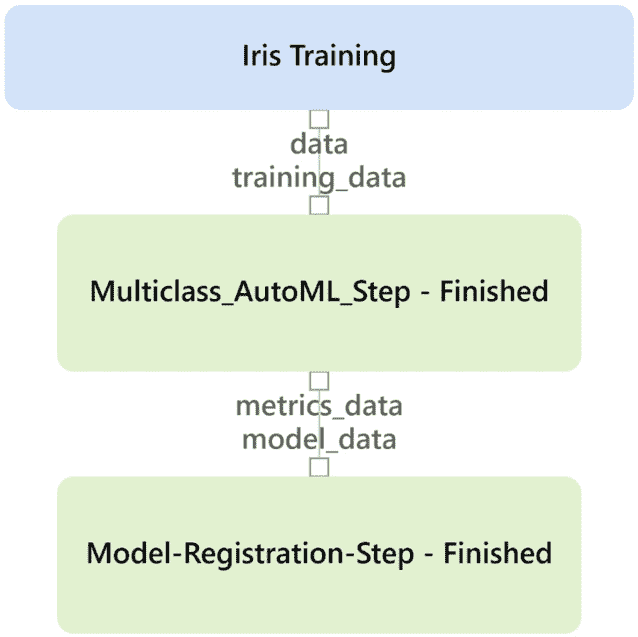
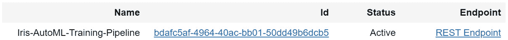

# *第九章*:实施批量评分解决方案

您已经在 Azure 中使用 AutoML 训练了回归、分类和预测模型，现在是时候学习如何将它们投入生产并使用它们了。**机器学习** ( **ML** )模型毕竟最终是用来对新数据进行预测的，无论是实时的还是批量的。为了在 Azure 中对新的数据点进行批量评分，您必须首先创建一个 ML 管道。

ML 管道让你在 Azure 机器学习服务(**)中运行可重复的 Python 代码，你可以按计划运行这些代码。虽然您可以使用 ML 管道运行任何 Python 代码，但是在这里您将学习如何构建管道来对新数据进行评分。**

 **本章开始时，您将编写一个简单的 ML 管道，使用您在第五章 、*构建 AutoML 分类解决方案*中 [*对 Iris 数据集训练的多类分类模型对数据进行评分。使用相同的数据，您将学习如何并行计算新的数据点，使您能够同时快速计算数百万到数十亿个数据点的模型。*](B16595_05_ePub.xhtml#_idTextAnchor068)

一旦您编写了这两个管道，您将学习如何创建一个 ML 管道来重新训练一个 AutoML 模型。最后，您将了解如何通过 GUI 手动重新触发 ML 管道，以及如何通过 **Azure ML SDK** 以编程方式重新触发 ML 管道。

在本章结束时，你将不仅能够训练 AutoML 模型，而且能够使用它们以可重复、可自动化的方式对新数据进行评分。此外，您在这里学到的代码和技术适用于所有的 ML 模型，而不仅仅是那些自动生成的 ML 模型。对任何 ML 工程师来说，编写批量评分解决方案都是一项关键技能，通过完成本章的练习，你将很快掌握这项技能。

在本章中，我们将讨论以下主题:

*   创建 ML 管道
*   创建平行评分管道
*   创建 AutoML 训练渠道
*   触发和安排您的 ML 管道

# 技术要求

这一章将重点介绍在 AMLS 使用 Jupyter 笔记本进行的大量编码工作。因此，你需要一个有效的互联网连接，一个 AMLS 的工作空间和一个 T2 的计算实例。ML 管道还需要一个**计算集群**。您还需要在第 5 章 、*构建自动分类解决方案*中训练并注册虹膜多类分类模型。

以下是本章的先决条件:

*   上网。
*   网络浏览器，最好是谷歌 Chrome 或微软 Edge Chromium。
*   一个 Microsoft Azure 帐户。
*   创建了一个 AMLS 工作室。
*   在 [*第二章*](B16595_02_ePub.xhtml#_idTextAnchor023) ，【Azure 机器学习服务入门中创建了`compute-cluster`计算集群。
*   了解如何从 Azure 计算实例导航到 Jupyter 环境，如第四章 、*构建 AutoML 回归解决方案*中所示。
*   在 [*第五章*](B16595_05_ePub.xhtml#_idTextAnchor068)*构建 AutoML 分类解决方案*中训练并注册了`Iris-Multi-Classification-AutoML` ML 模型。

本章的代码可以在这里找到:[https://github . com/packt publishing/Automated-Machine-Learning-with-Microsoft-Azure/tree/master/chapter 09](https://github.com/PacktPublishing/Automated-Machine-Learning-with-Microsoft-Azure/tree/master/Chapter09)。

# 创建 ML 管道

ML pipelines 是 Azure 针对批量评分 ML 模型的解决方案。您可以使用 ML 管道对您训练的任何模型进行评分，包括您自己的自定义模型以及 AutoML 生成的模型。它们只能通过使用 Azure ML Python SDK 的代码来创建。在本节中，您将使用您在第四章 、*构建自动回归解决方案*中构建的`Diabetes-AllData-Regression-AutoML`模型编写一个简单的管道来对糖尿病数据进行评分。

与其他章节一样，您将首先打开您的计算实例，并导航到您的 Jupyter 笔记本环境。然后，您将创建并命名一个新笔记本。创建好笔记本后，您将逐步构建、配置和运行 ML 管道。在确认您的管道已经成功运行之后，您将把您的 ML 管道发布到管道端点。**管道端点**就是 URL，调用 ML 管道运行的网址。

下面的步骤与前面的章节有很大的不同。您将不得不加载更多的库，还需要编写一个定制的 Python 文件来记录新数据。您还将学习如何创建**环境**，即指定您正在使用的 Python 包、包版本和软件设置的工件。

除了创建一个环境，您还需要将其容器化。最后，您将需要配置和运行您的 ML 管道，通过将您的管道发布到一个端点来完成这个过程。整个过程如*图 9.1* 所示:


图 9.1–创建您的 ML 评分管道所涉及的步骤

GitHub 存储库中的`ML-Scoring-Pipeline.ipynb`文件包含所有步骤的代码。

## 编写您的 ML 评分流程的前三个步骤

首先，加载您的库，设置您的 AMLS 资源，并通过以下步骤创建一个用于评分的数据集:

1.  通过导航到[https://ml.azure.com/](https://ml.azure.com/)打开**蔚蓝机器学习工作室** ( **AML 工作室**)。
2.  点击**计算**并启动一个计算实例。任何计算实例都可以工作，因为它们都链接到同一个 Jupyter 笔记本环境。
3.  创建一个新的 Jupyter 笔记本，命名为`machine-learning-pipeline`。如果你需要复习如何做到这一点，请回顾第四章[](B16595_04_ePub.xhtml#_idTextAnchor056)*，*构建一个 AutoML 回归解决方案*。*
**   Open your newly created notebook and begin by importing all of the standard Azure libraries you will need using the following code:

    ```
    from azureml.core import Workspace, Dataset, Datastore
    from azureml.core import Experiment, Environment, Model
    from azureml.core.compute import ComputeTarget
    ```

    [*第四章*](B16595_04_ePub.xhtml#_idTextAnchor056) ，*构建 AutoML 回归解决方案*，讲解`Workspace`，`Dataset`，`Datastore`，`Experiment`，`ComputeTarget`。`Environment`允许您创建一个对象，该对象包含 ML 管道需要安装哪些 Python 包才能成功运行的信息。`Model`让您检索之前训练的 ML 模型。

    *   Continuing on, import all of the Azure ML pipeline libraries with the following code:

    ```
    from azureml.core.runconfig import RunConfiguration, CondaDependencies, DEFAULT_CPU_IMAGE
    from azureml.pipeline.steps import PythonScriptStep
    from azureml.pipeline.core import Pipeline, PublishedPipeline
    from azureml.pipeline.core import StepSequence
    from azureml.widgets import RunDetails
    ```

    `RunConfiguration`存储您的 ML 管道将需要运行的信息，包括环境和基本映像。`CondaDependencies`允许您向环境中添加 Python 包。需要`Default_CPU_Image`来指定您将在运行配置中使用哪个基本映像。`PythonScriptStep`是`Pipeline`的一种，是构建 ML 管道的核心包。`PublishedPipeline`允许您将 ML 管道发布到端点。`StepSequence`让您设置 ML 管道步骤的顺序，而`RunDetails`只是显示 ML 管道运行时的输出。

    重要说明

    如果你在加载任何 Azure 库时遇到问题，请通过运行此处找到的`Update AzureML SDK.ipynb`笔记本来更新 Azure ML SDK:[https://github . com/packt publishing/Automated-Machine-Learning-with-Microsoft-Azure/blob/master/Update-Azure ML-SDK . ipynb](https://github.com/PacktPublishing/Automated-Machine-Learning-with-Microsoft-Azure/blob/master/Update-AzureML-SDK.ipynb)。

    *   导入`pandas`、`numpy`和`os`。`os`将允许您在 Jupyter 笔记本上创建和操作文件和文件夹。`random`会让你生成随机数，这对模拟新的虹膜数据很有用:

    ```
    import pandas as pd
    import numpy as np
    import os
    import random as r
    ```

    *   Connect your Jupyter notebook to your AMLS workspace:

    ```
    ws = Workspace.from_config()
    ```

    如果提示您登录，请按照说明进行操作。

    *   将您的计算集群设置为您在第 2 章 、【Azure 机器学习服务入门 :

    ```
    compute_name = 'compute-cluster'
    compute_target = ComputeTarget(ws, compute_name)
    ```

    中创建的集群*   设置您的数据存储:

    ```
    datastore = Datastore.get_default(ws)
    ```

    *   接下来，您将创建模拟虹膜数据进行评分。首先用下面的代码创建四个变量，其中包含一个基于原始 Iris 数据集的最小值和最大值的数字列表。这些变量包含虹膜数据集中包含的所有可能值:

    ```
    sepal_length_range = np.arange(4.3, 7.9, 0.1)
    sepal_width_range = np.arange(2, 4.4, 0.1)
    petal_length_range = np.arange(1, 6.9, 0.1)
    petal_width_range = np.arange(0.1, 2.5, 0.1)
    ```

    *   继续创建模拟 Iris 数据，创建一个名为 IrisDF 的空`pandas`数据帧，并使用适当的列名。同样，创建一个名为`IrisList` :

    ```
    columns =\ ['sepal_length','sepal_width','petal_length','petal_width']
    IrisDF = pd.DataFrame(columns=columns)
    IrisList = []
    ```

    的空列表*   Continuing with the creation of simulated Iris data, use the `choice` function from the `random` package within a `for` loop to create 100 new data points, rounding each value to `1` decimal place.

    将每个由四个数据点组成的集合与`for`循环中 Python 字典中的列名组合起来，并将该字典逐行追加到`IrisList`:

    ```
    for i in range(0,100):
        values = \
    [round(r.choice(sepal_length_range),1),round(r.choice(sepal_width_range),1),round(r.choice(petal_length_range),1),round(r.choice(petal_width_range),1)]
        iris_dictionary = pd.DataFrame(dict(zip(columns, values)),index=[0])
        IrisList.append(iris_dictionary)
    ```

    这段代码将为您留下一个从原始 Iris 数据集中随机生成的值列表，这些值可以转换成一个`pandas`数据帧。

    *   完成模拟虹膜数据的创建，将`IrisList`追加到`IrisDF` :

    ```
    IrisDF = IrisDF.append(IrisList,True)
    ```

    *   用以下代码注册您的模拟虹膜数据:

    ```
    Dataset.Tabular.register_pandas_dataframe(IrisDF, datastore, 'Iris_Scoring')
    ```* 

 *这将把它保存到您的数据存储中，并创建一个名为`Iris Scoring`的 Azure 数据集。

## 创建 Python 脚本，为您的 ML 管道中的数据评分

在此部分中，您将创建一个文件夹，然后编写一个 Python 脚本，您的 ML 管道将执行该脚本来使用以下步骤对数据进行评分:

1.  Make a folder to hold your scoring script using `os`:

    ```
    os.makedirs('Scoring_Scripts', exist_ok=True)
    ```

    对于您进行的每个 ML 管道步骤，您必须有一个伴随的 Python 脚本。

2.  编写一个 Python 脚本来记录新数据。这个脚本很长，必须是一个代码块。首先使用`%%writefile` magic 命令写出一个名为`Iris_Scoring.py`的新 Python 脚本文件。`Run`允许您的程序在计算集群上远程运行时访问您用来创建 ML 管道的 AMLS 工作区。
3.  Continuing in the same cell as part of `Iris_Scoring.py`, import the other Python packages:

    ```
    import joblib
    import numpy as np
    import pandas as pd
    import os
    ```

    这里唯一的新包是`joblib`，它可以让你加载保存的 ML 模型。

4.  继续在同一个单元格中作为`Iris_Scoring.py`的一部分，使用`Run`函数设置一个名为`run`的变量。您可以使用这个变量来设置您的 AMLS 工作空间:

    ```
    run = Run.get_context()
    ```

5.  Continuing in the same cell as part of `Iris_Scoring.py`, we are going to create a function called `main`. This function will run the main part of your scoring code.

    首先，使用您创建的`run`变量连接到您的 AMLS 工作区。接下来，将您的数据存储设置为默认选项，将您的数据集设置为`Iris Scoring`。将`Iris Scoring`数据集转换成名为`scoringDF`的`pandas`数据帧:

    ```
    def main():
        ws = run.experiment.workspace
        datastore = Datastore.get_default(ws)
        dataset = Dataset.get_by_name(ws,'Iris Scoring')
        scoringDF = dataset.to_pandas_dataframe()
    ```

6.  继续在同一个单元中作为`Iris_Scoring.py`的一部分，用 Azure `Model`和`joblib`包加载你的`Iris-Multi-Classification-AutoML`模型:

    ```
        model_path = Model.get_model_path('Iris-Multi-Classification-AutoML')
        model = joblib.load(model_path)
    ```

7.  Continuing in the same cell as part of `Iris_Scoring.py`, use your model to make predictions on `scoringDF`, save those predictions to a `pandas` `Series`, and add the predictions back to your `scoringDF` DataFrame in a new column called `Prediction`:

    ```
        predictions = model.predict(scoringDF)
        predSeries = pd.Series(predictions)
        scoringDF['Prediction'] = predSeries
    ```

    当您添加新列时，预测将按正确的顺序排列并匹配相应的行。

8.  Continuing in the same cell as part of `Iris_Scoring.py`, make a folder called `Output_Folder` using `os`:

    ```
        output_datastore_path = 'Output_Folder'
        os.makedirs(output_datastore_path, exist_ok=True) 
    ```

    这将在您的计算集群上创建一个文件夹来临时存储您的预测，以便您可以将它们传输到您的数据存储。

9.  Continuing in the same cell as part of `Iris_Scoring.py`, specify a file called `Iris_Predictions.csv`. Then, use `os` to specify a path on the compute cluster where you will write that file out. Finally, use `to_csv` to write out `scoringDF` to your compute cluster:

    ```
        FileName = "Iris_Predictions.csv"
        OutputPath = os.path.join(output_datastore_path, FileName)
        scoringDF.to_csv(OutputPath, index = False, sep=',')
    ```

    这段代码会将您的输出写入您的计算集群。这是将其移动到数据存储中所必需的。

10.  继续在同一个单元格中作为`Iris_Scoring.py`的一部分，将`Iris_Predictions.csv`上传到您的数据存储。这段代码会将它写到一个名为`Output_Folder`的文件夹中，与您的计算集群上的目录结构相匹配。

    ```
        datastore.upload_files(files=[OutputPath], target_path=output_datastore_path, overwrite=True)
    ```

11.  完成`Iris_Scoring.py`，使用`os`从您的计算集群中删除文件和文件夹。用样板代码结束单元格，当在 ML 管道中调用 Python 脚本时，样板代码将自动运行您的`main`函数

这就完成了您的 Python 脚本。在新的单元格中编写下一段代码。

## 创造环境并将其容器化

困难的部分已经结束，剩下的就是纯粹的样板文件，从创造一个环境开始。**环境**是运行代码所需的 Python 包的集合:

1.  In a new cell, create an environment. Also, set a variable using `CondaDependencies`:

    ```
    Env = Environment(name='AutoML Environment')
    conda_dep = CondaDependencies()
    ```

    运行 Python 脚本所需的所有包和包的版本将在下一步添加到`conda_dep`变量中。

2.  Attach Python packages to your `conda_dep` variable, beginning with the packages found in the `conda` package manager:

    ```
    conda_dep.add_conda_package("numpy==1.18.5")
    conda_dep.add_conda_package("joblib==0.14.1")
    conda_dep.add_conda_package("pandas==0.25.3")
    conda_dep.add_conda_package("packaging==20.7")
    conda_dep.add_conda_package("xgboost==0.90")
    ```

    有两个包管理器，`conda`和`pip`。`conda`自动为你解析依赖关系。所以，如果一个包需要另一个包，你不用担心。`pip`需要你自己解决这些依赖关系。因此，如果一个包在`conda`和`pip`都可用，总是通过`conda`安装它。

    安装软件包时，请始终指定版本。您可以通过在空白单元格中运行`!pip freeze`命令来发现您正在使用的版本。除了`numpy`、`joblib`和`pandas`，AutoML 生成的模型还需要`packaging`和`xgboost`运行。

3.  Attach Python packages to your `conda_dep` variable that are not available in `conda` using `pip` instead:

    ```
    conda_dep.add_pip_package("azureml-defaults==1.19.0")
    conda_dep.add_pip_package("azureml-automl-core==1.19.0")
    conda_dep.add_pip_package("azureml-automl-runtime==1.19.0")
    ```

    有三个包；`azureml-defaults`使您能够使用标准的 Azure ML SDK 函数，而`azureml-automl-core`和`azureml-automl-runtime`是对任何 AutoML 生成的模型进行评分所必需的。

4.  Add the `conda_dep` variable to your environment and register the environment to your AMLS workspace by using the following code:

    ```
    Env.python.conda_dependencies=conda_dep
    RegisteredEnvironment = Env.register(workspace=ws)
    ```

    现在您的环境已经注册，您可以在 AMLS 的任何地方调用它。

5.  创建一个`RunConfiguration`对象来容器化你的环境。设置你的环境，启用 Docker，使用`DEFAULT_CPU_IMAGE`作为你的基础镜像:

    ```
    run_config = RunConfiguration()
    run_config.environment = Env
    run_config.environment.docker.enabled = True
    run_config.environment.docker.base_image =\
     DEFAULT_CPU_IMAGE
    ```

这将创建一个 **Docker 容器**，一个可移植的代码包，它可以在任何地方运行，因为它包含了所有代码的脚本和依赖项。现在，您的 ML 管道可以利用您的环境了，您将在最后一系列步骤中对其进行配置。

## 配置和运行您的 ML 评分渠道

随着您的环境的构建和容器化，您的 Python 脚本的编写，以及您的所有 AMLS 资源的设置，您已经准备好通过以下步骤来配置和运行您的 ML 管道:

1.  Configure your ML pipeline step with the following code. You need to give your step a name, `iris-scoring-step`, and specify your Python script name, Python script folder location, compute target, and run configuration. Always set `allow_reuse` to `False`:

    ```
    scoring_step = PythonScriptStep(name='iris-scoring-step',
    script_name='Iris_Scoring.py',
    source_directory='Scoring_Scripts', 
    arguments=[],
    inputs=[],
    compute_target=compute_target,
    runconfig=run_config,
    allow_reuse=False)
    ```

    将`allow_reuse`设置为`True`是为了调试多步管道，您可以跳过重新运行一个成功完成的步骤。

2.  Set your **step sequence** and **pipeline object**:

    ```
    step_sequence = StepSequence(steps=[scoring_step])
    pipeline = Pipeline(workspace=ws, steps=step_sequence)
    ```

    步骤序列是 ML 管道步骤运行的顺序。

3.  Give your pipeline experiment run a name, `Iris-Scoring-Pipeline-Run`, and submit it with the following code:

    ```
    pipeline_experiment = Experiment(ws, 'Iris-Scoring-Pipeline-Run')
    pipeline_run = pipeline_experiment.submit(pipeline, show_output=True)
    ```

    最后，这是启动你的管道！

4.  Use `RunDetails` to watch your pipeline get built and execute in real time:

    ```
    RunDetails(pipeline_run).show()
    pipeline_run.wait_for_completion(show_output=True)
    ```

    当它运行时，您会看到许多日志。如果您的管道运行成功，它将完成，并带有**完成**的字样。您应该会看到与*图 9.2* 中的图形相同的图形:

    

    图 9.2-成功的管道运行图

5.  Publish your pipeline to an endpoint with the following code, specifying a name, description, and version number:

    ```
    published_pipeline = pipeline_run.publish_pipeline(
        name='Iris-Scoring-Pipeline',\
        description='Pipeline that Scores Iris Data', version= '1.0')
    published_pipeline
    ```

    所有已发布的管道都需要由创建者设置版本号。运行这段代码将为您提供一个发布的管道 ID 以及一个到端点的链接，如*图 9.3* 所示:


图 9.3–成功发布的管道

现在您已经执行并发布了您的评分管道，您可以检查并下载您的评分文件。它被保存到名为`Iris_Predictions.csv`的文件中的文件夹中。通过导航到您的存储帐户直接访问文件。你可以从 Azure 门户网站(【https://portal.azure.com】T4)或者通过**AML**studio 来完成这项工作。

## 通过 AML studio 访问您的评分预测

要访问`Iris_Predictions.csv`并下载到你的桌面，你首先要找到你的存储账户。您可以通过 AML studio 找到您的存储帐户。

以下步骤将让您通过 AML studio 找到您的数据存储，访问您的存储帐户，导航到正确的文件，并将其下载到您的本地计算机。通过这种方式，你可以将人工智能生成的预测用于任何你希望的目的:

1.  导航至位于[https://ml.azure.com](https://ml.azure.com)的反洗钱工作室。
2.  单击左侧面板上的**数据存储库**。
3.  点击页面中间的蓝色链接到 **workspaceblobstore** (默认)。
4.  点击`automlexamplew`下您的存储帐户的蓝色链接，后跟一串数字。这将带您进入 Azure 中的存储帐户资源。
5.  进入您的存储帐户后，单击屏幕左中央的蓝色链接，链接到**容器**。单击框中的任何位置都可以。
6.  现在，您将看到一个文件夹列表。单击以`azureml-blobstore-`开头、后跟唯一标识符 ID 的文件夹。
7.  Click `azureml`, `managed-dataset`, and `UI`. These folders hold logs for your experiments, among other objects. *Figure 9.4* shows the folder structure you need to follow to reach your file:

    图 9.4-输出文件的路径

8.  点击 **Iris_Predictions.csv** 。
9.  点击`Iris_Predictions.csv`到你的本地机器。它是一个带标题的逗号分隔文件。
10.  用 Microsoft Excel 或类似软件打开您的文件，查看您的数据。

这需要做大量的工作，但是现在您有了一个可以批量计算新数据点的工作管道端点。这是一个巨大的成就，因为许多组织在建立这样的工作流时都有困难。您也可以在多个项目中轻松重用这些代码，因为绝大多数代码都是样板文件。虽然您必须修改 Python 脚本并适当地添加包，但是该模板也可以用于对 AutoML 和定制 ML 模型进行评分。

接下来，您将学习如何使用并行评分管道在最短时间内获得 10，000，000 个数据点。

# 创建平行评分管道

标准 ML 管道对于大多数 ML 用例来说工作得很好，但是当您需要一次对大量数据进行评分时，您需要一个更强大的解决方案。这就是`ParallelRunStep`的用武之地。`ParallelRunStep`是 Azure 对大数据批量评分的回答。当您使用`ParallelRunStep`时，您可以同时利用计算集群上的所有内核。

假设您有一个由八个`Standard_DS3_v2`虚拟机组成的计算集群。每个`Standard_DS3_v2`节点都有四个核心，因此可以一次执行 32 个并行评分过程。这种并行化本质上使您获得数据的速度比使用单台机器快很多倍。此外，它可以轻松地纵向扩展(增加集群中每个虚拟机的大小)和横向扩展(增加节点数量)。

本节将让你成为一名能够对大量数据进行评分的*大数据*科学家。这里，您将再次使用模拟的虹膜数据，但不是 100 行，而是一次对 1000 万行进行评分。

此外，这是一种高级解决方案，它利用了两个管道步骤，一个是并行对数据进行评分，另一个是将数据传输到输出文件夹。通过学习这个例子，您将理解如何创建高级的多步管道运行来解决困难的问题。

重要说明

并行运行批量评分数据，将数据集分成许多小部分。如果有任何数据预处理依赖于对先前行进行的计算，那么这个预处理应该在传递给`ParallelRunStep`之前在单独的`PythonScriptStep`中完成。

这段代码的大部分类似于*创建 ML 管道*部分。但是，需要创建两个管道步骤，而不是一个。此外，还将向您介绍新的概念，如`input`和`output`管道配置选项。在本节的最后，您还将把管道发布到一个端点。*图 9.5* 显示了整个过程:


图 9.5–创建平行评分管道的步骤

如果您需要复习任何步骤，请参考*创建 ML 管道*部分。您可以在 GitHub 存储库中的`ML-Parallel-Pipeline.ipynb`文件中找到所有步骤的代码。

## 编写您的 ML 并行评分流程的前三个步骤

要创建您的平行评分管道，请从以下步骤开始:

1.  在您计算实例上导航到您的 Jupyter 环境，并创建一个新的 Jupyter 笔记本。命名为`ml-parallel-pipeline`。
2.  打开你新创建的笔记本并导入你的标准 Azure 库:

    ```
    from azureml.core import Workspace, Dataset, Datastore
    from azureml.core import Experiment, Environment, Model
    ```

3.  From `azureml.core.compute`, import `ComputeTargetNext` and import all of the Azure ML pipeline libraries with the following code:

    ```
    from azureml.core.runconfig import RunConfiguration, CondaDependencies, DEFAULT_CPU_IMAGE
    from azureml.pipeline.steps import PythonScriptStep, ParallelRunStep, ParallelRunConfig
    from azureml.pipeline.core import Pipeline, PublishedPipeline, PipelineData
    from azureml.pipeline.core import StepSequence
    from azureml.widgets import RunDetails
    ```

    与上一节相比，增加了三个包。`ParallelRunStep`是一个 ML 管道步骤，让你并行运行 Python 代码。`ParallelRunConfig`让您配置`ParallelRunStep`。`PipelineData`允许您将中间数据从一个步骤传递到另一个步骤。

    重要说明

    如果你在加载任何 Azure 库时遇到问题，请通过运行此处找到的`Update AzureML SDK.ipynb`笔记本来更新 Azure ML SDK:[https://github . com/packt publishing/Automated-Machine-Learning-with-Microsoft-Azure/blob/master/Update-Azure ML-SDK . ipynb](https://github.com/PacktPublishing/Automated-Machine-Learning-with-Microsoft-Azure/blob/master/Update-AzureML-SDK.ipynb)。

4.  导入`pandas`、`numpy`、`os`、`random` :

    ```
    import pandas as pd
    import numpy as np
    import os
    import random as r
    ```

5.  As always, connect your Jupyter notebook to your AMLS workspace:

    ```
    ws = Workspace.from_config()
    ```

    如果提示您登录，请按照说明进行操作。

6.  使用以下代码设置您的计算集群:

    ```
    compute_name = 'compute-cluster'
    compute_target = ComputeTarget(ws, compute_name)
    ```

7.  设置您的数据存储:

    ```
    datastore = Datastore.get_default(ws)
    ```

8.  使用以下代码创建模拟虹膜数据:

    ```
    sepal_length_range = np.arange(4.3, 7.9, 0.1)
    sepal_width_range = np.arange(2, 4.4, 0.1)
    petal_length_range = np.arange(1, 6.9, 0.1)
    petal_width_range = np.arange(0.1, 2.5, 0.1)
    ```

9.  继续创建模拟虹膜数据，创建一个空的`pandas`数据帧和列表:

    ```
    columns =\
    ['sepal_length','sepal_width','petal_length','petal_width']
    IrisDF = pd.DataFrame(columns=columns)
    IrisList = []
    ```

10.  Continuing with the creation of simulated Iris data, use the `choice` function from the `random` package within a `for` loop to create 10,000,000 new data points, rounding each value to `1` decimal place:

    ```
    for i in range(0,10000000):
        values =\
    [round(r.choice(sepal_length_range),1),round(r.choice(sepal_width_range),1),\
    round(r.choice(petal_length_range),1),round(r.choice(petal_width_range),1)]
        iris_dictionary = pd.DataFrame(dict(zip(columns, values)),index=[0])
        IrisList.append(iris_dictionary)
    ```

    这将需要一段时间，所以给它一些时间来运行。

11.  完成模拟虹膜数据的创建，将`IrisList`追加到`IrisDF` :

    ```
    IrisDF = IrisDF.append(IrisList,True)
    ```

12.  用以下代码注册您的模拟虹膜数据:

    ```
    Dataset.Tabular.register_pandas_dataframe(IrisDF, datastore, 'Iris_Scoring')
    ```

这将把它保存到您的数据存储中，并创建一个名为`Iris Parallel Scoring`的 Azure 数据集。现在，您已经准备好编写 Python 脚本了。

## 创建 Python 脚本，对您的 ML 并行管道中的数据进行评分

接下来，创建一个文件夹，然后编写两个 Python 脚本，您的 ML 管道将执行这两个脚本来对数据进行评分。您将需要一个步骤来进行预测，另一个步骤将您的输出传输到数据存储上的最终目标:

1.  Make a folder to hold your scoring script using `os`:

    ```
    os.makedirs('Scoring_Scripts', exist_ok=True)  
    ```

    这个文件夹应该已经存在于上一节中，但是这个代码不会出错，因为`exist_ok`被设置为`True`。该文件夹将保存您将为并行管道运行编写的两个脚本。

2.  Write a Python script to score new data in parallel:

    ```
    %%writefile Scoring_Scripts/Iris_Scoring.py
    from azureml.core import Run, Workspace
    from azureml.core import Dataset, Datastore, Model
    ```

    这个脚本与前面的脚本有很大的不同，但也必须在一个单元格中。首先使用`%%writefile` magic 命令编写一个名为`Iris_Parallel_Scoring.py`的新 Python 脚本文件。从加载 Azure 库开始。您应该可以从上一节中认出它们。

3.  Continuing in the same cell as part of `Iris_Parallel_Scoring.py`, import other Python packages, including the new `argparse` package:

    ```
    import os
    import joblib
    import argparse
    import numpy as np
    import pandas as pd
    ```

    这个包允许你将参数传递到你的脚本中。**参数**是灵活的代码片段，您可以在运行时将它们传递到您的管道中。例如，您可以使用参数传入不同的数据存储或数据集。

4.  继续在同一个单元格中作为`Iris_Parallel_Scoring.py`的一部分，使用`Run`函数:

    ```
    run = Run.get_context()
    ```

    设置一个名为`run`的变量
5.  Continuing in the same cell as part of `Iris_Parallel_Scoring.py`, create a function called `init`. This function will pass in your arguments and load your ML model, setting it to a global variable.

    `parser`存储您的参数，并将`model_name`参数添加到该变量中。`ParallelRunStep` 也传递幕后隐藏的参数，所以还需要设置`unknown_args`。一旦完成，使用`model_name`参数使用`joblib`加载您的模型，如下面的代码所示:

    ```
    def init():
        parser = argparse.ArgumentParser()
        parser.add_argument('--model_name',\
        dest="model_name", required=True)
        args, unknown_args = parser.parse_known_args()
        global model
        model_path = Model.get_model_path(args.model_name)
        model = joblib.load(model_path)
    ```

6.  Continuing in the same cell as part of `Iris_Parallel_Scoring.py`, create a function called `main`. This function will score your data and return the result, which will be automatically stored in a file called `parallel_run_step.txt.model` with the Azure `Model` and `joblib` packages.

    首先，您将对您的`model`变量使用`predict`函数来进行预测。请注意，数据是作为名为`input_data`的`pandas`数据帧自动传递给这个函数的。

    然后将这些预测转换成一个序列，并作为一个名为`Prediction`的列添加回`input_data`。完成`Iris_Parallel_Scoring.py`后，你返回完成的`input_data`数据帧被自动写入文本文件:

    ```
    def run(input_data):
        predictions = model.predict(input_data)  
        predSeries = pd.Series(predictions)
        input_data['Prediction'] = predSeries 
        print('Data written to parallel_run_step.txt')
            return input_data 
    ```

7.  Write a Python script to transfer your results to the output location of your choice. `ParallelRunStep` outputs a file called `parallel_run_step.txt`. This will be stored as pipeline data.

    管道数据是保存在数据存储中的数据，作为传递到另一个 ML 管道步骤的中间步骤。此外，`parallel_run_step.txt`没有标题，您需要添加它们。

    首先使用`%%writefile` magic 命令写出一个名为`Iris_Parallel_Output_Creation.py`的新 Python 脚本文件。首先像往常一样加载 Azure 库:

    ```
    %%writefile Scoring_Scripts/Iris_Parallel_Output_Creation.py
    from azureml.core import Run, Workspace
    from azureml.core import Dataset, Datastore
    ```

8.  Continuing in the same cell as part of `Iris_Parallel_Output_Creation.py`, load in all of the standard Python packages you need:

    ```
    import pandas as pd
    import numpy as np
    import os
    import argparse
    ```

    你将一次再次需要`argparse`传入参数，即保存`parallel_run_step.txt`的文件夹。

9.  继续在同一个单元格中作为`Iris_Parallel_Output_Creation.py`的一部分，使用`Run`函数:

    ```
    run = Run.get_context()
    ```

    设置一个名为`run`的变量
10.  Continuing in the same cell as part of `Iris_Parallel_Output_Creation.py`, pass in your arguments to access the folder that holds `parallel_run_step.txt`:

    ```
    parser = argparse.ArgumentParser()
    parser.add_argument("--input_data_folder",type=str)
    args = parser.parse_args()
    ```

    在配置这个管道步骤时，调用`input_data_folder`参数并将其作为参数传递。

11.  Continuing in the same cell as part of `Iris_Parallel_Output_Creation.py`, write a function called `main`. This function will transfer your predictions from an intermediate pipeline data location to its final destination.

    首先使用`os`和`input_data_folder`找到包含`parallel_run_step.txt`的路径。然后，使用下面的代码将它作为一个没有头的空格分隔的文本文件读入一个名为`result`的`pandas`数据帧中:

    ```
    def main():  
        FileName = "parallel_run_step.txt"
        input_data_path =\
     os.path.join(args.input_data_folder, FileName)  
        result =\
     pd.read_csv(input_data_path, delimiter=" ", header=None)
    ```

12.  Continuing in the same cell as part of `Iris_Parallel_Output_Creation.py`, as part of your `main` function, add columns to your `result` DataFrame:

    ```
        columns =\
    ['sepal_length','sepal_width','petal_length','petal_width', 'Prediction']
        result.columns = columns
    ```

    重要的是要记住`parallel_run_step.txt`从来没有标题，所以您需要按照前面代码所示的正确顺序手动输入列。

13.  Continuing in the same cell as part of `Iris_Parallel_Output_Creation.py`, as part of your `main` function, connect to your AMLS workspace using the `run` variable and set a variable for your datastore:

    ```
        ws = run.experiment.workspace
        datastore = Datastore.get_default(ws)
    ```

    这是保存最终输出文件的数据存储。

14.  Continuing in the same cell as part of `Iris_Parallel_Output_Creation.py`, as part of your `main` function, use `os` to create a folder called `Output_Folder` on your compute cluster, and write a CSV file called `Iris_Parallel_Predictions.csv`:

    ```
        output_datastore_path = 'Output_Folder'
        os.makedirs(output_datastore_path, exist_ok=True) 
        FileName = "Iris_Parallel_Predictions.csv"
        OutputPath = os.path.join(output_datastore_path, FileName)
        result.to_csv(OutputPath, index = False, sep=',') 
    ```

    即使原始的`parallel_run_step.txt`文件是空格分隔的，您也可以将最终输出文件的分隔符设置为您想要的任何值。

15.  Completing `Iris_Parallel_Output_Creation.py`, upload `Iris_Parallel_Predictions.csv` to your datastore in a folder called `Output_Folder`.

    然后，使用`os`从您的计算集群中删除`Iris_Parallel_Predictions.csv`和`Output_Folder`。最后，触发您的`main`函数，就像您在*创建 ML 管道*部分所做的那样:

    ```
        datastore.upload_files(files=[OutputPath], target_path = output_datastore_path, overwrite=True)
        os.remove(OutputPath)
        os.rmdir(output_datastore_path)
    if __name__ == '__main__':
        main()
    ```

两个步骤都写好了，剩下的代码就是纯粹的样板文件，用于容器化您的环境以及配置和运行您的管道。

## 配置和运行您的 ML 并行评分管道

既然您已经在*创建 ML 管道*部分构建了您的环境，那么剩下的就是配置您的 ML 管道步骤了。使用以下步骤:

1.  在一个新的单元格中，用下面的代码检索您在*创建 ML 管道*一节中创建的环境:

    ```
    Env = Environment.get(ws, 'AutoML Environment') 
    ```

2.  Next, define a variable that defines your pipeline data and assigns it to a datastore:

    ```
    parallel_run_output =\
    PipelineData(name='parallel_predictions', datastore=datastore)
    ```

    这是你第一步和第二步之间的位置。您还必须为此管道数据对象命名。

3.  Enable Docker on your environment and specify `DEFAULT_CPU_IMAGE` as your base image for your `ParallelRunStep`:

    ```
    parallel_environment = Env
    parallel_environment.docker.enabled = True 
    parallel_environment.docker.base_image = DEFAULT_CPU_IMAGE
    ```

    您不需要为`ParallelRunStep`指定一个`RunConfiguration`对象。

4.  为您的输出创建步骤创建一个`RunConfiguration`对象:

    ```
    run_config = RunConfiguration()
    run_config.environment = Env
    run_config.environment.docker.enabled = True
    run_config.environment.docker.base_image = DEFAULT_CPU_IMAGE
    ```

5.  Set your parallel run configurations with the following code:

    ```
    parallel_run_config = ParallelRunConfig(
        source_directory='Scoring_Scripts/',
        entry_script="Iris_Parallel_Scoring.py",
        mini_batch_size="1MB",
        error_threshold=5,
        output_action="append_row",
        environment=parallel_environment,
        compute_target=compute_target,
        run_invocation_timeout=60,
        node_count=4,
        logging_level="DEBUG") 
    ```

    您需要输入 Python 脚本的名称以及保存它的源目录。您需要指定多少数据将与`mini_batch_size`并行评分。For all `error_threshold`是在整个管道失败之前，该步骤可以并行失败的次数。接下来，将`output_action`设置为`append_row`会自动为你生成`parallel_run_step.txt`。`output_action`的其他选项是劳动密集型的。

    将您的计算目标设置为适当的计算集群，并指定您的环境。将`run_invocation_timeout`设置为 60 秒，这样如果空闲时间过长，您的运行将会失败，并将`node_count`设置为等于您的计算集群中的节点数，以确保最大的并行化。最后，将`logging_level`设置为`DEBUG`以获取信息日志。

6.  Set the two variables that you will need to create your parallel scoring step, your dataset, and your model name:

    ```
    dataset = Dataset.get_by_name(ws,'Iris Parallel Scoring')
    input_data =\
    dataset.as_named_input('Iris_Parallel_Scoring')
    model_name = 'Iris-Multi-Classification-AutoML'
    ```

    数据集需要通过`as_named_input`代码传入，并在 Python 脚本中显示为`input_data`变量。

7.  Create your parallel scoring step using the following code:

    ```
    parallel_scoring_step = ParallelRunStep(
        name="iris-parallel-scoring-step",
        parallel_run_config=parallel_run_config,
        inputs=[input_data],
        output=parallel_run_output,
        arguments=['--model_name', model_name],
        allow_reuse=False) 
    ```

    您需要给这个步骤起一个名字`iris-parallel-scoring-step`。不允许有空格。使用`parallel_run_config`传入您的配置，使用`inputs`传入您的数据集。将`output`设置为您的管道数据对象，并将您的模型名称作为参数传入。像往常一样，将`allow_reuse`设置为等于`False`。

8.  Create your output creation step using the following code:

    ```
    output_step =\
     PythonScriptStep(name='iris-output-step',
    script_name='Iris_Parallel_Output_Creation.py',
    source_directory='Scoring_Scripts', 
    arguments=\
    ["--input_data_folder", parallel_run_output,],
    inputs=[parallel_run_output],
    compute_target=compute_target,
    runconfig=run_config,
    allow_reuse=False)
    ```

    将这个步骤命名为`iris-output-step`，并传入您的脚本名和源目录。对于`arguments`和`input`，需要传入`parallel_run_output`。这允许您的输出创建步骤使用由您的并行评分步骤生成的`parallel_run_step.txt`。然后，设置您的计算目标，指定您的运行配置，并将`allow_reuse`设置为`False`。

9.  Set your step sequence and create a pipeline object:

    ```
    step_sequence =\
     StepSequence(steps=[parallel_scoring_step, output_step])
    pipeline = Pipeline(workspace=ws, steps=step_sequence)
    ```

    这一次，您有两个步骤要设置，`parallel_run_step`和`output_step`。

10.  给你的管道实验运行一个名称，`Iris-Parallel-Scoring-Pipeline-Run`，并提交给你的计算集群:

    ```
    pipeline_experiment = \
    Experiment(ws, 'Iris-Parallel-Scoring-Pipeline-Run')
    pipeline_run = \
    pipeline_experiment.submit(pipeline, show_output=True)
    ```

11.  Use `RunDetails` to watch your pipeline execute in real time:

    ```
    RunDetails(pipeline_run).show()
    pipeline_run.wait_for_completion(show_output=True)
    ```

    注意这是如何快速给你的数据打分的。如果您的管道运行成功，它将以单词 **Finished** 结束。您应该会看到与*图 9.6* 中的图形相同的图形:

    

    图 9.6-成功的并行管道运行图

12.  Publish your pipeline to an endpoint as you did in the previous section, naming it `Iris-Parallel-Scoring-Pipeline` or whatever you wish:

    ```
    published_pipeline = pipeline_run.publish_pipeline(
        name='Iris-Parallel-Scoring-Pipeline',\
        description='\
    Pipeline that Scores Iris Data in Parallel', version= '1.0')
    published_pipeline
    ```

    运行这个代码将会给你你发布的管道 ID 以及一个到端点的链接，如图*图 9.7* 所示:


图 9.7–成功发布的并行管道

现在，您可以像在上一节中一样检查并下载您的评分文件。在数据存储中的`Output_Folder`中查找名为`Iris_Parallel_Predictions.csv`的文件。它比上一个文件大了很多，大约 30 MB。

随着标准评分管道和平行运行管道的建立，您现在处于 AMLS 的最前沿。这两个管道不仅可以用来对自动生成的 ML 模型进行评分，还可以对定制模型进行评分。

即使是经验丰富的数据科学家也很难构建这些批量评分解决方案。所以，你已经获得了一项令人向往的、适销对路的技能，这将使你能够与经验丰富的专家一起工作。

在下一节中，您将学习如何构建一个用于训练 AutoML 模型而不是评分的管道。

# 创建 AutoML 训练渠道

有时，有必要重新训练你在 AutoML 中训练过的模型。如果数据和目标变量之间的关系发生变化，ML 模型会随着时间而退化。这适用于所有的 ML 模型，而不仅仅是 AutoML 生成的模型。

例如，想象一下，您建立了一个 ML 模型来预测超市对冷冻披萨的需求，然后有一天，一家著名的披萨连锁店在隔壁开店了。很有可能消费者的购买行为会发生变化，你需要重新训练模型。所有 ML 机型都是如此。

幸运的是，AMLS 有专门为再训练模型构建的专门的 ML 管道步骤。在本节中，我们将使用其中的一个步骤，AutoML 步骤。 **AutoML 步骤**可让您随时轻松地重新训练模型，只需按下按钮或按计划进行。

在这里，您将构建一个两步 ML 管道，首先使用 AutoML 步骤训练一个模型，然后使用典型的 Python 脚本步骤注册它。这将使您能够通过自动化评分和训练构建完整的端到端解决方案，完善您的技能组合。此外，这将使您熟悉 AutoML 步骤及其所有注意事项。

重要说明

并非所有的 ML 模型都需要重新训练，尤其是那些预测物理现象的模型，因为数据和目标变量之间的关系不太可能随时间而改变。然而，大多数 ML 模型将随着额外的数据点而改进，因此当您收集和标注更多数据时，重新训练模型是有意义的。

到目前为止，您应该知道在创建 ML 管道方面会发生什么。大多数步骤您都很熟悉，但是您将不得不使用专门形式的管道数据，这些数据将数据从训练步骤传递到模型注册步骤。

此管道中涉及的 Python 脚本比评分管道中涉及的脚本简单得多，因此当您使用自己的数据尝试时，需要的定制较少。在本节的最后，像其他人一样，您也将向端点发布您的 AutoML 训练管道。*图 9.8* 概述了该过程:


图 9.8–建立 AutoML 再训练管道的步骤

这个过程与其他管道略有不同，因为您需要在早期配置 AutoML 设置。您可以在 GitHub 存储库中的`ML-Retraining-Pipeline.ipynb`文件中找到所有步骤的代码。

## 编写 AutoML 训练流程的前两步

要创建您的 AutoML 训练渠道，请从以下步骤开始:

1.  在您计算实例上导航到您的 Jupyter 环境，并创建一个新的 Jupyter 笔记本。命名为`automl-training-pipeline`。
2.  Open your newly created notebook and import the usual set of Azure libraries along with `AutoMLConfig`:

    ```
    from azureml.core import Workspace, Dataset, Datastore
    from azureml.core import Experiment, Environment, Model
    from azureml.core.compute import ComputeTarget
    from azureml.train.automl import AutoMLConfig
    ```

    `AutoMLConfig`允许您配置 AutoML 训练运行。

3.  Continuing on, import the necessary Azure ML pipeline libraries with the following code:

    ```
    from azureml.core.runconfig import RunConfiguration, CondaDependencies, DEFAULT_CPU_IMAGE
    from azureml.pipeline.steps import PythonScriptStep, AutoMLStep
    from azureml.pipeline.core import Pipeline, PublishedPipeline, PipelineData, TrainingOutput
    from azureml.pipeline.core import StepSequence 
    from azureml.widgets import RunDetails
    ```

    有两个新包。`AutoMLStep`是一个 ML 管道步骤，允许您运行 AutoML 训练运行。`TrainingOutput`允许您访问 AutoML 步骤的输出，以传递到模型注册步骤。

4.  Import `os`:

    ```
    import os
    ```

    这是您创建此管道所需的唯一一个非 Azure Python 包，它将用于创建一个新文件夹。

5.  Connect your Jupyter notebook to your AMLS workspace:

    ```
    ws = Workspace.from_config()
    ```

    如果出现提示，请按照说明登录。

6.  设置您的计算机集群:

    ```
    compute_name = 'compute-cluster'
    compute_target = ComputeTarget(ws, compute_name)
    ```

7.  设置您的数据存储:

    ```
    datastore = Datastore.get_default(ws)
    ```

8.  用下面的代码检索您的`Iris Training`数据集。您将把这个数据集传递到您的 AutoML 配置设置中:

    ```
    dataset = Dataset.get_by_name(ws, 'Iris Training')
    ```

9.  检索您在本章的*创建 ML 管道*一节中创建的名为`AutoML Environment`的环境:

    ```
    Env = Environment.get(ws,'AutoML Environment') 
    ```

这将仅用于您的型号注册步骤；您的 AutoML 训练步骤将使用标准的自动生成环境。

## 配置您的 AutoML 模型训练设置和步骤

接下来，您将使用以下代码配置与您的 AutoML 训练步骤相关的一切:

1.  Set variables to pass into your AutoML configuration settings:

    ```
    target_column = 'species'
    task = 'classification'
    primary_metric = 'accuracy'
    featurization = 'auto'
    num_classes = 3
    iterations = 4
    ```

    对这些设置的解释可以在 [*第五章*](B16595_05_ePub.xhtml#_idTextAnchor068) 、*构建自动分类解决方案*中找到。一个新的设置是`iterations`。这将用于确定应同时训练多少个 AutoML 模型；该值应等于计算集群上的节点数，以确保最大的并行度。

2.  Configure your AutoML training run:

    ```
    config = AutoMLConfig(task=task,
                         primary_metric=primary_metric,
                         num_classes=num_classes,
                         featurization=featurization,
                         compute_target=compute_target,
                         training_data=dataset,
                         label_column_name=target_column,
                         experiment_timeout_minutes=15,
                         enable_early_stopping=True,
                         max_concurrent_iterations = iterations,
                         n_cross_validations=5,
                         model_explainability=True,
                         enable_stack_ensemble=True,
                         enable_voting_ensemble=True)
    ```

    对这些设置的解释可以在 [*第 4 章*](B16595_04_ePub.xhtml#_idTextAnchor056) 、*构建 AutoML 回归解决方案*中找到。如果你想要更高的精度，调整`experiment_timeout_minutes`给 AutoML 更多的训练时间。请注意，您在此处传入了数据集。

3.  Set the output for AutoML metrics:

    ```
    metrics_data =PipelineData(name='metrics_data',\
     datastore=datastore,pipeline_output_name='metrics output',\
           training_output=TrainingOutput(type='Metrics'))
    ```

    这段代码是在每个 AutoML 步骤中使用的标准样板。它将来自 AutoML 运行的指标保存为中间管道数据，您可以使用这些数据传递到 ML 管道中的其他步骤。

4.  Set the output for your best model:

    ```
    model_data = PipelineData(\
    name='model_data', datastore=datastore, pipeline_output_name='best_model_output',\
             training_output=TrainingOutput(type='Model'))
    ```

    这段代码是在每个 AutoML 步骤中使用的标准样板。它将来自 AutoML 运行的最佳模型的信息保存为中间管道数据，以传递给模型注册步骤。

5.  配置您的 AutoML 步骤:

    ```
    automl_training_step = AutoMLStep(
        name='Multiclass_AutoML_Step',
        automl_config=config,
        outputs=[metrics_data, model_data],
        allow_reuse=False)
    ```

您需要做的就是给它一个名称，传入您的 AutoML 配置设置，并指定`metrics_data`和`model_data`作为输出。像往常一样，将`allow_reuse`设置为`False`。

## 创建 Python 脚本来注册您的模型

配置好 AutoML 训练步骤后，您现在需要编写另一个脚本来提取并注册您的模型，步骤如下:

1.  使用`os` :

    ```
    os.makedirs('Training_Scripts', exist_ok=True)  
    ```

    创建一个文件夹来保存您的训练脚本
2.  编写 Python 脚本来注册您的模型。与你写的其他剧本相比，这个剧本很短。首先编写一个名为`Iris_Model_Registration.py`的新 Python 脚本文件，使用`%%writefile`魔法命令和加载你的 Azure 库和`argparse` :

    ```
    %%writefile Training_Scripts/Iris_Model_Registration.py
    from azureml.core import Run, Workspace, Model
    from azureml.core import Dataset, Datastore
    import argparse
    ```

3.  继续在同一个单元格中作为`Iris_Model_Registration_Scoring.py`的一部分，使用`Run`函数:

    ```
    run = Run.get_context()
    ```

    设置一个名为`run`的变量
4.  继续在同一个单元格中作为`Iris_Model_Registration_Scoring.py`的一部分，传入您的参数以访问由 AutoML 训练的最佳模型以及您用来训练该模型的数据集。为此，您将需要三个参数，`model_name`、`model_path`和`dataset_name` :

    ```
    parser = argparse.ArgumentParser()
    parser.add_argument("--model_name", dest="model_name")
    parser.add_argument("--model_path", dest="model_path")
    parser.add_argument("--dataset_name", dest="dataset_name")
    args = parser.parse_args() 
    ```

5.  作为`Iris_Model_Registration_Scoring.py`的一部分，在同一单元格中继续编写一个名为`main`的函数。该功能将注册您的最佳型号。首先使用`run`变量:

    ```
    def main():  
        ws = run.experiment.workspace 
    ```

    连接到您的 AMLS 工作区
6.  Continuing in the same cell as part of `Iris_Model_Registration_Scoring.py`, as part of your `main` function, retrieve your dataset through the `dataset_name` argument:

    ```
        ds = Dataset.get_by_name(ws, args.dataset_name)
        dataset = [(Dataset.Scenario.TRAINING, ds)] 
    ```

    使用代码的`Dataset.Scenario.Training`行来指定使用它的场景。此信息将在您注册模型时保存。

7.  继续在同一个单元格中作为`Iris_Model_Registration_Scoring.py`的一部分，作为`main`函数的一部分，使用`model_path`和`model_name`参数:

    ```
        model = Model.register(workspace=ws,
                               model_path=args.model_path,
                               model_name=args.model_name,
                               datasets=dataset)
    if __name__ == '__main__':
        main()
    ```

    注册您的模型

当`model_name`是你指定的时候，`model_path`将从`model_data`中自动生成。您用来训练模型的数据集也将使用这个代码保存。最后，用触发`main`的样板代码完成`Iris_Model_Registration_Scoring.py`。

## 配置和运行您的 AutoML 训练渠道

剩下的就是容器化您的环境，配置您的模型注册步骤，并按照以下步骤运行和发布您的管道:

1.  Create a `RunConfiguration` object for the model registration step:

    ```
    run_config = RunConfiguration()
    run_config.environment = Env
    run_config.environment.docker.enabled = True
    run_config.environment.docker.base_image = DEFAULT_CPU_IMAGE
    ```

    注意，这里使用了`AutoML Environment`，但是如果您愿意，也可以使用一个没有`pandas`或 NumPy 的更简单的环境。

2.  Set variables for your model name and dataset name:

    ```
    model_name = 'Iris-Multi-Classification-AutoML'
    dataset_name = 'Iris Training'
    ```

    您的型号名称将用于注册 AutoML 生产的最佳型号，这是您的选择。另一方面，数据集名称应该与用于定型模型的数据集相匹配。

3.  Configure your model registration step:

    ```
    model_registration_step = \
    PythonScriptStep(script_name="Iris_Model_Registration.py",\
                   source_directory = 'Training_Scripts',\
                   name = "Model-Registration-Step",\
                   allow_reuse = False,\
                   arguments = ["model_name",model_name,\
     "--model_path", model_data, "--dataset_name",\
     dataset_name],\
                   inputs = [model_data],\
                   compute_target = compute_target,\
                   runconfig = run_config,\
                   allow_reuse = False)
    ```

    这里，你必须传入三个参数，`model_name`、`model_data`和`dataset_name`，传入`model_data`作为输入。这是因为`model_data`是由你的 AutoML 训练步骤生成的流水线数据，而`model_name`和`dataset_name`是简单的字符串变量。像往常一样，将`allow_reuse`设置为`False`。

4.  Set your step sequence and create a pipeline object:

    ```
    step_sequence =\
    StepSequence(steps=[parallel_scoring_step, output_step])
    pipeline = Pipeline(workspace=ws, steps=step_sequence)
    ```

    这一次，您有两个步骤要设置，`automl_training step`和`model_registration_step`。

5.  Give your pipeline experiment run a name, `Iris-AutoML-Training-Pipeline-Run`, and submit it to your compute cluster:

    ```
    pipeline_experiment =\
    Experiment(ws, 'Iris-Parallel-Scoring-Pipeline-Run')
    pipeline_run =\
    pipeline_experiment.submit(pipeline, show_output=True)
    ```

    这将比你的其他管道花费更长的时间，大约半个小时。

6.  Use `RunDetails` to watch your pipeline execute in real time:

    ```
    RunDetails(pipeline_run).show()
    pipeline_run.wait_for_completion(show_output=True)
    ```

    如果您的管道运行成功，它将以单词 **Finished** 结束。您应该会看到与*图 9.9* 中的图形相同的图形:

    

    图 9.9-成功的 AutoML 训练渠道

7.  Publish your pipeline to an endpoint as you did in the previous section, naming it `Iris-AutoML-Training-Pipeline` or whatever you wish:

    ```
    published_pipeline = pipeline_run.publish_pipeline(
        name='Iris-AutoML-Training-Pipeline',\
        description=\
    'Pipeline that Trains Iris Data with AutoML', version= '1.0')
    published_pipeline
    ```

    运行这个代码将会给你你发布的管道 ID 以及一个到你的端点的链接，如图*图 9.10* 所示:



图 9.10–成功发布的 AutoML 训练管道

重要说明

有时当你运行 ML 管道时，你的计算机会崩溃。但是，您的管道运行将继续运行，并且您仍然能够在完成后发布它。若要检索已完成的管道以便发布，请使用以下代码:

```
from azureml.pipeline.core import PipelineRun
experiment = Experiment(ws, 'your-experiment_name')
pipeline_run = PipelineRun(experiment, 'your-pipeline-run-id')
```

现在，您已经构建了三个 ML 管道，一个标准评分管道，一个并行运行管道和一个 AutoML 训练管道。这不是一个微不足道的努力，但所有的努力都得到了回报。你已经掌握了 AMLS 最复杂的部分之一。

虽然制作这些管道是一项艰巨的任务，但是一旦有了它们，就很容易手动重新运行或自动调度，正如您将在下一节中看到的。

# 触发和安排您的 ML 管道

数据科学家面临的最大问题之一是创建简单、可重复运行、可投入生产的代码，并以自动、可靠的方式对其进行调度。通过创建三个 ML 管道，您已经完成了第一部分。现在，是时候学习如何做第二部分了。

在本节中，您将首先学习如何通过 GUI 手动触发您已经创建的管道。然后，您将学习如何通过代码触发管道，既可以手动触发，也可以自动触发。这将使您能够将 ML 管道投入生产，每小时、每天、每周或每月生成结果。

## 从 GUI 触发您发布的管道

从 AML studio GUI 触发您发布的管道非常简单。但是，此时您不能为 ML 管道设置自动计划。因此，当您注意到您的结果似乎不理想时，它对触发训练管道最有用。使用以下步骤通过 AML studio 手动触发您的 ML 管道:

1.  导航至[https://ml.azure.com](https://ml.azure.com)进入 AML studio。
2.  点击左侧**资产**下的**管道**。
3.  点击页面顶部附近的**管道端点**。
4.  点击蓝色链接到**Iris-AutoML-Training-Pipeline**。
5.  点击**提交**。这将打开一个对话框。
6.  从`Iris-AutoML-Training-Pipeline-Run`下的下拉框中选择一个实验名称。
7.  点击**提交**。
8.  再次点击**资产**下的**管道**，在最上面一行，你会看到一条新的线路，如图*图 9.11* 所示:


图 9.11–通过 GUI 提交的管道运行

与创建 ML 管道相比，重新提交它非常容易。接下来，我们将看看如何通过代码触发我们的管道，并创建一个自动调度。

## 通过代码触发和调度发布的管道

通过代码触发发布的 ML 管道首先需要您获得您的管道 ID。每当您发布管道时，这些都会在前面部分的末尾生成。您也可以通过 AML studio 点击**管道端点**下的单个管道来找到您的管道 ID。您还需要您的管道 id 来通过代码设置时间表。

这一部分的所有代码都可以在 GitHub 存储库中的`ML-Pipeline-Scheduling.ipynb`文件中找到。首先打开 Jupyter 笔记本，然后按照以下步骤操作:

1.  像以前一样创建一个新的 Jupyter 笔记本。命名为`pipeline-scheduling`。
2.  打开你的笔记本，导入需要的 Azure 库，其中三个是新的。`PublishedPipeline`让你访问你发布的任何 ML 管道。`Schedule`和`ScheduleRecurrence`让你调度 ML 管道:

    ```
    from azureml.core import Workspace, Datastore
    from azureml.pipeline.core import Pipeline, PublishedPipeline
    from azureml.core.experiment import Experiment
    from azureml.pipeline.core.schedule import ScheduleRecurrence, Schedule
    ```

3.  要手动触发 ML 管道，请使用下面的代码，将`your-published-pipeline-id`替换为您发布的 AutoML 训练管道的 ID。就是这样:

    ```
    experiment =\
    Experiment(ws,'AutoML-Retraining-Code-Trigger')
    published_pipeline =\
    PublishedPipeline.get(workspace=ws, id='your-published-pipeline-id')
    pipeline_run = experiment.submit(published_pipeline)
    ```

4.  要创建运行 ML 管道的计划，首先用下面的代码确定一个时间间隔。间隔选项有`Minute`、`Hour`、`Day`、`Week`或`Month`。您还可以指定`start_time`和`time_zone`作为可选参数。另一个可选参数是`status`，您可以将其设置为`Disabled`来关闭您的日程:

    ```
    recurrence =\
    ScheduleRecurrence(frequency="Day", interval=1)
    ```

5.  创建您的时间表，命名为，并传入您的`recurrence`设置、实验名称、发布的管道 ID 和描述:

    ```
    schedule = \
    Schedule.create(ws, name="IrisTrainingSchedule", 
                           description="AutoML Training",
                           pipeline_id='your-pipeline-id', 
                           experiment_name='Iris-Retraining', 
                           recurrence=recurrence)
    ```

您现在已经创建了一个每天自动触发一次 AutoML 训练渠道的计划。该计划将自动启动您的计算集群，训练模型，然后停止运行。许多公司花费数年时间试图找出如何及时、可靠地安排 ML 训练和评分运行的最佳方式，而你仅用一章就完成了这项任务！

# 总结

现在，您已经使用 AutoML 训练模型实现了全自动 ML 批量评分解决方案。您已经创建了可以对模型进行评分的管道、可以并行处理大数据的管道和可以重新训练 AutoML 模型的管道。你可以随时触发它们，你甚至可以设置一个自动评分时间表。这是一个不小的壮举，因为许多组织已经花了数年时间试图学习这些任务的最佳实践。

在 [*第十章*](B16595_10_ePub.xhtml#_idTextAnchor151) 、*创建端到端 AutoML 解决方案*中，您将巩固您的知识，学习如何将数据摄取到 Azure 中，使用 ML 管道对其进行评分，并将结果写入您想要的任何位置。***