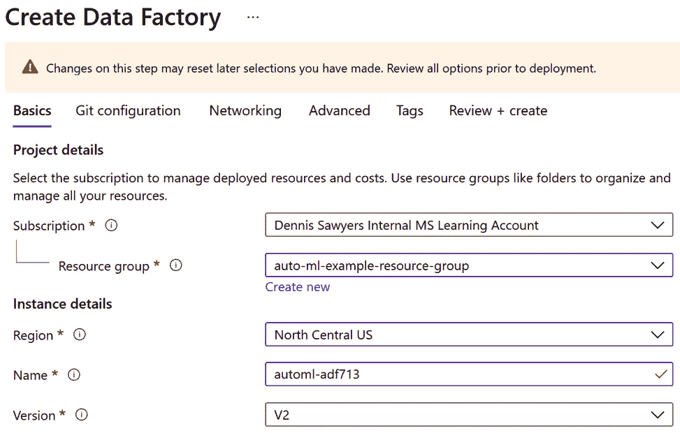
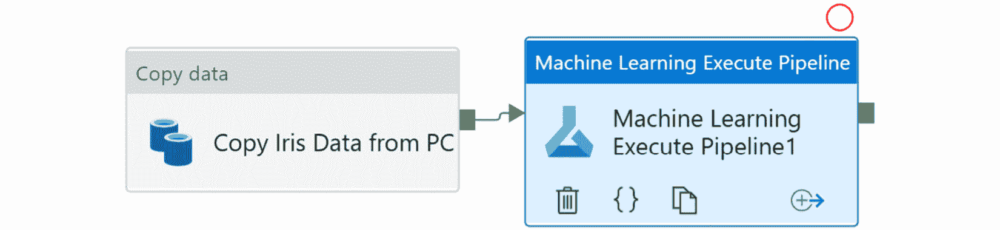

<title>B16595_10_ePub</title>

# *第十章*:创建端到端的 AutoML 解决方案

现在你已经创建了**机器学习** ( **ML** )管道，你可以学习如何在 **Azure 机器学习** **服务** ( **AMLS** )之外的其他 Azure 产品中使用它们。也许最有用的是 Azure 数据工厂。

Azure Data Factory(**ADF**)是 Azure 首屈一指的无代码数据编排工具。您可以使用 ADF 将数据从本地来源拉入 Azure cloud，运行 ML 管道，并通过创建一个 **Azure 数据工厂管道** ( **ADF 管道**)将数据推出 Azure。ADF 管道是创建端到端 ML 解决方案不可或缺的一部分，也是任何非实时 AutoML 项目的最终目标。

本章一开始，您将学习如何将 AMLS 连接到 ADF。完成这项任务后，您将学习如何使用您在第 9 章 、*实现批量评分解决方案*中创建的并行管道来调度 ML 管道。

接下来，您将学习如何使用 ADF 从本地机器中提取数据并将其加载到 Azure cloud 中。最后，您将把您所拥有的一切整合在一起，创建一个端到端的 AutoML 解决方案，创建一个用于对传入数据进行评分的 ADF 管道，以及另一个用于重新训练 AutoML 模型的 ADF 管道。

在本章结束时，您将能够将 AMLS 与 ADF 集成，创建 ADF 管道，并能够设计完整的端到端 AutoML 解决方案，从摄取和评分数据到重新训练 ML 模型。这是一个无价的、受欢迎的技能组合，将使你从你的同龄人中脱颖而出。

如果你已经是一名训练有素的数据科学家，你将获得在你的领域中罕见的软件工程技能。如果你是一名训练有素的工程师，你将学习如何将 ML 融入你已经了解的熟悉领域。

在本章中，我们将讨论以下主题:

*   将 AMLS 连接到 ADF
*   在 ADF 中调度机器学习管道
*   使用 ADF 传输数据
*   自动化端到端评分解决方案
*   自动化端到端培训解决方案

# 技术要求

在本章中，您将创建一个 ADF 资源，并使用您在 [*第 9 章*](B16595_09_ePub.xhtml#_idTextAnchor129) 、*实现批量评分解决方案*中创建的 ML 管道对象。因此，你需要一个可用的互联网连接，一个 Azure 帐户，以及访问你的 AMLS 工作区的权限。

使用您的 Azure 帐户，您还需要在 Azure Active Directory 中创建服务主体的权限。如果您使用的是个人 Azure 帐户，您应该拥有此访问权限。如果你使用的是工作帐户，请向你的 Azure 管理员咨询此级别的权限。

以下是本章的先决条件:

*   可以上网
*   有网络浏览器，最好是谷歌 Chrome 或微软 Edge Chromium
*   拥有 Microsoft Azure 帐户
*   创建了一个 AMLS 工作室
*   在 [*第 2 章*](B16595_02_ePub.xhtml#_idTextAnchor023) ，【Azure 机器学习服务入门中创建了`compute-cluster`计算集群
*   了解如何从 Azure 计算实例导航到 Jupyter 环境，如第 4 章 、*构建自动回归解决方案*中所示
*   在 [*第五章*](B16595_05_ePub.xhtml#_idTextAnchor068)*构建 AutoML 分类解决方案*中训练并注册了`Iris-Multi-Classification-AutoML` ML 模型
*   在 [*第 9 章*](B16595_09_ePub.xhtml#_idTextAnchor129) 、*实现批量评分解决方案*中创建了所有三个 ML 管道。这三个 ML 流水线分别是 *Iris-Scoring-Pipeline* 、*Iris-Parallel-Scoring-Pipeline*和*Iris-AutoML-Training-Pipeline*。
*   拥有在 Azure Active Directory 中创建服务主体的必要权限。如果您使用的是个人帐户，您将拥有这些权限。

本章的代码可从这里获得:[https://github . com/packt publishing/Automated-Machine-Learning-with-Microsoft-Azure/tree/master/chapter 10](https://github.com/PacktPublishing/Automated-Machine-Learning-with-Microsoft-Azure/tree/master/Chapter10)。

# 将 AMLS 与民主同盟军连接起来

ADF 是一个无代码的数据编排和转换工具。使用它，您可以创建 ADF 管道，这些管道可以将数据复制到 Azure 中，转换数据，运行 ML 管道，并将数据推回到某些本地数据库和文件共享上。使用 ADF 的无代码管道编辑工具，制作和调度 ADF 管道非常容易。当您使用拖放接口创建 ADF 管道时，您实际上是在编写 JSON 代码，ADF 用它来执行作业。

小费

**Azure Synapse Analytics** ，微软 Azure 的首要数据仓库和集成分析服务，也有一个与 ADF pipelines 几乎相同的功能: **Azure Synapse pipelines** 。你在这一章中用 ADF 管道做的任何事情，你也可以用 Azure Synapse 管道通过一个非常相似的接口来实现。

在本节中，您将创建一个 ADF 资源并将其连接到 AMLS。您将使用一个**链接服务**来实现这一点，这是一个类似于连接字符串的对象，ADF 需要它来连接到其他 Azure 和非 Azure 服务和数据存储。链接服务需要身份验证，而 AMLS 需要服务主体身份验证。

一个**服务主体**是 Azure 用来跨 Azure 资源授予权限的安全身份。一旦您授权您的服务主体访问 ADF 和 AMLS，就很容易将它们连接在一起并开始运行 ML 管道。

## 创建 ADF

一个 ADF 可以通过使用 GUI 或者使用 Azure PowerShell 通过你在 [*第二章*](B16595_02_ePub.xhtml#_idTextAnchor023) ，*Azure 机器学习服务入门*中使用的 Azure **命令行界面** ( **CLI** )来创建。 **PowerShell** 是一系列通过 CLI 管理 Azure 资源的 cmdlets。在这里，您将首先学习如何使用 Azure portal GUI 创建 ADF 资源。然后，您将学习如何通过 PowerShell 创建 ADF 资源。

要使用 GUI 创建 ADF 资源，请执行以下操作:

1.  导航到位于 https://portal.azure.com 的 Azure 门户网站。
2.  点击左上角的**创建一个资源**。
3.  在搜索框中输入`Data Factory`，从下拉框中点击**数据工厂**。
4.  点击**创建**，**数据工厂**下左上角的蓝框。
5.  现在填写**数据工厂创建**表单。首先选择保存您的 AMLS 工作区的同一个**资源组**。如果你使用了 [*第二章*](B16595_02_ePub.xhtml#_idTextAnchor023) ，【Azure 机器学习服务入门中建议的**资源组**，这将是**auto-ml-example-Resource-group**。
6.  选择保存您的 AMLS 工作区的同一个 Azure **区域**。如果你用的是 [*第二章*](B16595_02_ePub.xhtml#_idTextAnchor023)*Azure 机器学习服务*中建议的 Azure **地区**，这个就会是**中北部美国**。
7.  Give your ADF a name in the `automl-adf` followed by a number string. The following screenshot shows what your completed settings should look like. Leave **Version** as **V2**:

    图 10.1–数据工厂设置

8.  点击 **Git 配置**选项卡并勾选**稍后配置 Git**框。
9.  点击**审核+创建**，点击**创建**。您的数据工厂现在已经创建好了。

创建 ADF 资源的另一种方法是通过 PowerShell。请遵循以下步骤:

1.  导航到位于 https://portal.azure.com 的 Azure 门户网站。
2.  Click the computer screen icon at the top right of your screen as shown in the following screenshot. When you hover over the icon, the words **Cloud Shell** will appear:

    图 10.2–导航到 PowerShell

3.  从下拉框中选择 **PowerShell** 。
4.  Type in the following code:

    ```
    $DataFactory =\
    Set-AzDataFactoryV2 -ResourceGroupName 'auto-ml-example-resource-group' -location 'northcentralus' -Name 'automl-adf713'
    ```

    `ResourceGroupName`设置您的资源组。`Set-AzDataFactoryV2`设置你的版本，而`location`设置你的 Azure 区域。`Name`为您的 ADF 命名。您的数据工厂现在已经创建好了。

现在您已经创建了一个 ADF，下一步是创建一个服务主体，并授予它访问您的 ADF 和 AMLS 工作空间的权限。这将授予 ADF 使用 ML 管道的权限。

## 创建服务主体并授予访问权限

服务主体是安全身份， Azure 使用它们来授予 Azure 资源对其他 Azure 资源的访问权限。您可以在 Azure 的许多领域使用服务主体身份验证，包括 AMLS。但是，为了将 AMLS 连接到 ADF，需要一个服务主体。要使用 Azure 门户创建一个，您必须首先通过以下步骤导航到 Azure 的首要身份和认证服务 **Azure Active Directory** :

1.  导航到位于 https://portal.azure.com 的 Azure 门户网站。
2.  在顶部搜索栏中搜索`Azure Active Directory`，点击**服务**标题下的 **Azure Active Directory** 。
3.  点击屏幕左侧的**应用注册**。
4.  点击屏幕左上方的**新注册**。
5.  给服务主体起一个名字`adf-service-principal`，点击**注册**。保持所有其他设置不变。
6.  现在，您将进入一个页面，其中包含有关您的服务主体的所有信息。复制**应用程序(客户端)ID** 并将其粘贴到记事本或类似的文本编辑器中。你以后会需要这个 ID。
7.  点击屏幕左侧的**证书&秘密**。这将允许您为服务主体创建一个密码。
8.  点击**新的客户端密码**。*秘密*是 Azure 中密码的另一种说法。
9.  Give the secret a name, `ADF-Secret`, and set it so that it never expires as shown in *Figure 10.3*. Click **Add**:

    图 10.3–将服务命名为主要机密

10.  复制你的秘密的**值**字段。这是您的密码，在它消失之前，您只能看到一小段时间。一旦它消失了，你就再也看不到它了。将其粘贴到记事本或类似的文本编辑器中，因为稍后创建 ADF 链接服务时会用到它。
11.  创建服务主体后，您现在必须授予它对 AMLS 和 ADF 的访问权限。在[https://portal.azure.com](https://portal.azure.com)导航到 Azure 门户的首页。
12.  Open your AMLS resource by clicking the **Machine Learning** icon near the top of your screen under **Azure Services**. You should see it if you have recently used AMLS, as shown in *Figure 10.4*:

    图 10.4–Azure 服务面板

13.  单击您的 AMLS 工作区的名称来访问该资源。
14.  点击左侧面板上的**访问控制(IAM)** 。
15.  点击**添加角色分配**。
16.  Select `adf-service-principal` and click it as shown in *Figure 10.5*. Then, click **Save**:

    图 10.5–授予服务主体权限

17.  您现在已经授予您的服务进入 AMLS 的主要权限。现在，您必须为 ADF 做同样的事情。首先，点击屏幕左上角的**主页**，导航到 Azure 门户的首页。
18.  点击屏幕顶部 **Azure Services** 下的**数据工厂**图标。如果您最近使用过 ADF，您会看到此图标。
19.  单击您创建的数据工厂的名称以打开资源。
20.  对 ADF 重复*步骤 14-16* 。这些步骤与 AMLS 相同。您现在已经授予服务主体对 ADF 和 AMLS 的访问权限。

### 通过 Azure CLI 创建 ADF 资源

您还可以创建一个服务主体，并通过 Azure CLI 授予其访问 ADF 和 AMLS 的权限，步骤如下:

1.  通过单击屏幕右上角的计算机屏幕图标打开 Azure CLI，并从下拉菜单中选择 **Bash** 。
2.  键入以下代码创建您的服务主体，并为其指定一个名称:

    ```
    az ad sp create-for-rbac --name adf-service-principal
    ```

3.  复制`appid`和`password`字段。您将再也看不到您的密码值，所以请务必复制它。这映射到**应用(客户端)ID** 和秘密。
4.  使用以下代码授予服务主体对包含 AMLS 和 ADF 的资源组中所有资源的访问权限。如有必要，进行更改以匹配您的资源组。使用`assignee`传递您的服务主体应用程序 ID。使用`role`传递正确的访问级别，在本例中，`resource-group`将访问分配给正确的**资源组** :

    ```
    az role assignment create --assignee "your-service-principal-id" --role "Contributor" --resource-group "auto-ml-example-resource-group"
    ```

创建服务主体并授予对适当资源的访问权后，下一步是打开 ADF 并创建链接的服务。请确保您打开了记事本，因为您将需要服务主体 ID 以及您创建的密码。有了这些，接下来的步骤就容易了。

## 创建连接 ADF 和 AMLS 的链接服务

继续，现在你将有机会开放 ADF 并习惯它的界面。ADF 在很大程度上被设计成一个无代码平台，但是您创建的所有东西都被编写成 JSON 文件。要将 ADF 与 AMLS 链接，请执行以下步骤:

1.  导航到位于 https://portal.azure.com 的 Azure 门户网站。
2.  点击屏幕顶部 **Azure Services** 下的**数据工厂**图标。如果您最近使用过 ADF，您会看到此图标。如果没有，请使用屏幕顶部的搜索栏。
3.  单击您创建的以名称`autol-adf`开头的数据工厂的名称。
4.  Click **Author & Monitor** in the middle of the screen. You should now see the ADF user interface, shown in *Figure 10.6*:

    图 10.6–ADF 用户界面

5.  点击左侧的工具箱图标。当你在图标上停留几秒钟，单词**管理**将会出现，指示你正在导航的部分。
6.  点击左上角**连接**下的**链接服务**。
7.  点击**创建链接服务**。
8.  Click **Compute** and select **Azure Machine Learning** as shown in *Figure 10.7*:

    图 10.7–创建 Azure ML 链接服务

9.  点击**继续**。
10.  现在是填写链接的服务创建表单的时候了。首先给链接的服务起一个名字，比如`AMLS Linked Service`。
11.  从**下的下拉菜单中选择**autoresolvetingruntime**通过集成运行时**连接。一个**集成运行时**就是 ADF 在幕后用来移动数据和运行作业的计算。Azure integration runtime 是一个完全由 ADF 管理的无服务器的弹性计算。
12.  从 **Azure 订阅**下的下拉框中选择您的 Azure 订阅。
13.  从 **Azure 机器学习工作区名称**下的下拉框中选择你的 AMLS 工作区。
14.  将您的服务主体应用程序(客户端)ID 粘贴到**服务主体 ID** 文本框中。您之前将此 ID 复制到了文本编辑器中。
15.  将您的服务主密钥粘贴到**服务主密钥**文本框中。
16.  点击**测试连接**。
17.  如果测试结果为**连接成功**，点击**创建**。
18.  您的链接服务已创建。将鼠标悬停在新链接的服务上，单击 **{ }** 图标查看底层 JSON 代码。

您已成功将 ADF 连接到 AMLS。在这短短的一节中，你学到了很多。您不仅学习了如何创建 ADF，还学习了如何创建服务主体、授予访问权限和创建链接服务。有了这个基础设施，您现在可以学习如何在 ADF 管道中轻松运行和调度 ML 管道。

# 在 ADF 中调度机器学习管道

也许 ADF 最大的特点是它的易用性。通过在屏幕上单击和拖动对象，您可以轻松地通过 ADF 管道编排无缝的数据接收、转换和 ML 流。此外，只需几次点击，您就可以安排 ADF 管道在您想要的任何时候运行。获得这项技能将使您能够快速、轻松地创建无代码的数据编排运行。

首先，您将调度并运行您在第 9 章[**中创建的最简单的 ML 管道，实现一个批量评分解决方案*`Iris-Scoring-Pipeline`。为此，请按照下列步骤操作:*](B16595_09_ePub.xhtml#_idTextAnchor129)

1.  导航到您的 ADF 资源并点击**作者&监视器**。
2.  单击左侧的钢笔图标。当您将鼠标悬停在该图标上时，会出现单词 **Author** 来指示您正在导航到哪个部分。
3.  点击左上角**工厂资源**下搜索框旁边的蓝色十字图标。当你将鼠标悬停在该图标上时，会出现**添加新资源**字样。
4.  Click **Pipeline** from the resulting dropdown as shown in *Figure 10.8*:

    图 10.8–创建您的第一个 ADF 管道

5.  点击屏幕左中的中**活动**下的**学习机**。
6.  Click and drag the blue flask icon onto the canvas as shown in *Figure 10.9*. This is the **Machine Learning Executive Pipeline** activity:

    图 10.9-机器学习执行管道活动

7.  点击`Execute Iris Scoring Pipeline`。
8.  点击画布下方的**设置**。
9.  从第一个下拉框中选择 **AMLS 链接服务**以连接您的链接服务。
10.  从**机器学习管道名称**下拉框中选择**虹膜评分管道**。
11.  从**机器学习管道 ID** 下拉框中选择一个管道 ID。除非您发布了多个同名的 ML 管道，否则应该只有一个管道 ID。
12.  点击右上角的算盘图标，打开`pipeline1`至`Iris Scoring Pipeline`。允许有空格。
13.  Click **Publish All** near the top left of your screen. Then, click **Publish** in the bottom right-hand corner to create your ADF pipeline.

    重要提示

    为了在 ADF 中保存您的工作，您需要发布您的更改。在开发新的 ADF 管道时，请确保多次发布。

14.  要计划新创建的 ADF 管道，请单击屏幕顶部附近的**添加触发器**。
15.  从出现的下拉菜单中点击**新建/编辑**。
16.  Click the **Choose Trigger** dropdown and select **+ New**.

    像 AML Python SDK 一样，ADF 中有多种类型的触发器。根据时间表执行**基于时间表的触发器**。在 Azure blob 容器中创建或删除文件时，执行**基于事件的触发器**。

    **翻转窗口触发器**是，类似于基于时间表的触发器，但它们更高级，并且具有重试失败运行和回填过去时间段等选项。在本练习中，创建一个简单的基于计划的触发器。

17.  给你的触发器起一个名字，比如`Once Monthly`。
18.  在**类型**下选择**日程**。
19.  从相应的下拉框中选择开始日期和适当的时区。
20.  在`1`下，从下拉框中选择**月份**。
21.  点击**确定**两次。
22.  点击屏幕左上角附近的**发布所有**，然后点击右下角的**发布**。你现在完成了。您完成的 ADF 管道看起来应该类似于图 10.10 。要查看 JSON 代码，请单击屏幕右上角的 **{ }** 图标:


图 10.10–您的第一个完整的 ADF 管道

虽然您已经创建并计划了您的第一个 ADF 管道，但这并不意味着什么。毕竟，虽然这个 ADF 管道每月都会触发您的 ML 管道，但是您仍然需要自动接收新数据。幸运的是，数据摄取是 ADF 擅长的领域。在下一节中，您将看到使用 ADF 传输数据是多么容易。无论数据在哪里，ADF 都可以拉进来。

# 使用 ADF 传输数据

对于任何数据工程师或数据科学家来说，将数据从内部迁移到云以及从云迁移到内部都是一项关键技能。ADF 通过**复制数据**活动完成这项任务。这是 ADF 最基本也是最强大的功能。

在本节中，首先，您将下载一个**自托管集成运行时** ( **SHIR** )到您的本地机器，允许您的计算机作为计算资源将数据加载到 Azure。然后，您将为您的 **Azure 存储帐户**和您的本地 PC 创建一个链接服务。

接下来，您将从 GitHub 资源库下载一个文件，并将其保存到您的 PC 上。最后，您将在 ADF 中创建一个**复制数据**活动，该活动将从您的 PC 中获取数据，并将其放入连接到 AML 数据存储的同一个 Azure blob 容器中。

通过这些练习，您将获得数据工程技能，从而在下一部分创建端到端解决方案。

## 安装自托管集成运行时

在将数据复制到 Azure 之前，首先需要在本地机器上安装一个 SHIR。从以下步骤开始:

1.  导航到您的 ADF 资源并点击**作者&监视器**。
2.  单击左侧的工具箱图标。当您将鼠标悬停在该图标上时，会出现单词 **Manage** 来指示您正在导航到哪个部分。
3.  点击**连接**下的**积分运行时间**。
4.  点击屏幕上方中央的**+新建**。
5.  Select **Azure, Self-Hosted** and click **Continue** as shown in *Figure 10.11*:

    图 10.11–选择正确的集成运行时来安装 SHIR

6.  选择**自主持**，点击**继续**。
7.  给你的新衬衫起个名字`IntegrationRuntime`，点击**创建**。
8.  On the next screen, you will see two options to install the SHIR. Choose **Option 1: Express setup** by clicking **Click here to launch the express setup for this computer**.

    重要说明

    如果您正在使用您的工作机器，请在安装 SHIR 之前向您的 IT 安全组织请求许可。它确实打开了你的机器和面向公众的 Azure 云之间的连接。

9.  这会将 SHIR 安装文件下载到您的计算机上。打开文件，点击**是**。安装需要 5 到 10 分钟。
10.  一旦安装完成，点击**关闭**。你的衬衫现在应该出现如图*图 10.12* 所示:


图 10.12–自托管集成运行时

在本地机器上安装了 SHIR 之后，你现在可以使用 ADF 将数据从你的电脑直接转移到 Azure。正如您为 AMLS 创建了一个链接服务一样，接下来您将为 Azure Blob storage 创建一个链接服务。

## 创建 Azure Blob 存储链接服务

要创建将 ADF 连接到 **Azure Blob 存储**的链接服务，请遵循以下步骤:

1.  点击屏幕左上角**连接**下的**链接服务**。
2.  点击屏幕上方中央的**+新建**。
3.  选择 **Azure Blob 存储**并点击**继续**以查看链接的服务创建表单。
4.  给链接的服务起一个名字，如`AMLSDatastoreLink`。
5.  选择**autoresolvetingruntime**。
6.  从 **Azure 订阅**下的下拉框中选择您的 Azure 订阅。
7.  从`automlexamplew`下的下拉框中选择您的存储帐户，后跟一串数字。
8.  点击**测试连接**。
9.  如果测试成功，点击**创建**。
10.  Download `Iris_Scoring_Data_for_ADF.csv` from the GitHub repository:

    [https://github . com/packt publishing/Automated-Machine-Learning-with-Microsoft-Azure/blob/master/chapter 10/Iris _ Scoring _ Data _ for _ ADF . CSV](https://github.com/PacktPublishing/Automated-Machine-Learning-with-Microsoft-Azure/blob/master/Chapter10/Iris_Scoring_Data_for_ADF.csv)

11.  在你的电脑上创建一个名为`Iris`的文件夹。将`Iris_Scoring_Data_for_ADF.csv`移到那里。

## 为您的电脑创建链接服务

接下来，是时候为你的电脑创建一个链接服务了。该链接的服务将使用您的 SHIR。使用以下步骤:

1.  像创建其他链接服务一样，单击**链接服务**和**+新建**。
2.  点击**文件**，选择**文件系统**，点击**继续**，可以看到链接的服务创建表单。
3.  给链接的服务起一个名字，如`LocalPCLink`。
4.  从**Connect via integration runtime**下的下拉框中选择您的 SHIR。
5.  在`Iris`文件夹下。
6.  填写您用来将登录到电脑的用户名和密码。要找到您的用户名，在您的 PC 的搜索栏中搜索**系统信息**并点击它；您的用户名可以在**系统概要**下找到。
7.  点击**测试连接**。
8.  如果测试成功，点击**创建**。

## 创建 ADF 管道以复制数据

将 SHIR、Azure Blob 存储链接服务和链接服务连接到您的本地 PC 后，您现在就可以使用**复制数据**活动通过以下步骤构建 ADF 管道了:

1.  单击 ADF 左侧的钢笔图标。
2.  点击左上角**工厂资源**下搜索框旁边的蓝色十字图标。当你将鼠标悬停在该图标上时，会出现**添加新资源**字样。
3.  Click **Copy Data tool** from the resulting dropdown as shown in *Figure 10.13*:

    图 10.13–复制数据工具

4.  在`Copy Iris Data to Azure`下点击**下一个**。
5.  现在，您需要从到选择您的源数据存储。选择链接到您 PC 的服务， **LocalPCLink** ，点击**下一步**。
6.  通过点击`Iris_Scoring_Data_for_ADF.csv`选择你想要传输到 Azure 的数据，然后点击**选择**。
7.  点击**下一个**。
8.  在**文件格式设置**下，勾选**第一行为表头**的复选框，点击**下一步**。
9.  现在，您必须选择目标数据存储。选择您的 Azure 存储帐户的链接服务， **AMLSDatastoreLink** 。
10.  在名为`Input_Folder`的文件夹下点击`Iris_Scoring_Data.csv`。如果该文件夹不存在，将会创建它。
11.  在**文件格式设置**下，勾选**添加文件头**复选框，点击**下一步**。
12.  在**设置**下点击**下一步**，而不改变任何默认的。
13.  点击**概要**下的**下一个**。现在将创建并运行您的 ADF 管道。
14.  点击**完成**。现在，您将被转移到主 ADF 管道创作工具。
15.  点击**管道**下的`Copy Iris Data to Azure`。您会注意到，您的**复制数据**活动的名称很糟糕。
16.  Click your activity and rename it `Copy Iris Data from PC` as shown in *Figure 10.14*:

    图 10.14–完成了复制数据活动的 ADF 管道

17.  点击**发布所有**，然后点击**发布**，将您的更改保存到管道中。

您现在已经使用 ADF 成功地将数据从您的 PC 传输到 Azure。这是数据工程的基本技能，允许您将各种数据转移到云中。就像您在上一节中为执行 ML 管道而创建的 ADF 管道一样，您可以安排它在您希望的任何时间运行。

我们现在将把你在本章中学到的所有技能结合起来，编写一个真正可生产的 ADF 管道。该管道将从您的计算机接收数据，对其进行评分，然后将结果写回您的本地计算机。尽管这无论如何都不是一个微不足道的任务，但是到本章结束时，你将能够制作出一个又一个管道。

# 自动化端到端评分解决方案

最终，任何 AutoML 项目的最终目标都是创建一个自动化评分解决方案。数据从一个源中获取，使用您训练的模型自动评分，结果存储在您选择的位置。通过结合前三节中所学的一切，您可以轻松完成这项任务。

您将打开 AMLS，创建一个新的数据集，并稍微修改现有的`Iris-Scoring-Pipeline`来开始这一部分。然后，在用新名称重新发布管道后，您将把它与您创建的用于将数据加载到 Azure 的**复制数据**活动结合起来。

接下来，您将创建另一个复制数据活动，以将您的结果从 Azure 传输到您的 PC，并安排该作业在每周一运行。这是 ML 中一种非常常见的模式，使用 ADF 您根本不用任何代码就可以完成。

## 编辑 ML 管道以对新数据进行评分

首先，您需要通过编辑您在 [*第 9 章*](B16595_09_ePub.xhtml#_idTextAnchor129) 、*中创建的`Iris-Scoring-Pipeline`创建一个新的 ML 管道，实现一个批量评分解决方案*，步骤如下:

1.  在[https://ml.azure.com](https://ml.azure.com)访问您的反洗钱工作室。
2.  使用 GUI 创建一个新的数据集，就像您在 [*第 3 章*](B16595_03_ePub.xhtml#_idTextAnchor044) 、*训练您的第一个 AutoML 模型*中所做的那样。首先点击左侧面板上**资产**下的**数据集**。
3.  点击`Iris Local Scoring Data`后。
4.  在`Input_Folder`中选择`Iris_Data.csv`。这是你从电脑上复制过来的数据。
5.  完成数据集的创建，确保将**列标题**下拉菜单下的选项设置为**使用第一个文件**的标题，以便获取列名。
6.  创建数据集后，导航到 Jupyter 中的`machine-learning-pipeline` Python 笔记本。
7.  点击左上方的**文件**，从下拉框中选择**复制**。
8.  将复制的笔记本重命名为`machine-learning-pipeline-local-scoring`。
9.  删除生成`Iris`数据的单元格，并注册为数据集。
10.  在编写文件的脚本的第一行，将 Python 脚本从`Iris_Scoring.py`重命名为`Iris_Scoring_Local.py`，如下所示:

    ```
    %%writefile Scoring_Scripts/Iris_Scoring_Local.py 
    ```

11.  在`Iris_Scoring_Local.py`中，检索您的`Iris Local Scoring Data`数据集，而不是`Iris Scoring`数据集，如下面的代码行所示:

    ```
    dataset =\
    Dataset.get_by_name(ws,'Iris Local Scoring Data')
    ```

12.  在配置 ML 管道步骤时，用`Iris_Scoring_Local.py`替换`Iris_Scoring.py`，如下面的代码所示:

    ```
    scoring_step =\
    PythonScriptStep(name='iris-scoring-step',\
                    script_name= 'Iris_Scoring_Local.py',\
                    source_directory='Scoring_Scripts',\
                    arguments=[],\
                    inputs=[],\
                   compute_target=compute_target,\
                    runconfig=run_config,\
                    allow_reuse=False)
    ```

13.  在`Iris_Scoring_Local.py`中，检索您的`Iris Local Scoring Data`数据集，而不是下面代码行中的`Iris Scoring`数据集:

    ```
    dataset =\
    Dataset.get_by_name(ws,'Iris Local Scoring Data')
    ```

14.  在下面几行代码中将您的发布的管道从`Iris-Scoring-Pipeline`重命名为`Iris-Local-Scoring-Pipeline`:

    ```
    published_pipeline =\
    pipeline_run.publish_pipeline( name='Iris-Local-Scoring-Pipeline',\
           description='Pipeline that Scores Iris Data', version= '1.0')
    ```

15.  运行笔记本中的所有单元格，创建新的 ML 管道，`Iris-Local-Scoring-Pipeline`。这需要几分钟时间。现在，您已经创建了一个 ML 管道，它对从您的 PC 加载到 Azure 中的数据进行评分。

## 创建 ADF 管道来运行您的 ML 管道

创建了新的 ML 管道后，您现在可以使用以下步骤创建新的 ADF 管道来自动执行端到端评分流程:

1.  打开 ADF 并单击左侧的钢笔图标，打开 ADF 管道创作工具。
2.  点击`Copy Iris Data to Azure`，从下拉框中选择**克隆**。
3.  将新管道重命名为`End-to-End Iris Scoring`。
4.  Click `Copy Iris Data from PC` activity by clicking the green square, holding your mouse button so an arrow appears, and connecting the arrow to your **Machine Learning Execute Pipeline** activity as shown in *Figure 10.15*:

    图 10.15–连接 ADF 管道中的活动

5.  通过选择活动并打开`Iris-Scoring-Local-Pipeline`来配置您的`Score Iris Data`，并选择下拉框中出现的唯一的**机器学习管道 ID** 。
6.  点击**发布全部**和**发布**保存您的工作。
7.  点击**移动&转换**到**活动**下，拖动一个新的复制数据活动到你的画布上。将其连接到 ADF 管道的末端。
8.  选择新活动后，点击`Copy Results to PC`。
9.  点击**源**并点击**+新建**开始创建新的输入数据文件。
10.  选择 **Azure Blob Storage** 作为您的源目标，选择 **DelimitedText** 作为您的文件格式。点击**继续**。
11.  Fill out the ADF dataset creation form. Name this object `ScoringResults`. Select `Iris_Predictions.csv` in `Output_Folder` on your AML datastore. When finished, the form should match *Figure 10.16*. Click **OK**:

    图 10.16–ADF 数据集创建表单

12.  点击 **Sink** 和点击 **+New** 到开始创建一个新的输出数据文件。
13.  选择 **Azure Blob Storage** 作为您的源目标，选择 **DelimitedText** 作为您的文件格式。点击**继续**。
14.  点击**文件，**选择**文件系统**，点击**继续**。
15.  选择**定界文本**作为文件格式。点击**继续**。
16.  填写 ADF 数据集创建表单。将此对象命名为`ScoringLocalOutput`。选择 **LocalPCLink** 作为您的链接服务。勾选第一行**的复选框作为标题**。点击**确定**。这将把你的文件保存在你电脑上与输入数据相同的文件夹中。
17.  点击**下沉**，点击**打开**。这将打开一个新的选项卡，您可以在其中编辑目标数据。
18.  编辑`Iris_Scoring_Results.csv`作为文件名。
19.  点击**发布全部**和**发布**保存您的工作。

## 向 ADF 管道添加触发器

创建 ADF 管道的最后一步是添加一个触发器来自动运行管道:

1.  接下来，像本章前面所做的那样添加一个触发器。点击**添加触发器**，选择**新建/编辑**。
2.  点击**选择触发**并选择**+新建**。
3.  将您的触发器命名为`Monday Trigger`，并将其设置为每周一上午 11:00 运行一次。确保您将时区设置为当地时区。点击**确定**两次。
4.  点击**发布全部**和**发布**保存您的工作。点击**触发器(1)** 和**立即触发**，测试您的新 ADF 管道。您的管道应该成功运行，如图*图 10.17* 所示:


图 10.17–成功的端到端评分管道

现在，您已经创建了一个全自动的 AutoML 评分解决方案，该解决方案将在每周一上午 11:00 从您的本地 PC 获取数据，并生成一个评分文件。在实际情况中，这种解决方案将从数据库中提取数据，并定期更新。

这项技术适用于任何 ML 项目；您可以使用自定义训练模型、视觉模型、AutoML 模型或任何其他类型的 ML 模型。这种模式对于任何批量评分场景都是可重用的，并且是所有行业中最常见的部署场景。练习一下。

在您的工具包中有了自动化的评分解决方案，您的最终任务是设计一个自动化的培训解决方案。由于许多原因，ML 模型经常需要重新训练，并且当新数据变得可用时应该重新训练。通过使用本节中使用的相同技术和模式，这将是一个简单的任务。

# 自动化端到端培训解决方案

像任何其他的 ML 模型一样，一旦一个 AutoML 模型被部署并运行了几个月，它可以从再培训中受益。这有许多原因，按重要性排列如下:

*   如果输入数据和目标列之间的模式发生变化，ML 模型就会中断。这通常是由外部因素造成的，如消费者行为的变化。当模式打破时，您需要重新训练您的模型以保持性能。
*   你提供给 ML 模型的相关数据越多，它们的表现就越好。因此，随着数据的增长，您应该定期重新训练模型。
*   在一致的基础上重新训练模型意味着，如果模式随着时间慢慢改变，它们不太可能崩溃。因此，最好的做法是在获得数据后进行再培训。

在这一部分，你将测试你的技能。您将获得一组类似于创建端到端评分解决方案时的说明。然而，这一次，指导将明显减少。如果你发现自己迷路了，请仔细重读本章的说明。

## 创建将数据复制到 Azure 的管道

首先，您需要创建一个 ADF 管道，将数据从您的 PC 复制到 Azure:

1.  Download `Iris_Training_Data_for_ADF.csv` from the GitHub repository and put it in your `Iris` folder on your PC:

    [https://github . com/packt publishing/Automated-Machine-Learning-with-Microsoft-Azure/blob/master/chapter 10/Iris _ Training _ Data _ for _ ADF . CSV](https://github.com/PacktPublishing/Automated-Machine-Learning-with-Microsoft-Azure/blob/master/Chapter10/Iris_Training_Data_for_ADF.csv)

2.  创建一个名为`End-to-End Iris Training`的新 ADF 管道。
3.  Within the pipeline, create a `Copy Iris Training Data from PC` where you copy `Iris_Training_Data_for_ADF.csv` into `Input_Folder` on your Azure storage account.

    参考您在*自动化端到端评分解决方案*部分创建的`Copy Iris Data from PC`活动。

4.  运行一次此管道，将数据移动到 Azure 中。

## 编辑 ML 管道，用新数据进行训练

接下来，复制并编辑您在 [*第九章*](B16595_09_ePub.xhtml#_idTextAnchor129) ，*中创建的`automl-training-pipeline`实现批量评分解决方案*:

1.  打开 AMLS 并创建一个名为`Iris Local Training Data`的新数据集。
2.  打开名为`automl-training-pipeline`的 Jupyter 笔记本。复制一份，重命名为`automl-local-training-pipeline`。
3.  用 ML 管道中的`Iris Local Training Data`数据集替换`Iris Training`数据集。运行并发布名为`Iris-AutoML-Training-Local-Pipeline`的 ML 管道。

## 向您的 ADF 管道添加机器学习执行管道活动

最后，您将向 ADF 管道添加一个活动，以执行您刚刚创建的 ML 管道，如下所示:

1.  在 ADF 中，添加一个`Retrain Iris Model`。
2.  将名为`Tuesday Trigger`的触发器添加到您的**端到端虹膜训练**管道中。安排此触发器在当地时间每周二上午 6:00 运行。
3.  发布您的更改以保存您的工作。你完成的管道应该是一个类似于*图 10.18* 的两步过程:


图 10.18-已完成的再培训管道

就是这样！您已经创建了一个解决方案，可以每周用新数据自动重新训练模型。在现实世界中，这将从例行更新的数据库中提取数据，而不是从你的本地电脑中提取数据。

请记住，用于培训的 ML 管道会自动注册模型，用于评分的 ML 管道会自动重用最新版本的 ML 模型。因此，从现在开始，不需要手动更新任何一个管道。

# 总结

以端到端的方式自动化 ML 解决方案不是一件容易的事情，如果你已经做到了这一步，请感到自豪。大多数现代数据科学组织可以轻松训练模型。很少有人能像你在本章中所做的那样实现可靠的、自动化的、端到端的解决方案。

现在，您应该对自己设计端到端 AutoML 解决方案的能力充满信心。您可以使用 AutoML 训练模型，并创建 ML 管道来对数据进行评分和重新训练模型。您可以轻松地将数据摄取到 Azure 中，并使用 ADF 将其从 Azure 中转移出来。此外，您可以将一切联系在一起，创建 ADF 管道，无缝地接收数据、评分数据、训练数据，并将结果推送到您想要的任何地方。现在，您可以创建端到端的 ML 解决方案。

[*第 11 章*](B16595_11_ePub.xhtml#_idTextAnchor172) ，*实施实时评分解决方案*，通过教你如何在 AMLS 境内使用 Azure Kubernetes 服务对数据进行实时评分，巩固你的 ML 知识。将实时评分添加到你的批量评分技能组合中，将使你成为一个更全面的应用型 ML 专家，能够解决各种各样的问题。