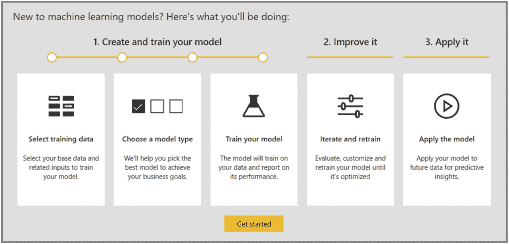
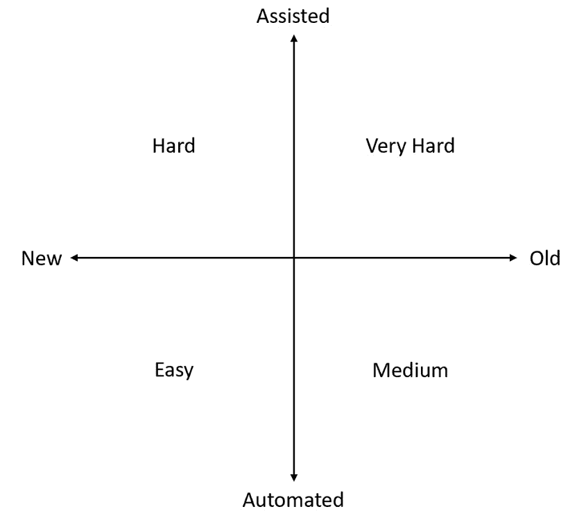

# 十二、使用 AutoML 实现商业价值

通过这本书，你已经获得了各种各样的技能。现在，您可以使用 AutoML 来训练回归、分类和预测模型。你可以使用 Jupyter 笔记本用 Python 编写 AutoML 解决方案，你知道如何导航 **Azure 机器学习** **工作室**，你甚至可以在 **Azure 数据工厂** ( **ADF** )中集成机器学习管道。然而，仅仅技术技能并不能保证你的项目成功。为了实现商业价值，你必须获得最终用户的信任和接受。

在本章中，您将从学习如何以一种终端用户易于理解的方式来呈现端到端架构开始。然后，您将学习使用哪些可视化和度量来展示您的模型的性能，之后您将学习如何可视化和解释 AutoML 的内置可解释功能。

您还将探索在 **Azure 机器学习服务(AMLS)** 之外运行 AutoML 的选项，并以一节关于通过使您的信息与您提供的解决方案类型保持一致来获得最终用户信任的部分结束本章。

本章结束时，你将为成功做好准备。您将获得一些向最终用户传达您的解决方案所必需的软技能，从而增加您的组织采用和使用您的端到端解决方案的可能性。未能获得最终用户的信任是数据科学项目失败的主要原因，通过遵循本章中的指南，您将更成功地为您的解决方案创造惊喜。

在本章中，我们将讨论以下主题:

*   构建 AutoML 解决方案
*   可视化 AutoML 建模结果
*   向您的企业解释 AutoML 结果
*   在其他 Microsoft 产品中使用 AutoML
*   实现商业价值

# 技术要求

在本章中，您将使用在前面章节中创建的模型来检索图形、图表和指标。因此，你需要一个可用的互联网连接、一个 Azure 账户和一个 AMLS 工作空间。您还需要完成 [*第 4 章*](B16595_04_ePub.xhtml#_idTextAnchor056) *中的练习，构建一个 AutoML 回归解决方案*，以及 [*第 5 章*](B16595_05_ePub.xhtml#_idTextAnchor068) *，构建一个 AutoML 分类解决方案*。

以下是本章的先决条件:

*   上网。
*   网络浏览器，最好是谷歌 Chrome 或微软 Edge Chromium。
*   一个 Microsoft Azure 帐户。
*   AMLS 的工作区。
*   你需要在 [*第四章*](B16595_04_ePub.xhtml#_idTextAnchor056) *中训练并注册`Diabetes-AllData-Regression-AutoML`机器学习模型，构建一个 AutoML 回归解决方案*。
*   你需要在 [*第五章*](B16595_05_ePub.xhtml#_idTextAnchor068) *中训练并注册`Iris-Multi-Classification`机器学习模型，构建 AutoML 分类解决方案*。

本章没有新代码。

# 构建 AutoML 解决方案

**架构 AutoML** 解决方案指绘制端到端图表。这些作为您应该如何构建您的解决方案的蓝图，也可以用来向您的最终用户解释一切是如何工作的。虽然许多 IT 解决方案很复杂，并且可以采取多种形式，但是基于 AutoML 的解决方案遵循标准模式，需要您做出一些重要的决策。

在这一节中，您将首先学习在构建决策之前做出什么决策。然后，您将了解如何构建易于向最终用户解释的端到端批量评分解决方案和端到端实时评分解决方案。尽管架构可能会被简化，但它越标准，就越容易实现、解释和理解。

## 为 AutoML 解决方案做出关键的架构决策

在绘制架构图时，有几个关键的考虑事项需要你去做，最重要的是你是否需要做一个批量或者实时的解决方案。批处理解决方案与实时解决方案有着非常不同的需求，并且大多遵循涉及 AMLS 和 ADF 的模板。另一方面，实时解决方案更加可定制。

首先，我们将检查一些关键问题以寻求批量解决方案，因为它们更容易理解。您只需要担心您的数据来自哪里，您的解决方案应该多久获得一次新数据，您应该何时重新训练模型，以及您的最终用户将如何收到结果。就是这样。

还有一个问题是，当你在 AMLS 或 ADF 中调度它们时，你应该如何协调你的各种机器学习管道。ADF 通常是最佳选择，因为您可以使用它轻松地将数据移入和移出 Azure。下表总结了设计批处理解决方案的关键问题和答案:

图 12.1–批量解决方案的主要考虑因素

另一方面，实时解决方案要复杂得多。您仍然需要询问您的输入数据来自哪里，以及您应该多长时间重新训练一次您的 AutoML 模型。此外，您应该弄清楚您的端点将在哪里对数据进行评分。这可能非常复杂，因为您几乎可以在任何地方使用端点。最常见的是，这将是某种 web 应用或无服务器代码。

最后，你需要弄清楚你的终端必须一次服务多少个请求，你的终端用户需要多快的响应速度，以及你的 **Azure Kubernetes 服务** ( **AKS** )集群应该有多大规模才能满足对你的解决方案的需求。下表总结了设计实时解决方案的关键问题和答案:

图 12.2-实时解决方案的主要考虑因素

一旦你问完并回答了这些问题，你就可以开始构建一个架构图了。首先，您将学习批量解决方案的通用模式。

## 设计批量解决方案

一旦你回答了你的输入数据来自哪里，你将在哪里得到你的结果，你就可以很容易地构建批量解决方案。它们总是遵循大致相同的模式。首先，您将通过 ADF 从内部和云资源获取数据，并将数据放入**Azure Data Lake Storage Gen 2(ADLS Gen 2)**存储帐户。这使得 AMLS 可以访问您的数据。

一旦它在数据湖中，你在 AMLS 使用 AutoML 来训练和注册一个 ML 模型。您的下一步是采用该模型，并使用它来创建评分管道和训练管道。然后，您通过 ADF 协调两个 ML 管道，为您的评分管道确定一个时间表，为您的训练管道确定另一个时间表。

训练管道会自动在 AMLS 注册您的模型的新版本，但您需要决定您的评分管道的最终输出在哪里着陆。本来，评分管道旨在将数据放入 ADLS 第二代。一旦到达那里，您应该设置一个 ADF 复制活动，将数据从数据湖移动到最终目的地。完整的端到端架构如下图所示:

图 12.3–常见批处理架构

为您制作的每个批处理 AutoML 解决方案制作类似的图表，并根据需要经常重用它们。随着时间的推移，遵循一个模板架构会让你和你的团队更有效率。

接下来，您将学习实时解决方案的通用架构。仔细记录相似之处和不同之处。虽然开始与批处理架构相同，但结束却大不相同。

## 设计实时解决方案

实时解决方案架构需要更仔细的考虑。您的最终用户将如何与您的终端交互(如果有的话)？你是否正在设计一个用户可以随时获取数据的 web 应用？您是否有一个流式系统，可以一次向您的终端发送数千个信号？一旦你回答了这些问题，你就可以完全充实这个架构了。

至于批量解决方案，第一步包括将 ADF 数据导入 ADLS 第二代，并使用 AMLS 训练和注册 AutoML 模型。那部分是一样的。一旦您的模型被训练，您需要创建一个实时评分端点和一个 ML 训练管道。您将像往常一样在 ADF 中安排再训练，以某种节奏更新您的模型。

您还需要决定您的端点将居住在哪里。在这种架构中，它位于面向用户的 web 应用上。用户可以在一天中的任何时间将数据传递到 web 应用中，此时结果将显示在屏幕上，并立即发送到 ADLS Gen 2。下图显示了完整的端到端架构:

图 12.4–通用实时架构

向您的最终用户展示架构是让您的解决方案被接受的关键部分。最终用户需要从总体上理解一切是如何连接和工作的。在展示了你的架构之后，你应该把重点放在展示你的 AutoML 模型的结果上。教用户如何将所有的部分组合在一起只是一个介绍。以最终用户能够理解的方式展示您的模型结果，将有助于让他们支持您的解决方案。

# 可视化 AutoML 建模结果

向您的企业展示您的 AutoML 模型的结果对于采用您的解决方案是不可或缺的。毕竟，您的最终用户不太可能采用您的解决方案，除非他们能够确定它满足特定的性能标准。有许多呈现 ML 模型结果的方式；展示结果的最有效方式是通过可视化。

幸运的是，AutoML 运行提供了回归、分类和预测结果的自动可视化。回归和预测共享相同的可视化，而分类则完全不同。在每种情况下，您只想与您的最终用户共享一个可视化；相同结果的多个视图很可能只会引起混淆。

在这一部分中，您将首先发现在进行回归和预测之前，应该向您的最终用户展示哪些分类。

## 可视化分类结果

混淆矩阵，如 [*第 5 章*](B16595_05_ePub.xhtml#_idTextAnchor068) *所示，构建 AutoML 分类解决方案*，是呈现 AutoML 分类训练运行结果的关键。最终，最终用户通常关心的是您的模型有多准确，以及是否有假阳性或假阴性的倾向。为了获得这些信息，请按照下列步骤操作:

1.  导航至位于[https://ml.azure.com](https://ml.azure.com)的反洗钱工作室。
2.  点击左侧面板上**资产**下的**实验**。
3.  点击蓝色链接进入`Iris-Multi-Classification`。这是你在 [*第五章*](B16595_05_ePub.xhtml#_idTextAnchor068) *中用来训练分类模型的实验，构建一个 AutoML 分类解决方案*。
4.  点击蓝色链接，查看您最近的跑步记录。该链接位于`AutoML_`下，后跟一个唯一标识符字符串。如果有多次运行，请使用最新的。
5.  点击屏幕顶部附近的**车型**。
6.  在**算法名称**下，点击指向您的最高性能模型名称的蓝色链接。很可能是 **StackEnsemble** 或者 **VotingEnsemble** 。你会知道这是你表现最好的模型，因为它是唯一一个带有**视图解释**链接的模型。
7.  点击屏幕顶部附近的**指标**。
8.  检查**准确度**和**混淆 _ 矩阵**的方框。
9.  在混淆矩阵上，点击下拉框，选择**归一化**。您应该会看到一个类似于下图的图表:

图 12.5–业务用户的分类结果

这张图表包含了您的最终用户正在寻找的所有信息。第一，模型准确率 98.7%。接下来，它总是能正确识别出*鸢尾-刚毛鸢尾*和*鸢尾-海滨鸢尾*。最后，有 4%的几率你的模型会错误地将*鸢尾花*识别为*鸢尾花*。

在向业务用户解释您的结果时，请保持这种详细程度。说明这是基于训练数据，并且您预计当应用于模型从未见过的数据时，结果可能会稍差一些。

重要提示

样本量越大，样本数据在现实世界中的代表性越强，您的训练结果就越适用于对新数据点进行评分。这就是为什么收集尽可能多的好数据并确保你的数据没有抽样偏差总是很重要的一个原因。

最常见的是，这张图表将满足您的最终用户对您的模型性能的大多数疑问。由于 AutoML 生成的图表可能很难阅读，您可以做的一件事就是在另一个工具(如 PowerPoint)中重新创建这个图表。回归和预测也有一个非常强大的图表来展示结果。

## 可视化预测和回归的结果

在第 4 章 *【构建自动回归解决方案*中首次介绍的 [*预测图与真实图，是呈现两种问题类型结果的关键。此图显示了您的模型在一定分数范围内的表现。然而，这比混淆矩阵更难解释，需要你仔细地向你的最终用户解释。要访问它，请按照下列步骤操作:*](B16595_04_ePub.xhtml#_idTextAnchor056)

1.  导航至位于[https://ml.azure.com](https://ml.azure.com)的反洗钱工作室。
2.  点击左侧面板上**资产**下的**实验**。
3.  点击蓝色链接打开`Diabetes-Sample Regression`。这是您在 [*第四章*](B16595_04_ePub.xhtml#_idTextAnchor056) *中用来训练回归模型的实验，构建 AutoML 回归解决方案*。
4.  点击蓝色链接，打开你的最新跑步记录。该链接位于`AutoML_`下，后跟一个唯一标识符字符串。如果有多次运行，请使用最近一次运行。
5.  点击屏幕顶部附近的**模型**。
6.  点击蓝色链接，在**算法名称**下打开您的最高性能模型的名称。很可能是 **StackEnsemble** 或者 **VotingEnsemble** 。你会知道这是你表现最好的模型，因为它是唯一一个带有**视图解释**链接的模型。
7.  点击屏幕顶部附近的**指标**。
8.  检查框中的**均值 _ 绝对 _ 百分比误差**和**预测 _ 真实**。您应该会看到一个类似于下图的图表:

图 12.6–业务最终用户的回归/预测结果

**平均绝对百分比误差** ( **MAPE** )通常是处理业务误差的最佳回归指标。在这种情况下，它显示你的 AutoML 模型通常是 39.4%，与你近乎完美的 Iris 模型相比，并不特别令人印象深刻。商业人士往往会发现 MAPE 是最容易理解的指标，因为它不需要统计学背景或对标准差或方差的深刻理解。

预测值与真实值的关系图显示了模型在预测一系列值的分数时的表现。理想情况下，你希望你的蓝线(**平均预测值**)与绿线(**理想值**)相匹配。至少，你希望你的大部分绿线(**理想值**)落在蓝线(**平均预测值**)周围的阴影边界内。

你想解释一下，对于 74.4 到 250 左右的分数，你的模型在预测真实分数方面做得很好。在这个范围之外，你的模型表现更差，倾向于高估低于 74.4 的真实分数，低估高于 250 的分数。使用下面的直方图指出训练数据是如何分布的。也许在光谱的高端和低端收集更多的样本数据点会改进您的模型。

偶尔，你的最终用户中可能会有具有统计学背景的人。如果是这种情况，您还想向他们展示残差图，您可以通过选中**残差**框来获得残差图。他们想知道您的模型是否显示了偏差的证据，通过显示如下图所示的钟形残差直方图，您可以让他们放心:

图 12.7–回归和预测的残差直方图

就呈现结果而言，预测与回归是相同的；他们使用相同的图表。通过向最终用户展示正确的可视化效果，您可以消除他们对性能的任何担忧。然而，他们通常会问一个后续问题。*你的模型实际上是如何工作的？*要回答这个问题，你需要使用 AutoML 内置的可解释特性。

# 向您的企业解释 AutoML 结果

为了实现业务价值，您的 AutoML 模型必须被业务实现和使用。实现的一个常见障碍是缺乏信任，这是由于缺乏对 ML 工作原理的理解。与此同时，解释单个 ML 算法如何工作的来龙去脉是一种获得信任的糟糕方式。向最终用户抛出数学符号和复杂的统计数据是行不通的，除非他们已经有了深厚的数学背景。

相反，使用 AutoML 内置的可解释性。只要您在训练模型时启用了可解释性，您就可以准确地说出 AutoML 正在使用哪些特性来生成预测。一般来说，做以下四件事是个好习惯:

*   训练任何 AutoML 模型时，总是启用可解释性。
*   向企业展示结果时，首先展示业绩，然后展示可解释性。
*   按照重要性从高到低的顺序排列这些功能。
*   在未来的训练中放弃任何不重要的功能。

更简单的模型更容易理解，也更容易被最终用户接受。因此，您应该始终强调模型用于训练的特征。

为了访问可解释性，使用以下步骤:

1.  导航至位于[https://ml.azure.com](https://ml.azure.com)的反洗钱工作室。
2.  点击左侧面板上**资产**下的**实验**。
3.  点击蓝色链接打开`Diabetes-Sample Regression`。这是您在 [*第四章*](B16595_04_ePub.xhtml#_idTextAnchor056) *中用来训练回归模型的实验，构建 AutoML 回归解决方案*。
4.  点击蓝色链接，打开你的最新跑步记录。该链接位于`AutoML_`下，后跟一个唯一标识符字符串。如果有多次运行，请使用最新的。
5.  点击屏幕顶部附近的**模型**。
6.  点击**查看解释**。
7.  点击**解释 ID** 下的第一个 ID 号。这些是对 AutoML 用来训练模型的原始特征的解释。
8.  点击**聚合特征重要性**查看哪些原始特征在训练 AutoML 模型中最重要。
9.  使用滚动条查看用于训练模型的 10 大特征，如下图所示:

图 12.8–可解释性可视化

这个可视化显示了用于训练`Diabetes-AllData-Regression-AutoML`模型的两个最重要的特征是`S5`和`BMI`。血压(`BP`)、`S3`和`SEX`也很重要，但远不如`S5`和`BMI`重要。为了训练模型，`S5`和`BMI`的重要性都是`SEX`的近 5 倍。剩下的五个特征，`S2`、`S6`、`S1`、`AGE`和`S4`，只是你的 ML 模型的次要贡献者；模型没有发现它们很重要。

重要提示

很有可能你的商业伙伴会试图从这张图表中推断出因果关系。重要的是要记住，没有受控的科学实验，任何 ML 模型中的可解释性只能显示相关性，而不是因果关系。

向您的最终用户展示此图表，以获得他们的信任；这很容易理解，并向他们准确显示 AutoML 正在使用哪些特性来进行预测。您不仅可以向他们展示正在使用哪些要素，还可以向他们展示数据集的每个列的相对重要性。使用这个图表来讲述一个引人入胜且有意义的故事；你甚至可以向你的商业受众展示这张图表，并询问他们的解释。让他们讲述这个故事，并自行制定解决方案。

在你解释完架构和性能之后，最好展示可解释性幻灯片。体系结构解释了该解决方案如何以端到端的方式工作，而没有深入到技术细节中。性能让您的用户对模型在任何给定时间的精确度充满信心。从逻辑上讲，你的用户会询问你的 AutoML 模型是如何进行预测的。这是你展示可解释图表的地方，而不是犯深入统计和算法的错误。

涵盖了架构、性能可视化和可解释性之后，您现在拥有了获得最终用户信任和接受的所有工具。下一节将扩展您可以使用 AutoML 的各种地方，以扩展您可以开发的解决方案的广度。即使在 AMLS 之外使用 AutoML，也要记住总是使用 explainability。

# 在其他微软产品中使用 AutoML

在这本书里，你已经学习了如何在 Azure 上使用 AutoML，但是你也可以在更广泛的微软产品套件中使用 AutoML。虽然您可以按照本章*架构 AutoML 解决方案*一节中的架构模式轻松创建和生产几乎任何 AutoML 解决方案，但在某些情况下，您可能希望在其他微软平台上使用 AutoML。您可以在以下位置找到 AutoML:

*   功率 I
*   Azure Synapse 分析
*   ML.NET
*   后见之明
*   SQL Server
*   Azure 数据块

尽管这些服务都有 AutoML，但是有许多不同之处你应该知道。一些服务是无代码的，而另一些是纯代码的。一些服务阻止你训练预测算法，而另一些基于完全不同的 ML 框架。在本节中，您将被引导完成按服务分类的常规功能服务。

## 在 PowerBI 中使用 AutoML

**PowerBI** 是微软的商业分析解决方案，让用户可视化数据以获得快速洞察。这是市场上最流行和最强大的仪表板工具之一，该软件的 *Power BI Premium* 和 *Power BI Embedded* 许可证允许您直接使用 AutoML 与该工具。这是一个无代码版本的 AutoML，其工作方式类似于贵由在 AML studio 中找到的 AutoML，如图*图 12.7* 所示:

图 12.9–power bi 中的 AutoML

在这种情况下，AutoML与 **PowerBI 数据流**集成，后者是一个自助数据准备工具。与 Azure 上的 AutoML 一样，您可以使用它来训练模型，保存(注册)模型，并使用模型进行预测，这些预测可以作为新列保存在您的数据中。与 Azure 上的 AutoML 不同，它只支持回归和分类问题，不支持预测。这两种服务的另一个共同点是模型的可解释性。

如果您是一名经常构建数据可视化仪表板的数据分析师，那么 PowerBI 上的 AutoML 是一个很好的工具。您可以轻松地将预测直接添加到数据中，并轻松地将其可视化。PowerBI 上的 AutoML 也非常适合一次性 ML 作业。Azure Synapse Analytics 是数据分析师使用 AutoML 的另一项常见服务。

## 在 Azure Synapse Analytics 中使用 AutoML

Azure Synapse Analytics 是 Azure 首要的数据分析服务。它具有一个用于大数据的 SQL 数据仓库、基于 Spark 的分析和 ADF 风格的 ETL 管道，所有这些都在一个地方。如果你有一个 AMLS 工作区，并使用类似 ADF 的链接服务将链接到 ASA，你也可以直接在 Synapse 中使用 Azure AutoML。

为了使用 AutoML，您需要一个 Spark 集群，并从您的数据中创建 Spark 表。 **Spark** 是一个开源分析引擎，用于通过在虚拟机集群中分配工作负载来快速处理大数据。借助 ASA，您可以使用 py Spark(Python 的一个版本)、C#、Spark SQL 或 Scala 编写 Spark 解决方案。Spark 表只是在这个框架内制作的数据表。

一旦你有了一个火花表，你需要做的就是右击它，点击**机器学习**，然后点击**用新模型丰富**。然后你会看到一个非常熟悉的界面:在 [*第三章*](B16595_03_ePub.xhtml#_idTextAnchor044) *中首次使用的 AutoML 贵由，训练你的第一个 AutoML 模型*。由于 ASA 使用 AutoML 直接使用您的 AMLS 工作空间来训练模型，因此功能和用户体验是相同的。您还可以在 ASA 中使用 PySpark 编写一个 AutoML 解决方案。

最好将 Synapse 的 AutoML 功能视为一种捷径，而不是一种独立于 AMLS 的体验。只要您已经在 ASA 中工作，并且希望使用 ASA 数据仓库中的数据快速训练 ML 模型，就可以使用它。

## 将 AutoML 与 ML.NET 一起使用

**。NET Framework** 是一个软件开发框架，让你用 C#、F#和 Visual Basic 构建应用。【ML.NET】T4 让你添加 ML 功能到。NET 框架，AutoML 是它的众多功能之一。您可以将 Model 解决方案编码到您的应用中，或者使用**ML.NET 模型构建器**通过向导式用户界面创建 AutoML 解决方案。

ML.NET 模型构建器的一个有趣的方面是，您可以将 AutoML 用于各种预定义的场景，包括回归、分类、图像分类、文本分类和对象检测。因此，您不仅可以使用表格数据，还可以对图像使用自动化 ML。

如果您正在构建一个. NET 应用，并且想轻松地将 ML 添加到其中，请尝试在 ML.NET 中使用 AutoML。这是最合适的用例，它假设您有丰富的内部开发经验。NET 框架。如果您不是. NET 开发人员，您最好在 AMLS 工作区内开发您的 AutoML 解决方案。

## 在 SQL Server、HDInsight 和 Azure Databricks 上使用 AutoML

AutoML 也在的各种其他服务上可用，包括 **SQL Server** 、 **HDInsight** 和 **Azure Databricks** 。SQL Server 是微软的知名**关系数据库管理系统** ( **RDBMS** )，而 HDInsight 是 Azure 版本的 Hadoop，用于处理大数据。Azure Databricks 是 Azure 上主要的基于云的 Spark 工具，用于大数据处理和分析。这三个服务都可以通过 Python 使用 Azure AutoML。

当使用这些工具时，您首先需要创建一个 AMLS 工作空间，安装 AzureML-SDK，并将您的 AMLS 工作空间连接到其他服务。然后，您需要编写一个解决方案。使用 HDInsight 和 Databricks，您将使用 Spark，而在 SQL Server 中，您将需要使用一个`sp_execute_external_script`存储过程来运行 Python 代码。**存储过程**是可重用的 SQL 代码，您可以保存并重复使用。

这三种服务与 ASA、PowerBI 和 ML.NET 之间的一个重要区别是，AutoML 没有向导式用户界面选项。您必须用代码创建解决方案。如果您已经在 SQL Server、HDInsight 或 Azure Databricks 中构建了一个应用或数据管道，并希望将 AutoML 作为该解决方案的一部分，请随意在这些服务中进行模型训练。

Azure Databricks 的另一个用例是当你想用非常大的数据(100 GB 数据帧)训练一个 AutoML 模型时；然后使用 Spark 分布式框架运行 AutoML 是合适的。

既然您已经熟悉了 AutoML 可用的许多不同工具，那么您在构建 AutoML 解决方案时将会有更大的灵活性。然而，仅仅因为你建立了一个解决方案，并不意味着人们会使用它。作为本章和本书的总结，最后一节将关注获得最终用户认可的策略和技术，这是实现商业价值的关键。

# 实现商业价值

实现商业价值最终取决于你的商业伙伴是否选择按照你的 ML 模型的预测行动。没有行动，数据科学家的工作无异于一项科学实验。你的商业伙伴必须有动力并且愿意让你的预测成为他们决策过程的一部分。获得他们的信任至关重要。

为了获得公司决策层的信任，你首先要确定你正在用 AutoML 构建什么样的解决方案。有些解决方案很容易很快就被采纳，而另一些则可能会遇到很大的阻力。

有两个关键因素决定了你的 AutoML 解决方案被接受的难易程度:你的工具是否取代了现有的解决方案，你的工具是否直接参与了自动化决策过程，或者是在协助人类决策者。*图 12.8* 显示了基于这些因素获得认可的难度:

图 12.10-根据关键因素获得业务用户关注的难度

你的解决方案自动化程度越高，就越容易被接受。毕竟，在引擎盖下运行的过程不受人的监督。没有人手动决定每个信用卡交易是否是欺诈性的；这项任务只能通过自动化流程来完成。

因为首先没有人在循环中，所以当你试图用 ML 模型改进自动化过程时，你不会遇到阻力。相比之下，当你试图用人工智能生成的预测来增强人类决策者时，你很可能会遇到怀疑和抵制。

同样，全新的解决方案比替代旧解决方案的工具更容易被接受。虽然用人工智能解决方案取代现有的自动化系统也是如此，但当你试图取代高管和经理用来决策的现有系统时，情况就更是如此。许多人不愿意接受改变，尤其是他们不完全理解的改变。

在本节中，我们将介绍基于关键因素获得信任并让业务用户采用您的基于 AutoML 的解决方案的策略。

## 让企业采用新的自动化解决方案

这很简单。想象一下，你的公司正在建立一个新的销售门户，他们想要创建一个系统，在网上购物者浏览你网站上的商品时，自动为他们生成产品推荐。您建议构建一个推荐系统，使用 AutoML 训练 ML 模型，并使用托管在 AKS 上的实时评分端点对模型进行评分。

很有可能，你的提议会得到非常积极的回应。你对前沿人工智能技术的采用将会给你的行政领导留下深刻印象。负责该项目的业务管理人员只要有一个高性能的解决方案就会很高兴。您的 IT 部门将对学习新技术感兴趣，并且非常乐意帮助您实现一个新的、引人注目的项目。

如果有任何阻力，那将是来自那些想要更好地了解你的人工智能解决方案如何工作的人。因此，建议您提供模型解释以及 ML 和 AutoML 工作原理的概述。如果人们能够向其他人解释你的项目是如何运作的，他们就更有可能支持你的项目，所以努力发展这种理解。

## 让企业取代旧的自动化流程

用 ML 驱动的解决方案替换旧的自动化解决方案比创建一个全新的过程要困难一些。这通常是因为业务用户已经了解旧流程是如何工作的。如果你试图替换一个基于规则的系统，基于一系列的 if-then 语句，这就更加困难了，因为旧的过程对于人类来说更容易理解。

在这种情况下，你最好的策略是将你的新的基于 AutoML 的解决方案的结果与旧的解决方案的结果并排比较几个星期或几个月。不要立即关闭旧进程；您应该同时运行这两个过程，直到您的最终用户确信并信任您的 ML 模型的输出。只有这样，您才应该关闭并永久关闭旧解决方案。

你可能认为解释 ML 和 AutoML 是如何工作的将是你这里的最佳策略，但是习惯于一个系统的终端用户错误地认为 AI 的工作类似于旧的解决方案。消除这种观念可能很难，方法上的巨大差异可能会让一些用户失去信任。出于这个原因，在向最终用户提供深入、详细的解释之前，最好先让他们了解结果。一旦他们信任你的结果，他们自然会敞开心扉。

## 让企业采用新的决策辅助工具

当向一群决策者提供人工智能生成的建议或预测时，要意识到的一个关键问题是，对于手头的问题，他们已经做了多年的决定。他们可能还没有工具，但是他们有直觉和多年的经验。因此，他们经常怀疑任何宣称能帮助他们工作的新工具或新技术。请记住，没有人会因为做出错误的决策而升到公司的最高层。

在这种情况下，最好通过向他们保证这只是为他们提供预测或建议的工具来减轻他们的恐惧。这是建议。它可能是人工智能生成的，但归根结底，建议就是建议，最终决定权仍在他们手中。

一个有用的类比是，在国际象棋的世界里，人工智能可能会击败特级大师，但由人工智能辅助的特级大师可以击败人工智能。人类最终会保持控制。

你还应该强调最大似然生成预测的统计本质。他们不是完美的，也不是绝对正确的。如果你预测下个月市场份额将下降到 11.3%，95%的置信区间为正负 0.2%，而实际下降到 11.1%，那么你的模型是正确的，并且在预期范围内。

如果你的模型告诉你某个篮球运动员有 70%的机会在你的团队中表现出色，而那个运动员失败了，那么你的模型仍然是正确的，但是 30%的机会发生了。

重要提示

当制作用于决策辅助的人工智能时，例如大多数预测模型，重要的是你的模型尽可能准确，并且在准确性上不显示大的波动。没有什么比大幅波动的模型更容易让人失去信任。

通过强调你只是提供建议，而且这些建议本质上是统计性的，你的模型有更大的机会被企业长期使用。如果只是建议，他们不会感到威胁，当统计上不太可能发生的事情发生时，他们不会停止使用你的模型，因为他们知道这种事情偶尔会发生。

## 让企业替换旧的决策辅助工具

也许关于获得商业受众认可的最困难的项目类型是当您用 ML 驱动的工具替换旧的、可信的工具时。这种情况下，你要更换的工具可能已经存在很多年了。

许多有经验的用户可能会反对一个新的过程或解决方案，不管它对当前状态有多大的改善。这是由于到**的熟悉偏好**，即人类对熟悉事物的偏好。

克服熟悉偏见并让业务用户采用你的解决方案是一个相当大的挑战，需要系统地处理。首先，就像替换旧的自动化流程一样，您不应该关闭旧的解决方案；你需要保持它运行，这样你就可以并排比较结果。如果你不这样做，有经验的用户很可能会消极地、不公平地将你的工具与旧的解决方案相比较；他们需要看到这是对旧解决方案的改进。

并排比较结果是必要的，但不足以获得最终用户的认可。另外，你需要用户理解你的自动生成的解决方案。

对人工智能解决方案的一个常见批评是，很难理解它们是如何工作的。相比之下，你要取代的系统将会花上数年时间来教它的用户它的来龙去脉。因此，你应该在解决方案的最前面展示可解释性幻灯片；您还应该解释体系结构，并准确地解释 AutoML 如何工作，何时您计划重新训练模型，以及您如何计划持续地评估和监控解决方案。

一个人一个人的获得信任的方法也将对你的解决方案的成功大有帮助。只有在与所有最终用户单独进行了一系列一对一会谈后，才能向整个团队展示您的解决方案。

如果有太多的最终用户，确定并会见团队中最有影响力的人。通过解决他们的问题，训练他们的解决方案，并鼓励他们与其他最终用户交谈，您将能够建立一个支持您的解决方案的团队，增加其长期成功的机会。

按照难度从最容易到最难的顺序，为了获得最终用户的信任并保证长期采用，这里列出了解决方案类型:用于新自动化流程的 AutoML 解决方案，取代自动化流程的 AutoML 解决方案，帮助人类做出决策的 AutoML 解决方案，取代现有决策辅助工具的 AutoML 解决方案。下表提供了一个摘要:

图 12.11–如何基于 AutoML 解决方案的类型获得信任

正如您所看到的，仅仅因为您构建了一个高性能的 AutoML 解决方案，并不意味着它会被企业采用。你还需要努力赢得最终用户的信任。通过识别您正在构建的 AutoML 解决方案的类型并遵循适当的指导原则，您将能够一次赢得一个最终用户的信任。一旦有足够多的人支持你的解决方案，它就会成为一个值得信赖的工具，为长期的成功和采用而设置。

# 总结

获得最终用户的认可可能很困难，但是有了正确的方法就容易多了。向您的最终用户介绍一个架构图，使用正确的度量标准向他们仔细解释模型的性能，并花时间解释模型使用哪些功能来进行预测，这些都是向最终用户销售您的解决方案的关键。此外，您可以根据您构建的解决方案类型来定制您的信息，以获得最终用户的信任。

你现在已经读到了这本书的结尾，我希望你能反思一下这段旅程。您已经获得了许多技术技能，包括训练 AutoML 模型、部署 AutoML 模型以进行批量评分和实时评分，以及设计、创建和实现完整的端到端 AutoML 解决方案的能力。您还可以向您的业务合作伙伴销售这些解决方案，获得他们的信任，并最终实现价值。通过在 Azure 上使用 AutoML 设计强大的解决方案，你将能够产生持久的影响并推进你的职业生涯。