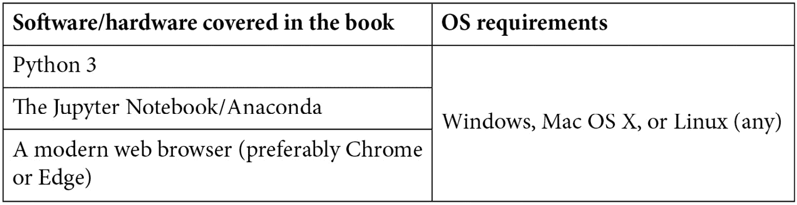
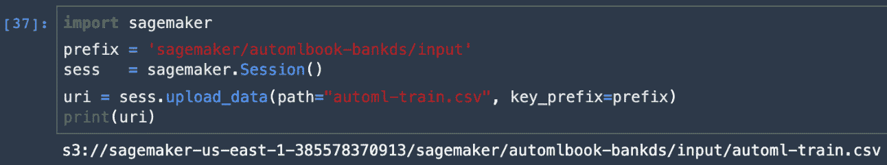

<title>B16890_Preface_Final_VK_ePub</title>

# 前言

每一个机器学习工程师都与具有超参数的系统打交道，**自动化机器学习** ( **AutoML** )中最基本的任务就是自动设置这些超参数以优化性能。最新的深度神经网络具有广泛的超参数，用于其架构、正则化和优化，可以有效地定制这些超参数，以节省时间和精力。

这本书回顾了自动化特征工程的基础技术，模型和超参数调整，基于梯度的方法，等等。您将探索在开源工具中实现这些技术的不同方式。接下来，您将关注企业工具，了解在三大云服务提供商中实现 AutoML 的不同方式:**微软 Azure** 、**亚马逊 Web 服务** ( **AWS** )和**谷歌云平台** ( **GCP** )。随着您的进步，您将通过使用 AutoML 构建机器学习模型来探索云 AutoML 平台的功能。后面的章节将向您展示如何通过自动化机器学习开发生命周期中涉及的耗时且重复的任务来开发准确的模型。

到本书结束时，您将能够构建和部署 AutoML 模型，这些模型不仅准确，而且还能提高生产率，允许互操作性，并最大限度地减少工程任务。

# 这本书是给谁的

公民数据科学家、机器学习开发者、人工智能爱好者或任何希望使用开源工具、微软 Azure 机器学习、AWS 和谷歌云平台提供的功能自动构建机器学习模型的人都会发现这本书很有用。

# 这本书涵盖了什么

[*第 1 章*](B16890_01_Final_VK_ePub.xhtml#_idTextAnchor014)*围绕自动化机器学习的一圈*，通过为新手提供坚实的概述和作为有经验的机器学习实践者的参考，呈现了 AutoML 方法的详细概述。本章从机器学习开发生命周期开始，导航 AutoML 解决的超参数优化问题。

[*第二章*](B16890_02_Final_VK_ePub.xhtml#_idTextAnchor049)*自动化机器学习、算法和技术*，允许公民数据科学家在没有丰富经验的情况下构建 AI 解决方案。在这一章中，我们从三个类别来回顾 AutoML 的当前发展:**自动化特征工程** ( **AutoFE** )、**自动化模型和超参数学习** ( **AutoMHL** )和**自动化深度学习** ( **AutoDL** )。这三个类别中采用的最新技术被提出，包括贝叶斯优化，强化学习，进化算法，和基于梯度的方法。在这一章中，我们将总结流行的 AutoML 框架，并以 AutoML 当前面临的挑战作为结论。

[*第 3 章*](B16890_03_Final_VK_ePub.xhtml#_idTextAnchor058) ，*使用开源工具和库的自动化机器学习*，向您介绍 AutoML **开源软件** ( **OSS** )工具和库，这些工具和库自动化了预测模型的构思、概念化、开发和部署的整个生命周期。从数据准备到模型训练，再到验证和部署，这些工具几乎不需要任何人工干预。在这一章中，我们将回顾主要的 OSS 工具，包括 TPOT、AutoKeras、Auto-Sklearn、Featuretools、H2O AutoML、Auto-PyTorch、微软 NNI 和亚马逊 AutoGluon，并帮助您理解这些库中使用的不同价值主张和方法。

[*第四章*](B16890_04_Final_VK_ePub.xhtml#_idTextAnchor076) 、*Azure 机器学习入门*，涵盖了 Azure 机器学习，利用 Windows Azure 平台和服务的力量，帮助加速端到端的机器学习生命周期。在本章中，我们将回顾如何开始使用企业级机器学习服务来构建和部署模型，使开发人员和数据科学家能够更快地构建、训练和部署机器学习模型。通过示例，我们将为构建和部署 AutoML 解决方案奠定基础。

[*第五章*](B16890_05_Final_VK_ePub.xhtml#_idTextAnchor084) ，*使用微软 Azure 的自动化机器学习*，详细回顾并结合代码示例，我们如何使用 Azure 机器学习堆栈自动化模型开发的耗时和迭代任务，并使用 Azure AutoML 执行回归、分类和时间序列分析等操作。本章将使您能够使用 Azure AutoML 执行超参数调整，以找到最佳参数和最佳模型。

[*第六章*](B16890_06_Final_VK_ePub.xhtml#_idTextAnchor091) 、*使用亚马逊 Web 服务的机器学习*，涵盖了亚马逊 SageMaker Studio、亚马逊 SageMaker Autopilot、亚马逊 SageMaker Ground Truth、亚马逊 SageMaker Neo，以及 AWS 提供的其他 AI 服务和框架。除了超大规模(云产品)，AWS 还提供最广泛、最深入的机器学习服务和支持云基础设施，将机器学习交给每一位开发人员、数据科学家和专业实践者。AWS 提供机器学习服务、人工智能服务、深度学习框架和学习工具，以快速构建、训练和部署机器学习模型。

[*第七章*](B16890_07_Final_VK_ePub.xhtml#_idTextAnchor100) ，*用亚马逊 SageMaker Autopilot* 进行自动化机器学习，带我们深入探究亚马逊 SageMaker Studio，使用 SageMaker Autopilot 运行几个候选者，找出数据预处理步骤、机器学习算法和超参数的最佳组合。本章提供了训练推理管道的实际操作说明性概述，以便在实时端点或批处理上轻松部署。

[*第八章*](B16890_08_Final_VK_ePub.xhtml#_idTextAnchor110) ，*用谷歌云平台进行机器学习*，评论谷歌的 AI 和机器学习产品。Google Cloud 在一个可信且可扩展的平台上提供创新的机器学习产品和服务。这些服务包括人工智能中心、人工智能构建模块(如视觉、语言、对话和结构化数据服务)以及人工智能平台。在这一章中，你将熟悉这些产品，并了解人工智能平台如何支持谷歌的开源平台 Kubeflow，该平台允许开发人员通过访问尖端的谷歌人工智能技术(如 TensorFlow、TPUs 和 TFX 工具)来构建便携式机器学习管道，以将你的人工智能应用部署到生产中。

[*第九章*](B16890_09_Final_VK_ePub.xhtml#_idTextAnchor119) 、*用 GCP 云 AutoML* 进行自动化机器学习，向你展示如何用最少的努力和机器学习专业知识，训练定制的特定于业务的机器学习模型。通过动手示例和代码演练，我们将探索 Google Cloud AutoML 平台，在没有任何数据科学或编程知识的情况下，在自然语言、视觉、非结构化数据、语言翻译和视频智能方面创建定制的深度学习模型。

[*第 10 章*](B16890_10_Final_VK_ePub.xhtml#_idTextAnchor128) ，*企业中的 AutoML*，介绍了企业环境中的 AutoML 作为一个系统，通过生成包括数据分析、预测模型及其性能比较在内的全自动报告来实现数据科学的自动化。AutoML 的一个独特之处在于，它提供了对结果的自然语言描述，适合非机器学习专家。我们强调 MLOps 管道的可操作性，讨论在实际问题上表现良好的方法，并确定最佳的总体方法。本章详细介绍了现实世界挑战背后的想法和概念，并提供了解决这些问题的路线图。

# 为了充分利用这本书

这本书是对 AutoML 的介绍。熟悉数据科学、机器学习和深度学习方法将有助于理解 AutoML 如何改进现有方法。

如果你使用的是这本书的数字版本，我们建议你自己输入代码或者通过 GitHub 库获取代码(链接见下一节)。这样做将帮助您避免任何与复制和粘贴代码相关的潜在错误。

# 下载彩色图片

我们还提供了一个 PDF 文件，其中有本书中使用的截图/图表的彩色图像。可以在这里下载:[https://static . packt-cdn . com/downloads/9781800567689 _ color images . pdf](https://static.packt-cdn.com/downloads/9781800567689_ColorImages.pdf)。

# 使用的惯例

本书通篇使用了许多文本约定。

`Code in text`:表示文本中的码字、数据库表名、文件夹名、文件名、文件扩展名、路径名、伪 URL、用户输入和 Twitter 句柄。下面是一个例子:“从`amazonsagemaker-examples/autopilot`文件夹中打开`autopilot_customer_churn`笔记本。”

代码块设置如下:

**Bold** :表示一个新术语、一个重要单词或您在屏幕上看到的单词。例如，菜单或对话框中的单词出现在文本中，如下所示。这里有一个例子:“从亚马逊 SageMaker Studio，点击 **Python 3** 按钮，启动一个数据科学笔记本。”

提示或重要注意事项

像这样出现。

# 取得联系

我们随时欢迎读者的反馈。

**总体反馈**:如果您对本书的任何方面有疑问，请在邮件主题中提及书名，并发邮件至 customercare@packtpub.com联系我们。

**勘误表**:虽然我们已经尽力确保内容的准确性，但错误还是会发生。如果你在这本书里发现了一个错误，请告诉我们，我们将不胜感激。请访问 www.packtpub.com/support/errata，选择您的图书，点击勘误表提交表格链接，并输入详细信息。

**盗版**:如果您在互联网上遇到我们作品的任何形式的非法拷贝，如果您能提供我们的地址或网站名称，我们将不胜感激。请通过 copyright@packt.com 的[联系我们，并提供材料链接。](mailto:copyright@packt.com)

**如果你有兴趣成为一名作家**:如果有你擅长的主题，并且你有兴趣写书或投稿，请访问 authors.packtpub.com。

# 评论

请留下评论。一旦你阅读并使用了这本书，为什么不在你购买它的网站上留下评论呢？潜在的读者可以看到并使用您不带偏见的意见来做出购买决定，我们 Packt 可以了解您对我们产品的看法，我们的作者可以看到您对他们的书的反馈。谢谢大家！

更多关于 Packt 的信息，请访问[packt.com](http://packt.com)。