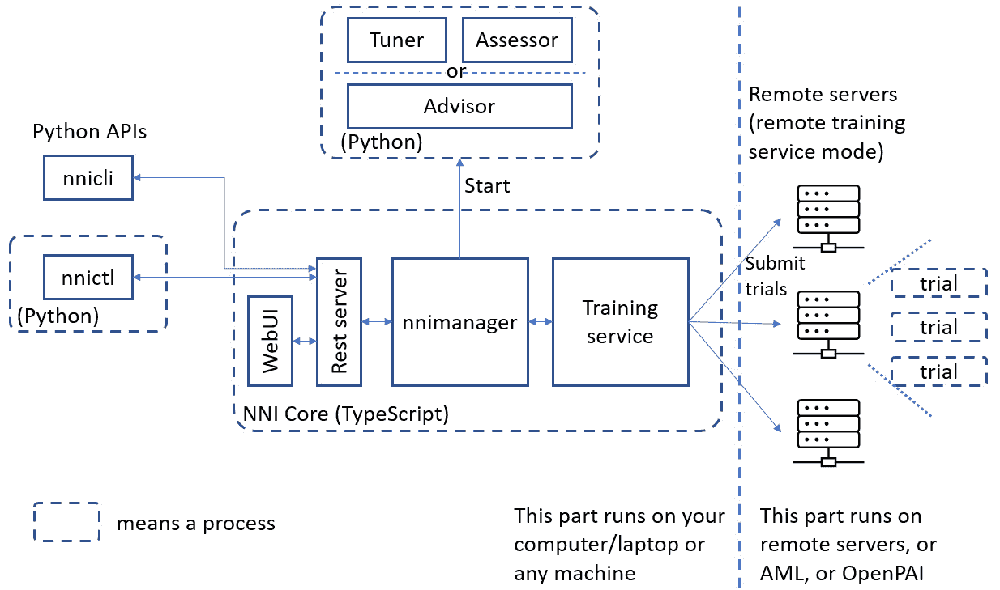

<title>B16890_03_Final_VK_ePub</title>

# *第三章*:使用开源工具和库的自动化机器学习

“增强个人能力是开源成功的关键部分，因为归根结底，创新往往来自小团队，而不是大规模的结构化工作。”

蒂姆·奥莱利

“在开源领域，我们强烈地感觉到，要真正做好一件事，你必须让很多人参与进来。”

莱纳斯·托沃兹

在前一章中，你看到了自动的**机器学习** ( **ML** )技术、技巧和工具。您学习了 AutoML 的实际工作方式，即自动化特征工程、自动化模型和超参数调整以及自动化深度学习的算法和技术。您还探索了贝叶斯优化、强化学习、进化算法和各种基于梯度的方法，查看了它们在自动化 ML 中的使用。

然而，作为一名动手工程师，你可能不会获得完全理解某事的满足感，直到你通过尝试而弄脏了手。这一章将会给你这个机会。AutoML **开源软件** ( **OSS** )工具和库自动化了构思、概念化、开发和部署预测模型的整个生命周期。从数据准备到模型训练，再到验证和部署，这些工具几乎不需要任何人工干预。

在这一章中，我们将回顾主要的 OSS 工具，包括 **TPOT** 、 **AutoKeras** 、 **auto-sklearn** 、 **Featuretools** 和**微软 NNI** ，以帮助您理解这些库中使用的差异化价值主张和方法。

在本章中，我们将讨论以下主题:

*   AutoML 的开源生态系统
*   介绍 TPOT
*   功能工具简介
*   介绍微软 NNI
*   介绍 auto-sklearn
*   AutoKeras 简介

我们开始吧！

# 技术要求

本章的技术要求如下:

*   github.com/EpistasisLab/tpot[TPOT 装置](http://github.com/EpistasisLab/tpot
)
*   功能工具安装:[https://pypi.org/project/featuretools/](https://pypi.org/project/featuretools/)
*   https://github.com/microsoft/nni 微软 NNI 安装:
*   auto-sklearn 安装:[https://automl . github . io/auto-sk learn/master/installation . html](https://automl.github.io/auto-sklearn/master/installation.html)
*   自动安装:t0 https://自动安装. com/install/
*   https://www.kaggle.com/c/digit-recognizer[MNIST 下载](https://www.kaggle.com/c/digit-recognizer)

# AutoML 的开源生态系统

通过回顾自动化 ML 的历史，很明显，在早期，的焦点总是在**超参数**优化上。早期的工具，如 **AutoWeka** 和**hyperoptskneel**等，以及后来的 **TPOT** ，最初的关注于使用贝叶斯优化技术来为模型找到最合适的**超参数**。然而，这种趋势向左转移，包括模型选择，最终通过包括特征选择、预处理、构建和数据清理而吞没了整个管道。下表显示了一些可用的著名自动化 ML 工具，包括 **TPOT** 、 **AutoKeras** 、 **auto-sklearn** 和 **Featuretools** ，以及它们的优化技术、ML 任务和训练框架:


图 3.1–自动化 ML 框架的特征

对于本章中的几个例子，我们将使用`datasets`包，因为它已经处理了数据加载和预处理 **MNIST** 60，000 个训练例子和 10，000 个测试例子。大多数数据科学家都是 ML 爱好者，并且非常熟悉 **MNIST** 数据库，这使得它成为教您如何使用这个库的绝佳候选:


图 3.2–MNIST 手写数字数据库–可视化

前面的图像显示了 MNIST 数据集的样子。该数据集是所有主要的 ML 和深度学习库的一部分，可以从 https://www.kaggle.com/c/digit-recognizer 的[下载。](https://www.kaggle.com/c/digit-recognizer)

# 介绍 TPOT

基于树的流水线优化工具，或简称为 **TPOT** ，是宾夕法尼亚大学计算遗传学实验室的产品。TPOT 是一个用 Python 编写的自动化 ML 工具。它有助于建立和优化遗传规划的 ML 管道。TPOT 建立在 scikit-learn 的基础上，通过“*探索数千条可能的管道以找到最好的一条*”，帮助自动化特征选择、预处理、构建、模型选择和参数优化过程。这是仅有的学习曲线较短的工具包之一。

该工具包可以在 GitHub 上下载:[github.com/EpistasisLab/tpot](http://github.com/EpistasisLab/tpot)。

为了解释这个框架，让我们从一个最小的工作示例开始。对于这个例子，我们将使用手写数字的 **MNIST** 数据库:

1.  Create a new `pip install TPOT`. TPOT can be directly used from the command line or via Python code:

    图 3.3–在 Colab 笔记本电脑上安装 TPOT

2.  Import `TPOTClassifier`, the scikit-learn `datasets` package, and the model selection libraries. We will use these libraries to load the data that we will be using for classification within TPOT:

    图 3.4–AutoML TPOT 示例–导入语句

3.  Now, proceed by loading the `train_test_split` method returns a list containing a train-test split of given inputs. In this case, the inputs are digits data and digits target arrays. Here, you can see that the training size is **0.75** and that the test size is **0.25**, which signifies a standard 75-25 split in training and testing data:

    图 3.5–自动 TPOT 示例–加载数字数据集

4.  In a typical scenario, this is where we will choose a model, assign `TPOTClassifier`. This class is parametrically quite extensive, as shown in the following screenshot, but we will only be using three key parameters; that is, `verbosity`, `max_time_mins`, and `population_size`:

    图 3.6–AutoML TPOT 示例–实例化 TPOTClassifier 对象

    一个关于参数被传递给`Classifier`的快速提示——将`Verbosity`设置为`2`将使 TPOT 在一个进度条旁边打印信息。`max_time_mins`参数以分钟为单位设置 TPOT 优化流水线的时间分配，而`population_size`参数是每一代遗传编程群体中的个体数量。

    开始实验时，我们将最长时间设置为仅 1 分钟:

    

    图 3.7–AutoML TPOT 示例–tpot classifier 的优化运行

    你将会看到优化的进度并没有那么好；这一比例为 22%，因为在这一代人中，40 个人中只有 9 个人被处理过。在这种情况下，最佳推荐管道基于`RandomForestClassifier`。

5.  Now, let's increase this to 5 minutes and check the resulting pipeline. At this point, it seems like the recommended classifier is the Gradient Boosting classifier. This is quite interesting:

    。

    图 3.8–自动 TPOT 示例–执行 TPOTClassifier

6.  This time, we will gradually increase the time to `15` minutes, in which case the best pipeline will turn out to be from the **k-nearest neighbours** (**KNN**) classifier:

    图 3.9–自动 TPOT 分类器–TPOTClassifier 拟合获得预测

7.  Increasing the time to `25` minutes does not change the algorithm, but other **hyperparameters** (number of neighbors) and their accuracy are increased:

    图 3.10–AutoML TPOT 示例–运行多代和分数

8.  Finally, let's run the experiment for an entire hour:

    图 3.11-AutoML TPOT 示例-TPOT 世代和交叉验证分数

    使用带有递归特征消除的特征排序，得到最佳流水线`KNeighborsClassifier`。其他超参数包括`max_features`和`n_estimators`，管道精度为`0.98666`:

    

    图 3.12-AutoML TPOT 示例-最佳管道

    这提醒了我——如果 666 被认为是邪恶的数字，那么 25.8069758011 就是万恶之源。

9.  此外，正如你可能已经观察到的，TPOT 不得不为多代运行其**交叉验证** ( **CV** )的时间量，流水线改变了，不仅算法而且**超参数**也进化了。也有收益递减的。CV 分数的提高变得越来越小，在某一点上，这些改进没有太大的区别。

现在，您可以通过调用`export`方法从 TPOT 导出实际的模型:


图 3.13–AutoML TPOT 示例–探索数字管道

一旦模型被导出，您将能够在 **Google Colab** 的左侧窗格中看到该文件，如下面的屏幕截图所示:


图 3.14–AutoML TPOT 示例–可视化 TPOT 数字管道

现在我们知道这个管道是最好的，让我们试试这个。请注意，我们不再需要 TPOT，因为我们已经有了茶叶(或管道，在这种情况下):


图 3.15–AutoML TPOT 示例–使用提取树分类器导出管道

现在我们已经创建了导出的管道，让我们加载数据集。我不用从 CSV 文件中读取它，只需使用`sklearn`数据集来加快速度。另外，我在数组中选择数字`target` `[10]`)，瞧，预测是正确的:


图 3.16–AutoML TPOT 示例–导出管道的结果

## TPOT 是如何做到这一点的？

这看起来很棒，但是你买这本书不仅仅是为了学习如何使用一个 API——你想要更多地了解幕后发生的事情。好吧，这里是独家新闻:TPOT 已经使用基因编程自动化了管道的关键部件；如你所见，它尝试了不同的方法，然后最终决定使用 KNN 作为最佳分类器:


图 3.17-TPOT 管道搜索概述

在幕后，TPOT 使用遗传编程结构(选择、交叉和变异)来优化转换，这有助于最大限度地提高分类准确性。以下是 TPOT 提供的运营商列表:


图 3.18-TPOT-一个基于树的流水线优化工具，用于自动化 ML

# 功能工具简介

Featuretools 是一个优秀的 Python 框架，它通过使用 DFS 来帮助自动化特征工程。特征工程是一个棘手的问题，因为它的本质非常微妙。然而，这个开源工具包，凭借其健壮的时间戳处理和可重用的特性原语，为我们构建和提取特性组合及其影响提供了一个合适的框架。

该工具包可以在 GitHub 上下载:[https://github.com/FeatureLabs/featuretools/](https://github.com/FeatureLabs/featuretools/)。以下步骤将指导您如何安装 Featuretools，以及如何使用该库运行自动化 ML 实验。让我们开始吧:

1.  To start Featuretools in Colab, you will need to use pip to install the package. In this example, we will try to create features for the Boston Housing Prices dataset:

    图 3.19–带有功能工具的 AutoML–安装功能工具

    在这个实验中，我们将使用波士顿房价数据集，这是一个众所周知的在 ML 中广泛使用的数据集。以下是数据集的简要描述和元数据:

    

    图 3.20–带有功能工具的 AutoML–波士顿房价数据集

2.  The Boston Housing Prices dataset is part of the `scikit-learn` dataset, which makes it very easy to import, as shown here:

    图 3.21–带有功能工具的 AutoML–安装功能工具

3.  Now, we will use `boston`) using the `featuretools` **Deep Feature Synthesis** (**DFS**) API:

    图 3.22–带有功能工具的 AutoML–加载数据集作为 pandas 数据框架

4.  让我们为波士顿表创建一个特性工具实体集，然后定义目标条目。在这种情况下，我们将只创建一些新功能；也就是说，产品和现有功能的总和。一旦**功能工具**运行了 DFS，您将拥有所有的求和与乘积功能:

图 3.23–带有功能工具的 AutoML–DFS 的结果

功能列表继续列出:


图 3.24–带功能工具的 AutoML–DFS 的结果–续

此时，您可能会想，如果 DFS 只包含现有特性的和与积，那么做 DFS 有什么意义呢？很高兴你问了。可以把这些派生的特征看作是突出多个数据点之间的潜在关系，它与总和及乘积无关。例如，您可以使用平均订单总和来链接多个表，算法将具有额外的预定义功能来查找相关性。这是 DFS 提供的一个非常强大和重要的量化价值主张，通常用于机器学习算法竞赛:


图 3.25–DFS–分析实体的特征

**Featuretools** 网站包含一组优秀的演示，用于预测下一次购买、剩余使用寿命、约会失约、贷款偿还可能性、客户流失、家庭贫困和恶意互联网流量，以及许多其他用例:[https://www.featuretools.com/demos/](https://www.featuretools.com/demos/)。

# 介绍微软 NNI 公司

**微软神经网络智能** ( **NNI** )是一个开源平台，解决了任何自动化 ML 生命周期的三个关键领域——自动化特征工程、架构搜索(也称为**神经架构搜索**或 **NAS** )和**超参数调优** ( **HPI** )。该工具包还提供了模型压缩特性和可操作性。NNI 自带了许多内置的超参数调整算法。

NNI 的高层架构图如下:



图 3.26–微软 NNI 高层架构

NNI 内置了几个最先进的**超参数**优化算法，它们被称为**调谐器**。列表包括 **TPE** 、**随机搜索**、**退火**、**朴素进化**、 **SMAC** 、 **Metis 调谐器**、**批量调谐器**、**网格搜索**、 **GP 调谐器**、**网络形态**、**超带**、**BOHB**

 **该工具包可以在 GitHub 上下载:[https://github.com/microsoft/nni](https://github.com/microsoft/nni)。关于其内置调谐器的更多信息可以在这里找到:[https://nni.readthedocs.io/en/latest/builtin_tuner.html](https://nni.readthedocs.io/en/latest/builtin_tuner.html)。

现在，让我们学习如何安装微软 NNI，以及如何使用这个库运行自动化的 ML 实验。

让我们继续并使用`pip`在我们的机器上安装 NNI:


图 3.27–使用微软 NNI 的 AutoML–通过 Anaconda 安装

NNI 提供的最好的功能之一是它既有一个**命令行界面** ( **CLI** )又有一个 **web UI** ，这样我们就可以查看试验和实验。NNICtl 是用于管理 NNI 应用程序的命令行。你可以在下面的截图中看到实验的选项:


图 3.28–使用微软 NNI 的 AutoML–nni CTL 命令

如果你不明白它是如何运作的，NNI 会有一个学习曲线。您需要熟悉三个主要的 NNI 元素，它才能工作。首先，您必须定义搜索空间，您可以在`search_space.json`文件中找到它。您还需要更新型号代码(`main.py`)，使其包含`config.yml`)，以便您可以定义调谐器和试用(执行型号代码)信息:


图 3.29–使用微软 NNI 的 AutoML–配置和执行文件

提醒一下，搜索空间描述了每个超参数的取值范围，对于每个试验，从这个空间中挑选各种超参数值。在为超参数调整实验创建配置时，我们可以限制最大试验次数。此外，在创建超参数搜索空间时，我们可以列出在使用**选择**类型超参数时，我们希望在调整实验中尝试的值。

在本例中，我们已经采取了一个简单的`nnictl` `create`命令:


图 3.30–微软 NNI 的 AutoML–运行实验

你可以使用下面的命令找到更多关于实验的信息:


图 3.31–使用微软 NNI 的 AutoML–nni ctrl 参数

现在，让我们看看 NNI 的秘密武器——它的用户界面。可通过图 3.29 中*所示输出控制台中显示的网络用户界面 URL 访问 NNI 用户界面。在这里，您可以看到正在运行的实验、它的参数以及它的细节。例如，在这种情况下，我们只运行了 19 次试验，所以它很快就运行完了。但是，没有任何有意义的结果，比如我们找出了最佳指标(`N/A`)，如下面的屏幕截图所示:*


图 3.32–使用微软 NNI 用户界面的 AutoML

将试验次数增加到 30 次会花费更长的时间，但也能让结果更准确。微软 NNI 帮助您报告中间结果(在培训完成前的试用或培训过程中的结果)。例如，如果报告的指标值存储在变量“x”中，您可以使用 NNI 进行中间报告，如下所示:

```
nni.report_intermediate_result(x)
```

以下内容将显示在您的屏幕上:


图 3.33–使用微软 NNI 的 AutoML–完成实验后的用户界面

NNI U I 还为您提供每次试验的**默认指标**、**超参数**、**持续时间**和**中间结果**的视图。**超参数**视图尤其令人惊叹，因为您可以直观地看到每个**超参数**是如何选择的。例如，在这种情况下，批量为 1，024 的 RELU 似乎提供了非常好的结果。这可以让您了解什么样的底层算法可以用于模型选择，如下面的屏幕截图所示:


图 3.34–微软 NNI 的 AutoML–实验中的超参数

正如我们之前了解到的收益递减，增加试验次数不会显著提高模型的准确性。在这种情况下，该实验花了 40 分钟完成 100 次试验，并提供了最佳指标 **0.981** ，而之前的 **0.980** ，如下图所示:


图 3.35–使用微软 NNI 的 AutoML–配置参数

您还可以为**超参数**选择不同的最高结果百分比，以查看我们使用了哪些**超参数**来获得最佳执行结果:


图 3.36–微软 NNI 的 AutoML–超参数

或者，您可以通过从图表右上角的下拉列表中选择`Top 5%`来查看结果的前 5%:


图 3.37–微软 NNI 的 AutoML–前 5%的超参数

NNI 还允许你直观地深入每个试验。您可以在下面的屏幕截图中看到所有的试用工作:


图 3.38–微软 NNI 的 AutoML–实验列表

或者，您可以深入单个作业并查看各种超参数，包括`dropout_rate`、`num_units`、学习率、`batch_size`和`activation`函数:


图 3.39–微软 NNI 的 AutoML–前 20%超参数的路径

能够看到关于实验和超参数的这种程度的细节是惊人的，这使得 NNI 成为我们自动化 ML 的顶级开源工具之一。

在我们继续之前，重要的是要注意，就像 AutoGluon 是 AWS 自动化 ML 产品的一部分一样，NNI 是微软 Azure 自动化 ML 工具集的一部分，这使得它在重用时更加强大和稳定。

# 介绍 auto-sklearn

**scikit-learn** (也称为 **sklearn** )是一个非常流行的用于 Python 开发的 ML 库——如此流行以至于它有自己的迷因:


图 3.40–一个 ML 迷因

作为这个生态系统的一部分，并基于*福雷尔等人*的*高效和健壮的自动化机器学习*,**auto-sk learn**是一个自动化 ML 工具包，它使用**贝叶斯优化**、**元学习**和**集成构造**来执行算法选择和**超参数调整**。

该工具包可以在 GitHub 上下载:[github.com/automl/auto-sklearn](http://github.com/automl/auto-sklearn)。

`auto-sklearn`宣传其易于执行自动化 ML，因为它是一个四线自动化 ML 解决方案:


图 3.41–带 auto-sklearn 的 AutoML–入门

如果前面的语法看起来很熟悉，那是因为这是`scikit-learn`进行预测的方式，因此使得`auto-sklearn`成为最容易使用的库之一。`auto-sklearn`使用`scikit-learn`作为其后端框架，并支持**贝叶斯优化**和自动化**集成构造**。

基于`auto-sklearn`解决了同时找到最佳模型及其超参数的问题。下图显示了`auto-sklearn`如何描述其内部管道:


图 3.42–auto-sk learn 自动化 ML 管道

底层的自动化 ML“引擎”使用**信息检索** ( **IR** )和统计元特征方法来选择各种配置，所有这些都被用作贝叶斯优化输入的一部分。这个过程是迭代的，auto-sklearn 保留模型以创建集合，从而迭代地构建模型以最大化性能。在 Colab 上设置 auto-sklearn 可能很棘手，因为您需要安装以下软件包才能开始:


图 3.43–带有 auto-sklearn 的 AutoML–安装必要的库

安装后，您可能需要在 Colab 中重启运行时。也可以按照这里指定的说明在本地机器上设置 auto-sk learn:[https://automl . github . io/auto-sk learn/master/installation . html](https://automl.github.io/auto-sklearn/master/installation.html)。

一旦完成安装，您就可以运行 **auto-sklearn 分类器**，并通过自动化 ML 的魔力获得极高的准确性和**超参数**:


图 3.44–带有 AutoSkLearn 的 AutoML–为 auto-sklearn 分类器运行一个简单的实验

我们应该指出的是， **auto-sklearn 2** ，一个 auto-sklearn 的实验版本，也已经推出，并且包括了在自动配置和性能改进方面所做的最新工作。可以这样导入 **auto-sklearn 2** :

```
from auto-sklearn.experimental.askl2 import Auto-sklearn2Classifier
```

基本分类、回归、多标签分类数据集的例子，以及定制 auto-sklearn 的高级例子，这里有:【https://automl.github.io/auto-sklearn/master/examples/】T2。

如果您愿意，您可以尝试改变优化指标、训练验证分割、提供不同的特征类型、使用 pandas 数据框架和检查搜索过程的高级用例。这些高级示例还演示了 auto-sklearn 如何用于扩展回归、**分类**和**预处理器组件**，以及如何限制多个**超参数**。

# 自动贩卖机

**Keras** 是中使用最广泛的深度学习框架之一，也是 TensorFlow 2.0 生态系统不可或缺的一部分。【Auto-Keras】基于金等人()的论文，该论文提出了“*一种利用网络态射实现贝叶斯优化的高效神经结构搜索的新方法*”。 **AutoKeras** 建立在这样的概念上，即由于现有的神经架构搜索算法，如 **NASNet** 和 **PNAS** 在计算上相当昂贵，使用**贝叶斯优化**来指导网络的态射是探索搜索空间的有效方法。

该工具包可以在 GitHub 上下载:[github.com/jhfjhfj1/autokeras](http://github.com/jhfjhfj1/autokeras)。

以下步骤将指导您如何安装 AutoKeras，以及如何使用该库运行自动化 ML 实验。让我们开始吧:

1.  To get started with Auto-Keras, run the following `install` commands in Colab or in a Jupyter Notebook. Doing this will install `git uri`:

    图 3.45–带 AutoKeras 的 AutoML–安装

2.  Once you have met the dependencies, you can load the **MNIST dataset**:

    图 3.46–使用 AutoKeras 的 AutoML–加载训练数据

3.  Now, you can get **AutoKeras** and go through the code for a classifier – in this case, an image classifier. **AutoKeras** shows the accuracy of data as it calculates the classification metrics:

    图 3.47–带有 AutoKeras 的 AutoML–运行纪元

4.  Fast forwarding through the fit procedure, now that you have discovered the `model.save` method and use it for `eval` at a later date. You can see the model stored in the `model_autokeras` folder on the left-hand pane of your Colab notebook, as shown in the following screenshot:

    图 3.51–带有 AutoKeras 的 AutoML–导出为 Keras 模型

5.  一旦保存了模型，就可以使用`load_model`来检索数据并对其进行预测，如下面的屏幕截图所示:


图 3.52–带有 AutoKeras 的 AutoML–预测值

**AutoKeras** 使用**高效神经架构搜索** ( **ENAS** )，一种类似于迁移学习的方法。像系综一样，在搜索过程中学习到的**超参数**可重复用于其他模型，这有助于我们避免重新训练并提供改进的性能。

在我们结束对开源库的概述时，提到了两个优秀且易于使用的 AutoML 框架: **Ludwig** 和**autoglon**。

## Ludwig——一个无代码的 AutoML 工具箱

优步的自动化 ML 工具 Ludwig 是一个开源的深度学习工具箱，用于实验、测试和训练 ML 模型。Ludwig 建立在 TensorFlow 之上，使用户能够创建模型基线，并对不同的网络架构和模型进行自动化的 ML 风格实验。在其最新版本中，Ludwig 现在集成了 CometML 并支持 BERT 文本编码器。

该工具包可以在 GitHub 上下载:[https://github.com/uber/ludwig](https://github.com/uber/ludwig)。

这里有很多关于这个话题的好例子:[https://Ludwig-ai . github . io/Ludwig-docs/examples/# image-class ification-mnist](https://ludwig-ai.github.io/ludwig-docs/examples/#image-classification-mnist)。

# autoglon——深度学习的 AutoML 工具包

从 AWS 实验室来看，考虑到 ML 的民主化目标，AutoGluon 被描述为“T1”易于使用和易于扩展的 AutoML，专注于深度学习和跨图像、文本或表格数据的真实世界应用。AutoGluon 是 AWS 自动化 ML 战略的一个组成部分，使初级和经验丰富的数据科学家都能轻松构建深度学习模型和端到端解决方案。像其他自动化 ML 工具包一样，AutoGluon 提供了网络架构搜索、模型选择和改进 cus tom 模型的能力。

该工具包可以在 GitHub 上下载:[https://github.com/awslabs/autogluon](https://github.com/awslabs/autogluon)。

# 总结

在这一章中，你回顾了一些用于 AutoML 的主要开源工具，包括 **TPOT** 、 **AutoKeras** 、 **auto-sklearn** 、 **Featuretools** 和**微软 NNI** 。提供这些工具是为了帮助你理解我们在 [*第 2 章*](B16890_02_Final_VK_ePub.xhtml#_idTextAnchor049) 、*自动机器学习、算法和技术*中讨论的概念，以及这些库中使用的底层方法。

在下一章，我们将从微软 Azure 平台开始，对商业自动化 ML 产品做一个深入的回顾。

# 延伸阅读

有关本章涵盖的主题的更多信息，请参考资源和链接:

*   Python 中自动 ML 的 TPOT:[https://machinelementmastery . com/tpot-for-Automated-machine-learning-in-Python/](https://machinelearningmastery.com/tpot-for-automated-machine-learning-in-python/)
*   功能工具演示:[https://www.featuretools.com/demos/](https://www.featuretools.com/demos/)
*   波士顿数据集:[https://sci kit-learn . org/stable/modules/generated/sk learn . datasets . load _ Boston . html](https://scikit-learn.org/stable/modules/generated/sklearn.datasets.load_boston.html)
*   如何自动化 ML:[https://www.knime.com/blog/how-to-automate-machine-learning](https://www.knime.com/blog/how-to-automate-machine-learning)
*   *将 ML 应用于生物信息学问题的数据驱动建议，*Randal s . Olson:【https://www.ncbi.nlm.nih.gov/pmc/articles/PMC5890912/】T2
*   Python 中的 TPOT 自动化 ML:[https://towardsdatascience . com/tpot-Automated-machine-learning-in-Python-4c 063 B3 e 5 de 9](https://towardsdatascience.com/tpot-automated-machine-learning-in-python-4c063b3e5de9)
*   https://github.com/microsoft/nni 微软 NNI:

*   auto-sk learn:https://automl . github . io/auto-sk learn/master/examples/20 _ basic/example _ regression . html # sphx-glr-examples-20-basic-example-regression-py
*   TPOT 演示:https://github . com/EpistasisLab/tpot/blob/master/tutorials/digits . ipynb**