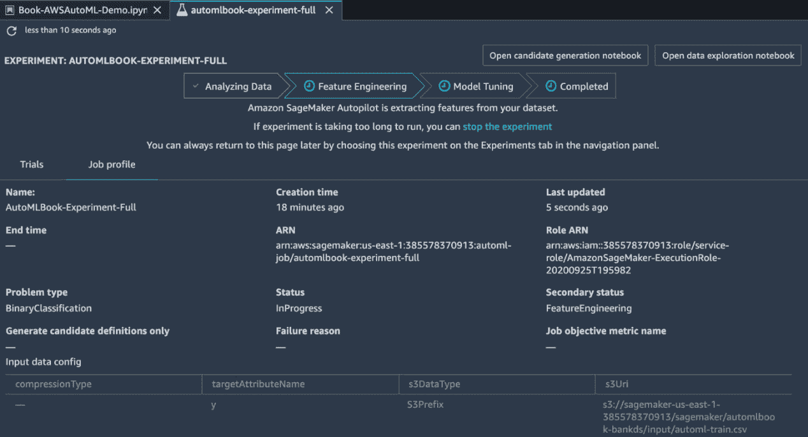

# *第七章*:用亚马逊 SageMaker 自动驾驶仪做自动化机器学习

“机器学习的圣杯之一是自动化越来越多的特征工程过程。”

-佩德罗多明戈斯

“自动化机器学习，切片面包以来最好的东西！”

–匿名

通过超大规模——即通过云提供商——的自动化机器学习 ( **AutoML** )有可能将人工智能民主化带给大众。上一章你在 SageMaker 中创建了一个**机器学习** ( **ML** )工作流，也了解了 SageMaker 自动驾驶的内部。

在这一章中，我们将通过几个例子来解释 Amazon SageMaker Autopilot 是如何在视觉和笔记本中使用的。

在本章中，我们将讨论以下主题:

*   创建亚马逊 pagemaker 自动驾驶仪有限实验
*   创建自动实验
*   运行 SageMaker 自动驾驶仪实验并部署模型
*   调用和测试 SageMaker 自动驾驶模型
*   从笔记本上构建和运行 SageMaker 自动驾驶仪实验

我们开始吧！

# 技术要求

您需要在您的机器上访问 Amazon SageMaker Studio 实例。

# 创建亚马逊 SageMaker 自动驾驶有限实验

让我们获得使用 SageMaker Autopilot 应用 AutoML 的实践介绍。我们将下载 AutoML 并将其应用于开源数据集。我们开始吧！

1.  在 Amazon SageMaker Studio 中，通过点击`bank-additional-full.csv`开始一个数据科学笔记本，连同所有示例(完整数据)，按日期排序(从 2008 年 5 月到 2010 年 11 月)
2.  `bank-additional.csv`，从`bank-additional-full.csv`中随机抽取 10%的样本(4119 个)
3.  `bank-additional-names.txt`, which contains the field information described in the preceding screenshot

    如下面的屏幕截图所示，一旦将 CSV 文件加载到 pandas 数据帧中，您就可以使用 pandas 查看文件的内容:

图 7.6–亚马逊 SageMaker Studio Jupyter 笔记本–将数据集加载到 pandas 数据框架中并将其可视化

使用 NumPy，将数据集分成训练和测试部分。在这种情况下，我们将使用 95%的数据进行训练，5%的数据进行测试，如下图截图所示。您将把这些数据存储在两个文件中:一个用于训练，另一个用于测试。

图 7.7-Amazon sage maker Studio Jupyter 笔记本–将数据集分成训练/测试，并将文件保存在 S3

使用 SageMaker API 创建一个会话，并将我们在上一步中创建的训练数据上传到 S3:

图 7.8–亚马逊 SageMaker Studio Jupyter 笔记本–将数据集上传到 S3

在前一章中，我们学习了如何使用笔记本创建 AutoML 实验。现在，让我们通过 SageMaker UI 创建一个实验。单击左侧窗格中的实验图标，通过提供实验的名称和 S3 桶地址来创建一个实验，如下面的屏幕截图所示:

图 7.9–亚马逊 SageMaker Studio 用户界面–创建一个实验

1.  Set the target attribute to `y`. The target attribute is described in the dataset as Output variable (desired target): `y` – has the client subscribed a term deposit? `(binary: "yes","no")`:

    图 7.10–亚马逊 SageMaker Studio 用户界面–创建一个实验

    如前面的截图所示，您可以自己定义 ML 问题——在这种情况下是二进制分类——或者让 SageMaker AutoML 引擎自行决定。在这种情况下，我们将把它保留为 **Auto** ，您将看到 SageMaker 会把这识别为一个二进制分类问题。

2.  You can either run the full experiment – that is, data analysis, feature engineering, and modeling tuning – or create a notebook to view the candidate definitions. We will do both with this dataset to demonstrate the benefits of each approach:

    图 7.11–Amazon SageMaker Studio UI–候选定义的完整实验与试点

    最后，您可以设置一些高级可选参数，如自定义 SageMaker 角色、加密密钥(如果您的 S3 数据已加密)和 VPC 信息(如果您正在使用虚拟私有云):

    

    图 7.12–亚马逊 SageMaker Studio 用户界面–高级设置

    至此，我们已经输入了所有需要的信息，可以进行实验了。提交作业后，您将看到以下屏幕，其中包含两个步骤(分析数据和候选人定义生成)。这是因为我们选择不进行整个实验；我们仅选择生成候选人定义:

    

    图 7.13–亚马逊 SageMaker Studio 实验创建界面–分析数据屏幕

3.  一旦这个部分实验完成，您将看到以下屏幕，其中的显示了完整的工作信息、试验和工作概况。由于我们在这种情况下只生成了候选对象，所以实验没有花费太长时间。在页面的右上角可以找到**打开候选人生成笔记本**和**打开数据探索笔记本**按钮。这两个按钮将打开各自的笔记本:

图 7.14–Amazon sage maker AutoML 实验完成视图

SageMaker 自动驾驶候选定义笔记本帮助数据科学家更深入地了解数据集、其特征、其分类问题以及训练模型的质量指标。这基本上是对 SageMaker 自动驾驶管道幕后发生的事情的深入了解，并让数据科学家有机会手动运行它，并在他们认为必要时进行微调或更改:

图 7.15–亚马逊 SageMaker 自动驾驶候选人定义笔记本

候选人定义笔记本是一个相当大的文件，包含一个目录，如前面截图中的所示。同样，数据探索笔记本为您提供了对数据集的深入了解:

图 7.16-亚马逊 SageMaker 自动驾驶数据探索笔记本

这些见解包括您通常对数据科学家的期望——数据科学家寻找要素及其数据类型、范围、平均值、中值、描述性统计数据、缺失数据等。即使您对一般可用的 AutoML 功能持怀疑态度，这也是数据科学家探索数据集及其各自候选对象的绝佳场所:

图 7.17-亚马逊 SageMaker 自动驾驶数据探索笔记本-描述性统计

亚马逊 SageMaker 自动驾驶数据探索和候选人定义笔记本为用户分析数据和进行实验提供了一个透明的视图。就笔记本而言，这些是可执行的代码片段，您可以在其中看到预处理器、超参数、算法、超参数范围以及用于识别最佳候选项的所有规定的预处理步骤。

在下一节中，我们将构建并运行一个完整的自动驾驶实验。

# 创建自动实验

由于自动驾驶数据探索和候选定义笔记本提供了数据集的深入概述，完整的实验实际上运行这些步骤，并根据这些笔记本中描述的步骤为您提供最终的调整模型。现在，让我们使用与前面相同的用户界面创建一个完整的实验:

1.  从亚马逊 SageMaker 工作室，开始一个数据科学实验。单击左侧窗格中的实验图标，通过提供实验名称和 S3 桶地址来创建一个实验，如下面的屏幕截图所示:

图 7.18-亚马逊 SageMaker 自动驾驶仪-创建实验

在之前的*创建亚马逊 SageMaker 自动驾驶有限实验部分*中，我们进行了有限运行。在本节中，我们将使用完整的实验功能:

图 7.19-亚马逊 SageMaker 自动驾驶仪-创建完整的实验

当您开始这个实验时，它将与我们之前的候选实验非常相似，除了这个完整的实验将花费更长的时间，并且将构建和执行整个管道。在等待结果的同时，您将看到以下屏幕:

图 7.20-亚马逊 SageMaker 自动驾驶仪-运行完整的实验

当实验运行时，您可以通过查看单个实验并从**试验**选项卡中获得有价值的见解来跟踪其进度。您可能还注意到，这里的问题类型被正确地归类为二元分类:

图 7.21-亚马逊 SageMaker 自动驾驶仪-运行完整的实验

下面截图中显示的实验的详细摘要显示了所使用的推理容器、模型数据 URI 和所利用的环境，以及它们各自的**亚马逊资源名称** ( **阿恩斯**)，它们唯一地标识了 AWS 资源:

图 7.22-亚马逊 SageMaker 自动驾驶推断容器信息

**试验**选项卡显示运行的不同试验和调优作业，以及目标函数(F1 分数)，展示了它如何随着时间的推移而改进:

图 7.23-亚马逊 SageMaker 自动驾驶实验运行测试-最佳模型

在前面的章节中，你已经看到了这个精确的迭代；这又是似曾相识的一幕。我们已经看到这个过程在 OSS 工具中展开，但它在这里只是不同，因为它是以更有组织的端到端方式完成的。你把整个管道整合成一个。即策略、数据分析、特征工程、模型调整和超参数优化过程。您可以在下面的屏幕截图中看到优化作业的详细信息:

图 7.24–显示贝叶斯策略和资源信息的 Amazon SageMaker 自动驾驶调优作业详细信息

既然我们已经运行了整个实验，流程也完成了，让我们来部署最佳模型。

# 运行 SageMaker 自动驾驶仪实验并部署模型

亚马逊 SageMaker Studio 让我们可以轻松构建、训练、部署机器学习模型；也就是说，它启用了数据科学生命周期。为了部署我们在上一节中构建的模型，我们需要设置某些参数。为此，您必须提供端点名称、实例类型、实例数量(计数)，以及您是否希望捕获请求和响应信息。让我们开始吧:

1.  If you select the **Data capture** option, you will need an S3 bucket for storage, as shown in the following screenshot:

    图 7.25–Amazon sage maker 端点部署

2.  Once you've clicked on **Deploy**, you will see the following screen, which shows the progress of the new endpoint being created:

    图 7.26–亚马逊 SageMaker 端点部署正在进行中

    一旦部署完成，您将看到以下运行状态:

    

    图 7.27–Amazon sage maker 端点部署完成

3.  模型端点是确保模型质量的重要资源。通过启用模型监视器，您可以检测数据漂移并监视生产中任何模型的质量。这种对模型质量的主动检测有助于确保您的机器学习服务不会最终在生产中提供错误的结果。您可以点击`Enable monitoring`按钮使用 Amazon SageMaker 模型监视器:

图 7.28–亚马逊 SageMaker 自动驾驶模型监视器启动屏幕

模型监控是机器学习生命周期的一个重要领域。如下面的截图中的所示，Amazon SageMaker 模型监控器通过捕获数据、创建基线、安排监控作业，然后允许 SME 在出现异常值和违规时解释结果来解决这个问题:

图 7.29–亚马逊 SageMaker 自动驾驶模型监控支持笔记本

既然我们已经创建并部署了模型，那么是时候通过调用它来测试它了。这种调用通过 web 服务公开的机器学习模型的操作通常被称为推理或评估。

## 调用模型

使用亚马逊 SageMaker Autopilot 构建和部署模型后，我们可以对其进行测试。还记得我们之前保存的测试数据吗？现在，是时候使用它了。在这里，您可以看到我们正在遍历`automl-test.csv`文件，并通过将数据行作为请求传递来调用端点:

图 7.30-亚马逊 SageMaker 自动驾驶仪-笔记本中的模型调用

该请求包含申请贷款的人的信息。我们已经从请求中删除了结果(标签),然后比较它，就像我们希望打印出的值一样。您可以在前面的屏幕截图中看到请求、标签和来自 web 服务的相应响应。您可以使用此信息来计算服务结果的准确性；它们相当准确:

图 7.31-亚马逊 SageMaker 自动驾驶仪-模型调用响应

既然你已经从亚马逊 SageMaker Autopilot UI 学会了如何设置 AutoML 实验，在下一节中，我们将使用笔记本来做同样的事情。

# 从笔记本上构建和运行 SageMaker 自动驾驶仪实验

客户流失是企业面临的一个现实问题，在本例中，我们将利用我们在 Amazon SageMaker Autopilot 中完成 AutoML 的知识,使用笔记本建立一个客户流失预测实验。在这个实验中，我们将使用由 Daniel T. Larose 在他的书*发现数据中的知识*中提供的公开可用的美国移动客户数据集。为了演示如何运行全色域，示例笔记本通过执行功能工程、构建模型管道(以及任何最佳超参数)和部署模型来执行自动驾驶实验。

UI/API/CLI 范式的发展帮助我们以多种格式利用同一个界面；在这种情况下，我们将直接从笔记本电脑上利用亚马逊 SageMaker 自动驾驶仪的功能。让我们开始吧:

1.  Open the `autopilot_customer_churn` notebook from the `amazon-sagemaker-examples/autopilot` folder, as shown in the following screenshot:

    图 7.32-亚马逊 SageMaker 自动驾驶仪-客户流失预测自动驾驶仪笔记本

2.  Run the setup by specifying the S3 bucket and the **Identity and Access Management** (**IAM**) role, as we did in the previous *Creating an AutoML experiment* section. Download the dataset, as shown in the following screenshot:

    图 7.33–Amazon sage maker auto pilot–运行笔记本以设置默认存储桶并创建会话

3.  At this point, you will need to install the prerequisites, and download the dataset, as shown in the following screenshot:

    图 7.34-Amazon sage maker auto pilot-下载数据集并解压文件

4.  Once the dataset has been downloaded and uncompressed, you can add it to a pandas DataFrame and view it. It shows information about the customer, such as their calling attributes, as shown in the following screenshot:

    图 7.35–显示数据集信息的亚马逊 SageMaker 笔记本

5.  We can now sample the dataset as test and training buckets, and then upload these files to S3 for future use. Once they've been uploaded, you will get the S3 buckets' names, as shown in the following screenshot:

    图 7.36–亚马逊 SageMaker 自动驾驶仪–用于测试和培训的样本数据集，并将文件上传到 S3

    到目前为止，我们所做的一切都是传统的笔记本工作。现在，我们将设置自动驾驶作业。

6.  Let's define the configuration, as shown in the following screenshot:

    图 7.37–亚马逊 SageMaker 自动驾驶仪–配置自动驾驶仪作业配置

7.  Now, let's launch the SageMaker Autopilot job by invoking the `create_auto_ml_job` API call, like so:

    图 7.38–亚马逊 SageMaker 自动驾驶仪–配置自动驾驶仪作业

    作业运行多个试验，包括每个试验的组件，如下图所示:

    

    图 7.39-亚马逊 SageMaker 自动驾驶仪-自动驾驶仪工作手册中的试用组件

    在跟踪 Amazon SageMaker Autopilot 作业的进度时，您可以打印其状态以及任何延迟，如下图所示。但是，要以有意义的方式直观地查看各个试运行的详细信息，您可以使用用户界面:

    

    图 7.40-亚马逊 SageMaker 自动驾驶仪-自动驾驶仪工作手册中的试用组件

8.  一旦试验中的特征工程和模型调整工作完成，您就可以运行`describe_auto_ml_job`来获得最佳候选信息。然后，您可以遍历`best_candidate`对象来获取关于底层分数和度量的信息，如下面的屏幕截图所示:

图 7.41-亚马逊 SageMaker 自动驾驶仪-自动驾驶仪工作手册中的试用组件

一旦工作完成，您将看到候选模型、最终指标(本例中为 F1 分数)以及任何相关值:

图 7.42-亚马逊 SageMaker 自动驾驶仪工作结果

在下一节中，我们将部署和调用最佳候选模型，它的 F1 得分为 93%。

## 托管和调用模型

类似于我们如何调用我们之前使用实验 UI 构建的模型，我们现在将托管并调用我们在笔记本中构建的模型。不同之处在于，在第一个实例中，我们是低代码的，而在这里，我们使用代码来构建它:

1.  To host the service, you will need to create a model object, endpoint configuration, and eventually an endpoint. Previously, this was done using the UI, but here, we will use the Amazon SageMaker Python instance to accomplish the same. This can be seen in the following screenshot:

    图 7.43–亚马逊 SageMaker 笔记本–托管模型

    `get_waiter`方法是 Boto3 的一部分，boto 3 是用于 AWS 的 Python SDK。与其他等待程序一样，它会进行轮询，直到达到成功状态。60 次检查失败后，通常会返回一个错误。你可以通过查看它的 API 文档来了解这些方法，可以在这里找到:[https://boto 3 . amazonaws . com/v1/documentation/API/latest/reference/services/sage maker . html # sage maker。客户端.创建端点](https://boto3.amazonaws.com/v1/documentation/api/latest/reference/services/sagemaker.html#SageMaker.Client.create_endpoint)。

    既然已经创建了端点并且已经托管了模型，我们就可以调用服务了。要评估模型，您需要创建一个预测器实例，并向其传递端点信息以及预测参数。我们可以通过传入整个测试数据 CSV 文件并将结果与实际情况进行比较来执行批量预测，而不是逐行调用端点。您可以在下面的屏幕截图中看到准确性数字:

    

    图 7.44-亚马逊 SageMaker 模型准确性评估

2.  Once you have finished testing the endpoint, we must clean up. In cloud environments, you must clean up after yourself, so make this a priority checklist item. If you don't do this, you won't like the billing statement from leaving a server running. Virtual or not, it all adds up.

    当您清理 UI 时，关闭并删除计算实例和端点。由于我们正在进行手动清理，因此您必须删除端点、端点配置和模型:

图 7.45-Amazon sage maker 自动驾驶仪清理及产生的响应代码

尽管这些例子已经向您展示了 AWS AutoML 如何使您能够执行特征工程、模型调整和超参数优化，但是您不必将自己局限于 AWS 提供的算法。可以自带数据处理代码到 SageMaker Autopilot，见[https://github . com/AWS/Amazon-sage maker-examples/blob/master/auto pilot/custom-Feature-selection/Feature _ selection _ auto pilot . ipynb](https://github.com/aws/amazon-sagemaker-examples/blob/master/autopilot/custom-feature-selection/Feature_selection_autopilot.ipynb)。

# 总结

从头开始构建 AutoML 系统以使人工智能民主化是一项相当大的努力。因此，超大规模云充当了启动这一旅程的推动者和加速器。在本章中，您学习了如何通过笔记本和实验用户界面使用 Amazon SageMaker Autopilot。你也接触到了更大的 AWS 机器学习生态系统和 SageMaker 的能力。

在下一章，我们将研究另一个主要的云计算平台，Google 云平台，以及它所提供的 AutoML 产品。编码快乐！

# 延伸阅读

有关本章涵盖的主题的更多信息，请参考以下链接和资源:

*   *掌握 AWS 上的机器学习:使用 SageMaker、Apache Spark 和 TensorFlow 在 Python 中进行高级机器学习*，作者 Saket S.R .孟了博士，Maximo Gurmendez，Packt 出版社:[https://www . Amazon . com/Mastering-Machine-Learning-AWS-tensor flow/DP/1789349796](https://www.amazon.com/Mastering-Machine-Learning-AWS-TensorFlow/dp/1789349796)
*   *Learn Amazon SageMaker:为开发人员和数据科学家构建、培训和部署机器学习模型的指南*，作者朱利安·西蒙和弗朗切斯科·波切蒂，帕克特出版社:[https://www . Amazon . com/Learn-Amazon-sage maker-developers-scientists/DP/180020891 x](https://www.amazon.com/Learn-Amazon-SageMaker-developers-scientists/dp/180020891X)