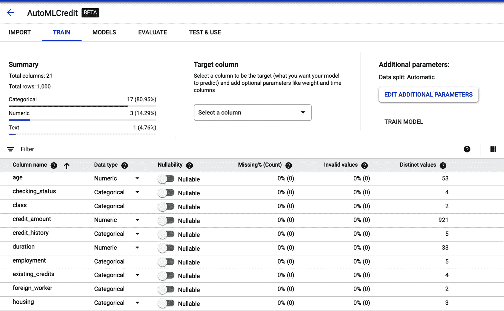
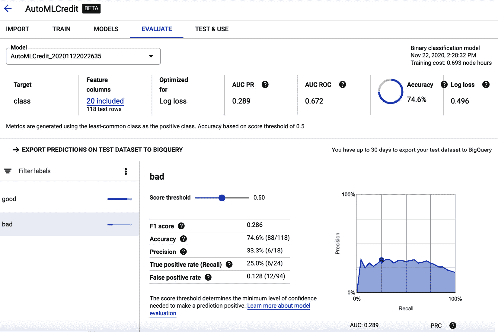

# 九、自动化机器学习与 GCP

"*商业中使用的任何技术的第一条规则是，自动化* *应用于高效的运营会放大效率。第二，自动化应用于低效率的操作会放大低效率。*

*——比尔·盖茨*

这是一个漫长而又有益的旅程，了解了主要的超大规模计算以及它们如何在各自的平台上实现自动化机器学习。在前一章中，您学习了如何开始使用谷歌云人工智能平台，学习了人工智能中心，并学习了如何在 GCP 构建笔记本实例。您还了解了 GCP 提供的不同风格的自动化机器学习，包括 AutoML 自然语言、AutoML 表格、AutoML 翻译、AutoML 视频和 AutoML 视觉。

继续 GCP 产品、功能和服务的广度，我们现在将深入探讨云 AutoML 表。我们将建立模型，并解释自动机器学习如何与 AutoML 表一起工作；即，如何通过分析输入特征(特征工程)、选择模型(神经架构搜索)和执行超参数调整来获取非结构化数据并执行自动化机器学习任务。我们将把这些模型部署到 GCP，并通过 web 服务测试它们，以展示它们的可操作性。

在本章中，我们将讨论以下主题:

*   Google Cloud AutoML 表格入门
*   创建 AutoML 表实验
*   了解 AutoML 表模型部署
*   具有 BigQuery 公共数据集的 AutoML 表
*   用于价格预测的自动机器学习

# 开始使用 Google Cloud AutoML 表格

AutoML 表格有助于利用结构化数据中的洞察力。在任何大型企业中，都有多种形式的数据，包括结构化、非结构化和半结构化数据。对于大多数处理数据库和事务的组织来说，确实存在大量的结构化数据。这些数据非常适合 advances analytics，而 GCP 的 AutoML Tables 正是帮助你基于结构化数据自动构建和部署机器学习模型的工具。

AutoML Tables 使机器学习工程师和数据科学家能够在结构化数据上自动构建和部署最先进的机器学习模型，速度比任何人都要快。它自动对各种数据类型建模，从数字和类到字符串、时间戳、列表和嵌套字段。Google Cloud AutoML 表用最少的代码实现了这一点。在这一章中，我们将学习如何获取一个导出的 CSV 文件，点击几个按钮，等待一段时间，然后在另一端得到一个高度优化的模型。

谷歌的自动机器学习团队努力工作，使该工具适用于各种数据类型。谷歌的 AutoML Tables 探索了可能的模型和超参数的巨大空间，以便它可以代表你尝试和优化事情。当我们探索本章中的示例时，您将看到第一步是通过 **Import** 选项卡导入您的训练数据，给它一个名称，并选择源——可以是 BigQuery 中的一个表、您机器上的一个文件，或者是 Google Cloud Storage 上的一个文件。第一步需要一些时间，因为系统会分析数据集的列。一旦完成，您就可以编辑自动生成的模式，并选择要预测的列。在这里，您还可以更新列类型，以及它是否可以为空。

您还可以查看可能包含许多列的数据集，以便更好地了解它们的数据。您可以单击不同的列名来查看关于您的列的一些统计信息。分析完数据后，我们就可以开始训练过程了。这是 AutoML 真正闪耀的地方，因为你所要做的就是点击 **Train** 。

您可以设置一些选项，包括培训时数的最大预算。这使您能够在进行更长时间的完整训练之前，根据需要试验数据并限制训练时间。你会注意到显示的训练时间有点偏长。这是因为它不仅进行模型调优，而且首先选择使用什么模型。所以，结果是，在训练期间会发生很多事情。但是我们在这里什么都不用做。

一旦培训完成，我们必须评估和部署模型。您将能够看到培训的效果，以及关于模型性能的指标。最后，我们将部署模型来获得预测。浏览器中甚至有一个编辑器，它会向您的端点发出请求，因此您不需要设置一个本地环境来进行这些调用来尝试和测试它。

既然您已经了解了 AutoML 表是如何工作的，让我们在实践中探索一下。

# 创建 AutoML 表格实验

AutoML Tables 在结构化数据上自动构建和部署最先进的机器学习模型。让我们从将这些知识付诸实践的第一个实验开始:

1.  Access the Google Cloud AI Platform home page by visiting this link: [https://console.cloud.google.com/home/](https://console.cloud.google.com/home/). Click on the **Datasets** link in the left pane; you will see the following screen:

    图 9.1–谷歌云人工智能平台主页

2.  On the `IrisAutoML`. Then, click on **CREATE DATASET**:

    图 9.2–AutoML 表格–创建新数据集屏幕

3.  对于这个实验，我们将从虹膜数据集开始。你可以从 https://www.kaggle.com/uciml/iris 下载 CSV 文件，因为我们将在下一步使用它。虽然数据集太小，不能用于自动机器学习，但你很快就会看到这是如何展开的。
4.  现在，您需要将数据(CSV)文件导入到 **Google AutoML 表**中。文件需要上传到存储桶。从您的机器中选择文件并点击**浏览**在 GCP 上创建一个存储目的地，如下面的截图所示:


图 9.3–AutoML 表格–从本地计算机导入文件

要创建一个存储桶，您需要遵循以下步骤。

1.  First, provide a name for your storage bucket:

    图 9.4–AutoML 表–在 GCP 上创建存储桶

2.  Then, choose where you would like to store the data. The options are region (single region), dual region with **high availability** (**HA**), or multi-region for highest availability across multiple locations. For this example, we will choose **us-central1** as a single region, but you can choose another region if it suits you better geographically:

    图 9.5–自动表–选择创建存储桶的位置

3.  Next, choose the default storage class for the data. The storage classes you can choose from are **Standard**, **Nearline (**backup**)**, **Coldline (**disaster recovery**)**, and **Archive (**for archival use**)**. Choose the **Standard** class for the purpose of this implementation, as seen in the following screenshot:

    图 9.6–AutoML 表–为 GCP 上的数据选择存储类别

4.  最后，需要配置加密设置。在这里，您可以提供自己的密钥或使用默认设置，即使用 Google 的托管密钥。点击**创建**完成制作桶的过程:


图 9.7–AutoML 表格–选择加密设置

这将触发创建存储桶和导入数据。您将看到以下屏幕:


图 9.8-AutoML 表-数据被导入到 GCP 存储桶

在这里，我们将学到重要的一课:并非所有的数据都适合自动化机器学习。导入过程完成后，您将看到以下错误消息:


图 9.9–AutoML 表格–行数太少错误

即使你可以用其他工具做这个实验，云自动机器学习平台也设置了一个最低标准，以确保其算法的质量不会受到影响。这个例子给我们上了重要的一课，不是所有的问题都值得机器自动学习。

让我们用一个更大的数据集——贷款风险数据集——重复同样的实验，它包含 21 个字段和 1，000 个实例。你可以从 BigML([http://bml.io/W2SpyF](http://bml.io/W2SpyF)，BigML，Inc .美国俄勒冈州科瓦利斯，2011)下载。该数据集由汉堡大学统计与经济研究所的汉斯·霍夫曼博士创建，包含检查状态、期限、信用历史、用途、信用额和储蓄状态等字段。这些可以用来创建一个模型，预测贷款申请的风险水平。

让我们通过创建一个存储桶来为贷款风险数据集执行上述步骤:

1.  Download the dataset from [http://bml.io/W2SpyF](http://bml.io/W2SpyF). Click on the **CREATE DATASET** button and import the loan risk dataset:

    图 9.10–AutoML 表格–选择新的数据集存储桶

2.  As the import process starts, upload the csv file extracted from the dataset that we downloaded in step 5 file and point it to the destination cloud storage by clicking the **SELECT FILES** button:

    图 9.11–AutoML 表格–选择数据存储

    由于贷款数据集满足所需的大小限制，因此它被成功导入，您将看到下面的培训屏幕。您可以在这里编辑自动生成的模式，并选择要预测的列。您还可以更新列类型，以及它是否可为空。

    此屏幕为您提供了数据集的详细概述。您可以单击不同的列名来查看关于您的列的一些统计信息:

    

    图 9.12–AutoML 表格–培训屏幕

3.  现在，选择目标列；也就是要预测的列，也就是类。该类是一个分类字段，有两个可能的值:信用良好或信用不良。这决定了这个特定的个人是否有资格获得信贷。一旦你选择了班级，点击**火车模型**:


图 9.13–AutoML 表–选择训练的目标列

点击**列车模型**按钮，您将在右侧看到一个流体菜单。菜单可以在下面的截图中看到。这是你可以设置实验参数的地方，也是 AutoML 真正出彩的地方，因为你所要做的就是点击 **Train** 。您可以设置一些选项，包括培训时间的最大预算。这使您能够在进行更长时间的完整训练之前，根据需要试验数据并限制训练时间。你会注意到显示的训练时间有点偏长。这是因为它不仅要进行模型调优，还要首先选择要使用的模型:


图 9.14–AutoML 表–为 GCP 上的数据选择存储类别

你应该训练你的模特多长时间？https://cloud.google.com/automl-tables/docs/train 的[处定义了来自 GCP 的建议培训时间，如下图所示:](https://cloud.google.com/automl-tables/docs/train)


图 9.15-AutoML 表格-建议的培训时间

您可以在[https://cloud.google.com/automl-tables/pricing](https://cloud.google.com/automl-tables/pricing)找到相应的定价指南。

您还可以查看高级选项，在这里您可以看到实验的优化目标。由于是一个分类实验，列出的目标包括一个 **UC ROC** 、 **Log loss** 、 **AUC PR** 、 **Precision** 和 **Recall** 。**提前停止**开关确保在检测到无法再进行改进时，停止该过程。否则，AutoML 表将继续训练，直到达到预算。

点击**列车型号**开始该操作:


图 9.16–AutoML 表格–培训的高级选项

开始实验后，您将看到以下屏幕。它在基础设施建立时开始，也在模型最终定型时开始:


图 9.17–AutoML 表格–开始 AutoML 表格实验

一旦培训完成，我们必须评估和部署模型。在这个阶段，您将能够看到培训的效果，以及关于模型性能的任何指标。最后，您可以部署模型来获得关于信用价值的预测:


图 9.18–AutoML 表–为 GCP 上的数据选择存储类别

精度以百分比测量，而面积在`0`到`1`之下。用不同的训练成本(持续时间)训练模型将获得更高的值，这表明模型的质量更高:



图 9.19–AutoML 表格–训练模型的详细信息，包括 F1 分数、准确度和精确度

下面的页面也显示了混淆矩阵，它显示了模型在数据上的质量；也就是说，有多少数据点被正确预测，而有多少被错误预测:


图 9.20-AutoML 表格-混淆矩阵

还显示了特征重要性，即哪个特征对生成的模型影响最大。在这种情况下，您可以观察到信贷的检查状态、持续时间和目的似乎对信贷决策影响最大:


图 9.21-AutoML 表-特性重要性表

既然我们已经训练了模型，让我们继续它的部署。

# 了解 AutoML 表模型部署

为了部署我们在上一节中培训的模型，请执行以下步骤:

1.  We must click on the **TEST & USE** tab to deploy the model. There are multiple ways of testing the trained model: you can either test it as a batch prediction (file-based), as an online prediction (API), or export it in a Docker container. The option at the top of the page lets you toggle between online predictions via the REST API and batch predictions. This allows you to upload a CSV file or point to a BigQuery table and get prediction results for that entire file or table. Considering the amount of time it takes to use, AutoML Tables enables you to achieve a much higher level of model performance than you could reach manually. We will be doing online API-based prediction in this section:

    图 9.22–AutoML 表格–导出模型

2.  Click on the **ONLINE PREDICTION** tab. You will see the following screen. Here, you can call the API right from the console:

    图 9.23–AutoML 表格–对训练模型的在线预测

3.  However, if you just click on **PREDICT**, it will give you the error shown in the following screenshot. Why? Because the model hasn't been deployed yet, which means there is no endpoint to call:

    图 9.24–AutoML 表格–对训练模型误差的在线预测

4.  Click on the **Deploy model** button. You will see the following popup, confirming the deployment details. Now, click on **DEPLOY**:

    图 9.25–AutoML 表格–部署训练好的模型弹出窗口

    这将启动模型部署的过程。一旦完成，您将会看到下面的屏幕，显示模型已经成功部署，并且可以用于请求，以及它所占用的大小。您应该记住，模型现在运行在服务器上，因此您将花费与运行模型相关的计算和存储成本。这就是先前警告的内容。

5.  在这一点上，你可以继续点击`0.661`信心分数。此时，您可以切换到 feature column 视图并编辑一些参数。我们凭直觉知道，年龄和信用期限对我们的信用结果有重大影响。在可编辑的表格中，将年龄从`48`降低到`18`并将信用期限增加到`60`，将这个好的信用决策变成了一个坏的决策。
6.  让我们更改这些值并再次调用 API。你会看到结果变坏了，如下图所示:


图 9.28-AutoML 表-使用修改的年龄和信贷期限调用模型

前面的实验已经向您展示了如何训练、部署和测试一个模型。现在，让我们探索如何将基于 BigQuery 的公共数据集用于 AutoML 表。

# 具有 BigQuery 公共数据集的 AutoML 表

数据被称为数字经济的新石油。为了扩展这个类比，自动机器学习是使用数据提供高级分析的引擎，而不是每次都使用定制的手动管道，但是我跑题了。用于执行机器学习实验的真实世界数据来自各种组织，尽管需要对应方来执行实验和检验假设。这种数据存储库就是 Google BigQuery 云数据仓库——具体来说，就是它的大型公共数据集集合。在本例中，我们将使用 BigQuery，这是 AutoML 表的数据摄取过程中指定的三种方法之一。

与我们之前使用的贷款数据集一样，成人收入数据集是一个公共数据集，来自 1994 年美国人口普查局，并使用人口统计信息来预测两个阶层的收入:高于或低于每年 50，000 美元。数据集包含 14 个属性，目标字段是收入和属性数。数据可以从[https://www.kaggle.com/wenruliu/adult-income-dataset?下载 select =成人. csv](https://www.kaggle.com/wenruliu/adult-income-dataset?select=adult.csv) 。然而，BigQuery 包含一个流行的公共数据集的存储库，所以我们将使用它。让我们开始吧:

1.  As we did previously, click on **Create new dataset** in the **Tables** tab and click on the **CREATE DATASET** button:

    图 9.29–AutoML 表格–创建新数据集提示

2.  Now, to add to the dataset, select the third option – that is, **Select a table or view from BigQuery** – as shown in the following screenshot:

    图 9.30-AutoML 表-选择大查询数据

3.  BigQuery can be accessed at [https://console.cloud.google.com/bigquery](https://console.cloud.google.com/bigquery). This is where you can view the datasets it contains. You can do this by calling the following query:

    ```
    SELECT  * FROM  `bigquery-public-data.ml_datasets.census_adult_income`
    ```

    您将看到以下输出。我们的目标是将这些数据导出到一个桶中，供我们的实验使用。将查询结果的目标表设置为数据集，并点击**运行**:


图 9.31-AutoML 表-来自人口普查成人收入数据集的 BigQuery 搜索结果

下面的是 BigQuery 公共数据集的简要列表。这使得在整个 GCP 产品套件中使用这些精选数据集变得非常容易和易用:


图 9.32–AutoML 表–big query 公共数据集

在前面的步骤中，您运行了现在已经完成的查询，并创建了一个数据集，如下面的屏幕截图所示:


图 9.33–AutoML 表–big query 公共数据集导出

现在数据已经被导出到一个存储桶中，您可以使用它在 AutoML 表中进行实验。

# 用于价格预测的自动机器学习

到目前为止，您已经看到了如何将 AutoML 表用于分类问题；也就是说，在数据集中寻找类。现在，让我们做一些回归；也就是预测值。为此，我们将使用房屋销售预测数据集。金县房屋销售数据集包含金县的价格，其中包括西雅图。数据集可以从位于 https://www.kaggle.com/harlfoxem/housesalesprediction 的 Kaggle 下载。

对于这个实验，我们的目标是通过使用 21 个特征和 21，613 个观察值或数据点来预测房屋的销售价值(价格):

1.  Let's start in AI Platform by clicking on the **CREATE DATASET** button on the main page:

    图 9.34–AutoML 表格–人工智能平台主页入门

    这里，您必须选择一个数据集名称和区域，如下面的屏幕截图所示。将数据集的类型设置为表格，因为它目前具有分类和回归自动机器学习功能，然后单击**创建**:

    

    图 9.35–AutoML 表格–选择自动化机器学习目标

2.  Upon clicking **CREATE**, you will see the following screen. Select the **Upload CSV files** **from your computer** option and upload it to cloud storage by pressing **CONTINUE**:

    图 9.36–AutoML 表格–为数据选择存储参数

3.  Upon clicking **CONTINUE**, the dataset will be uploaded and you will see the following screen, which shows a description of the data. Click on **TRAIN NEW MODEL**:

    图 9.37-AutoML 表格-上传完成后的数据描述细节

4.  At this point, you are at the training the new model workflow. Here, set the objective to `Regression` and the method to **AutoML**. Then, press **CONTINUE**:

    图 9.38–AutoML 表格–训练新模型步骤

5.  Next, we must edit the model definition. Here, choose the target column (the price to be predicted) and the data split; that is, how you would like the test and training data to be split. The default option of random assignment is a good choice unless you have a specific need to do manual or chronological stratification. Click **CONTINUE** to proceed:

    图 9.39–AutoML 表格–训练新模型步骤

    以下屏幕截图为您提供了对数据执行粒度操作的选项，如删除或过滤列、应用转换等:

    

    图 9.40-AutoML 表格-上传后数据集的描述

6.  You can also choose optimization objectives. The choices are **root mean square error** (**RMSE**), **mean absolute error** (**MAE**), or **root mean square log error** (**RMSLE**), which is robust against the outliers. Select **RMSE (Default)** and click on **CONTINUE** to proceed:

    图 9.41-AutoML 表格-优化目标描述

7.  The final thing we must look at before we start training is the training budget. This step should be familiar to you from our earlier experiments. Set a budget of 5 hours and click on **START TRAINING**. Do not forget to toggle on **Enable early stopping** – we don't want to exhaust the budget if the results are reached earlier:

    图 9.42–AutoML 表–训练新模型的计算和定价步骤

    模型将开始训练。您将能够在**培训工作和模型**侧面板中看到其进度:

    

    图 9.43–AutoML 表格–新模型培训开始

    这个特定的模型花了 1 小时 35 分钟来训练。完成后，将出现以下屏幕。该屏幕将显示模型的状态属性和训练表现:

    

    图 9.44-AutoML 表格-培训表现和结果

    向下滚动**培训表现和结果**页面，查看该模型的特征重要性图。这张图表证明了房地产的古老格言——位置，位置，位置——是正确的。此外，房地产的价格和居住面积密切相关。这也不足为奇:

    

    图 9.45-AutoML 表格-结果及其特征重要性

8.  此时，您可以通过点击 **DEPLOY & TEST** 来部署和测试模型，如下图所示:


图 9.46–AutoML 表–将模型部署到端点

在我们在本节进行的几个实验中，我们发现数据的大小是提高准确性的一个重要因素。随着数据集中观察值的增加，自动机器学习可以执行更好的神经架构搜索和超参数优化，以获得最佳结果。

# 总结

在本章中，您学习了如何使用 AutoML 表执行自动化机器学习。我们首先建立了一个基于云 AutoML 表的实验，然后演示了如何训练和部署 AutoML 表模型。使用多个数据源，我们探索了具有 BigQuery 公共数据集的 AutoML 表，以及分类和回归。我们希望这一章已经让你熟悉了使用 GCP AutoML，这样你就可以把它应用到你的自动化机器学习实验中。

在下一章，我们将探索自动化机器学习的企业用例。

# 延伸阅读

有关本章内容的更多信息，请参考以下链接:

*   AutoML Tables beginner's guide:

    [https://cloud.google.com/automl-tables/docs/beginners-guide](https://cloud.google.com/automl-tables/docs/beginners-guide)

*   AutoML Tables notebooks:

    [https://cloud.google.com/automl-tables/docs/notebooks](https://cloud.google.com/automl-tables/docs/notebooks)