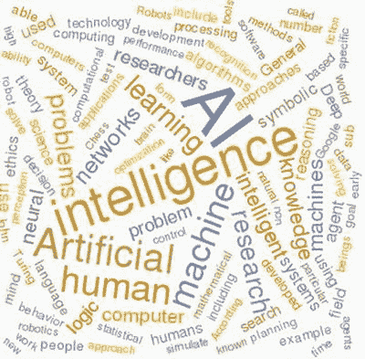

# 1.人工智能导论

本章对人工智能(AI)进行了简单的介绍，这反过来有助于提供一个框架来理解人工智能是什么，以及为什么它是一个如此令人兴奋和快速发展的研究领域。先说一些关于 AI 起源的史实。

## 艾历史渊源

值得注意的是，人工智能或类似的东西已经存在了很长时间。据记载，古希腊哲学家讨论过自动机或具有内在智能的机器。1517 年，布拉格假人建成；如图 [1-1](#Fig1) 所示。

图 1-1。

Prague Golem

假人是由粘土制成的，但根据犹太人的民间传说，它可以被激活，以对反犹太行为的责任方进行各种报复和惩罚。

法国著名哲学家勒内·笛卡尔在 1637 年的《论方法》一书中写道，机器智能是不可能的。笛卡尔并不提倡人工智能，但这篇论文确实表明了他的想法。

一个更奇特的人工智能实验例子——或者更恰当地说，一个骗局——是 18 世纪末至 19 世纪中叶在欧洲流传的一个自动化象棋选手。它被称为土耳其人。现代邮票上的石版画如图 [1-2](#Fig2) 所示。

图 1-2。

Automated chess player

据说这是一台智能机器，可以和人类对手下棋。事实上，有一个人类棋手被塞进了机器的支撑盒里。他操纵机械手移动机器的棋子。我想一定有一个微型潜望镜或窥视孔可以让这个隐藏的棋手有机会监视棋盘。土耳其人这个奇怪的名字来自德语单词 Schachtürke，意思是“自动象棋选手”。藏在盒子里的典型的人类国际象棋大师非常熟练，他经常能赢得著名对手的比赛，包括拿破仑·波拿巴和本杰明·富兰克林。直到许多年后，一台真正的机器才可以真正下一盘合理的棋。

科学人工智能方法的出现一直等到 1943 年，麦卡洛克和皮茨的一篇论文发表后，他们在论文中描述了“感知机”，这是一种基于真实生物脑细胞(称为神经元)的数学模型。在他们的论文中，他们准确地描述了神经元细胞如何以二进制方式放电，类似于电子二进制电路。他们还超越了简单的比较，展示了这些细胞如何随着时间的推移动态地改变它们的功能，本质上创造了基本的行为动作。这篇开创性的论文是一系列论文中的第一篇，这些论文建立了一个与神经网络有关的重要人工智能研究领域。我将在后面的章节中更详细地讨论这个话题。

在 1947 年，艾伦·m·图灵写道:

> In my opinion, the problem of obtaining a large amount of memory in a reasonable short time is much more important than multiplication and other operations at high speed. If the machine is to work fast enough to make it commercially valuable, speed is necessary, but if it is to be able to do more than trivial operations, mass storage is necessary. Therefore, storage capacity is a more basic requirement.

许多读者可能认为图灵是解码德国恩尼格玛机(Enigma machine)的天才，这大大缩短了第二次世界大战的持续时间，他也在这一小段中认识到，任何未来的机器“智能”都将基于有足够的机器内存可用，而不仅仅依赖于计算速度。在本章稍后讨论图灵测试的时候，我会有更多关于图灵的内容。

1951 年，一位名叫马文·明斯基的年轻数学博士候选人和迪安·埃德蒙兹一起，基于麦卡洛克和皮茨论文中描述的感知机设计并建造了一台模拟计算机。这台计算机被命名为随机神经模拟强化计算机(SNARC)。它由 40 个真空管神经元模块组成，这些模块依次控制许多附加的阀门、马达、齿轮、离合器和致动器。这个系统是一个随机连接的 Hebb 突触网络，构成了一个神经网络学习机器。SNARC 可能是第一台人工自学机器。它成功地模拟了老鼠在迷宫中寻找食物的行为。这个系统展示了一些基本的“学习”行为，让老鼠 sim 最终通过迷宫。

人工智能发展的真正转折点发生在 1956 年达特茅斯学院的一次人工智能会议上。这次会议是应明斯基、约翰·麦卡锡和克劳德·香农的要求召开的，旨在探索人工智能的新领域。克劳德·香农经常被称为“信息论之父”，以表彰他在新泽西州霍尔姆德尔著名的贝尔电话实验室完成的杰出工作。

约翰·麦卡锡也不逊色，他是第一个使用短语“[人工智能](https://en.wikipedia.org/wiki/Artificial_intelligence)”的人，也是 [Lisp](https://en.wikipedia.org/wiki/Lisp_(programming_language)) 编程语言家族的创始人。他对 [ALGOL](https://en.wikipedia.org/wiki/ALGOL) 编程语言的设计产生了重大影响。他还对计算机分时概念做出了重大贡献，这使得现代计算机网络成为可能。明斯基和麦卡锡也是麻省理工学院媒体实验室的创始人，该实验室现在被称为麻省理工学院计算机科学和人工智能实验室。

回到 1956 年的会议，麦卡锡陈述了人工智能现在的经典定义，据我所知，这仍然是大多数人在被要求定义人工智能时使用的“黄金标准”:

> It is the science and engineering of manufacturing intelligent machines, especially intelligent computer programs. It is related to similar tasks of using computers to understand human intelligence, but AI need not be limited to biologically observable methods.

麦卡锡在这个定义中使用了“人类智能”这个词，我将在本章的稍后部分进一步探讨。在这次会议上还有许多其他的基本人工智能概念，我不能在本书中进一步解释，但我敦促感兴趣的读者进一步探索。

就人工智能研究而言，20 世纪 60 年代是一个非常进步的十年。可以说，Newell 和 Simon 在详述一般问题求解算法方面的工作非常突出。这种方法使用了计算机和人工解决问题的技术。不幸的是，计算机开发仍在发展，有效处理算法要求的内存和速度能力根本不存在。(还记得我之前讨论的图灵的警告吗。)通用问题求解器项目最终被放弃了——不是因为它在理论上不正确，而是因为实现它所需的硬件根本不可用。

20 世纪 60 年代人工智能的另一个重大贡献是洛夫蒂·扎德引入了模糊集和逻辑，这是令人印象深刻的人工智能分支模糊逻辑的基础。扎德讨论了计算机不一定必须以精确和离散的逻辑模式运行，而是采取更像人类的模糊逻辑方法。我在第 [5](05.html) 章提出了一个有趣的模糊逻辑项目。

20 世纪 60 年代正在进行的研究的一个不幸结果是预测计算机可以模仿人脑。当然，对人脑实际上如何运作进行基础研究的计算能力在那个时候根本不存在。这导致了人工智能社区的失望和幻灭。

模仿或以某种方式复制人脑的工作方式，并将该功能放入机器的过程，被称为经典的人工智能方法。这导致了人工智能社区内部的深刻分歧，许多研究人员认为，机器应该以自己的方式变得智能，而不是模仿人类的智能。后一种方法被称为现代人工智能。

在 20 世纪 60 年代后期，有相当多的工作是关于计算机如何通过使用自然语言而不是计算机代码来与人类交流。约瑟夫·韦森鲍姆在此期间创造了一个聪明的程序，名为伊莱扎。虽然以今天的标准来看它很原始，但它仍然能够欺骗一些用户，让他们认为他们在与另一个人而不是一台机器交谈。ELIZA 项目提出了一个非常有趣的话题，即如何确定一台机器是否达到了某种程度的“智能”。一个很好的答案在于我之前提到的图灵测试。在 1950 年《计算机械和智能杂志》的一篇文章中，艾伦·图灵讨论了他认为机器达到智能状态的充分条件。他基本上认为，如果一台机器可以成功地欺骗一个有知识的人类观察者，让他认为他正在与另一个人而不是一台机器进行对话，那么这台机器就可以被认为是智能的。当然，谈话必须使用中立的通信渠道，以避免声音或外观泄露机器的明显线索。电传打字机是 20 世纪 50 年代用来实现中性信道的通信设备。即使考虑到今天的技术，图灵测试仍然是一个合理的基准。人们甚至可以使用高效的现代语音识别和合成技术来进一步愚弄观察者。图灵测试在哲学家和其他讨论智能本质的利益团体中仍然有争议。

在 20 世纪 70 年代，由于计算技术的缓慢发展，人工智能成熟缓慢。人们对自然语言处理、图像识别和分析很感兴趣，但不幸的是，可供研究人员使用的计算机仍然非常有限，无法完成这些困难的任务。很快就变得很明显，在人工智能真正进步之前，处理能力必须有显著的提高。此外，也有反对人工智能的重要哲学论点，包括约翰·塞尔提出的著名的“中国房间”论点。明斯基反对塞尔的假设，这只会导致正在进行的研究中的许多内讧和误导。与此同时，麦卡锡主张采用现代人工智能方法，指出人类智能和机器智能是不同的，应该以这种方式对待。

20 世纪 80 年代，由于个人计算机的出现和许多研究人员采用麦卡锡的实用方法，人工智能的发展有了相当大的进步。专家系统的出现发生在这一时期，它在商业和工业/制造业中显示了巨大的前景和实际应用。我将在后面的章节中演示几个专家系统的应用。经典的人工智能方法论继续着；然而，现代方法很快被接受，也许更重要的是，被用于许多现实世界的情况。巧合的是，在这个时候，机器人学和真正的机器人开发已经做了很多。人工智能研究自然被吸引到这个领域，因为这些领域似乎完全互补。实用人工智能的时代终于到来，未来的发展来得很快，因为现代计算的时代也在发生。大约就在这个时候，摩尔定律的真正影响开始显现。摩尔定律指的是英特尔的创始人之一戈登·摩尔，他在 1965 年指出:“自发明以来，集成电路上每平方英寸的晶体管数量每年都在翻一番。”

这种密度的指数增长似乎与计算机性能令人难以置信的提高密切相关，这是人工智能改进和发展所迫切需要的。

20 世纪 90 年代达到了重要的里程碑，包括 1997 年 IBM 的深蓝计算机系统击败了国际象棋世界冠军加里·卡斯帕罗夫。尽管这场胜利令人印象深刻，但还是有人给这场比赛泼了冷水。当麦卡锡被问及计算机赢围棋(一种传统的中国棋盘游戏)时，他的以下评论应该可以缓和胜利的严峻现实:中国和日本的围棋也是一种棋盘游戏，玩家轮流走棋。围棋暴露了我们目前对人类玩游戏的智力机制理解的弱点。围棋程序是非常糟糕的玩家，尽管付出了相当大的努力(不如国际象棋)。问题似乎是，围棋中的一个位置必须在心理上分成一系列假设，首先分别分析这些假设，然后分析它们之间的相互作用。人类在国际象棋中也使用这种方法，但是国际象棋程序把位置作为一个整体来考虑。国际象棋程序通过进行成千上万次的计算来弥补这种智能机制的不足，对于“深蓝”来说，这是数百万倍的计算。

这种有先见之明的分析应该会减轻任何读者的恐惧，即计算机更接近于获得许多科幻电影中的人类水平的智力，包括《终结者》系列，2001:太空漫游和经典的战争游戏。在计算系统变得真正智能之前，还有很长的路要走，还有更多的研究要完成。这是下一节的主题。

## 智力

讨论智能的本质总是人工智能课程开始时的一个话题。当学生试图掌握如何定义它是什么和如何识别它时，他们最常使用循环推理。探索智力通常也以创造一个几乎无止境的问题列表而告终，例如:

*   老鼠聪明吗？
*   机器具有智能意味着什么？
*   海豚是海洋中最聪明的哺乳动物吗？
*   外星人如何识别地球上的智慧生物？

人们可以无限期地继续问这样的问题。也许，回想起来，仅仅是创造这样的问题就是智慧的一个可靠标志。你现在可以明白我所说的循环推理是什么意思了。事实证明，就智力的共同定义达成一致是一个困难的、甚至是不可能的行动。有一些关于智力的字典定义，比如下面来自 Meriam-Webster online 的:

1.  a (1):学习或理解或处理新情况或棘手情况的能力:[原因](https://www.merriam-webster.com/dictionary/reason)；还有:理性的熟练运用(2):运用知识来操纵自己的环境或抽象思考的能力，以客观标准来衡量(如测试)，b 基督教科学:神圣心灵的基本永恒品质，c:精神敏锐:[精明](https://www.merriam-webster.com/dictionary/shrewdness)
2.  答:一个[智能](https://www.merriam-webster.com/dictionary/intelligent)实体；特别是:[天使](https://www.merriam-webster.com/dictionary/angel)，b:智慧心灵或头脑<宇宙智慧>
3.  理解的行为:[理解](https://www.merriam-webster.com/dictionary/comprehension)
4.  a: [信息](https://www.merriam-webster.com/dictionary/information)、[新闻](https://www.merriam-webster.com/dictionary/news) b:关于敌人或可能的敌人或地区的信息；也指:从事获取此类信息的机构
5.  执行计算机功能的能力

正如你很容易看到的，字典的编辑们在试图捕捉智力的定义方面有很大的不同，包括人类行为，精神方面，宗教，最后，有点有趣的是，执行计算机功能的第五级定义。

在线麦克米伦词典提供了一个更简洁的定义:

> The ability to understand and the ability to think [things](http://www.macmillandictionary.com/us/dictionary/american/thing) , and the ability to acquire and use [knowledge](http://www.macmillandictionary.com/us/dictionary/american/knowledge)

我敢肯定，如果我去其他在线词典，我会看到许多其他的定义，这就是为什么试图确定智力是如此之难。因此，对于什么是智慧没有一个公认的标准，当智慧以一致和一致的方式发生时，几乎不可能识别它。

智力也与感觉输入和运动或驱动输出有关。显然，我们的大脑包含在我们的身体中，身体也很好地配备了五种感觉系统——视觉、听觉、味觉、触觉和嗅觉。这些感觉系统是我们智力不可或缺的一部分；然而，已经反复证明，仍然有非常聪明的人失去了一种或多种感官输入。当一个特定的感觉系统受到伤害或破坏时，人体的补偿能力是相当惊人的。同样，人类的智力在某种程度上也与我们的运动技能有关；然而，我认为不如感官输入多。丧失说话能力并没有削弱史蒂芬·霍金的智力和天赋。拥有行走、奔跑、驾驶汽车或驾驶飞机的能力让个人有机会探索和了解他们的环境，从而扩展他们的知识和经验，但不一定会提高或扩展他们的智力——除非你同意知识和智力是同义词的观点。

研究动物并考虑它们是否拥有智力只是一个小小的飞跃。鸟类会飞，通常比人类有更好的视力。这是否意味着他们拥有超越人类的智力，至少在这两个方面？答案显然是不可知的，这导致了以下合理的结论:动物和机器智能应该被简单地接受，而不是与人类智能相比较。试图进行后一种比较简直就像比较苹果和橘子一样；这真的毫无意义。

我在前面的讨论中的目标是重申人工智能的现代方法的前提，即机器智能应该被单独考虑，而不是与人类智能相比较。这是本书的潜在前提，项目探索机器的优势，但既不期望也不希望模仿或模拟人类智能。

## 强人工智能对弱人工智能，宽人工智能对窄人工智能

正如您可能已经从本节的标题中推断出的那样，还有一些常用于 AI 的描述符。试图最大程度地模拟人类推理的人工智能工作和研究有时被称为强人工智能。我认为经典人工智能方法的支持者也不会赞同这个术语。这个强有力的形容词与弱人工智能形容词形成鲜明对比，弱人工智能形容词只涉及让实际的人工智能系统有效地运行，而不考虑人类的模拟。这种方法就是我所说的现代方法。我不知道这些强弱术语是如何产生的，但我怀疑它们的存在是为了给现代方法投下特权阴影，这是不幸的，因为这两种方法同样有效，值得同等重视和承认。我介绍这些术语只是为了让你在阅读人工智能应用或项目时理解它们的意义。我没有使用任何一个术语；相反，我只是专注于人工智能应用——不管它们是强是弱。

我在章节标题中使用的另一对术语是广义人工智能和狭义人工智能。广义人工智能与一般推理有关，与特定任务或应用无关。我认为广义人工智能和强人工智能会有一种天然的联系，因为两者都与人类推理和思考的环境有关。狭义的人工智能侧重于应用于特定任务的人工智能，而不是过于一般化。然而，也有例外，这往往很容易打破广义和狭义的人工智能定义。谷歌开发了一些系统，这些系统在预测或描述“事物”应该如何被描述或安排方面表现出色。谷歌应用展示了广义和狭义的人工智能方面，以及具体的编目功能。同样，亚马逊也有智能代理，他们在归纳总结和为客户提供具体建议方面表现出色。

我用图 [1-3](#Fig3) 来结束这一部分，这是我用 Mathematica 在 Raspberry Pi 3 上运行创建的单词云。这个图是人工智能常用的许多不同单词的简单图形表示。维基百科是图中所有单词的来源。

图 1-3。

A word cloud on artificial intelligence

## 论证

我在之前的讨论中反复使用了理智和推理这两个词。但它们真正的含义是什么，它们与人工智能有什么关系？推理描述创造或考虑一个理由。“理性”这个词的意思是思考事物或想法如何与已知的东西——或者更简单地说，知识——相关联。几个推理例子有助于阐明我试图传达的思想。

*   学习是在检查或讨论现有知识集的基础上建立新知识集的过程。本文中的集合是任何数据集合，无论是否基于现实。
*   语言的使用是将文字，无论是书面的还是口头的，转化为思想和支持关系。
*   基于逻辑的推理意味着根据逻辑关系决定某事是否为真。
*   基于证据的推理意味着基于所有支持性的可用证据来决定某事是否为真。
*   自然语言生成的存在是为了满足使用给定语言的通信目的和目标。
*   解决问题是决定如何实现既定目标或目的的过程。

这些活动中的任何一项都必须包含推理，以达到令人满意的最终结果。请注意，在列表中，我没有将推理局限于人类。这些活动中的一些肯定适合由机器来执行，在某些情况下，甚至由动物来执行。已经有无数的实验令人满意地证明了动物能够解决问题，尤其是当它涉及到获取食物的时候。

最近声控互联网设备激增，包括亚马逊的 Alexa、微软的 Cortana、苹果的 Siri 和谷歌的 Home。这些或是独立的设备，或是安装在智能手机上的应用程序。在任何情况下，它们都能够很好地识别语音查询，将查询翻译成可操作的互联网查询，并最终以高度可理解的格式将结果传达给用户，通常是说得很好的女声。这些设备/应用程序必须使用某种程度的推理来执行它们的预期功能，即使它们不理解用户的请求。

## 人工智能类别

表 [1-1](#Tab1) 是我创建的一个列表，显示了构成现代人工智能的大多数类别。我不认为它是全面的。可能有一些类别被无意中遗漏了。我确实明显省略了一些类别，比如人工智能的历史和哲学，因为它们与这个表格的意图没有直接关系。

表 1-1。

Modern AI Categories

<colgroup><col> <col></colgroup> 
| 种类 | 简要描述 |
| --- | --- |
| 情感计算 | 研究和开发能够识别、解释、处理和模拟人类[影响](https://en.wikipedia.org/wiki/Affect_(psychology))的系统和设备。 |
| 人工免疫系统 | 智能的、[基于规则的机器学习](https://en.wikipedia.org/wiki/Rule-based_machine_learning)系统主要基于脊椎动物[免疫系统](https://en.wikipedia.org/wiki/Immune_system)中包含的固有原则和过程 |
| 话匣子 | 一种对话代理或计算机程序，设计用于通过文本或音频通道模拟与一个或多个人类用户的智能对话。 |
| 认知建筑 | 关于人类大脑结构的理论。主要目标之一是将认知心理学的概念整合到一个全面的计算机模型中。 |
| 计算机视觉 | 一个[跨学科的领域](https://en.wikipedia.org/wiki/Interdisciplinarity)，处理计算机如何从[数字图像](https://en.wikipedia.org/wiki/Digital_image)或[视频](https://en.wikipedia.org/wiki/Video)中获得高级理解。 |
| 进化计算 | 使用基于达尔文原则的进化算法，该名称由此而来。这些算法属于[试错](https://en.wikipedia.org/wiki/Trial_and_error)问题解决者家族，使用元启发式或随机全局方法来确定许多解决方案。 |
| 游戏人工智能 | 人工智能在游戏中用来产生智能行为，主要是在非玩家角色(NPC)中的 T2，通常是 T4 模拟类似人类的智能。 |
| 人机界面 | 人机交互研究计算机技术的设计和使用，重点是人([用户](https://en.wikipedia.org/wiki/User_(computing)))和计算机之间的接口。 |
| 智能软助理或智能个人助理(IPA) | 可以为个人执行任务或服务的[软件代理](https://en.wikipedia.org/wiki/Software_agent)。这些任务或服务通常基于用户输入、位置感知和从各种在线来源访问信息的能力。这种代理的例子有[苹果](https://en.wikipedia.org/wiki/Apple_Inc)的 Siri、[亚马逊的 Alexa](https://en.wikipedia.org/wiki/Amazon_Alexa) 、[亚马逊](https://en.wikipedia.org/wiki/Amazon.com)的 [Evi](https://en.wikipedia.org/wiki/Evi_(software)) 、谷歌的 Home、[微软](https://en.wikipedia.org/wiki/Microsoft)的 [Cortana](https://en.wikipedia.org/wiki/Cortana_(intelligent_personal_assistant)) 、[开源](https://en.wikipedia.org/wiki/Open_source) [Lucida](https://en.wikipedia.org/wiki/Lucida_(Intelligent_Assistant)) 、[Braina](https://en.wikipedia.org/wiki/Braina)(brain asoft 为[微软 Windows](https://en.wikipedia.org/wiki/Microsoft_Windows) 开发的应用程序) |
| 知识工程 | 指构建、维护和使用[基于知识的系统](https://en.wikipedia.org/wiki/Knowledge-based_systems)所涉及的所有技术、科学和社会方面。 |
| 知识表示 | 致力于以计算机系统可以用来解决复杂任务的形式来表示关于世界的信息，例如诊断医疗状况或用自然语言进行对话。 |
| 逻辑编程 | 一种主要基于[形式逻辑](https://en.wikipedia.org/wiki/Formal_logic)的编程。任何用逻辑[编程语言](https://en.wikipedia.org/wiki/Programming_language)编写的程序都是一组逻辑形式的句子，表达关于某个问题领域的事实和规则。主要的逻辑编程语言家族包括 [Prolog](https://en.wikipedia.org/wiki/Prolog) 、[answer set programming](https://en.wikipedia.org/wiki/Answer_set_programming)(ASP)、以及 [Datalog](https://en.wikipedia.org/wiki/Datalog) 。 |
| 机器学习 | 人工智能环境中的 ML 为计算机提供了无需显式编程就能学习的能力。浅层和深度学习是两个主要的子领域。 |
| 多智能体系统 | M.A.S .是一个计算机化的系统，由一个环境中多个相互作用的[智能代理](https://en.wikipedia.org/wiki/Intelligent_agent)组成。 |
| 机器人学 | 机器人学是[工程学](https://en.wikipedia.org/wiki/List_of_engineering_branches)和[科学](https://en.wikipedia.org/wiki/Branches_of_science)的交叉学科[y](https://en.wikipedia.org/wiki/Interdisciplinarity)分支，包括[机械工程学](https://en.wikipedia.org/wiki/Mechanical_engineering)、[电气工程学](https://en.wikipedia.org/wiki/Electrical_engineering)、[计算机科学](https://en.wikipedia.org/wiki/Computer_science)、人工智能等。 |
| 机器人 | 机器人是一种机器，尤其是可由计算机编程的机器，能够自主地执行一系列复杂的动作。 |
| 规则引擎或系统 | 基于规则的系统用于存储和操作知识，以有用的方式解释信息。 |
| 图灵测试 | 图灵测试是由艾伦·图灵于 1950 年开发的一项测试，测试机器的能力,[表现出等同于或无法区分于人的智能行为。](https://en.wikipedia.org/wiki/Artificial_intelligence) |

我要重复一遍，这个表格没有涵盖所有现代人工智能研究和活动，但它肯定突出了大多数重要的研究和活动。我在本书中只展示了几个列出的人工智能类别，但即使是这些也应该为如何使用相对简单的计算机资源实现人工智能提供合理的见解。

在这一点上，我认为讨论人工智能是合适的，因为它对现代社会的影响远远超出了本书的范围。我提供这个简短的讨论，希望提高我的读者对人工智能如何在我们的日常生活中影响我们每个人的知识和理解。

## 人工智能和大数据

大多数读者都听说过大数据这个术语，但像大多数人一样，您可能不了解它是什么以及它如何影响我们的现代社会。大数据有很多定义，就像 AI 有很多定义一样。我喜欢的定义很简单:一个以巨大的容量、快速的速度和巨大的多样性为特征的数据集合。

海量数据的数量级通常以 PB 为单位，1 PB 等于 100 万 GB。这确实是一个巨大的数据量。定义中提到的快速是指数据生成或创建的速度有多快。人们只需看看脸书，就能体会到数亿在线用户不断创造新内容的速度。最后，定义中的“多样性”一词指的是构成庞大数据流的各种数据类型。这包括图片、视频、音频以及普通的旧文本。上传到脸书的普通照片可能需要 4 到 5 兆的存储空间。再乘以不断上传的数百万张照片，你很快就会意识到大数据的本质。那么 AI 是如何影响大数据的呢？答案是，当应用于大数据集时，人工智能学习系统允许用户从庞大而嘈杂的输入中提取有用的信息。能够处理大数据的典型计算机系统由数千个处理器组成，这些处理器以并行方式一起工作，以大大加快数据简化过程，通常称为 MapReduce。IBM 的沃森计算机是这种系统的一个典型例子。它通过使用基于规则的引擎和处理成千上万(如果不是数百万的话)的医疗记录来实现专家医疗系统。最终的结果是一个计算机系统，帮助医生诊断疾病和相关的不适，这些疾病没有明显的或与已知疾病相关的症状。

亚马逊的网站集成了一个令人印象深刻的人工智能系统，该系统可以轻松编译每个重复访问其网站的潜在或实际客户的详细资料。它将该客户的搜索与搜索或查询过类似产品的其他客户的搜索进行匹配。它还试图根据网站访问者过去的搜索和订单来预测他们对什么感兴趣。亚马逊系统使用的所有数据都是交易性的，基本上是识别客户潜在感兴趣的内容。这些交易数据可能被称为大数据，是亚马逊人工智能计算机系统的主要输入。输出是我提到的概要，但是它也可以被认为是附加到潜在或实际客户的一组特征；例如，产生网站建议的可能如下所示:

“你可能会对罗伯特·海因莱茵的书《月亮是个苛刻的女主人》感兴趣，因为你已经购买了以下书籍:”

*   满月
*   星球大战:帝国反击战
*   肖申克的救赎

这份看似不相关的书籍清单可能表明，客户对月球、外太空冲突或监狱中的不公正感兴趣，所有这些在海因莱茵的书中都有所涉及。(顺便提一下，海因莱茵的书获得了 1967 年雨果奖最佳科幻小说奖。)在顾客过去购买的书籍和海因莱茵的书籍内容之间建立这种模糊的联系需要大量的计算机分析工作，以及访问巨大的数据库。

大数据分析的最大全球用户是执行全球反恐战争(GWOT)的美国政府。美国国家安全局(NSA)处于侦测本土可能遭受的恐怖袭击的最前沿。其年度机密预算估计超过 150 亿美元，其中绝大部分用于收集和分析各种大数据，以对抗 GWOT。它收集什么以及它如何进行大数据分析是超机密的，但假设所有适当的人工智能技术都被 NSA 专家使用是非常合理的，我希望他们中的许多人也是进行秘密人工智能研究的专家。这不是我的阴谋论，而仅仅是任何一个合理的外行人应该期待的。

这一节总结了我对人工智能的介绍，虽然有些简短，但希望包含足够的信息，为您提供一个合理的背景，开始学习特定的人工智能概念。这从下一章开始。

## 摘要

我以人工智能从古代到现代的历史概述开始了这一章。这表明人类很久以前就想让机器来完成智能动作。只是在最近，计算机才被开发出具有执行智能动作的能力

对人工智能开发的传统方法和现代方法之间的差异进行了简短的讨论。简而言之，经典方法试图让计算机模仿或模拟人脑，而现代方法只是利用计算机固有的速度和处理能力来实现人工智能。我还定义了额外的术语，比如广义人工智能和狭义人工智能，以及强人工智能和弱人工智能。

对智能本质的简要考察是为了激起你的好奇心，并思考你如何识别智能是否存在于机器或动物中。接下来是一个关于推理的简短部分，其中包括一些例子来帮助识别在人工智能应用中使用的推理。

接下来，我提出了一个人工智能类别的列表，以帮助解释重要的和当前的人工智能 R&D 的努力。只有少数人工智能类别可以在本书中演示。

本章最后讨论了人工智能如何影响现代社会，特别是在处理大数据时。