# 二、基本人工智能概念

在这一章中，我将介绍和探索对人工智能至关重要的基本概念。

仔细研究这些概念以获得对人工智能如何在最基本的水平上发挥作用的欣赏和理解是非常重要的。如果不先做这项初步研究，确实很难进行更高级的人工智能项目。我只涉及理解本书中的项目所必需的概念。让我们从一些基本的概念讨论开始。

## 布尔代数

布尔代数是由乔治·布尔在 1847 年创立的。它是一个[代数](https://en.wikipedia.org/wiki/Abstract_algebra)，其中变量值是[真值](https://en.wikipedia.org/wiki/Truth_value)——真和假，通常分别表示为 1 和 0。有几个非常基本的布尔运算，在 AI 表达式中经常用到。变量 A 和 B 的这些操作如下所示:

*   a 和 B
*   a 还是 B
*   否定 A
*   否定 B

表达式 A 和 B 也可以用 A * B 来表示，其中*符号表示“与”运算。它不是普通代数中使用的一般乘法符号的真实模拟，但它足够接近，大多数人可以互换使用。类似地，表达式 A 或 B 可以用 A + B 来表示，同样的观察结果也适用于正则代数中使用的正规+符号。你很快就会看到，在布尔代数中有 1 + 1 = 1 的情况，但在非布尔代数中显然不成立。求反或求补运算是一元的，这意味着它只使用一个操作数或变量；而 AND 和 OR 是二进制的，需要两个逻辑变量。求反操作有一个正式符号( )，但它在程序中并不广泛使用。取而代之的是，在大多数逻辑表达式中，放置在符号上的横条是常用的，这也是我所使用的。

表 [2-1](#Tab1) 显示了我刚才提到的各种 A 和 B 输入的输出。注意，我使用变量 C 来表示输出。

表 2-1。

Basic Boolean Operations

<colgroup><col> <col> <col> <col></colgroup> 
| 操作 | 输入变量 | 输出变量 |
| --- | --- | --- |
|   | A | B | C |
| A * B | Zero | Zero | Zero |
| A * B | one | Zero | Zero |
| A * B | Zero | one | Zero |
| A * B | one | one | one |
| A + B | Zero | Zero | Zero |
| A + B | one | Zero | one |
| A + B | Zero | one | one |
| A + B | one | one | one |
| Ā | Zero | - | one |
| Ā | one | - | Zero |

逻辑符号可以很容易地排列成简单和复杂的布尔代数表达式。例如，与运算可以表示为:

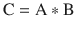

不难认识到，通过使用两个以上的变量并使用这些基本操作进行组合，可以创建复杂得多的表达式。然而，需要理解的重要一点是，最终所有表达式都解析为真或假、1 或 0 输出。

布尔代数中还使用了三种辅助运算:

*   异或
*   实质蕴涵
*   相等

我在推论讨论中使用了这三种运算中的两种(实质蕴涵和等价)，但是我没有用它们的布尔代数名称具体地指出它们。在人工智能中，在整个人工智能技术的不同子领域之间有很多重叠；因此，使用出现在一个子领域中的概念并不罕见，该概念使用的特定名称也存在于另一个具有不同名称或参考的子领域中。只要您掌握了基本概念，这种差异就不会困扰您。

### 一些附加的布尔定律

理解一些更基本的布尔代数法则也很重要，因为它们在不同的时候被用来组合在许多章节中使用的逻辑表达式。这里对它们进行了简要描述。

这是德·摩根定律的一个例子:

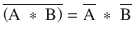

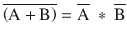

这是一个结合性的例子:


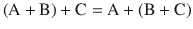

这是一个交换性的例子:

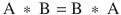

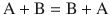

这是一个分布性的例子:

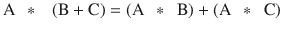

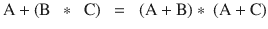

## 推理

推理是第 [1](01.html) 章介绍的推理过程的一部分。这个推理过程包括从最初的前提或事实陈述到逻辑结论。推理通常分为三类。

*   演绎:利用逻辑法则和规则，在已知或假定为真的前提基础上，推导出一个逻辑结论。
*   归纳法:根据特定的前提得出普遍的结论。
*   溯因推理:将前提还原为最佳解释。

我在下面的讨论中使用推理演绎类别，因为它最适合专家系统的主题，稍后将介绍这个主题。

有一个拉丁短语，modus ponens，意思是“通过肯定来肯定的方式。”它代表了演绎推理的基本规则。使用逻辑术语，这个规则可以表述为“P [隐含着](https://en.wikipedia.org/wiki/Material_conditional) Q，并且 P 被断言为真，因此 Q 必然为真。”这个规则可以追溯到古代，并且一直被逻辑学家使用，一直到现代。这条规则可以分为两部分。第一种是有条件的主张，传统上以 if … then 的形式陈述。第二部分是附条件债权的结果；即 then 之后的逻辑语句。一般规则的条件主张由两个前提组成:P 暗示 Q，P 为真。p 也被认为是条件句的先行词。随之而来的显然是 Q 为真。人工智能中这个简单的假设规则的应用被称为前向链接，这是专家系统中的一个关键要素。我将在下一节讨论它。

## 专家系统

专家系统是一种计算机程序，它被设计成使用特定问题领域中存在的事实。然后，它对这些事实得出结论，就像人类专家对相同的事实进行推理并得出相似的结论一样。这样的程序或专家系统将需要访问该领域中的所有事实，以及用一组人类专家将遵循的关于那些事实并从相同事实得出结论的规则来编程。有时这个专家系统被称为基于规则或基于知识的系统。

第一个能够在人类专家水平上运行的大规模专家系统被命名为 MYCIN。它被用作医生诊断血源性感染的智能助手。MYCIN 合并了大约 450 条规则。它能够做出与没有经验的医生相当的正确诊断。MYCIN 中使用的规则集是基于对该领域大量专家的采访而创建的，这些专家又依赖于他们自己的经验和知识。在很大程度上，这些规则捕捉了超出医学教科书和标准程序的真实世界的数据和知识。MYCIN 中使用的规则与我之前介绍的格式相同:

```py
if (conditional claim) then (consequent)

```

下面是一个例子:

```py
if (bacteria in blood) then (septicemia)

```

顺便说一下，败血症是一种非常严重的血液传播疾病，必须立即治疗。

通过使用布尔代数一节中介绍的逻辑运算符将条件声明与其他条件组合起来，我现在将它简化为单词 condition，这可能会很复杂。我也将使用结论这个词，而不是结果，因为它在专家系统设计中更常用。

以下是复杂规则的一些通用格式:

*   if(条件 1 和条件 2) then(结论)
*   if(条件 1 或条件 2) then(结论)
*   if((条件 1 或条件 2)和条件 3) then(结论)

不难想象，基于问题域和该域中存在的所有变量或条件，所创建的 MYCIN 规则相当复杂。为霉素开发的工具和技术后来被用于其他专家系统。

会不会有这样一种情况，给定相同的事实或条件，却可以得出不同的结论？答案肯定是肯定的，这就是解决冲突的方法。

### 冲突解决

当使用给定条件应用规则时，会产生冲突，并且会创建几个不同的结论，但只需要一个结论。这场冲突必须以某种方式解决。可以通过几种方式提供冲突解决答案，如下表所述。

*   最高规则优先级:专家系统中的每条规则都被赋予一个优先级或编号。由最高优先级规则得出的结论是所选择的结论。在这些情况下，还必须有某种平局决胜程序。
*   最高条件优先级:专家系统中的每个条件都被赋予一个优先级或编号。由包含最高优先级条件的规则得出的结论是所选择的结论。在这些情况下，还必须有某种平局决胜程序。
*   最具体的优先级:由使用最多条件的规则创建的结论是选中的结论。
*   最近优先级:由创建的规则创建的最近结论是选定的结论。
*   特定于上下文的优先级:专家系统规则被分成组，在任何给定的时间，只有一到几个规则是活动的或被使用的。必须从一个活动规则组中生成选定的结论。

决定采用哪种冲突解决方法实际上取决于专家系统的性质。这很可能需要应用不同的方法，并评估哪种方法执行得最好。当然，总是有默认的决定，不使用任何冲突解决方案，而只是将所有结论呈现给人类用户，让他们来决定。

规则也可以以分层的方式组合，以创建反映人类专家在给定的一组条件下如何工作的“合理的”方法。以下示例应该有助于阐明规则组合的工作原理。我选择使用一个在国家橄榄球联盟(NFL)打球的幻影四分卫(QB)作为我的虚拟专家。假设情况是 QB 的队伍处于第三次落后，第一次落后还有 7 码。这是一个合理的结论，专家 QB 会选择传球来获得所需的码数，因为在第三次进攻中获得 7 码的成功概率很低，至少在 NFL 中是这样。

QB 的下一个关注点是防守的设置，因为它实质上影响了传球类型的选择。如果 QB 发现防守可能会闪电战，传球类型也可能会改变，这意味着他们会派出一两个额外的传球手来阻止 QB。闪电战几乎总是将防守置于一对一或人盯人的覆盖范围内，增加了传球成功率。真正的闪电战通常会让四分卫尝试长距离传球。当闪击被显示但没有被执行时，QB 经常尝试更短的掩护传球，这通常会导致短码数的增加。

我刚才描述的场景可以分为计划和行动阶段。当团队的阵容相互对抗时，规划阶段就开始了。当进攻方的中锋将球踢向 QB 时，动作阶段开始。当生成分层规则结构时，这两个阶段转化为层。下面是这个足球场景的一组合理的等级规则。

以下是第 1 层规则:

```py
if (third down and long yardage to gain) then (pass play planned)

if (blitz suspected) then (long yardage pass planned)

```

这些是第 2 层规则:

```py
if (blitz happens) then (execute long yardage pass play)

if (blitz does not happen) then (execute screen pass play)

```

这些规则显然被简化了，因为在现实中，四分卫有其他选择，这取决于他自己的运动能力——比如抓住足球，试图靠自己跑第一次。第 1 层中显示的规则是相互独立的，而第 2 层中显示的规则是完全依赖的，这意味着其中一个将被执行或“触发”，但不会两个都执行。最后，规则集是动态的，因为直到触发任何规则之前，条件才被确定。这与大多数常规专家系统截然不同，在常规专家系统中，条件是固定的，并且在应用于规则集之前完全可用。

### 反向链接

触发规则以生成结论的过程是正向链接，这些结论随后被用作后续规则中的条件。正向链接是专家系统的正常工作方式。然而，有时从结论开始并试图推断出产生终点结论所需的条件是非常有用和重要的。这个过程被称为反向链接，通常用于验证系统是否按预期工作，并确保永远不会得出不正确或“错误”的结论。这种验证在安全关键系统中采用的专家系统中尤其重要，例如在陆地、海洋或空中交通工具中使用的控制系统。

反向链接还可以用于确定是否需要开发更多的规则，以防止通过使用一组特定的输入条件得出未经考虑的或奇怪的结论。

在这一点上，你应该有足够的背景信息来使用 Raspberry Pi 处理一个开始的 AI 项目。这个项目需要在 Raspberry Pi 上安装 SWI Prolog 语言，然后用它从一个小知识库中进行查询。但是首先，关于 Raspberry Pi 配置的几句话曾经与 Prolog 一起工作。

## 树莓 Pi 配置

我使用一个 headless 或 SSH 连接连接到一个运行在独立设置中的 Raspberry Pi。我的客户端电脑是 MacBook Pro，我用它来完成我所有的手稿制作。它还允许我轻松地捕捉控制 Raspberry Pi 的终端窗口的截图。我发现这种连接方式非常有效；它允许我完全访问树莓派和我的 Mac 上的所有文件。终端窗口中显示的所有内容都可以在直接连接到 Raspberry Pi 的显示器上复制，如果这是您选择运行自己系统的方式的话。当然，Raspberry Pi 上的文件操作必须通过命令行来完成，而不是像 Mac 那样通过拖放/点击来完成。

## SWI·普洛斯简介

人工智能语言 Prolog 最初是由苏格兰、法国和加拿大的研究人员在 20 世纪 60 年代到 70 年代初共同创建的。考虑到现代计算机语言产生的速度，它已经存在很长时间了。最初，这个项目的目的是从通过自动化手段提取的法语文本中进行推理。这项工作涉及自然语言处理、计算机算法的开发和逻辑分析。Prolog 这个名字来源于三个法语单词的组合:PROgrammation en LOGique。

Prolog 被认为是一种声明式编程语言，因为它使用一组称为知识库的事实和规则。Prolog 用户可以向知识库提出疑问或问题，我们称之为目标。Prolog 使用逻辑推理对目标做出回答，如推理部分所述。通常，答案只是简单的对或错，但也可能是数字，甚至是文字，这取决于目标是如何表达的。

Prolog 也被认为是一种符号语言，与硬件或具体实现完全没有任何联系。由于 Prolog 的抽象程度，它经常被计算机知识很少的人使用。大多数用户不需要任何计算机编程经验就能有效地使用 Prolog——至少在最基本的水平上，您很快就会体验到。

从一开始，Prolog 就被人工智能社区认为是一个通过人工智能使用符号所能实现的光辉典范。语言本质上是推理和逻辑过程，具有思维和智能的概念。虽然 Prolog 从一开始就相当简单，但随着研究人员向该语言添加额外的特性和功能，它已经变得越来越复杂。依我拙见，这对语言的推广有利也有弊。曾经对非人工智能用户来说非常简单和有吸引力，现在对人工智能初学者来说变得非常复杂和令人生畏。然而，不要害怕:在下面的 Prolog 演示中，我保持事情非常简单。但是，请注意，对于 Prolog 的能力，您只是看到了“冰山”的一角。

运行 Prolog 所需的计算能力与 20 世纪 70 年代相比发生了巨大的变化，当时需要相当于超级计算机的计算机，而今天，35 美元的单板计算机可以更容易、更快地处理 Prolog 查询。

## 在 Raspberry Pi 上安装 Prolog

以下指令使您能够在 Raspberry Pi 上安装一个非常强大和有用的 Prolog 版本，名为 SWI Prolog。SWI 是社会科学信息学的首字母缩写，用荷兰语表示。SWI·普洛斯的网站在 [`www.swi-prolog.org`](http://www.swi-prolog.org) 。我强烈建议你看看这个网站，因为它包含了很多有用的教程和其他关键数据。

要开始安装 SWI Prolog，首先需要更新您的 Raspian 发行版。我假设大多数读者都在使用最新的发行版，名为 Jessie，在撰写本书时可以从 Raspberry Pi 基金会获得。

您需要执行的第一个命令是更新 Rasperry Pi Linux 发行版的命令:

```py
sudo apt-get Update

```

更新应该只需要几分钟就能完成。之后，您就可以安装 SWI Prolog 了。输入以下内容:

```py
sudo apt-get install swi-prolog

```

这个命令安装 SWI Prolog 语言以及它在 Raspberry Pi 上运行所需的所有依赖项。此安装需要几分钟或更长时间，这取决于您使用的 Raspberry Pi 型号。

要测试安装是否成功，只需输入以下内容:

```py
swipl

```

您应该会在监视器上看到以下文本:

```py
pi@raspberrypi:∼ $ swipl
Welcome to SWI-Prolog (Multi-threaded, 32 bits, Version 6.6.6)
Copyright (c) 1990-2013 University of Amsterdam, VU Amsterdam
SWI-Prolog comes with ABSOLUTELY NO WARRANTY. This is free software,
and you are welcome to redistribute it under certain conditions.
Please visit http://www.swi-prolog.org for details.

For help, use ?- help(Topic). or ?- apropos(Word).

?-

```

提示是`?-`，表示 Prolog 正在等待您的输入。假设您看到了这个开始屏幕，那么您就可以开始使用 Prolog 了，这是下一节的主题。

## 初始 Prolog 演示

正如我所说的，您需要一个知识库来查询 Prolog。我使用的知识库直接来自 SWI Prolog 的教程，该教程位于他们的网站上。这个知识库涉及太阳、行星和月球。知识库只是一个文本文件，应该放在 Raspberry Pi 的主目录中。我使用默认的 nano 编辑器创建了这个文本文件。我强烈推荐你也用 nano 然而，如果您愿意，您当然可以使用其他文本编辑器。除非确保文本文件中排除了所有隐藏格式，否则不应使用 Microsoft Word 或类似的功能强大的 Word 编辑器。任何隐藏的格式都会导致 Prolog 程序生成错误，因此您将无法使用该知识库。

以下是知识库列表，命名为`satellites.pl`，位于`pi`目录中。

```py
%% a simple Prolog knowledge base

%% facts
orbits(earth, sun).
orbits(saturn, sun).
orbits(titan, saturn).

%% rules
satellite(X) :- orbits(X, _).
planet(X) :- orbits(X, sun).
moon(X) :- orbits(X, Y), planet(Y).

```

关于这个知识库，您应该知道一些事情。注释是从这些符号开始的:`%%`。评论是给人类读者的；它们被 Prolog 解释器忽略。文件中的箱数(指`x`和`X`)不是同一个符号。事实和规则总是以句号`'.'`终止。

您必须使用`consult`命令来强制 Prolog 使用知识库。在这种情况下，该命令使用不带扩展名`.pl`的知识库名称作为命令参数:

```py
?- consult(satellites).

```

这是`consult`命令的简写版本:

```py
?- [satellites].

```

一旦知识库就位，您现在就可以开始进行查询或设定目标。以下是一个简单的查询，询问地球是否是太阳的卫星:

```py
?- satellite(earth).

```

Prolog 响应为真，因为知识库中的一个事实是地球绕太阳运行，一个规则是卫星被定义为任何绕太阳运行的符号。当然，这个规则使用的符号是文本“`earth`”。图 [2-1](#Fig1) 显示了涉及卫星、行星和卫星的五个查询。

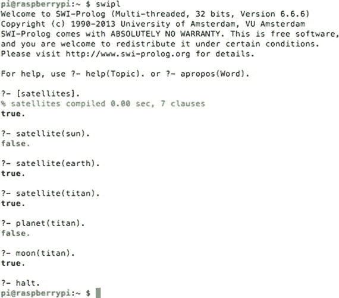

图 2-1。

Prolog knowledge base queries

从技术上来说，卫星也绕着太阳转，因为它们的行星绕着太阳转，但这很快就会变得令人困惑，所以留给读者去思考。还要注意 a `halt`。命令是图 [2-1](#Fig1) 中显示的最后一个交互式序言条目。此命令会导致 Prolog 停止，并将控制权返回到默认的操作系统(OS)提示符。

显而易见，许多额外的事实可以添加到知识库中，以包含更多的太阳系。除了确定行星、卫星和月球状态之外，还可以轻松添加其他规则来涵盖其他行为。这种灵活性是 Prolog 处理更复杂、更全面的知识库的固有能力之一。

显然，通过它的知识库，Prolog 是实现专家系统的一种自然方式。一个这样的系统在专门讨论专家系统的一章中被彻底地检查。现在是时候转移焦点来讨论模糊逻辑与人工智能的关系了。

## 模糊逻辑导论

我以一个明显的观点开始这一部分，即模糊逻辑(FL)背后的理论没有任何模糊或不精确之处，之所以这样命名是因为它远远超出了传统逻辑中的一个核心概念，即一个陈述要么为真要么为假(也称为二元决策)。在外语中，一个陈述可能部分正确或错误。一个陈述也可能附带着概率，比如这个陈述有 60%的可能性是正确的。从某种意义上来说，人类不仅做出二元决策，而且还根据等级来决定事物，因此 FL 反映了现实。当你调节淋浴的温度时，它不仅仅是热或冷，更可能是暖和或稍微凉爽。开车时，你可能会将车速调整到标称交通流量，这很容易略高于张贴的限制；你不只是超速或被拦下。这些基于数量或等级的决定就在我们身边。FL 有助于捕捉人工智能中的这种决策。下面的例子应该能更清楚地说明什么是 FL 以及它是如何工作的。

### FL 示例

让我们回到淋浴的例子来说明 FL 是如何工作的。我将从水温的一些极端范围开始:最低温度是 50 华氏度，最高温度是 150 华氏度。总温度范围是一个方便的 100 华氏度，我这样安排是为了简化计算。当然，这两种极端情况对于普通淋浴来说都是不可接受的。现在让我们取这个范围的一个百分比，看看会发生什么。假设淋浴温度设置在范围的 40%。这将使实际淋浴温度达到舒适的 90 华氏度，在大多数人的舒适范围之内。这种将百分比与实际温度相关联的简单方法是一个称为模糊化的过程的开始，其中真实世界的条件与 FL 值相关联，或者在这种情况下，温度与百分比相关联。以下一组条件适用于淋浴温度示例的模糊化:

*   50 华氏度变为 0%，60 华氏度变为 10%，依此类推，直到 150 华氏度变为 100%
*   在极端情况下，每 1 F 的差异精确到 1%

建立一个简单的百分比与温度的关系方程也很容易:

*   百分比=(T–50 ),其中 T 是 F，在 50 到 150 的范围内。

一旦真实世界的值被模糊化，它就可以被传递给一组规则进行评估。这些规则和我在专家系统讨论中描述的完全一样，只是强化了 AI 内部各种技术的整合。这些 FL 模型有时被称为模糊推理系统。

然而，if(条件)then(结论)的一般形式必须稍加修改以适应 FL。这意味着以下规则可能适用于传统的逻辑安排:

```py
if (water temp is cold) then (turn on water heater)

if (water temp is hot) then (turn off water heater)

```

它们可以用一个更简单的 FL 兼容规则来代替:

```py
if (water is hot) then (turn on water heater)

```

但是等一下！乍一看，这个规则毫无意义。好像是说水热了就开热水器。那是因为你在用传统意义上的对/错或开/关来思考它。现在，重新思考关于水是热的条件，从不是真的或假的，而是从 0 到 100%范围内的模糊百分比值，你应该开始意识到打开热水器的结论部分也变成了百分比，但以相反的方式。例如，如果水是热的条件只有 10%是真的，那么打开热水器的结论可能是其最大值的 90%，并且热水器将在接近最大容量下工作。然而，如果水是热的条件 90%为真，那么打开热水器的结论可能是其最大值的 10%，并且热水器将基本上被关闭。这确实需要一点努力来重新调整你对外语的想法，以及如何在一个规则系统中应用它，但是我保证这是非常值得的。

规则可以以类似于专家系统讨论中所示的方式进行组合。让我们假设热水加热系统已经安装在能量分配网中，其中在一天中的不同时间有不同的千瓦时(kw-hr)使用率。可能有一个考虑不同能源设施成本的修改规则，如下所示:

```py
if (water is hot and kw-hr rate is high) then (turn on water heater)

```

现在，假设模糊化的水温被赋值为 45%，模糊化的能量成本被赋值为 58%，那么组合条件值是多少？原来，在 FL 规则构造下，当在条件表达式中使用一个`and`运算符时，最小百分比被结转。在本例中，该值为 45%。以类似的方式，当在条件表达式中使用`or`操作符时，最大百分比被结转。您可能想知道在包含`and`和`or`操作符的复杂表达式中，最终的模糊值是什么。答案是使用最后的`and`最小值，因为按照逻辑组合法则`and`操作符优先于`or`操作符，如本章前面所述。

### 去模糊化

反模糊化是一个过程，在这个过程中，来自多个规则的数字结论被组合起来，以产生最终的总体结果值。最简单明了的方法就是将所有的结论进行平均，得出一个数字。如果所有的规则都具有同等的重要性，那么这种方法就很好，但事实往往并非如此。分配给规则的重要性是通过加权因子来完成的；例如，假设有四个规则，每个规则用不同的值加权，如表 [2-2](#Tab2) 所示。

表 2-2。

Weighted Rules Example

<colgroup><col> <col> <col> <col></colgroup> 
| 规则编号 | 额外的 | 结论值 | 结论值*重量 |
| --- | --- | --- | --- |
| one | Two | Seventy-four | One hundred and forty-eight |
| Two | four | Thirty-seven | One hundred and forty-eight |
| three | six | Fifty | Three hundred |
| four | eight | Twenty-two | One hundred and seventy-six |

组合值或反模糊值等于所有结论值的总和乘以各自的规则权重，再除以所有规则权重的总和。这显示在下面:

反模糊值=(148+148+300+176)/(2+4+6+8)= 772/20 = 38.6

这个不模糊的值也称为加权平均值。

冲突解决通常不是 FL 规则应用的问题，因为加权值调用规则的优先级。

我在第 [5](05.html) 章中演示了一个全面的 FL 实例，在这一点上，我还介绍了关于具体 FL 项目的模糊集的概念。我觉得如果你看到一个模糊集应用于真实世界的例子，而不是阅读一个抽象的讨论，会更有意义。现在让我们把注意力转向解题领域。

## 问题解决

在人工智能讨论的这一点上，所有关于问题域的各种问题/决定都已经在一套全面的规则中被仔细地详述了。当涉及到解决问题的一般话题时，情况就不一样了。考虑一个经典的例子，在你汽车的 GPS 系统中知道你的起点和终点。通常有许多方式在两点之间行进，不包括在一条孤立的沙漠公路上在两点之间行进这种微不足道的情况。这是人工智能非常擅长解决的问题类型，通常以快速有效的方式解决。

让我们设置一个场景来检查如何解决这个问题的各个方面。考虑一下波士顿和纽约之间的公路旅行。这趟旅行有多种方式。波士顿和纽约之间有许多路径，因为这是一个人口密集的走廊，两地之间有许多城镇和城市。将会应用一些常识性的指导方针，包括沿途的任何城镇或城市在一次旅行中只能游览一次。在一次旅行中反复穿越一个特定的城镇是没有多大意义的。在选择出行路径时要考虑的关键现实点是显而易见的成本:行驶时间、路径长度、燃料成本、通行费和交通密度，即实际或预期的延误。这些成本通常是相关的，因为较长的路径会增加燃料费用，但不一定会增加行驶时间，因为替代路径可以使用高速公路，与穿过偏僻道路和许多小城镇相比，汽车在高速公路上保持更高的一致速度。但是，高速公路可能会拥堵，降低整体速度，甚至可能会有过路费来增加痛苦。

确定最佳路径的第一种方法称为广度优先搜索。

### 广度优先搜索

广度优先方法首先考虑波士顿和纽约市之间的所有可能路径，并计算和累积通过各种路径时产生的总成本。这种强力方法既费时又占用大量内存，因为计算机在决定最佳路径之前，必须记录可能数千条路径的所有成本。当然，该算法可能会通过自动排除所有二级公路并只坚持州际公路来简化搜索。大多数现代车辆 GPS 系统优化的典型成本是路径长度，但并不总是如此。有时最小化旅行时间是优先目标；这完全取决于对 GPS 系统软件开发者的要求。还有其他方法来进行路径搜索。

### 深度优先搜索

在深度优先搜索中，从开始到结束跟踪一条路径，并计算其总成本。然后，沿着另一条路径并计算其成本。接下来，比较两个成本，并拒绝较贵的成本。然后，考虑另一条路径，并进行成本比较。这个过程一直持续到考虑了所有可能的路径。这种方法最大限度地减少了内存需求，因为只保留了最近和最便宜的路径。这种类型的搜索的真正问题是，它可能需要很长时间来完成计算，特别是如果第一条路径选择不当。搜索算法通常只略微改变初始路径，然后计算其成本。不需要太多的想象力就能认识到，最终发现一条好的道路可能需要很长时间。

下一次搜索在这个搜索方法上改进了很多。

### 深度受限搜索

深度受限搜索与深度优先搜索非常相似，只是在确定成本之前只选择了有限数量的城镇和城市。当达到选择数时，进行开销比较，并保留开销最小的路径。这种方法是基于一个现实的假设，即如果路径开始时比竞争路径更便宜，它很可能保持不变。据我所知，没有任何路径搜索算法会在广泛不同的方向上搜索，以通过包括与首选方向有激进迂回的路径来意外增加成本。选择合适的深度数是该算法的主要关注点。太少的话，你很容易错过最佳路径，但是太多的话，就计算负载而言，它开始类似于深度优先搜索。10 到 12 的深度限制是合理的。

### 双向搜索

双向搜索是深度受限搜索的变体，旨在大大提高后者的计算效率。在双向搜索中检查的路径首先被一分为二，然后进行两次搜索:一次向后搜索到起点，另一次向前搜索到终点。这两个新的分叉搜索路径都有深度限制，因此只有预选数量的城镇将是横向的。成本比较以与深度受限搜索中相同的方式进行，在深度受限搜索中，保留成本最低的路径。这种搜索算法背后的思想过程是，分割路径并检查两个部分是快速确定较低成本路径的更有效的方法。它还消除了常规深度受限搜索中存在的初始路径选择不佳的问题。

### 其他解决问题的例子

还有许多其他可以应用路径搜索的情况。解决一个迷宫是一个很好的例子，双向路径搜索使通过最复杂的迷宫变得很容易。搜索算法甚至可以应用于魔方解决方案，最终目标是将魔方的每一面都变成纯色。

下棋完全不同于路径搜索问题领域。这是因为在游戏中有一个聪明的对手，他正在积极反击，他的目标是最终达到将死的位置。这种新的动态不存在于旅行者的路径搜索问题中，在该问题中所有的路径都是静态的和不变的。在国际象棋中，计算机不能简单地检查所有未来可用的棋步，因为它们取决于对手的下一步棋——潜在棋步的数量简直是天文数字。相反，计算机被设置为包含深度机器学习，这是下一节讨论的一部分。

## 机器学习

机器学习是由麻省理工学院教授亚瑟·塞缪尔在 1959 年首次定义的，他是计算机科学和人工智能领域公认的先驱。塞缪尔教授在部分内容中指出，“机器学习是一个研究领域，它赋予计算机无需显式编程就能学习的能力。”他本质上的意思是，计算机可以用算法编程，这些算法可以从输入数据中学习，然后根据相同的数据做出相应的预测。这意味着学习算法可以完全脱离任何预编程或静态算法，并通过基于输入数据建立模型来自由做出数据驱动的决策或预测。

机器学习被用于许多现代应用中，包括电子邮件垃圾过滤器、光学字符识别(OCR)、文本搜索引擎、计算机视觉等等。

如果你考虑一个专家系统，实现机器学习可能比你意识到的更容易。在传统的专家系统中，有一系列通过采访专家生成的规则，然后使用输入条件“激发”这些规则。如果一台机器可以采用一条或多条规则，并对它们稍加修改，然后尝试使用修改后的规则所产生的结论，那会怎么样？如果新修改的规则在最终结论的基础上有所改进，那么它们将被保留，并可能被授予比旧规则更高的优先权，类似于解决冲突的做法。另一方面，如果使用修改后的规则得出的结论不是最优的，那么它们将被拒绝，并被附加的新规则修改所取代。如果这是一个持续的过程，难道不能说计算机确实在学习吗？回答这种类型的问题在人工智能社区中有点争议。

实现机器学习有多种方式。我将在接下来的章节中讨论其中的一些。然而，我认为回顾一些关于学习的基本概念(预测和分类)是谨慎的，因为它将应用于这个领域。

### 预报

预测是如何通过将输出与输入相关联的模型，使用特定的输入来确定新的输出值。也许最简单的预测是一条穿过 x-y 坐标原点的倾斜直线。这很容易通过下面的等式建模，并在图 [2-2](#Fig2) 中图示。

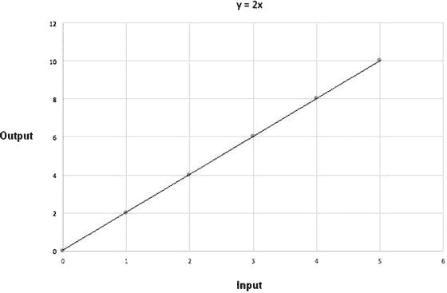

图 2-2。

Graph of 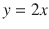

使用这个预测器有几个隐藏的约束。首先，是输入值的允许范围。在图 [2-2](#Fig2) 中，绘制了五个输出值，与范围在 0 到 10 之间的五个相应输入值相匹配。通常，您可以假设输入值不限于这个相同的范围，但是现实世界中的模型可能有限制，例如只允许非负数。此外，虽然该方程在绘制区域内是线性的，但不能保证如果输入值超过某个值，现实世界的模型不会变成非线性的。

正如您可能已经从简介中确定的那样，有用的预测仅与预测中采用的模型一样好。现实模型通常比简单的直线方程复杂得多，因为模拟真实世界的行为是一件复杂的事情。现在是考虑分类的时候了，分类和预测一样重要。

### 分类

在分类讨论中，我首先陈述了一个假设的情况，在这种情况下，对一个选定的蘑菇种进行分类是很重要的。注意，讨论的蘑菇纯属虚构，所以我的读者中的任何真菌学家(真菌专家)都不需要回应。假设有两种蘑菇:一种美味无毒，另一种有毒，显然不能食用。它们看起来几乎一模一样；然而，食用品种较大且密度较低，而有毒品种较小且密度较高。有两个参数或输入值用于对这些蘑菇类型进行分类:以克为单位的重量和以毫米(mm)为单位的冠(或帽)周长。密度是一个派生参数，如果需要，可以从重量和周长这两个基本测量值中确定。图 [2-3](#Fig3) 是两种蘑菇类型的 x-y 散点图。

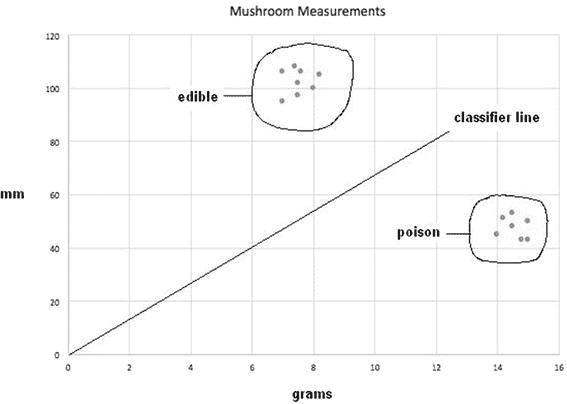

图 2-3。

Mushroom scatter plot

在图 [2-3](#Fig3) 中，我圈出了两种蘑菇类型的所有数据点，并放置了一条倾斜的分界线，标记为分类线。这条线清楚地划分了两组，你可以很容易地看到，但问题仍然是如何最好地分析确定潜水线。直线方程与图 [2-1](#Fig1) 中所示的形式完全相同，具有一个广义形式的

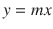

，其中 m 是斜率。让我们尝试 m = 2 作为初始值，看看会发生什么。图 [2-4](#Fig4) 显示了结果。

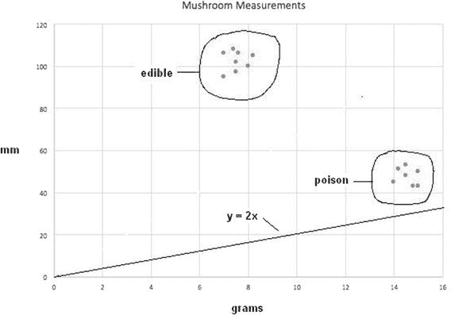

图 2-4。

Scatter plot with classification line y = 2x

显然，这不是一个令人满意的结果，因为两个数据点簇都在线的同一侧，这证明 m 的这一特定选择不能用作有用的分类器。需要一种精确的方法来确定 m，而不是使用盲目的人工试错法。这种方法是机器学习过程的开始。

我首先需要建立所谓的训练数据集，它将用于评估分类器功能的工作情况。这些数据只是来自每个集群的一个数据点，如表 [2-3](#Tab3) 所示。

表 2-3。

Training Data

<colgroup><col> <col> <col> <col></colgroup> 
| 数据点# | 克(x) | 毫米(y) | 蘑菇型 |
| --- | --- | --- | --- |
| one | Fifteen | Fifty | 有毒的 |
| Two | eight | One hundred | 食物 |

将数据点 1 的 x 值代入等式得到 y 的值 30 而不是 100，这是真实值或目标值。+20 的差值称为误差值。它必须被最小化以获得可工作的分类器。增加分类器线斜率是最小化误差的唯一方法。让我们用符号来表示斜率的变化，€表示误差，y <sub>t</sub> 表示期望的目标值。这个错误就这样变成了

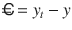

假设假设达到 y <sub>t</sub> 的值，扩展前面的等式，得到如下:

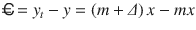

展开并收集术语会产生以下:

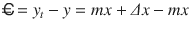

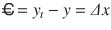

误差项的最终表达式非常简单，就是δ值乘以输入值，如果仔细思考一下，这完全说得通。重新排列最后一个方程并求解δ得到

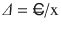

代入初始试验值得到δ值

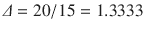

m 的新值现在是 1.3333 + 2，或 1.3333，因此修正的分类器线方程是

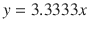

插入 x 训练值的先前值，或 15，现在产生所需的目标值 50。图 [2-5](#Fig5) 显示了散点图上修改后的分类器线。

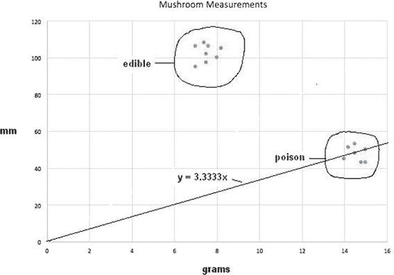

图 2-5。

Revised classifier line y = 3.3333x

### 进一步分类

虽然修正的分类器线在某种程度上改进了分类，但是在线上或线上仍然有毒蘑菇数据点，这仍然使得该分类器线不令人满意。

现在，让我们将 2 号数据点与修改后的分类器行一起使用，看看会有什么结果。使用值 x = 8 得出 y 值 26.664。现在，实际的 y 数据点值是 100，这意味着€= 100–26.664 = 73.336。新修正的 m 值可以计算如下:

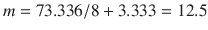

插入训练值 x，即 8，现在产生所需的目标值 50。图 [2-6](#Fig6) 显示了散点图上新修订的分类器线。

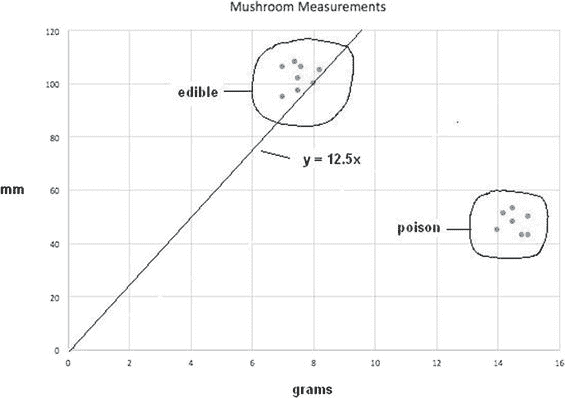

图 2-6。

Revised classifier line y = 12.5x

虽然这一新修订的分类线确实将所有的食用蘑菇与有毒蘑菇分开，但这并不令人满意:仍然可能有一些食用蘑菇因为稍微低于该线而被错误剔除。然而，现在存在一个更大的问题，因为所有的训练点都用尽了。如果我返回并重用前面的点号 1，它将返回到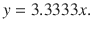分类器行。这是因为该过程没有考虑任何先前数据点的影响；就是没有记忆。解决这个问题的一个办法是引入学习率的概念，以缓和修正，使它们不会跳到极端，这正是目前正在发生的情况。

AI 中用于学习率的标准符号是η(希腊字母 Eta)。学习率是δ:

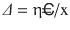

公式中使用的简单乘数

如果只应用一半的更新，设置η = 0.5 是一个合理的开始。对于初始数据点，新的δ= 0.5 * 1.333 = 0.667。因此，新的分类线是 y = 2.667x。我不会显示这一变化的散点图线，但可以说，它比原始版本稍差。没关系，因为下一个版本应该会好得多。

对于数据点 2，使用新的η学习率，新的分类器线是 y = 6.25x。图 [2-7](#Fig7) 显示了该新分类器线的散点图。

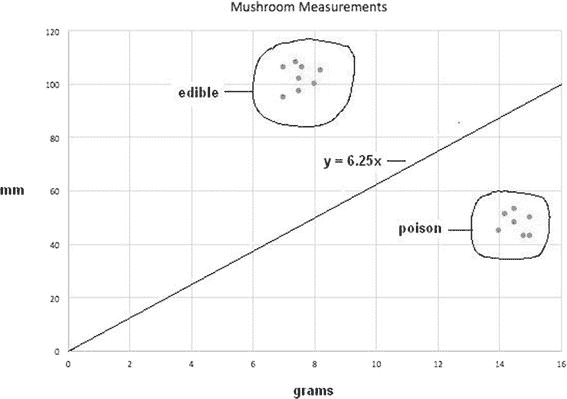

图 2-7。

Revised classifier line y = 6.25x

图 [2-7](#Fig7) 展示了一条出色的分类器线，该线正确区分了两种蘑菇类型，最大限度地降低了错误分类的可能性。

现在是时候介绍神经网络的非常基本的概念了，这对于实现实际的机器学习是必不可少的。

## 神经网络

神经网络的概念可以追溯到麦卡洛克和皮茨在 1943 年发表的一篇研究文章，该文章主要关注神经计算。我在第 [1](01.html) 章第一次提到了这些开创性的研究人员。这篇文章表明，简单的神经网络原则上可以计算任何算术或逻辑函数。为了理解神经网络，您必须理解生物神经网络中的关键元素，即神经元。图 [2-8](#Fig8) 是一个人类神经元的示意图。

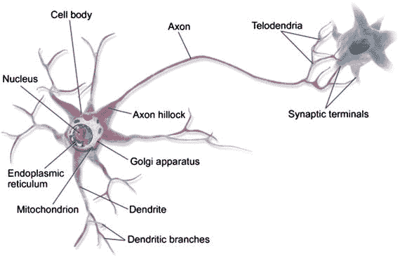

图 2-8。

Diagram of a human neuron (Source: Wikipedia)

图 [2-9](#Fig9) 是鸽子大脑神经元的草图，由西班牙神经科学家 [Santiago Ramón y Cajal](https://en.wikipedia.org/wiki/Santiago_Ram%C3%B3n_y_Cajal) 于 1899 年创作。图中清楚地显示了树突和末梢。


图 2-9。

Pigeon brain neurons sketch (Source: Wikipedia)

现在的问题是，为什么与现代计算机相比，人脑更有能力成功地完成智能任务？一个答案是，一个成熟的人脑估计有超过 1000 亿个神经元。精确的功能仍然未知。为了了解如此大量神经元的内在能力，你可以简单地考虑一条简单的蚯蚓的能力，它只有 302 个神经元，但仍然能够完成大型计算机无法完成的任务。

研究单个神经元的功能有助于解释如何创建一个神经元网络来解决人工智能问题。一个神经元的输出信号可以引起与其直接相连的神经元的兴奋或抑制。当一个神经元向连接的神经元发送一个激励信号时，它会被添加到该神经元同时接收的所有其他输入中，当所有输入的组合激励达到预设水平或阈值时，该神经元将会触发。点火不依赖于任何给定输入的电平；唯一重要的是超过阈值就开始开火。图 [2-10](#Fig10) 显示了典型神经元电信号的时间轨迹。

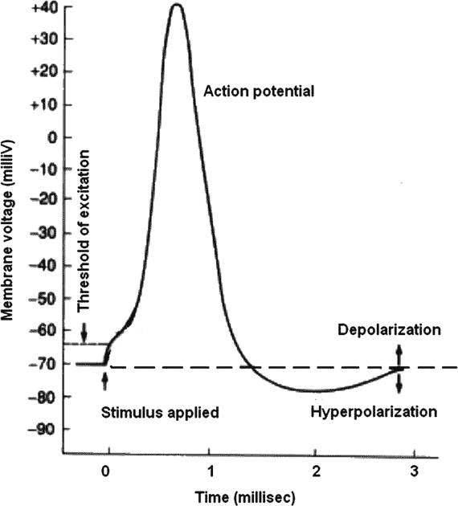

图 2-10。

Firing neuron time trace

如图 [2-10](#Fig10) 所示，峰值电压仅为 40 毫伏，总脉冲持续时间约为 3 毫秒(ms)。大多数神经元都有一个轴突，因此给定神经元中刺激输入和兴奋输出之间的延迟只有 3 毫秒。试图将这与人类的反应时间联系起来是很有趣的。迄今为止，人类最快的反应时间是 101 毫秒，平均约为 215 毫秒。这是从视觉等感官输入到鼠标点击等运动启动所需的总时间。假设从眼睛发送一个信号到大脑中适当的神经元需要 10ms；从控制手指肌肉动作的神经元发出神经信号可能需要 20 毫秒，肌肉本身的激活需要 40 毫秒。这就给大脑的总处理时间留下了大约 145 毫秒。这段时间将最长的神经元链限制在 14 到 15 个左右。这个数字意味着，必须有大量短的平行神经元链相互协作，才能完成解释视觉信号、回忆要采取的适当行动，然后向手指发送神经控制信号以进行鼠标点击的任务。所有这些任务都是动态完成的，同时仍然在后台自主地做一些必要的事情来保持活力。

神经元的兴奋作用可以用一个阶跃函数来粗略建模，如图 [2-11](#Fig11) 所示。

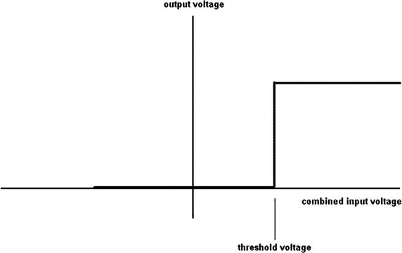

图 2-11。

Step function

在自然界中，没有什么比阶跃函数更清晰、更明确的了，尤其是对生物函数而言。人工智能研究人员已经采用了 sigmoid 函数来更真实地模拟神经元阈值函数。图 [2-12](#Fig12) 显示了 s 形函数。

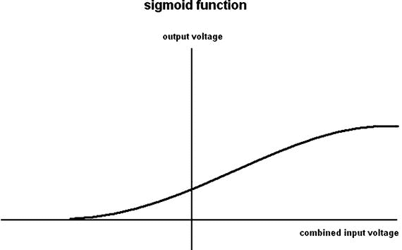

图 2-12。

Sigmoid function

sigmoid 函数的解析表达式为

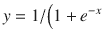，其中 e =数学常数 2.71828…

当 x = 0 时，y = 0.5，这是 sigmoid 函数的 y 轴截距。这个函数被用作我们的神经元模型的阈值函数。考虑图 [2-13](#Fig13) 一个非常基本的神经元模型，有三个输入(x1、x2 和 x3)和一个输出(y)。

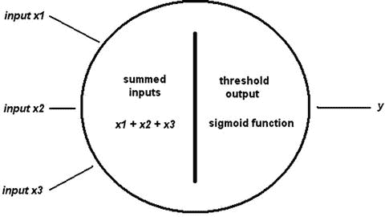

图 2-13。

Basic three-input neuron model

基本模型是有用的，但它不是完整的答案，因为神经元必须连接到网络才能作为学习实体。图 [2-14](#Fig14) 显示了一个由三个神经元层组成的简单神经网络，分别标记为输入、隐藏和输出。

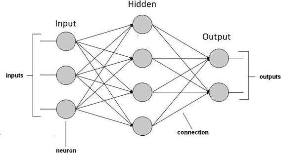

图 2-14。

Example neural network

下一个明显的问题是这个网络如何学习？最简单的方法是调整连接的权重。这意味着调整从输出到输入的振幅或强度。因此，高权重意味着给定的连接被更加强调，而低权重则不被强调。图 [2-15](#Fig15) 显示了分配给每个神经元或节点连接的权重。它们显示为 w <sub>n，m</sub> ，其中 n 是源节点号，m 是目的节点号。

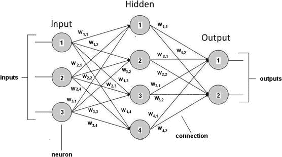

图 2-15。

Neural network with weighted interconnections

在这一点上，我将任何进一步的讨论推迟到神经网络这一章，在这一章中，我将分配实际的权重并演示一个实际的学习系统。到目前为止，讨论的主要目的是为神经网络的实现做准备。

## 浅层学习与深度学习

你可能听说过用于机器学习的术语“浅层”和“深层”。术语“浅”似乎意味着有些琐碎和轻量级的学习正在进行，而“深”则意味着相反的情况。实际上，浅学习和深学习只是应用于神经网络的主观形容词，基于网络中实现的层数。真的没有一个正式的定义来区分浅层和深度学习，因为特定神经网络的有效性由许多因素决定，其中之一是网络的层数。说明这一点是因为我并不真的担心某个特定的神经网络是被分类为浅层还是深层，而是担心它在期望的要求和标准下执行的有效性。

## 进化计算

有一个快速发展的人工智能领域叫做进化计算。它受生物进化理论的启发，但使用基于群体的试错问题解决程序的算法。反过来，这些问题解决者使用元启发式技术，这意味着他们依赖于统计和概率方法，而不是严格的确定性分析技术。从广义上讲，进化计算问题始于一组初始的候选解，随后对这些解进行最优性测试。如果他们被发现是次优的，解决方案被改变一个小的随机量，然后重新测试。通过去除从上一代确定的不太理想的解决方案，每一代候选解决方案都得到改进。生物模拟是当一个群体受到自然选择和突变。这导致种群逐渐进化以增加整体适应度来满足环境条件。对于进化计算，类似的过程是优化算法的预选适应度函数。事实上，进化计算有时被进化生物学的研究人员用于研究普通过程的实验程序。

进化计算可以用于其他人工智能领域。如果你还记得，我提到了一种进化计算方法，当时我说一台机器可以接受一条或多条规则，并对它们稍加修改，然后尝试使用修改后的规则所产生的结论。这可能是一个困难但可解决的问题，以创造一个候选的专家规则集受到进化筛选过程。

进化计算的一个非常流行的子集被称为遗传算法，我将在下一节简要介绍它。

### 遗传算法

正如在进化计算简介中提到的，遗传算法(GA)从一群候选解开始。这些解决方案在 GA 术语中被称为个体、生物或表型。它们被用在优化过程中以寻找改进的解决方案。每个候选解都有一组被称为染色体或基因型的特性，它们可以被改变或变异。将候选解表示为一串二进制数字 1 和 0 也是一种传统。随后是进化过程，其中随机生成的候选解中的每个个体都被评估适合度。从群体中随机选择更“适合”的个体。这些个体的基因组被进一步修改以形成下一代。这个下一代然后在 GA 中迭代使用，直到两件事情之一发生。首先，达到最大迭代次数，过程终止，不管是否找到最优解。第二，在达到最大迭代极限之前达到令人满意的适应水平。

典型的 GA 需要

*   与问题域兼容的遗传表示
*   能够有效评估解决方案的适应度函数

二进制数字或位是生成候选解的最常见方式。还有其他形式和结构，但使用 bits 似乎是现代人工智能中最流行的 GA 实现方式。通常，位串的大小是固定的，这使得执行所谓的交叉操作变得很容易。这些操作，连同其他操作，是完成世代修改和突变所必需的。

如果这个解释非常清楚，不要沮丧。我向您保证，在后面的章节中的 GA 演示将会阐明这个主题，您甚至可以尝试一些 GA 算法。希望进一步探索 GA 的读者可以去 [`https://intelligence.org`](https://intelligence.org) 看一些有趣的文章。

GA 的介绍结束了这一章基本的人工智能概念。您应该已经为接下来几章中的演示和项目做好了准备。但是预先警告:在项目章节中有新的人工智能材料，因为在一章中涵盖所有内容是不可能的。

## 摘要

本章的主要目的是介绍和讨论一些将在专题章节中演示的基本人工智能概念。我首先简要概述了布尔逻辑和相关的逻辑运算，因为它们在人工智能表达式中经常使用。本章的其余部分概述了以下内容:

*   推理、专家系统和冲突解决，因为它与实现专家系统有关
*   在树莓上安装 SWI·普洛斯
*   Prolog 演示程序，这是我在项目需要时实现专家系统的首选程序
*   模糊逻辑的一个简单例子，有助于阐明基本概念
*   关于机器学习的一系列章节
*   模仿生物大脑神经元的神经网络(NN)
*   以遗传算法为特征的进化计算