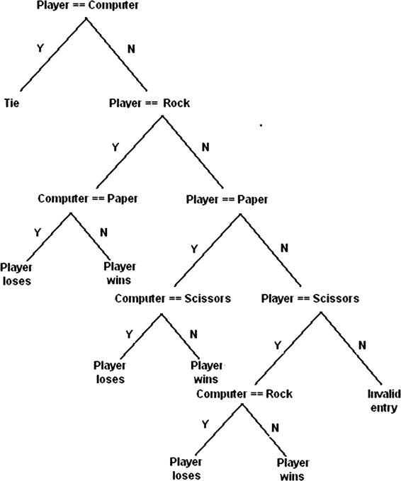
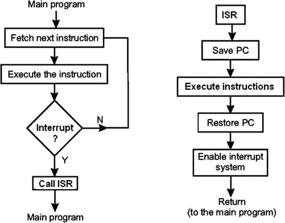

# 4.比赛

这一章都是关于游戏的。但我讨论的游戏不是目前充斥市场的价值数百万美元的视频大片。相反，它们是已经存在了很长时间的简单得多的游戏；有些延续了几千年。但即使在这些简单的游戏中，AI 也产生了影响。本章讨论的游戏传统上涉及两个人类对手，但现代游戏涉及一个人对一台计算机。这就是人工智能的用武之地:为人类玩家提供一些随机性和竞争性，这样玩游戏就不会很快变得无聊和琐碎。

每个演示都提出了几个迭代，您将需要一些额外的部件，详见表 [4-1](#Tab1) 。

表 4-1。

Parts Lists

<colgroup><col> <col> <col></colgroup> 
| 描述 | 量 | 评论 |
| --- | --- | --- |
| 皮皮匠 | one | 40 引脚版本，可接受 T 型或 DIP 型 |
| 无焊试验板 | one | 860 个插入点，带电源板 |
| 跳线 | 1 包 |   |
| 发光二极管 | three |   |
| S7-1200 可编程控制器 | three | 1/4 瓦特 |
| 16 × 4 液晶显示屏 | one | Adafruit p/n 198 或同等产品。您也可以使用 16 × 2 LCD |
| 10k 电位计 | one | 包含在 LCD 显示屏中 |
| 按钮开关 | four | 触感，适用于无焊试验板 |

要演示的第一个游戏是我们都玩过的旧时代的最爱:石头剪子布。

## 演示 4-1:石头剪刀布

如果你已经有一段时间没玩石头剪刀布了，这里是人对人游戏的规则。每个对手握紧拳头，数到三，然后展示下列手势之一:

*   平手:纸
*   拳头:摇滚
*   两个手指成 V 字形:剪刀

获胜的决定如下:

*   来自每个对手的相同信号是平局。
*   石头使剪刀变钝，所以石头赢了。
*   纸盖住了石头，所以纸签赢了。
*   剪刀剪纸，所以剪刀标志赢了。

只有九种可能的组合，包括三种打结方式。如上所述，每个对手都有三种获胜方式，这就产生了九种可能的组合。

以下名为 prs.py 的 Python 程序是石头剪子布游戏的简单实现。这个程序不使用前一章中演示的任何 Prolog 语句，而是依赖于标准的 Python `if ... else`语句。这些陈述与推论部分讨论的 if <条件> then <结论>具有相同的效果。

prs.py 列表

```py
# prs.py
from random import randint

# List the input options
inputList = ["paper", "rock", "scissors"]

# Random computer pick
computer = inputList[randint(0,2)]

# Initially set player = False
player = False

while player == False:

    player = raw_input("paper, rock, scissors?")
    if player == computer:
        print("Tie!")
    elif player == "rock":
        if computer == "paper":
            print("You lose ", computer, "covers", player)
        else:
            print("You win ", player, "dulls", computer)
    elif player == "paper":
        if computer == "scissors":
            print("You lose ", computer, "cuts", player)
        else:
            print("You win ", player, "covers", computer)
    elif player == "scissors":
        if computer == "rock":
            print("You lose ", computer, "dulls", player)
        else:
            print("You win ", player, "cuts", computer)
    else:
        print("Invalid input. Please reenter")

    # Reset player = False to continue looping
    player = False

    computer = inputList[randint(0,2)]

```

图 [4-1](#Fig1) 显示了我用树莓派进行的几轮测试。


图 4-1。

Rock-paper-scissors game play

我想评论一下这个程序的一个方面，它特别针对那些不太习惯编写 Python 程序的读者。命令`elif`是单词`else if`的缩写，被用作嵌套的`if ... else`结构的一部分，它实现了游戏逻辑。游戏逻辑也可以用树形图来刻画，如图 [4-2](#Fig2) 。



图 4-2。

Tree diagram for rock-paper-scissors game

我想你可以理解图中描述的逻辑的对称性。请注意，有六页或终点，显示玩家赢或输的位置。这与我之前提到的六种赢/输组合完全吻合。

信不信由你，有一些潜在的策略，可以在与人类对手玩这个游戏时调用。为了理解竞争策略，我必须首先给游戏结果分配一些值。让我们为每个结果假设以下合理的点数分配:

*   赢= 2 分
*   平局= 1 分
*   损失= 0 分

表 [4-2](#Tab2) 显示了平均而言，玩家在长期连续游戏中的期望值。

表 4-2。

Averaged Player Outcomes

<colgroup><col> <col> <col> <col> <col> <col></colgroup> 
|   |   | 对手的移动 | 平均玩家分数 |
| --- | --- | --- | --- |
|   |   | 纸 | 岩石 | 剪刀 |
| --- | --- | --- | --- | --- |
| 玩家的移动 | 纸 | one | Two | Zero | one |
|   | 岩石 | Zero | one | Two | one |
|   | 剪刀 | Two | Zero | one | one |

玩家的平均分数不应该让你感到惊讶，因为从长远来看(假设每个对手随机选择)，预期的分数或值应该平均分配给所有可能的结果。但是现在，让我们给正常的方法增加一点变化，利用人类的一个特点。这种特质或行为涉及随机数选择。如果你让某人从 1 到 10 中选择三个随机数，他们可能会选择 7、4 和 8，或者其他类似的数字。他们可以很容易地回答 5，5 和 5，这将满足要求，但使用随机这个词显然会使行为产生偏见。现在让我们假设你的对手在上一轮选择了石头。他很可能不会在下一轮再次选择摇滚。现在可以修改平均期望值表，如表 [4-3](#Tab3) 所示。

表 4-3。

Modified Averaged Expected Values

<colgroup><col> <col> <col> <col> <col> <col></colgroup> 
|   |   | 对手的移动 | 平均玩家分数 |
| --- | --- | --- | --- |
|   |   | 纸 | 岩石 | 剪刀 |
| --- | --- | --- | --- | --- |
| 玩家的移动 | 纸 | one | - | Zero | Zero point five |
|   | 岩石 | Zero | - | Two | one |
|   | 剪刀 | Two | - | one | One point five |

显然，基于对手之前的行动，玩家有一个最佳行动，这是基于正常的人类行为。然而，在检查程序中编程以避免给人类玩家提供竞争优势并不太难。代码类似于下面这样:但是请注意，我只是使用了索引整数值，而不是等价的字符串值。

```py
if computer == lastMove & won == 0:
    computer = player + 1
    if computer > 3:
        computer = 1

```

`lastMove`和`won`是新的整数变量，分别代表计算机之前的选择和是否获胜。我没有将这段代码合并到当前的程序中，因为我只是想展示经典的游戏设计。

我的石头剪子布游戏的下一个迭代取消了键盘输入和屏幕显示，用按钮和 led 取代了它们。

### 有开关和发光二极管的石头剪刀布游戏

我认为在 Raspberry Pi 上改变游戏玩法，使用按钮开关来选择符号，并让 led 指示游戏的输赢或平局，这既有趣又好玩。在这个项目中，我还介绍了 Raspberry Pi 如何使用 Python 语言处理中断。这个项目有一个注意事项。必须使用以下命令行条目启动它:

```py
python prs_with_LEDs_and_Switches.py

```

现在需要设置树莓 Pi 系统。烧结图如图 [4-3](#Fig3) 所示。


图 4-3。

Fritzing diagram for rock-paper-scissors game machine

图 [4-3](#Fig3) 是图 [3-11](#Fig11) 的延伸，用于专家系统演示。我在电路中添加了一个额外的 LED 和四个按钮开关。额外的 LED 连接到引脚 27，而按钮连接到引脚 12、16、20 和 21。

Raspberry Pi 的物理设置如图 [4-4](#Fig4) 所示。请注意，我在发光二极管和按钮附近贴了标签，以帮助用户确定发光二极管指示的内容以及特定按钮启用的标志。第四个按钮按下后退出程序。


图 4-4。

Physical Raspberry Pi setup

按钮用作输入，当按下时，瞬间向引脚提供 3.3V 的高电平。每个输入引脚也设置为下拉模式，引脚输入端的内部电阻接地。这可以防止引脚处于不确定的浮动状态。在这种状态下，一个浮动引脚可以“看到”从几十毫伏到高达 2 伏的电压，这可能会在引脚上触发一个假高电平。实际浮充电压变化很大，取决于引脚周围的局部电位场。连接一个下拉电阻可以避免所有这些麻烦。好消息是，下拉电阻实际上是通过软件命令配置的，我会在向您展示下面的代码清单后进行讨论。

prs_with_LEDs_and_Switches.py

```py
import RPi.GPIO as GPIO
import time
from random import randint

# Setup GPIO pins
# Set the BCM mode
GPIO.setmode(GPIO.BCM)

# Outputs
GPIO.setup( 4, GPIO.OUT)
GPIO.setup(17, GPIO.OUT)
GPIO.setup(27, GPIO.OUT)

# Ensure all LEDs are off to start
GPIO.output( 4, GPIO.LOW)
GPIO.output(17, GPIO.LOW)
GPIO.output(27, GPIO.LOW)

# Inputs
GPIO.setup(12, GPIO.IN, pull_up_down = GPIO.PUD_DOWN)
GPIO.setup(16, GPIO.IN, pull_up_down = GPIO.PUD_DOWN)
GPIO.setup(21, GPIO.IN, pull_up_down = GPIO.PUD_DOWN)
GPIO.setup(20, GPIO.IN, pull_up_down = GPIO.PUD_DOWN)

global player
player = 0

# Setup the callback functions
def rock(channel):
    global player
    player = 1  # magic number 1 = rock, pin 12

def paper(channel):
    global player
    player = 2  # magic number 2 = paper pin 16

def scissors(channel):
    global player
    player = 3  # magic number 3 = scissors pin 21

def quit(channel):
    exit()      # pin 20, immediate exit from the game

# Add event detection and callback assignments
GPIO.add_event_detect(12, GPIO.RISING, callback=rock)
GPIO.add_event_detect(16, GPIO.RISING, callback=paper)
GPIO.add_event_detect(21, GPIO.RISING, callback=scissors)
GPIO.add_event_detect(20, GPIO.RISING, callback=quit)

# computer random pick
computer = randint(1,3)

while True:

    if player == computer:
        # This is a tie condition
        GPIO.output(27,GPIO.HIGH)
        time.sleep(5)
        GPIO.output(27, GPIO.LOW)
        player = 0
    elif player == 1:
        if computer == 2:
            # Player loses, paper covers rock
            GPIO.output(17,GPIO.HIGH)
            time.sleep(5)
            GPIO.output(17, GPIO.LOW)
            player = 0
        else:
            # Player wins, rock dulls scissors
            GPIO.output(4,GPIO.HIGH)
            time.sleep(5)
            GPIO.output(4, GPIO.LOW)
            player = 0
    elif player == 2:
        if computer == 3:
            # Player loses, scissors cuts paper
            GPIO.output(17,GPIO.HIGH)
            time.sleep(5)
            GPIO.output(17, GPIO.LOW)
            player = 0
        else:
            # Player wins, paper covers rock
            GPIO.output(4,GPIO.HIGH)
            time.sleep(5)
            GPIO.output(4, GPIO.LOW)
            player = 0
    elif player == 3:
        if computer == 1:
            # Player loses, rock dulls scissors
            GPIO.output(17,GPIO.HIGH)
            time.sleep(5)
            GPIO.output(17, GPIO.LOW)
            player = 0
        else:
            # Player wins, scissors cuts paper
            GPIO.output(4,GPIO.HIGH)
            time.sleep(5)
            GPIO.output(4, GPIO.LOW)
            player = 0

    # another random pick for the computer
    computer = randint(1,3)

```

你应该马上注意到的一件事是，我在这个游戏版本中只使用了数字来表示符号。不需要实际的字符串名称，因为 led 显示该轮的结果，并且按钮已经被清楚地标记。然而，我通过使用代码清单中的注释，确定了这些“神奇”的数字代表了什么。我用魔法来代表任何用来代表其他东西的数字。如果没有注释或其他识别方法，那么计算程序中一个孤立的数字应该代表什么就成了一个魔术。不幸的是，许多开发人员仍然在他们的程序中使用幻数——我强烈建议您避免这种做法，除非您对它们进行注释，但那样它们就不再是幻数了。

前面程序中的逻辑与第一版程序中的逻辑完全相同。然而，输入和输出有很大的不同，现在使用按钮和发光二极管。我将首先讨论 LED 输出，因为您已经在专家系统演示中看到了它。首先选择的是引脚编号方案，该方案仍将用于 BCM，因为它与 T Pi 补鞋匠引脚名称相匹配。接下来设置被选作输出的引脚。这些针是 4、17 和 27，分别代表赢、输和平。这就是预配置输出所需的全部内容。使用以下命令打开输出:

```py
GPIO.output(n, GPIO.HIGH)  # where n = pin number

```

您还应该注意到，我在每个 LED 输出命令后都使用了以下命令:

```py
time.sleep(5)

```

这迫使 Python 解释器暂停 5 秒钟，这样用户就可以很容易地识别哪个 LED 亮了。没有停顿，LED 将点亮和熄灭如此之快，你永远不会看到它。这种情况可能会困扰许多新程序员，他们希望看到一个发光二极管，但从来没有。该程序可能按照预期运行，但新的程序员忽略了实时时钟周期的现实，因此 LED 仅持续几微秒——太短了，人眼无法察觉。

现在来讨论输入引脚和中断。

### 中断

处理 pin 输入有两种主要方式:轮询和中断。顾名思义，轮询只是定期检查 pin 状态。它必须在一个循环中实现才能工作。以下代码片段显示了检查 pin 状态的方法:

```py
if GPIO.input(n):           # where n = pin number
    print('Input was HIGH')
else:
    print('Input was LOW')

```

轮询比使用中断慢得多，因为必须执行循环中的所有代码。如果程序需要相对较长的时间来完成每个循环，特别是如果循环中有任何暂停语句，就有可能错过按键。

另一方面，中断实际上是即时的，与主程序中正在发生的事情无关，不管是否循环。中断利用 ARM 微处理器中的一个硬件子系统，称为中断控制器。图 [4-5](#Fig5) 是一个中断控制器的简化图，它有三个中断源:一个按钮、一个串行输入和一个时钟输入。按钮中断源与本项目相关。


图 4-5。

Interrupt controller

图 [4-6](#Fig6) 是一个逻辑流程图，清楚地显示了中断发生时的动作顺序。



图 4-6。

Interrupt logic flow diagram

正常情况下，微处理器在运行主程序时一条接一条地取出并执行指令。当中断发生时，我现在称之为事件，以符合 Python 语言术语，跳转到中断服务程序(ISR)，如图 [4-6](#Fig6) 所示。为了让你更迷惑，ISR 在 Python 中被称为回调函数。中断控制器自动保存下一个可执行指令的地址，以及其他几个参数，这就是所谓的保存处理器状态。接下来运行回调函数，当回调函数完成时，中断控制器重新加载处理器状态，并从中断时的位置准确恢复。所有这些操作只需几微秒就能完成，比轮询快得多。

在 Python 中设置中断必须完成几个步骤。首先，必须设置接收中断的适当引脚。我将以摇滚按钮为例。下一条语句将引脚 12 设置为输入，并配置了一个下拉电阻，原因我在前面讨论过:

```py
GPIO.setup(12, GPIO.IN, pull_up_down = GPIO.PUD_DOWN)

```

接下来，必须识别中断源并将其链接到回调函数。以下语句适用于摇滚信号按钮:

```py
GPIO.add_event_detect(12, GPIO.RISING, callback=rock)

```

最后，必须定义回调函数。对于岩石信号，该函数为

```py
def rock(channel):
    global player
    player = 1  # magic number 1 = rock, pin 12

```

注意，单词`channel`必须用作函数定义中的参数。这只是 Python 语言的一个特点。

还要注意，我在函数定义中使用了单词`global`,它指定了`player`变量是全局变量或者对程序的所有部分都可用，不管它是在函数中还是在主程序中。我通常不喜欢使用全局变量，因为它们破坏了面向对象的封装原则，但是在这种情况下，减少代码重复和提高程序效率似乎是合适的。你还需要在主程序中将`player`标识为全局变量。

最后一个新的程序特性是 exit 按钮，它可以使程序立即退出 Python 解释器。这是回调函数:

```py
def quit(channel):
    exit()      # pin 20, immediate exit from the game

```

程序中的其他内容都很简单，或者之前已经讨论过了。

没有截图，我可以显示这个程序运行，因为输入是手动按钮激活，输出是发光二极管被点亮。我可以向你保证一切都如预期的那样运行。

我讨论的下一个游戏是尼姆。

## 演示 4-2: Nim

Nim 是一种数学策略游戏，游戏中两个玩家轮流从一个公共堆中移走物品。在每一回合中，玩家可以移除一个、两个或三个物品。游戏的目标是避免玩家移除最后一个物品，尽管有 Nim 变体，其中你通过移除最后一个物品而获胜。

自古以来就有各种 Nim 风格的游戏，经常使用鹅卵石作为堆。Nim 也被称为 pebble pickup，last pebble，最近又被称为 sticks 或 pick-up sticks。虽然并不真正为人所知，但尼姆被认为起源于中国，因为它非常类似于“捡石头”的游戏在欧洲历史上，尼姆可以追溯到 16 世纪初。尼姆这个名字的真正来源是哈佛大学教授查尔斯·波顿，他被认为是 20 世纪初博弈论的创始人。

我将首先在一个双人游戏中演示 Nim 的 Python 版本。我简单地将其描述为“天真的尼姆”，其中没有人工智能，只是天生的玩家智能。

naive_nim.py 清单

```py
sticks = 21
max_picks = 3

while (sticks != 0):
    pick1 = 0
    pick2 = 0

    pick1 = int(raw_input("Player 1 pick: "))
    while pick1 > max_picks or (sticks - pick1) <= 0:
        print "You cannot pick more than 3 or reduce sticks to zero or less"
        pick1 = int(raw_input("Player 1 pick: "))
    sticks =  sticks - pick1
    print "remaining sticks = ", sticks
    if sticks == 1:
        print 'Player 1 Wins!'
        exit()

    pick2 = int(raw_input("Player 2 pick: "))
    while pick2 > max_picks or (sticks - pick2) <= 0:
        print "You cannot pick more than 3 or reduce sticks to zero or less"
        pick2 = int(raw_input("Player2 pick: "))
    sticks = sticks - pick2
    print "remaining sticks = ", sticks
    if sticks == 1:
        print 'Player 2 Wins!'
        exit()

```

图 [4-7](#Fig7) 显示了我玩的两轮:pick1 和 pick2。请注意，我添加了一些验证检查，确保不超过三个棒被挑选，并且任何挑选都不会将棒总数减少到零或更少。


图 4-7。

Two rounds of Nim play

现在是时候通过实现一个计算机对手来给 Nim 游戏添加一些 AI 了。

nim_computer.py 列表

```py
import random
print "NIM GAME"

player1 = raw_input("Enter your name: ")
player2 = "Computer"
howMany = 0
gameover=False
global stickNumber
stickNumber = 21

def moveComputer():
    removedNumber = random.randint(1,3)
    global stickNumber
    while (removedNumber < stickNumber) or (stickNumber <= 4):
        if stickNumber >= 5:
            stickNumber -= removedNumber
            return stickNumber
        elif (stickNumber == 4) or (stickNumber == 3) or (stickNumber == 2):
            stickNumber = 1
            return stickNumber

def moveHuman():
    global stickNumber
    global howMany
    stickNumber -= howMany
    return stickNumber

def humanLegalMove():
    global howMany
    global stickNumber
    legalMove=False
    while not legalMove:
        print("It's your turn, ",player1)
        howMany=int(input("How many sticks do you want to remove?(from 1 to 3) "))
        if  howMany>3 or howMany<1:
            print("Enter a number between 1 and 3.")
        else:
            legalMove=True
    while (howMany >= stickNumber):
        print("The entered number is greater than or equal to the number of sticks remaining.")
        howMany=int(input("How many sticks do you want to remove?"))
        return howMany

def checkWinner(player):
    global stickNumber
    if stickNumber == 1:
        print(player," wins.")
        global gameover
        gameover = True
        return gameover

def resetGameover():
    global gameover
    global stickNumber
    gameover = False
    stickNumber = 21
    howMany = 0
    return gameover

def game():
    while gameover == False:
        print("It's ",player2,"turn. The number of sticks left: ", moveComputer())
        checkWinner(player2)
        if gameover == True:
            playAgain()
        humanLegalMove()
        print("The number of sticks left: ", moveHuman())
        checkWinner(player1)
        if gameover == True:
            playAgain()

def playAgain():
    answer = raw_input("Do you want to play again?(y/n)")
    resetGameover()
    if answer=="y":
        game()
    else:
        print("Thanks for playing the game")
        exit()

game()
playAgain()

```

图 [4-8](#Fig8) 显示了 Nim 与电脑对战的两个回合。


图 4-8。

Two rounds of computer vs. human play

图 [4-8](#Fig8) 展示了当每个对手输入一个有效的棍数时，程序按设计运行。虽然计算机不可能输入无效的数字，但对人来说却不是这样。此外，程序必须防止出现将棒数减少到零或更少的条目。图 [4-9](#Fig9) 显示了当我试图输入一个大于 3 的数字，或者将杆总数减少到 0 时，这些安全措施的作用。


图 4-9。

Validation or “sanity” checks

在图 [4-8](#Fig8) 和 [4-9](#Fig9) 中不明显的是我在程序中加入了少量的人工智能。正常情况下，每圈的计算机输入由下列语句决定:

```py
removedNumber = random.randint(1,3)

```

该语句生成一个介于 1 和 3 之间的随机数，包括 1 和 3。通常，这对于幼稚的方法来说是可以的；然而，当棍子数为 4 或更少时，我不希望给人类玩家太多不公平的优势。因此，我在`moveComputer`函数中添加了以下代码:

```py
elif (stickNumber == 4) or (stickNumber == 3) or (stickNumber == 2):
            stickNumber = 1
            return stickNumber

```

这确保了计算机在这一轮中获胜，因为如果给人类玩家两个、三个或四个剩余的棍子，它会精确地模拟人类的行为。

关于 Nim 游戏的竞争策略，你应该知道更多。假设还剩六根棍子，轮到你了。根据博弈理论，你的最佳选择是移除满足以下等式的确切数量的棍子:

其中 n 是轮到你后剩余的棍子数。

等式中的 mod 运算符表示整数的余数除法。例如，8 mod 3 等于 2，因为 3 除以 2 得到 8 的余数是 2。所以基本上，你丢弃被除数，保留余数用于整数除法。表 [4-4](#Tab4) 显示了在牌堆中还有六根木棒的情况下你所有可能的走法。

表 4-4。

Competitive Strategy for Six Sticks in the Heap

<colgroup><col> <col> <col></colgroup> 
| 可能的举动 | 剩余棒数(n) | n 模组 4 |
| --- | --- | --- |
| one | five | one |
| Two | four | Zero |
| three | three | three |

因此，根据博弈论，你的最佳行动是拿掉一根棍子。你不必成为游戏专家来理解这个选择。记住你的对手只能拿走一根、两根或三根棍子。因此，在对手拿掉棍子后，只能剩下两根、三根或四根棍子。这样你就保证会赢，因为你可以去掉适当的金额，剩下一个。

人类玩家在这个特殊的游戏中有明显的优势，因为计算机总是随机选择一个移除木棒的数字，直到堆中剩下四根或更少的木棒。因此，你应该总是设法让计算机的倒数第二步是用六根棍子。在下一节的下一个演示 Nim 版本中，我已经去掉了这个优点。

### 带 LCD 和开关的 Nim

这个 Nim 版本使用按钮开关来输入要移除的棒的数量。它使用一个 LCD 来显示玩家何时应该按下一个按钮，并显示剩余棒的数量。按钮连接到 Python 回调函数，就像自动石头剪子布(rps)游戏版本一样。事实上，我在 prs 游戏中使用了非常相似的按钮电路。我不得不改变按钮使用的引脚，以适应液晶显示器的互连。prs 游戏中的 led 不再需要，因为它们被 16 × 2 LCD 显示屏取代。

自动 Nim 设置的烧结图如图 [4-10](#Fig10) 所示。


图 4-10。

Fritzing diagram for the automated Nim game

这种设置中的接线显然太多，无法在烧结图中正确显示。因此，我提供了显示 LCD 至 Pi 鹅卵石互连的原理图和显示所有系统互连的引脚列表。图 [4-11](#Fig11) 是 LCD 模块到 Pi 补鞋匠的示意图。


图 4-11。

Schematic of Pi Cobbler–to–LCD module

表 [4-5](#Tab5) 是详细列出所有电路板互连的引脚列表。请注意，LCD 引脚名称从左边的 1 开始，到 LCD 方向的最右边的 16，如熔结图所示。电位计的方向是“上下颠倒”，将引脚放在顶部。左侧引脚接地，中间引脚连接 LCD 引脚 3，右侧引脚连接 5V。

表 4-5。

Pin List for Wiring Interconnections

<colgroup><col> <col> <col></colgroup> 
| 从 | 到 | 评论 |
| --- | --- | --- |
| LCD 针脚 1 | 地面 |   |
| LCD 针脚 2 | 5V | 电源电压 |
| LCD 针脚 3 | 中间引线电位计 | 对比度调整 Vo |
| LCD 针脚 4 | 刮脸针 27 | 寄存器选择 |
| LCD 针脚 5 | 地面 | 读/写(读/写) |
| LCD 针脚 6 | 刮脸针 22 | 启用(时钟) |
| LCD 针脚 7 | - | 无连接(位 0) |
| LCD 针脚 8 | - | 无连接(位 1) |
| LCD 针脚 9 | - | 无连接(第 2 位) |
| LCD 针脚 10 | - | 无连接(第 3 位) |
| LCD 针脚 11 | 刮脸针 25 | 第 4 位 |
| LCD 针脚 12 | 端号 24 刮削 | 第 5 位 |
| LCD 针脚 13 | 刮脸针 23 | 第 6 位 |
| LCD 针脚 14 | 刮脸针 18 | 第 7 位 |
| LCD 针脚 15 | 5V | 背光 LED 阳极 |
| LCD 针脚 16 | 刮脸针 4 | 背光 LED 阴极 |
| 左引线电位计 | 地面 |   |
| 中间引线电位计 | LCD 针脚 3 |   |
| 右引线电位计 | 5V |   |
| 左侧操纵杆按钮 1 | 刮脸针 12 |   |
| 右侧驾驶杆按钮 1 | 3.3V |   |
| 操纵杆按钮 2，左侧 | 刮脸针 13 |   |
| 右侧驾驶杆按钮 2 | 3.3V |   |
| 操纵杆按钮 3，左侧 | 刮脸针 19 |   |
| 右侧斗杆按钮 3 | 3.3V |   |
| 退出按钮，左侧 | 刮脸针 20 |   |
| 退出按钮，右侧 | 3.3V |   |

在这种设置中有许多跳线需要连接，因此在对无焊试验板布线时要特别小心。我建议您为 5V 电源使用单独的电源轨，如果您使用水平方向的电路板，它应该位于试验板的顶部。请特别注意，不要将任何 5V 电源连接到 Raspberry Pi 输入，因为这肯定会损坏输入引脚。GPIO 输入严格限制在 3.3V 的最大水平，任何更高的水平都会烧坏该输入引脚，并可能对 Raspberry Pi 内核造成进一步损坏。

图 [4-12](#Fig12) 显示了标有每个按钮功能的完整物理设置。


图 4-12。

Physical setup for the automated Nim game

控制这个硬件的程序被命名为 automated_nim.py。它基于以前的程序，除了所有的输入现在都是用回调函数来完成，并且使用 LCD 显示器来显示游戏状态。我觉得在真正进入主程序之前，先讨论一下液晶显示器如何与 Raspberry Pi 一起工作是合适的。

### 液晶显示器

我首先要承认，这一部分的大部分内容都是基于托尼·迪科拉在 [`https://learn.adafruit.com/character-lcd-with-raspberry-pi-or-beaglebone-black/overview`](https://learn.adafruit.com/character-lcd-with-raspberry-pi-or-beaglebone-black/overview) 提供的非常好的阿达果教程。

带有 16 个连接器引脚的廉价 16 × 2 或 16×4 LCD 最有可能使用日立 HD44780 控制器或通用等效设备。LCD 使用并行接口，这意味着您需要从 Raspberry Pi 使用多根电线来控制它。这种设置仅使用四个数据引脚和两个控制引脚。这种配置称为 LCD 半字节输入模式。另一种模式是每次有新字符输入到 LCD 时，传输一个完整的字节，即 8 位。显然，半字节模式比字节模式慢，但对于这种应用，速度差异并不明显。Raspberry Pi 只向显示器发送数据；它没有读取任何数据。这意味着您不必担心任何 5V 脉冲被发送到更敏感的 Raspberry Pi 输入引脚，这些引脚只有 3.3V 的最大电压输入，正如我前面提到的。

16 引脚 LCD 接头上的寄存器选择引脚#4 有两种用途。当拉低时，Raspberry Pi 可以向 LCD 发送控制命令，例如更改到指定的字符位置或清除屏幕。这种模式被称为写入指令或命令寄存器。当寄存器选择引脚设为高电平时，LCD 控制器进入数据模式，接受数据并显示在屏幕上。

读/写引脚#5 接地，因为对于这种设置，只有数据被写入 LCD。

使能引脚#6 根据需要切换，以将数据写入最终显示在屏幕上的输入寄存器。

在连接 LCD、按钮开关和电位计之后，您需要加载一个特殊的 Python 库，该库允许 LCD 显示器与 Raspberry Pi 一起工作。这个库是由 Adafruit 的聪明人创建的，他们有很多库来支持各种设备和传感器。我接下来介绍的过程也适用于加载大多数其他专业 Adafruit 库。

### 加载 Adafruit LCD 库

您需要 Git 应用来加载库，因为 Adafruit 使用 github.com 来存储它的所有库。输入以下命令来安装 Git:

```py
sudo apt-get update
sudo apt-get install git

```

一旦安装了 Git，现在就可以下载 LCD 库了。这个下载过程称为克隆。这会在您的主目录中创建一个名为`Adafruit_Python_CharLCD`的新目录。输入以下命令:

```py
sudo git clone git://github.com/adafruit/Adafruit_Python_CharLCD

```

新创建的目录包含下一步(即设置库)所需的所有文件。设置过程漫长而复杂；但是，提供了一个简单的设置脚本来自动化整个过程。输入以下命令来设置库:

```py
cd Adafruit_Python_CharLCD
sudo python setup.py install

```

图 [4-13](#Fig13) 显示了安装过程的开始和结束。总的来说，安装过程中有 70 多个独立的操作，包括下载和构建多个依赖项。


图 4-13。

LCD library installation script execution

现在，您应该测试硬件和软件安装，以验证一切工作正常。

### 液晶显示器测试

名为 char_lcd.py 的测试程序应该位于 Git 克隆操作完成后创建的`Adafruit_Python_CharLCD`目录的 examples 子目录中。转到 examples 目录并输入以下命令:

```py
python char_lcd.py

```

如果一切都连接正确，并且所有库都正确安装，您应该看到如图 [4-14](#Fig14) 所示的显示。


图 4-14。

Result of running the char_lcd.py program

如果您没有看到此显示，请重新检查所有布线，因为很容易放错跳线插入点或连接到 Pi 鹅卵石或 LCD 模块上的错误引脚。正如我前面提到的，大多数故障通常是布线或互连错误。

假设 LCD 测试是成功的，现在是时候考虑主要的 Nim 程序了。

### automated_nim.py

这个程序与以前的 Nim 程序相比有了很大的变化，因为需要加入回调函数和 LCD 显示程序。我还在程序中加入了一些人工智能逻辑:计算机对手现在使用博弈论 n mod 4 = 1 方程来帮助选择棍子，除了在无法实现最佳选择时使用随机数生成器。

automated_nim.py 列表

```py
!/usr/bin/python

# import statements
import random
import time
import Adafruit_CharLCD as LCD
import RPi.GPIO as GPIO

# Start Raspberry Pi configuration
# Raspberry Pi pin designations
lcd_rs        = 27
lcd_en        = 22
lcd_d4        = 25
lcd_d5        = 24
lcd_d6        = 23
lcd_d7        = 18
lcd_backlight =  4

# Define LCD column and row size for a 16x4 LCD.
lcd_columns = 16
lcd_rows    =  4

# Instantiate an LCD object
lcd = LCD.Adafruit_CharLCD(lcd_rs, lcd_en, lcd_d4, lcd_d5, lcd_d6, lcd_d7, lcd_columns, lcd_rows, lcd_backlight)

# Print a two line welcoming message
lcd.message('Lets play nim\ncomputer vs human')

# Wait 5 seconds
time.sleep(5.0)

# Clear the screen
lcd.clear()

# Setup GPIO pins
# Set the BCM mode
GPIO.setmode(GPIO.BCM)

# Inputs
GPIO.setup(12, GPIO.IN, pull_up_down = GPIO.PUD_DOWN)
GPIO.setup(13, GPIO.IN, pull_up_down = GPIO.PUD_DOWN)
GPIO.setup(19, GPIO.IN, pull_up_down = GPIO.PUD_DOWN)
GPIO.setup(20, GPIO.IN, pull_up_down = GPIO.PUD_DOWN)

# Create the global variables
global player
player = ""
global humanTurn
humanTurn = False
global stickNumber
stickNumber = 21
global humanPick
humanPick = 0
global gameover
gameover = False

# Set up the callback functions
def pickOne(channel):
    global humanTurn
    global humanPick
    humanPick = 1
    humanTurn = True

def pickTwo(channel):
    global humanTurn
    global humanPick
    humanPick = 2
    humanTurn = True

def pickThree(channel):
    global humanTurn
    global humanPick
    humanPick = 3
    humanTurn = True

def quit(channel):
    lcd.clear()
    exit()      # pin 20, immediate exit from the game

# Add event detection and callback assignments
GPIO.add_event_detect(12, GPIO.RISING, callback=pickOne)
GPIO.add_event_detect(13, GPIO.RISING, callback=pickTwo)
GPIO.add_event_detect(19, GPIO.RISING, callback=pickThree)
GPIO.add_event_detect(20, GPIO.RISING, callback=quit)

# random selection for the players
playerSelect = random.randint(0,1)
if playerSelect:
    humanTurn = True
    lcd.message('Human goes first')
    time.sleep(2)
    lcd.clear()
else:
    humanTurn = False
    lcd.message('Computer goes first')
    time.sleep(2)
    lcd.clear()

# The AI portion
def computerMove():
    global stickNumber
    global humanTurn

    if (stickNumber-1) % 4 == 1:
        computerPick = 1
    elif (stickNumber-2) % 4 == 1:
        computerPick = 2
    elif (stickNumber-3) % 4 == 1:
        computerPick = 3
    else:
        computerPick = random.randint(1,3)

    if stickNumber >= 4:
        stickNumber -= computerPick
    elif (stickNumber==4) or (stickNumber==3) or (stickNumber==2):
        stickNumber = 1
    humanTurn = True

# The human portion
def humanMove():
    global humanPick
    global humanTurn
    global stickNumber
    while not humanPick:
        pass
    while (humanPick >= stickNumber):
        lcd.message('Number selected\n')
        lcd.message('is >= remaining\n')
        lcd.message('sticks')
    stickNumber -= humanPick
    humanTurn = False
    humanPick = 0
    lcd.clear()

def checkWinner():
    global gameover
    global player
    global stickNumber
    if stickNumber == 1:
        msg = player + ' wins!'
        lcd.message(msg)
        time.sleep(5)
        gameover = True

def resetGameover():
    global gameover
    global stickNumber
    gameover = False
    stickNumber = 21
    return gameover

# This module controls the overall game play
def game():
    global player
    global humanTurn
    global gameover
    global stickNumber
    while gameover == False:
        if humanTurn == True:
            lcd.message('human turn\n')
            msg = 'sticks left: ' + str(stickNumber) + '\n'
            lcd.message(msg)
            humanMove()
            msg = 'sticks left: ' + str(stickNumber)
            lcd.message(msg)
            time.sleep(2)
            checkWinner()
            lcd.clear()
        else:
            lcd.message('computer turn\n')
            computerMove()
            msg = 'sticks left: ' + str(stickNumber)
            lcd.message(msg)
            time.sleep(2)
            checkWinner()
            lcd.clear()

    if gameover == True:
            lcd.clear()
            playAgain()

# As the name suggests; play again?
def playAgain():
    global humanPick
    lcd.message('Play again?\n')
    lcd.message('1 = y, 2 = n')

    # This loop is needed to idle while waiting for a button press
    while humanPick == 0:
        pass
    if humanPick == 1:
        lcd.clear()
        resetGameover()
        game()
    elif humanPick == 2:
        lcd.clear()
        lcd.message('Thanks for \n')
        lcd.message('playing the game')
        time.sleep(5)
        lcd.clear()
        exit()

# This function call kicks off the game play
game()

```

我相信你会发现，在这个程序中打败计算机是相当困难的，这与更早的、更幼稚的 Nim 程序有着天壤之别。图 [4-15](#Fig15) 是我用电脑玩一轮的时候抓拍到的液晶屏照片。


图 4-15。

LCD display during round play

这个自动化的 Nim 程序是本章的最后一个项目。Jessie Linux 发行版中有更多的 Python 游戏，您可能希望研究一下。它们可以在主 X 窗口 GUI 中找到，如图 [4-16](#Fig16) 所示。


图 4-16。

Additional Python games

这些游戏是阿尔·斯威格特的作品，他的网站在 [`www.inventwithpython.com`](http://www.inventwithpython.com) 。在这个网站上，你可以免费下载一本名为《用 Python 制作游戏& Pygame》的 347 页电子书，其中 Al 详细描述了图 [4-16](#Fig16) 中所列的游戏是如何运行的。强烈推荐给那些对 Python 游戏开发的下一步感兴趣的读者，除了我在本章讨论的内容之外。

## 摘要

用 Python 语言编写的相当简单的游戏程序是本章的重点。我展示了两个游戏的几个版本——石头剪子布和 Nim——从相对幼稚的版本发展到将人工智能融入计算机对手的更复杂的版本。

本章的目标之一是展示如何将相当简单的人工智能概念应用到经典游戏中，在经典游戏中，人类玩家对抗计算机程序。

另一个附带的目标是演示一些包括 Python 中断的硬件和软件技术，并展示如何通过 Raspberry Pi 使用 LCD 显示器。