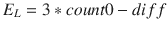

# 六、机器学习

这一章开始了对机器学习这个广泛话题的探索，我在第 [2](02.html) 章中介绍了这个话题。机器学习是当前工业界和学术界的热门话题。谷歌、亚马逊和脸书等公司已经在机器学习上投入了数百万美元，以改善他们的产品和服务。我首先在 Raspberry Pi 上做了一些相当简单的演示，以检验计算机如何在原始或幼稚的意义上“学习”。首先，我想承认我从 Bert van Dam 的书《人工智能:让你的微控制器生活的 23 个项目》( Elektor Electronics Publishing，2009)中获得了很多灵感和知识。虽然 van Dam 没有使用 Raspberry Pi 作为微控制器，但他应用的概念和技术是完全有效的，并且特别受赞赏。

## 零件目录表

对于第一次演示，您需要表 [6-1](#Tab1) 中列出的零件。

表 6-1。

Parts List

<colgroup><col> <col> <col></colgroup> 
| 描述 | 量 | 评论 |
| --- | --- | --- |
| 皮皮匠 | one | 40 引脚版本，可接受 T 型或 DIP 型 |
| 无焊试验板 | one | 300 个插入点，带电源条 |
| 无焊试验板 | one | 300 个插入点 |
| 跳线 | 1 包 |   |
| 发光二极管 | Two | 如果可能，绿色和黄色发光二极管 |
| 2.2kω电阻 | six | 1/4 瓦特 |
| S7-1200 可编程控制器 | Two | 1/4 瓦特 |
| 10ω电阻 | Two | 1/2 瓦特 |
| 按钮 | one | 触觉的 |
| MCP3008 | one | 8 通道 ADC 芯片 DIP |

本章讨论了一个机器人演示，您可以按照附录中的说明进行制作。简单地阅读机器人讨论并获得对概念的理解也是可行的。

## 演示 6-1:颜色选择

在本演示中，您将教计算机您喜欢的颜色，绿色或黄色。首先，必须按照图 [6-1](#Fig1) 所示的熔块图设置树莓派。


图 6-1。

Fritzing diagram Caution

确保将按钮开关的一侧连接到 3.3 V，而不是 5 V，因为如果您不小心将 GPIO 引脚连接到更高的电压，会损坏 GPIO 引脚。

接下来，我解释颜色选择算法是如何工作的。

### 算法

考虑图 [6-2](#Fig2) 所示的水平杆。它的总数值范围是 0 到 255。条的左半部分具有 0 到 127 的刻度，代表绿色 LED 激活。右半部分的标度为 128 到 255，代表黄色 LED 激活。


图 6-2。

LED activation bar

让我们创建一个整数随机数生成器，它产生一个 0 到 255 之间的数，包括 0 和 255。使用下面的函数很容易做到这一点，我在以前的 Python 程序中使用过这个函数:

```py
decision = randint(0,255)

```

`randint()`是 Python `random`库中的随机整数生成器方法。变量 decision 是一个 0 到 255 之间的值。如果在 0 到 127 之间，绿色 LED 亮；否则，该值介于 128 和 255 之间，此时黄色 LED 亮起。现在，如果决策点保持不变，有 50/50 的机会(或概率，从长远来看)，绿色 LED 灯在每次程序重复时亮起；黄色 LED 灯亮起的几率相同。但这不是这个项目的目标。目标是“教”程序选择你最喜欢的颜色。这个目标最终可以通过移动决策点来实现，使其偏向最喜欢的颜色选择。让我们决定绿色是最喜欢的颜色。因此，每次绿色 LED 亮起时，决策点都会发生变化，因为用户按下了按钮。按下此按钮会产生一个带有回调函数的中断，该函数会增加决策点值。最终，决策点将增加到这样一个值，使得几乎所有生成的随机数都落在条形的绿色 LED 部分，如图 [6-3](#Fig3) 所示。


图 6-3。

Adjusted number bar

以下名为 color_selection.py 的程序实现了该算法:

```py
!/usr/bin/python
# import statements
import random
import time
import RPi.GPIO as GPIO

# initialize global variable for decision point
global dp
dp = 127

# Setup GPIO pins
# Set the BCM mode
GPIO.setmode(GPIO.BCM)

# Outputs
GPIO.setup( 4, GPIO.OUT)
GPIO.setup(17, GPIO.OUT)

# Input
GPIO.setup(27, GPIO.IN, pull_up_down = GPIO.PUD_DOWN)

# Setup the callback function
def changeDecisionPt(channel):
    global dp
    dp = dp + 1
    if dp == 255: # do not increase dp beyond 255
        dp =255

# Add event detection and callback assignment
GPIO.add_event_detect(27, GPIO.RISING, callback=changeDecisionPt)

while True:
    rn = random.randint(0,255)
    # useful to check on the dp value
    print 'dp = ', dp
    if rn <= dp:
        GPIO.output(4, GPIO.HIGH)
        time.sleep(2)
        GPIO.output(4, GPIO.LOW)
    else:
        GPIO.output(17, GPIO.HIGH)
        time.sleep(2)
        GPIO.output(17, GPIO.LOW)

```

Note

按 CTRL+C 退出程序。

当程序开始时，很容易看到 led 灯打开和关闭的时间差不多。然而，当我不断按下按钮时，很快就发现绿色 led 灯亮了很长时间，直到 dp 值等于 255，黄色 LED 灯才亮。程序因此“知道”我最喜欢的颜色是绿色。

但是计算机真的学到了什么吗？这与其说是一个技术问题，不如说是一个哲学问题。这是一直困扰人工智能研究人员和爱好者的问题。我可以很容易地重启程序，计算机会重置决策点并“忘记”之前的程序执行。同样，我可以更改程序，将 dp 值外部存储在一个单独的数据文件中，该文件将在程序每次运行时加载，从而记住最喜欢的颜色选择。我将转移计算机学习实际上意味着什么的问题，并专注于人工智能的实用性，正如我在第 [1](01.html) 章提到的麦卡锡博士所走的道路。

下一节将扩展这个简单演示中讨论的概念。

### 轮盘赌算法

图 [6-4](#Fig4) 显示了一个非常简化的轮盘赌轮盘，它有四个相等的扇区(A 到 D ),代表组成完整圆的问题域中的事件。


图 6-4。

Simple roulette wheel

在轮盘的给定旋转中，选择任何片段的平均概率为 0.25。计算这一事件概率的公式与每个片段的面积直接相关。可以表述如下:


使用此类方程的一个特殊问题是，即使可能只需要 p <sub>A</sub> ，也必须计算代表面积 B、C 和 D，以得出事件 A 的有效概率。从计算的角度来看，关注 p <sub>A</sub> 而不考虑其他事件概率是非常有利的。你真正需要知道的是，对于特定的事件 A，p <sub>A</sub> 存在，并且它可以被修改以适应动态情况。在人工智能术语中，A、B、C 和 D 被称为适应度。另外，假设没有明显的证据来改变这种明显的选择，那么最初的假设是所有的适应度范围都是相等的。

像本章第一个例子一样，用单杠来讨论健身更容易一些。图 [6-5](#Fig5) 显示了一个水平条中设置的适应性变量，每个变量分配有 25 个任意值。条形图上还显示了三次随机抽取的结果，其百分比值范围从 0 到 100。我对个人健身范围的选择使其与抽奖百分比一对一转换。


图 6-5。

Four fitness variables with three random draws

每次抽奖的匹配适合度如表 [6-2](#Tab2) 所示。

表 6-2。

Initial Fitness Selection

<colgroup><col> <col> <col> <col></colgroup> 
| 绘制编号 | 绘制百分比 | 数值 | 健身选择 |
| --- | --- | --- | --- |
| one | nine | nine | A |
| Two | Sixty | Sixty | C |
| three | Ninety-three | Ninety-three | D |

但是，假设最初的假设是错误的，并且四个适应范围不相等，但是如图 [6-6](#Fig6) 所示。图 [6-5](#Fig5) 中也显示了相同的拉伸百分比。


图 6-6。

True fitness ranges

这一新信息改变了健身选项，如表 [6-3](#Tab3) 所示。

表 6-3。

Modified Fitness Selection

<colgroup><col> <col> <col> <col></colgroup> 
| 绘制编号 | 绘制百分比 | 数值 | 健身选择 |
| --- | --- | --- | --- |
| one | nine | Six point three | A |
| Two | Sixty | forty-two | D |
| three | Ninety-three | Sixty-five point one | D |

现在，A 和 B 的适应度范围减小，导致 draw #2 适应度选择从 C 变为 d。这种情况与颜色选择示例中发生的情况完全相同，每次按下按钮都会改变决策点，从而改变两种颜色选择的适应度范围。

修改适应度范围和随后的策略选择是轮盘赌算法的基础。正如您将很快了解到的，这种算法对于实现自主车辆(如小型移动机器人)的学习行为非常有用。例如，轮盘赌算法在医学上用于染色体存活统计的研究。

## 演示 6-2:自主机器人

认识一下阿尔菲，这是我为我的小型移动自主机器人取的名字。阿尔菲的照片如图 [6-7](#Fig7) 所示。


图 6-7。

Alfie

我提到过阿尔菲的构建说明在附录中。请随意阅读以下部分，不要担心制造机器人所涉及的所有繁琐的技术细节。然而，在您构建和编程 Alfie 之后，您肯定能够复制这个演示。

机器人的主要任务是避开它前进道路上的所有障碍物。机器人所走的路径是以 2 秒为增量随机生成的。有时路径是笔直向前的，而其他时候它是向左或向右的盘旋运动。从技术上来说，机器人并没有真正避开障碍物，因为这意味着一个预先确定的路径。实际上，它避开了所有的密封面，包括附近的墙和门。

这个机器人有一个超声波传感器，可以发出信号或“向前看”。目标是如果超声波传感器检测到障碍物，机器人必须立即采取行动避开它。以下是机器人可以采取的唯一行动:

*   向前行驶
*   向左转
*   向右转

没有简单停止的选择。机器人必须继续移动，即使在特定情况下这可能不是最佳选择。

### 自主算法

让我们开始实现轮盘赌算法，为每个动作任意分配 20 的适应值。如果发现该初始值在算法中无效，则可以改变该初始值。接下来，进行随机选择或抽签。这种抽签每 2 秒钟进行一次，以防止机器人陷入静态行为，而不“学习”任何东西。我使用与颜色选择示例中相同的 256 数值范围。适合度选择的等式如下:


random nt 范围从 0 到 255。

该设置的水平条显示如图 [6-8](#Fig8) 所示。


图 6-8。

Robot roulette wheel fitness configuration

适应区域根据机器人的活动和它是否遇到障碍而不断更新和修改。典型地，如果遇到障碍，特定活动的适合度递减 1，从而略微降低其在抽签中被选中的总体概率。你可以想象，在足够长的时间跨度内，所有的活动精细度都减少到 0。在这一点上，机器人被命令停止，基本上放弃了寻求避免障碍。

以下代码段包含所有组件模块的初始化语句和轮盘赌算法的选择逻辑:

```py
import RPi.GPIO as GPIO
import time
GPIO.setmode(GPIO.BCM)

GPIO.setup(18, GPIO.OUT)
GPIO.setup(19, GPIO.OUT)

pwmL = GPIO.PWM(18,20) # pin 18 is left wheel pwm
pwmR = GPIO.PWM(19,20) # pin 19 is right wheel pwm

# must 'start' the motors with 0 rotation speeds
pwmL.start(2.8)
pwmR.start(2.8)

# ultrasonic sensor pins
TRIG = 23 # an output
ECHO = 24 # an input

# set the output pin
GPIO.setup(TRIG, GPIO.OUT)

# set the input pin
GPIO.setup(ECHO, GPIO.IN)

# initialize sensor
GPIO.output(TRIG, GPIO.LOW)
time.sleep(1)

if fitA + fitB + fitC == 0:
    select = 0
    robotAction(select)
elif draw >= 0 and draw <= fitA:
    select = 1
    robotAction(select)
elif draw > fitA and draw <= (fitA + fitB):
    select = 2
    robotAction(select)
elif draw > (fitA + fitB):
    select = 3
    robotAction(select)

```

`robotAction(select)`方法命令机器人做其中一个动作，或者在所有的精细度都减为 0 的极端情况下停止。选中的`robotAction`只有 2 秒有效，直到产生另一个抽奖，随机选择一个动作。它可能与刚刚完成的操作相同，也可能是其他两个操作之一。当遇到障碍时，选择概率会发生变化。

下面的代码实现了`robotAction`方法:

```py
def robotAction(select):
    if select == 0:
        # stop immediately
        exit()
    elif select == 1:
        pwmL.ChangeDutyCycle(3.6)
        pwmR.ChangeDutyCycle(2.2)
    elif select == 2:
        pwmL.ChangeDutyCycle(3.6)
        pwmR.ChangeDutyCycle(2.8)
    elif select == 3:
        pwmL.ChangeDutyCycle(2.8)
        pwmR.ChangeDutyCycle(2.2)

```

机器人程序利用轮询程序来指示机器人何时处于距离障碍物 10 英寸或 25.4 厘米的范围内。该程序使机器人暂时停止，然后后退 2 秒钟，此时产生新的抽签。此外，当检测到障碍物时有效的适应度减少一个单位。这个活动被设置在一个无限循环中，这样机器人继续漫游或者到达静止状态，在那里它只是原地旋转。所有的健康水平也可以降低到 0，永久停止。

超声波传感器的操作和接线在附录中介绍，但现在必须认识到，当超声波传感器的距离输出值达到 10 英寸或 25.4 厘米时，轮询例程将跳转到备份操作，并减少当前活动的健身扇区。

以下代码段列出了超声波传感器的距离计算程序:

```py
# forever loop to continually generate distance measurements
while True:
    # generate a 10 usec trigger pulse
    GPIO.output(TRIG, GPIO.HIGH)
    time.sleep(0.000010)
    GPIO.output(TRIG, GPIO.LOW)

    # following code detects the time duration for the echo pulse
    while GPIO.input(ECHO) == 0:
        pulse_start = time.time()
    while GPIO.input(ECHO) == 1:
        pulse_end = time.time()
    pulse_duration = pulse_end - pulse_start

    # distance calculation
    distance = pulse_duration * 17150

    # round distance to two decimal points
    distance = round(distance, 2)

    # for debug
    print 'distance = ', dist, ' cm'

    # check for 25.4 cm distance or less
    if distance < 25.40:
        backup()

```

只有当检测到的距离低于 10 英寸或 25.4 厘米时，才会调用`backup()`方法。在该程序中，当超声波传感器轮询程序触发该方法时，机器人被命令从其所在的任何位置向后移动。当启动备份事件时，备份方法还减少控制机器人的主动适应度。以下是备份方法列表:

```py
def backup():
    global fitA, fitB, fitC, pwmL, pwmR
    if select == 1:
        fitA = fitA - 1
        if fitA < 0:
            fitA = 0
    elif select == 2:
        fitB = fitB - 1
        if fitB < 0:
            fitB = 0
    else:
        fitC = fitC -1
        if fitC < 0:
            fitC = 0

    # now, drive the robot in reverse for 2 secs.
    pwmL.ChangeDutyCycle(2.2)
    pwmR.ChangeDutyCycle(3.6)
    time.sleep(2) # unconditional time interval

```

现在我已经介绍了构成自主控制程序的所有主要模块。下面的清单将所有模块组合成一个综合的程序。我还在主循环中加入了一个时间程序，确保抽签所选择的每个机器人动作都被激活 2 秒钟。机器人执行动作时，超声波传感器也在运行。唯一的例外是当探测到障碍物时；这将导致机器人立即停止正在做的事情，无条件地后退 2 秒钟。这个程序名为 robotRoulette.py。

```py
import RPi.GPIO as GPIO
import time
from random import randint

global pwmL, pwmR, fitA, fitB, fitC

# initial fitness values for each of the 3 activities
fitA = 20
fitB = 20
fitC = 20

# use the BCM pin numbers
GPIO.setmode(GPIO.BCM)

# setup the motor control pins
GPIO.setup(18, GPIO.OUT)
GPIO.setup(19, GPIO.OUT)

pwmL = GPIO.PWM(18,20) # pin 18 is left wheel pwm
pwmR = GPIO.PWM(19,20) # pin 19 is right wheel pwm

# must 'start' the motors with 0 rotation speeds
pwmL.start(2.8)
pwmR.start(2.8)

# ultrasonic sensor pins
TRIG = 23 # an output
ECHO = 24 # an input

# set the output pin
GPIO.setup(TRIG, GPIO.OUT)

# set the input pin
GPIO.setup(ECHO, GPIO.IN)

# initialize sensor
GPIO.output(TRIG, GPIO.LOW)
time.sleep(1)

# robotAction module
def robotAction(select):
    global pwmL, pwmR
    if select == 0:
        # stop immediately
        exit()
    elif select == 1:
        pwmL.ChangeDutyCycle(3.6)
        pwmR.ChangeDutyCycle(2.2)
    elif select == 2:
        pwmL.ChangeDutyCycle(2.2)
        pwmR.ChangeDutyCycle(2.8)
    elif select == 3:
        pwmL.ChangeDutyCycle(2.8)
        pwmR.ChangeDutyCycle(2.2)

# backup module
def backup(select):
    global fitA, fitB, fitC, pwmL, pwmR
    if select == 1:
        fitA = fitA - 1
        if fitA < 0:
            fitA = 0
    elif select == 2:
        fitB = fitB - 1
        if fitB < 0:
            fitB = 0
    else:
        fitC = fitC -1
        if fitC < 0:
            fitC = 0

    # now, drive the robot in reverse for 2 secs.
    pwmL.ChangeDutyCycle(2.2)
    pwmR.ChangeDutyCycle(3.6)
    time.sleep(2) # unconditional time interval

clockFlag = False

# forever loop
while True:
    if clockFlag == False:
        start = time.time()

        randomInt = randint(0, 255)
        draw = (randomInt*(fitA + fitB + fitC))/255

        if fitA + fitB + fitC == 0:
            select = 0
            robotAction(select)
        elif draw >= 0 and draw <= fitA:
            select = 1
            robotAction(select)
        elif draw > fitA and draw <= (fitA + fitB):
            select = 2
            robotAction(select)
        elif draw > (fitA + fitB):
            select = 3
            robotAction(select)

        clockFlag = True

    current = time.time()

    # check to see if 2 seconds (2000ms) have elapsed
    if (current - start)*1000 > 2000:
        # this triggers a new draw at loop start
        clockFlag = False

    # generate a 10 μsec trigger pulse
    GPIO.output(TRIG, GPIO.HIGH)
    time.sleep(0.000010)
    GPIO.output(TRIG, GPIO.LOW)

    # following code detects the time duration for the echo pulse
    while GPIO.input(ECHO) == 0:
        pulse_start = time.time()

    while GPIO.input(ECHO) == 1:
        pulse_end = time.time()

    pulse_duration = pulse_end - pulse_start

    # distance calculation
    distance = pulse_duration * 17150

    # round distance to two decimal points
    distance = round(distance, 2)

    # check for 25.4 cm distance or less
    if distance < 25.40:
        backup()

```

### 试运转

我把机器人放在我家的一个 L 形走廊里，那里完全被墙和门围了起来。该机器人由外部手机电池供电。我可以通过家里的 Wi-Fi 网络 SSH 到树莓 Pi。我通过输入以下命令启动了该程序:

```py
sudo python robotRoulette.py

```

机器人立即做出反应，当它接近一堵墙或一扇门时，转弯、向前直行或后退。看起来机器人基本上把自己限制在一个大约 3 × 3 英尺的区域内，但偶尔会有偏移。这种行为持续了大约 6 分钟，当时它开始仅以来回运动的方式移动，这可能意味着旋转的适应度扇区减少到 0，或接近 0。7 分钟后，当所有的适应值最终等于 0 时，程序退出，机器人关闭。

这项测试表明，机器人确实根据动态变化的适应值改变了它的操作行为。我会让你决定是否称之为学习。

如果你想给机器人汽车增加一些额外的学习，你需要做什么？这是下一节的主题。

### 额外学习

如果你想给机器人汽车添加学习行为，了解学习的基本要求是至关重要的。只需考虑在前面的例子中机器人汽车是如何改变其行为的。首先，定义了允许汽车采取的行动。它们非常简单，所以在这一点上不需要学习。接下来，创建适应度扇区，并实施选择特定扇区的随机方法来执行后续动作。同样，也不涉及学习。最后，一个传感器被结合到该方案中，以便传感器输出可以影响适应值，并最终影响机器人的行为。这就是学习开始的地方。因此，至少在这种情况下，学习需要传感器和基于传感器输出修改适应值的技术。如果你思考一下，你会发现这也是人类学习的方式。这可能是通过阅读一本书，眼睛是传感器，或听音乐，耳朵是主要的传感器。甚至可能是一个小孩的手指碰到一个热的散热器。

因此，很可能我们要么需要一个新的传感器，要么以某种方式修改现有的传感器，以实现额外的学习。我选择将能源管理视为新的学习行为。具体来说，支持那些最小化能量消耗的动作，以增强机器人汽车的学习潜力。

直接测量能源消耗是困难的，但是测量每单位时间使用的能源是相当容易的。当然，在一段时间内使用的能量仅仅是功率，使用欧姆定律很容易计算出来:


或者相当于:


需要在电机电源中插入一个小电阻，以便测量通过它的电流或它两端的电压降。我选择测量电压降，因为它与用于 Raspberry Pi 以获取传感器读数的模数转换器芯片兼容。电阻值必须非常小，以免电机电源电压下降到干扰所需电机运行的程度。

为了确定电阻值，我将一个 VOM 与电机正电源引线串联，测量两个电机正转时的平均电流。平均电流消耗约为 190 毫安。串联 5ω电阻在此电流下具有约 1 V 的压降，同时功耗为 0.2 W。考虑到电机电源的最大满量程电压输出为 7.5 V，单伏电压降应该不会对电机运行产生太大影响。机器人电机的额定电压为 6 V，但也可以接受稍高的电压而不会造成任何损害。更高的电压只会使电机旋转得更快。

使用 MCP3008 多通道模数转换器(ADC)测量电阻上的压降。该 ADC 芯片的设置和安装在机器人构建附录中有详细介绍。使用两个 ADC 通道是因为需要电阻上的差分电压来确定电流。图 [6-9](#Fig9) 是 ADC 与电流检测电阻的连接示意图。


图 6-9。

ADC connection to the current sense resistor

以下代码是一个测试程序，证明 ADC 已连接并正常工作。这是对 Adafruit Learn 网站上的 simpletest.py 程序的一个小修改:

```py
# Import SPI library (for hardware SPI) and MCP3008 library.
import Adafruit_GPIO.SPI as SPI
import Adafruit_MCP3008

# Hardware SPI configuration:
SPI_PORT   = 0
SPI_DEVICE = 0
mcp = Adafruit_MCP3008.MCP3008(spi=SPI.SpiDev(SPI_PORT, SPI_DEVICE))

print('Reading MCP3008 values, press Ctrl-C to quit...')
# Print nice channel column headers.
print('| {0:>4} | {1:>4} | {2:>4} | {3:>4} | {4:>4} | {5:>4} | {6:>4} | {7:>4} |'.format(*range(8)))
print('-' * 57)
# Main program loop.
while True:
    # Read all the ADC channel values in a list.
    values = [0]*8
    for i in range(8):
        # The read_adc function will get the value of the specified channel (0-7).
        values[i] = mcp.read_adc(i)
    # Print the ADC values.
    print('| {0:>4} | {1:>4} | {2:>4} | {3:>4} | {4:>4} | {5:>4} | {6:>4} | {7:>4} |'.format(*values))
    # Pause for half a second.
    time.sleep(0.5)

```

图 [6-10](#Fig10) 是程序运行 30 秒左右后输出的截图。


图 6-10。

Test program output

请注意，通道 1 显示一致的值 1023，因为它与 3.3 V 电源相连。V <sub>ref</sub> 也连接到 3.3 V 电源，导致最大值为 1023。这个最大值是转换过程中有 10 位的直接结果。同样有趣的是，通道 0 显示不同的值，范围从 0 到 66，而不连接任何东西或基本上是浮动的。通道 2 到 7 也是浮动的，但只显示从 0 到 9 的值。我猜通道 0 和通道 1 之间存在高阻抗交叉耦合，这会影响通道 0 的读数。当通道 0 实际连接到检测电阻时，这种耦合无关紧要。

实际总功率计算需要通道 0 和 1 的两个 ADC 读数之差。通道 0 也是输入电机电源电压。我选择使用电阻上的绝对计数差，因为由于 1 V 电阻压降和 1023 的最大 ADC 范围，几乎存在每毫伏 1 个计数的精确比率。两路输入均使用分压网络，将输入电压降低三分之二，使其保持在 ADC 芯片的 3.3 V 输入范围内。这些电压降低在功率计算中得到补偿，

总功耗包括电阻功率和电机功率。该值(单位为瓦特)的计算方法如下:

让

这也是电阻的压降。

因此，电流为

电机两端的电压降:


下一步是考虑如何将功率测量和能耗最小化方法集成到现有的机器人轮盘赌程序中。

## 演示 6-3:考虑能耗的自适应学习

最小化能量消耗应该被认为是机器人汽车的后台活动，而不是诸如向前行驶或转弯的主要活动。这种区别的原因是所有的初级活动都消耗能量，但有些活动比其他活动消耗的少。因为所有的活动都与能量消耗有关，所以为它创建一个单独的健身类别是没有意义的。相反，更合理的做法是奖励那些消耗较少能量的活动，惩罚那些消耗较多能量的活动。奖励和惩罚的形式是对各自的活动适应值进行细微的调整。我武断地决定，根据测得的功率水平是高于还是低于预设的毫瓦阈值，将 0.5 个点加到或减去适应值。该调整包含在机器人动作模块中。除了插入一个计算功率水平的新模块之外，没有对现有代码进行其他更改。下面列出了新的动力模块和改进的机器人动作模块。

```py
global mcp, pwrThreshold
pwrThreshold = 1000 # initial threshold value of 1000 mW

def calcPower:
    global mcp
    count0 = mcp.read_adc(0)
    count1 = mcp.read_adc(1)
    diff = count0 - count1
    power = (3*count0*diff)/5
    return power

# modified robotAction module
def robotAction(select):
    global pwmL, pwmR, pwrThreshold, fitA, fitB, fitC
    if select == 0:
        # stop immediately
        exit()
    elif select == 1:
        pwmL.ChangeDutyCycle(3.6)
        pwmR.ChangeDutyCycle(2.2)
        if power() > pwrThreshold:
           fitA = fitA - 0.5
        else:
           fitA = fitA + 0.5
    elif select == 2:
        pwmL.ChangeDutyCycle(2.2)
        pwmR.ChangeDutyCycle(2.8)
        if power() > pwrThreshold:
           fitB = fitB - 0.5
        else:
           fitB = fitB + 0.5
    elif select == 3:
        pwmL.ChangeDutyCycle(2.8)
        pwmR.ChangeDutyCycle(2.2)
        if power() > pwrThreshold:
           fitC = fitC - 0.5
        else:
           fitC = fitC + 0.5

```

我的期望是，平均而言，转弯活动中的能量消耗将少于向前行驶。这是因为在转弯时只有一个电机通电，而在向前行驶时有两个电机通电。这自然导致 fitB 和 fitC 值逐渐增加，而 fitA 值减少。当然，与障碍检测相关的健身调整仍在进行中。我对能量消耗的权重为 0.5，这使得学习因素的效率只有障碍学习因素的 50%。我预计机器人最终会达到静止状态，只在原地转圈。

在合并了修改和支持修改所需的初始化之后，我将主程序重命名为 rre . py(robot roulette _ energy 的缩写)。完整的清单如下。

```py
import RPi.GPIO as GPIO
import time
from random import randint
# next two libraries must be installed IAW appendix instructions
import Adafruit_GPIO.SPI as SPI
import Adafruit_MCP3008

global pwmL, pwmR, fitA, fitB, fitC, pwrThreshold, mcp

# Hardware SPI configuration:
SPI_PORT   = 0
SPI_DEVICE = 0
mcp = Adafruit_MCP3008.MCP3008(spi=SPI.SpiDev(SPI_PORT, SPI_DEVICE))

# initial fitness values for each of the 3 activities
fitA = 20
fitB = 20
fitC = 20

#initial pwrThreshold
pwrThreshold = 1000 # units of milliwatts

# use the BCM pin numbers
GPIO.setmode(GPIO.BCM)

# setup the motor control pins
GPIO.setup(18, GPIO.OUT)
GPIO.setup(19, GPIO.OUT)

pwmL = GPIO.PWM(18,20) # pin 18 is left wheel pwm
pwmR = GPIO.PWM(19,20) # pin 19 is right wheel pwm

# must 'start' the motors with 0 rotation speeds
pwmL.start(2.8)
pwmR.start(2.8)

# ultrasonic sensor pins
TRIG = 23 # an output
ECHO = 24 # an input

# set the output pin
GPIO.setup(TRIG, GPIO.OUT)

# set the input pin
GPIO.setup(ECHO, GPIO.IN)

# initialize sensor
GPIO.output(TRIG, GPIO.LOW)
time.sleep(1)

# modified robotAction module
def robotAction(select):
    global pwmL, pwmR, pwrThreshold, fitA, fitB, fitC
    if select == 0:
        # stop immediately
        exit()
    elif select == 1:
        pwmL.ChangeDutyCycle(3.6)
        pwmR.ChangeDutyCycle(2.2)
        if calcPower() > pwrThreshold:
           fitA = fitA - 0.5
        else:
           fitA = fitA + 0.5
    elif select == 2:
        pwmL.ChangeDutyCycle(2.2)
        pwmR.ChangeDutyCycle(2.8)
        if calcPower() > pwrThreshold:
           fitB = fitB - 0.5
        else:
           fitB = fitB + 0.5
    elif select == 3:
        pwmL.ChangeDutyCycle(2.8)
        pwmR.ChangeDutyCycle(2.2)
        if calcPower() > pwrThreshold:
           fitC = fitC - 0.5
        else:
           fitC = fitC + 0.5

# backup module
def backup(select):
    global fitA, fitB, fitC, pwmL, pwmR
    if select == 1:
        fitA = fitA - 1
        if fitA < 0:
            fitA = 0
    elif select == 2:
        fitB = fitB - 1
        if fitB < 0:
            fitB = 0
    else:
        fitC = fitC -1
        if fitC < 0:
            fitC = 0

    # now, drive the robot in reverse for 2 secs.
    pwmL.ChangeDutyCycle(2.2)
    pwmR.ChangeDutyCycle(3.6)
    time.sleep(2) # unconditional time interval

# power calculation module
def calcPower:
    global mcp
    count0 = mcp.read_adc(0)
    count1 = mcp.read_adc(1)
    count2 = mcp.read_adc(2)
    diff = count0 - count1
    power = (3*count0*diff)/5
    return power

clockFlag = False

# forever loop
while True:
    if clockFlag == False:
        start = time.time()

        randomInt = randint(0, 255)
        draw = (randomInt*(fitA + fitB + fitC))/255

        if fitA + fitB + fitC == 0:
            select = 0
            robotAction(select)
        elif draw >= 0 and draw <= fitA:
            select = 1
            robotAction(select)
        elif draw > fitA and draw <= (fitA + fitB):
            select = 2
            robotAction(select)
        elif draw > (fitA + fitB):
            select = 3
            robotAction(select)

        clockFlag = True

    current = time.time()

    # check to see if 2 seconds (2000ms) have elapsed
    if (current - start)*1000 > 2000:
        # this triggers a new draw at loop start
        clockFlag = False

    # generate a 10 μsec trigger pulse
    GPIO.output(TRIG, GPIO.HIGH)
    time.sleep(0.000010)
    GPIO.output(TRIG, GPIO.LOW)

    # following code detects the time duration for the echo pulse
    while GPIO.input(ECHO) == 0:
        pulse_start = time.time()

    while GPIO.input(ECHO) == 1:
        pulse_end = time.time()

    pulse_duration = pulse_end - pulse_start

    # distance calculation
    distance = pulse_duration * 17150

    # round distance to two decimal points
    distance = round(distance, 2)

    # check for 25.4 cm distance or less
    if distance < 25.40:
        backup()

```

### 试运转

我将机器人放在与之前测试运行相同的走廊上。我启动了另一个 SSH 会话，并通过输入以下命令启动了该程序:

```py
sudo python rre.py

```

机器人立即作出反应，就像它以前做的那样，转弯，向前直走，或者在接近墙或门时后退。这些动作混合得相当好。大约 5 分钟后，绝大多数动作是转弯动作，只有偶尔的直线前进动作。只有当机器人转弯时太靠近墙壁时，备份才会发生。对我来说，很明显，机器人已经“学会”转动的确是保存能量的最佳方式。

这个项目结束了本章对机器学习的关注。下一章将机器学习带到一个更深的层次。

## 摘要

本章是探索机器学习这个非常有趣的话题的第一章。第一个 Raspberry Pi 演示包括用户在喜欢的 LED 随机点亮时按下按钮。不久，计算机“学习”了最喜欢的颜色，并持续点亮特定的 LED。这个项目引入了健身的概念。

接下来，我讨论了轮盘赌算法，这是下一个包含学习行为的自动机器人汽车演示的前奏。机器人汽车 Alfie 执行了一些选定的动作或行为，这些动作或行为最终会根据汽车在执行动作时是否遇到障碍而变得加强或减弱。最终，汽车进入静止状态，无法执行任何操作，只能关闭。

最后的演示演示了如何给机器人汽车添加另一种行为。这种新的行为专注于节能。汽车很快学会了偏爱那些消耗较少能量的动作，而不是那些消耗超过预设阈值的动作。