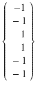
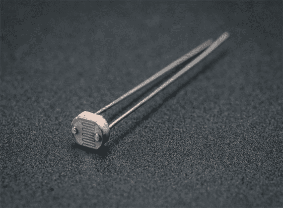

# 七、机器学习：人工神经网络

本章继续探讨机器学习，并重点关注人工神经网络(ANN)。我想再了解一下，有几次示威游行是受到伯特·范·丹的启发。

## 零件目录表

对于演示 7-1，您需要 Alfie 机器人汽车和附加部件，详见表 [7-1](#Tab1) 。

表 7-1。

Parts Lists

<colgroup><col> <col> <col></colgroup> 
| 描述 | 量 | 评论 |
| --- | --- | --- |
| 皮皮匠 | one | 40 引脚版本，可接受 T 型或 DIP 型 |
| 无焊试验板 | one | 700 个插入点，带 2 个电源板 |
| 跳线 | 1 包 |   |
| 超声波传感器 | Two | HC-SR04 标牌 |
| 4.9kω电阻 | Two | 1/4 瓦特 |
| 10kω电阻 | six | 1/4 瓦特 |
| MCP3008 | one | 8 通道 ADC 芯片 |
| 光电管 | one | 任何一种激光唱片 |

让我们从最简单的神经网络之一开始:Hopfield 网络。

## Hopfield 网络

Hopfield 网络是由 John Hopfield 在 1982 年推广的，当时他描述了一种 ANN，该 ANN 实现了一种非常类似于人的记忆功能的联想记忆模型。霍华德·s·史密斯的第一本书《机器人》(机器人二进制，2008 年)& Press 中讨论了 Hopfield 网络，这让它有点名气。(不要和艾萨克·阿西莫夫的《我，机器人》(Grosset & Dunlap，1950)混淆，后者是 2004 年威尔·史密斯同名电影的基础)。

在描述网络本身之前，我需要先描述一下 Hopfield 网络中使用的人工神经元。图 [7-1](#Fig1) 是这种人工神经元的模型。


图 7-1。

Neuron model

虽然图 [7-1](#Fig1) 中只显示了三个输入，但复杂网络中存在更多输入。无论有多少输入进入神经元，都只有一个输出。神经元处于一致或维持的状态，直到它被更新。神经元的状态是二进制的，值为 1 或–1(至少对于本书中使用的 Hopfield 网络是如此)。更新通过以下三个步骤完成。

1.  确定每个输入的值，并计算加权和。
2.  如果加权和输入等于或大于 0，则神经元输出被设置为 1；否则，它被设置为–1。
3.  神经元保留输出值，直到它被再次更新。

有两种更新神经元的方法，我将在下面介绍。理解更新方法并不重要，因为这是在网络初始化和实时操作的数学过程中完成的。

*   异步:选择特定的神经元并立即更新。这可以按照预选的顺序或随机进行。
*   同步:所有加权输入和都是在不更新神经元的情况下计算的。一旦完成，所有的神经元被更新。

既然我已经介绍了基本的人工神经元，是时候讨论 Hopfield 网络了。这种网络通常被描述为一种递归网络，其中输出值以无方向性的方式反馈到输入端。这些反馈回路对网络的学习能力有重要影响。下面的列表提供了一些重要的 Hopfield 网络属性。

*   由一组 N 个神经元或节点组成，从现在开始我称之为节点
*   所有节点互连的对称权重
*   没有节点直接连接回自身(即不允许自循环)
*   没有专门的输入或输出节点
*   每个节点只有一个二进制或双态输出
*   一个点火节点用一个正权重激活所有连接到它的节点
*   所有输入同时应用于所有节点，然后进行反馈
*   网络需要有限次迭代才能达到平衡或恒定状态

图 [7-2](#Fig2) 是我在下一系列演示中使用的六节点 Hopfield 网络图。


图 7-2。

Six-node Hopfield network

在本节开始时，我提到过 Hopfield 网络是基于联想记忆模型的。探索联想记忆模型，了解它的工作原理，肯定是有帮助的。检查图 [7-3](#Fig3) 。我确信你认出它是字母 s。


图 7-3。

Letter S

你认出它是因为 S 字母的形状从小就在你的记忆中根深蒂固。关于这种记忆回忆没有太多需要理解的，因为所有字母和数字的模式都深深地嵌入了我们的记忆中。但是，请查看图 [7-4](#Fig4) 并尝试确定它是什么。


图 7-4。

Distorted letter

我很确定大多数读者都能认出同一个字母 S，尽管超过 50%的正文已经被擦掉了。你的大脑和固有的记忆已经基本上填满了这些点，在你的脑海中形成这确实是 S 字母。十有八九，您没有将扭曲的图形识别为一个字母，而是将这些杂乱的点和黑点与字母 s“关联”在一起。这种存储在机器内存中的内容与呈现的现实之间的关联概念是以下演示中的一个要点。

就像你必须学会识别字母 S 一样，机器也必须学会识别事物。下面的 Hopfield 网络示例仅使用+1 和–1 作为输入符号。这些符号在现实世界中代表什么，在很大程度上与这个讨论无关。让我们从一个由值 1、–1、–1、–1、1 和 1 组成的六输入样本数据集开始。但是，为了数学上的精确，我将这个输入数据集表示为以下向量:


该向量必须转换成 6×6 矩阵，以表示由六节点 Hopfield 网络产生的所有节点互连。这很容易通过将输入数据向量本身相乘来实现。

![$$ \left\{\begin{array}{c}\hfill \kern0.75em 1\hfill \\ {}\hfill -1\hfill \\ {}\hfill -1\hfill \\ {}\hfill -1\hfill \\ {}\hfill \kern0.75em 1\hfill \\ {}\hfill \kern0.75em 1\hfill \end{array}\right\}*\kern0.5em \left\{\begin{array}{c}\hfill 1\hfill \\ {}\hfill -1\hfill \\ {}\hfill -1\hfill \\ {}\hfill -1\hfill \\ {}\hfill \kern0.75em 1\hfill \\ {}\hfill \kern0.75em 1\hfill \end{array}\right\}=\kern0.5em \left\{\left.\begin{array}{l}\kern0.5em 1\\ {}-1\\ {}-1\\ {}-1\\ {}\kern1em 1\\ {}\kern1em 1\end{array}\right|\left.\begin{array}{l}-1\\ {}\kern1em 1\\ {}\kern1em 1\\ {}\kern1em 1\\ {}-1\\ {}-1\end{array}\right|\left.\begin{array}{l}-1\\ {}\kern1em 1\\ {}\kern1em 1\\ {}\kern1em 1\\ {}-1\\ {}-1\end{array}\right|\left.\begin{array}{l}-1\\ {}\kern1em 1\\ {}\kern1em 1\\ {}\kern1em 1\\ {}-1\\ {}-1\end{array}\right|\left.\begin{array}{l}\kern1em 1\\ {}-1\\ {}-1\\ {}-1\\ {}\kern1em 1\\ {}\kern1em 1\end{array}\right|\begin{array}{c}\hfill \kern1em 1\hfill \\ {}\hfill \begin{array}{l}-1\\ {}-1\\ {}-1\\ {}\kern1em 1\\ {}\kern1em 1\end{array}\hfill \end{array}\right\} $$](img/A436848_1_En_7_Chapter_Equb.gif)T2】

表 [7-2](#Tab2) 显示了信息的完整向量乘法。

表 7-2。

Vector Multiplication

<colgroup><col> <col> <col> <col> <col> <col> <col></colgroup> 
|   | one | –1 | –1 | –1 | one | one |
| one | one | –1 | –1 | –1 | one | one |
| –1 | –1 | one | one | one | –1 | –1 |
| –1 | –1 | one | one | one | –1 | –1 |
| –1 | –1 | one | one | one | –1 | –1 |
| one | one | –1 | –1 | –1 | one | one |
| one | one | –1 | –1 | –1 | one | one |

幸运的是，Python numpy 库为所有未来的计算提供了优秀的矩阵运算，它完全自动化了所有这些繁琐且容易出错的手动计算。

现在，我们假设有另一组输入数据，用下面的向量表示:


将这个新向量乘以它自身得到这个:

![$$ \left\{\begin{array}{c}\hfill \kern0.75em 1\hfill \\ {}\hfill -1\hfill \\ {}\hfill \kern1em 1\hfill \\ {}\hfill -1\hfill \\ {}\hfill \kern0.75em 1\hfill \\ {}\hfill -1\hfill \end{array}\right\}*\kern0.5em \left\{\begin{array}{c}\hfill 1\hfill \\ {}\hfill -1\hfill \\ {}\hfill \kern1em 1\hfill \\ {}\hfill -1\hfill \\ {}\hfill \kern0.75em 1\hfill \\ {}\hfill -1\hfill \end{array}\right\}=\kern0.5em \left\{\left.\begin{array}{l}\kern0.5em 1\\ {}-1\\ {}\kern1em 1\\ {}-1\\ {}\kern1em 1\\ {}-1\end{array}\right|\left.\begin{array}{l}-1\\ {}\kern1em 1\\ {}-1\\ {}\kern1em 1\\ {}-1\\ {}\kern1em 1\end{array}\right|\left.\begin{array}{l}\kern1em 1\\ {}-1\\ {}\kern1em 1\\ {}-1\\ {}\kern1em 1\\ {}-1\end{array}\right|\left.\begin{array}{l}-1\\ {}\kern1em 1\\ {}-1\\ {}\kern1em 1\\ {}-1\\ {}\kern1em 1\end{array}\right|\left.\begin{array}{l}\kern1em 1\\ {}-1\\ {}\kern1em 1\\ {}-1\\ {}\kern1em 1\\ {}-1\end{array}\right|\begin{array}{c}\hfill -1\hfill \\ {}\hfill \begin{array}{l}\kern1em 1\\ {}-1\\ {}\kern1em 1\\ {}-1\\ {}\kern1em 1\end{array}\hfill \end{array}\right\} $$](img/A436848_1_En_7_Chapter_Equd.gif)

下一步是将两个 6×6 矩阵相加。这产生一个 6×6 矩阵，它“记住”两组输入数据向量。让我们称这个最终矩阵为加权矩阵，以符合图 [7-1](#Fig1) 所示的矩阵。【T2![$$ \left\{\left.\begin{array}{l}\kern1em 1\\ {}-1\\ {}-1\\ {}-1\\ {}\kern1em 1\\ {}\kern1em 1\end{array}\right|\left.\begin{array}{l}-1\\ {}\kern1em 1\\ {}\kern1em 1\\ {}\kern1em 1\\ {}-1\\ {}-1\end{array}\right|\left.\begin{array}{l}-1\\ {}\kern1em 1\\ {}\kern1em 1\\ {}\kern1em 1\\ {}-1\\ {}-1\end{array}\right|\left.\begin{array}{l}-1\\ {}\kern1em 1\\ {}\kern1em 1\\ {}\kern1em 1\\ {}-1\\ {}-1\end{array}\right|\left.\begin{array}{l}\kern1em 1\\ {}-1\\ {}-1\\ {}-1\\ {}\kern1em 1\\ {}\kern1em 1\end{array}\right|\begin{array}{c}\hfill \kern1em 1\hfill \\ {}\hfill \begin{array}{l}-1\\ {}-1\\ {}-1\\ {}\kern1em 1\\ {}\kern1em 1\end{array}\hfill \end{array}\right\}+\kern0.5em \left\{\left.\begin{array}{l}\kern0.5em 1\\ {}-1\\ {}\kern1em 1\\ {}-1\\ {}\kern1em 1\\ {}-1\end{array}\right|\left.\begin{array}{l}-1\\ {}\kern1em 1\\ {}-1\\ {}\kern1em 1\\ {}-1\\ {}\kern1em 1\end{array}\right|\left.\begin{array}{l}\kern1em 1\\ {}-1\\ {}\kern1em 1\\ {}-1\\ {}\kern1em 1\\ {}-1\end{array}\right|\left.\begin{array}{l}-1\\ {}\kern1em 1\\ {}-1\\ {}\kern1em 1\\ {}-1\\ {}\kern1em 1\end{array}\right|\left.\begin{array}{l}\kern1em 1\\ {}-1\\ {}\kern1em 1\\ {}-1\\ {}\kern1em 1\\ {}-1\end{array}\right|\begin{array}{c}\hfill -1\hfill \\ {}\hfill \begin{array}{l}\kern1em 1\\ {}-1\\ {}\kern1em 1\\ {}-1\\ {}\kern1em 1\end{array}\hfill \end{array}\right\}=\kern0.5em \left\{\left.\begin{array}{l}\kern0.5em 2\\ {}-2\\ {}\kern1em 0\\ {}-2\\ {}\kern1em 2\\ {}\kern1em 0\end{array}\right|\left.\begin{array}{l}-2\\ {}\kern1em 2\\ {}\kern1em 0\\ {}\kern1em 2\\ {}-2\\ {}\kern1em 0\end{array}\right|\left.\begin{array}{l}\kern1em 0\\ {}\kern1em 0\\ {}\kern1em 2\\ {}\kern1em 0\\ {}\kern1em 0\\ {}-2\end{array}\right|\left.\begin{array}{l}-2\\ {}\kern1em 2\\ {}\kern1em 0\\ {}\kern1em 2\\ {}-2\\ {}\kern1em 0\end{array}\right|\left.\begin{array}{l}\kern1em 2\\ {}-2\\ {}\kern1em 0\\ {}-2\\ {}\kern1em 2\\ {}\kern1em 0\end{array}\right|\begin{array}{c}\hfill \kern1em 0\hfill \\ {}\hfill \begin{array}{l}\kern1em 0\\ {}-2\\ {}\kern1em 0\\ {}\kern1em 0\\ {}\kern1em 2\end{array}\hfill \end{array}\right\} $$](img/A436848_1_En_7_Chapter_Eque.gif)

假设输入矩阵只包含 1，那么求和后的矩阵只能包含 2 或 0，这是事实。

为了证明加权矩阵实际上“记住”了输入数据集向量，我将第一个向量乘以加权矩阵，看看结果如何。

![$$ \left\{\begin{array}{c}\hfill \kern0.75em 1\hfill \\ {}\hfill -1\hfill \\ {}\hfill -1\hfill \\ {}\hfill -1\hfill \\ {}\hfill \kern0.75em 1\hfill \\ {}\hfill \kern0.75em 1\hfill \end{array}\right\}*\kern0.5em \left\{\left.\begin{array}{l}\kern0.5em 2\\ {}-2\\ {}\kern1em 0\\ {}-2\\ {}\kern1em 2\\ {}\kern1em 0\end{array}\right|\left.\begin{array}{l}-2\\ {}\kern1em 2\\ {}\kern1em 0\\ {}\kern1em 2\\ {}-2\\ {}\kern1em 0\end{array}\right|\left.\begin{array}{l}\kern1em 0\\ {}\kern1em 0\\ {}\kern1em 2\\ {}\kern1em 0\\ {}\kern1em 0\\ {}-2\end{array}\right|\left.\begin{array}{l}-2\\ {}\kern1em 2\\ {}\kern1em 0\\ {}\kern1em 2\\ {}-2\\ {}\kern1em 0\end{array}\right|\left.\begin{array}{l}\kern1em 2\\ {}-2\\ {}\kern1em 0\\ {}-2\\ {}\kern1em 2\\ {}\kern1em 0\end{array}\right|\begin{array}{c}\hfill \kern1em 0\hfill \\ {}\hfill \begin{array}{l}\kern1em 0\\ {}-2\\ {}\kern1em 0\\ {}\kern1em 0\\ {}\kern1em 2\end{array}\hfill \end{array}\right\}=\kern0.75em \left\{\begin{array}{c}\hfill 8\hfill \\ {}\hfill -8\hfill \\ {}\hfill -4\hfill \\ {}\hfill -8\hfill \\ {}\hfill \kern0.75em 8\hfill \\ {}\hfill \kern0.75em 4\hfill \end{array}\right\} $$](img/A436848_1_En_7_Chapter_Equf.gif)T2】

前面的矩阵乘法过程由六个单独的步骤组成，其中向量值乘以加权矩阵行中的每一行，并且所得的部分乘积被求和。例如，向量乘以加权矩阵中的第一行得出以下结果:

(1 * 2) + (–1 * –2) (–1 * 0) + (–1 * –2) + (1 * 2) + (1 * 0) = 8

接下来，必须对得到的向量进行归一化，以匹配输入数据的格式，输入数据只包含 1 或–1。规范化规则非常简单:

所有大于或等于 0 的值都更改为 1，而所有小于 0 的值都更改为–1。

需要注意的是，0 值的精确归一化并不是一门精确的科学。在某些网络中，将其归一化为 1 会提供更好的结果，而在其他网络中，将其归一化为–1 会更好。对于这个网络，我认为前者更合适，并能产生准确的结果。

将该规则应用于矢量合成产生如下:


您现在可以很容易地看到，归一化的结果向量与原始输入数据向量完全相同。您可以对第二个输入数据向量执行上述操作，它也返回那个向量，从而证明加权矩阵“记住”了存储在其中的初始数据。

此时，您可能认为这些操作很有趣，但是它们的实际价值是什么呢？这个霍普菲尔德网络怎么才能派上用场呢？要回答这些合理的问题，请考虑以下场景。

假设输入向量代表一些真实世界的东西，可能由一个或多个传感器生成，并且由于噪声或类似的干扰，结果向量被破坏或失真，非常类似于图 [7-4](#Fig4) 与图 [7-3](#Fig3) 的相似之处。假设新的输入数据向量如下，其中 0 表示没有数据:


接下来，将这个新向量乘以加权矩阵，看看会发生什么:

![$$ \left\{\begin{array}{c}\hfill \kern0.75em 0\hfill \\ {}\hfill \kern0.75em 0\hfill \\ {}\hfill \kern0.75em 0\hfill \\ {}\hfill -1\hfill \\ {}\hfill \kern0.75em 1\hfill \\ {}\hfill \kern0.75em 1\hfill \end{array}\right\}*\kern0.5em \left\{\left.\begin{array}{l}\kern0.5em 2\\ {}-2\\ {}\kern1em 0\\ {}-2\\ {}\kern1em 2\\ {}\kern1em 0\end{array}\right|\left.\begin{array}{l}-2\\ {}\kern1em 2\\ {}\kern1em 0\\ {}\kern1em 2\\ {}-2\\ {}\kern1em 0\end{array}\right|\left.\begin{array}{l}\kern1em 0\\ {}\kern1em 0\\ {}\kern1em 2\\ {}\kern1em 0\\ {}\kern1em 0\\ {}-2\end{array}\right|\left.\begin{array}{l}-2\\ {}\kern1em 2\\ {}\kern1em 0\\ {}\kern1em 2\\ {}-2\\ {}\kern1em 0\end{array}\right|\left.\begin{array}{l}\kern1em 2\\ {}-2\\ {}\kern1em 0\\ {}-2\\ {}\kern1em 2\\ {}\kern1em 0\end{array}\right|\begin{array}{c}\hfill \kern1em 0\hfill \\ {}\hfill \begin{array}{l}\kern1em 0\\ {}-2\\ {}\kern1em 0\\ {}\kern1em 0\\ {}\kern1em 2\end{array}\hfill \end{array}\right\}\kern0.5em =\kern0.75em \left\{\begin{array}{c}\hfill 4\hfill \\ {}\hfill -4\hfill \\ {}\hfill -2\hfill \\ {}\hfill -4\hfill \\ {}\hfill \kern0.75em 4\hfill \\ {}\hfill \kern0.75em 2\hfill \end{array}\right\}\mathrm{normalized}=\kern0.5em \left\{\begin{array}{c}\hfill \kern0.75em 1\hfill \\ {}\hfill -1\hfill \\ {}\hfill -1\hfill \\ {}\hfill -1\hfill \\ {}\hfill \kern0.75em 1\hfill \\ {}\hfill \kern0.75em 1\hfill \end{array}\right\} $$](img/A436848_1_En_7_Chapter_Equi.gif)

最终的归一化合成向量完全等于原始输入向量。Hopfield 网络将损坏的输入向量与其结构中存储的内容相关联，并返回与失真输入版本最相似的向量。这种情况非常类似于你如何从原件中识别出严重扭曲的信件。

下一个演示应该有助于进一步定义这个关联过程。

## 演示 7-1:数字识别演示

图 [7-5](#Fig5) 展示了一种仅使用六条直线段来表示十进制数 0 到 9 的独特方法。这个计划没有名字，因为它完全是我编造的。


图 7-5。

Six-segment numerical scheme

我很有信心，你可以很容易地识别图 [7-5](#Fig5) 中的大多数分段数字，没有问题。数字 4 和 5 是最难的，因为可用段的数量有限。

假设为每个数字创建了一个输入数据向量，其中 1 用于显示段，而–1 用于非显示段。例如，数字 0 和 1 将由这些向量表示:


接下来，需要使用表 [7-3](#Tab3) 中所示的所有十个输入数据向量创建一个 Hopfield 网络。

表 7-3。

Input Data Vectors for the Numerical Scheme

<colgroup><col> <col> <col> <col> <col> <col> <col></colgroup> 
| 数字 | Zero | one | Two | three | four | five |
| --- | --- | --- | --- | --- | --- | --- |
| Zero | –1 | –1 | –1 | one | one | one |
| one | –1 | –1 | one | one | –1 | –1 |
| Two | one | –1 | one | one | –1 | one |
| three | one | one | –1 | one | –1 | one |
| four | one | –1 | one | –1 | one | –1 |
| five | one | one | –1 | –1 | one | one |
| six | –1 | –1 | one | one | one | one |
| seven | one | –1 | one | one | –1 | –1 |
| eight | one | one | one | one | one | one |
| nine | one | one | one | one | –1 | –1 |

通过使用我前面提到的 Python numpy 矩阵库，我避免了许多手动计算。在接下来的讨论中，我使用点积向量来描述矩阵乘法的结果。我在下面的边栏中描述了点积和叉积，并解释了它们是如何应用于矩阵的。

Dot And Cross Products

点积也称为标量积，是两个矩阵或数组相乘的结果。成功操作的唯一要求是一个矩阵或数组中的行数必须与另一个矩阵或数组中的列数相匹配。以下简单的 Python 示例足以说明这是如何工作的:

```py
>>> import numpy as np
>>> x = np.array(((2,3), (3,5)))
>>> y = np,array(((1,2), (5,-1)))
>>> np.dot(x,y)
matrix([17,1],
       [28,1])
>>>

```

通过将数组转换成矩阵并使用乘法运算符(`*`)可以获得相同的结果。

```py
>>> np.mat(x) * np.mat(y)
matrix([17,1],
       [28,1])
>>>

```

对于前面的例子，当解释器确定两个矩阵要相乘时，Python 自动调用点积操作。

第二种类似矩阵的乘法涉及叉积。叉积定义为三维空间中两个向量的二元运算。合成矢量与两个输入矢量正交。

下一个例子应该可以澄清这个定义。假设创建了两个单位向量，如下所示:

```py
>>> y = np.array([0,1,0])
>>> z = np.array([0,0,1])
>>>

```

图 [7-6](#Fig6) 显示了这两个在 3D 空间中绘制的向量。


图 7-6。

y and z unit vectors

以下表达式计算 y 和 z 的叉积向量。

```py
>>> np.cross(y, z)
array([-1,0,0]
>>>

```

这个新矢量与 y 和 z 正交，因此，必须位于 x 轴上，如图 [7-7](#Fig7) 所示。


图 7-7。

Cross product resultant vector

numpy cross 函数中参数的顺序很重要。如果您要颠倒顺序，将会导致以下结果:

```py
>>> np.cross(z, y)
array([1,0,0]
>>>

```

它是相同的单位幅度矢量，但方向相反。我没有画这个，因为它很容易想象。我没有在任何演示中使用叉积，但我把它包括进来供您参考。

图 [7-8](#Fig8) 显示了一个 Python 交互式会话的开始和结束，其中我基于所有 10 个输入数据向量创建了 Hopfield 加权矩阵。


图 7-8。

Python session for creating the Hopfield weighting matrix

以下是最终的加权矩阵:

```py
array([[10,  4,  2,  0, -2,  0],
       [ 4, 10, -4, -2,  0,  2],
       [ 2, -4, 10,  4, -2, -4],
       [ 0, -2,  4, 10, -4,  2],
       [-2,  0, -2, -4, 10,  4],
       [ 0,  2, -4,  2,  4, 10]])

```

我将使用这个矩阵和一个稍微失真的数字，看看 Hopfield 网络是否能算出来。图 [7-9](#Fig9) 显示数字 8 缺少两段。


图 7-9。

Distorted figure 8

下面是这个扭曲图形对应的输入数据向量:


测试网络所需的全部工作就是将失真的输入向量乘以加权矩阵，并对得到的点积向量进行归一化。图 [7-10](#Fig10) 显示了交互会话，其中向量乘以加权矩阵，并显示结果点积向量。


图 7-10。

Interactive Python session to compute the distorted figure

下面显示了标准化向量。它与图 8 的输入数据向量完全匹配。

T2】

该测试再次表明，Hopfield 网络确实存储了数据，如果它是网络的一部分，则可以很容易地帮助识别未知或失真的输入数据集。我对有关 Hopfield 网络和字符或模式识别的文章做了一个简短而有限的回顾，我发现这种网络在从扭曲或复杂的输入向量中识别正确的字符方面通常有超过 90%的成功率。当然，这完全取决于输入数据的数量和质量以及网络中创建的节点数量。在我非常简单和有限的演示中，如果成功率远远超过 70%，我会感到非常惊讶，考虑到它的局限性和约束，这仍然是令人印象深刻的。

下一个演示极大地改变了我迄今为止使用纯计算方法所做的工作。它使用人工神经网络的一个更现实的应用。

## 演示 7-2:使用人工神经网络的自主机器人汽车

这个演示使用了 Alfie，这是上一章介绍的机器人汽车。在阿尔菲的最后一个项目中，它被编程为尽可能避开所有的墙和门，并且在行驶时尽可能地节省能量。这个项目的显著不同之处在于机器人汽车接近障碍物并试图绕过它们。我放弃了能量守恒方案，因为它对这个 ANN 演示不重要。然而，Alfie 配备了另一个超声波传感器，这应该有助于它检测和避免障碍。实现 Hopfield 网络来帮助机器人记住过去的动作，这将促进机器人在环境中的旅程中选择更好的动作和行为。

该网络使用五元素输入数据向量。以下是构成输入向量的元素:

*   左侧传感器
*   右侧传感器
*   两个传感器
*   左侧电机
*   右侧电机

这些元素是初始演示所需的全部内容，但是可以根据需要轻松添加更多元素。这五个要素意味着应该使用 5×5 Hopfield 网络来支持机器人小车控制系统。使用标称值 1 和–1，正如我在前面的例子中所做的那样。需要做的是将 1 或–1 的含义与每个元素联系起来。让我们从传感器开始。用 1 表示传感器没有检测到物体似乎非常合适；或者在“两个传感器”的情况下，每个传感器报告前方有障碍物。请注意，我还没有为超声波传感器定义阈值距离。那要晚一点。电机元件也很容易定义。1 表示电机正在运行，而-1 表示电机已经停止。这里也要注意，电机要么在运行，要么不运行；没有中间功率设置。那么下面的输入向量意味着什么呢？

T2】

传感器的全 1 表示没有检测到障碍物，马达的全 1 表示汽车一直向前行驶。这是一个非常简单和明确的规则，如果不是因为汽车应该学习而不是简单地遵循一套存储的规则，这将是合适的。汽车需要的是一种方法来学习什么是好的规则或行为，什么不是很好的规则。这种方法意味着汽车必须尝试不同的东西，并确定哪些是好的，应该记住，哪些是不好的，不应该保留。当然，什么是好或不太好是相当随意的，所以必须有一种方法来评估那些要保留和存储的行为，以及那些要丢弃的行为。

尝试不同的事情实际上意味着随机激活马达，这样就可以尝试新的路径，看看是否遇到障碍。唯一被禁止的运动是倒车，因为没有传感器朝向那个方向，也没有办法产生有效的输入数据向量。以下是唯一允许的动作:

*   向左转
*   向右转
*   直走
*   停止

由于实验的性质，停止选项在上次机器人演示中是不允许的。这一次，这是绝对允许的。事实上，机器人完全有可能最终学会最佳行为是停下来不动。转弯的方式也与上一次的示范有所不同。在之前的测试中，转向一侧的车轮停止转动，而另一个车轮继续转动。机器人基本上是在停止转动的轮子上转动的。这一次，当另一个车轮停止时，一侧的车轮被命令向相反方向转动。这个动作允许机器人在自己的半径范围内转弯。这就是通常所说的零半径转弯。不太准确，但你会认为实际转弯半径很小。

机器人学习过程的下一部分更加困难:区分好的行为或动作与不太好的行为。幸运的是，在我们成长的过程中，大多数人都有父母和老师在身边帮助我们完成这项重要的任务。不幸的是，对于机器人来说，没有人能帮助它完成这项重要的任务。它必须靠自己做到这一点。我们可以通过对机器人编程来帮助它接受“改善”其整体进展的动作。要接受的明显任务是那些不包括探测障碍物的行动。这种方法非常类似于在之前的机器人演示中调整适应值的方式。每当遇到墙或者门的时候，当时在玩的时候体能值就稍微下降。这一次，没有适合度值，只有将被存储或不被存储的输入数据向量。为了存储向量，重要的是机器人“相信”情况已经改善。下一次机器人遇到相同向量的情况时，它会回忆存储的内容并重复该动作。这种方法可能会导致机器人以完全不同于你预期的方式运行，但这没什么，因为它正在按照自己的方式“学习”。这就是机器人汽车真正自主的意义。此外，观察一个不可预测的机器人可能很有趣，只要它不追逐你的猫或打翻你昂贵的花瓶。

另一个需要回答的重要问题是机器人将如何识别新的情况。让我们假设机器人传感器没有检测到任何东西，我们也不知道如何操作马达。这与我在 Hopfield 网络讨论开始时讨论的失真输入向量非常相似。在这种情况下，输入的数据向量将如下:


您可能还记得，您需要将失真的输入向量乘以加权矩阵。所以，我们必须创建加权矩阵，在本例中是

![$$ \left\{\begin{array}{c}\hfill\ 1\hfill \\ {}\hfill\ 1\hfill \\ {}\hfill\ 1\hfill \\ {}\hfill\ 1\hfill \\ {}\hfill\ 1\hfill \end{array}\right\}\kern0.5em *\kern0.5em \left\{\begin{array}{c}\hfill\ 1\hfill \\ {}\hfill\ 1\hfill \\ {}\hfill\ 1\hfill \\ {}\hfill\ 1\hfill \\ {}\hfill\ 1\hfill \end{array}\right\}\kern0.5em =\kern0.5em \left\{\begin{array}{c}\hfill\ 1\ 1\ 1\ 1\ 1\hfill \\ {}\hfill\ 1\ 1\ 1\ 1\ 1\hfill \\ {}\hfill\ 1\ 1\ 1\ 1\ 1\hfill \\ {}\hfill\ 1\ 1\ 1\ 1\ 1\hfill \\ {}\hfill\ 1\ 1\ 1\ 1\ 1\hfill \end{array}\right\} $$](img/A436848_1_En_7_Chapter_Equo.gif)

因此，新向量乘以加权矩阵就是

![$$ \left\{\begin{array}{c}\hfill\ 1\hfill \\ {}\hfill\ 1\hfill \\ {}\hfill\ 1\hfill \\ {}\hfill\ 0\hfill \\ {}\hfill\ 0\hfill \end{array}\right\}\kern0.5em *\kern0.75em \left\{\begin{array}{c}\hfill\ 1\ 1\ 1\ 1\ 1\hfill \\ {}\hfill\ 1\ 1\ 1\ 1\ 1\hfill \\ {}\hfill\ 1\ 1\ 1\ 1\ 1\hfill \\ {}\hfill\ 1\ 1\ 1\ 1\ 1\hfill \\ {}\hfill\ 1\ 1\ 1\ 1\ 1\hfill \end{array}\right\}\kern0.5em = \left\{\begin{array}{c}\hfill\ 3\hfill \\ {}\hfill\ 3\hfill \\ {}\hfill\ 3\hfill \\ {}\hfill\ 3\hfill \\ {}\hfill\ 3\hfill \end{array}\right\}\kern0.5em \mathrm{normalized}\kern0.5em =\kern0.5em \left\{\begin{array}{c}\hfill\ 1\hfill \\ {}\hfill\ 1\hfill \\ {}\hfill\ 1\hfill \\ {}\hfill\ 1\hfill \\ {}\hfill\ 1\hfill \end{array}\right\} $$](img/A436848_1_En_7_Chapter_Equp.gif)

在讨论的这一点上，这个矢量结果不应该让你感到惊讶。网络将这个未知向量与它所知道的还包含没有检测到物体的传感器数据的向量相关联，例如


存储的动作是打开两个电机并向前直线行驶。这一结果导致以下结论:

如果已知数据是正确的，那么你应该假设未知数据也是正确的。

虽然这个结论看起来不错，而且有些深奥，但是如果存储的向量本身有错误，它也可能导致错误的动作。有一个错误的存储向量非常类似于有一个错误的记忆。那是你认为真实准确的任何记忆，但实际上，它并不代表真实的体验。随着年龄的增长，大多数人倾向于用虚假的记忆代替真实的记忆，这促使人们想起那些十有八九并不美好的“美好的旧时光”。

这个讨论的大部分是接下来开始的软件讨论的前奏。

## 演示 7-3:机器人避障车的 Python 控制脚本

名为 annRobot.py 的机器人汽车控制程序使用了为 robotRoulette.py 程序开发的类似结构。电机控制和超声波传感器模块是相同的。随机动作选择代码已经被修改，并且需要几个新的矩阵计算模块来支持 Hopfield 网络。新程序(这里显示的)很长，在新的部分或模块之前有大量注释。我选择了这种方法，而不是介绍每个新的部分或模块，讨论它，并在最后有一个最终的综合清单。请参考之前的讨论或机器人制造附录，了解已经介绍的模块的相关信息，如随机抽取或电机控制。

```py
import RPi.GPIO as GPIO
import time
from random import randint
import numpy as np

global pwmL, pwmR

threshold = 25.4

# use the BCM pin numbers
GPIO.setmode(GPIO.BCM)

# setup the motor control pins
GPIO.setup(18, GPIO.OUT)
GPIO.setup(19, GPIO.OUT)

pwmL = GPIO.PWM(18,20) # pin 18 is left wheel pwm
pwmR = GPIO.PWM(19,20) # pin 19 is right wheel pwm

# must 'start' the motors with 0 rotation speeds
pwmL.start(2.8)
pwmR.start(2.8)

# ultrasonic sensor pins
TRIG1 = 23 # an output
ECHO1 = 24 # an input
TRIG2 = 25 # an output
ECHO2 = 27 # an input

# set the output pins
GPIO.setup(TRIG1, GPIO.OUT)
GPIO.setup(TRIG2, GPIO.OUT)

# set the input pins
GPIO.setup(ECHO1, GPIO.IN)
GPIO.setup(ECHO2, GPIO.IN)

# initialize sensors
GPIO.output(TRIG1, GPIO.LOW)
GPIO.output(TRIG2, GPIO.LOW)
time.sleep(1)

# Create an initial weighting matrix named wtg
# based on all 1's in the input data vector
vInput = np.array([1,1,1,1,1])[:,None] # actually a [1,0] matrix
wtg = vInput.T*vInput # matrix multiplication yields a 5 x 5 matrix
                      # vInput.T is the transpose form (i.e. column)
                      # The square of new and successful input data
                      # vectors  be added to wtg matrix.

# robotAction module
def robotAction(select):
    global pwmL, pwmR
    if select == 0: # drive straight
        pwmL.ChangeDutyCycle(3.6)
        pwmR.ChangeDutyCycle(2.2)
    elif select == 1: # turn left
        pwmL.ChangeDutyCycle(2.2)
        pwmR.ChangeDutyCycle(2.8)
    elif select == 2: # turn right
        pwmL.ChangeDutyCycle(2.8)
        pwmR.ChangeDutyCycle(3.6)
    elif select == 3: # stop
        pwmL.ChangeDutyCycle(2.8)
        pwmR.ChangeDutyCycle(2.8)
# flag used to trigger a new draw
clockFlag = False

# forever loop
while True:

    if clockFlag == False:
        start = time.time()
        draw = randint(0,3) # generate a random draw
        if draw == 0:   # drive forward
            select = 0
            robotAction(select)
        elif draw == 1: # turn left
            select = 1
            robotAction(select)
        elif draw == 2: # turn right
            select = 2
            robotAction(select)
        elif draw == 3: # stop
            select = 3
            robotAction(select)
        clockFlag = True
        numHits = 0

    # sensor 1 reading
    GPIO.output(TRIG1, GPIO.HIGH)
    time.sleep(0.000010)
    GPIO.output(TRIG1, GPIO.LOW)

    # following code detects the time duration for the echo pulse
    while GPIO.input(ECHO1) == 0:
        pulse_start = time.time()

    while GPIO.input(ECHO1) == 1:
        pulse_end = time.time()

    pulse_duration = pulse_end - pulse_start

    # distance calculation
    distance1 = pulse_duration * 17150

    # round distance to two decimal points
    distance1 = round(distance1, 2)

    # check for distance and set v1 as appropriate
    if distance1 < threshold:
        # set v1 to -1 to signal obstacle detected
        v1 = -1
        numHits = numHits + 1
    else:
        v1 = 1 # no obstacle detected
    time.sleep(0.1) # ensure that sensor 1 is quiet

    # sensor 2 reading
    GPIO.output(TRIG2, GPIO.HIGH)
    time.sleep(0.000010)
    GPIO.output(TRIG2, GPIO.LOW)

    # following code detects the time duration for the echo pulse
    while GPIO.input(ECHO2) == 0:
        pulse_start = time.time()

    while GPIO.input(ECHO2) == 1:
        pulse_end = time.time()

    pulse_duration = pulse_end - pulse_start

    # distance calculation
    distance2 = pulse_duration * 17150

    # round distance to two decimal points
    distance2 = round(distance2, 2)

    # check for distance and set v2 as appropriate
    if distance2 < threshold:
        # set v2 to -1 to signal obstacle detected
        v2 = -1
        numHits = numHits + 1
    else:
        v2 = 1 # no obstacle detected

    time.sleep(0.1) # ensure that sensor 2 is quiet

    # check if both sensors detected an obstacle
    if  v1 == -1 and v2 == -1:
        v3 = -1 # set v3 to a -1
        numHits = numHits + 1
    else:
        v3 = 1  # set v3 to a 1 indicating that both sensors
                # have not detected an obstacle

    # Create a new input data vector reflecting the new situation
    vInput = np.array([v1, v2, v3, 0, 0])[:,None]

    # Dot product between the vector transpose and the wtg matrix
    testVector = np.dot(vInput.T,wtg)
    testVector = np.array(testVector).tolist()

    # normalize testVector
    tv = np.array([0,0,0,0,0])[:,None]
    for i in range(0,4):
        if testVector[0][i] >= 0:
            tv[i][0] = 1
        else:
            tv[i][0] = -1

    # check for a solution
    if(tv[0][0] != v1 or tv[1][0] != v2 or tv[2][0] != v3):
        print 'No solution found'

        # generate a random solution
        if randint(0,64) > 31:
            v4 = 1
        else:
            v4 = -1
        if randint(0,64) > 31:
            v5 = 1
        else:
            v5 = -1

        # select an action based on the random draws for v3 and v4
        if v4 ==1 and v5 == 1:
            select = 0
            robotAction(select)
        elif v4 == 1 and v5 == -1:
            select = 1
            robotAction(select)
        elif v4 == -1 and v5 == 1:
            select = 2
            robotAction(select)
        elif v4 == -1 and v5 == -1:
            select =3
            robotAction(select)

        earlyNumHits =  numHits
        numHits = 0 # reset to check if new solution is better

        # check if the new solution, if any, is better
        if  numHits < earlyNumHits or numHits == 0:
            # create the solution vector
            vInput = np.array([v1, v2, v3, v4, v5])[:,None]
            # multiply by itself
            VInputSq = vInput.T*vInput
            # Add it to the wtg matrix
            wtg = wtg + VInputSq
            # The wtg matrix now has the new solution stored in it

    current = time.time()

    # check to see if two seconds have elapsed
    if (current - start)*1000 > 2000:
        #this triggers a new draw at loop start
        clockFlag = False

```

### 试运转

该机器人由外部电池包供电，使其能够完全不受束缚地运行。我启动了一个 SSH 远程会话，如图 [7-11](#Fig11) 所示，以启动 annRobot 程序。


图 7-11。

SSH session

机器人的移动开始主要是转弯，偶尔是直线行驶。在操作的第一分钟内，当机器人遇到我放在操场上的障碍物或墙壁时，出现了两条“未找到解决方案”的消息。我判断整体动作有些混乱，这是意料之中的。大约 4 到 5 分钟后，机器人开始主要做圆周运动，偶尔做直线运动。显然，它知道这是避开障碍的最佳方案。它从未停止，即使那是选项之一。

下一个演示是对这个的修改。它增加了一个寻找目标的行为。

## 演示 7-4:寻光机器人

演示 7-3 中的自主机器人仅仅是在周围环境中行走时试图避开障碍物。这种新的冒险给了机器人更多的目的，试图前往一个目标，这将是一个明亮的光。除了前一个项目中使用的两个超声波传感器，我还将使用一个新的光传感器。Hopfield 网络将帮助引导机器人到达目的地。这意味着必须用适当的元素定义创建初始输入数据向量。以下矢量定义了该网络:

*   v1 -光传感器测量值(t <sub>0</sub>
*   v2 -光传感器测量值(t <sub>1</sub>
*   v3 -超声波传感器 1
*   v4 -超声波传感器 2
*   v5 -左侧电机
*   v6 -右侧电机

我使用 1 和–1 来表示每个向量元素的状态，如表 [7-4](#Tab4) 所示。

表 7-4。

Input Data Vector State Definitions

<colgroup><col> <col> <col></colgroup> 
| 向量元素 | 价值 | 状态描述 |
| --- | --- | --- |
| v1、v2 | one | 改变到更高的光强度 |
| v1、v2 | –1 | 相同或改变到较低的光强度 |
| v3，v4 | one | 未检测到对象 |
| v3，v4 | –1 | 检测到物体 |
| v5，v6 | one | 电机开启 |
| v5，v6 | –1 | 电机关闭 |

表 [7-5](#Tab5) 规定了机器人可能遇到的所有相关矢量状态。最多显示 36 种组合中的 10 种状态。我可以把所有的州都包括进来，但是这会使计算变得不必要的复杂，而且没有任何实际的好处。如果他们后来被认为是有益的，总是有可能回去添加组合。

表 7-5。

Relevant Vector States

<colgroup><col> <col> <col> <col> <col> <col> <col> <col> <col> <col> <col></colgroup> 
| 向量元素 | one |  2 | three | four | five | six | seven | eight | nine | Ten |
| --- | --- | --- | --- | --- | --- | --- | --- | --- | --- | --- |
| 第五颅神经的眼支 | one | –1 | one | –1 | one | –1 | one | one | one | one |
| v2 | –1 | one | –1 | one | –1 | one | one | one | one | one |
| v3 | –1 | –1 | one | one | –1 | –1 | –1 | –1 | one | one |
| v4 | –1 | –1 | –1 | –1 | one | one | –1 | one | –1 | one |
| v5 | one | –1 | one | one | –1 | –1 | one | –1 | one | –1 |
| v6 | one | one | –1 | –1 | one | one | one | one | –1 | –1 |

这是一个无用或“无关”向量的例子:



这个向量意味着光强度不变，没有检测到障碍物，并且两个电机都关闭。这个向量没有传达任何有用的信息来帮助推动机器人到达最终目的地；因此，不应将其纳入最终加权矩阵。

接下来的一系列步骤对表 [7-5](#Tab5) 中所示的每个矢量求平方，并将它们相加。所有步骤如图 [7-12](#Fig12) 所示。


图 7-12。

Calculations to create the weighting matrix

命名为`wtg`的最终加权矩阵如下:

```py
>>> wtg
array([[ 10,  -2,   0,   0,   2,   0],
       [ -2,  10,   0,   0,  -2,   0],
       [  0,   0,  10,  -2,   4, -10],
       [  0,   0,  -2,  10,  -8,   2],
       [  2,  -2,   4,  -8,  10,  -4],
       [  0,   0, -10,   2,  -4,  10]])

```

### 未知

自主机器人操作的一个真正问题是，它们会遇到你根本无法计划的情况。处理未知的问题是 Hopfield 网络优于拥有一系列内置规则或预编程例程来处理不同情况的主要原因。举例来说，假设机器人正在正常运行，突然遇到一个完全阻挡其路径的障碍物。由于未知原因，避障不起作用，机器人正在与障碍物搏斗。地板上可能有一个开口，驱动轮落入其中，从而停止了向前运动，但没有检测到任何障碍物。

理想的解决方案是在电机过热和/或完全耗尽电机电源之前停止电机。让我们讨论一下 Hopfield 网络解决方案。下面的输入数据向量描述了这种情况:


该向量描述了光强不变且没有障碍物报告的情况。电机虽然可能仍在运行，但不是已知输入向量的一部分，因此被赋值为 0。这个向量乘以 wtg 矩阵，得到最终的向量:


最终归一化合成向量中的电机值都是–1，这意味着它们应该关闭。对于这种不太可能且未知的场景，这正是正确的解决方案。恰当地处理未知正是 Hopfield 网络优于典型机器人控制程序的原因。

下一节将解释演示 7-4 的最终加权矩阵是如何形成的，以及它与更广泛的脑图概念的关系。

### 脑成像

Hopfield 网络和人脑之间有着惊人的相似之处。人脑中的某些区域负责特定的行为，如视觉、语言和运动。以松散相关的方式，加权矩阵元素的某些区域或集合可以与加权矩阵为机器人编码的特定行为、功能或感觉输入相关。图 [7-13](#Fig13) 显示了这些映射到加权矩阵上的区域。


图 7-13。

Weighting matrix with an overlay of functions and sensory inputs

这个叠加很有趣，但是以这种方式分割加权矩阵有什么实际用途呢？答案在于计算效率。在这次演示中，我将重点介绍与寻光物镜直接相关的电机控制功能。与处理完整的 36 元素矩阵相比，该方法仅涉及电机控制向量 v5 和 v6，并且仅具有八个元素乘法和求和。

此外，这是完全可能的目标和改变具体的矩阵值，以扩大或缩小感官效果或运动控制激活。如果你尝试这个过程，覆盖图提供了非常需要的信息。由此产生的矩阵可能会变得不稳定，甚至可能达不到平衡，正如我之前所讨论的。在任何情况下，只需运行该程序，即可轻松重建整个称重矩阵。

部分 Hopfield 网络的使用类似于经历中风的人脑可能发生的情况。大脑的某些区域被破坏，但随着时间的推移，患者能够通过治疗和康复恢复一些失去的功能，因为大脑网络的部分仍然是可行的，能够执行这些功能，即使大脑不像中风前那样完全“激活”。

在我讨论控制程序之前，先讨论用在改进的机器人小车上的光强传感器。

### 光强传感器

我用光电池测量光强。图 [7-14](#Fig14) 显示了一个典型的光电池，它在技术上被称为硫化镉(CdS)光敏电阻。



图 7-14。

Photo cell

光电池也被称为光敏电阻(LDR ),因为通过它的电流的电阻直接取决于照射到其活性表面的光的强度。还必须向光电池和外部电阻施加电压，以产生电流，并随后在光电池上产生压降。图 [7-15](#Fig15) 是安装在机器人小车上的光电池电路示意图。


图 7-15。

Photo cell schematic

MCP3008 ADC 测得的电压是 10K 欧姆串联电阻上的压降，该压降被另一个分压器减半，以便不超过 ADC 的最大输入电压限制 3.3V。当光电池完全点亮时，光电池电路的最大预期电压约为 2.2V。ADC 测得的绝对电压并不重要，因为只需要比较相对电压就可以判断机器人是靠近还是远离光源。只需确保所有测量电压都位于 ADC 中间范围附近，以避免饱和或截止。

我使用的 MCP3008 电路与第 [6](06.html) 章节能项目中使用的电路相同。这种情况下，ADC 测量的不是电机功率，而是与照亮光电池的光强相关的电压。提醒一下，MCP3008 使用 SPI 总线与 RasPi 通信。RasPi 启动时必须启用该总线，这可以通过使用第 [1](01.html) 章中讨论的 raspi-config 应用来实现。

图 [7-16](#Fig16) 显示了在以下演示中使用的完整机器人汽车的照片。


图 7-16。

Complete light seeker robot car

如果你仔细观察无焊试验板的左侧部分，你几乎看不到插入电路板的光电池。正如我在测试运行讨论中解释的那样，这不是一个最佳的位置。

硬件讨论到此结束。现在是讨论软件的时候了。

### 寻的机器人小车的 Python 控制脚本

我将这个控制程序命名为 lightSeeker.py，以反映机器人汽车行为的本质。它使用了 annRobot.py 代码的很大一部分，并添加了 MCP3008 接口代码，以及一个新的模块来处理光传感器。我已经删除了这个脚本中所有的随机绘制代码，因为这个机器人的主要目标是寻找光源，而不是避开障碍物。在这次演示之后，我将讨论当光搜索和避障都需要时，代码变化的含义。

下面的代码包含一些自由的注释，可以帮助您理解各个部分和模块中发生的事情。

```py
import RPi.GPIO as GPIO

import time

from random import randint

import numpy as np

# next two libraries must be installed IAW appendix instructions

import Adafruit_GPIO.SPI as SPI

import Adafruit_MCP3008

global pwmL, pwmR, mcp
lightOld = 0
hysteresis = 2

# Hardware SPI configuration:

SPI_PORT   = 0
SPI_DEVICE = 0
mcp = Adafruit_MCP3008.MCP3008(spi=SPI.SpiDev(SPI_PORT, SPI_DEVICE))

threshold = 25.4

# use the BCM pin numbers

GPIO.setmode(GPIO.BCM)

# setup the motor control pins

GPIO.setup(18, GPIO.OUT)
GPIO.setup(19, GPIO.OUT)

pwmL = GPIO.PWM(18,20) # pin 18 is left wheel pwm

pwmR = GPIO.PWM(19,20) # pin 19 is right wheel pwm

# must 'start' the motors with 0 rotation speeds

pwmL.start(2.8)
pwmR.start(2.8)

# ultrasonic sensor pins

TRIG1 = 23 # an output

ECHO1 = 24 # an input

TRIG2 = 25 # an output

ECHO2 = 27 # an input

# set the output pins

GPIO.setup(TRIG1, GPIO.OUT)
GPIO.setup(TRIG2, GPIO.OUT)

# set the input pins

GPIO.setup(ECHO1, GPIO.IN)
GPIO.setup(ECHO2, GPIO.IN)

# initialize sensors

GPIO.output(TRIG1, GPIO.LOW)
GPIO.output(TRIG2, GPIO.LOW)
time.sleep(1)

# The following matrix elements are all that are needed

# (and a bit more) to implement the motor control function.

# Read the brain mapping section to see why this is true.

m25 =   2
m26 =  -2
m27 =   4
m28 =  -8
m29 =  10
m30 =  -4
m31 =   0
m32 =   0
m33 = -10
m34 =   2
m35 =  -4
m36 =  10

# robotAction module

def robotAction(select):
    global pwmL, pwmR
    if select == 0: # drive straight

        pwmL.ChangeDutyCycle(3.6)
        pwmR.ChangeDutyCycle(2.2)
    elif select == 1: # turn left

        pwmL.ChangeDutyCycle(2.4)
        pwmR.ChangeDutyCycle(2.8)
    elif select == 2: # turn right

        pwmL.ChangeDutyCycle(2.8)
        pwmR.ChangeDutyCycle(3.4)
    elif select == 3: # stop

        pwmL.ChangeDutyCycle(2.8)
        pwmR.ChangeDutyCycle(2.8)

# forever loop

while True:
    # light sensor readings

    # acquire new reading

    lightNew = mcp.read_adc(0)
    v7 = 0
    # debug

    print 'lightNew = ',lightNew, ' lightOld = ',lightOld

    # determine if moving toward or away from light source

    if lightNew  > (lightOld+hysteresis):
        # moving toward the light source

        v1 = 1
        v2 = -1
    elif lightNew < (lightOld-hysteresis):
        # moving away from light source

        v1 = -1
        v2 = 1
    else:
        # must be stationary

        v1 = 1
        v2 = 1
        v7 = 1
    # save sensor reading

    lightOld = lightNew
    # sensor 1 reading

    GPIO.output(TRIG1, GPIO.HIGH)
    time.sleep(0.000010)
    GPIO.output(TRIG1, GPIO.LOW)

    # following code detects the time duration for the echo pulse

    while GPIO.input(ECHO1) == 0:
        pulse_start = time.time()

    while GPIO.input(ECHO1) == 1:
        pulse_end = time.time()

    pulse_duration = pulse_end - pulse_start

    # distance calculation

    distance1 = pulse_duration * 17150

    # round distance to two decimal points

    distance1 = round(distance1, 2)

    # check for distance and set v3 as appropriate

    if distance1 < threshold:
        # set v3 to -1 to signal obstacle detected

        v3 = -1
    else:
        v3 = 1 # no obstacle detected

    time.sleep(0.1) # ensure that sensor 1 is quiet

    # sensor 2 reading

    GPIO.output(TRIG2, GPIO.HIGH)
    time.sleep(0.000010)
    GPIO.output(TRIG2, GPIO.LOW)

    # following code detects the time duration for the echo pulse

    while GPIO.input(ECHO2) == 0:
        pulse_start = time.time()

    while GPIO.input(ECHO2) == 1:
        pulse_end = time.time()

    pulse_duration = pulse_end - pulse_start

    # distance calculation

    distance2 = pulse_duration * 17150

    # round distance to two decimal points

    distance2 = round(distance2, 2)

    # check for distance and set v4 as appropriate

    if distance2 < threshold:
        # set v4 to -1 to signal obstacle detected

        v4 = -1
    else:
        v4 = 1 # no obstacle detected

    time.sleep(0.1) # ensure that sensor 2 is quiet

    # calculate v5 and v6

    v5 = m25*v1 + m26*v2 + m27*v3 + m28*v4 # not using m29 and m30

    v6 = m31*v1 + m32*v2 + m33*v3 + m34*v4 # not using m35 and m36

    # normalize v5 and v6

    if v5 >= 0:
        v5 = 1
    else:
        v5 = -1
    if v6 >  0:
        v6 = 1
    else:
        v6 = -1

    # motor control actions based on the new computed vector elements

    if v7 == 1:
        # stop, light is unchanged

        select = 3
        robotAction(select)
        # debug

        print 'stopped'

        exit()
    elif v5 == 1 and v6 == -1:
        # drive straight ahead

        select = 0
        robotAction(select)
        # debug

        print 'driving straight ahead'

    elif v5 == -1 and v6 == -1:
        # randomly select turning left or right

        turnRnd = randint(0,1)
        if turnRnd == 0:
            # turn left

            select = 1
            robotAction(select)
            # debug

            print 'turning left'

        else:
            # turn right

            select = 2
            robotAction(select)
            # debug

            print 'turning right'

    # pause for a 2 seconds

    time.sleep(2)
(End list)

```

### 试运转

我在我运行所有早期演示的同一个内部走廊中进行了测试运行。走廊上没有窗户，所有相邻的门都关着。我在地板上放了一盏明亮的可调节日光灯作为光源。机器人汽车被放置在离灯大约四英尺远的地方，并指向灯的方向。我从我的 MacBook Pro 笔记本电脑上使用 SSH 会话启动了测试运行。图 [7-17](#Fig17) 显示了整个 SSH 会话，仅持续了大约 10 秒钟，机器人面对着离灯大约两英尺远的墙壁。


图 7-17。

SSH session

我没有考虑走廊的墙壁，它们被漆成非常反光的白色；因此，光传感器立即检测到这一点，机器人开到墙上。当它接触到墙壁时，光强显然没有变化，这是机器人感应到的，它立即停止了——正如它被编程所做的那样。这个动作让我看到程序运行正常，但是光传感器检测环境光而不是光源的方式有问题。屏蔽光传感器不会有太大帮助，因为它仍然可能检测到来自墙壁的反射光，而不是光源本身。这是因为环境中存在的反射光比光源直接发出的光多。解决这一困境的唯一办法是将走廊墙壁涂成黑色，这是我妻子不同意的，或者在除了光源之外没有任何环境光的地方进行测试。我晚上在我的车库里做了后者。空间足够大，使得从墙壁反射的光线相对于来自灯的强光而言大大减弱。机器人直接开到灯前，然后像预期的那样停了下来。这一行动证实了该计划正在按预期运行。

在下一节课中，我将讨论如果同时尝试避障和寻光会出现的问题。

### 避障和寻光

同时避障和寻光是一个很难解决的问题。正如你可能意识到的，在尝试寻光功能时，我没有在机器人的路径上放置任何障碍物。乍一看，这两个功能似乎是直接对立的，因为避障脚本导致机器人采取随机行动来清除障碍，而寻光功能则倾向于驱动机器人靠近光源。我承认我在光探索者脚本中随机选择了左转或右转，但目的是安排机器人直行到达光源。那么，如何解决这些相互冲突的优先级呢？

一种方法是，如果检测到障碍物，简单地暂停寻光功能。如果有障碍物挡住了道路，试图直接开到光源处是没有意义的。在这种情况下，让机器人按照 Hopfield 网络命令采取随机行动，并尝试以某种方式清除障碍。一旦清理完毕，继续寻光。这可能不是寻找光的最有效的方法，但可能会成功。

另一种方法是基于光传感器测量和超声波测量来生成指示机器人采取期望动作的附加向量集。这些额外的向量无疑增加了加权矩阵的大小，以考虑所有的传感器值组合。例如，对于从高到低变化的光和右边报告的障碍物，必须有一个新的矢量元素。另一种情况可能是光线保持不变，但两个传感器都报告机器人正前方有障碍物。这将导致机器人停止使用纯粹的寻光脚本，但这不是你想要的。我想你已经知道如果采用这种方法，复杂性将会快速增长。只要记住，霍普菲尔德网络不是魔术；它需要在其中存储所需的向量，以获得良好的结果。

事实证明，Hopfield 网络可能不是这种避障和寻目标场景的最佳解决方案。还有其他 AI 解决方案可以考虑；例如，包容架构，其中优先级被分配给不同的行为，这将在第 [11](11.html) 章中讨论。避障行为将被赋予比寻光行为更高的优先级，并且机器人将在继续其寻光行为之前清除任何障碍。

## 摘要

这是探索机器学习系列的第二章。在这一章中，我重点介绍了 Hopfield 网络，它是人工神经网络(ANN)的最简单形式之一。讨论从解释 Hopfield 网络中使用的人工神经元模型开始。然后，我继续创建一个示例网络，使用数字矩阵来表示网络。

Hopfield 网络的关键属性是它充当联想记忆，类似于人脑的功能。网络存储器由一个加权矩阵组成，该矩阵由代表感觉输入和运动控制动作的数据向量组成。

第一次演示使用了上一章介绍的同一辆机器人汽车。演示的目的是展示汽车如何通过一个有障碍物的区域。我展示了 Python 程序脚本如何创建和更新 Hopfield 网络，该网络“学习”检测和避开障碍物的适当方法。脚本中使用了 numpy 库矩阵函数，以简化计算并提高程序效率。

第二个演示采用了不同的方法，通过使用部分 Hopfield 网络加权矩阵来控制目标搜索实验中的机器人。目标是使用光电池作为主要传感器，移动到光源处。超声波传感器被激活，但不是必需的，因为在机器人的路径上没有放置障碍物。我成功地证明了在这种情况下，即使是部分 Hopfield 网络也可以控制机器人。