# 八、机器学习：深度学习

这是机器学习系列的第三章。重点是广义人工神经网络(ann)。涵盖这个主题需要广泛的背景讨论，包含大量的数学知识，所以要预先警告。Raspberry Pi 上的 Python 实现也需要大量讨论。我尽最大努力保持它的趣味性和针对性。

让我们首先简要回顾一些基础知识，然后继续使用 Python 和从 numpy 库导入的矩阵算法对一个更大的三层九节点 ANN 进行一些计算。您还将查看一些传播示例，然后讨论梯度下降(GD)。

本章后面将提供两个演示。第一个向您展示了如何创建一个未经训练的人工神经网络。第二个演示向您展示了如何训练人工神经网络来生成有用的结果。第 [9](09.html) 章展示了使用本章所述技术的几个实际人工神经网络演示。有太多的人工神经网络内容要在一个章节中介绍。

当你完成这一章时，你将获得大量关于如何创建一个有用的人工神经网络的理论和实践知识。

## 广义人工神经网络

在这本书的这一点上，我已经谈到了相当多的关于 ANN 的主题，但是还有相当多的内容需要讨论。在本书的这个阶段，你应该清楚的是，人工神经网络是人脑中许多神经元及其互连的数学表示或模型。第 [2](02.html) 章讨论了人工神经网络的基础知识。在第 7 章[中，我向你介绍了一个专门的人工神经网络，它非常适合一个相当简单的机器人应用。然而，人工神经网络的领域是相当广泛的，仍然有很多要涵盖。](07.html)

在这一章的标题中，我使用了深度学习这个短语，我在第 [2](02.html) 章中也简单提到过。深度学习通常被人工智能从业者用来指多层人工神经网络，这些人工神经网络能够通过对其应用重复的训练数据集来进行学习。图 [8-1](#Fig1) 显示了一个三层人工神经网络。

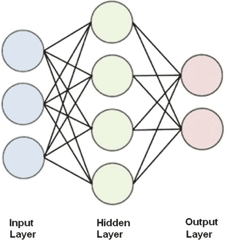

图 8-1。

Three-layer ANN

下面解释图 [8-1](#Fig1) 所示的层。

*   输入:输入应用于该层。
*   隐藏:隐藏所有未分类为输入或输出的图层。
*   输出:输出出现在这一层。

所有的神经元或节点一层一层地互相连接。这意味着输入层连接到第一个隐藏层中的所有节点。同样，最后一个隐藏层中的所有节点都连接到输出节点。

我还将这种网络结构称为广义人工神经网络，以区别于 Hopfield 网络，Hopfield 网络是一般网络的特例。Hopfield 网络仅由一个层组成，其中所有节点既作为输入又作为输出，并且没有隐藏层。从这一点开始，当我谈到 ANN 时，我指的是具有多个层的通用类型。

人工神经网络有两大类:

*   前馈:数据流是单向的。节点从一层向下一层发送数据。
*   反馈:使用反馈回路，数据是双向的。

图 [8-2](#Fig2) 显示了这两种人工神经网络类型的模型。

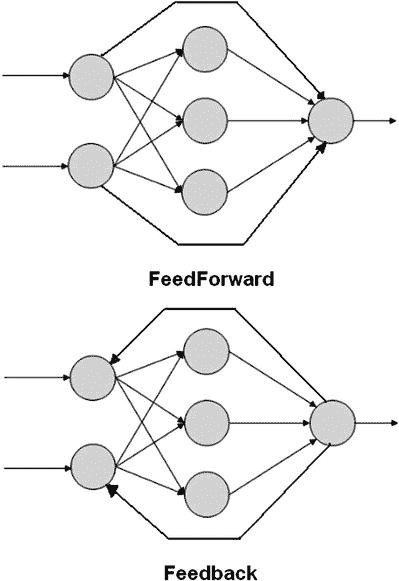

图 8-2。

FeedForward and Feedback ANN models

人工神经网络的输入只是在网络中传播的数字模式，其中每个节点对输入求和，如果和超过阈值，则导致该节点触发并向下一个连接的节点输出数字。节点之间的连接强度被称为权重，正如我之前在 Hopfield 网络中所描述的。确定权重值是人工神经网络学习的关键因素。当许多训练数据集应用于网络时，通常会发生 ANN 学习。这些训练数据集包含输入和输出数据。输入数据创建输出数据，然后将输出数据与真实输出数据进行比较，当值不一致时会创建错误结果。该误差数据随后通过 ANN 反馈，并且根据预编程的学习算法以增量方式调整权重。经过许多训练周期，通常是数千个周期，人工神经网络被训练来计算给定输入的期望输出。这种学习技术被称为反向传播。

图 [8-3](#Fig3) 显示了一个三层人工神经网络，所有相关权重与节点相互连接。权重用 w <sub>i，j</sub> 符号表示，其中 I 是源节点，j 是接收或目的节点。权重越大，源节点对目的节点的影响越大。当然，反过来也是如此。

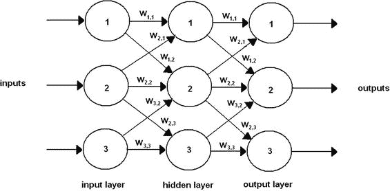

图 8-3。

Three-layer ANN with weights

如果你仔细观察图 8-3，你会发现并不是所有的层到层节点都是相互连接的。例如，输入层节点 1 与隐藏层节点 3 没有任何联系。如果确定网络不能被充分训练，这可以被补救。使用矩阵运算很容易添加更多的节点到节点的连接，您很快就会看到这一点。添加更多的连接并不会造成真正的伤害，因为连接权重是可以调整的。网络被训练到不必要的连接被赋予 0 加权值的程度，这有效地将它们从网络中移除。

在这一点上，通过一个简化的人工神经网络实际跟踪一条信号路径是很有用的，这样你就可以很好地理解这类网络的内部工作原理。我在这个例子中使用了一个非常简单的两层四节点网络，因为它足以满足这个目的。图 [8-4](#Fig4) 显示了这个网络，它只由一个输入层和一个输出层组成。这种人工神经网络不需要隐藏层。

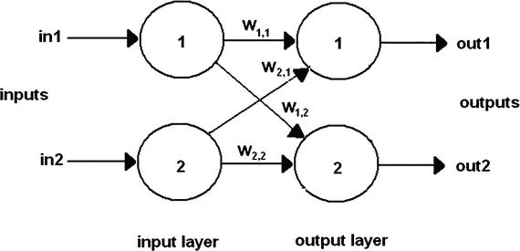

图 8-4。

Two-layer ANN

现在，让我们给图 [8-4](#Fig4) 中所示的输入和权重分配以下值，如表 [8-1](#Tab1) 中所列。

表 8-1。

Input and Weight Values for Example ANN

<colgroup><col> <col></colgroup> 
| 标志 | 价值 |
| --- | --- |
| in1 | Zero point eight |
| in2 | Zero point four |
| w <sub>1，1</sub> | Zero point eight |
| w <sub>1，2</sub> | Zero point one |
| w <sub>2，2</sub> | Zero point four |
| w <sub>2，1</sub> | Zero point nine |

这些值是随机选择的，不代表也不模拟任何物理情况。通常情况下，权重是随机分配的，目的是更容易促进快速收敛到最优的、训练有素的解决方案。由于涉及的输入和权重如此之少，我不认为省略具有这些真实值的图表是一个问题。如果有助于理解下面的步骤，您可以很容易地用这些值画出一个图表。

我从第 2 层的节点 1 开始计算，因为在数据输入和输入节点之间没有发生任何修改。输入节点的存在是为了方便网络计算。输入图层节点没有直接对数据输入集应用权重。回想一下第 [2](02.html) 章，该节点对来自其所有互连节点的所有加权输入进行求和。在这种情况下，第 2 层中的节点 1 具有来自第 1 层中两个节点的输入。因此，加权和为

w <sub>1，1</sub> * in1 + w <sub>2，1</sub>* in2 = 0.8 * 0.8+0.9 * 0.4 = 0.64+0.36 = 1.00

接下来让我们假设激活函数是标准的 sigmoid 表达式，我也在第 [2](02.html) 章中描述过。sigmoid 方程为:

其中 e =数学常数 2.71828…

当 x = 1.0 时，该等式变为:

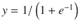 = 1/(1.3679) = 0.7310 或 out1 = 0.7310

对第 2 层中的另一个节点重复上述步骤，结果如下:

w <sub>2，2</sub> * in2 + w <sub>1，2</sub>* in1 = 0.4 * 0.4+0.1 * 0.8 = 0.16+0.08 = 0.24

假设 x = 0.24，则得出:

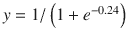 = 1/(1.7866) = 0.5597 或 out2 = 0.5597

现在已经为特定的输入数据集确定了两个人工神经网络输出。对于这个极其简单的两层四节点人工神经网络来说，这是一个相当大的手工计算量。我相信您可以很容易地看到，在更大的网络上手动执行这些计算而不产生错误几乎是不可能的。这就是计算机擅长对多层的大型人工神经网络进行这些繁琐的计算而不出错的地方。我在上一章做 Hopfield 网络乘法和点积时使用了 numpy 矩阵。类似的矩阵运算也适用于这个网络。这个例子的输入向量只有两个值:in1 和 in2。它们以矢量格式表示为

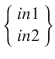

同样，下面是加权矩阵:

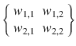

图 [8-5](#Fig5) 显示了这些矩阵运算在交互式 Python 会话中的应用。请注意，只需几条语句就可以得出与手动计算完全相同的结果。

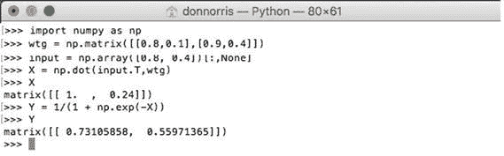

图 8-5。

Interactive Python session

下一个例子涉及一个完全由 Python 脚本处理的更大的 ANN。

### 大型人工神经网络

这个例子包括一个三层 ANN，每层有三个节点。人工神经网络模型如图 [8-6](#Fig6) 所示，带有一个输入数据集和一部分权重值，以避免混淆图表。

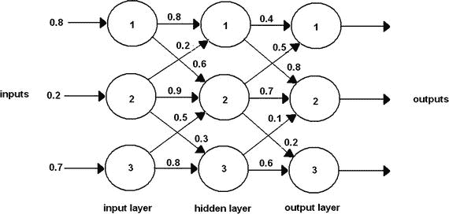

图 8-6。

Larger ANN

让我们从输入数据集开始，因为这很简单。这以矢量格式显示如下:

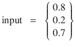

在这个例子中有两个加权矩阵。一个用于表示输入层(wtg <sub>ih</sub> )和隐藏层之间的权重，另一个用于表示隐藏层和输出层(wtg <sub>ho</sub> )之间的权重。权重是随机分配的，就像前面的例子一样。![$$ {\mathrm{wtg}}_{\mathrm{ih}}=\left\{\begin{array}{ccc}\hfill {w}_{1,1}\hfill & \hfill {w}_{1,2}\hfill & \hfill {w}_{1,3}\hfill \\ {}\hfill {w}_{2,1}\hfill & \hfill {w}_{2,2}\hfill & \hfill {w}_{2,3}\hfill \\ {}\hfill {w}_{3,1}\hfill & \hfill {w}_{3,2}\hfill & \hfill {w}_{3,3}\hfill \end{array}\right\}=\left\{\begin{array}{ccc}\hfill 0.8\hfill & \hfill 0.6\hfill & \hfill 0.3\hfill \\ {}\hfill 0.2\hfill & \hfill 0.9\hfill & \hfill 0.3\hfill \\ {}\hfill 0.2\hfill & \hfill 0.5\hfill & \hfill 0.8\hfill \end{array}\right\} $$](img/A436848_1_En_8_Chapter_Equd.gif)

![$$ {\mathrm{wtg}}_{\mathrm{ho}}=\left\{\begin{array}{ccc}\hfill {w}_{1,1}\hfill & \hfill {w}_{1,2}\hfill & \hfill {w}_{1,3}\hfill \\ {}\hfill {w}_{2,1}\hfill & \hfill {w}_{2,2}\hfill & \hfill {w}_{2,3}\hfill \\ {}\hfill {w}_{3,1}\hfill & \hfill {w}_{3,2}\hfill & \hfill {w}_{3,3}\hfill \end{array}\right\}=\left\{\begin{array}{ccc}\hfill 0.4\hfill & \hfill 0.8\hfill & \hfill 0.4\hfill \\ {}\hfill 0.5\hfill & \hfill 0.7\hfill & \hfill 0.2\hfill \\ {}\hfill 0.9\hfill & \hfill 0.1\hfill & \hfill 0.6\hfill \end{array}\right\} $$](img/A436848_1_En_8_Chapter_Eque.gif)

图 [8-7](#Fig7) 显示了隐藏层输入的矩阵乘法。结果矩阵在屏幕截图中显示为 X1。

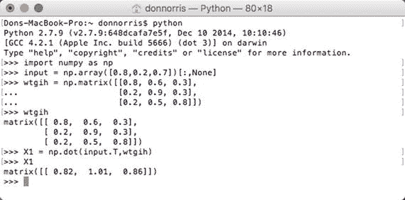

图 8-7。

First matrix multiplication

必须将 sigmoid 激活函数应用于该结果。我调用了转换后的矩阵 O1 来表示它是从隐藏层到真实输出层的输出。得到的 O1 矩阵是:

```py
matrix([[ 0.69423634,  0.73302015,  0.70266065]])

```

这些是乘以加权矩阵 wtg <sub>ho</sub> 的值。图 [8-8](#Fig8) 显示了这种乘法。我称这个合成矩阵为 X2，以区别于第一个。最终的 sigmoid 计算也显示在截图中，我将其命名为 O2。

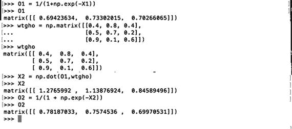

图 8-8。

Second matrix multiplication

矩阵 O2 也是人工神经网络的最终输出，即

```py
matrix([[ 0.78187033,  0.7574536,  0.69970531]])

```

这个输出应该反映输入，所以让我们比较两者，并计算两者之间的误差或差异。所有这些都显示在表 [8-2](#Tab2) 中。

表 8-2。

Comparison of ANN Outputs with the Inputs

<colgroup><col> <col> <col></colgroup> 
| 投入 | 输出 | 错误 |
| --- | --- | --- |
| Zero point eight | 0.78187033 | 0.01812967 |
| Zero point two | 0.7574536 | -0.5574536 |
| Zero point seven | 0.69970531 | 0.00029469 |

结果实际上非常显著，因为三个输出中的两个非常接近各自的输入值。然而，中间值相差甚远，这表明至少某些人工神经网络权重必须修改。但是，你是怎么做到的呢？

在我向您展示如何做到这一点之前，请考虑图 [8-9](#Fig9) 中所示的情况。

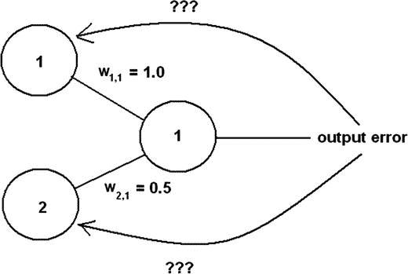

图 8-9。

Error allocation problem

图 [8-9](#Fig9) 中，两个节点连接一个输出节点，有一个误差值。如何将误差反映回互连节点的权重？在一种情况下，您可以在输入节点之间平均分配误差。然而，这不会准确地表示来自输入节点的真实误差贡献，因为节点 1 的权重或影响是节点 2 的两倍。片刻思考应该会引导您找到正确的解决方案，即误差应该与连接节点的权重值成正比。在图 [8-9](#Fig9) 所示的两个输入节点的情况下，节点 1 应承担三分之二的误差，而节点 2 应承担三分之一的误差，这正好是它们各自的权重与应用于输出节点的总和的比值。

以这种方式使用权重是加权矩阵的附加特征。通常，权重应用于通过人工神经网络正向传播的信号。然而，这种方法使用带有误差值的权重，然后误差值反向传播。这就是误差确定也被称为反向传播的原因。

接下来考虑如果在多个输出节点出现错误会发生什么，这很可能是大多数初始人工神经网络启动的情况。图 [8-10](#Fig10) 显示了这种情况。

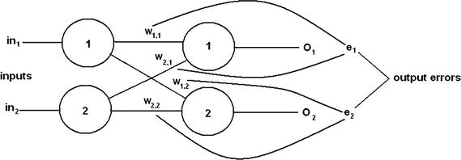

图 8-10。

Error allocation problem for multiple output nodes

事实证明，多个节点的过程与单个节点的过程是相同的。这是因为输出节点彼此独立，没有互连链路。如果这不是真的，将很难从互连的输出节点反向传播。

分配误差的公式也很简单。它只是基于连接到输出节点的权重的一个分数。例如，为了确定图 [8-10](#Fig10) 中 e <sub>1</sub> 的修正，应用于 w <sub>1，1</sub> 和 w <sub>2，1</sub> 的分数如下:

*   w <sub>1，1</sub> /( w <sub>1，1</sub> + w <sub>2，1</sub> )和 w <sub>2，1</sub> /( w <sub>1，1</sub> + w <sub>2，1</sub>

同样，以下是 e <sub>2</sub> 的误差。

*   w <sub>1，2</sub> /( w <sub>1，2</sub> + w <sub>2，2</sub> )和 w <sub>2，2</sub> /( w <sub>1，2</sub> + w <sub>2，2</sub> )

到目前为止，根据输出误差调整权重的过程非常简单。这些错误很容易确定，因为训练数据提供了正确的答案。对于两层人工神经网络，这就是所需要的。但是，如何处理一个三层人工神经网络，其中在隐藏层输出中肯定有错误，但是没有可用的训练数据来确定错误值？

### 三层人工神经网络中的反向传播

图 [8-11](#Fig11) 显示了一个三层六节点人工神经网络，每层有两个节点。我故意简化了这个人工神经网络，这样就可以相对容易地专注于网络所需的有限反向传播。

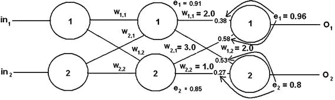

图 8-11。

Three-layer, six-node ANN with error values

在图 [8-11](#Fig11) 中，您应该能够看到为该示例任意创建的输出误差值。隐藏层的节点 1 和 2 的单个误差贡献显示在每个输出节点的输入端。这些标准化值计算如下:

*   e<sub>1 输出 1</sub> * w <sub>1，1</sub> /(w <sub>1，1</sub> + w <sub>2，1</sub>)= 0.96 * 2/(2+3)= 0.96 * 0.4 = 0.38
*   e<sub>1 输出 2</sub> * w <sub>2，1</sub> /(w <sub>1，1</sub> + w <sub>2，1</sub>)= 0.96 * 3/(2+3)= 0.96 * 0.6 = 0.58
*   e <sub>2output1</sub> * w <sub>1，2</sub> /(w <sub>1，2</sub> + w <sub>2，2</sub>)= 0.8 * 2/(2+1)= 0.8 * 0.66 = 0.53
*   e <sub>2output2</sub> * w <sub>2，2</sub> /(w <sub>1，2</sub> + w <sub>2，2</sub>)= 0.8 * 1/(2+1)= 0.8 * 0.33 = 0.27

每个隐藏节点的总归一化误差值是给定输出节点的单个误差贡献的总和，计算如下:

*   e<sub>1</sub>= e<sub>1 输出 1</sub>+e<sub>2 输出 1</sub> = 0.38 + 0.53 = 0.91
*   e<sub>2</sub>= e<sub>1 输出 2</sub>+e<sub>2 输出 2</sub> = 0.58 + 0.27 = 0.85

这些值显示在图 [8-11](#Fig11) 中每个隐藏节点的旁边。

可以根据需要继续前述过程，以计算任何剩余隐藏层的所有组合误差值。不需要计算输入层的误差值，因为所有输入节点的误差值都必须为 0，因为它们只是传递输入值而不做任何修改。

计算隐藏层误差输出的上述过程非常繁琐，因为它是手动完成的。如果能像前馈计算那样用矩阵自动完成，那就更好了。如果从手动方法一对一地翻译矩阵，将会产生以下结果:


不幸的是，没有合理的方法来输入前面矩阵中显示的分数。但是如果你想一想分数实际上做了什么，所有的希望并没有消失。它们将节点的误差贡献归一化，这意味着分数转换为 0 到 1.0 之间的数字。相对误差贡献也可以通过简单地使用权重分子并去掉分母来表示为未规格化的数字。该结果仍然是可接受的，因为计算在权重更新中有用的组合误差值确实是唯一重要的。我将在下一节介绍这一点。

去除所有分数的分母得到


使用 numpy 的矩阵运算可以很容易地处理前面的矩阵。唯一的问题是矩阵的转置必须在乘法中使用，这也不是问题。图 [8-12](#Fig12) 显示了该误差反向传播示例的实际矩阵运算。

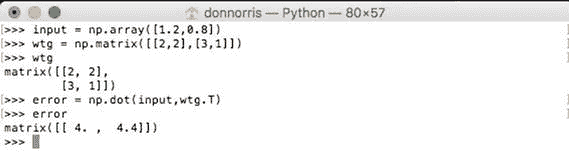

图 8-12。

Hidden layer error matrix multiplication

现在是讨论一旦确定了误差，如何更新加权矩阵值的时候了。

### 更新加权矩阵

更新加权矩阵是人工神经网络学习过程的核心。这个矩阵的质量决定了人工神经网络在解决特定人工智能问题时的效率。然而，在给定输入和权重的情况下，试图从数学上确定节点的输出存在一个非常重要的问题。考虑以下等式，其适用于三层、九节点的 ANN，该 ANN 确定在特定输出节点出现的值:

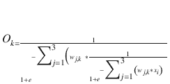

O <sub>k</sub> 是第 k <sub>个</sub>节点处的输出。

w <sub>j，k</sub> 是输入层和所选输出节点之间的所有互连权重。

x <sub>i</sub> 为输入值。

这当然是一个令人生畏的方程，尽管它只涉及一个相对简单的三层九节点人工神经网络。你可能会想象出模拟一个六输入五层人工神经网络的可怕方程，它本身并不是一个很大的人工神经网络。更大的人工神经网络方程可能超出了人类的理解能力。那么这个难题是如何解决的呢？

你可以尝试一种强力方法，在这种方法中，一台高速计算机只需为每个重量尝试一系列不同的值。假设每种重量有 1000 个测试值，范围从-1 到 1，增量为 0.002。在 ANN 中允许负权重，0.002 的增量可能可以确定准确的权重。然而，对于我们的三层九节点 ANN，有 18 个可能的加权链接。因为每个链接有 1000 个值，所以有 18000 种可能性要测试。这意味着，如果计算机花一秒钟来完成每个组合，那么要花大约五个小时来完成所有的组合。五个小时对于一个简单的人工神经网络来说并不坏，但是，对于更大的人工神经网络来说，花费的时间将呈指数增长。例如，在一个非常实用的 500 节点人工神经网络中，大约有 5 亿种权重组合。每个组合一秒钟的测试大约需要 16 年才能完成。这只是针对一个训练集。想象一下数以千计的训练集所花费的时间。显然，一定有比使用暴力方法更好的方法。

这个难题的解决方案来自于一种叫做最速下降的数学方法的应用。这种方法是由一位名叫奥古斯丁·路易斯·柯西的法国数学教授在 1847 年首先提出的。他在一篇关于联立方程系统的解的论文中提出了它。然而，在数学家和人工智能研究人员将其应用于人工神经网络之前，120 多年过去了。一旦这项技术广为人知并被理解，人工神经网络的研究领域就迅速发展起来。

该技术通常也称为梯度下降，我从这一点开始做。梯度下降的基本数学可能有点混乱和晦涩，特别是当它应用于人工神经网络时。下面的边栏深入探讨了梯度下降技术的细节，以便为那些感兴趣的读者提供关于这个主题的简要背景。

Examining the Gradient Descent Technique

这要归功于 Matt Nedrich，他在 2014 年初写了一篇很棒的博客，我的大部分讨论都是基于这篇博客。当时，Matt 在位于密歇根州安阿伯的软件咨询公司 Atomic Objects 工作。可以在 [`https://spin.atomicobject.com`](https://spin.atomicobject.com) 查看博客原文。

我首先关注一个名为线性回归的近亲。这不是我第一次讨论线性回归。在第 [2](02.html) 章中，我在示例中使用蘑菇讨论了线性预测器的概念。线性预测值是一条斜线，其广义方程形式为

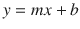

我当时没有提到它，但这个方程经常被用作 x-y 散点图数据的“最佳拟合”预测值，这是线性回归的基础。考虑图 [8-13](#Fig13) ，这也是 Matt 博客中自动情节序列的起始 gif。

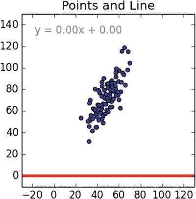

图 8-13。

Initial x-y scatter plot

线性回归技术致力于最佳拟合穿过 x-y 数据点的斜线，以便在单独使用斜线作为给定 x 的 y 预测值时，将总误差降至最低。我建议访问博客并单击 gif 以查看自动序列，因为直线会寻找最佳拟合位置。在本书中，我只能用数学方法来确定斜线的位置。

应该有一个开始方程来开始这个线性回归技术的讨论。在这种情况下，它是第 [2](02.html) 章线性预测模型中使用的斜线方程。【T2

其中 m =斜率或坡度

b = y 轴截距

一般方法是使用数据集`(m, b)`，然后确定带有这些参数的线与 x-y 数据点的“拟合”程度。这种拟合是通过计算数据集中给定 x 的 y，然后使用数据集中的真实 y 计算误差来确定的。使用数据集中的所有 x。这种误差通常被称为斜线穿过数据集时与斜线的距离。该误差或距离也被平方，以确保线下的负距离不会抵消线上的正距离。距离的平方也确保了总误差函数可以被微分。

以下是实现此错误函数的 Python 方法:

```py
# y = mx + b
# m is slope, b is y-intercept
def computeErrorForLineGivenPoints(b, m, points):
    totalError = 0
    for i in range(0, len(points)):
        totalError += (points[i].y - (m * points[i].x + b)) ** 2
    return totalError / float(len(points))

```

以下是代码实现的形式错误函数:

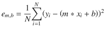

当误差(由前面的误差函数计算得出)处于整个数据集可能的最低最小值时，斜线会生成最佳拟合。现在的技巧是为误差函数创建某种形式，为 m 和 b 提供产生整体最小值的适当值。在我开始之前，想象一下 m，b 和 e 之间的关系会很有帮助。图 [8-14](#Fig14) 来自博客，清楚地显示了所有变量之间关系的曲线性质。


图 8-14。

Plots form , b and e <sub>m,b</sub>

想象把一个弹球高高地举在一个表面上，让它滚下斜坡，这可能也是有帮助的。它应该正好停在最小点上，这个点有一个 m 和 b 与之相关联，还有最小的 e <sub>m，b</sub> 。

运行梯度下降搜索相当于把神话中的弹珠滚下斜坡。进行梯度下降计算的第一步是对误差函数进行两次偏微分，因为它有两个独立变量:m 和 b。

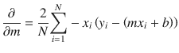

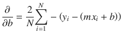

在描述计算最佳 m 和 b 值的过程之前，我想先讨论一下全局最小值的概念。图 [8-15](#Fig15) 是带有变量 x 和 y 的解析连续函数的三维(3D)图。

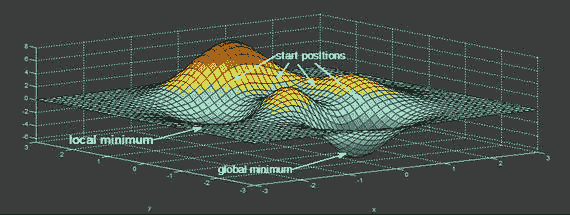

图 8-15。

Multiple minima 3D plot

在这个 3D 图中，您可以看到两个最小值或谷值被确定。一个比另一个“更深”。最深的最小值被认为是全局最小值，而另一个被称为局部最小值。取决于你从哪里开始梯度下降，有可能降落在局部最小值，同时也相信它是全局最小值。不幸的是，计算机不具备查看 3D 图像(如图 [8-15](#Fig15) 所示)并计算出从哪里开始梯度下降以找到真正的全局最小值的固有能力。因此，重要的是迭代独立变量 m 和 b 的整个范围，采取足够小的步骤来定位全局最小值并拒绝所有局部最小值。简而言之，你会看到设置步长成为了这个过程的一个重要部分。

现在已经讨论了开始梯度下降所需的所有部件。实际搜索从设置 m =–1 和 b = 0 开始。这个点可以称为原点，作为一个简单的参考。梯度下降应该基于朝向最优解的初始误差函数开始其下坡行进。每次迭代还应该提供一个改进的解决方案，直到误差保持不变或开始增加。迭代的方向基于前面提到的两个偏导数。

以下 Python 代码实现了这种梯度下降算法:

```py
def stepGradient(b_current, m_current, points, learningRate):
    b_gradient = 0
    m_gradient = 0
    N = float(len(points))
    for i in range(0, len(points)):
        b_gradient += -(2/N) * (points[i].y - ((m_current*points[i].x) + b_current))
        m_gradient += -(2/N) * points[i].x * (points[i].y - ((m_current * points[i].x) + b_current))

    new_b = b_current - (learningRate * b_gradient)
    new_m = m_current - (learningRate * m_gradient)
    return [new_b, new_m]

```

`learningRate`变量控制定位最小值的步长。步长太大，您可能会错过最小值。然而，太小的步长会不必要地增加在找到最小值之前的迭代次数。

执行算法从前面提到的原点开始。对于每次迭代，m 和 b 值被更新以产生比前一次迭代稍低的误差。在图 [18-16](#Fig16) 中，左侧图中的点显示了梯度下降搜索的当前位置。右图显示了当前 m 和 b 值的最佳拟合对应线。

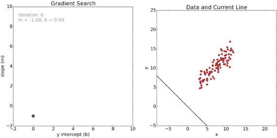

图 18-16。

Start of the gradient descent

从右图中可以清楚地看到，最初对最佳拟合线的猜测是错误的。如图 [18-17](#Fig17) 所示，在下一次迭代中，拟合度大大提高。左边的图现在有一条线表示从起始点到那里的路径。

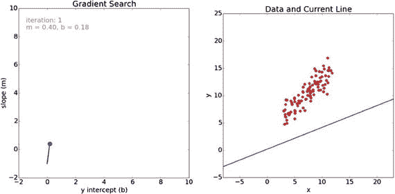

图 18-17。

Iteration 1 for the gradient search

在下一次迭代后，拟合度继续提高，如图 [18-18](#Fig18) 所示。

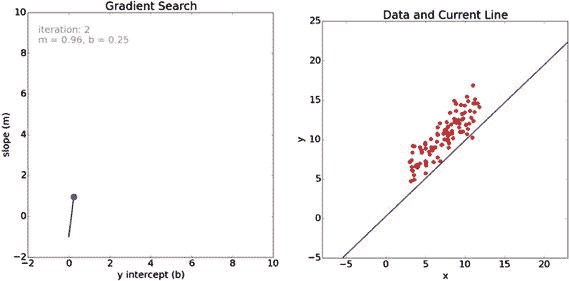

图 18-18。

Iteration 2 for the gradient search

最后，在 100 次迭代之后，该搜索解决了一个非常好的拟合，如图 [18-19](#Fig19) 所示。

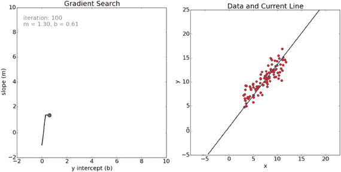

图 18-19。

Iteration 100 for the gradient search

您可以从左图中显示的路径看到，在最后一系列迭代中的搜索稍微向下向右移动，以搜索全局最小值。

图 [18-20](#Fig20) 是梯度搜索中前 100 次迭代的误差值图。

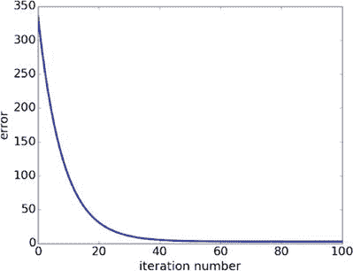

图 18-20。

Plot of error values vs iteration number

检查梯度搜索的正确操作是有益的。确保误差值随着迭代次数的增加而不断减小。从图表中可以看出，在第 50 次迭代之后，误差值非常接近于零。这可能很好地表明存在一个宽的最小表面，其中 m 和 b 的值在产生最佳拟合线时不会显著变化。

这是在梯度搜索中使用 100 次迭代的最佳拟合的最终线:

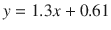

我希望你已经对梯度搜索技术的工作原理有了一些了解。

## 梯度下降法在人工神经网络中的应用

图 [8-21](#Fig21) 很好地总结了梯度下降技术在人工神经网络中的应用。它必须通过调整权重 w<sub>I，j</sub>来确定全局最小值，以便最小化 ANN 中存在的总误差。

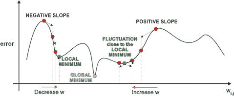

图 8-21。

ANN global minimum

该调整变成误差函数相对于权重 w <sub>j，k</sub> 的偏导数的函数。这个偏导数用这些符号表示: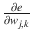。这个导数也是误差函数的斜率。它是梯度下降算法，沿着斜率下降到全局最小值。

图 [8-22](#Fig22) 显示了三层六节点人工神经网络，这是以下讨论的基础网络。请注意 I、j 和 k 指数，因为在整个过程中遵循这些指数非常重要。

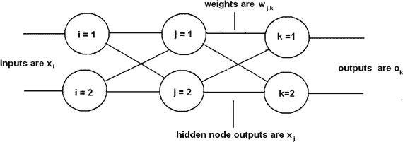

图 8-22。

Three-layer, six-node ANN

除了图 [8-22](#Fig22) 所示的符号外，还需要一个额外的符号:输出节点误差，表示为

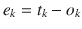

t <sub>k</sub> 是来自训练集的真实值或目标值。

o <sub>k</sub> 是由训练集输入 x <sub>i</sub> 值产生的输出。

任何给定节点 n 处的总误差是前面的等式，其中 n 代替 k。因此，整个人工神经网络的总误差是所有单个节点的所有误差之和。由于边栏中提到的原因，错误也被平方。这导致误差函数的如下等式:

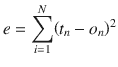

n 是人工神经网络中的节点总数。

该误差函数正是需要对 w <sub>j，k</sub> 进行微分的函数，导致以下形式:

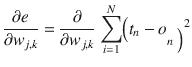

如果注意到任何特定节点的误差仅由其输入连接引起，则该等式可以大大简化。这意味着第 k <sub>个</sub>节点的输出仅取决于其输入连接上的 w <sub>j，k</sub> 权重。这种实现所做的是从误差函数中去除求和，因为没有其他节点对第 k 个<sub>节点的输出有贡献。这产生了一个简单得多的误差函数:</sub>

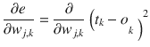

下一步是对函数做实际的偏导数。我只是简单地用最少的注释遍历这些步骤，得到最终的方程，而没有延长整个推导过程。

1.  应用的链规则:
2.  o <sub>k</sub> 独立于 w <sub>j，k</sub> 。第一部分= 
3.  输出 o <sub>k</sub> 应用了一个 sigmoid 函数。第二偏= 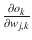乙状结肠
4.  乙状结肠的微分是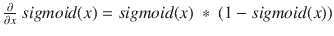
5.  结合:。注意最后一项是必要的，因为 sigmoid 函数中有求和项。这是链式法则的另一个应用。
6.  简化:

深呼吸，这是我在严格的微积分课后经常做的。这是用于调整权重的最终等式:


你还应该注意到等式开头的 2 已经被去掉了。它只是一个比例因子，对于确定误差函数斜率的方向并不重要，而斜率是梯度下降算法的主要关键。我真的想祝贺我的读者，他们已经走了这么远。许多人很难掌握达到这一阶段所需的数学知识。

现在对这个复杂的方程进行物理解释会很有帮助。第一部分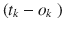就是误差，很容易看出来。sigmoid 函数内的求和表达式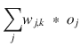是第 k 个<sub>最终层节点的输入。并且最后一项 o <sub>j</sub> 是来自隐藏层中第 j <sub>个</sub>节点的输出。了解这一物理解释将使创建其他层间误差斜率表达式变得容易得多。</sub>

我陈述了隐藏层误差斜率方程的输入，而不需要经过严格的数学推导。这个表达式依赖于刚才给出的物理解释。

T2】

下一步是演示如何使用前面的误差斜率表达式计算新的权重。其实很简单，如下式所示:

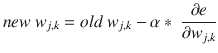

α=学习率

是的，这与第 [2](02.html) 章中讨论的学习率完全相同，我在讨论线性预测器时介绍了这个学习率。学习率很重要，因为设置得太高会导致梯度下降错过最小值，而设置得太低会导致许多额外的迭代并降低梯度下降算法的效率。

### 用于重量变化确定的矩阵乘法

用矩阵来表达所有前述的表达式将是非常有用的，这是计算真实重量变化的实用方法。让下面的表达式表示隐藏层和输出层之间的误差斜率表达式的一个矩阵元素:


o<sub>j</sub>T5】T 是隐藏层输出矩阵的转置。

以下是三层六节点示例 ANN 的矩阵:

![$$ \left\{\begin{array}{ccc}\hfill \mathrm{gd}\left({w}_{1,1}\right)\hfill & \hfill \mathrm{gd}\Big({w}_{2,1\Big)}\hfill & \hfill \mathrm{gd}\left({w}_{3,1}\right)\hfill \\ {}\hfill \mathrm{gd}\Big({w}_{1,2\Big)}\hfill & \hfill \mathrm{gd}\Big({w}_{2,2\Big)}\hfill & \hfill \mathrm{gd}\Big({w}_{3,2\Big)}\hfill \end{array}\right\}*\left\{\begin{array}{c}\hfill {e}_1*\ ;sigmoi{d}_1\ *\left(1 - sigmoi{d}_1\right)\hfill \\ {}\hfill\ {e}_2\ *\  sigmoi{d}_2\ *\left(1 - sigmoi{d}_2\right)\hfill \end{array}\right\}\ *\ \left\{{o}_1\kern0.5em {o}_2\right\} $$](img/A436848_1_En_8_Chapter_Equw.gif)

o <sub>1</sub> 和 o <sub>2</sub> 是来自隐藏层的输出。

这完成了所有必要的准备背景，以便开始更新权重。

## 完成示例

在展示 Python 方法之前，浏览一个手动示例是很重要的，这样当您将它作为 Python 脚本运行时，您就真正理解了这个过程。图 [8-23](#Fig23) 是图 [8-11](#Fig11) 的略微修改版本，在其上我插入了任意的隐藏节点输出值，以便有足够的数据来完成示例。

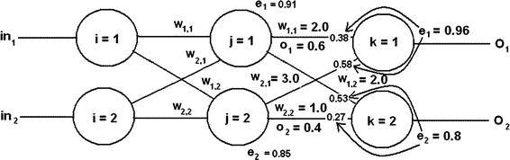

图 8-23。

Example ANN used for manual calculations

让我们从更新 w <sub>1，1</sub> 开始，它是连接隐藏层的节点 1 和输出层的节点 1 的权重。目前，它的值为 2.0。这是用于这些图层链接的误差斜率方程:


替换这些值，如下图所示:

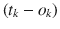 = e <sub> 1 </sub> = 0.96

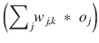 = (2.0 * 0.6) + (3.0 * 0.4) = 2.4

sigmoid =  = 0.9168

1–sigmoid = 0.0832

o <sub>1</sub> = 0.6

将适用值乘以负号得出:

*   –0.96 * 0.9168 * 0.0832 * 0.6 = –0.04394

让我们假设学习率为 0.15，这不是太激进，以下是新的权重:

*   2.0 – 0.15 * (–0.04394) = 2.0 + 0.0066 = 2.0066

这与最初的变化并不大，但是你必须记住，在达到全局最小值之前，即使没有数千次迭代，也有数百次迭代。小的变化迅速积累成重量的一些相当大的变化。

网络中的其他权重可以用与演示相同的方式进行调整。

有一些关于人工神经网络学习能力的重要问题，我将在下面讨论。

### 人工神经网络学习的问题

你应该意识到不是所有的人工神经网络都学得很好，就像不是所有的人都以同样的方式学习一样。对人工神经网络来说幸运的是，它与智力无关，而是与更普通的与乙状结肠激活功能直接相关的项目有关。图 [8-24](#Fig24) 是图 2-12 的修改版，显示了 sigmoid 函数的输入和输出范围。

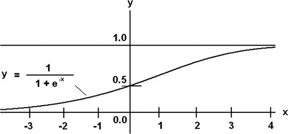

图 8-24。

Annotated sigmoid function

查看图 [8-24](#Fig24) ，您应该看到，如果 x 输入大于 2.5，y 输出的变化非常小。这是因为 sigmoid 函数在 x 值附近渐近地接近 1.0。大输入变化的小变化意味着发生非常小的梯度变化。在这种情况下，人工神经网络学习受到抑制，因为梯度下降算法依赖于存在一个合理的斜率。因此，人工神经网络训练集应该将输入的 x 值限制在大约–3 到 3 的伪线性范围内。超出此范围的 x 值会导致 ANN 学习的饱和效应，并且不会发生有效的权重更新。

同样，sigmoid 函数也不能输出大于 1 或小于 0 的值。这些范围内的输出值是不可能的，重量必须适当缩小，以便始终保持允许的输出范围。实际上，由于前面所述的渐近性质，输出范围应为 0.01 至 0.99。

### 初始重量选择

基于刚才讨论的问题，我相信你可能会意识到，选择一个良好的初始神经网络权重集是非常重要的，这样学习才能有效，而不会遇到输入饱和或输出限制问题。显而易见的选择是将权重选择限制在我前面提到的伪线性范围内(即 3)。通常情况下，权重被进一步限制为 1 会更保守一些。

人工智能研究人员和数学家多年来发展了一个“经验法则”，大致如下:

最初应该使用正态分布来分配权重，该正态分布设置为平均值等于 ANN 中节点数量的平方根的倒数。

对于一个 36 节点的三层人工神经网络，我以前用过，平均值是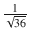或 0.16667。图 [8-25](#Fig25) 显示了该平均值的正态概率分布，也清楚地显示了 2 个近似标准偏差。

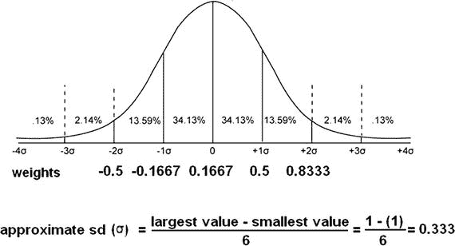

图 8-25。

Normal distribution of initial weights for a 36-node ANN

在大约-0.5 到 0.8333 的范围内随机选择权重将很好地为 36 节点网络的 ANN 学习提供一个极好的起点。

最后，您应该避免将所有权重设置为相同的值，因为 ANN 学习依赖于不均匀的权重分布。显然，不要把所有的权重都设为 0，因为那样会完全禁用人工神经网络。

这最后一节完成了我对 ANN 的所有背景讨论。终于到了使用 Python 在 Raspberry Pi 上生成一个成熟的 ANN 的时候了。

## 演示 8-1:人工神经网络 Python 脚本

第一个演示向您展示了如何使用 Python 创建一个未经训练的 ANN。我首先讨论构成人工神经网络的模块。一旦我这样做了，所有的模块都放入一个可操作的包中，脚本就运行了。要讨论的第一个模块是创建和初始化 ANN 的模块。

### 初始化

这个模块的结构很大程度上取决于要建立的人工神经网络的类型。我正在为这个演示构建一个三层、九节点的 ANN，这意味着必须有代表每一层的对象。此外，必须创建输入、输出和权重，并进行适当的标记。表 [8-3](#Tab3) 详细说明了该模块所需的对象和引用。

表 8-3。

Initialization Module Objects and References

<colgroup><col> <col></colgroup> 
| 名字 | 描述 |
| --- | --- |
| 节点 | 输入层中的节点数 |
| 鳞毛蕨 | 隐藏层中的节点数 |
| 奥诺德 | 输出层中的节点数 |
| wtgih | 输入层和隐藏层之间的权重矩阵 |
| wtgho | 隐藏层和输出层之间的权重矩阵 |
| 权值 | 个体权重矩阵元素 |
| 投入 | 输入数组 |
| 输出 | 输出数组 |
| 隐藏的 | 隐藏层输出的数组 |
| 实验室反应堆 | 学习率 |

基本的初始化模块结构如下开始:

```py
def __init__ (self, inode, hnode, onode, lr):
    # Set local variables
    self.inode = inode
    self.hnode = hnode
    self.onode = onode
    self.lr = lr

```

您需要用要创建的 ANN 的正确值来调用`init`模块。对于具有中等学习速率的三层九节点网络，值如下:

*   信息节点= 3
*   hnode = 3
*   onode = 3
*   lr = 0.25

下一个要讨论的项目是如何基于所有先前的背景讨论来创建和初始化关键加权矩阵。我使用正态分布生成权重，平均值为 0.1667，标准偏差为 0.3333。幸运的是，numpy 有一个非常好的功能可以自动完成这个过程。要创建的第一个矩阵是 wtgih，对于我们的例子，它的维数是 inode × hnode，或者 3 × 3。

下一条 Python 语句生成了这个矩阵:

```py
self.wtgih = np.random.normal(0.1667, 0.3333, self.hnodes, self.inodes)

```

以下是由上述语句生成的交互式会话的输出示例:

```py
>>>import numpy as np
>>>wtgih = np.random.normal(0.1667, 0.3333, [3, 3])
>>>wtgih
array([[ 0.44602141,  0.58021837,  0.00499487],
       [ 0.40433922, -0.31695922, -0.40410581],
       [ 0.63401073, -0.37218566,  0.14726115]])

```

生成的矩阵`wtgih`结构良好，具有优秀的初始值。

此时，可以使用前面显示的矩阵生成语句来完成`init`模块。

```py
def __init__ (self, inode, hnode, onode, lr):
    # Set local variables
    self.inode = inode
    self.hnode = hnode
    self.onode = onode
    self.lr = lr

    # mean is the reciprocal of the sq root total nodes
    mean = 1/(pow((inode + hnode + onode), 0.5)

    # standard deviation (sd) is approximately 1/6 total weight range
    # total range = 2
    sd = 0.3333

    # generate both weighting matrices
    # input to hidden layer matrix
    self.wtgih = np.random.normal(mean, sd, (hnode, inode])

    # hidden to output layer matrix
    self.wtgho = np.random.normal(mean, sd, [onode, hnode])

```

此时，我引入了第二个模块，它允许在由`init`模块创建的网络上运行一些简单的测试。这个新模块被命名为`testNet`以反映它的用途。采用 Python 术语表示的输入数据集或元组，并返回输出集。以下流程在模块中运行:

1.  转换为数组的输入数据元组。
2.  该数组乘以 wtgih 加权矩阵。现在这是隐藏层的输入。
3.  然后，这个新数组由 sigmoid 函数进行调整。
4.  隐藏层中调整后的数组乘以 wtgho 矩阵。这是输出层的输入。
5.  然后，通过 sigmoid 函数调整这个新数组，产生最终的输出数组。

模块列表如下:

```py
def testNet(self, input):
    # convert input tuple to an array
    input = np.array(input, ndmin=2).T

    # multiply input by wtgih
    hInput = np.dot(self.wtgih, input)

    # sigmoid adjustment
    hOutput = 1/(1 + np.exp(-hInput))

    # multiply hidden layer output by wtgho
    oInput = np.dot(self.wtgho, hOutput)

    # sigmoid adjustment
    oOutput = 1/(1 + np.exp(-oInput))

    return oOutput

```

### 试运转

图 [8-26](#Fig26) 显示了我在 Raspberry Pi 3 上运行的一个交互式 Python 会话，以测试这个初步代码。

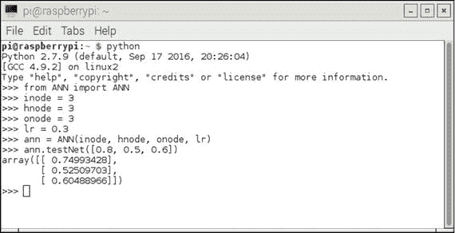

图 8-26。

Interactive Python session

`init`和`testNet`模块都是一个名为 ANN 的类的一部分，而这个类又位于一个名为 ANN.py 的文件中。我首先启动 Python 并从该文件中导入该类，以便解释器能够识别类名。接下来，我实例化了一个名为 ann 的对象，所有节点都设置为 3，学习率等于 0.3。现在还不需要学习率，但是它必须存在，否则无法实例化一个对象。实例化一个对象的行为会自动导致`init`模块运行。它需要所有三个节点的大小值和学习率值。

接下来，我用三个输入值运行了`testNet`模块。表 [8-4](#Tab4) 显示了这些值以及各自的计算输出值。我还包括手动计算的误差值。

表 8-4。

Initial Test

<colgroup><col> <col> <col> <col></colgroup> 
| 投入 | 输出 | 错误 | 百分误差 |
| --- | --- | --- | --- |
| Zero point eight | 0.74993428 | –0.05006572 | Six point three |
| Zero point five | 0.52509703 | 0.02509703 | Five |
| Zero point six | 0.60488966 | 0.00488966 | Zero point eight |

考虑到这是一个完全未经训练的人工神经网络，误差不会太大。下一节讨论如何训练一个人工神经网络，以大大提高其准确性。

## 演示 8-2:训练人工神经网络

在本演示中，我将向您展示如何使用名为`trainNet`的第三个模块来训练一个人工神经网络，该模块已被添加到人工神经网络类定义中。该模块的功能与`testNet`功能非常相似，它根据输入数据集计算输出集。然而，`trainNet`模块输入数据是一个预先确定的训练集，而不是我刚才演示的任意数据元组。这个新模块还通过比较人工神经网络的输出和输入来计算误差集，并使用差异来训练网络。输出的计算方式与`testNet`模块中的计算方式完全相同。`trainNet`的参数现在包括输入列表和训练列表。以下语句从列表参数创建这些数组:

```py
def trainNet(self, inputT, train):
    # This module depends on the values, arrays and matrices
    # created when the init module is run.

    # create the arrays from the list arguments
    self.inputT = np.array(inputT, ndmin=2).T
    self.train = np.array(train, ndmin=2).T

```

如前所述，误差是训练集输出和实际输出之间的差异。如前所述，第 k 个<sub>个</sub>输出节点的误差方程为:


输出误差的矩阵符号为

```py
self.eOutput = self.train - self.oOutput

```

本例 ANN 的矩阵符号中的隐藏层误差数组为


以下是生成此数组的 Python 语句:

```py
self.hError = np.dot(self.wtgho.T, self.eOutput)

```

下面是用于调整第 j <sub>层</sub>和第 k <sub>层</sub>之间的链接的更新等式，如前所示:

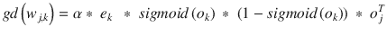

新的 gd(w <sub>j，k</sub> )数组必须添加到原始数组中，因为它们是对原始数组的调整。前面的等式可以整齐地打包成一条 Python 语句:

```py
self.wtgho += self.lr * np.dot((self.eOutput * self.oOutputT * (1 - self.oOutputT)), self.hOutputT.T)

```

为输入层和隐藏层之间的权重更新编写代码使用完全相同的格式。

```py
self.wtgih += self.lr * np.dot((self.hError * self.hOutputT * (1 - self.hOutputT)), self.inputT.T)

```

将所有前面的代码段和前面的模块放在一起，就产生了 ANN.py 清单。请注意，我已经包含了关于每个段的函数的注释，以及附加的调试语句。

```py
import numpy as np

class ANN:

    def __init__ (self, inode, hnode, onode, lr):
        # set local variables
        self.inode = inode
        self.hnode = hnode
        self.onode = onode
        self.lr = lr

        # mean is the reciprocal of the sq root of the total nodes
        mean = 1/(pow((inode + hnode + onode), 0.5))

        # standard deviation is approximately 1/6 of total range
        # range = 2
        stdev = 0.3333

        # generate both weighting matrices
        # input to hidden layer matrix
        self.wtgih = np.random.normal(mean, stdev, [hnode, inode])
        print 'wtgih'
        print self.wtgih
        print

        # hidden to output layer matrix
        self.wtgho = np.random.normal(mean, stdev, [onode, hnode])
        print 'wtgho'
        print self.wtgho
        print

    def testNet(self, input):
        # convert input tuple to an array
        input = np.array(input, ndmin=2).T

        # multiply input by wtgih
        hInput = np.dot(self.wtgih, input)

        # sigmoid adjustment
        hOutput = 1/(1 + np.exp(-hInput))

        # multiply hidden layer output by wtgho
        oInput = np.dot(self.wtgho, hOutput)

        # sigmoid adjustment
        oOutput = 1/(1 + np.exp(-oInput))

        return oOutput

    def trainNet(self, inputT, train):

        # This module depends on the values, arrays and matrices
        # created when the init module is run.

        # create the arrays from the list arguments
        self.inputT = np.array(inputT, ndmin=2).T
        self.train = np.array(train, ndmin=2).T

        # multiply inputT array by wtgih
        self.hInputT = np.dot(self.wtgih, self.inputT)

        # sigmoid adjustment
        self.hOutputT = 1/(1 + np.exp(-self.hInputT))

        # multiply hidden layer output by wtgho
        self.oInputT = np.dot(self.wtgho, self.hOutputT)
        # sigmoid adjustment
        self.oOutputT = 1/(1 + np.exp(-self.oInputT))

        # calculate output errors
        self.eOutput = self.train - self.oOutputT

        # calculate hidden layer error array
        self.hError = np.dot(self.wtgho.T, self.eOutput)

        # update weight matrix wtgho
        self.wtgho += self.lr * np.dot((self.eOutput * self.oOutputT * (1 - self.oOutputT)), self.hOutputT.T)

        # update weight matrix wtgih
        self.wtgih += self.lr * np.dot((self.hError * self.hOutputT * (1 - self.hOutputT)), self.inputT.T)
        print 'updated wtgih'
        print wtgih
        print
        print 'updated wtgho'
        print wtgho
        print

```

### 试运转

图 [8-27](#Fig27) 显示了一个交互式 Python 会话，其中我实例化了一个学习率等于 0.20 的三层九节点 ANN。


图 8-27。

Interactive Python session

我在 ANN 脚本中包含了几个调试打印语句，它允许在初始权重矩阵和更新后的权重矩阵之间进行直接比较。您应该看到它们之间只有很小的变化，这是我们所期望的。一个重要的事实是，梯度下降使用小的增量很好地工作，以避免错过全局最小值。在这个会话中，我只能进行一次迭代，因为代码没有设置多次迭代。

恭喜你陪我走到这一步！我讲述了许多关于人工神经网络基础和实现的主题。现在你应该已经做好充分的准备来理解和欣赏下一章中有趣的实际人工神经网络演示。

## 摘要

这是关于人工神经网络(ann)的四章中的第三章。在这一章中，我重点介绍了深度学习，它实际上只不过是多层人工神经网络背后的基本原理和概念。

在简单回顾了一些基础知识后，我完成了一个两层六节点人工神经网络的逐步手动计算。随后，我使用 Python 脚本重新进行了计算。

接下来是对一个更大的三层九节点人工神经网络的计算。这些计算完全是用从 numpy 库中导入的 Python 和矩阵算法完成的。

我讨论了未经训练的人工神经网络中存在的错误以及它们是如何传播的。理解这一点很重要，因为它是用于调整权重以优化人工神经网络的反向传播技术的基础。

接下来，我看了一个完整的反向传播示例，它说明了如何更新权重以减少整体网络错误。接下来是侧栏，其中使用线性回归示例介绍了梯度下降(GD)技术。

随后讨论了 GD 在人工神经网络中的应用。GD 算法使用误差函数的斜率来努力定位全局最小值，这是实现性能良好的 ANN 所必需的。

我提供了一个完整的例子来说明如何使用 GD 算法更新权重。讨论了人工神经网络学习和初始权重选择的问题。

本章以一个 Python 脚本的完整例子结束，该脚本初始化和训练任何规模的人工神经网络。