# 十、进化计算

这一章讨论进化计算(EC)。我将从定义 EC 及其范围开始，这样你就能理解本章讨论的内容以及它如何应用于人工智能。以下列出了欧共体领域的一些主要分专题:

*   进化编程
*   进化策略
*   遗传算法
*   遗传表演程序
*   分类系统

这个列表并不全面，因为许多人工智能主题的范围通常取决于人工智能从业者的观点，但它对我很有用，并且超过了本章讨论的所有项目。

我将从一个故事开始，这个故事应该把进化和突变的基本概念放在一个适当的环境中。

## 艾列弗

许多年前，在亚热带丛林中有一个大洞穴，是一种两栖动物的家，我将简单地称之为生命。Alifes 是温和的动物，它们组成了一个很大的群体(数以万计),在洞穴里生活了很长时间。他们吃地衣、苔藓和其他营养物质，这些都是由流经洞穴的几条清澈的溪流慷慨提供的。阿里夫非常多产，繁殖非常快，世代时间以周计。它们的群体大小也相当稳定，基本上是基于恒定的出生率和死亡率以及稳定的食物供应而设定在一个平衡点上。总的来说，alife 社区似乎对现状很满意。然后一场灾难降临了。

一场大地震震动了这个地区，如此强烈的地震使得洞顶坍塌，亿万年来第一次将生命暴露在外面。艾丽费斯没有意识到发生了什么，他们的大脑相当原始，只是继续着他们平常的生活方式。然而，一只鹰碰巧在附近盘旋，并通过新打开的洞俯冲下来调查。在那里，它发现了美味的生命群落，并开始食用它们。吃饱后，这只鹰飞回它的巢区，和其他鹰交流它的发现。很快，就有大量饥饿的鹰吞食食物。对阿里夫来说，事情看起来相当严峻。

幸运的是，一些小鹰可以躲在老鹰够不到的岩石和洞里。但是殖民地被灭绝只是时间问题。然后，不寻常的事情发生了。新生生物头顶上的一个皮肤细胞发生了变化或突变，从而变得对光敏感。这种生物不知道该做什么，但原始的本能指引它避开任何光线。这个生命体继续繁衍后代，它们也有感光细胞。有趣的是，每一代 alife 都比上一代更善于探测光线。这些对光敏感的生命体很快变得有些善于躲避老鹰，以至于它们是唯一幸存的生命体。当免费午餐显然结束时，鹰派离开了。

另一个突变发生在 alifes 身上，其中第二组光敏细胞的发育与第一组非常接近。经过许多代，这些光敏细胞进化成了原始的眼睛。这些生命现在可以看见了，更重要的是，用两只眼睛他们可以感知深度的第三维。有了这种新的深度感，阿里夫们可以大胆前进，开始探索洞穴之外的世界。

当兔子开始从洞穴中冒险出来时，它们暴露在强烈的阳光下，它们顶部的皮肤细胞开始变异，变得更坚韧，更具保护性。它们的嘴也开始变异，因为它们需要更多的食物能量才能在丛林中活动。他们长出了牙齿，他们的消化系统也发生了变化，以适应他们现在消耗的生肉蛋白质。他们的身体也开始成长，以处理新的大量器官和身体部分。这个进化过程持续了很长时间，直到现在。今天，有生命在我们中间，但我们不这样称呼他们；相反，我们称它们为短吻鳄。

我相信你会认为我的故事是虚构的，除了变异和进化的重要部分，它们是生命延续其物种所必需的。物种适应恶劣环境生存是查尔斯·达尔文关于物种起源的论文中提出的主要观点。

当它在自然界发生时，突变总是在一个非常小的范围内，并且通常基于一些随机的过程。这一想法在进化计算中得到了贯彻，在进化计算中，变化或突变也非常小，对整个过程几乎没有影响，不管那可能是什么。突变也是通过使用兼容的伪随机机制产生的。我现在将在进化编程(EP)的讨论中进一步发展这些想法。

## 进化编程

EP 是劳伦斯·福格尔博士在 20 世纪 60 年代初创造的。它可以被视为一种优化策略，使用随机选择的试验解决方案来测试一个或多个目标。试验解决方案也称为个体群体。然后将突变应用于现有的个体，产生新的个体或后代。突变会对新个体的行为产生广泛的影响。然后，新的个体在“比赛”中进行比较，以选择哪些存活下来，形成新的个体群体。

EP 不同于遗传算法(GA ),因为它专注于父母和后代之间的行为联系；而遗传算法试图模仿发生在基因组中的自然遗传操作，包括编码行为和使用遗传杂交的重组。

EP 也非常类似于进化策略，尽管它们是彼此独立开发的。主要区别在于，与 es 中使用的确定性方法相比，EP 使用随机过程从群体中选择个体。在 ES 中，表现不佳的个体会根据明确定义的指标从个体群体中删除。

现在我已经介绍了 EC 并讨论了它的基本组件，是时候向您展示一个实际的 EC 演示了。

## 演示 10-1:手动计算

正如我在其他章节中所做的那样，我从一些手动计算开始这个演示。然而，陈述目的是有帮助的，这样你就能知道演示应该展示什么。目的是生成一个由六个整数组成的列表，这些整数的取值范围从 0 到 100，它们的和是 371。我可以猜测，大多数读者可以很容易地列出一个清单，没有任何真正的问题。

我将带你通过我的推理来说明我是如何开发一个列表的。

1.  首先，我意识到每个数字都可能大于 60，因为只有六个数字可以加起来达到目标值。
2.  接下来，我选择了一个数字(比如说 71)并从目标中减去它，这样就用剩下的五个数字创建了一个 300 的新目标。
3.  我使用其他数字重复这些步骤，直到我到达下面的列表。最后一个数字就是我选择第五个整数后的余数。[71，90，65，70，25，50]这个过程并不是随机的，因为我在整个过程中都在论证我的选择。这个过程应该归类为确定性的。可以编写一个传统的脚本或程序来对其进行编码。顺便说一下，我也可以创建下面的列表，因为没有规定整数不能重复:[60，60，60，60，71]

我们通常不以那种方式思考或推理，这只是人性的一种怪癖。

我认为前面的手动计算对于一个人来说是微不足道的。然而，对于计算机来说，这并不是微不足道的，这就是下面的 Python 演示发挥作用的地方。

### Python 脚本

这应该归功于威尔·拉森。我用的是他 2009 年的一篇文章中的代码，这篇文章题为“遗传算法:很酷的名字&太简单了”( [`https://lethain.com/genetic-algorithms-cool-name-damn-simple/`](https://lethain.com/genetic-algorithms-cool-name-damn-simple/) )，来自他的博客，名为《非理性繁荣》。我强烈建议你看一看。

要解决的问题与“手动计算”一节中使用的问题相同，即确定 6 个 0 到 100 范围内的整数，并求和得到目标值 371。

在制定解决方案时，首先要考虑的是如何构建它以适应 EC 范式。有个人要创造，他们最终会形成一个群体。这种特定情况下的个体将是六个元素列表，由值范围从 0 到 100 的整数组成。多个个体组成一个群体。以下代码段创建了个人:

```py
from random import randint
def individual(length, min, max):
    # generates an individual
    return [randint(min, max) for x in xrange(length)]

```

图 [10-1](#Fig1) 显示了一个交互式 Python 会话，其中我生成了几个个体。

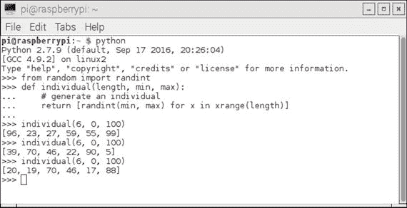

图 10-1。

Interactive Python session individual generation

必须收集生成的个体，以便它们形成群体，这是解决方案结构的下一部分。下面的代码段生成一个群体。该代码段取决于已经输入的前一个代码段:

```py
def population(count, length, min, max):
    # generate a population
    return [individual(length, min, max) for x in xrange(count)]

```

图 [10-2](#Fig2) 显示了一个交互式 Python 会话，其中我生成了几个群体。

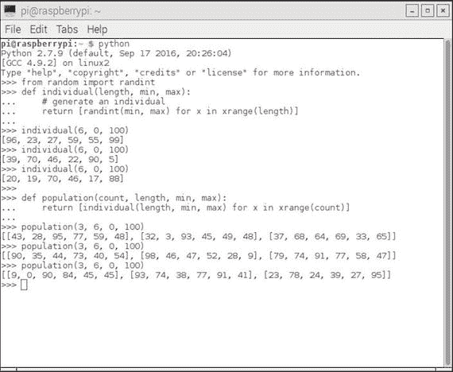

图 10-2。

Interactive Python session population generation

该流程的下一步是创建一个函数，用于衡量特定个人在实现既定目标方面的表现(即，整数列出目标值的总和)。这个函数称为适应度函数。请注意，健身功能要求之前已经输入了个人功能。以下是适应度函数的代码段实现:

```py
from operator import add
def fitness(individual, target):
    # calculate fitness, lower the better
    sum = reduce(add, individual, 0)
    return abs(target - sum)

```

图 [10-3](#Fig3) 显示了一个交互式 Python 会话，其中我针对一个恒定的目标值测试了几个人。

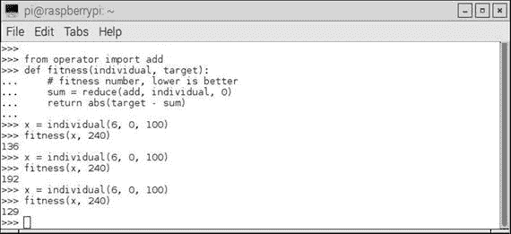

图 10-3。

Interactive Python session fitness tests

这个特殊的适应性函数比我在过去章节中演示的类似适应性测试要简单得多。在这种情况下，只计算包含在单个列表中的合计元素与目标值之间的差值的绝对值。最好的情况是值为 0.0，我将很快演示一下。

该结构中唯一缺少的元素是如何改变或进化群体以满足目标。只有最幸运的是，初始解也是最优解。必须有一个正确实施进化功能的策略。以下是为此结构制定的策略:

*   从以前的群体中挑选出 20%的优秀员工(精英率),并将他们纳入新的群体。
*   大约 75%的新人口在幼年时繁殖。
*   从一个父亲那里取第一个长度/2 个元素，从一个母亲那里取最后一个长度/2 个元素，形成一个孩子。
*   禁止将父亲和母亲视为同一个人。
*   从总体中随机选取 5%。
*   变异 1%的新种群。

这个策略绝不是一个标准的，甚至也不是一个非常全面的策略，但是对于这个问题来说，它已经足够了，并且对于那些用于类似问题的策略来说，它具有相当的代表性。

图 [10-4](#Fig4) 是一个交互式 Python 会话，展示了在这种策略中如何形成孩子。

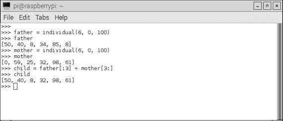

图 10-4。

Forming children for a new population

该策略的变异部分稍微复杂一些，在解释之前，我将在下一段代码中展示这一部分:

```py
from random import random, randint
chance_to_mutate = 0.01
for i in population:
    if chance_to_mutate > random():
        place_to_mutate = randint(0, len(i))
        i[place_to_mutate] = randint(min(i), max(i))
...
...

```

`chance_to_mutate`变量被设置为 0.01，代表 1%的突变几率，正如我前面提到的，这是非常低的。语句`for i in population:`遍历整个种群，仅当随机数生成器小于 0.01 时才会导致变异，这种情况并不常见。被选择变异的实际个体是由`place_to_mutate = randint(0, len(i))`语句完成的，它不太可能是在随机数小于. 01 时被迭代的个体。最后，实际的变异是由这条语句完成的:`i[place_to_mutate] = randint(min(i), max(i))`。所选个体中的整数值是基于群体的`min`和`max`值随机生成的。

整个策略设计，包括选择表现最好的个体，从种群的所有部分繁殖孩子，以及偶尔的突变，都是为了找到全局最大值和避免局部最大值。这与人工神经网络的梯度下降算法中的思维过程完全相同，其目标是找到全局最小值并避免局部最小值。你可以查看图 8-15 来可视化定位全局最大值或最高峰的过程，而不是代表全局最小值的最深的谷。

`evolve`函数远不止显示的内容。剩下的代码显示在完整的脚本清单中。

在展示完整的脚本之前，还有一个函数需要解释。这个函数被命名为`grade`,它计算整个人口的整体适应度。Python 内置的`reduce`函数对每个个体的适应性分数求和，并根据群体大小对总和进行平均。以下代码实现了 grade 函数:

```py
def grade(pop, target):
    'Find average fitness for a population.'
    summed = reduce(add, (fitness(x, target) for x in pop))
    return summed / (len(pop) * 1.0)

```

最后一个函数清单总结了我对组成 Python 脚本的所有函数的讨论。以下是最终脚本的完整列表，以及如何在交互式 Python 会话中运行脚本的说明。请注意，我确实修改了指令，以显示满足目标的第一代编号和最终解决方案本身。示例中的人口等于 100，每个个体有 6 个元素，其值在 0 到 100 之间。

```py
"""
# Example usage
>>> from genetic import *
>>> target = 371
>>> p_count = 100
>>> i_length = 6
>>> i_min = 0
>>> i_max = 100
>>> p = population(p_count, i_length, i_min, i_max)
>>> fitness_history = [grade(p, target),]
>>> fitFlag = 0
>>> for i in xrange(100):
...    p = evolve(p, target)
...    fitness_history.append(grade(p, target))
...    if grade(p, target) == 0:
...        if fitFlag == 0:
...            fitFlag = 1
...            print 'Generation = ', i
...            print p[0]
>>> for datum in fitness_history:
...    print datum
"""

from random import randint, random
from operator import add

def individual(length, min, max):
    'Create a member of the population.'
    return [ randint(min,max) for x in xrange(length) ]

def population(count, length, min, max):
    """
    Create a number of individuals (i.e. a population).

    count: the number of individuals in the population
    length: the number of values per individual
    min: the minimum possible value in an individual's list of values
    max: the maximum possible value in an individual's list of values

    """
    return [ individual(length, min, max) for x in xrange(count) ]

def fitness(individual, target):
    """
    Determine the fitness of an individual. Higher is better.

    individual: the individual to evaluate
    target: the target number individuals are aiming for
    """
    sum = reduce(add, individual, 0)
    return abs(target-sum)

def grade(pop, target):
    'Find average fitness for a population.'
    summed = reduce(add, (fitness(x, target) for x in pop))
    return summed / (len(pop) * 1.0)

def evolve(pop, target, retain=0.2, random_select=0.05, mutate=0.01):
    graded = [ (fitness(x, target), x) for x in pop]
    graded = [ x[1] for x in sorted(graded)]
    retain_length = int(len(graded)*retain)
    parents = graded[:retain_length]
    # randomly add other individuals to
    # promote genetic diversity
    for individual in graded[retain_length:]:
        if random_select > random():
            parents.append(individual)
    # mutate some individuals
    for individual in parents:
        if mutate > random():
            pos_to_mutate = randint(0, len(individual)-1)
            # this mutation is not ideal, because it
            # restricts the range of possible values,
            # but the function is unaware of the min/max
            # values used to create the individuals,
            individual[pos_to_mutate] = randint(
                min(individual), max(individual))
    # crossover parents to create children
    parents_length = len(parents)
    desired_length = len(pop) - parents_length
    children = []
    while len(children) < desired_length:
        male = randint(0, parents_length-1)
        female = randint(0, parents_length-1)
        if male != female:
            male = parents[male]
            female = parents[female]
            half = len(male) / 2
            child = male[:half] + female[half:]
            children.append(child)
    parents.extend(children)
    return parents

```

图 [10-5](#Fig5) 显示了一个交互会话，其中我输入了脚本注释的指令部分中显示的所有语句。

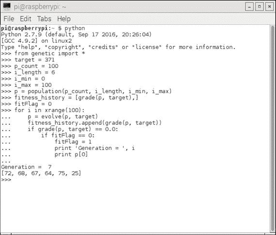

图 10-5。

Interactive Python session running the script

你应该可以在截图中看到，只进化了七代就找到了解决方案。解决方案是`[72, 68, 67, 64, 75, 25]`，它的总和是目标值 371。在找到第一个成功的解决方案后，脚本不会停止，而是继续进化和变异，稍微降级，然后改进，直到运行完其预设的周期数。

图 [10-6](#Fig6) 中显示了与每一代相关的部分适应值历史。

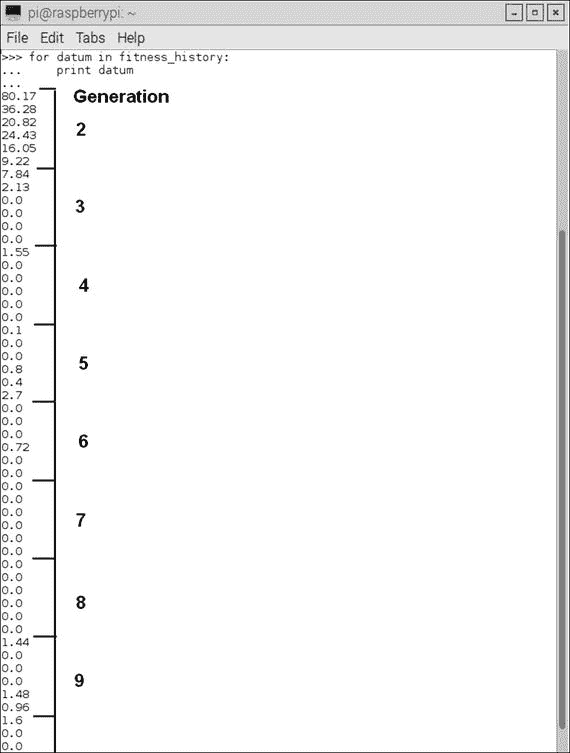

图 10-6。

Fitness history list

在图 [10-6](#Fig6) 中，我标注了第 7 代中每个个体的适应值为 0.0。总的来说，这种遗传规划方法是非常有效的，特别是对于给定六个随机生成的整数来确定目标和这一相对简单的目标。

下一个演示是康威的“生命游戏”的一个轻微变体，这是一个将遗传编程与人工生命(alife)结合在一起的经典项目，人工生命根据基于彼此接近程度的一系列条件繁殖和死亡，我稍后将对此进行解释。

## 演示 10-2:康威的生命游戏

生命的游戏，或众所周知的生命，是英国数学家约翰·康威在 1970 年创建的一个细胞自动机项目。游戏从一个初始条件开始，但它不需要用户进一步输入来玩到结束。这种操作方式被称为零玩家游戏，这意味着自动机(或细胞，我将从现在开始称呼它们)根据以下一组规则或条件自行进化:

1.  任何少于两个活邻居的活细胞都会死亡，似乎是由人口不足引起的。
2.  任何有两三个活邻居的活细胞都能活到下一代。
3.  任何有三个以上活邻居的活细胞都会死亡，好像是由于人口过剩。
4.  任何一个死细胞，只要有三个活的邻居，就会变成活细胞，就像通过繁殖一样。

这个游戏的棋盘区域，或者说宇宙，理论上是一个无限的、正交的格子集合，其中一个细胞可以占据一个格子，无论是活的还是死的。活着是有人口的同义词，死了是无人居住的同义词。每个单元最多有八个邻居，除了我们现实世界的实际网格系统中的边缘单元，无限网格是不可能的。

网格被“播种”了初始单元布局，其可以随机或确定性地放置。细胞规则随即被应用，导致出生和死亡同时发生。这个应用在游戏术语中被称为时间滴答。新一代就这样形成了，这些规则立即被重新应用。最终，游戏进入了一个平衡状态，细胞在两种稳定的细胞结构之间循环，它们要么永远游荡，要么全部死亡。

从历史的角度来看，康威对约翰·冯·诺依曼教授试图创造一台可以自我复制的计算机非常感兴趣。冯·诺依曼最终成功地描述了一个基于矩形网格的数学模型，该网格由一套非常复杂的规则管理。康威游戏是冯·诺依曼概念的一大简化。这个游戏发表在 1970 年 10 月期的《科学美国人》上马丁·加德纳的“数学游戏”专栏中。它立即获得了巨大的成功，并引起了人工智能研究人员和热心读者的极大兴趣。

该游戏还可以扩展到与通用图灵机(universal Turing machine)相当的程度，通用图灵机是由艾伦·特纳(Alan Turning)在 20 世纪 40 年代首次提出的(在更早的一章中解释过)。

这款游戏对人工智能还有另一个重要影响，因为它可能开启了被称为细胞自动机的数学研究领域。该游戏模拟了一群生物的出生和死亡，与自然界中发生的真实生活过程有着惊人的密切关系。这个游戏直接导致了许多其他模拟自然过程的类似游戏。这些模拟已经应用于计算机科学、生物学、物理学、生物化学、经济学、数学和许多其他领域。

我用一个整洁的树莓皮配件板，也就是所谓的感知帽，演示了康威的生活游戏。图 [10-7](#Fig7) 显示了一个感应帽板。HAT 名称代表一系列附件板，称为附加在顶部(HAT)板上的硬件，具有标准化格式，允许它们直接插入 40 引脚 GPIO 接头，并机械固定到 Raspberry Pi 2 和 3 型号板上。

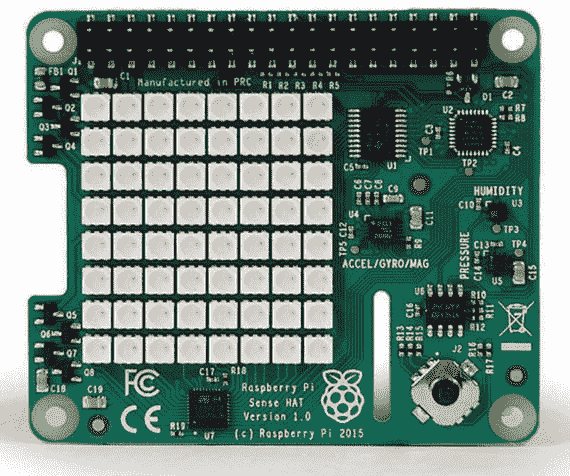

图 10-7。

Sense HAT board

每个 HAT 板都支持自动配置系统，允许自动 GPIO 和驱动程序设置。这种自动配置是利用 40 引脚 GPIO 接头上为 I2C eeprom 保留的两个专用引脚实现的。该 eeprom 保存主板制造商的信息、GPIO 设置和一个设备树片段，该片段描述了所连接的硬件，进而允许 Linux 操作系统自动加载任何所需的驱动程序。

Sense HAT 板有一个 8 × 8 RGB LED 阵列，为所有细胞自动机提供非常好的网格显示。此外，还有一个强大的 Python 库，为 LED 阵列和各种板载传感器提供大量功能，包括:

*   陀螺仪
*   加速计
*   磁力计
*   温度
*   大气压
*   湿度

板上还有一个五向位置操纵杆，支持需要这种用户控制的应用。对于生命游戏应用，我不使用任何传感器或操纵杆，只使用 8 × 8 LED 阵列。

### 感知帽子硬件安装

首先，确保树莓派完全断电。Sense HAT 设计用于安装在树莓皮的顶部。它带有一个 40 针 GPIO 公针扩展接头，您必须首先将其插入 Raspberry Pi 上的母 40 针接头。然后，使用 40 个公引脚作为导向，将 Sense HAT 安装在 Raspberry Pi 顶部。这些引脚应该简单地穿过检测板上的 40 引脚母接头。剩下的就是附上所提供的支架，它在树莓派和 Sense HAT 之间提供了牢固的支撑。图 [10-8](#Fig8) 显示了树莓墩上安装的感应帽。

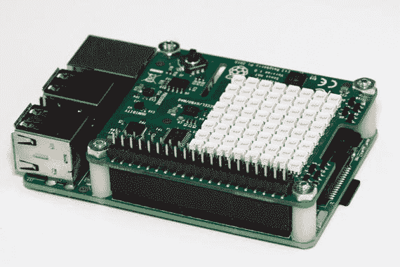

图 10-8。

Sense HAT mounted onto a Raspberry Pi

还有一件事你应该知道。Raspberry Pi 和 Sense HAT 需要能够提供 2.5A 5V 电压的电源。未能使用足够强大的电源可能会导致奇怪的行为，例如 Linux 操作系统无法识别 Sense HAT，不幸的是，我确认了这一事实。

### Sense HAT 软件安装

支持 Sense HAT 的 Python 库必须在运行任何将运行生活游戏的脚本之前加载。首先，确保 Raspberry Pi 连接到互联网，然后输入以下命令来加载软件:

```py
sudo apt-get update
sudo apt-get install sense-hat
sudo reboot

```

您希望运行以下测试来确保 Sense HAT 与新安装的软件一起正常工作。在交互式 Python 会话中输入以下内容:

```py
from sense_hat import SenseHat
sense = SenseHat()
sense.show_message("Hello World!")

```

如果安装一切顺利，您会看到`Hello World!`消息在 LED 阵列上滚动。如果你看不到它，我会重新检查传感帽是否牢固地固定在树莓皮上，并且所有 40 个引脚都穿过各自的插孔。很有可能是你不小心弄弯了其中一个针脚，导致它被挤出来了。如果是这种情况，只需小心地将其拉直并重新拔插所有针脚。

一旦软件通过检查，您就可以在 Sense HAT/Raspberry Pi 的组合上运行 Python 版本的生命游戏了。我现在把讨论转向游戏软件。

### 生活的游戏:Python 版

这一节我首先要感谢 Swee Meng Ng 先生，他是一位非常有才华的马来西亚开发人员，他在 GitHub.com 上发布了我在这个项目中使用的大部分代码。Swee 在 GitHub 上的用户名是 sweemeng。他在 [`www.nomadiccodemonkey.com`](http://www.nomadiccodemonkey.com) 有一个博客。如果您想了解该地区正在进行的代码开发工作，请看一看它。

您应该首先将以下 Python 脚本从 [`https://github.com/sweemeng/sweemengs-game-of-life.git`](https://github.com/sweemeng/sweemengs-game-of-life.git) 加载到您的主目录中:

*   基因实验室. ppy
*   designer.py
*   gameoflife.py

genelab.py 是我要讨论的第一个脚本。它是这个应用中的主要部分。对于 main，我的意思是它包含了起点、初始化、生成和变异，最后，它执行行为规则。然而，这个脚本需要两个助手脚本才能正常工作。这些助手脚本被命名为 designer.py 和 gameoflife.py，我稍后将对此进行讨论。我在 Swee Meng 的脚本中添加了我自己的注释，以帮助将它的某些部分与已经讨论过的概念联系起来，并希望阐明代码段的目的。

```py
import random
import time
# first helper
from designer import CellDesigner
from designer import GeneBank
# second helper
from gameoflife import GameOfLife
# not exactly a helper but needed for the display
from sense_hat import SenseHat

# you can customize your colors here
WHITE = [ 0, 0, 0 ]
RED = [ 120, 0, 0 ]

# begin class definition
class Genelab(object):
    # begin initialization
    def __init__(self):
        self.survive_min = 5 # Cycle
        self.surival_record = 0
        self.designer = CellDesigner()
        self.gene_bank = GeneBank()
        self.game = GameOfLife()
        self.sense = SenseHat()

    # random starting point
    def get_start_point(self):
        x = random.randint(0, 7)
        y = random.randint(0, 7)
        return x, y

    # create a fresh generation (population)
    # or mutate an existing one
    def get_new_gen(self):
        if len(self.gene_bank.bank) == 0:
            print("creating new generation")
            self.designer.generate_genome()
        elif len(self.gene_bank.bank) == 1:
            print("Mutating first gen")
            self.designer.destroy()
            seq_x = self.gene_bank.bank[0]
            self.designer.mutate(seq_x)
        else:
            self.designer.destroy()
            coin_toss = random.choice([0, 1])
            if coin_toss:
                print("Breeding")
                seq_x = self.gene_bank.random_choice()
                seq_y = self.gene_bank.random_choice()
                self.designer.cross_breed(seq_x, seq_y)
            else:
                print("Mutating")
                seq_x = self.gene_bank.random_choice()
                self.designer.mutate(seq_x)

    # a method to start the whole game, i.e. lab.run()
    def run(self):
        self.get_new_gen()
        x, y = self.get_start_point()
        cells = self.designer.generate_cells(x, y)
        self.game.set_cells(cells)
        # count is the generation number
        count = 1
        self.game.destroy_world()
        # forever loop. Change this if you only want a finite run
        while True:
            try:
                # essentially where the rules are applied
                if not self.game.everyone_alive():
                    if count > self.survive_min:
                        # Surivival the fittest
                       self.gene_bank.add_gene(self.designer.genome)
                        self.survival_record = count

                    print("Everyone died, making new gen")
                    print("Species survived %s cycle" % count)
                    self.sense.clear()
                    self.get_new_gen()
                    x, y = self.get_start_point()
                    cells = self.designer.generate_cells(x, y)
                    self.game.set_cells(cells)
                    count = 1

                if count % random.randint(10, 100) == 0:
                    print("let's spice thing up a little")
                    print("destroying world")
                    print("Species survived %s cycle" % count)
                    self.game.destroy_world()
                    self.gene_bank.add_gene(self.designer.genome)
                    self.sense.clear()
                    self.get_new_gen()
                    x, y = self.get_start_point()
                    cells = self.designer.generate_cells(x, y)
                    self.game.set_cells(cells)
                    count = 1

                canvas = []

                 # this where the cells are "painted" onto the canvas
                 # The canvas is based on the grid pattern from the
                # gameoflife script
                for i in self.game.world:
                    if not i:
                        canvas.append(WHITE)
                    else:
                        canvas.append(RED)
                self.sense.set_pixels(canvas)
                self.game.run()
                count = count + 1
                time.sleep(0.1)
            except:
                print("Destroy world")
                print("%s generation tested" % len(self.gene_bank.bank))
                self.sense.clear()
                break

if __name__ == "__main__":
    # instantiate the class GeneLab
    lab = Genelab()
    # start the game
    lab.run()

```

第一个助手脚本是 designer.py。下面是代码清单，并添加了我自己的注释:

```py
import random

class CellDesigner(object):
    # initialization
    def __init__(self, max_point=7, max_gene_length=10, genome=[]):
        self.genome = genome
        self.max_point = max_point
        self.max_gene_length = max_gene_length

    # a genome is made up of 1 to 10 genes
    def generate_genome(self):
        length = random.randint(1, self.max_gene_length)
        print(length)
        for l in range(length):
            gene = self.generate_gene()
            self.genome.append(gene)

    # a gene is an (+/-x, +/-y) cooordinate pair; x, y range 0 to 7
    def generate_gene(self):
        x = random.randint(0, self.max_point)
        y = random.randint(0, self.max_point)
        x_dir = random.choice([1, -1])
        y_dir = random.choice([1, -1])
        return ((x * x_dir), (y * y_dir))

    def generate_cells(self, x, y):
        cells = []
        for item in self.genome:
            x_move, y_move = item

            new_x = x + x_move
            if new_x > self.max_point:
                new_x = new_x - self.max_point
            if new_x < 0:
                new_x = self.max_point + new_x

            new_y = y + x_move
            if new_y > self.max_point:
                new_y = new_y - self.max_point
            if new_y < 0:
                new_y = self.max_point + new_y
            cells.append((new_x, new_y))
        return cells

    def cross_breed(self, seq_x, seq_y):
        if len(seq_x) > len(seq_y):
            main_seq = seq_x
            secondary_seq = seq_y
        else:
            main_seq = seq_y
            secondary_seq = seq_x

        for i in range(len(main_seq)):
            gene = random.choice([ main_seq, secondary_seq ])
            if i > len(gene):
                continue
            self.genome.append(gene[i])

    def mutate(self, sequence):
        # Just mutate one gene
        for i in sequence:
            mutate = random.choice([ True, False ])
            if mutate:
                gene = self.generate_gene()
                self.genome.append(gene)
            else:
                self.genome.append(i)

    def destroy(self):
        self.genome = []

class GeneBank(object):
    def __init__(self):
        self.bank = []

    def add_gene(self, sequence):
        self.bank.append(sequence)

    def random_choice(self):
        if not self.bank:
            return None
        return random.choice(self.bank)

```

第二个助手脚本是 gameoflife.py，这个脚本中只有一小部分是真正作为主脚本的助手使用的。为了完整起见，我已经包括了所有的内容，并为您提供了代码，以防您想要运行一个单代生命游戏，我将很快对此进行解释。下面是完整的代码清单，并添加了我自己的注释:

```py
import time
world = [
    0, 0, 0, 0, 0, 0, 0, 0,
    0, 0, 0, 0, 0, 0, 0, 0,
    0, 0, 0, 0, 0, 0, 0, 0,
    0, 0, 0, 0, 0, 0, 0, 0,
    0, 0, 0, 0, 0, 0, 0, 0,
    0, 0, 0, 0, 0, 0, 0, 0,
    0, 0, 0, 0, 0, 0, 0, 0,
    0, 0, 0, 0, 0, 0, 0, 0,
]

max_point = 7 # We use a square world to make things easy

class GameOfLife(object):
    def __init__(self, world=world, max_point=max_point, value=1):
        self.world = world
        self.max_point = max_point
        self.value = value

    def to_reproduce(self, x, y):
        if not self.is_alive(x, y):
            neighbor_alive = self.neighbor_alive_count(x, y)
            if neighbor_alive == 3:
                return True
        return False

    def to_kill(self, x, y):
        if self.is_alive(x, y):
            neighbor_alive = self.neighbor_alive_count(x, y)
            if neighbor_alive < 2 or neighbor_alive > 3:
                return True
        return False

    def to_keep(self, x, y):
        if self.is_alive(x, y):
            neighbor_alive = self.neighbor_alive_count(x, y)
            if neighbor_alive >= 2 and neighbor_alive <= 3:
                return True
        return False

    def is_alive(self, x, y):
        pos = self.get_pos(x, y)
        return self.world[pos]

    def neighbor_alive_count(self, x, y):

        neighbors = self.get_neighbor(x, y)
        alives = 0
        for i, j in neighbors:
            if self.is_alive(i, j):
                alives = alives + 1
        # Because neighbor comes with self, just for easiness
        if self.is_alive(x, y):
            return alives - 1
        return alives

    def get_neighbor(self, x, y):
        #neighbors = [
        #    (x + 1, y + 1), (x, y + 1), (x - 1, y + 1),
        #    (x + 1, y),     (x, y),     (x, y + 1),
        #    (x + 1, y - 1), (x, y - 1), (x - 1, y - 1),
        #]
        neighbors = [
            (x - 1, y - 1), (x - 1, y), (x - 1, y + 1),
            (x, y - 1),     (x, y),     (x, y + 1),
            (x + 1, y - 1), (x + 1, y), (x + 1, y + 1)
        ]
        return neighbors

    def get_pos(self, x, y):
        if x < 0:
            x = max_point
        if x > max_point:
            x = 0
        if y < 0:
            y = max_point
        if y > max_point:
            y = 0

        return (x * (max_point+1)) + y

    # I am seriously thinking of having multiple species
    def set_pos(self, x, y):
        pos = self.get_pos(x, y)
        self.world[pos] = self.value

    def set_cells(self, cells):
        for x, y in cells:
            self.set_pos(x, y)

    def unset_pos(self, x, y):
        pos = self.get_pos(x, y)
        self.world[pos] = 0

    def run(self):
        something_happen = False
        operations = []
        for i in range(max_point + 1):
            for j in range(max_point + 1):
                if self.to_keep(i, j):
                    something_happen = True
                    continue
                if self.to_kill(i, j):
                    operations.append((self.unset_pos, i, j))
                    something_happen = True
                    continue
                if self.to_reproduce(i, j):
                    something_happen = True
                    operations.append((self.set_pos, i, j))
                    continue
        for func, i, j in operations:
            func(i, j)
        if not something_happen:
            print("weird nothing happen")

    def print_world(self):
         count = 1
         for i in self.world:

            if count % 8 == 0:
                print("%s " %i)
            else:
                print("%s " %i) #, end = "")
            count = count + 1
         print(count)

    def print_neighbor(self, x, y):
        neighbors = self.get_neighbor(x, y)
        count = 1
        for i, j in neighbors:
            pos = self.get_pos(i, j)
            if count %3 == 0:
                print("%s " %self.world[pos])
            else:
                print("%s " %self.world[pos]) #, end = "")
            count = count + 1
        print(count)

    def everyone_alive(self):
        count = 0
        for i in self.world:
            if i:
                count = count + 1
        if count:
            return True
        return False

    def destroy_world(self):
        for i in range(len(self.world)):
            self.world[i] = 0

def main():
    game = GameOfLife()
    cells = [ (2, 4), (3, 5), (4, 3), (4, 4), (4, 5) ]
    game.set_cells(cells)
    print(cells)
    while True:
        try:
            game.print_world()

            game.run()
            count = 0
            time.sleep(5)
        except KeyboardInterrupt:
            print("Destroy world")
            break

def debug():
    game = GameOfLife()
    cells = [ (2, 4), (3, 5), (4, 3), (4, 4), (4, 5) ]
    game.set_cells(cells)
    test_cell = (3, 3)
    game.print_neighbor(*test_cell)
    print("Cell is alive: %s" % game.is_alive(*test_cell))
    print("Neighbor alive: %s" % game.neighbor_alive_count(*test_cell))
    print("Keep cell: %s" % game.to_keep(*test_cell))
    print("Make cell: %s" % game.to_reproduce(*test_cell))
    print("Kill cell: %s" % game.to_kill(*test_cell))
    game.print_world()
    game.run()
    game.print_world()

if __name__ == "__main__":
    main()
    #debug()

```

### 试运转

首先，在运行以下命令之前，确保 genelab.py、designer.py 和 gameoflife.py 脚本位于 pi 主目录中:

```py
python genelab.py

```

覆盆子需要一段时间来加载所有内容。您应该开始看到 Sense HAT LED 阵列上出现的单元，以及控制台屏幕上的状态消息。图 [10-9](#Fig9) 是我的脚本运行时 LED 阵列的照片。

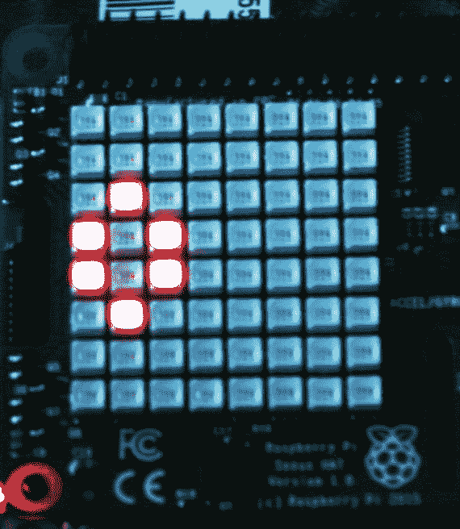

图 10-9。

Sense HAT LED array with the Game of Life running

图 [10-10](#Fig10) 显示了游戏运行时的控制台显示。

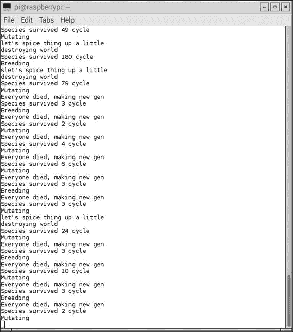

图 10-10。

Console display with the Game of Life running

### 人生游戏的一代

也完全有可能只在一代人身上进行生命游戏的实验。这个脚本只是遵循先前指定的细胞邻居规则，不允许细胞或基因突变。下面的脚本名为 main.py。它与前面的脚本位于同一个 GitHub 网站上。

```py
from sense_hat import SenseHat
from gameoflife import GameOfLife
import time

WHITE = [ 0, 0, 0 ]
RED = [ 255, 0, 0 ]

def main():

    game = GameOfLife()

    sense = SenseHat()
    # cells = [(2, 4), (3, 5), (4, 3), (4, 4), (4, 5)]
    cells = [(2, 4), (2, 5), (1,5 ), (1, 6), (3, 5)]
    game.set_cells(cells)

    while True:
        try:
            canvas = []
            for i in game.world:
                if not i:
                    canvas.append(WHITE)
                else:
                    canvas.append(RED)
            sense.set_pixels(canvas)
            game.run()
            if not game.everyone_alive():
                sense.clear()
                print("everyone died")
                break
            time.sleep(0.1)
        except:
            sense.clear()
            break

if __name__ == "__main__":
    main()

```

输入以下命令运行该脚本:

```py
python main.py

```

初始单元配置由以下语句设置:

```py
cells = [(2, 4), (2, 5), (1, 5), (1, 6), (3, 5)]

```

您可以通过取消注释前面的`cells`数组来尝试另一个配置，然后注释掉这个。我做了那个动作，然后运行了脚本。我观察到一个不寻常的显示，我不会描述。我会留给你去发现。

我想提醒大家，我将要描述的东西可能会让人上瘾。它正在测试新的初始启动模式的后果。有不少人工智能研究人员将他们的职业生涯致力于细胞自动机的研究，其中包括研究生命游戏中令人着迷的进化模式。

图 [10-11](#Fig11) 展示了您可能希望尝试的一些初始配置。伴随单元配置数组值显示在每个模式的旁边。

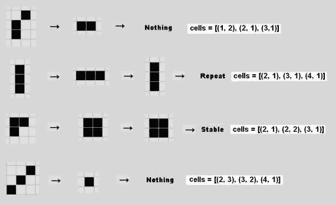

图 10-11。

Example Game of Life starting patterns

其中两个模式立即消失(消失)，一个模式进入双稳态，第四个模式进入稳态。我测试了每种模式，并确认它的行为如图所示。

图 [10-12](#Fig12) 显示了其他的初始模式，你可以试验一下，看看它们是如何按照设定的规则进化的。伴随单元格数组值显示在每个模式的旁边。

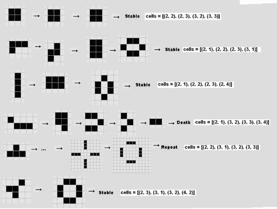

图 10-12。

Additional starting patterns

有一系列的模式是动态的，这意味着它们不断地在网格中移动并重复它们的模式。图 [10-13](#Fig13) 显示了滑翔机绕着网格移动，并且每四代重复其模式。

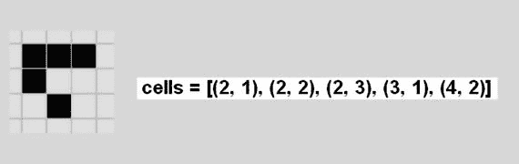

图 10-13。

Glider pattern

类似的动态模式是轻量级飞船，如图 [10-14](#Fig14) 所示。它也会穿过网格。

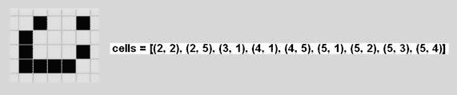

图 10-14。

Lightweight spaceship pattern

康威发现了几个模式，这些模式花了许多代才最终进化，变得既可预测又有周期性。顺便提一下，他是在没有计算机帮助的情况下做出这些发现的。他称这些图案为玛土撒拉，以一个在希伯来圣经中被描述为活了 969 岁的男人命名。这些长寿模式中的第一个被命名为 F-五联体，如图 [10-15](#Fig15) 所示。经过 1101 代后趋于稳定。

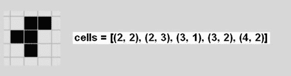

图 10-15。

F-pentomino pattern

图 [10-16](#Fig16) 所示的橡子模式是玛士撒拉经过 5206 代后变得稳定和可预测的另一个例子。

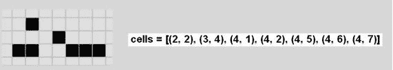

图 10-16。

Acorn pattern

希望尝试更多模式的读者可以去艾伦·亨塞尔的网页`radicaleye.com/lifepage/picgloss/picgloss.html`，在那里他整理了一个相当大的其他常见模式的列表。

这完成了使用康威的生命游戏作为工具对细胞自动机的初步尝试。你现在应该能够进一步试验这个工具，在这个强大的人工智能主题中获得更多的经验和信心。我也强烈推荐史蒂夫·沃尔夫勒姆博士的书《一种新的科学》( Wolfram Media，2002 年),在这本书里，他使用他创建的 Mathematica 应用研究了细胞自动机的整个领域。顺便提一下，Mathematica 应用现在免费提供了最新的 Raspian 发行版，可从`raspberrypi.org`获得。

## 摘要

这一章是关于进化计算的。我用一个故事开始了这一章，这个故事讲述了进化和突变是如何成为 EC 的组成部分的。

第一个演示展示了如何使用进化和变异技术，使用进化编程来找到相当简单的问题的解决方案。首先手动计算解决方案，然后通过 Python 脚本自动计算。

第二个演示介绍了遗传算法和遗传编程的 EC 子主题。我使用了康威的生命游戏的 Python 版本来解释和演示这些概念。本节还介绍了细胞自动机的概念，这是游戏的核心。

这里展示了两个游戏版本:一个使用基因进化和突变，另一个更具决定性，因为你可以指定开始模式。后一个版本被进一步用于检查产生一些不寻常行为的各种细胞模式。

Sense HAT 附件板与 Raspberry Pi 3 一起用于显示生活模拟游戏。