# 3.视力

计算机视觉是从数字图像中提取信息的能力，这些信息总体上定义了图像中的特征。传统上，构建图像处理模型需要对大量数据进行整理。对于精确的数据模型，必须收集代表性的参考图像集。每个图像必须被适当地标记，以便模型可以被训练。在像素级提取信息，并且相对于相邻像素的像素细节被认为是相关的。用机器学习算法分析的特征集能够识别和定位图像中的对象。

在像素级执行的分析对计算要求很高。模型构建往往对存储和计算要求很高。利用计算机视觉的服务和应用可以处理和理解视觉信息，并根据图像中的特征触发事件。计算机视觉的应用包括标记和分类以及预测警报场景。

我们中的许多人在社交媒体网站上有自己的照片，并意识到诸如自动标记照片上的图像和用我们的面部解锁我们的手机等功能表明，在某个地方有人正在收集和存储我们的肖像，以建立和训练模型，以便能够在图像中识别我们。也有许多有趣的应用可以让我们上传图像，并为我们提供对物体的标记和识别，如昆虫、动物、树叶和树木。

当我们考虑工作场所的监控场景时，我们可以利用计算机视觉来识别更复杂的情况。例如，工作场所的危险情况和不符合安全标准是以前由员工视觉监控的事件。认知服务的强大功能使应用能够通过简化分析过程来加快复杂的警报过程。以前，我们不得不依靠工作人员从视觉上识别走道是否堵塞、入口通道是否堵塞或物体是否移位。现在，这些场景可以被标记，并在它们发生时由 AI 系统轻松识别。

认知服务视觉 API 最常用的组件是计算机视觉和自定义视觉 API。我们将了解这些服务，以及如何在分类和预测性警报场景中应用这些服务的一些示例。只需 20 张图像，自定义视觉 API 就可以创建智能二进制模型，我们可以在其中确定一个对象是否是某种类型的对象。我们还将有能力通过物体检测能力来识别和预测物体或特征是否存在。

基于视觉功能，新发布的 Face API 允许对从人的图像中提取的特征进行高级分析。这扩展了我们从复杂图像中提取数据的能力，并对复杂的视频和图像场景进行分析。视频索引器还将视觉功能与文本和语音分析相结合。本章将展示认知服务视觉 API 的易用性、简单性和强大功能，以在您的应用中嵌入视觉分类和对象检测。

## 视觉 API

Vision API 套件封装了用于分析通过 URL 或二进制格式提交的图像和视频的功能。结果以 JSON 有效负载的形式从服务发回。

### Vision APIs 中包含哪些内容

Vision API 套件中包括计算机视觉、自定义视觉、人脸、表单识别器和 Azure 视频分析器 API。在该模型中，各种各样的结果是容易获得的，并且不需要机器学习编程来访问。表 [3-1](#Tab1) 给出了每个 API 所提供内容的描述。

表 3-1。

Vision API 中可用的服务

<colgroup><col class="tcol1 align-left"> <col class="tcol2 align-left"></colgroup> 
| 

服务名称

 | 

服务描述

 |
| --- | --- |
| 计算机视觉 | 计算机视觉服务为您提供对预构建的机器学习模型的访问，这些模型利用高级算法进行图像处理。 |
| 定制视觉 | 定制视觉服务展示了预构建的机器学习模型，并能够上传您自己的图像进行训练。 |
| 脸 | 人脸服务提供了对经过训练的预建机器学习模型的访问。检测面部属性，面部识别可以通过高级面部算法实现。 |
| 表单识别器 | 表单识别器支持从图像中提取键入的文本，并将数据存储在结构化的键值对中，即字段名和字段内容。 |
| Azure 视频分析器(以前的视频索引器) | Azure Video Analyzer 结合了视觉、语言和文本 API 的功能，并支持翻译、图像识别和对象检测。 |

### 参考架构

Vision APIs 允许我们以二进制或通过 URL 向 API 端点发送图像。每个图像中对象的各种特征都以 JSON 格式返回。使用 Custom Vision，我们可以选择上传用于训练的图像，或者在 Docker 或 Kubernetes 容器中本地处理我们的图像。图 [3-1](#Fig1) 显示了您正在编写的代码和认知服务 API 之间的交互。应用代码通过 HTTP 请求向 API 发送文本或图像，并返回一个文本 JSON 响应。认知服务 API 运行在微软在 Azure 上维护的基础设施上，所以你不必在本地设置服务器和安装代码来构建和训练你自己的机器学习模型。

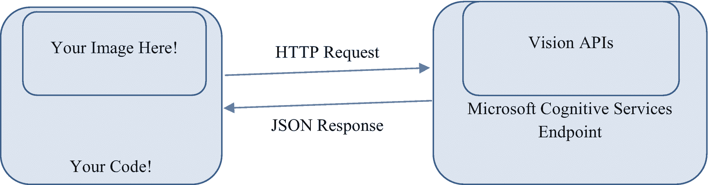

图 3-1。

由应用代码发送到 Azure 上运行的 API 的图像

### 计算机视觉

计算机视觉服务允许您访问预先构建的高级机器学习模型。这些模型是微软已经在由微软管理和维护的基础数据集上执行的训练和预测的结果。不仅数据集由微软存储，而且执行培训的计算资源也由微软维护。这有利于用户，因为他们不必收集或创建自己的数字知识产权(IP)来为相关的机器学习模型提供有意义的数据集。此外，用户不必维护处理这些数据集和生成模型所需的硬件/计算。这里的缺点是这些模型已经建立，用户没有能力调整或影响模型的预测。因此，模型结果不能通过用户的输入来改变。

用于计算机视觉机器学习模型的数据集中包含哪些类型的图像？用于构建和训练机器学习模型的一组图像称为域。大多数计算机视觉项目可以使用普通领域中的日常对象来创建。计算机视觉 API 将基于不同的元素，例如图片的清晰程度和图片中对象的无障碍程度，以相当的准确度返回关于常见对象的分类和细节。为了提高预测的相关性和准确性，微软策划了一些更具体的数据集，如食品、地标和零售领域。这些域由特定于它们的域的图像组成，并且当图像分别包括食物、地标和零售对象时，导致更高的准确性。

Fun Fact

维基百科被用作训练认知服务模型的来源。当你把一个维基百科图片传递给你的认知服务模型时，你有更高的准确率吗？

我们可以从计算机视觉 API 中得到什么类型的输出？应用可以轻松利用计算机视觉 API 来分析图像和标签内容，提取印刷和书写文本，识别品牌和地标，以及适度的内容。API 向程序员公开，应用能够使用机器学习来执行识别，而程序员不需要知道任何机器学习代码！

### 定制视觉

对于我们中那些在我们的图像中有更多细微变化并正在考虑将我们的机器学习模型基于特定数据集的人来说，Custom Vision 将允许用户上传训练数据集并修改预测阈值。使用自定义视觉模型，我们可以回答诸如以下问题:牧场上有多少头奶牛？有了管理我们自己的数据集的附加功能，我们可以上传和标记特定的图像。我们现在可以问，黛西是哪头牛？最后，自定义视觉模型允许用户识别并传回图像中匹配对象的坐标，允许我们回答问题，我今天没有在饲料槽看到 Daisy。我该去牧场的哪里找她？

### 脸

人脸服务提供对专门基于面部属性构建的高级机器学习模型的访问，允许在图像中进行人脸检测、个人识别和情感识别。该服务能够在一幅图像中检测和计数多达 100 幅图像。此外，用户可以管理自己的图像集，并对多达一百万个个体进行识别和匹配。通过计算面部标志的坐标，例如瞳孔、眉毛、眼睛、鼻子、嘴唇和嘴，该服务不仅能够计算头发颜色、头部姿势(俯仰、滚动、偏转)和面部毛发。但它也能预测情绪、微笑和性别。面部分析使我们能够回答这样的问题:照片中的人是谁？图中这个群体的人口统计特征是什么？这群人是开心还是难过？

### 表单识别器

表单识别器利用两种视觉功能，即识别对象和提取坐标的功能以及从图像中提取文本的功能。表单识别器将文本与预定义的边界框进行匹配，以自动化表单中数据的数字存储。数据以键值对和表数据的形式从表单中提取出来，这为业务工作流自动化和文书工作的减少提供了无限可能。

### Azure 视频分析器(以前的视频索引器)

Azure Video Analyzer(以前称为 Video Indexer)是一个 Azure Media Services AI 解决方案，它利用文本、语音和视觉功能从视频中提取信息，并为对象、人物或口述文本和/或短语的外观生成内容标签，如关键帧、场景标记和时间戳。这种增强的元标记支持跨组织数字图书馆的深度搜索功能。这些功能允许用户回答这样的问题:这个对象出现的最后一个视频是哪个？在那段视频中，情况和背景是怎样的？谁出现在视频画面中，带着怎样的情绪说了些什么？

## 计算机视觉服务

AI 图像分析的一个突出用途是增强与媒体文件相关联的元数据，以及高效和批量应用这种增强的能力。已经收集了大量富媒体资产的组织需要一种方法来组织、存储和检索这些资产，以及管理数字权利和许可。计算机视觉服务在自动生成元数据的过程中是有用的，以帮助媒体资产的分类和标记。

### 能力

认知服务计算机视觉 API 提供以下预构建功能，这些功能源自微软构建的机器学习模型，并在微软管理的数据集上进行训练:

*   *内容标签*–根据视觉特征识别并标记图像中的数千个常见对象。

*   *对象检测*–识别并标记图像中的对象，并传回每次出现的对象坐标。

*   *品牌检测*–识别并标记图像或视频中数以千计的全球商业品牌标志。

*   *图像分类*–使用预定义的类别和子类别对整幅图像进行识别和分类。

*   *图像描述*–标记图像后，结果被传递给认知服务文本 API，以创建代表图像内容的句子。

*   *面部检测*–使用计算机视觉 API 识别矩形的坐标、性别和年龄。此外，Face API 还提供面部识别和姿势检测。

*   *图像类型检测*–识别图像是线条画还是剪贴画。

*   *特定领域内容*–识别图像中特定领域的附加特征。

*   *配色方案检测*–识别图像是黑白还是彩色，并提取图像中的颜色。

*   *智能裁剪缩略图*–识别图像中感兴趣的区域，裁剪图像并生成最佳缩略图。

*   *感兴趣区域检测*–识别图像中的感兴趣区域，并传回边界框坐标。

*   *印刷和手写文本识别*–识别并提取图像中的印刷和手写文本及形状。

*   *成人内容分类*–识别含有成人、色情或血腥内容的图像。

### 创建认知服务资源

既然您已经意识到通过计算机视觉 API 可以实现什么，那么您一定想知道，配置和利用这些资源需要做多少工作？假设我们想要分析一幅图像，并从已经建立的计算机视觉模型中调查所有默认可用的可能特征。我们可以从已经训练好的计算机视觉机器学习模型中获取哪些类型的元数据？

我女儿正在收集 1000 个“东西”？如果我将前面的图片传递给认知服务，我将从计算机视觉资源中获得什么类型的元数据？图 [3-2](#Fig2) 显示了视觉 API 创建的边界框。边界框标识图像中对象的边缘。

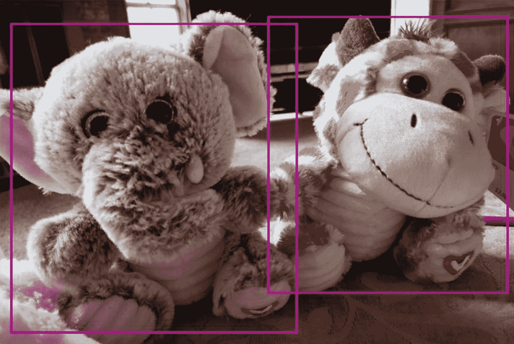

图 3-2。

边界框示例，提供对象坐标

我们开始吧！我们可以继续在 Azure 中创建一个计算机视觉资源。在我们通过 portal.azure.com 登录 Azure Portal 后，我们可以通过搜索栏搜索“计算机视觉”，并从 Azure Marketplace 中选择“计算机视觉”。接下来，我们可以选择一个“位置”，作为奖励，我们仍然可以访问计算机视觉服务的免费层，这将允许我们每分钟打 20 次电话，每月高达 5000 次电话。

图 [3-3](#Fig3) 显示了创建计算机视觉资源所需的字段。在识别一个名字之后，我们可以选择一个“订阅”来分配费用；一个“位置”，即 Azure center，在其中托管我们的资源；以及我们资源的“定价层”。如果我们需要创建一个“资源组”，我们可以通过用户界面快速完成。

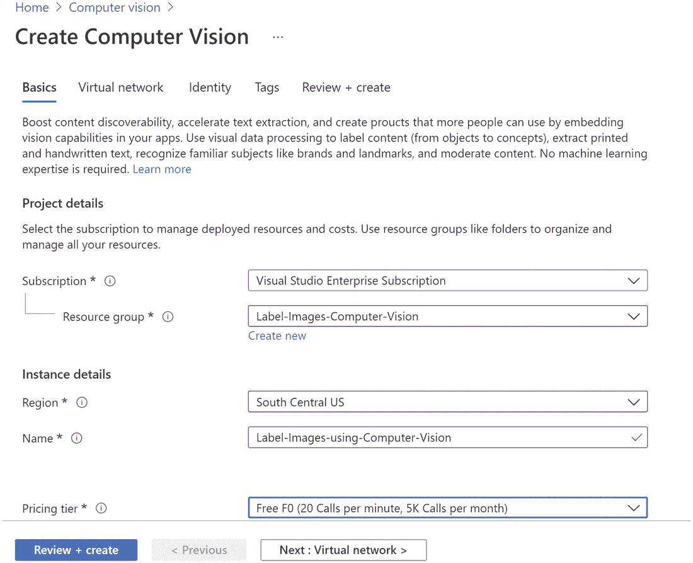

图 3-3。

选择订阅、位置、定价层和资源组

最后一步是审查并确认负责任的 AI 通知，客户有责任遵守在线服务数据隐私协议中包含的生物识别数据义务。然后，我们可以通过我们选择的编程语言中的几行代码将图像传递给计算机视觉 API 进行分析。我们甚至可以通过 API 参考文档直接测试 API。

“计算机视觉 API”页面为您测试 API 提供了一个界面。准备好提供您的 Ocp-Apim-Subscription-Key，以授权访问您的认知服务模型。我们可以从 Azure Portal 获取信息，方法是选择我们的资源，并导航到左侧导航中“资源维护”下的“密钥和端点”选项卡。第一步是选择提供认知服务的地区。如图 [3-4](#Fig4) 所示，显示服务可用的所有地区。

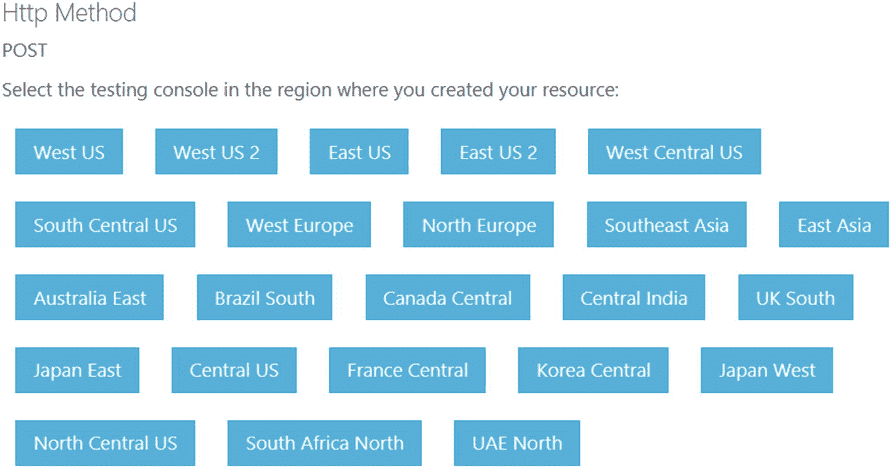

图 3-4。

认知服务可用的蔚蓝区域

我们在美国中南部地区创建了我们的服务，所以这是我们应该选择的选项。当我们点击“美国中南部”按钮时，我们被重定向到美国中南部的 API 控制台页面，如图 [3-5](#Fig5) 所示。

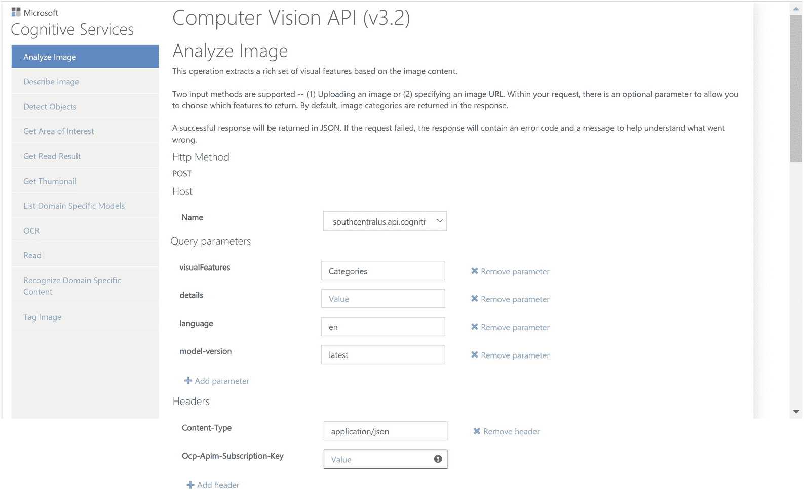

图 3-5。

计算机视觉 API 页面提供了一个测试界面

计算机视觉 API 控制台页面将要求我们提供参数，否则我们将在 API 调用中包含这些参数。这些参数包括

*   *Name*–这预先填充了该地区认知服务主机的 URL，即 south central . API . Cognitive . Services。

*   *查询参数，视觉特征*–我们可以选择让 API 返回以下任何特征:成人、品牌、类别、颜色、描述、面孔、图像类型、对象和标签。默认情况下返回类别。

*   *查询参数，明细*–默认=空。我们可以选择是使用地标还是名人域名。

*   *查询参数，语言*–默认=“en”，为英语。我们可以选择用以下语言返回结果:“es”，西班牙语；“ja”，日语；“pt”，葡萄牙语；还有“zh”，简体中文。

*   *Headers，Content-Type*–Default = " application/JSON。"

*   *Headers，Ocp-Apim-Subscription-Key*–我们可以在 Resource Maintenance 下的 Keys and Endpoint 选项卡中找到它。

最后一步是传递我们的图像文件。我已经将图片上传到 GitHub，文件可以通过以下网址获得:

[T2`https://raw.githubusercontent.com/AIwithAlicia/AIusingMicrosoftCognitiveServices/master/Chapter%203/1000stuffies.jpg`](https://raw.githubusercontent.com/AIwithAlicia/AIusingMicrosoftCognitiveServices/master/Chapter%25203/1000stuffies.jpg)

当我填充我的参数时，POST 方法被动态填充，我可以看到什么被发送到 API，如图 [3-6](#Fig6) 所示。

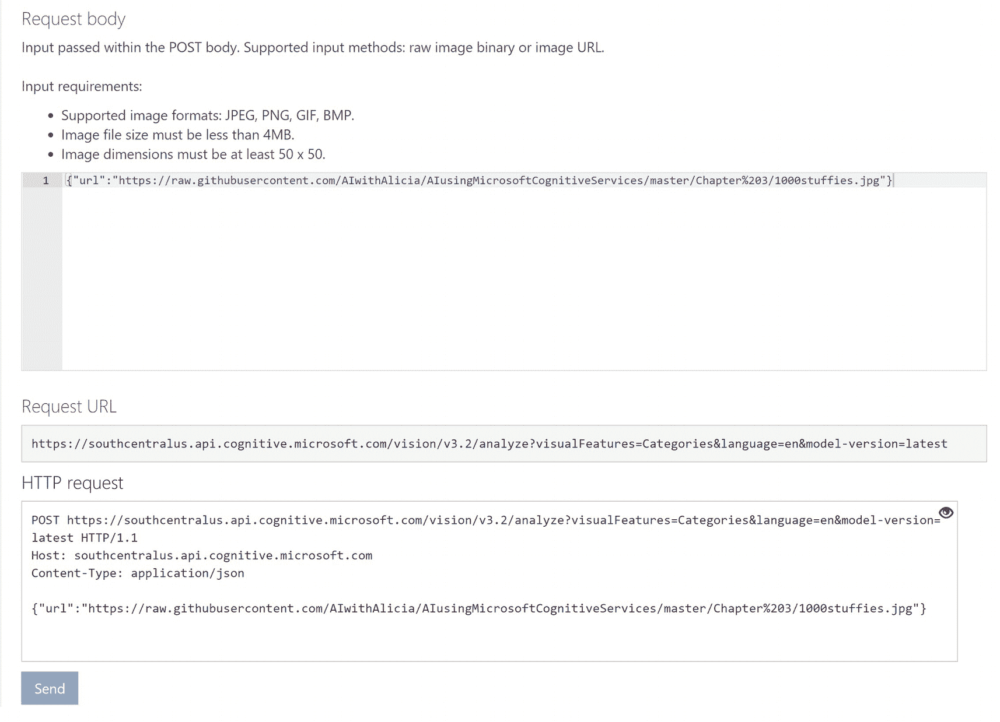

图 3-6。

POST 方法是使用输入 URL 动态填充的

我现在准备单击 Send，我的 POST 请求的结果在 JSON 中返回给我，解析后看起来像表 [3-2](#Tab2) 。从计算机视觉 API 返回的结果提供了图像内对象的边界框坐标。标签、成人分类和颜色的类别和置信水平也被确定。

表 3-2。

API 以 JSON 格式返回的结果示例

<colgroup><col class="tcol1 align-left"> <col class="tcol2 align-left"></colgroup> 
| 

功能名称

 | 

价值

 |
| --- | --- |
| 目标 | [ { "rectangle": { "x": 2107，" y": 233，" w": 1882，" h": 2366 }，" object ":"泰迪熊"，" parent": { "object": "Toy "，" confidence": 0.849 }，" confidence": 0.841 }，{ "rectangle": { "x": 70，" y": 301，" w": 2244，" h": 2637 }，" object ":"泰迪熊"，" parent": { "object": "Toy "，" confidence": 0 |
| 标签 | [ { "名":"玩具"，"信心":0.9723017 }，{ "名":"泰迪熊"，"信心":0.928446651 }，{ "名":"兔子"，"信心":0.901703 }，{ "名":"室内"，"信心":0.8606236 }，{ "名":"动物"，"信心":0.8501977 }，{ "名":"毛绒玩具"，"信心":0.837977 |
| 描述 | { "tags": ["室内"、"坐着"、"填充"、"桌子"、"泰迪熊"、"食物"、"棕色"、"堆"、"抱着"、"前面"、"靠近"、"白色"、"组"、"穿着"、"大"、"女人"、"狗"、"红色"、"站着"、"厨房"]、"标题":[ { "text ":"一群泰迪熊坐在一堆填充动物玩具上面"、"信心":0.8870842 } ] } |
| 图像形式 | " Jpeg " |
| 图像尺寸 | 3024 x 4032 |
| 剪贴画类型 | Zero |
| 线条绘制类型 | Zero |
| 白纸黑字 | 错误的 |
| 成人内容 | 错误的 |
| 成人分数 | 0.003308527 |
| 生动的 | 错误的 |
| 活泼的分数 | 0.006383676 |
| 种类 | [ { "name": "others_ "，" score": 0.00390625 } ] |
| 表面 | [] |
| 主色背景 | “棕色” |
| 主色前景 | “灰色” |
| 强调色 | #996732 |

从这些结果中，我们现在有了额外的元数据，使我们能够轻松地标记和分类我们的图像。元数据结果还允许我们基于图像的内容触发过程。例如，当您可以根据图像的成人内容分数触发自动化时，从您的公共网站过滤掉并禁用包含成人内容的用户帖子将变得更加容易。

### API 参考:计算机视觉

由于计算机视觉背后的机器学习模型是预先训练好的，所以有许多 API 函数是暴露的，并且可供程序员使用。计算机视觉 3.2 版 API 包括表 [3-3](#Tab3) 中列出的功能。

表 3-3。

计算机视觉 3.2 版 API POST 和 GET 函数

<colgroup><col class="tcol1 align-left"> <col class="tcol2 align-left"></colgroup> 
| 

职位职能

 | 

获取功能

 |
| --- | --- |
| 分析图像，描述图像，检测对象获取感兴趣的区域，获取缩略图OCR，读取，标记图像识别特定领域的内容 | 获取读取结果列出特定于域的内容 |

## 定制视觉服务

自定义视觉 API 和计算机视觉 API 之间的区别在于，能够通过为机器学习模型的训练提供您自己的图像来影响模型的结果。

### 能力

计算机视觉 API 允许我们 1)上传我们的图像，2)训练我们的模型，然后 3)评估我们的预测。

自定义视觉训练 API 为我们提供了以下方法:

*   *项目*–创建和管理项目，包括上传图像以及创建和分配标签。

*   *添加标签*–创建元数据标签，为您的图像添加标签。

*   *培训*–使用您上传的图像来培训和测试您的模型，并将结果和配置附加到迭代中。

*   *导出*–将定制的 Vision 项目导出到 TensorFlow for Android、Core ML for iOS 11、ONNX for Windows ML 或 Docker 容器。

自定义视觉预测 API 为我们提供了以下方法:

*   *classify image*–根据自定义标签和上传的数据集，对图像中的对象进行分类。

*   *detect image*–提供被检测图像的边界框。

为了增加我们洞察力的附加价值，我们提供了图像“域”,代表使用特定图像训练的模型:

*   *图像分类领域*–普通、食品、地标、零售和紧凑型领域

*   *目标检测域*–通用、徽标和紧凑域

Note

紧凑域为在移动设备上使用而优化！

### 最佳实践:用于培训的图像

您的模型的结果将只与您用来构建它的图像集合一样好。构建健壮模型的关键是多样性！在收集各种图像时，您希望确保从各种摄像机角度、照明场景和背景中获得足够多的图像，这些图像将公平地代表您将在生产中分析图像的情况，例如，如果您在户外评估拖拉机的图像，拖拉机将暴露在雨水中，并且可能会或可能不会被灰尘覆盖。为了与真实场景相关，您需要确保在用于构建模型的数据集中包含真实图像，而不仅仅是全新拖拉机的图像。此外，您可能希望包括各种类型和大小的图像，以及单个和成组的拖拉机。

我们还必须记住，为了与 API 兼容并被 API 接受，图像需要具有以下特征:

*   。jpg、. jpgpng 文件扩展名为. png 文件扩展名为. png 文件扩展名为. png 文件扩展名为. png 文件扩展名为. png 文件扩展名为. png 文件扩展名为. png 文件扩展名为 bmp，或。gif 格式。

*   大小不超过 6 MB(预测图像为 4 MB)。

*   最短边不少于 256 像素。任何短于此长度的图像将被自定义视觉服务自动放大。

### 利用自定义视觉进行小狗检测

随着电子邮件使用的增加以及允许用户传输图像的应用的使用，对工作场所内图像的自动分类和标记的需求也在增加。自定义视觉 API 可用于识别和标记图像中的对象。

为了遵守隐私法，我们将利用一个图像数据集，其中包括作者的填充动物和家庭宠物之一。别担心。作者 7 岁的女儿已经同意在本出版物中使用他们小狗的肖像！

开始之前，我们需要

*   Azure 订阅

*   15 张我们小狗的照片

*   15 张毛绒动物的图片

是的，每个分类只有 15 个图像来构建您的自定义视觉模型！

CustomVision.ai 是创建自定义 Vision 项目的起点。你可以通过 [`https://CustomVision.ai`](https://customvision.ai) 到达那里。

你将需要你的 Azure 帐户，你可以使用你的 Azure 凭据直接登录。您可以通过点击“新建项目”来创建您的新项目，如图 [3-7](#Fig7) 所示。

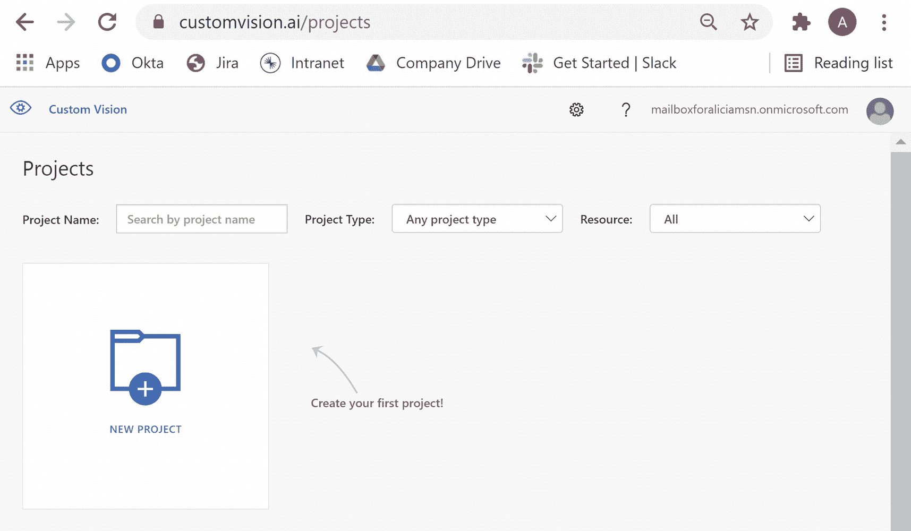

图 3-7。

在 CustomVision.ai 门户上创建“新项目”

我们将创建一个名为“寻找小狗”的新项目该项目将引用已经在我们的 Azure 订阅中创建的资源和资源组。资源组是一个容器，用于保存在同一系统中运行的服务集合。建议在设计您的 AI 系统时，在同一个资源组中创建您的服务。还建议在同一个区域内创建资源，以减少因必须长距离遍历而导致的延迟。

如图 [3-8](#Fig8) 所示，要创建一个新项目，我们从类型分类或对象检测中选择。我们将创建一个“对象检测”项目，在一般领域。

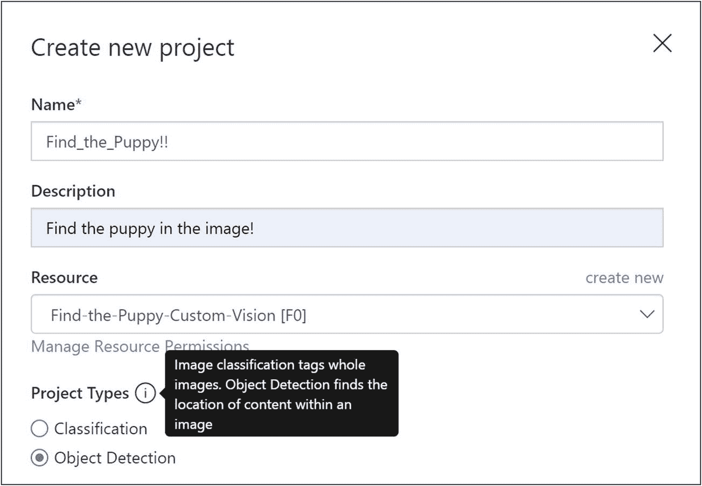

图 3-8。

创建新的项目用户界面

图 [3-9](#Fig9) 所示的默认域提供了对由微软开发的高级机器学习模型驱动的 API 的访问。

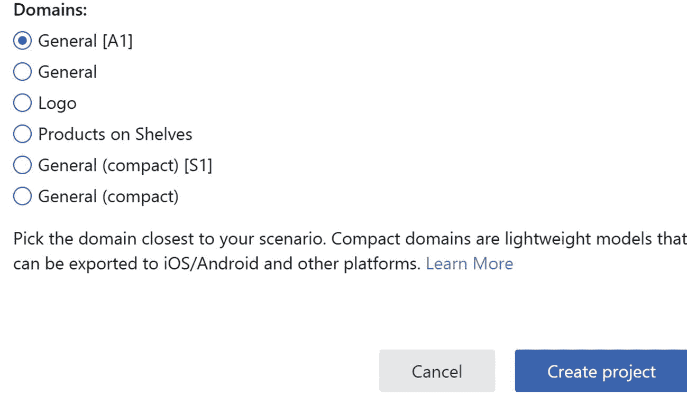

图 3-9。

从创建新项目界面中选择一个域

对于这个例子，我们将在美国中南部地区创建一个资源，因为我在德克萨斯州的休斯顿，那里是最近的 Azure 数据中心。我们可以验证配置细节，如图 [3-10](#Fig10) 所示，并选择“创建”

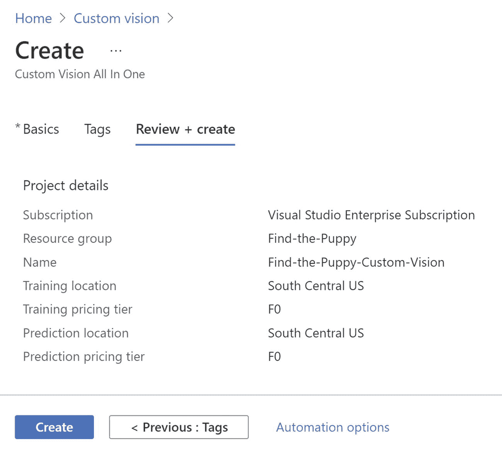

图 3-10。

在创建新资源之前查看参数

单击“创建”后，我们将被定向到项目登录页面，如图 [3-11](#Fig11) 所示。

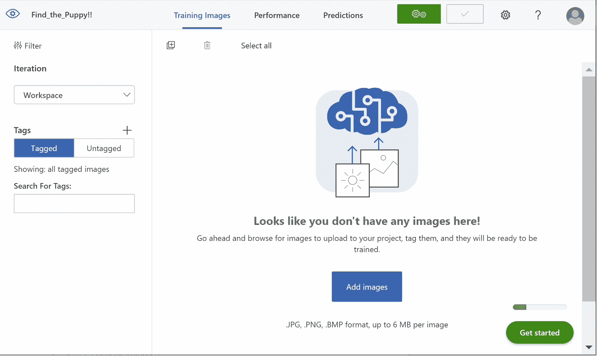

图 3-11。

CustomVision.ai 上的新空项目

有许多方法可以将图像添加到我们新创建的项目中。最简单的方法是点击页面中间的“添加图片”按钮。我们可以导航到包含我们的训练图像的文件夹，并按 Ctrl+A 选择文件夹中的所有图像。该界面将显示我们的图像预览，并提示我们上传所有图像。

选择“添加图像”后，我们可以导航到包含图像的文件夹，并执行“全选”当执行批量上传时(图 [3-12](#Fig12) ，用户界面将在上传中预览图像。

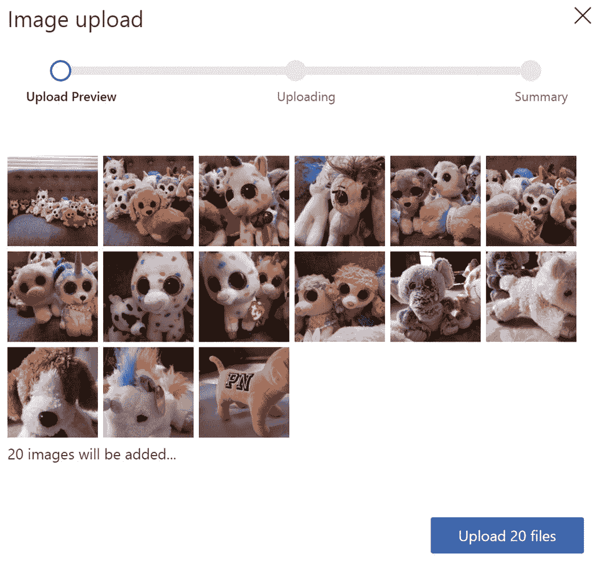

图 3-12。

执行批量上传时预览图像

自定义视觉是一种使用监督学习创建机器学习模型的方法。这意味着我们正在提供被归类为具有某些特征的物品的例子，或真或假。我们能够利用图像并应用“标签”作为标签，而不是迭代 if，then，else 语句的循环。在这个练习中，我们可以提供两组例子:一组代表填充动物玩具的图片和一组代表小狗的图片。

自定义视觉利用监督学习。为了教导模型对象之间的区别，我们必须标记每种类型的对象。接下来的步骤是创建一个新的标签，这样我们就可以为模型提供一个学习的例子。选择“+”号，弹出“创建新标签”对话框，如图 [3-13](#Fig13) 所示。我们首先为“填充动物”创建一个标签，让我们能够识别填充动物案例的真实阳性(TP)图像。

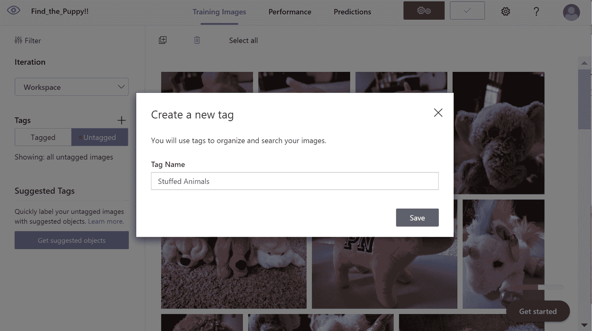

图 3-13。

创建新标签

选择每个图像并指定一个标签。图 [3-14](#Fig14) 显示了边界框和标签“填充动物”

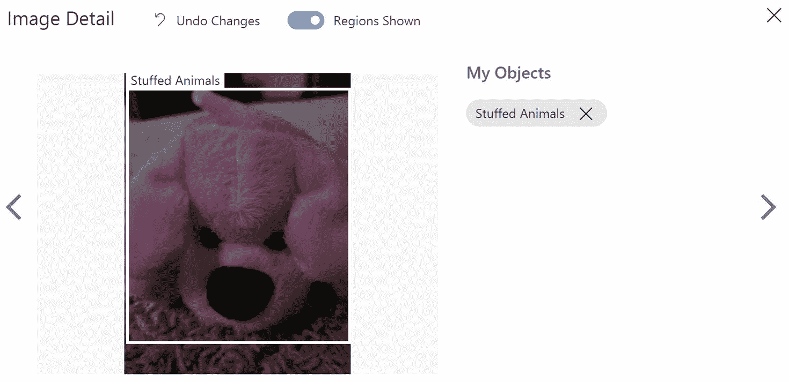

图 3-14。

用标签“填充动物”标记的图像中的对象

然后，我们一步一步地浏览我们的每张图片，并进行适当的标记。图 [3-15](#Fig15) 显示了所有带有“填充动物”标签的图像。

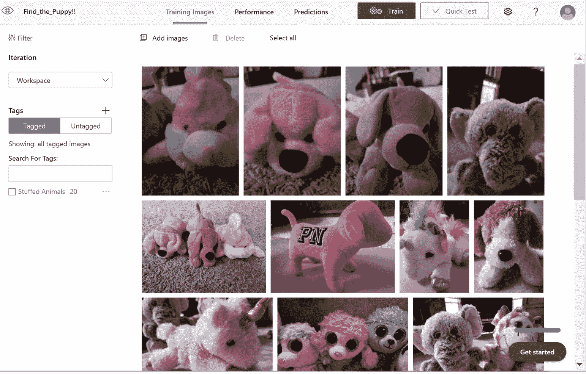

图 3-15。

图像可以通过指定的标签进行分类

在我们标记了第一批填充动物图片后，我们可以执行相同的步骤来上传我们小狗的图片。上传后，我们可以创建一个标记小狗图片的新标签，名为“小狗”，如图 [3-16](#Fig16) 所示。

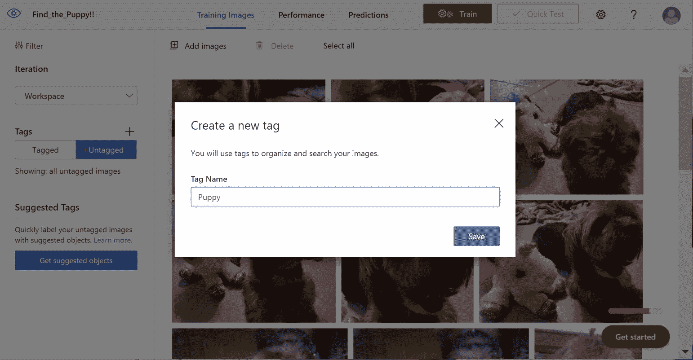

图 3-16。

创建“小狗”标签

然后，我们可以选择左侧导航窗格上的“未标记”过滤器，只过滤我们上传的新照片，然后我们可以开始用“小狗”标签标记图像。如图 *图*[T5】3-17](#Fig17)*所示，我们可以点击图像内框住小狗的矩形，选择“小狗”标签* *。*

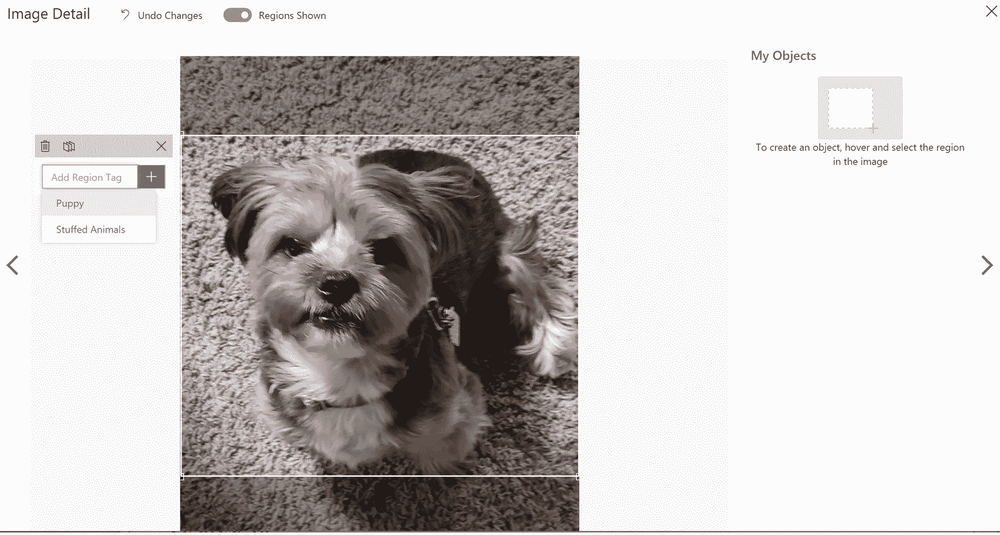

图 3-17。

将“小狗”标签指定给边界框

标记所有图像后，我们可以通过选择项目顶部的绿色“训练”按钮来执行“快速训练”。我们可以在“快速培训”和“高级培训”之间进行选择默认的“快速训练”选项将允许我们立即训练我们的模型，如图 [3-18](#Fig18) 所示。

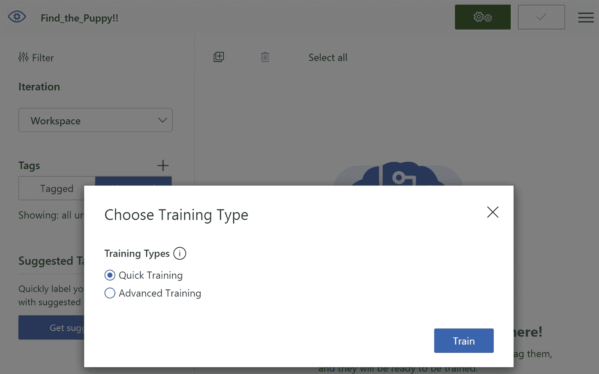

图 3-18。

默认为“快速训练”；选择“火车”

图 [3-19](#Fig19) 显示了训练结果，显示精度为 56.5%。我们可以将阈值提高到默认的 30%以上，以减少假阳性(FP)的发生。

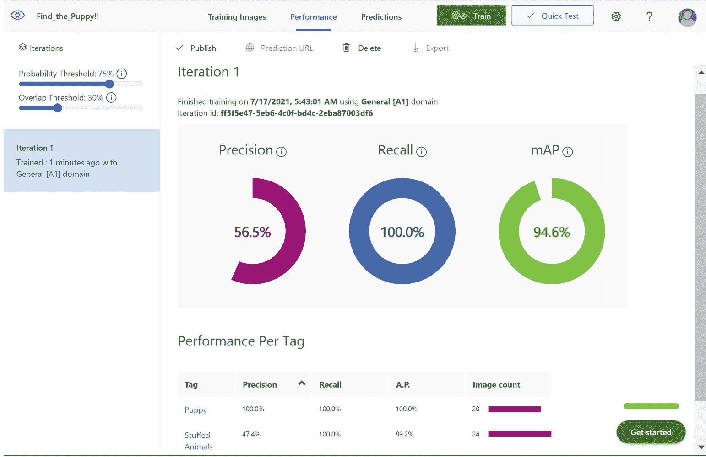

图 3-19。

显示训练结果，即迭代结果

我们现在可以选择项目顶部的“快速测试”按钮，并上传图像或传递 URL 到我们的模型进行训练。我们的图像校正的快速测试以 97.4%的准确率识别出一个填充动物，以 99.9%的准确率识别出我们图像中的一只小狗。为什么我的准确率这么高？我有一个训练图像，它与用于预测的图像非常相似。这可能会导致问题。在这样一个小数据集的情况下，该模型将很难准确预测新图像，因为缺乏训练它的多样化图像。图 [3-20](#Fig20) 显示了认知服务 API 处理后的图像。标签与每个标签的准确性概率一起被分配给图像内的对象。

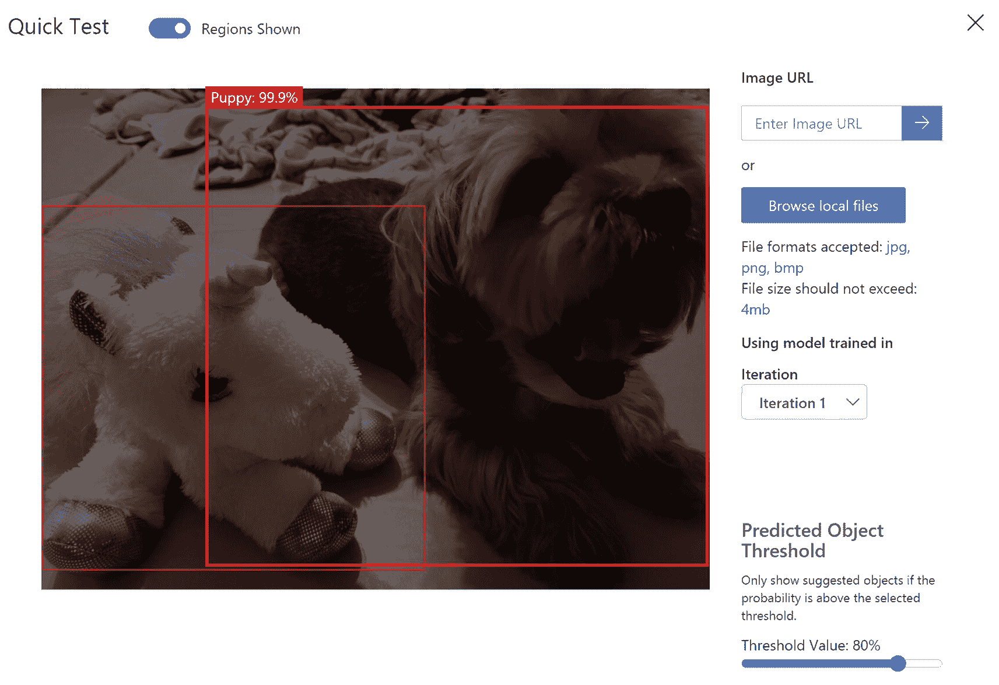

图 3-20。

分配了标签的图像后处理

Tip

请注意，对于 S0 层，您可以上传多达 100，000 张图片用于培训，并使用多达 500 个标签！这使您能够为您的训练集提供各种各样的图像！

为了以编程方式与我们的定制视觉模型进行交互，我们可以在设置中访问我们的键和端点，通过单击齿轮可以访问它们。如图 [3-21](#Fig21) 所示，可通过齿轮图标访问型号设置。轻松分组与您的自定义视觉模型交互所需的信息。

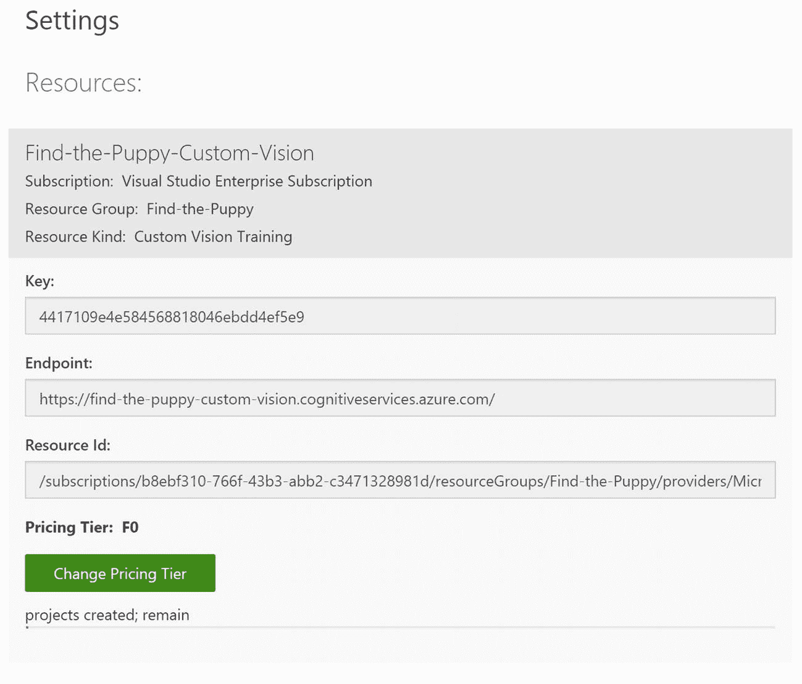

图 3-21。

模型设置

### API 参考:自定义视觉培训 API

Custom Vision Training API 为我们提供了一组功能，使我们能够通过 CustomVision.ai 门户以编程方式执行我们能够执行的所有步骤。通过这些功能，我们能够上传我们的图像，并训练和调整我们的模型。也就是说，我们能够创建、获取、更新和删除项目、图像、标签和迭代。自定义视觉训练 3.4 版 API 包括表 [3-4](#Tab4) 中列出的功能。

表 3-4。

自定义视觉培训 3.4 版 API 函数

<colgroup><col class="tcol1 align-left"> <col class="tcol2 align-left"> <col class="tcol3 align-left"></colgroup> 
| 

职位职能

 | 

获取功能

 | 

删除和修补功能

 |
| --- | --- | --- |
| 创建图像 sFromData 创建图像区域CreateImagesFromFiles创建图像压缩CreateImagesFromUrls创建图像标签创建项目创建标签导出迭代GetImageRegionProposals导入项目发布迭代查询预测QuerySuggestedImageCount查询建议的图像快速测试图像QuickTestImageUrl建议标签和区域培训项目更新图像元数据 | 出口项目get domain getactivatives获取域GetExports GetImageCountGetImagePerformanceCount获取图像性能GetImagesByIds GetImagesGetIterationGetIterationPerformanceGetIterations获取项目获取项目葛塔格GetTaggedImageCountGetTaggedImages获取标签GetUntaggedImageCountGetUntaggedImages | 删除图像区域删除图像删除图像标签删除迭代删除预测删除项目删除标签取消发布更新迭代更新项目更新标签 |

### API 参考:自定义视觉预测 API

类似地，自定义 Vision 预测 API 为我们提供了一个函数集合，以编程方式执行我们能够通过 CustomVision.ai 门户执行的所有步骤。我们能够创建、获取、更新和删除项目、图像、标签和迭代。自定义视觉预测 3.3 版 API 包括表 [3-5](#Tab5) 中列出的函数。

表 3-5。

自定义视觉预测 3.3 版 API 函数

<colgroup><col class="tcol1 align-left"> <col class="tcol2 align-left"></colgroup> 
| 

职位职能

 |
| --- |
| 分类图像ClassifyImageURLClassifyImageUrlWithNoStoreClassifyImageWithNoStore | 检测图像检测图像 UrlDetectImageURLwithNoStoreDetectImageWithNoStore |

### 预测性天气监测:图像分类

自定义视觉 API 允许我们使用少至 15 张图像来轻松训练机器学习模型。我们能否利用 API 来简化现实场景中的预测分析？是否有机会利用现有的基础设施，包括现有的摄像机和监测设备，以获得更容易获得的先进天气监测的见解？

Tip

微软积极提供技术、资源和专业知识，以支持人工智能的发展。有兴趣学习更多关于人工智能的知识吗？访问 [`www.microsoft.com/en-us/ai/ai-for-good`](http://www.microsoft.com/en-us/ai/ai-for-good) 了解微软如何为地球、健康、无障碍、人道主义行动和文化遗产支持人工智能。

### 利用自定义视觉进行天气警报

传统的数值天气监测涉及大量数据集的分析。NOAA 的国家业务模式档案和分发系统(游牧民)提供以下 NWP 和同化数据:

*   全球数据同化系统(GDAS)

*   全球集合预报系统(GEFS)

*   全球预报系统

*   气候预测系统

*   北美多模式集合

*   北美中尺度

你能想象建立和维护一个依赖于如此巨大数量和种类的数据的天气系统需要多少时间、精力和数据吗？图 [3-22](#Fig22) 显示了存储和管理构建天气数据的传统机器学习模型所需的数据所需的基础设施数量。

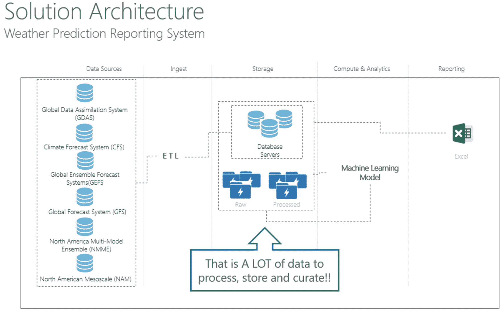

图 3-22。

解决方案架构:传统天气预报系统

现在让我们通过认知服务 API 创建一个预测天气模型！我们将逐步实现图 [3-23](#Fig23) 所示的解决方案。我们可以导航到 CustomVision.ai 门户并创建一个新项目。我们可以执行二元测试，以确定通道是否被淹没。

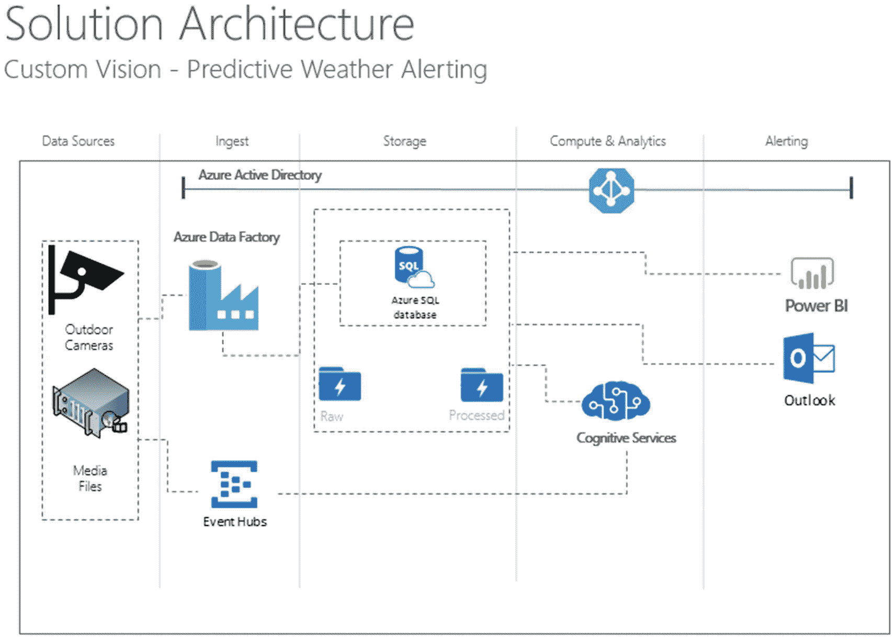

图 3-23。

解决方案架构:预测性天气警报系统

我们从一组图像开始，这些图像取自我们认为通道处于“淹没”状态的场景。在这个场景中，我们收集了 20 个满足这个条件的图像。我们将浏览创建新项目所需的步骤，如图 [3-24](#Fig24) 所示。

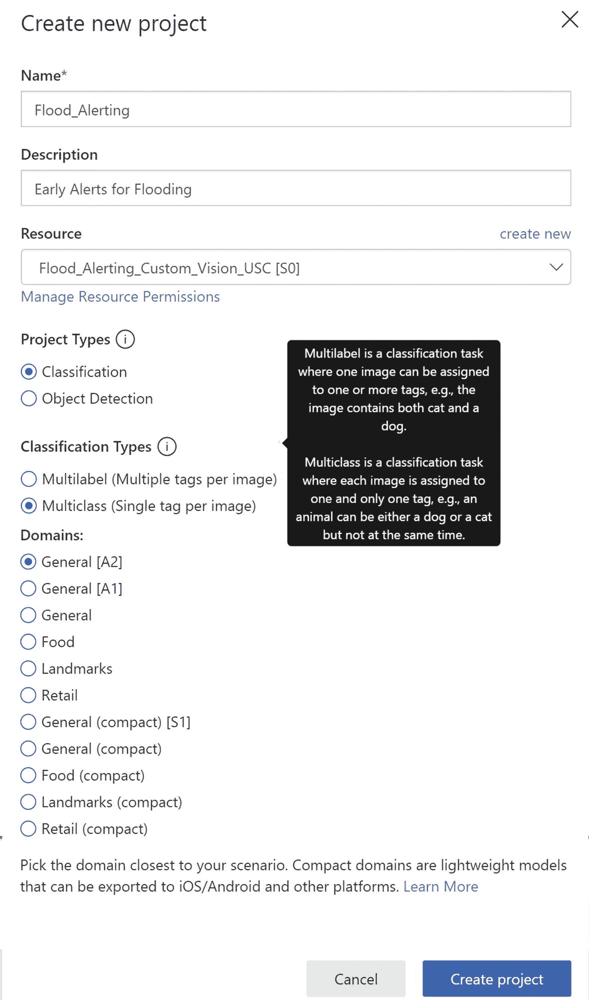

图 3-24。

创建新的自定义视觉分类项目

单击添加图像，导航到保存图像的文件夹，并执行全选。我们可以很容易地用合适的标签一次性“标记”所有图像。图 [3-25](#Fig25) 显示批量上传成功的“淹没”示例图像。

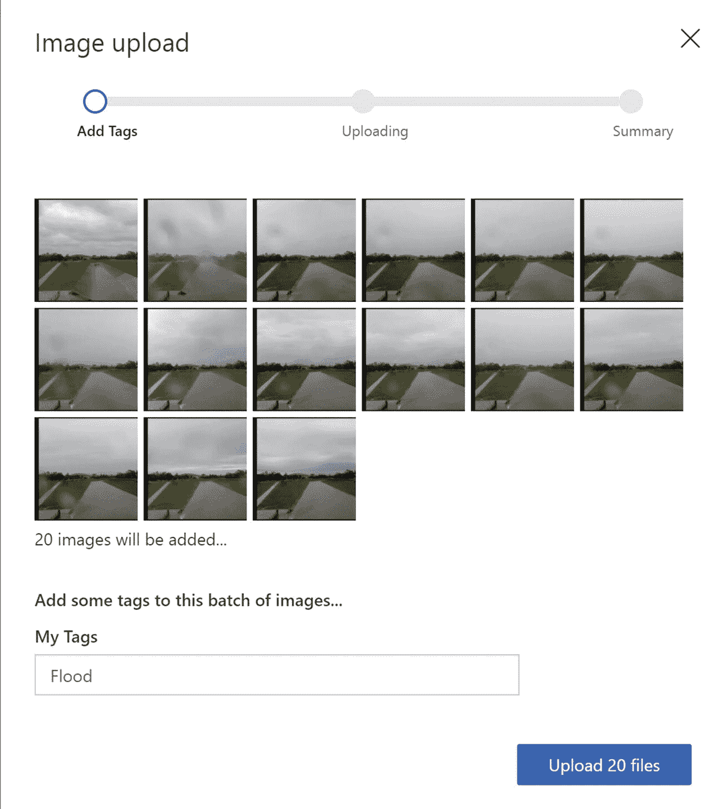

图 3-25。

“淹没”类型的图像批量上传并标记

现在，我们可以从我们认为通道不处于“淹没”状态的场景中获取一组图像。在这个场景中，我们收集了 20 个满足这个条件的图像。

单击添加图像，导航到保存图像的文件夹，并执行全选。这一次，我们可以用“负”来标记图像，而不是指定一个命名标签。这表明图像不满足任何现有的标签标准。图 [3-26](#Fig26) 显示批量上传成功的“负面”示例图像。

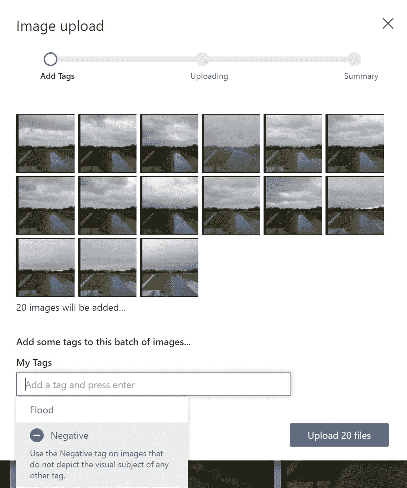

图 3-26。

“负面”类型的图像批量上传并标记

我们现在有两组图像可用作模型学习的数据源。我们可以选择火车和运行快速列车。

在快速训练之后，结果与第一次迭代一起存储。当我们对模型进行变更时，我们可以保存配置，并将它们匹配到它们的迭代中。图 [3-27](#Fig27) 显示我们已经成功上传了 20 张标记为“淹没”和 20 张标记为“负面”的图像下一步是点击绿色齿轮按钮开始训练。

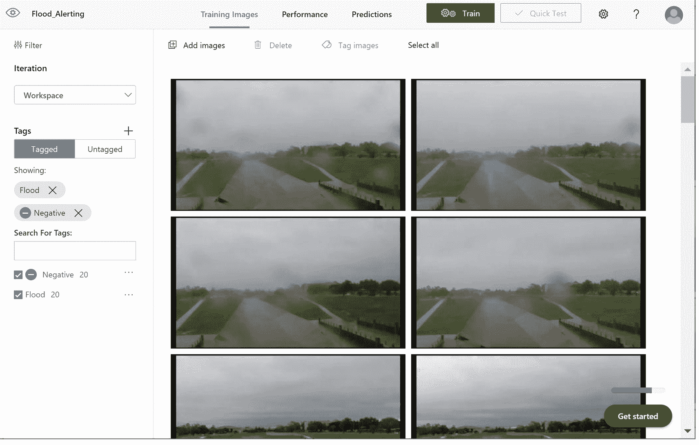

图 3-27。

“淹没”类型的图像批量上传并标记

在提示符下，我们将选择“快速训练”，几秒钟后，我们将看到如图 [3-28](#Fig28) 所示的迭代结果。我们创建了一个机器学习模型，它拍摄了两组反映两种不同状态的图像，“洪水”和“非洪水”。机器学习模型将根据用于训练的图像中特征的相似性来预测图像代表哪个状态。在机器学习中，我们寻求最大化真阳性和真阴性，同时最小化假阳性和假阴性(FN)。如果某事物被预测为一种状态，并且真实地代表该状态，则该事物为真。例如，一个空水道的图像对于“非洪水”将是真阳性，对于“洪水”将是真阴性类似地，相同图像对于“洪水”将是假阳性，而对于“非洪水”将是假阴性

在 Performance 选项卡上，我们可以查看迭代结果。我们的精度和召回结果让我们知道我们的真阳性(TP)预测相对于假阳性(FP)和假阴性(FN)的百分比。

精度的公式是 TP/TP+FP，其中没有误报的模型的精度为 1.0。

召回的公式是 TP/TP+FN，其中没有假阴性的模型将具有 1.0 的召回。

精确度和召回率越高，我们的模型性能就越好。如果我们的精度和召回率一直很低，那么我们应该评估我们的案例是否被我们的训练数据集清楚地定义。我们有足够清楚的例子说明水道处于“非洪水”状态吗？还是“洪水”和“非洪水”的例子图像看起来太像了？

平均精度(AP)是模型性能的度量，反映了模型的平均性能。我们接受的精确度和召回率的最小值应该是多少？构建模型时要考虑的一点是您对假阳性和假阴性的容忍度有多高。对于一个医学预测，我可以看到我们将如何希望有极高的精度和召回值，而一个食品分类预测可能不会因为错误地将 pluot 分类为 plum 而产生太多的后果。

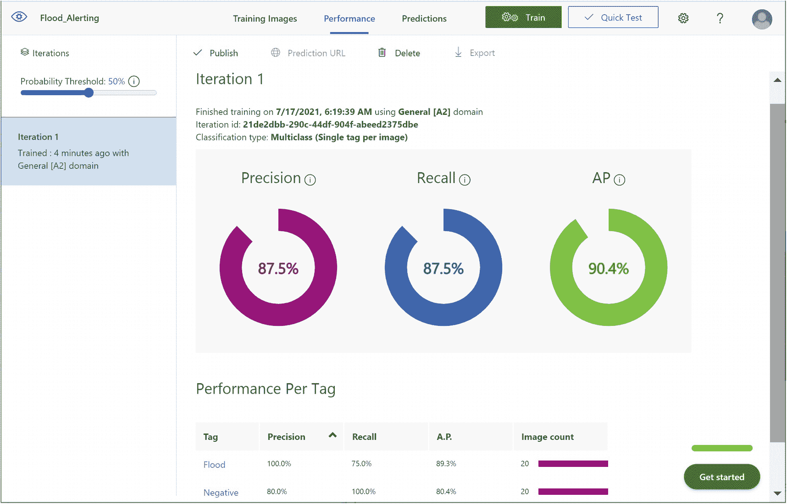

图 3-28。

迭代结果

当我们查看我们的训练结果时，我们注意到我们对“洪水”的准确率= 100%，对“非洪水”的召回率= 100%。这反映了虽然我们可能有假阴性，即一些“洪水”被预测为“非洪水”，但我们没有假阳性，或者一些“非洪水”被预测为“洪水”。这可能意味着，虽然我们的“洪水”图像与“洪水”状态非常相似和不同，但“非洪水”状态可能没有被清楚地识别。

现在我们可以测试我们的模型了。图 [3-29](#Fig29) 是代表“非洪水”状态的图像示例。我们的模型显示，有 56.9%的可能性，水道不会被淹没。

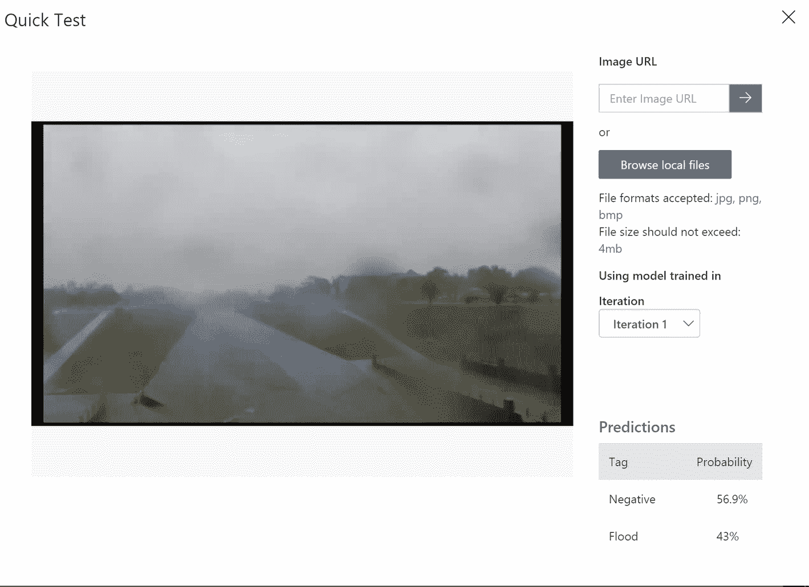

图 3-29。

快速测试一个非淹没图像的例子

让我们也测试一个代表淹没状态的图像，如图 [3-30](#Fig30) 所示。我们可以选择“快速测试”按钮，并选择本地图像的路径或传递图像 URL。对于这个例子，我们将首先传递一个洪水图像，我们注意到，即使图像被相机上的雨水模糊，我们仍然能够获得 74.1%的结果，即水道被淹没的概率。

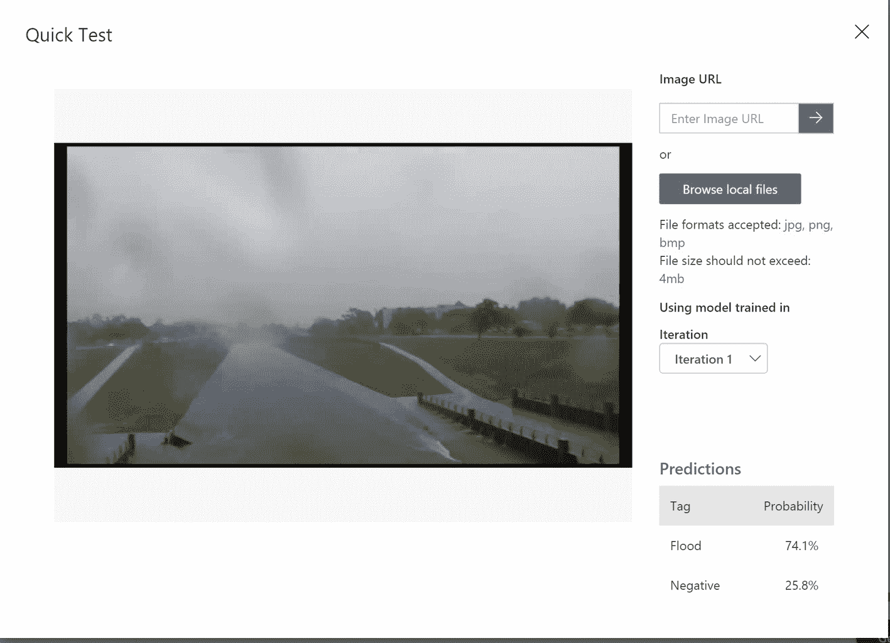

图 3-30。

快速测试一个泛洪图片的例子

#### 最佳实践:提高精确度

为了提高预测的准确性，我们可以做的一些事情是为模型提供足够的有效示例来进行比较。

我们是否提供了足够多的各种图像？每种变异的数量是否足够？光线是否与实际环境一致，图像是否在相似的条件下拍摄？

我们花了多长时间来构建和训练我们的模型？涉及到多少代码？你需要花多长时间教会员工执行上述步骤？微软认知服务 API 旨在将人工智能的能力带给每个人。您可以看到，通过遵循前面的步骤，可以在几个小时内轻松创建一个机器学习模型！

## 脸

面部识别 API 是微软 AI 认知服务套件的一部分。人脸服务检测图像中的人脸，并返回其位置的矩形坐标。可选地，人脸检测可以提取一系列人脸相关属性。例如头部姿势、性别、年龄、情绪、面部毛发和眼镜。Face API 基于 Azure，是 Vision API 功能的子集。为了利用 Face API，可以通过多种语言以编程方式将图像发送到 API。除了图像文件，调用者还可以提交参数，详细说明要发送回哪个返回值子集。

### 能力

*   *人脸检测*–图像中人脸的坐标。可选面部属性

*   *人脸验证*–评估两张人脸是否属于同一个人

*   *查找相似的*–查找与图像匹配或相似的人脸

*   *面部分组*–分割一组图像，将相似的图像分组

*   *人物识别*–根据人物数据库识别检测到的人脸

### 说话人分析:使用 Face API

我们如何增加活动发言人的多样性？要改进某样东西，首先要衡量它。Face API 允许我们从过去的事件中收集一些我们可能无法收集的人口统计数据，这可以让我们更好地了解如何改善这些趋势。

对于本例，我们将使用人脸检测功能，并探索提取人脸相关属性的选项。对于这个例子，我们将请求性别和面部毛发的面部属性。一般的假设是，被归类为“女性”的面部毛发浓密的人可能会被错误归类！性别的预期响应是男性或女性，面部毛发返回三个面部毛发区域的长度:小胡子、胡须和鬓角。长度是介于[0，1]之间的数字，0 表示该区域没有面部毛发，1 表示该区域有长的或非常浓密的面部毛发。

作为输入，我使用图 [3-31](#Fig31) 中所示的图片，这张照片来自最近的休斯顿地区系统管理用户组(HASMUG)–Azure Edition 活动，从左到右包括 Ryan Durbin、Billy York、我自己和 Jim Reid。

图 3-31。

演讲者组，三男一女

一旦我们登录到 Azure Portal，我们可以通过从 Azure Marketplace 中选择它来轻松创建一个 Face 服务。如图 [3-32](#Fig32) 所示，我们可以将图像传递给 API。下面给出了一段调用 Azure 笔记本中 API 的 Python 代码示例。代码的前两步将您的 API 订阅密钥分配给变量 Ocp-Apim-Subscription-Key，并定义作为 API 输入的参数。

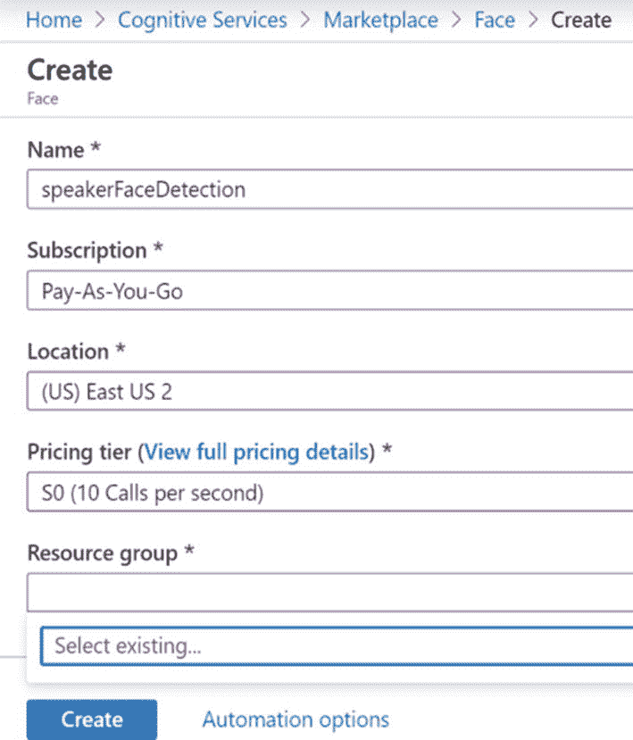

图 3-32。

创建一个 Face API 资源

有两部分代码需要以编程方式与我们的认知服务 API 进行交互。图 [3-33](#Fig33) 显示了打开图像文件并将文件内容赋给变量的 Python 代码片段。最后，图像文件内容通过 POST 请求传递给 API。

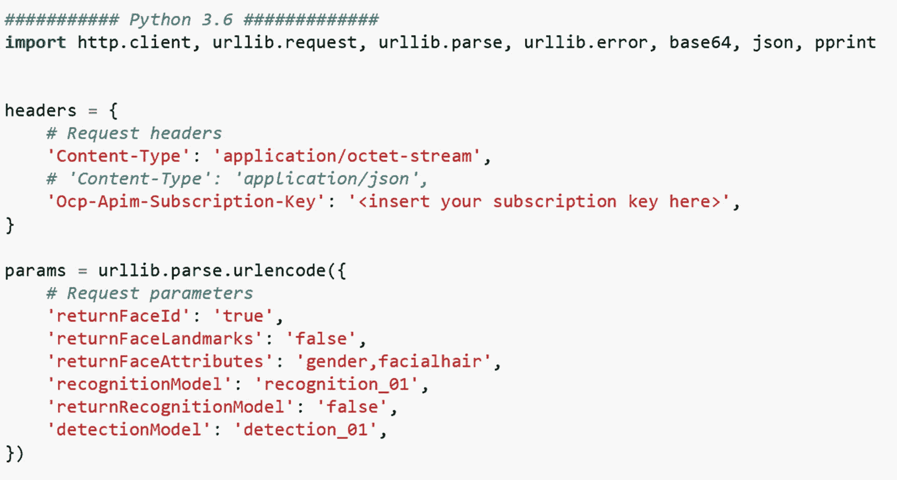

图 3-33。

反映标头和参数设置的 Python 代码

图 [3-34](#Fig34) 所示的 Python 代码是以编程方式打开图像文件并将内容传递给认知服务 API 所需方法的示例。内容通过 POST 方法传递。

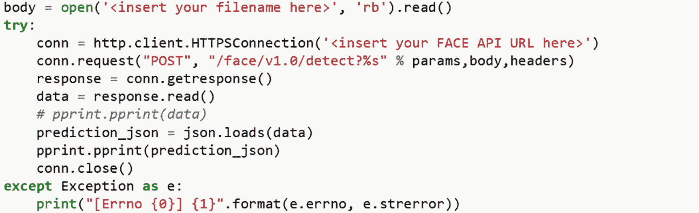

图 3-34。

将 POST 调用传递给 API 的 Python 代码

通过调用面部识别 API 来查看 JSON 负载，我们可以看到有三名男性和一名女性被识别。谢天谢地，图 [3-35](#Fig35) 中要注意，我的胡须和小胡子阈值是 0.0。我还担心可能不是呢！

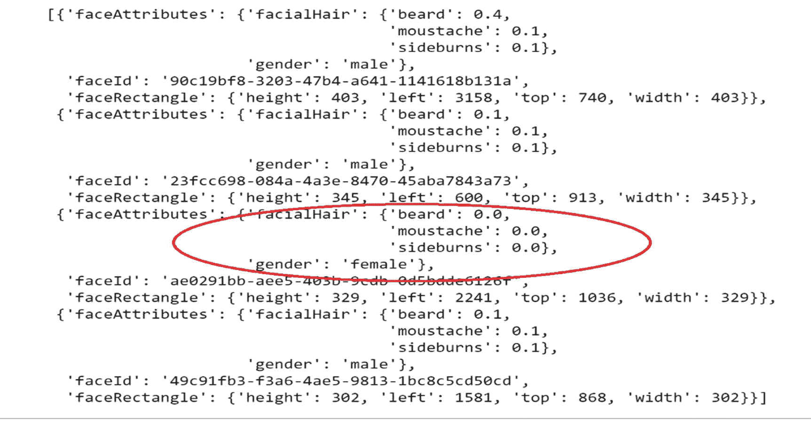

图 3-35。

JSON 有效载荷结果，三个男性扬声器和一个女性扬声器

或者，我们也可以在使用“查找相似要素”或“面部属性”检测时对结果进行实验。Face API 是人工智能如何允许我们批量分类和标记数据的另一个例子。

### 微软的数据隐私和安全

虽然 Face API 的功能在不断发展，但是我们如何在不侵犯活动参与者隐私的情况下利用这项技术呢？请注意:已获得上图中每个人的许可。

与所有认知服务资源一样，使用 Face 服务的开发人员必须了解微软关于客户数据的政策。微软信任中心的 [`Cognitive Services page`](https://www.microsoft.com/trustcenter/cloudservices/cognitiveservices) 称，认知服务让程序员可以控制任何存储数据的存储和删除。此外，Face API 文档进一步详细说明了面部属性不会存储任何图像。只有提取的面部特征将被存储在服务器上。

Tip

准备好开始了吗？微软学习有一个优秀的培训实验室。通过使用 Azure 中的计算机视觉 API 来识别面部和表情。此处可用: [`https://docs.microsoft.com/en-us/learn/modules/identify-faces-with-computer-vision/`](https://docs.microsoft.com/en-us/learn/modules/identify-faces-with-computer-vision/) 。

### API 引用:Face

#### 脸

Face API 由检测、查找相似、分组、识别和验证的方法组成。为了帮助执行这些方法，有一些额外的 API 在被调用时为面部属性提供容器。

#### 面列表和大面列表

FaceList 允许用户在一个面孔列表中创建多达 1000 个面孔的集合。该列表包含以下字段:faceListId、name、userData(可选)和 recognitionModel。这些列表被 Face API 的 Find Similar 函数引用。注意:一个订阅中最多允许 64 个面孔列表。LargeFaceList 允许用户创建多达 1，000，000 个面孔的集合。

#### 人员组人员和大型人员组人员

PersonGroup Person 允许用户创建与一个人相关联的最多 248 个面部的面部特征集合，以执行面部识别或验证。存储该人的提取的面部特征，而不是图像。LargePersonGroup Person 是与 LargePersonGroup 一起使用的容器。

#### 人员组和大型人员组

PersonGroup 允许用户创建多达 1000 个人员组的集合，每个组最多有 1000 人使用免费层。该集合包含以下字段:personGroupId、name、userData(可选)和 recognitionModel。这些组被 Face API 的 Identify 函数引用。注意:S0 层允许创建多达 1，000，000 人的组，每个组最多有 10，000 人，并且人员集需要使用 LargePersonGroup。

#### 快照

允许用户通过备份和恢复将面部数据复制到另一个订阅。

Face v1.0 API 提供对启用表 [3-6](#Tab6) 中列出的 Face、FaceList、Person、PersonGroup 和 Snapshot 功能的函数的访问。

表 3-6。

面向 1.0 版 API 函数

<colgroup><col class="tcol1 align-left"> <col class="tcol2 align-left"> <col class="tcol3 align-left"></colgroup> 
| 

职位职能

 | 

Put 和 Get 函数

 | 

删除和修补功能

 |
| --- | --- | --- |
| **脸**检测，找到相似的，分组，识别，验证**面孔列表**添加头像、列表、更新**大面列表**加脸，训练**大人物群体人物**添加面，创建人组火车**人员组人员**添加面孔**快照**申请，接受 | **面孔列表**创建、获取**大面列表**创建，获取，获取培训状态，列表**大人物群体人物**得到，得到面子，列表人组创建，获取，获取培训状态，列表**人员组人员**得到，得到面子**快照**获取，获取操作状态，列表 | **面孔列表**删除，删除脸**大面列表**删除、更新**大人物群体人物**删除，删除脸，更新，更新脸人组删除、更新**人员组人员**删除，删除脸**快照**删除、更新 |

## 表单识别器

表单识别器将表单和图像中的信息提取到结构化数据中。该服务利用自定义视觉功能，从 pdf 和图像中提取文本，并存储与训练集中上传的表单相关的结构化数据。该服务实现了数据输入的自动化和存储在表单中的数据的存档。例如，现在可以通过 OCR 提取注册或申请过程中要求个人填写可打印文档的空白数据，并将其存储在数据库中。上传表格的空白版本用于培训和识别字段标签。

### 能力

*   *自定义视觉*–识别并提取文本、关键字、表格和字段。应用机器学习来生成代表原始文件的结构化数据。

*   *预建收据*–利用基于反映商品和/或服务销售交易的收银机或销售收据图像构建的预建模型。使用光学字符识别(OCR)从收据中识别和提取数据。

*   *布局*–使用光学字符识别(OCR)从文档中识别并提取文本和表格结构。

### 表单识别器在运行

请参考第 [6](6.html) 章，查看表单识别器的运行示例！

### API 参考:表单识别器

表格 [3-7](#Tab7) 中包含了通过表单识别器 v2.1 API 可用的函数集合。

表 3-7。

表单识别器 v2.1 API 函数

<colgroup><col class="tcol1 align-left"> <col class="tcol2 align-left"> <col class="tcol3 align-left"></colgroup> 
| 

职位职能

 | 

Put 和 Get 函数

 | 

删除和修补功能

 |
| --- | --- | --- |
| 分析批次，分析操作结果，BusinessCardBatch，BusinessCardBatchResult，ComposeModels，CopyModel，CopyModelAuthorization，CopyOperationResult，CopyAuthorizationResultWithErrors，IDDocumentBatch，IDDocumentBatchResult，InvoiceBatch InvoiceBatchResult，LayoutBatch，LayoutBatchResult，ReceiptsBatch，ReceiptsBatchResult，TrainBatch，TrainBatchWithSubFolders | GetCustomModel，GetModel，GetModels， GetModelsSummary， | 删除模型 |

## 视频分析器

Video Analyzer 是一个 Azure Media Services 人工智能解决方案，利用了跨语音、语言和视觉的人工智能功能。该服务允许程序员定制和训练模型。该服务还支持对大量视频进行深度搜索，并为组织提供有效分类和标记媒体内容的能力。

### 能力

*   *人物*–识别视频中的特定人物，并提供关于视频中出现频率、视频帧和出现百分比的分析。

*   *关键主题*–确定视频中的关键主题，并提供关于视频中出现频率、视频帧和出现百分比的分析。

*   *情绪*–识别整个视频中的情绪趋势，并提供关于情绪频率、视频帧和视频中情绪百分比的分析。

*   *关键注释*–识别视频中的关键注释，并提供关于视频中出现频率、视频帧和出现百分比的分析。

*   *转录*–提供英语、法语、德语和西班牙语动态翻译和字幕服务的嵌入式小工具。

### 演示视频分析器 API

与视频分析器 API 交互并演示其功能的最简单方法是访问由微软维护的 AI 演示网页。该页面提供了一个与认知服务 API 交互的界面，可通过 [`https://aiDemos.microsoft.com`](https://aidemos.microsoft.com) 访问。我们可以选择视频索引器图标下方的“尝试一下”,并选择一个可用的视频，以查看如何从视频中提取人物、关键主题、情感、关键注释和转录。

### 媒体合规性、隐私和安全性

虽然我们将在后面的章节中讨论人工智能道德，但应该注意的是，在视频分析器页面上直接有以下免责声明:“作为一个重要的提醒，在使用视频分析器时，你必须遵守所有适用的法律，你不得以侵犯他人权利或可能对他人有害的方式使用视频分析器或任何 Azure 服务。在使用 Video Analyzer 处理任何视频之前，您必须拥有使用这些视频的所有适当权利，包括在法律要求的情况下，视频/图像中的个人(如果有)对其数据在 Video Analyzer 和 Azure 中的使用、处理和存储的所有必要同意。一些司法管辖区可能会对某些类别的数据(如生物特征数据)的收集、在线处理和存储提出特殊的法律要求。在使用 Video Analyzer 和 Azure 处理和存储任何受特殊法律要求约束的数据之前，您必须确保遵守任何可能适用于您的此类法律要求。”您可以访问 Microsoft 信任中心，了解有关 Azure 中的合规性、隐私和安全性的更多信息。此外，您可以查看微软的隐私声明，以及 Azure Online Services 条款和数据处理附录，了解微软的隐私义务以及数据处理和保留做法。

在本章中，我们强调了创建认知服务 API 并快速与 API 交互以对图像进行分析是多么容易。我们已经通过 Azure 门户和 CustomVision.ai 门户浏览了创建认知服务资源的方法。我们还浏览了对象检测的场景和用例。

阅读完本章后，您应该具备了确定是使用计算机视觉 API 还是自定义视觉 API 来执行分析的知识！

在下一章，我们将讨论认知服务语言 API 的功能！

## 摘要

在本章中，您学习了

*   当您处理常见的日常对象并执行常规分类和元数据管理时，您希望使用计算机视觉 API。当您有自己的一组用于训练数据模型的图像，并且希望能够影响模型的结果时，您希望使用自定义 Vision API。

*   您可以在 Azure 门户或 CustomVision.ai 门户中创建 Vision API 资源。您可以通过门户、API 文档页面或您的应用代码针对您的模型训练和测试预测。

*   表单识别器使以前存储为图像或 PDF 的数据能够以键值对的形式解析并智能地存储在数据库中。

*   您可以访问 aidemos.com 页面，与认知服务 API 进行交互，而无需编码或为测试服务付费。

*   有一些伦理因素会影响视觉人工智能功能的架构和使用。微软用数据隐私和安全准则来解决负责任的 AI，在存储和使用个人图像时考虑个人隐私很重要。