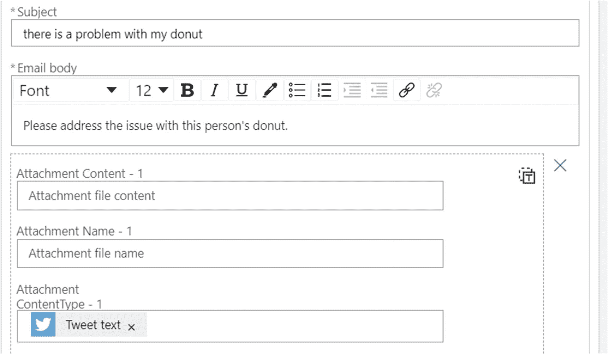

# 4.认知服务中的语言

沟通是商业和生活中的关键。尽管新冠肺炎带来了挑战，但我们的世界将继续相互联系，随着时间的推移，我们的业务(和生活)将日益全球化。虽然英语被普遍认为是国际商务语言，但只有用人们的母语交流才有意义。然而，除了交谈之外，你还需要用各种语言分析任何交流的能力。

在这个数字时代，投票和调查似乎有些过时，容易产生偏见。这就引出了一个问题——如何最好地理解客户或潜在客户对使用你的品牌或产品的感受？像语言 API 中的情感分析这样的工具提供了独特的能力来隐藏文字，并理解这些文字背后的意图和动机。Azure Cognitive Services 中的语言 API 为这种能力以及更多其他能力打开了大门。让我们四处看看，看看它能为我们提供什么。

## 语言 API 简介

微软表示，Azure 认知服务是“一套解决人工智能领域问题的机器学习算法。”有意思，但是很模糊。那么，语言 API 具体做什么呢？很多有趣的事情！虽然他们的目的是在文本驱动的通信中打开一系列可能性，但微软将语言 API 的功能分为五个关键领域:沉浸式阅读器、语言理解、QnA Maker、文本分析和翻译器。表 [4-1](#Tab1) 简要描述了这些区域。

表 4-1。

语言 API

<colgroup><col class="tcol1 align-left"> <col class="tcol2 align-left"></colgroup> 
| 

服务名称

 | 

服务描述

 |
| --- | --- |
| 沉浸式阅读器 | 沉浸式阅读器提供了各种工具，帮助用户学习阅读或学习阅读一种新的语言，更好地与你的内容互动和理解。除此之外，对于有学习差异的人来说，它增强了内容的可访问性。 |
| 语言理解 | 这通常被称为 LUIS(语言理解智能服务)，它允许您使用自然语言处理的能力，为用户与之交互的应用程序、机器人和设备带来对话体验。 |
| QnA 制造商 | QnA Maker 允许您做听起来完全一样的事情——根据您的数据创建一组问题和答案。它还为这些问题和答案添加了对话元素，为您的用户提供更自然的交互。 |
| 文本分析 | 文本分析提供了检测提交文本中的关键短语、识别(和消除歧义)文本中的命名实体以及检测它所分析的文本中的正面和负面情绪的能力。 |
| 翻译者 | Translator 提供语言检测服务以及 60 多种语言的翻译。 |

正如我们在整本书中强调的，套件中的各种 API 是为了协同工作而构建的。将强调的一个关键领域是第 [7](7.html) 章。那一章将基于本章中的 QnA Maker 和 LUIS 介绍，并向您展示如何将这些技术集成到聊天机器人中。正如我们在迄今为止讨论过的其他 API 中看到的，这种类型的集成变得更加容易，因为结果是以相当易读的 JSON 有效负载的形式从这些 API 返回的。

### 沉浸式阅读器

沉浸式阅读器不同于本章讨论的其他 API，因为它的唯一目的是让你的内容更容易被读者访问。虽然微软对这些服务的描述有些乏味，但他们对沉浸式阅读器的部分描述确实击中了要害。它指出，沉浸式阅读帮助“新兴读者，语言学习者和有学习差异的人。”这种服务态度，因为缺乏更好的措辞，所以我选择用沉浸式读者打开这一章的深层部分。到目前为止，这听起来不错，但这一切实际上意味着什么，我们可以用它做什么？在高层次上，您可以做一些事情，如更改文本的可视大小以适应读者的视觉能力，以及以“工具提示”格式显示常用单词的图片。深入到它的功能，它可以做一些事情，比如突出显示文本中的名词、动词和其他词类。对于一个学习语法和句子结构的人来说，这是一个很重要的功能。对于学习阅读的人来说，它可以大声读出屏幕上的内容，并显示单词的音节，以更好地理解单词的结构。

### 语言理解(路易斯)

语言理解智能服务适合一个很好的缩写词(LUIS)，但这个缩写词并不能很好地描述该服务实际能做什么。虽然第 [7](7.html) 章将对 LUIS 的能力进行更深入的探究，但我想让你熟悉本章中的基础知识，这样你就可以在本书的后面直接进入与机器人相关的内容。

在这一章的后面，我们将看一些基本的例子来帮助你理解 LUIS 的能力，但是让我们在这里用一个简短的描述来为它做准备。本质上，LUIS 允许您创建定制的语言模型，因此用户与这些模型的交互是对话式的。LUIS 将文本分解成意图(“你想要我做什么？”)和实体(“这个请求/动作涉及什么东西？”).这些自定义模型使 LUIS 能够检查文本交互中的所有意图和实体，根据模型对这些意图和实体进行评分，确定它最有把握涉及的意图和实体，然后采取基于这些结果确定的任何行动。这发生在自然语言对话中，使用应用程序或机器人作为其前端，因此 JSON 有效负载的血淋淋的细节隐藏在友好的前端之后，用户看不到。

### QnA 制造商

乍一看，QnA Maker 可能有点令人困惑，因为粗略查看登录页面和文档可能会让您认为它与 LUIS 非常非常相似。它也是一种在对话中向用户交互展示信息的方式。虽然它缺乏 LUIS 的灵活性，但安装和使用起来却比 LUIS 快得多。第 [7](7.html) 章将有一节专门介绍 QnA Maker，尤其是它与聊天机器人的交互，但这个语言 API 概述是一个很好的机会来回顾 QnA Maker 可以做什么的基础知识。

从名称上看，您可能已经猜到了服务的主要功能:将问题和答案组合在一起，这样，当向服务提出问题时，如果有合适的答案，就会提供合适的答案。这些问题和答案存储在所谓的知识库中。知识库存储基本的问题和答案集。知识库中包含的那些问题和答案集可以通过“添加备选措辞”来增强，这样自然语言处理就可以拾取原始问题的细微变化。您还可以向知识库的答案部分添加后续提示，以开始更多的多回合对话体验。该后续提示通过对话返回给用户，并提示下一个问题。

既然我们已经基本上定义了什么是问题和答案集，这就引出了下面的问题:问题和答案是如何进入 QnA Maker 本身的？一旦您在 Microsoft Azure 中创建了 QnA 服务，知识库创建过程将允许您从各种来源填充知识库。该列表可以随着服务的成熟和改进而改变，但是通常支持的文件和源类型是 URL(FAQ 页面是特别合适的源)、pdf、DOC 文件(Microsoft Word 或类似的)、Excel 文件(或类似格式的结构化电子表格)、TXT 文件和 TSV(制表符分隔的值)文件。您也可以手动创建问题和答案对，尽管该过程比导入文件更耗时。正如您所想象的，文件的问答格式越结构化，您在部署之前需要对知识库进行的手动清理就越少。最后，一旦您的源代码被导入，您就可以指定您的 bot 将拥有的“聊天”类型。基本上，这就是你的机器人的个性。在撰写本文时，目前的选择是没有、专业、友好、机智、关心和热情。如果您不喜欢，可以编辑可变的聊天回复。

### 文本分析

文本分析服务的功能可能是语言中最广为人知的 API。这在一定程度上要归功于它最受欢迎的功能之一——情感分析。简而言之，基本情感分析为它所分析的文本提供一个数字分数。在 Azure 认知服务中，评分范围在 0 到 1 之间，分数越接近 1 表示情绪越积极，分数越接近 0 表示情绪越消极。API 的第 3 版(截至发布时，在一些 Azure 地区可用，但不是所有地区)通过返回文档标签(正面、负面、混合和中性)和介于 0(对分配的标签的低置信度)和 1(对分配的标签的高置信度)之间的会议分数，提供了对该功能的不同理解。

然而，文本分析的能力远不止文本的情感分析。文本分析中的健康功能是最近开发的，但很快就成熟了。它用于识别和分类诊断、症状和药物相关信息等元素，这些信息存在于电子病历、医生笔记和医疗保健领域的其他书面人工制品中。该功能可以说是建立在“关键短语提取”和“命名实体识别”功能的基础上，这些功能之前已经存在于文本分析中。命名实体识别试图识别指定文本中的实体，然后将它们分类为预定义的类型，如位置或人。关键短语提取提取出它认为是文本中最重要和最具描述性的短语和术语。从关键短语提取调用返回的数据也可以支持单词云和其他类似的数据可视化。

最后，文本分析提供了一种语言检测功能，可以让您将有趣且高效的工作流程串联起来。语言检测分析文本，并返回它认为文档包含的语言以及置信度得分(1.0 是最高的)，该得分表明它在评估中的置信度有多高。它可以分析多种语言的文档(它将返回检测到的每种语言以及所有语言的相对置信度)。它还可以分析可能有歧义的文本(例如，包含可以在一种或多种语言中找到的单词的文本)。如果您发现语言检测很难消除这些单词的歧义，您可以在 API 调用中添加一个国家提示。countryHint 参数接受两个字母的国家/地区代码，可以通过指示文本/文本的创建者可能来自的国家或地区来帮助服务消除歧义。这种语言检测能力与语言 API 之旅的下一个(也是最后一个)主题非常吻合:翻译器。

Fun Fact

在 2017-2018 英格兰超级联赛赛季期间，受欢迎的开拓者足球播客中的听众听到了一个题为“开拓者情绪表中的男人”的片段。该部分中呈现的排名是使用文本分析 API 的情感分析部分计算的。

### 翻译者

Translator 名副其实，它确实做了你认为它做的事情。开箱即用，它可以翻译 60 多种语言。如果您使用过 Microsoft Translator 移动应用程序，那么您已经使用过这个 API，并且受益于它的翻译能力可能远远优于您自己的这一事实！我在旅行中受益匪浅。

Translator Text API 的最新版本(3)增加了使用自定义翻译器为翻译器支持神经机器翻译(NMT)的任何语言构建自定义翻译模型的能力。NMT 比 SMT(统计机器翻译)更现代、更准确。这些定制的翻译模型可以通过定制翻译门户创建。

自定义翻译器门户为您提供了一种图形化的方式来上传各种受支持的文档和文件格式的培训数据，然后使用这些文档来创建、培训和测试新的自定义翻译系统，而无需编写任何代码或拥有丰富的机器学习经验。

如果您喜欢使用代码与自定义翻译器交互，它也有自己的 API。然而，翻译不限于共享相似或共同字母表的语言。Translator 还提供音译功能——通俗地说，就是将一个单词转换成不同字母表中不同语言的对应单词。在这一章的后面，我们将对 Translator 的一些功能进行更深入和技术上更详细的探究。

## 获取和分析社交媒体情绪

鉴于社交媒体已经渗透到我们社会的几乎每一个角落，如果你或你参与的任何组织有社交媒体存在，了解你的社交媒体追随者(以及在帖子、推文中提到你的品牌的其他人)的印象可能是一个好主意。)对您或您的组织的影响。鉴于恶意错误(或无害行为)在社交媒体平台上被放大的速度，了解社交媒体情绪的任何低迷都是有意义的，这样你就可以应对可能对你或你的业务产生有害影响的负面问题。在这一部分，我们将通过一个基本的方法来使用 Azure Logic 应用程序、Azure SQL 数据库和文本分析的情感分析能力来获取和存储推文及其相关的情感得分。我们开始吧！

### 涉及哪些 Azure 组件？

我们需要创建一些 Azure 资源来完成这个例子。在创建资源并使用它们来查看情绪之前，让我们检查一下每个资源及其角色。以下列表详细列出了所涉及的各个组件，并简要描述了我们将如何使用它们:

*   Azure 逻辑应用**–**逻辑应用最好被描述为“事件驱动的工作流容器”这并不是说它们是 Kubernetes 或 Docker 意义上的容器；他们更多的是特百惠意义上的容器。它们是保存工作流的普通“盒子”。每个逻辑应用程序都由一个触发器实例化，这基本上是它等待发生的事件。我们的 Logic 应用程序将在推文中搜索单词，然后分析推文文本本身的情绪，然后将情绪得分和推文中的其他信息存储在 Azure SQL 数据库中，以供进一步分析。

*   *Azure SQL 数据库***–**Azure SQL 数据库是微软的平台即服务(PaaS)数据库产品。我们将使用一个基本部署来存储推文和情感数据。

*   *文本分析***–**我们将提供一个文本分析认知服务资源，然后将 logic 应用程序连接到该资源，以自动对推文文本进行情感分析。

Azure Logic Apps

Logic 应用程序不仅仅可以用于自动化认知服务 API 调用和连接到社交媒体平台以摄取文本内容。它们的用途包括连接到不同的数据源进行数据移动、连接到票据系统(如 ServiceNow)进行票据和工作流管理、基本的 ETL 以及许多其他用途。除了在本书中的用途之外，它们还值得进一步研究。

### 创建文本分析资源

为了对社交媒体帖子或其他文本进行情感分析，我们需要提供的第一个组件是文本分析资源。下面的截屏显示了基本情况。在 Azure Portal 的搜索框中，如果你输入“文本分析”，你会看到一个创建文本分析资源的链接。单击该链接后，您将看到与下面的截图非常相似的内容。

首先，为资源选择一个唯一的描述性名称(并且对您有意义)。在使用语言 API 的过程中，您可能会在许多文本分析调用中使用这个资源，所以如果名称也很容易键入，也不会有什么坏处！

如果您有不止一个订阅(可能是工作订阅和个人订阅)，那么您还需要选择资源将驻留的订阅。并不要求您的所有资源都驻留在同一个订阅中，但是，根据我的经验，如果在同一个订阅中提供资源，您会发现一切都更容易管理。然后，您可以使用资源组管理不同的 Azure 资源(这是屏幕截图中五个字段的底部字段)。我的建议是每个项目使用一个资源组，但是这当然是个人的选择。

图 [4-1](#Fig1) 显示了创建文本分析资源时呈现给你的初始屏幕。包括的字段有名称、位置、订阅、定价层和资源组。

图 4-1。

创建文本分析资源的第一步示例

最后要讨论的两个领域是位置(即您希望资源驻留的 Azure 数据中心)和定价层。一般来说，你希望选择最接近你的典型物理位置的 Azure 来减少延迟，但是几乎所有的区域都会给你大致相同的性能。定价层是一个更为关键的选择，但是这个选择取决于您正在进行的项目的性质。对于个人项目，自由层可能就足够了。否则，第一标准层可能就足够了。上面的层通常面向更专业的项目，但这并不是说业余爱好者不能选择这些。如果你的个人项目的范围需要一个更高的定价层，那么向你致敬，希望这本书对你雄心勃勃的目标大有裨益！

完成所有选择后，您将看到一个创建按钮。单击该按钮后，您最终应该会看到下面的屏幕截图，显示文本分析资源已成功创建。

图 [4-2](#Fig2) 显示了文本分析资源部署结束时显示的概览屏幕。

图 4-2。

显示成功的文本分析部署的概览屏幕

为了快速确认您的资源的创建，请使用 Azure Portal 中的搜索框，键入您为文本分析资源选择的资源名称，并确认它显示在搜索结果中，如下所示。图 [4-3](#Fig3) 显示了如何搜索新创建的资源。

图 4-3。

成功寻找你的新资源

最后但同样重要的是，在 Azure Portal 中选择您的资源，在门户中找到最左边的刀片，然后单击刀片的资源管理部分下的 Keys and Endpoint。将两个密钥复制并粘贴到一个安全的位置——这对于任何后续的资源连接都是必不可少的。图 [4-4](#Fig4) 展示了一个查看你的 API 密钥的例子(不要泄露我的！).

图 4-4。

显示如何查看 API 密钥、位置和端点的屏幕

### 创建 Azure Logic 应用程序

接下来，让我们创建 Azure Logic 应用程序，它将方便对文本分析资源的调用。点击 Azure 门户左上角的创建资源链接后，您将被带到 Azure Marketplace 窗口。在搜索市场区域中，键入 Logic App 并单击它。这将把你带到一个带有创建按钮的屏幕。点击那个按钮，你会看到一个类似本章下图的截图，图 [4-5](#Fig5) 。

虽然布局与上一个资源创建屏幕有所不同，但您将做出非常相似的选择。您将首先选择您的订阅，然后，在选择之后，资源组下拉列表将填充您的订阅中的所有资源。

做出这些选择后，为您的 logic 应用程序选择一个名称。请记住，当您增加订阅中 Azure 资源的数量时，相关和描述性的名称会有所帮助。您通常会在“选择位置”区域中选择区域，然后再次选择离您的典型物理位置最近的 Azure 数据中心(位置)。图 [4-5](#Fig5) 显示了你第一次创建 Azure Logic 应用时遇到的基本屏幕。

图 4-5。

指定 Azure Logic 应用程序的基本细节

最后，您可以选择是否打开日志分析。对于一次性项目(或在不使用日志分析进行事件监控和收集事件日志的环境中的项目)，请关闭该选项。如果您正在使用日志分析，并希望来自此 logic 应用程序的事件和通知成为其中的一部分，请将该选择移动到 on。

接下来，我们将创建逻辑应用程序本身。由于逻辑应用是以软件即服务(SaaS)的形式呈现的事件驱动的工作流，因此您首先选择的是驱动工作流的事件。在这种情况下，当您进入 logic 应用程序创建屏幕时，请选择“当发布新推文时”选项。图 [4-6](#Fig6) 向我们展示了 Azure Logic 应用的一些常见触发器的例子。

图 4-6。

Azure Logic 应用的常见建议触发器

选择 Twitter 后，您需要确认允许 logic 应用程序连接到 Twitter 并授权它这样做(在类似于图 [4-7](#Fig7) 所示的屏幕中)。

图 4-7。

授权 Azure Logic 应用程序访问 Twitter 帐户

这就把你带到了逻辑应用程序设计器。第一步是在搜索文本框中输入您希望 Logic 应用程序的工作流在通过 Twitter 搜索 API 找到文本时启动的文本。

下一个值得讨论的选项是在“您希望多久检查一次项目？”下要求您选择的时间间隔这个时间间隔没有课文让你相信的那么固定。如果您的 logic 应用程序设置为搜索常用搜索词，只要搜索 API 返回结果，它就会继续实例化您的 logic 应用程序的实例。在这种情况下，你在这个屏幕上设置的计时器永远不会重置，你只会看到你的逻辑应用程序不断运行。只有当您的 logic 应用程序没有活动运行时，该计时器才会重置。当你试图管理和控制你的 Azure 成本时，理解这个概念是非常重要的(问我怎么知道的！).图 [4-8](#Fig8) 显示了配置该触发器时显示的初始窗口。

图 4-8。

为您的逻辑应用程序配置触发器

该步骤完成后，单击“新建步骤”按钮并选择一个操作。在这种情况下，您在搜索框中键入文本分析并选择文本分析，如图 [4-9](#Fig9) 所示。

图 4-9。

将文本分析添加到您的 Logic 应用程序

单击后，您将从出现的列表中选择“检测情感”操作。如果它没有出现在前几个选项中，请键入前几个字母来重新排列列表，并显示您需要选择的选项。完成后，您将看到一个屏幕，将您的 Logic 应用程序连接到本章前面提供的认知服务资源。您可以提供自己选择的连接名称、帐户密钥(如本章前面讨论和显示的密钥 1)和站点 URL。站点 URL 是可以在前面提供的认知服务资源的概览刀片上找到的端点。图 [4-10](#Fig10) 显示了用于指定您希望使用的文本分析资源的位置和详细信息的屏幕。

图 4-10。

配置文本分析操作以连接到新资源

然后，该选择将显示一个提示，提示您输入要发送给检测情感操作的文本。您需要单击添加动态内容超链接，并在出现的列表中选择 Tweet text。图 [4-11](#Fig11) 展示了一个这样的例子。

图 4-11。

显示如何将 tweet 文本发送到检测情绪操作

接下来，再次单击 New step 按钮，在搜索框中键入 SQL Database，并选择 Insert row 操作。这一步的命名可能有点混乱，因为正如你之前提到的，我们计划将情感数据存储在 Azure SQL 数据库中。但是，因为您可以将逻辑应用程序连接到传统的 SQL Server 和 Azure SQL 数据库产品，所以这些操作被命名为 SQL Server。图 [4-12](#Fig12) 显示了这个稍微有点混乱的屏幕在发布时的样子。

图 4-12。

为您的 Logic 应用程序选择与数据库相关的操作

对 SQL Server 实例和 Azure SQL 数据库部署的不同类型的身份验证的细微差别的深入探究超出了本书的范围，但我相信显示图 [4-13](#Fig13) 中所示的屏幕截图和可用的选项是有帮助的，这样您就可以记录来自您已经部署或访问的 SQL Server 或 Azure SQL 风格的信息。

在对上一步中指定的服务器进行身份验证后，请确保选择了一个表。在这种情况下，我们将使用通过。GitHub 存储库中的 sql 脚本。图 [4-14](#Fig14) 显示了如何选择用于存储信息的表格。

图 4-14。

连接到数据库并选择用于存储的表

图 4-13。

SQL Server/Azure SQL 身份验证屏幕示例

这将提示您选择要填充的列。选择每列。图 [4-15](#Fig15) 显示了该选择屏幕应该显示的内容。

图 4-15。

用于选择数据库操作中使用的表列的屏幕

然后，您将看到所选列的列表。当您将光标放在列名旁边的字段中时，您将看到前面研究过的动态内容弹出窗口。从动态内容中选择匹配的字段(如果没有立即看到它弹出，请键入字段的几个字母)。为此，键入“score”将会给出检测情绪操作的分数输出，即使它可能不会立即出现在列表中。图 [4-16](#Fig16) 显示了如何将动态内容添加到数据库操作的示例。

图 4-16。

将 Twitter 连接器的输出添加到数据库表中

这将为您留下一个插入行屏幕，如下图所示。确保您在此处保存了您的工作(希望您自始至终都保存了)，单击返回到左侧刀片上的 logic 应用程序概述，然后单击运行触发器以执行您的触发器。如果它找到一个搜索词，你的数据库现在将包含找到的推文的所有信息。确保您在使用完 logic 应用程序后将其禁用，这样它就不会意外产生不必要的费用。图 [4-17](#Fig17) 显示了完整的屏幕应该如何显示。

恭喜你！您成功地分析了推文的基本信息和情感评分。正如本书前面所讨论的，你的这一新发现的能力有多种用途。

图 4-17。

来自文本分析和 Twitter 的动态内容被配置为存储在您的数据库表中

## 使用 Azure 函数和语言 API 驱动客户/用户交互

在我们解释的这一点上，我们知道如何创建一个逻辑应用程序，并使用该逻辑应用程序调用认知服务资源。我们还知道如何存储我们所连接的社交媒体源的情感得分和其他有用信息。让我们建立我们的情感分析新知识，但是如果发现一条情感得分低于某个值的推文，利用另一个 Azure 资源触发警报。我们将引入 Azure 函数作为实现这一点的一种方式，并在一些基于代码的开发中使用。

作为旁注，本节的演练假设创建了一个逻辑应用程序，其中包含一个“当新推文发布时”触发器和一个检测情绪操作。然后，我们将在工作流中的那个点插入 Azure 函数。继续创建该逻辑应用程序的两个步骤，保存它，然后返回到本演练。为了使这种走查在操作中更容易看到，在 logic 应用程序触发器中为搜索词选择一个负词。

### Azure 逻辑应用程序使用的 Azure 函数

与之前创建的其他资源类似，我们可以从在 Azure Portal 中单击创建资源开始。在输入 function 的几个字母后，我们会看到 Function App。单击该图标。图 [4-18](#Fig18) 显示了这应该是什么样子的一个例子。

图 4-18。

创建 Azure 函数的第一步

点击功能应用程序将调出如图 [4-19](#Fig19) 所示的画面。这可能看起来类似于创建一个逻辑应用程序或其他资源，在许多方面确实如此。我们仍将选择我们的订阅和资源组，命名我们的功能应用程序，并选择一个地区。由于该应用程序模拟向客户服务资源发送电子邮件，要求他们联系客户，因此我将其命名为 customercontact。你也可以选择自己的名字。不过，这里的新内容是发布、运行时堆栈和版本字段。虽然这里有几个选择，详细的 Azure Function 学习资源会深入解释，但为了继续使用这个演练来构建我们的技能，我们将在下面的“使用”中选择“代码”单选按钮。NET Core 作为我们的运行时堆栈(因为我们打算在 Function App 中使用 C#作为我们的首选语言)，并使用我们的运行时堆栈的最新版本(发布时为 3.1)。图 [4-19](#Fig19) 描述了项目详情屏幕上的这些选择。

图 4-19。

指定我们的函数应用程序的细节

创建我们的函数应用程序后，我们将被提示创建一个函数，如下一个截图所示。我简单地将其命名为 LogicAppTrigger，并将授权级别默认为 Function。图 [4-20](#Fig20) 显示了这应该是什么样子的一个例子。

图 4-20。

在函数应用程序中创建新函数

创建函数后，您将被带到函数的概览窗格。如果在左刀片上看不到“设置”，请在概览窗格的搜索框中搜索“设置”。我们将通过单击“新建应用程序设置”按钮来添加两个应用程序设置:APPINSIGHTS_INSTRUMENTATIONKEY 和 application insights _ CONNECTION _ STRING。对于这些设置，我们将再次需要我们的文本分析资源的端点/URL 以及我们在原始逻辑应用程序中使用的 API 密钥。URL 将被放置在连接字符串 app 设置中，密钥将被放置在仪器密钥 app 设置中，分别如图 [4-21](#Fig21) 和 [4-22](#Fig22) 所示。请确保您使用以下截图中指定的名称，因为这样会使演示更加简单。

图 4-21。

指定函数将使用的文本分析 API 的 URL

这两个屏幕可能看起来不那么令人兴奋，但是它们对于确保您的函数使用正确的凭证连接到正确的位置是绝对关键的。

图 4-22。

指定用于连接到文本分析 API 的 API 键

在我们回到我在本章前面提到的逻辑应用之前，让我们给我们的 Azure 函数添加一些代码，这样它就像一个函数一样工作了！如果您不想更深入地研究代码，只需转到您的函数应用程序，单击 Functions，单击 LogicAppTrigger，单击 Code + Test，然后将 LogicAppTriggerBody.csx(在我们的 GitHub repo 中找到)的内容粘贴到 run.csx 中。简单地说，这是基本的 C#代码，它根据推文的情绪得分将推文分类为红色、黄色或绿色状态。如果需要，可以随意更改和调整这些值和名称，但是现在让我们继续。为此，我们将返回到您在上一节中创建的逻辑应用程序。

回到逻辑应用，添加一个新的步骤和 Azure 函数作为我们的动作。选择 Azure 函数，如图 [4-23](#Fig23) 所示。

图 4-23。

在逻辑应用程序中添加 Azure 函数作为一个步骤

然后，我们将搜索我们的功能应用程序名称(例如，customercontact)。点击之后，我们应该能够选择我们的 LogicAppTrigger 函数，将其包含在我们的逻辑应用程序的工作流中，如图 [4-24](#Fig24) 所示。

图 4-24。

在逻辑应用程序中选择要在此步骤中执行的功能

这将把我们带到我们在使用这些逻辑应用程序时已经习惯的动态内容选择器。在这种特殊情况下，我们将在 logic 应用程序工作流程的早期从我们的情绪检测操作中选择情绪得分。这个版本的动态内容选择器如图 [4-25](#Fig25) 所示。

图 4-25。

选择要发送给 Azure 函数的文本

将我们的函数循环到我们的逻辑应用程序中后，我们想添加一个新的步骤，但这次是一个控制动作。当我们选择控制时，我们将选择条件，因为我们将在我们的逻辑应用程序中引入一些条件逻辑。这种逻辑将导致向资源发送电子邮件，要求他们联系对我们公司或其产品持负面看法的不开心的客户。所选的控制/条件如图 [4-26](#Fig26) 所示。

图 4-26。

将条件引入我们的逻辑应用程序的工作流

我们将指定我们的决策点是从函数(基本上是一个 HTTP Get)返回的主体是红色的时候。这意味着情绪得分很低，需要有人来沟通，才有希望解决客户或用户的问题。图 [4-27](#Fig27) 显示了如何指定我们希望设置的红色条件。

图 4-27。

创建后显示的红色条件

之后，我们需要选择如何将这封电子邮件发送给我们的内部资源。虽然 Azure 中有许多自动发送电子邮件的选项，但当我为这本书构建内容时，我选择了 SendGrid，因为截至发布时，它似乎是 Azure 中最易于使用、最容易获得的电子邮件提供商。我预先提供了一个 SendGrid 资源。也就是说，如果你更喜欢使用微软 365、Gmail 或任何其他你可以访问的电子邮件提供商，请在这里替换你选择的提供商。截图不会完全一样，但理解这里的工作流程是很重要的。

因为我们希望在 tweet 被标记为红色时发送这封“提醒”邮件，所以让我们在条件的“如果为真”部分选择 Add an action，键入 SendGrid，然后单击它。图 [4-28](#Fig28) 显示了如何选择 SendGrid 动作。

图 4-28。

在条件的“如果为真”部分选择 SendGrid 操作

选择之后，在 SendGrid 动作列表中找到 Send email 动作并单击它。发送邮件动作选择如图 [4-29](#Fig29) 所示。

图 4-29。

在 SendGrid 操作中选择发送电子邮件操作

类似于当我们连接到 logic apps 中的认知服务资源时，系统会提示我们命名 SendGrid 连接并提供资源的 API 密钥。单击 Create 后，我们将为 SendGrid 选择默认的身份验证类型(“使用默认共享应用程序”)。图 [4-30](#Fig30) 显示了用于命名我们的连接并指定密钥以便连接到 SendGrid API 的屏幕。

图 4-30。

命名 SendGrid API 连接并指定 API 键

这使我们需要添加电子邮件的参数(发件人、收件人、主题、邮件正文等。).适当添加这些内容，并使用我在图 [4-31](#Fig31) 中的示例作为指导。

图 4-31。

为我们的警报电子邮件设置参数

最后，如果您愿意，可以将推文文本、Twitter 用户名或其他与推文相关的信息添加为附件，以便客户服务代表知道应该联系谁以及他们在推文中提到了什么问题。图 [4-32](#Fig32) 显示了如何将 tweet 文本信息附加到电子邮件消息的示例。

图 4-32。

将令人不快的推文文本添加为电子邮件附件

## 使用翻译文本 API 实现多样化通信

到目前为止，我们一直试图让你轻松地连接到认知服务资源并与之通信，同时利用无代码选项(如 Azure Logic Apps)和有争议的低代码选项(如 Azure Functions)。对于那些刚刚接触认知服务和/或软件开发的人来说，这可能是有意义的。然而，我们知道一些读者真的很想使用应用程序代码调用认知服务资源，并做一些事情，而不是决定一条推文是正面还是负面。

虽然我们坚信最后两节提供了一个真正坚实的框架来了解这些 API(以及 Azure Logic 应用程序和 Azure 函数的酷)，但本章的这一节是为所有通过这一节提出以下一个或两个问题的读者准备的:“为什么有这么多图片？”以及“代码在哪里？”在本节中，我将完全引用在我们的 GitHub repo 中找到的 Program.cs 文件(在第 [4](4.html) 章下)。最低限度的截图将涉及！

### 使用翻译器文本 API 翻译文本

这个控制台应用程序是认知服务语言 API 中翻译器文本 API 功能的基本演示。简单地说，它从控制台获取输入，确定输入的语言，然后显示翻译后的输出。是的，很简单，但希望看到这种基本形式的内部工作方式，会激发出如何在您的应用程序或全新的项目中利用这种能力的想法！

Main 本身是应用程序的核心，但就其本身而言，相当简单。让我们先浏览一下目录，然后，如果你更喜欢一个在线的图像，而不是在屏幕和这本书之间来回看，这一部分会有一些。超越所有的控制台。*提示用户他们想要翻译的文本，然后提示用户按一个键来执行翻译的行，让我们来看看 Main 中的两个关键行。首先是第 18 行中定义为 route 的字符串。你会注意到这基本上是一个 URL 的结尾——的确如此。这一行的结尾实际上是最有趣的部分。你会看到一系列类似“&to=en”的东西，你可能会认为这就是你指定文本翻译成哪种语言的方式——你可能是对的。如果您正在查看 GitHub repo 中代码的原始版本，您会看到英语、意大利语和德语的语言代码，然后是一个看起来一点也不熟悉的语言代码。如果你想获得一点知识，你可以等待通过执行代码来找出那是什么语言。如果你不想获得那点知识，语言代码 tlh 是我们下面有趣事实的来源！

Fun Fact

你知道认知服务可以翻译成克林贡语吗？

其次，让我们看看第 23 行中的 await TranslateTextRequest。这是对认知服务资源本身的实际调用。前两个参数(subscriptionKey 和 endpoint)是本章其他地方引用的端点和 API 键。虽然您当然可以在方法调用中以明文的形式提供这一点，但是这样做非常不安全。例如，我为这本书提供的代码会给你我的 API 密匙和端点，很可能会大大增加我的 Azure 账单，因为每个人都根据我的订阅对他们的实验收费！相反，它们存储在环境变量中。如果您不熟悉。NET 开发，有关如何在您选择的操作系统中设置环境变量的最新指导，请参考以下 URL:

[T2`https://docs.microsoft.com/en-us/azure/cognitive-services/cognitive-services-apis-create-account?tabs=multiservice%2Cwindows#configure-an-environment-variable-for-authentication`](https://docs.microsoft.com/en-us/azure/cognitive-services/cognitive-services-apis-create-account%253Ftabs%253Dmultiservice%25252Cwindows%2523configure-an-environment-variable-for-authentication)

第三和第四个参数是 route(我们已经讨论过了)和 textToTranslate(从用户输入中收集的文本)。使用 await 意味着这是对翻译器文本 API 的异步调用。

既然我们已经讨论了调用 TranslateTextRequest 方法，那么让我们来看看该方法的亮点，而不是一行一行地详细剖析。该方法的第一部分(第 55–61 行)开始为发送 JSON 有效负载的 HTTP Post 调用构建结构。正如本书其他地方讨论的那样，与认知服务 API 的通信几乎只通过 JSON 有效负载进行。这一部分以添加 API 密钥(这里是订阅密钥)作为请求的头部结束。

在我的脑海中，我将第 63-86 行分成两部分。第 63–69 行接收从认知服务 API 返回的字符串输出，并反序列化 JSON。为了更直接地展示给用户，我有一个控制台。第 74 行中的 WriteLine(result)调用，因此向用户显示序列化的 JSON。这也是我在 route 变量中添加了四种语言的原因——我相信如果看到从 API 返回的多个输出集，理解反序列化会容易得多。如果您不希望看到它，现在您已经看到了它为什么在那里的解释，请随意注释掉该行以获得更漂亮的输出。不过，这是一个控制台应用程序，所以“漂亮”在这里是一个相对的术语！

第 70–86 行遍历反序列化的结果，并将它们输出到控制台。这里需要注意的一点是，控制台。第 77 行的 WriteLine 展示了翻译器文本 API 的语言检测能力(通过输出从 API 返回的检测到的输入语言)以及 API 返回的置信度得分。该置信度得分是 API 检测到正确输入语言的置信度(1 是最有把握的)。

我们的希望是，这本书能找到对使用各种方法实现人工智能感兴趣的广大读者。虽然本节中的代码肯定是基础的，但我们相信它为那些不熟悉应用程序开发的人提供了通过. NET 语言(在本例中是 C#)调用认知服务 API 的良好入口，并对 API 调用的结构和从 API 返回的数据有了坚实的理解。这段代码(来源于几年前微软快速入门的一个版本)无疑为我们带来了新的想法和发展，现在希望你也一样。

## 利用 LUIS 分析文本中的实体和意图

这一章主要强调我们如何与语言 API“对话”,尤其是在最后一节，当它与我们“对话”时是什么样子。不过，我们还没有真正了解认知服务中包含的对话能力，所以让我们用语言理解智能服务(LUIS)来总结本章的技术部分。后面的章节将详细介绍 LUIS 在聊天机器人和其他对话应用程序中的使用，但本章的这一节应该涵盖基础知识，以便为本书后面部分深入了解 LUIS 的能力做好充分准备。

### 创建基本的 LUIS 应用程序

首先，通过将您的 web 浏览器定向到 [`www.luis.ai/`](http://www.luis.ai/) 来连接到路易斯门户网站。该首页为您提供了文档、支持和其他资源的链接，帮助您了解 LUIS。主页上还提供了一些基本的演示和使用场景，让您可以深入了解如何与 LUIS 交谈、它会对您说些什么，以及这些功能的一些使用场景。在本节中，我们将创建两个基本应用程序——一个使用预构建的域/模型来处理一些基本的餐厅预订操作，另一个使用自定义的域/模型来尝试订购甜甜圈。

但是，当您登录时(通过右上角的链接)，您将被带到门户的一个不同外观的部分，在那里您可以创建 LUIS 应用程序。这就是我们在本节剩余部分要关注的地方。

随着微软将投资和资源投入到人工智能开发中，我们可以看到认知服务中的变化——似乎每个月所有的 API 都有新的能力或改进的能力来执行他们已经可以完成的任务，但现在可以在更精确的技能水平上完成。然而，这种快速发展也经常在 LUIS 的 UI 中体现出来。就在本章编写期间，欢迎 LUIS 使用您的帐户并提示您创建 LUIS 创作资源的一系列提示发生了三次不同的变化。为此，我们将放弃截图，你们中的许多人可能会发现有用的，而只是描述当你创建一个应用程序时的流程本身。

通常，该过程将遵循与下面描述的几个步骤类似的路线。首先，登录后，如果您没有 LUIS 创作资源，系统可能会提示您创建一个。该屏幕可以包括与促销报价联系的报价以及同意提供 LUIS 创作资源的条款和条件的复选框。您可以选择使用试用创作资源，但建议您创建自己的创作资源。当您单击按钮创建新的 LUIS 创作资源时，系统会提示您输入新创作资源的名称、它将驻留的订阅，以及您要放置创作资源的订阅内的资源组。

这可能会引导您进入一个类似于图 [4-33](#Fig33) 的闪屏。在该屏幕上，您应点击“立即创建 LUIS 应用程序”按钮，进入应用程序创建流程。

图 4-33。

LUIS 中新对话应用程序的介绍性屏幕

虽然您可以导入一个 JSON 文档或 LU(语言理解)模型，但这不是我们开始收集基本理解的地方，我们在这里寻求开始。为此，选择“新的对话应用程序”,这样我们就可以使用 GUI 来构建新的对话应用程序，该应用程序可以由其他资源(如机器人)使用。图 [4-34](#Fig34) 向我们展示了如何做出选择。

图 4-34。

选择“对话的新应用程序”开始创建 LUIS 应用程序

不出所料，当我们点击创建一个应用程序时，我们会看到一个我们开始习惯的屏幕。我们将为新的聊天应用程序选择一个名称、一种文化和一个描述。请务必注意以下“文化”字段下的文本——此处选择的文化是应用程序对话时使用的语言，可能与界面本身使用的语言不同。这可能是因为您的客户和 LUIS 开发人员使用不同的语言，或者出于任何其他原因，但是拥有这一选项是很有用的，我们希望确保能够调用它。最后一个字段是预测资源(用于训练和测试您的模型)，但它是为更高级的 LUIS 用户准备的，所以我们现在不会创建或选择其中的一个。图 [4-35](#Fig35) 向我们展示了一个“创建新应用程序”屏幕的例子。

图 4-35。

为我们的 LUIS 应用程序指定基本细节

当我们单击此处的 Done 时，我们应该会看到一个微软预建模型的列表，这将允许我们快速查看一些 LUIS 开箱后可以做的基本事情(可以这么说)。出于我们的目的，我们将单击 RestaurantReservation 下的 Add domain 按钮。如果我们没有看到预构建域的列表，所有预构建域都可以在屏幕最左侧的应用程序资产下的预构建域区域中访问(请参见下文)。图 [4-36](#Fig36) 显示了如何导航到预构建的域。

图 4-36。

导航到 LUIS 中的预建域

然而，我们添加了预建的 RestaurantReservation，我们的屏幕现在应该看起来如图 [4-37](#Fig37) 所示。

图 4-37。

将 RestaurantReservation 添加到你的应用程序后，它将是什么样子

现在我们已经添加了这个预构建的域，让我们单击屏幕左上方的实体。在这里，您将看到可能是餐馆预订组成部分的各种实体:它的地址、它提供的饭菜类型、它的名称、预订中的人数等。虽然不要求构建实体，但了解它们是什么以及它们的三种不同类型对于 LUIS 应用程序促进功能性对话体验至关重要。不过，在我们进入类型之前，让我们先了解 LUIS 上下文中的实体。实体是你想从话语中提取的数据。话语是你的应用程序的用户对 LUIS 说的话。如果你的用户对你的应用程序说，“我想要两个甜甜圈”，那么话语中的实体被定义为数字(2)和事物(甜甜圈)。回头参考我们的实体列表，您会注意到您看到两种不同类型的实体:“列表”和“机器学习”虽然还有其他类型，但列表和机器学习是 LUIS 新手最常遇到的，也是最常用的两种类型。列表是定义的列表，不是通过训练机器学习模型来学习的。比如 RestaurantReservation。MealType 是这个虚构餐馆提供的饭菜类型的硬编码列表。餐馆预订。NumberPeople 被称为机器学习类型，这是因为，在建立和训练该模型时，话语中的人数被识别为这一特定实体，并且该模型在训练时继续建立在该定义上。

在理解了这个模型中的预构建实体之后，让我们快速浏览一下预构建意图的列表。具体来说，让我们回顾一下 RestaurantReservation.Reserve。这是当一个话语包含类似于“我想预订下午 6 点的 4 人桌”的内容时所识别的意图点击实体不仅向我们显示了被识别为针对该意图的话语的例子，而且还显示了在话语中识别的实体的图形例子。这些是在下面的截图中看到的带下划线的标签，如果时间允许，值得在门户中进一步探索。图 [4-38](#Fig38) 显示了 RestaurantReservation.Reserve 的一些相关细节和示例。

图 4-38。

餐馆保留的细节。保留

在这一节的开始，我们说我们将在这一节谈论一些东西，到目前为止我们已经做了很多谈论一些东西和不谈论一些东西。是时候改变这种状况了。如果你看应用程序屏幕的右上方，你应该会看到一个带红灯的火车按钮。这基本上意味着你还没有训练你的模型，所以你可以和你的应用程序说话。点击该按钮(如图 [4-39](#Fig39) 所示)，训练过程开始。

图 4-39。

训练我们的模型

一旦训练过程完成，你会看到红灯变绿灯，这意味着你的应用程序可以测试了。点击测试按钮，开始对话！图 [4-40](#Fig40) 向我们展示了训练过程完成后的样子。

图 4-40。

模特训练完成——她们长得真快！

此时，您可以键入任何想要的内容，并调查 LUIS 的响应。为了保持我们的例子简洁明了，让我们确保它正确地识别了想要使用 RestaurantReservation 的话语。保留意向。为此，我们在类型 a 测试话语…字段中键入“我想预订这家餐馆”,并收到以下响应。它已经正确地识别了意图，并且相当确信它已经识别了正确的意图。图 [4-41](#Fig41) 向我们展示了一个测试 LUIS 模型的例子。

图 4-41。

从我们的路易斯模特开始对话

这是一个良好的开端，但那里只有基本的信息。如果我们单击 Inspect 超链接，我们可以看到 LUIS 给我们的每一条反馈。它列出了用户输入(当然我们已经知道了)、得分最高的意图(在我们说话时返回到屏幕上的意图)以及其他更高级的信息，如果我们试图创建新的实体或与我们已经讨论过的类型不同(并且更高级)的实体，我们会对这些信息感兴趣。我们希望您知道，当您单击 Inspect(检查)时，这些信息就在这里了，但是现在，我们继续了解基础知识，单击右上角的 X，并移出此屏幕。图 [4-42](#Fig42) 显示了我们应该点击退出的 X 的例子。

图 4-42。

单击 X 退出

虽然预构建的模型及其包含的意图和实体可以成为开始使用 LUIS 并理解其组件的很好的工具，但真正的乐趣在于您开始使用自定义模型创建自定义应用程序。当讲授这个话题时，往往是听众真正恍然大悟的时候。对于我们的自定义应用程序，我们将遵循创建“聊天应用程序”的相同步骤，但让我们给它一个描述性的名称，这样它至少向我们表明，它是我们构建的应用程序，用于处理我们正在构建和培训的自定义内容。图 [4-43](#Fig43) 向我们展示了如何开始创建我们的定制应用程序，以使用我们的定制模型。

图 4-43。

LUIS 中的“创建新应用程序”屏幕将允许我们使用我们的自定义模型

我们有一个应用程序，但没有意图。一个没有意图的应用程序将会成为一个非常无趣的谈话者。为了创建意图，我们将再次单击左上角的实体，但是，我们将单击创建，而不是查看那里已经存在的内容，因为那里实际上还没有任何内容。

我们的第一个例子是 OrderDonut，因为通常情况下，任何人在甜甜圈店(即使是不存在的店)想做的第一件事就是订购甜甜圈。这将我们带到一个类似于图 [4-44](#Fig44) 所示的屏幕。

图 4-44。

创造我们的第一个意图

接下来，在图 [4-45](#Fig45) 中，我们将命名我们的意图。

图 4-45。

命名我们的第一个意图

我们的意图只有一个名字，仅此而已。首先，我们需要为 LUIS 提供一些我们认为会在对话中引发这种意图的基本话语。我们提供了几个例子，基本上都是说“我想要一个甜甜圈”的冗长方式我们可以推荐提供这样的例子(但这可能会让你真的想要一个甜甜圈)。图 [4-46](#Fig46) 描述了一个表达这种意图的例子。

图 4-46。

提供一些示例话语

虽然订购甜甜圈的意图可能是我们的客户最终想要的，但我们希望为他们提供更具对话性的体验，而不仅仅是从我们假装的甜甜圈店订购甜甜圈的能力。为此，让我们创造另一个意图，帮助 LUIS 理解客户在问候他——类似于本书后面第 [7](7.html) 章中详述的最终导致更多对话互动的意图。欢迎你提供许多问候的例子——我们的一些建议如图 [4-47](#Fig47) 所示。

图 4-47。

教模特以非常随意的方式问候顾客

您还可以提供一个意图，帮助 LUIS 理解客户同意向其提出的问题。有很多这样的例子，但是创建这样的意图可能看起来类似于图 [4-48](#Fig48) 中的例子。

图 4-48。

教导模型如何与顾客达成一致

最后，为了训练模型，建议您创建一个名为 None(或类似术语)的意图，并将与应用程序当前任务完全无关的意图放入其中。这可能会对模型的训练产生微妙的影响，而且想出完全不符合逻辑的愚蠢例子也会很有趣！图 4-49 显示了我们在这些方面的一些尝试。

图 4-49。

教我们的模型随机的东西

为了结束我们的基本 LUIS 应用程序，按照我们在前面的例子中所做的那样训练这个程序。一旦这个“灯”是绿色的，点击 Test，我们将发现我们的应用程序是否正在朝着理解我们所说的内容的方向迈出最初的步伐。首先，让我们告诉它一些随机的事情，比如“披萨棒极了。”它正确地将该实体标识为 None 实体，尽管它对该选择不是很有信心。请记住，我们没有为模型提供太多的数据来做决定。图 [4-50](#Fig50) 展示了我们的成功。

图 4-50。

披萨可能很棒，但我们的模特知道它是关于甜甜圈的。

接下来，让我们用客户可能会说的话来测试我们的新应用程序:“我想要一个甜甜圈。”我们这样做了，我们看到它正确地标识了 OrderDonut 实体，并且相当确信它有正确的。图 [4-51](#Fig51) 显示了一个如何测试的例子。

图 4-51。

和我们的甜甜圈模特谈论甜甜圈

为了总结我们的测试(和这一部分)，让我们看看是否可以通过订购一些不是甜甜圈的东西来摆脱它。记住，我们在 OrderDonut 中指定的意图都提到了甜甜圈。该模型是否足够智能，能够正确地将我们的话语分类为无序话语？让我们告诉它“我想要一个比萨饼”，看看会发生什么。

令人惊讶或不惊讶，取决于你的观点，我们的最终测试表明，我们训练的定制模型没有被愚弄，事实上正确地将我们从隐形甜甜圈店订购披萨的请求分类为 None 实体，而不是 OrderDonut。图 [4-52](#Fig52) 显示模型没有被忽悠。

图 4-52。

我们训练过的模型就像我们教它的那样行动

## 摘要

这一章的大部分内容可能看起来是介绍性的——这是有意的。第 [6](6.html) 章的部分内容和第 [7](7.html) 章的全部内容将建立在本章讨论的概念之上。如果不了解语言资源是如何提供的，如何与它们交流，以及它们如何反馈，您在后面章节中的工作和学习将建立在不太稳固的基础上。在下一章开始学习 Speech API 之前，让我们简要地总结一下每一部分。

### 情感分析

情感分析只是语言 API 的一个特性，但它通常是深入探索 API 所能做的一切的切入点(或者可能是入门药)。对于至少一位作者来说，玩情感分析已经导致了几个与人工智能相关的项目。仅仅因为这一章或者整本书中的任何东西(或者一切)与你当前的职业没有密切关系，并不意味着它不会引导你走向未来的职业。使用 Azure Logic 应用程序向您介绍了一种使用语言 API 的无代码方式(附带学习逻辑应用程序有多有用)。阅读完该部分后，我们希望任何技术专业人员都能够构建基于 logic app 的解决方案，利用情感分析或语言 API 的其他功能，即使该技术专业人员根本不想编写任何代码。

### Azure 功能集成

我们基于“创建 Azure 逻辑应用”一节中的逻辑应用知识，在我们的工作流程中加入了 Azure 功能。在这种情况下，我们的 Azure 函数只是用来将一条推文的状态分类为红色、绿色或黄色。从 logic 应用程序调用该函数，返回该状态，如果状态为红色，则 logic 应用程序发送一封电子邮件(如果状态为绿色或黄色，则不执行任何操作)。对于那些不喜欢 logic 应用程序的无代码方法的人来说，该函数允许我们将代码(在我们的示例中是 C#，尽管 Azure 函数支持其他几种语言)引入我们的认知服务工作流。这使我们能够创建比普通逻辑应用程序更丰富、更健壮的逻辑。我们也知道如何创建 Azure 函数，以防在调用认知服务 API 时完全放弃逻辑应用。

### 翻译器文本 API JSON 反序列化

在“使用 Azure 函数和语言 API 驱动客户/用户交互”一节中介绍了一些代码之后，“使用 Translator Text API 使通信多样化”一节一头扎进了没有友好的逻辑应用和/或函数包装的语言 API 调用的血淋淋的细节中。正如整本书所讨论的，与认知服务 API 的通信依赖于 JSON 有效负载，本节详细介绍了如何在 C#控制台应用程序中构建 JSON 有效负载，然后显示 Translator Text API 的反序列化输出。我们回顾了 Translator Text API 的语言检测功能，以及它从一种语言翻译成许多其他语言的能力。

### LUIS 培训和组件

最后，在谈论了很多事情并学习了如何与翻译器文本 API 对话之后，我们结束了关于语言 API 学习如何创建与 LUIS 的对话体验的这一章。虽然第 [7](7.html) 章将对 LUIS 进行更深入的探讨，并帮助我们了解如何在聊天机器人体验中包装我们预先构建或定制的 LUIS 模型，但为了达到这一目的，我们首先需要学习 LUIS 对话的基本组成部分，如何创建应用程序及其组件，以及如何测试它。我们也可能会因为不能点甜甜圈而感到有点沮丧，尽管我们已经开发了一个应用程序来点甜甜圈。虽然我们以对话的形式结束这一章，但这是进入第五章[的一个坚实的过渡，在第五章](5.html)中，我们将学习更多关于我们能听到的语言:通过语音 API 的语音。