# 5.语音服务

语音服务因其应用集成的灵活性而成为一个时髦的话题。如今，人们不仅相互发送文本消息，而且相互发送音频消息也很舒服。音频信息意味着当某人的两只手被占用时，比如当某人正在通勤上班时，他可以发送信息。在此基础上，考虑更多需要免提通信的场景，比如在学习如何烹饪时尝试播放(或停止)烹饪教程视频，在忙于家务时接电话，或者在一只手拿着咖啡，另一只手拿着朋友的咖啡去办公室的路上。

使用语音服务可以让您创建更好的用户体验——使用音频，您可以比使用文本消息更容易地传达情感。语音服务还提高了不同能力人群的可访问性，尤其是视力有障碍的人群。正如许多其他认知服务一样，语音服务旨在使人工智能和人工智能技术民主化。听起来很有趣，也很实用，不是吗？

在本章中，我们将从语音 API 的概述开始，更深入地讨论文本到语音和语音到文本服务，然后通过深入研究说话者识别服务和语音服务的更高级功能来增加我们的知识。作为参考，本章重点介绍的演示和代码是在使用 Python 3.8、macOS 和 Visual Studio 代码的环境中开发的。我们开始吧！

## 语音 API 概述

Azure 语音服务是 Azure 认知服务套件的一部分。对于不熟悉音频和/或机器学习的开发人员来说，您仍然可以使用 RESTful 调用与语音服务进行交互。通过这些 RESTful 调用，您可以在应用程序中启用这种语音功能。

例如，您是否希望为音频或视频内容添加准确的字幕，以便让更多的观众能够看到？您是否希望通过为应用程序的用户提供语音交互来为他们提供更好的用户体验？如果你代表一家企业工作，你是否希望从客户互动中获得洞察力，以改进你的应用和服务？

如果这些想法听起来令人信服，那么语音服务将是必不可少的，以帮助您丰富您的应用程序，并提供更好的用户体验。语音服务已经应用于旅游、教育、物流、制造和许多其他行业。在本章中，您将了解到更多关于语音服务的各种用例，以及它如何与语言中的 API 一起工作来完成诸如将内容翻译成另一种语言之类的事情。首先，让我们进入语音服务的用例。

### 实际行业应用案例

当人们谈论人工智能和机器学习时，他们会谈论花哨的人脸识别和物体检测是如何工作的。人们谈论他们用新技术节省了多少时间和金钱。图 [5-1](#Fig1) 显示了语音人工智能服务的三个常见应用用例:导航、教育和可访问性。

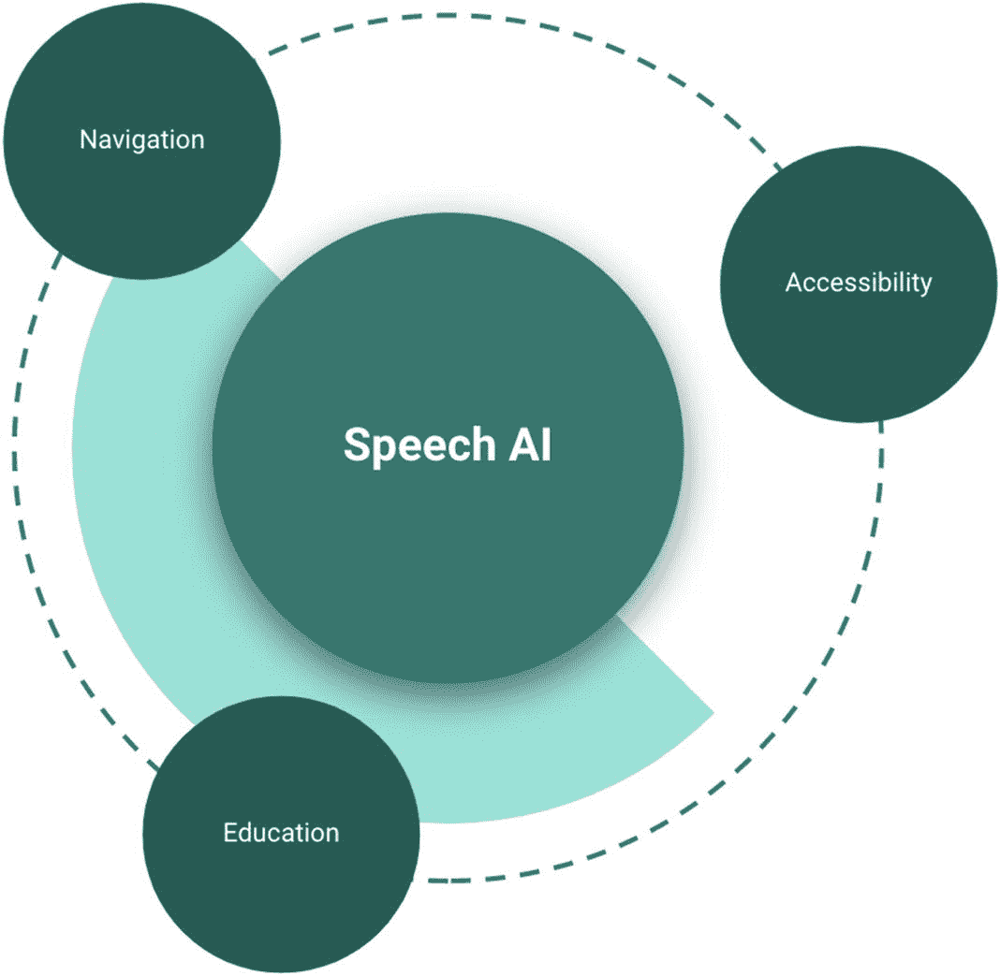

图 5-1。

语音人工智能的三个常见应用案例:导航、教育和可访问性

#### 航行

通过摄像头和增强现实应用程序，您可以引导视力障碍者参观一个新的地方，语音 API 通过应用程序转录 3D 世界来帮助他们。经济实惠的 3D 深度传感器的出现为这些人和其他人带来了新的机会，他们可以利用 3D 传感器和文本到语音转换服务的组合能力来探索世界。

由于视觉 API 也在本书中讨论，请考虑开设“裸眼”瑜伽课程的可能性，在这种课程中，您可以遵循音频指令，给定的音频提示会根据姿势校准服务通过普通摄像头看到的内容来调整您的姿势。你可以享受瑜伽课，而不用偷偷偷看你的屏幕，看老师做的每一个细微的动作。

还可以为不同能力的用户增加内容可访问性，提供音频选项以避免分心驾驶，或自动化客户服务交互以提高效率。

#### 教育

我们可能都用过有语音功能的应用程序或网站。这不仅能让学生体验更加丰富，还能让你的内容更有趣，更容易被更多的观众所接受。通过使用像 Speech Studio 这样的无代码工具，您可以提供更丰富的音频内容，而不需要任何开发知识。

虽然本章的大部分内容将讨论使用 Speech API 的以代码为中心的方法，但重要的是要理解还有其他方法与 API 交互，这些方法对用户的技术知识要求远低于编写 Python 代码。

通过利用语音 API 和语音转文本 API，您还能够更容易地向需要的人提供语音治疗服务。这本书的作者之一在孩童时期使用麦克风和卡带播放器进行语言治疗。虽然这肯定不能被描述为丰富的体验，但像这些 API 这样的现代工具可以提供交互式体验，这将有助于提高各种学生的演讲和语言能力。

#### 易接近

最后，语音服务与认知服务套件的其他部分合作，能够为许多在工作、家庭和外部世界中面临无障碍斗争的人强有力地实现无障碍。使用该服务的语音到文本和文本到语音功能，结合语音和语言的翻译能力，您可以将世界带给您的用户、学生、客户等。无论是离他们很近的世界还是离他们很远的世界，不管他们的语言、位置或能力如何，他们都可以用充满活力的方式体验它。

沿着这些思路，微软有两个项目利用并促进了人工智能的力量，以帮助用户和开发人员实现他们的可访问性之旅。残障服务台是 Microsoft 提供的服务台。残疾客户也可以获得对 Microsoft Office、Windows 和 Xbox 辅助功能的支持。该服务台包括产品问题、辅助功能问题和辅助技术的使用。AI for Accessibility 计划是微软为 AI accessibility 提供的一项资助计划，该计划将人工智能的力量用于增强全球超过 10 亿残疾人的能力。它可以提供手段和技术，给人们带来他们此时可能已经错过的体验。要了解人工智能无障碍方案，请访问本网站了解更多信息: [`www.microsoft.com/en-us/ai/ai-for-accessibility`](http://www.microsoft.com/en-us/ai/ai-for-accessibility) 。

### 与语音 API 交互

既然我们已经回顾了 API 的一些用例，现在是回顾与这些 API 通信的五种不同方式的好时机。

首先，我们简单讨论一下语音 CLI(命令行界面)。当处理高级服务请求或开发自定义行为时，使用 CLI 通常是非常好的选择(其中一些将在本章稍后介绍)。不管您怎么想，CLI 可以直接与来自麦克风的音频输入、预先录制的音频文件或文本文件进行交互。

第二，可以使用 Speech SDK(软件开发工具包)与这些 API 进行交互。Speech SDK 支持七种不同的编程语言可供选择:C#、C++、Go、Java、JavaScript、Objective-C 和 Python。Speech SDK 公开了语音服务的许多特性，但不是全部。如果您需要可以通过 Speech SDK 访问的特定特性，我们建议交叉检查 REST APIs 以获得更多的特性支持。

第三，当您有一个需要在 Windows、Linux 或 Android 设备上运行的应用程序时，您可以使用 Speech Devices SDK。与许多 Azure 服务一样，有一些功能在某些 Azure 地区受到限制，因此最好查看在线认知服务文档，了解当前支持的内容，因为这些内容会不断更新。当您仅仅出于一两个原因开发和部署东西时，这是一件需要记住的好事情。在您意识到您正在使用的区域还没有准备好支持这些特性之前，您不希望在开发工作中走得太远！这个 SDK 支持的编程语言是 Java 和 C++。这些设备应该可以与 ROOBO 开发套件以及 Azure Kinect DK 一起使用。

第四，Speech Studio 可以作为 Azure Cognitive Services 上语音服务的定制门户。它为您提供了一套与语音模型交互的无代码工具。在 studio 中，您可以准备您的定制模型，测试它们，然后在部署后监控它们。Speech Studio 还为您提供了定制模型来处理可用的音频语音数据，并且能够更深入地准备和测试您的模型。

最后，您可以对 restapi 进行 RESTful 调用。在语音服务中，有用于语音到文本、文本到语音以及批量转录和定制的 API。有了认知服务网站上的 REST APIs 文档，您将能够从 REST 调用中与 API 进行交互，而无需前面提到的 SDK。需要指出的是，尽管技术世界中有很多东西没有得到很好的记录，但是认知服务文档经常更新，并且充满了例子。那个文档可以在这里找到: [`https://docs.microsoft.com/en-us/azure/cognitive-services/speech-service/rest-speech-to-text`](https://docs.microsoft.com/en-us/azure/cognitive-services/speech-service/rest-speech-to-text) 。如果您正在寻找更高级的特性，如复制模型、从容器中转录数据、获取每个端点的日志等。，您可以在这些 API 调用中找到所有可用高级功能。

在这一章的其余部分，我将重点介绍如何使用 Python 来利用 Speech SDK。SDK 在 Speech Studio 这样的无代码工具和 API 调用这样的重代码方法之间提供了一个很好的中间地带。在使用代码示例练习了语音服务之后，我将介绍一些常见的语音数据集。我鼓励你将它们用于继续学习，以及学习如何更深入地研究你的音频数据，以获得更多的知识和见解。从那里开始，您将能够尝试许多不同的场景，并使用前面提到的用例作为起点，思考您可以使用语音服务的所有有趣的(并且可能有帮助的)方式。

## 文本到语音和语音到文本

考虑到我们已经引用了它们多少次，所以知道文本到语音和语音到文本 API 是语音服务中使用最频繁的就不足为奇了。这两个 API 提供了从端到端携手工作并联合音频和文本通信的可能性。虽然我们中的许多人可能熟悉在手机和其他设备中使用文本到语音和语音到文本的功能，但很可能你正在阅读这本书，因为你想学习如何自己使用它们。

为了开始这段旅程，我们将在 Azure 中创建一个语音服务，并熟悉 Azure Portal 上的语音服务接口。让我们来看看如何做到这一点。

### 创建语音服务

在本教程中，将通过 Azure Portal 创建一个新的语音 API:

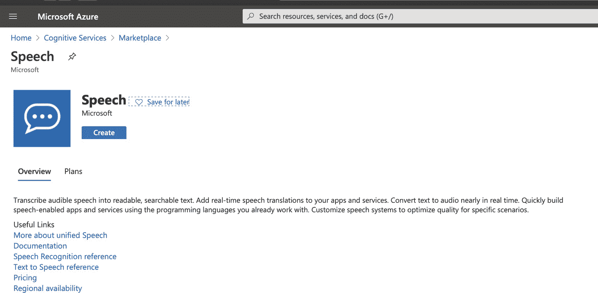

图 5-2。

微软认知服务市场中的语音服务

1.  进入蔚蓝门户: [`https://portal.azure.com/#home`](https://portal.azure.com/%2523home) 。加载后，在搜索栏中输入“认知服务”。单击“创建”按钮创建新资源。在 Marketplace 搜索栏中搜索“语音服务”(如图 [5-2](#Fig2) 所示)，选择 speech(微软提供的那个)，你应该会找到类似于图 [5-2](#Fig2) 所示的语音服务。

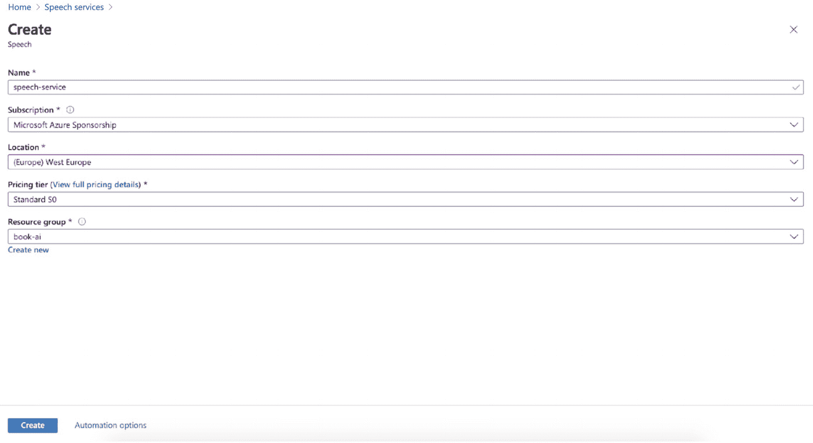

图 5-3。

Microsoft 认知服务市场中语音服务的创建页面上的参数设置

1.  在这一步中，我们将使用自由文本设置服务名称，因此请键入一个有助于您在 Azure 资源中识别它的名称。接下来，我们需要选择我们想要部署这个语音服务的订阅。接下来，选择服务的位置。它可以是离您的地理位置最近的位置，或者您可以选择离您的用户或客户最近的位置。下一个设置是定价层。以语音到文本为例，每种服务都有两个定价等级，免费(F0)和标准(S0)。

    如您所料，免费的在线转录确实限制了并发请求的数量。您可以对基本模型和定制模型进行一次并发调用。使用标准层时，基本模型可以有 100 个并发请求，定制模型可以有 20 个并发请求。在标准层中，您还可以为基本模型和定制模型模式提供一个可调整的模型。

2.  最后，为这个 API 选择(或添加)资源组。资源组存储关于 Azure 解决方案的资源的元数据。如果您的其他认知服务项目有一个现有的资源组，您可以在这里使用它。如果没有，为这个对你来说是新的项目创建一个新的也很好。到目前为止我们讨论的参数如图 [5-3](#Fig3) 所示。

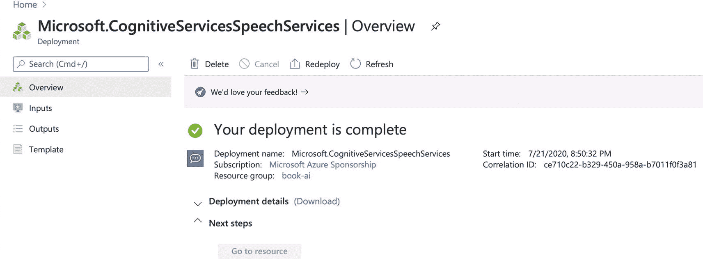

图 5-4。

微软认知服务语音服务中语音服务的部署状况

1.  通常在 1-2 分钟后，Azure Portal 将显示从“部署正在进行”到“您的部署已完成”的状态变化已部署服务的详细信息将以类似于图 [5-4](#Fig4) 的方式显示。

2.  在导航栏的左侧，您将看到概述、输入、输出和模板。通过选择 Template，页面会将部署设置显示为一个 JSON 文件，其中保存了输入参数。您可以将这个 JSON 文件用于脚本部署。

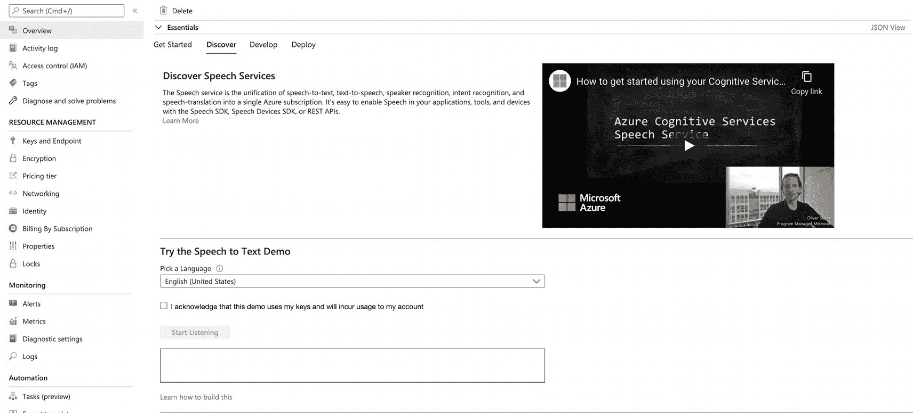

图 5-5。

已部署语音服务的概览页面上的发现选项卡

1.  当 Overview 页面上的“Go to resource”按钮变成蓝色时，单击它可以访问这个已部署的服务。在概述选项卡中，您将看到入门、发现、开发和部署。选择 Discover 选项卡，然后您将能够与刚刚创建的 API 进行第一次交互。页面应该如图 [5-5](#Fig5) 所示。

1.  在尝试了语音到文本服务演示之后，请确保您单击了“Keys and Endpoint”以获取我们稍后测试 API 时将使用的信息。请在方便的地方记录密钥、端点和区域字符串，因为我们将使用这些信息来连接到服务。

现在您已经创建了语音服务，让我们更深入地了解一下语音到文本 API 和文本到语音 API。

### 什么是语音转文本 API？

近年来，使用语音的搜索变得越来越重要。人们使用智能助手来管理他们的生活和工作环境。这些智能助理被设计成按照用户提供的音频指令来完成任务。换句话说，它将音频输入转换成计算机可读的命令。例如，当我们搜索电子邮件时，打开和关闭家里的灯，或者用我们的声音切换音乐设备上的歌曲。通过这些音频指令，语音到文本使音频输入与目标系统无缝集成。

甚至在新冠肺炎之前，一些学校就开始倾向于在线学习。然而，自从新冠肺炎开始以来，学生们花了大量的时间在家里，通过视频或流媒体音频学习，而不是面对面的指导。假设教师使用该技术来交付他们的材料，学生可能希望通过语音到文本 API 做笔记和总结内容。如果这种趋势继续下去，学生们开始在网上课堂中利用这一点，那么下一个问题就变成了，他们如何管理所有这些来自老师语音教学的文本内容？

这就是与这些内容进行下一级交互的原因。这些数据可以通过这个 API 进行索引、搜索和管理。那适用于单个学生吗？也许不是。它适用于为学生开发应用程序的应用程序开发者吗？绝对的。

除了这些可能与许多人相关的教育场景之外，该 API 转录、索引、管理和搜索这些数据的能力适用于任何必须处理音频内容的人。也许你公司的客户服务部门、你制作播客的朋友或者为在线医疗服务提供商工作的专业同事可以利用这些能力来更好地完成工作，甚至利用他们新获得的技术能力来过渡到技术角色。

### 什么是文本到语音转换 API？

文本到语音服务通常被称为 TTS 服务或人工语音合成。正如你所想象的，人们使用这些服务将文档、网页内容和博客文章转换成易于访问的音频。除此之外，技术接口(如前面提到的智能助手)利用了轻松将文本转换为语音的能力。

使用文本到语音转换 API，您可以从书面文本生成类似人类的音频。在发布时，它提供了超过 45 种语言和地区的标准语音和神经语音，以及超过 75 种非神经标准语音。

使用其长音频的异步合成，该服务使您能够处理长文本部分，因为它将并行处理和合成音频结果。标准语音和语音合成标记语言(SSML)可以使人工语音听起来更自然、更清晰。用户还可以调整它的音高和音量，添加停顿，改善它的发音，并修改它的语速。

如果您想尝试微软提供的基本示例之外的服务，我们建议您熟悉语音合成标记语言以定制语音特征，并关注神经声音的使用。

### 样品

有五种方式与语音转文本 API 交互。如果您正在寻找最详细的 API 文档，建议查看 v3 API 的 Swagger 文档。如果您想通过 Python 脚本快速掌握它，请专门搜索 Speech SDK–Python 会话。

#### 时髦的

如果你不熟悉，Swagger 是一种接口描述语言，用于描述使用 JSON 表达的 RESTful APIs。它是开源软件，具有自动化文档、代码生成和测试用例生成功能。

当您使用带有 Swagger 文档的 API 服务时，它通常会提供一个显示其所有端点的网页。对于每个端点，Swagger 文档展示了如何使用 POST、DELETE、GET 或 PATCH 与 API 进行交互，以便与端点进行交互。它还可以指导您应该将哪个数据模型作为请求对象发送。

要访问 Swagger 文档，请使用这个 URL: [`https://westus.dev.cognitive.microsoft.com/docs/services/speech-to-text-api-v3-0`](https://westus.dev.cognitive.microsoft.com/docs/services/speech-to-text-api-v3-0) 。“westus”可以替换为您选择的区域字符串。当选择测试的目标区域时，它会自动填充。

当访问 Swagger 文档时，语音服务的 v3 API 信息应该类似于图 [5-6](#Fig6) 。请注意，它还包含前面提到的批量转录和定制语音功能。对于每个端点，您可以使用本章前面建议您存储在方便的地方的身份验证密钥，通过此页面发送请求。希望你做到了——如果没有，请点击返回到你的语音服务并复制这些键。除了 Postman(许多阅读本书的开发人员可能对它很熟悉)，Swagger 还为您提供了测试这个 API 和其他 API 的另一种方法。

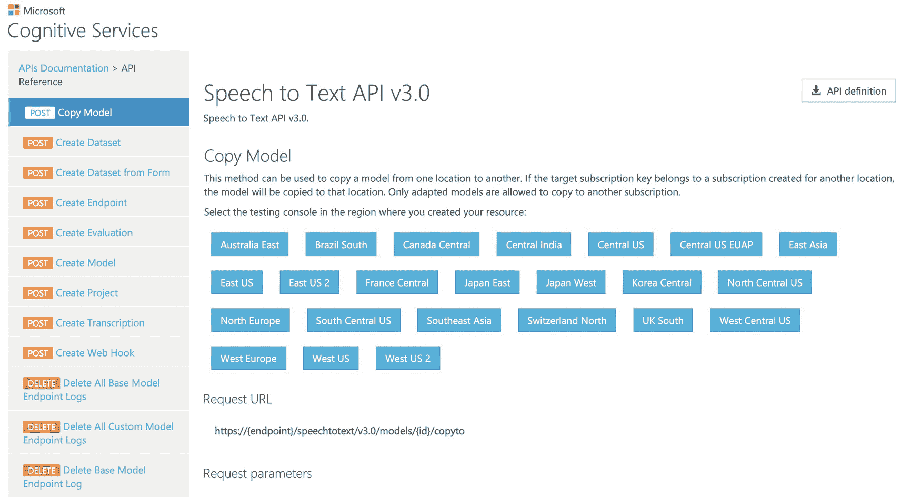

图 5-6。

已部署语音服务的 Swagger 文档

#### speech SDK–Python

如前所述，Speech SDK 支持 Python 包，旨在为 Python 开发人员提供与各种 Speech APIs 交互的可靠体验。

在本章的这一部分，我们将使用 Python SDK 与语音转文本 API 进行交互。Python SDK 的 pypi 页面，azure-cognitiveservices-speech，位于此: [`https://pypi.org/project/azure-cognitiveservices-speech/`](https://pypi.org/project/azure-cognitiveservices-speech/) 。用于此示例的 Python 包管理是 Pipenv。与其他方式相比，它可以帮助您更轻松地管理 Python 版本和包环境。如果你对 Pipenv 不熟悉，想了解更多，可以去看看这个网站: [`https://pipenv.pypa.io/en/latest/`](https://pipenv.pypa.io/en/latest/) 。

值得注意的是，这个例子可以在 Mac、Windows 或 Linux 上重现。无论您选择哪种计算平台，您都可以遵循这个示例。

在章节 [5](5.html) 示例代码文件夹中，你会看到一个名为 Pipfile 的文件。该文件描述了运行这个项目所需的 Python 包以及包的版本。通过运行`pipenv install`，Python 依赖项将被安装在一个虚拟环境中。然后，在运行`pipenv shell`之后，您将能够使用这个具有 Pipfile 中的依赖项的虚拟环境来运行脚本。

我们的第一个示例将介绍如何使用语音转文本 API 来处理来自麦克风的输入。当与服务交互时，语音键和服务区域是启动语音识别器所需的最重要的信息。如清单 [5-1](#PC1) 所示，你应该总是从设置资源连接 Azure API 开始。使用此设置，您将能够识别来自麦克风的音频内容。

此外，与第 4 章[中讨论的环境变量存储类似，建议在环境变量中存储 API 密钥等项目，以便在将代码上传到 GitHub 等位置时更加安全。否则，你的钥匙会暴露在窥探的目光下。为了测试的目的和尽早消除愚蠢的错误，可以跳过这一步。](4.html)

```py
speech_config = speechsdk.SpeechConfig(speech_key, service_region)
speech_recognizer = speechsdk.SpeechRecognizer(speech_config=speech_config)
result = speech_recognizer.recognize_once()

Listing 5-1.Initializing the Speech Recognizer for Microphone Input

```

Note

该代码块显示了脚本中最重要的部分。附加日志记录、错误处理等。可以随着项目的成熟而添加。

我们的第二个例子涉及使用语音到文本的静态文件输入。要使用静态文件调用服务，请准备类似于上一个示例的语音配置，但是在本例中，我们将使用音频文件(。wav)。您可以将文件存储为本地文件，或者将其上传到基于云的存储，如 Azure Blob 存储。接下来，用音频配置和语言启动语音合成器。音频配置包含输入文件的设置，输入文件可以是静态文件(如本例所示)或流数据输入(如您继续试验)。配置完这些设置后，您就可以运行这个脚本并从音频中获取脚本了。清单 [5-2](#PC2) 展示了如何为静态文件输入初始化语音合成器。

除了合成器和识别器的初始化之外，还应该有一个代码块来处理结果状态和结果失败细节。还建议在收到结果时记录任何消息。这将有助于我们更容易地调试服务和语音 API 之间的交互。

```py
file_config = speechsdk.audio.AudioOutputConfig(filename=file_name)
speech_synthesizer = speechsdk.SpeechSynthesizer(speech_config=speech_config, audio_config=file_config)
result = speech_synthesizer.speak_text_async(text).get()

Listing 5-2.Initializing the Speech Synthesizer for Static File Input

```

本节的第三个也是最后一个例子使用了文本到语音转换服务。这是我最喜欢的，因为它可以将文本和文学的美带给那些可能与自己的版本斗争的人(他们的斗争影响了他们体验这些文本的能力)。这里，我们准备了与前面的示例类似的带有语音 API 键的设置。我们还使用语音配置和音频配置启动语音合成器。随着你在这里的技能变得更高级，你也可以选择不同的说话声音，这样你也可以用不同的声音来体验文本。清单 [5-3](#PC3) 中描述了基本内容。我希望你喜欢这个！

```py
speech_config = speechsdk.SpeechConfig(subscription=speech_key, region=service_region)
speech_synthesizer = speechsdk.SpeechSynthesizer(speech_config=speech_config)
text = "The first text to speech sample."
result = speech_synthesizer.speak_text_async(text).get()

Listing 5-3.Sample of Text-to-Speech

```

Thoughts

对于文本到语音转换服务，有几个语音候选项可供您选择作为输出音频。在尝试了每一种之后，你对不同的声音有什么感觉？不同的声音如何影响用户体验？

## 注册你的声音

除了语音到文本和文本到语音服务，Azure 还提供一种叫做说话人识别的服务。虽然截至发稿时，说话人识别仍处于预览阶段，但它是整个语音服务的重要组成部分，值得我们花时间去探索。那么这项服务是什么，为什么重要？让我们检查一下。

说话人识别是一种可以根据说话人的声音特征来识别其身份的服务。音频可以揭示大量的信息，包括生理和行为特征，说话人识别利用所有这些能力来帮助识别和验证说话人。

虽然这项服务有各种各样的使用案例可以探索，但它目前的主要用途是安全和取证。这项服务使您能够识别和验证说话者，可用于保护设施，甚至在犯罪或安全事故现场识别某人。这就是为什么尽管该服务被称为说话人识别，但它通常被称为说话人识别和/或说话人确认。让我们从较高的层面来讨论服务的这两个组件。

### 说话人验证

说话人验证顾名思义，它使用一个人的声音来验证被识别的人就是说话人。通常，系统已经存储了用户的声音签名，以便在系统中预先注册。当一个新的音频流进来时，系统分析该音频流的特定特征和特性。

这种验证可以通过几种不同的方式进行——文本相关的方法和文本无关的方法。当签名和输入音频使用与已读取的脚本相同的文本时，这被称为文本相关方法。当声音签名不使用与输入音频相同的词时，这被称为文本无关方法。不管用什么方法，验证都是以同样的方式进行的。该系统将签名和输入的音频进行比较，如果差异在某个阈值内，系统将说这个声音属于该人。如果差值高于阈值，它会给出相反的结果。

无论企业是在呼叫中心使用这种技术进行客户身份验证，还是促进非接触式设施访问或其他用途，您都可以想象无接触/无图像验证在各种业务和应用中的可能性。

### 扬声器识别

说话人识别并不像它的名字所暗示的那样简单。它用于识别音频记录或视频记录的音轨中的不同扬声器。你可能会认为它是说话者区分，而不是说话者识别，但这不是微软如何命名的，所以这不是我们将如何提及它。然而，类似于验证，通常发言者将在事件之前注册他们的语音，该注册将被存储，然后发言者标识将尝试将会议记录中的音频与那些注册的语音进行匹配。目前，说话人识别能够在每个请求中识别多达 50 个说话人。

图 [5-7](#Fig7) 直观地展示了这两种说话人识别能力的区别。在说话人识别中，决策备选方案的数量等于观察组的大小。在验证中，只有两种选择，接受或拒绝，因为有多种声音需要服务进行分类。

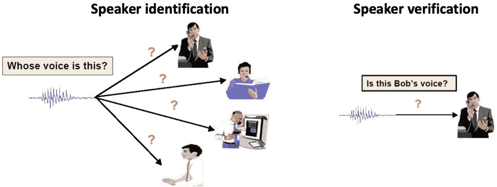

图 5-7。

说话人识别和说话人确认的区别

### 安全性和隐私

显然，每当我们谈论个人数据，尤其是与云交互或存储在云中的个人数据时，这些数据的安全性和隐私性是首要关注的问题。随着您的应用和项目从个人项目发展到专业项目，当您决定将我们在前面讨论的语音数据存储在哪里时，考虑这些问题非常重要。虽然有各种各样的选择，但我们在前面推荐了 Azure Blob 存储，因为 Azure 数据中心固有的强大安全性以及它必须将访问锁定到 Azure 订阅中非常特定的用户和角色的详细方法。无论您选择使用哪种存储解决方案，为了用户的安全，请牢记这些事项。

然而，除了存储之外，语音服务本身在适当地保护这些数据方面也发挥着作用。在服务中，当音频注册到 API 时，您可以指定它将被存储多长时间，以及指定何时更新和/或删除特定说话者的数据。最后，当服务从您的订阅中删除时，最好记住相关的存储数据也将被删除。现在我们已经了解了它的一些功能，让我们更深入地了解一下如何使用这个 API。

### 如何使用说话人识别 API

这里我们将再次使用前面提到的 Speech SDK，这一次是为了创建一个 speaker profile。然后，我们将使用该说话者简档来识别说话者。

Note

在发布时，目前仅在 westus 地区创建的 Azure 语音资源中支持说话人识别。

在我们开始之前，有几个先决条件需要你记住。首先，您需要在 westus 地区创建一个语音服务(参见前面的注释)。第二，你需要创建一个 Azure Blob 存储帐户，并上传一个语音文件。第三，从前面创建的语音服务中获取订阅密钥。作为参考，键的位置如图 [5-8](#Fig8) 所示。

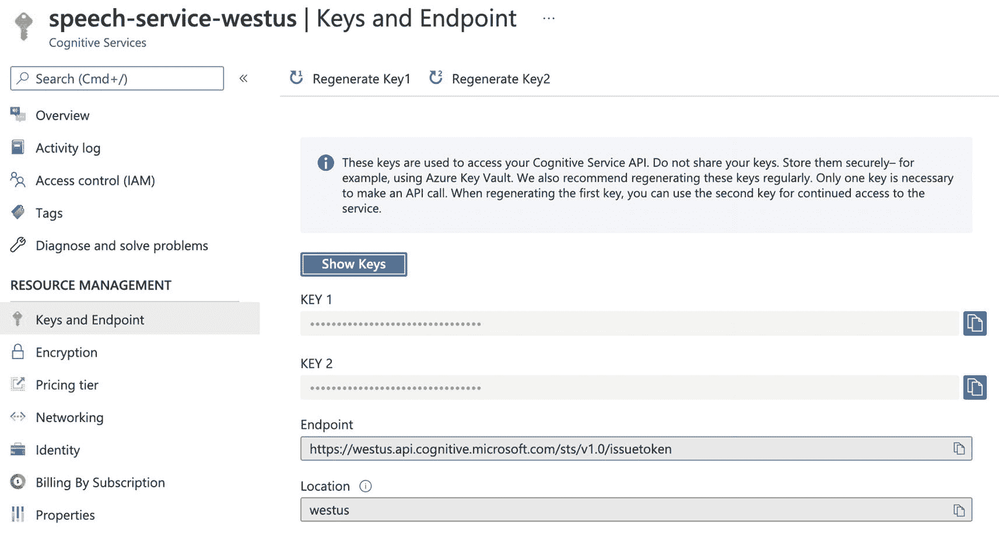

图 5-8。

已部署语音服务的关键信息页面

我们的下一个例子将深入到前面描述的发言者注册。在这个示例中，我们将使用微软发布的脚本与语音服务进行交互，该脚本在发布时还不是语音 SDK 的一部分。本例中有两个主要概念:为音频创建一个配置文件，然后注册/登记该配置文件。随后，我们将打印出所有现有的配置文件，以确保您已正确注册音频。

如您所料，您将需要语音服务的订阅密钥，就像您需要其他示例一样。继续从安全方便的地方检索它，然后使用清单 [5-4](#PC4) 来获得包含概要文件 ID 和文件路径的注册响应。

```py
helper = IdentificationServiceHttpClientHelper.IdentificationServiceHttpClientHelper(subscription_key)
creation_response = helper.create_profile(locale)
profile_id = creation_response.get_profile_id()

enrollment_response = helper.enroll_profile(profile_id, file_path, force_short_audio.lower() == "true")
profiles = helper.get_all_profiles()

Listing 5-4.Speaker Registration

```

本节的最后一个例子将涉及说话人识别。在前面的例子中列出了所有现有的扬声器配置文件后，现在您可以用准备好的录音文件测试扬声器识别。要识别说话者，您需要目标音频文件路径和配置文件 id。请记住，为了将来的实验，您可能会给出一个以上的概要文件 ID 来识别。清单 [5-5](#PC5) 中显示了执行这种识别的 Python。

```py
helper = IdentificationServiceHttpClientHelper.IdentificationServiceHttpClientHelper(subscription_key)
identification_response = helper.identify_file(file_path, profile_ids,force_short_audio.lower() == "true")

Listing 5-5.Speaker Identification

```

扬声器识别的输出 JSON 应如图 [5-9](#Fig9) 所示。扬声器标识的最大数量是 2，并且您必须确保 diarizationEnabled 标志也设置为 true。

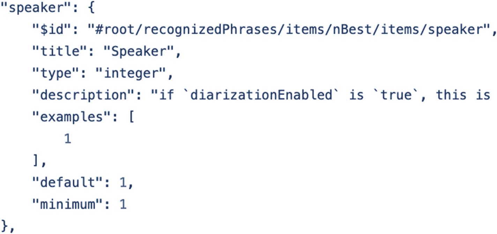

图 5-9。

说话者识别输出 JSON 的屏幕截图

Tips

如果你在找 C#。净样品，访问 [`https://github.com/Azure-Samples/cognitive-services-speech-sdk/tree/master/quickstart/csharp/dotnet`](https://github.com/Azure-Samples/cognitive-services-speech-sdk/tree/master/quickstart/csharp/dotnet) 。

## 语音翻译 SDK

语音翻译 SDK 为我们提供了使用语音翻译端点的能力。语音翻译端点可以将音频翻译成 30 多种语言，并根据您提供的术语自定义翻译。在图 [5-10](#Fig10) 中，我将模块按功能分为三个主要部分(实用程序、主接口和实现)。

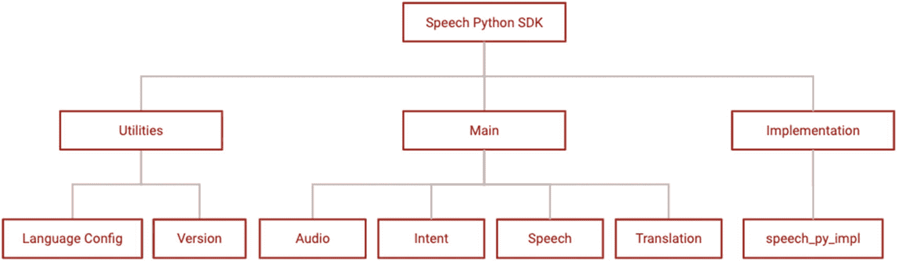

图 5-10。

语音翻译 Python SDK 的模块结构

让我们浏览一下语音翻译 SDK 的结构。首先，我们将讨论实用程序。这些模块负责初始设置，并为我们接下来的工作打下基础。LanguageConfig 模块处理客户端的语言配置。AutoDetectSourceLanguageConfig 帮助设置特定的端点以及要检测的潜在源语言列表(包含 SourceLanguageConfig)。然后，SourceLanguageConfig 用于帮助设置源语言和自定义端点。

Version 要简单得多——它如您所料，显示当前的版本号。

主要函数更深入一些，因为这些是与音频数据交互的模块，以及带有预定义 LanguageConfig 的语音 API 接口。

第一个主要功能是音频。它通过设置音频输入和输出的配置来处理音频数据的输入和输出。如果数据源是流数据源，它还提供拉和推设置来管理流音频。

接下来，我们有意图功能。正如您可能猜到的，IntentRecognizer 源自这个模块。在实现识别任务的意图时，这是最重要的部分。由此，可以用订阅信息、端点或应用程序 ID 来启动 LanguageUnderstandingModel。如果一切按计划进行，IntentRecognitionResult 将向您返回输出。如果事情没有按计划进行，原因将显示在 CanceledEventArgs 类中。

从意图功能开始，我们有了言语功能。如前所述，该模块与文本到语音和语音到文本服务交互。到目前为止，我们已经比较深入地讨论了这些，所以让我们继续讨论翻译功能。

转换函数包含 SpeechTranslationConfig，它可以用订阅信息、端点、主机或身份验证令牌来启动。TranslationRecognizer 还包括合成器，它也负责翻译结果的聚合。

最后，我们将讨论实现函数。speech_py_impl 模块包含所有类的实现，包括(但不限于)Activity、Audio、speech、BotFrameworkConfig、Conversation、Dialog、Intent、Translation、Connection settings 和 Session 事件。

Tips

当您使用我们提供的示例开发服务时，请尝试从微小的更改开始。理解使这些脚本工作的关键元素，通过 REST API 的流程工作，并用官方文档补充这项工作，以寻找强制和可选参数是什么，以及它们可以提供什么功能。它还将帮助您更加熟悉 SDK，并加深对这些服务的了解。

现在我们已经介绍了接口，您已经具备了开始使用这个包所需的大部分知识。供您参考，不同操作系统安装该软件包的先决条件如下:

1.  *Windows*–x64 和 x86

2.  *Mac*–Mac OS X 版本 10.12 或更高版本

3.  *Linux*–x64 上的 Ubuntu 16.04/18.04、Debian 9、RHEL 7/8、CentOS 7/8

使用 pip 安装来安装认知服务语音 SDK Python 包:

```py
pip install azure-cognitiveservices-speech

```

在我们开始下一个例子之前，完全设置好您的环境是很重要的。为了设置一个环境来继续其余的示例，请确保您已经安装了 Visual Studio 代码，安装了 Python 3.8，并使用 Git 来获取本书的示例库。一旦完成，运行`pipenv install`和`pipenv shell`在 Visual Studio 代码中启动开发环境。最后，确保前面讨论的语音 API 服务已经创建，并且仍然存在于您的 Azure 帐户中。

### 将语音翻译成文本

对于本节中的第一个示例，我们将再次使用 Python SDK 的语音服务，并使用我们的订阅创建一个语音识别器对象。和以前一样(你现在可能已经习惯了！)，从您的语音服务中复制您的订购密钥和地区信息，如图 [5-11](#Fig11) 所示。

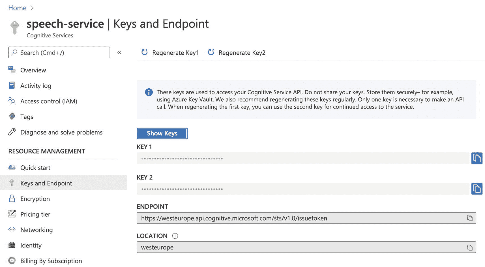

图 5-11。

“密钥和端点”页面中的密钥信息

启动 SpeechRecognizer 时，您将需要 SpeechConfig。要创建 SpeechConfig(包含前面提到的订阅密钥和区域信息)，您可以将这些信息与清单 [5-6](#PC7) 中的示例结合起来。使用 SpeechRecognizer 对象，您可以启动单个发音的识别过程。

```py
speech_config = speechsdk.SpeechConfig(speech_key, service_region)
speech_recognizer = speechsdk.SpeechRecognizer(speech_config=speech_config)
result = speech_recognizer.recognize_once()

Listing 5-6.Initiate Speech Recognizer

```

接下来，检查从清单 [5-6](#PC7) 中的代码返回的 TranslationRecognitionResult。如清单 [5-7](#PC8) 所示，对于不同类型的识别结果，我们可以在这里使用不同的日志消息。当结果返回时，您将能够看到音频是否已经被正确解析。您还可以从包含的错误处理中识别错误类型。

```py
if result.reason == speechsdk.ResultReason.RecognizedSpeech:
    print(f"Recognized: {result.text}")

elif result.reason == speechsdk.ResultReason.NoMatch:
    detail = result.no_match_details
    print(f"No speech could be recognized: {detail}")

elif result.reason == speechsdk.ResultReason.Canceled:
    cancellation_details = result.cancellation_details
    reason = cancellation_details.reason
    print("Speech Recognition canceled: {reason}")

    if cancellation_details.reason == speechsdk.CancellationReason.Error:
        detail = cancellation_details.error_details
        print(f"Error details: {detail}")

Listing 5-7.Speech Recognizer Result Processing

```

### 将语音翻译成多种目标语言文本

如果您的应用程序中有音频翻译功能，您将需要将音频内容转换为多语言抄本。

首先，正如现在所预期的，从您之前创建的语音服务中复制您的订阅密钥和地区信息。如图 [5-12](#Fig12) 所示。

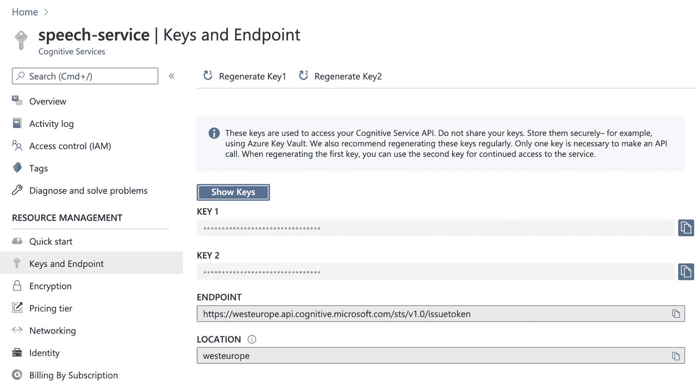

图 5-12。

“密钥和端点”页面中的密钥信息

接下来，用订阅密钥和区域信息创建一个 SpeechTranslationConfig。用语音识别源语言更新 SpeechTranslationConfig 对象。然后，用指定的翻译目标语言更新 SpeechTranslationConfig 对象。如清单 [5-8](#PC9) 所示，目标语言也可以是多种语言。

```py
translation_config = speechsdk.translation.SpeechTranslationConfig(subscription=speech_key, region=service_region)
fromLanguage = "en-US"
translation_config.speech_recognition_language = fromLanguage
translation_config.add_target_language("de")
translation_config.add_target_language("fr")

Listing 5-8.Add attributes to Speech Config

```

接下来，如清单 [5-9](#PC10) 所示，使用前面的 SpeechTranslationConfig 对象创建一个 TranslationRecognizer 对象。使用 TranslationRecognizer 对象，启动单个发音的识别过程。

```py
recognizer = speechsdk.translation.TranslationRecognizer(translation_config=translation_config)
result = recognizer.recognize_once()

Listing 5-9.Build the Translation Config

```

然后，检查返回的 TranslationRecognitionResult。如清单 [5-10](#PC11) 所示，我们将出于各种原因处理来自认知服务的结果。然后，我们将打印出应用程序中的多语言翻译文本。

```py
if result.reason == speechsdk.ResultReason.TranslatedSpeech:
    print(f"RECOGNIZED {fromLanguage}: {result.text}")
    de_translate = result.translations["de"]
    fr_translate = result.translations["fr"]
    print(f"TRANSLATED into de: {de_translate}")
    print(f"TRANSLATED into fr: {fr_translate}")

elif result.reason == speechsdk.ResultReason.RecognizedSpeech:
    print(f"RECOGNIZED: {result.text} (text could not be translated)")

elif result.reason == speechsdk.ResultReason.NoMatch:
        detail = result.no_match_details
        print(f"NOMATCH: Speech could not be recognized: {detail}")

elif result.reason == speechsdk.ResultReason.Canceled:
        print("CANCELED: Reason={}".format(result.cancellation_details.reason))
        reason = result.cancellation_details.reason
        if reason == speechsdk.CancellationReason.Error:
            detail = result.cancellation_details.error_details
            print(f"CANCELED: ErrorDetails={detail}")

Listing 5-10.Translation Result Processing

```

### 将语音翻译成语音

本节的最后一个例子是使用语音到语音服务，它将一个语音音频输入翻译成另一种语言的语音。

像往常一样，第一步是从语音服务中复制您的订阅密钥和地区信息。作为参考，如图 [5-13](#Fig13) 所示。

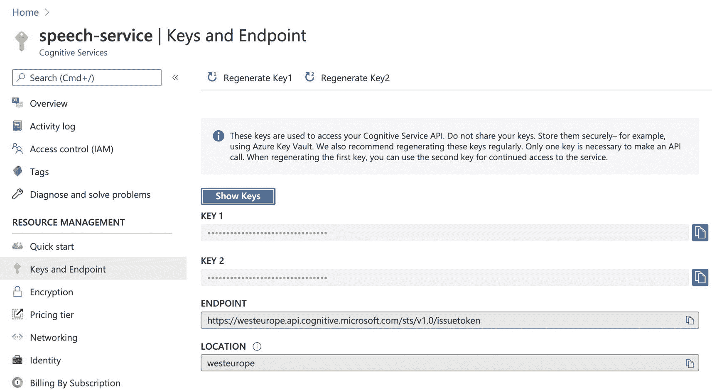

图 5-13。

“密钥和端点”页面中的密钥信息

接下来，创建一个 SpeechTranslationConfig，它包含订阅密钥和区域信息。接下来，更新 SpeechTranslationConfig 对象以指定语音识别源语言和翻译目标语言。

下一步是从标准语音列表中选择语音名称，该列表包含超过 45 种语言和地区的 75 种标准语音。最新列表请参考 [`https://docs.microsoft.com/en-us/azure/cognitive-services/speech-service/language-support#standard-voices`](https://docs.microsoft.com/en-us/azure/cognitive-services/speech-service/language-support%2523standard-voices) 。比如对于汉语(台湾普通话)，语言代码是“zh-TW”，有一个女声名字叫“zh-TW-Yating”。这个名字很有意义，因为这是台湾最常见的女性名字。虽然这很有趣，但本例中选择的声音是“de-DE-HeddaRUS”。

现在让我们用翻译配置启动识别器。前面两段的代码如清单 [5-11](#PC12) 所示。

```py
translation_config = speechsdk.translation.SpeechTranslationConfig(
        subscription=speech_key,
        region=service_region)

fromLanguage = "en-US"
toLanguage = "de"

translation_config.speech_recognition_language = fromLanguage
translation_config.add_target_language(toLanguage)
translation_config.voice_name = "de-DE-HeddaRUS"

recognizer = speechsdk.translation.TranslationRecognizer(
        translation_config=translation_config)

Listing 5-11.The Speech Translation Config

```

在清单 [5-12](#PC13) 中，我们将设置回调函数并开始识别音频输入。

```py
def synthesis_callback(evt):
    size = len(evt.result.audio)
    status_msg = "(COMPLETED)" if size == 0 else ""
    print(f"AUDIO SYNTHESIZED: {size} byte(s) {status_msg}")

    recognizer.synthesizing.connect(synthesis_callback)

    print("Say something...")
    result = recognizer.recognize_once()

Listing 5-12.Callback and Start Recognizing

```

接下来，我们接收响应，并根据指定的响应原因对其进行处理。你可以在清单 [5-13](#PC14) 中看到这些东西的代码。

```py
if result.reason == speechsdk.ResultReason.TranslatedSpeech:
    print(f"RECOGNIZED {fromLanguage}: {result.text}")
    de_translate = result.translations["de"]
    print(f"TRANSLATED into {toLanguage}: {de_translate}")

elif result.reason == speechsdk.ResultReason.RecognizedSpeech:
    print(f"RECOGNIZED: {result.text} (text could not be translated)")

elif result.reason == speechsdk.ResultReason.NoMatch:
    reason = result.no_match_details
    print(f"NOMATCH: Speech could not be recognized: {reason}")

elif result.reason == speechsdk.ResultReason.Canceled:
    reason = result.cancellation_details.reason
    print(f"CANCELED: Reason={reason}")

    if reason == speechsdk.CancellationReason.Error:
        detail = result.cancellation_details.error_details
        print(f"CANCELED: ErrorDetails={detail}")

Listing 5-13.Process the Response

```

## 高级语音知识

在上一节的所有示例之后，希望您对认知服务语音服务以及如何与之交互有更深的理解。如果这激起了你的兴趣，你应该会喜欢这一节，在这一节中，我们将深入研究这些能力实际上是如何工作的。您将在这里获得一些额外的详细信息，并且有望对语音服务有更深的理解，对领域术语也有更好的了解。

### 语音到文本和语音识别是如何工作的？

正如您在本章中所了解到的，我们可以在多种场景中使用语音服务。在这里，我选择“语音情感分析服务”作为研究案例。该研究论文名为“对特定于说话人的语音数据的情感分析”，来自 2017 年智能计算和控制系统国际会议。我发现这是一个很好的阅读和学习的例子，希望你也能如此。

在过去的几十年中，人们已经使用文本情感分析来分析留言板文本、新闻文章，甚至餐馆评论。这种分析的结果可以让我们更深入地了解我们的客户、公众情绪和整体市场趋势。

使用语音服务，我们也可以将同样的想法应用于音频数据。我们可以分析公司客服电话的录音、音频或视频会议中发言人的身份和情绪，以及其他场景。虽然音频情感分析可能没有文本情感分析那么成熟，但是我们仍然可以使用相同的概念来更好地理解我们的音频数据。

要使用语音情感分析服务，我们需要三个组件来实现这一点。首先，从图 [5-14](#Fig14) 的图表中，你可以发现存在“说话人辨别”当我们分析语音数据时，它并不总是来自单个人的记录；有时(可能经常)在同一个文件中会出现几个人的声音。您需要识别音频资源，以便进行更一致的分析。下文中所称的说话人辨别也称为说话人识别。

你不一定需要某人的真实姓名来标记数据。只要你能在录音中分离出每个人的讲话，你就能进行充分的说话人识别。

我们需要的第二个组件是“语音识别”(见图 [5-14](#Fig14) 的底部)。你很可能在读完前面的段落后会想，“这是令人困惑的术语。”可能有点，但这里的“语音识别”可能更准确地理解为“语音解析”，意思是将音频文件转换为简短的文本或短语，然后可以被人类或计算机理解。因为这些模型非常复杂，所以用户通常不会创建自己的模型来完成这项工作。以前，这方面的常用工具包括 Bing Speech 或 Google Speech Recognition 作为语音识别服务的选择。当然，认知服务旨在改变这种状况。

如果你跟着图 [5-14](#Fig14) 走，你会看到我们需要两个来自语音服务的标签。一个是说话人辨别，一个是语音识别。一旦有了说话者 ID 和语音转录，就可以将音频数据解析成一系列文本数据。

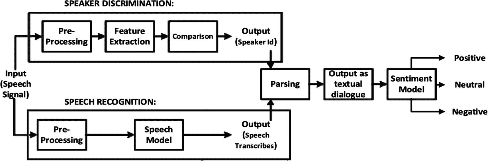

图 5-14。

“特定于说话人的语音数据的情感分析”中的情感分析系统的建议结构

在我们记录了一系列对话之后，每一句话都成为了情感模型的输入。最终，我们可以从不同说话人的对话内容中看出情绪的走向。数据输出将揭示谁开始了一场伟大的讨论，以及人们何时开始失去注意力或在讨论中由某些单词或句子引发情绪。我们还会为所有这些设置时间戳。

这项服务将使音频数据更易于搜索。回想一下前面章节中讨论的场景，音频、视频和播客内容可以使用这样的服务以更简单的方式进行搜索、索引和管理。

我们还没有谈到的一件事是我们如何识别说话者。通常，我们会通过使用形容词来描述不同的声音来识别说话者。例子包括嘶哑、平坦、低沉、响亮、沙哑、平滑、绷紧、低、高、尖锐等等。计算机如何伪装这些不同类型的声音，并将它们分成不同的说话者配置文件？

通常人们在这个分析中使用“赫兹”作为第一个数据点。大多数男性通常在 85 到 180 赫兹之间，大多数女性在 165 到 255 赫兹之间。虽然这是一个可以使用的基本数据点，但重要的不仅仅是赫兹的范围。不同的语言听起来也不同，因为人们用不同的方式来发音和说话。此外，正如你所料，不同语言的词汇和表达方式也有很大的不同。

Erik Bernhardsson 写了一篇关于这个话题的有趣文章。他提出了一个表格，汇集了说话者的性别和口语的信息，映射了 FFT(快速傅立叶变换)系数的大小[2]。图 [5-15](#Fig15) 中的表格显示了不同语言中女性说话者的不同峰值。此外，不同的语言模式确实反映了不同的语言听起来确实非常不同。

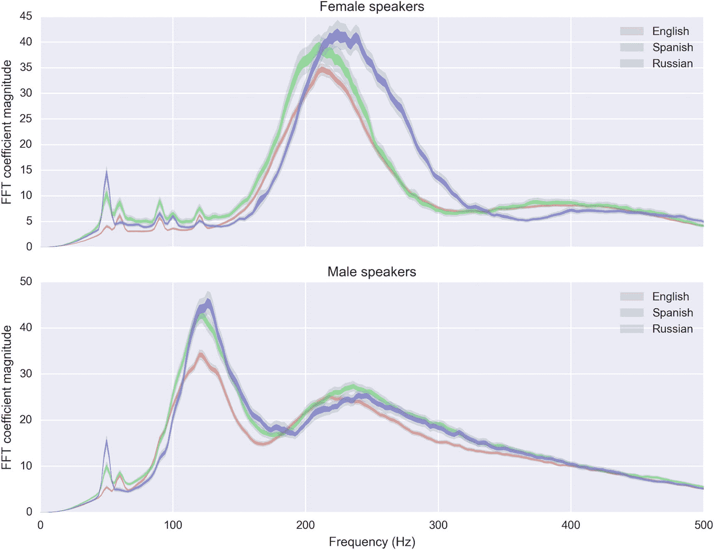

图 5-15。

根据参考文献[2]中的语言间距比较语言

除了 FFT，在阅读音频分析主题文章时，您还会看到各种类型的傅立叶变换。傅立叶变换的数学意义超出了本书的范围，但是，如果你对它感兴趣，在“参考资料”一节中确定为[2]的文章非常值得一读。关键概念是傅立叶变换是一种变换，可以帮助您将音频数据转换为一系列数字，从而将连续信号从时域转换到频域。一旦发生了这种转换，数据就更容易分析了。

如果你将音频数据可视化，你会发现当不同的人用同一种语言发同一个单词的音时，有一些共同的模式。这就是为什么人们可以像在计算机视觉领域一样，使用类似的计量方法通过神经网络对音频数据进行分类。

另一个例子是 UrbanSound8k 数据集的可视化。[1]如图 [5-16](#Fig16) 所示，UrbanSound8k 数据集包含来自 10 个类别的 8732 个带标签的城市声音摘录(≤ 4s)。这是音频分类的另一个例子，可以更好地帮助你理解本节讨论的语音概念。

如果您查看音频数据点的频率、频谱密度、振幅和其他特征，您可以将它们与可以由几个数字特征描述的数据点相关联。一旦从不同的转换中收集了这些特征，您就可以推断出前面讨论的技巧，并有望更好地理解作为数字和表格数据分析的音频。以这种方式看到的数据对您来说应该没有以前那么抽象了。

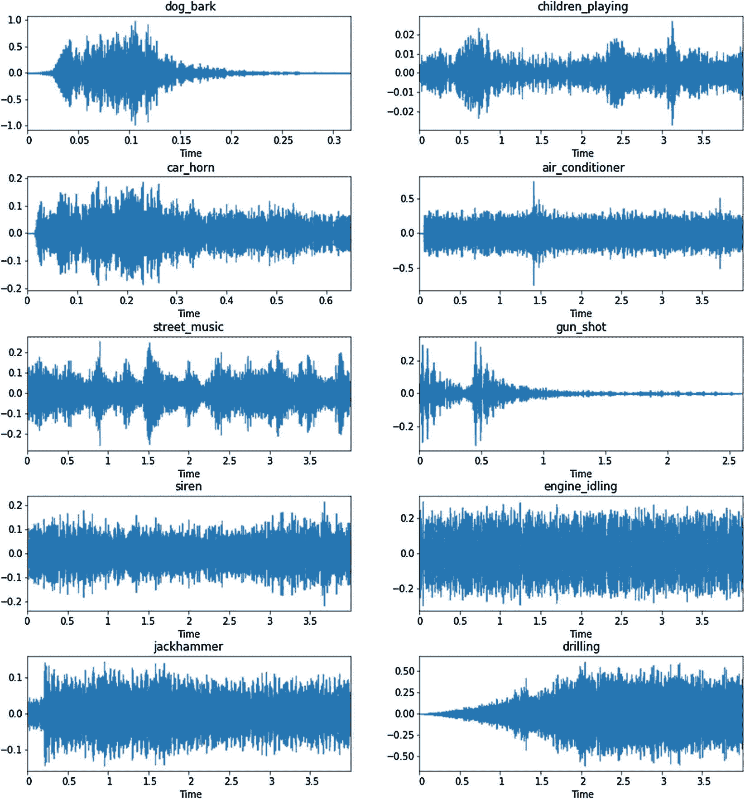

图 5-16。

URBANSOUND8K 数据集的可视化

### 语音 FSDD 数据集(高级语音案例)

现在，您已经更好地理解了文本到语音和语音到文本的工作机制，您可能希望尝试一下 MNIST(改进的国家标准和技术研究所)的语音识别数据集，语音 FSDD(免费口语数字数据集)。

MNIST 数据集通常是开始研究深度学习，尤其是计算机视觉(正如我们在本书其他地方讨论的那样)的人使用的第一个数据集。它是由 30，000 个手写数字图像组成的。人们可以使用数据集来学习如何构建基本的图像分类模型。

因为我们在这里谈论的是语音识别，不过，让我们从一个类似的“hello world”级别的音频数据集开始。FSDD 是一个开放的数据集，供人们学习如何进行语音识别。为了“征服”这个数据集，您需要从 1，500 个录音中识别语音数字。

在这个数据集中记录了三个说话者。他们每个人都将每个数字记录了 50 次。该数据集的大小为 10 MB。

现在舞台已经搭建好了，让我们了解更多关于如何使用 FSDD 的音频数据。在本节的其余部分，Python 是这里的首选语言。但是，如果您是 C#开发人员，您可以参考“参考资料”一节中的[3],以了解更多有关如何使用 C#与该数据集进行交互的信息。

首先，从我们的示例 GitHub 存储库中克隆示例代码，并从 [`https://github.com/Jakobovski/free-spoken-digit-dataset`](https://github.com/Jakobovski/free-spoken-digit-dataset) 下载数据集。将其下载到您稍后将使用它的文件夹中。

接下来，导入清单 [5-14](#PC15) 中详细列出的库，供以后使用。librosa 包是我们在这里使用的主要音频分析包。它将为您提取音频特征。此外，特别是对于正在阅读本书的数据人员来说，有些包您可能很熟悉:NumPy 和 Pandas，它们是 Python 的基本 ELT 包。matplotlib 和 librosa.display 包负责音频特性的可视化。最后，Keras 和 sklearn 帮助建立机器学习模型。

```py
import numpy as np
import matplotlib.pyplot as plt
import librosa
import os
import librosa.display
from keras.layers import Dense
from keras.models import Sequential
from keras.optimizers import SGD
import pandas as pd
from sklearn.model_selection import train_test_split

Listing 5-14.Import the Libraries

```

导入之后，我们将读取数据集，并从音频中提取 STFT(短时傅立叶变换)特征。STFT 是音频的频率特征表示。得到音频特征后，为每个数字绘制一个图。清单 [5-15](#PC16) 中给出了实现这一点的步骤。

```py
file = os.listdir("free-spoken-digit-dataset/recordings")
data = []
for i in file:
    x, sr = librosa.load("free-spoken-digit-dataset/recordings/" + i)
    data.append(x)

def plot_images(images, cls_true, cls_pred=None):
    assert len(images) == len(cls_true) == 9

    # Create figure with 3x3 sub-plots.
    fig, axes = plt.subplots(3, 3, figsize=(15, 15))
    fig.subplots_adjust(hspace=0.3, wspace=0.3)

    max = np.max(images)
    min = np.min(images)

    for i, ax in enumerate(axes.flat):
        # Plot image.
        librosa.display.specshow(images[i], ax=ax, vmin=min, vmax=max)

        # Show true and predicted classes.
        if cls_pred is None:
            xlabel = "True: {0}".format(cls_true[i])
        else:
            xlabel = "True: {0}, Pred: {1}".format(cls_true[i], cls_pred[i])

        ax.set_xlabel(xlabel)
    # Ensure the plot is shown correctly with multiple plots
    # in a single Notebook cell.
    plt.show()

Listing 5-15.Read the File, and Visualize It

```

完成这项工作后，我们的目标是绘制一个 3 × 3 的图形。每个都显示一个数字文件。从图 [5-17](#Fig17) 中的标签，您将能够看到音频数据中不同数字有不同的特征值。您还可以在图中看到，许多图形具有相似的颜色分布。为了与其他数字进行比较，我们需要将它们分成十类。不过，要做到这一点，我们需要使用神经网络分类。


图 5-17。

音频特征的可视化

如清单 [5-16](#PC17) 所示，我们将分割训练和测试数据。我们将使用 STFT 特征变换来准备数据，然后将音频数据放入 NumPy 数组中。随后可以在 Keras 神经网络中使用。最后，我们将使用`get_dummies`来获得数据标签的独热编码。

```py
# prepare X and Y
X = []
for i in range(len(data)):
    X.append(abs(librosa.stft(data[i]).mean(axis=1).T))
X = np.array(X)
y = [i[0] for i in file]
Y = pd.get_dummies(y)  # One Hot Encoding

# Splitting Dataset
X_train, X_test, y_train, y_test = train_test_split(X, Y, test_size=0.25)

Listing 5-16.Split X(feature) and Y(label) and Split Training and Testing Data

```

接下来，我们将创建一个输入维度= 1025 的小型序列神经网络模型。我们还将添加四个密集层，使用 SGD(随机梯度下降)作为优化器。清单 [5-17](#PC18) 显示了这段代码。

```py
# model:
model = Sequential()
model.add(Dense(256, activation="tanh", input_dim=1025))
model.add(Dense(128, activation="tanh"))
model.add(Dense(128, activation="tanh"))
model.add(Dense(10, activation="softmax"))
sgd = SGD(lr=0.01, decay=1e-6, momentum=0.9, nesterov=True)
model.compile(loss="binary_crossentropy", optimizer=sgd, metrics=["accuracy"])
history = model.fit(
    X_train,
    y_train,
    epochs=20,
    batch_size=128,
    verbose=1,
    validation_data=(X_test, y_test),
    shuffle=True,
)
score = model.evaluate(X_test, y_test, batch_size=128)

Listing 5-17.Create the Model and Start Training

```

为了更深一步，你也可以尝试不同的层，如辍学，conv，和其他。也可以使用不同的激活函数，如 relu、tanh、sigmoid 和 softmax。为了更广泛的学习，也鼓励尝试不同的优化器。

但是，除了更深入的建议之外，您可以看到，在运行 model.fit()的 20 个时期之后，您将获得一个能够以 91%的准确率识别数字的模型。

如果你想在训练期间看到损失和准确度的曲线图，使用清单 [5-18](#PC19) 中的内容。你会看到在图 [5-18](#Fig18) 中输出的精度图。

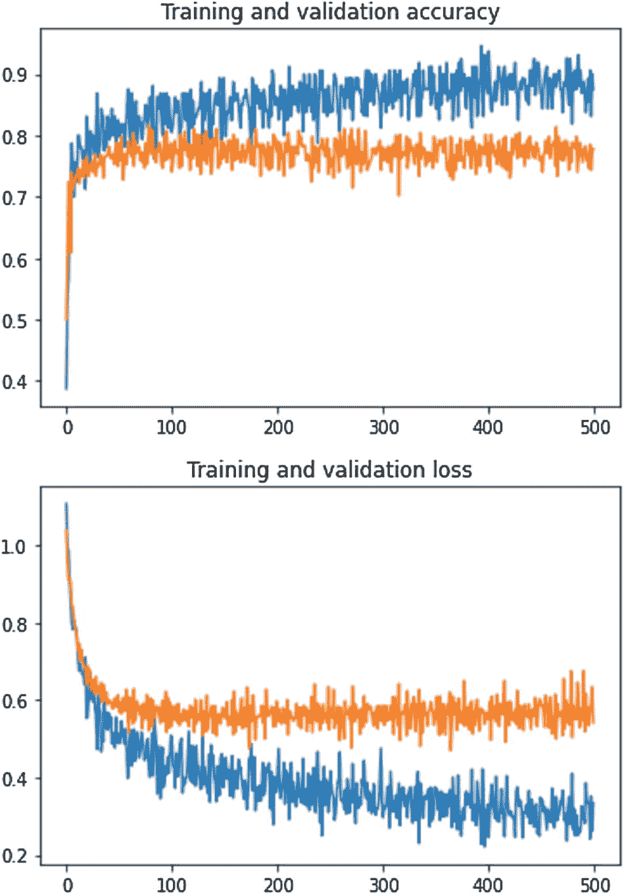

图 5-18。

训练准确度和损失图

```py
plt.plot(history.history["loss"])
plt.plot(history.history["val_loss"])
plt.xlabel("Epoch")
plt.ylabel("loss")

# plot acc

plt.plot(history.history["loss"])
plt.plot(history.history["val_loss"])
plt.xlabel("Epoch")
plt.ylabel("loss")

Listing 5-18.Create a graph for loss and evaluation loss value with different training epochs

```

## 摘要

我们在本章开始时讨论了语音服务的一些真实使用案例，以鼓励您自己思考可以应用该技术的真实场景。当我们从那里继续设置语音服务，使用语音到文本和文本到语音服务，并最终处理音频和文本数据时，我们希望所有这些看起来都不像阅读本章之前那样令人生畏。一旦您对语音服务更熟悉了，我们就开始进行说话人识别，这样您就可以了解如何识别对话和录音中的说话人。然后，通过 Translation SDK，我们展示了如何构建可以在两种语言之间进行通信的应用程序框架。

最后，对于那些对这些服务背后的概念和数学有兴趣的人，我们向您介绍了数据集和开源库，它们可以帮助促进更深入的学习。您现在还知道了如何可视化音频数据，并且了解了使用哪个 Python 库来处理音频分析。

要成为本章所讨论的所有领域的专家，当然需要学习大量的信息。也就是说，我们希望你现在已经了解了认知服务语音的功能，这样你就可以开始你自己的语音服务项目了。

## 参考

[`https://urbansounddataset.weebly.com/urbansound8k.html`](https://urbansounddataset.weebly.com/urbansound8k.html)

[`https://erikbern.com/2017/02/01/language-pitch.html`](https://erikbern.com/2017/02/01/language-pitch.html)

[`http://accord-framework.net/docs/html/T_Accord_Audition_BagOfAudioWords.htm`](http://accord-framework.net/docs/html/T_Accord_Audition_BagOfAudioWords.htm)【3】