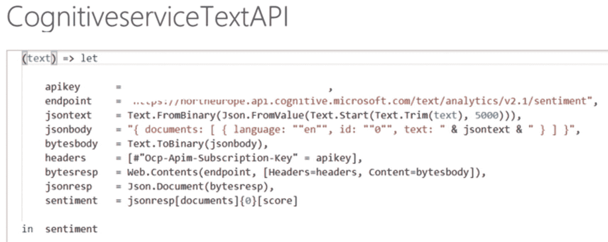

# 六、Power 平台和认知服务

Azure 认知服务正越来越多地融入微软生态系统中的应用，包括微软 Power 平台。对于刚刚开始使用人工智能的业务分析师或开发人员，本章将概述 Power 平台中可用的人工智能功能，您可以将这些功能集成到自己的解决方案或用例中。

Power Platform 是三个产品的集合:Power BI 用于分析和获得关于数据的见解，PowerApps 用于在数据基础上创建应用，Power Automate 用于构建业务流程、工作流或开发应用逻辑。所有这三个 Power 产品都是为开发人员提供无代码、低代码的体验而构建的，利用了平台上已经存在的基本构建块和连接器。

Power Platform 中人工智能的典型用例包括但不限于应用预定义的认知服务模型进行情感分析，从句子中检测关键短语，从数据中检测语言，以及为数据标记图像。这些能力将使您能够利用人工智能丰富商业智能(BI)、应用或自动化，并加快开发流程，以推动更好的业务成果。

本章的重点是 Power BI 中的 AI 机会范围，在本章结束时，您将学习使用 AI Builder，这是一个 Power 平台功能，可让您将 AI 融入您的应用和自动化流程。

## 人工智能在您的商业智能中概述

人工智能(AI)——在过去的几年里，主要厂商已经在人工智能(AI)驱动的应用上投入了大量资金。融合人工智能和数据分析增强了组织决策。它能够执行复杂的任务并深入了解大型数据集。Power BI 是一个市场领先的企业和自助式商业智能和分析平台，允许您收集数据并将其转换为丰富的可视化内容，以便您可以专注于对您来说重要的事情。BI 是指将数据转换为有意义的信息以推动业务关键决策的一系列流程、架构和技术。在 Power BI 等产品中使用预构建的人工智能功能的能力开辟了新的可能性，即使对于那些不知道如何编写一行代码的人来说也是如此。分析师可以从社交媒体、客户服务或在线评论中进行情感分析，并从文本中提取关键短语，以可视化人们就其服务或品牌提供的反馈。对于可以使用 R 或 Python 等语言整合 Azure 机器学习模型的数据科学家来说，还有更多扩展 AI 的选项。这些选项允许数据专业人员与业务分析师一起工作。它成为一个生态系统，不同技能水平的人可以合作，使用不同的选项来整合认知服务。让我们来看一些不同的选项，在这些选项中，AI 可以跨 Power 平台进行整合。表 [6-1](#Tab1) 总结了 Power 平台上数据科学家和业务分析师/低代码开发人员这两类人物角色的一些关键选项。

表 6-1。

Power 平台上人物角色的人工智能选择综述

<colgroup><col class="tcol1 align-left"> <col class="tcol2 align-left"> <col class="tcol3 align-left"> <col class="tcol4 align-left"> <col class="tcol5 align-left"></colgroup> 
| 

人物角色

 | 

选择

 | 

产品

 | 

它让我…

 | 

选择时间…

 |
| --- | --- | --- | --- | --- |
| 我是一名**业务分析师或低代码**开发人员，没有很强的机器学习背景。 | 使用**自动机器学习(AutoML)** 将机器学习纳入您的解决方案，无需 Azure 订阅。 | Power BI 服务–数据流和高级服务 | 应用、训练和查看机器学习模型的结果，以执行二元预测、一般分类和回归。这将不在本章讨论。 | 你有 Power BI Premium，简单的机器学习用例，没有 Azure access。 |
| 通过 p **重建的认知服务**和 AI Insights 将认知服务纳入您的解决方案，而无需 Azure 订阅。 | Power BI 服务–数据流、桌面和高级 | 访问和使用模型进行情感分析、关键短语提取、语言检测和图像标记，以丰富您的数据。 | 您拥有 Power BI Premium EM2、A2 或 P1，以及用于数据丰富的通用用例。 |
| 将 Power BI 与 Azure 中的**认知服务 API**集成，并使用 M 语言在 Power Query 中创建自定义函数。 | Azure 认知服务(Azure 订阅)和 Power BI 桌面或 Power BI 在线-数据流 | 访问和使用异常检测模型，可视化整个时间序列数据或文本分析中的异常，以进行情感分析、语言检测或关键短语提取。 | 您有 Azure 认知服务，您希望将其与 Power BI 解决方案集成。 |
|   | 将**预建的人工智能视觉效果**纳入您的解决方案，以分析和解释数据。 | 超级商务智能桌面或超级商务智能服务 | 使用“关键影响者”可视化工具来确定 KPI 增加或减少的驱动因素，使用“分解树”可视化工具来可视化多个维度的数据并根据对聚合的贡献大小进行深入查看，使用“问答”可视化工具来基于底层数据进行自然语言查询和建议问题。 | 您希望在 Power BI 解决方案中为您的视觉效果增加智能。 |
|   | 包括 **AI Builder** 自定义模型类型，如预测、表单处理、对象检测、类别分类和实体提取，并集成到您的 PowerApps 或 Power Automate 解决方案中。或者使用已经构建、训练和发布的**人工智能模型**来完成特定的任务，比如读取名片内容、识别文本、情感分析、语言检测等。 | PowerApps 或 Power Automate 和 AI Builder | 使用 AI Builder 将智能添加到您的应用或自动化场景中。您可以通过自动化流程或预测结果来提高业务绩效——无论是针对独特需求构建的，还是针对通用用例预构建的。 | 你有人工智能建筑执照。你有一个通用或定制的人工智能用例，包括一个用于数据输入或数据输出的应用，或者一个你希望自动化的业务流程。 |
| 我是一名有机器学习背景的**数据科学家或开发者**。 | 使用 Azure ML 中的**定制模型**将机器学习纳入您的解决方案。 | Azure 机器学习和 Power BI 服务–数据流或 Power BI 桌面 | 访问和使用所有创建或共享的数据模型，以应用于 Power BI 数据集，从而丰富您的数据。它还可以与业务分析师共享，以访问和丰富数据集。这将不在本章讨论。 | Azure 中有机器学习模型，您希望在 Power BI 解决方案中使用这些模型。 |

鉴于在 Power 平台上使用人工智能功能的选项，以下部分将帮助您理解“为什么”和“如何”，并为您提供更多关于如何开始利用 Power 平台开发自己的人工智能和认知服务解决方案的详细信息。

## Power BI 和认知服务

认知服务于 2019 年初首次引入 Power BI。Power BI 套件提供了一组 API，这些 API 对视觉、语言、语音、决策和搜索功能的机器学习模型进行了抽象。目前支持的服务有情感分析、关键短语提取、语言检测和图像标记。

### 情感分析

一个常见的用例涉及包含书面客户反馈和社交媒体帖子的数据集。例如，一个市政当局希望检查一个数据集，以了解在新冠肺炎疫情期间基于推文对辉瑞疫苗接种的态度。我们想知道作者在给定时间范围内对品牌、主题、产品或服务的态度是积极的、中立的还是消极的——在这种情况下，指的是疫苗接种主题或辉瑞品牌。文本分析 API 情感分析功能可以帮助我们评估文本并输出 0 到 1 之间的值(情感得分),其中 1 表示更积极，0 表示更消极。Tweets 可以以多种形式、长度和语言编写。为了说明，我们可以考察下面的推文:

> *这是荒谬的。在我第二次服用辉瑞药物后，我度过了相当艰难的 36 个小时，伴随着恶心和严重的肌肉和关节痛，但我会毫不犹豫地再做一次。* ***接种疫苗*** *保护我和我身边的人。我很乐意忍受那些毕竟不是可怕的副作用。*

你猜这条推文的情感得分会是多少？我们需要开始的只是数据。这可以包括文本。它可能是 JSON 文件、文本文件或 Excel 表格。它可以来自 Power Query Online 中 90 种不同支持的连接器中的任何一种，包括文件、数据库、Azure、在线服务或其他。

请注意，如果是本地/内部数据源，您需要设置个人或企业网关来连接和管理刷新。在这个例子中，我们利用 90，000 条推文的样本(来源: [`www.kaggle.com/keplaxo/twitter-vaccination-dataset#vaccination2.csv`](http://www.kaggle.com/keplaxo/twitter-vaccination-dataset%2523vaccination2.csv) )提取到一个 CSV 文件中，从 3 月到 6 月提取推文并上传到 blob 存储中。当然，除了文本之外，有一些额外的数据是有意义的，例如，主题、作者、页面、提及/回复(是会话式的吗？)、表情符号、国家、日期等。，以给予文本情感分数一些更有意义的上下文，并且能够在给定时间帧之前和之后进行比较。数据集看起来有点像图 [6-1](#Fig1) 中的那个，只是多了很多列。


图 6-1。

关于疫苗接种的推特数据集

认知服务不是你可以用咒语或咒语召唤的东西。在 Power BI 中有两种方法调用认知服务，使用 AI Insights 或认知服务 API。

内置的**AI Insights–认知服务**菜单选项可从 Dataflows、Power Query Online 或 Power BI Desktop 获得。此选项要求内容托管在您有权访问的 Power BI Premium 容量上。Premium 是 Microsoft Power BI 提供的定价模式之一(除了 Pro/Premium 每用户许可模式之外)。高级 SKU 为内存和计算能力提供资源层。高级容量有不同的选项，也许您的组织已经投资了一种。如果您没有可用的高级容量，并且您想购买一个仅用于测试目的的容量，建议为这种情况购买每用户高级许可证或 A2 Azure SKU(A3 或 A4 是专用的，但在相当正常大小的数据集上，A2 应该是可以的)。A SKUs 可以在不使用时关闭/暂停，因此 Azure 的成本不会疯涨。请注意，如果您不关闭它们，成本将会增加。

使用 Power Query 启动对认知服务 API 的自定义调用，Power Query 是一个内置的数据导入和转换引擎，它使用 M 语言，集成在 Power BI、Excel 和 analysis services 中。通常，M 代码要么是使用 UI 为您生成的，要么是您自己编写的。使用认知服务 API 需要 Azure 订阅，因为您需要为 Power BI 创建一个资源组和一个认知服务实例来丰富您的数据。Azure 中认知服务的成本基于使用情况、您需要调用认知服务的频率、记录数量和/或交易数量。对于文本分析标准，每秒最多可以有 100 个请求，每分钟最多可以有 1000 个请求。对于 0-500，000 条文本记录，价格为每 1000 条文本记录 2 美元，其余 500，000-2，500，000 条文本记录 1 美元。如果数据集更大，下一个分区的成本会更低。对于测试，自由层或标准层应该足够了。当然，你可以根据自己的具体需求来调整大小。

### 入门指南

开始使用 Power BI 需要做的第一件事是将桌面客户端下载到本地计算机上。桌面客户端是“超级用户”工具，您可以在其中导入数据、转换和混合、建模，并最终可视化和创建您的报告，然后发布到 Power BI 云服务，在那里您将拥有一些相同的功能，但远非全部。有两个选择。第一个也是最好的方法是从微软商店下载 Power BI 桌面应用。这样你每个月都会自动获得更新的产品。二是从微软下载中心下载 Power BI Desktop:[`www.microsoft.com/en-us/download/details.aspx?id=58494`](http://www.microsoft.com/en-us/download/details.aspx%253Fid%253D58494)。对于第二个选项，您可以根据您的操作系统选择一种语言和 x32 位或 x64 位。请注意，当有使用此选项的产品更新时，您必须手动下载。

### 智能桌面中的人工智能洞察

在本例中，使用**获取数据**选项和**文本/CSV** 数据源，并选择存储在我们计算机上的 CSV 文件，将 CSV 文件导入 Power BI Desktop。在 Power BI 桌面顶部功能区的右侧，我们可以看到图 [6-2](#Fig2) 所示的现成选项，供我们选择。


图 6-2。

Power BI 桌面中的 AI 洞察选项

选择文本分析或视觉后，系统会提示我们登录专用 Power BI Premium 容量来运行认知服务。包括认知服务在内的 AI Insight 选项仅是高级的，这意味着如果没有高级功能，我们将无法使用它们。

在本例中，我们选择了“文本分析”,登录，并选择了“默认”或“容量选择”。然后我们看到三个选项:检测语言、提取关键短语和情感评分。在这种情况下，我们将从使用如图 [6-3](#Fig3) 所示的**检测语言**选项开始，因此情感分析可以在支持的不同语言中运行。


图 6-3。

检测语言

当我们选择**检测语言**选项时，下一步是选择列。我们将从下拉框中选择该列，在本例中为“tweet”，然后单击 **OK 按钮**。我们立即看到在**应用步骤**窗格右侧的查询窗格中为我们创建了一个函数，如图 [6-4](#Fig4) 所示，其中包含了该步骤。


图 6-4。

Power BI Desktop 电源查询中的“应用检测语言”

一旦我们的查询中有了 tweets 的 ISO 语言代码，可能会有一些语言代码在认知服务 API 中不受支持，就像在这种情况下，如果我们直接在主功能区中关闭并应用，我们会得到一个错误“ <pii>tl</pii> ”不是受支持的语言。但是，在数据集中找不到该值，这可能是一个 bug。我们可以也应该过滤数据集，只包括那些包含受支持语言的行，方法是单击列标题上的下拉菜单，然后单击“文本过滤-高级”并添加语言和 or 子句，如图 [6-5](#Fig5) 所示。如果我们跳过这一步，如果出现错误，我们将无法在后续步骤中加载数据。


图 6-5。

筛选出包含不支持的语言的行

一旦我们过滤掉不支持的语言，我们将再次选择功能区中的 AI Insights 文本分析选项，就像我们对检测语言所做的那样(图 [6-3](#Fig3) )，但在这种情况下，我们使用的是**得分情绪**选项。我们想要评分的文本将是数据集中的“tweet”列，我们将包括图 [6-5](#Fig5) 中第一步的 ISO 语言代码，并应用于图 [6-6](#Fig6) 中显示的文本 Tweet 的**文本**。


图 6-6。

应用于“tweet”栏的评分情感函数

然后，我们将看到为我们创建了一个函数，因为我们还没有编写一行用于 Power Query 的 M 代码，调用认知服务评分情感文本 API，正如您在图 [6-7](#Fig7) 中蓝色箭头旁边看到的。


图 6-7。

调用认知服务评分情感文本 API 的函数

如果我们返回到图 [6-8](#Fig8) 中的疫苗接种表，我们可以看到现在应用了得分情绪列。


图 6-8。

应用情感评分

该函数已应用于“tweet”列，我们有一个新列包含一条推文的情感得分(Score perspective)，最初有一堆小数。是的，你的思路是正确的；将舍入作为下一个变换步骤是有意义的(在功能区的变换舍入中)。我们还可以对情感输出进行其他转换，例如，出于报告原因，添加一个高于 0.6 =“正”而低于 0.4 =“负”的新列。一旦我们对数据集满意了，我们就可以应用查询并将数据加载到内存中。

如果加载过程中出现错误——如图 [6-9](#Fig9) 中的示例——使用额外容量指标检查您的额外容量是否已达到其极限。该错误也可能与 2020 年 3 月作为预览版引入的 Power BI Desktop 中的新元数据格式有关。如果您关闭新的元数据格式，再次打开文件，然后刷新数据集，该错误将会消失。根据经验，经常在 [Power BI 社区](https://community.powerbi.com/)上搜索，看看在你之前是否有人犯过同样的错误。可能有成千上万的。


图 6-9。

应用和加载时可能发生的错误

### 从在线电力查询中的人工智能见解开始

还可以从 Azure 云中的 Power BI 服务创建 AI 洞察和认知服务。当您从 Power Query Online 中的数据流中创建洞察时，几乎与图 [6-10](#Fig10) 中所示的体验相同。唯一的区别是，云服务中的认知服务可能会有更多的选择，并且由于功能的发布节奏稍微更频繁，桌面+服务到目前为止还没有对等，所以外观和感觉会略有不同。然而，一个重要的区别是，数据流查询是在 Azure Data Lake 上存储和运行的——一个可扩展的云数据存储设施(要么[自带，要么使用默认的微软](https://docs.microsoft.com/nb-no/power-bi/transform-model/service-dataflows-connect-azure-data-lake-storage-gen2%25C2%25A8)湖)。这使得数据集的处理速度比 Power BI Desktop 快得多。认知服务 API 在数据流中也运行得更快。成功刷新数据流后，您可以在 Power BI Desktop 中使用从 Power BI 数据流获取数据连接到它，并从 Power BI 数据流创建相同的报告作为源。


图 6-10。

电力 BI 数据流/电力查询在线体验

### 从 Power BI 中的 Azure 认知服务开始

我们还可以在 Power BI Desktop 中利用 Azure 中的认知服务 API。这将需要 Azure 订阅，但另一方面，不需要额外的容量。我们可以使用的 API 不仅仅是使用“人工智能洞察”构建的服务。

我们需要做的第一件事是在 Azure Portal 中设置认知服务。搜索认知服务给了我们大量的选择。我们将使用前面描述的相同数据集，因此选择创建如图 [6-11](#Fig11) 所示的文本分析认知服务。


图 6-11。

Azure 中的市场——文本分析的认知服务

我们将认知服务放置在离我们最近的位置，选择放置 Power BI 的相同区域以避免延迟也是明智的。要找到 Power BI 服务所在的位置，在 Power BI 服务中，单击屏幕右上角的问号图标，并选择**关于 Power BI** 以找到位置。我们现在可以选择最低的定价层。然后，我们进入快速启动，在第二个选项中进入 API 控制台(V2)，如图 [6-12](#Fig12) 所示，并记下认知服务的位置 URL。


图 6-12。

API 控制台获取认知服务的位置 URL

然后，我们转到密钥和端点，记下端点 URL 和密钥 1，如图 [6-13](#Fig13) 中的屏幕截图所示。


图 6-13。

Azure 中认知服务的键和端点

然后，我们准备好进入 Power BI Desktop，在 Power Query 中调用前面几节中使用的相同数据集上的 API。首先，我们需要创建一个空白查询(new source，blank query)，如图 [6-14](#Fig14) 所示。


图 6-14。

新的电源查询

从那里，最简单的方法是打开高级编辑器并粘贴清单 [6-1](#PC1) 中所示的 M 函数，只需用我们从 Azure 获得的替换端点和 API 键。

```py
(text) => let
    apikey      = "<Your API Key 1>",
    endpoint    = "https://< Your Text Analytics API (V2.1)>/text/analytics/v2.1/sentiment",
    jsontext    = Text.FromBinary(Json.FromValue(Text.Start(Text.Trim(text), 5000))),
    jsonbody    = "{ documents: [ { language: ""en"", id: ""0"", text: " & jsontext & " } ] }",
    bytesbody   = Text.ToBinary(jsonbody),
    headers     = [#"Ocp-Apim-Subscription-Key" = apikey],
    bytesresp   = Web.Contents(endpoint, [Headers=headers, Content=bytesbody]),
    jsonresp    = Json.Document(bytesresp),
    sentiment   = jsonresp[documents]{0}[score]
in  sentiment

Listing 6-1.M Code to Be Pasted into Blank Query in Power BI Desktop

```

这将类似于 Power Query 中的图 [6-15](#Fig15) ，注意端点是从 Quick start 获取的。



图 6-15。

Power Query 中的函数调用 Azure 中的认知服务 API

该语言也可以更改为不硬编码为“en ”,而是替换为我们数据集中已有的 ISO 代码。这是一个最佳实践:不要对其他语言的文本使用情感分析。

然后是时候调用疫苗数据集 tweet 列上的自定义函数选项，如图 [6-16](#Fig16) 所示。


图 6-16。

调用 Power BI 桌面中的自定义功能按钮

这将为被调用的功能创建新列，如图 [6-17](#Fig17) 所示。


图 6-17。

在 Power BI Desktop 中调用自定义功能用户界面

当我们单击“确定”时，我们会将数据加载到内存中。默认情况下，它将逐行调用 API，如果您有一个大型数据集，这可能会非常慢。因此，建议以批处理方式进行，吉尔·拉维夫在他的博客中解释道: [`https://datachant.com/2016/08/09/sentiment-analysis-power-bi-part-2/`](https://datachant.com/2016/08/09/sentiment-analysis-power-bi-part-2/) 。我还要感谢马克·莱利维尔德，他今年早些时候就这个话题写了一篇博文。如果您搜索 Power BI 和认知服务，在 Microsoft Docs 页面上也有关于调用认知服务 API 的非常好的文档。

在我们继续之前，我们也可以从推文中提取关键短语；然而，这最好在单独的查询中完成(使用对我们主数据集的引用，过滤掉除 ID 和 tweet 之外的所有内容)，因为它将根据检测到的关键短语的数量复制我们数据集中的所有行。

要应用该功能，点击**确定**按钮。要将数据加载到内存中，点击窗口左侧功能区中的**关闭并应用**按钮。接下来，我们可以开始解释结果，并转移到可视化和讲故事的部分。

### 可视化结果

为了以一种有意义的方式可视化结果，我们可以创建一个报告页面，其中包含推文计数、与#疫苗接种相关的推文的平均情绪、一段时间内的平均情绪以及实际推文。我们可以根据时段和情绪进行向下钻取、过滤和切片，如图 [6-18](#Fig18) 中的示例所示。


图 6-18。

Power BI 桌面的最终结果

我们需要做的下一件事是将报告部署到 Power BI 服务工作区，并创建一个应用来向相关终端用户分发内容，并设置数据集的刷新计划。对于前面的情况，建议首先应用增量刷新，以便只更新最后传入的行(例如 10 天)，而不是每次都刷新整个数据集。

要了解本例中使用的算法的更多信息，请参见 [`https://blogs.technet.microsoft.com/machinelearning/2015/04/08/introducing-text-analytics-in-the-azure-ml-marketplace/`](https://blogs.technet.microsoft.com/machinelearning/2015/04/08/introducing-text-analytics-in-the-azure-ml-marketplace/) 。

## ai 视觉

Power BI 中的 AI 视觉效果也包括 Power BI 作为标准视觉效果的一部分，是在 2019 年添加的，所以它们并没有出现太久。这是另一个例子，表明微软正在大力投资在其生态系统中构建人工智能，并进一步致力于让每个人都成为数据驱动的，甚至可以执行复杂的任务，并以比以往任何时候都更简单的方式解释或分析数据。对你来说另一个有趣的事实是:AI 特性甚至被支持到 Power BI 的一些传统可视化中，比如条形图和柱形图。现在我们有什么样的人工智能视觉效果可供选择，我们如何使用它们？

### 使用问答可视化工具浏览数据

问答可视化对于数据探索非常有用。它使您能够用或多或少的自然语言询问与您的数据相关的问题。问答视频可以通过回顾人们提出的问题来建立，例如，“三月份有多少接种疫苗的推文带有负面情绪？”该可视化工具还允许报表开发人员为最终用户预定义问题，并修复在可视化工具中提出的问题和返回的数据方面的任何误解。

图 [6-19](#Fig19) 所示的例子回到了之前介绍的疫苗接种情绪话题。我们可以使用 Q & A 可视化工具来发现数据集，并通过询问以下问题来自动可视化数据

*   一般的情绪是怎样的？

*   按情绪分类的推文数量是多少？

*   一段时间内按情绪分类的推文数量是多少？

可以提出问题，让用户开始，但一般来说，他们可以在“询问有关您的数据的问题”输入字段中提出自己的问题。


图 6-19。

使用报告页面上的问答菜单提问

您在图 [6-19](#Fig19) 和 [6-20](#Fig20) 中看到的建议问题可以由像您这样的报告开发人员进行配置。


图 6-20。

建议要在问答视频中显示的问题

当选择或询问一个问题时，用户将获得一个自动生成的可视化，该可视化基于 BI 认为最好的可视化数据的能力，如图 [6-21](#Fig21) 中的一个:“随着时间的推移，情绪的推文数量是多少？”


图 6-21。

问答可视化

在这种情况下，我们会得到一个线图，其中包含 2019 年 7 月至 10 月中性、负面或正面推文的图例。如果问另一个问题，比如推特的平均情绪，我们会得到一张显示一个数字的卡片。

问答也可以被“训练”来理解问题，并理解和适应公司的 char gong、同义词和域。如图 [6-22](#Fig22) 所示，Q & A 会识别不可理解的术语，如本例所示的“问题”。然后我们可以映射“问题”来描述我们的数据。例如，我希望“帐户”与我们数据集中的“用户名”相同。映射的术语可以在稍后的 Q & A 设置中进行更改和管理。


图 6-22。

教问答以更自然的方式理解问题

### 识别关键影响者

另一个流行的人工智能视觉是关键影响者视觉。视觉让我们看到一组数据与另一组数据的比较模式。使用这种视觉效果的一种方法是寻找对疫苗接种持消极态度的 Twitter 账户或国家。关键影响者视觉可以回答这样的问题，如什么影响用户以低情绪发布推文内容？是什么影响了 Airbnb 用户对房屋租金的低评价？然后，这个可视化工具可以让我们找到数据集的模式，例如，主题、订阅类型、地理位置、回复计数等。

回到我们在本章中使用的数据集，在推特上，我们可能想知道是什么潜在地影响了负面情绪。“关键影响者”视觉效果非常适合我们进一步探索数据。

首先，我们需要配置我们希望通过哪些维度来分析和解释什么。我们从 Power BI Desktop 的 Visualization 窗格中选择关键影响因素视觉效果，并配置我们希望通过哪些解释因素来分析的内容，如图 [6-23](#Fig23) 所示。


图 6-23。

用于配置视觉效果的字段窗格

在这种情况下，我们选择了按日期、姓名、推文回复的用户、推文中提到的用户、帐户用户名、帐户的用户 ID 和时间来分析情绪。在这种情况下，只有一个日期维度，我们可以在图 [6-24](#Fig24) 中看到，如果月份是九月，情绪为负面的可能性增加 1.09，如果月份是六月，增加 1.08。


图 6-24。

负面推文的主要影响者

图 [6-24](#Fig24) 中的橙色平均线向我们展示了它与所有其他月份的对比情况，这也表明与其他月份的差异并不大。但数据表明，我们也许应该更深入地研究 9 月和 6 月。通过测试并拖动“解释者”字段窗格中的新列，尝试使用数据集中的数据类型来解释某些事情也是一个好主意。

### 用分解树分析根本原因

如果我们继续探索我们的 Twitter 疫苗数据集，了解与“负面”情绪相关的关键 Twitter 账户或标签可能是有价值的。很好，我们可以使用分解树对我们的数据集进行一些真正的根本原因分析，使我们能够深入到各个维度，帮助我们以任何顺序解释一个指标。从 tweet 的数量开始对数据进行切片，通过选择情绪等类别，进一步对数据进行切片并钻取树状结构，我们可以将数据进一步细分为具有负面情绪的 Twitter 帐户，一直到使用的标签，最后是 tweet。该故障的配置如图 [6-25](#Fig25) 所示。这使用户能够根据自己的需要从数据集中分割数据，并对高值或低值进行人工智能洞察。每当你看到一个灯泡，人工智能的洞察力就会发挥作用。


图 6-25。

分解树可视化的配置

我们首先需要做的是配置可视化，我们要分析什么，以及我们要如何在我们的数据集中通过类别和维度来解释它。在这个例子中，我们希望可视化、分析和切片并切割情感计数，这基本上是我们数据集中的推文数量。这必须是一个度量或一个集合。然后用消极、中立或积极的情绪、推特账号名称、标签和推特来解释。分解树结果如图 [6-26](#Fig26) 所示。


图 6-26。

疫苗接种数据集的分解树

查看图 [6-26](#Fig26) 中的结果，我们可以看到“9/11 是一个 InsideJob”有多少负面推文，以及他们使用了哪些标签——在这种情况下，他们没有经常使用标签，但我们看到了两个标签#ama、#ada 和#trump。进一步钻取没有标签的推文，我们看到推文旁边有一个灯泡(见图[6-26](#Fig26)——推文的最后一次钻取)，这意味着人工智能分割已经开始在视觉上推荐和突出显示哪条推文具有最高价值。这通常是我们感兴趣的一个价值。

这可能会给我们一些强大的洞察力，通过将我们的数据集分解成块，解释我们感兴趣的一组类别的增加或减少。很强大吧？

## 人工智能生成器

AI Builder 于 2019 年 6 月在 preview 中推出，是 AI in Power 平台家族中比 AI in Power BI 更年轻的成员。AI Builder 的目的是为您组织的 PowerApps 和 Power Automate 添加智能，提供点击式体验。您可以添加的智能类型适用于最常见的情况，如下所示:

*   从表单中提取数据的表单处理。例如:扫描发票并提取可识别的信息，如日期或公司。

*   物体检测从照片中确定物体。例如:零售/商品中的货架存货或扫描名片。

*   对数据执行二元分析的预测。示例:预测客户价值和市场营销的特殊交易。

*   文本分类，用于分析文本字段中的数据。示例:情绪分析和将客户反馈发送给正确的团队。

作为一个低代码平台，应用开发成本和工作量据说减少了 70%(总体经济影响报告……)。

### 从预先构建的人工智能模型开始

预先构建的人工智能模型是最容易使用的，所以让我们先从它开始。让我们举一个与前一个新冠肺炎危机相似的例子。许多组织需要了解其员工的福祉，并可能会发出调查，以跟踪他们在一切都关闭、同事无法再在公共办公室工作、有些人甚至在家工作时有孩子的情况下应对危机的能力。让我们创建一个简单的反馈文本字段，用户可以在其中输入他们对“今天感觉如何？”然后使用 PowerApps 和预建的情绪分析模型来提供自由文本评论的情绪是负面、正面还是中性。

我们需要的包括

*   用于存储反馈的 SharePoint 列表

*   可以输入反馈的 PowerApp。如果从 SharePoint 作为数据源开始，那么你将得到为你准备好的应用。你只需要为用户输入的文本添加一个情感标签

*   AI trial for 30 days or AI license as well as a PowerApps license or E3–E5 Office 365 license

    

    图 6-27。

    PowerApp 中 AI Builder 的情感分析功能

本例中的 PowerApp 是使用 SharePoint 作为数据源创建的，看起来如图 [6-27](#Fig27) 所示。在图库中获得情感输出的唯一一行“代码”是显示在图 [6-28](#Fig28) 中功能窗口顶部的那一行，我们在这里获取显示的项目文本并使用 AI Builder 返回情感。

此外，我们可以向图库添加其他功能，比如获取反馈中检测到的标准类别列表。这只需要“分类文本”功能，如图 [6-28](#Fig28) 中公式窗格所示。


图 6-28。

用于 PowerApp 的人工智能生成器中的分类文本功能

让我们举一个小例子，看看 AI Builder 预构建的模型如何在 Power Automate 中使用。因此，让我们开始创建一个如图 [6-29](#Fig29) 所示的新解决方案，并向我们的解决方案添加一个流程。


图 6-29。

在电力自动化领域创造新的解决方案

在正常的 Power Automate 流程中，我们也可以利用我们在 Azure 中创建的相同的文本分析认知服务，但在这种情况下，我们将使用 AI Builder 预构建的服务。在下面的流程中，我们使用预先构建的 AI 模型来分析存储到 SharePoint 列表的文本(今天感觉如何？)并更新用情感分析的输出创建的 SharePoint 列表项。第一步是创建一个新的 Power Automate 流程，通过导航到 flow.microsoft.com，在这种情况下，我们转到左侧菜单中的“创建”或“我的流程”,弹出一个空白的自动化流程，在这里我们选择“当一个项目被创建 SharePoint”作为触发器，如图 [6-30](#Fig30) 所示。


图 6-30。

当在 SharePoint 中创建项目时，创建新的 Power Automate 流程

然后，我们配置为我们创建的流，以使用在文本 AI 构建器中分析积极或消极情绪的功能。并将每个新条目的情感存储到 SharePoint 列表中，如图 [6-31](#Fig31) 所示。这样，我们还可以存储数据，而不只是像在 PowerApp 中那样显示。


图 6-31。

使用 AI Builder 为 SharePoint 列表中创建的项目提供自动化流程

运行图 [6-31](#Fig31) 中的流程，我们将获得用户每次提供的反馈意见，并存储在图 [6-32](#Fig32) 中的 SharePoint 列表中(或任何其他支持的存储)，因此我们可以在 Power BI 中重复使用数据进行报告，或将数据集成到其他应用或服务中。


图 6-32。

SharePoint 列表中的响应，带有来自 Power Automate 流程的意见

有更多的型号可供选择。有些仅在 Power Automate 中可用，有些在 PowerApps 和 Power Automate 中都可用。两个例子包括名片阅读器和视觉类别中的文本识别。除了类别分类和情感分析之外，还有更多特定于语言的模型，如实体提取、语言检测和关键短语提取(这些我们已经在 Power BI 示例中使用过)。为了更好地了解模型，你可以在这里查看完整的文档 [`https://docs.microsoft.com/en-us/ai-builder/model-types`](https://docs.microsoft.com/en-us/ai-builder/model-types) 。

### 定制你的人工智能模型

除了预构建的模型，我们还可以选择定制模型。在这里，您可以从图 [6-33](#Fig33) 所示的模型中选择适合您业务需求的人工智能模型。


图 6-33。

为 PowerApps 和 Power Automate 定制 AI 模型

这些模型可适用于表 [6-2](#Tab2) 中总结的各种场景。

表 6-2。

对模型的解释

<colgroup><col class="tcol1 align-left"> <col class="tcol2 align-left"></colgroup> 
| 

模型

 | 

用例示例

 |
| --- | --- |
| 类别分类 | 自然语言处理的一个基本挑战是用标签识别文本数据。这些标签可用于情感分析、垃圾邮件检测，以及从来自电子邮件、文档和社交媒体的文本数据中选择客户。 |
| 实体提取 | 识别文本中的关键元素，并归类到预定义的类别中。帮助您将非结构化数据转换为机器可读的结构化数据。然后，您可以处理数据以检索信息、提取事实，甚至回答问题。 |
| 表单处理 | 从表单文档中识别和提取键/值对和表数据。您可以使用它做以下一些事情:自动检测和验证从发票中检测到的字段是一个非常好的用例。名片阅读器是另一个不错的选择，更多的是在个人类别中。 |
| 目标检测 | 一个模型，让您上传图像并标记它们，这样一旦您的手机使用 PowerApp 扫描该对象，就会显示您设置的标记。好的用例有在生产过程中检测零件并提供返修手册检测货架上的产品并提供零售库存 |
| 预报 | 分析数据中的是/否模式，并学习将数据中的历史模式与结果相关联。该模型根据过去的结果学习模式，并检测新的数据来预测未来的结果。您可能会有以下问题哪些客户更容易流失？哪些潜在客户更有可能购买产品或服务？ |

在选择了适合您的用例的模型之后，您可以从公共数据服务连接到您的数据。您可以通过过滤数据、调度数据和调整人工智能模型来定制您的人工智能模型，以满足您的需求并优化模型的执行方式。然后是训练模型的时候了，这是一个基于您的调整的自动过程。最终，我们的目标是使用 Power 平台上的人工智能模型的结果，为您的业务需求创建更强大的解决方案。例如，Power Automate 可以用于自动化文档处理。

让我们来看一个预测模型的例子——客户会购买吗？–使用基于在线零售商的 web 分析数据的二元预测和数值预测。

首先，我们需要从以下链接下载一个名为“onlineshopperIntention”的示例数据集解决方案: [`https://go.microsoft.com/fwlink/?linkid=2093415`](https://go.microsoft.com/fwlink/%253Flinkid%253D2093415) 。我们需要将它导入到以前称为通用数据服务(CDS)的自定义实体中，该服务现在更名为 Datavers。它通常被称为 CDS，是 Azure Data Lake 上的一项服务，几乎就像从数据库写入数据一样。它让我们能够将数据安全地存储在云中所谓的“实体”中 CDS 有一组常用的实体，如“Account”和“Customer”，以及相关的元数据，其中还包括一个在需要时创建“自定义实体”的选项。

在导入数据之前，转到 make.powerapps.com，导航到底部左侧的“解决方案”选项。当您进入解决方案屏幕时，可以选择我们想要使用的**导入**。当我们点击**导入时，**将会打开一个新的窗口，使我们能够选择一个解决方案包，如图 [6-34](#Fig34) 所示。然后我们将选择。我们在第一步中下载的 zip 文件。


图 6-34。

选择并导入解决方案包

导入时，我们会收到一条信息警告，提示我们正在导入一个非托管解决方案。我们现在将忽略这一点，因为我们没有任何存在被覆盖风险的现有解决方案，并选择导入。它应该运行顺利，并显示“成功完成”，我们将得到导入的预览。然后我们可以关闭窗口，我们应该会在我们的解决方案中看到“AI Builder 在线购物者意向”。如果我们单击它，我们将导航到实体，接下来我们将从下载解决方案的同一链接导入示例数据“aib_onlineshopperintention.csv”文件。zip 文件。然后我们会看到如图 [6-35](#Fig35) 所示的窗口。


图 6-35。

检索数据

我们希望单击“获取数据”,这将打开 Power Query Online(这可能是您之前在 Power BI 中工作时所熟悉的，没错，这是相同的 UI)。选择 Txt/CSV；这就是我们获取数据的地方。将 URL [`https://raw.githubusercontent.com/microsoft/PowerApps-Samples/master/ai-builder/aib_onlineshopperintention.csv`](https://raw.githubusercontent.com/microsoft/PowerApps-Samples/master/ai-builder/aib_onlineshopperintention.csv) 复制到文件路径或 URL 字段，如图 [6-36](#Fig36) 所示。


图 6-36。

导入 CSV 文件

当我们单击“下一步”时，我们将获得基于前 200 行的数据预览。我们可以单击“下一步”，这将带我们进入转换步骤。到目前为止，我们不需要转换任何数据——只需检查数据是否用逗号分隔。因此，我们可以再次单击“下一步”——我们将在地图实体窗口中结束，如图 [6-37](#Fig37) 所示。我们将选择“Load to existing entity ”,并在下拉列表中选择 aib_onlineshopperintention 实体。我们还希望使用“自动映射”按钮，这样 Power Query 将根据名称自动将源列映射到目标字段。


图 6-37。

自动映射实体

接下来，我们将获得手动或自动刷新设置的选项。这次我们会手动选择。点击**创建**开始导入数据。为了检查我们已经导入了我们想要的东西，我们可以导航到左侧菜单上的**D**T4】ATA，选择**实体**，并在列表中向下导航，直到找到在线购物者的意图。转到视图并选择其中一个——如图 [6-38](#Fig38) 中的“活跃在线购物者意向”。


图 6-38。

人工智能构建器中的预测模型实体视图

现在，您应该会看到一个客户名称列表、Created on 列和一系列包含导入数据的其他列。

### 创建预测模型

我们现在已经成功地在公共数据服务中创建了在线购物者意向实体，所以让我们用它来做些有趣的事情吧！创建 PowerApps 预测模型。如果您仍在 PowerApps 中，请导航至**人工智能构建器**和**构建器**，并选择优化预测模型。在我们继续之前，这是你真正需要考虑你希望 AI Builder 根据你的机器学习问题或你希望回答的问题做出哪个预测的地方。您有兴趣了解客户是否会流失吗？然后，也许你可以为那些即将流失的人提供激励。您是否有兴趣了解他们离开的原因——也许会有一个字段说明客户是否已经转变？您还需要了解数据集中是否有任何字段会导致结果的不确定性。

一旦我们解决了这些问题，我们知道在这种情况下，我们有许多客户没有收入。我们想知道与网上商店互动过的顾客是否购买了商品，并预测顾客未来购买的可能性。让我们选择图 [6-39](#Fig39) 中的实体“在线购物者意向”和历史字段“收入(标签”)来预测结果。


图 6-39。

预测模型结果

当我们单击“下一步”时，我们将训练数据。默认情况下，所有相关的字段都被选中，但是我们可以选择取消选中我们不想要的字段，这可能会导致模型不太准确。在处理自己的数据时，花一些时间来思考您的场景。在我们的例子中，我们将让 AI Builder 为我们选择。接下来，我们可以选择过滤我们的模型，比如只查看特定国家或地区的客户(比如只对美国地区的结果未知)。我们可以按行、组或相关实体进行筛选。我们现在将跳过这一步，接下来我们将选择训练模型，就像我们在图 [6-40](#Fig40) 中所做的那样。这可能需要一点时间，所以去喝一杯咖啡休息一下吧！


图 6-40。

训练模型

模型经过训练后，我们对解释结果后的模型感到满意，并在图 [6-41](#Fig41) 中进行调整，我们可以发布它以供您环境中的用户使用。


图 6-41。

解释结果

### 使用模型

我们现在可以在 Power Platform、canvas 应用或公式栏中使用该模型，就像我们在分析情绪示例中所做的那样。或者，我们可以创建一个模型驱动的应用和一个带有预测结果的数据视图，使用 PowerApps 设计器，在图 [6-42](#Fig42) 的视图部分拖动在线购物者意图，并选择感兴趣、保存和发布字段。


图 6-42。

查看预测结果-设计师

当发布视图时，我们可以看到客户 1 在访问在线商店时有 43%的概率不购买产品。我们也可以看看图 [6-43](#Fig43) 中的解释字段，看看哪些属性在模型中被加权。


图 6-43。

发布视图

### 检测对象

你必须在 AI Builder 中尝试的另一个超酷的东西是对象检测模型。该模型可以让您简单地识别图像中的常见对象、零售货架上的对象或品牌标志，这些对象被一个边界框包围，如图 [6-44](#Fig44) 所示。


图 6-44。

目标检测

AI Builder 要求您为您想要检测的对象设置名称，并且在模型可以被训练之前，您必须为每个对象上传和标记至少 15 个图像。这真的是世界上最简单的尝试。我答应你！一旦您完成了手动标记、训练模型并发布它，您就可以在应用或流程中使用它。在 PowerApp 中，object detector 将为您创建一个扫描仪，让您上传或拍摄图像进行检测，如图 [6-45](#Fig45) 所示。你可以添加一个数据表，包括物体的数量，物体的名称，图片的时间等等。


图 6-45。

带有对象检测器的 PowerApps

这怎么可能有用？想象一下，在您的组织中，您希望识别某些品牌位置或清点商店货架上的品牌，以检测您是否应该重新灌装或检测制造工厂中的零件，因为您希望获得特定零件的手册。在 COVID 时代，另一个相关的事情是计算办公室的员工人数或查看人群中是否有 20 人以上。后者可能有一些与之相关的伦理问题，但是想象一下所有这些应用的用例！

Note

在撰写本文时，这是一个预览功能，这意味着它还没有进入生产环境，并且在微软正式发布之前不打算使用。

更多关于如何建立和定制模型的信息可以在这里找到: [`https://docs.microsoft.com/en-us/ai-builder/model-types`](https://docs.microsoft.com/en-us/ai-builder/model-types) 。

## 摘要

在本章中，您了解到

*   Power Platform 上的不同 AI 选项需要哪些业务用例、背景类型(技能集)和先决条件(技术)，并将在创建您自己的 Power 解决方案时帮助您

*   如何在 Power BI 桌面和 Power BI 服务中构建和部署采用内置人工智能洞察力的解决方案

*   使用 Azure 中调用认知服务 API 的自定义函数构建和部署一个 Power 艾比解决方案

*   在开发数据探索方面的解决方案时，人工智能功能如何带来额外的价值

*   解决方案的最终用户如何通过使用 Power BI 中不同类型的人工智能视觉效果，从数据中获得有价值且未知的见解

*   如何使用 AI Builder 构建功能强大的应用和/或自动化流程，包括预构建模型和定制模型的典型用例

要了解更多信息，请访问 [`https://powerbi.microsoft.com/en-us/blog/`](https://powerbi.microsoft.com/en-us/blog/) 或微软[学习页面](https://docs.microsoft.com/nb-no/power-bi/transform-model/service-dataflows-connect-azure-data-lake-storage-gen2%25C2%25A8)。

我们希望您有足够的信息来了解什么是 Power BI 和 Power Platform 选项中的 AI，并准备好继续为您自己的用例进行测试。