# 7.查特斯

聊天机器人提供了一种使用定义的数据源在人和应用程序之间构建对话应用程序的方法。聊天机器人通常用于基于网络的客户服务领域，以回答常见问题，因为它们可以模拟人类交流，并通过与人类对话进行智能交互。这种类型的交互在问题可能针对特定主题的情况下最有效，例如，餐厅预订或与标准订购相关的问题。当聊天机器人运行良好时，与之互动的人可能甚至没有意识到他们不是在和一个人说话。

聊天机器人服务可以用来创建自动化的日常工作流程。通过让聊天机器人自动回答简单的常见问题并将更复杂的问题提交给客户代表，可以实施这些工作流来帮助客户服务。聊天机器人可以很容易地回答一些常见的问题，比如“我的订单什么时候发货？”或者“我可以退货吗？”聊天机器人界面甚至提供了一种替代方式来帮助那些在不同方式下交流有问题的人。有听力问题的人或在嘈杂环境中的人可能更喜欢聊天，因为这种交流方式可能会更好。也有可能添加聊天机器人比增加更多的工作人员更快，让客户比等待一个人接听电话更快地获得答案。设计良好的聊天机器人能够使用自然语言结构，允许人们使用会话术语，其中可以包括某些群体已知的行话，或者通过更常用的名称来指代元素。人们可以利用他们在手机上发送短信的知识和用户体验，申请这项服务。

本章介绍如何使用 QnA Maker 服务创建简单的聊天机器人服务。该方法引入了语言理解(LUIS)服务，将对话分解成不同的组件，这些组件被分类为意图和动作。之后，您将学习如何使用 Bot Framework SDK 来构建包含其背后的业务逻辑的对话。

本章中的聊天机器人是使用 Python 创建的。这些示例将使用 Azure Portal 和 macOS 在 Visual Studio 代码中使用 Python 3.8 来执行。开始之前，请确保您熟悉第 [4](4.html) 章中的概念，尤其是与语言相关的概念。

## 聊天机器人概述

Eliza 被认为是第一个聊天机器人服务，它创建于 1964 年，用于演示人和机器如何交流。伊莱扎被设计成像一个人在和他们的治疗师交谈一样工作。聊天机器人从这项研究中发展而来，并用它来对交谈的复杂性进行排序。人们通常认为对话有五个不同的层次。这些是基于聊天机器人可以帮助用户解决的问题的复杂性，这些理解水平用于创建不同复杂程度的机器人。这五种机器人类型是通知助手、FAQ 助手、上下文助手、个人助手和自主组织的助手。

### 通知助理

通知助理旨在满足要求时发出通知。例如，一旦任务被标记为完成，就向经理发送通知。对于通知助手，一旦创建了规则，就不需要交互。通知助手是最简单的一种机器人，因为没有交互，通信只是单向的。不期望也不处理任何响应。

### 常见问题助手

FAQ 助手中引入了人与应用程序之间的交互。有人输入一个问题，聊天机器人会给出其数据集中的最佳答案。FAQ 助手仍然相当简单，因为它们只能处理单个句子的问题，并且它们不存储任何关于先前提出的问题的信息，所以它们不能包括从先前的问题中提取的任何上下文或对其采取行动。

### 上下文助手

上下文助手提供了更加人性化和一致的体验，因为它包括到过去和其他服务的接口。聊天机器人收集用户的历史对话日志，并提取对话的含义。上下文助手能够理解多个句子的意思，而不是单个句子。上下文助手也能够调用其他服务来完成用户请求。上下文助手的局限性在于，它们不会记住客户的姓名及其个人数据，因为这种服务不是为了提供个性化服务而设计的，而是为所有客户提供一致的体验。

### 个人助理

在机器人的个人助理风格中，个性化上下文是可用的。一个好的私人助理表现得像一个执行秘书，就像漫画《钢铁侠》中的贾维斯。该助理应该能够处理不同类型的任务，例如预定会议、预定计划好的旅行，以及通过了解您的食物偏好来管理您的食物配送。这种类型的助理使用以前购买的存储信息、您的约会历史记录和其他个人偏好数据来完成其任务。个性化助理能够理解对话，保持客户的偏好，提供建议，并提供综合响应。个性化的体验通常会带来更高的用户满意度和更高的服务忠诚度。这种性能级别的聊天机器人要复杂得多，并且需要比前面描述的对话类型多得多的努力。

### 自主组织的助手

自主组织的助手可以动态地从用户数据中学习，并且能够根据最新的用户输入来调整他们的响应。自主组织的助手在无人监督的情况下运行。他们可以跨多个领域处理任务，将用户从耗时的手动任务中解放出来。

能够被称为自主组织助手的系统并不多，因为创建这些系统相当复杂。他们主要是有抱负的，有时被发现处理较小的任务，其中启发式和机器学习洞察力可以用来做决定。

自主组织的助理可以从包括当前事件在内的多个不同领域获取数据，以提供决策。这可以包括分析先前识别的趋势，这可以通过对数据的机器学习分析来创建。

### 理解级数的层次

在回顾了这五个层次之后，你将会看到从使用简单的文本与聊天机器人系统进行交互到以之前在漫画书中设想的交互结束的过程。聊天机器人现在可以非常复杂，因为它们现在可以理解更复杂的文本，其上下文遍布整个对话和商业历史。互动可以包括从音频指令开始触发聊天机器人，就像在亚马逊的 Alexa 等设备上看到的那样。聊天机器人已经成为企业与人交流的一种常规方式。使用聊天机器人界面可以方便地记录和分析客户对话。从这些对话中收集的数据揭示了更多的商业决策信息，并用于进一步完善聊天机器人或改变他们做生意的方式。

## 聊天机器人应用程序用例

公司使用聊天机器人有很多好处。他们可以代替训练有素的员工，不在乎他们的工作时间。他们可以补充现有的流程或创建新的领域来与由于业务限制而无法投入资源的人进行交互。据脸书称，600 万广告商中只有 30 万聊天机器人。没有多少公司知道如何使用这项技术来改善他们的业务。然而，随着公司开始看到另一种客户互动渠道的好处，市场正在增长。例如，许多教育机构正在考虑将聊天机器人集成到他们的环境中，以改善在线课程中的学生互动。

由于现在很多交流都是通过手机短信进行的，客户觉得给公司发短信很舒服，因为这是他们进行交谈的方式。与许多其他客户服务交互不同，公司不需要改变业务逻辑来集成聊天机器人。您可以轻松地插入服务，测试它是否适合您的业务，并调整它以适应客户体验流程。我们可以与聊天机器人互动，作为另一种形式的人机界面。通过聊天机器人对话传递积极体验的方法有很多。由于聊天机器人全天候可用，它们为企业和客户之间提供了更高频率的沟通。更频繁的沟通可以为解决客户问题提供更好的体验，因为聊天机器人从不睡觉，他们可以随时联系公司的某个部门。

在不同的行业中有许多不同的聊天机器人在使用，因为如果他们还没有这样做，大多数人都在寻找合并聊天机器人。银行、医疗保健、教育、专业服务和营销组织都开发了聊天机器人来响应人们请求信息或帮助。

## 聊天机器人术语和定义

有一种不同的语言用来描述聊天机器人中包含的不同元素。在本节中，我们将举例说明不同术语的含义以及如何使用它们。

### 领域词

有三种不同的领域词:*话语*、*意图*、*实体*。这三个词用来描述聊天机器人的主题。

话语是用户说的任何话。例如，如果用户说，“我想订一张下周五去伦敦的机票”，整个句子就是话语。

意图是动词或期望的动作以及动作的对象。意图是用户试图完成的事情。例如，如果用户说，“我想预订一张下周五去伦敦的机票”，那么用户的意图就是预订一张机票。意图有一个名称，通常是一个动词和一个宾语，比如“订票”

实体通过添加特殊性来修改意图。例如，如果用户说，“我想预订一张下周五去伦敦的机票”，这里的实体是周五的时间范围，它修改了前面的意图。实体被赋予一个名称，例如“位置”和“日期时间”实体有时被称为*槽*。

### 聊天机器人的范围和定义

创建聊天机器人时，第一步是建立聊天机器人的目标。聊天机器人应该完成什么？开发人员和请求组织需要清楚这一点，以确保聊天机器人的任务定义明确。在创建对话之前，与提出请求的组织会面，了解将与聊天机器人交互的人的更多信息。要开发聊天机器人，您需要知道许多不同问题的答案，包括:

*   你会如何描述目标受众？

*   如果有的话，聊天机器人应该有什么样的个性？

*   聊天机器人应该有幽默感，还是应该有纯粹的专业腔调？

*   在开始开发之前，了解哪种信息很重要？

聊天机器人和人之间的通信流需要定义。聊天机器人应该什么时候移动来联系一个人？表示回应的关键词或短语是什么？聊天机器人会如何回应脏话？这些问题需要成为设计的一部分。还应该计划如何根据使用时收到的真实数据更新聊天机器人的流程。新的单词和短语将需要添加到聊天机器人的回答清单中。开发过程需要包括整个聊天机器人生命周期所需的更新和过程。

### 发展提示

在开始之前，请确保您了解聊天机器人旨在解决的不同场景，特别注意那些被确定为最重要的场景。确定可能需要人工干预的情况，以及何时需要更新聊天机器人用于响应的信息。例如，chatbot 服务在大多数情况下可以理解对话，但有时会有一些短语不包括在域数据库中，这可能会导致错误消息或逻辑循环。尝试预测何时可能出现循环，以防止这些情况发生。改进聊天机器人服务是设计的一个重要部分。确保有一个地方可以更新响应或更新响应现实世界使用而执行的操作。另一个需要解决的情况是，如果有一个步骤将用户引向一个未完成的对话，聊天机器人什么也不说或结束对话。只要有可能，就需要消除这种情况，以确保客户被引导到他们可以接收进一步信息的地方。

### 创建聊天机器人的指南

设计聊天机器人系统时，你需要考虑几个方面。这些包括策略、设计考虑、通道(即用户界面)、人工智能能力、源系统和系统级设置。图 [7-1](#Fig1) 提供了一个图表，展示了如何将这些不同的方面整合到聊天机器人设计中。

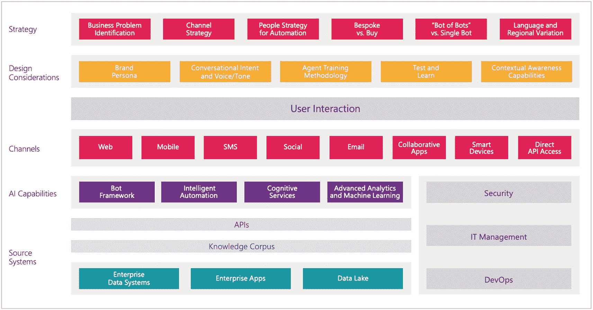

图 7-1

开发聊天机器人的五个组件

同样重要的是，在开始开发之前需要定义以下元素:

*   Bot 逻辑和用户体验

*   机器人认知和智能

*   数据摄取

*   记录和监控

*   安全和治理

*   质量保证和改进

*   设计考虑

聊天机器人的建设需要纳入现有的安全实践，并理想地包括 DevOps 的优化开发。聊天机器人的开发应该从要解决的业务挑战开始，因为这些应该推动主要的用户故事和用户体验流。一旦知道了这些元素，你就有了决定选择哪种 AI 服务和框架最适合你的设计用例所需的信息。

除了我们刚刚给出的指导，这里还有三个资源可以帮助你进一步理解对话式设计:

*   设计一个 bot 对话流程，从微软学来: [`https://docs.microsoft.com/en-us/learn/modules/design-bot-conversation-flow/`](https://docs.microsoft.com/en-us/learn/modules/design-bot-conversation-flow/) 。在本课程中，您将经历一个 32 分钟的模块，其中包括学习机器人设计原则、设计对话流程、设计机器人导航、设计用户体验、设计知识机器人，以及学习如何移交给人类。

*   打造企业级对话机器人: [`https://docs.microsoft.com/en-us/azure/architecture/reference-architectures/ai/conversational-bot`](https://docs.microsoft.com/en-us/azure/architecture/reference-architectures/ai/conversational-bot) 。

*   来自 Google 的对话式设计: [`https://designguidelines.withgoogle.com/conversation/`](https://designguidelines.withgoogle.com/conversation/) 。

## QnA 制造商

QnA Maker 是微软 Azure 的一个基于云的 API 服务，可以作为你的对话应用服务的一部分使用。如果您正在设计一个机器人来回答来自特定来源(如用户手册)的常见问题，QnA Maker 会很有帮助。

文档被提取出来成为聊天机器人使用的知识库。您可以使用文档的最新信息和更新将知识库更新到最新版本。

由于 QnA Maker 是一个 API 服务，所以您可以使用 REST 接口与系统进行交互。该服务可用于编辑内容或训练对话。

查看 QnA Maker 网站 API 页面，了解有关如何培训的更多详细信息。还可以通过不仅仅是一个答案的响应来为这个 QnA 服务添加一些个性。QnA Maker 中包含的所有部署和数据都是安全的，并且符合隐私要求。

当出现以下情况时，QnA Maker 将是开发聊天机器人的最佳工具:

*   当你的回复中有静态信息时

*   当您希望所有用户都有相同的响应时

*   当您有知识文档作为回复参考时

### 开发基于知识的机器人

QnA Maker 依赖于拥有一个知识库，该知识库包含其开发中包含的数据响应。需要维护知识库，以确保它拥有最新的信息，并包含反映用户所提问题的信息。图 [7-2](#Fig2) 显示了与机器人一起使用的知识库的持续开发生命周期。

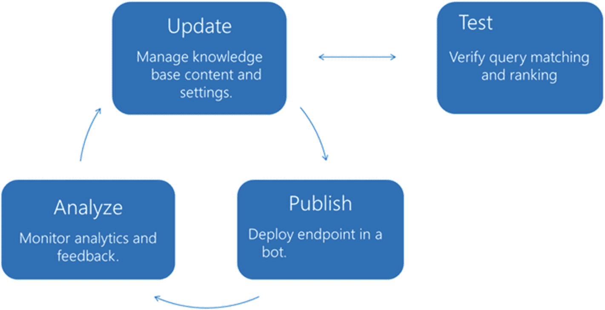

图 7-2

知识库的生命周期[7]

#### 测试和更新

知识库是服务中最重要的部分。使用测试功能对普通用户输入进行测试，并验证响应是否正确。在这一阶段，尝试多次，尝试不同的条目，直到你对聊天机器人提供的响应感到满意。您在这里进行的测试不会影响生产环境。如果您希望使用 QnA Maker API 测试服务，请使用 istest 设置来指定要使用的测试环境。

#### 出版

测试之后，是时候将应用程序发布到生产环境中了。发布会将最新的知识库发送到 Azure 认知搜索。发布还会更新服务端点。

#### 分析

要分析 QnA 服务，您需要在 QnA Maker 管理的服务中启用诊断日志记录。您可以选择要监视的度量，包括审计、请求和响应以及跟踪。针对日志监控的常见场景有

*   一段时间内每个知识库和用户的流量计数

*   生成答案 API 的延迟

*   所有操作的平均延迟

*   未回复问题

在日志中包含这些信息将有助于分析，从而随着时间的推移进一步提高性能。

#### QnA 制造商的估计成本

QnA Maker 不是一项独立的服务。它需要与 Azure 应用服务和 Azure 认知搜索相结合，以搜索响应数据。您可能还需要 Application Insights，这是一种可选的监控服务。你需要查看 Azure 应用服务、Azure 认知搜索和应用洞察的价格页面，才能确定整个解决方案的成本。

微软 Azure 上的每项服务都有自己的价格页面。以下定价示例基于美国中央数据中心:

*   *自由层*–每秒三笔交易，每分钟最多 100 笔交易，每月最多 50，000 笔交易。每月存储不超过 1 MB 的文档和三个受管理的文档。

*   *标准层*–每秒三笔交易，每分钟最多 100 笔交易。无限管理文档每月 10 美元。受管理的文档可以是中的 URL 或页面。tsv，。pdf，。doc，。docx，。xls，或者。xlsx 格式。

#### 构建简单的 QnA 服务

本节介绍了创建 QnA 服务所需的步骤。

*第一步*——进入 [`www.qnamaker.ai/`](http://www.qnamaker.ai/) ，点击网页上的**开始**文字。网站图片如图 [7-3](#Fig3) 所示。

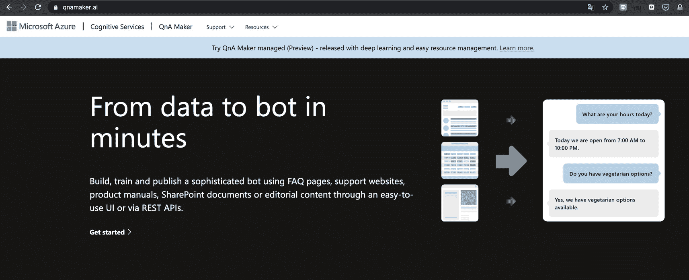

图 7-3

QnA 制造商服务页面

*第 2 步*–完成第一步后，您将被引导至一个页面，在此您可以创建一个知识库。为此，点击**创建知识库**文本，如图 [7-4](#Fig4) 所示。

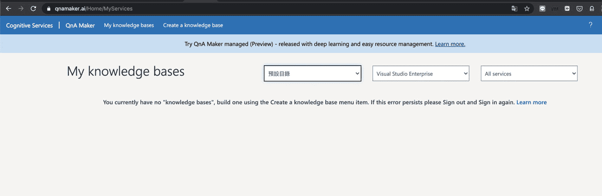

图 7-4

我的知识库页面

*步骤 3*–将加载一个新页面，其中包含您需要完成的表单，以便在 Azure 中创建知识库。表单的图片如图 [7-5](#Fig5) 所示。

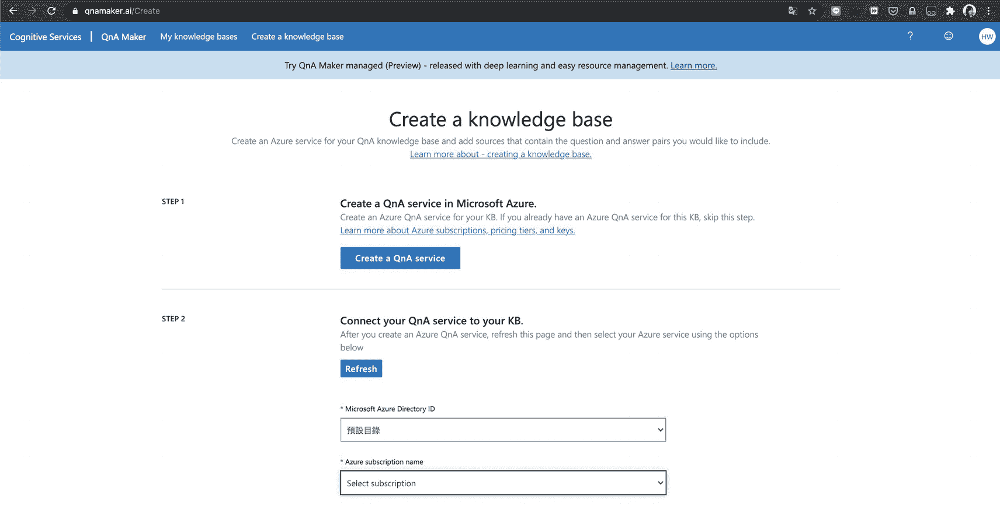

图 7-5

创建知识库页面

您需要点击标签为**的按钮，创建一个 QnA 服务**，它显示在表单上。

*步骤 4*–单击**创建 QnA 服务**按钮后，屏幕将发生变化，允许您从下拉框中选择几个选项，包括服务名称、定价层、资源组和区域。表格的图片包含在图 [7-6](#Fig6) 中，如图所示。

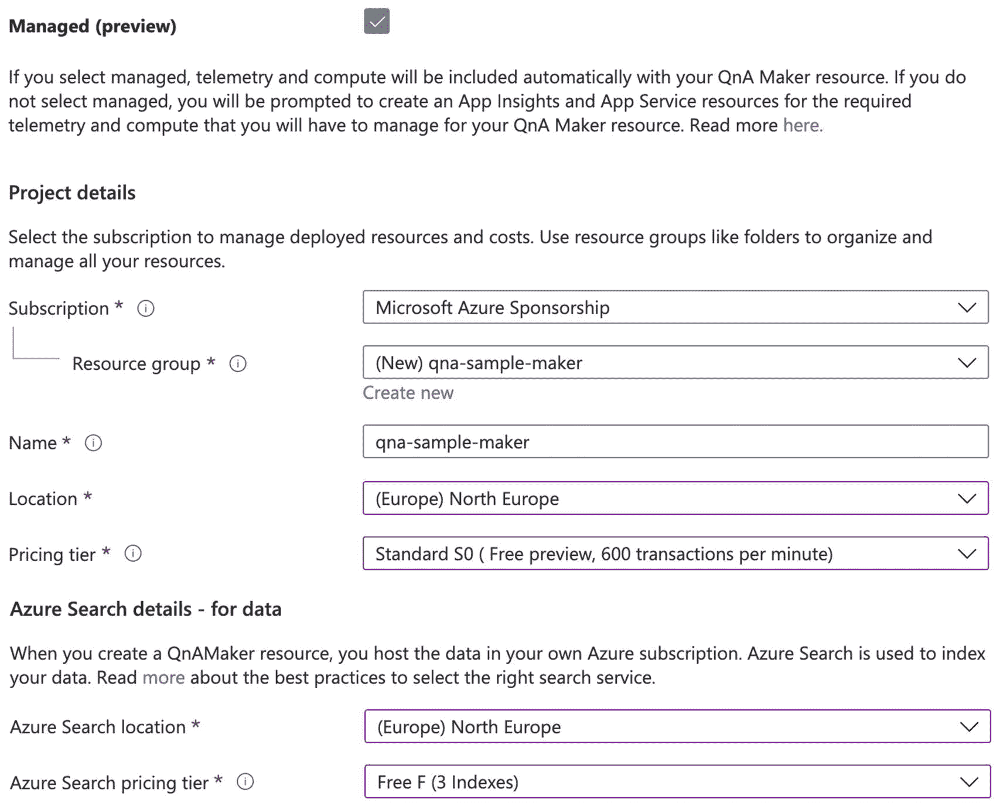

图 7-6

QnA 制造商服务的详细设置

从下拉列表中选择所需答案后，单击创建按钮发布服务。这个过程通常需要几分钟来完成，当它完成时，会出现一个祝贺页面。

*步骤 5*–QnA 服务完成后，您需要返回到包含创建 QnA 服务按钮的页面，以便为服务创建知识库。该屏幕的图片如图 [7-7](#Fig7) 所示。

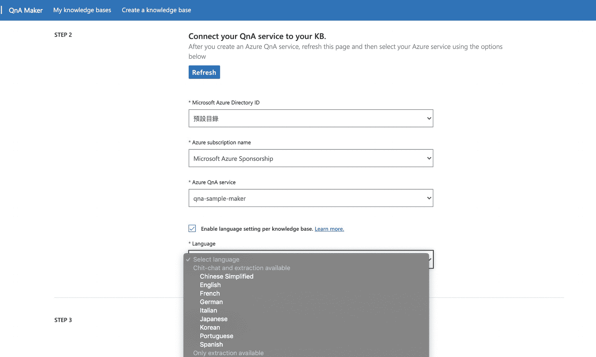

图 7-7

将 QnA Maker 服务连接到知识库

在此屏幕上，选择目标语言，然后链接您的问答页面或上传您用于知识库的文档。点击**创建**按钮创建您的知识库。知识库创建后，您将看到两个部分:您的文档和聊天机器人个性文档。

*第 6 步*–点击文档后，可以看到知识库的预览，在这里你需要更新问题和答案，如图 [7-8](#Fig8) 所示。

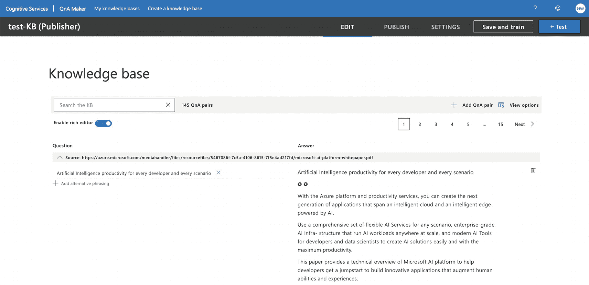

图 7-8

查看知识库内容

完成所有问题和答案后，您可以开始训练您的模型。

*第 7 步*–训练完成后，聊天机器人就可以进行测试了，如图所示。测试将包含先前添加的知识库中的信息。要测试聊天机器人，点击标有**测试**的蓝色按钮，如图 [7-9](#Fig9) 所示。

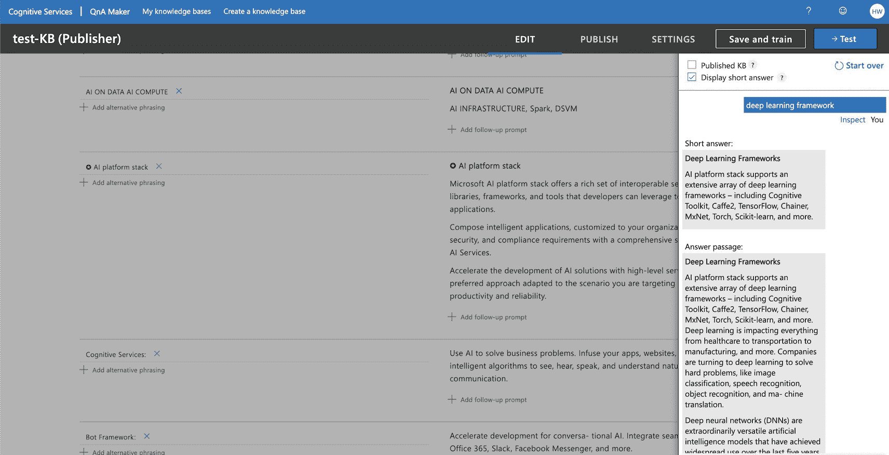

图 7-9

测试 QnA Maker 设置

屏幕将显示 QnA Maker 在聊天机器人中使用的响应。

*步骤 8*——当你完成测试后，点击标签为**发布**的按钮，该按钮位于同一页面上**测试**按钮的左侧。屏幕将发生变化，您将得到一条确认消息，如图 [7-10](#Fig10) 所示。

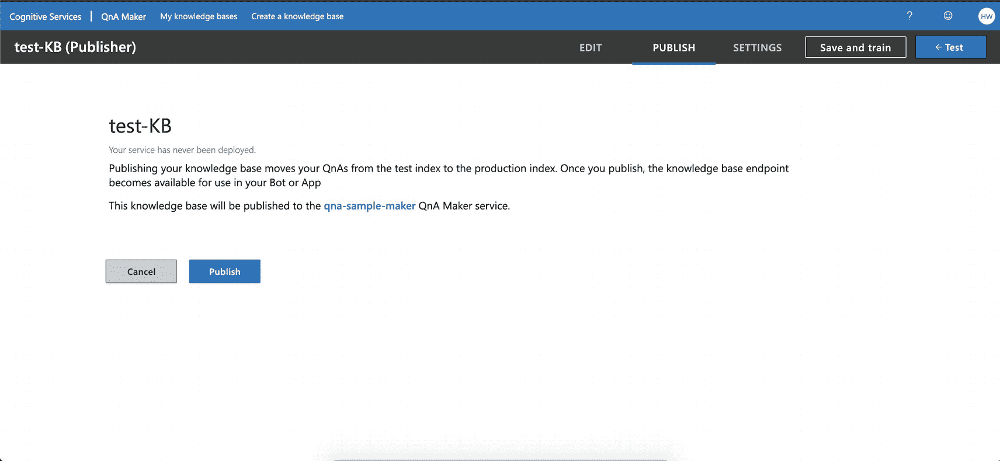

图 7-10

发布 QnA 制造商服务确认

当这个操作完成时，您将收到一条成功消息和一个脚本，该脚本可以使用 Postman 或 Curl 与端点进行交互。该成功屏幕的图片如图 [7-11](#Fig11) 所示。

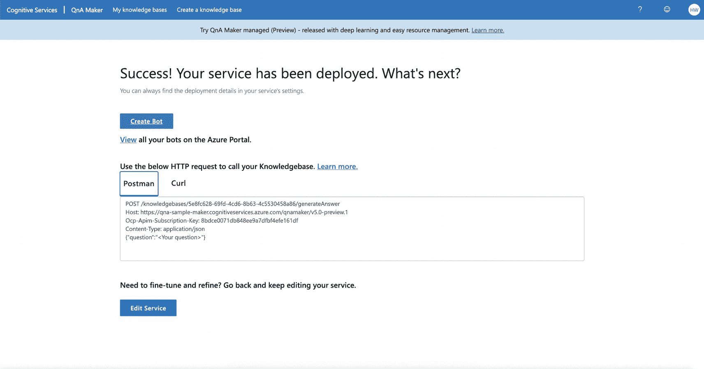

图 7-11

QnA 制造商服务部署成功屏幕

*第 9 步*–下一步是完成创建 Web 应用程序机器人的表单。你需要去微软 Azure 门户网站搜索 Web App Bot 服务。一旦您选择了该服务，您将看到如图 [7-12](#Fig12) 所示的表单。

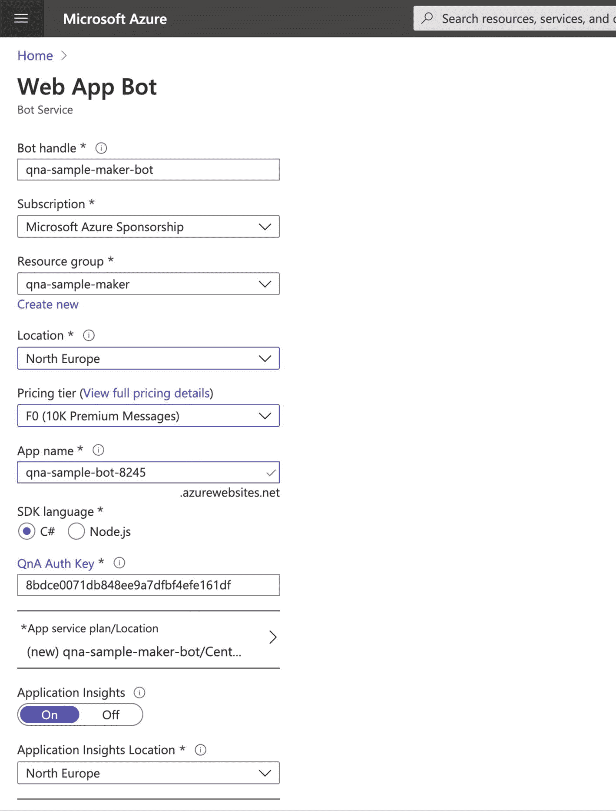

图 7-12

Web 应用程序 Bot

填写表单上的空白元素，包括名称、位置和定价层。完成表单后，您就可以创建 bot 服务了。

*步骤 10*——在聊天机器人页面，点击“网聊测试”进入网聊测试界面，如图 [7-13](#Fig13) 所示。

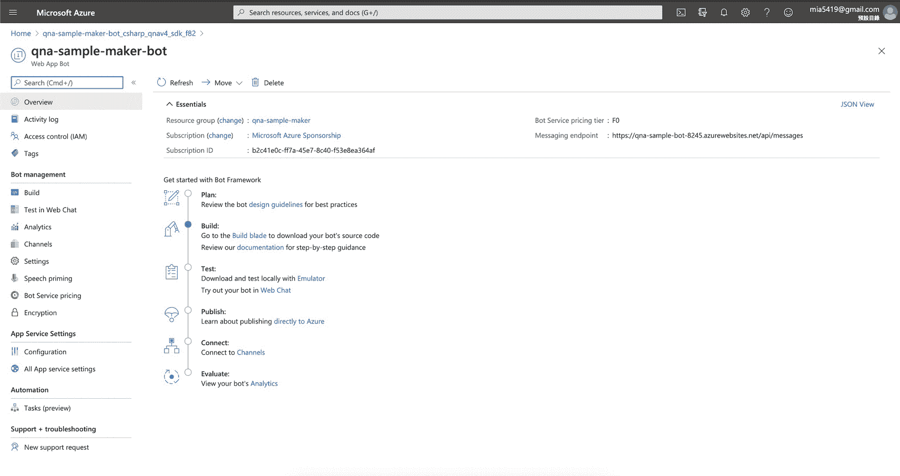

图 7-13

Web 应用程序 Bot Page

在屏幕左侧的菜单中选择网络聊天中的**测试选项后，可以进入网络测试界面。**

*步骤 11*–为了测试网络聊天中的聊天机器人，使用如图 [7-14](#Fig14) 所示的表格来测试问题和回答。

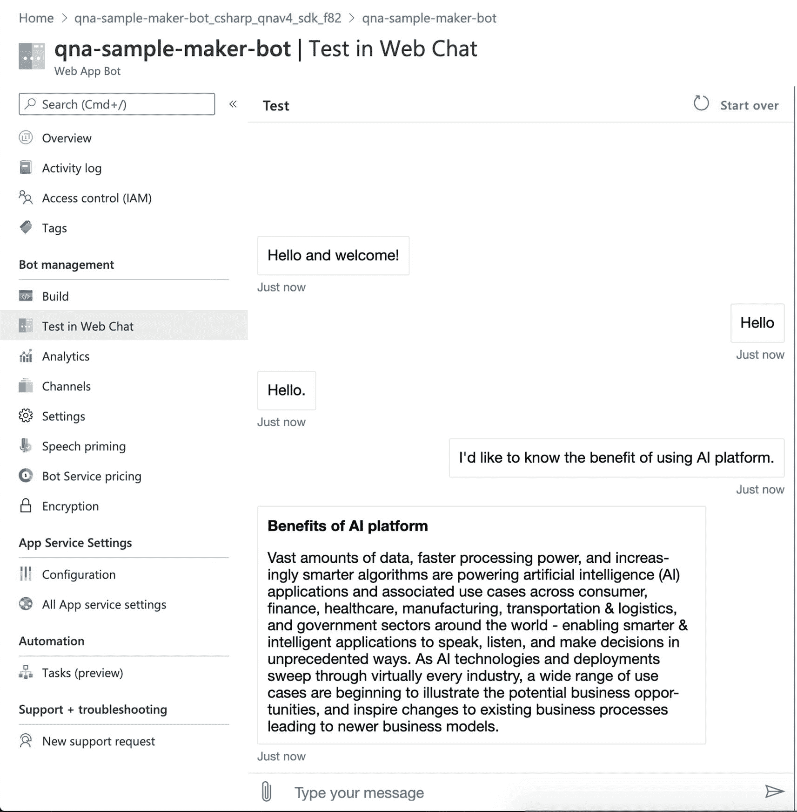

图 7-14

网络聊天测试界面

如果您发现任何需要改进的回答，请返回图 [7-9](#Fig9) 所示的培训页面，我们之前已经查看过了。开始另一个测试运行，在其中编辑响应并重新训练模型。

*步骤 12*–使用屏幕左侧的菜单，选择频道选项。然后将出现如图 [7-15](#Fig15) 所示的画面。

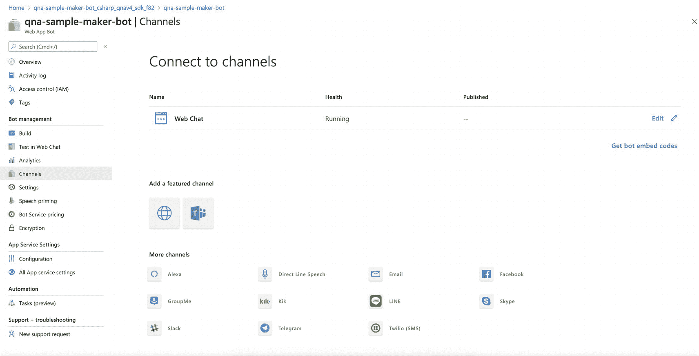

图 7-15

连接到频道页面

请注意，屏幕上有许多不同的频道选项。这些不同的选项提供了您可以用来与客户互动的方法，包括 Alexa 和 Telegram。

*步骤 13*——一旦您从列表中选择了一个频道，屏幕将发生变化，如图 [7-16](#Fig16) 所示。

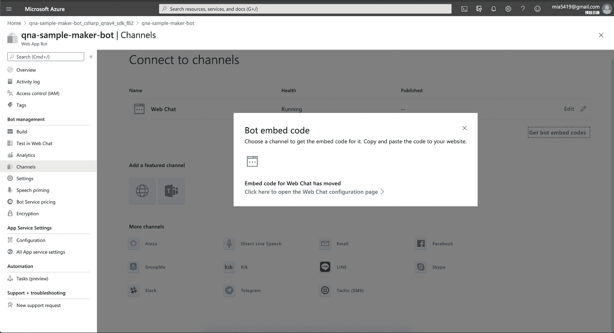

图 7-16

获取聊天机器人嵌入代码消息框

要获取所选频道的嵌入代码，请选择**点击此处打开网络聊天配置页面**。

*步骤 14*–下一个屏幕，配置网络聊天，如图 [7-17](#Fig17) 所示，提供了配置应用程序使用聊天机器人所需的密钥，以及您的应用程序所需的嵌入代码。

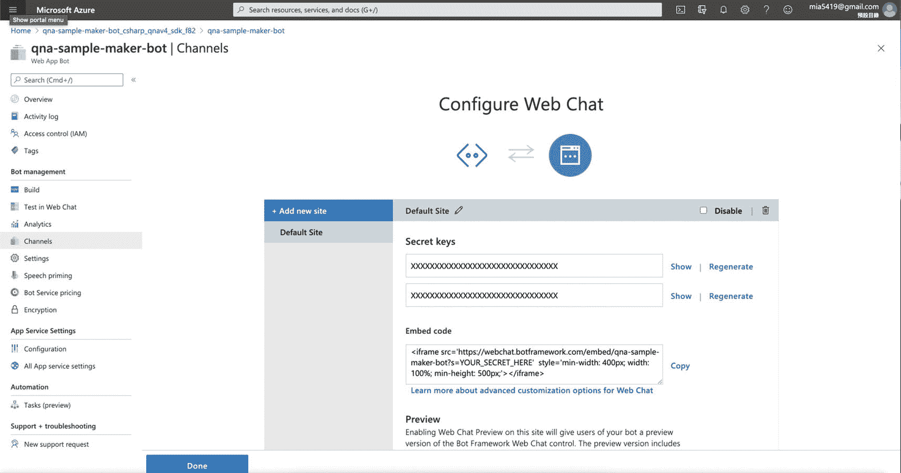

图 7-17

QnA 聊天机器人的密钥和嵌入代码

复制屏幕上显示的嵌入代码，并将“YOUR_SECRET_HERE”替换为图 [7-17](#Fig17) 所示的密钥。在复制密钥之前，单击“显示”按钮使其可见。要将聊天机器人添加到您的网站，请创建一个 iframe 并将代码作为 iframe 对象粘贴到您的网站中。你的网站里有聊天机器人。

*可选定制步骤*–检查 UI 中生成的源代码。如果您有兴趣查看 UI 开发的代码，在如图 [7-18](#Fig18) 所示的 Web App Bot 页面中，您可以点击左侧菜单栏中的 **Build** 下载 Bot 源代码。

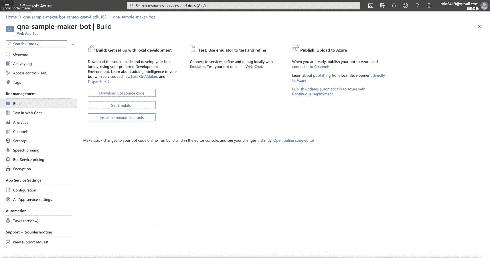

图 7-18

QnA 聊天机器人代码下载页面

### QnA 制造商摘要

本节概述的步骤显示了如何使用用户界面创建 QnA Maker 服务，以选择和实施所需的组件。我们还研究了在设置 QnA Maker 服务时需要考虑的一些因素。这些步骤还演示了可以在 iframe 对象中测试服务，您可以在自己的网站中轻松使用该对象。

如果您有静态内容，包括文档、手册或白皮书，并且希望为所有客户创建相同的用户体验，那么为您的 chatbot 选择 QnA Maker 是一个不错的选择。如果你有一个更复杂的对话，其中可能包含更大的知识库集，或者你需要为不同分类的客户提供不同的体验，QnA Maker 并不是最好的选择。在这些情况下，您希望在聊天机器人中使用的服务是语言理解智能服务(LUIS)。

### 路易斯简介

LUIS，代表语言理解智能服务，是基于云的微软 AI 服务。它可以预测谈话的意图并提取关键信息。LUIS 旨在与 Azure 文本分析和语音分析服务以及 Azure Bot 服务集成，以提供全面的对话服务体验。

在提供 LUIS 服务时，使用了三种 Azure 资源。这些是创作资源、预测资源和认知服务多服务资源。

#### 创作资源

创作资源允许您创建、管理、培训、测试和发布 LUIS 应用程序。不幸的是，这种资源并不是在所有的 Azure 数据中心都可用，所以你需要查看它在哪里可用。要以编程方式或从门户创建 LUIS 应用程序，您需要将创作资源链接到应用程序。它提供了一个免费层(F0 ),可以用于开发。免费层每月提供一百万个创作事务和 1，000 个测试预测端点请求。

#### 预测资源

预测资源实现了 LUIS 的预测服务。对于自由层(F0)，您可以每月使用 10，000 个文本输入预测。如果您选择实现标准层(S0 ),由于该层包括文本和语音预测功能，因此可以使用附加功能。

#### 认知服务多服务资源

使用 Azure 认知服务时，您可以选择使用单个服务或多个服务。开发一个聊天机器人需要不止一个服务，所以您需要创建一个多服务订阅密钥。这将提供在端点中使用 LUIS 和其他集成认知服务的能力。多服务资源键用于以编程方式管理多个键。

为了管理这些对象的安全性，您将使用 Azure 的基于角色的访问控制(RBAC)。这些对象需要使用标准的 RBAC 访问方法添加给用户。

### LUIS 对话流程

LUIS 使用输入聊天机器人的文本的设计模式来处理对话。LUIS 遵循接收、处理、然后响应的模式。

例如，假设文本“我想预订一张下周五去伦敦的火车票”被发送到 LUIS REST API 端点。LUIS 使用自然语言处理(NPL)模型处理文本，以识别句子的含义。该模型提供了一个分数或百分比来预测在确定文本含义时它认为自己有多准确。这个预测用于选择一个响应，LUIS 将这个响应以 JSON 格式作为输出响应发送给客户。客户将回答作为其决策过程的一部分，也许会添加一个后续问题，并且该过程会重复。这些决策可以包含在另一个 bot 框架或智能应用程序中。随着时间的推移，用户输入被处理以改进 LUIS 服务。

有一些规则可以限制交互，包括关于文本长度和调度的规则。对于文本请求，API 事务将输入查询文本长度限制为最多 500 个字符。对于语音请求，事务是查询长度最长为 15 秒的话语。Dispatch 将为每个请求执行两次文本事务。Dispatch 是一个能够用一个 API 调用处理两个模型/应用程序的特性。

### 路易斯创作教程

在这里，我们将开发一个对话聊天机器人。设计过程的第一步是指定所使用的术语并为它们提供数据。

*第一步*——登录路易斯门户: [`www.luis.ai/`](http://www.luis.ai/) 。页面图片如图 [7-19](#Fig19) 所示。

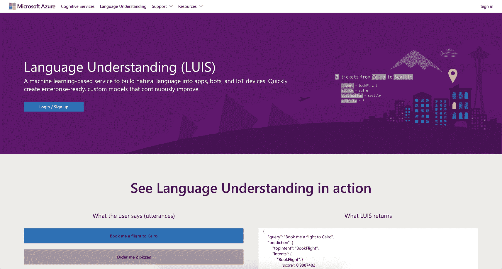

图 7-19

LUIS 服务页面

*步骤 2*–从下拉列表中选择您的订阅，然后创建一个新的认知服务账户资源，如图 [7-20](#Fig20) 所示。

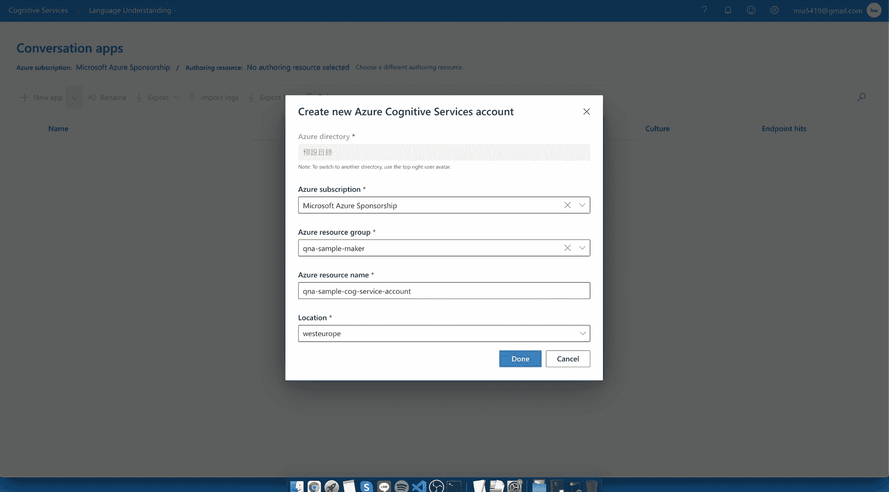

图 7-20

创建新的 Azure 认知服务帐户

*第三步*——认知服务账户创建完成后，在 LUIS 门户创建一个新的 LUIS 应用，如图 [7-21](#Fig21) 所示。

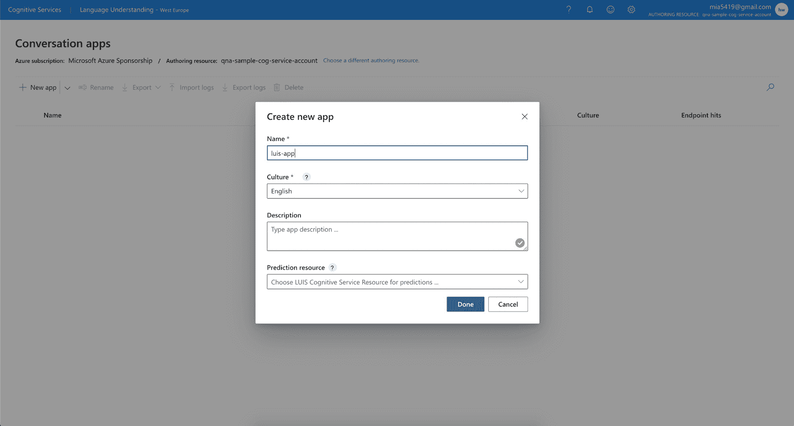

图 7-21

LUIS 创建新应用程序页面

在预测资源下拉列表中，选择**为预测选择 LUIS 认知服务资源…** 创建 LUIS 应用程序后，浏览器将显示 LUIS 应用程序的欢迎页面，您可以在此查看欢迎教程。本教程包括一些常见的用例示例。看完教程后，请关闭窗口。

*步骤 4*——将日历预置域意向添加到意向列表中，启动第一个 app，如图 [7-22](#Fig22) 所示。

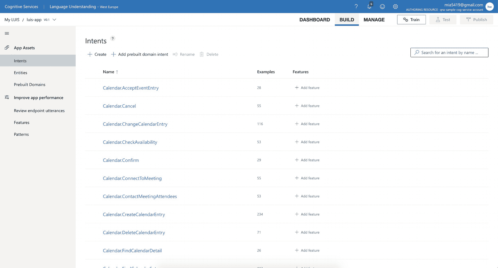

图 7-22

LUIS 应用意向页面

在这里，您还将看到构建意图的命名约定和一些示例意图。这些例子是学习如何识别用例意图，以及如何在构建意图时准备例子的有用方法。

*步骤 5*–从预构建的域中添加日历和实用程序，如图 [7-23](#Fig23) 所示。

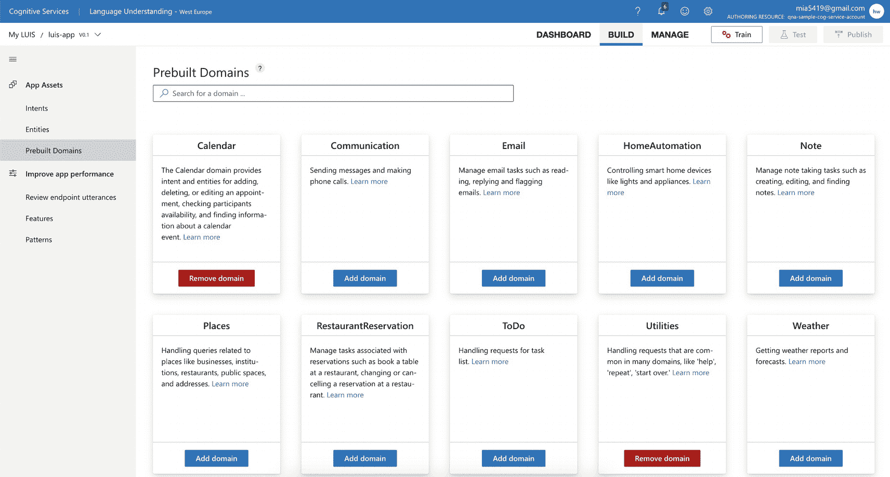

图 7-23

预建域页面

实体包含您想要为您的业务流程收集的关键信息。例如，当您预约时，您将需要日期、事件开始时间、事件结束时间、位置等。大多数常见的实体都带有预构建的域，但是如果您在图 [7-23](#Fig23) 中的预构建列表中找不到它们，那么您将需要为实体带来标签数据。

*步骤 6*–使用图 [7-24](#Fig24) 所示的屏幕，点击模式选项卡，了解 LUIS 应用程序如何识别您的句子。

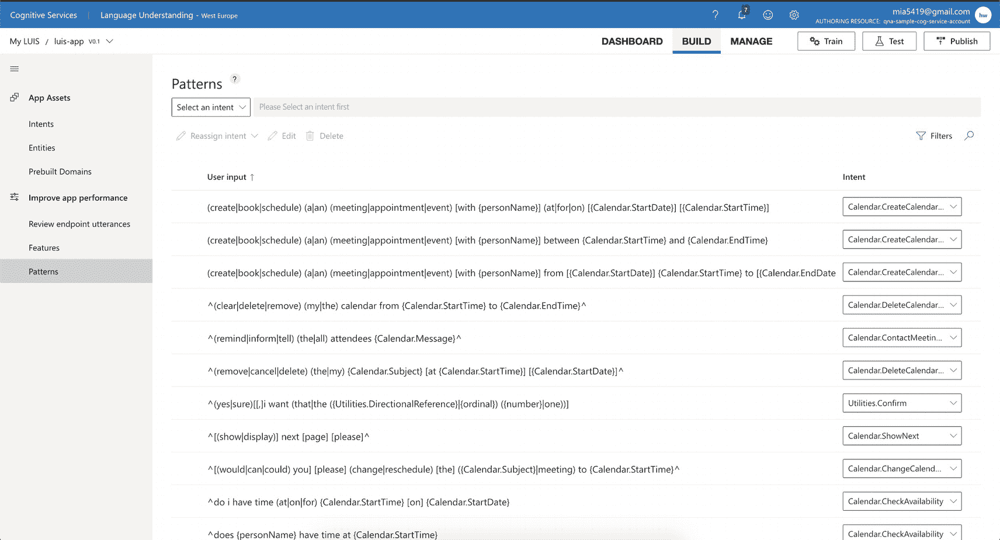

图 7-24

LUIS 应用程序中的模式页面

*第 7 步*–当你准备好所有数据后，你就可以开始训练过程了。点击页面右上方的**培训**选项，开始培训工作。屏幕看起来将如图 [7-25](#Fig25) 所示。等几分钟。当培训工作完成后，您可以开始测试。

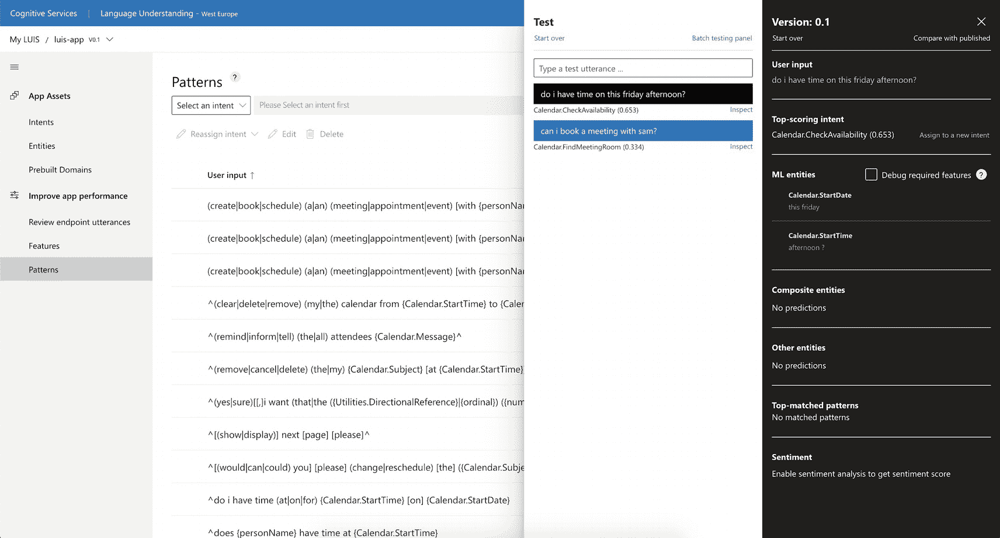

图 7-25

测试面板

*第 8 步*-当你对测试结果满意时，你会想要进行如图 [7-26](#Fig26) 所示的发布。

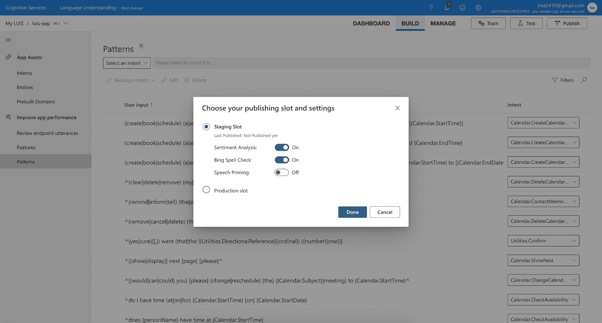

图 7-26

发布设置

您将看到弹出框选择您的发布插槽和设置。在设置框中，您可以选择要部署的生产或暂存环境。还有几个可选的元素来添加情感分析、Bing 拼写检查和语音启动。

*第 9 步*——服务发布成功后会通知您，您会收到如图 [7-27](#Fig27) 所示的状态通知。当位于右上方菜单栏上的通知铃时，通知消息将可见。

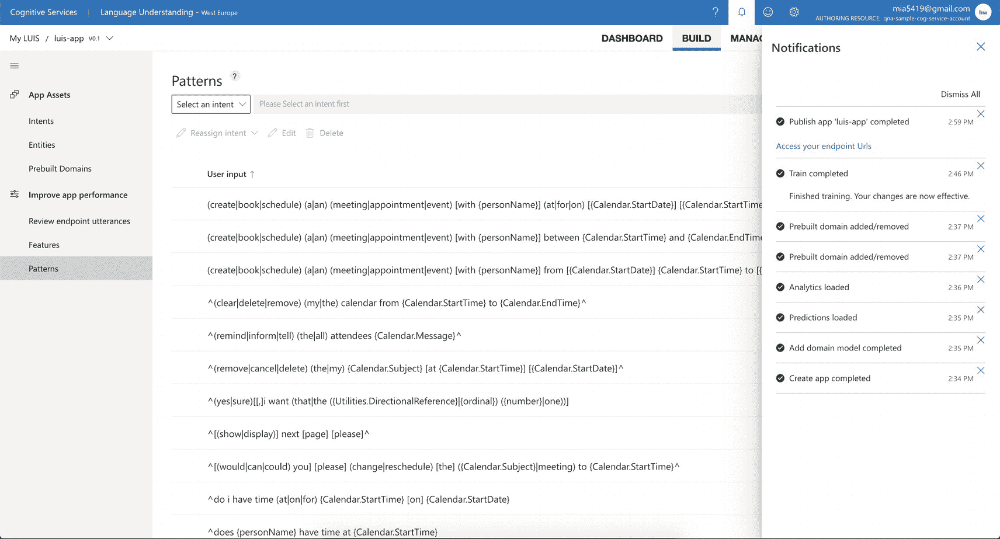

图 7-27

通知消息

*步骤 10*–一旦 LUIS 应用程序部署到试运行环境，您将需要添加一个生产资源。进入管理选项卡，选择**添加预测资源**，如图 [7-28](#Fig28) 所示。

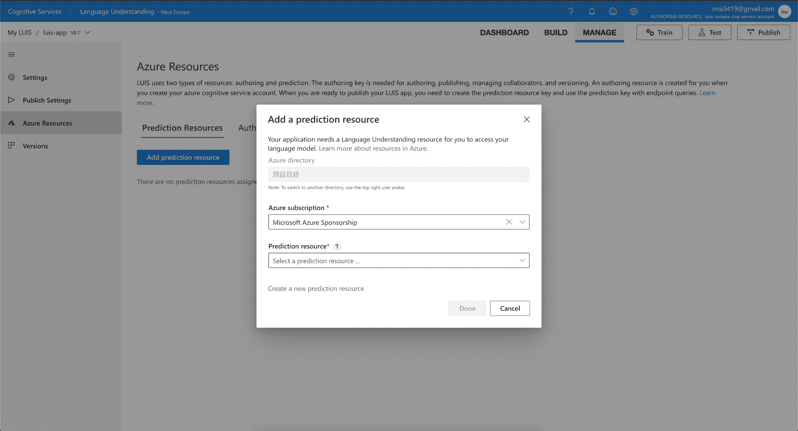

图 7-28

预测资源弹出窗口

选择订阅后，选择**创建一个新的预测资源**,因为此时您没有可供选择的资源。这将弹出一个菜单来创建一个新的 Azure 认知服务账户，如图 [7-29](#Fig29) 所示。

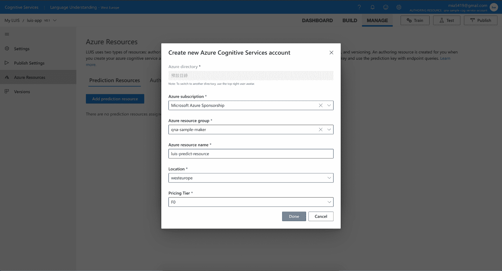

图 7-29

创建认知服务帐户

将您部署的服务连接到弹出窗口中创建的新认知服务帐户。完成这些步骤后，您就可以为服务创建资源了。

*步骤 11*–图 [7-30](#Fig30) 所示的屏幕显示了添加预测资源所需的 Azure 资源页面。

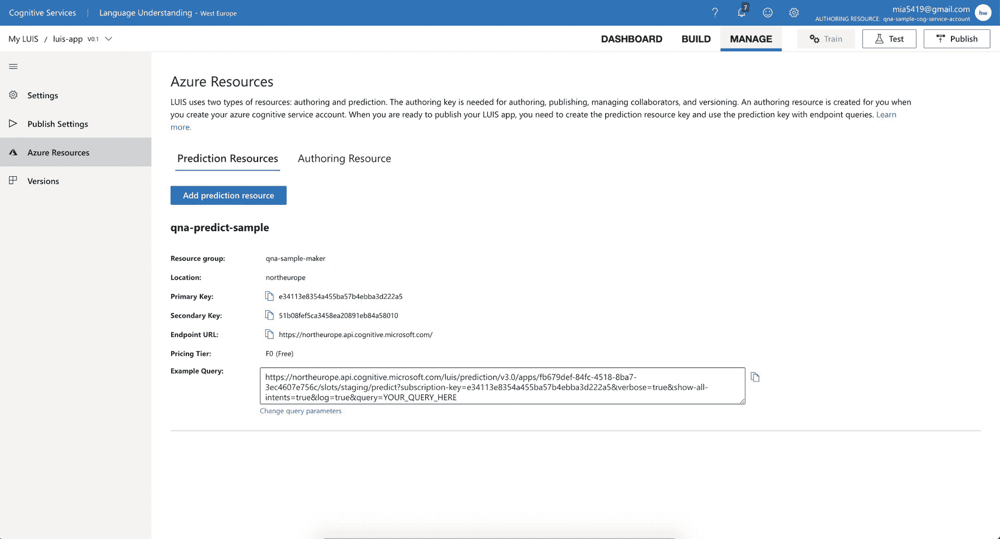

图 7-30

预测资源的 Azure 资源页面

单击蓝色按钮添加预测资源。

*第 12 步*——所有的创建步骤完成后，你可能想花些时间测试 LUIS bot。测试结果可在仪表板选项卡中获得，如图 [7-31](#Fig31) 所示。

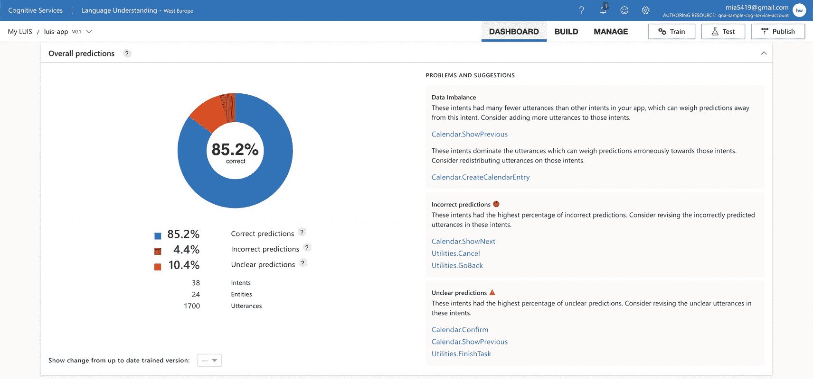

图 7-31

QnA 制造商预测仪表板

仪表板包括正确预测、错误预测和不明确预测数据点。使用仪表板并检查建议以改进您的数据。

### 与 QnA Maker 和 LUIS 一起使用聊天机器人

之前我们已经回顾了使用 UI，现在我们将切换到使用 Python 通过代码进行开发。我们将通过一个示例应用程序演示如何使用 QnA Maker 服务和 LUIS 服务运行应用程序，这是我们在前面的步骤中创建的。在开始本节之前，您需要完成这些步骤。

清单 [7-1](#PC1) 中的代码将用于创建一个 bot，使用 Bot Framework Emulator，这是一个针对 Bot 开发者的桌面应用程序。它可以安装在 Windows、macOS 和 Linux 上。开发人员可以使用它在本地测试和调试 bot 应用程序，并提供实时系统日志。或者你可以远程运行机器人。

*步骤 1*–将代码从 GitHub 克隆到您的本地计算机，以便您可以修改示例。

*第二步*——从 GitHub 下载 Bot 框架模拟器: [`https://github.com/Microsoft/BotFramework-Emulator/releases/tag/v4.11.0`](https://github.com/Microsoft/BotFramework-Emulator/releases/tag/v4.11.0) 。如图 [7-32](#Fig32) 所示，您可以从资产链接下载仿真器。

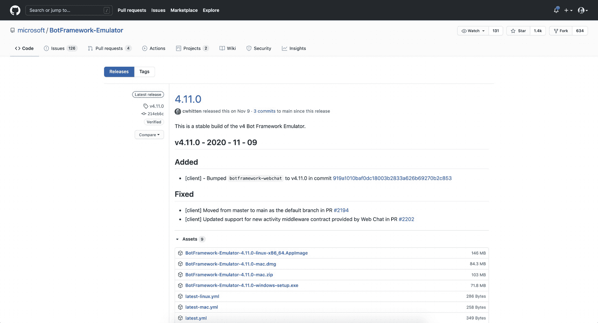

图 7-32

模拟器下载页面

*步骤 3*–在 Visual Studio 代码中打开项目，并在 VS 代码终端中运行``pip3 install -r requirements.txt`'。打开配置文件，用 QnA 服务、LUIS 服务、应用 ID 和密码更新您的配置。

对于应用程序信息和 QnA 服务信息，您可以在 Azure Portal 中找到这些信息。对于 LUIS 服务，进入 [`www.luis.ai/applications`](http://www.luis.ai/applications) ，找到您之前部署的 LUIS app。LUIS API 主机名取决于所创建资源的区域。

```py
class DefaultConfig:
    """ Bot Configuration """

    PORT = 3978
    APP_ID = os.environ.get("MicrosoftAppId", "")
    APP_PASSWORD = os.environ.get("MicrosoftAppPassword", "")

    QNA_KNOWLEDGEBASE_ID = os.environ.get("QnAKnowledgebaseId", "")
    QNA_ENDPOINT_KEY = os.environ.get("QnAEndpointKey", "")
    QNA_ENDPOINT_HOST = os.environ.get("QnAEndpointHostName", "")

    LUIS_APP_ID = os.environ.get("LuisAppId", "")
    LUIS_API_KEY = os.environ.get("LuisAPIKey", "")
    LUIS_API_HOST_NAME = os.environ.get("LuisAPIHostName", "northeurope.api.cognitive.microsoft.com")

Listing 7-1Config for Bot

```

*步骤 4*——在如图 [7-33](#Fig33) 所示的终端服务中，保存并运行 python app.py，您可以在您的本地主机 3978 运行该服务。

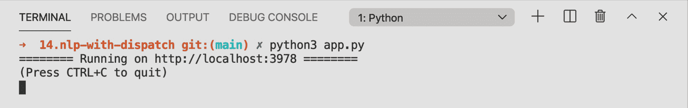

图 7-33

在本地托管您的 bot 应用程序

*第五步*——打开聊天机器人模拟器，如图 [7-34](#Fig34) ，点击打开机器人，输入主机网址，例如`http://localhost:3978/api/messages`。接下来，单击调试模式，然后单击连接。

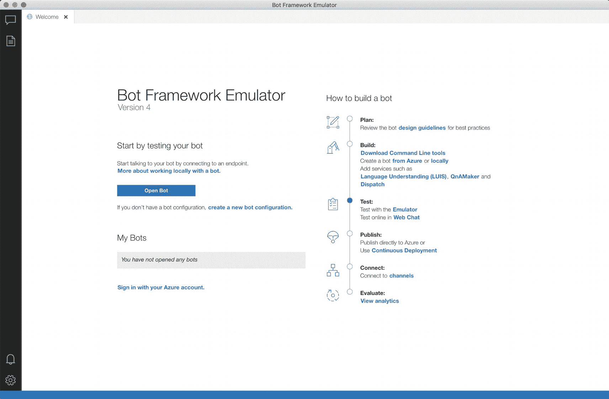

图 7-34

Bot 框架模拟器入口页

*第六步*–在模拟器的左侧，有一个对话模拟器，在那一侧，你可以进行调试，如图 [7-35](#Fig35) 所示。在这里，您可以看到消息流程。

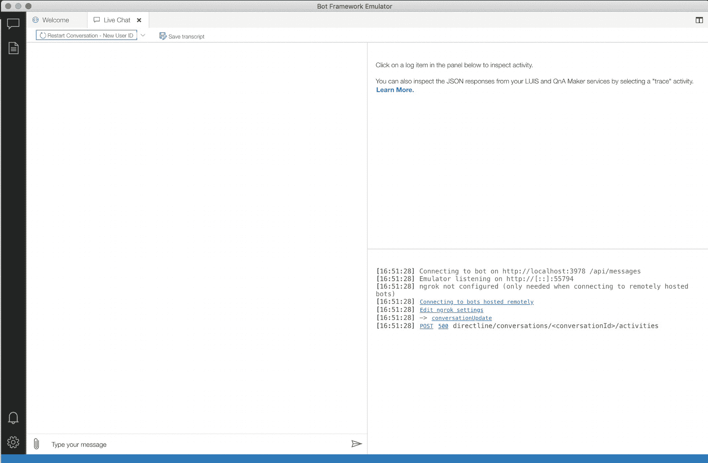

图 7-35

Bot 框架模拟器对话框和留言板布局

*第 7 步*–下一步是在模拟器中运行机器人，无论有无调试模式。有关调试过程的更多提示，请参见[10]和[11]。

*步骤 8*——稍后，如果您想要部署 bot，使用现有的服务计划，使用清单 [7-2](#PC2) 来部署服务。

```py
$ az account set --subscription "<azure-subscription>"
$ az ad app create --display-name "displayName" --password "AtLeastSixteenCharacters_0" --available-to-other-tenants
$ az deployment group create --resource-group "<name-of-resource-group>"
--template-file "<path-to-template-with-preexisting-rg.json>"
--name "<bot-app-service-name>"
--parameters appId="<app-id-from-previous-step>" appSecret="<password-from-previous-step>" botId="<id or bot-app-service-name>" newWebAppName="<bot-app-service-name>" existingAppServicePlan="<name-of-app-service-plan>" appServicePlanLocation="<region-location-name>"

Listing 7-2Deploy the Current Chatbot

```

*第 9 步*——几分钟后，您将可以看到最新的 bot 服务，如图 [7-36](#Fig36) 所示。你也可以通过网络聊天来测试它。

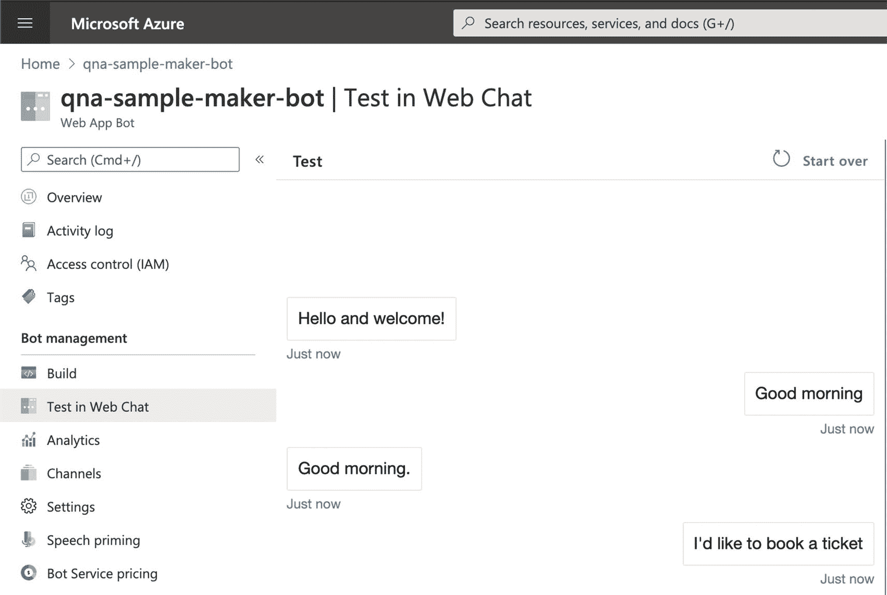

图 7-36

QnA 聊天机器人测试页面

## 在 QnA Maker 和 LUIS 之间选择

现在您已经熟悉了 QnA Maker 和 LUIS，您可能想知道对于您打算创建的任何应用程序，如何在它们之间做出最佳选择。以下是一些我们认为能让你走上正确道路的一般性建议。请记住，可能会有例外，我们的建议本质上是一般性的，最好被认为是为您的决策提供一个起点。

当您希望向所有客户提供静态内容时，我们建议选择 QnA Maker。静态内容的类型可以包括天气信息、电影票的价格或对您预定义的特定问题列表的特定回答。您也可以使用 QnA Maker，只要您有希望与客户共享的静态信息，并且希望让您的客户能够轻松找到他们需要的信息。

当您希望允许客户说出或键入需要通过理解他们的意图来处理的更复杂的请求时，请选择 LUIS。LUIS 带来了更多的语言理解能力，这有助于您在这些更复杂的对话中识别意图和关键信息。

## 摘要

聊天机器人非常受欢迎，因为它们被许多公司广泛采用，这里我们展示了如何创建一个聊天机器人。本章介绍了不同级别的对话服务，并提供了创建 QnA Maker 服务的描述和步骤。还审查了 LUIS 服务，并提供了使用该服务的步骤。本章还介绍了 QnA Maker 和 LUIS 的不同用例，为您提供了确定使用哪个服务所需的信息。您了解了何时应该根据您的设计目标选择工具，如何在 Python 中结合两者的功能，以及如何在 Azure 中调试和部署解决方案。

## 参考

[`www.avanade.com/-/media/asset/thinking/conversational-ai-pov.pdf`](http://www.avanade.com/-/media/asset/thinking/conversational-ai-pov.pdf)

[`https://docs.microsoft.com/en-us/learn/modules/design-bot-conversation-flow/`](https://docs.microsoft.com/en-us/learn/modules/design-bot-conversation-flow/)

[`https://en.wikipedia.org/wiki/ELIZA`](https://en.wikipedia.org/wiki/ELIZA)【3】

[`https://docs.microsoft.com/en-us/azure/architecture/reference-architectures/ai/conversational-bot`](https://docs.microsoft.com/en-us/azure/architecture/reference-architectures/ai/conversational-bot)【4】

[`https://designguidelines.withgoogle.com/conversation/`](https://designguidelines.withgoogle.com/conversation/)

[`https://docs.microsoft.com/en-us/azure/cognitive-services/luis/luis-reference-regions`](https://docs.microsoft.com/en-us/azure/cognitive-services/luis/luis-reference-regions)【6】

[`https://docs.microsoft.com/en-us/azure/cognitive-services/qnamaker/concepts/development-lifecycle-knowledge-base`](https://docs.microsoft.com/en-us/azure/cognitive-services/qnamaker/concepts/development-lifecycle-knowledge-base)【7】

[`https://azure.microsoft.com/en-gb/resources/microsoft-ai-platform-whitepaper/`](https://azure.microsoft.com/en-gb/resources/microsoft-ai-platform-whitepaper/)【8】

[9] [`www.cdc.gov/coronavirus/2019-ncov/faq.html`](http://www.cdc.gov/coronavirus/2019-ncov/faq.html)

[`https://docs.microsoft.com/en-us/azure/bot-service/bot-service-debug-emulator?view=azure-bot-service-4.0&tabs=python`](https://docs.microsoft.com/en-us/azure/bot-service/bot-service-debug-emulator%253Fview%253Dazure-bot-service-4.0%252526tabs%25253Dpython)

[`https://docs.microsoft.com/en-us/azure/bot-service/bot-service-debug-bot?view=azure-bot-service-4.0&tabs=python`](https://docs.microsoft.com/en-us/azure/bot-service/bot-service-debug-bot%253Fview%253Dazure-bot-service-4.0%2526tabs%253Dpython)