# 2.量子计算

量子计算是我们在本书中更详细探索的第一种数字支持技术。它有时被描绘成杰出的科学家在奇异的实验室中探索最模糊的自然现象，并致力于建造非常强大的科幻超级计算机，这些计算机实际上能够做任何事情。但这种公众看法最近一直在改变，因为世界各地的各种科技公司都在投资这项技术，将其应用于现实生活中的商业问题，并探索潜在的用例。例如，其中有谷歌、微软、IBM 和霍尼韦尔，这里仅举几个正在进行的工业研究领域的先驱。他们经常报道他们的最新成就，强调当前的商业应用，并强调这种数字技术的巨大前景。甚至《纽约时报》最近也抓住了这一趋势，并将量子计算描述为“现代科学中最有趣、最神秘的概念之一” [1](#Par197) 。

《纽约时报》的这篇文章是由谷歌在 2019 年底发表的一份声明引发的，该声明引起了全球科学界和媒体的广泛关注[ [2](#Par198) ]。谷歌的量子计算团队由美国物理学家约翰·马丁尼斯领导，直到 2020 年，当时正在用他们的“梧桐树”进行一项名为量子处理器的实验。他们试图解决一个计算问题，即生成一个很长的随机数列表，并反复检查它们的值一百万次。这样的结果在量子世界之外并不特别有用，但仍然引起了极大的关注，因为该团队仅用了大约 200 秒就成功解决了这个问题，而根据谷歌的信息，一台最先进的超级计算机进行同样的计算需要超过 10，000 年。该成果发表在名为 *Nature* 的世界领先多学科科学期刊上，标题为“使用可编程超导处理器的量子优势” [3](#Par199) 。谷歌传说中的*量子至上*主张[1](#Fn1)——量子计算机在计算能力和速度方面优于经典计算机的技术术语——很快就受到了全球各种研究人员的质疑和挑战。最响亮的反对者是 IBM [ [4](#Par200) ]，他们认为最先进的超级计算机可以在大约 2.5 天内解决这个问题，而不是 10000 年[ [5](#Par201) ]。此外，他们提出，这个问题缺乏任何现实生活中的应用，是专门为证明量子优势和其他论点而设计的。但是独立于收到的批评，这个实验揭示了量子计算正在成为一种成熟的技术，现在可以解决一些人类最困难和计算最复杂的问题。这一章是关于计算的革命，它的物理构件和基本操作原理。

为此，我们将首先讨论现代量子力学的基本概念、量子计算背后的物理理论和量子信息处理。在这种情况下，我们将看到，由于量子力学的概率性质，原因不再与结果联系在一起。我们将进一步了解迷人的现象，如不确定性原理、叠加和纠缠，并了解量子计算机如何利用这些怪异的量子效应来同时进行大量的计算，并解决非常复杂的计算问题。我们还将看看商用量子计算机，包括谷歌的 Sycamore 处理器、IBM 的 Q54 和 D-Wave 的 2000Q 和 5000Q 系统。在这种情况下，我将向您介绍三种基本类型的量子计算机，即量子退火器、模拟器和通用量子计算机。这种区别尤其重要，因为每种类型仅适用于某些应用和用例。此外，本章广泛探讨了当前的应用和预期的用例，并在最后一节提供了一个易于使用的量子计算框架，可用于根据您自己的想法和用例来访问这一革命性和潜在的颠覆性技术。

## 2.1 设置量子计算场景

在 19 世纪晚期，大多数科学家认为物理学中没有什么新发现，剩下的只是更精确的测量。随着著名的德国物理学家和后来的诺贝尔奖获得者马克斯·普朗克的发现，这一评估被证明是一个惊人的误判。在柏林洪堡大学的实验室里，他正在研究所谓的黑体辐射，即黑色物体发出的热辐射。他奇怪地发现，这种物体——当在烤箱中加热时——不会连续释放热能，而是以小包装形式释放，也就是说，一个小自然量的整数倍，这就是所谓的*普朗克常数*。这个量描述了自然界在其最基本尺度上变化的最小量或*量子* [2](#Fn2) 。马克斯·普朗克起初并不相信这一观察结果，因为它与著名的巴洛克时期学者戈特弗里德·莱布尼茨的假设形成了鲜明的对比，莱布尼茨声称“大自然从不跳跃”——这句名言通过其拉丁文翻译而变得著名。

随着时间的推移，越来越多的实验证实，能量和质量等物理性质确实会发生微小的变化。阿尔伯特·爱因斯坦后来也确实用这个概念解释了光电效应，并因此获得了 1921 年的诺贝尔奖。马克斯·普朗克的开创性发现标志着以前的物理学理论——所谓的*经典物理学*——和现代*量子物理学*之间的转折点。经典物理学是建立在经典力学的基础上的，经典力学描述了宏观物体，也就是我们最熟悉的尺度上的自然。这一理论深受英国学者艾萨克·牛顿和他的传奇苹果的影响，启发他发展了关于引力的理论。美国金融家和慈善家伯纳德·巴鲁克曾经很好地描述了这一发现，他说:“数百万人看到苹果落地，但牛顿是唯一一个问为什么的人。”在最小和最基本的尺度上，自然是量子化的，它的影响再也不能用经典物理学来解释了——艾萨克·牛顿肯定会非常关注马克斯·普朗克的观察。它们被量子物理学和量子力学的基础理论所描述，这充满了惊奇和神秘，我们将在下面看到。著名的美国物理学家和诺贝尔奖获得者理查德·费曼曾经指出:“我可以有把握地说，没有人真正理解量子力学。”

量子力学——除了广义相对论之外的现代物理学的另一个基础支柱——为包括智能手机和电视在内的几乎所有电子设备奠定了基础。它还为量子计算机提供了理论概念，这就是为什么更仔细地研究这个令人兴奋的现代物理学理论是有益的。在目前的版本中，量子力学主要是由德国物理学家埃尔温·薛定谔和沃纳·海森堡开发的，他们都因为他们的开创性工作和对这个正在进行的密集研究领域的重要贡献而获得了诺贝尔奖。

Quantization

量子化指的是现代物理学的一个原理，根据这个原理，能量和质量等物理属性不会连续变化(增加或减少)，而是以小步长离散变化。最小的步长被称为*量子*，并由此产生了量子化原理的名称。一个例子是描述能量逐步变化的普朗克常数。

量子力学——顾名思义——描述了量子的动态行为，也就是说，自然界最基本的构件的作用和反应之间的关系。这些积木非常小，因此人眼不可见，被称为基本粒子。与原子和分子不同，基本粒子不能再分成任何子成分。换句话说，它们是不可分割的，因此是宇宙最小的组成部分。天体物理学家计算出可观测的宇宙总共包含超过 10 个 T2 86 个基本粒子，这是一个真正惊人的数量级。它们要么是自由的，四处旅行，要么是结合在一起形成分子，构建天文星云、星系、恒星和行星，包括我们美丽的地球。相比之下，一个普通人总共包含 10 个以上的基本粒子 27 个。根据所谓的*标准模型*，物理学家一共区分出 17 种基本粒子。根据它们的物理性质，如电荷和它们相互作用的特殊方式，它们可以被分为两个基本组，称为*玻色子*和*费米子*。最常见的玻色子是光的基本成分*光子*，而*电子*是最常见的费米子。它们带有负电荷，因此有助于流经智能手机和你能想到的所有其他电子设备的电流的传输。光子和电子这两种粒子都经常被用来实现量子计算机，这就是为什么我们将在下一节中检查它们的量子力学性质和物理属性。

## 2.2 量子力学的奇异世界

自然界在最小的尺度下表现得非常奇怪和违反直觉。从经典物理学和我们的日常经验中，我们知道物理过程完全是由先前存在的原因决定的。换句话说，知道一个物理系统现在的状态决定了它明天或以后的状态。例如，一辆一直以 100 英里/小时的速度行驶的汽车，在接下来的一个小时里将行驶 100 英里，除非它因为某种原因加速或减速。一切都可以以非常高的精度计算和预测，因为行动总是紧随反应，这通常被称为艾萨克·牛顿发展的经典力学中的*因果决定论*。

### 2.2.1 怪异的量子现实

对于量子力学物体，比如电子和光子，这种情况完全改变，一切都变得不那么确定，变得相当模糊。这与量子力学的概率性有关，即量子力学物体的当前状态只决定了该物体在某一状态(或“条件”)下随时间发展的概率(“可能性”或“几率”)。经典物理学的因果决定论和精确性被量子力学中的*概率方法*所取代。这是我们周围的经典世界和量子力学之间的主要和真正显著的区别，量子力学描述了包括光子和电子在内的最小尺度的自然。

通过比较经典过山车和虚拟的量子力学版本，可以很好地说明这一重大差异的后果。假设你正在你最喜欢的游乐园里坐过山车。支付入场费后，你坐在你喜欢的马车里，希望开始放松。在某个时间点，货车离开起点，由电动机拉着上坡。如图 [2-1](#Fig1) 所示，让我们用字母 *A* 来表示第一座山峰的顶点高度。到达点 *A* 后，您的车将朝着过山车的最低点 *B* 向下加速，并开始朝着点 *D* 爬第二座山。中途，你的马车到达点 *C* 。从经典力学(及其能量守恒定律)中，很容易得出这样的结论:你永远不会到达比这更高的任何点，因为你没有足够的能量做到这一点——为了简单起见，我们认为你的马车在这一点上没有被任何马达拉着上坡。因此，你没有办法到达甚至穿过点 *D* 。因此，在经典力学中，这第二座山被认为是不可逾越的能量屏障。你在点 *A* 和 *C* 之间的行程是完全确定的，例如，你到达点 *B* 的时间可以根据你的质量和出发时间非常精确地计算出来。

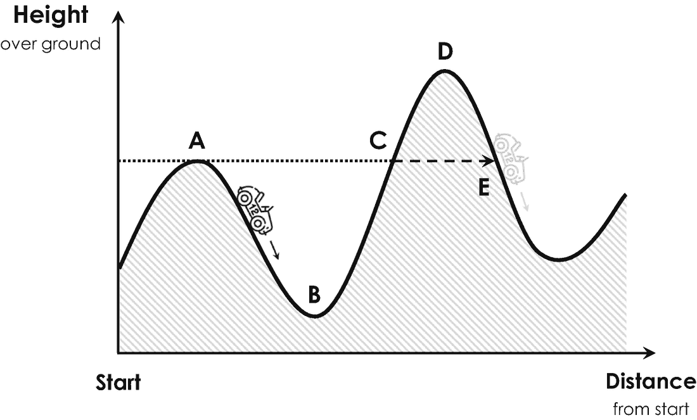

图 2-1

量子力学过山车的隧道效应解释(从 C 点到 E 点的虚线箭头，灰色货车)

想象你现在正在乘坐一辆虚构的量子力学过山车。在这种情况下，我们不能再使用经典力学来确定你的乘坐时间的演变。对于这样的量子力学过山车，你的乘坐体验完全改变，你的旅程变得相当坎坷。好消息是，测量你的马车是否离开了起点是相当容易的。但坏消息是，关于你的量子之旅，没有更多的信息可以告诉你。一旦你离开了起点，实际上就不可能确定你在过山车上的确切位置，因为你的乘坐不再是确定的了。因此，如果不测量它的位置，我们真的不知道你的货车在给定的时刻到底在哪里。这种现象被称为*海森堡测不准原理*，是量子力学的核心。你的量子力学马车的位置不能再用过山车上的一个点来描述了，而是用不同出现概率的点的(依赖于时间的)分布来描述。这种分布被称为*波函数*，它将你的马车在过山车上的每一个位置分配给一定的出现概率。换句话说，你将以 40%的概率处于最低点 *B* ，并以 60%的概率到达点 *C* 。没有办法根据你的开始时间或者任何之前测量的位置来计算你的马车在量子力学过山车上的准确位置——你基本上同时在所有地方(有一定的概率)，这是一种叫做*非定域性*的量子力学行为。这真的很奇怪，不是吗？

Heisenberg Uncertainty Principle

测不准原理是量子力学概率性质的直接结果，它指出量子力学物体的动量和位置(或能量和时间)无法同时精确测量。

当我或任何其他人——所谓的*观察者*—通过用照相机或光障反复测量你的位置从外面观察你时，这种情况变得更加奇怪。外部观察者的简单存在完全改变了你的乘坐体验。例如，在点 *B* 拍照，可以确认你的货车是否还在那个点。换句话说，在点 *B* 找到您的货车的概率要么是 100%(“货车在 *B* ”)，要么是 0%(“货车不在 *B* ”)，因为测量总是会显示离散的(或“具体的”)结果。但是当仔细观察时，这真的很奇怪，因为前面提到的概率分布或波函数必须突然消失，并且在测量的时刻改变为 100%或 0%。这就是著名的波函数*坍缩*，只有在有人观察你并测量你的位置时才会发生。一旦观察者停止观察你，概率分布立即重新出现，你又在同一时间无处不在。从经典物理学的角度来看，这确实是不可思议的，也是完全出乎意料的。

量子力学过山车确实揭示了另一个神秘的行为:当你计算你的马车的波函数时，你会发现有一个现实的机会(技术上称为有限概率)找到你的马车超过点 *D* ，这从经典物理学的角度来看是不可逾越的。换句话说，你有一定的概率穿过点 *D* ，尽管根据经典力学，你没有足够的能量这样做。在量子力学中，你可以简单地直接从点 *C* 穿过山丘到达点 *E* ，在点 *E* 结束，并在那里继续你的艰难旅程，如图 [2-1](#Fig1) 中的虚线箭头所示。这种跨越经典的不可逾越的能量障碍的量子力学现象被称为量子隧道效应或隧道效应，有时被描述为量子力学物体“穿过关闭的门”自从 1896 年被法国物理学家亨利·贝克勒尔发现以来，隧道效应已经在许多实验中被观察到，例如放射性原子的衰变。

Tunnel Effect

隧道效应是指一种违反直觉但却是自然的现象，通过这种现象，量子力学物体，如光子和电子，可以跨越能量障碍，尽管根据经典物理学，它们没有足够的能量来这样做。

如果你还在犹豫是否接受这种量子怪异，我可以安抚你，因为你肯定不是一个人。即使是阿尔伯特·爱因斯坦也无法相信量子力学的概率性质，外部观察者的决定性作用，以及波函数的突然坍缩。从那以后，量子力学的这种解释一直在挑战人类的想象力，并在 20 世纪受到沃纳·海森堡、梅克斯·玻恩和丹麦物理学家尼尔斯·玻尔的激烈讨论，他们首先提出了波函数的概率解释。他们的努力是第一次试图在最小的尺度上理解能量和物质的奇异而令人困惑的世界，现在被称为*哥本哈根诠释*以纪念开国元勋的故乡。今天，哥本哈根解释是量子力学最常用的解释，因为其他竞争解释包括*隐藏变量* [5](#Fn5) 和*多世界* [6](#Fn6) 解释正在进一步挑战我们的想象力。为了展示和可视化哥本哈根解释的奇异结果，围绕这一概率解释已经构建了各种思想实验，这些实验现在被称为*爱因斯坦-波多尔斯基-罗森悖论*或 EPR 悖论，并以三位争论不休的物理学家的名字命名。这个 EPR 悖论最流行也是最残酷的版本是薛定谔的猫。在他著名的思想实验中，德国物理学家埃尔温·薛定谔试图通过将坐在封闭盒子里的快乐猫的经典世界与猫旁边的放射性原子的量子力学行为联系起来，从而将量子力学的概率概念归结为荒谬。如果——根据他的想象——放射性原子衰变，它会发射出一个光子，这反过来会触发一个锤子打碎一小瓶致命气体，偶尔会杀死猫。换句话说，原子的放射性衰变导致薛定谔的猫死亡。如果你关上盒子，通过下面的论证问自己猫是不是活着，悖论就出现了。我们知道，放射性原子的衰变完全是一个量子力学过程，因此是一个概率过程。由于原子的状态和猫的生命通过释放有毒气体的锤子高度相互依赖，猫的健康状况也必须用概率波函数来描述。考虑到量子力学告诉我们，放射性原子在 30 s 后发生衰变，比如有 50%的概率。那段时间之后猫咪的健康状况如何？它是活着还是死了，或者介于两者之间？

量子力学的答案非常简单，也同样惊人:猫的确是死了，同时又活了，两者的概率各为 50%。然而，如果你——作为一个外部观察者——打开盒子看一看里面，描述猫健康状况的波函数突然崩溃，我们会发现猫要么活着，要么死了，但显然不是同时活着和死了。换句话说，打开盒子，目测(或测量)猫咪的健康状况，会让波函数瞬间崩塌。这有多奇怪？

多亏了英国物理学家和后来的诺贝尔奖获得者保罗·狄拉克，有一种非常方便的数学方法来描述猫的这种悲惨处境，为了清晰起见，以及我们稍后对量子计算机的进一步讨论，这是值得解释的。物理学家通常用所谓的*状态向量*来表示猫的健康状况，用符号|猫〉来表示，并将猫的两种经典可能状态称为*本征态*，分别用符号|活着的〉和|死去的〉来表示。在保罗·狄拉克的符号中，薛定谔的猫的健康状况可以很容易地写成

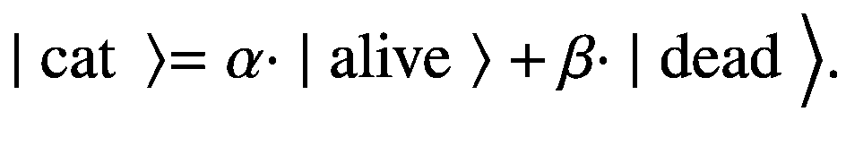

(2.1)

这个方程说，猫的状态等于两个本征态之和 *α* ⋅ ∣活着〉和 *β* ⋅ ∣ dead〉. *α* 和 *β* 是介于 0%和 100%之间(或 0.00 和 1.00)的任意两个数字，分别描述猫活着和死了的概率。 [7](#Fn7) 换句话说，如果 *α* 大于 *β* ，猫活着的可能性更大，反之亦然。

Measurement

测量过程在量子力学中起着至关重要的作用。测量或“观察”一个量子力学物体，即使其波函数，即所有可能态的概率分布，坍缩到单一态。因此，测量一个量子力学物体的状态将总是揭示一个独特的和离散的结果，一个我们从经典物理学和我们周围的世界中熟知的行为。

当考虑到猫的健康状况(或状态向量)的及时演变时，事情变得有趣了，这由著名的*薛定谔方程*描述。在不涉及任何细节的情况下，这个方程告诉我们，方程 [2.1](#Equ1) 中的两个*态振幅α* 和 *β* 将随时间变化: *α* 减小，而 *β* 相应增大，因为放射性原子衰变的概率随时间增大。换句话说，我们在打开盒子之前等待的时间越长，薛定谔的猫就越有可能死亡——这是另一个非常怪异和违反直觉的量子现象。

等式 [2.1](#Equ1) 中的和有时被称为*叠加*或两个本征态|活着的〉和|死去的〉.的“干涉”态的叠加是量子力学最基本的性质之一，也是量子计算机中非常重要的资源。你可能实际上对经典物体的叠加非常熟悉。想想声波和现代降噪耳机。这种设备基本上反映了周围的声波，将它们反转，并在输入和反转的声音信号之间建立叠加，使得产生的声音消失，外部噪声被消除。

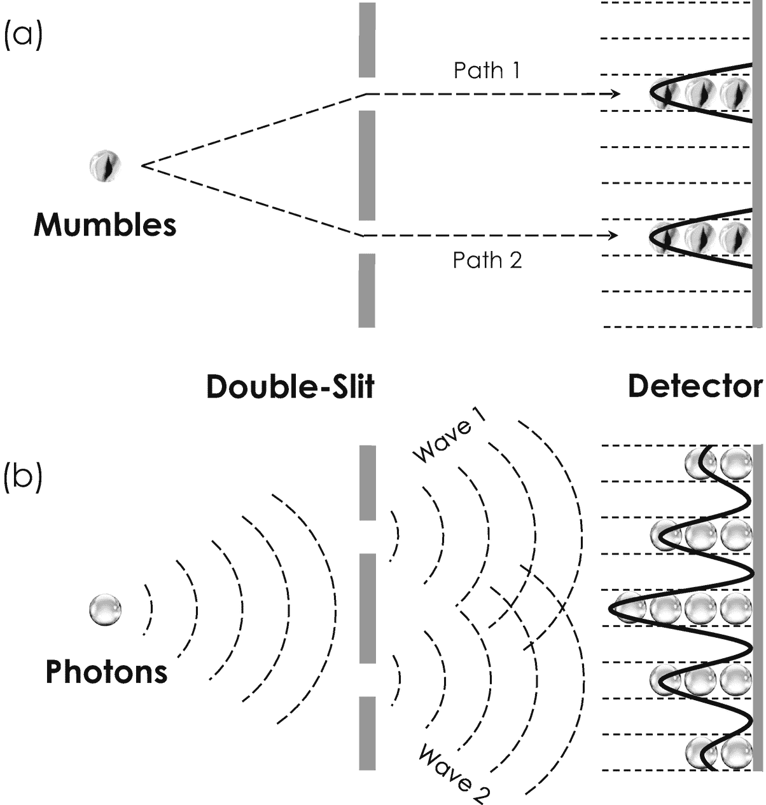

图 2-2

经典玻璃光子(a)和量子力学光子(b)的著名双缝实验的示意图。检测器屏幕上的轮廓显示了玻璃碎片的两个峰值(顶部的黑色实线)和光子的复杂干涉轮廓(底部的黑色实线)

Superposition Principle

叠加是指量子力学原理，根据这一原理，一个系统的两个或多个状态——很像你浴缸中的水波——可以叠加在一起(“叠加”)，形成该系统的另一个量子态。

量子力学叠加原理自发现以来，也在各种现实生活的实验中得到验证和观察。为了更好地理解这一非常重要的物理原理，有必要看一看用量子力学概率波叠加解释的最著名的实验之一。这个实验被称为*双缝实验*，由英国医学和物理学家托马斯·杨于 1802 年首次进行[ [7](#Par203) ]。他的实验装置将一个光子源(由太阳发射)引导到一张有两个非常小的狭缝的卡片纸上。光子进入狭缝，落在探测器屏幕上，其亮度测量每个位置的光子数量。如果光子是由经典力学描述的宏观物体，例如 mumbles——你小时候可能玩过的小玻璃球——它们将穿过卡片纸上的第一个或第二个狭缝。因此，如图 [2-2](#Fig2) (a)中的两个峰值所示，检测器将检测两个寄存器中的任何一个。

但是由于光子是量子力学物体，托马斯·杨观察到了完全不同的东西。他不是只在两个寄存器中的任何一个中探测到光子，而是在所有可能的寄存器中探测到光子，其中最大的计数是在恰好保持在两个狭缝之间的寄存器中观察到的。因此，亮度等于一个复杂的弯曲图案，即所谓的*干涉图案*，在图 [2-2](#Fig2) (b)中用黑色实线表示。托马斯·杨不相信这个观察结果，起初认为他的实验装置有问题。但由于这种模式没有改变，而是取决于卡片纸上两个狭缝之间的距离，他最终相信了自己的观察，并用光波解释了这一结果，光波根据卡片纸上的特定位置交替熄灭和放大。物理学家分别用两个术语*相长*和*相消干涉*来指代波的这一重要特性。在量子力学中，这种干涉图样对应于分别通过第一和第二狭缝的两个波函数的叠加。后来，用电子[ [8](#Par204) ](携带电流的粒子)和其他更大的量子力学物体进行的双缝实验确实揭示了同样的主要结果。这一观察的结果相当显著:量子力学物体似乎同时是粒子和波——咕哝和光子。这就是著名的*波粒二元论*，这是叠加原理的直接结果，也是量子计算机采用的另一个非常基本的属性。

Wave-Particle Dualism

波粒二元论是指量子力学物体同时表现为粒子和波的自然现象。根据特定的实验，量子力学对象揭示了粒子的典型属性，如能量和质量的量子化，以及通常归因于波的属性，如叠加和干涉。

但是量子力学还有另一个惊喜，叫做*纠缠*，可能是当今量子计算机中最神秘但同样重要的现象。首先仔细研究基本粒子的一个特殊性质，就能最好地描述纠缠。例如，光子揭示了总是围绕自身旋转的特殊性质。这种特性被称为*圆偏振*，可以理解为一个足球，一旦被发射到空中，它总是围绕着某个轴旋转。圆偏振光子显示的不是左旋圆偏振就是右旋圆偏振，这可以分别用狄拉克符号中的|↺〉和|↻〉来表示。原来，圆偏振光可以非常容易地由一组特殊的固体材料产生，称为*非线性晶体*。这些晶体将一束入射激光 [8](#Fn8) 分成两束独立的光束 *A* 和 *B* ，如图 [2-3](#Fig3) 所示。如果我们重复取出成对的光子——一个来自光束 *A* ，另一个来自光束*b*——并测量它们的偏振，我们将会做出惊人的观察:这对光子将会显示随机但总是相反的偏振，即分别是|↺〉和|↻〉。出于历史原因，这种光子对被称为爱因斯坦-波多尔斯基-罗森对或 *EPR 对*，简而言之，因为当他们在下面的思想实验中使用它们来演示量子力学的惊人结果时，他们受到了三位物理学家的热烈讨论。

假设我们在真空中用一个非线性晶体产生一个 EPR 对，并用一组镜子将它们指向相反的方向。由于光子以几乎 300，000 千米/秒的光速传播，只需要几分钟，两个光子就会相隔一个难以想象的大距离。现在想象我们取一个光子，比如说光子 *A* ，并测量它的偏振是左手。这个结果对光子 *B* 意味着什么？因为 EPR 对的光子总是显示相反的极化，我们知道光子 *B* 的极化一定与光子 *A* 相反，因此是右手——不用测量！这是惊人的，因为似乎有一种非常奇怪的相互作用告诉光子 *B* 光子 *A* 的偏振被测量为左手。这是特别奇怪的，因为这种相互作用是瞬间发生的，尽管你可能还记得高中的时候，没有什么能比光速更快。换句话说，光子 *A* 不可能与光子 *B* 瞬间交换任何关于其偏振的信息。那么为什么即使我们不测量，描述光子 *B* 偏振的波函数也会突然坍缩呢？事实上，阿尔伯特·爱因斯坦对这个结果同样感到惊讶，他把这种现象称为“幽灵般的超距作用”，因为他不相信 EPR 对的这种非常违反直觉的性质。与光子的极化类似，一旦电子被置于外部磁场中，它们也确实会相互围绕。由于历史原因，这种性质不叫极化，而是叫(电子)自旋。在从北极指向南极的磁场中，电子相对于磁场方向不是向左旋转就是向右旋转，如图 [2-4](#Fig4) 所示。如果它们向左旋转，它们的自旋状态称为*自旋向上*，用符号|↑)表示。相应地，向右旋转的电子被称为*自旋向下*并且用符号|↓〉.表示原来两个电子 *A* 和 *B* 的自旋也可以纠缠。对这种 EPR 电子的实验也揭示了这种远距离的怪异行为。

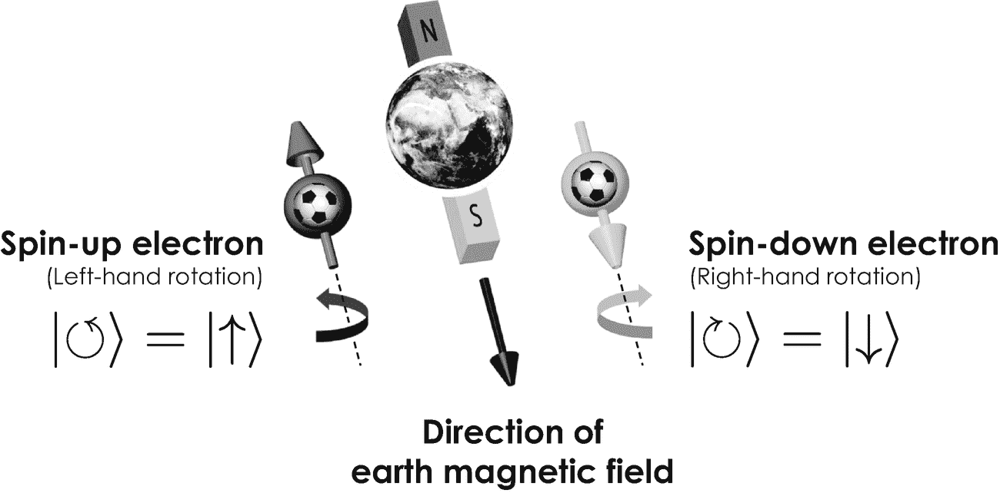

图 2-4

电子在地球磁场中的特殊行为。电子——类似于空气中的足球——绕着自己向左(向上旋转)或向右(向下旋转)旋转。物理学家分别写出|↺〉 = |↑〉和|↻) = |↓〉

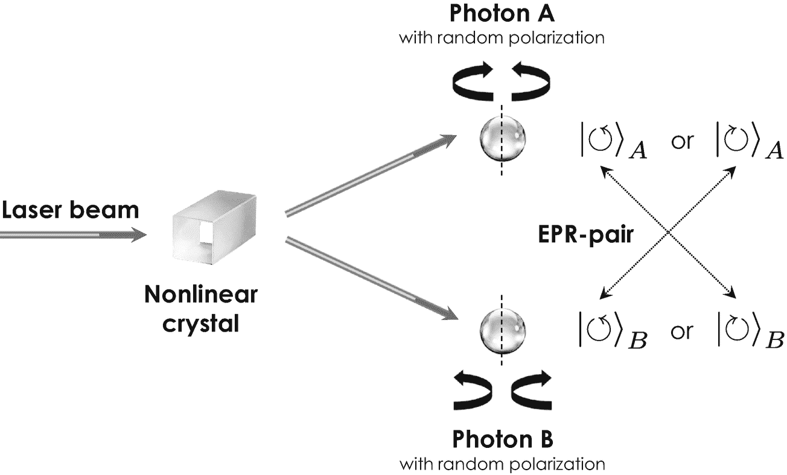

图 2-3

由激光束激发的非线性晶体产生纠缠的极化光子对 A 和 B。不测量任何一个光子的偏振，你就不能说出它们中每一个的偏振。你只能从量子力学中得知，这两个光子的偏振方向相反

换句话说，纠缠确实以某种方式“连接”或“缠绕”了两个(或更多)电子的量子力学自旋状态，使它们永远相互依赖。物理学家通常用符号| *ψ* 〉(在希腊字母“psi”之后)来标记自旋相反的两个纠缠电子 *A* 和 *B* 的整体状态，并用狄拉克符号来书写

(2.2)

来描述电子 *A* 自旋向上并且 *B* 自旋向下(第一项)或者电子 *A* 自旋向下并且 *B* 自旋向上(第二项)。 [9](#Fn9) 各自的概率由两个状态振幅 *α* 和 *β* 描述，类似于方程 [2.1](#Equ1) 中的叠加。

另一种可能更生动的方式来说明这种奇怪的量子效应，是通过比较普通的电子书，比如这本书的数字版本，和虚构的“量子书”。电子书中的信息是用比特编码的，而量子书的内容是用纠缠量子比特编码的。通过下面的论证，这对于你的阅读体验有着重要的影响。只要你愿意，通过一次阅读一页就可以很容易地学习电子书的内容。但是，看一看量子书的单页，只会发现随机噪音和非常少的信息内容，因为它的故事不是记录在不同的页面上，而是记录在它们之间复杂的相互关系中——不同的页面只是纠缠在一起。因此，为了理解整本量子书，你必须同时集体阅读许多页，同时认识到它们之间的复杂相关性——正如你所想象的那样，这是一种真正紧张的阅读体验。

这个纠缠的生动例子结束了我们对量子力学奇异世界的短暂探索。在这一节中，我们已经讨论了现代量子力学中两个非常惊人和怪异的现象，每一个都在今天的量子计算中得到了利用。如果量子力学的这个或那个方面让你困惑，请放心，因为你肯定不是一个人。理查德·费曼曾经这样描述量子力学:量子力学是对物质和光的行为所有细节的描述，尤其是对原子尺度上发生的事情的描述。在非常小的尺度上，事物的行为就像你没有任何直接经验一样。它们的行为不像波，不像粒子，不像云，不像台球，不像弹簧上的重物，也不像你见过的任何东西。此外，他后来在 1964 年康奈尔大学著名的量子力学信使讲座中指出，“我想我可以有把握地说，没有人理解量子力学。”

Entanglement

纠缠是指量子物理中的一种自然现象，当两个或更多的量子力学对象(如光子和电子)一起产生(或相互作用)时，它们的单个量子状态不再能够相互独立地描述。换句话说，对第一个物体的测量决定了对第二个物体的测量结果。这种现象没有经典的类比，如果纠缠的物体在空间上相隔很远，甚至可以观察到。

特别是，有了关于不确定性原理、叠加、纠缠以及极化和自旋的知识，我们现在手头上就有了理解量子计算机如何运行以及为什么它们能够在计算性能和速度方面超越最先进的超级计算机的一切。

### 2.2.2 量子计算机如何运行

量子计算机的基本概念是由两位美国物理学家启发的。其中之一是保罗·贝尼奥夫，他在 1980 年提出了一个量子力学图灵机的理论模型。两年后，理查德·费曼设想了一个类似的概念，当时他问自己如何最有效地模拟复杂的量子力学系统，如分子和蛋白质。 [10](#Fn10) 他得出结论，遵守量子力学定律的微型计算机本身最适合做这样的计算，“量子计算机”这个术语由此诞生[ [14](#Par210) ]。

从 1.4.2 节中，我们知道经典计算机将信息编码成可以被经典逻辑门处理的二进制位。与它们的经典亲戚类似，量子计算机将信息编码在量子位中——所谓的*量子位*——并通过*量子逻辑门*相应地处理它们。到目前为止，这个概念一点也不壮观。经典计算机和量子计算机之间的根本区别在于比特和量子比特实现和相互作用的特殊方式。一台经典计算机需要大约 10，000 个电子来编码一个二进制位。在如此庞大的系综中，不同电子的量子力学性质会互相平均，整个系统就像一个经典位元。另一方面，量子计算机采用单个量子力学对象，如孤立的电子或光子，来编码一个量子位，因此保留了其量子力学特性。

在实践中，量子计算机采用了量子力学*二能级系统*，例如电子的自旋或光子的极化，分别由两个状态向量|↓〉、|↑〉和|↺〉、|↻〉描述，正如我们从之前的介绍中所知。在电子自旋量子位的情况下，与经典位类似，状态向量|↑〉通常与二进制数“0”相关联，|↑〉与二进制数“1”相关联——只要我们在量子信息处理过程中不改变这种关联规则，相反的关联规则实际上也可以工作。

这种从经典位元到量子位元的转换，保留了量子力学的特性，有两个主要的优点。也就是说，量子信息处理提供了(1)存储容量和(2)计算速度的增益。第一个优势可以通过比较经典寄存器(或存储器)和分别用于保存以比特和量子比特编码的信息的*量子寄存器*得到最好的证明。传统的 2 位寄存器能够存储下列二进制数之一

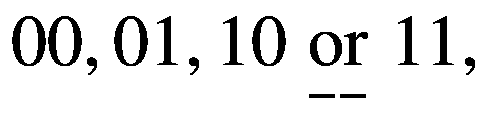

(2.3)

它们对应于十进制数 0、1、2 和 3，正如我们在 1.4.1 节中所知道的。另一方面，2 量子位寄存器保持其量子力学特性，因此可以利用叠加原理来存储状态向量:

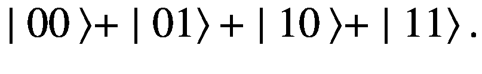

(2.4)

换句话说，经典的 2 位寄存器只能存储一个二进制数，而 2 量子位寄存器通过运用叠加原理可以一次存储 2 个 2 个 = 2 个⋅ 2 = 4 个二进制数。这种特殊情况可以很容易地抽象为 *N* 位和 *N* 位量子位寄存器，其中 *N* 表示任何等于或大于 1 的自然数。由于每个量子位可以同时编码二进制数“0”和“1”，一个 *N* 量子位寄存器能够保存

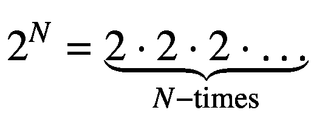

(2.5)

总共二进制数(每个有 *N* 位数)。另一方面，传统的 *N* 位寄存器只能存储一个具有 *N* 位的二进制数，因为每个位可以是“0”或“1”，但不能像量子位一样同时是“0”和“1”。因此，与一个 *N* 位寄存器相比，一个 *N* 位量子位的存储容量增加了

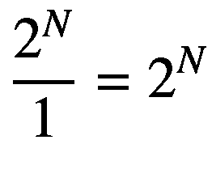

(2.6)

从而显示出指数增长。例如，智能手机的经典寄存器(或活动内存)通常约为 2 GB，相当于总共 160 亿个经典位。 [11](#Fn11) 一个基于量子位的主动工作存储器理论上只需要 32 个量子位来存储相同数量的信息，因为 2 32 已经大于 4 GB。换句话说，32 个量子比特可以存储比 160 亿个经典比特更多的信息。这种内存容量的真正指数级增长说明了量子相对于经典信息处理的第一个主要优势。

第二个优势与计算速度有关，是量子计算机处理量子信息的特殊方式的结果。假设我们想分两步进行两次计算:

(2.7)

经典计算机需要分两步连续进行这些计算。另一方面，量子计算机采用叠加原理，将|01〉编码的二进制数简单地添加到二进制叠加态 *α* ⋅ ∣ 00〉 + *β* ⋅ ∣ 01〉中，并同时执行两种计算。这种高度并行的计算可以用下面的等式来表示

![$$ {\displaystyle \begin{array}{l}\mid 01\left\rangle \oplus \left(\alpha \cdot |00\Big\rangle +\beta \cdot |01\Big\rangle \right)=\alpha \cdot \mid 01+00\right\rangle +\beta \cdot \mid 01+01\Big\rangle \\ {}\kern6.359996em =\underset{\mathrm{Result}\kern0.17em \mathrm{of}\kern0.17em \mathrm{step}\;1}{\underbrace{\alpha \cdot \mid 01\Big\rangle\;}}+\underset{\mathrm{Result}\kern0.17em \mathrm{of}\kern0.17em \mathrm{step}\;2}{\underbrace{\beta \cdot \mid 10\Big\rangle\;}}\kern0.24em \end{array}} $$](img/505424_1_En_2_Chapter_TeX_Equ8.png)

(2.8)

其中符号“⊕”表示状态向量中编码的两个二进制数的相加。因此，量子计算机的输出将是从步骤 1 和步骤 2 获得的结果的叠加。换句话说，量子计算机可以同时进行两种计算，因此比经典计算机快了一倍。然而，从量子计算机中读出并获得这一结果的唯一方法最终将涉及任何一种测量，这被称为*基于测量的量子计算*。但是从我们之前的讨论中我们知道，任何对量子态的测量都会导致其波函数的弛豫。换句话说，一旦我们试图通过测量对我们的二进制数进行编码的电子自旋量子位来读取叠加态，结果就是随机的，我们要么获得第一步的结果，要么获得第二步的结果，这取决于两个参数 *α* 和 *β* 。棘手的是，我们通常不知道获得的结果是属于我们计算的第一步还是第二步。那么我们能做些什么来解决这个联想问题呢？

在不涉及任何数学细节的情况下，这个问题通常可以通过使用纠缠作为额外的量子资源来解决，它允许我们将计算的二进制输入和输出值(或状态向量)相关联。如果你愿意，纠缠在与步骤 1 和步骤 2 相关的部分结果上添加一个标签，它允许我们识别我们的计算结果是属于步骤 1 还是步骤 2。然后，通过对等式 [2.8](#Equ8) 中的叠加态进行多次测量，可以获得步骤 1 和步骤 2 的最终结果。同样的原理也适用于两步以上的复杂计算。

在量子计算机中，这种计算实际上是由量子逻辑门实现的，类似于它的经典亲戚。从第 1.4.2 节，我们知道逻辑门——无论是经典的还是量子的——是一种物理结构，它接受一组输入并将它们组合成一个输出。经典逻辑门和量子逻辑门最重要的区别在数学上叫做*可逆性*。量子逻辑门是可逆的，因为它们保持量子相关性，如叠加和纠缠。因此，它们的输入总是可以根据输出来重构，这对于经典逻辑门来说通常是不可能的，因为不同的输入值可能具有相同的输出值，如表 1-1 所示。换句话说，量子逻辑门不会丢失任何通过它们的信息——它们在整个计算过程中保持信息及其相关性的安全密封。这是量子逻辑门的一个非常重要的属性，因为它允许我们对叠加和纠缠量子位进行逻辑运算，正如我们从前面的例子中所知，这是充分利用量子信息处理能力的重要前提。

不涉及任何细节，最重要的量子逻辑门是(1) Hadamard 门，(2)受控非门，和(3) Toffoli 门[ [15](#Par211) ]。*哈达玛门*特别重要，因为它允许将两个量子比特叠加。为此，它采用某种类型的光——电磁辐射，如激光或微波脉冲——来操纵相关量子位的量子状态。通过组合不同的量子逻辑门，我们可以构建各种量子算法来解决不同的计算问题。

总之，量子计算机采用叠加和纠缠来同时进行多个计算步骤，这就是为什么量子计算有时被描述为*大规模并行计算*和超级计算的下一个前沿。它提供了内存容量和速度的指数增益。例如，一个 300 量子位的寄存器可以存储 2 个 300 个二进制数，因此比整个宇宙中的粒子还要多！这种内存容量和计算能力的巨大增长是量子计算——即使它尚未完全成熟——有望在不太远的未来彻底改变超级计算空间的原因。

### 2.2.3 对完美量子位的繁琐搜索

科学经常是理论比实践容易得多。量子计算也是如此，在物理实现合适的量子位的过程中，科学家面临着重大的技术挑战。大多数挑战都与一个叫做*消相干*的过程有关，这是一个令人不安的“退化”过程，量子位中编码的信息被破坏并退化为随机噪声——因此这种量子计算机被称为“有噪声的”。

顺便说一句，噪声在经典计算中也是危险的，但很容易处理，因为我们可以为每一位保留两个或更多的备份副本，这样任何变化都会显得很奇怪。这种基于备份拷贝的策略不能用于量子计算机，因为任何复制量子态的尝试最终都需要进行测量，以确定我们想要复制什么。但是，正如我们从 2.2.1 节中所知，测量会导致波函数坍缩，从而破坏叠加态和纠缠态，并导致量子信息不可逆转地丢失。这个我们无法复制(或克隆)量子态的根本原理被称为*不可克隆定理* [ [16](#Par212) ， [17](#Par213) ]，这并没有让量子计算机的操作变得更容易。

退相干通常是由量子位和它们的宿主环境之间的相互作用引起的。它一般是由各种适时的变化推动的，如机械振动、温度波动、周围实验室的电子设备发出的振荡电磁杂散场等。物理学家通常区分退相干诱导的自旋翻转和能量弛豫过程，由于它们与量子计算机的物理实现有很大的相关性，下面将简要解释这两种过程。

#### 消相干:自旋翻转过程

我们考虑的第一个消相干机制是所谓的*自旋翻转*过程。在电子自旋的情况下，这个过程只是改变了量子位的自旋状态，并引发了从|↑〉到|↓〉的转变，反之亦然。所有这些都是随机发生的，破坏了量子计算机内的所有物理相关性，这就是为什么它的结果只会是随机噪声。这种自旋翻转过程发生的时间尺度被称为*相干时间*，用于测量一个量子位在被自旋翻转过程扭曲之前的“寿命”。相干时间通常为几微秒(百万分之一秒)，基本上设定了在量子计算机上完成一个计算步骤的最大可用时间。

#### 退相干:能量弛豫过程

退相干的第二个非常重要的来源与著名的海森堡测不准原理有关，我们从 2.2.1 节知道，它禁止量子力学粒子的动量和空间位置可以同时精确确定。但是由于量子力学粒子的动量和空间位置总是受到一些不确定性的影响，它们的运动也不能被非常精确地定义。换句话说，微观尺度上的自然总是在运动，量子力学粒子确实总是在抖动。量子力学物体的这种随机运动可以与运动能量相关联，该运动能量可以与量子位的宿主环境进行交换。量子位和它们的宿主环境之间的随机能量交换被称为*量子波动*，这产生了量子计算机中第二重要的退相干机制。

#### 消相干:技术解决方案

自旋翻转和能量弛豫过程都会诱发随机噪声，并破坏量子计算机上的计算。由于这两种机制都不能完全被抑制，我们不得不忍受量子计算机的这种“错误本性”(或错误)。为此，科学家们开发了不同的措施来应对退相干引起的噪声。

第一个也是最重要的一个，导致大多数量子计算机看起来就像一棵约 1 米高、30 厘米宽的倒置的小圣诞树，如图 [2-5](#Fig5) 示意性所示。这种架构被称为*稀释制冷机*，提供氦液池，并允许量子计算机在接近 0.01 K 的绝对零度温度(或 273.14T5】C 或 459.65T7】F)的低温下运行，具有最小的退相干。稀释冰箱在一个封闭的钢帽中运行，该钢帽容纳液氦池并覆盖其内部结构，包括不同的金色平台 [12](#Fn12) 相互悬挂。实际的*量子处理单元*(QPU)——类似于经典 CPU 的量子计算机的心脏——安装在冰箱底部的最低温度台上。例如，平台上装饰着数百个银片、电线和闪闪发光的管子，如[ [19](#Par215) 所示。

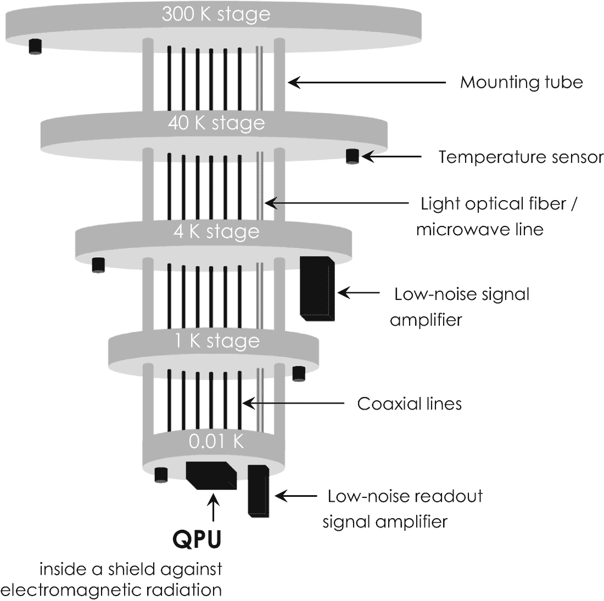

图 2-5

在稀释冰箱环境中实现量子计算机的实验系统设计。该系统揭示了在室温(300 K)至接近绝对零点的低至 0.01 K 的低温下运行的五个(或更多)温度阶段。每一级都装有一个温度传感器来监测液氦冷却系统。金属安装管以机械方式稳定不同的级，不同的同轴电缆和光纤便于将电信号和光信号传输到 QPU

除了在极其寒冷的环境中运行，科学家们还开发了不同的计算策略来主动纠正错误，这通常被称为*容错量子计算*。这些方案通常基于将许多脆弱的量子位(称为*物理量子位*)组合到所谓的*逻辑量子位*，由于概率效应和统计平均，这些逻辑量子位不太容易受到噪声的影响。这种分组被设计成使得逻辑量子位在足够长的时间内不受外部噪声的影响，以完成相应的计算步骤。对于每个纠错逻辑量子位，要实现的纠错的理论最小值是五个物理量子位。你可以想象这种策略带来了巨大的计算开销，从技术角度来看，这使得量子计算机的物理实现更加具有挑战性。

由于稀释冰箱和量子纠错单元都需要额外的计算资源来自动控制它们的运行，量子计算机现在通常被实现为*混合系统*，如图 [2-6](#Fig6) 所示。混合设置提供了图形用户界面，并控制不同的子部件，例如液氦管理系统、真空泵以及传感器和致动器，以在安全条件下自动操作整个系统。这一点尤其重要，因为液氦会造成严重的烧伤。

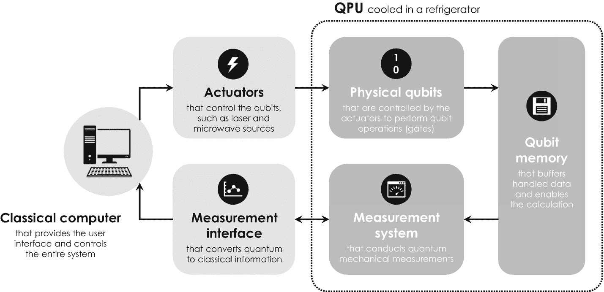

图 2-6

今天量子计算机系统实现的基本概念。QPU 本身(虚线框)由经典(台式)计算机控制，该计算机提供易于使用的用户界面并运行软件来控制系统的所有其他组件

建造稳定且抗杂讯的量子电脑所涉及的不同技术挑战，刺激了寻找完美量子位元的密集研究。早在 2000 年，美国物理学家 David DiVincenzo 就为寻找这种完美的量子位提供了有益的指导，并为理想的物理实现制定了五个主要标准[ [20](#Par216) ]，这对于评估量子信息处理的不同技术实现方案的相关性是值得了解的。完美的系统

1.  基于具有良好特性和强健的量子位，这些量子位是*可扩展的*，因此允许实现许多量子位系统

2.  可以很容易地将*初始化为一个简单的基准初始量子态，作为计算的起点*

3.  显示一个*相干时间*，该时间明显长于完成一次计算所需的时间(运算时间)

4.  允许我们进行量子门的*通用设置*,允许我们实现所有可能的量子比特操作

5.  允许我们*单独控制*和*读出*(或测量)QPU 中不同的量子位

到目前为止，这些 *DiVincenzo 标准*为全球数千名科学家开辟了操场，旨在实现地球上最强大的量子计算机。我们将在下文中简要讨论三个最重要的实现方案，这有助于您更好地理解目前可从 Google、IBM、D-Wave Systems 和其他公司购得的量子计算机。

#### 量子位的类型:俘获离子量子位

过去已经用于各种原理验证实验的技术是*离子阱*。由德国物理学家和后来的诺贝尔奖获得者沃尔夫冈·保罗和汉斯·格奥尔格·德默尔特在 1950 年发明的[[21](#Par217)–[23](#Par219)]，离子阱通过磁场将一系列孤立的带电原子——所谓的*离子*——限制在真空管中。磁场通常由四个圆柱形杆产生，这些圆柱形杆携带振荡电流并感应出极性变化的交变磁场。由于这种极性通常以与老式收音机相同的频率变化，因此产生的磁场被称为*射频*，简称 RF 场。

量子位|0〉通常与离子的能量最低状态相关，因此也是最优先的状态。这种基态离子可以被入射的强激光束激发，形成与量子位|1〉.相关的电正离子这种从基态到激发态|0〉 → |1〉的跃迁只是只包含一个量子位的量子逻辑门的一个例子。多量子位操作，如量子位的叠加和纠缠，可以通过将两个或多个相邻离子的基态和激发态耦合到它们围绕离子阱对称轴的运动来诱导[ [15](#Par211) ]。这些所谓的*量子化正常模式*是离子群的集体机械振荡，类似于项链上摇摆的珍珠，其中两个相邻离子(珍珠)之间的结合是由它们的电排斥提供的。 [13](#Fn13) 然而，存储在这种*保罗陷阱*中的量子比特被证明具有非常小的相干时间，这就是为什么如今的科学家使用磁场和电场的精心组合，这种安排被称为*彭宁陷阱*，以其荷兰发明者 Frans Penning[[24](#Par220)–[26](#Par222)命名。

关于它们在量子计算机中的应用，俘获离子的主要优点是三维地限制在自由空间中，并且当它们处于真空中时，与它们的环境很好地隔离。因此，离子量子位揭示了迄今为止测量到的最长的相干时间，这就是为什么它们仍然被用于科学和基础研究中，以研究明确定义的和孤立的量子位系统中的叠加和纠缠。

截至 2018 年，可控纠缠的粒子最大数量达到 20 个囚禁离子[ [27](#Par223) ]。关于 DiVincenzo 标准，这种量子位实现方案的主要缺点是可扩展性差，因为随着长度的增加，离子链变得越来越难以控制。今天，用于量子计算的大多数离子阱都依赖于一种微芯片架构，这种架构与最先进的微电子技术兼容，能够在低温下以非常高的精度限制和控制离子量子位[ [28](#Par224) ]。

#### 量子位的类型:电子自旋量子位

电子自旋量子位的历史与现代半导体物理和技术的兴起密不可分。半导体是一种传导电流(由电子携带)的材料，比玻璃等电绝缘体好，但比铜和其他金属等电导体差。技术上最重要的半导体是*硅*，它是通过熔化石英砂并从 2273K 的热熔体中去除氧化物而在工业上生产出来的。从这一过程中获得的银色硅通常含有低浓度的其他化学元素，这些元素在技术上被称为*杂质*。一种特别有趣的杂质是化学元素磷，因为这种化学元素或原子显示出核自旋和电子自旋。

硅中的这种杂质在 1998 年引起了美国物理学家布鲁斯·凯恩的注意，并启发他提出了一种基于硅的量子计算的创新方法。他的方法非常有影响力，因为它似乎与最先进的硅微电子技术相一致，这是当时制造微芯片的主要技术。*凯恩模型*是基于嵌入作为主体材料的纯硅衬底中的磷原子阵列。它允许在磷核自旋中编码量子位，而两个或多个相邻磷原子之间的叠加和纠缠是由磷原子的核自旋和电子自旋之间的自然相互作用介导的。

表 2-1

最流行的量子计算方法的优缺点。品质因数测量单个或多个量子位操作的误差率和噪声水平

<colgroup><col class="tcol1 align-left"> <col class="tcol2 align-left"> <col class="tcol3 align-left"> <col class="tcol4 align-left"></colgroup> 
| 

量子位的类型

 | 

相干时间(最大)

 | 

优势

 | 

不足之处

 |
| --- | --- | --- | --- |
| 俘获离子 | 10 秒[ [32 秒](#Par228) | +长相干时间+隔离良好的离子+高品质因素+高个人控制 | –可扩展性差 |
| 电子自旋 | 60 毫秒[[33](#Par229) | +中等相干时间+中等可扩展性 | –中等质量因素–中等个人控制 |
| 超导量子位 | 4 μs [ [34](#Par230) | +良好的可扩展性+大规模集成+高个人控制 | –相干时间短–低质量因素 |

接近 Bruce Kane 的量子计算方案的出现，两位美国物理学家 David Loss 和 David DiVincenzo 提出通过金属电极阵列[ [31](#Par227) ]在空间上将单个电子限制在某些硅衬底中——这种设备架构通常被称为静电定义的*量子点。* [14](#Fn14) 根据我们施加的是正电压还是负电压，这些栅电极要么吸引要么排斥带负电荷的电子，便于它们的运动控制。放置在外部磁场中，这种量子点允许限制和控制单电子自旋，以实现某些量子逻辑门。表 [2-1](#Tab1) 汇总了它们相对于 DiVincenzo 标准的主要优点和缺点。虽然这两种在硅中使用电子自旋量子位的方法都不太可能用于大规模量子计算，但它们对于基础量子研究来说是非常重要的设备结构。

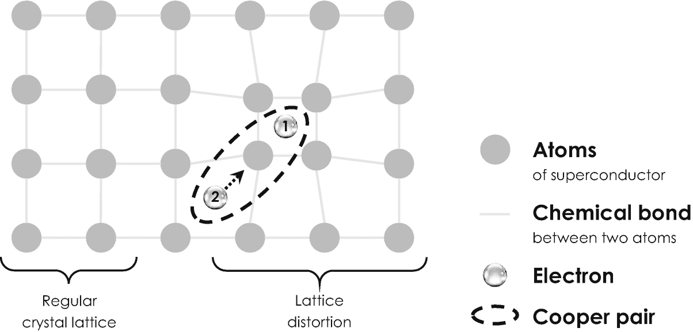

图 2-7

超导材料中库珀对的形成。电子“1”局部扭曲了超导体的规则原子晶格。电子“2”被这种扭曲吸引(虚线箭头),因为这是晶格中能量上更有利的位置。因此，当第一个电子穿过晶格时，它会拖着第二个电子一起移动。两个电子之间的键叫做库珀对

#### 量子位的类型:超导量子位

在大多数最先进的量子计算机中使用的技术上最重要的量子位实现方案是超导量子位，这就是为什么我们现在将更详细地研究它们。

超导本身是一种自然现象，由荷兰物理学家海克·卡末林·昂内斯于 1911 年在荷兰著名的莱顿大学发现。在研究低温下的固态汞时，他观察到当达到接近绝对零点的大约 4.2 K 的某个温度时，它的电阻突然消失[ [35](#Par231) ]。在这个临界温度以下，电子携带的电流可以自由地在材料中流动，没有任何电阻或其他耗散效应——因此电流会永远流动下去。约翰·巴丁，我们之前讨论第一个晶体管时认识的那个人，莱昂·库珀和罗伯特·施里弗后来通过他们所谓的 *BCS 理论*解释了这种效应，该理论基于量子力学，用电子对来解释超导性。为了理解那些所谓的*库珀对*的形成，我们先简单研究一下超导体的几个基本性质。

固体物质是由原子组成的，这些原子在所谓的*晶格*中规则排列，如图 [2-7](#Fig7) 左侧所示。在室温下，构成晶格的原子四处移动，导致整个晶格强烈振动——它们移动得越快，材料的温度越高。当自由电子穿过振动的晶格时，它会受到与晶格原子的各种碰撞，类似于台球，白色球经常与彩色球碰撞。直觉上，如果温度升高，原子振动更强，电子和原子之间的碰撞更容易发生。因此，金属的电阻率通常随着温度的升高而增加。在非常低的温度下，晶格原子振动非常缓慢，由于量子力学的量子化原理，这些振动的能量呈阶梯状变化。最小量的振动能量被称为*声子*，其行为类似于量子力学粒子。在如此冷的晶格中运动的电子会受到一些碰撞，但很少。因此，冷金属的电阻率很低，但不为零。

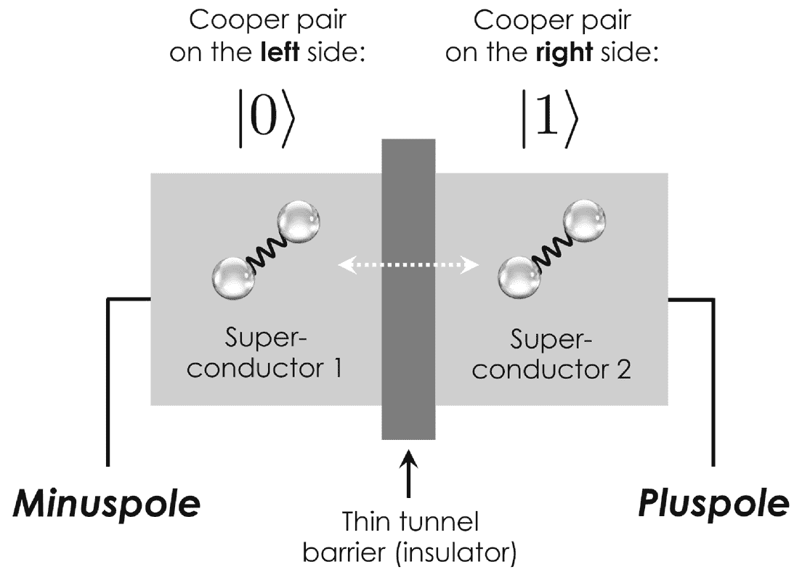

图 2-8

约瑟夫森函数中库珀对的量子力学隧穿。库珀对要么保持在左边的“超导体 1”中，要么隧穿到绝缘隧道势垒右边的“超导体 2”中(白色虚线箭头)。第一种情况与量子比特|0〉有关，第二种情况与|1〉有关

这幅图完全改变了超导材料。超导晶格的特殊几何形状允许电子吸收晶格声子，并在不减慢速度和损失任何运动能量的情况下重复交换它们。两个电子之间的相互作用将电子对“粘合”在一起，形成了一个库珀对，如图 [2-7](#Fig7) 右侧所示。这种库珀对可以不受阻碍地在晶格中移动，从而携带零电阻率的电流。超导转变发生在促进库珀对形成的特定材料温度以下。

广泛用于实现超导量子位的设备架构被称为*约瑟夫森结*，以纪念其美国发明者、后来的诺贝尔奖获得者布莱恩·约瑟夫森。它由两个超导体组成，由一个薄的绝缘隧道势垒隔开。这个隧道势垒可以被基于量子力学隧道效应的库珀对克服，这是我们从 2.1 节中知道的奇怪现象。约瑟夫森结通常允许实现三种不同的超导量子位。第一种选择如图 [2-8](#Fig8) 所示，被称为超导*电荷量子位*，因为它最终依赖于隧道势垒左侧和右侧超导体中是否存在库珀对。这个特殊的装置叫做*库珀配对盒*。

第二个也是目前最广泛使用的实现方案是超导*通量量子位*或“持续电流量子位”这个方案基本上是通过电流来编码量子位，电流由库柏对携带，分别以顺时针和逆时针方向在超导环中流动。底层器件架构被称为*超导量子干涉器件*或简称为“SQUID”，如图 [2-9](#Fig9) 所示。当被注入到环中时，根据我们从 2.2 节中知道的波粒二元论，库珀对基本上表现得像量子力学波。库珀对携带的这些超导电流可以干涉形成叠加，同时顺时针和逆时针方向(有一定概率)流动。当我们测量流动方向时，各自的波函数会坍缩，库珀对会向两个方向中的任何一个方向流动。根据右手定则， [16](#Fn16) 一个顺时针方向的电流感应出一个指向下方的磁场，该磁场通常与量子位|0〉 = |↻〉 = |↓〉相关联，相应地，一个逆时针方向的电流与|1〉 = |↺〉 = |↑〉相关联。超导量子比特是量子信息处理最有前途的候选对象，这主要与它们的尺寸和宏观性质有关:超导通量量子比特通常涉及大约 10 9 个库珀对在大至 0.1 毫米的设备中的集体运动。这种宏观系综比从其环境中隔离出来的单个电子、原子或离子更容易控制。但更宏观的量子位通常会经历更快的退相干时间，这就是为什么超导量子位显示出所有量子位中最快的退相干时间。

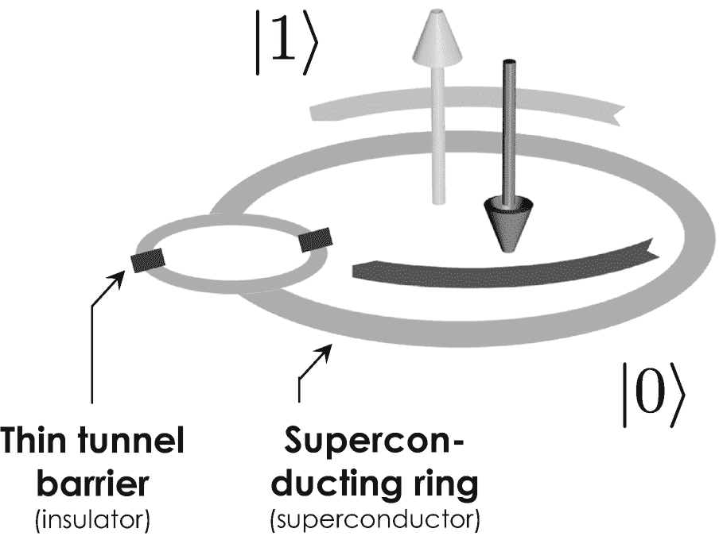

图 2-9

SQUID 中的超导通量量子位。库珀对的顺时针持续电流与量子位|0〉相关，持续电流随着|1〉.逆时针方向流动两个约瑟夫森结允许两个波函数同时在两个方向上干涉和循环

然而，在早期实验中观察到的令人不安的短消相干时间已经被进一步延长，并通过先进的电路设计和更鲁棒的量子位得到改善。从最新实验中获得的消相干时间足够长，可以实现所有相关的量子逻辑门，这也是为什么它们为大规模量子计算提供了所有实现方案中最乐观的未来，并引起了各种量子计算公司的极大关注，正如我们将在下文中看到的那样。

## 2.3 当今的量子计算

量子计算不再局限于学术研究，而是最近在工业和大型企业中首次亮相。不同的系统在市场上可以直接购买，也可以通过互联网按需访问云计算服务。他们采用不同的量子位实现方案，其中超导电路和离子阱是目前最重要的方案。

### 2.3.1 商用系统

在表 [2-2](#Tab2) 中汇编了一些商业上可用的系统，并按照量子位的数量从上到下排列。它们属于三种根本不同类型的量子计算机，这些计算机决定性地决定了应用和用例的范围。量子计算机一般分为(1)量子退火机，(2)量子模拟器，(3)通用量子计算机。对这些差异的认识将使您能够更好地理解媒体中的新闻和新闻稿，并选择最适合您自己的应用或用例的最佳量子计算机或云计算供应商。

表 2-2

选定的市售和可获得的量子信息处理设备和系统(截至 2020 年 8 月)。IBM 和 Google 的系统只能通过他们的云计算服务获得。目前还没有公司实现通用量子计算机

<colgroup><col class="tcol1 align-left"> <col class="tcol2 align-left"> <col class="tcol3 align-left"> <col class="tcol4 align-left"> <col class="tcol5 align-left"></colgroup> 
| 

公司

 | 

名字

 | 

类型

 | 

量子位数

 | 

来源

 |
| --- | --- | --- | --- | --- |
| D-Wave 系统 | 5000Q | 退火程序 a | Five thousand | [ [38](#Par234) |
| D-Wave 系统 | 2000 年 q | 退火程序 a | Two thousand | [ [39](#Par235) |
| 美国国家标准技术研究所(National Institute of Standards and Technology) | 不知道。 | 模拟器 b | Three hundred | [ [40](#Par236) |
| 电算(IonQ) | 不知道。 | 计算机 c | Seventy-nine | [ [41](#Par237) |
| 谷歌 | 狗尾草酮 | 电脑 a | seventy-two | [ [42](#Par238) |
| 国际商用机器公司 | 蜂鸟 | 电脑 a | Sixty-five | [ [43](#Par239) |
| 谷歌 | 悬铃木 | 电脑 a | Fifty-four | [ [3](#Par199) |
| 国际商用机器公司 | Q53 | 电脑 a | Fifty-three | [ [44](#Par240) |
| 美国英特尔公司(财富 500 强公司之一ˌ以生产 CPU 芯片著称) | 泰戈湖 | 电脑 a | forty-nine | [ [45](#Par241) |
| 国际商用机器公司 | Qiskit | 模拟器 b | Thirty | [ [46](#Par242) |
| 国际商用机器公司 | 罗利 | 电脑 a | Twenty-eight | [ [47](#Par243) |
| 里盖蒂计算公司 | 19Q 橡子 | 电脑 a | Nineteen | [ [48](#Par244) |
| 阿里巴巴 | 阿里云 | 电脑 a | Eleven | [ [49](#Par245) |
| 霍尼韦尔 | 模特 H1 | 计算机 c | Ten | [ [50](#Par246) |
| 霍尼韦尔 | 模特 H0 | 计算机 c | six | [ [36](#Par232) |

一个超导电路

b 经典计算硬件

c 线性离子阱微芯片

#### 商用系统:量子退火炉

量子退火器是我们将更详细探索的第一种量子计算机。它们在 1994 年从理论上被提出[ [51](#Par247) ， [52](#Par248) ，并首先用超导通量量子比特[ [53](#Par249) 实现。自 2011 年以来，加拿大公司 D-Wave Systems 已经开始销售量子退火炉。他们的第一个系统被称为“D-Wave One”，配备了 128 个量子位，在公开发布后不久就卖给了美国国防公司洛克希德·马丁公司。D-Wave 的第一个客户后来升级了它的系统，据报道，到目前为止，它一直在使用高达 2048 量子位的“D-Wave 2000Q”。最新的系统“D-Wave 5000Q”于 2019 年发布，并首先出售给美国新墨西哥州的洛斯阿拉莫斯国家实验室。

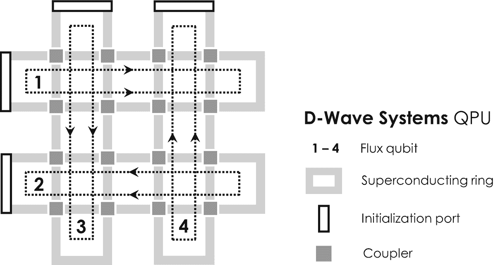

图 2-10

D-Wave 量子退火炉中使用的主要设备设计——为简单起见，该系统被简化为 4 个量子位。与四个通量量子位相关联的超导持续电流在矩形回路中流动，而每个回路对应于一个通量量子位。通量量子位可以通过 16 个耦合器相互作用，这些耦合器允许超导电流的量子力学隧道。特殊的初始化端口或触点有助于将相应的电流注入器件

D-Wave 量子退火器的 QPU 由一个二维超导环阵列组成，这些超导环携带超导通量量子位，形成所谓的*自旋玻璃晶格* [ [52](#Par248) ，如图 [2-10](#Fig10) 所示。这些环通过超导*耦合器*相互连接，这有助于量子力学隧穿，并可用于叠加和纠缠相邻的通量量子位。QPU 还配备有一系列不同的电触点，允许施加偏置电压来调节库珀对的隧穿概率和能量。例如，据报道，5000Q 包括大约 4 万个耦合器和 100 多万个约瑟夫森结，这使它成为有史以来最复杂的超导集成电路之一。

像任何其他计算机一样，量子退火器是为了解决数学问题而构建的，例如*旅行推销员问题*，这是优化领域的一个传奇基准，也是这方面最常被引用的例子之一。目标是为一个推销员找到最短的可能路线，他从一个家乡出发，需要访问分布在世界各地的一系列其他城市。在这个问题中，推销员必须准确地访问列表中的每个城市一次，并在家乡完成旅程。如果城市列表很短，这个组合问题很容易解决。但是，一旦列表的长度增加，可能的组合数量就会成倍增加。例如，对于 5 个城市，有 12 条可管理的路线。但在 12 个城市的情况下，旅行推销员陷入了悲惨的境地，因为他需要考虑近 2000 万条可能的路线——可怜的推销员。但是 D 波系统的量子退火器一般如何处理计算问题呢？

每次计算都是从将手头的数学问题转化为节点和边的二维几何图案开始的，这种图案被称为*图*，可以通过 D-Wave 的定制设备架构来容纳——图中的节点对应于量子位，边对应于耦合器。在旅行推销员的情况下，该问题在数学上被描述为无向加权图，使得不同的城市是图的节点，城市之间的路径是图的边，并且路径的距离对应于边的权重，即测量相邻城市之间的空间距离的任意数字。这个问题的图形表示基本上是作为连接和控制 QPU 量子位的蓝图。 [19](#Fn19) 这种将要解决的数学问题映射到量子位的二维图形表示的过程往往不是很直观，这就是为什么 D-Wave Systems 通过在常规计算机上运行具有图形用户界面的支持软件来自动化这一过程。该软件允许简单地输入相应的问题——通常以数学方程的形式给出，例如在旅行推销员问题的情况下测量总旅行距离的成本函数——并自动生成最合适的图形表示。一旦找到了这个表示，就可以开始实际的计算或退火过程了。退火程序通常分四个主要步骤进行:

1.  *量子位初始化*:这一步是根据某一系列微波脉冲，以问题的图为起点，初始化量子位的组态。选择脉冲，使得它们理想地使芯片上二维阵列的所有量子位相互纠缠。这一点尤其重要，因为这种纠缠使得量子位配置能够广泛探索手头问题的所有可能解决方案。

2.  *问题初始化*:第二步涉及开启编码在一组特定量子位和耦合偏置电压中的问题描述。为了使这一过程成功，电压需要缓慢增加，以便量子位只相互作用，而不与宿主环境相互作用。这一点特别重要，因为任何与环境的相互作用，如热能交换，都会引起退相干，从而导致不可逆转的信息损失。 [20](#Fn20) 在这个所谓的*绝热相变*期间，不同的量子位了解计算问题，并根据特定的偏置电压设置通过耦合器通过量子力学隧道相互作用。

3.  *弛豫*:量子位和耦合偏压在第三个计算步骤中突然关闭。通过久而久之，纠缠量子比特网络进化，从而松弛到其能量上最有利的配置，即系统的所谓的*基态*。由于不确定性原理，量子涨落和隧道效应有助于及时演化，并且通常涉及相邻量子位之间的自旋翻转跃迁。

4.  *读出*:最后一步是关于测量系统的基态。这种测量导致整体波函数坍缩，我们获得了一组顺时针或逆时针方向流动的超导电流。根据关联规则|0〉 = |↻〉和|1〉 = |↺〉，电流分别对应于 0 和 1 的阵列。由于它的能量被最小化，这个图状态代表了我们手头的计算问题的最终和最优解。

所有这一切都发生在几分之一秒内，并重复不同的时间，因为量子退火是嘈杂的。统计上最常获得的解可以被认为是系统的真实基态和问题的最佳解。然后，这个最终的 0 和 1 的数组由运行在传统计算机上的特殊软件处理，并转换成一个有序的城市列表，以解决手头的特定旅行推销员问题。量子退火器已经被应用于广泛的商业问题，并被证明在经典的超级计算机中提供显著的运行时间优势。事实证明，在考虑将量子退火器应用于某个问题时，应用主要分为两个重要的类别:

1.  第一个把*组合优化问题*分类，比如前面描述的旅行推销员问题或者寻找收益最高的股票组合。这类问题通常是在大量可能的解决方案或组合中寻找最佳方案。 [21](#Fn21)

2.  *采样问题*是量子退火器非常擅长的第二类问题。这些问题是关于在可能的解决方案中找到更好但不一定是最好的解决方案或组合。这对量子机器学习[ [55](#Par251) ]特别有用，因为这项技术通常需要大型数据集来成功训练机器学习模型，我们将在第 [4](4.html) “人工智能”一章中学习在这种情况下，量子退火器可用于通过生成与现实完美相似的新数据来将小数据转换为大数据，并可用于训练机器学习模型。另一个例子是关于材料建模和寻找飞机机翼的更好的空气动力学形状，这是欧洲航空航天公司空中客车公司最近报道的量子退火机的一个应用[ [56](#Par252) 。

量子退火器是世界上第一台商用量子计算机，研究人员从一开始就密切关注这项技术。虽然他们中的一些人对这种特殊的量子计算方法感到非常兴奋，但其他人仍然对这种机器的长期潜力持怀疑态度，这就是为什么他们长期以来被认为是世界上最有争议的量子计算机。这一争议主要是由于量子退火器——与通用量子计算机相反——不需要实现量子逻辑门。整个计算更依赖于物理系统的基本属性，随着时间的推移，通过量子涨落和隧道效应，演化到它们的能量最优状态(基态)。

然而，D-Wave Systems 通过将其应用于广泛的应用领域，在与跨国公司客户一起营销这项技术方面做得很好。在过去的几年中，他们已经成功地将量子退火器建立为“专用量子计算机”，在优化和采样问题上工作得最好，在运行时提供很大的好处。

#### 商用系统:量子模拟器

量子模拟器是量子计算机最原始的类型，可以追溯到 1981 年，当时理查德·费曼在加州理工学院发表了他著名的“计算演讲”。他当时想到的问题是量子力学系统的模拟，比如超导体中库珀对的系综，是否可以在经典计算机上有效地进行[ [14](#Par210) ]。通过他的分析，他表明采用量子力学效应的计算机可以比经典计算机[60](#Par256)更快地模拟某些量子系统，这就是为什么这种量子计算方法从那时起就被称为*量子模拟器*。

如今，这个术语通常用来指一个经典的计算硬件堆栈，它有足够的容量来模拟量子计算机的某些方面。如今，量子模拟器主要用于学术界，因为它们允许探索物理、化学、生物和材料科学中的基本问题和量子现象。此外，量子模拟器还用于优化量子处理器和验证其结果，这对开发新的量子算法和软件尤为重要。

#### 商用系统:通用量子计算机

通用量子计算机是最强大、最普遍适用的量子计算机，但不幸的是，它是迄今为止最难制造的。由于在它们的大规模物理实施和操作上的主要技术挑战，这种机器目前是不可用的，并且甚至可能在不久的将来也不能实现。在这种背景下，文献区分了*噪声中等规模*和技术更先进的*完全纠错*(或容错)量子计算机。一台完全纠错的通用量子计算机可能会使用超过 100，000 个量子位，这些量子位可以用来为任何大规模复杂的计算问题或计算找到快速解决方案。谷歌、IBM、霍尼韦尔、阿里巴巴和亚马逊的通用量子计算机共同属于嘈杂的中等规模量子计算机，与完全纠错的系统相比，应用范围有限。

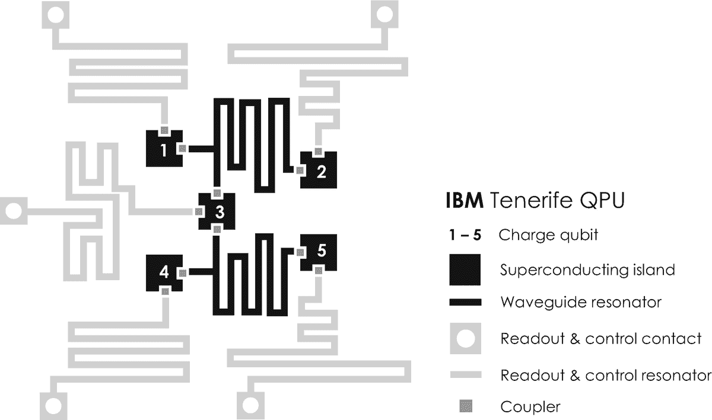

图 2-11

IBM 的 5 量子位特内里费量子处理器的架构设计。它的核心是五个超导岛，承载着电荷量子位。这些量子位可以通过波导谐振器相互作用，促进叠加和纠缠量子位状态的形成。读出和控制触点有助于电荷量子位的初始化和测量

第一个系统是 IBM 的 5 量子比特特内里费 QPU，如图 [2-11](#Fig11) 所示。这个系统由五个容纳超导电荷量子位的岛组成。这些量子位与在*波导谐振器*中传播的单个光子强烈相互作用，并促进了连接岛上两个超导电荷量子位之间的叠加和纠缠。 [22](#Fn22) 虽然这种早期的设备设计实现了各种原理验证实验，但它被证明是非常嘈杂的，不太适合大规模实施，因为量子位-光子相互作用难以高保真和高质量地控制。

这就是为什么科学家们开发了通用量子计算机的第二种方法，使用一组库珀对来编码超导电荷量子位，而不是单个库珀对。这些 *transmon 量子位*更不容易退相干[ [61](#Par257) ， [62](#Par258) ]，并允许实现更大的多量子位系统。它们通常在称为*门模型超导电路* [ [63](#Par259) ， [64](#Par260) 的设备架构上实现。

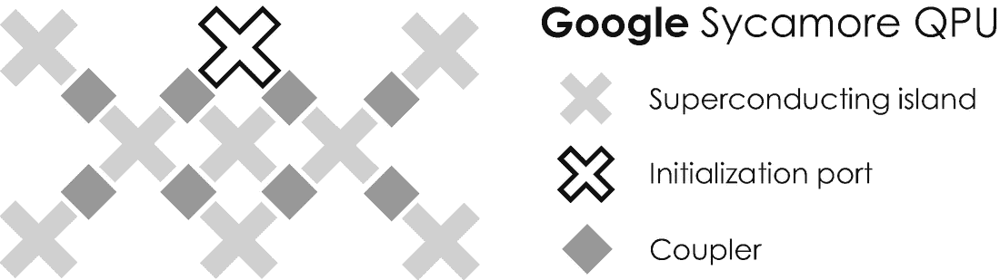

图 2-12

谷歌梧桐 QPU 的建筑设计——为了简单起见，整体布局从 54 量子位减少到 8 量子位。十字形超导岛的二维阵列容纳 transmon 量子位，这些量子位可以通过一组耦合器的量子力学隧穿相互作用。特殊的初始化端口有助于将库珀对注入到岛上。基于叠加和纠缠的量子逻辑门由微波脉冲实现，分别用于实现单量子位和多量子位门

到目前为止，在这种情况下最受欢迎的设备是谷歌的 54 量子位“Sycamore”QPU，由美国和世界领先的量子物理学家 John Martinis 领导的研究团队开发，并于 2019 年底向公众展示。其主要设备架构如图 [2-12](#Fig12) 所示，为简单起见，该架构缩减为 8 个量子位。 [23](#Fn23) 与任何其他 QPU 一样，Sycamore 处理器安装在稀释冰箱的底部，在低温下运行。该设备包括一个十字形超导岛的二维阵列，总共容纳 54 个 transmon 量子位。不同的岛通过总共 88 个耦合器(每个岛 4 个约瑟夫森结)互连，这允许传输子从一个岛到另一个岛的量子力学隧穿，从而实现叠加和纠缠。不同的量子逻辑门由驱动单个或多个量子位的自旋翻转过程的微波脉冲实现。对于单量子位门，所有这些发生在大约 25 ns 内，对于多量子位门，发生在 12 ns 内。

2019 年底，梧桐 QPU 受到了有争议的讨论，当时谷歌声称，他们的芯片在历史上首次达到了量子霸权[[3](#Par199)]，因此能够比经典的多核超级计算机更快地解决计算问题。“量子优势”一词是由加州理工学院物理学家约翰·普雷斯基尔在 2012 年创造的，他从表现的角度定义了量子优势...]受控量子系统的任务超越了普通数字计算机所能实现的" [65](#Par261) 。量子优势的实现被认为是实现世界上第一台通用量子计算机道路上的一个重要里程碑。然而，谷歌的声明必须被仔细解读，因为他们解决了一个高度专业化的计算问题。概括地说，加州山景城谷歌研究院约翰·马丁尼的研究团队在大约 200 秒内生成了一串纯随机数，并认为一台经典计算机完成同样的任务需要 10，000 多年。IBM 的科学家很快反对说，一台经典计算机只需要 2.5 天，这将降低谷歌展示量子“优势”的壮举。此外，IBM 认为这个问题是有意选择和“定制”的，只是为了证明量子优势。对于经典计算机来说，生成随机数基本上极其困难，这就是为什么经典计算机生成的随机数被正确地称为“伪随机”，但对于量子计算机来说却相当容易，因为量子力学中固有的概率随机性。IBM 的科学家提出的另一个论点是关于量子优势本身。他们认为，这个概念通常没有太大意义，因为不是每个量子算法都有一个等价的经典算法能够解决相同的计算任务——因此严格的比较是不可能的。

为此，IBM 推广了他们的研究团队在 2018 年开发的另一种性能指标，并允许对量子计算机进行更具代表性的比较。这种衡量和比较量子计算机性能的指标被称为*量子体积* [ [66](#Par262) ，并考虑相干时间、错误率和其他参数来评估量子计算机的整体性能[ [67](#Par263) ]。量子体积性能测量还没有被科学界广泛采用。然而，大多数研究人员都同意，量子计算机只有利用叠加和纠缠作为计算资源来并行化不同的计算步骤，才能超越经典计算机。因此，任何没有利用这些量子效应的设备都不应该被认为是通用量子计算机。毫无疑问，从技术的角度来看，谷歌的霸主地位是一个里程碑，因为还没有哪家公司在一个 QPU 中制造并成功控制了更多的 transmon 量子比特。Sycamore 处理器已经可以通过谷歌的云计算服务获得，因此在工业中有很大的应用前景。

2020 年中期，由 100 多名科学家、工程师和软件开发人员组成的团队与美国科技巨头霍尼韦尔合作，提出了另一个非常有前途的通用量子计算机设备设计。他们的 QPU 设计被称为*捕获离子量子电荷耦合器件*，允许限制悬浮在微芯片架构上方的一维离子链，类似于鲍林阱中的离子链。霍尼韦尔的设备使用镱-171 离子作为量子比特，钡-138 离子用于交感冷却。 [27](#Fn27) 离子量子位(电荷状态和运动状态)可以通过安装在微芯片上的超过 198 个薄电极来控制，微芯片的大小约为 1 厘米，例如在 [71](#Par267) 中描述的。霍尼韦尔的量子计算机自 2020 年末开始通过微软的 Azure 量子云计算服务商业化。

### 2.3.2 当前业务应用

多年来，量子计算机的最大客户是大型政府机构，如军队和特勤局，到目前为止，它们仍然是该领域研究的最重要的公共融资机构。他们的巨大兴趣最初可以追溯到美国数学家彼得·肖尔的开创性工作，他在 1994 年设计了一种著名的量子计算算法，可能用于破解网络安全代码。随着随后几年进一步算法的发展，如用于搜索大型非结构化数据库的*格罗弗算法*[[73](#Par269)]、用于求解线性方程组的 *HHL* 算法[ [74](#Par270) ]等[ [75](#Par271) ]，研究的重点已经转移到越来越多的私营部门的应用上。

IBM 是第一批抓住这一趋势并开始将量子计算应用于现实生活商业问题的公司之一，D-Wave Systems、Google 和微软紧随其后。在过去的几年里，他们与许多较小的创业公司一起，如 IonQ、Zapata Computing、Rigetti Computing 和 Quantum Motion，一直在大力推广这项技术，大多数量子计算机已经通过按需云计算服务商业化。

#### 当前业务应用:模拟、建模和优化

模拟、建模、优化和采样可能是当今量子计算机最常引用的应用，因为它们利用固有的量子并行性来实现经典超级计算机的运行时优势。当前的商业应用涵盖了各种工业领域。最重要的列举如下:

*   *汽车*:全球最大的汽车制造商德国大众集团通过与 D-Wave Systems 建立多年合作伙伴关系，于 2017 年开始探索量子计算业务。从那时起，大众汽车一直在他们的数据中应用这项技术来解决不同的商业问题:慕尼黑的实验室和旧金山的代码实验室。一个试点项目旨在模拟过度拥挤的城市[[77](#Par273)–[80](#Par276)]中的交通流量，以此作为城市交通规划和导航的先决条件，通过避免拥堵实现最短的出行时间。这种量子计算服务可能有一天会在汽车云中运行，与道路上完全连接的(自动)车辆共享关于最短路线的导航信息。另一家目前正在探索量子计算的德国汽车制造商是宝马，它也与 D-Wave Systems 建立了合作伙伴关系，旨在优化他们生产线上的机器人。当大众和宝马与 D-Wave Systems 合作时，戴姆勒与谷歌[ [82](#Par278) ]和 IBM [ [83](#Par279) ]建立了合作关系，以探索材料科学和化学领域的应用，包括模拟电池电动汽车的下一代电池。例如，在[ [84](#Par280) 中描述了更多汽车应用。

*   航空航天和国防:洛克希德·马丁公司在 2010 年末购买了 D-Wave 系统的第一台量子退火机，并从那时起不断升级其系统。他们的主要应用领域似乎是软件开发，包括软件调试以及软件验证和确认过程的优化[ [85](#Par281) ]。D-Wave Systems 的另一个客户是美国国家航空航天局(NASA ),该公司目前正在位于加利福尼亚州山景城硅谷中心的埃姆斯研究中心的 NASA 高级超级计算设施中运行 2000Q 系统。他们的量子计算机已经被用于解决航空学、地球和空间科学以及太空探索任务中的困难优化问题[ [86](#Par282) ]。美国航空航天巨头空中客车公司最近与 IBM 合作，将量子计算应用于飞机机翼的气流建模[ [87](#Par283) ]，这是另一个经典的优化问题，之前经典的超级计算机已经解决了这个问题。

*   *化学、制药和医疗保健*:量子计算也进入了化学和制药行业。例如，美国跨国公司陶氏化学公司(Dow Chemical Company)已于 2017 年与加拿大量子计算软件初创公司 1QBit 达成了一项多年协议。根据他们的新闻稿，陶氏化学和 1QBit 的目标是“为化学和材料科学技术空间开发量子计算工具”[88](#Par284)，这是他们的合作伙伴关系-到目前为止，该协议的进一步条款尚未披露。由于 1QBit 只为量子计算硬件开发通用算法，因此它与微软、IBM、富士通和 D-Wave Systems 建立了不同的硬件合作关系。1QBit 也已于 2016 年与美国生物技术公司 Biogen 达成协议[ [89](#Par285) ]。他们与爱尔兰专业服务公司埃森哲(Accenture)一起，利用量子计算机的模拟能力，更好地解决阿尔茨海默氏症和多发性硬化症等疾病。总部位于旧金山的药物设计初创公司 Menten AI 与 D-Wave Systems 和 Rigetti Computing 合作，利用合成生物学和量子计算来创造新的蛋白质药物。为此，Menten AI 采用了基于混合经典量子计算方法的两步药物开发流程。第一步涉及在经典计算机上运行不同的机器学习算法，并试图创建一种新蛋白质的化学结构(生物学上称为一级结构)和可以结合并操纵人体内病变细胞的潜在药物——我们将在 4.4.6 节更详细地讨论人工智能的应用时，研究这种特定的机器学习方法来进行药物开发。第二步，Menten AI 的研究人员利用量子计算的计算能力来计算这种新蛋白质将通过一种称为能量最小化的化学过程自然折叠成的三维形状。由此产生的三维蛋白质结构在生物学上被称为四级结构，它决定性地决定了蛋白质的医学性质，并作为进一步迭代优化的重要前提。Menten AI 的混合经典量子计算方法是新兴跨学科研究领域的一个很好的例子，该领域最近被称为*量子机器学习*。量子计算和人工智能的这种令人兴奋的卷积，通过将最初在经典计算机上进行的给定问题或算法的计算密集型子程序外包给更快的量子计算机或退火程序，可以提高计算速度、效率和准确性。世界上最大的制药和诊断公司 F. Hoffmann-La Roche 最近宣布与“牛津大学的三名博士生”建立学术合作关系，例如，他们应用量子计算机模拟来计算分子的能量。在 400 万美元种子资金的支持下，总部位于多伦多的生物技术初创公司 ProteinQure 最近与量子计算的领导者(如 IBM、微软和 Rigetti Computing)以及制药研究机构(包括阿斯利康和 SRI International)合作，探索用于蛋白质分子模拟的量子计算。他们的研究很可能为基于蛋白质的高产量计算药物设计铺平道路，这些蛋白质已经被设计用于特定的医疗目的。

*   材料:由于量子计算机非常适合模拟不同材料中复杂的化学反应，许多公司正在使用量子计算机来简化他们的产品开发过程。我们已经谈到了戴姆勒、IBM 和谷歌之间的合作，以模拟高压电池的细胞化学。据报道，日本工业巨头三菱化学(Mitsubishi Chemical)和 IBM 也进行了类似的合作，他们联合应用量子计算来模拟锂空气电池的分子动力学[ [92](#Par288) ]，这可能会在几年内偶尔取代电池电动汽车中高度易燃的锂钴电池。德国一级汽车供应商博世[ [93](#Par289) ]和美国工业集团霍尼韦尔[ [94](#Par290) ]是该行业中应用量子计算创造基于量子材料建模的全新产品的两个进一步的例子。

*   *金融、银行和保险*:投资银行和保险公司也在早期开始探索量子计算并获取其业务相关性。第一批采用者之一是美国和全球最大的银行摩根大通，它最近与 IBM 建立了合作伙伴关系，此后不久又与巴克莱银行和 CaixaBank 建立了合作伙伴关系[[95](#Par291)、[96](#Par292)。据报道，他们测试了不同的算法，例如，投资组合优化、金融工具(包括资产、债券、股票、期权和衍生品)的估价和定价[ [97](#Par293) ]、金融风险分析、市场模拟、交易结算和欺诈检测。高盛也决定投资和探索这种数字技术，并于最近与位于加州帕洛阿尔托的美国 QC Ware 公司建立了合作伙伴关系。量子计算在金融中的进一步示例和预期应用可以在例如[ [99](#Par295) ]中找到。

*   *电子学*:半导体和电子行业也一直在投资量子计算。一些公司，如英特尔或阿里巴巴，决定建立自己的 qpu，而其他公司则与量子计算领域的初创公司和老牌公司合作。例如，韩国企业集团三星旨在通过利用不同的量子模拟工具来优化用于显示器、半导体微芯片和电池的不同材料。为此，他们于 2019 年与位于马里兰州大学城的美国量子计算硬件和软件公司 IonQ 展开合作[ [100](#Par296) ]。

*   *能源*:由于其在广泛的优化问题上的巨大潜力，美国跨国石油和天然气公司埃克森美孚已经决定成为第一家加入 IBM Q 网络的能源公司[ [101](#Par297) ]。IBM Q Network 是一个由财富 500 强公司、初创公司、学术机构和国家研究实验室组成的全球社区，致力于推进量子计算并探索其在科学和商业领域的实际应用。根据他们 2019 年的新闻稿，埃克森美孚喜欢“解决各种应用中具有计算挑战性的问题，包括优化一个国家电网的潜力，以及执行更具预测性的环境建模和高度精确的量子化学计算，以发现新材料，实现更有效的碳捕获”[ [101](#Par297) 。

#### 当前的商业应用:网络安全

除了模拟、建模、优化和采样，网络安全是量子计算机的另一个主要应用领域。它与 Shor 算法密不可分，Shor 算法是量子计算机的第一个算法。1994 年，彼得·肖尔描述了如何使用通用量子计算机在极短的时间尺度内将一个大的自然数分解成它的质因数[【28】](#Fn28)[72](#Par268)。这种*质因数分解*的一个例子是根据 29469 = 3⋅11⋅19⋅47 将十进制数 29469 分解成质数 3、11、19 和 47 的乘积。虽然这个等式右边的质数乘积可以很容易地计算出来，但是反过来计算并找出一组能均匀分解 29，469 的未知质数就非常困难了。这种计算难度上的“不对称”是今天用来保护我们全球通信基础设施的大多数加密方案和网络安全代码的核心。

到目前为止，使用最广泛的网络安全代码是所谓的*随机随机吸收算法*或简称 RSA。在其当前版本中，该算法使用随机选择的 2048 位二进制数来加密数字信息。在使用 RSA-2048 方案加密电子邮件的情况下，恶意的第三方将需要尝试 22048个可能的 0 和 1 的组合，以找到正确的 2048 位数字来正确解密邮件——这是一个令人难以置信的大数字，有 617 位。一台时钟频率为 1 THz 的经典超级计算机——大多数个人计算机的时钟频率实际上要小 1000 多个数量级——每秒可以完成 1 万亿次运算，需要大约 300 万亿年才能解决这个问题。这就是为什么如果你的电子邮件服务提供商使用 RSA-2048 方案来保护你的邮件，你会感到相当安全。

鉴于这种安全性，彼得·肖尔证明了一台通用量子计算机——在他发表论文时仍是一种假设的设备——可以在大约 10 秒的惊人时间内破解 RSA-2048 代码。计算时间的这种指数级减少证明了使用通用量子计算机而不是经典计算机时计算能力的巨大增益。在恶意的第三方手中，量子计算机可能被用来运行 Shor 算法，导致重大漏洞，并通过破坏互联网、国防系统和其他对社会和政府至关重要的系统来危及数字通信安全。例如，你现在可以想象美国国家安全局的网络安全官员在听到通用量子计算机造成的潜在威胁时的感受。然而，随着时间的推移，最终形成了广泛的共识，即在未来几年内，先进的量子算法(包括彼得·肖尔提出的算法)仍将超出当前嘈杂的中等规模量子计算机的范围，这就是最初的网络安全担忧缓慢释放的原因。

#### 当前的商业应用:量子密码术

针对量子计算机带来的网络安全威胁，另一个好消息是，量子信息处理本身带来了一种适当而强大的技术，可以采取有效的对策来提高网络安全。这个令人兴奋的研究领域被称为*量子密码术*，与量子计算本身没有直接联系。然而，它也使用量子位来编码信息，并使用叠加和纠缠等量子资源来处理信息。量子密码在工业上有各种各样的应用，这就是为什么它值得一提并简单介绍一下。量子密码术侧重于量子位中编码的信息交换，而量子计算则围绕着用量子逻辑门处理这些信息。例如，政府组织和银行越来越多地使用它来远距离安全地交换高度敏感的信息，如机密产品或客户数据。

量子密码术的基本思想可以追溯到美国物理学家斯蒂芬·威斯纳的开创性工作，他在 1983 年展示了如何通过将信息编码在由光子的偏振态形成的光学量子位中来进行光学传输。一年后，IBM 托马斯·J·沃森研究中心和蒙特利尔大学的两位物理学家和计算机科学家查尔斯·贝内特和吉勒·布拉萨尔对这一方案进行了改进，并提出了一种安全传输信息的具体方法[ [103](#Par299) ]，以他们的名字命名为 *BB84* 编码方案。在其最流行的版本中，该方案涉及历史上称为“Alice”和“Bob”的两方，他们喜欢安全地共享消息，而名为“Eve”的第三方试图窃听并获得消息中包含的信息。BB84 方案不涉及任何细节，它依赖于固有的量子力学特性，即对一个量子位的任何测量都会通过导致其整体波函数崩溃来改变其状态。一旦 Eve 试图窃听交换的量子位，她将最终不可逆转地改变编码信息——因此，由于量子力学的特殊性质，她的窃听尝试肯定会失败。这个例子表明，如果你知道如何利用量子效应，它会非常有用。

### 2.3.3 未来的挑战

量子计算机已经被广泛应用于商业领域。所有当前最先进的量子计算机都是有噪声的中等规模量子计算机或 NISQ 系统，迄今为止还没有实现这样的通用量子计算机。这就是为什么该领域的研究人员不断寻找创新的量子比特实现方案和设备，为偶尔构建大规模和容错的通用量子计算机提供更长的消相干时间和更好的可扩展性。

微软一直在研究一种非常有前途的方法来构建这样一个系统，有时被称为*拓扑量子计算* [ [104](#Par300) ， [105](#Par301) 。拓扑学是数学的一个分支，它描述了几何对象在某些变形下保持不变的属性，如弯曲、拉伸和扭曲，而没有撕裂和胶合。当应用于量子计算时，拓扑量子位是类似粒子的物体——所谓的*任意子*——从一个大型电子系综内部的相互作用中出现。这种系综通常形成在二维平面中两种材料之间的界面上，并允许拓扑量子位在这个所谓的*二维电子气*中扩展到许多电子状态。这使得它们对其环境的变化和噪声诱导的退相干极其鲁棒，这也是为什么俄裔美国物理学家阿列克谢·基塔耶夫(Alexei Kitaev)在 1997 年首次建议将它们用于量子计算[ [106](#Par302) ]。他的工作基于三位英国出生的物理学家和诺贝尔奖获得者迈克尔·科斯特利茨、大卫·索利斯和邓肯·霍尔丹对这种奇异物质状态的理论研究。意大利物理学家埃托雷·马约拉纳在 1937 年首次提出的一种特殊类型的任意子——Majorana 粒子最近也被认为是量子比特。在一维碳纳米管和二维石墨烯中观察到了它们，这两种非常有前途的材料可能非常适合拓扑量子计算的物理实现。

各种各样的研究人员不是致力于建立一个通用的、完全纠错的量子计算机，这种计算机可能在几个世纪后就可以使用，而是专注于用今天可用的嘈杂的、小规模的量子计算机可以做什么。已经制定了各种战略，目前正在进行紧张的研究。2014 年提出了一个特别有前途的策略，被称为*变分量子本征解算器* [ [108](#Par304) ]，这是一种使用经典计算机迭代优化噪声量子计算机猜测的方法。量子力学猜测可能是旅行推销员的最短路线，空气动力学机翼的最佳形状，或者蛋白质药物中分子的三维排列。一旦经典计算机确定了它的最佳猜测，结果就会反馈给量子计算机，量子计算机会通过采样搜索附近更好的选项。这个迭代过程一直持续到找到最优解。这是一种非常方便的方式来处理最先进的量子计算机的噪声性质，特别是因为科学家需要做出改变游戏规则的近似来单独在经典计算机上运行他们的模拟。一种被称为*变分量子因式分解*的类似方法已经被开发出来，用于在 NISQ 硬件[ [109](#Par305) ]上因式分解大数，这种方法还没有在物理上实现。通过在噪声量子处理器上多次运行相同的程序，同时仔细观察噪声的系统效应，可以进一步优化从两种变分方法获得的结果。然后，专家可以在没有任何噪音的情况下估计结果，这一过程被称为*量子误差缓解*。这种方法对于最近由纽约州约克镇高地的 IBM 托马斯·J·沃森研究中心的一个团队在 4 量子位系统上进行的量子化学模拟来说看起来特别有前途。

量子计算难道不是一项激动人心的数字技术吗？尽管它仍处于 Gartner 炒作周期的前半部分，尚未完全成熟，但之前的例子表明，各种公共和私人组织已经成功地将该技术应用于广泛的应用。量子计算可以用来加速复杂的计算，模拟和建模材料，优化不同的业务流程，产品和服务。量子计算还促进了计算机科学、物理、数学、化学和材料科学等一系列科学学科的融合，这可能也有利于其他数字技术。然而，现在判断量子计算是否会成为 1.2 节中描述的通用技术还为时过早。然而，毫无疑问，对于某些用例来说，量子计算可能是一项有价值的技术。它通过提供高效、快速的信息处理方式来促进组织的数字化转型。

请记住，购买和操作自己的量子计算机不太可能是一个有效的选择，因为它需要大量的金钱和各种技术人员和其他专家来操作这台机器。因此，通过云计算供应商按需访问量子计算服务将是您最可行的选择。然而，如果你想在这种数字技术的基础上建立新的长期收入来源，出于战略考虑购买自己的系统可能是有意义的。

## 2.4 关键点

*   经典计算机根据二进制代码，基于经典位(一系列 0 和 1)对信息进行编码和处理。

*   量子计算机用量子比特或量子位来编码信息。与经典比特相反，量子比特可以通过叠加和纠缠相互关联，这两种量子力学效应允许同时探索计算问题的不同解决方案。由于这种量子并行性，与经典计算相比，量子计算在计算能力和速度方面提供了指数级增益，这就是为什么它有时被称为下一级超级计算。

*   有三种不同类型的量子计算机，即(1)量子退火机，(2)量子模拟器，和(3)通用量子计算机，每一种都适合于一定范围的用例和应用。

*   大多数商用量子计算机采用超导量子位，这些超导量子位被限制在保持在低温的互连超导区域(岛和环)。例如，D-Wave Systems、Google 和 IBM 使用这种量子位实现方案。

*   超导量子位由于其相对较大的宏观尺度，对其宿主环境的热、机械和电波动非常敏感。这些量子波动产生不同的退相干机制，导致量子位中编码的量子信息衰减。这就是为什么今天所有可用的量子计算机都属于嘈杂的中等规模量子计算机的类别。

*   通过重复某些计算步骤并平均所获得的结果，可以减少去相干引起的误差。统计上最频繁的结果对应于该量子纠错方案中相应计算问题的正确解。

*   量子计算是一种非常通用的数字技术，可以减少涉及计算密集型优化问题或大量模拟和建模阶段的产品和服务的开发时间。

*   除了在学术研究中的应用，量子计算机已经应用于许多行业，包括金融、制药、化学和材料、能源、汽车、航空航天和国防。

## 2.5 量子计算框架

您是否在考虑在您的组织中使用量子计算，或者将其应用到您自己的用例中？如果以下实施清单中大多数关键问题的答案是“是”，量子计算可能会很好地帮助你实施自己的商业想法或用例。

1.  您的使用案例是关于什么的–它是否属于以下通用类别之一？是□否□
    *   抽样问题

    *   优化问题

    *   大型数据库搜索

    *   模拟和建模

    *   解线性方程组

    *   例如，用于密码术的整数因子分解

    *   随机数的生成(“认证的随机性”)

2.  以前是否有类似的用例被描述过(在文献或媒体中)？是□否□

3.  您的组织中是否有依赖或需要超级计算的持续流程？是□否□

4.  您是否花费了资源(人力、财力等)。)在试错替代方案上——例如，湿实验室实验或物理原型——可以通过超级计算的支持或替代来加速？是□否□

5.  你能接触到维护量子计算硬件和开发量子软件(算法)所需的所有人力资源吗，比如技术工程师、物理学家和程序员？是□否□

6.  你的问题的可能解决方案的数量——所谓的搜索空间——是否指数级大于输入数据的数量？否则，这个特殊的问题对于量子计算机来说是不可行的。是□否□

7.  在合理的时间尺度上，经典计算机没有快速便捷的方法来解决你的用例吗？是□否□

8.  您的问题的解决方案是否非常紧急，您是否没有足够的时间在经典计算机上解决您的用例？是□否□

9.  你的生态系统中是否有人，比如合作伙伴和竞争对手，已经在应用量子计算了？是□否□

10.  量子计算能够为你提供持久的竞争优势吗？是□否□

    Further questions to be considered when planning your implementation:
    *   在您的组织内部或外部，谁会使用量子计算机？他们有什么期望？

    *   您将如何将量子计算机集成到您现有的 IT 基础设施中(内部部署还是按需部署)？

    *   谁需要维护其技术基础设施？

## 2.6 进一步阅读

在本章的最后，如果你想更深入地研究量子计算及其应用这一激动人心的领域，我想为你提供一些进一步阅读的建议:

*   量子计算:一种实用的方法。施普林格国际出版公司(2019)。

*   Nielsen，M. A .和庄，I. L .:量子计算和量子信息。剑桥大学出版社(2010 年)。

*   费曼:费曼计算讲座。韦斯特维尤出版社(2000 年)。

*   Rieffel，g .和 Polak，W. H .:量子计算:温和的介绍。麻省理工学院出版社(2011 年)。

*   纠缠世界:量子信息和计算的魅力。威利-VCH (2006 年)。

*   与量子位共舞:量子计算如何工作以及它如何改变世界。Packt 出版公司(2019)。

*   Johnston，E. R .:量子计算机编程:基本算法和代码样本。奥莱利媒体(2019)。

我也可以强烈推荐探索 [`www.quantumcomputingreport.com/`](https://www.quantumcomputingreport.com/) 上的“量子计算报告”，以获得关于整个量子计算生态系统的进一步信息，包括教育文章、玩家以及最近的应用和用例。另一个非常有趣的网站是由 [`www.qosf.org/`](https://www.qosf.org/) 上的“量子开源基金会”提供的。

## 2.7 参考文献

1.  奥弗拜:量子计算正在到来，一点一点地通过量子位。纽约时报。 [`www.nytimes.com/2019/10/21/science/quantum-computer-physics-qubits.html/`](https://www.nytimes.com/2019/10/21/science/quantum-computer-physics-qubits.html/) (2019)

2.  吉布尼 e:你好量子世界！谷歌发表里程碑式的量子霸权声明。性质 **574** ，505–510(2019)。[T4`https://doi.org/10.1038/d41586-019-03213-z`](https://doi.org/10.1038/d41586-019-03213-z)

3.  阿鲁特，F. *等*:使用可编程超导处理器的量子优势。性质 **574** ，505–510(2019)。 [`https://doi.org/10.1038/s41586-019-1666-5`](https://doi.org/10.1038/s41586-019-1666-5)

4.  Conover:谷歌在 2019 年宣称量子霸权——并引发争议。科学新闻(2019)。[T2`www.sciencenews.org/article/google-quantum-supremacy-claim-controversy-top-science-stories-2019-yir/`](https://www.sciencenews.org/article/google-quantum-supremacy-claim-controversy-top-science-stories-2019-yir/)

5.  利用二级存储模拟深度 54 量子位 Sycamore 电路。arXiv:1910.09534 (2019)。

6.  爱因斯坦，A. *等*:物理现实的量子力学描述可以被认为是完整的吗？物理评论 **47** ，777–780(1935)。 [`https://doi.org/10.1103/PhysRev.47.777`](https://doi.org/10.1103/PhysRev.47.777)

7.  杨:贝克里安讲座。与物理光学相关的实验和计算。菲洛斯。反式。皇家足球。 **94** ，1–6(1804)。[T4`https://doi.org/10.1098/rstl.1804.0001`](https://doi.org/10.1098/rstl.1804.0001)

8.  jönsson，c:电子干扰几个人造细柱。物理学杂志 A **161** (4)，454-474(1961)。 [`https://doi.org/10.1007/BF01342460`](https://doi.org/10.1007/BF01342460)

9.  费曼:费曼物理学讲座，第三卷，量子力学。Addison-Wesley 出版公司，马萨诸塞州雷丁(1965 年)。

10.  作为物理系统的计算机:以图灵机为代表的计算机的微观量子力学哈密顿模型。J. Stat。第 22 卷第 563-591 页(1980 年)。[T4`https://doi.org/10.1007/BF01011339`](https://doi.org/10.1007/BF01011339)

11.  量子通信信道传输信息量的界限。信息传递的问题 **9** (3)，177–183(1973)。

12.  Poplavskiĭ:信息过程的热力学模型。苏联。物理美国药典。 **18** (3)，222–241(1975)。[T4`https://doi.org/10.1070/PU1975v018n03ABEH001955`](https://doi.org/10.1070/PU1975v018n03ABEH001955)

13.  可计算的和不可计算的。苏联广播电台(1980 年)。

14.  用计算机模拟物理。国际理论杂志。物理学 **21** (6-7)，467–488(1982)。[T4`https://doi.org/10.1007/BF02650179`](https://doi.org/10.1007/BF02650179)

15.  Nielsen，M.A .和庄，I. L .:量子计算和量子信息。剑桥大学出版社(2010 年)。

16.  Wooters，W. K .和 Zurek，W. H .:单个量子不能被克隆。自然 **299** ，802–803(1982)。[T4`https://doi.org/10.1038/299802a0`](https://doi.org/10.1038/299802a0)

17.  通过 EPR 设备进行通信。物理列特。一个 **92** (6)，271–272(1982)。[T4`https://doi.org/10.1016/0375-9601(82)90084-6`](https://doi.org/10.1016/0375-9601(82)90084-6)

18.  De Motte，D. *等*:囚禁离子和超导量子位系统集成的实验系统设计。量子 Inf。过程。 **15** (12)，5385–5414(2016)。 [`https://doi.org/10.1007/s11128-016-1368-y`](https://doi.org/10.1007/s11128-016-1368-y)

19.  鲍尔:量子计算的时代已经到来。前景:多云。广达杂志(2018)。[T2`www.quantamagazine.org/the-era-of-quantum-computing-is-here-outlook-cloudy-20180124/`](https://www.quantamagazine.org/the-era-of-quantum-computing-is-here-outlook-cloudy-20180124/)

20.  量子计算的物理实现。《物理学报》第 48 期 (9-11 期)，第 771-783 页(2000 年)。doi: `10.1002/1521-3978(200009)48:9/113.0`。CO；2-E

21.  保罗，w:一种没有磁场的新型质谱仪。自然研究杂志 A **8** (7)，448-450(1953)。 [`https://doi.org/10.1515/zna-1953-0710`](https://doi.org/10.1515/zna-1953-0710)

22.  带电粒子和中性粒子的电磁陷阱。修订版。62 ，531–540 页(1990 年)。[T4`https://doi.org/10.1002/anie.199007391`](https://doi.org/10.1002/anie.199007391)

23.  范戴克，R. S. *等*:高能物理学的新前沿。纽约全会(1978 年)。

24.  戈什，P. K .:离子阱。牛津卡伦登出版社(1995 年)。

25.  梅杰，F. G. *等人*:带电粒子陷阱。施普林格，海德堡(2002)。

26.  布朗，L. S. *等*:地质理论:潘宁阱中单个电子或离子的物理学。修订版。《物理学报》第 58 期，第 233–311 页(1986 年)。 [`https://doi.org/10.1103/RevModPhys.58.233`](https://doi.org/10.1103/RevModPhys.58.233)

27.  弗里斯，N. *等*:观察一个完全受控的 20 量子位系统的纠缠态。物理修订 X **8** (2)，021012 (2018)。 [`https://doi.org/10.1103/PhysRevX.8.021012`](https://doi.org/10.1103/PhysRevX.8.021012)

28.  摩尔:霍尼韦尔的离子阱量子计算机实现重大飞跃。IEEE 频谱(2020)。[T2`https://spectrum.ieee.org/tech-talk/computing/hardware/honeywells-ion-trap-quantum-computer-makes-big-leap/`](https://spectrum.ieee.org/tech-talk/computing/hardware/honeywells-ion-trap-quantum-computer-makes-big-leap/)

29.  罗森伯格:固态。牛津大学出版社，牛津(1975)。

30.  Kane，b .:硅基核自旋量子计算机。自然 **393** ，133–137(1998)。[T4`https://doi.org/10.1038/30156`](https://doi.org/10.1038/30156)

31.  Loss，d .和 DiVincenzo，d .:量子点的量子计算。物理评论 A **57** ，120–126(1998)。[T4`https://doi.org/10.1103/PhysRevA.57.120`](https://doi.org/10.1103/PhysRevA.57.120)

32.  兰格，C. *等*:使用原子离子的长寿命量子位存储器。物理牧师列特。95 ，060502 (2005)。 [`https://doi.org/10.1103/PhysRevLett.95.060502`](https://doi.org/10.1103/PhysRevLett.95.060502)

33.  莫顿，J. J. L. *等人*:使用 31 P 核自旋的固态量子存储器。性质 **455** ，1085–1088(2008)。 [`https://doi.org/10.1038/nature07295`](https://doi.org/10.1038/nature07295)

34.  Plantenberg，J. H. *等*:一对超导量子比特上受控非量子门的演示。自然 **447** ，836–839(2007)。 [`https://doi.org/10.1038/nature05896`](https://doi.org/10.1038/nature05896)

35.  昂内斯，H. K .:液氦的进一步实验。c .纯金属在极低温度下电阻的变化等。四。氦温度下纯汞的电阻。科学部会议录 **13** ，1274–1276(1911)。[T4`https://doi.org/10.1007/978-94-009-2079-8_15`](https://doi.org/10.1007/978-94-009-2079-8_15)

36.  皮诺，J. M. *等人*:QCCD 囚禁离子量子计算机架构演示。arXiv:2003.01293 (2020)。也请参见 [`www.honeywell.com/en-us/company/quantum/quantum-computer/`](https://www.honeywell.com/en-us/company/quantum/quantum-computer/)

37.  Castelvecchi 博士:量子计算机准备跳出实验室。自然 **541** ，9–10(2017)。[T4`https://doi.org/10.1038/541009a`](https://doi.org/10.1038/541009a)

38.  [`https://siliconangle.com/2019/09/24/d-wave-debuts-new-5000-qubit-quantum-computer/`见](https://siliconangle.com/2019/09/24/d-wave-debuts-new-5000-qubit-quantum-computer/)

39.  King，A. D. *等*:观察 1800 量子位可编程点阵中的拓扑现象。性质 **560** ，456–460(2018)。 [`https://doi.org/10.1038/s41586-018-0410-x`](https://doi.org/10.1038/s41586-018-0410-x)

40.  Britton，J. W .:在具有数百个自旋的俘获离子量子模拟器中设计的二维 Ising 相互作用。自然 **484** ，489–492(2012)。[T4`https://doi.org/10.1038/nature10981`](https://doi.org/10.1038/nature10981)

41.  [`https://ionq.com/technology/`见](https://ionq.com/technology/)

42.  Kelly:谷歌新量子处理器 Bristlecone 的预览。谷歌人工智能博客(2018)。[T2`https://ai.googleblog.com/2018/03/a-preview-of-bristlecone-googles-new.html/`](https://ai.googleblog.com/2018/03/a-preview-of-bristlecone-googles-new.html/)

43.  [`www.ibm.com/blogs/research/2020/09/hardware-aware-quantum/`见](https://www.ibm.com/blogs/research/2020/09/hardware-aware-quantum/)

44.  贾尔斯:IBM 新的 53 量子位量子计算机是你能使用的最强大的机器。麻省理工科技评论(2019)。[T2`www.technologyreview.com/f/614346/ibms-new-53-qubit-quantum-computer-is-the-most-powerful-machine-you-can-use/`](https://www.technologyreview.com/f/614346/ibms-new-53-qubit-quantum-computer-is-the-most-powerful-machine-you-can-use/)

45.  英特尔新闻编辑部(2020)。[T2`https://newsroom.intel.com/press-kits/quantum-computing/`](https://newsroom.intel.com/press-kits/quantum-computing/)

46.  门级量子软件平台的概述和比较。量子 **3** ，130 (2019)。[T4`https://doi.org/10.22331/q-2019-03-25-130`](https://doi.org/10.22331/q-2019-03-25-130)

47.  量子飞行:从实验室演示到构建系统。IBM 研究博客(2020)。[T2`www.ibm.com/blogs/research/2020/01/quantum-volume-32/`](https://www.ibm.com/blogs/research/2020/01/quantum-volume-32/)

48.  奥特巴赫，J. S. *等*:混合量子计算机上的无监督机器学习。arXiv: 1712.05771v1 (2017)。

49.  高和麦:阿里云和中科院推出世界上最强大的公共量子计算服务之一。阿里云(2018)。[T2`www.alibabacloud.com/press-room/alibaba-cloud-and-cas-launch-one-of-the-worlds-most/`](https://www.alibabacloud.com/press-room/alibaba-cloud-and-cas-launch-one-of-the-worlds-most/)

50.  [`https://honeywell.com/en-us/newsroom/news/2020/10/get-to-know-honeywell-s-latest-quantum-computer-system-model-h1/`见](https://honeywell.com/en-us/newsroom/news/2020/10/get-to-know-honeywell-s-latest-quantum-computer-system-model-h1/)

51.  芬尼拉，A. B. *等*:量子退火:多维函数最小化的新方法。化学。物理列特。219 ，343–348(1994)。 [`https://doi.org/10.1016/0009-2614(94)00117-0`](https://doi.org/10.1016/0009-2614(94)00117-0)

52.  横伊辛模型中的量子退火。物理评论 E **58** ，5355 (1998)。[T4`https://doi.org/10.1103/PhysRevE.58.5355`](https://doi.org/10.1103/PhysRevE.58.5355)

53.  约翰逊，M. W. *等*:人造自旋的量子退火。自然 **473** ，194–198(2011)。 [`https://doi.org/10.1038/nature10012`](https://doi.org/10.1038/nature10012)

54.  Van Vreumingen，D. *等*:量子辅助有限元设计优化。arXiv:1908.03947 (2019)。

55.  Biamonte，J. *等人*量子机器学习。性质**【549】**，195-202 (2017 年)。 [`https://doi.org/10.1038/nature23474`](https://doi.org/10.1038/nature23474)

56.  空中客车(2019 年)。 [`www.airbus.com/newsroom/stories/is-quantum-computing-is-the-next-game-changing-technology-in-aerospace.ht`](https://www.airbus.com/newsroom/stories/is-quantum-computing-is-the-next-game-changing-technology-in-aerospace.html/)

57.  吉布尼，:D 波:科学家排队等候世界上最有争议的量子计算机。《科学美国人》(2017)。[T2`www.scientificamerican.com/article/d-wave-scientists-line-up-for-world-rsquo-s-most-controversial-quantum-computer/`](https://www.scientificamerican.com/article/d-wave-scientists-line-up-for-world-rsquo-s-most-controversial-quantum-computer/)

58.  布鲁塔和诺里:量子模拟器。科学 **326** (5949)，108–111(2009)。[T4`https://doi.org/10.1126/science.1177838`](https://doi.org/10.1126/science.1177838)

59.  费曼:费曼计算讲座。CRC 出版社。泰勒-弗朗西斯集团。博卡拉顿。佛罗里达(2000 年)。

60.  费曼:量子力学计算机。物理学基础 **16** (6)，507–531(1986)。[T4`https://doi.org/10.1007/BF01886518`](https://doi.org/10.1007/BF01886518)

61.  Koch，J. *等*:从库珀对盒中导出的电荷不敏感量子位设计。物理修订版 A**76**042319(2007)。 [`https://doi.org/10.1103/PhysRevA.76.042319`](https://doi.org/10.1103/PhysRevA.76.042319)

62.  Houck，A. A. *等*:控制超导 Transmon 量子位的自发发射。物理牧师列特。 **101** ，080502 (2008)。 [`https://doi.org/10.1103/PhysRevLett.101.080502`](https://doi.org/10.1103/PhysRevLett.101.080502)

63.  量子信息的超导电路:展望。科学 **339** ，1169–1174(2013)。[T4`https://doi.org/10.1126/science.1231930`](https://doi.org/10.1126/science.1231930)

64.  用超导电路进行量子信息处理:综述。代表程序。物理 **80** ，106001 (2017)。[T4`https://doi.org/10.1088/1361-6633/aa7e1a`](https://doi.org/10.1088/1361-6633/aa7e1a)

65.  量子计算和纠缠前沿。arXiv:1203.5813v3 (2012 年)。

66.  克罗斯，A. W. *等*:使用随机模型电路验证量子计算机。物理修订版 A **100** ，032328 (2019)。 [`https://doi.org/10.1103/PhysRevA.100.032328`](https://doi.org/10.1103/PhysRevA.100.032328)

67.  Smith-Goodson，p .:量子体积:衡量量子计算机性能的标尺。福布斯(2019)。[T2`www.forbes.com/sites/moorinsights/2019/11/23/quantum-volume-a-yardstick-to-measure-the-power-of-quantum-computers/`](https://www.forbes.com/sites/moorinsights/2019/11/23/quantum-volume-a-yardstick-to-measure-the-power-of-quantum-computers/)

68.  量子纠缠。菲洛斯。反式。皇家足球。356 ，1717–1731(1998)。[T4`https://doi.org/10.1098/rsta.1998.0244`](https://doi.org/10.1098/rsta.1998.0244)

69.  减少量子记忆中退相干的方案。物理评论 A **52** ，R2493 (1995)。[T4`https://doi.org/10.1103/PhysRevA.52.R2493`](https://doi.org/10.1103/PhysRevA.52.R2493)

70.  班尼特，C. *等*:混合态纠缠和量子纠错。物理评论 A **54** ，3824 (1996)。 [`https://doi.org/10.1103/PhysRevA.54.3824`](https://doi.org/10.1103/PhysRevA.54.3824)

71.  蒂莫尔:商业量子计算的新领域，使用完全不同的技术。arstechnica (2020 年)。[T2`https://arstechnica.com/science/2020/03/new-entry-in-commercial-quantum-computing-using-entirely-different-tech/`](https://arstechnica.com/science/2020/03/new-entry-in-commercial-quantum-computing-using-entirely-different-tech/)

72.  量子计算的算法:离散对数和因子分解。计算机科学基础第 35 届年会论文集(1994)。[T2`https://doi.org/10.1109/SFCS.1994.365700`](https://doi.org/10.1109/SFCS.1994.365700)

73.  Grover L.K .:一种用于数据库搜索的快速量子力学算法。美国计算机学会第 28 届计算理论年会论文集，212 (1996)。[T2`https://doi.org/10.1145/237814.237866`](https://doi.org/10.1145/237814.237866)

74.  哈罗，A. W. *等*:线性方程组的量子算法。物理牧师列特。 **103** (15)，150502 (2008)。 [`https://doi.org/10.1103/PhysRevLett.103.150502`](https://doi.org/10.1103/PhysRevLett.103.150502)

75.  劳埃德:通用量子模拟器。科学 **273** ，1073–1078(1996)。[T4`https://doi.org/10.1126/science.273.5278.1073`](https://doi.org/10.1126/science.273.5278.1073)

76.  IBM 新闻室:IBM 的试管量子计算机创造了历史。IBM (2001 年)。[T2`www-03.ibm.com/press/us/en/pressrelease/965.wss/`](https://www-03.ibm.com/press/us/en/pressrelease/965.wss/)

77.  纽卡特，F. *等*:利用量子退火机优化交通流。前面。ICT **4** ，29 (2017)。 [`https://doi.org/10.3389/fict.2017.00029`](https://doi.org/10.3389/fict.2017.00029)

78.  [`www.volkswagenag.com/en/news/stories/2018/11/intelligent-traffic-control-with-quantum-computers.html/`见](https://www.volkswagenag.com/en/news/stories/2018/11/intelligent-traffic-control-with-quantum-computers.html/)

79.  [`www.volkswagenag.com/en/news/stories/2019/11/where-is-the-electron-and-how-many-of-them.html/`见](https://www.volkswagenag.com/en/news/stories/2019/11/where-is-the-electron-and-how-many-of-them.html/)

80.  谢尔，Y. *等*:大众汽车和量子计算:一个工业视角。Digitale Welt **3** ，34 (2019)。 [`https://doi.org/10.1007/s42354-019-0166-y`](https://doi.org/10.1007/s42354-019-0166-y)

81.  [`www.bmwgroup.com/en/company/bmw-group-news/artikel/a-quantum-leap-for-mobility.html/`见](https://www.bmwgroup.com/en/company/bmw-group-news/artikel/a-quantum-leap-for-mobility.html/)

82.  量子计算。离申请又近了一步。戴姆勒(2019)。[T2`www.daimler.com/innovation/pioneering/quantencomputing-2.html/`](https://www.daimler.com/innovation/pioneering/quantencomputing-2.html/)

83.  j . Garcia:IBM 和戴姆勒使用量子计算机开发下一代电池。IBM (2020)。[T2`www.ibm.com/blogs/research/2020/01/next-gen-lithium-sulfur-batteries/`](https://www.ibm.com/blogs/research/2020/01/next-gen-lithium-sulfur-batteries/)

84.  伯克基，O. *等*:量子计算会驱动汽车的未来吗？麦肯锡&公司(2020 年)。[T4`www.mckinsey.com/industries/automotive-and-assembly/our-insights/will-quantum-computing-drive-the-automotive-future?cid=`](http://www.mckinsey.com/industries/automotive-and-assembly/our-insights/will-quantum-computing-drive-the-automotive-future%253Fcid%253D)

85.  [`https://dwavesys.com/our-company/customers/`见](https://dwavesys.com/our-company/customers/)

86.  [`www.nas.nasa.gov/projects/quantum.html/`见](https://www.nas.nasa.gov/projects/quantum.html/)

87.  [`https://airbus.com/innovation/tech-challenges-and-competitions/airbus-quantum-computing-challenge.html/`见](https://airbus.com/innovation/tech-challenges-and-competitions/airbus-quantum-computing-challenge.html/)

88.  陶氏化学公司(2017 年)。[T2`https://corporate.dow.com/en-us/news/press-releases/dow-and-1qbit-announce-collaboration-agree`](https://corporate.dow.com/en-us/news/press-releases/dow-and-1qbit-announce-collaboration-agreement-on-quantum-computing.html)

89.  埃森哲公司(2016 年)。[T2`www.accenture.com/us-en/success-biogen-quantum-computing-advance-drug-discovery/`](https://www.accenture.com/us-en/success-biogen-quantum-computing-advance-drug-discovery/)

90.  蒂莫尔，J.: D-Wave 发布其下一代量子退火芯片。arstechnica (2020 年)。[T2`https://arstechnica.com/science/2020/09/d-wave-releases-its-next-generation-quantum-annealing-chip/2/`](https://arstechnica.com/science/2020/09/d-wave-releases-its-next-generation-quantum-annealing-chip/2/)

91.  F.Hoffmann-La Roche (2020 年)。 [`www.roche.com/quantum-computing.htm/`](https://www.roche.com/quantum-computing.htm/)

92.  [`https://statnano.com/news/66634/Mitsubishi-Utilizes-Quantum-Computers-to-Develop-Lithium-Air-Batteries/`见](https://statnano.com/news/66634/Mitsubishi-Utilizes-Quantum-Computers-to-Develop-Lithium-Air-Batteries/)

93.  [`www.bosch.com/research/fields-of-innovation/quantum-technologies/`见](https://www.bosch.com/research/fields-of-innovation/quantum-technologies/)

94.  [`www.honeywell.com/en-us/newsroom/news/2018/09/leap-into-quantum-computing/`见](https://www.honeywell.com/en-us/newsroom/news/2018/09/leap-into-quantum-computing/)

95.  [`www.ibm.com/blogs/research/2019/02/q-network-quantum-goals/`见](https://www.ibm.com/blogs/research/2019/02/q-network-quantum-goals/)

96.  [`www.finextra.com/newsarticle/34363/caixabank-tests-quantum-computing-for-risk-analysis/`见](https://www.finextra.com/newsarticle/34363/caixabank-tests-quantum-computing-for-risk-analysis/)

97.  Stamatopoulos，N. *等*:利用量子计算机的期权定价。量子 **4** ，291 (2020)。 [`https://doi.org/10.22331/q-2020-07-06-291`](https://doi.org/10.22331/q-2020-07-06-291)

98.  [`https://seekingalpha.com/news/3525207-goldman-teams-startup-to-explore-quantum-computing-wsj/`见](https://seekingalpha.com/news/3525207-goldman-teams-startup-to-explore-quantum-computing-wsj/)

99.  奥斯，R. *等*:金融量子计算:综述与展望。物理修订 **4** ，100028 (2019)。 [`https://doi.org/10.1016/j.revip.2019.100028`](https://doi.org/10.1016/j.revip.2019.100028)

100.  [`https://news.samsung.com/us/ionq-investment-quantum-future/`见](https://news.samsung.com/us/ionq-investment-quantum-future/)

101.  [`https://news.exxonmobil.com/press-release/exxonmobil-and-ibm-advance-energy-sector-application-quantum-computing`见](https://news.exxonmobil.com/press-release/exxonmobil-and-ibm-advance-energy-sector-application-quantum-computing)

102.  威斯纳:共轭编码。美国计算机学会信号新闻 **15** (1)，78–88(1983)。[T4`https://doi.org/10.1145/1008908.1008920`](https://doi.org/10.1145/1008908.1008920)

103.  量子密码学:公开金钥分配与掷硬币。Theor。计算机。Sci。 **560** (1)，7–11(2014)。[T4`https://doi.org/10.1016/j.tcs.2014.05.025`](https://doi.org/10.1016/j.tcs.2014.05.025)

104.  微软对拓扑量子计算机的探索。《自然新闻》(2016)。[T2`https://doi.org/10.1038/nature.2016.20774`](https://doi.org/10.1038/nature.2016.20774)

105.  [`https://cloudblogs.microsoft.com/quantum/2018/09/06/developing-a-topological-qubit/`见](https://cloudblogs.microsoft.com/quantum/2018/09/06/developing-a-topological-qubit/)

106.  余·基塔耶夫:任意子的容错量子计算。物理学年鉴 **303** (1)，2–30(2003)。[T4`https://doi.org/10.1016/S0003-4916(02)00018-0`](https://doi.org/10.1016/S0003-4916(02)00018-0)

107.  2D 奇异物质物理学获得诺贝尔奖。性质 **538** ，18 (2016)。[T4`https://doi.org/10.1038/nature.2016.20722`](https://doi.org/10.1038/nature.2016.20722)

108.  佩鲁佐，A. *等*:光子量子处理器上的变分特征值求解器。自然共同体。 **5** ，4213 (2014)。 [`https://doi.org/10.1038/ncomms5213`](https://doi.org/10.1038/ncomms5213)

109.  安舒埃茨，E. *等*:变分量子因子分解。载于:Feld S .，Linnhoff-Popien C. (eds)量子技术和最优化问题。QTOP 2019。计算机科学讲义 **11413** 。施普林格，查姆(2019)。 [`https://doi.org/10.1007/978-3-030-14082-3_7`](https://doi.org/10.1007/978-3-030-14082-3_7)

110.  坎达拉，A. *等*:误差缓解扩展了噪声量子处理器的计算范围。性质 **567** ，491–495(2019)。 [`https://doi.org/10.1038/s41586-019-1040-7`](https://doi.org/10.1038/s41586-019-1040-7)

<aside aria-label="Footnotes" class="FootnoteSection" epub:type="footnotes">Footnotes [1](#Fn1_source)

例如，参见 [`https://youtu.be/-ZNEzzDcllU/`](https://youtu.be/-ZNEzzDcllU/) 上的 YouTube 视频。

  [2](#Fn2_source)

“量子”一词源自拉丁语“quantus”，意为“多少”或“多大”。

  [3](#Fn3_source)

后来，物理学家扩展了量子化自然单位的概念，甚至引入了*普朗克时间*和*普朗克长度*等作为时间和空间的量子。这确实是一个非常违反直觉和同样奇怪的想法，因为空间和时间——对你的经验来说——不是逐步变化的，而是连续变化的。然而，这两个单位都非常小，这就是为什么我们在日常生活中无法观察到这种量子化。

  [4](#Fn4_source)

这个术语指的是一种自然现象，当材料吸收光线时，带电粒子从材料中释放出来。

  [5](#Fn5_source)

这种方法是由美国物理学家和哲学家大卫·博姆在 20 世纪 50 年代提出的，以避免概率解释和前面提到的非定域性悖论。他基本上认为，除了位置和动量，还有一组“隐藏变量”，它们“限制性”更小，“确定性”更强，更适合在没有概率论的情况下描述现实。

  [6](#Fn6_source)

多世界解释是由美国物理学家休·埃弗雷特在 20 世纪 60 年代提出的，他认为波函数所有可能的概率解都是同样真实的，并且存在不可计数的无限多个宇宙，波函数的每个可能解都在其中实现。

  [7](#Fn7_source)

不赘述，猫活着的概率实际上是由 *α* 的平方给出的，即*α*⋅*α*=*α*2，相应地，猫死的概率由 *β* 2 给出。

  [8](#Fn8_source)

激光是“通过辐射的受激发射进行光放大”的缩写，指的是一种强大的光源，由于发射的光子具有非常特殊的物理属性，称为*空间*和*时间相干*，因此可以很好地聚焦。

  [9](#Fn9_source)

从数学上来说，如果一个量子力学态不能写成单粒子态的乘积(用符号“⊗”表示)，那么它就叫做纠缠态。举个例子， 二粒子态|↑〉*a*|↑〉*b*+|↑〉*a*|↓〉*b*+|↓〉*a*|↑〉*b*+|↓〉*a*|↓〉*b*

  [10](#Fn10_source)

理查德·费曼实际上只是被认为是量子计算领域创始人的四位科学家之一。关于量子信息的第一篇(俄文)文章实际上是由苏联数学家亚历山大·霍莱沃(Alexander Holevo)在 1973 年发表的，他建立了量子比特和经典二进制比特信息之间的关系。两年后，R. P. Poplavskĭi I 表明，由于叠加原理，量子系统的模拟在经典计算机上是不可行的。俄罗斯数学家尤里·马宁在他 1980 年出版的名为*可计算和不可计算*的著名著作中提出了实际量子计算机的想法。

  [11](#Fn11_source)

请记住，这相当于大约 20 亿个字母和符号可以保存在 8 位 ASCII 码中。

  [12](#Fn12_source)

金色源于一种反射热箔——类似于汽车急救箱内的热箔——用于尽可能好地隔离电脑的不同组件。

  [13](#Fn13_source)

这种相互作用被称为*库仑相互作用*，起源于两个带正电或负电的粒子相互排斥的效应。

  [14](#Fn14_source)

量子点也经常被称为“人造原子”，因为早期的实验表明，被限制在非常小的空间区域内的电子能量被量子化，类似于原子中的电子能量。

  [15](#Fn15_source)

这就是为什么声子与更大的一组所谓的准粒子联系在一起，原因很明显。

  [16](#Fn16_source)

右手法则是物理学中的一个基本定律，它描述了电流感应磁场的方向:如果右手的手指沿着环形电流的方向弯曲，右手拇指指向感应磁场的北极。

  [17](#Fn17_source)

库珀对的能量与超导电流顺时针或逆时针流动的“速度”有关。

  [18](#Fn18_source)

旅行商问题中可能的路线总数一般由数学方程(*N*—1)给出！/2 其中 *N* 表示城市的数量。

  [19](#Fn19_source)

QPU 中的不同量子位实际上是预先配置好的，并连接在一个所谓的*嵌合体图*中，这是一个特殊的二维量子位阵列，它被证明是非常通用的:通过分别打开和关闭嵌合体的某些节点和边缘，它可以很容易地用来表示一系列组合问题的图形。

  [20](#Fn20_source)

量子位和它们的宿主环境之间没有任何热交换，这在物理上被称为*绝热过程*，这就是为什么量子退火器有时也被称为“绝热量子计算机”。

  [21](#Fn21_source)

根据旨在解决组合优化问题的数学模型，科学家将组合优化问题进一步分成两个子类别。它们被称为二次无约束二元优化的*伊辛模型*和*曲波模型*。例如，在[ [54](#Par250) ]中给出了进一步的细节。

  [22](#Fn22_source)

这种方法被称为*电路量子电动力学*，因为它们依赖于库珀对和光子之间的物理相互作用，后者由一种称为“电动力学”的理论描述

  [23](#Fn23_source)

详情请参见例如 [`https://youtu.be/IWQvt0RBclw/`](https://youtu.be/IWQvt0RBclw/) 。

  [24](#Fn24_source)

顺便说一下，在谷歌上搜索 [`https://books.google.com/ngrams/`](https://books.google.com/ngrams/) 是一个很好的查找文学作品中某些词的用法的工具。

  [25](#Fn25_source)

更多信息见 [`www.research.google/research-areas/`](http://www.research.google/research-areas/) 。

  [26](#Fn26_source)

纠缠对于量子计算机的运行至关重要，原因有三:(1)它使量子信息离域，并允许连接 QPU 上空间分离的量子逻辑门，(2)通过一种称为*量子隐形传态* [ [68](#Par264) ]的过程，为空间分离的量子逻辑门之间的量子比特传输提供无噪声通道，以及(3)允许容错量子计算消除环境的破坏性影响[ [69](#Par265) ， [70](#Par266) 。

  [27](#Fn27_source)

钡-138 离子基本上与较重的镱-171 离子碰撞，同时通过超越它们的运动热能逐渐冷却它们，而不改变它们的量子位状态。

  [28](#Fn28_source)

质因数是一个大于一的自然数，它不能由两个较小的自然数相乘得到。

  [29](#Fn29_source)

这一计算基于 1 MHz 的适度时钟速率或每秒一百万次运算。

 </aside>