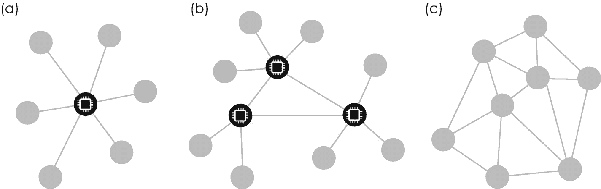
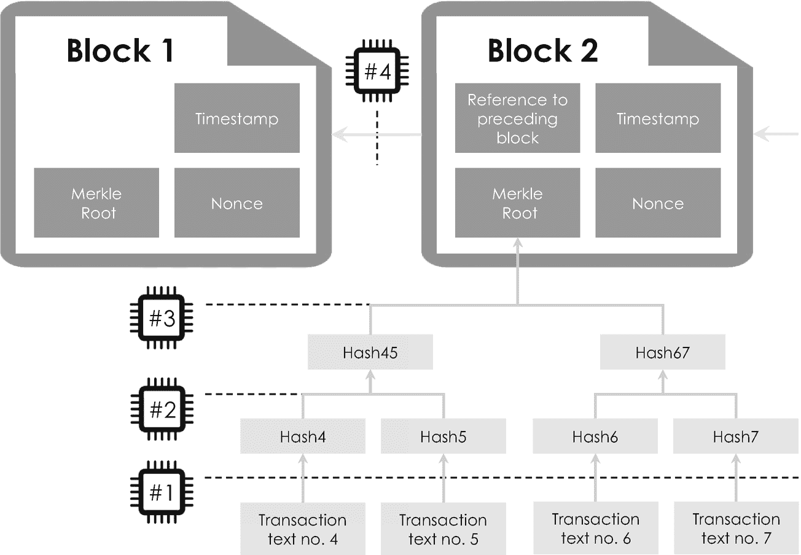
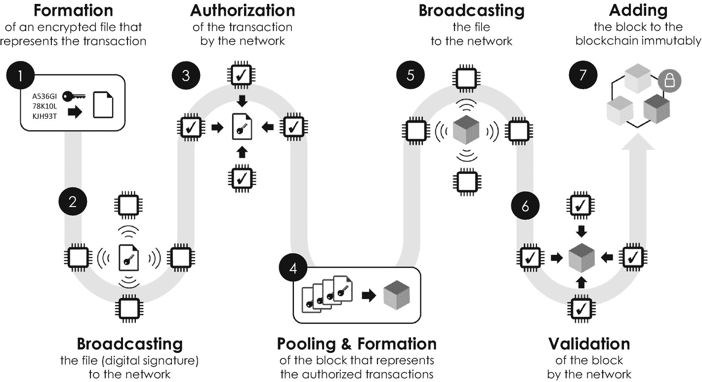
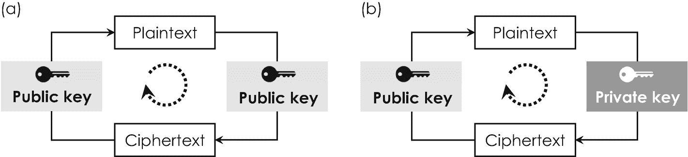
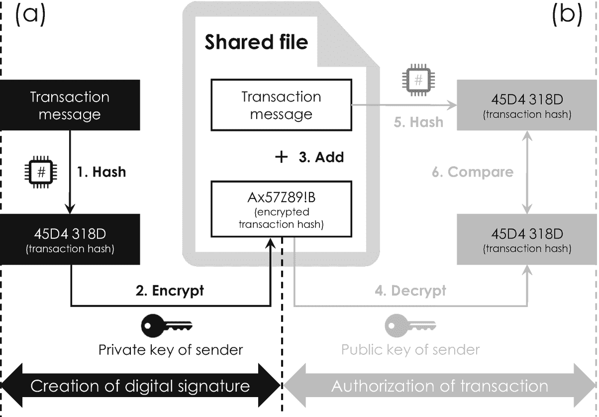
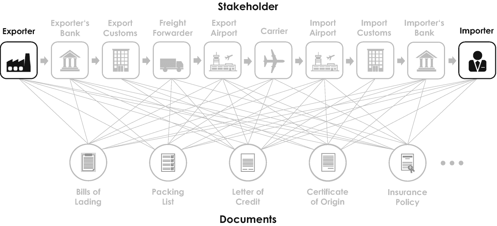

# 3.区块链技术

合同和交易是我们现代社会的核心。他们的纸质和数字记录通过设置相关的监管边界，定义了我们的行政、经济、法律、政治和社会系统中最重要的结构。它们管理着世界范围内的国家、公共和私人组织、社区和个人之间的互动。这就是为什么他们经常遭受数字滥用和欺诈，这就是为什么网络安全在数字时代比以往任何时候都更重要。区块链技术有望在这一背景下发挥至关重要的作用，因为它可能会像互联网对数据访问和交换一样，对数据完整性和记录产生破坏性影响。

就其公开采用而言，区块链技术与 TCP/IP 或“传输控制协议/互联网协议”有几个相似之处，这是互联网最重要的使能技术之一。在 TCP/IP 出现之前，电路交换是我们电信架构的基础，在这种架构中，双方之间的连接必须通过手动将插头插入电话交换机上的适当插座来建立。因此，电信服务提供商多年来在大型企业和私人家庭之间的通信设备和专用(私人)线路上投资了数十亿美元。

随着 TCP/IP 协议的引入，通信行为开始完全改变。TCP/IP 协议于 1972 年推出，支持通过电子邮件进行双向信息传递，并以标准化数据格式交换数字信息。就像支持 TCP/IP 的双边消息传递一样，区块链技术支持双边交易和价值转移。这两种协议都是开放的、分布式的和共享的网络，没有任何中央管理机构负责其维护和改进。此外，这两种技术在被广泛采用之前，首先在一个热情但规模较小的研究人员和软件开发人员群体中流行起来。TCP/IP 通过降低(双边)连接和通信的成本释放了新的经济价值，而区块链技术可以极大地降低交易成本，我们将在本章中看到这一点。例如，法国商业咨询公司凯捷(Capgemini)估计，通过使用区块链的应用，消费者可以节省高达 160 亿美元的银行和保险费用。

区块链技术的起源与*比特币*密不可分，比特币是第一种加密保护的数字货币或*加密货币*，也是迄今为止区块链技术最受欢迎的应用 [3](#Par205) 。但在 2017 年围绕比特币 [1](#Fn1) 的最初炒作之后不久——美国传奇投资者沃伦·巴菲特曾将比特币称为“赌博工具”[5](#Par207)——人们意识到区块链不仅仅是数字货币的推动者。他们意识到，它可以应用于包括金融服务、汽车和医疗保健行业在内的各种行业。

这一章讲述了比特币背后的这一令人着迷的促成因素，它同时也成为了数字化转型的一项宝贵支持技术，因为它分别为公共和私营部门开辟了新的政府机遇并创造了新的商业模式。本章介绍区块链技术及其主要原理和概念。我们将了解区块链技术及其分布式网络架构如何在不受信任的环境中实现涉及货币或其他可交易资产的加密安全交易和转移。在这种背景下，我们将探索区块链的基本和不变的数据结构，以更好地理解比特币交易生命周期。我们还将讨论这种数据结构的非常巧妙的扩展，它通过智能契约实现了业务流程的自动化。之后，我们将探索当前最流行的商业应用，了解区块链技术的未来前景及其对工业、政府和社会的影响。本章将让你深刻理解区块链技术是如何工作的，它可以应用于什么样的用例，以及哪些应用不太适合这种数字技术。在本章的最后——与所有其他章节一样——我将为您提供一个易于使用的区块链技术框架，以确定区块链技术是否可以应用到您自己的用例或业务理念中。

## 3.1 设置区块链场景

区块链科技的崛起始于一个经久不衰的谜。2008 年，在全球金融危机最严重的时候，中本聪发表了一篇革命性的论文，他向一个关于密码学的邮件列表分发了一封电子邮件，主题是“比特币 P2P 电子现金论文”据称，他对全球银行体系不再抱有幻想，他在电子邮件中解释说，他被“[...]致力于一种完全对等的、没有可信第三方的新电子现金系统”，并于 [`www.bitcoin.org`](http://www.bitcoin.org) [ [6](#Par208) 上传了各自的白皮书。这本书很快引起了极大的关注，在接下来的几个月和几年里，人们试图找到更多关于这位日语作者的信息。然而，到目前为止，他们的尝试仍然没有成功，比特币的创造者的身份，包括底层的区块链技术，至今仍然未知。

在这篇开创性的文章发表大约两个月后，2009 年 1 月 3 日，中本聪创造了第一枚比特币，比特币网络正式诞生。 [3](#Fn3) 中本聪与美国软件开发商哈尔·芬尼的第一笔比特币交易是在 9 天后进行的。2009 年 10 月 5 日，一枚比特币(货币代码:BTC)与一美元的汇率首次确定，仅为 1 BTC = 0.00076 美元。在 2017 年底比特币炒作的高峰期，汇率上涨了 260，000%以上，接近 1 BTC = 20，000 美元——这是一个真正显著的上涨和投机炒作。但在我们深入研究这项革命性技术之前，总结一下货币和交易在历史上对社会的重要作用是有启发性的。

### 3.1.1 交易和货币在历史上的作用

在社会中交易和交换商品的需求自然出现，主要是由于地方和地理的差异。例如，鱼类在沿海地区非常丰富，而在中部地区却很少。另一方面，中部地区为种植谷物提供了广阔的土地，而这在沿海地区是罕见的。在海岸和中部之间交换鱼和谷物只是交换商品的一个例子——人们总是想要他们没有的东西。一般来说，任何剩余产品都是交易的理想选择，这就是为什么在青铜时代早期就已经出现了物物交换交易。当时，人们开始使用谷物、动物毛皮、干鱼、牛、盐和其他天然材料进行日常交易。这种特殊类型的“货币”现在被称为*原始货币*，因为它通常具有即时价值，可以直接用于吃饭和其他目的，如表 [3-1](#Tab1) 所示。公元前 350 年，希腊哲学家兼博学家亚里士多德在他著名的著作《政治》中已经认为，物体总是满足两个目的:一个是设计和制造物体的最初目的，另一个是作为物品出售或交换。非常引人注目的是，这种原始货币的改良版本甚至延续到了罗马帝国，罗马帝国有时用盐作为食物的重要防腐剂来支付士兵的工资。这种支付是由拉丁词 *salarius* 所指，意思是“属于盐”，后来产生了现代英语术语“薪水”。

除了具有直接价值的自然物，人们偶尔开始使用其他稀有物品进行交易，例如珍珠。这些小型海洋贝壳很快就变得非常受欢迎，因为它们非常坚硬、方便，而且最重要的是不会腐烂。出于同样的原因，与所有其他材料相比，人们开始使用包括金、银和青铜在内的金属。金属有两个主要优点:(1)由于稀有，它们本身具有内在价值，(2)它们可以很容易地铸造成基本商品，如箭头和其他用于狩猎和自卫的工具。公元前 800 年，生活在今天土耳其地区的吕底亚人引入了一种原始版本的金属硬币，最初仅用于礼物、奖励和祭祀。但是这种想法很快在地中海地区传播开来，人们也开始使用这些硬币进行交易，希腊人是第一个大规模使用硬币进行日常交易的国家。包括雅典和科林斯在内的古希腊城邦很快开始铸造自己的硬币，如德拉克马。硬币相对来说很难制造，但是对于日常交易来说非常方便。然而，在中世纪，由于它们的重量和体积，它们的重量越来越多地限制了它们用于远距离交易大量商品的用途。这就是为什么意大利中部著名的中世纪贸易城市，包括热那亚、威尼斯和佛罗伦萨，生产装饰华丽的金币，如黄金弗洛林，价值高得多，更适合长途交易。任何硬币价值的最终衡量标准始终是其最终的贵金属含量，这是由发行主权国，如政府或上述贸易城市确定的。

表 3-1

历史上的货币种类

<colgroup><col class="tcol1 align-left"> <col class="tcol2 align-left"> <col class="tcol3 align-left"></colgroup> 
| 

类型

 | 

出现

 | 

优点(+)和缺点()

 |
| --- | --- | --- |
| 原始货币 | 前基督教 | +本身立即可用–难以确定价值，不太方便，部分容易腐烂 |
| 贵金属 | 青铜器时代。参见 COPPER AGE | +不易损坏，可铸造成基本工具，因稀有而价值稳定–难以成型和铸造，不太方便 |
| 大发其财 | 8 世纪 | +非常方便，不易损坏，由于原材料稀有，价值稳定–体积庞大，易遭抢劫 |
| 钞票 | 11 世纪 | +非常方便，可通过打印轻松扩展–没有内在价值，易受通货膨胀、抢劫和欺诈的影响 |
| 账面资金 | 14 世纪 | +非常方便，容易和安全的存储，简单的货币交易–只是虚拟存在，没有内在价值，没有商品支持，容易受到欺诈 |
| 法定货币 | 20 世纪 | +简单的货币交易，由于加密而安全的交易，货币政策由中央银行及其“官方法定货币”确定–只是虚拟存在，没有内在价值，没有商品支持 |
| 加密货币 | 二十一世纪 | +非常简单的货币交易，由于加密而非常安全的交易，有利于小额支付的成本效率，开放网络的自我调节政策，无中介的转移–由于缺乏监管机构，无法控制通货膨胀，只是虚拟存在，没有内在价值，没有商品支持 |

非常有趣的是，在过去的一千年里，人们只开采了大约 163，000 吨黄金，这仅仅相当于一个边长约 20 米的立方体——这也是为什么黄金仍然被认为是抗衰退货币的主要原因之一，正如我们在 2008 年金融危机和 2020/21 年全球新冠肺炎疫情中看到的那样。

随着越来越多的人开始使用硬币进行交易，硬币的供应越来越短缺。由于这种短缺，卖方开始允许买方延期付款，这通常是由汇票证明。从 11 世纪的中国开始，随后不久在欧洲，这种票据越来越多地被接受为一种支付形式，纸币的概念由此诞生。纸币非常方便，在短缺的情况下很容易扩散。但由于它实际上是第一种没有任何内在价值的货币，纸币容易受到剧烈通货膨胀的影响。这就是为什么它在 14 世纪被“T2”账面货币“T3”广泛取代，这是一种非物质货币，只作为数字存在于实体账本或账户中。我们今天交易中最常用的货币被称为*法定货币*，这是一种政府发行的货币，没有商品支持，如黄金和其他具有内在价值的材料。相反，法定货币的价值由各自国家的中央银行控制，中央银行是一个政府机构，发行该国的官方货币，并通过增加或限制其供应量来控制其价值和通货膨胀。

### 3.1.2 货币在社会中的基本功能

这个简短的历史借口揭示了货币的主要目的——在更抽象的层面上——是使双方能够进行*值得信赖的有价值资产的交易*,而不管他们是否信任对方。换句话说，货币通常在社会中发挥以下四种重要功能:

1.  *价值转移手段*:为交换商品和劳动力而支付

2.  *记账单位*:计量商品和劳动力的价值

3.  *价值储存*:为未来开支存钱(所谓的“储备”)

4.  *资金来源*:投资于经济和商业发展

印度创新战略家和区块链倡导者 Kariappa Bheemaiah 在他的畅销书《区块链替代方案:重新思考宏观经济政策和经济理论》中称金钱为“社会中信任的物理表现”。我们将在下文中看到，正是这种在不可信环境中的信任扩散实现了价值转移——其中“价值”可以是从知识产权或所有权到比特币等任何东西——因此是区块链技术的核心。因此，让我们更深入地研究区块链，它的关键概念和应用。

## 3.2 区块链基础知识

区块链技术和数字货币是所谓的分布式账本技术的两个最重要的应用。分布式分类账是一种在线数据库或登记簿，其信息分布在计算机和其他电子设备的大型网络中。分类账，作为簿记的一种形式，在古代已经被用来记录和证明涉及金钱或其他实物资产的交易。它是一种永久性的摘要，按日期列出每笔交易，并记录从一方转移到另一方的特定金额，如金额。虽然分类账的中心思想和目的保持不变，但随着时间的推移，它们的物理实现从青铜时代的泥板 [4](#Fn4) 到中世纪的纸质登记簿，再到数字时代的电子记录。

我们所熟悉的大多数分类账，如土地登记册，都依赖于一个中央机构。在这种情况下，土地登记办公室操作一台中央计算机或*服务器*，使登记册中保存的信息可供网络的所有其他用户或*客户*访问，包括区域土地登记处和其他相关政府机构。土地登记是所谓的*集中式分类账*的一个例子，其中所有参与者被安排在*客户端-服务器网络*中，服务器充当单一控制机构，操作和控制整个网络，类似于政府主权发行货币。因此，网络的所有用户都依赖于单个主服务器，如图 [3-1](#Fig1) (a)所示。到目前为止，集中式分类账是提供在线服务的最常见的网络，这就是为什么它们被包括亚马逊和易贝在内的各种组织所使用。如果没有加密算法和备份服务器的保护，集中式分类帐通常非常容易受到网络攻击，因为黑客只需要攻击和改变由中央服务器保存的分类帐文件，以便例如改变所有权记录或改变账户余额。

图 3-1

由不同计算机组成的网络通常可以安排为三种不同的配置:(A)集中式网络有一个中心节点(带计算机图标的黑色圆圈),它位于网络的中心，并连接(虚线)到所有其他节点(灰色圆圈)。(b)分散式网络具有各种中心节点，每个中心节点都连接到一些其他节点。(c)在分布式网络中，每个节点具有平等的权利，并且连接到所有其他节点或一组其他节点。这种配置用于实现区块链

### 3.2.1 权力下放和信任的到来

分布式分类账揭示了一个完全不同的网络架构。它们是一种特殊的数字账本，其中的记录不是由一台中央的、可能被黑客入侵的计算机或服务器保存，而是分布在一个巨大的*分布式网络* *中。* [5](#Fn5) 该网络包含不同地点的各种计算机或*节点*，由不同的机关和机构操作，如图 [3-1](#Fig1) (c)所示。这种网络通常包含所谓的*全节点*。他们专门运行网络的底层操作软件，即所谓的*网络协议*，以确保网络上共享的所有信息都符合特定的安全标准、数据格式和块大小等。为了增加其可访问性，不同的节点通常通过互联网连接(而不是通过刚性网络电缆)，这就是为什么它们在文献中也被称为*对等网络*或 P2P。

由于每个节点复制分类帐文件并保持相同的副本，所以在分布式网络中不再需要中央服务器(或机构),这实际上是分布式分类帐技术的最重要和同样开创性的特征。因此，分类帐中保存的信息的任何合法更改都会通过网络传播，并反映在所有分散的副本中。因此，分布式分类账通过其固有的去中心化特性维护了交易的安全性、可追溯性和准确性，因为每个节点都充当了信任的看门人。当与最先进的加密算法相结合时，可以安全地实现分布式网络中的信息交换，并且可以单独控制每个节点的访问权限。换句话说，分布式账本技术允许既不认识也不信任彼此的人们在没有任何集中媒介的情况下相互交换，因为他们可以信任网络本身。从经济学家的角度来看，这极大地降低了“信任成本”，并可能有助于减轻我们的社会对银行、政府机构、公证人和其他监管合规官员的长期依赖。尤其是分布式账本和区块链技术，为信息的收集和共享提供了一个全新的范例。通过省去中间人，区块链科技准备好要彻底改变个人、企业和政府之间的交易方式。

Distributed Networks

与集中式网络相比，分布式网络通过一个广泛的计算机网络传播信息。不需要中央服务器或中介机构，因为网络中的每台计算机同时是中央服务器和客户端。

### 3.2.2 不可变数据结构

但是，保存在区块链文件中的信息是如何结构化的，它如何在不可信的环境中提供信任？区块链技术根据其底层网络协议中的技术规范，将有关交易的数据和信息捆绑在固定大小和数据格式的标准化*块*中。

表 3-2

基于 SHA-1 散列函数的示例性交易消息的散列值。两者之间的比较表明，即使输入(粗体文本)的微小变化也会导致输出的重大变化。为了清楚起见，在输出中插入了空格和换行符。使用 [`www.blockchain-basics.com/HashFunctions.html`](http://www.blockchain-basics.com/HashFunctions.html) 上的公共哈希函数生成器生成输出

<colgroup><col class="tcol1 align-left"> <col class="tcol2 align-left"> <col class="tcol3 align-left"></colgroup> 
| 

线条

 | 

消息(输入)

 | 

消息散列(输出)

 |
| --- | --- | --- |
| 1. | 从:Alice (1PrsFtga)，到:Bop (3kLMnbTY)，金额:USD **10** | ed 83 1 EC 2b 307 c 014 adba 2 e 10 670 f cd7 f24 d0 9 e 77 |
| 2. | 从:Alice (1PrsFtga)，到:Bop (3kLMnbTY)，金额:USD **100** | S7-1200 可编程控制器 |

这些块本身通过使用*加密散列函数*与前面的块“链接”或链接在一起。

但是，在我们更仔细地研究这种特殊的联系之前，理解加密散列函数的一些基本属性是有益的。像任何其他数学函数一样，它们有输入和输出值。输入由实际的交易文本组成，例如“From: Alice (1PrsFtga)，To: Bop (3kLMnbTY)，Amount: USD 10”，它记录 Alice 已经将 USD 10 从她的账号 1PrsFtga 转移到 Bop 的账号 3kLMnbTY。在加密散列函数的情况下，每个交易实体的个人账号被称为*公钥*，并且由数字和字母组成，其原因将在后面变得明显。最流行的散列函数之一是安全散列算法-1 或 *SHA-1* ，它是由美国国家标准与技术研究所和美国国家安全局在 1993 年联合开发的，用于实现数字签名。 [6](#Fn6) 像任何其他哈希函数一样，SHA-1 将任意长度的明文中的任何信息转换为固定长度的字母和数字的字符串——在 SHA-1 的情况下，输出值总是显示总共 40 个符号。

除了将任意长度的输入转换为固定长度的输出，加密哈希函数还有另一个显著的特性:即使输入值的微小变化也会导致输出的重大变化，如示例性的表 [3-2](#Tab2) 所示。加密哈希函数通常具有以下非常重要的属性。他们是

*   *伪随机*，即如果输入变化T3】7T5】则输出发生不可预测的变化

*   *确定性*，即输入决定输出

*   *不可逆*因此输入不能基于输出来构造

*   *唯一*(或“抗冲突”)，即每个输入都有一个唯一的哈希值，相同的输入将有相同的输出 [8](#Fn8)

因为输出总是具有固定长度并且是唯一的，所以加密散列函数为确定两个数字对象是否相等提供了理想且非常有效的技术。

Cryptographic Hash Function

加密哈希函数是一种算法函数，可以将任何信息(例如任意长度的文本消息)转换为一串数字和字母。它的核心属性之一是输出字符串的长度是固定的，并且总是相同的，与输入信息的长度无关。此外，加密散列函数的输出是(1)伪随机的，(2)确定性的，(3)不可逆的，以及(4)唯一的，即，不同的输入将总是具有不同的输出。

加密哈希函数对于构造区块链的单个块以及将它们链接到一个大的区块链文件都是至关重要的。这个过程是基于将它们迭代地应用于交易消息，并将产生的输出值排列在一个称为 *Merkle tree* 的特殊数据结构中，这是为了纪念美国计算机科学家 Ralph Merkle，他在 1988 年将它们开发用于数字签名[ [10](#Par212) ]。Merkle 树是一种分层结构，通常表现为倒置的树，交易消息位于底层，如图 [3-2](#Fig2) 所示。在这个特殊的例子中，块二包含其最低层的四个交易——一个典型的比特币块通常总共包含大约 500 个交易。出于显而易见的原因，通过在被称为*散列*的过程中将加密散列函数应用于每个交易的明文，来建立该示例性 Merkle 树的第二层。结果由哈希 4、哈希 5、哈希 6 和哈希 7 表示。

图 3-2

区块链的示例部分的整体数据结构。标题中包含的信息以深灰色突出显示——区块 1 是区块链的起源区块，第一个没有任何前一个参考的区块。“块 2”的 Merkle 根对应于包含关于该块的所有事务的信息的 Merkle 树的散列值。灰色箭头表示散列函数(微处理器图标)在标记为“#1”到“#4”(虚线)的四个不同级别上的连续应用

通过再次应用该算法函数来创建第三层。但是这一次，它不是应用于每个事务消息的明文，而是应用于组合成一个字符串的一对散列事务消息，即分别是 Hash4 和 Hash5 以及 Hash6 和 Hash7。结果输出以相同的符号标记为 Hash45 和 Hash67。当产生整个 Merkle 树的单个散列时，也就是说，在手头的例子中，通过将 Hash45 和 Hash67 一起散列，该过程最终终止。Merkle 树顶部的这个最后的散列被称为 *Merkle 根*，它间接地包含了所有事务的信息。

Merkle Tree

Merkle 树是一种类似树的数据结构，它允许不同散列值和事务消息的组合和加密链接。

Merkle root 是每个块的所谓的*报头*的最重要组成部分之一，该报头是提供每个块的唯一事务摘要的信息标签或元数据类型 [9](#Fn9) 。块的标题通常包含以下部分:

*   间接包含块的整个事务历史的 Merkle root 。

*   *参考*前一个块的编号。

*   *时间戳*，记录块的创建时间，并由网络中的其他客户端检查其安全性。

*   *Nonce* (表示“只使用一次的数字”)，一个 32 位二进制数，它“归一化”块的哈希值，以确保它低于某个目标值。这个数字在交易过程中起着至关重要的作用，这将在下一节中讨论。

Blockchain

区块链技术是一种创新的工具，用于通过加密保护的账本或数据库安全地存储和共享各种数字信息。数据只能添加到分类帐，既不能更改也不能删除。信息被组织成一串数据块，分布在一个大型节点(计算机)网络中。每个节点通过保存区块链文件的相同副本来充当信任的看门人，这就是为什么区块链技术也被称为分布式账本技术。

有了这四个组件，我们现在可以通过再次应用加密哈希函数来完成我们的区块链。为此，我们将报头的所有组成部分组合成一个字符串，然后对其进行哈希处理。因此，区块链的一个块最后就是一串数字和字母，对应于头文件中不同部分的哈希值。由于每个块的头还包含对其前一块的引用，散列函数的这一最后应用将所有块不变地链接在一起，并完成区块链的形成。图 [3-2](#Fig2) 中的区块 1 没有引用任何前面的区块，因为它是我们的示例性区块链的第一个区块，即所谓的*创世纪区块*。为此，一个问题仍然存在:这样一个具有复杂数据结构的区块链如何被用于在区块链网络中的双方之间交换价值？这是下一节的重点。

### 3.2.3 数字值传输

但是，在我们讨论区块链交易生命周期之前，简要概述一下今天的货币交易是如何组织起来进行比较的，这是有益的。假设您想通过传统的国际 SWIFT [10](#Fn10) 交易从您在德国的银行账户向您在美国的朋友的银行账户转账 100 欧元。该交易过程通常分为六个主要步骤:

1.  首先，您将登录您的在线银行帐户，点击“转账”，然后系统会要求您输入交易详情，如收款人朋友的姓名、他们的国际银行账号或“IBAN”，以及要转账的金额。此外，您需要通过输入某个(手机)交易号码或 TAN 来授权和验证此交易。

2.  成功通过验证后，您的主银行(“借方银行”)会将资金汇至一家德国代理行，该代理行已与一家国际清算银行签订了双边业务协议。

3.  然后，您的代理行会将资金转给国际清算银行，国际清算银行会根据当天的官方汇率将 100 欧元兑换成 110 美元。

4.  国际清算银行会把钱转到美国的代理银行。

5.  美国代理行会把钱转到你朋友作为收款人的主银行(“债权银行”)，交易最终完成。

图 3-3

区块链事务生命周期由七个步骤组成(带编号的圆圈，黑色):(1)形成包含事务消息的加密文件，(2)将文件广播到网络节点(微处理器图标)，(3)网络对事务的授权，(4)汇集多个授权事务并形成一个块，(5)将块广播到节点，(6)网络通过一致算法验证块，以及(7)将块添加到区块链不变性中

您可能已经注意到，这个过程涉及五家不同的银行，相当复杂。此外，国际交易通常显示相对较高的交易费用，完成交易需要不同的时间。以区块链为基地的价值转移更加容易和快捷。虽然我们现在将在货币环境中讨论这种价值交易过程，但重要的是要记住，相同的方案适用于任何其他类型的价值转移，包括知识产权和其他有价值的数字资产。

区块链交易生命周期通常分为七个步骤，如图 [3-3](#Fig3) 所示。让我们假设你想给你的美国朋友鲍勃·BTC 寄 10 英镑——事实上这是一笔相当可观的钱，因为 2020 年 9 月的汇率大约是 1 BTC = 10，500 美元。从表 [3-2](#Tab2) 中，我们知道各个交易报文的明文可能是“发件人姓名(他的私钥)，收件人姓名(他的私钥)，金额:BTC 10。”比特币交易过程始于一个加密文件的形成，即所谓的*数字签名*，它包含了你的交易信息的散列。将此文件广播到网络后，您的交易在第三步中由网络的一个节点授权——关于此特定步骤的更多细节将在下一节中更详细地描述，为清楚起见，此处不予考虑。由于每个块包含不止一个事务以提高效率，您的事务消息最有可能被缓冲在一个等待池中，即所谓的 *mempool* ，它在将授权的事务组装到 Merkle 树之前收集这些事务。一旦池化完成， [11](#Fn11) 整个 Merkle 树将通过如前所述迭代地应用加密散列函数来创建。此外，所有其他组件都被添加到块的头部，最终创建了包含您的事务消息的块。然后，在区块链事务生命周期的第五步中，该块被广播到网络。第六步是整个交易过程中最重要的步骤之一。它是关于在网络内就块的有效性达成共识。这种验证是基于解决一个计算难题，在比特币区块链的情况下，所谓的*工作证明*，我们将在下文中更详细地研究。一旦该难题被其中一个节点解决，该解决方案被广播到网络，并且该块被分类为已验证，并且最终被不变地添加到区块链中。网络进行自我更新，在最后一步，最新的、一致同意的分类帐版本被分别保存在每个节点上。

这个概述给你一个关于整个区块链事务生命周期的初步印象。为此，需要注意的是，所有这些都是在几分钟内自动发生的，不需要任何第三方中介——您可能还记得，通过 SWIFT 进行的传统银行交易涉及五家以上的银行，总共可能需要不同的时间。事实上，这是传统 SWIFT 和基于区块链的(货币)价值转移之间最重要的区别。由于没有任何第三方中介，区块链交易流程大大降低了交易速度和成本。

我们对区块链事务生命周期的简短讨论揭示了两个步骤对区块链的安全工作特别重要:(1)事务授权和(2)通过工作证明验证块，即图 [3-3](#Fig3) 中的步骤三和步骤六。这两个步骤将在下面两个小节中详细讨论。

### 3.2.4 通过数字签名授权交易

数字签名在整个交易生命周期中起着至关重要的作用，因为它允许我们(1)明确地识别用户及其帐户，以确保提交的交易是以他们的名义进行的，以及(2)授权交易，以确保提交新交易的用户确实是要转移的相应信息或资产的合法所有者。第一个功能相当于你在一份法律合同下的签名，比如一份房屋销售协议，第二步相当于当前例子中由公证人进行的司法验证。这两个功能对于保证整个区块链的完整性和防止未经授权的访问和滥用都特别重要，因为其开放的 P2P 架构通常允许任何人登录、访问和添加新的交易数据。

创建数字签名的特殊概念可以追溯到美国密码学的先驱 Ralph Merkle——我们从 Merkle trees 中知道的科学家——以及他在密码学和加密数字签名方面的开创性工作。但是，在我们详细讨论数字签名及其用法之前，先讨论一些密码学的基本术语和概念会有所启发。加密通常包括三个主要步骤，即

1.  (交易)消息的加密

2.  加密(交易)消息的传输

3.  合法接收者对传输的(交易)消息进行解密

加密数据也被称为*密文*，指的是一串难以理解的字母和数字，对于没有正确“秘方”来解密它的人或计算机来说毫无意义。这个“秘方”被称为*密钥*，它本质上是一串字母和数字，决定了如何将信息的明文转换成密文。换句话说，在与另一方交换明文消息之前，加密密钥确定用于加密明文消息的加密算法的输出。

加密和解密既可以依赖对称密钥，也可以依赖非对称密钥，每种密钥都有一定的优缺点。*对称加密*方案基于一个密钥，该密钥既可用于发送方对明文的加密，也可用于接收方对相应密文的解密，如图 [3-4](#Fig4) (a)所示。这种加密方案很容易实现，但也很容易被破解，因为任何人通过窃取密钥或截取通信信道获得密钥，都可以轻易地解密消息。

图 3-4

对称加密方案(a)和非对称加密方案(b)之间的比较。在对称加密算法的情况下，公钥用于明文的加密和密文的解密。非对称加密方案使用两个独立的密钥，用于加密的私钥和用于解密的公钥

这就是为什么随着时间的推移，更复杂的加密方案被开发出来，其中*非对称加密*(也称为*公钥加密*)是最流行和最广泛使用的一种。它也是实现防篡改区块链和各种网络安全应用选择方案的关键要素，如 2.3.2 节中介绍的 RSA 算法 [12](#Fn12) 。与对称加密方案相反，非对称加密采用两种不同的密钥，仅用于其所有者的*私钥*和在网络上分发的相应的*公钥*。不涉及任何细节——对非对称加密的详细理解实际上需要非常高级的数学概念，例如非线性椭圆曲线——两个密钥被认为是*互补的*,这意味着它们只能在一个方向上组合使用，如图 [3-4](#Fig4) (b)所示。例如，用公钥加密的明文只能用其互补的私钥解密。互补密钥对通常有两种使用方式:

1.  *私对公*交易——如图 [3-4](#Fig4) (b)所示——发送者使用他的*私钥加密*他的消息。然后，消息被发送给接收者，接收者可以使用互补的公钥对其进行解密。这种方法不保护消息不被读取，但是允许接收者验证发送者的身份，因为加密的消息只能通过使用合法发送者的公钥来解密。

2.  *公共对私人*交易——图 [3-4](#Fig4) 中未显示——发送方使用*接收方的公钥加密*其信息。然后，接收者可以相应地使用自己的私钥对其进行解密。与第一应用选项相反，这种方法保护消息不被泄露，因为已经由特定公钥加密的数据只能通过使用目标接收者拥有的补充私钥来解密。

区块链网络中用于授权交易的数字签名是基于非对称的私人对公共加密方案。它通过图 [3-5](#Fig5) (a)所示的三个步骤创建:(1)对实际交易消息进行哈希处理，(2)使用发送方的私钥对哈希处理后的交易消息进行加密，(3)通过将加密的交易哈希添加到交易消息的明文中，最终创建数字签名。该数字签名然后在网络上分发。一个节点将随机选取它，并通过执行图 [3-5](#Fig5) (b)中描述的以下三个步骤来授权交易:(4)通过使用发送者的公钥来解密交易散列，(5)散列包含在文件中的交易消息，以及(6)将两个结果相互比较。如果两个结果相同，该节点可以推断

*   消息确实由发送者签名，因为数字签名可以通过使用发送者的公钥成功解密。

*   包含在数字签名中的事务消息是正确的，因为解密的事务散列与授权节点独立生成的事务散列相匹配。

如果这种比较没有揭示相同的结果，则交易没有被网络授权，并且相应的交易被识别为欺诈性的，并且不被转发到 mempool 中。您可能已经注意到，只有私钥最终得到保密，才能避免欺诈性交易。一旦它被恶意第三方窃取，欺诈和非法交易就无法避免，这就是为什么私钥的存储在区块链生态系统中起着非常关键的作用。

所谓的*钱包*通常有助于存储用户的私钥。钱包是一种软件或硬件，它通过向区块链网络提供一个易于使用的网关，允许用户访问区块链网络并授权交易。钱包可以在一台始终在线并连接的计算机上实现，也可以在一台永久离线并与区块链网络断开的计算机上实现。在线钱包也被称为*热门钱包*，因为它们——由于联网——总是暴露在黑客和其他恶意用户面前。出于同样的原因，离线钱包被称为*冷钱包*，主要用于在一些离线设备上安全地存储用户的私钥。最简单也同样不安全的冷钱包是纸钱包，你把你的私人钥匙写在一张纸上。根据你的记忆技能，最安全的钱包之一是*大脑钱包*，它指的是记住你的私人钥匙而不写下来。

图 3-5

使用数字签名对交易进行授权。(a)显示如何创建数字签名，而(b)描述如何使用它来授权交易。这种授权是基于将直接从事务散列中获得的散列值与已经在网络上共享的文件的解密进行比较

在选择最合适的钱包来存储您的私钥时，请务必记住，私钥是访问区块链的唯一途径。换句话说，丢失您的私钥意味着您被永久锁定在区块链之外，并且存储的关于您的所有信息都将无法挽回地丢失，因为没有办法重置或重新创建私钥。例如，大多数用于访问比特币区块链的私钥都存储在托管钱包服务、加密货币交易所和比特币交易商(如多资产经纪商 eToro)提供的热钱包中。

### 3.2.5 通过共识和挖掘部署信任

除了交易授权之外，块验证是在区块链网络中部署信任的另一个典型过程。在比特币区块链的情况下，区块的验证是基于解决一个被称为工作证明的计算难题。这种工作证明属于更广泛的类别*共识算法*，通常支持对分布式网络的集体控制。

Mining

挖掘是指通过解决被称为“工作证明”的计算难题来找到有效块的过程例如，它消除了涉及花两次钱的欺诈交易。

1982 年拜占庭将军们的问题第一次说明了在缺乏任何中央、中间权威来调节不同党派之间的协议交换的情况下，需要这样一种算法[*]T2 13。这个著名的思想实验是关于一群军队将领，他们领导着拜占庭军队在空间上分离的部分，并计划攻击一个设防的城市。他们知道成功的唯一方法是同时协同攻城。那么，如果一名或多名将军是叛徒，或者传达误导或矛盾的信息，他们如何就联合攻击的时机达成一致？类似于分布式网络，将军可以与节点相关联，信使可以与不同节点之间的链接相关联。Miguel Castro 和 Barbara Liskov 从理论上解决了拜占庭将军的问题，他们在 1999 年提出了“实用的拜占庭容错”算法[ [14](#Par216) ]。十年后，匿名的中本聪发明了比特币区块链和它的工作证明原理，第一次实现了它。这种可行的共识算法的实现实际上是区块链技术的关键创新之一。*

工作证明是一个反复试错的过程，在这个过程中，作为自由变量的块报头中的 nonce 值被顺序地改变，直到块的散列值最终低于由底层网络协议定义的设想的目标值。 [13](#Fn13) 这个寻找有效随机数值的过程被称为*挖掘*，类似于电脑游戏 Pitmen 及其“挖掘黄金或宝石”通过挖掘解决计算难题使网络能够实现对所有交易的集体控制，因为它提供了一种共同判断交易是允许的还是欺诈的途径——这种方法也是传奇的拜占庭将军所需要的。

在这种情况下，欺诈是指区块链网络的恶意用户——类似于拜占庭叛徒——试图通过在两次单独的交易中使用相同的价值(比特币)转移两次。这种尝试通常被称为*双花费*攻击。虽然挖矿减少了欺诈交易的动机，但如果攻击者获取了超过 51%的挖矿权来强制和逆转交易，理论上仍然可能出现双重支出。好消息是，比特币和区块链技术为这种 *51%攻击*提供了一种非常有效的解决方案，它基于以下两种对策的结合:

*   *增加难度*:*难度*是测量找到解决计算难题的随机数值的可能性(或概率)的参数。由于比特币是一个开放的网络，任何人都可以加入，它吸引了越来越多的用户，他们可能会将自己的计算能力加入更具成本效益和高度专业化的*矿池*。这样的矿池可能偶尔会占领超过 51%的矿力，这使得它们理论上可以进行 51%的攻击。为了避免这个问题，随着越来越多的用户加入网络，通过增加计算难题的难度来频繁地重新平衡网络。特别是比特币协议，每 2016 块增加一个难度，目前对应的是两周左右。

*   *引入采矿奖励*:引入*采矿奖励*是避免犯罪企图的第二个对策。他们通过奖励首先用新生成或铸造的比特币解决计算证明难题的节点操作员来激励诚实的行为。鉴于自动增加的难度，这种采矿奖励使使用 51%以上的采矿能力诚实采矿和赚取比特币比试图欺骗系统更有利可图。从历史上看，激励采矿奖励也吸引了早期采用者，这有助于比特币在开始时达到临界质量，并利用*网络效应。* [14](#Fn14)

为了完整起见，需要注意的是，工作证明并不是通常可用于实施定制区块链的唯一共识机制。另一个被称为*利害关系证明*并且基于网络的一个节点或用户在系统中有如此大的利害关系以至于它使得恶意方的任何攻击都没有希望的想法。*耗时证明*是另一种共识算法，目前由芯片制造商英特尔开发，例如，他们旨在通过使用放置在 CPU 本身内的安全指令来达成共识——相应的产品被称为英特尔 SGX，用于“软件保护扩展” [15](#Par217) 。

### 智能商业合同

区块链技术有一个特别有趣的功能，到目前为止我们还没有讨论，但它有很大的应用前景。此功能与大多数业务关系的核心合同相关，例如房屋销售合同或汽车租赁合同。正如我们在本章的介绍部分所了解到的，早期的贸易和易货贸易规则在古代就已经存在了。现代合同法在 1750 年工业革命期间开始出现，当时越来越多的工厂工人需要一种更正式的方法来规范现金工资、工作条件和安全标准。迄今为止，法律合同是所有商业关系和交易的组成部分。合同是双方或多方之间具有法律约束力和可执行性的协议，承认协议各方的权利和义务。它们通常涉及任何类型的(货币)价值转移，一旦达成协议的目的，就授权进行这种转移。

区块链技术允许通过实现“自动化合同”来自动化这种价值转移。这些合同被称为*智能合同* [ [16](#Par218) ]，一旦区块链网络在一致完成合同条件后达成共识，这些合同将自动执行。智能合同是*分散应用*或 DApps 的一个子类，即在区块链网络上运行的软件。根据编程的自动化水平，智能合约可以部分或完全自动执行，并首次在以太坊区块链协议中实现。 [15](#Fn15)

Smart Contract

智能合约是在底层网络协议之上实现的程序，它体现了区块链网络中的某种业务逻辑。它可用于自动化某些业务流程，如签约、清算、结算和记录保存。

智能合同应用的一个例子是一家全自动汽车租赁公司，该公司利用这一功能在收到付款后立即自动解锁车辆。一旦租期到期，用户可以自动被要求为进一步使用付费，或者在下一次有机会归还汽车时停车。如果租车人出于某种原因未能履行这一合同义务，租车公司可以将车停在原地，从而自动执行合同，无需任何第三方中介或政府机构。可以想象，这种可自动执行的合同允许优化组织中的运营，并通过自动化和调整管理流程以提高效率来增加企业的盈利能力。

在实践中，智能合同的实施仍然伴随着技术挑战和监管风险。最常见的问题与用户忘记他们的私钥有关，这立即导致经济损失，因为区块链不支持任何重置或重新创建私钥的选项，正如我们从前面所知道的。解决这个问题的一种方法是*多方签名*，其中需要多个签名来访问区块链或授权交易。但是在以太坊区块链的案例中，这种方法已经被黑客利用其协议的代码错误和其他难以发现的漏洞攻击了。例如，在 2017 年，恶意用户侵入了多签名钱包的智能合同，并非法将价值 2.8 亿美元的加密货币转移到他们的账户[ [17](#Par219) ]。这一事件和其他事件表明，智能合约还不是完全成熟的功能。然而，如果明智地在专用区块链网络中实施，它们已经可以为某些商业应用提供一些优势。

表 3-3

区块链的基本类型由权限模型和不同用户之间的读写访问权限分配来划分。灵感源自[ [19](#Par221) 的桌子

<colgroup><col class="tcol1 align-left"> <col class="tcol2 align-left"> <col class="tcol3 align-left"> <col class="tcol4 align-left"> <col class="tcol5 align-left"></colgroup> 
|   |   | 

阅读

 | 

写

 | 

例子

 |
| --- | --- | --- | --- | --- |
| 打开 | 公共许可 | 任何人 | 任何人 | 比特币和以太坊 |
|   | 公共许可 | 任何人 | 仅限授权参与者 | 索夫林基金会 [16](#Fn16) |
| 关闭的 | 财团 | 授权参与者 | 授权参与者 | 经营共享分类账的多家银行 |
|   | 私人许可 | 仅限完全私有或授权的节点 | 仅限网络运营商 | 母公司与供应商或分包商之间共享的内部企业分类帐 |

## 3.3 当今的区块链技术

虽然区块链技术最初是为比特币设计的，但潜在的应用清单是巨大的，而且自那以来一直在增加。潜在的应用涵盖所有组织、行业和企业，并且可以在任何地方找到，其中两方或多方相互交易以交换某种价值或资产。但是，在我们讨论区块链技术最流行的应用之前，有必要让我们自己了解一些基本不同的区块链实现方案，它们在访问和许可权方面有所不同。

区块链通常可以设置为开放式或封闭式网络，如表 [3-3](#Tab3) 所示。*开放区块链*也被称为“公共区块链”,因为任何人——包括潜在的恶意用户——都可以加入网络。这种网络中的信任通常是通过采用一种激励机制来建立的，如比特币区块链中的采矿奖励，该机制奖励网络的生产力，并激励不同参与者的诚实行为。然而，公共区块链必须被视为不太可信的环境，因为任何人都可以读写存储在区块链文件中的数据。

*另一方面，封闭区块链*管理读写访问权限，并将其仅限于可信参与者，因此也被称为“私有区块链”。他们更适合私人组织和企业，因为他们在更安全和可信的环境中运作，不喜欢与任何人分享他们的信息[ [18](#Par220) ]。由于这种环境中的所有参与者都是众所周知并经过审查的，与比特币和其他开放的区块链相比，封闭的区块链不需要任何激励机制。在封闭的区块链，所有参与者通常都有相同的总体目标，并根据法律条款和条件对他们对网络的贡献负责。换句话说，他们被激励诚实行事，以避免被区块链网络之外的法律和政府当局依法起诉。任何区块链的关键特征汇总在表 [3-4](#Tab4) 中。

### 3.3.1 企业面临的实施挑战

由于区块链技术还不是一种标准化的技术，因此没有通用的实现方案来帮助您为您的特定用例选择最佳选项。区块链的不同组件，如其协议和用户界面，必须由熟悉区块链编程的专家根据具体需要和要求进行定制和调整。这就是为什么在企业应用中了解区块链的以下关键设计参数非常重要[ [19](#Par221) :

1.  区块链网络的*速度*或性能可能是最重要的设计参数，必须仔细选择，因为它决定了每秒的最大事务数(或“tps”)以及整体事务吞吐量。 [17](#Fn17) 速度可以通过网络带宽来调整，也可以通过调整验证块所需的一致性算法来调整。

2.  *Scalability* is another very important design parameter, which determines the network’s ability to scale when new users join or nodes are added to the network. Both increase the so-called *latency* of the network, that is, the waiting time during which no new transactions can be processed. New users and nodes do also increase the required computing power and memory usage as the transaction history increases, which has to be considered in the blockchain design phase.

    表 3-4

    区块链技术的十大关键特征和概念

    <colgroup><col class="tcol1 align-left"> <col class="tcol2 align-left"> <col class="tcol3 align-left"></colgroup> 
    | 

    号码

     | 

    特性

     | 

    基本概念

     |
    | --- | --- | --- |
    | 1. | 不变的 | 共识算法使得改变成本高得惊人，并且阻止了一些人去改变它；因此，区块链对恶意改变具有弹性 |
    | 2. | 仅附加 | 数据只能添加到区块链，既不能更改也不能删除 |
    | 3. | 起源于 | 通过交叉引用前面的块增强了可审核性，确保了所有变更和交易的无缝记录 |
    | 4. | 真实表格 | 使用对等网络在所有节点间分配信任 |
    | 5. | 可防止乱摆弄的 | 对先前块的加密链接的实现 |
    | 6. | 可攀登的 | 易于集成额外的节点；通常会增加延迟并降低吞吐量 |
    | 7. | 自我调节 | 缺少中央机构或中介——政策通过在开放网络上运行的网络协议来实施 |
    | 8. | 整齐的 | 存储在区块链中的数据带有时间戳，并按块组织 |
    | 9. | 安全的 | 许可系统考虑到了法规遵从性，因为向个人发放了访问区块链的密钥 |
    | 10. | 激励型(仅加密货币) | 与找到有效区块相关的能源费用的采矿奖励 |

3.  *治理过程* [18](#Fn18) 编纂决策过程，包括访问权限和许可以及所使用的特定共识算法。在私人区块链，这个过程可能涉及任何行为准则，激励用户诚实行事。这一过程的精确定义对于公共区块链尤为重要，因为它可能会带来网络攻击的可能性，在这种情况下，拥有足够挖掘能力的网络参与者可以迫使网络撤销交易历史。保障措施可能有利于在出现任何违规或侵权行为时进行干预。

4.  *合规框架*将参与者与监管要求捆绑在一起，使网络能够覆盖多个司法管辖区。在私有区块链中，由于内部约束性法规，合规性相对容易保证。

5.  *隐私*和*保密*规则确保交易具有一定程度的隐私和透明度。例如，在公开的区块链，这些规则确保所有交易对每个参与者都是可见的，这一要求在私有的区块链中可能有所不同，这取决于企业中特定参与者的层级。

6.  最后但并非最不重要的设计参数是*沉降终点*，这是指替换和更新当前和先前确认的区块链的法律概念。此参数特别适用于企业应用，在这些应用中，合法交易一经确认就不得撤销。

为特定用例的实现选择最佳的设计参数集并不总是显而易见的，尤其是因为一些设计参数相互冲突并且不能同时优化。设计过程通常涉及两个特别重要的权衡评估。第一个是关于*透明与隐私*的问题，涉及在公共和私有区块链网络之间的选择 [20](#Par222) 。区块链根据交易历史来澄清数字资产的所有权，因此应该对每个人开放。同时，透明度是验证交易的核心概念，而一定程度的隐私有助于将恶意攻击的风险降至最低，如重复消费和交易逆转。此外，一些用户可能还需要一些出于合规性原因而对公众不公开的交易数据或详细信息——想想欧洲通用数据保护法规就知道了。因此，透明度和隐私是相互冲突的目标，一方面，澄清所有权所需的透明度必须与一些用户更高的隐私要求相平衡。第二个权衡是关于平衡*安全性与速度和可伸缩性*，并与许可和非许可区块链网络之间的选择相关。保护区块链免受操纵的更高安全标准可能涉及更复杂的计算难题，例如，这不仅使恶意操纵块的成本高得惊人，而且还降低了添加新事务的速度。

可以针对不同用例进行调整的大量免费设计参数对于企业应用尤其有益，因为它们通常需要将区块链集成到现有业务流程、遗留系统、法律法规、框架和现有 IT 基础架构中。在决定设计参数时，查看一下其他企业已经实现的区块链应用通常会对您自己的用例有很好的指导作用。

### 3.3.2 当前业务应用

区块链技术的应用非常广泛，涉及社会的各个领域。根据 2017 年德勤的一项研究，每年有超过 8600 个新的区块链项目在软件开发平台 GitHub 上启动[ [22](#Par224) ]。这些项目中的大多数都基于开源软件平台 *hyperledger fabric* ，该平台由美国 LINUX 基金会提供支持，并试图促进区块链协议的创建、开发和孵化。 [19](#Fn19) 这个平台汇集了来自世界各地的各种程序员，并提供即插即用的软件模块，包括共识算法和会员服务，用于实现您自己的区块链。

#### 当前的商业应用:加密货币和筹款

我们讨论的第一个应用实际上也是区块链技术的基础是加密货币，它建立在数十年的加密研究和各种支持技术上，如数字签名和哈希函数。创造数字货币的第一个提议可以追溯到 1982 年，当时美国密码学家大卫·乔姆提出了一个方案，使用“盲签名”——一种伪装的盲消息——来建立一种不可追踪的货币。基本的想法是相当务实的，并提出了一个公共银行发行数字货币签署了一个盲目和随机的序列号是提交给用户。然后，用户可以使用这种由当地银行支持的数字货币与第三方进行交易。这个过程仍然遵循集中交易方案，因为借方的银行支持货币作为监管中介，以提供信任的整体交易过程。后来，David Chaum 完善了他的概念，开发了一种名为“ecash”的数字货币，使用一些私人身份数据来制作交易信息，但仍未能防止重复消费问题。

Coin

硬币是加密货币的基本单位，加密货币是基于区块链技术设计的数字货币，用于存储货币价值。硬币只能用来买卖东西，而且通常具有和货币一样的特征:它们是可替换的、可分割的、可接受的、可携带的、耐用的，并且供应量有限。

作为对这一普遍问题的解决方案，英国密码学家和黑客 Adam Back 在 1997 年开发了工作证明概念，并提出了“hashcash”作为阻止不想要的、主动提供的和垃圾邮件的系统。他的提议背后的基本思想是，要求电子邮件的每个发送者完成一个计算难题，这需要额外的计算努力和资源，以阻止某人发送大量的垃圾邮件。一年后，美国计算机工程师戴伟运用这一概念创造了一种叫做“B-money”的数字货币然而，这个系统确实缺乏共识算法的重要方面，并且最终也没有成功地避免重复花费的问题。比特币架构的直接前身是“比特黄金”(bit gold)，这是一种去中心化的数字货币，由美国计算机科学家尼克·萨伯(Nick Szabo)在 1998 年提出，但从未实施。“我试图在网络空间尽可能地模仿黄金的安全和信任特性，其中最主要的是，它不依赖于一个可信的中央机构，”他曾这样描述他的方法。这就是为什么他和其他人一样，被推测是 2008 年匿名中本聪发表的开创性比特币论文的作者。但是尼克·萨博强烈否认。

受比特币引人注目的炒作的启发，各种加密货币随后被开发出来，现在被称为“替代硬币”或*替代硬币*。截至 2017 年底，所有加密货币都受到了激烈的金融投机，其中超过 4500 种加密货币在平台 [`www.coinmarketcap.com`](http://www.coinmarketcap.com) 上市。这种炒作引发了一场壮观的金融泡沫，随后不久就破灭了。在此期间，加密货币的汇率显示出非常高的波动性，比特币的汇率在一个月内从 20，000 多美元下降到 7，500 美元。这些奖金波动一直以不太明显的方式持续到现在，这就是为什么许多专家不相信自由市场会广泛采用加密货币。

最受欢迎的替代硬币是以太币(货币代码:ETH)、瑞波币(XRP)和莱特币(LTC)。其中一些已经在全新的软件代码上实现，并支持额外的功能，这就是为什么这群替代硬币有时也被称为*元硬币*，也称为 [26](#Par228) 。例如，以太坊区块链作为最受欢迎的元币，确实额外支持智能合约的实施，以及具有任何种类(货币)价值的更一般的数字资产的存储和转移[ [27](#Par229) ]。

具有某种价值的数字资产一般称为*令牌*。在文献中，硬币和代币经常被类似地使用，但是在实现区块链应用时，有一些重要的基本概念差异需要考虑。虽然硬币是区块链技术支持的加密货币的基本单位，并且只有货币价值，但代币是特定区块链项目中的可交易股票，可以同时具有货币和非货币价值。例如，一张音乐会的门票可以被认为是一种“现实生活中的代币”,可以在特定的时间用于特定的音乐厅。然而，它们不能用来支付你的餐馆账单，因为它们只在特定的生态系统中有一定的价值，在这个特定的例子中是音乐厅。另一方面，代币是代表某种利益的更一般的数字证券，其本质上不一定是货币。代币通常在区块链项目的*首次硬币发行*或 ICO 期间发行，这是指众筹加密保护的区块链代币，以资助特定区块链项目或企业的发展。

Token

代币是存储在有形或无形物体中的价值的独特数字表示形式，如公司股票、债券、艺术品或房地产投资、可替代的可交易商品和其他贵重物品。作为特定区块链项目中的可交易资产，代币在真实世界的资产及其在数字世界中的交易、存储和所有权转移之间建立了桥梁，无需任何中央中介。Token 也是硬币的总称，因此提供了一种更通用的方法来数字化具有货币或非货币价值的资产。

ico 通常由以下四个原因驱动:1)由于公众的关注而吸引早期员工；2)为投资者提供有利可图的投资；3)为潜在的并购建立货币；4)筹集现金以发展区块链项目。ICO 市场尤其活跃，2017 年 ICO 筹集了超过 7.5 亿美元，而同年“传统”风险投资基金仅达到 2.32 亿美元[ [29](#Par231) ]。一旦 ICO 的融资目标达到，公司成功成立，ICO 发行的代币就开始发挥作用并开始增值。这就是为什么 ico 也被称为*证券代币发行*的原因，这是一种现代的、越来越受欢迎的筹集风险资本的方式。 [21](#Fn21) 如今，这种代币必须得到发行它们的相应国家的交易所监管机构的批准，例如“美国证券交易委员会”(SEC)或“欧洲证券和市场管理局”(ESMA)。随着时间的推移，令牌出现了三种重要的应用类型:

*   *证券代币*是最常见的代币类型，代表受政府市场主管部门和现有证券法监管的金融投资，如公司股票或私人公司股票。与传统资产的主要区别在于从传统证书到加密证书的概念转变、特定结算流程以及从传统结算机构和清算中心到分布式区块链基础设施的转变。总之，证券代币是受监管的金融产品，为投资者提供保护。此外，它们可以在 P2P 基础上交易，构成对股票、债券和其他有价证券的部分所有权要求，提供广泛的市场准入，并作为包括小投资者在内的所有人的资产类别。

*   *公用设施令牌*是与某个区块链用例相关联的数字凭证，授权其所有者访问相应的区块链网络。大多数情况下，公司将公用设施令牌与特定服务相关联，例如在网络中启用功能或附加 DApps。由于美国证券交易委员会的规定，公用事业代币可能没有任何财务激励，也就是说，发行者不得向投资者提供任何类型的货币回报。

*   *支付令牌*是比特币和莱特币等加密货币，可在区块链项目的生态系统中用作支付方式。支付令牌通常有自己的区块链来保存整个交易历史。这些代币的唯一目的是支付，这就是为什么它们的应用范围非常广泛。

对于传统资产，如房地产投资或私人公司股票，卖家和买家通常必须通过个人关系网和专业经纪人找到对方，这一过程阻碍了全球贸易和价值转移。资产的*令牌化*，即传统资产的数字化，允许基于区块链技术的简单全球转让和所有权验证，该技术在广泛的国际网络上运行，如公司的全球供应链。鉴于这种令牌化资产的透明度和国际性的增加，该领域的鼓吹者认为，与传统资产(包括众所周知缺乏流动性的私人公司股票)相比，令牌化提供了更高的流动性。此外，令牌化资产可以完全在区块链上管理，而投资融资、相关的货币转账和赎回可以方便地基于智能合约自动实现。结合智能合约的令牌允许银行和其他(金融)组织的内部(管理)流程的自动化，这就是为什么该研究领域在过去几年中吸引了极大的关注。

#### 当前的业务应用:交易、支付和共享服务

从本章的介绍部分我们知道，自从我们的祖先开始在地球上居住并交换物品以来，交易就是我们天性的一部分，这些物品在一些地方很常见，而在另一些地方很少见。早期，人们只有在相互了解和信任的情况下才会进行交易。鉴于全球化，公司和个人几乎不可避免地要避免与我们以前从未见过面或交易过的未知合作伙伴进行交易——想想亚马逊市场、阿里巴巴和其他在线零售商的全球卖家网络，我们在那里接触到数以千计的未知专业大规模和私人小规模卖家。与未知方进行交易有许多法律、金融和文化风险，这些风险引发了一个问题，可能我们所有人一段时间以来都在问自己:我们能信任某个我们以前从未见过面或交易过的贸易伙伴(海外)吗？

在他们持续业务关系的早期，IBM 和瑞士投资银行 UBS 已经探索了基于区块链技术的不可信环境中的交易问题，并在 2016 年创建了区块链财团 [22](#Fn22) 和贸易融资在线平台。他们的联合平台被命名为“巴达维亚”，为全球贸易提供了一个信任的生态系统，作为承担与不受信任的交易对手进行交易的风险的可行解决方案。不久之后，蒙特利尔银行、CaixaBank、德国商业银行和 Erste Group 也加入了这个财团，并帮助建立了一个开放的国内和跨境贸易网络，世界各地的公司客户和贸易伙伴都可以访问这个网络。后来，巴达维亚与增长更快的平台“we . Trade”[23](#Fn23)——以前被称为“数字贸易链”或 DTC——于 2018 年由德意志银行、汇丰银行、荷兰合作银行、桑坦德银行和法国兴业银行等九家欧洲银行创立。如今，we.trade 被宣传为银行支持的区块链贸易融资平台，帮助客户

*   寻找(新的)值得信赖的贸易伙伴

*   以简单的方式申请银行融资

*   在一个不变的账本中跟踪整个交易过程

*   通过智能合同实现支付和交易的自动化和安全

此外，该平台确保所有相关方能够实时访问关于其贸易交易的信息，从而没有任何个人或集中方能够单独控制数据。它分布在整个网络中，未经所有其他用户的批准，不得对数据进行任何更改，正如我们之前所了解的，这是区块链技术的关键特征之一。

we.trade 和类似平台对面临明显市场缺口的中小企业尤其有利，因为其中许多企业缺乏贸易融资渠道。据世界银行估计，多达 50%的中小企业没有任何正规的信贷渠道，这导致全球信贷缺口高达 2.6 万亿美元。因此，通过将传统金融服务与创新的数字技术相结合来缩小这一差距并为他们创造新的机会，最近引起了银行界的极大关注。如今，这种银行合资企业被称为金融科技公司(fin tech companies),是实施基于数字技术的金融创新的总称。

另一家一直在探索区块链银行和交易服务的美国投资银行是摩根大通，它与微软 Azure 一起推出了一个智能合约平台。这个开源平台被称为“Quorum ”,旨在使金融机构更容易、更快、更便宜地构建自己的区块链应用。 [24](#Fn24) Quorum 基于以太坊协议，由“Aztec-protocol”[25](#Fn25)扩展，并促进任何通用数字资产类别的保密交易[ [33](#Par235) ]。与 Aztec 的功能前身“Zether 协议”相反，交易双方的账号和账户余额等个人数据也是隐藏和加密的，这就是为什么这种交易被称为*零知识交易*。Quorum 区块链的独特卖点是嵌入到协议中的非常高的数据保护和隐私要求，并且能够对包括交易和智能合同在内的整个区块链进行高效加密。这对于专注于私人价值转移和资产治理的投资银行和其他金融机构尤为重要，因为它们的整个业务模式都基于信任和对客户个人数据的保护。Quorum 还采用了一种非常特殊的共识机制，称为 QuorumChain，它允许授予某些用户某些投票权。此外，Quorum 还提供了自己的加密货币“JPM 币”，该货币与美元挂钩，因此与其他非支持加密货币相比，价格水平稳定性更高，波动性更低[ [34](#Par236) ]。这种银行支持的硬币被认为是加密货币的圣杯，因为显而易见的原因而被称为 *stablecoins* 。

区块链科技为金融和支付服务提供的机遇，也受到了此前没有涉足金融科技业务的公司的探索，比如德国汽车零部件制造商采埃孚(ZF Friedrichshafen)。他们与 IBM 和瑞银共同创立了德国创业公司 Car e wallet GmbH[26](#Fn26)，为包括汽车共享在内的移动服务的端到端整合提供金融交易网络。该项目还旨在将自动驾驶汽车完全连接到汽车云，以便它们成为可以通过使用智能合同自动消费和支付停车或充电等移动服务的商业实体。这种区块链驱动的机器对机器交易是基于物联网实施的传统商业模式数字化转型的一个很好的例子。

除了交易和支付服务，区块链科技还将影响我们现代的*共享经济* [ [36](#Par238) ]，这是指私人和利益集团对物品的系统性借贷。在这种情况下，值得一提的两个非常有趣的例子是两个分散和社区拥有的交通平台 LaZooz 和 Arcade City。这两家初创公司都利用区块链技术来实现点对点拼车网络，该网络管理司机和用户之间的直接交互。这种方法有时被称为*平台合作主义*，因为用户有资格成为他们所贡献平台的贡献者和股东。另一个非常有趣的例子是免费在线市场 OpenBazaar。与亚马逊和易贝类似，OpenBazaar 允许用户注册产品，并向连接到网络的其他用户做广告。但由于 OpenBazaar 利用区块链技术，允许买家和卖家直接互动，无需任何集中的中间人，OpenBazaar 实现了零交易和平台费用。只有当两者之间存在(法律)问题时，网络才需要第三方调解方的干预，以决定是否释放付款。

#### 当前商业应用:供应链管理和物流

除了交易平台和支付服务，区块链技术的另一个非常受欢迎的商业应用是*供应链管理* [ [37](#Par239) 。在贸易日益全球化的推动下，供应链在过去几年变得非常复杂，跨越了不同国家的众多利益相关方。除了出口商和进口商之外，国际供应链通常涉及托运人和货主、银行和保险公司、货运代理、多式联运经营人、海运和空运承运人、港口和码头经营人以及海关当局等等。为了继续他们的特定服务，这些当事人中的每一方都需要并发布某些文件，这些文件需要被发送给供应链内的选定当事人，以成功通过特定的运输里程碑，如图 [3-6](#Fig6) 示例所示。

例如，一辆电动汽车包含大约 6000 个不同的部件，由数百家国际供应商和分包商制造。他们每个人都需要提供特定的文件，例如会计和质量控制，以确保整个供应链和制造过程的透明度和可追溯性——考虑到全球可持续发展目标中关于二氧化碳和其他有害环境的排放，这变得越来越重要。区块链技术有助于管理、简化和优化如此复杂的全球网络。这对于汽车制造商及其供应商等全球运营企业尤为重要，这些企业需要找到经济高效且实用的解决方案来高效管理日益复杂的供应链，同时遵守法规的可追溯性。

以区块链为动力的供应链管理系统的一个最突出的例子是由 IBM 和全球最大的集装箱航运公司 a . p . Moller-Maersk Group[[38](#Par240)]联合实施的开放式数字航运平台" TradeLens"。这个合作平台连接了世界各地参与集装箱运输的所有利益相关方。整个供应链中的定制许可模型规定了谁可以添加、查看和更新选定的信息，如装箱单、提单、发票和不同利益相关方在运输过程的每个阶段所需的其他证书。TradeLens 提供各种工具，特别是用于规划和利用资产、清关经纪、时间安排和风险评估，并收集贸易融资和保险的实时信息。由于透明度的提高，TradeLens 区块链允许不同的利益相关方优化和简化他们的端到端供应链，远离基于纸张的传统工作流程。此外，它允许更大的可预测性，以便安全库存存货和资产可以大大减少。据报道，该平台目前每周处理约 1000 万个事件和超过 10 万个文档[ [38](#Par240) ]。这种方法的潜力是巨大的，因为超过 1500 万个集装箱正在通过国际水域或随时等待清关。在食品工业中也采用了类似的方法来提高整个供应链中货物的可追溯性，以便一旦出现健康或安全问题，不同的利益相关者能够迅速作出反应[ [39](#Par241) ]。 [27](#Fn27)

图 3-6

典型的国际供应链，具有最重要的利益相关者(顶行，正方形)和选定的文档(底行，圆圈)，这些文档在流程中发布和交换。请注意，顶行中从左到右的水平箭头并不表示货物的实际流动，而是表示运输过程的方向

德国汽车制造商宝马最近宣布了其“PartChain”供应链管理系统，该系统基于区块链技术，并从一个成功的购买前灯的数字试点项目中脱颖而出。PartChain 扩展了这种方法，并将其扩展到更多的国际供应商，以确保从矿山到冶炼厂的所有过程中，关键和安全相关的汽车零部件和原材料的无缝可追溯性。宝马的愿景是“创建一个开放的平台，允许供应链内的数据在整个行业内安全、匿名地交换和共享” [42](#Par243) 。由于通用标准和控制模型对于成功推出这样一个平台至关重要，宝马还在 2018 年共同创立了跨行业倡议 MOBI，这是一项由全球 120 家领先的汽车，移动和技术公司组成的移动开放区块链倡议。 [28](#Fn28)

#### 当前商业应用:消费品的反欺诈

区块链技术的另一个非常有趣的应用是代号为“Aura”的加密出处平台，该平台目前由法国奢侈品牌集团 LVMH mot Hennessy Louis Vuitton 与微软 Azure 和美国区块链设计工作室 ConsenSys [ [43](#Par244) ]共同开发。Aura 已经宣布基于以太坊区块链为产品跟踪和追溯提供强大的工具。这些工具允许消费者通过访问从原材料到最终销售点(包括二手市场)的端到端历史来证明其产品的真实性。Aura 旨在跨越价值链中的所有专业参与者，包括原材料矿工、制造商和分销商、金匠以及其他高度专业化的服务提供商。通过提供防欺诈的真实性证明，Aura 决心有效和具体地打击最近二手市场上越来越多的假冒产品的大规模生产。在该项目的第二阶段，该联盟旨在探索保护创造性知识产权和其他与奢侈品行业相关的应用。

#### 当前商业应用:能源商品平台

区块链技术在能源领域也有有趣的应用，在大多数情况下都与支付服务有关。例如，德国技术集团西门子和英荷石油天然气公司荷兰皇家壳牌都投资了美国初创企业 LO 3 Energy。LO 3 与当地公用事业公司和零售商合作，提供一个位于区块链的名为“Pando”的社区能源平台这个本地能源市场汇集了本地分布的能源，如风能和太阳能，从而使其客户能够购买和出售能源，同时在社区一级自动优化电网的利用。 [29](#Fn29)

#### 当前业务应用:政府服务

在我为这本书进行研究的过程中，我还遇到了中国企业集团腾讯、中国信息通信技术研究院和深圳市国家税务局之间的另一项非常有趣的合作，他们共同探索区块链技术在税收方面的应用。这一合作旨在创建和建立一个基于区块链的发票标准，允许实施自动化税务或*电子税务*系统，简化审计活动，减少避税，避免双重征税。 [30](#Fn30) 基础标准是作为名为“基于 DLT 的发票通用框架”的总括项目的一部分而创建的，该项目得到了包括英国、瑞士和瑞典在内的许多其他国家的支持。这只是一个非常有趣的例子，说明了区块链技术如何用于自动化传统和以前基于纸张的政府流程和服务。

#### 当前商业应用:区块链联盟

由于工业中的大多数区块链应用都是集中于形成协同网络的协作方法，各种组织已经开始在不同的区块链联盟中进行协作。到目前为止，全球已经建立了 40 多个不同的财团，它们要么以业务为重点，要么以技术为重点。第一组解决具体的业务问题，如供应链管理或支付服务，而第二组寻求开发可重复使用和标准化的软件模块，供各自联盟的成员用来建立自己的区块链应用。一些财团也涵盖这两种类型的活动，如美国公司 r3 运营一个名为“Corda”的区块链平台表 [3-5](#Tab5) 列出了一些全球区块链财团，但并不全面，供您参考。 [31](#Fn31)

表 3-5

选定的国际财团，旨在促进区块链技术在商业中的广泛应用。带头的公司用斜体书写，区块链平台本身的名称也相应地加上了括号。除其他外，这一概述的依据是[[45](#Par246)–[47](#Par248)

<colgroup><col class="tcol1 align-left"> <col class="tcol2 align-left"> <col class="tcol3 align-left"></colgroup> 
| 

名字

 | 

精选成员(区块链平台)

 | 

联合体的范围

 |
| --- | --- | --- |
| 金色琴弦 | *r3* (科达)、安联、BBVA、PNB 巴黎银行、荷兰国际集团、英特尔、马士基、微软、纳斯达克、西门子、国营农场、瑞银 | 开源平台，寻求在业务中更广泛地采用区块链技术，如支付服务 |
| 电子断开连接 | *HKMA* (Hyperledger)，中国农业银行，法国巴黎银行，星展银行，汇丰银行，中国工商银行，渣打银行 | 提高国际贸易融资效率的贸易融资平台 |
| 食品信托 | IBM、金州食品、雀巢、沃尔玛 | 通过追踪食品原料和货物的来源来查明食品安全隐患，从而提高食品安全 |
| GSBN 号 | *货讯通* (Hyperledger)、达飞海运、中远航运、中远船务港口、海格国利、和记港口、OOCL、青岛港、港务集团和上海国际港务集团 | 面向供应链中所有利益相关方的安全可信的数据交换平台 |
| 刚果人 | *理事会体系*(法定人数)，ABN Amro，BNP Paribas，花旗银行，ING，Rabobank，société générale，Shell | 商品交易后处理平台 |
| 马可波罗 | *r3，Tradeix* (Corda)，法国巴黎银行，德国商业银行，戴姆勒，赫拉巴，ING，LBBW，NatWest，渣打。 | 用于贸易融资的区块链网络 |
| 手机域名 | *IBM、MOBI* (Hyperledger)、埃森哲、宝马、博世、电装、福特、通用、本田、现代、雷诺、ZF | 实施通行费、停车收费表和其他车辆付款的自动付款 |
| 贸易透镜 | IBM、马士基、APM 码头、现代码头、哈利法克斯港、PSA、Seaboard | 开放式数字航运平台，简化和管理国际供应链 |
| 法定人数 | *摩根大通*(法定人数)、康赛斯、瑞士瑞信银行、荷兰国际集团、微软 Azure | 开源智能合约平台，简化交易和数字支付 |
| 沃尔坦 | *r3、Crypto BLK、贝恩&公司* (Corda)、曼谷银行、BBVA、法国巴黎银行、CTBC 银行、汇丰银行、NatWest、加拿大丰业银行、SEB | 信用证的数字化 |
| 我们.贸易 | *IBM* (超级分类帐)，德意志银行，出纳银行，Commerzbank，第一集团，汇丰，KBC，Natixis，Nordea，rabobank，Santander，Société Générale，UBS，UniCredit | 银行支持的区块链贸易融资平台 |

### 进一步的使用案例

区块链技术也被提出了几个至今没有实现的用例。其中大多数涉及现代社会的核心领域，如政府服务、法律和医疗保健。下面简要介绍最重要的潜在用例。

#### 潜在用例:政府服务

现代政府提供各种各样的公共和民用服务，涉及不同的官方机构，包括市政厅的登记处、社会福利以及援助和税务办公室。根据您所在的特定国家和城市，与这些服务相关的官僚主义和内部流程可能相当广泛，并且在整体运营中同样昂贵。根据欧洲委员会最近发表的一份报告，区块链技术非常适合在这种政府生态系统中应用，因为它"[...]可以减少官僚作风，提高行政程序的效率，并提高对公共记录的信任度"[48](#Par249)。这就是为什么区块链技术及其促进不同公共机构、公民和经济主体之间直接和可信的交互的能力吸引了世界各国政府的关注。在[ [49](#Par250) ]中提供了目前在公共和政府部门分别进行的区块链实验清单。

区块链技术在政府服务中的一个特别有趣的应用是投票。大多数国家仍然通过纸质选票进行政府选举，尽管在我们日益互联的社会中，应该通过利用最先进的数字技术在线进行选举。但是由于对安全和数据保护的担忧，这种电子投票到目前为止一直受到抵制。区块链技术可以通过提供防篡改、不可变和透明的投票记录来解决选民欺诈问题。区块链的另一个优势是，他们可以在家里舒适地进行，这有望增加选民投票率，同时大大减少政治冷漠。

另一个非常受欢迎的应用是数字身份，它有时可以替代政府颁发的身份证，并授权访问各种政府在线服务和网站。在这种情况下，数字身份可以被认为是代表个人和组织的个人信息的在线记录。目前，这些数据掌握在无数在线平台和移动应用手中，包括谷歌 Gmail、亚马逊、脸书等。这可能会带来很大的问题，因为运营这些应用的集中式实体越来越容易受到身份盗窃、数据泄露或数据滥用的影响。基于区块链的数字身份可能会通过将数据的控制权和所有权还给用户和合法所有者来避免这些问题，这种方法有时被称为*自我主权身份*。在这种情况下，个人拥有一个加密的数字集线器，可以安全地存储个人的可识别信息。此外，它允许个人通过仅在需要时授予访问权限来控制谁访问数据。从社会经济的角度来看，这一点特别有趣，因为它使个人重新控制了他们的个人数据及其利用，这些人“失去了”他们对数字平台和跨国公司的数字主权。自我主权身份还可以让营销者直接与客户建立更好的关系，为他们提供定制的交易和奖励，因为他们与各自的营销者分享了他们的个人信息——营销者因此会直接为消费者的关注支付费用[ [50](#Par251) ]。此外，甚至更重要的是，这种身份可以促进联合国开发计划署雄心勃勃的目标 16，该目标旨在到 2030 年“向所有人提供合法身份，包括出生登记”。

#### 其他用例:法律

另一个潜在的使用案例是位于区块链的土地所有权登记处。这种分类账将允许公民向相应的服务大厅、融资机构或公证服务机构提交安全的在线请求，要求登记或核实土地所有权摘录。一旦该请求被授权并且价值转移被网络批准，相应的机构可以相应地更新土地所有权登记上的所有权。这个登记处最有可能作为一个私人许可的区块链网络来实现，通过其固有的加密和散列算法来保证所有土地所有权和房地产转让的完整性。与传统的基于纸张的土地所有权管理相比，这种基于区块链的解决方案允许公民和机构简单地在线检查土地所有权是否合法。当然，这一概念可以应用于任何防止欺诈的公证流程，例如，存储和验证数字化文档，如合同、婚姻协议和遗嘱。

区块链技术对于管理*知识产权* (IP)权利以及专利律师和法院的业务也有相当大的附加值，因为它有助于实现一个准确记录这些资产所有权的平台。关于创意或专利的来源和所有权的法律纠纷，可以通过让当事人参考防篡改的区块链来轻松解决，该软件会对上传的数据进行时间标记，并准确显示有争议的创意是由谁记录的。这种实施方案可以为知识产权持有人提供更大的火力来保护其知识产权资产免受包括专利流氓在内的侵权者的侵害，同时简化所涉及的不同当局和利益相关者的基本行政程序。

#### 更多使用案例:医疗保健

记录我们病史的健康记录，包括任何疾病和手术，可能是关于我们最有价值和同样敏感的个人信息。每当我们咨询医疗从业者时，我们都必须至少分享这些信息或部分信息，以使他能够为我们提供有效的治疗或保健解决方案。如今，我们的医疗数据通常包含各种基于纸张的文档，如医疗评估、报告和检验证书，这些文档可能会遭到未经授权的复制和伪造。区块链技术可以通过作为加密和防篡改的账本来帮助缓解这些问题，这些账本可以不变地存储患者的这些记录、诊断和药物。该网络可以配备有复杂的许可系统，该系统允许患者单独控制哪个医生可以访问哪个医疗数据。它甚至可以用于处理医疗供应链中的假药，方法是根据在整个价值和供应链的每个阶段记录的信息来验证药品的真实性。

前面讨论的当前和未来使用案例令人信服地表明，区块链技术是一种非常通用的数字技术，可用于现代经济和社会的所有部门，以优化现有的和创造新的商业机会。因此，它是推动公共和私营组织数字化和数字化转型的优秀工具。

## 3.4 关键点

*   区块链是一种分布式账本技术和现代记账形式，允许存储数字信息。底层数据结构是不可变的、仅附加的、可追踪的、可信任的、防篡改的、可伸缩的、自我调节的、有序的和安全的。

*   区块链技术允许任何两方或多方签署协议，进行交易，在不依赖中介的情况下转移价值，验证身份，建立信任，以及执行其他对当今商业至关重要的管理任务。例如，这些任务包括交易、签约、清算、结算、记录保存以及借入、存储和借出有价值的数字资产。

*   区块链技术建立在不同的使能技术之上，如分布式对等网络、加密哈希函数、Merkle 树、数字签名和公钥加密。

*   通过提供单一的真实记录，区块链的独特数据结构在不可信的环境中部署了信任，并允许互不认识也不信任的人在没有任何第三方中间人的情况下相互交换。这就是为什么区块链技术有时被称为“终极信任机器”

*   这种交换通常涉及具有货币或非货币价值的数字信息的传输。区块链交易中的信息通常存储在硬币(数字货币)或代币(数字资产)中。

*   区块链技术在公共和私营部门有一系列应用。最受欢迎的应用是加密货币，如比特币和以太坊。比特币交易过程分为七个步骤:(1)形成交易消息，(2)广播交易文件，(3)通过比较数字签名授权交易，(4)汇集交易和形成区块，(5)广播新区块，(6)通过工作证明验证新区块，以及(7)将区块添加到区块链文件。

*   除了加密货币和筹款，区块链的应用还包括交易和支付服务、供应链管理系统、反欺诈检测、交易平台、身份和声誉管理、保险和风险管理，以及包括公证、审计和税务服务在内的政府服务。

## 3.5 区块链技术框架

您是否考虑在您的组织中使用区块链技术，或者将其应用到您自己的用例中？如果以下实施清单中大多数关键问题的答案是“是”，区块链科技可能会很好地帮助您实施您自己的业务理念或用例。

1.  你的用例是关于什么的？您的用例是否属于以下通用类别之一？是□否□
    *   审计

    *   资产跟踪

    *   价值交易

    *   加密货币

    *   身份管理

    *   业务流程自动化

    *   所有权/著作权文件

2.  是否有一个正在进行的业务或交易过程可以很好地自动化？是□否□

3.  在您的流程或价值链中，有多个可信任或不可信任的利益相关者吗？是□否□

4.  是否有一个集中的中介或信任轨道，通常由谁来协调不同的数据？是□否□

5.  有货币或非货币的价值转移吗？是□否□

6.  实现不可变的记录或寄存器有价值吗？是□否□

7.  您的业务或内部流程是否需要或受益于高级别的数据完整性？是□否□

8.  实现你的想法所需的数据是不是很有价值，很独特？外人有(经济)动机去腐败或扭曲它吗？是□否□

9.  您是否能够接触到在您的组织中应用区块链技术所需的所有人力资源(例如，项目经理和代码编写人员)？是□否□

    Further questions to be considered when planning your implementation:
    *   实施区块链时，您必须遵守哪个监管框架？

    *   您的用例允许使用公共区块链，还是需要私有实现？

    *   区块链能否集成到您现有的 IT 基础设施中，或者您是否需要额外的计算资源？

    *   谁需要运行和维护不同的节点？

    *   预计谁会使用该应用，他们有什么期望？

## 3.6 进一步阅读

在本章的最后，如果您想更深入地了解区块链技术及其应用，我想为您提供一些进一步阅读的建议:

*   Drescher，d .:区块链基础。25 个步骤的非技术性介绍。Apress (2017 年)。

*   基本区块链:它是什么，它将如何改变我们的工作和生活方式。罗宾逊(2020)。

*   Bashir，I .:掌握区块链-第二版:分布式账本技术，去中心化和智能合同解释。Packt (2018)。

*   苏格兰人。 [`www.coindesk.com/tag/blockchain-reports/`](https://www.coindesk.com/tag/blockchain-reports/) 。

*   硬币电报。 [`www.cointelegraph.com/`](https://www.cointelegraph.com/) 。

## 3.7 参考文献

1.  Iansiti，m .和 Lakhani，K. R .:区块链的真相。《哈佛商业评论》(2017)。[T2`https://hbr.org/2017/01/the-truth-about-blockchain/`](https://hbr.org/2017/01/the-truth-about-blockchain/)

2.  Maity，s .:凯捷报告称，由于区块链的智能合同，消费者将节省高达 160 亿美元的银行和保险费用。凯捷(2016)。[T2`www.capgemini.com/news/consumers-set-to-save-up-to-sixteen-billion-dollars-on-banking-and-insurance-fees-thanks-to/`](https://www.capgemini.com/news/consumers-set-to-save-up-to-sixteen-billion-dollars-on-banking-and-insurance-fees-thanks-to/)

3.  Gupta，v .:区块链简史。《哈佛商业评论》(2017)。[T2`https://hbr.org/2017/02/a-brief-history-of-blockchain/`](https://hbr.org/2017/02/a-brief-history-of-blockchain/)

4.  Vigna，p .和 Russolillo，s .:比特币迄今最疯狂的上涨:40 小时内上涨 40%。华尔街日报(2017 年)。[T2`www.wsj.com/articles/bitcoin-tops-15-000-as-manic-rally-gains-even-more-momentum-1512647315/`](https://www.wsj.com/articles/bitcoin-tops-15-000-as-manic-rally-gains-even-more-momentum-1512647315/)

5.  李彦宏:沃伦·巴菲特说比特币是一种“赌博工具”，有很多欺诈行为。美国消费者新闻与商业频道(2019 年)。[T2`www.cnbc.com/2019/05/04/warren-buffett-says-bitcoin-is-a-gambling-device-with-a-lot-of-frauds-connected-with-it.html/`](http://www.cnbc.com/2019/05/04/warren-buffett-says-bitcoin-is-a-gambling-device-with-a-lot-of-frauds-connected-with-it.html/)

6.  中本聪:《比特币:点对点电子现金系统》(2008 年)。[T2`https://bitcoin.org/bitcoin.pdf`](https://bitcoin.org/bitcoin.pdf)

7.  亚里士多德:政治。 [`https://classics.mit.edu/aristotle/politics.1.one.html/`](https://classics.mit.edu/aristotle/politics.1.one.html/) (公元前 350 年)

8.  Bheemaiah，k:《区块链的替代品》。重新思考宏观经济政策和经济理论。Apress (2017 年)。[T2`https://doi.org/10.1007/978-1-4842-2674-2`](https://doi.org/10.1007/978-1-4842-2674-2)

9.  100 件物品中的世界历史:早期书写板。英国广播公司(2014)。[T2`https://bbc.co.uk/ahistoryoftheworld/objects/TnAQ0B8bQkSJzKZFWo6F-g`](https://bbc.co.uk/ahistoryoftheworld/objects/TnAQ0B8bQkSJzKZFWo6F-g)

10.  基于传统加密函数的数字签名。在:Pomerance，c .(编辑):密码学进展-密码' 87。密码 1987。计算机科学讲义 **293** 。施普林格，柏林(2000 年)。[T4`https://doi.org/10.1007/3-540-48184-2_32`](https://doi.org/10.1007/3-540-48184-2_32)

11.  Merkle，r .和 Hellman，m:《在活板门口袋里隐藏信息和签名》。信息理论，IEEE 汇刊。乐队 **24** (5)，525–530(1978)。[T4`https://doi.org/10.1109/TIT.1978.1055927`](https://doi.org/10.1109/TIT.1978.1055927)

12.  Rivest，R. *等*:获取数字签名和公钥密码系统的方法。ACM **的通信 21** (2)，120-126 (1978)。 [`https://doi.org/10.1145/359340.359342`](https://doi.org/10.1145/359340.359342)

13.  兰波特，L. *等*:拜占庭将军问题。美国计算机学会程序设计语言和系统汇刊 **4** (3)，382–401(1982)。 [`https://doi.org/10.1145/357172.357176`](https://doi.org/10.1145/357172.357176)

14.  卡斯特罗和利斯科夫:实用的拜占庭容错。美国计算机学会计算机系统汇刊 **20** (4)，398–461(1999)。[T4`https://doi.org/10.1145/571637.571640`](https://doi.org/10.1145/571637.571640)

15.  参见 [`www.educative.io/edpresso/proof-of-elapsed-time-consensus-algorithm/`](https://www.educative.io/edpresso/proof-of-elapsed-time-consensus-algorithm/) 和 [`www.intel.com/content/www/us/en/architecture-and-technology/software-guard-extensions.html/`](https://www.intel.com/content/www/us/en/architecture-and-technology/software-guard-extensions.html/)

16.  Szabo:公共网络上关系的形式化和安全化。第一个星期一 **2** (9) (1997)。[T4`https://doi.org/10.5210/fm.v2i9.548`](https://doi.org/10.5210/fm.v2i9.548)

17.  [`https://cointelegraph.com/news/parity-multisig-wallet-hacked-or-how-come/`见](https://cointelegraph.com/news/parity-multisig-wallet-hacked-or-how-come/)

18.  伯克:区块链有多安全？看情况。《哈佛商业评论》(2017)。[T2`https://hbr.org/2017/03/how-safe-are-blockchains-it-depends/`](https://hbr.org/2017/03/how-safe-are-blockchains-it-depends/)

19.  Hileman，g .和 Rauchs，m .:全球区块链基准研究。安永全球有限公司(2017 年)。[T2`www.ey.com/Publication/vwLUAssets/ey-global-blockchain-benchmarking-study-2017/$FILE/ey-global-blockchain-benchmarki`](https://www.ey.com/Publication/vwLUAssets/ey-global-blockchain-benchmarking-study-2017//protect%2520/T1/textdollar%2520FILE/ey-global-blockchain-benchmarking-study-2017.pdf/)

20.  比特弗瑞集团:公共与私人区块链，第一部分:许可的区块链(2015)。[T2`https://bitfury.com/content/downloads/public-vs-private-pt1-1.pdf/`](https://bitfury.com/content/downloads/public-vs-private-pt1-1.pdf/)

21.  比特弗瑞集团:公共与私人区块链，第二部分:未经许可的区块链(2015)。[T2`https://bitfury.com/content/downloads/public-vs-private-pt2-1.pdf/`](https://bitfury.com/content/downloads/public-vs-private-pt2-1.pdf/)

22.  Trujillo，J. L. *等*:区块链技术的演变:来自 GitHub 平台的见解。德勤(2017)。[T4`www2.deloitte.com/tr/en/pages/financial-services/articles/evolution-of-blockchain-technology.html/`](https://www2.deloitte.com/tr/en/pages/financial-services/articles/evolution-of-blockchain-technology.html/)

23.  Chaum，d .:无法追踪付款的盲签名。密码学进展。 **82** (3)，199–203(1983)。[T4`https://doi.org/10.1007/978-1-4757-0602-4_18`](https://doi.org/10.1007/978-1-4757-0602-4_18)

24.  [`https://spectrum.ieee.org/computing/software/bitcoin-the-cryptoanarchists-answer-to-cash/`见](https://spectrum.ieee.org/computing/software/bitcoin-the-cryptoanarchists-answer-to-cash/)

25.  [`https://techcrunch.com/2013/12/05/who-is-the-real-satoshi-nakamoto-one-researcher-may-have-found-the-answer/`见](https://techcrunch.com/2013/12/05/who-is-the-real-satoshi-nakamoto-one-researcher-may-have-found-the-answer/)

26.  什么是叉子、硬币、硬币和侧链？(2015).[T2`https://coincenter.org/entry/what-are-forks-alt-coins-meta-coins-and-sidechains/`](https://coincenter.org/entry/what-are-forks-alt-coins-meta-coins-and-sidechains/)

27.  Franco，p .:理解比特币:密码学、工程学和经济学(2014)。[T2`https://doi.org/10.1002/9781119019138`](https://doi.org/10.1002/9781119019138)

28.  Scher，T.: ICOs 和 Appcoins:一个区块链 VC 的观点。Coindesk (2016)。[T2`www.coindesk.com/icos-appcoins-blockchain-vcs-view/`](https://www.coindesk.com/icos-appcoins-blockchain-vcs-view/)

29.  随着 ico 的增加，传统的区块链交易创下新低。CB Insights (2017 年)。[T2`www.cbinsights.com/research/blockchain-startup-deals-ico-trend/`](https://www.cbinsights.com/research/blockchain-startup-deals-ico-trend/)

30.  令牌化——房地产投资的未来？赛义德商学院。牛津大学(2020)。[T2`www.sbs.ox.ac.uk/sites/default/files/2020-01/tokenisation.pdf/`](https://www.sbs.ox.ac.uk/sites/default/files/2020-01/tokenisation.pdf/)

31.  Keller，f .:基于区块链的 Batavia 平台将重塑全球贸易融资。IBM (2018)。[T2`www.ibm.com/blogs/blockchain/2018/04/blockchain-based-batavia-platform-set-to-rewire-global-trade-finance/`](https://www.ibm.com/blogs/blockchain/2018/04/blockchain-based-batavia-platform-set-to-rewire-global-trade-finance/)

32.  Wass，s:we . trade 和 Batavia 合并了区块链的贸易融资平台。《全球贸易评论》(2018)。[T2`www.gtreview.com/news/fintech/we-trade-and-batavia-merge-blockchain-platforms-for-trade-finance/`](https://www.gtreview.com/news/fintech/we-trade-and-batavia-merge-blockchain-platforms-for-trade-finance/)

33.  [`www.aztecprotocol.com`见](https://www.aztecprotocol.com/)

34.  [`www.jpmorgan.com/global/news/digital-coin-payments/`见](https://www.jpmorgan.com/global/news/digital-coin-payments/)

35.  [`www.investopedia.com/terms/s/stablecoin.asp/`见](https://www.investopedia.com/terms/s/stablecoin.asp/)

36.  De Filippi，p .:区块链对共享经济意味着什么。《哈佛商业评论》(2017)。[T2`https://hbr.org/2017/03/what-blockchain-means-for-the-sharing-economy/`](https://hbr.org/2017/03/what-blockchain-means-for-the-sharing-economy/)

37.  Casey，M. J .和 Wong，p .:由于区块链，全球供应链即将变得更好。《哈佛商业评论》(2017)。[T2`https://hbr.org/2017/03/global-supply-chains-are-about-to-get-better-thanks-to-blockchain/`](https://hbr.org/2017/03/global-supply-chains-are-about-to-get-better-thanks-to-blockchain/)

38.  [`www.tradelens.com/solution/`见](https://www.tradelens.com/solution/)

39.  [`www.ibm.com/blockchain/solutions/food-trust/`见](https://www.ibm.com/blockchain/solutions/food-trust/)

40.  [`https://www.technologyreview.com/2020/01/09/130961/baidus-xuperchain-launch-is-just-the-beginning-of-chinas-blockchain-rush/`见](https://www.technologyreview.com/2020/01/09/130961/baidus-xuperchain-launch-is-just-the-beginning-of-chinas-blockchain-rush/)

41.  [`www.forbes.com/sites/biserdimitrov/2020/04/14/how-tesla-and-bmw-are-leading-a-supply-chain-renaissance-with-blockchai`见](https://www.forbes.com/sites/biserdimitrov/2020/04/14/how-tesla-and-bmw-are-leading-a-supply-chain-renaissance-with-blockchain/)

42.  [`www.press.bmwgroup.com/global/article/detail/T0307164EN?language=en/`见](http://www.press.bmwgroup.com/global/article/detail/T0307164EN%253Flanguage%253Den/)

43.  [`https://consensys.net/blog/press-release/aura_consensys_press-release_may-16-2019-2/`见](https://consensys.net/blog/press-release/aura_consensys_press-release_may-16-2019-2/)

44.  [`www.tencent.com/en-us/articles/2000006.html/`见](https://www.tencent.com/en-us/articles/2000006.html/)

45.  del Castillo，m .:大区块链:探索区块链的 50 家最大上市公司。福布斯(2018)。[T2`www.forbes.com/sites/michaeldelcastillo/2018/07/03/big-blockchain-the-50-largest-public-companies-exploring-blockchain/#4b`](https://www.forbes.com/sites/michaeldelcastillo/2018/07/03/big-blockchain-the-50-largest-public-companies-exploring-blockchain/%25234bb96f5d2b5b/)

46.  你应该知道的 18 个区块链财团。中型区块链博客(2018)。[T2`https://medium.com/blockchain-blog/18-blockchain-consortia-you-should-know-about-6262b6a30ba9/`](https://medium.com/blockchain-blog/18-blockchain-consortia-you-should-know-about-6262b6a30ba9/)

47.  del Castillo:区块链 50:十亿美元婴儿。福布斯(2019)。[T2`www.forbes.com/sites/michaeldelcastillo/2019/04/16/blockchain-50-billion-dollar-babies/#812b2b57ccb2`](http://www.forbes.com/sites/michaeldelcastillo/2019/04/16/blockchain-50-billion-dollar-babies/%2523812b2b57ccb2)

48.  Allessie，D. *等*:数字政府的区块链:公共服务先锋实施评估。欧盟委员会(2019 年)。[T4`https://publications.jrc.ec.europa.eu/repository/bitstream/JRC115049/blockchain_for_digital_government_online.pdf/`](https://publications.jrc.ec.europa.eu/repository/bitstream/JRC115049/blockchain_for_digital_government_online.pdf/)

49.  [`www.consensys.net/blog/enterprise-blockchain/which-governments-are-using-blockchain-right-now/`见](http://www.consensys.net/blog/enterprise-blockchain/which-governments-are-using-blockchain-right-now/)

50.  哈维，C. R. *等人*:区块链如何帮助营销人员与客户建立更好的关系。《哈佛商业评论》(2018)。[T4`https://hbr.org/2018/10/how-blockchain-can-help-marketers-build-better-relationships-with-their-customers/`](https://hbr.org/2018/10/how-blockchain-can-help-marketers-build-better-relationships-with-their-customers/)

51.  Mainelli，m .:区块链将帮助我们在数字世界中证明我们的身份。《哈佛商业评论》(2017)。[T2`https://hbr.org/2017/03/blockchain-will-help-us-prove-our-identities-in-a-digital-world/`](https://hbr.org/2017/03/blockchain-will-help-us-prove-our-identities-in-a-digital-world/)

<aside aria-label="Footnotes" class="FootnoteSection" epub:type="footnotes">Footnotes [1](#Fn1_source)

据*华尔街日报*报道，在没有明确消息的情况下，比特币的美元价格在 40 小时内上涨了 40%[[4](#Par206)。如此高的波动性只是炒作的一个典型证据。

  [2](#Fn2_source)

[`www.metzdowd.com/`见](https://www.metzdowd.com/)。

  [3](#Fn3_source)

“区块链”这个词实际上在第一枚比特币诞生之前并不存在，因为白皮书中没有明确提到。这个术语被嵌入了比特币源代码的注释中，只不过它最初是用最流行的编程语言之一 C++编写的。

  [4](#Fn4_source)

第一块泥板是在美索不达米亚城市乌鲁克发现的，可追溯到公元前 3300 年，现在是著名的大英博物馆收藏的一部分。

  [5](#Fn5_source)

在文献中，术语“分散式网络”和“分布式网络”经常被相似地使用，但是最终的约定尚未建立。为清晰起见，图 [3-1](#Fig1) 中描述了合理的区别。

  [6](#Fn6_source)

除了 SHA-1，人们还使用较老的“消息摘要算法”MD5，输出较短，SHA-256 和 SHA-512 分别使用 64 位和 128 位输出。例如，在 Adobe Acrobat 中，SHA-1 也用于通过数字签名来签署 PDF 文件。

  [7](#Fn7_source)

数学家说，加密哈希函数的输出近似于一系列随机符号的属性。

  [8](#Fn8_source)

事实上，两个不同的输入在数学上有相同的输出的可能性非常小，但是这种可能性非常小，在实践中我们可以忽略它。

  [9](#Fn9_source)

元数据是指提供有关其他数据或“有关数据的数据”的信息的数据有许多类型的元数据，包括描述性、结构性和管理性元数据。

  [10](#Fn10_source)

SWIFT 是“环球银行金融电信协会”的首字母缩写，该组织运营着一个电信网络，用于国际转账。

  [11](#Fn11_source)

一个比特币区块通常包含约 500 笔交易。

  [12](#Fn12_source)

这个算法是由三位密码学家罗恩·里维斯特、阿迪·萨莫尔和伦纳德·阿德曼在 1978 年提出的。如今，它被各种 web 浏览器、聊天应用、电子邮件服务和 VPN 客户端用于在互联网上安全地交换信息。

  [13](#Fn13_source)

例如，可以通过将每个字母与某个数字相关联并计算总校验和来定义该目标哈希值。

  [14](#Fn14_source)

这种效应描述了加入网络的用户数量的增加所带来的附加值。想一想脸书用户与越来越多的朋友保持联系的价值。

  [15](#Fn15_source)

比特币区块链没有揭示这一功能，因为比特币只被设计为 P2P 现金系统。

  [16](#Fn16_source)

一个私营部门的国际非营利组织，允许人们创建一个数字身份，以便通过互联网进行信息凭证交换。事实上，它是世界上第一个自主身份网络。

  [17](#Fn17_source)

例如，以太坊区块链能够处理高达 15 tps，而比特币稍慢，只能处理大约 7 tps，这是限制其大规模采用的主要缺点之一。

  [18](#Fn18_source)

治理通常是指旨在确保责任性和响应性的结构和过程。

  [19](#Fn19_source)

更多信息请访问 [`www.hyperledger.org/projects/fabric`](http://www.hyperledger.org/projects/fabric) 。

  [20](#Fn20_source)

更多信息见 [`www.hashcash.org`](http://www.hashcash.org) 。

  [21](#Fn21_source)

ico 通常可与首次公开募股相提并论，在首次公开募股中，向公众提供代表公司股票或证券的代币。

  [22](#Fn22_source)

区块链财团有时也被称为*联邦*区块链。

  [23](#Fn23_source)

详见 [`www.we-trade.com`](http://www.we-trade.com) 。

  [24](#Fn24_source)

更多信息请访问 [`www.goquorum.com`](http://www.goquorum.com)

  [25](#Fn25_source)

“高效沟通的匿名零知识交易”的首字母缩写

  [26](#Fn26_source)

更多信息见 [`www.car-ewallet.de`](http://www.car-ewallet.de) 。

  [27](#Fn27_source)

据报道，中国科技公司百度也在致力于为企业提供类似的区块链服务，名为“Xuperchain”。

  [28](#Fn28_source)

更多详情请见 [`www.dlt.mobi/`](http://www.dlt.mobi/) 。

  [29](#Fn29_source)

详见 [`www.lo3energy.com/`](http://www.lo3energy.com/%2520) 。

  [30](#Fn30_source)

中国的税法要求公司为未来的销售预先纳税。为此，国家税务总局要求他们提前购买所谓的*发票*。发票是一种合法的收据，作为防止逃税的书面保证，不像在其他国家，发票本身就是税务收据。区块链发票系统正式名称为*电子发票*，通过将发票申请、开具、报销、纳税整合为一个完整的发票和资金流，将发票开具与网上支付结合起来。

  [31](#Fn31_source)

进一步的例子见 [`www.forbes.com/sites/michaeldelcastillo/2019/04/16/blockchain-50-billion-dollar-babies/#812b2b57ccb2/`](http://www.forbes.com/sites/michaeldelcastillo/2019/04/16/blockchain-50-billion-dollar-babies/%2523812b2b57ccb2/) 。

 </aside>