# 4.人工智能

人工智能(AI)是本书中介绍的最通用的数字技术，也是当今媒体中最常用的流行语之一。它经常与机器学习、神经网络、大数据和深度学习等相关术语结合使用，我们也将在本章中讨论这些术语。我们将看到人工智能在现代商业和社会的各个领域提供了广泛的应用。

与量子计算和区块链技术相比，人工智能不需要任何昂贵的硬件和昂贵的 IT 基础设施，因为它的大部分好处可以通过现有的计算硬件和开源软件在合理的时间范围内提供。这就是为什么人工智能成为实现数字化转型的最受欢迎的数字技术。在过去几年中，它已经在几乎所有行业中找到了自己的路，这就是为什么两位美国经济学家 Erik Brynjolfsson 和 Andrew McAfee 正确地指出“我们这个时代最重要的通用技术是人工智能”。据麦肯锡&公司称，到 2030 年，人工智能将创造 13 万亿美元的 GDP 增长[ [1](#Par239) ]，其中大部分将在非互联网领域，如制造业、能源、农业和物流。但是，即使其经济和社会意义是无可争议的，其运作和能力仍然被广泛误解。虽然高管们经常将它视为我们这个时代最重要的颠覆性技术，但员工们经常担心它会毁掉工作，并因此嘲笑它。

本章将帮助你排除所有这些干扰，理解人工智能的基本操作原理和最重要的应用。我们将首先回顾这一激动人心的技术的丰富历史，并重点介绍最重要的历史性里程碑和研究项目。这篇综述将表明，人工智能是机器学习和深度学习这两个子类别的总称，每个子类别都有特定的用例和应用。我们将讨论人工神经网络作为深度学习的一个组成部分，以及其他仍在全球范围内进行激烈学术研究的强大概念。在本章的第二部分，我们将研究这项技术的机会和局限性，并了解最重要的用例及应用，从艺术和工业设计到药物研发再到自动驾驶。像前两章一样，这一章也为你提供了一个易于使用的框架，允许你评估人工智能是否有可能为你自己的用例或应用提供增值，这可能是你在阅读这本书时想到的。

## 4.1 设置人工智能场景

在我们深入研究这一迷人的数字技术的多事之秋之前，退一步问我们自己我们实际上如何定义自然或人类智能而不是人工智能是有益的。《牛津学习词典》总是这类语言问题的好顾问，它对智力的定义如下:智力是“学习、理解和以逻辑方式思考事物的能力；做好这件事的能力。”人工智能的相应定义是:“一个关于让计算机模仿人类智能行为的研究领域。”换句话说，人工智能模仿人类行为，使机器能够像人类一样推理和行动。这就是为什么科幻小说把人造人和自主机器人的到来想象成对未来的可怕一瞥。从历史上看，科幻小说在理解新技术对商业和社会的影响和意义方面一直至关重要。这就是为什么人工智能及其之前的概念在科幻文学中引起了极大的关注并不令人惊讶，例如俄罗斯裔美国生物化学家兼作家艾萨克·阿西莫夫在 1950 年出版的有影响力的故事集 *I，Robot* 。你可能也知道 20 世纪福克斯公司在 2004 年发行的这本书的传奇电影版本。巨大的前景和巨大的潜力是人工智能被研究了几十年并仍然是现代计算机科学和信息技术最难以捉摸的学科之一的两个主要原因。由于人工智能旨在模仿人类的智能行为，因此简要了解一下我们的大脑是如何处理信息的是有益的。我们的大脑由超过 860 亿个神经细胞组成，所谓的*神经元*，它们相互连接形成一个非常大的*神经网络*。神经元处理电信号中编码的信息，这些电信号是由我们的感觉器官产生的，如我们检测光线的眼睛或感知声波的耳朵。我们看到的光和听到的声音会引发某些化学反应，从而产生电信号。这些信号然后从我们的感觉器官通过构建我们中枢神经系统的神经束传递到我们的大脑。神经束是一束所谓的*轴突*，由特定的神经细胞(所谓的*许旺细胞*)组成，这些神经细胞专门用于远距离传输电信号——人类轴突的长度实际上总共可以达到一米。轨迹末端的*突触终端*将电信号路由至图 [4-1](#Fig1) 示意性显示的实际神经元。一旦这种信号的强度达到一定的阈值电压——所谓的*激活电位*——神经元就被称为“激活”，并通过其树突和更薄的*端树突*将信息传递给网络中的其他神经元。这些神经元根据它们各自的激活电位依次被激活或不被激活。根据我们感觉器官的某种视觉刺激激活了广泛分支网络中的哪些神经元，我们将这种激活模式与具体的物理对象相关联，例如房子、汽车或书籍。我们大脑中这种高度简化的神经网络模型激发了全世界计算机科学和相关学科的众多研究人员开发人工神经网络，正如我们将在下文中看到的那样。

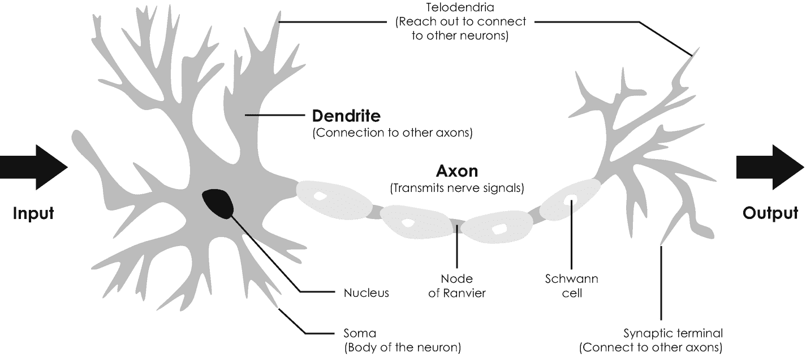

图 4-1

单个神经元的示意图。电信号在左手侧被接收，被转换成输出信号，并沿着轴突被传输到右手侧，在那里终突连接到其他神经元(未示出)

### 4.1.1 神经生物学和信息论的共生

人工智能的早期历史与 20 世纪 40 年代出现的一门叫做控制论的科学分不开。从词源上来说，这个术语源于希腊语单词 *cybernētēs* ，表示舵手、总督、飞行员或舵手，这就是为什么控制论可能被翻译为“舵手的艺术”。 [2](#Fn2) 在科学上，*控制论*是指对神经生物学和信息论之间联系的系统研究。它也经常被称为基于*反馈回路*的控制和调节机器的科学，类似于通过感觉器官和相互之间的社会交流接收反馈的生物。这一有趣研究领域的创始人是美国数学家和哲学家诺伯特·维纳，他在 1948 年将控制论定义为“对动物和机器中控制和交流的科学研究”。尽管他的名为《控制论:动物和机器中的控制和交流》的书是一本充满复杂数学方程的学术著作，但它立即成为了畅销书，并在出版后登上了《纽约时报》的畅销书排行榜。控制论最重要的任务之一是过程的自动化，包括复杂系统中的自我调节。控制论后来产生了缩写词“cyber ”,如今在与计算机创造的虚拟现实有关的各种上下文中用作前缀，如网络空间和网络安全。

第一批控制论模型中的一个——在当时经常违背弗洛伊德心理学的传统智慧——是由美国神经生理学家沃伦·麦卡洛克和逻辑学家沃尔特·皮茨在 1943 年提出的，并因此被称为*麦卡洛克-皮茨神经元*[[4](#Par242)。这个控制论模型的最基本版本如图 [4-2](#Fig2) 所示。它处理由 *x* 1 和 *x* 2 表示的两个二进制输入值，将它们相加，并提供一个二进制输出值，该值可以是 1 或 0，取决于输入值*x*1+*x*2 之和是否等于或大于某个阈值，该阈值是由*t 表示的整数与生物神经元类似，该阈值对应于激活电位，并决定神经元是否被激活。如果您在表 [1-1](1.html#Tab1) 中概括 AND 函数的真值表，很容易验证阈值为 *t* = 2 的麦卡洛克-皮茨神经元代表经典逻辑 AND 门。其他经典逻辑门可以通过相应地改变阈值来实现。这个控制论模型和一个生物神经元之间的相似之处是惊人的:两个神经元都处理多个输入，并根据特定的阈值将它们转换成单一输出。这一类比表明，我们大脑的基本操作可以用经典逻辑门来模拟，如与、或、非门，这同时也得到了原则上的验证——这难道不令人惊讶吗？*

Neuron

神经元是人脑的基本组成部分。它们是可电激发的细胞，处理电输入信号并将其转化为电输出信号。机器学习中使用的人工神经元模拟这种行为，并用于构建人工神经网络。

这可能是沃伦麦卡洛克和沃尔特皮茨最重要也是最迷人的观察结果，也是为什么他们 1943 年发表的题为“神经活动中内在思想的逻辑演算”的开创性论文吸引了全世界如此多的关注。1949 年，加拿大心理学家唐纳德·赫布(Donald Hebb)观察到，神经元的不同输入不能被视为同等相关，因为其中一些输入比其他输入更重要[ [5](#Par243) ]。这就是为什么他引入了*突触权重*的概念，这后来被称为*赫比理论*。

对早期控制论和信息论的另一个非常重要的贡献要追溯到英国学者艾伦·图灵，我们从 1.4.2 节对图灵机的讨论中知道他。1950 年，艾伦·图灵注意到人类使用信息和推理来解决问题和做出决定。因此，他想知道机器是否可能做同样的事情。为了这个目的，他在他著名的论文“计算机器和智能”中提出了一个建造智能机器的建造手册和一个测试它们智能的概念。后来，这项测试以他的名字命名为*图灵测试*，至今仍被用来测试机器展现智能行为的能力，并与人类进行比较。图灵测试本质上是一个有三个玩家的游戏，一个是要测试的计算机或系统，两个是人类。其中一个人类玩家，也就是这个测试中的评估者，会问一些开放式的问题，目的是在其他两个玩家中识别出这个人类玩家。如果评估者在没有最终看到人类玩家的情况下不能做出任何判断并识别他们，那么计算机或机器就被认为是智能的。

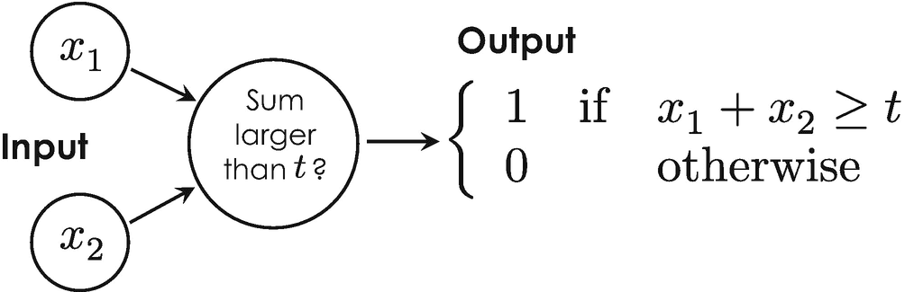

图 4-2

具有两个输入 x 1 和 x 2 的麦卡洛克-皮茨神经元的基本电路图。如果输入的总和大于或等于阈值 t，则结果等于 1，否则等于 0

图灵测试很快在科学家中引起了争议，因为他们中的一些人认为测试可以被操纵。最著名的批评者之一是美国哲学家约翰·塞尔，他在 1980 年建立了一个思想实验来强调图灵测试的缺陷。他的实验被称为*中文教室*，描述了两个人类玩家，一个中文老师和一个中文学习者。Bob，这个实验中的学习者，坐在一个封闭的房间里，有几本手册，上面有简单易用的将汉字翻译成英语的规则。房间外面是一个叫爱丽丝的老师，她懂中文，把不同的汉字数字化提交给鲍勃，让他翻译。经过一段时间的训练，实验完成了，爱丽丝会从鲍勃那里得到准确的翻译。现在想象一下，鲍勃创造了一个智能计算机程序，可以翻译汉字。约翰·塞尔认为，这个计算机程序不能被证明是智能的，也不能理解中文，因为它是由根本不懂中文的鲍勃编写的。因此，他得出结论，任何计算机都不能拥有人类没有的东西，这似乎是一个有效的论点，说明为什么我们可能无法实现约翰·塞尔所谓的超越人类智能的*强人工智能*。对于强人工智能(也称为人工通用智能)，他指的是“一台拥有正确输入和输出的适当编程的计算机，从而拥有与人类完全相同的思维”。*弱 AI* 另一方面，指的是只为特定任务设计的计算机或程序，无法解决未经训练的任务。从历史上看，约翰·塞尔的工作是对数学家约翰·麦卡锡的开创性工作以及他一年前发表的题为“给机器赋予精神品质”的开创性文章的回应，并提出了相反的观点。关于人工智能的哲学含义的争论到目前为止还没有解决，最近产生了一个新的研究领域，称为*伦理人工智能*，不幸的是，这超出了本书的范围。

Turing Test

图灵测试是最广泛使用的评估计算机智能思考和行为能力的科学方法。

### 4.1.2 启动这一切的会议

约翰·麦卡锡经常被认为是与艾伦·图灵一起的“人工智能之父”，他比约翰·塞尔早几年开始他的职业生涯。在普林斯顿和斯坦福大学做了两次短期任命后，他成为了著名的达特茅斯学院的数学助理教授，该学院是美国九所最古老的大学之一。在达特茅斯的时候，他受到 Nathaniel Rochester 的邀请——他是 IBM 第一台科学大型计算机“IBM 701”的设计者——在 1955 年夏天去位于纽约波基普西的 IBM Rochester 信息研究部门。在那之后，两位科学家说服信息论之父克劳德·香农和当时哈佛大学数学和神经病学的初级研究员马文·明斯基，与他们一起在达特茅斯学院组织了一次研讨会。他们的资助提案被提交给了洛克斐勒基金会，并最终被接受，于是，具有开创性的“达特茅斯人工智能夏季研究项目”在 1956 年夏天的六周时间里进行了。11 名参与者中有三名计算机科学家艾伦·纽厄尔、克里夫·肖和希尔伯特·西蒙，他们在同年早些时候演示了这位传奇的“逻辑理论家”，这是智能计算机程序概念的第一次真正证明。在这次会议上，约翰·麦卡锡第一次提出了“人工智能”这个术语，并给出了选择它的两个主要原因。首先，他打算将达特茅斯夏季项目的结果与他之前在一个名为*自动机理论* *的数学课题上的工作区分开来。* [4](#Fn4) 不幸的是，会议没有达到他的期望，其议程在某种程度上变得更具远见而非实际。然而，更重要的是，这个开创性的会议催化了接下来 20 年的人工智能研究。

从 1956 年到 1974 年，人工智能是科技界最热门的话题之一，这是由计算机的快速发展引发的。在传奇的达特茅斯夏季项目两年后，美国计算机科学家和心理学家弗兰克·罗森布拉特受到艾伦·图灵和唐纳德·赫布的开创性工作的启发，并对麦卡洛克-皮茨模型进行了如下改进:他引入了两个突触*权重*，两个十进制数字 w 1 和 w 2 ，这使他能够根据赫布理论根据它们的相关性增加或减少两个不同的输入值。从数学上来说，Frank Rosenblatt 用加权和 w1*x*1+w2*x*2代替了麦卡洛克-皮茨模型中两个输入的和*x*1+*x*2。与麦卡洛克-皮茨模型相比，他的模型多了两个可以单独设置和调整的自由参数，这就是为什么他的概念变得更加灵活，更适合模拟人类智能。在他的开创性出版物《感知器:大脑中信息存储和组织的概率模型》中，他将这一概念称为*感知器* [ [6](#Par244) ]，它形成了迄今为止构建人工神经网络的概念基础，是对这一正在进行的高度动态研究领域的最重要贡献之一。《纽约客》称感知器为“非凡的机器”[7](#Par245),*纽约时报*盛赞道，“海军今天展示了一种电子计算机的雏形，它预计将能够行走、说话、看、写、自我复制并意识到自己的存在”。

随着计算机可以存储越来越多的信息，并且变得更快、更便宜、更容易在学术界获得，人工智能不断繁荣。早期的演示，如由艾伦·纽厄尔和希尔伯特·西蒙开发的名为“通用问题求解器”的模拟程序，显示了人类解决问题目标的巨大希望。另一个安静的娱乐和交互式软件程序是 ELIZA，这是一个自然语言对话程序，用来展示人类和机器之间的肤浅交流。这个程序是由德裔美国计算机科学家约瑟夫·韦岑鲍姆在 1966 年创建的，基于一种叫做*模式匹配* [ [14](#Par253) ]的技术。在这种方法中，程序检查输入序列中是否存在某些文本成分或模式，创建相应的答案，并给用户一种程序理解的错觉。T55

伊莱扎和其他成功的研究项目促使开创性的达特茅斯暑期学校的组织者之一马文·明斯基在 1970 年告诉生活杂志...三到八年后，我们将拥有一台具有普通人一般智力的机器。”可悲的是，他被证明是错误的，在接下来的几年里，对该领域的资助和兴趣很快变得索然无味，部分原因是当时的计算机仍然相对昂贵，其计算能力和内存太有限，无法做任何实质性的事情。例如，DEC PDP-11/45 的工作内存——当时研究的首选计算机——只能扩展到 128 KB，比今天智能手机的内存少 20，000 多倍。结果，越来越多的学者从对人工智能的乐观转为怀疑。也许最直言不讳的怀疑者之一是美国哲学家休伯特·德雷福斯，他在 1965 年出版了他有影响力的书*炼金术和人工智能*[[15](#Par254)和*计算机还不能做什么:人工理性批判*于 1972 年出版，阐述了他的观点，即人工智能将不幸地达不到其崇高的期望。自 20 世纪 70 年代初对人工智能的热情开始消退以来，20 世纪 70 年代中期至 90 年代中期被称为“人工智能冬天”

但是即使在这个寒冷的时期，仍然有一些创新。其中之一是在 20 世纪 80 年代和 90 年代出现的*专家系统*，由这一时期低性能个人电脑的爆炸式增长引发。专家系统基于一个大型数据库来模拟人类专家的决策能力，该数据库由简单的 if-then-else 语句、 [6](#Fn6) 构成，这是一个被称为*符号逻辑*的概念，之前由马文·明斯基开发。专家系统有希望向职业领域的专家学习，比如医生、工程师和律师。例如，他们在数据库中获取这些知识来解决金融或汽车制造中的具体问题，并将这些知识提供给更广泛的从业者。尽管专家系统通常范围狭窄，难以应用于其他业务类别，但它很快就变成了一个价值数十亿美元的产业。一个很好的例子是 MYCIN，这是一个早期诊断医学感染的专家系统，于 20 世纪 70 年代中期在斯坦福大学开发。用户被要求回答各种问题。配备了 600 多条规则，MYCIN 然后通过逻辑推理分析这些答案，确定导致医疗问题的细菌类型，并推荐试用抗生素，剂量根据患者的体重进行调整。MYCIN 有 69%的准确率，并被认为比初级医生更有效。然而，这个程序从未在临床环境中使用过，但它是早期专家系统和现代机器学习前身的一个极好的例子。

### 4.1.3 IBM 的传奇项目深蓝和沃森

具有讽刺意味的是，在没有政府资助的情况下，人工智能在 AI winters 再次被两大力量驱动后重新点燃。首先是摩尔定律在起作用，即计算能力的快速提高(见 1.4.3 节)。其次，互联网的发展引发了数据的爆炸式增长，从数百万到数十亿的消费者突然变得可用并被要求进行分析。经过十多年对专家系统和并行计算的研究和开发，IBM 推出了它的国际象棋计算机“深蓝”。“深蓝”配备了 256 个并行处理器，每秒可以检查 2 亿次可能的移动。1996 年，深蓝击败了俄罗斯传奇国际象棋大师加里·卡斯帕罗夫，登上了各种报纸的头版。据报道，这一高度宣传的媒体事件是第一次计算机程序击败了卫冕世界象棋冠军，这是朝着人工智能决策程序迈出的重要一步。然而，深蓝下棋的方式与你或任何其他聪明人完全不同。它只是被编程了定义明确的国际象棋规则和明确的目标，即干掉对手的国王。基于这种基于规则的编程，计算机分析了它可能做出的每一个可能的举动和对手随后可能做出的每一个反应——这种方法是由美国数学家克劳德·香农在 1950 年首次描述的[ [20](#Par259) ]。通过搜索这种可能的走法，计算机通常会提前查看 8 到 30 步，以选择每一轮中可能的最佳走法。规则和逻辑仍然是当时创造智能机器最重要的成分。

但除了规则和逻辑之外，人类下棋也追求概念性的想法，比如“控制中心”或“从右边进攻”，并从经验中学习。想象你的孩子正在学习走路，以便更好地理解这种根本的差异。为此，你实际上没有告诉你的孩子站起来，保持适当的平衡，小心地一步一步地走。孩子们宁愿看着他们的父母走路，模仿他们的行为，并基于试错的方法从他们自己的经历中学习。如果他们因失误而摔倒，他们所经历的痛苦会导致相关的突触重量变弱。随着时间的推移，其他人通过训练得到加强，孩子偶尔会学会安全行走。通过写下指示来教一个孩子如何走路几乎是不可能的，因为我们拥有的大部分知识是隐性的，也就是说，我们不能完全解释它。换句话说，我们都知道的比我们能说的多，这就是所谓的*波兰尼悖论*，它是为了纪念匈牙利裔英国哲学家兼博学家迈克尔·波拉尼而命名的。

人类和计算机之间学习策略的这一根本差异的实现对人工智能研究产生了真正的革命性影响，并通过训练示例和经验[ [22](#Par261) ]催化了从基于规则和逻辑的学习到数据驱动的学习的范式转变。事实上，这是如今所谓的*机器学习*的核心和基础。机器学习首先由美国先驱和计算机科学家亚瑟·塞缪尔创造，他在 1959 年开发了一款计算机跳棋游戏 [7](#Fn7) ，这被认为是机器学习系统的第一个例子。在他颇具影响力的论文中，他将自己的方法描述为“[...]一个研究领域，它赋予计算机无需显式编程就能学习的能力。通过利用统计学和概率论的高级概念而不是规则和逻辑推理来训练系统，这是可能的。这也是为什么机器学习更好地称为*统计学习*，因为它完全基于大量训练数据或大数据的统计分析 [24](#Par263) 。图 [4-3](#Fig3) 示意性地描述了人工智能最重要的类别以及最重要的历史里程碑。

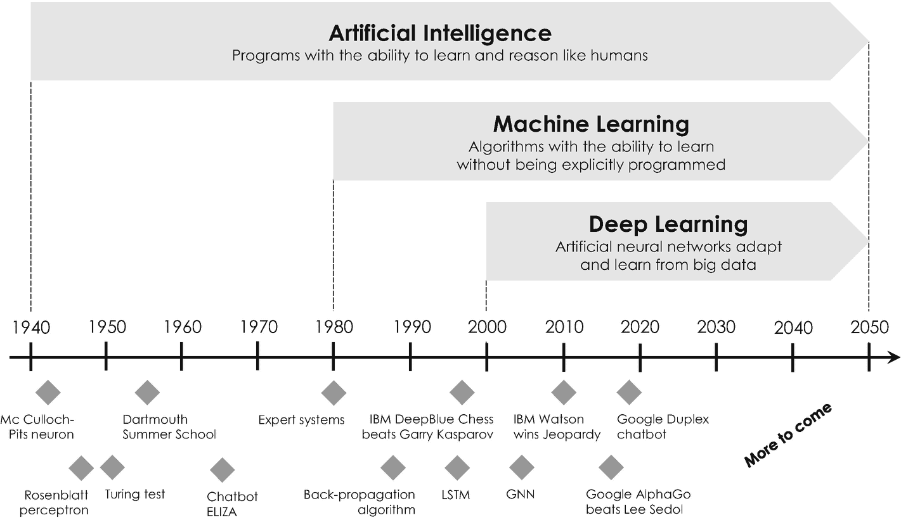

图 4-3

人工智能、机器学习和深度学习之间的差异，以及这些学科最重要的历史里程碑，在时间梁下面显示

范式从基于规则和逻辑到数据驱动学习的革命性转变也为 IBM 的下一代人工智能“沃森”铺平了道路。Watson 以 IBM 传奇创始人托马斯·沃森(Thomas Watson)的名字命名，由大卫·费鲁奇(David Ferrucci)在 DeepQA 项目中开发，最初设计为问答系统。为此，沃森配备了 720 个中央处理器和 160 亿字节的工作内存。这台大规模并行超级计算机的数据库塞满了大量数据集，包括整个维基百科图书馆、书籍、电影和其他人类知识来源。基于这个庞大而全面的知识库，沃森能够将问题解析成不同的关键词和片段，以便找到统计上相关的短语作为答案。该系统同时执行数百个自然语言处理和分析程序，以找到给定问题的一小组潜在正确答案。然后，Watson 根据其数据库检查这些潜在的答案，以确定它们是否有意义，并最终通过文本到语音转换程序合成的电子语音口头输出最合理的答案。

2008 年，IBM 代表与美国传奇智力竞赛节目 *Jeopardy 的执行制片人哈里·弗里德曼进行了交流。*，并提议沃森和这两位*进行一场比赛 Jeopardy！*冠军布拉德·鲁特和肯·詹宁斯。第一场比赛是在 2010 年组织的，没有任何宣传，暴露了沃森精心设计的套路的各种弱点。沃森最大的缺点之一是它听不到竞争对手的回答，因此无法向他们学习。这就是为什么 IBM 的研究团队实现了一个额外的功能，通过这个功能，沃森可以以电子方式接收竞争对手的正确答案。在解决了这个和其他几个关键问题后，沃森慢慢接近了两个 *Jeopardy 的表现水平！*冠军。哈里·弗里德曼曾经用“我认为我们已经从印象深刻到震惊”来描述这种急剧增长的表现，并最终同意在 2011 年 2 月 16 日安排一场电视公开比赛。那天，不可思议的事情发生了:沃森击败了卫冕冠军 *Jeopardy！在一场长期以来被认为是智力象征的比赛中，布拉德·鲁特和肯·詹宁斯赢得冠军，并赢得一百万美元的头奖。IBM——或者更确切地说是 Watson——实际上把他赢得的奖金平分给了慈善组织世界宣明会和世界社区网格。 [8](#Fn8)*

在那场历史性的比赛之后，Watson 再也没有参加过比赛，但它基于一整套机器学习算法的非凡能力成为了 IBM 机器学习服务的基础，这些服务很快就在 IBM cloud 上作为按需服务提供。接下来的几年，人工智能的研究和开发蓬勃发展，越来越多的公司开始在广泛的商业应用中开展自己的项目和计划。

## 4.2 人工智能背后的中心思想

我们短暂的历史考察表明，人工智能是一个非常跨学科的科学领域，建立在数学、计算机科学、神经科学、控制论等各种思想和概念的基础上。即使该领域的一些非常现代的方法非常复杂，并且需要高等数学的知识，例如矩阵和微分，但是大多数算法及其应用背后的基本思想可以用下面介绍的两个主要概念来描述。

### 4.2.1 成本函数

第一个概念是成本函数。为了进一步说明这一点，我们将假设你想搬到另一个城市，比如说位于传奇硅谷中心的旧金山，硅谷是数字技术的摇篮，也是美国各种互联网巨头的所在地。你可能要做的第一件事就是寻找一套体面且价格合理的公寓出租。为此，你可以在互联网、当地报纸和其他信息来源上寻找不同的租房信息。假设你找到了四套不同月租的公寓，面积分别为 20、40、50 和 60 平方米。假设这些公寓都不符合你的期望，因为它们似乎都太小了。此外，假设你的预算中还有几百美元，你想知道一套 80 平方米的 2 公寓大概要花多少钱，考虑到你的财务限制，这是否可行。在这一点上，你可能还记得在学校的时候，在图表中可视化数据总是一个好主意。这就是为什么你拿一张纸，画出价格和尺寸的关系。你的图表可能看起来类似于图 [4-4](#Fig4) 所示。此外，你可能还记得你的本科数学课，这种点的分布-技术上称为*点云*-最好用一条穿过所有点的中心的线来描述，即所谓的*质心*。但是我们怎样才能找到一条完美的线来完美地拟合这些点，并用来预测一套 80 平方米的公寓最可能的价格呢？

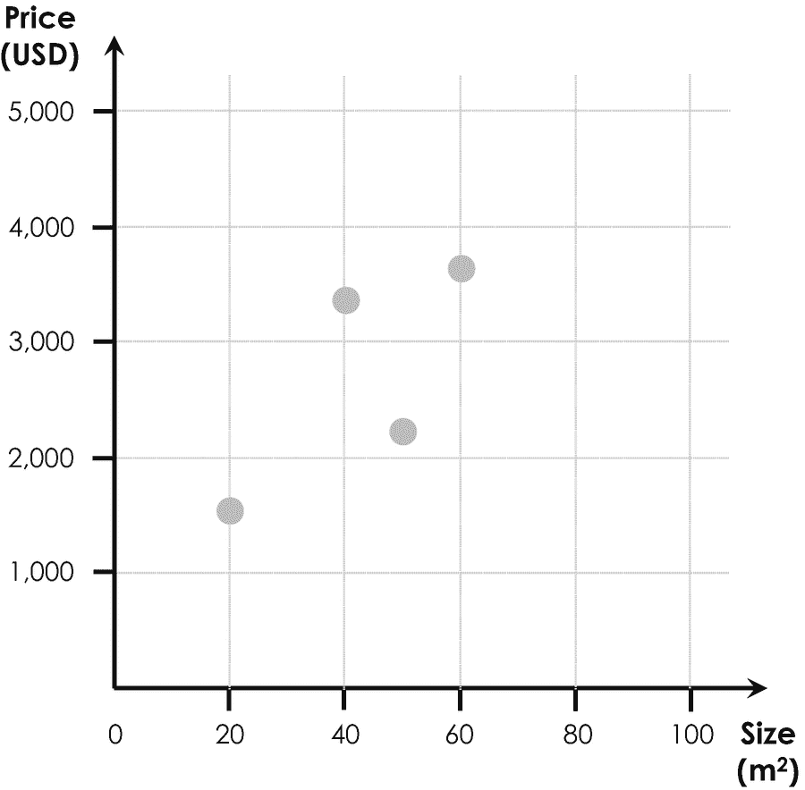

图 4-4

散点图直观显示了不同租赁报价的价格和规模

这是我们第一个机器学习算法的一个非常简单的例子，数据科学家称之为*线性回归模型*。该模型输出一条线，并为其提供一个简单的数学公式，该公式完美地描述了市场上公寓根据其大小的惯例租金。有了这个公式，我们可以在最后一步将这条线延伸到四个数据点之外，并确定一套 80 平方米 2 大小的公寓最可能的月租金。为了找到完全符合该点云的直线，算法从绘制一条具有一定斜率和偏移值的随机直线开始，如图 [4-5](#Fig5) (a)所示。

Cost Function

机器学习算法或程序的成本函数用于评估输入数据和预测输出之间的误差。所有机器学习算法的最终目标是最小化该误差，这就是为什么成本函数有时也被称为优化目标。

为了评估这条线是否合适，线性回归模型将评估这条线与云中不同点之间的距离——这些距离在同一图中用垂直箭头表示。事实证明，将这些箭头的长度相加并对它们求平方是确定这种拟合的质量的更方便的方法，因为距离的平方同等地考虑了正值和负值。在机器学习中，由于历史原因，这种偏差平方和被简单地称为*成本函数*。一般来说，代价函数是一个机器学习模型的*优化目标*，每个算法都有自己的代价函数。但是，我们如何进一步利用这个关键概念来找到最合适的呢？

### 4.2.2 成本函数的最小化

凭直觉，您可能会猜测，找到我们租赁报价最佳线性拟合的最佳策略是最小化点云中的点与拟合线之间的距离。换句话说，我们只需要最小化成本函数。最快和最方便的方法是采用一种称为*梯度下降*的最小化(或优化)算法，这是人工智能和机器学习中第二重要的概念。对于您的租赁报价，梯度下降是通过迭代绘制穿过点云的不同线来执行的，在每一步之后计算成本函数，并基于最成功的测量来最小化成本函数。从数学上讲，我们系统地增加(或减少)直线的斜率和偏移值，并在每次迭代后计算成本函数。例如，如果降低斜率导致在一次迭代中降低成本函数，则该算法将在下一次迭代中进一步降低成本函数，依此类推。在机器学习中，这个迭代过程被称为点云上线性回归模型的*训练*。因此，在这种特殊情况下，点云也被称为*训练数据集*。

Gradient Descent

梯度下降是用于最小化机器学习算法的成本函数的最常用的数学概念。

整个程序如图 [4-5](#Fig5) 所示。图 [4-5](#Fig5) (a)显示了一条位于所有点上方的直线，这就是为什么梯度下降算法将首先降低斜率和偏移值这两个参数，以便向下移动直线并降低总成本函数。这个过程一直持续到线偶尔在点内的某个地方结束，这导致成本函数增加。成本函数在连续迭代中停止降低并再次开始增加的“转折点”可以被认为是斜率和偏移值的最佳和完美组合。最终结果如图 [4-5](#Fig5) (b)所示。梯度下降除了找到这个转折点之外没有别的作用，它对应于我们点云中数据的完美线性拟合。通过将点云之外的线延伸到 80 平方米 2 ，我们可以最终预测 80 平方米 2 公寓最可能的价格，大约相当于每月 4000 美元。

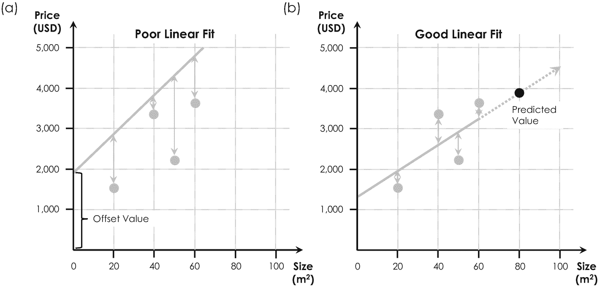

图 4-5

比较点云中描述租赁报价的两条线(灰色点)。(a)显示了一条不太符合租赁报价的线，因为它位于所有点之上，这就是偏差非常大的原因(灰色垂直箭头)。在非常吻合的情况下，偏差要小得多(b)。将线延伸到点云之外(b 中的虚线箭头)可以让我们预测一套 80 平方米 2 公寓(黑点)的价格

为此，你可能会明智地注意到，公寓的价格不仅取决于它的大小，还取决于房间的数量、到市中心的距离以及其他关键特征。好消息是，线性回归模型可以很容易地扩展到考虑除公寓大小以外的多种类型的输入数据。为此，我们简单地在成本函数中添加更多的项来量化额外的特征，例如房间的数量。由于显而易见的原因，最终的模型被称为*多维线性回归*，并且非常适合预测惯常的房地产价格。

这就是机器学习如何帮助我们为你找到完美的公寓——当然，这种算法在商业中也有其他使用案例。然而，这个简单的例子说明了人工智能的两个最基本的概念，即(1)成本函数及其(2)通过梯度下降或其他优化算法的最小化。[10](#Fn10)T3】

## 4.3 学习的五个范畴

除了这个回归模型，数据科学家还开发了一系列进一步的机器学习算法，每种算法都有自己的一套用例。 [11](#Fn11) 这些类别被称为监督、非监督、深度和强化学习以及集成方法。图 [4-6](#Fig6) 显示了最流行算法的一般但不全面的概述，我们将在下文中进一步详细讨论。

### 4.3.1 监督学习

细心的读者会注意到，在我们之前的示例中，线性回归模型是通过迭代比较其输出(拟合线)和输入(训练数据集)进行优化的。这是*监督学习*的一个例子，它总是基于*标记的数据*。带标签的数据指的是与前一个示例类似的数据集，其中每个输入值(公寓大小)都与一个输出值(公寓奖金)相关。在这种情况下，可以很容易地定义成本函数，因为我们可以直接将计算的输出与输入训练数据集进行比较，并迭代地最小化任何偏差。监督学习通常需要大量(专家)标记的数据来训练模型并产生更准确的结果。在这种情况下，重要的是要记住，大型代表性和高质量的数据集通常会降低*过度拟合*的风险，并允许模型很好地推广到新数据。过度拟合指的是一种数学效应，其表现为模型学习学习数据中的噪声(或统计波动),而不是真正的统计上最相关的模式。

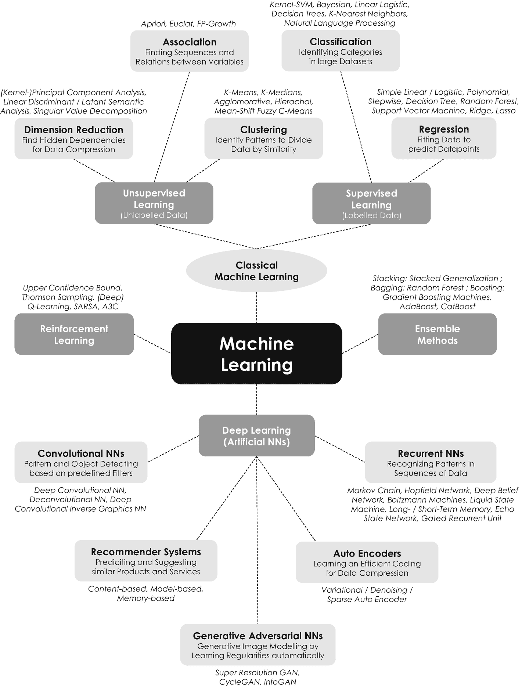

图 4-6

机器学习最重要的类别和算法概述。五个主要类别以深灰色突出显示，相应的子类别以浅灰色突出显示。每个子类别中最流行的机器学习算法的技术名称用斜体表示。经典机器学习(浅灰色，椭圆形)是一个历史术语，通常用于指代经典的无监督和有监督学习算法

然而，许多可用数据通常没有标记，手动提供标记可能相当耗时。这就是为什么非常有创造性的方法被开发来应对这一挑战。例如，ImageNet 是一个分层数据库，它提供大量带标签的图像，并且是通过众筹创建的。 [12](#Fn12) 数据也可以自动标注。例如，想想脸书的应用机器学习小组[ [26](#Par265) ]，他们利用他们拥有超过 35 亿张照片的庞大数据库，基于一个非常复杂的预测模型，使用 Instagram 照片的标签来自动标记他们的数据。虽然一些标签对照片进行了非常好的非视觉描述，但其他标签对照片的描述非常模糊，这就是为什么脸书将其方法称为弱监督数据。由于如今数据创造了竞争优势[ [29](#Par268) ]，数据标签很快成为一个自己的行业和全球市场，全球范围内有许多成熟的参与者，如 Dataloop、Labelbox、Scale AI、Supervisely 和 Heartex Labs。Arturo.ai 是芝加哥美国家庭保险公司(American Family Insurance)的子公司，总部位于圣地亚哥的初创公司 Lytx 只是这一不断增长的数据注释行业的两个例子，预计到 2025 年全球市场规模将达到 16 亿美元。

Supervised Learning

在监督学习中，机器学习算法或程序由标记数据训练，即成对的输入和输出，在训练期间告诉算法正确的答案，并允许调整其自由参数。一旦算法经过迭代训练，它就可以以一定的精度预测未知输入的输出。如果您已经标记了可用的数据，或者知道如何手动对其进行分类和标记，那么这种方法非常适合。

#### 监督学习:回归

回归是迄今为止监督学习最简单的方法。它基于法国数学家阿德里安-玛丽·勒让德的开创性工作，他开发了“回归的最小二乘法”，以根据 1805 年的天文观测确定围绕太阳的轨道。回归算法通过直线(线性回归)或曲线(多项式回归)来近似训练数据集。此算法的输出是描述最佳拟合直线或曲线的参数，这些参数可以扩展到训练数据之外，并用于预测未经训练的输出，就像前面的公寓租赁示例一样。线性回归广泛用于预测和预报，例如金融和保险公司的销售预测和风险评估分析。进一步的例子包括根据一天中的时间或者作为公司增长的函数的需求量来预测交通。特别有趣的是多线性或多多项式回归，它允许基于独立和多个输入数据集预测输出，例如基于里程、品牌、事故数量、维修量、车主数量和其他决定其价值的关键特征预测车辆的市场价值。多元多项式回归模型还可以让我们预测营销人员所谓的“客户流失”，作为不同变量的函数，如使用频率和强度、满意度、人口统计数据以及与其他用户的关系。例如，这种预测可以被一家公司用来自动提供特别优惠以留住脆弱的客户。

#### 监督学习:分类

属于*分类*类别的机器学习算法允许将(大)数据集分割成共享某些相似性或属性的公共标签或数据组。分类类似于回归，在回归中，我们预测的不是一个数字，而是一个最能描述输入数据的类别。到目前为止，最常见的算法被称为*K-最近邻*，它采用一组带标签的数据点，并将它们分成 *K* 个类别，其中 *K* 是一个整数。

这种算法的一个越来越受欢迎的用例是金融科技行业公司的信用评分和评级计算。他们的分类模型考虑了各种因素，如收入、支付历史和居住地，以对潜在借款人进行分类。其他应用包括垃圾邮件过滤、语言检测、情感分析和欺诈检测。例如，每当我们将一封电子邮件标记为垃圾邮件时，我们的电子邮件提供商就会更新其机器学习模型，以识别未来最新的巧妙骗局。脸书在新上传的照片中建议朋友名字的能力也是基于我们之前的标签输入训练的算法。另一个例子是由美国金融和支付卡公司 Visa 开发的高级授权分析工具，该工具帮助金融机构防止了每年约 250 亿美元的欺诈[ [33](#Par272) ]。

### 4.3.2 无监督学习

与监督学习相反，*非监督学习*与*未标记数据*一起工作。这种类型的算法在学习过程中是独立的。他们通常从猜测输入数据的相似性和模式开始，然后通过迭代调整相应模型的不同参数来实现越来越好的结果。优化目标或成本函数可以通过各种定量方法来实现，例如欧几里德度量或距离，这允许我们基于数据点在坐标系中的空间距离来评估数据点的相似性。最著名的例子之一是谷歌的 PageRank 算法，它成为了谷歌搜索引擎的原型。这种算法是两位传奇的谷歌创始人拉里·佩奇和谢尔盖·布林以及斯坦福大学的同事的想法，他们在 1998 年发表了题为“PageRank 引文排名:给网络带来秩序”的开创性论文。在申请专利 US 6，285，999 [ [35](#Par274) ]一年后，他们发布了谷歌搜索引擎的第一个版本。从那时起，无监督学习已经被应用到一系列其他商业应用中，Yann le Cun——全球领先的人工智能科学家之一——预计“[...]从长远来看，无监督学习变得更加重要。人类和动物的学习在很大程度上是无人监督的:我们通过观察世界来发现世界的结构，而不是被告知每个物体的名称。

Unsupervised Learning

在无监督学习的情况下，机器学习算法或程序在没有任何预定义类别的情况下扫描输入数据的模式和结构，并迭代地识别统计上最佳的分类。如果您不知道如何标记数据，并且希望算法找到相似性和模式来为您分类，则这种方法非常合适。

#### 无监督学习:聚类

聚类是经典无监督学习中最流行的子类。简单来说，这就好比当你不记得你所有的颜色时，洗完衣服后按颜色分类。这种算法通常允许我们划分没有预定义类别或类的大型数据集。该算法找到相似的对象，将它们合并到一个集群中，从而找到自动划分数据集的最佳方式。到目前为止，这一子类别中最常见的算法是 *K 均值聚类*，它采用 *K* 中心点或*质心*，将它们分布在一个数据集上，并将不同质心附近的所有数据点合并到一个聚类中。迭代地调整质心的位置，直到所有数据点和它们相关的质心之间的平均距离最小化，并且建立了统计上最鲁棒的分组。此外，该算法允许绘制“曲棍球棒图”或“肘图”，通过绘制数据和质心之间的平均距离以及 *K* 的值，我们可以使用该图来确定统计上理想的聚类数。该图的形状通常像一根曲棍球棒，其拐点给出了理想的聚类数。大概 K-means 聚类最受欢迎的应用是营销活动的*市场*和*客户细分*，如图 [4-7](#Fig7) 示例所示。

另一个应用是*情绪分析*，它挖掘社交媒体数据来识别社会的总体趋势。举例来说，这对于一家时装公司来说是至关重要的，以了解他们如何在即将推出的服装系列中调整已确定的风格。另一个例子是关于在城市地图上标记受欢迎的地点。例如，每当你在谷歌地图上寻找一家餐馆时，你可能已经注意到谷歌的聚类引擎会把它的搜索结果以很低的分辨率组合成一个个小块。这是一个非常重要的功能，因为当你试图在一张地图上同时绘制成千上万的餐馆时，你的网络浏览器会死机。您可能还会想到政府背景下的国家安全机构和执法机构，他们可以使用集群来寻找异常模式并识别潜在的安全威胁，这种应用程序后来被称为*异常检测*。在这些情况下，聚类算法特别有用，因为我们通常不知道要寻找的特定异常模式。

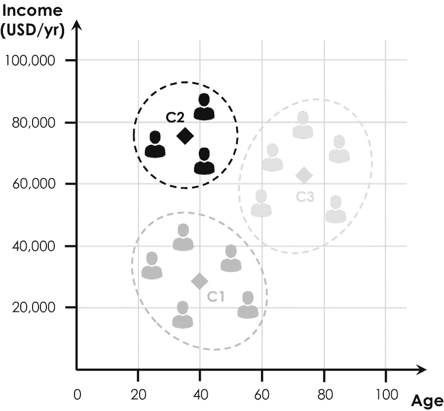

图 4-7

通过绘制客户年收入与年龄的关系图进行客户细分。在该示例性情况下，该算法找到了由“C1”、“C2”和“C3”(菱形)表示的三个质心，这三个质心表征了三个客户群(黑色、中灰色和浅灰色的虚线)

#### 无监督学习:联想

关联或关联规则学习是另一组算法，采用无监督学习策略，用于在亚马逊的“购买了该商品的顾客也购买了”部分向你推荐类似的书籍。这些算法通过选择基于不同的重要性和兴趣度量的规则，在(非常)大的数据集[ [37](#Par276) ， [38](#Par277) ]中寻找变量之间的模式和关系。该模型的*支持*参数量化了一个项目集(如产品列表)出现在数据集中的频率，而*置信度*则表示在数据中发现关联规则的频率。例如，*先验*关联规则算法通过设置最小支持度和置信度界限开始，并迭代地识别和排列具有较高支持度和置信度值的所有子集。例如，如今它被用于分析购物车和自动化营销策略，这种方法被称为行为微目标，因为这种算法会寻找任何一组商品之间的共现频率和概率，并创建未来各种类型的产品之间可能发生的关联。

一个具体的例子是关于超市的产品摆放。假设一位顾客拿着六罐啤酒去结账。我们应该把口香糖放在路上吗，也就是说，啤酒和口香糖的销售有某种关联吗？获得有价值的客户洞察以推动超市和仓库的销售是关联规则学习的一个相当典型的用例。每当你有一系列的东西，你想从中发现明显和隐藏的模式和关系时，它通常可以被应用。例如，英国在线超市 Ocado 从其数据中了解到，尿布和啤酒之间有很强的相关性。他们发现，初为人父母的人不怎么出门，这就是为什么在他们购买尿布时推荐啤酒和葡萄酒会非常有利可图，并提高客户满意度。

#### 无监督学习:降维

*降维*或概括是指在大型数据集中找到比碎片化特征更便于用于数据处理的抽象模式。例如，所有长着三角形耳朵、长鼻子和大尾巴的狗都可以归纳为牧羊人，这对于解释和处理这个种族的特性比单独描述其生理特征更有用。这种算法已经被用于潜在语义分析，其允许通过将特定单词聚类到主题来将特定单词抽象到它们的含义。除了这种所谓的*主题建模*，降维最流行的应用可能是*推荐系统*和*协同过滤*，用于基于多个方面、观点、数据源等分析客户的行为模式。

### 4.3.3 深度学习

除了监督和非监督学习之外，深度学习形成了第三大组学习策略，并通常用于训练人工神经网络。*深度学习*是机器学习的一个子类，其灵感来自于(人类)大脑的结构和功能。这是人工智能研究中最年轻的领域，最近在媒体中引起了很大的兴奋，部分原因是它提供了一系列高度跨学科的应用。

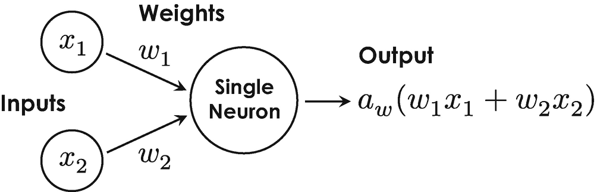

图 4-8

具有两个十进制输入 x 1 和 x 2 的单个神经元的基本电路模型。输出是输入 w1x1+w2x2的加权和的数学函数，用 a w 表示，称为激活函数

Artificial Neural Network

人工神经网络是通常排列在多层中的互连神经元的结构。每个神经元都与前一层和后一层中的神经元相连，并具有特定的激活功能。与每个连接的强度(权重)一起，每个神经元的激活函数控制着信息如何通过网络从输入层传输到输出层。人工神经网络模拟大脑的智能行为，可以应用于广泛的应用领域。

#### 深度学习:人工神经网络

深度学习采用*由相互连接的人工神经元组成的人工神经网络*。在这种情况下，人工世界指的是这样一个事实，即我们不使用真实的生物神经元，而是通过运行称为机器学习模型的适当软件代码的最先进的计算硬件来模拟它们的行为。今天，人工神经网络中使用的神经元是弗兰克·罗森布拉特感知器模型的推广。从我们在第 4.1.2 节的讨论中，你可能记得感知器的输出值取决于输入的加权和，我们用 w1*x*1+w2*x*2用输入 *x* 1 和 *x* 2 和权重 w 来进行数学描述 Frank Rosenblatt 模型的特殊推广被称为*激活函数*，它除了根据一个可选公式将输入的加权和转换成一个十进制数之外什么也不做——因此这是一种更精细的控制激活电位的方法。激活函数为模型增加了另一个自由度(或自由参数),并允许通过为其选择最合适的激活函数来更好地调整人工神经元以适应特定的使用情况。人工神经元的总体概念如图 [4-8](#Fig8) 所示。

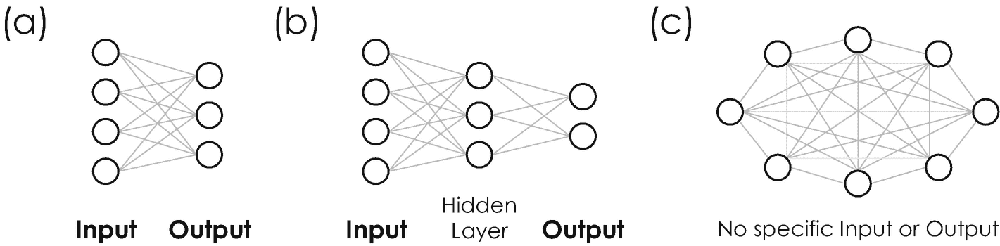

图 4-9

三种最基本的人工神经网络。(a)示出了分别由四个和三个神经元(圆圈)构建的具有一个输入层和一个输出层的两层神经网络。(b)显示了具有一个隐藏层的三层设计，以及(c)一种被称为“玻尔兹曼神经网络”的相当奇特的神经网络类型，没有特定的输入或输出

当我们将这些神经元连接起来，形成类似于我们大脑中生物神经网络的人工神经网络时，这些神经元的真正力量就会展现出来。神经元可以连接起来形成任何类型的*网络架构*，这取决于手边的特定用例。在这种情况下，术语“架构”指的是不同神经元相互连接的特定方式(或接线图)——这种连接当然是人工的，是由软件模拟的。选择最合适的体系结构实际上需要大量的经验和技术专长。图 [4-9](#Fig9) 给出了几个基本的例子供你参考。该图揭示了人工神经网络中的不同神经元通常排列在不同的层中，其中神经元仅连接到相邻层中的相邻神经元。既不是输入层也不是输出层的层称为*隐藏层*。从历史上看，术语“隐藏”产生了术语*深度学习*，因为隐藏层在神经网络中秘密地“深入”运行，而不产生任何可见的输出。如果输入数据非常通用、庞大且复杂，例如用于图像、对象和语音识别的数据，通常会使用隐藏层。

为了更详细地解释人工神经网络的基本原理，我们现在将讨论一个非常流行的例子。图 [4-10](#Fig10) 中描述了这种用例，它是关于读取手写数字并将其转换成数字以便进一步处理。这种网络被用于一些邮政配送中心，例如，读取邮政地址并根据邮政编码自动分拣邮件，这种方案很容易扩展到读取手写地址和其他文本。

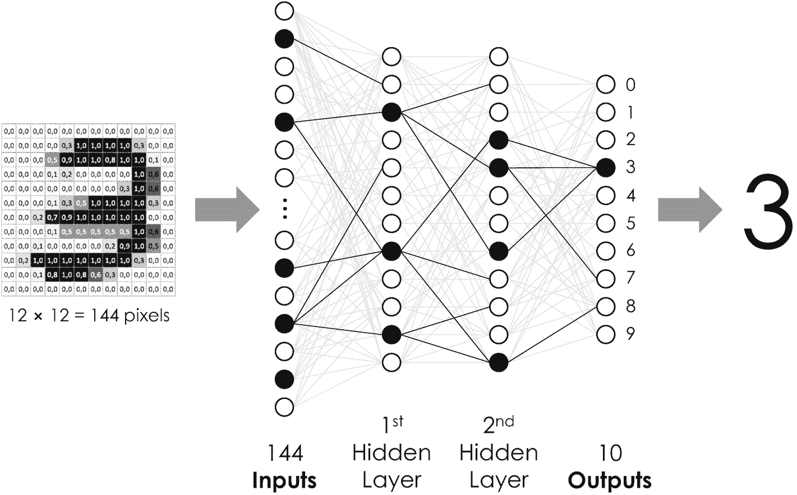

图 4-10

基于人工神经网络的手写数字分类。该网络获取手写数字的图像，并将其转换成数字。根据输入图像中的像素数量，网络由输入层中的 144 个神经元(圆圈)组成。它进一步超越了两个各有 12 个神经元的隐藏层和一个总共包含 10 个神经元的输出层，这些神经元对应于数字 0，1，…，9。激活的神经元和具有最高权重的最主要连接以黑色突出显示

图 [4-10](#Fig10) 中的神经网络总共由四层构成，一层输入，一层输出，两层隐含层。它的输入是 12 × 12 像素图像，例如我们在 1.4.1 节介绍灰度图像的二进制编码方案时讨论的图像。这些图像逐行输入到神经网络中，即每个像素作为输入层中一个神经元的输入，因此总共包含 12 × 12 = 144 个神经元。根据一个像素的值是否高到足以激活相应的神经元，输入要么被前馈到下一层，要么不被考虑进行进一步处理。本例中的下一层是第一个隐藏层。它的神经元将信息转发到第二个隐藏层，但是根据另一个激活函数，该激活函数允许关注输入数据中的某些模式。第二隐藏层比前一层包括更少的神经元，并且还对其组成神经元采用特殊的激活函数。输出层最终基于一个被称为 *sigmoid 函数*的激活函数对来自第二个隐藏层的输入进行平均。该 sigmoid 函数的输出对应于 0 和 1 之间的数字，可以用概率来解释。 [15](#Fn15) 输出值 1 对应 100%的概率，输出 0 对应 0%。在这种特定情况下，具有最高概率的神经元是第三个，这就是为什么网络正确地将具有数字 3 的手写输入图像分类为具有由相应概率给出的不确定性。

Deep Learning

深度学习是指采用具有一个或多个隐藏层的人工神经网络的机器学习算法或程序。它对于解决复杂的任务特别有用，例如图像和对象识别或自然语言处理。

类似于线性回归模型，这种手写数字的分类只有在神经网络之前已经用包含数千个手写数字的大型训练数据集训练过的情况下才正确工作。在没有任何训练的情况下，神经元之间不同连接的权重确实只有随机值。结果，神经元被任意激活，并且几乎独立于输入图像而触发。那么这种训练是如何工作的，人工神经网络实际上是如何学习的呢？

人工神经网络通常可以通过使用标记或未标记的数据来训练，也就是说，通过采用监督或无监督学习来训练。通过使用标记的数据集来训练手头的例子的人工神经网络。这种数据集包含成千上万的手写数字图像，每个图像都与正确的数字号码相关联(或被标记)。因此，神经网络的成本函数可以通过将计算的输出与标记的输入值进行比较来定义。 [16](#Fn16)

与所有其他机器学习算法一样，人工神经网络通过迭代地最小化其成本函数来训练。培训通常包括五个主要步骤:

1.  第一步通过随机十进制数初始化不同的权重，为简单起见，这些数字通常位于 0 和 1 之间。

2.  之后，训练数据集的第一幅图像被输入到输入层，每个像素对应一个神经元。

3.  数据随后通过网络从输入层传播到输出层，使得每个神经元的输出等于针对输入的相应加权和而评估的其激活函数。这个过程被称为*正向传播*，因为它是从输入层指向输出层的。

4.  在第四步中，算法将计算结果与输入图像的标签进行比较，并计算输出层中每个神经元产生的误差。

5.  第五步被称为*反向传播*，依赖于美国数学家保罗·沃博斯和美国心理学家大卫·鲁梅尔哈特的开创性工作[ [39](#Par278) ， [40](#Par279) ]。反向传播标志着人工智能研究的一个重要里程碑，因为人工神经网络以前无法准确有效地训练。 [17](#Fn17) 在此过程中，计算出的误差通过网络从输出层反向传播到输入层，同时根据它们对误差的贡献大小来更新不同的权重。这样，一些连接通过增加它们的权重而变得更强，而另一些连接通过相应地减少它们的权重而变得更弱。我们在一个迭代步骤中更新权重的最大量被称为*学习速率*，它决定了人工神经网络学习的速度。

重复步骤 1-5，直到训练数据集的每个图像都通过了网络，并被识别到预期的精度。训练数据集中所有图像的一次完整的向前和向后传播被称为*时期*。人工神经网络的训练通常涉及数百个时期，这就是为什么整个训练过程可能非常耗时且计算量大。

形象地说，人工神经网络隐藏层中的不同神经元在训练过程中拾取某些图像特征和形状，从而将图像分解为其最主要的子成分。因此，第一个隐藏层中的神经元将逐渐识别简单的形状，例如直线、边、角、矩形、圆形和其他嵌套特征。第二隐藏层中的神经元可以识别在输入图像中占优势的甚至更复杂的特征或那些简单形状的组合。一旦训练完成，就建立了一组通用的简单形状，通过将它们分解成它们的基本形状，并根据特定的正确分解将它们与一个数字相关联，该简单形状很好地用于识别所有可能的手写数字。

#### 深度学习:卷积神经网络

像任何其他人工神经网络一样，卷积神经网络建立在一系列不同的科学概念和思想的基础上，这些概念和思想随着时间的推移而发展。他们的中心思想可以追溯到德国神经科学家和诺贝尔奖获得者大卫·胡贝尔和托尔斯滕·威塞尔，他们在 1959 年研究了猫视觉皮层的神经元。基于他们的实验结果，他们很快认识到猫的视觉皮层中的神经元——大脑中处理来自眼睛的视觉信号的部分——只对整个视野中的一小部分区域做出反应，他们称之为*感受域*。此外，发现相邻神经元的感受野相互重叠，形成一个光栅，构建了猫的整个视野。这种重叠在数学上被称为*卷积*，并与应用于图像的局部滤波器进行比较，以突出图像的某些结构、纹理、特征和其他方面。为清晰起见，图 [4-11](#Fig11) 显示了两个非常常见的卷积滤波器对一幅典型灰度图像的影响。

受 David Hubel 和 Torsten Wiesel 开创性工作的启发，日本计算机科学家 Kunihiko Fukushima 在 1980 年开发了一个多层人工神经网络，他将其称为“Neocognitron”[36](#Par275)，[43](#Par282)。这种特殊的人工神经网络能够通过使用完全不同的网络结构来识别类似于前面讨论的例子的手写字符。他的方法中真正的创新依赖于人工神经网络与基于卷积滤波器的特征提取单元的结合，这就是为什么他的网络架构后来被称为*卷积神经网络*。这种网络的一个非常简单的例子如图 [4-12](#Fig12) 所示。这种特定的卷积神经网络可用于根据车辆类型对车辆进行图像识别和分类，例如小型汽车、敞篷车、SUV 和豪华轿车。它由两个子组件组成，即(1)特征提取单元和(2)分类单元。特征提取单元用于图像预处理，由具有特定激活函数的三层神经元组成。第一层称为*卷积层*，它扫描输入图像，通过在图像上逐行、逐列移动任意过滤器来检测某些(对比)特征和结构，类似于图 [4-11](#Fig11) 所示。这个过程创建了一个所谓的*特征图*，它突出显示了统计上最相关的汽车特征，如车轮、车门、车灯和其他取决于所选过滤器的方面。在那之后，Kunihiko Fukushima 引入了一个所谓的*汇集层*，它将这些特征相加，并根据它们的统计相关性对它们进行评级。由于其特定的激活功能，汇集层进一步确保检测到的特征被正确识别，即使它们在输入图像中被移位或倾斜。 [18](#Fn18) 此外，它还减小了图像大小，这就是为什么混合图层有时也被称为“缩减像素图层”其汇集的特征图用作随后的*展平层*的输入，该展平层是特征提取单元的第三层也是最后一层。该层进一步减小特征尺寸，并将特征图转换成一列神经元。该列本身充当卷积神经网络的第二子组件的输入，卷积神经网络是以分类单元为特征的完全连接的人工神经网络。该人工神经网络最终允许将检测到的特征分类到某些车辆类型中，类似于在前面的例子中用于分类手写数字的人工神经网络。

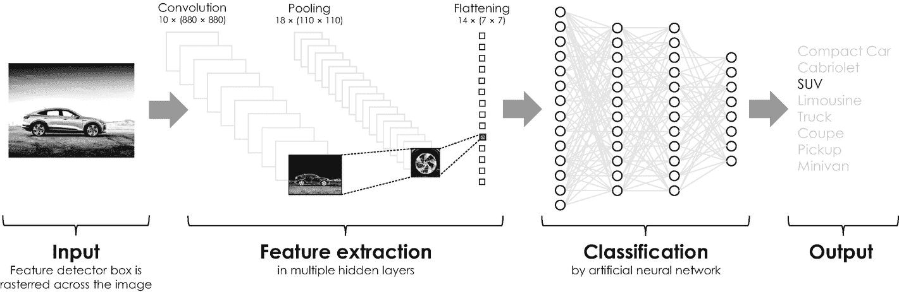

图 4-12

用于根据车辆类型对车辆图像进行分类的卷积神经网络的架构设计。特征提取单元由卷积、汇集和展平层组成，并识别图像中的某些特征和结构。根据哪些特征是最主要的，人工神经网络将这些特征分类成特定的车辆类型

图 4-11

两个特征检测器对原始图像的影响。“边缘检测器”强调图像中的所有边缘，而“图像浮雕”赋予图像三维外观，从而突出图像中的任何纹理，例如车辆下方的地面

卷积神经网络通常使用包含数万张图像的标记数据集进行训练。Yann LeCun 的反向传播算法是训练卷积神经网络的一个里程碑，该算法是他于 1989 年在新泽西州著名的贝尔实验室开发的。他精心设计的算法不仅可以训练神经网络，还可以同时自动调整特征提取单元中使用的滤波器或*卷积核*。一旦训练完成，特征图将显示在整个训练数据集中找到的统计上最相关的特征。他的方法后来成为现代*计算机视觉* [ [60](#Par300) ]的基础，它提供了特别广泛的商业和工业应用，我们将在本章的应用部分看到。从那时起，卷积神经网络已经被用于例如搜索照片和视频上的对象、人脸识别、图像中的风格转换以及提高照片图像的质量。

人脸识别扮演着特别重要的角色，也是许多初创企业的焦点。例如，美国初创公司 Affectiva 最近在这方面吸引了媒体和投资者的高度关注。Affectiva 于 2009 年从麻省理工学院媒体实验室分离出来，采用面部识别和声音模式分析的结合来确定人们的情绪和认知状态。潜在的应用范围从通过感测驾驶员的情绪状态(例如，愤怒、疲劳或注意力不集中)来改善道路安全，到增强商店中的客户体验，再到改善营销活动的影响。如今，这些应用被统称为情感计算(T1)、情感人工智能(T5、T6、T7)或情感人工智能(T4)。

#### 深度学习:递归神经网络

人工和卷积神经网络在检测大型(图像)数据集中的模式方面非常出色。然而，事实证明，这两个网络都很难记住以前的输入，因为它们没有任何短期或长期记忆。换句话说，他们的整个学习历史只被不可恢复地编码在不同神经连接的权重中，他们不能确定他们之前是否已经看过输入图像。

然而，这种存储器对于需要数据历史记录的应用是非常有益的，例如语音识别和声音合成。这就是为什么科学家们开发了另一种叫做*递归神经网络*的网络架构，它能够记忆之前处理过的数据。第一个递归神经网络，即所谓的*霍普菲尔德网络*，是由美国物理学家约翰·霍普菲尔德早在 1982 年 [47](#Par287) 开发的。他的“联想记忆”模型可以被训练来存储不同的图像或模式，并能够识别其他输入图像中的任何图像。然而，早期实现的递归神经网络的性能非常有限，因为它们不容易训练。 [19](#Fn19) 此后发展出了各种类型的递归神经网络，每一种都揭示了一定的优缺点[[48](#Par288)–[53](#Par293)]。

最强大的联想记忆是所谓的*长短期记忆*。这种特殊类型的递归神经网络是由德国计算机科学家 Sepp Hochreiter 和 Jürgen Schmidhuber 在 1997 年开发的[ [54](#Par294) ，旨在识别(及时)数据序列中的模式。长短期记忆很快给自然语言处理和翻译带来了革命性的变化，因为语言是一系列单词，只有将这些单词放在上下文中才能正确翻译。长短时记忆现在也被用于语音识别和声学建模[ [55](#Par295) ， [56](#Par296) ]作为虚拟助手和聊天机器人实现的重要前提。

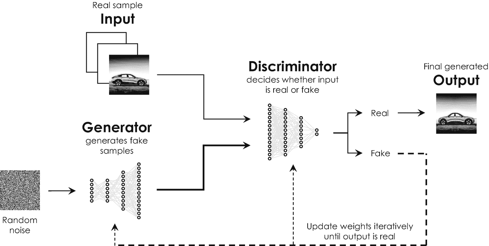

图 4-13

生成性对抗神经网络的示意性结构和操作原理。生成器网络生成伪图像，作为鉴别器网络的输入。后者估计这个输入是真的还是假的。一旦鉴别器确定输出是真实的，迭代训练就结束

#### 深度学习:生成性对抗神经网络

另一类非常有趣且相对较新的机器学习模型是*生成对抗神经网络*，这位法裔美国计算机科学家、脸书的人工智能研究主管 Yann LeCun 曾称之为“过去 10 年中最有趣的想法” [57](#Par297) 。它们是由美国计算机科学家 Ian Goodfellow 和他在蒙特利尔大学的同事于 2014 年发现的，由两个相互竞争的人工神经网络组成。这场竞争产生了“对抗性”这个术语，这个术语来源于*博弈论*，一门模拟理性决策的数学学科。 [20](#Fn20) 它们的基本架构如图 [4-13](#Fig13) 所示。生成对抗性神经网络包括两个子组件，一个*生成器网络*和一个*鉴别器网络*，每个子组件展示不同的架构。发生器网络的初始输入是随机噪声，而鉴别器网络的输入数据集包含真实样本图像(训练数据)和发生器的输出图像。生成器的目标是在这种配置中创建假图像，而鉴别器估计其输入是真图像还是假图像。随着时间的推移，两个竞争网络通过训练变得越来越好，生成器最终被迫创建一个新的图像，从一次迭代到另一次迭代，这个图像看起来越来越真实。在几个时期之后，鉴别器将估计其生成的输入图像是真实的，并且训练过程结束。然后，生成对抗性神经网络实现了它的主要目标，即从包含真实图像的数据集生成一个全新的、看起来真实的(假)图像。

在这一点上，你可能会正确地问自己，这样的网络是否有任何用处，或者只是数据科学家创造有趣图像的游戏。首先，重要的是注意到*对抗学习*从概念的角度来看特别有趣，因为它提供了一种不需要任何成本函数的统计学习的新方法。生成对抗性神经网络更愿意学习它自己的成本函数，从而绕过用心设计和构建的需要，这可能是非常费力和耗时的[ [61](#Par301) ]。Yann LeCun 曾在 2016 年的 NIPS 会议上描述了为特定用例找到合适的成本函数的挑战——这是世界上最大的人工智能研究会议之一——如下:“如果智能是一块蛋糕，无监督学习将是蛋糕，监督学习将是蛋糕上的糖衣，强化学习将是蛋糕上的樱桃。我们知道如何制作糖衣和樱桃，但我们不知道如何制作蛋糕。”三年后，在旧金山 ISSCC 的一次演讲中，他更新了他著名的*蛋糕类比*，用“自我监督学习”取代了“无监督学习”对于这个术语，他指的是一种学习策略，其中数据本身提供监督，并充当培训师，与其在生成性对抗性神经网络中的角色相当。在他眼里，“下一场 AI 革命不会被监督，也不会纯粹被强化。未来是拥有海量数据和非常大的网络的自我监督学习。”

除了这种概念上的相关性之外，与其他神经网络体系结构相比，生成对立神经网络也为各种应用提供了优越的性能。在这种情况下，最流行的应用是高级照片编辑，包括风格转换[21](#Fn21)T3】[[62](#Par302)]和混合、图像内画[ [63](#Par303) ]、从(肖像)图像中进行人脸老化和年龄估计[ [64](#Par304) ]、照片真实感图像创建[ [65](#Par305) ]，以及用于姿态不变人脸识别的人脸正面视图生成[ [66](#Par306) 。最后一个应用程序可能在分析公共安全摄像机的数据中起着至关重要的作用，例如，独立于罪犯的姿势和风格来直观地跟踪和识别罪犯，以减少犯罪和执行起诉。生成对抗性神经网络最近也进入了国际艺术品拍卖舞台，英国拍卖行佳士得出售了由这种网络创建的第一幅图像。这幅画的标题是“爱德蒙·贝拉米的肖像”，描绘了一个肥胖的，可能是法国人的绅士，穿着深色的厚外套和朴素的白领。信不信由你，这幅画于 2018 年 10 月 25 日在佳士得版画&倍数拍卖会上以 43.25 万美元的价格售出，几乎是其最高估价的 45 倍。

生成式对抗性神经网络的另一个越来越受欢迎的应用是*生成式设计*，它指的是一个迭代设计过程，根据用户指定的某些约束，一个程序创建一组设计对象，用户随后可以对这些对象进行微调。例如，剑桥咨询公司大学的一个团队开发了一个名为“Vincent AI”的程序，它可以根据预先选择的手写笔将粗糙的人类草图转化为艺术。 [22](#Fn22) Autodesk 的 Dreamcatcher AI 项目 [23](#Fn23) 一直在探索一种类似的方法，并开发了一种商业上可访问的平台，该平台可以根据上传的 CAD 文件自动生成不同的设计选项，这是工业设计应用程序的主要数据格式。

这些例子表明，人工智能也正在成为艺术领域的一股颠覆性力量。各种公司抓住了这一趋势，并开始探索艺术、设计、创意和人工智能之间令人兴奋的联系。例如，谷歌在 2016 年推出了“艺术和机器智能计划”，该计划将世界各地的艺术家和工程师聚集在一起，探索人工智能如何改变创意实践[ [68](#Par308) ]。

但不幸的是，生成性敌对网络也被恶意地用于不那么令人钦佩的事情。一个例子是所谓的*深度假货*，它涉及利用这种技术来创建误导性的虚假图像、视频或新闻。比如，基于生成性对抗网络的风格转移使得知名政治家和国家领导人可以说你告诉他们的任何话——这对基于假新闻的政治宣传活动来说是一个非常危险的资源。

#### 深度学习:推荐系统

像亚马逊、网飞、潘多拉和 LinkedIn 这样的公司也应用了另一类叫做*推荐系统*的机器学习算法，来帮助他们平台的用户发现可能有趣并值得购买的新商品(例如，书籍、视频、音乐和文章)。推荐系统由此创建令人愉快的用户体验，同时推动相应平台或市场供应商的销售和收入。图 [4-6](#Fig6) 区分了三种不同类型的推荐系统:(1)基于内容的，(2)基于模型的，以及(3)基于记忆的推荐系统。例如，在美国音乐流媒体和互联网广播服务公司 Pandora，一组音乐人用数百个属性和关键词手动标记每个音乐电台，如流派和艺术家。然后，每当用户选择某个音乐电台时，Pandora 就会自动添加具有相同属性的歌曲，并最终为其数百万用户中的每一个人生成个性化的播放列表。这是一个基于*内容的*推荐系统的例子，它将用户配置文件与具有相同属性和关键字的不同项目相匹配。这种算法计算速度快且可扩展，因为它们可以容易地扩展到新的项目和客户。

在基于*模型的*推荐系统中，算法从大型数据集中提取一些信息或行为模式，并将其用作模型来做出未来的推荐。这种方法对于那些只随时间缓慢变化并且不需要频繁更新的模式特别有用，因为构建模型通常是一个耗时且耗费资源的过程。一个例子是基于社会知识的系统[ [69](#Par309) ]。

基于*记忆的*推荐系统的一个例子是亚马逊的前电子商务代理商在其网站[ [70](#Par310) ]的“购买了你购物卡上的商品的顾客也购买了”部分。由于下面的论点，这个代理可能会对亚马逊的商业模式产生有趣的影响。随着时间的推移，代理变得越来越好，其预测准确性可能偶尔会超过某个阈值，超过这个阈值，亚马逊将它预测你会想要的商品运送给你，而不是等待你订购，这样会更有利可图。从亚马逊的角度来看，这种*预测*或*预期运输*有两个优势:(1)它的便利性使你不太可能从竞争对手那里购买商品，以及(2)它促使你购买你考虑过但最终可能不会购买的商品——这两种情况最终都会增加亚马逊的钱包份额。由于购物者不想费心退回他们不想要的商品，亚马逊可能会投资于方便处理产品退货的基础设施，例如送货式卡车或自动无人机，它们大约每周一次定期拾取和收集商品。作为一个持怀疑态度的读者，你可能会惊讶地得知，亚马逊早在 2013 年就获得了美国预期运输专利，专利号为 8，615，473 美元 B2 [ [71](#Par311) ]。

然而，实现推荐系统的最重要的算法在技术上被称为*协同过滤*，它采用某些措施来识别数据集中用户-项目和项目-项目对之间的相似性[ [72](#Par312) 。这些相似性度量然后被用于预测数据集中不存在的新对的评级。出于显而易见的原因，数据科学家在这种情况下区分了基于*用户的*和基于*项目的*协同过滤。

#### 深度学习:自动编码器

自动编码器是一类非常特殊的神经网络，它允许通过采用无监督学习来有效地编码数据。自动编码器旨在通过使用迭代优化过程来学习最佳编码和解码方案。它们自 20 世纪 80 年代末就已经出现，传统上用于 T4 降维，即通过删除可有可无和不相关的数据来减少数据集的大小。它们的操作类似于 ZIP 文件格式，允许我们压缩和存档各种数据。与 ZIP 算法相反，自动编码器的数据压缩方案不是预定义和固定的，而是通过基于要压缩的数据集中普遍存在的统计上最相关的特征和模式的迭代训练来学习和优化的。

### 集合方法

*集成方法*将多种机器学习算法结合到一个预测模型中，以发挥它们各自的优势——“整体大于部分之和”，用亚里士多德的名言来说。为此，集成方法“平均”不同算法的结果，并最终输出具有最高集成值的预测，这可以用集成平均值来解释。根据计算平均值的特定方式，数据科学家区分了三种不同的方法:

1.  装袋以减少预测的方差

2.  增强以减少预测的偏差(“偏见”或“刻板印象”)

3.  堆叠以改进预测

*Bagging* 代表“bootstrap aggregation”，指的是一种通过平均所有结果来计算集成值的集成方法。最著名的例子是*随机森林*算法，它简单地平均由集合中不同算法形成的决策树的不同分支的结果。例如，当你用智能手机或数码相机拍照时，它的面部识别功能会在人们的面部周围画出方框，以最佳方式描绘他们。这个函数很可能是随机森林算法的结果，在该算法中，集合中的一个算法拾取眼睛，另一个拾取耳朵、嘴巴等等。每个算法将输出检测到这些面部属性的特定概率。集成算法对这些概率进行平均，并输出在输入图像中检测到面部的总集成值或概率。如果这个概率大于某个阈值，比如说 60%，相机应用程序会相应地在特征周围画一个框。随机森林算法特别有利于实时图像处理，因为它们通常在速度上优于人工神经网络。 *Stacking* 采用某种决策模型，如多项式回归，来计算集成中不同算法的集成平均值。这种方法在实践中通常不太有效，因为决策模型不容易适应特定的用例。 *Boosting* 算法，第三组集成方法，顺序应用集成中的不同算法，即一个接一个。这种方法的主要优势在于后续算法可以修正前一个算法的错误。然而，它们确实不能很好地并行处理，但通常仍比人工神经网络快。例如，据报道，谷歌和脸书在他们的搜索引擎中使用提升算法，根据相关性对搜索结果进行排序。

你可能非常熟悉的另一个 ensemble 方法的应用是 WhatsApp、微信或 iMessage 等消息应用程序中的查询自动完成功能，它可以在你开始输入消息时预测下一个可能的单词。例如，如果你开始输入“他”，应用程序可能会建议“你好”或“这里”，也就是在这种情况下最常用的词。谷歌也将这类算法用于谷歌翻译，谷歌翻译于 2006 年推出，自那以来不断进步，支持 100 多种语言和超过 1000 亿个单词[ [76](#Par316) ]。然而，谷歌确实在 2016 年为其多语言翻译系统改用了深度学习算法，因为长短期记忆最终变得更加强大和准确，因为它们也能够根据上下文评估单词。这就是为什么谷歌同时称其翻译系统为“神经机器翻译系统” [77](#Par317) 。

### 强化学习

最后，我们得到了看起来像真正的人工智能的东西。这是因为这种方法与数据无关，而是与未知(虚拟)环境的探索有关，例如在未知城市的自动驾驶汽车。事实证明，世界上所有道路规则和地图的知识都不会教会自动驾驶汽车的自动驾驶仪如何安全合规地驾驶[[78](#Par318)]——这种现象在其他应用中也可以观察到。

这就是为什么科学家开发了一种全新的学习方法，叫做*强化学习*。这种方法相当于用饼干奖励一只狗来训练它。早期的实验可以追溯到俄罗斯心理学家伊凡·巴甫洛夫，他在 19 世纪 90 年代末用狗做了一系列实验。为此，他总是在给笼子里的狗喂食时摇铃。重复这一过程几次后，他观察到，敲钟总是会引发唾液反应，狗偶尔会学会将敲钟与附近的食物联系起来，并据此做好准备，这就是后来心理学上所谓的*经典条件反射*。条件反射不仅成为心理学中行为主义的基础，也是今天强化学习的基本思想。在手头的例子中，这条狗更正式的称呼是*代理人*和它的笼子*环境*。在这种环境下执行一个*动作*，比如“听到铃声”或者“抓住食物”，据说会改变狗的*状态*。从技术上讲，代理的状态描述了代理在其环境中的情况或位置。代理的动作和状态这两个参数决定了它在采取动作后的*回报*。伊万·巴甫洛夫(Ivan Pavlov)是这个例子中的教练，他决定代理人是否得到奖励，技术上叫做*翻译*。强化学习中的代理人追求某种*政策*，即一系列旨在最大化回报的行动。如图 [4-14](#Fig14) 所示，该策略在训练过程中反复优化。根据政策的优化是否基于环境的某个模型，科学家们区分了基于*模型的*和无*模型的*强化学习。由于无模型强化学习更加灵活，能够适应及时变化的环境，这是迄今为止这个迷人的研究领域最受欢迎的方法，它提供了许多应用。

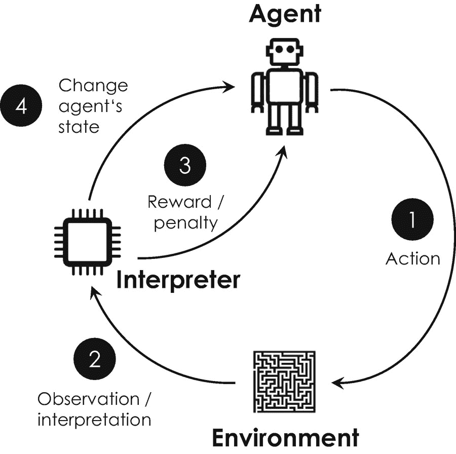

图 4-14

试图逃离迷宫的智能体(机器人)的强化学习的循环过程。(1)该过程始于代理人做出一个任意的步骤或动作。(2)翻译观察代理的行动，并评估这是否使其更接近迷宫的出口。(3)如果是，解释器奖励机器人，否则对代理的成本函数进行惩罚。(4)每个动作最终改变机器人在环境中的状态，过程重新开始。机器人将通过多次执行这一循环过程来改善其行为，同时在每一步中以最大化其报酬(或最小化其成本函数)为目标

强化学习的数学概念可以追溯到理查德·贝尔曼在 1954 年关于*动态规划*的开创性工作[ [79](#Par319) ]，其中他通过证明动态优化问题的每个解都由更简单的部分解组成，提出了著名的*最优化原理*。理查德·贝尔曼用这样的话描述了他的原则:“一个最优策略具有这样的性质，无论初始状态和初始决策是什么，剩余的决策必须构成关于第一个决策产生的状态的最优策略”。为了进行更定量的数学描述，他引入了一个递归数学函数，将环境中一个主体的最优行为与预期回报和结果状态联系起来。这个方程被称为*贝尔曼方程*，并形成了至今为止强化学习的理论基础。

Reinforcement Learning

强化学习是关于一个代理在一个环境中采取行动。代理人或“行动者”将因其行动获得奖励或惩罚，这取决于该行动是否使其更接近最大化奖励的最终目标。如果您不能定义代理在环境中的理想状态，并且如果了解环境的唯一方式是与它交互，那么这种方法是合适的。

后来，通过用更好地描述现实的随机和及时变化的环境代替确定性环境，贝尔曼方程得到了发展(或抽象)。例如，更真实的环境可能涉及第二只竞争的狗，它也试图抓住奖励的食物。随机环境影响代理的最优行动选择策略，数学上称为*有限马尔可夫过程*。 [24](#Fn24) 英国计算机科学家 Christopher Watkins 于 1989 年首次描述了有限马尔可夫过程对贝尔曼方程的抽象[ [80](#Par320) ， [81](#Par321) ，并被称为*Q-learning*—“Q”代表“质量”，因为代理学习在每种情况下执行最“定性”的动作。Q-learning 可以被认为是强化学习的一个主要扩展，因为它允许将这种模型应用到现实生活中。

强化学习最流行的演示之一是计算机程序“AlphaGo”。这个程序是由 DeepMind Technologies 开发的，后来被谷歌收购，是为了玩围棋而创建的。围棋是 2500 多年前由神话中的中国皇帝姚发明的，目的是教导他的儿子纪律、注意力和心理平衡。围棋是一种非常受欢迎的中国战略棋类游戏，适合两个人玩，今天全球有超过 4600 万玩家。在每场游戏开始时，两个玩家会得到一套白色或黑色的棋子或“石头”从黑棋玩家开始，两位玩家开始交替地将他们的石头放置在格子中线条的交叉点上 [25](#Fn25) ，目的是创建一组相连的石头，这些石头围绕着一个比对手更大的封闭区域。当一个玩家包围一个或多个敌人的石头时，他们捕获它们并将它们不可逆转地从棋盘上移除。游戏继续进行，直到双方都不想再走一步，或者都无法拿到对方的石头。由于玩家通过包围空白区域来获得点数，因此拥有最大区域的玩家最终赢得游戏。尽管围棋的规则相对简单，但它非常复杂，因为它的棋盘比国际象棋大，下一步棋的可能性也大得多。据估计，合法董事会席位数的下限为 2 × 10 170 [ [83](#Par323) ，远远大于宇宙中基本粒子的数量。这就是为什么 DeepMind 不能使用 IBM 在 20 年前使用的*暴力破解*、 [26](#Fn26) 来实现他们的下棋计算机深蓝。相反，由英国计算机科学家、DeepMind 创始人戴密斯·哈萨比斯领导的 AlphaGo 研究团队使用了一种复杂的算法来进行模式识别，这种算法是通过强化学习训练的，因为可能的走法数量是无穷无尽的，几乎不可能进行编程和预测。AlphaGo 依赖于由不同深度神经网络构建的三个主要组件:一个(1)用于选择棋步的策略网络，一个(2)寻找可能的下一步棋的树搜索算法，以及一个(3)评估不同棋盘位置的价值网络。策略网络被训练为基于当前的棋盘位置和获胜的最高概率来选择最佳的下一步棋。为此，它首先通过基于人类专家玩家数据的监督学习来训练，并在第二步中通过基于自我游戏强化学习的自我游戏来推进。在扫描当前棋盘位置后，策略网络初始化树搜索算法，该算法寻找游戏的不同变化，并试图找出几步后可能发生的情况-为此，它通常会提前 50 到 100 步。然后，价值网络评估不同的变化，计算每个变化的获胜概率，以便策略网络可以相应地选择获胜概率最高的移动。2016 年，AlphaGo 在五局比赛中以 4:1 [ [85](#Par325) ]击败韩国围棋大师李世石后，占据了各大报纸的头条，这被认为是一个人工智能发展的关键里程碑。在那之前，围棋被认为太复杂了，任何智能程序都无法掌握。台湾著名计算机科学家、谷歌中国创始总裁和技术投资者李开复在他最新出版的《人工智能的超能力》一书中指出，中国政府宣布谷歌 AlphaGo 计算机的惊人表现是他们自己的 Sputnik 时刻，并决定将人工智能领域的世界级领先地位作为国家优先事项。在这种情况下，他进一步评论说，“美国和加拿大拥有世界上最好的人工智能研究人员，但中国有数百名优秀的人，以及更多的数据...AI 是一个你需要一起进化算法和数据的领域；大量的数据产生了巨大的差异。”

## 4.4 主要使用案例和业务应用

前面对人工智能的介绍表明，大多数深度学习算法需要大数据集来进行有效的训练。此外，他们的培训需要访问(高性能)计算机系统，这些系统可以在合理的时间尺度上以数字方式模拟神经网络。这就是为什么人工智能的采用在历史上与大数据的到来、高效的训练算法以及允许不同计算并行化的强大计算机的发展密不可分。现代意义上的术语*大数据*是由 O'Reilly Media 的市场研究总监 Roger Magoulas 在 2005 年首次提出的。他用这个术语描述了非常大的数据集，这些数据集几乎不可能使用当时可用的商业智能工具来管理、操作和处理。 [28](#Fn28) 随着互联网的推出以及智能手机和其他数字设备的到来，大数据变得可用，人工智能的研究和开发蓬勃发展。提出的用例的数量和复杂性稳步增加，并且其应用范围从那时起一直在扩大。但在我们更详细地研究人工智能最重要、同样令人兴奋的用例之前，简要了解一下最先进的计算硬件是有益的，这些硬件实现了广泛的应用，并允许训练高度复杂的机器学习模型。

### 人工智能芯片

绝大多数深度学习算法的训练在数学上涉及到激活函数和权重的重复计算。无需深入细节，这些计算涉及数千个数字的乘法和加法，这些数字表征了不同的神经元及其之间的联系。这些数字通常排列在特殊的数组中，数学上称为*矩阵*。早期，这种矩阵计算通常在已经存在多年的 CPU 上进行——世界上第一个 CPU 是 1971 年发布的英特尔 4004[[104](#Par344)]——旨在非常快速地执行单个操作，但不一定同时执行。内置于最先进的个人计算机中，CPU 仍然是许多人工智能应用程序的首选硬件，这些应用程序对时间不敏感，并且不依赖于高度复杂和计算密集型的算法。

CPU 的基本架构是由传奇的德国计算机先驱约翰·冯·诺依曼在 1945 年构思的，包括计算核心和内存以及其他物理子组件。这两个组件通常在 CPU 微芯片上彼此靠近但在空间上分离，并通过具有有限带宽的通信系统或*总线*连接。这种限制只允许在一定时间内在计算核心和内存之间流动一定量的数据。有限的带宽造成了数据传输速度的瓶颈，称为*冯诺依曼瓶颈*，这使得在传统 CPU 上用大数据训练神经网络的效率非常低。 [29](#Fn29) 为了加快他们训练深度学习算法的计算速度，各家公司开始使用*图形处理器*或 GPU 来代替，将不同的计算并行化。与 CPU 相反，GPU 最初是为计算机游戏行业设计的，用于非常高效地处理快速变化和高分辨率的图像。例如，美国计算机科学家吴恩达和他在斯坦福大学的同事在 2009 年通过在 GPU 上训练一个拥有超过 1 亿个参数(权重和激活函数)的多层神经网络，令人印象深刻地展示了这种方法的优势。他们的实验显示，在特定情况下，GPU 上的训练速度比最先进的 CPU 快 70 多倍[ [105](#Par345) ]。从那时起，GPU 成为训练复杂人工神经网络的首选方法。

然而，CPU 和 GPU 都没有针对机器学习进行设计和优化。这就是为什么各种技术公司最近开始开发专门的芯片组，这些芯片组专为高度并行计算而设计，并为在非常大的数据集上训练人工神经网络而优化。这些微芯片通常包括数千个所谓的*乘累加核心*或由互连晶体管电路组成的 MAC 单元，这些电路重复执行*A*+(*B*T6】C 类型的矩阵计算。这里， *A* 、 *B* 和 *C* 表示代表人工神经网络的不同参数的三个矩阵，并且通常每个矩阵包括多达 8500 个十进制数。包含这种 MAC 单元的微芯片在文献中被称为*神经处理单元*或 NPUs、神经网络加速器或 AI 芯片。

表 4-1

按字母顺序排列的人工智能芯片供应商的建筑微芯片设计

<colgroup><col class="tcol1 align-left"> <col class="tcol2 align-left"> <col class="tcol3 align-left"> <col class="tcol4 align-left"> <col class="tcol5 align-left"></colgroup> 
| 

传统的冯·诺依曼式架构

 | 

片上计算和存储器

 |
| --- | --- |
| 

社会学

 | 

CPU/GPU

 | 

TPU

 | 

计算近内存

 | 

内存计算

 |
| --- | --- | --- | --- | --- |
| ·担架-布莱斯节奏-耐恩轻物质莫卧儿英伟达高通挥手 | 英特尔 Xenon英伟达桑巴诺瓦 | 阿里巴巴亚马逊-卡麦隆谷歌groq哈瓦那地平线英特尔神经网络 | 脑波图形核心你好Syntiant解除人工智能 | 神话 |

npu 的计算性能无法轻易比较，因为它严重依赖于用于比较其性能的人工神经网络的特定架构。这就是为什么由百度、谷歌、哈佛大学、斯坦福大学和加州大学伯克利分校联合创建的在线平台 MLPerf [31](#Fn31) 开发了一种标准化的基准测试。这项测试被称为“ResNet-50”分类基准测试，涉及使用标准化和预训练的 50 层卷积神经网络对 ImageNet 数据库 [32](#Fn32) 中的 100 万张图像(1000 个对象类别)进行分类——记录的性能指标是分类的“每秒图像”或 IPS 的数量。表 [4-1](#Tab1) 根据微芯片设计汇总了最受欢迎的人工智能芯片制造商，并在下文中举例说明。

*   *阿里巴巴*在 2019 年推出了第一款名为“汉光 800”的 AI 芯片。它专为云计算应用而设计，在 ResNet-50 中被分类为多达 69，306 个 IP。它包括 170 亿个大小仅为 12 纳米的晶体管，这就是为什么这项技术也被称为 12 纳米工艺技术。在这种情况下，晶体管比一根头发的横截面小 1 万倍。

*   *亚马逊*于 2018 年通过亚马逊网络服务(Amazon Web Services)公布了其“推理”AI 芯片。这款芯片是亚马逊在 2015 年收购美国半导体公司 Annapurna Labs 的成果，也是为云计算应用而设计的。在 ResNet-50 性能基准测试中，它能够处理大约 15，000 个 IP。

*   脸书和 T2 的英特尔正在联合开发一款人工智能芯片，并计划很快发布。英特尔之前一直在研究神经网络加速器，但在以 20 亿美元收购以色列芯片制造商 Habana Labs 后不久，于 2020 年初停止了其“Nervana Spring Crest”处理器的开发，该处理器的技术名称为“NNP-T1000”。哈瓦那实验室最近推出了“高迪 HL-2000”芯片，可以在 ResNet-50 中对多达 1650 个 ip 进行分类。该微芯片基于 16 纳米工艺技术。

*   *谷歌*:其最新版本的“TPU v3”芯片(*张量处理单元*的缩写)是为谷歌的云计算服务设计的，据报道在 ResNet-50 中分类了多达 32716 个 ip。这种特殊的技术至今还没有发表，这让你对这个高度动态的市场中的竞争动态有了一个很好的印象。

*   *Nvidia* 目前是 GPU 芯片的市场领导者。其最具性能的特斯拉系列的最新版本是“英伟达特斯拉 V100 GPU”，旨在加速不同的深度学习算法，并据报道在 ResNet-50 中对 55，597 个 IP 进行了分类。它总共包含 211 亿个晶体管，基于 12 纳米工艺技术。Nvidia 还为自动驾驶提供了一系列片上系统或 SoC 系统，这将在 4.4.2 节中介绍。

*   脑波强化系统公司是一家美国初创公司，采用了一种大胆的方法:他们只是要建造有史以来最大的人工智能芯片。他们的“晶圆级引擎”(WSE Gen2) NPU 比“Nvidia A100”芯片大 56 倍，这是有史以来最大的 GPU，应该包含 2.6 万亿个基于 7 纳米工艺技术的晶体管。 [33](#Fn33) 其 ResNet-50 尚未发布，但据推测将为训练神经网络提供巨大的速度增益。

*   *索尼*发布了 2020 年首款智能视觉 AI 芯片 [106](#Par346) 。“IMX500/501”智能视觉传感器在一个芯片上实现了 1230 万像素图像和 4K 视频T5】34的图像捕捉和分析。这种微芯片可以嵌入到数码相机中，以捕捉图像，分析图像，并输出图像的意义而不是原始数据，这大大减少了输出数据的数量。这种方法不需要任何集中式和潜在的基于云的图像分析。这种设备对边缘计算特别有意义，在边缘计算中，数据处理是由位于网络“边缘”的设备生成的。边缘计算可以减少网络流量、隐私泄露风险、电力以及将原始数据从一个设备传输到另一个设备的相关成本。

*   *特斯拉*:2019 年推出的“FSD 计算机”(全自动驾驶的缩写)是特斯拉自动驾驶的核心。它每秒钟可以处理多达 1，200 张全高清图像，包括 9，216 个 MAC 单元和 60 亿个基于 14 纳米工艺技术的晶体管。

除了早些时候列出的选定科技公司，各种较小的创业公司最近在创新和强大的人工智能芯片的开发上加快了速度，例如两家中国公司 Cambricon 和 Horizon Robotics 或美国创业公司 SambaNova Systems。其他值得注意的初创公司包括 Blaize、Graphcore、Groq、Kneron、Lightmatter、Mythic、Untether AI 和 Wave Computing。从我们对人工神经网络的讨论中，我们知道 Yann LeCun 曾经指出:“硬件能力...激励和限制人工智能研究人员将会想象并允许自己追求的想法类型。我们所掌握的工具比我们愿意承认的更能塑造我们的思想。

随着如此多的资金和资源投入到人工智能中，过去几年中出现了创新和应用的激增。人工智能已经擅长许多“人类”的工作，这就是为什么两位商业顾问詹姆士·威尔森和保罗·多尔蒂正确地指出:通过这样的*协作智能*，人类和人工智能积极地增强彼此的互补优势:前者的领导能力、团队合作、创造力和社交技能，后者的速度、可扩展性和量化能力。对人来说很自然的事情(例如，开玩笑)对机器来说可能很棘手，对机器来说很简单的事情(分析数十亿字节的数据)对人类来说几乎是不可能的。

我们将在以下章节中看到，人工智能已经应用于所有行业的广泛应用，包括汽车、医疗保健、能源和金融。为了完整起见，表 [4-2](#Tab2) 对所选业务应用进行了更全面的概述。我们将在下面仔细看看最受欢迎的。

### 4.4.2 计算机视觉

计算机视觉最近在工业和媒体中引起了极大的关注，因为它提供了广泛的应用，例如“走出去”购物技术

亚马逊 Go、视觉导航机器人和特斯拉用于自动驾驶的“全自动驾驶计算机”，我们将在这一部分进行更详细的研究。

表 4-2

最广泛使用的机器学习算法及其应用

<colgroup><col class="tcol1 align-left"> <col class="tcol2 align-left"> <col class="tcol3 align-left"></colgroup> 
| 

学习类别

 | 

算法

 | 

示例性应用

 |
| --- | --- | --- |
| 监督学习 | 回归 | 价格点优化、周期时间分析、质量保证 |
| 分类 | 预测性维护、客户细分、垃圾邮件过滤、欺诈检测 |
| 无监督学习 | 联合 | 购物卡分析和基于相似消费者的偏好推荐消费者接下来应该购买的更多产品(例如，文章、书籍、视频) |
| 使聚集 | 智能制造、在线质量控制和保证、客户细分、情感分析、欺诈检测 |
| 降维 | 数据压缩、图像、语音和音频处理、主题建模 |
| 深度学习 | 人工神经网络 | 车间管理、计算机视觉、物体检测、面部和声音识别 |
| 卷积神经网络 | 自动驾驶的物体检测，通过医学扫描、计算机视觉诊断健康疾病，通过在线摄像头检测缺陷产品进行质量控制 |
| 复发性 NNs | 虚拟助手和聊天机器人的自然语言处理和翻译，跟踪图像随时间的视觉变化，通过创建标题和关键字来标记图像，基于信用卡使用情况的欺诈检测 |
| 生成型神经网络 | 照片编辑、照片真实感图像创建、人脸正面视图生成和姿态不变人脸识别 |
| 推荐系统 | 根据用户资料、物品属性或以前的销售情况，向客户推荐类似的物品(文章、书籍、视频和其他产品) |
| 自动编码器 | 通过删除不相关的数据实现高效的文件和数据压缩 |
| 集成方法 |   | 通过相关性、人脸识别、语言翻译对搜索引擎的结果进行排序 |
| 强化学习 |   | 自动驾驶、交易策略优化、平衡电网与变化的需求、机器人编程、实时拍卖价格优化 |

#### 计算机视觉:购物技术

Amazon Go 于 2018 年推出，是美国的一家连锁便利店，在西雅图、芝加哥、旧金山和纽约市拥有 26 家公开和宣布的商店。这些商店是部分自动化的，顾客可以购买他们的产品，而无需收银员结账或使用自助结账台。顾客需要登录一个智能手机应用程序，该应用程序允许顾客进入商店，并提供自动结账的移动支付系统。这种“走出去”的技术——正如亚马逊所说——基于由深度学习和*传感器融合* [35](#Fn35) 驱动的计算机视觉，它可以自动跟踪你挑选的商品，并将它们添加到你的虚拟购物车中。如图 [4-15](#Fig15) 所示，该系统包括许多摄像机、货架上的传感装置和自动出口门。这些组件的信号首先由一个流媒体服务聚合，这是一个云平台，使所有数据可供进一步处理。Just Walk Out 技术部门分析这些数据，识别客户，分析他们的活动，并识别产品，以便将某个客户 ID 与一组选定的项目关联起来。为此，深度学习被用于客户关联、物品识别、姿势估计和行动决定，以精确回答关于“谁购买了什么以及将购买什么”的开创性问题。该信息被不断地添加到虚拟购物车中，并在结账时被检索以向相应的顾客开出账单。据亚马逊这项技术的首席科学家杰拉德·梅迪奥尼(Gerard Medioni)称，主要挑战确实是个人识别步骤，因为顾客可能彼此非常接近，也可能被商店中的某种东西挡住视线，他们分别称之为“纠结状态”和“遮挡”。亚马逊也在 2020 年开始将这项技术授权给其他零售商[ [87](#Par327) ]。例如，在[ [88](#Par328) ]上可以找到关于这种基于人工智能的非常精细的数字技术的非常详细的介绍。

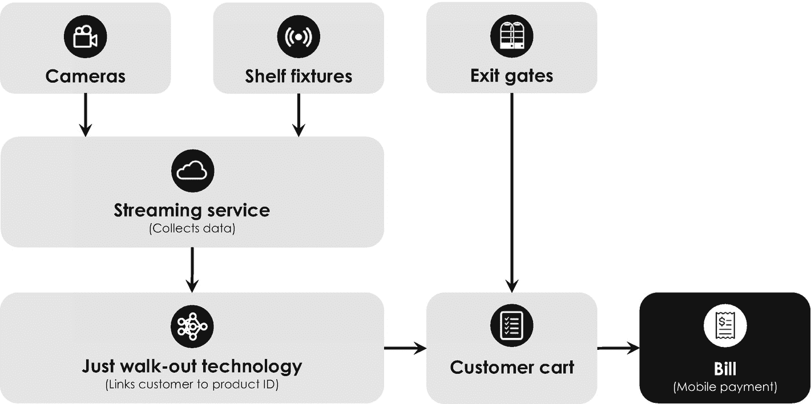

图 4-15

亚马逊“走出去”技术的高层架构越来越多地用于 Amazon Go 杂货店和其他零售店

#### 计算机视觉:视觉引导机器人

结合物理机器人，计算机视觉还可以用于自动化和加速工业制造流程和仓库物流。比如，美国初创公司 Vicarious 的投资者包括杰弗里·贝佐斯(Jeffrey Bezos)、埃隆·马斯克(Elon Musk)和马克·扎克伯格(Mark Zuckerberg ),该公司正致力于开发基于人工智能和实时数据分析的免编程和视觉引导机器人技术，用于打包、码垛、机器维护、包装、拣箱和分拣。另一个例子是总部位于旧金山的初创公司 Kindred AI，它最近推出了名为“AutoGrasp”的机器人智能平台它将计算机视觉与先进的抓取和操纵技术相结合，以控制在线零售配送和履行中心等场所使用的拣货机器人。 [37](#Fn37) 他们的产品已经被证明在 2020 年灾难性的新冠肺炎疫情期间特别有用，可以在此期间处理越来越多的在线订单，而由于社交距离规则，满足这些订单的员工更少。

#### 计算机视觉:自动驾驶

自动驾驶是计算机视觉的第三个应用，值得一提并详细说明。虽然自动驾驶汽车似乎是一项非常新的技术，但研究人员和工程师已经建造了三十多年。随着 1986 年世界上第一个计算机控制的飞行器“Navlab 1”的生产，对计算机控制的飞行器的研究开始于卡内基梅隆大学。Navlab 1 由一辆雪佛兰厢式车改造而成，配备了五个机架的计算机硬件，包括一个全球定位系统(GPS)。不幸的是，这种飞行器受到各种软件的限制，直到 20 世纪 80 年代末才完全投入使用。大约在同一时间，Dean Pomerleau 开始在同一机器人研究所开发 ALVINN，这是一种“神经网络中的自主陆地车辆”。ALVINN 配备了一个安装在驾驶室的摄像机，用于道路跟踪任务。它由一个人工三层神经网络控制，该网络由 Ian Goodfellow 的反向传播算法训练，能够以高达 70 英里/小时的速度行驶[ [90](#Par330) ]。这是卡内基梅隆大学八年军事资助研究的成果。

另一种具有历史意义和同样传奇色彩的自动驾驶汽车于 1985 年出现在大洋彼岸的德国，由德国动态计算机视觉先驱 Ernst Dickmanns [ [91](#Par331) ]开发。他的五吨重的重新设计的奔驰面包车有一个相当麻烦的名字 VaMoRs——一个德语缩写“Versuchsfahrzeug für Autonome mobilit t und Rechnersehen”——能够根据摄像机记录的图像序列的实时评估自动控制方向盘、油门和刹车。VaMoRs 成功地在高速公路上驾驶，以及在白天和晚上以 19 英里/小时的速度在双车道道路上行驶，并具有避障功能。它的操作也是基于控制这种半自动车辆的感知机。

然而，自动驾驶的真正转折点出现在 2004 年的伊拉克战争中，当时美国国防高级研究计划局(American Defense Advanced Research Projects Agency，简称 DARP)提议使用这种车辆来提高士兵的安全性。从那以后，各种(半)自动化车辆被制造出来，谷歌 Alphabet+Waymo、亚马逊+Zoox、Argo AI、Lyft 和特斯拉只是除了老牌汽车制造商之外进入这一全球业务的少数几家公司。为了满足非常高的安全标准，自动驾驶需要对一系列不同的传感器和控制单元进行冗余信号分析，包括摄像头、超声波和雷达传感器、车轮跳动和转向角度传感器以及导航系统。 [38](#Fn38) 即使在低自主水平下，自动驾驶汽车也需要处理超过 10 GB/s 的数据，这是一个非常庞大的数据量——相比之下，如果你的智能手机有 32 GB 的存储内存，那么不到四秒钟就会充满，假设它的内存甚至能够以这样的高速存储数据。具有最高自主级别的全自动无人驾驶车辆甚至有望以高达 100 GB/s 的带宽运行。为了了解不同自动化程度之间的细微差别，SAE 国际(以前称为汽车工程师协会)建立了以下五个 SAE *自主级别*:

*   *0 级*–无自动化:一个人在没有任何自动化技术的情况下控制整个车辆。

*   *级别 1*–驾驶员辅助:一台计算机控制有限的功能，如自适应巡航控制或限速器，但一次只能控制一项功能。

*   *Level 2*–部分自动化:车辆结合了自动化功能，如加速和转向，可以同时进行。

*   *Level 3*–条件自动化:汽车自动化所有安全功能。司机不需要监控环境，但必须准备好在出现问题时进行干预。

*   *Level 4*–自动化程度高:汽车一般可以自行驾驶，但也有极少数情况和情况需要驾驶员参与。

*   *Level 5*–全自动化:自动驾驶的圣杯，汽车完全自主，不需要驾驶员做任何事情，除非他们喜欢自己控制车辆。

由于需要解释大量数据来解决自动驾驶任务，人们普遍认为人工智能是实现完全自动化的最有前途的方式。从技术角度来看，目前有两种主要的基于人工智能的 SAE level 5 自治方法，它们在用于确定物体距离和速度的传感器方面有所不同。(1)基于相机的方法仅依赖于光光学相机和雷达，而(2)基于激光雷达的方法使用激光扫描仪、相机和雷达的组合来导航自主车辆。在这种情况下，激光雷达代表“光探测和测距”，指的是一种通过用激光照射物体并使用传感器测量最终反射来测量物体之间空间距离的方法。这两种技术最受欢迎的支持者分别是特斯拉和 Waymo 的第一种和第二种方法。

特斯拉的自动驾驶方法非常独特，与 Waymo 和其他汽车制造商的方法完全不同，因为他们既不使用激光雷达进行距离检测，也不使用高清导航地图。特斯拉更倾向于追求一种完全基于视觉的方法，包括基于人工神经网络对从八个摄像头收集的原始视频流进行实时处理和分析。为了处理这种非常大量的数据，特斯拉开发了自己的“完全自动驾驶”或 FSD 计算机，以处理 8 个摄像头、12 个超声波传感器、1 个雷达传感器和 GPS 的数据，以及导航系统的卡片数据。特斯拉 FSD 计算机的最大输入速率达到每秒 25 亿像素，相当于每秒大约 1200 张全高清图像，其中一张“全高清”图像根据定义包含 1920×1080 像素。自从拥有 8 层和超过 6000 万个权重的卷积神经网络 AlexNet 在 2012 年[ [92](#Par332) ]赢得 ImageNet 比赛并超过人类基准[ [93](#Par333) ]以来，那些网络已经成为图像分类和物体识别的首选方法。 [39](#Fn39) 为此，特斯拉的 FSD 计算机配备了两个模拟卷积神经网络的冗余 npu。 [40](#Fn40) 整体流程如图 [4-16](#Fig16) 所示。每个 NPU 包含超过 60 亿个晶体管，每秒可以执行超过 72 万亿次加法和乘法。例如，关于特斯拉 FSD 计算机的更多技术信息可在[ [95](#Par335) 、 [96](#Par336) ]中获得。

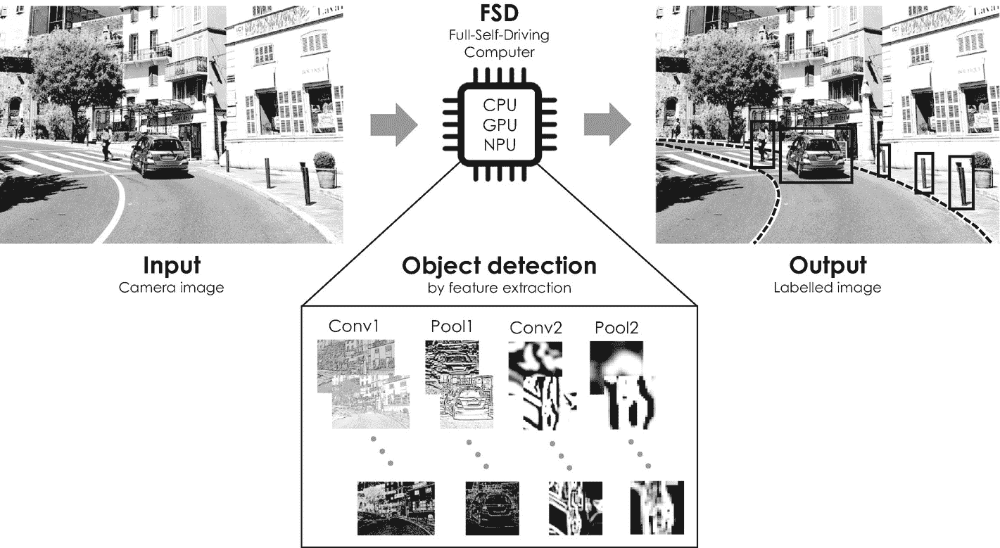

图 4-16

特斯拉自动驾驶仪示意图。FSD 计算机将不同的摄像机图像作为其输入；运行不同的对象识别算法，如道路预测(虚线)；并且在输出图像中标记检测到的对象

但这并不是特斯拉自动驾驶创新方法唯一有趣的方面。第二个是关于消防处电脑的培训。为此，特斯拉建立了一个完整的 IT 基础设施和生态系统，从街道上的车辆中收集原始视频流和数据，以迭代地提高自动驾驶的性能。这些数据在一个大型的全栈和共享主干中进行分析——类似于云——其中包含不同的剩余网络，特斯拉将其称为“消防栓”。每个 HydraNet 都是一个共享的主干，它对自动驾驶任务进行子采样，并专注于特定子任务的优化，例如注释交通标志、车道线、道路标记或预测道路布局，以优化车辆的遥测。特斯拉的敏捷和迭代软件开发过程依赖于快速原型和测试。它通常分为三个主要步骤:

1.  第一步是开发一个功能的第一个近似版本，并使用 HydraNet 数据引擎对其进行训练，以便为 FSD 中的不同卷积网络找到一组合理的权重。

2.  该近似版本随后通过软件更新以无线方式部署到车队，但不直接激活。它是在*阴影模式*下运行的，允许在真实条件下进行进一步测试。该模式进一步获取软件仍然行为不良和不能正确运行的交通状况的照片和视频流。 [41](#Fn41)

3.  第三步包括标记收集的数据，并将其作为额外的例子纳入特斯拉 HydraNet 数据引擎的训练数据集。该额外的训练数据随后用作输入，用于通过相应的 HydraNet 进一步优化近似软件模型。

这三个步骤的过程有时被特斯拉称为*主动学习*，并重复进行，直到软件在阴影模式下记录的所有现实生活条件下可靠安全地运行。一旦其训练完成，软件的最终版本通过空中更新部署到舰队，同时影子模式被停用。多年来，特斯拉一直在优化这一软件开发流程，并通过其自动驾驶仪在 50 多个国家积累了超过 10 亿英里的数据。这种大数据可能偶尔会成为未来超越其他汽车制造商的重要竞争优势。 [42](#Fn42)

与特斯拉相反，Waymo 和大多数传统汽车制造商追求基于激光雷达的自动驾驶方法。Waymo 是谷歌的前自动驾驶汽车项目，同时也是 Alphabet 在加州山景城的美国子公司，旨在根据自己的信息打造世界上最有经验的司机。其产品组合超越了两项服务，一项是名为“Waymo One”的商业自动驾驶出租车服务，另一项是名为“Waymo Via”的商业货物交付服务。Waymo 的竞争优势依赖于一套独特的精细和高度详细的地图技术，这些技术可以帮助车辆导航，即使在传统的地理定位系统难以导航的地方，如隧道或摩天大楼之间。Waymo 的技术套件由四个定制的关键组件组成:(1)激光雷达扫描仪，用于生成高度详细的环境地图，(2)视觉相机，(3)雷达传感器，以及(4)人工智能驱动的计算平台[ [97](#Par337) ]。其最新的第五代“way mo Driver”[98](#Par338)于 2020 年首次安装在旧金山湾区部署的一系列全电动捷豹 I-Pace 车辆上。该系统显示了四个周界激光雷达，为短程探测提供了无与伦比的覆盖范围和宽视野。此外，它采用了一个位于车顶箱上的 360 度激光雷达，称为 Waymo Dome，以提供车辆以及周围行人和物体的 300 米鸟瞰图。该系统由 29 个视觉摄像机补充，用于 360 度和外围远程检测，其中 16 个位于圆顶上的激光雷达下方。十三个摄像机沿着车体集成，其中一些能够以高分辨率看到超过 500 米的范围。周界和周边视觉系统与六个高分辨率成像雷达配合工作，允许在具有挑战性的天气条件下(如雨、雾和雪)跟踪稳定和移动的物体。由于大量的感官数据，Waymo 开发了一种完全不同的环境数据处理方法，称为“vector net”[99](#Par339)。这种相当新的机器学习模型首先将从其高清地图中获得的语义信息——如车道、停车线和十字路口——转换为矢量，即具有长度和方向的几何对象。这些向量然后被输入一种特殊类型的人工神经网络，称为*分层图神经网络* [ [100](#Par340) ]，它可以更好地捕捉各种向量之间的关系，因为它的神经元通常不再按层组织，而是一个分布式网络，即所谓的*图*。例如，当汽车进入十字路口或行人接近人行横道时，物体轨迹和道路特征之间的这种关系就会出现。Waymo Driver 中使用的特定图表是特意选择来最好地描述不同感官输入之间非常复杂且高度相互依赖的关系。作为 Alphabet 的一部分，Waymo 使用谷歌的高性能云计算基础设施来访问不同的 TPU，以训练其图形神经网络，这支持了该公司 SAE level 5 的宏伟目标和自动驾驶技术的最终领导地位。从 2020 年 10 月开始，Waymo 宣布在近期向其打车服务的所有客户开放其完全无人驾驶的产品，无需在前排座位上配备人类安全驾驶员[ [101](#Par341) ]。

由于自动驾驶技术的整体市场变得越来越模块化，Nvidia 等老牌微芯片制造商最近也开始投资这项技术。根据特定的自主水平，Nvidia 在其 DRIVE AGX 系列中提供了一系列基于摄像头和激光雷达的自动驾驶计算机。 [43](#Fn43) 其最新芯片组 Nvidia DRIVE AGX Orin 已于 2019 年公布，并被设计为一个自动驾驶平台，可从 SAE level 2 扩展到 level 5 [ [102](#Par342) ]，这对于传统汽车制造商来说尤其有趣，他们并没有决定在内部开发这项技术。根据自己的信息，Nvidia 目前与大众、丰田、奥迪、奔驰、宝马和沃尔沃等合作。

### 4.4.3 保健

人工智能在过去几年中也进入了医疗保健行业，早期采用者和初创公司已经开始将不同的机器学习算法应用于一系列医疗问题。它们中的大多数属于医学扫描中的图像识别和特征检测的类别，旨在帮助医生诊断某些疾病[ [103](#Par343) ]。

一个例子是美国的“阿尔茨海默病神经成像倡议”或旧金山 UCSF 放射和生物医学成像部的 ADNI。尽管到目前为止还没有治愈阿尔茨海默病的方法，但最近出现了各种有助于阻止疾病发展和改善患者医疗状况的药物。为此，需要尽早开出药物，这就是为什么在早期诊断阿尔茨海默病很重要的原因。这就是 ADNI 的图像识别算法发挥作用的地方。它可以帮助医生根据正电子发射断层扫描记录的“医疗大数据”的分析来诊断这种不治之症，正电子发射断层扫描是分析人体软组织中阿尔茨海默氏症等疾病的首选技术。ADNI 模型可以在临床诊断前六年诊断出阿尔茨海默病，准确率超过 92%。ADNI 的计算机科学家之一 Jae Ho Sohn 对这一用例进行了如下描述:这是深度学习的理想应用，因为它特别擅长发现非常微妙但分散的过程。人类放射科医生非常擅长识别像脑肿瘤这样的微小病灶，但我们很难检测到更缓慢的全局变化。鉴于深度学习在这类应用中的优势，特别是与人类相比，这似乎是一种自然的应用[ [109](#Par349) ]。

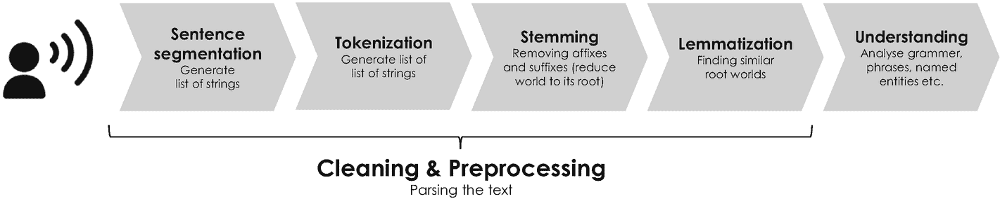

图 4-17

例如，亚马逊的 Alexa 所使用的自然语言处理的五个基本步骤

类似的公司、研究计划和合作在全球各地都可以找到——另外两个例子是英国的初创公司 Kheiron Medical 和 Oxford heart beat——这再次证明了人工智能在医疗保健领域的巨大潜力及其对社会的有益影响。该行业预计到 2026 年将达到 1500 亿美元。更多示例请参见[ [110](#Par350) 。

### 4.4.4 自然语言处理

自然语言处理从一开始就吸引了各种人工智能研究者的注意。受 Joseph Weizenbaum 的开创性工作和 1966 年 ELIZA 的引入(见 4.1.2 节)的启发，微软在 2014 年发布了第一款聊天机器人。这个聊天机器人被命名为“小冰”(中文对“小冰”的说法)，并将其集成到腾讯的微信应用程序中，这是迄今为止中国最大的社交消息服务。几年内，Xiaoice 很快吸引了超过 4000 万用户，据报道，2019 年全球用户超过 6.6 亿。在成功引入 Xiaoice 两年后，微软为在美国重复这一成功故事做好了准备，并在微博和社交网络服务 Twitter 上推出了聊天机器人“Tay”。“你和 Tay 聊得越多，”微软说，“它就变得越聪明，学会通过随意和有趣的对话吸引人们。”对微软来说，对话理解的实验很快就以一场灾难告终。仅仅用了不到 24 小时的时间，就训练 Tay 发出不那么好玩的，事实上是种族主义和性别歧视的信息，这就是为什么 Tay 在公开发布后不久就被关闭了。然而，从科学的角度来看，这样的失败和其他不成功的项目是非常重要的，因为它们允许开发人员从中学习，并一代代迭代地改进产品和服务。

自然语言处理通常分为五个步骤，如图 [4-17](#Fig17) 所示。整个过程从*分割*开始，它根据标点符号、段落和其他文本特征将书面文本分成更小的字符串。之后，这些字符串被解析并进一步分割成语法部分，如单个名词、动词、数字和标点符号，这一过程称为*标记化*。这一过程对于机器学习算法来说尤其具有挑战性，因为例如，书面文本通常遭受语法和拼写错误。第三步被称为*词干化*，指的是通过去除词缀和后缀将一个单词简化为其词根的过程——例如，单词“reading”通过这一过程被转换为“read”。最后一个预处理步骤叫做*词汇化*，包括寻找具有相同语义根的其他单词。一个例子是单词“better”，它可能被词条化为“good”这是任何自然语言处理算法的最后也可能是最具挑战性的部分的先决条件，即理解语言以得出某些结论和动作。该步骤通常采用无监督学习方法和其他深度学习模型，如递归神经网络或聚类算法，来分析单词序列并识别书写文本中的模式和聚类。

在语音识别技术的配合下，自然语言处理同时成为了一项相当普遍的技术——例如，想想你智能手机的语音拨号功能。非常有趣的是，第一个语音识别系统实际上是 1952 年在美国著名的贝尔实验室开发的，并被称为“Audrey”，意思是“自动数字识别”Audrey 能够识别从 0 到 9 的口语数字的声音，基于所谓的*音素*的检测，准确率超过 90%，这些音素是语音的基本单位。对于语音识别的发展来说，这是一个重大的、同样显著的进步，因为当时可用的计算能力和存储容量非常有限。

今天，语音识别和自然语言处理技术的结合被用来实现虚拟助手，每次你使用它们时，它们都会变得更好、更智能。苹果的 Siri、微软的 Cortana、谷歌 Home 和亚马逊的 Alexa——被命名为向著名的希腊亚历山大图书馆[ [111](#Par351) ]致敬——只是几个最受欢迎的例子。这种助手最近也进入了汽车领域，帮助驾驶员操作车辆或执行某些信息娱乐和导航功能。另一个例子是 Roy Raanani 在 2015 年创立的以色列初创公司 Chorus，该公司利用自然语言处理来分析销售人员的录音对话。该平台记录、组织和转录电话，以了解推动和提高销售的最佳实践——某些短语和文本模式。虚拟助手和聊天机器人T5 44也可以用于*语音商务*，这是指一种允许使用语音命令在线搜索和购买产品的技术。这些系统可以同时以零边际成本与几乎无限数量的客户进行通信。由于这项技术消除了传统呼叫和客户服务中心的人力瓶颈，该行业预计到 2023 年将达到 800 亿美元。

虚拟助理还可以通过自动记录会议和向无法参加会议的人分发语音搜索版本来简化组织的内部流程。这样的代理商也会对营销行业产生严重的影响。例如，艾维商学院名誉教授 Niraj Dawar 认为，“人工智能助手将改变公司与客户的联系方式。他们将成为人们获取信息、商品和服务的主要渠道，营销将变成对他们注意力的争夺。

### 4.4.5 能效

由于其众多的数据中心设施，谷歌是全球最大的电能消费者之一。安装在其数据中心的计算机和服务器需要不断冷却，以保持它们处于适中的温度，不受设施外部气候条件的影响——这实际上是谷歌和其他 IT 公司在过去几年中开发高效服务器和计算硬件的原因。然而，现代数据中心的功耗仍然巨大，即使是能效方面的微小改进也可以大幅降低成本。这就是为什么谷歌在 2014 年以超过 5 亿美元的价格收购了总部位于伦敦的初创公司 DeepMind Technologies。DeepMind 当时正在研究一种机器学习算法，该算法允许数据中心设施的能源优化[ [114](#Par354) ]。他们的深度神经网络集合是根据数千个传感器的历史数据进行训练的，这些传感器测量 IT 负载，冷却泵，冷却器，冷却塔和湿球的速度[ [115](#Par355) ]，并用于预测特定操作条件下的未来*电力使用效率*。 [45](#Fn45) 这些预测的目的是模拟不同行动的影响，使 DeepMind 能够相应地选择最佳选项和能源组合——这是基于信息透明度的数据驱动决策的一个很好的例子。通过采用深度神经网络并创建一个更高效和适应性更强的框架来理解数据中心动态，谷歌在 2016 年成功地将冷却能源的数量大幅减少了 40%[[116](#Par356)]，同时将风能的价值增加了约 20%[[117](#Par357)]-这是朝着具有更好碳足迹的超高效数据中心设施的重大突破。这个例子突出了人工神经网络在优化能源效率方面的巨大潜力。这个例子也有望成为其他行业的蓝本，比如同样消耗大量电能、热能和其他能源的汽车或制造业。

### 4.4.6 药物发现

人工智能的一个特别令人兴奋的应用对社会的财富和健康产生了巨大的影响，这就是针对包括阿尔茨海默氏症和其他神经退行性疾病在内的一系列(不可治愈的)人类疾病的药物发现。这些疾病通常源于我们 DNA 中的一个突变基因 [46](#Fn46) ，它控制着我们体内的重要过程，如基因调节、蛋白质合成和细胞内信号传导。由于功能失调的基因会导致各种疾病，因此它们通常会成为开发化学物质的*目标*，通过修复各自的功能失调为患者提供治疗益处。这种化学物质在药理学上被称为*化合物*或*先导物*。由政府监管机构(如美国美国食品药品监督管理局)授予市场批准的先导药物被称为*药物*，可在药房和药店买到。

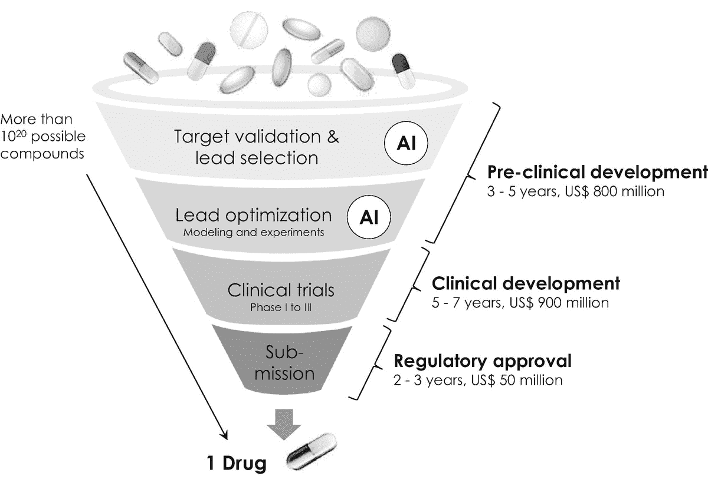

图 4-18

一般药物发现过程，不同阶段花费的典型时间和金钱。人工智能(AI)能够通过在引导选择和优化阶段提供帮助来减少时间和精力

传统上，药物发现分为两个连续的阶段，即(1)临床前开发和(2)临床阶段。这两个阶段通常都涉及大量的试验和错误，因此非常耗时、昂贵且效率低下。临床前阶段是关于靶点发现和验证以及先导药物选择和优化。临床阶段包括对选定的患者进行几次临床试验，并以将药物提交给监管机构而结束。整个过程如图 [4-18](#Fig18) 所示，通常需要 10 年以上的时间，研究费用达到 18 亿美元以上，直到药物最终获得市场批准。

由于大多数药物在临床阶段失败，人工智能特别针对药物发现过程的这一关键阶段。它通过帮助选择正确的患者、规划整体临床试验以及在过程中尽可能早地确定最有效的先导化合物来加速研究[ [118](#Par358) 、 [119](#Par359) ]。人工智能有助于搜索、选择和优化值得在实验室研究和实验的化合物。此外，它还用于分析数十亿种具有不同医疗特性的潜在化学物质。因此，药物发现可以被视为一个多目标优化问题，它非常适合于通过人工智能实现某些步骤的自动化。

这就是为什么各种制药公司一直在建立大型化学化合物数据库，这些数据库经常更新，并由发表在全球专业期刊上的发现和研究结果填充。为了通过最先进的机器学习算法处理化合物，它们通常会基于一种称为 *SMILES* 的编码方案进行特征描述或转换为文本，这种编码方案是“简化的分子输入行输入系统”化合物的微笑串由代表化学元素的字母和编码不同元素之间的化学性质和结合(“链接”)的符号组成。例如，化学符号为 H 2 O 的水的微笑表示法可以写成[H]O[H]，因为水是由一个氧原子和两个氢原子组成的，分别用“O”和“H”表示。然后，这些字符串被用来训练人工神经网络，以了解最成功的药物，并根据化学规则和已识别的元素(符号)可能相互遵循的模式来预测新药设计——如果你愿意，这是一种创新的“医学语言处理”方法。早在 1986 年，人工神经网络就已经被应用于药物发现[ [120](#Par360) ]以响应著名的反向传播算法的发展，该算法允许我们在前面的章节中了解到的这种网络的有效训练。从那以后，各种研究人员通过使用更大的复合数据库和深度学习模型来改进这种方法，以便在更大的数据库上更有效地训练他们的人工神经网络[[121](#Par361)–[124](#Par364)]。

英国初创公司 Benevolent AI 已经成功地将这种创新方法应用于药物发现。该公司成立于 2013 年，采用不同的机器学习算法来建立数据库，在知识图中可视化相关出版物，并预测新化合物。其中一些用于自动挖掘当前的科学文献，并将最相关的文献保存在复合数据库中；另一些则用于根据从这些数据中得到的模式来设计新的化合物。为此，Benevolent AI 的研究人员建立了一个递归神经网络，例如，该网络已经根据科学文献中报告的数百万现有化合物的 SMILES 数据进行了训练，并随后列入了他们的数据库。该预训练的网络用于基于从训练数据中导出的统计上最相关的模式，逐字符迭代地预测新的微笑串。生成的字符串对应于真实空间中的某个化合物，否则可能不会被发现。它可以化学合成，并随后在实验室中根据不同的医学特性进行评估，如其有效性、选择性、毒性和对人体的潜在副作用。这种表征的结果用作通过采用强化学习技术微调人工神经网络的输入，这种反馈过程有时被称为*多参数优化评分*。通过这种方式，人工智能补充了 Benevolent AI 的研究人员，使他们能够在药物开发过程的早期专注于最佳化合物，从而大大减少了开发时间，并大幅削减了相关成本。仁慈的艾还采用这种方法设计了一种针对新冠肺炎引起的急性肺病的潜在治疗方法，这种致命的冠状病毒据报道首先出现在中国武汉省，并在 2020 年造成全球超过 4300 万人感染和超过 116 万人死亡。 [47](#Fn47) 这个例子和其他例子凸显了人工智能在药物发现方面的巨大潜力，并证明了深度学习可以用来大大加快医疗保健行业的开发、优化和其他业务流程。

### 4.4.7 金融服务和保险

事实上，金融服务和保险行业是最早采用人工智能的行业之一，部分原因是不同金融科技公司的崛起，如 Klarna、Revolut、N26 和其他在线银行和支付服务提供商，它们竞相扰乱现有的银行机构。例如，总资产超过两万亿美元的美国最大的投资银行摩根大通正在将人工智能推广到其投资银行业务之外，并于最近在其资产管理业务部门内成立了一个专门的股票数据科学部门。

#### 金融服务和保险:网络安全

他们的一个项目是关于网络安全的，因为摩根大通在 2014 年遭受了一次重大数据泄露。据报道，在这次网络攻击中，黑客侵入了与超过 8300 万个银行账户相关的客户数据，这被认为是有史以来对一个组织的 IT 系统最严重和最大的入侵之一。幸运的是，虽然与这些帐户相关的登录信息没有被泄露，但黑客获得了客户的姓名、电话号码以及电子邮件和邮政地址，这引发了公众对潜在网络钓鱼攻击的主要担忧。自那以来，摩根大通在升级 IT 系统方面投入了大量资金，同时也在探索人工智能在网络安全方面的一系列应用。其中一个项目是实施一个早期预警安全系统，在不良分子开始使用网络钓鱼电子邮件针对特定员工之前检测恶意软件、特洛伊木马和其他高级持久威胁[ [127](#Par367) ]。为此，他们实施了一个大型在线存储库来收集和存储与摩根大通在线流量相关的所有原始数据。数据首先存储在数据湖中，作为递归神经网络架构的输入，该架构了解平均数据大小、主机名、请求频率和在线流量的其他关键特征。随着越来越多的数据通过该网络，它会了解欺诈性和非欺诈性(“正常”)流量的情况。每当恶意行为者准备开始网络攻击时，在线流量就会发生变化，循环神经网络偶尔会检测到异常活动，并通知银行的安全人员即时启动某些对策。据报道，预警系统还采用自然语言处理算法来寻找模式，如不匹配的互联网地址、糟糕的拼写和语法，以检测来自恶意行为者的电子邮件。这是一种越来越受欢迎的递归神经网络应用，属于*异常检测*类别，用于识别欺诈性银行活动并降低与之相关的风险——这种方法与所有暴露于网络空间风险的行业高度相关。

#### 金融服务和保险:新闻分析和智能定价

新闻分析和智能定价是另外两个例子。摩根大通和其他金融机构正在应对人工智能。*新闻分析*通常基于自然语言处理算法，扫描在线媒体，寻找与特定客户、行业或投资决策相关的新闻。这些扫描被分类以创建信息透明度，作为数据驱动的决策制定的先决条件。据报道，控制着超过 6.8 万亿美元资产的全球最大资产管理公司美国全球投资管理公司贝莱德(BlackRock)也为他们的阿拉丁 [48](#Fn48) 风险管理系统采用了新闻分析，该系统由贝莱德解决方案[ [128](#Par368) 运营。*金融产品和服务的智能定价*是根据多个客户和市场变量(如一天中的时间、位置、实时需求和客户的购买历史)实时计算最佳价格。这种算法为从规则驱动到数据驱动的定价模式铺平了道路，并允许机构通过个性化和情境化奖励来提高盈利能力和竞争力。这种算法通常采用多项式回归模型、集成方法和人工神经网络来识别行为客户数据的某些模式。当然，数据驱动的智能定价和个性化报价也与一系列其他业务相关，包括超市和在线仓库。

我希望你喜欢我们在人工智能及其多方面应用的激动人心的世界中的旅程。作为一种通用技术，人工智能被用于推动收入和利润增长或建立全新的商业模式——它是第三种也可能是最通用的数字技术，可以实现私营和公共部门组织的数字化转型。

## 4.5 关键点

*   人工智能是指可以由计算机执行的软件，具有像人类一样的学习和推理能力。该软件将现实生活(商业)中的问题转化为数学模型，技术上称之为算法。

*   人工智能分为两大子类:(1)机器学习是指一组具有学习能力的算法，无需显式编程。(2)深度学习采用人工神经网络来处理数字信息。为了正常工作，人工神经网络必须通过大型训练数据集(大数据)进行训练。

*   机器学习建立在两个关键概念之上:( 1)成本函数或优化目标，以数学方式描述现实生活中的问题，以及(2)优化算法，如梯度下降，允许成本函数最小化并解决手头的相应问题。最流行的算法是回归、分类、聚类和关联。

*   深度学习采用人工神经网络，即由软件模拟的互连神经元的分层结构，并排列在输入和输出层以及用于特征检测的一个或多个深层中。根据神经网络的特定拓扑，可以区分(1)卷积，(2)递归，和(3)生成对抗神经网络，(4)推荐系统，和(5)自动编码器。

*   人工智能采用不同的学习策略来训练算法，即，(1)使用标记数据的监督学习，(2)使用非标记数据的非监督学习，(3)深度学习，(4)集成方法，以及(5)强化学习。

*   人工智能最受欢迎的应用是大数据分析、优化和预测、通过情感分析和推荐的个性化、特征检测和模式识别、自然语言处理、包括图像识别和对象检测的计算机视觉，以及异常和欺诈检测。

## 4.6 人工智能框架

你是否在考虑在你的组织中使用人工智能，或者将其应用到你自己的用例中？如果以下实施清单中大多数关键问题的答案是“是”，人工智能可能会很好地帮助你实施自己的商业想法或用例。

1.  你的用例是关于什么的？它是否属于以下通用类别之一？是□否□
    *   大数据分析

    *   建模和仿真

    *   数据和文件压缩

    *   优化和预测

    *   产品和服务的个性化

    *   特征检测和模式识别

    *   情感分析和推荐系统

    *   自然语言处理和语音识别

    *   计算机视觉，包括图像识别和物体检测

    *   聚类和分类，包括异常和欺诈检测

2.  以前是否通过使用人工智能解决过类似的用例——表 [4-2](#Tab2) 中是否提到过？是□否□

3.  (大)数据分析已经在你的日常决策过程中发挥了至关重要的作用吗？是□否□

4.  您的应用程序所需的大数据在三个方面(即，容量、速度和多样性)是否已经可以从内部或外部数据库获得？是□否□

5.  训练模型的可用数据量是否比搜索空间(即问题的可能解决方案的数量)大很多？是□否□

6.  在分析大数据时，您希望看到什么样的模式、结构或特征？有没有专业知识来判断算法得出的结果是合理的还是只是统计上的副作用？是□否□

7.  是否有定期更新数据的自动化流程？是□否□

8.  您是否能够访问实现您的应用程序或用例所需的所有人力和计算资源(硬件和软件)？是□否□

    Further questions to be considered when planning your implementation:
    *   谁会使用实现的算法，他们的期望是什么？

    *   谁将不得不维护你的人工智能服务，包括硬件基础设施和共享软件工具？

    *   您的应用程序需要标记或未标记的数据来训练您的人工智能算法吗？

    *   在处理大数据时，您必须遵守哪种监管框架？

## 4.7 进一步阅读

在本章的最后，如果你想更深入地研究人工智能、机器学习及其应用，我想为你提供一些进一步阅读的建议:

*   t .陶利:人工智能基础。非技术性的介绍。Apress (2019)。

*   Thamm，A. *等*:终极数据与 AI 指南:150 个关于人工智能、机器学习和数据的常见问题。数据 AI 出版社(2020)。

*   Hastie，T. *et al.* :统计学习的要素:数据挖掘、推理和预测。斯普林格(2009)。

*   新泽西州尼尔森:对人工智能的探索:思想和成就的历史。剑桥大学出版社(2010 年)。

*   Chollet，f .:用 Python 进行深度学习。曼宁(2017)。

*   Hawkins，j .和 Blakeslee，s .:论智能:对大脑的新理解将如何导致创造真正智能的机器。圣马丁狮鹫(2005)。

## 4.8 参考文献

1.  Bughin，J. *等*:人工智能前沿笔记:模拟人工智能对世界经济的影响。麦肯锡&公司(2018)。[T4`www.mckinsey.com/featured-insights/artificial-intelligence/notes-from-the-ai-frontier-modeling-the-impact-of-ai-on-the-world-e`](http://www.mckinsey.com/featured-insights/arti%25EF%25AC%2581cial-intelligence/notes-from-the-ai-frontier-modeling-the-impact-of-ai-on-the-world-e)

2.  Brynjolfsson，e .和 McAfee，a .:人工智能的商业。《哈佛商业评论》(2017)。[T2`https://hbr.org/cover-story/2017/07/the-business-of-artificial-intelligence/`](https://hbr.org/cover-story/2017/07/the-business-of-artificial-intelligence/)

3.  维纳:控制论:或动物和机器中的控制与交流。麻省理工出版社。马萨诸塞州剑桥(1948 年)。

4.  麦卡洛克和皮茨:神经活动中内在观念的逻辑演算。数学生物物理学通报 **5** ，115–133(1943)。[T4`https://doi.org/10.1007/BF02478259`](https://doi.org/10.1007/BF02478259)

5.  行为的组织。威利父子公司。纽约(1949 年)。

6.  感知机:大脑中信息存储和组织的概率模型。《心理评论》， **65** (6)，386–408(1958)。[T4`https://doi.org/10.1037/h0042519`](https://doi.org/10.1037/h0042519)

7.  梅森，H. *等人*:对手。《纽约客》(1958)。[T4`www.newyorker.com/magazine/1958/12/06/rival-2/`](https://www.newyorker.com/magazine/1958/12/06/rival-2/)

8.  海军新设备边干边学:心理学家展示设计用来阅读和变得更聪明的计算机胚胎。《纽约时报》(1958 年)。[T2`www.nytimes.com/1958/07/08/archives/new-navy-device-learns-by-doing-psychologist-shows-embryo-of.html/`](https://www.nytimes.com/1958/07/08/archives/new-navy-device-learns-by-doing-psychologist-shows-embryo-of.html/)

9.  A. M .图灵:计算机器与智能。头脑 **49** ，433–460(1950)。[T4`www.csee.umbc.edu/courses/471/papers/turing.pdf/`](https://www.csee.umbc.edu/courses/471/papers/turing.pdf/)

10.  心理、大脑和程序。行为和脑科学 **3** (3)，417–457(1980)。[T4`https://doi.org/10.1017/S0140525X00005756`](https://doi.org/10.1017/S0140525X00005756)

11.  麦卡锡:赋予机器以精神品质。在:人工智能的哲学观点，编辑。林格先生。人文出版社(1979)。

12.  [`www.ibm.com/ibm/history/exhibits/mainframe/mainframe_PP704.html/`见](https://www.ibm.com/ibm/history/exhibits/mainframe/mainframe_PP704.html/)

13.  麦卡锡等人:关于人工智能的达特茅斯夏季研究项目的建议(1955)。[T2`jmc.stanford.edu/articles/dartmouth/dartmouth.pdf`](http://jmc.stanford.edu/articles/dartmouth/dartmouth.pdf)

14.  Weizenbaum，j .:ELIZA——一个研究人机自然语言交流的计算机程序。《美国计算机学会通讯》9 (1)，36–45(1966)。[T4`https://doi.org/10.1145/365153.365168`](https://doi.org/10.1145/365153.365168)

15.  炼金术和人工智能。兰德公司(1965 年)。[T2`www.rand.org/content/dam/rand/pubs/papers/2006/P3244.pdf/`](https://www.rand.org/content/dam/rand/pubs/papers/2006/P3244.pdf/)

16.  计算机还不能做什么:人工理性批判。麻省理工学院出版社，纽约(1972)。

17.  Van Melle，W.: MYCIN:一个基于知识的传染病诊断咨询程序。国际人机研究杂志 **10** (3)，313–322(1978)。[T4`https://doi.org/10.1016/S0020-7373(78)80049-2`](https://doi.org/10.1016/S0020-7373(78)80049-2)

18.  Yu，V. L. *等*:通过计算机进行抗菌药物选择。传染病专家的盲法评估。美国医学会杂志 **242** (12)，1279–1282(1979)。[https://doi . org/10 . 1001/JAMA . 1979](https://doi.org/10.1001/jama.1979.03300120033020)

19.  [`www.ibm.com/ibm/history/ibm100/us/en/icons/deepblue/`见](https://www.ibm.com/ibm/history/ibm100/us/en/icons/deepblue/)

20.  香农:一台国际象棋机器。《科学美国人》 **182** (2)，48–51(1950)。[T4`https://doi.org/10.1007/978-1-4613-8716-9_6`](https://doi.org/10.1007/978-1-4613-8716-9_6)

21.  波兰尼悖论与就业增长的形态。美国国家经济研究局(2014 年)。[https://doi . org/10 . 3386/w 20485](https://doi.org/10.3386/w20485)

22.  布朗，P. *等*:语言翻译的统计方法。第 12 届计算语言学会议论文集 **1** ，71–76(1988)。 [`https://doi.org/10.3115/991635.991651`](https://doi.org/10.3115/991635.991651)

23.  使用跳棋游戏进行机器学习的一些研究。《IBM 研究与发展杂志》第 3 卷第 3 期 (3)，第 210-229 页(1959 年)。[T4`https://doi.org/10.1147/rd.33.0210`](https://doi.org/10.1147/rd.33.0210)

24.  Wakabayashi 博士:见见训练机器人的人(做他们自己的工作)。《纽约时报》(2017)。[T2`www.nytimes.com/2017/04/28/technology/meet-the-people-who-train-the-robots-to-do-their-own-jobs.html/`](https://www.nytimes.com/2017/04/28/technology/meet-the-people-who-train-the-robots-to-do-their-own-jobs.html/)

25.  费鲁奇，D. *等*:建设沃森:迪普卡项目概述。艾杂志 **31** (3)，59–79(2010)。 [`https://doi.org/10.1609/aimag.v31i3.2303`](https://doi.org/10.1609/aimag.v31i3.2303)

26.  脸书人工智能工作室内部。《哈佛商业评论》(2017)。[T2`https://hbr.org/2017/07/inside-facebooks-ai-workshop/`](https://hbr.org/2017/07/inside-facebooks-ai-workshop/)

27.  [`www.engineering.fb.com/ml-applications/advancing-state-of-the-art-image-recognition-with-deep-learning-on-hashtags/`见](https://www.engineering.fb.com/ml-applications/advancing-state-of-the-art-image-recognition-with-deep-learning-on-hashtags/)

28.  Mahajan D. *等*:探索弱监督预训练的极限。在:法拉利诉*等人*:计算机视觉——ECCV 2018。计算机科学讲义 **11206** 。剑桥大学斯普林格分校(2018)。 [`https://doi.org/10.1007/978-3-030-01216-8_12`](https://doi.org/10.1007/978-3-030-01216-8_12)

29.  《当数据创造竞争优势》...如果没有。《哈佛商业评论》(2020)。[T2`https://store.hbr.org/product/when-data-creates-competitive-advantage-and-when-it-doesn-t/R2001G/`](https://store.hbr.org/product/when-data-creates-competitive-advantage-and-when-it-doesn-t/R2001G/)

30.  [`www.medium.com/syncedreview/data-annotation-the-billion-dollar-business-behind-ai-breakthroughs-d929b0a50d23/`见](https://www.medium.com/syncedreview/data-annotation-the-billion-dollar-business-behind-ai-breakthroughs-d929b0a50d23/)

31.  标题:确定彗星轨道的新方法。巴黎(1805 年)。

32.  [`www.technologyreview.com/s/615313/how-facebook-uses-machine-learning-to-detect-fake-accounts/`见](https://www.technologyreview.com/s/615313/how-facebook-uses-machine-learning-to-detect-fake-accounts/)

33.  Visa 利用人工智能防止了约 250 亿美元的欺诈。彭博(2019 年)。[T2`www.bloomberg.com/press-releases/2019-06-17/visa-prevents-approximately-25-billion-in-fraud-using-artificial-intellige`](https://www.bloomberg.com/press-releases/2019-06-17/visa-prevents-approximately-25-billion-in-fraud-using-artificial-intelligence)

34.  佩奇，L. *等*:《page rank 引用排名:给网络带来秩序》(1998)。[T4`doi: 10.1.1.31.1768`](https://doi.org/10.1.1.31.1768)

35.  Page，l .:美国专利 US 6，285，999:链接数据库中节点排序的方法(1997)。[T2`www.patents.google.com/patent/US6285999B1/en/`](https://www.patents.google.com/patent/US6285999B1/en/)

36.  LeCun，Y. *等*:深入学习。性质**【521】**，436-444(2015 年)。 [`https://doi.org/10.1038/nature14539`](https://doi.org/10.1038/nature14539)

37.  强规则的发现、分析和呈现。数据库知识发现。AAAI/麻省理工学院出版社，剑桥(1991 年)。

38.  Agrawal，R. *等*:挖掘大型数据库中项目集之间的关联规则。1993 年 ACM SIGMOD 数据管理国际会议录，207 (1993)。[https://doi . org/10 . 1145/170035 . 170072](https://doi.org/10.1145/170035.170072)

39.  超越回归:行为科学中预测和分析的新工具。剑桥哈佛大学博士论文(1974 年)。

40.  鲁梅尔哈特，D. E. *等*:通过反向传播误差学习表征。自然 **323** ，533–536(1986)。 [`https://doi.org/10.1038/323533a0`](https://doi.org/10.1038/323533a0)

41.  Ivakhnenko，A.G .:数据处理的分组方法——随机近似方法的对手。苏联自动控制。 **13** (3)，43–55(1968)。

42.  Hubel，d .和 Wiesel，t .:猫纹状皮层中单个神经元的感受野。生理学杂志。148 (3)，574–591(1959)。[T4`https://doi.org/10.1113/jphysiol.1959.sp006308`](https://doi.org/10.1113/jphysiol.1959.sp006308)

43.  Neocognitron:不受位置变化影响的模式识别机制的自组织神经网络模型。生物控制论 **36** ，193–202(1980)。[T4`https://doi.org/10.1007/BF00344251`](https://doi.org/10.1007/BF00344251)

44.  LeCun，Y. *等*:应用于手写邮政编码识别的反向传播。神经计算 **1** ，541–551(1989)。 [`https://doi.org/10.1162/neco.1989.1.4.541`](https://doi.org/10.1162/neco.1989.1.4.541)

45.  萨默斯，m:情感人工智能，解释。麻省理工斯隆管理学院(2019)。[T2`https://mitsloan.mit.edu/ideas-made-to-matter/emotion-ai-explained/`](https://mitsloan.mit.edu/ideas-made-to-matter/emotion-ai-explained/)

46.  克勒贝尔:人工智能变得更加情绪化的 3 种方式。《哈佛商业评论》(2018)。[T2`https://hbr.org/2018/07/3-ways-ai-is-getting-more-emotional/`](https://hbr.org/2018/07/3-ways-ai-is-getting-more-emotional/)

47.  Hopfield，J. J .:具有突发集体计算能力的神经网络和物理系统。美国国家科学院院刊 **79** (8)，2554–2558(1982)。[T4`https://doi.org/10.1073/pnas.79.8.2554`](https://doi.org/10.1073/pnas.79.8.2554)

48.  辛顿，G. E .和塞伊诺夫斯基，T. J:《波尔兹曼机器中的学习和再学习》。并行分布式处理:认知微观结构的探索 **1** ，282–317(1986)。[T4`https://doi.org/10.7551/mitpress/3349.003.0005`](https://doi.org/10.7551/mitpress/3349.003.0005)

49.  马斯，W. *等*:没有稳定状态的实时计算:基于扰动的神经计算的新框架。神经计算 **14** (11)，2531–2560(2002)。 [`https://doi.org/10.1162/089976602760407955`](https://doi.org/10.1162/089976602760407955)

50.  利用非线性:预测无线通信中的混沌系统和节能。科学 **304** (5667)，78–80(2004)。[T4`https://doi.org/10.1126/science.1091277`](https://doi.org/10.1126/science.1091277)

51.  本吉奥，Y. *等*:深度网络的贪婪分层训练。神经信息处理系统进展 **19** ，153–160(2006)。 [`www.papers.nips.cc/paper/3048-greedy-layer-wise-training-of-deep-networks.pdf`](https://www.papers.nips.cc/paper/3048-greedy-layer-wise-training-of-deep-networks.pdf)

52.  马尔可夫链中的第一个环节。美国科学家 **101** (2)，92–97(2013)。[T4`https://doi.org/10.1511/2013.101.92`](https://doi.org/10.1511/2013.101.92)

53.  Chung，J. *等*:门控递归神经网络对序列建模的经验评估。arXiv:1412.3555 (2014 年)。

54.  hoch Reiter s .和 schmid Huber j .:长短期记忆。神经计算 **9** (8)，1735–1780(1997)。[T4`https://doi.org/10.1162/neco.1997.9.8.1735`](https://doi.org/10.1162/neco.1997.9.8.1735)

55.  Sak，H. *等人*:基于长短期记忆的递归神经网络架构，用于大词汇量语音识别。arXiv:1402.1128 (2014 年)。

56.  萨克，H. *等*:大规模声学建模的长短期记忆递归神经网络结构。(2019).[T4`www.static.googleusercontent.com/media/research.google.com/de//pubs/archive/43905.pdf/`](https://www.static.googleusercontent.com/media/research.google.com/de//pubs/archive/43905.pdf/)

57.  [`www.quora.com/What-are-some-recent-and-potentially-upcoming-breakthroughs-in-deep-learning/`见](https://www.quora.com/What-are-some-recent-and-potentially-upcoming-breakthroughs-in-deep-learning/)

58.  Goodfellow，I. J. *等*:生成对抗网。arXiv:1406.2661 (2014 年)。

59.  有史以来最大的拍卖:英国 3G 电信执照的出售。经济期刊 **112** (478)，C74–C96(2002)。[T4`https://doi.org/10.1111/1468-0297.00020`](https://doi.org/10.1111/1468-0297.00020)

60.  Marr，d .:《视觉:对人类视觉信息表征和处理的计算研究》。麻省理工学院出版社，剑桥(2010)。

61.  通过对抗网络实现无监督学习的途径。脸书工程(2016)。[T2`www.engineering.fb.com/ml-applications/a-path-to-unsupervised-learning-through-adversarial-networks/`](https://www.engineering.fb.com/ml-applications/a-path-to-unsupervised-learning-through-adversarial-networks/)

62.  Karras，T. *et al.* :一种基于风格的生成对抗网络生成器架构。arXiv:1812.04948 (2018)。

63.  多尔汉斯基，b .和坎顿-费勒，c .:用示例性生成性对抗网络进行内画。2018 年 IEEE/CVF 计算机视觉与模式识别会议(2017)。[https://doi . org/10 . 1109/CVPR . 2018 . 00824](https://doi.org/10.1109/CVPR.2018.00824)

64.  杨，H. *等*:学习面孔年龄进程:GANs 的金字塔结构。2018 年 IEEE/CVF 计算机视觉与模式识别会议(2018)。[https://doi . org/10 . 1109/CVPR . 2018 . 00011](https://doi.org/10.1109/CVPR.2018.00011)

65.  Karras，T. *et al.* :为了提高质量、稳定性和变化性而逐步种植甘蔗。ICLR (2018 年)。https:// [`https://research.nvidia.com/publication/2017-10_Progressive-Growing-of/`](https://research.nvidia.com/publication/2017-10_Progressive-Growing-of/) (2018)。

66.  为姿态不变人脸识别生成正面人脸图像。模式识别字母 **27** (7)，747–754(2006)。[https://doi . org/10 . 1016/j . patrec . 2005 . 11 . 003](https://doi.org/10.1016/j.patrec.2005.11.003)

67.  人工智能会成为艺术的下一个媒介吗？佳士得(2018)。[T2`www.christies.com/features/A-collaboration-between-two-artists-one-human-one-a-machine-9332-1.aspx`](https://www.christies.com/features/A-collaboration-between-two-artists-one-human-one-a-machine-9332-1.aspx)

68.  艺术家和机器智能。谷歌(2016)。[T2`https://ami.withgoogle.com/`](https://ami.withgoogle.com/)

69.  Carrer-Neto，W. *等*:基于社会知识的推荐系统。电影领域的应用。专家系统与应用 **39** (12)，10990–11000(2012)。[https://doi . org/10 . 1016/j . eswa . 2012 . 03 . 025](https://doi.org/10.1016/j.eswa.2012.03.025)

70.  林登，G. *等人*:Amazon.com 推荐:项目对项目协同过滤。IEEE 计算机学会 **7** (1)，76–80(2003)。[https://doi . org/10 . 1109/MIC . 2003 . 1167344](https://doi.org/10.1109/MIC.2003.1167344)

71.  Spiegel，J. R. *等*:美国专利 US 8，615，473 B2:预期包裹运输的方法和系统(2013 年)。 [`https://patents.google.com/patent/US8615473B2/en/`](https://patents.google.com/patent/US8615473B2/en/) 和 Kopalle，p .:为什么亚马逊的预期运输是纯粹的天才。福布斯(2014)。 [`www.forbes.com/sites/onmarketing/2014/01/28/why-amazons-anticipatory-shipping-is-pure-genius/#7c502fef4605/`](https://www.forbes.com/sites/onmarketing/2014/01/28/why-amazons-anticipatory-shipping-is-pure-genius/%25237c502fef4605/)

72.  萨瓦尔，B. M. *等*:基于项目的协同过滤推荐算法。第十届国际万维网会议论文集，285–295(2001)。[T4`https://doi.org/10.1145/371920.372071`](https://doi.org/10.1145/371920.372071)

73.  LeCun，y:学习的连接模型。巴黎第六大学博士论文(1987 年)。 [`https://doi.org/10.3406/intel.1987.1804`](https://doi.org/10.3406/intel.1987.1804)

74.  多层感知器与奇异值分解的自动关联。生物控制论 **59** ，291–294(1988)。[https://doi . org/10 . 1007/BF 00332918](https://doi.org/10.1007/BF00332918)

75.  欣顿，G. W .和泽梅尔，R. S .:自动编码器，最小描述长度和亥姆霍兹自由能。神经信息处理系统会议录，3–10(1993)。[T2`www.papers.nips.cc/paper/798-autoencoders-minimum-description-length-and-helmholtz-free-energy.pdf`](https://www.papers.nips.cc/paper/798-autoencoders-minimum-description-length-and-helmholtz-free-energy.pdf)

76.  n . McGuire:2019 年谷歌翻译的准确度如何？Argo 翻译(2019)。[T2`www.argotrans.com/blog/accurate-google-translate-2019/`](https://www.argotrans.com/blog/accurate-google-translate-2019/)

77.  用于机器翻译的神经网络，生产规模。谷歌人工智能博客(2016)。[T2`www.ai.googleblog.com/2016/09/a-neural-network-for-machine.html`](https://www.ai.googleblog.com/2016/09/a-neural-network-for-machine.html)

78.  Mnih，V. *等*:通过深度强化学习实现人类水平的控制。性质 **518** ，529–533(2015)。 [`https://doi.org/10.1038/nature14236`](https://doi.org/10.1038/nature14236)

79.  动态规划理论。公牛。阿米尔。数学。社会主义者 60 ，503–515(1954)。[https://doi . org/10 . 1090/s 0002-9904-1954-09848-8](https://doi.org/10.1090/S0002-9904-1954-09848-8)

80.  沃特金斯:从延迟奖励中学习。博士论文。英国剑桥剑桥大学(1989 年)。[T2`www.cs.rhul.ac.uk/chrisw/new_thesis.pdf`](http://www.cs.rhul.ac.uk/chrisw/new_thesis.pdf)

81.  83.沃特金斯，C. *等*:Q-学习。马赫。学习。 **8** ，279–292(1992)。 [`https://doi.org/10.1007/BF00992698`](https://doi.org/10.1007/BF00992698)

82.  LeCun，Y. *等*:基于梯度的学习应用于文档识别。开始吧。IEEE **86** (11)，2278–2324(1998)。 [`https://doi.org/10.1109/5.726791`](https://doi.org/10.1109/5.726791)

83.  Tromp，j .和 farnebck，g:围棋组合学。在:范·登·赫里克 H.J. *等*。电脑和游戏。计算机科学讲义 **4630** 。施普林格，柏林，海德堡(2006)。 [`https://doi.org/10.1007/978-3-540-75538-8_8`](https://doi.org/10.1007/978-3-540-75538-8_8)

84.  Silver，D. *等*:用深度神经网络和树搜索掌握围棋的博弈。性质 **529** ，484–489(2016)。[https://doi . org/10 . 1038/nature 16961](https://doi.org/10.1038/nature16961)

85.  人工智能:谷歌的 AlphaGo 击败围棋大师李世石。BBC 新闻。 [`www.bbc.com/news/technology-35785875/`](https://www.bbc.com/news/technology-35785875/) (2016)。

86.  人工智能的超级力量:中国、硅谷和新的世界秩序。马萨诸塞州波士顿的霍顿·米夫林·哈科特(2018)。

87.  Dastin:亚马逊推出向零售商销售自动结账的业务。路透社科技新闻(2020)。[T2`www.reut.rs/2VXxAeA`](https://www.reut.rs/2VXxAeA)

88.  Gross，r .:亚马逊 Go 商店的人工智能如何工作(2019)。[T2`www.towardsdatascience.com/how-the-amazon-go-store-works-a-deep-dive-3fde9d9939e9`](https://www.towardsdatascience.com/how-the-amazon-go-store-works-a-deep-dive-3fde9d9939e9)

89.  Dastin，J.: Gap 让更多的机器人进入仓库，以解决病毒破坏问题。《纽约时报》(2020)。[T2`www.reuters.com/article/us-health-coronavirus-gap-automation-foc/gap-rushes-in-more-robots-to-warehouses-to-solve-virus-dis`](https://www.reuters.com/article/us-health-coronavirus-gap-automation-foc/gap-rushes-in-more-robots-to-warehouses-to-solve-virus-disruption-idUSKBN22X14Y/)

90.  波默劳，D. A.: ALVINN:神经网络中的自主陆地车辆。神经信息处理系统进展 **1** ，305–313(1989)。[T4`https://doi.org/10.1184/R1/6603146.v1`](https://doi.org/10.1184/R1/6603146.v1)

91.  计算机视觉自动高速公路车辆导航。国际会计师联合会会议录 **20** (5)，221–226(1987)。 [https:// doi。org/ 10。1016/ S1474-6670(17)55320-3](https://doi.org/10.1016/S1474-6670(17)55320-3)

92.  Krizhevsky，A. *等*:深度卷积神经网络的 ImageNet 分类。ACM 的通信 **60** (6)，84–90(2012)。 [`https://doi.org/10.1145/3065386`](https://doi.org/10.1145/3065386)

93.  gershgorn d .:改变人工智能研究的数据——可能也改变了世界。石英(2017)。[T2`https://qz.com/1034972/the-data-that-changed-the-direction-of-ai-research-and-possibly-the-world/`](https://qz.com/1034972/the-data-that-changed-the-direction-of-ai-research-and-possibly-the-world/)

94.  百灵达:彩色补丁可能会让自动驾驶汽车偏离轨道。赛博谷(2019)。[T2`https://cyber-valley.de/en/news/farbfleck-konnte-autonom-fahrende-fahrzeuge-verwirren/`](https://cyber-valley.de/en/news/farbfleck-konnte-autonom-fahrende-fahrzeuge-verwirren/)

95.  Schor，d .:FSD 芯片中特斯拉的神经处理器内部。WikiChip Fuse (2019)。[T2`www.fuse.wikichip.org/news/2707/inside-teslas-neural-processor-in-the-fsd-chip/`](https://www.fuse.wikichip.org/news/2707/inside-teslas-neural-processor-in-the-fsd-chip/)

96.  Bos，c .:特斯拉的新 HW3 自动驾驶计算机——这是一个野兽。清洁技术协会(2019 年)。[T2`www.cleantechnica.com/2019/06/15/teslas-new-hw3-self-driving-computer-its-a-beast-cleantechnica-deep-dive/`](https://www.cleantechnica.com/2019/06/15/teslas-new-hw3-self-driving-computer-its-a-beast-cleantechnica-deep-dive/)

97.  Waymo 驾驶员手册:我们高度详细的地图如何帮助解锁自动驾驶的新位置。Waymo (2020)。[T2`https://blog.waymo.com/2020/09/the-waymo-driver-handbook-mapping.html`](https://blog.waymo.com/2020/09/the-waymo-driver-handbook-mapping.html)

98.  Ahn，Y.-J .:设计第五代 Waymo 驱动程序。Waymo (2020)。[T2`https://blog.waymo.com/2020/03/designing-5th-generation-waymo-driver.html`](https://blog.waymo.com/2020/03/designing-5th-generation-waymo-driver.html)

99.  高，J. *等.【向量网】 :编码高清地图和智能体动力学从矢量化表示。2020 年 IEEE/CVF 计算机视觉和模式识别会议(CVPR) (2020 年)。[T4`https://doi.org/10.1109/CVPR42600.2020.01154`](https://doi.org/10.1109/CVPR42600.2020.01154)*

100.  高，J. *等，【VectorNet:预测行为，帮助 Waymo 司机做出更好的决策。Waymo (2020)。[T4`https://blog.waymo.com/2020/05/vectornet.html`](https://blog.waymo.com/2020/05/vectornet.html)*

101.  j . kraf cik:way mo 正在向凤凰城的公众开放其完全无人驾驶服务。Waymo (2020)。[T2`https://blog.waymo.com/2020/10/waymo-is-opening-its-fully-driverless.html/`](https://blog.waymo.com/2020/10/waymo-is-opening-its-fully-driverless.html/)

102.  Labrie，M.: NVIDIA 推出 DRIVE AGX Orin——用于自主机器的高级软件定义平台。英伟达新闻编辑室(2019)。[T2`https://nvidianews.nvidia.com/news/nvidia-introduces-drive-agx-orin-advanced-software-defined-platform-for-autonomous-machines/`](https://nvidianews.nvidia.com/news/nvidia-introduces-drive-agx-orin-advanced-software-defined-platform-for-autonomous-machines/)

103.  Esteva，A. *等*:深度神经网络皮肤癌的皮肤科医生级分类。自然 **542** ，115–118(2017)。 [`https://doi.org/10.1038/nature21056`](https://doi.org/10.1038/nature21056)

104.  芯片名人堂:英特尔 4004 微处理器。频谱 IEEE (2018)。[T2`https://spectrum.ieee.org/tech-history/silicon-revolution/chip-hall-of-fame-intel-4004-microprocessor/`](https://spectrum.ieee.org/tech-history/silicon-revolution/chip-hall-of-fame-intel-4004-microprocessor/)

105.  刘冰，R. *等*:使用图形处理器的大规模深度无监督学习。ICML 09:第 26 届机器学习国际年会会议录，873–880(2009)。[T4`https://doi.org/10.1145/1553374.1553486`](https://doi.org/10.1145/1553374.1553486)

106.  [`www.sony.net/SonyInfo/News/Press/202005/20-037E/`见](https://www.sony.net/SonyInfo/News/Press/202005/20-037E/)

107.  人工智能正在推动硅的复兴。福布斯(2020)。[T2`www.forbes.com/sites/robtoews/2020/05/10/artificial-intelligence-is-driving-a-silicon-renaissance/#796122e5553c/`](https://www.forbes.com/sites/robtoews/2020/05/10/artificial-intelligence-is-driving-a-silicon-renaissance/%2523796122e5553c/)

108.  威尔逊，H. J .和 Daugherty，P. R .:协作智能:人类和人工智能正在联手。《哈佛商业评论》(2018)。[T2`https://hbr.org/2018/07/collaborative-intelligence-humans-and-ai-are-joining-forces/`](https://hbr.org/2018/07/collaborative-intelligence-humans-and-ai-are-joining-forces/)

109.  史密斯博士:人工智能可以在诊断前六年在大脑扫描中检测出阿尔茨海默病。加州大学旧金山分校(2019)。[T2`www.ucsf.edu/news/2019/01/412946/artificial-intelligence-can-detect-alzheimers-disease-brain-scans-six-years/`](https://www.ucsf.edu/news/2019/01/412946/artificial-intelligence-can-detect-alzheimers-disease-brain-scans-six-years/)

110.  戴利，s .:手术机器人，新药物和更好的护理:32 个人工智能在医疗保健中的例子。内置(2019)。[T2`www.builtin.com/artificial-intelligence/artificial-intelligence-healthcare/`](https://www.builtin.com/artificial-intelligence/artificial-intelligence-healthcare/)

111.  完整的文字记录:互联网档案馆创始人布鲁斯特卡尔在 Recode 解码。Recode (2017)。[T2`www.vox.com/2017/3/8/14843408/transcript-internet-archive-founder-brewster-kahle-wayback-machine-recode-decode/`](https://www.vox.com/2017/3/8/14843408/transcript-internet-archive-founder-brewster-kahle-wayback-machine-recode-decode/)

112.  b .金塞拉:Juniper 预测 2023 年语音商务收入将达到 800 亿美元，相当于每个助理 10 美元。Voicebot.ai (2019)。[T2`www.voicebot.ai/2019/02/19/juniper-forecasts-80-billion-in-voice-commerce-in-2023-or-10-per-assistant/`](https://www.voicebot.ai/2019/02/19/juniper-forecasts-80-billion-in-voice-commerce-in-2023-or-10-per-assistant/)

113.  达瓦尔:Alexa 时代的营销。《哈佛商业评论》(2018)。[T2`www.hbr.org/2018/05/marketing-in-the-age-of-alexa/`](https://www.hbr.org/2018/05/marketing-in-the-age-of-alexa/)

114.  数据中心优化的机器学习应用。谷歌(2014 年)。[T2`www.research.google/pubs/pub42542/`](https://www.research.google/pubs/pub42542/)

115.  通过机器学习更好的数据中心。谷歌博客(2014 年)。[T2`www.googleblog.blogspot.com/2014/05/better-data-centers-through-machine.html/`](https://www.googleblog.blogspot.com/2014/05/better-data-centers-through-machine.html/)

116.  Evans，r .和 Gao，J.: DeepMind AI 将谷歌数据中心的冷却费用降低了 40%。DeepMind (2016)。[T2`www.deepmind.com/blog/article/deepmind-ai-reduces-google-data-centre-cooling-bill-40/`](https://www.deepmind.com/blog/article/deepmind-ai-reduces-google-data-centre-cooling-bill-40/)

117.  埃尔金和威瑟斯彭:机器学习可以提升风能的价值。DeepMind (2019)。[T2`www.deepmind.com/blog/article/machine-learning-can-boost-value-wind-energy/`](https://www.deepmind.com/blog/article/machine-learning-can-boost-value-wind-energy/)

118.  临床试验的人工智能提升。性质 **573** ，S100–S102(2019)。[T4`https://doi.org/10.1038/d41586-019-02871-3`](https://doi.org/10.1038/d41586-019-02871-3)

119.  Shah，P. *等*:临床开发中的人工智能和机器学习:翻译视角。npj 数字。医学。 **2** ，69 (2019)。 [`https://doi.org/10.1038/s41746-019-0148-3`](https://doi.org/10.1038/s41746-019-0148-3)

120.  神经网络:解决化学问题的新方法还是只是一个过渡阶段？《化学分析学报》 **248** (1)，1–30(1991)。[T4`https://doi.org/10.1016/S0003-2670(00)80865-X`](https://doi.org/10.1016/S0003-2670(00)80865-X)

121.  Mayr，A. *等*:chem bl 上药物靶点预测的机器学习方法大规模比较。化学科学 **9** ，5441 (2018)。 [`https://doi.org/10.1039/c8sc00148k`](https://doi.org/10.1039/c8sc00148k)

122.  Merk，D. *等*:人工智能生物活性小分子的从头设计。分子信息学 **37** ，1700153 (2018)。 [`https://doi.org/10.1002/minf.201700153`](https://doi.org/10.1002/minf.201700153)

123.  尼尔，D. *等*:探索分子设计的强化学习深度循环模型。ICLR 2018 会议(2018)。[T4`www.openreview.net/pdf?id=Bk0xiI1Dz`](https://www.openreview.net/pdf%253Fid%253DBk0xiI1Dz)

124.  Stokes，J. M. *等*:抗生素发现的深度学习方法。细胞 **180** (4)，688-702 (2020)。 [`https://doi.org/10.1016/j.cell.2020.01.021`](https://doi.org/10.1016/j.cell.2020.01.021)

125.  Richardson，p .等人:Baricitinib 作为 2019-nCoV 急性呼吸道疾病的潜在治疗方案。柳叶刀 **395** (10223)，PE30–E31(2020)。[T4`https://doi.org/10.1016/S0140-6736(20)30304-4`](https://doi.org/10.1016/S0140-6736(20)30304-4)

126.  Agrawal，T. *等人*:摩根大通黑客泄露了 8300 万份数据，是历史上最大的泄密事件之一。路透社(2014 年)。[T4`www.reuters.com/article/2014/10/03/us-jpmorgan-cybersecurity-idUSKCN0HR23T20141003`](https://www.reuters.com/article/2014/10/03/us-jpmorgan-cybersecurity-idUSKCN0HR23T20141003)

127.  凌，李*等*:基于人工智能的银行僵尸网络多阶段检测系统。arXiv:1907.08276 (2019)。

128.  卢米斯，C. J .:贝莱德:4.3 万亿美元的力量。《财富》(2014)。[T2`https://fortune.com/2014/07/07/blackrock-larry-fink/`](https://fortune.com/2014/07/07/blackrock-larry-fink/)

<aside aria-label="Footnotes" class="FootnoteSection" epub:type="footnotes">Footnotes [1](#Fn1_source)

从技术上讲，化学反应会产生与电压相关的电位差。这个电压产生微弱的电流，由轴突传递。

  [2](#Fn2_source)

希腊哲学家柏拉图在他著名的文学对话《阿尔基比阿德斯一世》中已经在这个意义上使用了 cybernētēs 一词来表示人民的自治，该对话的特点是两位哲学家阿尔基比阿德斯和苏格拉底之间的哲学对话。

  [3](#Fn3_source)

逻辑理论家是一个计算机程序，它用数学方法证明了著名的*数学原理*的第 [2](2.html) 章中的前 52 个定理中的 38 个，这是一本关于数学基础的三卷本著作，由阿尔弗雷德·怀特海和伯特兰·罗素于 1910 年出版。

  [4](#Fn4_source)

自动机理论是理论计算机科学中的一个学科，它研究抽象的机器和可以由这种自动机具体解决的问题。

  [5](#Fn5_source)

例如，这个世界上第一个*聊天机器人*的在线版本可以在 [`www.masswerk.at/elizabot/`](http://www.masswerk.at/elizabot) 上找到。

  [6](#Fn6_source)

编程代码或语句的“then”部分基本上告诉机器对“if”和“else”中的每一个做什么。

  [7](#Fn7_source)

跳棋是一种两个人玩的策略棋盘游戏。它包括对统一的游戏棋子(黑或白)进行对角移动，并通过跳过对手的棋子进行强制捕捉。

  [8](#Fn8_source)

通过 [`https://youtu.be/X0JZMHhupTs/`](https://youtu.be/X0JZMHhupTs/) 可以在 YouTube 上看到一部关于 IBM Watson 发展的纪录片。

  [9](#Fn9_source)

预测是关于分析你所拥有的信息来产生洞察力和你没有的信息。这是在不确定的情况下做决定的核心。

  [10](#Fn10_source)

事实上，还有其他优化算法。例如，它们被称为随机梯度下降、小批量梯度下降、动量和 Adagrad。然而，梯度下降是使用最频繁的，并被认为是选择的标准方法。

  [11](#Fn11_source)

在 [`https://teachablemachine.withgoogle.com/`](https://teachablemachine.withgoogle.com/) 上可以找到一个很好的网站来玩选定的机器学习模型。

  [12](#Fn12_source)

详见 [`www.image-net.org/`](https://www.image-net.org/) 。

  [13](#Fn13_source)

例如，见 [`www.economist.com/technology-quarterly/2020/01/02/chinas-success-at-ai-has-relied-on-good-data/`](https://www.economist.com/technology-quarterly/2020/01/02/chinas-success-at-ai-has-relied-on-good-data/) 。

  [14](#Fn14_source)

对于许多企业来说，获得客户的成本很高，这就是为什么流失客户的成本非常高。这就是为什么对公司来说，通过最小化客户流失来利用这些收购成本是很重要的。

  [15](#Fn15_source)

有各种选择激活功能的选项，选择通常取决于特定的用例或应用。在最先进的人工神经网络中使用的三个最重要的激活函数是(1) *sigmoid* 或 *logistic* 激活函数，(2) *整流线性单元*或 ReLU，以及(3) *softmax* 激活函数。sigmoid 函数通常用于输出层中的神经元，因为它们的输出可以用概率来解释。

  [16](#Fn16_source)

人工神经网络中最常用的代价函数称为(1)二次代价，(2)交叉熵代价，(3)指数代价，(4) Hellinger 距离，(5) Kullback-Leibler 散度，(6)广义 Kullback-Leibler 散度，(7)板仓-斋藤距离。具体的选择取决于具体的使用情况和网络架构。

  [17](#Fn17_source)

事实上，第一个用于多层人工神经网络的工作但不是非常有效的训练算法是由俄罗斯数学家 Alexey Ivakhnenko 在 1865 年提出的。

  [18](#Fn18_source)

这个性质在技术上被称为*空间不变性*，对于增加卷积神经网络的可靠性非常重要。

  [19](#Fn19_source)

他们的性能主要受到所谓的*消失梯度问题*的限制，消失梯度问题指的是接近局部而不是全局最小值的成本函数。在循环神经网络中使用的激活函数对这个问题特别敏感。

  [20](#Fn20_source)

博弈论在经济和工业中有各种各样的使用案例，因为它可以用来优化决策过程，例如 2000 年英国 3G 电信许可证的拍卖。它的先驱之一，美国数学家约翰·纳西，发现了著名的*纳什均衡*，在 2001 年的奥斯卡获奖电影*《美丽心灵*中被描绘。

  [21](#Fn21_source)

在 [`https://youtu.be/0ueRYinz8Tk/`](https://youtu.be/0ueRYinz8Tk/) 上可以找到一个很好的 YouTube 视频，它可视化了生成性敌对网络的风格转移能力。

  [22](#Fn22_source)

[`www.cambridgeconsultants.com/press-releases/turning-our-sketches-art-machine-learning/`见](https://www.cambridgeconsultants.com/press-releases/turning-our-sketches-art-machine-learning/)。

  [23](#Fn23_source)

更多信息见 [`https://autodeskresearch.com/projects/dreamcatcher/`](https://autodeskresearch.com/projects/dreamcatcher/) 。

  [24](#Fn24_source)

马尔可夫过程是一种概率模型，它描述了可能动作的时间序列，其中一个动作的可能性(或值)取决于前一个动作所达到的状态。它是以俄罗斯数学家安德烈·安德烈耶维奇·马尔科夫的名字命名的。

  [25](#Fn25_source)

大多数围棋棋盘要么使用 9 × 9，13 × 13，要么使用 19 × 19 的线格。

  [26](#Fn26_source)

这个术语指的是一种方法，在这种方法中，算法计算所有可能的解决方案，并在决策树中绘制出可能的下一步行动的范围，以便选择最佳方案。

  [27](#Fn27_source)

另请参见 [`https://youtu.be/WXuK6gekU1Y/`](https://youtu.be/WXuK6gekU1Y/) 了解关于 AlphaGo 的深刻纪录片。

  [28](#Fn28_source)

形式上，美国社会主义者查尔斯·蒂利实际上在 1980 年他的工作论文《考察旧的新社会史和新的旧社会史》中第一次使用了这个术语，但是是在不同的上下文中。

  [29](#Fn29_source)

这就是为什么一些初创公司，如 Cerebras Systems、Graphcore 和 Mythic AI，不再专注于传统的冯·诺依曼(von Neumann)式的微芯片架构，而是一直在开发片上计算和内存设计。

  [30](#Fn30_source)

世界上第一个真正的 GPU 是“GeForce 256”，由美国半导体公司 Nvidia 于 1999 年发布，当时没有意识到它在并行计算和机器学习方面的潜力。

  [31](#Fn31_source)

[`www.mlperf.org/`见](https://www.mlperf.org/)。

  [32](#Fn32_source)

更多信息见 [`www.image-net.org/`](https://www.image-net.org/) 。

  [33](#Fn33_source)

相比之下，据报道，WSE Gen2 的尺寸为 46，225 毫米 2 ，而英伟达 A100 的尺寸为 826 毫米 2 ，内置 542 亿个晶体管。WSE Gen2 由台湾跨国半导体代工制造和设计公司 TSMC 制造。详情请见 [`www.cerebras.net/`](https://www.cerebras.net/) 。

  [34](#Fn34_source)

4K 指的是水平分辨率约为 4000 像素的图像。

  [35](#Fn35_source)

传感器融合指的是来自不同异类信息源的传感数据的聚合。得到的信息比单独使用这些来源时更完整、更准确。

  [36](#Fn36_source)

更多信息见 [`www.vicarious.com/`](http://www.vicarious.com/) 。

  [37](#Fn37_source)

更多信息见 [`www.kindred.ai/autograsp/`](http://www.kindred.ai/autograsp/) 。

  [38](#Fn38_source)

例如，参见 [`www.edn.com/autonomous-vehicles-the-electronics-road-to-making-them-safe/`](http://www.edn.com/autonomous-vehicles-the-electronics-road-to-making-them-safe/) 了解关于所用电子器件的更多细节。

  [39](#Fn39_source)

ImageNet 每年都会为机器学习科学家组织一次国际竞赛，通过标记超过 1500 万张高分辨率图像和超过 22000 个类别来展示算法的性能。

  [40](#Fn40_source)

冗余以及不同信息源的整合对于基于人工神经网络的自动驾驶尤其重要，以便保证一定程度的可靠性和安全性。例如，德国马克斯·普朗克智能系统研究所的研究人员最近证明，由人工神经网络分析的相机图像背景中的小图案会产生如此多的噪声，以至于可靠的图像分析会灾难性地失败。

  [41](#Fn41_source)

正确的行为可以从驾驶员的行为中得出，例如，驾驶员解释关于不同交通状况的视觉信息，并通过例如转向、制动和加速车辆做出适当的反应。换句话说，驾驶员在谨慎驾驶车辆的同时，实际上确实标记了数据。

  [42](#Fn42_source)

更多信息请参见 [`www.tesla.com/autopilotAI`](http://www.tesla.com/autopilotAI) 。

  [43](#Fn43_source)

[`www.nvidia.com/en-us/self-driving-cars/drive-platform/hardware/`见](http://www.nvidia.com/en-us/self-driving-cars/drive-platform/hardware/)。

  [44](#Fn44_source)

大多数情况下，*聊天机器人*通常专注于业务，例如公司的客户支持。*另一方面，虚拟助手*，基本上是为每个人开发的，帮助我们的日常活动。

  [45](#Fn45_source)

电源使用效率是对能源效率的一种定量衡量，定义为总建筑能源使用量与 IT 能源使用量之比。

  [46](#Fn46_source)

脱氧核糖核酸或 DNA 是一种携带我们基因组成的大分子。它由两条互补的链相互缠绕而成，形成著名的*双螺旋结构*。它是由两位分子生物学家以及后来的诺贝尔奖获得者弗朗西斯·克里克和詹姆斯·沃森于 1953 年在剑桥大学的卡文迪许实验室发现的，基于英国科学家雷蒙德·高斯林在伦敦国王学院获得的 X 射线衍射数据的分析。

  [47](#Fn47_source)

截至 2020 年 10 月 27 日，数据取自 [`https://coronavirus.jhu.edu/map.html/`](https://coronavirus.jhu.edu/map.html/) 。

  [48](#Fn48_source)

阿拉丁是“资产、负债、债务和衍生投资网络”的首字母缩写。

 </aside>