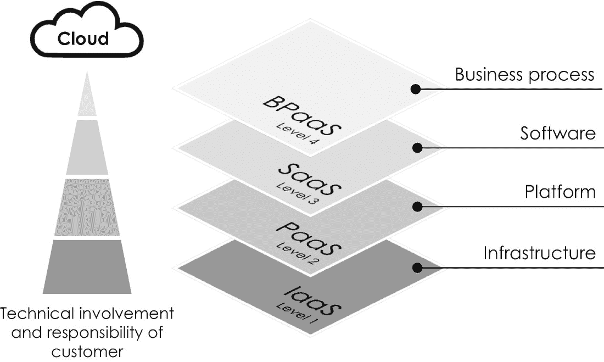

# 5.您的数字行动计划

前面的章节让你深刻理解了促进私人和公共组织数字化转型的三种最重要的数字技术:量子计算、区块链技术和人工智能。在每一章末尾示例性描述的不同应用和使用案例表明，每项技术不仅可以优化现有产品和服务，还可以在成熟和全新的市场或环境中探索新的增长机会。

第 [2](2.html) 章，“量子计算”，介绍了量子计算作为组织的变革力量，这些组织使用(超级)计算来解决高度复杂的优化、建模和模拟问题。我们还了解了区块链技术的深远潜力及其在不可信环境中部署信任并实现两个或更多贸易伙伴之间加密安全的价值转移的独特能力。最后但并非最不重要的一点是，我们研究了人工智能作为大数据分析、机器学习和其他应用的基础技术，这些应用允许将大数据集货币化并实施数据驱动的——从而更加透明和客观的——决策过程。

为此，一个非常重要的问题仍有待回答:我们如何利用这些数字技术来开始我们自己的生态系统或组织的数字化转型？这是本章的重点。我们将讨论一个易于使用的数字化行动计划，该计划将指导您完成自己的数字化转型，并介绍您的数字化日程中应考虑的八个关键维度，如图 [5-1](#Fig1) 所示。首先，我们将密切关注如何开发一个由数字技术驱动、由适当的技术堆栈和计算平台支持的适当的业务和运营模式。之后，我们将讨论通过提供一致的共享数据平台来数字化组织的核心。我们还将了解确定合适试点项目的关键标准，以及授权给管理层和员工带来的变革性但往往被低估的影响。此外，基于敏捷协作模式塑造组织结构对于成功完成数字化转型也至关重要。最后但同样重要的是，我们将看到成功的数字化转型依赖于开放的创新文化，这种文化通过利用您的生态系统作为另一个关键维度来促进反馈和新想法的整合。

图 5-1

数字化转型的八个关键维度

但在我们沿着数字化转型的八个关键维度详细讨论这一数字化行动计划之前，看看微软的数字化转型以突出某些相似之处是有启发性的:2011 年，微软是一家疲惫的公司。它面临着互联网带来的一系列严重的竞争威胁，并遭遇了严格的反垄断审查，这两者都威胁到了其现有的商业模式。他们的传统软件业务是将软件光盘运送到世界各地，以便在每台计算机上安装微软的 DOS、Windows 和 Office。除了开发这一经典的软件业务，微软当时还在试验一种名为 Microsoft Azure 的小型云计算服务，用于按需提供软件和服务。然而，这个探索性的项目被广泛认为是一个非盈利性的失败，这就是为什么微软专注于开发其传统业务。但塞特亚·纳德拉——当时微软服务器和工具部门的负责人——不同意这种战略评估，并坚信云计算将是微软的未来。三年后，塞特亚·纳德拉接替史蒂夫·鲍尔默担任首席执行官，并在给员工的第一封电子邮件中强调了他的愿景:“我们的行业不尊重传统，它只尊重创新。[...]我们的工作是确保微软在一个移动和云优先的世界里蓬勃发展。为了实现他清晰而令人信服的愿景，他在接下来的几年里重新架构了微软的软件交付流程，将底层传统业务模式从在本地计算硬件上部署软件转变为通过按需云计算交付软件即服务。为此，塞特亚·纳德拉通过添加越来越多的基于云的应用，如微软 Office 365 和微软动态(一种企业资源规划和客户关系管理软件)，扩大了数字化试点项目 Azure 的规模。随着 2018 年收购 GitHub，他的战略得到了进一步的推动，GitHub 是一个非常受欢迎的开源软件项目和工具在线存储库。在他对云计算未来的清晰愿景和坚定信念的指引下，他成功地将微软转型为一家云软件公司。结果，在他担任首席执行官的头三年里，微软的股票价值翻了三倍。但这并不是他日程上的最后一次数字化转型。受到他的朋友、谷歌首席执行官桑德尔·皮帅[[2](#Par141)]著名的“人工智能优先”声明 [1](#Fn1) 的启发，塞特亚·纳德拉在 2018 年调整了他的愿景，并制定了微软下一次数字化转型的计划，成为“智能云和智能边缘”计算提供商[[4](#Par143)，该提供商还利用了本书中介绍的三种数字支持技术。他后来在一次采访中指出，“人工智能是将塑造我们所有行为的运行时”[5](#Par144)]——这是微软通过其 Azure 云计算平台一直非常成功地追求的数字商业战略。

我们能从微软的数字化转型之旅中学到什么？要学习的最重要的一课是，新产品或服务的成功离不开任何创业风险和财务风险。以亚马逊为例，不可否认的是，这些年来它也有过一些引人注目的失败，价值数十亿美元，比如亚马逊拍卖、zShops 以及后来分别成为其非常成功的产品亚马逊市场和亚马逊 Alexa/Echo 的基础的 Fire Phone。在这种背景下，亚马逊创始人杰弗里·贝佐斯(Jeffrey Bezos)在 2016 年致股东的信中指出:

[...[英语背诵文选失败和发明是不可分割的双胞胎。为了发明，你必须进行实验，如果你事先知道它会起作用，那就不是实验。大多数大型组织都接受发明的理念，但不愿意遭受一系列必要的失败实验。超额回报通常来自于与传统智慧的对赌，而传统智慧通常是正确的。如果有 10%的机会获得 100 倍的回报，你每次都应该赌一把。但是你十有八九还是会错。

新的商业理念总是对未来的假设，因此是对客户明天可能需要什么的预感。因此，大多数高管往往对采用新技术和转变业务犹豫不决，因为它们可能会威胁到现有流程、业务和收入流。

第二个教训是，数字化转型是一个旅程。这一旅程始于制定一个清晰而令人信服的愿景，一个在员工中创造高度承诺的战略目标，引导一个组织实现转型，并让所有股东认为他们是一场激动人心的冒险的一部分——用法国传奇皇帝拿破仑·波拿巴的话来说就是“领导者的角色是定义现实，然后给予希望”。这位领导者的远见卓识捕捉到了商业和社会的主要趋势，并就这些趋势如何转化为能够为客户和其他利益相关者创造价值的整体运营模式提供了清晰的观点。

从微软学到的第三个教训是，数字化转型总是从探索试点项目中的新技术开始，这些新技术偶尔可以扩大规模并最终转变整个组织。数字化转型并不局限于组织的层级结构，还涉及到组织的战略、文化、员工和其他核心能力的重大变化。仔细观察，这并不奇怪，因为数字转换是由数字技术实现的，而数字技术最终依赖于由某种算法、程序或软件促进的数据处理。但是根据它的复杂性，开发一个软件并直接部署给客户而没有任何 bug 几乎是不可能的。这就是为什么软件开发——和数字技术一样——提倡产品创新和开发的迭代方法，这是由开放的创新文化和员工之间敏捷的协作方式实现的。这就是为什么数字化转型会影响组织的所有方面，并且不仅仅是使用数字技术将以前基于纸张的流程数字化。

不幸的是，当将微软的数字化转型之旅与其他公司的数字化转型之旅进行比较时，您会很快注意到，没有一种通用的数字化转型方法。然而，以下框架从八个关键维度描述了数字化转型，可能对您自己的数字化转型之旅有很好的指导作用。它专注于现有公司的数字化转型，这些公司需要在数字化转型之旅中继续运营已建立的传统业务。

## 5.1 设想数字战略

每个组织的主要目的——无论是私人的还是公共的——都是创造、传递和获取价值。这个价值来源于两个概念。第一个是*商业模式*，它定义了一个组织如何在经济、社会、文化或其他环境中创造和获取价值。 [2](#Fn2) 第二个是组织的*运营模式*，它定义了一个组织向其客户交付价值的特定方式——如果你愿意的话，就是“计划完成它”。换句话说，业务模型定义了理论，而运营模型捕获了组织的价值创造过程的实践。数字化转型是通过利用数字技术的力量来重新思考和构建业务和运营模式。它的目标通常是(1)通过简化内部流程提高运营效率，或者(2)增强客户体验[ [8](#Par147) ]，将传统业务和运营模式转变为数字业务和运营模式。

### 5.1.1 设想数字化战略:开发数字化商业模式

从历史上看，设想一个能够创造可持续竞争优势的成功商业模式的过程由两种方法主导:(1)市场定位和(2)组织的资源观。第一种方法包括找到一个进入壁垒高的(行业)部门，并使产品和服务与竞争对手不同。第二种方法利用一个组织稀有而有价值的资产和能力，如专利或高度专业化的机器，这些是竞争对手难以模仿的。鉴于数字商业模式的竞争日益激烈，这两种方法在今天似乎都不合适，因为数字组织通过平台和网络而不是实物和基础设施创造价值。

因此，设想数字商业模式的最佳方式是从以客户为中心的视角出发，以更好的客户体验取悦客户为目标。更好地了解你的客户(包括他们的消费行为和动机)的一种有见地的方法是*客户之旅*，这是对客户在使用某种产品或服务时所经历的体验的一步一步的深入分析[ [11](#Par150) ， [12](#Par151) ]。在整个客户旅程中，客户处于“宇宙的中心”，因为它始于客户，而不是产品或服务。在过去的几年中，它已经被许多组织成功地用于识别未满足的需求和其他客户不满意的来源。这两种见解都非常有价值，因为它们揭示了现有产品和服务的优势和劣势，从而开辟了新的商机。设想数字商业模式的下一步是将从客户旅程中获得的不同见解整合在一起，并问自己如何才能改善客户体验，以及这样做需要哪些(新颖的)产品和服务。例如，亚马逊，不可否认地经常进行顾客旅行，以提供最好的零售顾客体验。 [4](#Fn4)

我们从本书的介绍性章节中了解到的著名哈佛经济学家克莱顿·克里斯滕森(Clayton Christensen)开发了一种非常受欢迎的方法，作为对客户旅程的补充，用于捕捉客户需求并衍生出相应的商业模式。当问自己为什么顾客购买某种产品而不购买另一种产品时，他意识到顾客并不是真的购买产品，而是雇佣他们来解决特定的问题。换句话说，客户雇佣产品来完成工作，这就是为什么他的概念现在被称为客户的*工作要做* [ [14](#Par153) 。要做的工作有两个维度:(1)功能维度，衡量要做的工作是否已经完成，以及(2)情感或社会维度，描述拥有和使用某种产品或服务的感觉。例如，考虑购买一辆电动汽车。在这种情况下，要做的功能性工作是移动，从一个地方到另一个地方，零排放。它的情感和社会方面可能是向每个人展示一个人处于技术的前沿，或者电动汽车的另一个不可衡量的方面，如社会地位和(财务)福祉。根据克莱顿·克里斯滕森著名的颠覆性战略理论[ [15](#Par154) ]，一个成功的商业模式以客户的工作为中心，并完美地完成，这就是为什么它经常被描绘成创新中的“北极星”。换句话说，任何让客户更好地完成工作的东西都是组织应该关注的创新，因为它们为现有产品或服务提供了巨大的增长机会。因此，将客户放在“你的世界的中心”是推进现有或设想新的商业模式及其基本战略的重要前提。 [5](#Fn5)

在这种情况下，重要的是要记住，只有少数幸运的公司以最终走向成功的数字商业模式起步。他们中的大多数人最初会用应急策略探索不同的机会，直到他们找到真正有用的东西。这就是为什么你应该准备好尝试不同的数字技术和机会，准备好转向，并继续调整你的方法，直到你找到一个名副其实的方法——紧急战略在这一点上成为新的深思熟虑的战略。

用克莱顿·克里斯滕森(Clayton Christensen)的话来总结，“大多数产品之所以失败，是因为公司从错误的角度来开发它们。公司过于关注他们想卖给客户什么，而不是那些客户真正需要什么。缺少的是同理心:对客户试图解决什么问题的深刻理解。我希望从这些考虑中获得的见解能够启发和帮助您为自己的数字化转型之旅设想一种数字化商业模式。

### 5.1.2 设想数字化战略:衍生数字化运营模式

一旦定义了数字商业模式，重要的是要问问自己如何向客户提供价值，以及哪种运营模式最能支持这一价值创造过程。这就是数字技术发挥作用的地方。理解数字化运营模式特征的最佳方式是将其与不以数字技术为基础、以数据为中心的传统模式进行比较。传统和数字运营模式的根本区别在于其利用数据的特定方式。传统的运营模式把数据作为支撑其运营的必要之恶，而没有从中衍生出经济价值。随着产品、服务、客户的数量以及与之相关的数据量的增加，传统的运营模式最终会因无法管理复杂性而受到限制。对于不以数据为中心的传统业务模式来说，在某种程度上实现整个组织的数据一致性 [6](#Fn6) 变得不切实际且成本过高。如果随着时间的推移，不同的部门演变成功能独立的业务单位，拥有自己的数据库和遗留系统，这将是一个特别的挑战。将数据分布到分散的数据库意味着传统运营模式中的决策通常基于信息不透明，因此基于对决策选项的不完整和不充分的评估。

另一方面，数字运营模式克服了这些障碍，并利用数字技术来分析(大量)数据，并确定可能的决策选项，从而做出更加一致和客观的决策，如图 [5-2](#Fig2) 和 [9](#Par148) 所示。换句话说，数字技术允许从数据中提取有价值的见解，以补充人类的判断，从而实现更好的决策——例如，一些决策甚至可以通过智能合同在数字运营模型中自动评估和执行。

图 5-2

数据驱动的决策流程结合了基于数字技术和人类智能的高级数据分析。人类的判断(黑色)继续在整个过程中发挥核心作用。从[ [9](#Par148) 推广而来

此外，数字运营模式包含了与数字技术相关的指数级规模、范围和学习的优势。在这种情况下，规模是指以最低的成本向尽可能多的客户提供尽可能多的价值。范围描述了活动的范围，即公司提供的产品和服务的种类。 [7](#Fn7) 数字化学习决定了一个组织不断改进和创新其流程、产品和服务的迭代能力。

## 5.2 选择合适的技术组合

一旦您定义了数字业务和运营模式的基石，选择最合适的技术堆栈来完美地支持它们就显得尤为重要，因为每种数字技术都有特定的优势和劣势，这些优势和劣势决定了它对特定业务理念的适用性。图 [5-3](#Fig3) 显示了三种技术在数字化转型的八个关键领域的初步比较。该图仅提供了粗略的指导，并强调了本书中介绍的三种数字技术之间的一些差异——就其领域和表现形式而言，它肯定是不全面的。

图 5-3

数字财产蜘蛛，对不同支持技术对数字转型选定领域的相对影响进行评级，级别介于低和高之间

但是，无论您将使用哪种数字技术堆栈，您都可以考虑(1)在内部建立自己的数字能力，或者(2)与外部合作伙伴和云计算供应商合作。如果您的目标是利用您的内部数字专业知识作为中长期的竞争优势，那么第一个选项是最佳选择。否则，最好的选择是订阅外部云计算服务，这在大多数情况下更省时，投资也更大。

Cloud Computing

云计算是指可配置计算资源的主动管理池，包括可通过互联网按需访问的硬件和软件应用。

*云计算*在第 [1](1.html) 章“数字化和数字化转型”中有过简要介绍，它已经泛指一种可以通过互联网按需访问的计算硬件和软件基础设施。它建立在一种叫做*虚拟化*的技术之上，这种技术于 1970 年首次与 IBM 的 CP-40 操作系统一起发布。虚拟化允许模拟(私有或公共)环境或“分区”,包括专用计算处理能力、网络和来自可与其他用户共享的物理硬件系统的存储。美国国家标准与技术研究所将云计算定义为“支持对可配置计算资源(例如网络、服务器、存储、应用和服务)共享池进行无处不在、方便、按需的网络访问的模型，这些资源可以通过最少的管理工作或服务提供商交互来快速供应和发布”[19](#Par158)。租用由第三方提供、管理并向用户开放的计算资源的想法实际上非常具有革命性，这就是为什么云计算很快成为数十亿美元的业务并不令人惊讶。云计算服务通常分为四个主要的服务类别，这四个类别在订购特定供应商的服务时非常重要。如图 [5-4](#Fig4) 所示，它们在客户的技术参与和自主性方面有所不同，如下所述:

1.  *基础设施即服务*或 IaaS 是客户自主性最高的最低服务级别。IaaS 包含所有基础架构构建块，如数据服务器、存储、网络和虚拟机。 [8](#Fn8) 所有资源都由云供应商按照按需付费的定价模式按需供应和提供。

2.  *平台即服务*或 PaaS 提供随时可用的硬件基础设施和软件开发工具，使用户能够构建、测试和部署自己的云应用，所有计算资源也由该服务类别中的相应云供应商管理和维护。

3.  *软件即服务*或 SaaS 是第三个服务级别，指的是托管云基础设施，为用户提供完全开发的软件应用以及所需的按需硬件。用户只需通过 web 浏览器登录，上传要处理的数据，并使用供应商软件和硬件堆栈上的不同应用来进一步处理和分析数据。这个服务类别对那些不能建立自己的资源(如软件、硬件和人员)的用户来说特别有意义。

4.  *业务流程即服务*或 BPaaS 允许完全外包独立的业务流程，如工资单管理(包括工资单输入和法律备案)和支付流程。此服务类别是为不喜欢建立自己的内部数字能力和完全外包特定业务流程的公司设计的。

图 5-4

云计算服务的四种基本服务类别模型，即基础设施、平台、软件和业务流程即服务

除了这些服务类别，云计算服务在所有权模型方面也有所不同，通常分为所谓的公共云和私有云。一个*公共云*基础设施对公众开放，任何人都可以使用，而一个*私有云*只为单个组织的利益而拥有和运营。在实践中，组织经常实施一种结合了两种所有权模式优点的*混合云*。最受欢迎、市场领先的公有云厂商有 AWS、微软 Azure、IBM Cloud、 [9](#Fn9) 和 Google Cloud。他们的服务组合不断扩展，不仅包括计算能力、数据库存储和应用资源，还包括量子计算、区块链技术和人工智能。他们的服务在性能、价格和各种应用方面有所不同，这就是为什么大多数组织使用多个云供应商来从每个供应商的最佳产品和服务中受益，同时避免*供应商锁定*，即依赖单一云计算供应商。与构建自己的内部计算资源相比，与外部云计算供应商合作通常有三个主要优势:

1.  *性能*:云计算服务的卓越性能源于大型数据中心超级计算机的协同集中化。由于其频繁的硬件和软件更新，云服务在组织的 IT 系统遭受网络攻击和其他故障后提供了非常可靠的灾难恢复机制。

2.  *敏捷性*:云计算服务非常灵活，因为它们可以随着计算需求的增加或减少而扩大或缩小，这一特性被称为*超大规模*。在这种情况下，一些供应商确实经常将他们的服务称为*弹性云*，以强调他们的服务动态地确定所需的资源量，并相应地自动供应云基础架构。

3.  *成本*:与构建您自己的内部数字能力不同，云计算服务还可以通过减少硬件和软件所需的前期投资，让您受益于巨大的规模经济。在某些情况下，它们还可以降低硬件和软件基础架构的总拥有成本。这就是为什么云计算对那些没有足够的财力和人力来维护自己的数据中心的小公司特别有利。

大多数云计算供应商提供精心制作的 web 界面，允许轻松配置 IT 基础设施和快速定制用于特定用途或业务案例的工具。然而，开发更高级的软件工具和应用确实需要深入了解数据科学中一些最常见且主要是开源的编程语言，例如 *Python* [10](#Fn10) 和 r。为了方便起见，编程语言中可用的不同命令通常被组合在某些包和库中。表 [5-1](#Tab1) 列出了可用于在您自己的组织中实施本书中介绍的三种数字技术的最重要的软件包，供您参考。

## 5.3 数字化岩心

选定的技术堆栈提供了对组织的*核心*进行数字化转型的基础技术。根据美国商业战略家和顾问杰弗里·摩尔提出的“环境与核心”模型 [11](#Fn11) ，核心是创造竞争优势、在市场中差异化并最终赢得和保留客户的东西。背景包括财务、销售和营销等一切。在他的名为《与达尔文打交道》的书中，杰弗里·摩尔通过引用美国高尔夫冠军泰格·伍兹的例子来说明这个概念。泰格·伍兹的核心业务是高尔夫，而他的背景业务是营销。虽然营销能赚钱，但没有高尔夫(核心)，就没有营销(背景)。

数字化转型的一个方面是通过利用适当的数字技术堆栈来数字化组织的核心。从技术角度来看，这可能是现有组织最困难的转型步骤，因为它需要重新构建整个 it 基础架构，包括硬件和软件。现有组织通常使用许多 IT 和遗留系统，这些系统随着时间的推移而发展，并满足不同业务部门的特定要求，如财务、研发、生产和人力资源。由于这些业务部门通常只是松散地相互连接，大型企业的整个 IT 基础架构通常类似于一个孤立的、结构不良的数据架构。

表 5-1

用于数据科学、量子计算、区块链技术和人工智能的最重要的 Python 包和库

<colgroup><col class="tcol1 align-left"> <col class="tcol2 align-left"> <col class="tcol3 align-left"></colgroup> 
| 

数字技术

 | 

图书馆网站

 | 

包装说明

 |
| --- | --- | --- |
| 通用数据科学 | [T2`www.numpy.org/`](http://www.numpy.org/) | NumPy 是一个用于大数据分析和科学计算的标准包，允许定义复杂的数字数组 |
| [T2`www.pandas.pydata.org/`](http://www.pandas.pydata.org/) | “Python 数据分析库”Pandas 提供了大量用于大数据分析和操作的工具 |
| [T2`www.matplotlib.org/`](http://www.matplotlib.org/) | Matplotlib 是一个用于绘制和可视化数据的综合库。它经常与熊猫和熊猫一起使用 |
| 量子计算 | [T2`www.qutip.org/tutorials.html/`](http://www.qutip.org/tutorials.html/) | QuTip 是一个开源的量子工具箱，用于模拟开放量子系统的动力学 |
| [T2`www.qiskit.org/`](http://www.qiskit.org/) | Qiskit 是一个开源库，用于为研究、教育和商业实现量子计算软件 |
| [T2`www.tensorflow.org/quantum/`](http://www.tensorflow.org/quantum/) | *TensorFlow Quantum* 是谷歌研究团队在 2020 年发布的最新库之一，允许快速原型化量子机器学习算法 |
| 区块链技术 | [T2`www.pypi.org/search/?q=blockchain/`](http://www.pypi.org/search/%253Fq%253Dblockchain/) | *PyPi 区块链*为区块链或硬币的实现提供了各种工具 |
| 人工智能 | [T2`www.tensorflow.org/`](http://www.tensorflow.org/) | *TensorFlow* 是由谷歌大脑团队在 2015 年为经验丰富的专家开发的，可以轻松实现包括人工神经网络在内的机器学习算法 |
| [T2`www.pytorch.org/`](http://www.pytorch.org/) | *PyTorch* 是脸书在 2016 年首次发布的开源机器学习库 |
| [T2`www.keras.io/`](http://www.keras.io/) | Keras 由微软于 2015 年发布，作为面向初学者的开源库，允许构建卷积神经网络等 |

一个非常好的数字化核心的例子和角色模型是微软和它的业务部门“核心服务工程和操作”或 CSEO。 [12](#Fn12) CSEO 是微软的核心，在全球拥有 5500 多名员工，他们在价值链的各个领域工作，从发布产品、经营零售店到人力资源。它的核心任务是构建产品和工具，通过将组织内的每个人都连接到中央数据目录、通用软件组件库和共享算法存储库，使员工能够独立于其业务部门提高其特定角色的工作效率。通过数字化其核心，微软可以在所有业务部门快速数字化、启用和部署数字产品和服务，以提高整个公司的效率和创新业务成果。哈佛商学院的两位美国经济学家 Marco Iansiti 和 Karim Lakhani 在他们 2020 年的畅销书*中称这种依赖于高度集成的模块化软件和数据平台*的数字运营模式为 AI 工厂*。此外，他们解释说:*

[...]虽然生产已经工业化，但分析和决策仍然主要是传统的、特殊的过程。[...人工智能工厂是可扩展的决策引擎，为 21 世纪企业的数字运营模式提供动力。管理决策越来越多地嵌入软件中，软件将许多传统上由员工执行的流程数字化。

换句话说，人工智能工厂将决策捕捉为由大数据分析驱动的工业过程[ [30](#Par169) ]。数据驱动的决策制定系统地将信息转换为有价值的业务预测、见解和选择，以指导甚至自动化某些业务流程。这是数字化公司核心和实施数字化运营模式的核心。Marco Iansiti 和 Karim Lakhani 进一步解释道:

四个组成部分对每个工厂都是必不可少的。第一个是数据管道，这是一个以系统、可持续和可扩展的方式收集、清理、集成和保护数据的半自动流程。第二个是算法，它生成对企业未来状态或行动的预测。第三个是实验平台，在这个平台上测试关于新算法的假设，以确保他们的建议具有预期的效果。第四是基础设施，将这一过程嵌入软件并将其连接到内部和外部用户的系统[ [31](#Par170) ]。

图 5-5

公司运营模式的数字化转型，从孤立的数据架构转变为高度集成的数据架构，其中以前孤立的业务部门共享公司范围的数据库。图形灵感源自[[29](#Par168)

### 5.3.1 数字化岩心:创建中央数据库

将组织核心数字化的第一步是将分散的数据资产和分布式信息源(通常嵌入在复杂的 Excel 电子表格[ [25](#Par164) ]中)整合到组织范围内高度集成的数据库中，作为单一版本的真实信息。通过这种方式，先前分散和孤立的数据成为结构化的大数据，允许进行全面的数据分析和处理，如图 [5-5](#Fig5) 所示。将分布式数据集成到单个数据库中尤为重要，因为数据的真正价值来自于不同业务部门在不同环境下出于不同原因收集的不同信息源的整合。想想物流部门的库存数据和销售部门的客户订单数据。两种信息源的整合使它们之间的相互关系变得透明，并允许根据需求相应地优化库存——当然，还有一系列其他不太明显的高价值数据合并的例子，如前一章所述。

除了谷歌和脸书之外，最成功的美国媒体公司是总部位于纽约市的彭博，它已经将分布式数据的卷积及其通过最先进的实时数据分析的解释转化为成功的数字商业模式。彭博由美国商人迈克尔·彭博于 1981 年创建，从互联网上收集公开数据，如官方新闻稿和报纸文章，并将其与从内部新闻研究中获得的专有数据相结合。这种数据卷积通过最先进的数字技术进行分析，包括由人工智能支持的大数据分析，以进一步获得具有经济价值的商业见解。这些稀缺的信息随后会在彭博终端[ [26](#Par165) ]上发布，彭博终端是其向金融和信息行业的机构客户出售突发商业新闻的核心创收产品——这些新闻往往会影响股价和其他(影响深远的)投资决策。 [13](#Fn13)

将以不同数据格式编码的分布式信息源汇集到一个内聚数据平台的过程通常依赖于四个步骤:

1.  *收集*:从不同的内部和外部信息源收集数据，包括开源和第三方数据

2.  *清理*:删除无用或无价值的不需要的数据

3.  *标准化*:将数据转换为一组标准化和预定义的数据格式，用于结构化数据(例如，财务信息、地址、电话号码、产品信息)和非结构化数据(例如，图像、视频、音频文件、社交媒体推文和帖子)

4.  *集成*:将数据上传到云或数据湖，并使其可以在平台上跨组织访问

这种预处理可能非常耗时，需要在您的数字议程[ [28](#Par167) ]的整体时间表中加以考虑。然而，这一过程是必不可少的，因为正如前面关于人工智能及其应用的例子所示，数据输入的质量决定性地决定了输出的质量。

### 5.3.2 数字化核心:开发软件工具库

如果没有人能访问和使用中央数据库，它就毫无用处。这就是为什么数字化一个组织的核心需要在数据库之上构建一个工具库，以部署标准化的软件模块来分析保存在共享数据库中的数据，如图 [5-5](#Fig5) 所示。理想情况下，可以通过一个称为“应用编程接口”的编程接口(准确地说是 API)来访问这个软件库，这使得不同的职能团队可以轻松地将标准软件应用于他们特定的用例或业务问题。API 应该被设计为通过部署不同的机器学习算法、用于在量子计算机上运行复杂模拟的软件代码或者用于操作区块链网络的编程工具来促进工具和算法的模块化和重用。

## 5.4 确定试点项目

当然，一个组织的数字化转型不可能在一夜之间完成，这是一次转型之旅，而不是一场冲刺。此外，现任组织通常需要继续运营遗留业务，同时数字化地转变组织单位和流程。这就是为什么从试点项目 [14](#Fn14) 开始您的数字化转型之旅至关重要，以激发整个组织的热情并推动其数字化转型。创新的数字组织，如微软或谷歌，总是会推出多个试点项目来增加获胜的几率。

为了使试点项目取得成功，它们需要满足某些关键标准。以下列表可能有助于您为自己的组织和用例 [15](#Fn15) 确定和选择最有前途的试点项目:

*   *速赢*:为了激发整个组织的热情，并说服利益相关方投资建设数字能力，试点项目最好能取得早期成果和速赢。在交付最终结果之前，试点项目通常需要 6 到 12 个月的时间。

*   *可扩展性*:试点项目应该是可扩展的，以便在完成后可以扩展到其他业务部门——可扩展性差是大多数试点项目的主要障碍。

*   *特定行业的关注点*:试点项目应该集中在你打算大规模发展、赚钱并打算长期创造价值的领域。

*   *具体的业务目的*:成功的试点项目总是专注于具体的、明确的业务问题或挑战，以进行试验并从中学习。这可能是一个棘手的内部过程，或者是一个以前难以解决的问题，现在可以通过数字技术来解决。换句话说，数字化和数字化转型需要实现一个具体的商业目的，而不是追求时髦。

在实践中，试点项目往往面临一个重大挑战，这实际上是数字化转型失败的主要原因[ [34](#Par173) ]。这一挑战与可扩展性(第二个选择标准)有关，被称为*概念验证陷阱*。它指的是具有无限试验阶段的项目，这阻止了原型在整个组织中的及时成功展示。这种类型的项目变成了无休止的“科学实验”,部署过于复杂的解决方案来展示技术实力，即使简单的解决方案是可用的，并且可能很快返回价值。这在一定程度上与这样一个事实有关，即数字试点项目通常以非常手工的方式进行创新，没有任何既定的流程和交付计划。因此，通过专注于具体的业务目的，并在创新和产业化之间做出合理的妥协，可以避免概念验证陷阱。成功的试点项目同时而不是依次探索有前途的创新原型和工业化概念。这种方法允许在产品或服务的第一个简单原型版本建立后，迅速推出成功的功能——例如，只要想想特斯拉的自动驾驶仪及其在前一章中讨论的主动学习策略。

沃达丰集团首席执行官维托里奥·科劳(Vittorio Colao)将试点项目比作大海上的船只，并用下面的话很好地描述了相关的领导力挑战:

数据分析、自动化和人工智能领域正在刮起一股新风，它们不会以完全相同的方式吹遍整个组织。在我的船队中，一些船将获得速度，而另一些船的帆较小，不会获得同样的动力。问题是，你是否允许每艘船以自己的巡航速度航行——就像我们开始时所做的那样——或者你是否希望调整船队，将其纳入一个大计划，就像我们现在正在努力做的那样。调整船只有助于组织，但你也有可能迫使他们以线性速度前进，最终被破坏者吹走。

## 5.5 授权给管理层和员工

数字化转型的另一个非常重要的方面是通过教育和培训不断增强员工的能力。这个衡量标准怎么强调都不为过，因为——简单地说——人们让改变发生。数字化转型需要传统组织通常缺乏的技术技能。数字化试点项目依赖于多学科和敏捷的创新团队， [16](#Fn16) 不同的人才在其中互补——多样性是这里成功的关键[ [37](#Par176) 。数字产品开发团队(或“团队” [17](#Fn17) )成功所需的技能包括从数据科学——将数据转化为有价值的见解和行动的技能——到项目管理、产品设计、软件开发、敏捷方法学(包括设计思维[ [39](#Par178) ]、蓝海战略[ [40](#Par179) ]和 scrum [ [41](#Par180) ])、营销和讲故事[ [42](#Par181) 例如，[ [43](#Par182) ]中给出了一个在数字时代建立成功项目团队的有见地的框架。

为了使数字化转型取得长期成功，每个团队成员都必须对数字化技术有一个基本的了解，并独立于技术或非技术背景适应数字化思维。这就是两位美国谷歌高管 Eric Schmidt 和 Jonathan Rosenberg 所说的“聪明创意者”，指的是一种新型员工，他们将技术深度与商业头脑和创造力结合在一起。数字教育不仅对于开发数字产品和服务以及解释从(大)数据分析中获得的结果至关重要，而且对于预测技术趋势以及评估其对组织的短期和长期潜在影响也至关重要。这就是为什么数字化转型通常需要启动

1.  激活和留住数字人才的主要内部技能提升计划

2.  在数字技能和知识稀缺的领域吸引新人才的外部招聘计划

3.  与在线人才平台(如 Upwork、Topcoder 和 Kaggle)的外部合作，以临时雇佣试点项目所需的数字专家

第三种选择尤其重要，因为组织不可能一次学会所有的东西。他们不得不在内部关注和发展他们的数字核心竞争力，并从外部来源雇佣其他一切。这就是为什么组织提前确定并优先考虑他们最需要的数据技能是至关重要的。

由于人工智能对其业务的重要性日益增加，例如，美国软件公司 Adobe 最近为其全球 5000 多名工程师推出了为期六个月的机器学习培训和认证计划。然而，您在数字试点项目中需要的特殊技能将主要取决于您计划深入数字技术和相关任务的程度，如软件开发和编程。好消息是，许多云计算供应商和开源平台免费提供软件工具和在线培训——数字技术和知识正在慢慢民主化。

为员工赋权也是为了培养数字领导者和转变管理层的角色。根据马可·伊安西提和卡里姆·拉哈尼的说法，

作为监督的管理，尤其是对执行日常任务的员工的监督，终于结束了。在人工智能驱动的运营模式中，经理是设计师，塑造、改进和(希望)控制感知客户需求并通过交付价值做出响应的数字系统。管理者是创新者，因为他们预见到这些数字系统需要如何随着时间的推移而发展。管理者是*的整合者*，因为他们致力于连接不同的数字系统，并识别公司运营模式和其服务的客户之间的新联系。管理者是*的守护者*，因为他们致力于维护他们所控制的数字系统的质量、可靠性、安全性和责任。

埃里克·施密特、乔纳森·罗森伯格和艾伦·伊格尔进一步指出

每个经理的主要工作是帮助人们在工作中更有效地成长和发展。[...]管理者通过支持、尊重和信任创造这种环境。支持意味着给予人们成功所需的工具、信息、培训和指导。这意味着不断努力发展人们的技能。伟大的管理者帮助人们超越和成长。尊重意味着理解人们独特的职业目标，对他们的人生选择保持敏感。这意味着以符合公司需求的方式帮助人们实现这些职业目标。信任意味着让人们自由地做他们的工作和做决定。它意味着知道人们想要做好，并且相信他们会做好。

## 5.6 塑造组织和结构

一个组织的结构反映了其产品和服务的架构。这种经验观察被称为*镜像假设*或*康威定律*，以美国计算机科学家梅尔文·康威的名字命名，他在 1967 年介绍了这一想法，他说:“任何设计系统(广义定义)的组织都会产生一种设计，其结构是该组织通信结构的副本”。换句话说，相互关联的任务，如复杂产品和服务的开发，最好由跨职能和高度集成的团队来执行，这些团队专注于开发端到端的客户功能，而不是整个产品或服务的单一功能或组件。这就是为什么数字运营模式需要敏捷和高度互联的组织结构，而没有任何孤立的孤岛。因此，重塑组织结构以建立新的协作方式是数字化转型的另一个重要方面。

### 5.6.1 塑造组织和结构:组建敏捷项目团队

敏捷创新团队很小。Jeffrey Bezos 有一个著名的观点，那就是一个团队不能由两个披萨来养活，因此由五到十个以上的成员组成，不可避免地会陷入低效，因为它需要太多的沟通和项目管理，这就是众所周知的*两个披萨规则* [ [49](#Par188) 。此外，敏捷项目团队依赖于跨学科，由具有不同才能的成员组成，他们紧密合作，包含完成指定项目所需的所有数字和物理技能。他们培养所有权和自主权，并遵循探索性的创新方法，这使他们能够使用应急策略在不同的解决方案之间转换——对变化的灵活和快速响应比在数字试点项目的早期阶段坚持计划更重要。敏捷团队通常重视创造性的工作环境和较少层级的官僚机构，并专注于创建工作原型而不是过多的文档。他们的方法以客户为中心，协作比固定的规范更重要。

在敏捷团队中，试点项目是探索和试验新的协作方式的理想选择，包括敏捷方法和其他方法。从组织的角度来看，将这样的团队整合到现有的组织和层级结构中有三种主要方式:

1.  *分散模式*:数字计划整合在所有业务单元中，或多或少独立执行。每个业务部门都有自己的敏捷团队和试点项目。

2.  *集中模式*:数字计划由组织内的一个独立实体来协调，该实体可能由首席数字官领导。这个卓越中心汇集了来自不同业务部门的产品经理、数据科学家、业务分析师以及硬件和软件开发人员，并围绕不同的试点项目协调整个组织。德国汽车供应商 ZF Friedrichshafen 就是一个例子，它成功地建立了一个集中分析实验室[ [50](#Par189) ]。

3.  *执行模型*:数字计划与组织的核心业务并行运行，有时甚至与其他业务部门竞争。一个数字领导者 [18](#Fn18) 作为一个组织外的创业型企业，利用数字技术创造创新的产品和服务。其创业努力提供了宝贵的见解和经验，可作为未来创新和组织其他部门试点项目的蓝图。

根据优先级和特定的起点，许多组织通常选择运行混合模式，并实施数字卓越中心和执行机构来支持他们的数字议程。

### 5.6.2 塑造组织和结构:建立双速 IT

运行您的数字议程的不同计划和试点需要一个敏捷的 IT 部门和基础设施，以满足您的敏捷项目团队的期望和需求。这一点尤其重要，因为已建立的 IT 支持通常会减缓敏捷项目的创新周期。但是，一个已建立的组织应该如何构建其 IT 部门来运行遗留业务，同时支持数字化试点项目呢？

事实证明，做到这一点的最佳组织结构是一个*双速 IT* ，这是一种由著名管理咨询公司麦肯锡&公司在 2014 年提出的组织方法[ [51](#Par190) ]。双速 IT 基于两个共存的 IT 团队，他们关注的领域不同:一个(1)慢速后端，一个(2)快速前端。慢速后端或*工业速度团队*通过专注于成熟的运营和业务流程，如物流运营、支付和银行服务，交付运行遗留业务所需的 IT 产品和服务。他们的服务旨在实现稳定性和高质量的数据管理。另一方面，快速前端或*数字速度团队*专门支持数字试点项目，并为传统业务尚未采用的新型数字技术试验提供资源和支持，如表 [5-2](#Tab2) 所示，以便更好地进行比较。工业速度团队基本上像传统的 IT 部门一样工作，而数字速度团队以敏捷的方式工作，以支持基于客户反馈的快速迭代和测试。

双速 IT 是一种仅用于数字化转型的临时组织结构。一个组织应该最终推动两个团队的融合，并建立一个统一的 IT 部门，该部门以数字速度团队的速度运行，并能够根据需求灵活地交付硬件和软件解决方案，并符合既定的数字运行模型。这只有通过培养和反复强化开放的创新文化才有可能，我们将在下一节更详细地讨论这一点。

表 5-2

双速 IT 运营模式中两个共存 IT 团队的比较

<colgroup><col class="tcol1 align-left"> <col class="tcol2 align-left"> <col class="tcol3 align-left"></colgroup> 
|   | 

低速后端

 | 

快速前端

 |
| --- | --- | --- |
| 焦点 | 传统业务–支持和实现成熟的核心运营，如物流和生产 | 试点项目——支持敏捷软件开发，推动数字技术实验 |
| 方法 | 瀑布方法，软件开发从概念到测试依次流动，每个阶段由不同的团队接管 | 基于敏捷软件开发方法的实验性测试和学习方法，包括 scrum、快速原型和设计思维 |
| 组 | 具有狭窄和明确任务的专业专家—这种类型的工作通常是孤立的 | 具有不同背景的高度跨学科和多样化的人员，例如，业务、客户研究、软件和应用开发等。 |

## 5.7 建立开放的创新文化

建立灵活开放的商业文化对于成功完成数字化转型至关重要。在这种背景下，术语*商业文化*指的是一个组织通过创新为其客户和员工创造价值的集体能力，这也是为什么在这种特定背景下有时被称为*创新文化*的原因。受麻省理工学院社会学家 Edgar Schein(组织文化领域的世界领先学者之一)的启发，Clayton Christensen 将任何组织的这一组成部分定义为:“文化是一种朝着共同目标共同努力的方式，这些目标被如此频繁和成功地遵循，以至于人们甚至没有想过尝试用另一种方式做事。如果一种文化已经形成，人们会自主地去做他们需要做的事情来获得成功”[ [52](#Par191) ]。换句话说，文化是内部规则和工作流程的独特组合，允许员工完成日常工作中经常出现的某些任务。他们成功解决任务的次数越多，工作流程就变得越本能。因此，商业文化不是一夜之间形成的，而是通过重复形成的。为了成功地建立一种新的商业文化，仅仅交流文化是不够的。相反，一个组织的管理层——作为其员工的榜样——需要坚持这种文化，并通过做出决策和优先考虑与之一致的项目来不断强化这种文化。这是在改造传统文化和建立新的创新文化时要记住的重要一点。

### 5.7.1 建立开放的创新文化:大规模采用敏捷

传统的商业文化最适合成熟的业务流程和现有收入流的开发，而数字创新文化最适合探索新流程和基于数字技术创造新收入流。开放的创新文化培养了一种更加敏捷、协作和集成的创新方法，具有强烈的以客户和产品为中心的观点。数字文化不是依赖顺序的、不灵活的、通常缓慢的产品开发过程，而是培养新想法的出现，并通过采用基于客户反馈的更少线性和更多迭代的产品开发方法，使员工能够更快地交付结果。因此，在整个公司范围内使用敏捷方法——有时被称为大规模敏捷[[57](#Par196)——本身并不是目标，而是达到目的的手段。

此外，根据弗雷德里克·赫茨伯格著名的激励理论 [19](#Fn19) [ [53](#Par192) ]，开放的创新文化通过给予员工探索新想法的自由和空间来激励员工。Eric Schmidt、Jonathan Rosenberg 和 Alan Eagle 曾在这方面指出:

你需要[...]超越“管理[员工]的传统观念，即专注于控制、监督、评估和奖励/惩罚”，创造一种沟通、尊重、反馈和信任的氛围。[...]在快速发展、竞争激烈、技术驱动的商业世界中，成功的途径是组建高绩效团队，并给予他们资源和自由去做大事。 [20](#Fn20)

图 5-6

迭代设计思维过程的五个步骤(灰色圆圈)

### 5.7.2 建立开放的创新文化:实施设计思维

支持建立开放式创新文化的一个非常成功的方法论是*设计思维* [ [39](#Par178) 。设计思维是一种以客户为中心的、创造性的、迭代的、实用的创新方法。它通常用于重新想象和重新设计客户旅程，通常分为以下五个步骤:

1.  *感同身受*:设计思考过程的第一步是从顾客的角度对问题产生感同身受的理解。典型的引导性问题是:客户在寻找什么？客户的工作是什么？(最)困扰他们的是什么？

2.  定义:第二步的主要目标是分析观察结果，并将它们综合成问题的精确定义。有没有未满足的需求？应该解决的问题是什么？

3.  想法:这是整个过程中创造性的一步，它广泛地探索已定义问题的可能解决方案，不管它们看起来是现实的还是不现实的。

4.  原型(Prototype):设计思维团队生产产品或服务的廉价技术版本，旨在增强客户(或用户)体验。这个*最小可行产品* [21](#Fn21) (或者服务)作为后续迭代改进过程的起点。

5.  测试:第一个迭代周期的最后一步是在真实环境中测试原型，以检验它如何影响客户体验。根据收到的客户反馈，成功的特性将被推出并优化，而不成功的特性将进入从步骤 4 开始的下一个迭代周期。

设计思维已经被成功地证明可以加速整个产品开发过程，同时通过在产品上市前很久就对最少的可行产品或服务进行试验来降低失败的成本。它允许组织通过对他们的产品和服务进行实时实验，并根据客户反馈反复改进它们，从而以非常低廉的方式在早期对原型进行实验。此外，这种敏捷方法鼓励人们承担风险，反复学习，并尽早快速地失败。设计思维促进快速原型制作和持续学习，而不是在推出和展示给客户之前完善产品或服务。

建立在设计思维和其他敏捷协作方式基础上的开放式创新文化，不仅能够实现快速的产品创新，还能通过给予员工更多自主权来实现自己的想法和解决方案，从而吸引和留住更优秀的人才。将这种个人自主性与组织的整体数字议程相结合实际上是转变商业文化时的主要挑战之一。调和自主性和一致性的一个好方法是通过反复激发对组织整体数字议程的忠诚度和承诺来激励正确的行为和阻止不良的行为。采用人力资源流程(如薪酬和晋升制度)来避免不当激励，通常也会促进对数字议程的遵守。

## 5.8 利用生态系统

从我们之前的讨论中，我们知道客户反馈与产品或服务开发流程的迭代整合对于建立以客户为中心的开放式创新文化至关重要——例如，在亚马逊，超过 90%的创新实际上是由客户反馈引发的。此外，系统地与客户接触对于开发个性化产品和服务也是不可避免的，这些产品和服务是为满足特定客户的需求和期望而定制的。在 2016 年致股东的信中，杰弗里·贝佐斯指出:

以客户为中心的方法有很多优点，但最大的一个优点是:客户总是非常不满意，即使他们报告说很开心，生意很好。即使他们还不知道，顾客想要更好的东西，你取悦顾客的欲望会驱使你代表他们去发明。

但是，在数字化转型过程中，客户并不是生态系统中唯一重要的利益相关方。

您的生态系统还包括竞争对手、服务提供商、供应商以及其他现有和潜在的业务合作伙伴，这些都是灵感和新想法的另一个重要来源。您的生态系统中的协作和伙伴关系通常属于以下三类之一:

1.  在同一地区作为竞争对手经营的企业之间的横向合作伙伴关系通常用于解决产能限制或消除风险。竞争者可能以某种方式联合起来提高他们的市场地位，例如，追求规模经济，在一个以上的市场销售他们的产品，或在研究和发展方面进行合作。一个例子是 Ionity，这是一家总部位于慕尼黑的合资企业，由宝马、戴姆勒、福特和大众汽车组成，旨在为欧洲的电池电动汽车建设高功率充电基础设施。

2.  纵向伙伴关系指的是同一供应链中的公司之间的合作。例如，一家公司可能会与其供应商合作，加深关系，巩固长期承诺，或者实现产品设计和分销的合作。一个很好的例子是亚马逊的市场，它利用与在线卖家的垂直合作关系，在 2007 年推出 Kindle 商店的第一天就提供了 88，000 多种可供下载的电子书。随着数字技术的到来，垂直合作伙伴关系如今也在组织和最终用户之间直接形成。例如，美国媒体公司网飞利用这种伙伴关系来众包创新想法，以改进其推荐引擎。

3.  *跨行业*伙伴关系是不同行业的组织之间的长期互动。一个例子是零售银行和电信公司合作提供移动支付服务。另一个例子是亚马逊网络服务最近开始与美国在线学习平台 Udacity 合作，提供不同的在线证书课程和奖学金[ [59](#Par198) ]。

这种合作关系可以帮助您充分利用您的生态系统的多样性，创造更多的关注，从客户那里获得有价值的反馈，获得外部想法，并吸引新的数字人才。出于同样的原因，你也可以考虑与创新型创业公司或学术界合作。成功的数字组织也采用了一系列其他举措来更好地定位自己在特定生态系统中的位置。这些计划包括组织软件和硬件开发竞赛或黑客马拉松，访问研究人员项目、暑期学校和会议，以及在硅谷或其他高度创新的地理位置开设创新中心。

最后，我认为数字化转型为私营和公共部门的任何组织提供了各种机会。数字技术的出现，如量子计算、区块链技术和人工智能，正在要求思想领袖充分利用数字技术的潜力来重组组织，并为我们面前的数字未来做好准备。数字化转型及其支持技术为所有组织提供了宝贵且同样独特的机会，使其产品和服务与稳步增长的竞争对手形成差异化并为其辩护。

我希望这本书提出的概念和框架能够激发新的想法和数字化思维，并帮助您成功完成自己的数字化转型之旅。毫无疑问，最好的数字技术还在后面。

## 5.9 关键点

*   最成功的商业模式围绕客户要做的工作进行整合，并通过利用持续和/或颠覆性创新及相关技术，致力于随着时间的推移将工作做得越来越好。在这种情况下，客户旅程有助于根据特定客户的需求定制产品或服务。

*   选择最能支持数字业务和运营模式的适当技术堆栈通常涉及选择云计算供应商。最受欢迎的供应商是亚马逊网络服务、微软 Azure 和谷歌云。他们的服务通常分为四个主要类别，即(1)基础设施，(2)平台，(3)软件，以及(4)业务流程即服务，这取决于客户的参与程度。

*   通过利用技术堆栈来数字化企业或组织的核心是关于创建支持内部流程的适当的 IT 基础设施。对于已建立的组织，此流程通常包括收集、清理、规范化分散在孤岛中的数据，并将其集成到一个集成的数据平台中，以便在整个组织内轻松共享和分析大数据。

*   成功的试点项目是围绕一个具体的(业务)问题或目的构建的。它们是可扩展的，旨在立竿见影，激发组织内数字化转型的热情。

*   通过教育和培训增强员工能力包括建立多学科技能，从敏捷方法到数字营销和编程技能。不同的倡议旨在创造一种数字思维模式，允许评估和预测数字技术对组织和社会的影响。

*   重新思考和塑造组织结构尤其重要，因为公司不能自我分裂。因此，事实证明，excubator 车型和双速 IT 在数字试点项目中尤为成功。

*   建立以客户和产品为中心的开放创新文化是任何数字化转型的核心。设计思维可能有助于围绕客户的工作有目的地开发新产品和服务。

*   利用一个组织的生态系统来吸引客户的意愿对于迭代地优化产品和服务是至关重要的。与生态系统中其他参与者的合作和伙伴关系可能有助于吸引新的人才，并快速发展数字业务。

*   数字化转型涉及八个关键方面:
    1.  展望数字化商业和运营模式

    2.  选择合适的技术堆栈和平台

    3.  数字化业务核心

    4.  确定可扩展的试点项目

    5.  赋予员工权力

    6.  塑造公司结构和组织

    7.  建立开放的创新文化

    8.  利用生态系统并与客户互动

## 5.10 进一步阅读

在本章的最后，如果你想更深入地了解数字业务和运营模式、敏捷方法、开放式创新文化和其他相关主题，我想为你提供一些进一步阅读的建议:

*   纳德拉，S. *等人* : Hit Refresh:寻求重新发现微软的灵魂，为每个人设想一个更美好的未来。哈珀商务(2017)。

*   Frankenberger，K. *et al.* :数字变革者的困境:如何在打造颠覆性产品和服务的同时为你的核心业务注入活力。威利(2020)。

*   你的数字商业模式是什么？帮助你建立下一代企业的六个问题。哈佛商业评论出版社(2018)——涵盖本书各个方面的免费网络研讨会可在 [`https://hbr.org/webinar/2018/03/building-your-digital-business-model/`](https://hbr.org/webinar/2018/03/building-your-digital-business-model/) 在线获得。

*   Orban，S. *et al.* :云计算的未来:引领企业 IT 未来的最佳实践。CreateSpace 独立发布平台(2018)。

*   Reeves，M. *et al.* :你的战略需要一个策略:如何选择和执行正确的方法。哈佛商业评论出版社(2015)。 [22](#Fn22)

*   Ries，e .:《精益创业:今天的企业家如何利用持续创新来创建彻底成功的企业》。货币(2017)。

*   Brown:通过设计改变:设计思维如何改变组织并激发创新。哈珀柯林斯公司(2009 年)。

## 5.11 参考

1.  纳德拉:塞特亚·纳德拉就任首席执行官第一天给员工的电子邮件。微软(2014 年)。[T2`https://news.microsoft.com/2014/02/04/satya-nadella-email-to-employees-on-first-day-as-ceo/`](https://news.microsoft.com/2014/02/04/satya-nadella-email-to-employees-on-first-day-as-ceo/)

2.  Condon，S.: Google I/O:从“人工智能优先”到人工智能为所有人服务。ZDnet.com(2019 年)。[T2`www.zdnet.com/article/google-io-from-ai-frist-to-ai-working-for-everyone/`](https://www.zdnet.com/article/google-io-from-ai-frist-to-ai-working-for-everyone/)

3.  [T2`www.quora.com/What-does-it-mean-for-Google-to-become-an-AI-first-quoting-Sundar-company-How-will-this-affect-prioritizat`](https://www.quora.com/What-does-it-mean-for-Google-to-become-an-AI-first-quoting-Sundar-company-How-will-this-affect-prioritization-and-product-development/)

4.  纳德拉:拥抱我们的未来:智能云和智能边缘。微软(2018)。[T2`https://news.microsoft.com/2018/03/29/satya-nadella-email-to-employees-embracing-our-future-intelligent-cloud-and-intelligent`](https://news.microsoft.com/2018/03/29/satya-nadella-email-to-employees-embracing-our-future-intelligent-cloud-and-intelligent)

5.  微软首席执行官塞特亚·纳德拉:现在整个世界就是一台电脑。ZDNet (2018)。[T2`www.zdnet.com/article/microsoft-ceo-nadella-the-whole-world-is-now-a-computer/`](https://www.zdnet.com/article/microsoft-ceo-nadella-the-whole-world-is-now-a-computer/)

6.  格林:杰夫·贝索斯说过，亚马逊经历过价值数十亿美元的失败——以下是一些最大的失败。《商业内幕》(2019)。[T2`www.businessinsider.com/amazon-products-services-failed-discontinued-2019-3/`](http://www.businessinsider.com/amazon-products-services-failed-discontinued-2019-3/)

7.  [`www.sec.gov/Archives/edgar/data/1018724/000119312516530910/d168744dex991.htm`见](https://www.sec.gov/Archives/edgar/data/1018724/000119312516530910/d168744dex991.htm)

8.  威尔和沃纳:你的公司准备好迎接数字化的未来了吗？麻省理工学院斯隆管理评论(2017)。[T2`https://sloanreview.mit.edu/article/is-your-company-ready-for-a-digital-future/`](https://sloanreview.mit.edu/article/is-your-company-ready-for-a-digital-future/)

9.  人工智能驱动的决策看起来像什么。《哈佛商业评论》(2019)。[T2`https://hbr.org/2019/07/what-ai-driven-decision-making-looks-like/`](https://hbr.org/2019/07/what-ai-driven-decision-making-looks-like/)

10.  规模和范围:工业资本主义的动力。哈佛大学出版社。马萨诸塞州剑桥(1990 年)。

11.  Richardson，a .:使用客户旅程图改善客户体验。哈佛商业评论(2010 年)。[T2`https://hbr.org/2010/11/using-customer-journey-maps-to/`](https://hbr.org/2010/11/using-customer-journey-maps-to/)

12.  埃德尔曼和辛格:在顾客旅程中竞争。《哈佛商业评论》(2015)。[T2`https://hbr.org/2015/11/competing-on-customer-journeys/`](https://hbr.org/2015/11/competing-on-customer-journeys/)

13.  你的数字商业模式是什么？帮助你建立下一代企业的六个问题。哈佛商业评论出版社(2018)。也请参见 [`https://cisr.mit.edu/publication/2013_0401_DigitalEcosystems_WeillWoerner/`](https://cisr.mit.edu/publication/2013_0401_DigitalEcosystems_WeillWoerner/)

14.  克里斯腾森，C. M. *等人*:了解你的客户“要做的工作”《哈佛商业评论》(2016)。[T4`https://hbr.org/2016/09/know-your-customers-jobs-to-be-done/`](https://hbr.org/2016/09/know-your-customers-jobs-to-be-done/)

15.  克里斯腾森，C. M. *等*:什么是颠覆性创新？《哈佛商业评论》(2015)。[T4`https://hbr.org/2015/12/what-is-disruptive-innovation/`](https://hbr.org/2015/12/what-is-disruptive-innovation/)

16.  克里斯腾森，C. M. *等人*:你将如何衡量你的人生？哈珀柯林斯出版社(2012 年)。

17.  发现驱动的规划。哈佛商业评论(1995 年)。[T2`https://hbr.org/1995/07/discovery-driven-planning/`](https://hbr.org/1995/07/discovery-driven-planning/)

18.  罗杰斯:虚拟化的过去有助于解释其目前的重要性。IBM 系统媒体(2017)。[T2`https://ibmsystemsmag.com/IBM-Z/02/2017/virtualization-past-current/`](https://ibmsystemsmag.com/IBM-Z/02/2017/virtualization-past-current/)

19.  Mell，p .和 Grance，t .:云计算的 NIST 定义。NIST (2011 年)。[T2`https://csrc.nist.gov/publications/details/sp/800-145/final/`](https://csrc.nist.gov/publications/details/sp/800-145/final/)

20.  亚马逊网络服务(2006 年)。 [`https://aws.amazon.com/de/about-aws/whats-new/2006/07/11/amazon-simple-storage-service-amazon-s3`](https://aws.amazon.com/de/about-aws/whats-new/2006/07/11/amazon-simple-storage-service-amazon-s3%252D%252D-continuing-successes/) 和 [`https://aws.amazon.com/de/about-aws/whats-new/2006/08/24/announcing-amazon-elastic-compute-cloud-amazon-ec2-beta/`](https://aws.amazon.com/de/about-aws/whats-new/2006/08/24/announcing-amazon-elastic-compute-cloud-amazon-ec2-beta/)

21.  麦克唐纳:介绍谷歌应用引擎+我们的新博客。谷歌(2008 年)。[T2`https://googleappengine.blogspot.com/2008/04/introducing-google-app-engine-our-new.html/`](https://googleappengine.blogspot.com/2008/04/introducing-google-app-engine-our-new.html/)

22.  随着 Windows Azure 平台的推出，微软云服务愿景成为现实。微软(2009 年)。[T2`https://news.microsoft.com/2009/11/17/microsoft-cloud-services-vision-becomes-reality-with-launch-of-windows-azure-platform/`](https://news.microsoft.com/2009/11/17/microsoft-cloud-services-vision-becomes-reality-with-launch-of-windows-azure-platform/)

23.  IBM 将收购 SoftLayer 以加速云计算在企业中的应用。IBM (2013 年)。[T2`www-03.ibm.com/press/us/en/pressrelease/41191.wss/`](https://www-03.ibm.com/press/us/en/pressrelease/41191.wss/)

24.  摩尔:应对达尔文:伟大的公司如何在其发展的每个阶段创新。企鹅图书公司(2005)。

25.  数字商业鸿沟右边的公司有什么共同之处。《哈佛商业评论》(2017)。[T2`https://hbr.org/2017/01/what-the-companies-on-the-right-side-of-the-digital-business-divide-have-in-common/`](https://hbr.org/2017/01/what-the-companies-on-the-right-side-of-the-digital-business-divide-have-in-common/)

26.  彭博社终端:专业投资者和金融机构的标准。余额(2019)。[T2`www.thebalance.com/what-is-a-bloomberg-terminal-or-bloomberg-machine-358002/`](https://www.thebalance.com/what-is-a-bloomberg-terminal-or-bloomberg-machine-358002/)

27.  r .克拉克:信息想要免费。Xamax 咨询公司(2000 年)。[T2`www.rogerclarke.com/II/IWtbF.html`](https://www.rogerclarke.com/II/IWtbF.html)

28.  Earley，s .和 Bernoff，j .:你的数据基础设施为人工智能做好准备了吗？《哈佛商业评论》(2020)。[T2`https://hbr.org/2020/04/is-your-data-infrastructure-ready-for-ai/`](https://hbr.org/2020/04/is-your-data-infrastructure-ready-for-ai/)

29.  人工智能时代的竞争:当算法和网络运行世界时的战略和领导。哈佛商业评论出版社(2020)。

30.  罗特曼:人工智能正在重塑我们的发明方式。麻省理工科技评论(2019)。[T2`www.technologyreview.com/2019/02/15/137023/ai-is-reinventing-the-way-we-invent/`](https://www.technologyreview.com/2019/02/15/137023/ai-is-reinventing-the-way-we-invent/)

31.  伊恩西蒂和拉哈尼:在人工智能时代竞争。《哈佛商业评论》(2020)。[T2`https://hbr.org/2020/01/competing-in-the-age-of-ai/`](https://hbr.org/2020/01/competing-in-the-age-of-ai/)

32.  波特:什么是战略？哈佛商业评论(1996)。[T2`https://hbr.org/1996/11/what-is-strategy/`](https://hbr.org/1996/11/what-is-strategy/)

33.  Ng，a:如何选择自己的第一个 AI 项目？《哈佛商业评论》(2019)。[T2`www.hbr.org/2019/02/how-to-choose-your-first-ai-project/`](https://www.hbr.org/2019/02/how-to-choose-your-first-ai-project/)

34.  萨克利夫，M. *等人*:数字化转型失败的两大原因。《哈佛商业评论》(2019)。[T4`https://hbr.org/2019/10/the-two-big-reasons-that-digital-transformations-fail/`](https://hbr.org/2019/10/the-two-big-reasons-that-digital-transformations-fail/)

35.  科尔，W. R .和莫洛尼，e .:沃达丰:管理先进技术和人工智能。哈佛商学院(2018)。[T2`www.hbs.edu/faculty/Pages/item.aspx?num=54141/`](http://www.hbs.edu/faculty/Pages/item.aspx%253Fnum%253D54141/)

36.  Frankiewicz，b .和 Chamorro-Premuzic，t .:数字化转型关乎人才，而非技术。《哈佛商业评论》(2020)。[T2`https://hbr.org/2020/05/digital-transformation-is-about-talent-not-technology/`](https://hbr.org/2020/05/digital-transformation-is-about-talent-not-technology/)

37.  rock d .和 Grant h .:为什么多样化的团队更聪明。《哈佛商业评论》(2016)。[T2`https://hbr.org/2016/11/why-diverse-teams-are-smarter/`](https://hbr.org/2016/11/why-diverse-teams-are-smarter/)

38.  竹内和野中:新的新产品开发游戏。哈佛商业评论(1986 年)。[T2`https://hbr.org/1986/01/the-new-new-product-development-game/`](https://hbr.org/1986/01/the-new-new-product-development-game/)

39.  布朗:设计思维。哈佛商业评论(2008)。[T2`https://hbr.org/2008/06/design-thinking/`](https://hbr.org/2008/06/design-thinking/)

40.  蓝海战略。哈佛商业评论(2004)。[T2`https://hbr.org/2004/10/blue-ocean-strategy/`](https://hbr.org/2004/10/blue-ocean-strategy/)

41.  里格比，D. K. *等*:拥抱敏捷。《哈佛商业评论》(2016)。[T4`https://hbr.org/2016/05/embracing-agile/`](https://hbr.org/2016/05/embracing-agile/)

42.  用数据讲故事。新泽西州约翰·威利父子公司(2015 年)。

43.  数据科学和说服的艺术。《哈佛商业评论》(2019)。[T2`https://hbr.org/2019/01/data-science-and-the-art-of-persuasion/`](https://hbr.org/2019/01/data-science-and-the-art-of-persuasion/)

44.  施密特和罗森伯格:谷歌是如何工作的。大中央出版社(2015)。

45.  利特尔伍德:用这个 2ãů2 矩阵来区分你的公司需要哪些数据技能。《哈佛商业评论》(2018)。[T2`https://hbr.org/2018/10/prioritize-which-data-skills-your-company-needs-with-this-2x2-matrix/`](https://hbr.org/2018/10/prioritize-which-data-skills-your-company-needs-with-this-2x2-matrix/)

46.  Schmidt，E. *等人*:万亿美元的蔻驰:硅谷比尔·坎贝尔的领导剧本。哈珀柯林斯(2019)。

47.  科尔弗和鲍德温:镜像假说:理论、证据和例外。工业和企业变革 **25** (5)，709–738(2016)。[T4`https://doi.org/10.1093/icc/dtw027`](https://doi.org/10.1093/icc/dtw027)

48.  委员会是如何发明的？数据化 **14** (5)，28–31(1968)。

49.  安东尼博士:加快创新的五种方法。《哈佛商业评论》(2013 年)。[T2`https://hbr.org/2013/07/how-to-innovate-faster/`](https://hbr.org/2013/07/how-to-innovate-faster/)

50.  戈比，N. *等*:一家德国制造公司如何建立其分析实验室。《哈佛商业评论》(2018)。[T4`https://hbr.org/2018/11/how-a-german-manufacturing-company-set-up-its-analytics-lab/`](https://hbr.org/2018/11/how-a-german-manufacturing-company-set-up-its-analytics-lab/)

51.  Bossert，O. *等*:数字企业的双速 IT 架构。麦肯锡&公司(2014)。[T4`www.mckinsey.com/business-functions/mckinsey-digital/our-insights/a-two-speed-it-architecture-for-the-digital-enterprise/`](https://www.mckinsey.com/business-functions/mckinsey-digital/our-insights/a-two-speed-it-architecture-for-the-digital-enterprise/)

52.  克里斯滕森，奥尔沃斯，j。和狄龙，k。你将如何衡量你的生活。哈珀柯林斯出版社(2012 年)。

53.  女赫尔茨贝格:再问一次:你如何激励员工？哈佛商业评论(2003)。[T2`https://hbr.org/2003/01/one-more-time-how-do-you-motivate-employees/`](https://hbr.org/2003/01/one-more-time-how-do-you-motivate-employees/)

54.  杜希格:谷歌从寻求建立完美团队中学到了什么。《纽约时报杂志》(2016)。[T2`www.nytimes.com/2016/02/28/magazine/what-google-learned-from-its-quest-to-build-the-perfect-team.html/`](https://www.nytimes.com/2016/02/28/magazine/what-google-learned-from-its-quest-to-build-the-perfect-team.html/)

55.  马丁，R. L .:快速原型的意外好处。《哈佛商业评论》(2014)。[T2`https://hbr.org/2014/02/intervention-design-building-the-business-partners-confidence/`](https://hbr.org/2014/02/intervention-design-building-the-business-partners-confidence/)

56.  [`https://blog.aboutamazon.com/company-news/2016-letter-to-shareholders/`见](https://blog.aboutamazon.com/company-news/2016-letter-to-shareholders/)

57.  Relihan:大规模敏捷，解释。麻省理工管理斯隆商学院(2018)。[T2`https://mitsloan.mit.edu/ideas-made-to-matter/agile-scale-explained/`](https://mitsloan.mit.edu/ideas-made-to-matter/agile-scale-explained/)

58.  塔加，K. *等*:银行业和电信业的融合。阿瑟·d·利特尔(2015)。[T4`www.adlittle.com/sites/default/files/viewpoints/ADL_ConvergenceOfBankingAndTelecoms.pdf/`](http://www.adlittle.com/sites/default/%25EF%25AC%2581les/viewpoints/ADL_ConvergenceOfBankingAndTelecoms.pdf/)

59.  [`www.udacity.com/scholarships/aws-machine-learning-scholarship-program/`见](https://www.udacity.com/scholarships/aws-machine-learning-scholarship-program/)

<aside aria-label="Footnotes" class="FootnoteSection" epub:type="footnotes">Footnotes [1](#Fn1_source)

2017 年，桑德尔·皮帅声称该公司正在从“搜索和组织世界信息转向人工智能和机器学习”，即从“移动优先的世界转向人工智能优先的世界”。在这种情况下，谷歌的研究主管 Peter Norvig 在 Quora 上解释说:“对于信息检索来说，任何超过 80%的召回率和精确度都是非常好的——不是每个建议都必须是完美的，因为用户可以忽略不好的建议。有了援助，就有了更高的壁垒。你不会使用一个 20%甚至 2%的时间都订错房间的服务。所以助手需要更加准确，因此更加聪明，更加了解情况。这就是我们所说的‘AI-first’“[[3](#Par142)。

  [2](#Fn2_source)

因此，价值创造和价值获取是一枚硬币的两面。价值创造涉及客户选择使用特定公司、产品或服务的原因，有时被称为*价值主张*。另一方面，价值获取仅仅来源于产品或服务的销售价格与其内部成本之间的差异。

  [3](#Fn3_source)

竞争优势是保护企业免受竞争对手伤害的东西，这就是为什么美国投资传奇人物沃伦·巴菲特称之为“深沟”。

  [4](#Fn4_source)

例如，在[ [13](#Par152) ]中可以找到关于数字商业模式的更全面的论述。

  [5](#Fn5_source)

两位美国战略管理学者 Rita McGrath 和 Ian MacMillan 在这种背景下开发了一种有价值的工具，称为*发现驱动的规划*。它允许测试一个给定的商业策略是否是一个有成效的方法，通过分析其潜在的假设来证明该策略是正确的。例如，在[ [17](#Par156) 中给出了进一步的细节。

  [6](#Fn6_source)

在这种情况下，数据一致性是指对一个项目的状态和进展有一个共同和清晰的理解，例如，在一个组织的所有部门之间。

  [7](#Fn7_source)

根据美国商业历史学家阿尔弗雷德·钱德勒(Alfred Chandler)的说法，同时推动规模经济和范围经济是当今企业高管面临的主要挑战。

  [8](#Fn8_source)

*虚拟机*模拟整个计算机系统，从而替代物理计算机。

  [9](#Fn9_source)

亚马逊网络服务于 2006 年推出[ [20](#Par159) ]，谷歌于 2008 年凭借其应用引擎进入云业务[ [21](#Par160) ]，微软 Azure 于 2009 年发布了第一批云产品[ [22](#Par161) ]。2013 年，IBM 通过收购 IBM 云的前身 SoftLayer 进入了这个市场。

  [10](#Fn10_source)

Python 是由荷兰计算机科学家吉多·范·罗苏姆在 20 世纪 80 年代末开发的。这个名字实际上来自于流行的英国喜剧系列*巨蟒剧团*。

  [11](#Fn11_source)

另请参见杰弗里·摩尔在 [`www.youtube.com/watch?v=emQ2innvuPo`](https://www.youtube.com/watch%253Fv%253DemQ2innvuPo) 的 YouTube 视频《核心与语境》。

  [12](#Fn12_source)

例如，参见 [`www.microsoft.com/en-us/itshowcase/inside-the-transformation-of-it-and-operations-at-microsoft/`](https://www.microsoft.com/en-us/itshowcase/inside-the-transformation-of-it-and-operations-at-microsoft/) 了解更多信息。

  [13](#Fn13_source)

美国作家和活动家 Steward Brand 在 1984 年的黑客大会上用他的标志性短语描述了潜在的动力:“一方面，信息想要变得昂贵，因为它非常有价值。在正确的地方获得正确的信息会改变你的生活。另一方面，信息希望免费，因为获取信息的成本越来越低。所以你有这两个互相争斗。

  [14](#Fn14_source)

美国著名经济学家迈克尔·波特在 1996 年写道:“战略的本质是选择*而不是*去做什么” [32](#Par171) 。

  [15](#Fn15_source)

例如，在[[33](#Par172)中可以找到选择合适试点项目的进一步标准。

  [16](#Fn16_source)

敏捷是一个新的经济学术语，如果你愿意，它指的是灵活和快速。

  [17](#Fn17_source)

敏捷开发团队通常被称为*小队*，以突出他们使用 scrum 或其他敏捷方法。Scrum 是开发、交付和维护复杂产品的敏捷协作框架。这个术语是由两位日本经济学家竹内博隆和野中郁次郎在 1986 年首次提出的[ [38](#Par177) ]。

  [18](#Fn18_source)

术语“开脱”是作为“孵化”的反义词衍生出来的，指的是公司开发和探索努力的巧妙分离。这种企业创新的方法是在许多公司努力将来自企业孵化器的成功产品和服务重新整合到其核心业务中时发展起来的。孵化器的创新努力要么被公司的核心业务扼杀，要么作为外部风险企业因文化和流程差异而无法融入公司。更进一步的细节可以在例如 [`www.excubate.de/insights/corporate-innovation-needs-a-major-makeover/`](https://www.excubate.de/insights/corporate-innovation-needs-a-major-makeover/) 上找到。

  [19](#Fn19_source)

根据这一理论，人的动机产生于两个因素:(1)保健因素(2)和激励因素。健康因素是工作本身的外在因素，包括地位、工作保障、薪水、公司政策、工作条件和监管措施等。他们不能给予积极的满足感和增加动力，尽管不满足感来自于他们的缺席。*另一方面，激励因素*指的是能给人积极满足感并带来更高动力的内在工作要素。它们包括认可、责任、个人成长、富有挑战性的工作环境、做有意义的事情的机会以及对组织的重要感。

  [20](#Fn20_source)

2012 年，谷歌进行了一项代号为“亚里士多德项目”的有趣研究，以确定高绩效团队背后的因素。更多详情可在[ [54](#Par193) ]中找到。

  [21](#Fn21_source)

最小可行产品是一个新颖产品或服务的第一个版本，其功能刚好能满足早期客户的需求。它用于收集客户反馈，以进一步改进产品。

  [22](#Fn22_source)

也请参见作者在 [`https://youtu.be/YE_ETgaFVo8/`](https://youtu.be/YE_ETgaFVo8/) 上关于这个话题的 TED talk。

 </aside>