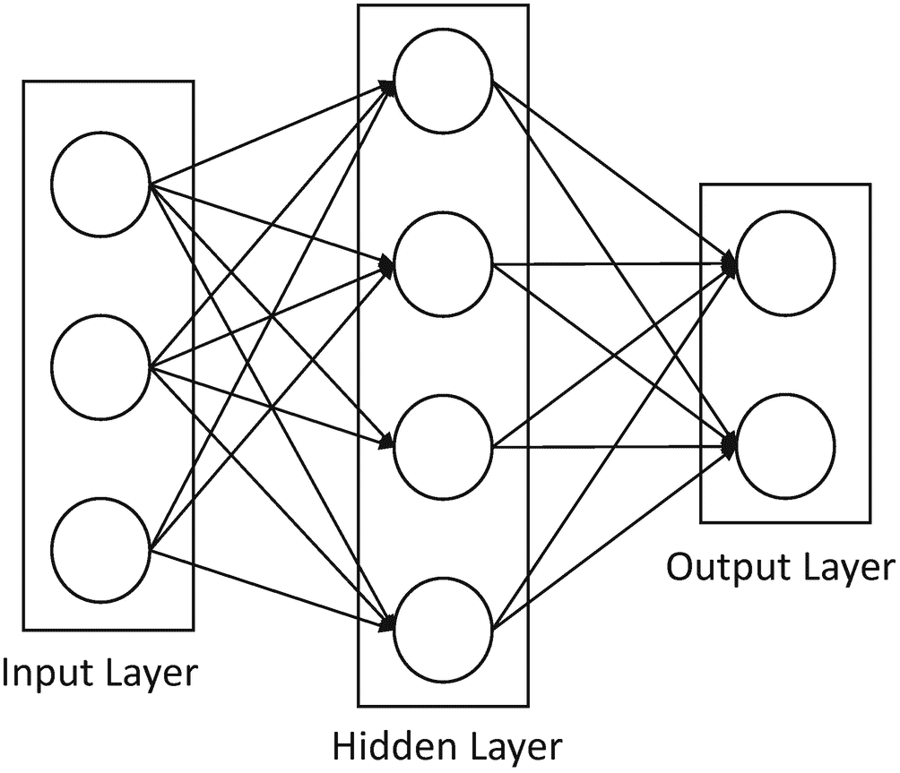
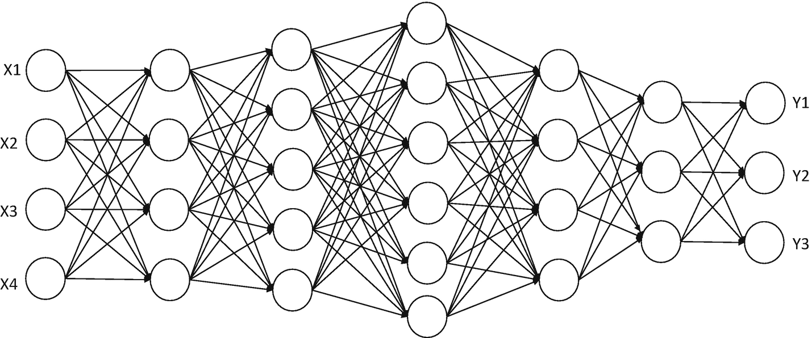
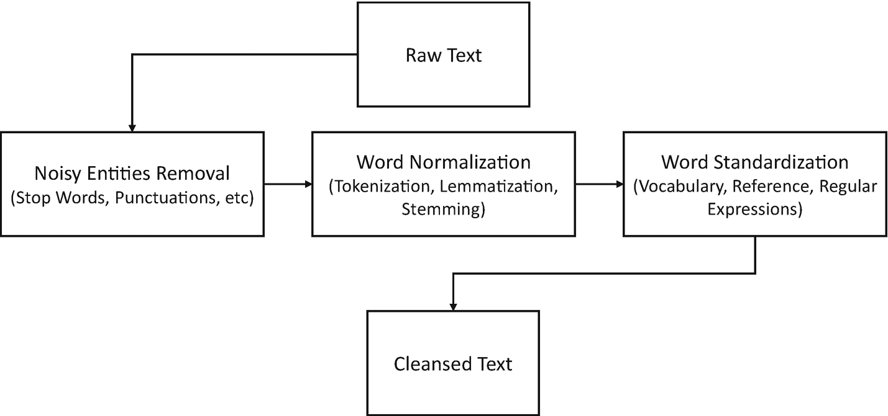
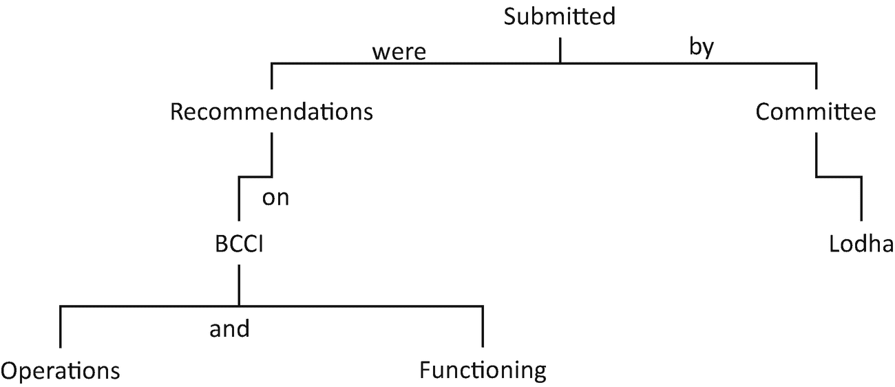

# 四、黑匣子里：理解人工智能决策

人工智能能够通过从数据中学习来不断提高其预测能力，而无需人类的大量参与来解释如何完成任务，这是一件大事。为什么？

两个原因。首先，我们的大脑中有很多东西，但我们无法准确解释我们如何推理、区分、适应变化的环境，并利用经验解决我们从未遇到过的问题。在人工智能出现之前，我们试图更接近人类水平的思维，这涉及到复杂的“如果-那么-否则”式的程序来解决问题。这种方法既不能扩展，也不能适应不断变化的条件。

第二，AI 系统是优秀的学习者。他们从数据中学习，从人类完成的验证中学习，当他们因为错误的预测而受到惩罚时，他们也会学习。给人工智能提供这种学习能力只需要很少的编码。

人工智能(AI)一词意味着一台可以推理的机器。更完整的人工智能特征列表是:

*   *推理*:通过逻辑推理解决问题的能力

*   知识:表现关于世界的知识的能力

*   *规划*:设定和实现目标的能力

*   *沟通*:理解书面和口头语言的能力。

*   感知:通过视觉、声音和其他感官输入与世界互动的能力

基于它们解决问题的能力，有三种主要的人工智能。

## 人工狭义智能

又因为问题定义狭窄而被称为“弱 AI”。打败国际象棋世界冠军的 AI 就是 ANI 的例子。它很擅长下棋，但这是它唯一擅长的。如果你让国际象棋的人工智能专家给你从 A 点到 B 点的驾驶方向，它会茫然地看着你。可能会有另一个人工智能专家来帮助你驾驶方向，但它不能帮助你下棋。

你可以想象 ANI 有特定的目的，有局限于一个区域的智能，而且大多是一个或几个特定的目标。在这里，智力更多地被定义为独立工作的能力，而不是(当前的/渐进的)自我提高。

目前，我们在现实生活中使用数百个狭义人工智能。Siri、谷歌、脸书、自动泊车和自动驾驶汽车是更复杂(智能)的狭义人工智能。你也可以找到更弱的人工智能，比如可以根据你的位置改变时区的手表，或者根据外面的天气情况自动控制你房间的温度。

这里还有一些日常生活中的茴香的例子:

*   现代汽车充满了 ANI 系统，从自动防滑机制到警告你轮胎压力突然下降，再到给你一个指示，告诉你在你的盲点有另一辆车。另一方面，自动驾驶汽车是复杂的 ANI 系统的一个例子，它不仅参与汽车的所有机械装置并为你驾驶汽车，而且还与外部环境互动，代表你做出决定——何时停车，何时保持安全距离，何时变道等。

*   你的智能手机由许多弱 ANI 解决方案组成，从推荐购买的购物应用到从 A 点到 B 点的实时驾驶路线，到获取天气更新，到收听你喜欢的音乐列表，到与你的手机进行对话，以及更多组织你日常活动的应用。

*   微软的 outlook 或者谷歌的 Gmail 都是智能的 ani。它们是预先构建的，专门用于分类什么是垃圾邮件，什么不是。他们不断地在后台观察你的行为和偏好，将你认为重要的、垃圾的和垃圾邮件进行分类。

*   亚马逊的“买了这个的人也买了……”推荐系统是一个不断学习的 ANI 系统，它从数百万顾客的购买模式中收集信息，然后将这些信息个性化，以影响你购买更多的东西。

*   谷歌提供的搜索、谷歌翻译和谷歌新闻都是专门针对内容的复杂人工智能系统的例子。脸书的新闻订阅也是如此。

*   还有一些 ANI 系统的例子，尽管它们只专注于解决一个问题，但它们确实深入到了那个领域。安全系统、自动化制造、资本市场中的算法交易、帮助医生进行诊断的专家系统，以及最著名的 IBM 的沃森，它包含了足够多的精选信息，足以击败最多产的 *Jeopardy* 冠军。

## 人工通用智能(AGI)

也被称为“强人工智能”，这是一个人工智能系统，可以执行人类可以执行的任何智力任务。我们离创造 AGI 系统还很远，因为智力是一个复杂的东西，它主要涉及推理、适应能力和心智能力。因此，如果 AGI 必须存在，它必须做人类做的一切——在不确定性下使用策略和做出判断，集中知识，包括常识，计划，学习，用自然语言交流，然后结合所有这些高阶技能来解决问题和实现目标。这是一个棘手的问题！

## 人工超级智能

超越 AGI 的一切都是 ASI。ASI 系统在几乎每个领域都比最优秀的人脑聪明，包括科学发现、创造力、常识和社会互动。

截至目前，我们只达到了 AI 的最低级。从 ANI 到 AGI 再到 ASI 的道路需要大量的技术发展。当然，这将是一次激动人心的旅程，但也是一次挑战人类生存的旅程。

## 学习者的类别

机器学习算法“学习”做出预测。他们采取的学习方法完全是由你想要解决的问题类型驱动的。

### 监督学习

你要预测一个目标或者一个阶级。例如，假设你想预测“谁会流失？”。然后，您的模型将根据历史数据进行训练，在这些数据中，您标记了每个客户的流失状态。该算法查看隐藏在数据中的各种模式，以映射到客户状态(流失=是或否)。这种从数据中学习以达到预期结果的数学抽象过程被称为*监督学习，*因为它知道要学习什么。

需要了解的主要原则是:

*   训练数据集包含预测器和要预测的输出。

*   学习者将使用训练数据集来确定预测器和输出之间的映射。

*   一旦学习者学会了地图，它就可以在新的数据上有一定的准确性。

这里有几个例子:

*   输入(录音)–输出(文字记录)–应用(语音识别)

*   输入(照片)–输出(字幕)–应用(图像标记)

*   输入(存储交易详情)–输出(交易是否欺诈？)–应用(欺诈检测)

*   输入(食谱配料)–输出(顾客评论)–应用(食物推荐)

*   输入(过去的购买数据)–输出(未来的购买行为)–应用(推荐系统)

*   输入(车辆位置和速度)–输出(交通流量)–应用(交通管理)

### 无监督学习

一般来说，您在寻找模式，但是没有可以映射的输出。例如，您希望根据客户订购的产品类型、他们购买您的产品的频率、他们上次访问的时间等对客户进行分组。这种将同质行为分组到一起的过程被称为*无监督学习，*因为它不知道要学习什么。但是，它会观察数据中的模式，并自动找到在数据中找到不同组的方法。

需要理解的关键原则是:

*   无监督学习不试图映射到预定义的输出，而是解释数据是如何组织的。

这里有几个例子:

*   聚类算法，如 K-means 或分层聚类。这些算法试图创建聚类(相似的特征属于一个聚类)。

*   降维如 PCA。这些算法试图用更少的维度找到数据的最佳表示。

*   异常检测。这些算法试图发现数据中的异常值。

### 强化学习

你想要达到一个目标，但是你没有得到任何关于如何达到这个目标的具体的指示或预先的教训。在强化学习中，学习者没有被告知如何完成任务。然而，学习者被明确告知哪些行为会带来最大的回报。

需要了解的主要原则是:

*   强化学习试图在获取新知识的同时最大化回报。这种方法也被称为“勘探与开采的权衡”。

*   学习者遵循马尔可夫决策过程框架，其中它必须采取行动(A)以从开始状态转换到结束状态(S)。

*   它每采取一个正确的行动，就会得到一个回报(R)。否则会被扣分。这个行动序列定义了政策(P ),相应的奖励(或惩罚)定义了价值(V)。在这里，学习者的任务是通过选择正确的策略来获得最大的回报。

强化学习并不是完全受监督的，因为它并不严格依赖于它必须映射到什么输出。它也不是无监督学习，因为它预先知道正确行动的预期回报是什么。

## 人工智能问题的类别

人工智能问题可以分为 10 大类。

*   领域专家:人工智能系统必须获得特定领域的知识，然后获得足够的推理和推断能力，使其能够成为该领域的专家。这里的关键是获取关于特定领域的大量数据。

*   领域扩展:人工智能系统利用了大量的知识，并扩展了将这些知识中的不同事物关联起来的能力，以提出以前没有发现的新见解或模式。

*   复杂规划器(Complex planner):人工智能系统扮演着智能指挥者的角色，不仅可以整合各种复杂的数据，还可以产生洞察力。一个例子是使用人工智能技术来优化物流，其中，由于涉及到多跳和多方，包括车队、仓储、路由和配送，你正在查看大型复杂的数据集，其中人类无法检测模式，但机器可以轻松做到。

*   *更好的沟通者*:AI 系统提供了对话机制，包括自然语言处理、自然语言生成、解读情感、剪裁回应、语言翻译等。

*   *新感知*:人工智能系统与环境互动，以确定下一个最佳行动，实现自动驾驶汽车等新服务。

*   企业人工智能(Enterprise AI):人工智能系统的主要任务是自动化本质上重复的活动，其中有足够的知识库可用于准确定义输入-输出映射。

*   *让 ERP 智能化*:企业运行在 ERP 系统上。然而，他们缺乏智力。人工智能系统嵌入在 ERP 系统的各种工作流程中，其任务是为陷入工作流程或需要帮助才能有效执行任务的用户提供智能协助。人工智能系统在过去的问题、冲突解决、最佳实践、可能的补救措施等方面接受培训。

*   *让数据存储智能化*:企业有很多数据存储。有些是集中管理的(数据仓库),以满足分析需求，有些与特定的业务应用相关联并保持孤立状态，更多的是由于用户的时间点需求而创建的。此外，有相当多的信息以非结构化格式分散在各处(日志、电子邮件、文档、图像、视频、通话记录等)。).人工智能系统可以在跨越所有这些不同的分布式数据存储中发挥作用，不仅可以收集元数据(数据目录、业务术语表和技术术语表)，还可以作为提供有意义的见解的手段，让数据留在它们所在的位置。

*   *超长序列模式识别*:人工智能系统的当前场景在预测结果方面做了出色的工作，这些结果可能适用于一个单一的问题。有许多大型的、复杂的现实世界问题需要一系列的预测相互反馈来解决问题。这种人工智能系统不仅会有自己的记忆，还会有先进的同步能力来自我调整和适应。

*   高级行为分析:人工智能系统已经在进行情感分析，但它们应用了有限的解释能力，主要使用词汇和语法结构。这些人工智能系统可以发展到使用多个领域来理解人类行为，例如观察肢体语言、面部表情、交流时的用词、互动的语气等。增强情感分析。

## 经理 ML 入门

理解 AI 和算法的工程方面的最好方法是参考 Tom Mitchell 提供的定义。 [1](#Fn1)

> *“如果由 P 测量的计算机程序在 T 上的性能随着经验 E 而提高，则称该计算机程序从关于某个任务 T 和某个性能测量 P 的经验 E 中学习。”*

因此，如果你想预测，例如，一个新的贷款申请人的信用价值(任务 T)，你对关于类似档案的过去数据运行一个机器学习算法(经验 E)，如果它成功地“学习”，那么它将正确地预测新的贷款申请人的信用价值(性能指标 P)。

“应该使用什么机器学习算法？”这个问题的答案总是“视情况而定”选择正确的算法需要综合考虑您试图解决的问题类型、业务目标、您想要应用的实验技术以及您手头有多少时间来验证您的算法。这取决于几个因素:数据大小、数据质量和数据多样性。其他的考虑包括你对错误的容忍度和你想对答案做什么。即使是最有经验的数据科学家也无法在尝试之前告诉你哪种算法的性能最好。

我们挑选了 10 个广泛使用的机器学习算法，让你了解算法术语。这也意味着这里没有列出很多算法。

### 朴素贝叶斯分类器

朴素贝叶斯分类器基于贝叶斯定理，允许我们基于一组给定的特征，使用概率来预测类别/范畴。

只有当特征相互独立时，才能应用朴素贝叶斯。如果我们试图通过花瓣的长度和宽度来预测一种花的类型，我们可以使用朴素贝叶斯方法，因为这两个特征是独立的。例如，垃圾邮件过滤是一个分类器，它给所有电子邮件分配一个标签“垃圾邮件”或“非垃圾邮件”。

### k 均值聚类

K-means 聚类是一种无监督学习，用于对未标记的数据进行分类。K-means 是一种不确定的迭代方法。该算法遵循一个过程来形成包含同类数据点的聚类。

k 的值是算法的输入。基于此，该算法选择 k 个质心。然后，一个质心的相邻数据点与其质心组合并创建一个聚类。稍后，在每个聚类内创建一个新的质心。然后，靠近新质心的数据点将再次组合以扩展聚类。这个过程一直持续到质心不变为止。

### KNN(K-最近邻)

KNN 算法可以应用于分类和回归问题。该算法存储所有可用的案例，并通过对其 k 个邻居进行多数投票来对任何新案例进行分类。然后，该案例被分配到与其最相似的类别。距离函数执行这种测量。

### 支持向量机

这是一种监督学习，本质上是通过找到一条线(超平面)将训练数据集分成几类来将数据过滤成几类。

由于可能有许多方法来创建线性超平面，SVM 算法试图使用最大化间距技术来最大化不同类之间的距离。SVM 是一种分类方法，在这种方法中，您将原始数据绘制为 n 维空间中的点(其中 n 是您拥有的要素数量)。然后将每个要素的值绑定到特定的坐标，这样就可以很容易地对数据进行分类。称为*分类器*的线条可以用来分割数据，并将其绘制在图表上。

与其他分类算法相比，SVM 在训练数据上给出了更好的准确性。SVM 算法不会对数据做任何强有力的假设，也不会过度拟合数据。

### 开门！开门

这是一种无监督的机器学习，从给定的数据集生成基于规则的推理。关联规则暗示，如果 A 项出现，那么 B 项也以一定概率出现。生成的大多数关联规则都是 IF_THEN 格式的。该算法考虑了某些推导原则:

*   如果一个项目集频繁出现，那么该项目集的所有子集也频繁出现。

*   如果某个项目集不经常出现，则该项目集的所有超集都不经常出现。

亚马逊等很多电商巨头都是利用先验来举一反三，像哪些商品有可能一起购买，哪些对促销反应最大。同样，通过观察在搜索查询中一起使用的单词的频率，谷歌会神奇地建议下一组单词的推荐，即使你没有停止输入。

### 线性回归

线性回归算法帮助我们理解两个连续变量之间的关系，以及一个变量的变化如何影响另一个变量。最容易解释的机器学习算法之一，很容易向他人解释，并且需要最小的调整。

自变量和因变量之间的关系是通过将它们拟合成一条线来建立的。这条线被称为回归线，用线性方程 Y= a * X + b 表示。

在这个等式中:

*   y 是因变量

*   a 是斜率

*   x 是独立变量

*   b 是截距

系数 a 和 b 是通过最小化数据点和回归线之间的距离的平方差的和而得到的。

### 逻辑回归

逻辑回归用于估计一组独立变量的离散值(通常是二进制值，如 0/1)。它通过将数据拟合到 logit 函数来帮助预测事件的概率。这里，预测的结果不是一个连续的数字，而是很大程度上与分类相关的输出。

基于分类反应的性质，逻辑回归解决三种类型的问题:

*   *二元逻辑回归*:分类回答有两种可能结果时适用，即是或否。

*   *多标称逻辑回归*:适用于分类回答有三个或三个以上可能结果且无排序的情况。

*   *有序逻辑回归*:适用于分类回答有三个或更多自然排序的可能结果的情况。

### 决策树

决策树是一种图形表示，它使用分支方法来绘制通向决策的路径。在决策树中，从根开始，每个内部节点都经历对响应变量的测试——树的每个分支代表测试的结果，叶节点代表特定的类标签，即在计算所有属性后做出的决定。分类规则通过从根到叶节点的路径来表示。

当响应变量本质上是分类变量时，我们应用分类树算法。当响应变量本质上是连续的或数值的时，我们应用回归树算法。

### 随机森林

作为决策树集合的随机森林。它使用 bagging 方法创建大量决策树，从原始数据集中随机抽取子集。在这种集成学习方法中，组合随机森林中所有决策树的输出，以做出最终预测。每棵树都为那个类“投票”。森林选择拥有最多票数的分类(超过森林中的所有树)。

### 降维算法

并不是所有的数据(属性)在达到预测的价值和重要性方面都是相同的。然而，如果管理得当，每一个原始数据点都可以带来巨大的价值。由于大数据技术，我们现在有能力存储、管理和处理由成千上万个变量组成的数据集。挑战在于确定对你的预测影响最大的变量。

PCA、决策树、因子分析、缺失值比率和随机森林等降维算法在帮助我们确定预测建模中应该考虑的正确变量方面发挥着关键作用。

### 梯度推进算法

梯度增强算法结合了多个弱算法，以创建一个更强大的算法。通常，您会遇到这样的情况:数据集可能非常庞大，或者数据集中可能存在几个不同的特征。在这些情况下，您可以使用一组学习算法，结合几种基本算法的预测能力来提高鲁棒性。

## 经理深度学习初级读本

深度学习是基于连接主义系统的原理——一组连接的单元或节点，称为*人工神经元*(生物神经元的简化版本)，相互传输信号。接收输入信号的人工神经元对其进行处理，然后产生输出信号，该输出信号被传播到与其相连的其他人工神经元。

在神经网络实现的情况下，人工神经元和连接通常具有在学习过程中通过应用某种衍生函数(也称为激活函数)来调整的权重。如果权重有助于预测精度，则它会增加连接处的信号。相反，如果权重对预测精度没有贡献，则它会降低连接处的信号。人工神经元由阈值控制，因此只有当信号的总值超过阈值时，信号才会进一步传播。典型地，人工神经元被组织成层。信号从第一层(输入层)开始，经过后续层，最终到达最后一层(输出层)。权重较大的神经元对下一层神经元的影响更大。最后一层将这些加权输入相加，得出最终答案。

数学很简单:f(x n )= y m

其中 f 是神经网络，x 是输入变量的 n 维向量，y 是输出变量的 m 维向量。请注意，n 可以不同于 m，这一点非常重要。

例如，输入可以是数百万像素，而输出被压缩成几个有意义的数字，例如，图像是汽车/房子图像的概率等等。

现在我们大致知道了什么是 ANN(人工神经网络)，我们来看一个(见图 [4-1](#Fig1) )。

图 4-1

人工神经网络

图 [4-1](#Fig1) 展示了一个浅层(不深)神经网络，其中 *n* 为 3， *m* 为 2，我们有一个隐藏层。

白色圆圈是*神经元*，神经元连接(灰色箭头)是*突触*。我们通常称突触为人工神经网络的权重。

*重量*在这个上下文中只是一个数字。信息从左到右流动，因此您在左边取一个值，然后通过将输入值乘以权重将其移动到右边。换句话说，隐藏层中神经元的值是前一层中所有值的总和乘以连接的权重。然后，神经元保存最终值。

*目标*是找到对我们产生有意义输出的权重。

*学习*就是找到这些权重的过程。你需要意识到的一件事是有很多重量。在这个例子中，我们总共有 9 个神经元，但是有 20 个权重。随着你增加更多的神经元，情况会变得更糟。“猜测”这些数字通常需要很长时间，并且需要相当多的资源。

*猜测*是一种寻找最佳价值的复杂方法。

*深安*简单来说就是一个有多个隐藏层的安，如图 [4-2](#Fig2) 所示。

图 4-2

深层神经网络

有三种广泛采用的深度学习架构。

*   *前馈* *神经网络*:ANN 的最简单形式之一，信号单向传播。简单地说，学习是通过前面传播的波实现的。

*   *卷积神经网络*:类似于前馈神经网络，但专门通过可学习的权重和管理偏差和卷积(识别图像中对象的边缘)来识别图像。

*   *递归神经网络*:与前两个神经网络不同，RNN 被设计用来识别序列。

    一旦第一层计算出权重和特征的乘积，RNN 学习过程就开始了。然后，输出遵循前馈神经网络原理。从一层到下一层，每个神经元都记得它在前一步中拥有的一些信息。这使得每个神经元都像记忆细胞一样。记住神经元在学习过程中可能需要哪些信息供以后使用是极其重要的。虽然前传播波在将信号传递到网络中的每个连续层时将继续进行增量学习，但后传播需要继续验证预测，并使用学习率或误差校正来改变权重，以便网络逐渐朝着做出正确预测的方向前进。

数据科学家使用深度学习来执行对象分类的三种最常见的方法是:

*   *从头开始训练*:你收集了一个非常大的带标签的数据集，并设计了一个深度神经网络架构，它将自动从你的数据中学习特征，并为你创建模型。

*   *迁移学习*:你不是建立自己的深度神经网络架构，而是利用他人(如 AlexNet 或 GoogLeNet)创建的深度学习架构，并对你的数据使用迁移学习方法。因为您是从现有网络开始，所以您有一个良好的开端。对现有网络进行一些调整后，您可以训练您的网络来执行更新的任务。数据科学家更喜欢迁移学习，因为该架构是预先构建的，并在数百万个数据点上进行测试。这样你就可以用更少的数据来解决你的问题，而不会变得计算密集。

*   *特征提取*:深度学习也可以有效地用作特征提取器。由于网络中的所有层的任务都是从输入数据中学习某些特征，因此您可以在训练过程中随时从网络中提取这些特征，然后将它们用作传统机器学习模型的输入。

### 深度学习算法和架构

既然我们对深度学习的含义以及神经网络如何帮助从数据中提取有意义的结果有了高层次的理解，那么是时候讨论一些流行的深度学习算法和架构了。

#### 前馈神经网络

前馈神经网络具有以下结构:

*   一层或多层，包括隐藏层。

*   每一层都有许多神经元。

*   两个神经元之间的每个连接都有一个权重。

*   一层的每个神经元通常连接到前一层的每个神经元的*(可以通过将它们的权重设置为 0 来关闭它们)。*

*   学习过程从在输入层的神经元上应用激活函数开始。然后，使用每个单元的加权和传递函数将结果值向前传播到下一层的单元。

*   输出层的结果就是网络的输出。

你如何衡量准确性和误差？

采用梯度下降优化算法使网络误差最小化。*梯度下降*用于寻找一个函数的最小值。最佳值是误差达到*全局最小值的值。*

为了理解梯度下降，想象一条发源于山顶的河流的路径。这条河的目标是到达从山上流下的最底部。现在，如果中间没有深坑，这条河在到达最终目的地之前不会停在任何地方。这是我们渴望的理想状态。在机器学习的背景下，我们说我们已经从初始点开始达到了解的全局最小值。

然而，如果在河的路径上有一个深坑，那么河就被困住了，不能达到全局最小值。在机器学习术语中，这样的坑被称为局部最小值，这是不可取的。

#### 学习率衰减

学习率衰减是一个重要的性能调整参数。在训练的最初阶段，你可以对重量做较大的改变。然而，随着时间的推移，您添加了更多的迭代，我们希望学习率下降，这样，随着增量较小的训练更新，您可以获得良好的学习权重，并更接近所需的最终状态。

#### 反向传播

反向传播提供了一种机制，通过反映输出误差来调整两个神经元之间的每个权重。误差首先通过观察输出单位(基于目标值和预测值之间的差异)来计算，然后通过网络传播回来，以更新在前一层中应用的权重。最终目标是获得一个全局最小值。

#### 拒绝传统社会的人

如果你的深层神经网络有大量的参数，就有可能过度适应你的学习者。辍学是解决这个问题的一种方法。

这个想法是在学习过程中从神经网络中随机删除单元(以及它们的连接)。这可以防止单元调整过多。在训练过程中，您可以配置丢弃样本，以便学习者接近平均预测的效果，并减少过度拟合的机会。

#### 批量标准化

深度神经网络在学习过程的开始，假设一些权重的初始化，这些初始化远离所学习的权重的最终状态。在每次迭代过程中，这些权重经过仔细调整以减少误差。在这个迭代过程中，初始层的小变化可能会无意中导致后面层的大变化。因此，保持小的学习速率是谨慎的，使得只有一小部分梯度校正权重。批次标准化有助于通过一系列小批次来调节重量校正，从而加快学习过程。

#### 消失渐变

人类大脑将真实世界的抽象表现储存在内心深处。类似地，深层神经网络中的隐藏层也存储训练数据的抽象表示。深度神经网络中的隐藏层越多，在前一个隐藏层之上的抽象就越多(越丰富)。然而，如果我们不断增加深层神经网络中隐藏层的数量，我们会遇到反向传播变得毫无意义的情况，因为我们无法实现更多的梯度下降改进。实际上，随着传回的学习信息越来越少，梯度开始消失，最终对于调整网络的权重变得无关紧要。

#### 自动编码器

网络的目标是通过学习在概念级别定义数据的核心要素来“重新创建”输入，以便它可以通过遵循紧凑的表示技术来再现数据。

网络不是学习输入数据和相应输出之间的“映射”,而是学习数据本身的内部结构和特征。怎么会？在神经网络中，数据的内部抽象(最重要的是，降维数据的特征)位于隐藏层中。自动编码器利用隐藏层来开发其学习过程。

#### 玻尔兹曼机器

玻尔兹曼机器是应用概率分布原理的神经网络，学习机制是。学习过程包括两个协同工作的阶段(正阶段和负阶段)。

在学习过程中，网络获得了输出数据是如何从输入数据创建的感知(您可以称之为积极阶段)。它试图使用相同的感知来重新创建输入数据(你可以称之为负相)。如果生成的数据不够接近现实，网络会对其感知进行调整并再次尝试。主要目标是不断完善感知，使生成的数据变得和原始输入数据一样好。

#### 过滤器和最大池

卷积神经网络(CNN)是一类专门用于图像识别的前馈网络。

CNN 应用图像过滤器和最大池效应从数据中学习。图像*过滤器*是具有相关权重的矩形。

*卷积层*将许多这样的*滤波器*应用于输入图像，以创建原始图像的许多子样本。应用于图像的一个滤波器的结果被称为*特征图*。例如，如果输入包含一个 32x32 的图像，并且图像过滤器的二次采样参数为 2x2，则输出值将是一个 16x16 的图像，这意味着输入图像的四个像素(每个像素为 2x2 的正方形)将组合成一个输出像素。子抽样有多种方法，但最常用的方法是最大汇集法。

*Max-pooling* 是一种将输入图像分割成一组不重叠的矩形的方法，可减少其维数，并允许对包含在子区域中的特征进行假设。

#### 生成对抗网络

GAN 由两个相互竞争的神经网络(生成器和鉴别器)组成。训练过程包括生成器尝试使用某种形式的概率分布来产生数据(通过观察训练数据集中的模式)。鉴别器就像一个法官，决定生成的数据是否更接近训练集的分布。

#### 长短期记忆(LSTM)

我们一直在进行大量的优先级排序，当我们获得新信息时，我们会立即判断新信息的重要性，然后开始进行重新排序活动。原来传统的前馈网络不这样做。当添加新信息时，它们通过重新调整权重来完全转换现有信息。因此，所有信息都会被修改。总体来说，没有考虑“重要*”*新信息和“不那么重要”的新信息。

在许多现实世界的问题中，记住一系列事件对于得出最终预测非常重要。LSTMs 是一种新型的神经网络，旨在选择性地记住或忘记事情。

一个 LSTM 网络使用被称为*单元* *的内存块。*记忆块负责记忆信息。对存储器的更新是通过应用不同的被称为*门*的机制来完成的。

##### 忘记大门

遗忘门将过滤器应用于单元状态，以移除学习过程中 LSTM 不再需要的过去信息，或者忽略学习过程中不太重要的新信息。

##### 输入门

输入门负责向单元状态添加信息。这基本上是分三步完成的。

1.  创建包含单元状态的所有可能值的输入向量。

2.  通过调用 sigmoid 函数作为过滤器来控制哪些值需要添加到单元格状态。

3.  将滤波器的值乘以输入向量，并触发激活动作以完成输入操作。

这三步过程确保只有重要的和非冗余的信息被添加到单元状态*。*

##### 输出门

输出门也遵循三步流程:

1.  在将激活函数应用于单元状态之后创建输出向量。

2.  通过调用过滤函数来控制哪些值有资格被视为输出。

3.  将滤波器的值乘以输出向量，并触发激活函数以完成输出操作，使得输出前进到下一层。

## 经理 NLP 初级读本

自然语言处理(NLP)是计算机科学、人工智能和计算语言学交叉的专业领域。

通过利用自然语言处理，我们可以分析文本数据并执行许多任务，如自动摘要、命名实体识别、关系抽取、情感分析、主题分割等。

从广义上讲，NLP 包括两个特定的任务:

*   自然语言理解

*   自然语言生成

### 自然语言理解

NLU 是理解给定文本意义的过程。它试图通过解决各种歧义来获得文本中单词的性质和结构的整体视图:

*   *词汇歧义*:单词有多个意思

*   *句法歧义*:句子有多个解析树

*   *语义歧义*:句子有多重含义

*   *回指歧义*:之前提到过但含义不同的短语或单词

一旦歧义消除，NLU 试图通过使用词典(词汇)和一套语法规则来推导每个单词的含义，以解决不同单词具有相似含义(同义词)和单词具有一个以上含义(多义性)的问题。

### 自然语言生成

NLG 是自动生成具有有意义的短语和句子的可读格式的文本的过程。

自然语言生成包括三个关键任务:

*   *文字策划*:对内容进行排序，赋予其结构。

*   *句子规划*:对单词和句子进行排序，以表示文本的流动。

*   *实现*:从语法上纠正句子，以表达文本的预期含义。

下面是几个 NLP 应用于文本的例子。

*   *句子分割*:识别句子边界，即一个句子结束而另一个句子开始的地方。长句经常被逗号之类的标点符号打断。比如“很久以后我遇到了一个朋友，我们一起喝咖啡。”可以拆分成两句话。第一句是“很久以后我遇到了一个朋友”，第二句是“我们一起喝了咖啡”。

*   *符号化*:识别文本中不同的单词、数字和其他标点符号。例如，“我的车不断给我警报，因为车门没有关好。”可以标记为[我的] [汽车][保持][给予][我][警报][，][作为][车门][未][正确][关闭][。]

*   *词干化*:将每个单词的屈折形式缩减为一个共同的词根或词根。比如“给，给，给”可以简化为词根“给”。

*   *词性标注*:给句子中的每个单词分配一个词性标签，如名词或动词。例如，“如果你建造了它，他们就会来。”可以张贴标记为:
    *   IN:介词和从属连词:“如果”

    *   PRP:人称代词:“你”

    *   VBP:动词:“建造”

    *   公关:人称代词:“他们”

    *   MD:情态动词:“将”

    *   VB:动词原形:“来”

*   *解析*:将给定的文本分成不同的类别。例如，“苏姆和萨钦进了一家酒吧。”可以解析为(S(NP(NP Soum)和(NP(Sachin))(VP(went(PP into(NP a bar))))

*   *命名实体识别*:识别文本中的人、地点、时间等实体。例如，“萨钦将于周日前往美国。”可以识别为[person = Sachin]，[location = US]和[Time = Sunday]。

*   *相互引用解析*:查找引用同一个实体的所有表达式。比如“萨钦买了一部手机。他觉得这钱花得值。”可以共指【萨钦，他】和【电话，它】。

表 [4-1](#Tab1) 提供了实现常见 NLP 任务的深度学习算法列表。

表 4-1

深度学习算法和常见的 NLP 任务

<colgroup><col class="tcol1"> <col class="tcol2"></colgroup> 
| 

深度学习算法

 | 

NLP 任务

 |
| --- | --- |
| 前馈神经网络 | 词性标注符号化命名实体识别意图提取 |
| 递归神经网络(RNN) | 机器翻译问答系统图像字幕 |
| 递归神经网络 | 解析句子情感分析意译检测关系分类物体检测 |
| 卷积神经网络(CNN) | 句子/文本分类关系提取和分类垃圾邮件检测搜索查询的分类语义关系提取 |

### 文本预处理

文本是所有可用数据中最不结构化的形式。在将自然语言处理技术应用于文本数据之前，我们必须确保文本经过预处理。怎么会？

有三个关键的中介步骤应用于文本数据，使其为分析做好准备(见图 [4-3](#Fig3) )。

图 4-3

说明文本预处理步骤

#### 噪声消除

任何与句子上下文无关的文本都可以被认为是噪音。有噪声的实体的例子是语言停止词(是、是、是、的、的、在等。)、URL 或链接、社交媒体实体(提及、标签)、标点符号等。

一种去除噪声的方法是 a)标记整个文本，b)参考噪声实体的字典，c)消除噪声字典中存在的那些标记。另一种方法是在处理特殊的噪声模式时使用正则表达式。

#### 词汇规范化

同一个单词在一个句子中出现多个表示形式也会产生噪音。例如，“吃”、“吃”和“吃了”都是词根“吃”的不同变体。尽管从语法角度来看，它们表达了不同的意思，但词根是相同的。词典规范化将一个单词在一个句子中的所有差异转换成规范化的形式(也称为*引理*)。

最常见的词典规范化实践如下:

*   词干提取:词干提取是一种基于规则的方法，用于去除我们通常添加到词根来表达特定含义的后缀。例子有“ing”、“ly”、“es”、“s”等。

*   *词条释义*:词条释义是将一个单词简化为其词根形式的过程。

#### 对象标准化

这个过程是基于这样一个普遍的事实，即我们经常使用语法不正确，也不符合任何标准词汇词典的单词或短语。一些例子是首字母缩写词、带有附加词的标签和口语俚语。借助正则表达式和手动准备的数据字典，可以修复这种类型的噪声。

### 文本到要素(文本数据上的要素工程)

就像我们对结构化数据进行特征工程以识别可用于开发 ML 模型的重要属性一样，我们需要对预处理的文本数据进行类似的活动以确定文本特征。有几种技术可以构造有用的文本特征，下面将讨论。

*句法分析*:句法分析分析句子中的单词的语法以及它们与其他单词之间的关系。

*依存树*:句子是由单词按照特定的顺序组成，以传达意思。句子中单词之间的关系是由依存语法决定的。例如，考虑这样一句话:“关于 BCCI 运作和功能的建议是由 Lodha 委员会提交的。”词与词之间的关系可以用树的形式表示出来，如图 [4-4](#Fig4) *所示。*

图 4-4

说明用于句子分析的树形结构

树显示“submitted”是这个句子的词根，由两个子树链接。每个子树都有另一个具有依赖性和关系的子树。依存关系树有助于识别文本特征。

*词性标注*:词性标注帮助我们理解句子的结构。在自然语言处理中，词性标注有许多重要的用途，例如，在以下两个句子中:

*   “帮我订机票。”

*   “这是一本好书。”

在这两个句子中,“Book”在不同的上下文中使用。在第一个句子中，单词“book”是一个指示购买门票的动词，而在第二个句子中，它被用作名词，指的是你正在阅读的一本书。

### 实体提取(实体作为特征)

实体是句子中最重要的对象——名词短语、动词短语或两者都有。

想想这句话:

> *订单处理系统给出错误代码 1048。*

实体提取将标识以下内容:订单、错误、1048。这些关键信息足以进行故障排除并提供解决方案。

典型的实体提取模型由两个活动组成:

*   *名词短语识别*:该步骤使用依存树和词性标注从文本中提取所有名词短语。

*   *短语分类*:该步骤将所有提取的名词短语分类到各自的类别(地点、名称等。).

*主题建模*:主题建模是自动识别文本语料库中存在的不同主题(语料库中同现术语的重复模式)的过程。它以一种无监督的方式获得语料库中单词之间的隐藏模式。潜在狄利克雷分配(LDA)是最流行的建模算法类型。

*LDA 算法*:该算法假设文档按照以下方式生成。

撰写本章时，我们:

*   首先概念化的关键主题，“黑盒”。然后我们概述了什么样的主题组合应该进入这一章。例如，我们决定用一些章节来概括 ML、DL 和 NLP，然后用一个黑盒来描述 AI 的本质。

*   然后我们添加了一些高级限制，比如页数(人们会对阅读冗长的章节失去兴趣)。

*   然后，我们进入了将我们的思想转化为实际写作单词、句子、段落和小节的艺术。

虽然这种叙述反映了人类在编写文档时的思维方式，但机器需要从里到外理解这一过程。

机器方法是:

*   首先对整个文档应用标记化方法，然后用连续的单词生成文档中出现的不同主题。

*   然后以题目为参照点，学习用哪些词生成了题目(80%概率的“可解释性”这个词定义“黑盒”为题目，55%概率的“解析”定义“NLP”为题目，以此类推)。

*N-Grams 作为特征*:N 个单词组合在一起称为 N-Grams。作为特征，N 个单词(N > 1)通常比单个单词(unigrams)更能提供信息。

### 斯基普格拉姆 - 维基百科，自由的百科全书

skip-gram 模型背后的主要思想是确定两个不同的单词*是否相似，如果它们共享相似的上下文。*例如，在“犯错是人之常情”这句话中，如果你用“错误”或“搞砸了”来代替“犯错”，这句话仍然是一个有意义的句子，意思是一样的(即“是人”)。

Skip-gram 应用上下文窗口(包含 k 个连续术语的窗口)。你跳过其中一个单词，并试图训练一个神经网络，该网络接受除跳过的单词之外的所有单词，并预测你跳过的单词。

### 连续的单词袋

在连续单词袋模型中，目标是使用特定单词周围的上下文，然后预测该特定单词。在大型文本语料库中，每次看到感兴趣的词，都要考虑周围的词(上下文词)。你将上下文单词输入神经网络来预测上下文中心的单词。

*统计特征*:文本数据也可以使用几种技术直接量化成数字。

*词频-逆文档频率(TF-IDF)* : TF-IDF 主要用于信息检索目的。目标是在没有精确排序的情况下找到文档中出现的单词。

例如，您有 N 个文档。在任何文件 D 中，TF 和 IDF 定义为:

*   *术语频率(TF)* :术语“t”的 TF 是术语“t”在文档“D”中的计数。

*   *逆文档频率(IDF)* :一个术语的 IDF 是语料库中文档总数与包含该术语“t”的文档数之比的对数。

*   *TF。IDF* : TF。IDF 给出了术语“t”在语料库中的相对重要性。

## 作为黑盒的神经网络

就像我们的大脑如何工作一样，神经网络的内部工作由多层互连的神经元样节点、输入层、输出层和许多中间“隐藏”层组成。节点本身基于与节点相关联的权重执行数学运算，并将输入数据的内部表示传递给后续层，最后用预测汇总输出层的权重。深度神经网络有不止一个隐藏层。通过向神经网络提供成千上万的数据，你可以使它逐渐微调特定层中单个神经元的权重。最终结果是所有层的所有神经元的复杂读数，加权产生最终输出。从原始输入到最终结果的旅程是如此复杂，经历了如此多的迭代和微调，以至于神经网络获得了黑箱的恶名，因为它们无法解释它们是如何获得最终结果的。我们唯一能做的就是尽可能创造出最好的模型，并用尽可能多的无偏见数据来训练它。

神经网络训练的关键是称为*反向传播*的过程，在该过程中，中间层设置被逐步修改，直到输出层达到与输入层的最佳匹配。你拥有的神经元样节点越多——权重和中间层越多——学习过程就越复杂，即使你得到了相当准确的预测。

有一个模型可以用以前看不到的数据给出准确的预测是一回事，而你无法解释你的模型如何得到准确的预测是另一回事。在许多真实世界的情况下，非常需要详细了解内部决策过程，因为后果可能是灾难性的。

### 窥视黑匣子的内部

飞机上的黑匣子也被称为飞行数据记录器。它们记录了飞行途中发生的几乎所有事情。这是一个非常安全的设备，如果飞行中发生任何事情，它将成为研究人员和调查人员了解真相的重要来源。

人工智能的黑箱(ML/DL 算法)具有相反的意义——算法提供预测，但它不一定告诉你它如何学会预测，以及它在学习时考虑了什么。

这些“自我学习机器”的开发人员也承认，一旦训练了 ML/DL 算法，就很难理解为什么它会对一组数据输入做出特定的响应。这种透明度的缺乏引发了关于人工智能的自主性、决策和责任方面的问题。

有两组活动定义了机器如何进行学习活动:

*   知识收集(通过输入数据集并帮助验证和提高预测置信度)用于实现准确的预测。

*   将预测模型嵌入到应用中，不仅可以自动做出决策，还可以不断学习和改进。

一旦预测系统训练好了，就该付诸行动了。我们看到两种预测系统聚集成两种类型。

*   A 类应用，预测系统的结果会对人们的生活产生不利影响。其中包括医疗诊断、贷款处理应用、简历筛选应用、自动驾驶汽车等。

*   B 类应用，预测系统的结果可能最多让人们不满意。包括看哪部电影，去哪家餐厅吃饭，哪条通勤路线会更快，你想看哪些新闻，你想买哪些物品等等。

当涉及到 B 类应用时，我们不太关心人工智能系统的不透明性，而我们非常渴望了解在 A 类应用的情况下做出预测需要什么。

神经网络通过多个互连层处理输入数据进行学习。第一层充当输入层，在这里“神经元”接收原始输入(例如人脸照片中的像素)。然后，神经元施加一定的权重，根据数学规则得出一个分数。然后，这一层的汇总分数会传递给下一层节点。这个过程在网络中的所有层和所有节点上继续，直到到达最终的输出层。网络的最后一层作为输出层，将前几层的所有分数汇总成一个预测:“这是一张人脸的图片”，例如。术语“深”意味着更多层数；它可以包含三层到数百层。

如果预测是错误的，神经网络将进行反向跟踪，调整节点之间的链接，调整数学规则，逐步引导课程接近预期结果。通过调整参数来满足数百万个例子，神经网络创建了一个模型，可以对新图像进行分类，或在以前从未遇到过的条件下执行操作。

这种学习过程被称为深度学习，允许神经网络创建专门解决特定问题的人工智能模型(如图像识别、语音识别等)。)，但是手工编码太复杂太繁琐。深度学习难能可贵的是，你不用告诉系统要找什么。你给它几百万张猫的照片，图像识别专家就会弄清楚猫长什么样。

因为神经网络本质上是自己编程，所以它们经常创建没有人能够完全理解的数据的抽象表示。决策过程被编码在节点之间数十亿个来回的信号中。

许多专家发现这种无法解释的现象令人担忧。这在人机游戏中并不重要，但在无人驾驶汽车的情况下，这非常重要。如果无人驾驶汽车发生严重事故，说“我们只是不明白为什么汽车会这样做”是完全不可接受的

具有讽刺意味的是，我们(人类)正在建立预测系统，我们追求的用例范围越广，人工智能成功模仿人类的途径就越多，因此人工智能在理解我们为什么做我们所做的事情以及我们所有的偏见、偏见和限制方面就变得越熟练。

### 揭开 AI 的面纱

围绕人工智能的不透明性引发了激烈的争论。让人工智能变得可解释的系统化方法仍需数年时间，但许多方法已在实验室中。方法可能有所不同，但它们的目标是相同的:确保我们的机器不会进化到超出我们理解它们的能力。

一些研究人员正试图将“解释训练”模块嵌入人工智能系统，这样任何对输入和结果输出的修补都可以自动记录下来。这种方法可能在不太复杂的人工智能算法中工作得很好；然而，当你输入大量数据，并且你的算法有很多层，然后你让“解释训练”模块关注每一件事时，算法将固有地减慢学习过程，这不是一个期望的效果。其他人正在尝试开发“探针模块”，可以对网络行为进行分析，并了解这些系统如何学习。

“观察者方法”将人工智能系统视为一个黑匣子。它是一个预先构建的神经网络，专门用于解决特定的任务。您不是输入整个数据集，而是通过一点一点地输入增量数据并观察其行为来进行试验。例如，你不是一次输入一辆汽车的完整图片，而是一次输入一辆汽车的神经网络片段，并观察哪些部分(前灯、前保险杠、侧视镜、挡风玻璃、部分可见的转向或像破裂的挡风玻璃这样的意外情况)导致人工智能系统做出正确的分类。

“解释网络”是用第二个神经网络探测一个神经网络的另一种方法。目标是更深入地了解原始神经网络中发生的调整和调节。

虽然这些方法无疑将使深度学习网络如何做出决策变得更加清晰，但在我们达到这种状态之前，我们别无选择，只能对人工智能产生的结果产生信任，同样，对负责决策的人类也有一种固有的信任。例如，我们接受陪审团成员做出的决定，最多可能会考虑哪些事实有助于改变他们的决定，但我们不会询问他们或扫描他们的大脑活动来了解他们是如何做出最终决定的。

### 训练 ML 和我们对错误的容忍度

在加油站开始一份收银员的工作并不需要大量的培训。即使在他们的第一天，收银员拥有一定的基本会计知识开始工作。在他们的第一天，新的收银员可能会显得缓慢，低效，并可能比他们有经验的同行犯更多的错误。我们通常有很大的容忍度，并接受收银员正在经历一个学习阶段的事实，他学习这份工作只是时间问题。

我们不常想到，但行医者也是如此。我们感到欣慰的是，医学实践受到政府的监管，在获得行医执照之前，不仅需要通过令人紧张的课程，还需要数千小时的实习经验。如果有人想从事心脏外科等专业，需要额外的艰苦课程和大量的实习经验，以观察和向专家学习。一旦有人获得行医执照，就不会止步于此。医疗从业者在工作经验的基础上不断提高。

什么是“足够好”是基于我们对错误容忍度的偏好。我们对新出纳的容忍度要高得多，对医生的容忍度要低得多。当谈到人类在不同的工作中需要多少培训时，我们对“足够好”有不同的定义。

AI 也是如此。算法需要经过训练，就像医生和收银员一样。他们也受到“足够好”这个问题的困扰，需要做出取舍。

让我们以管理你的 Gmail 的人工智能为例。Gmail 应用对收到的电子邮件进行垃圾邮件过滤，根据您的偏好组织您的收件箱，根据邮件内容设置您的日历条目，发送自动回复等。但是，它也经常失败。我们不会抛弃 Gmail 我们认为它“足够好”,通过我们对 Gmail 的持续沉迷(纠正它的错误),我们为人工智能提供了一个很好的训练场地，但代价是我们自己。

相比之下，我们对无人驾驶汽车的错误容忍度很低。我们以前从未有过无人驾驶汽车，没有训练数据，所以人工智能是如何学习的？我们采取了一种聪明的方法，要求人类司机驾驶第一代自动驾驶汽车，行驶数十万英里，并在工作中训练人工智能。这就像一个驾驶教练在让学生自己开车之前，让他们在监督下进行驾驶体验。关键问题是，我们应该接受自动驾驶汽车背后的这个 AI 足够好吗？

为了变得更好，自动驾驶汽车背后的人工智能需要在真实的情况下学习，无人监管。但是，将不成熟的人工智能放在现实世界中，意味着给乘客一个相对“年轻和缺乏经验”的司机。突然间，风险被放大了，我们对错误的容忍度降到了最低点。然而，除非不成熟的人工智能被鼓励在现实世界中操作，否则它永远不会了解在现实世界中成功操作和繁荣的许多细微差别。

这就是棘手的权衡。更早地将人工智能置于现实世界的环境中会加速学习，但可能会产生严重的后果(挑战我们的容忍水平)。稍后将产品置于真实世界的情况下会减慢学习速度，但会有更多的时间来改进人工智能。

## 结论

为什么我们如此在意算法的“可解释性”？在许多情况下，对算法的实现应该非常谨慎的担忧是有道理的。然而，当我们继续寻找机器学习算法的新应用时，我们不应该让这种对算法可解释性的关注蒙蔽了我们对这个世界的一个残酷事实的认识:人类是可预见的非理性的，并不比最不透明的算法更可解释。

这就是为什么两种类型的人工智能应用之间的区别——那些取代基于规则的重复性人工任务的应用和那些取代面向人类判断的任务的应用——是重要的。当我们特别关注算法正在取代人类判断导向的任务的人工智能应用时，我们倾向于寻求人工智能的“可解释性”，而不是以前的任务。

### 人类无法解释自己的行为

人类有认知偏差。我们甚至经常意识不到偏见是如何进入我们的思维过程的。当你要求人们解释他们的决定时，他们对解释他们为什么那样做感到不舒服。对于同样的问题陈述和采取的同样的行动，两个人会提出非常不同的解释来解释他们为什么会这样做。

### 算法是可预测的理性

一个算法每次都会给你同样的答案。是的，当我们构建这些算法时，如果我们向它们提供我们的认知偏差和数据偏差，它们会一致地确认有偏差的输出。因此，当我们开始强调“人工智能的可解释性”是一个关键因素时，我们必须问我们的结果是否比理解获得结果的过程更有价值。

在下一章中，我们将讨论如何通过结合机器人流程自动化和人工智能，企业可以通过追求智能自动化之旅来实现转型。

## 参考

1.  [T2`https://www.smithsonianmag.com/smart-news/weve-put-worms-mind-lego-robot-body-180953399/?no-ist`](https://www.smithsonianmag.com/smart-news/weve-put-worms-mind-lego-robot-body-180953399/?no-ist)

2.  [T2`https://hbr.org/2017/03/the-trade-off-every-ai-company-will-face`](https://hbr.org/2017/03/the-trade-off-every-ai-company-will-face)

3.  [T2`http://www.zdnet.com/article/inside-the-black-box-understanding-ai-decision-making/`](http://www.zdnet.com/article/inside-the-black-box-understanding-ai-decision-making/)

4.  [T2`https://hbr.org/2017/01/4-models-for-using-ai-to-make-decisions`](https://hbr.org/2017/01/4-models-for-using-ai-to-make-decisions)

5.  [T2`https://futurism.com/ai-learn-mistakes-openai/`](https://futurism.com/ai-learn-mistakes-openai/)

6.  [T2`https://www.technologyreview.com/s/607955/inspecting-algorithms-for-bias/`](https://www.technologyreview.com/s/607955/inspecting-algorithms-for-bias/)

7.  [T2`https://www.cio.com.au/article/631997/how-transparent-your-ai-black-box-systems-better/`](https://www.cio.com.au/article/631997/how-transparent-your-ai-black-box-systems-better/)

8.  [T2`https://www.scientificamerican.com/article/demystifying-the-black-box-that-is-ai/`](https://www.scientificamerican.com/article/demystifying-the-black-box-that-is-ai/)

9.  [T2`https://thenextweb.com/artificial-intelligence/2018/02/27/bye-bye-black-box-researchers-teach-ai-to-explain-itself`](https://thenextweb.com/artificial-intelligence/2018/02/27/bye-bye-black-box-researchers-teach-ai-to-explain-itself)

10.  [T2`https://www.sentient.ai/blog/understanding-black-box-artificial-intelligence/`](https://www.sentient.ai/blog/understanding-black-box-artificial-intelligence/)

11.  [T2`https://www.analyticsvidhya.com/blog/2017/01/ultimate-guide-to-understand-implement-natural-language-processing-codes-in-python/`](https://www.analyticsvidhya.com/blog/2017/01/ultimate-guide-to-understand-implement-natural-language-processing-codes-in-python/)

<aside class="FootnoteSection" epub:type="footnotes">Footnotes [1](#Fn1_source)

汤姆·米切尔，*机器学习*(麦格劳·希尔，1997)。

 </aside>