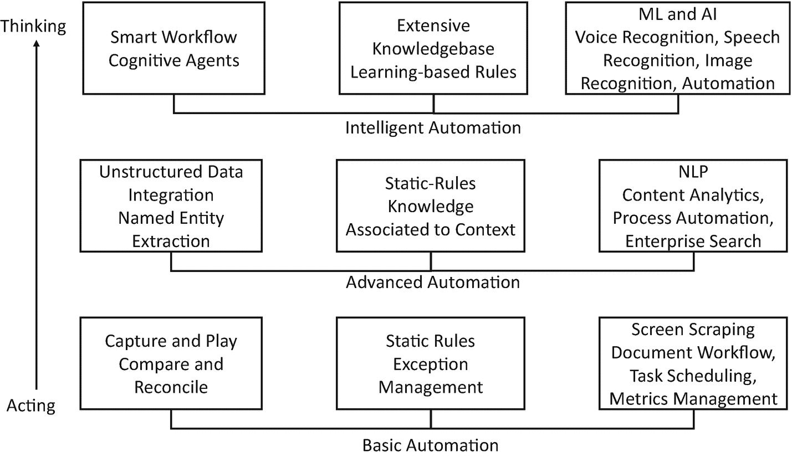
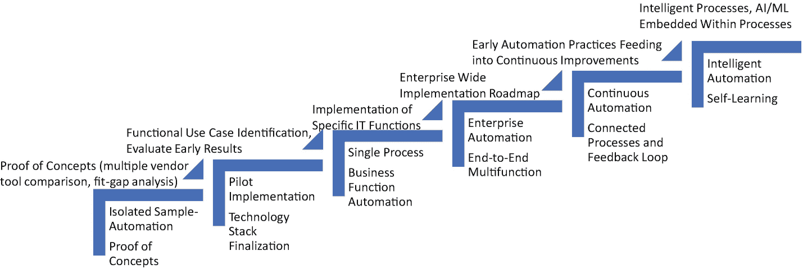

# 五、智能流程自动化 = RPA + AI

机器人流程自动化(RPA)和人工智能(AI)传统上被视为独立的、有些不平等的世界——各自为组织带来显著的效率。

您可能会听到智能自动化、服务交付自动化和认知自动化等术语，这些产品能够完全自动化您的企业运营。让我们退后一步，批判性地审视一下营销谈判与现实的对比。

在本章中，我们将讨论几个最佳实践，以理解 RPA 的含义，以及如果您将人工智能功能与 RPA 相结合，您将如何能够在您的组织中实现重大的变革。

## 机器人过程自动化(RPA)

RPA 是一类软件“机器人”,它完全模仿人类的操作方式(登录系统、输入数据、执行工作流等)。).他们使用业务应用，如 ERP 和 CRM 系统以及许多其他应用。简单地说，由于这些软件机器人复制了人类的活动，在很大程度上，商业应用的工作与以前完全一样，不需要大量的人类参与。术语“机器人”表示软件驱动的替代或增强人类任务的能力。RPA 主要试图记住人类在业务应用的“表示层”(用户界面)所做的活动。

除了自动化过程之外，这些软件机器人与雇用人类相比要便宜得多，而且软件机器人不要求加班津贴，因为如果需要的话，它们可以全天候工作。软件机器人的好处仅仅从成本优化的角度来看是极其吸引人的。除了节约成本，RPA 还提供了其他重要优势，例如:

*   *准确性和合规性*:软件机器人将始终以完全相同的方式执行业务流程，并产生一致的结果。

*   提高响应能力:软件机器人通常比人更快，可以全天候工作而不会感到疲劳，甚至可以以很小的成本承担更多的负载

*   敏捷和多技能:如果基于输入-输出规则的范例被很好地定义和测量，软件机器人可以完成大量的任务。

将 RPA 应用于任何流程的一个条件是，需要明确定义输入、处理输入的规则以及输出，而没有任何模糊性或与外部系统的依赖性。当一个单一的过程具有跨其他系统的多个接口，并且期望以同步的方式从其他系统获得输入时，所有这样的依赖关系都需要清楚地表达出来；否则，瓶颈将使 RPA 效率低下。客户入职流程是这种情况的一个很好的例子，因为它涉及许多不同的步骤和系统，所有这些都需要明确定义和映射。

今天的机器人可以打开和阅读电子邮件中的附件；他们可以将文件从一个文件夹移动到另一个文件夹；他们可以遵循像 if/then/ else 这样的编程规则；他们可以从表单中提取数据或向表单中输入数据；他们可以将数据导入数据库和文件等数据存储中，或者将数据推入 ERP、CRM、财务、人力资源系统等集成系统中。；还有更多。

RPA 的应用包括:

*   *财务和会计*:供应商管理、T & E、发票开具、异常处理、问题解决、付款运行/周期、应付款、应收款、收款、月度结算、对账和会计，等等。

*   *银行业*:数据验证、应用之间的数据迁移、报告创建、表单归档、索赔处理、发起、贷款服务等等。

*   *资本市场*:反洗钱& KYC 处理、数据修复、管理报告、客户报告、客户和顾问入职、许可证和注册处理、支付和清算、对账、资产转移、公司行动处理等。

*   *保险*:通知代理商进行续保、信用检查、注册数据输入、在多个记录系统中更新客户信息、支付决策、索赔处理、每日银行对账等。

软件机器人每次都会完全按照你的要求去做。这个特点既是他们最大的长处，也是他们最大的弱点。这是一个优势，因为机器人会顺从而准确地执行这个过程。这是一个弱点，因为如果业务规则或输入有任何变化，或者甚至是先前没有设想到的场景，软件机器人将不知道如何处理。例如，发票处理是一项工作量很大的活动。您可以设计一个软件机器人来读取发票表单，提取关键实体，用您的 CRM 系统和支付处理系统进行验证，然后发放付款。如果你得到的所有发票都遵循一个模板，这是一个非常简单的过程。假设您要雇用一个新的合作伙伴，他们的发票格式与您之前编写的不同。你的软件机器人将无法处理它，你将不得不对它重新编程以适应这种变化。

这种无法适应不断变化的条件的情况突出了 RPA 的两个改进领域，这两个领域都可以通过人工智能功能来补充。

第一个限制是，当输入数据是非结构化的并且没有预定义的格式时，例如客户电子邮件，或者通常有相同信息但格式可变的文档(例如发票)，则需要 NLP 能力来提取相关信息，然后可以将这些信息输入到软件机器人中以有效地执行任务。

第二个约束是，软件机器人擅长将基于规则的推理应用于少数特定步骤，但无法使用更高阶的决策。例如，如果您有相对较少的业务规则来申请和批准贷款申请，软件机器人可以很好地完成这项工作。然而，当贷款审批流程变得复杂时，不仅需要多分支多依赖规则，还需要与实时信用评分进行交叉引用，您将面临一项与判断相关的任务和人工智能补充。

## 人工智能

在前几章中，我们详细讨论了人工智能。在 RPA 的背景下，让我们在两个不同的类别中重新审视 AI 的能力。

### 捕获和处理任何类型数据的能力

第一个人工智能能力是处理任何类型数据的能力。借助大数据技术，我们不再局限于只处理结构化数据。大数据技术支持的读取模式灵活性使我们能够收集和存储任何类型的数据(关系结构化数据、非结构化数据、半结构化数据、机器生成的数据、音频数据、视频数据和图像)。NoSQL 数据库还让我们能够以可扩展、分布式和高效的方式处理这些数据。虽然这些进步最初是为收集和管理与 web 相关的问题(搜索、文档管理、编目、关系网络等)而设计的。)，还出现了一些其他类型的问题陈述，需要打破常规的思考。例如，我们如何识别图像和解释语音？

### 将数据转化为洞察力

第二个人工智能能力搅动所有这些不同类型的数据，从中收集见解。这就是 ML、DL、NLP 和神经网络发挥作用的地方。NLP 有助于从非结构化数据中提取意义，ML 有助于从数据中开发预测能力。深度学习和神经网络从数据中学习，以解决像识别照片中的人脸、解释口语和生成口语这样的问题。

在 RPA 环境中，这些人工智能功能当然可以作为一种补充技术。例如，NLP 可以从文档、电子邮件、抄本和日志中标准化和提取相关数据，即使它们是自由格式的，或者即使感兴趣的实体位于文档中的不同位置。以发票表单为例。日期有时可能在左上角，有时在右上角，物料清单在某些形式下可能表示为单位乘以数量，而在其他形式下，它们可能都显示为一个接一个的行项目，然后在底部合计。这些描述可能是一种形式的加长版本，另一种形式的编纂版本。税额可以写在总值的上面，也可以单独写在下面。仅依靠 RPA 功能会使处理这种可变性极具挑战性。即使您添加了足够多的规则来处理所有这些不同的场景，最终的程序也会非常复杂和难以管理。有了 NLP 和 ML 能力，AI 可以轻松解决这些问题。

对话界面(或聊天机器人)可以用来促进人类和其他系统之间的交互。你以自然语言的形式输入你的问题，人工智能从那里拾取它来处理你的查询，并以相关的答案作出回应。如果你不想打字，你可以与系统对话，人工智能将使用语音识别来理解你的查询，与后端系统进行交互，然后将相关信息反馈给你。尽管人工智能技术取得了所有这些进步，但我们仍然生活在狭义人工智能的世界中。这意味着进行图像识别的人工智能将无法生成文本，或者进行 NLP 处理的人工智能将无法提供建议或下一个最佳提议。因此，在 RPA 的情况下，需要考虑 AI 补充剂。通过考虑你试图解决的问题的整体，你将不得不把不同的人工智能能力结合在一起。

RPA 和 AI 是两种非常不同的技术，但它们可以很好地互补。例如，人工智能可以帮助处理各种非结构化数据，并建立丰富的知识库，然后 RPA 技术可以有效地利用这些知识库来自动执行任务。随着企业在低悬自动化任务类型的问题之外采用 RPA，他们应该开始关注人工智能，以将自学能力引入同一个 RPA 领域，并使他们的业务流程智能地自动化。

## 自动化和智能:协同工作

当您将 RPA 的自动化功能与 AI 的自学功能相结合时，您将看到技术解决方案的融合，不仅可以改善您的运营和客户互动，还可以创建新的业务模式。许多公司开始认识到将这两种技术结合起来解决问题的潜在好处，特别是当操作效率由于大型遗留系统或具有多跳和复杂集成模式的旧业务流程而被放大时。

让我们首先了解为什么需要智能自动化。

### 加快周转的需要

在竞争激烈和快节奏的商业环境中，最关键的企业指标衡量公司对客户和市场的响应程度。要做到这一点，面向客户和面向市场的应用需要几乎是实时的，后端系统也需要转换以匹配前端的速度。这种双重转换的挑战需要精心安排，因为大多数后端系统都是经过几十年的手工编码程序发展而来的。组织需要能够快速带来这些双重变化的解决方案。

### “电梯和移位”的消亡

企业并不是通过采用新技术以同样的旧方式完成同样的任务来寻求改变，而是通过吸引人的用户界面或提升用户体验来寻求改变。他们正在寻找真正的改变，即系统变得足够智能，以适应不断变化的业务动态和不断变化的客户偏好。简单的提升和转移新技术的方法不会使企业变得高效，而是真正的需要是寻找突破性的和可证明的商业价值，而不仅仅是成本节约或操作简便。

### 期望值提高了

决策者不想满足于稳健而平静的商业系统。他们期望业务系统具有适应性和响应性。他们希望他们的业务系统不仅能完成设计的工作，还能主动为他们提供额外的见解，以便他们能够做出更明智、更好的决策。

## 智能过程自动化之旅(IPA = RPA+AI)

人类编纂了基于规则的系统来自动化流程和解决过去的问题。人类还开发了人工智能技术，从观察中学习，并解决依赖判断的问题。如果把这两种截然不同的解题技巧结合起来会怎么样？本质上，智能流程自动化利用了人类的学习和适应能力，并将这些能力融入到流程重新设计计划中。当您采用传统的基于规则的自动化设计，并用自学能力增强它们时，您将获得 IPA，它不仅复制人类的判断和技能，而且随着时间的推移，还会学习如何更好地完成任务。

当自动化嵌入了判断或人在循环中支持的自动化时，它正在重新定义企业中分配和执行任务的方式。首先，IPA 主要用于制造过程，后来作为其他功能的一部分。现在，它越来越成为各种企业功能的组成部分。

各组织正在建立 IPA 系统的整体架构，因为它有可能成为影响整个企业转型的关键工具。踏上“IPA 之旅”的时刻确实已经到来。自动化或不自动化不再是一个问题。这种新热情的主要刺激因素来自于已实施 RPA 的组织的工作效率实现了两位数的显著提高。RPA 工具将进一步发展，因为它们吸收了增强的智能功能来反映人类的智能。随着它们变得越来越聪明，我们还将看到它们执行更加智能和复杂的任务，如规划、预算、分析和决策，这些被认为是只有人类才能完成的任务。

在我们深入了解 IPA 的构成之前，首先让我们揭穿一些关于自动化的神话！

*   *RPA 将提高生产率并降低成本*:是的，通过自动化业务流程，我们肯定可以提高生产率并降低成本。然而，需要认真评估变革管理的相关方面。人们经常看到，生产率的提高和成本的降低被管理变革所需的额外开销所掩盖。

*   *在应用 RPA 之前，您需要提高流程的成熟度*:这不是先决条件，而是一个很好的愿望。RPA 的唯一目标是将您的流程分解成更小的块，并找到自动化它们的方法。这样，端到端流程可以完全或部分自动化。无论哪种方式，您都将在您的流程和运营中引入变革能力。

*   鉴于供应商工具的成熟，你可以在生产中快速部署软件机器人:答案是——视情况而定。如果所讨论的过程在一些后端系统中很深，在过去没有看到任何重要的人类参与，并且或多或少是一个独立的子过程，那么答案显然是肯定的。然而，如果流程依赖于其他系统，有一个包含多个人工验证点的工作流，并且处理某些相当复杂和敏感的数据，那么您需要小心不要匆忙投入生产部署。建议在很长一段时间内进行试点解决方案，评估解决方案的有效性和功效，规划适当的变更管理计划，然后将其用于生产部署。

*   *关键的成功标准是您部署的机器人数量*:如今，引用您在生产中拥有的机器人数量作为代表来阐述您组织的自动化之旅和成熟度已经成为一种趋势。我们认为，重要的不是数量，而是效力和效率。一方面，您可能通过自动化手动活动减少了 FTE 数量，但另一方面，您增加了工作人员组合中的机器数量。这些机器也需要监督、治理和维护。因此，每个“机器人”的利用率可能是理解自动化效率的更好的度量。

*   *为什么 RPA 然后认知？人们可以直接转向认知* : RPA 是一个将输入映射到输出的简单过程，而认知意味着您正在从数据中学习，以动态地实现自动化。这需要一定程度的数据、流程和知识库成熟度。如果您没有简化您的流程，产生的数据将会支离破碎，这意味着对于您来说，应用机器学习，您必须承担管理和整合数据的繁重工作，这反过来意味着您将需要更长时间来训练您的机器学习模型，以提供您所寻求的自动化。因此，建议从 RPA 开始。它成为您自动化之旅的垫脚石，并为组织成为长期的自治组织做好准备。

IPA 不仅仅是一个工具，而是由五个核心技术功能组成，所有这些功能集成在一起，提供了一个平台，您可以在这个平台上构建和部署智能自动化解决方案:

*   *机器人流程自动化(RPA)* :使您能够开发“机器人”来自动化任务的软件，这些任务具有一组明确定义的输入、基于规则的处理模式和可测量的输出。就像操作人员需要一个 ID 来登录业务系统一样，RPA 也需要一个用户 ID。它将记住操作员在业务系统中做了什么，并开始模仿基于规则的任务，如访问用户界面、执行数据输入或验证、创建文档和报告，以及触发下一组操作。

*   *智能工作流*:一个流程管理应用，集成了由人类和机器人执行的任务。智能工作流系统将协调不同用户之间的交接，包括机器人和人类用户之间的交接，以高效执行任务并实时监控端到端流程。

*   *机器学习*:算法在识别数据中的模式方面起着至关重要的作用，比如在流程中观察到的新场景或很少出现的场景。如果不通过预测技术来处理这些情况，将会在流程中产生巨大的瓶颈。还有其他需要人工验证才能进入下一组流程步骤的场景。在这种情况下，ML 算法可以向人类工作者提供建议和下一个最佳行动，以有效地继续进行该过程。

*   *AI 能力*:一组专门处理非结构化数据的 AI 能力，包括文档、图像、视频和语音。业务流程通常最终会管理和创建各种数据类型。在许多场景中，业务系统的输入可以是图像、视频和语音的形式。管理这些数据类型需要人工智能能力，以便提取相关信息并传递给智能工作流和执行任务的 ML 程序。

*   *认知代理*:自我可持续的模块化可执行程序就像一个虚拟工人(或“代理”)，能够执行任务，与系统或人类或其他代理通信，从数据集和环境中学习，甚至基于“情绪检测”做出决策认知代理可以是被动的，只有当他们被要求时，才会去帮助其他代理或人类。他们可以是主动的，观察流程的整体健康状况，并在发现瓶颈时立即采取行动。

现在我们已经了解了不同的技术如何结合在一起提供一个非常强大的平台，下一个问题是，IPA 平台在现实世界中表现如何？

让我们考虑一下贷款审批流程。人类贷款处理器将指向并点击几个系统，如 CRM、贷款账户应用、风险分析系统、法律和合规系统、外部信用局系统等。，提供“照常营业”的服务。有了 IPA，机器人将从这些不同的系统中提取所有的信息，并将它们整齐地排列起来，以便人类工人做出任何判断，从而节省了大量的点击工作。NLP 程序将开始扫描过去与贷款申请人的交互(电子邮件、语音电话、投诉和偏好),并解释大量文本通信。ML 算法将基于相似的配置文件和过去的风险提供警报，或者提供下一个最佳行动作为建议。最后，认知代理将启动与贷款申请人的交互通信，并提供系统与人之间的实时跟踪(见图 [5-1](#Fig1) )。

图 5-1

智能工作流程:从行动到思考

您的组织需要以一种有组织和深思熟虑的方式引入自动化和智能。以下部分讨论了一些您需要避开的常见陷阱。

### 创建基于价值的战略

组织应该批判性地评估许多供应商工具背后的宣传。他们需要对智能流程自动化为其组织带来的业务优势有一个现实的认识。他们需要客观地评估其业务流程的当前状态、客户未满足的需求、市场趋势、员工生产力指标以及员工参与度指数。然后，他们应该确定一整套基于价值的机会，而不仅仅是省钱。他们应该对如何利用内部和外部数据集来转变前端应用和后端系统进行适当的研究。

### 优先考虑机会

考虑到智能流程自动化转变业务的潜力，您很自然会遇到这样的情况:业务职能领导有自己的一套优先事项，而 CIO 组织也有自己的一套优先事项。跨组织边界设置优先级的一个明智方法是创建跨业务流程的智能自动化机会热图。从实现时间的角度来看所创造的业务价值，您可以提出一个业务流程列表，然后制定一个 IT 就绪计划来描述您当前的能力以及实现业务转型所需的其他技术变化。

### 确定试点方案

在选择机会时，也要仔细考虑其中的含义。流程可能运行在非常旧的遗留代码上，没有可用的文档，跨系统的多次移交来完成端到端的流程流，并且太多的判断调用嵌入到流程流中。如果这些是你发现的情况，务实的做法是后退一步，先寻找更简单的系统或流程来处理。您需要选择一些能够立即交付商业价值的简单场景，这些试点的成功肯定会帮助您进入其他复杂场景。

### 创建路线图

我们经常看到业务职能部门和 IT 领导投入到几个试点项目中，然后宣布他们已经准备好进行大规模的企业范围的实施。做试点，考虑更小更简单的任务，没有错。然而，当您想要启动企业范围的转型项目时，您将需要一个路线图。智能自动化的影响不仅仅是自动化任务。职能和角色之间存在变革管理影响。您的路线图应该有一个时间表和一组清晰列出的行项目，以解决技术、组织、人员和运营方面的潜在变化。自上而下的支持是成功实施智能自动化的关键。智能自动化行程图参见图 [5-2](#Fig2) 。

图 5-2

智能自动化旅程图

### 集成流程和技术

有足够多的容易实现的用例(至少在运营领域)可以使用简单的 RPA 成功实施；然而，当您试图为跨越业务职能和 IT 系统的复杂流程带来变革力量时，简单的 RPA 工具无法胜任。供应商在支持涵盖我们之前讨论的智能自动化平台的五个关键组件的整体架构的能力方面存在很大差异。组织需要严格评估供应商在这方面的能力，尤其是确保新系统与整个企业生态系统无缝集成。他们必须建立一个性能监控机制来管理和监控整个智能自动化项目。

### 建立操作程序和治理模型

随着自动化模仿人类重复性任务，人工智能提供人类判断类型的能力，企业劳动力和标准操作程序预计将经历巨大变化。由于人类和认知主体在不断学习的环境中相互作用，职能和技术团队必须找到一种合作的方式，并了解谁对什么负责。

从历史上看，企业不断发展，在管理人力资源方面变得更加出色。标准、最佳实践和人力资源流程旨在评估和奖励员工绩效。当您混合使用机器时，您将如何执行这些实践？

更广泛地说，公司可能会坚定地采用“自动化和智能优先”的方法，而不太关注运营程序和治理模式。

### 建立变革管理计划

智能自动化将改变我们迄今为止的工作方式。可以肯定的是，许多传统工作将失去其相关性，可以理解的是，将会有来自员工的抵制。变革管理计划对于解决几个挑战至关重要:

*   管理人员需要接受培训，以监督机器人和人类一起工作的过程。

*   员工需要接受采用敏捷方法的培训，尤其是当他们必须与机器的速度相匹配时。

*   高管需要接受培训，以围绕人机职责分离建立明确的指导方针。

*   总体而言，公司需要建立新的沟通渠道来管理员工对失业的担忧，并推出新的计划来引入新的工作岗位(情商技能、新技术技能)。

智能过程自动化是一个礼物，也是一个谜。这是一个礼物，因为如果正确实施，它可以确保快速回报；这是一个谜，因为没有这样的指导方针或先例来成功管理在同一环境中协同工作的机器和人类。接下来，我们试图概述您将如何实现您的智能自动化之旅。这些是帮助你定义自己旅程的一些最佳实践。

## 你的 IPA 之旅:第一个 100 天

*第 1 天到第 30 天:提高认识，协调职能，动员起来，包括强有力的自上而下的支持:*前 30 天是与您的业务主管和 IT 领导接触，并协调期望。投资促进机构倡议的成功与技术解决方案的稳健性关系不大。它更多的是建立一个强大的变革管理计划，并提高整个业务和 It 职能部门对 IPA 将如何为组织带来效率的认识。您必须有一个主计划，详细说明计划、时间表、预期中断或影响的程度、每个计划的变更管理计划、每个计划的负责人等等。如果您的 IPA 路线图是围绕完整的端到端流程(从贷款发放开始到最终贷款发放)组织的，而不是围绕任务(例如，贷款审批任务)组织的，它将为您提供一个整体画面，显示您可以实现的自动化程度、您仍需要人工参与的地方以及您将交付的业务成果。

*第 30 天到第 60 天* : *评估机会并进行概念验证**:*每个组织都面临着提供丰厚利润并在运营中引入效率杠杆的压力。因此，看到每一个业务功能都叫嚣着他们想要自动化的流程列表也就不足为奇了。如果你让他们区分优先次序，他们可能会大声宣称他们的每一个计划都是最优先的。因此，您需要快速决定将在您的组织中工作的方法(从评估到部署)。您需要创建一个基于目标的框架来评估和优先考虑自动化机会。这不仅有助于您有效管理自动化热潮，还有助于您在 IPA 之旅的早期发现可以带来商业价值的速效项目。除了高级流程自动化图之外，您还必须更深入一些，进行概念验证，以评估自动化对于一些已确定的自动化机会的复杂性和有用性。这将有助于你了解暂定的时间表和你需要的任何其他技术或你的功能差距。最重要的是，概念验证将为您提供一个足够好的机会，向业务主管和 IT 领导宣传您的 IPA 之旅的进展。

*第 60 到 100 天:建立治理模型，并开始大规模开发:*一旦您完成了概念验证，并对将要使用的产品、工具和流程有了足够好的认识，您需要全力以赴，在您的自动化之旅中前进。在任何时间点，您可能会在不同的生命周期有不同的过程。一些将处于需求阶段，一些处于开发阶段，一些处于变更管理阶段。关键是要有一个治理模型来解决依赖性、瓶颈、升级、过程修正等问题。在第一个 100 天之后，基础设施需求将成为进入大规模生产的关键因素。您需要定义并开始构建 IPA CoE，它将围绕基础设施规划、标准、最佳实践、技术和功能审查等提供重要的指导。

您的 IPA 之旅最终会将机器人部署到生产环境中。事实上，旅程是在部署之后开始的。您需要跟踪和监控您的机器人的有效性，以确定它们是否实现了业务目标。最初几个部署的成功需要在您的组织中传播，这样其余的骑墙派才会有动力成为 IPA 之旅的一部分。你将需要“自动化布道者”来支持 IPA 的目标。

现在，如果你的首席执行官要求你提出一个运营模式，让公司踏上 IPA 之旅，请记住，运营模式需要围绕几个关键要素，让关键利益相关者成功完成任务。这些要素对于设计一个灵活而稳健的 IA 计划至关重要。

## 成功的 IPA 之旅的 15 个关键要素

虽然 RPA 听起来简单且易于实施，并且 AI 有其自身的技术复杂性，但智能自动化之旅确实需要全面的规划、协调的行动和大量的严谨才能取得成功。组织可以很好地遵循这些关键的基本规则:

1.  *从概念验证开始*:虽然 RPA 作为一个概念可能会被理解，但通过一个快速可行的试点项目展示 RPA 将会激发热情，并有助于避免冷嘲热讽。

2.  *设定正确的期望值*:少承诺，多兑现。这个古老的智慧在这里也适用。这有助于围绕潜在利益设定现实的预期。因此，避免围绕 RPA 可以为企业或个人实现的目标大肆宣传或兴高采烈。让人对最终结果印象深刻。

3.  *拥有强大的解决方案焦点*:投入精力构建正确的解决方案，以解决大多数变更、移交和流程目标。通常，30%或更少的时间花在实际的 BOT 配置上。

4.  确定并让福音传播者参与进来:即使是为了共同和个人的利益，变革也经常遭到抵制。因此，RPA 主导的转型需要强有力的赞助和支持。在无缝实施 RPA 采用之旅的一开始就确定职能领导和意见制定者也很重要。

5.  *利用补充工具*:保持警惕，识别和探索可以补充和加强(例如 OCR) RPA 实施的工具。

6.  *遵循速赢交付方法论*:与大型复杂的自动化相比，较小的可管理的自动化集增加了成功的机会。遵循通过构建-测试-部署过程微调解决方案的迭代过程。

7.  *明智地选择流程*:第一步的成功将对迁移之旅的结果产生重大影响。因此，选择第一套流程对于整个项目的成功至关重要。最初的过程必须是成功几乎是固有的，而过渡的不便或痛苦是最小的。一旦初始阶段取得成功，肯定会有更大的组织支持。

8.  *让 RPA 成为旅程不可或缺的一部分*:RPA 的价值必须由业务和 IT 团队共同创造。考虑到自动化的实施和启动时间很短，它要求业务和 it 部门协调工作，否则时间流逝和资源浪费肯定会发生。

9.  *同时跟踪和收获收益*:实际收益只有在节省下来的时间得到有效的重新分配时才会产生。跟踪基线上的实际节省是很重要的。

10.  *可持续性计划*:将结构和治理制度化，以有效地管理已经交付的自动化，并对机会管道进行优先排序和交付。采用整体战略来培养、重建和维系人才。

11.  *操作模型*:在智能自动化生命周期中执行任务所需的指导方针和策略；现有的企业指导方针和政策需要更新，以反映人机协作模式，如业务连续性计划、数据安全性和合规性以及发布管理。

12.  *标准*:一致管理智能自动化活动的标准和实践，例如异常管理和日志记录、编码标准、文档标准以及部署和准备情况清单。

13.  *KPI 和度量*:覆盖智能自动化解决方案不同方面的度量，例如过程性能度量和生产率度量。

14.  *方法*:确保跨职能一致的框架/方法，如流程评估框架、流程优先级框架、业务案例框架、变更请求框架和异常管理。

15.  *治理*:明确的职责划分和审查机制，以确保冲突得到快速处理，如决策矩阵/RACI 框架，以及会议和报告节奏。

## 结论

现在自动化肯定有很多令人兴奋的地方。RPA 本身就能带来显著的好处；然而，要使自动化可持续发展并进行真正的企业范围的转型，人工智能能力需要融入其中。产品供应商已经抓住了这些时髦词汇，并且已经在他们的 RPA 工具中大力推广认知能力。当您开始您的自动化之旅时，理解现实与宣传并绘制您自己的路线图是非常重要的。

值得警惕的是，RPA 和 AI 并不是包治百病的技术。然而，通过客观地评估您自己的用例，并通过将 RPA 和 AI 技术整合到流程中来设计您的自动化方法，您可以提高生产率，并使您的组织响应迅速。

除了技术基础，成功的智能自动化实施需要强大的变革管理计划来解决不确定性以及对组织和运营职能以及员工的影响，员工通常是任何大规模转型计划的接收端。

在下一章中，我们将讨论网络安全的有趣世界，包括人工智能对安全的影响，以及公司如何保护他们的系统和流程。

## 参考

1.  [T2`https://disruptionhub.com/robotic-process-automation-artificial-intelligence/`](https://disruptionhub.com/robotic-process-automation-artificial-intelligence/)

2.  [T2`https://fsinsights.ey.com/big-issues/Digital-and-connectivity/shaping-insurance-robotics-rpa-and-ai.html`](https://fsinsights.ey.com/big-issues/Digital-and-connectivity/shaping-insurance-robotics-rpa-and-ai.html)

3.  [T2`https://home.kpmg.com/content/dam/kpmg/my/pdf/accelerating-automation-plan-your-faster-smoother-journey`](https://home.kpmg.com/content/dam/kpmg/my/pdf/accelerating-automation-plan-your-faster-smoother-journey)