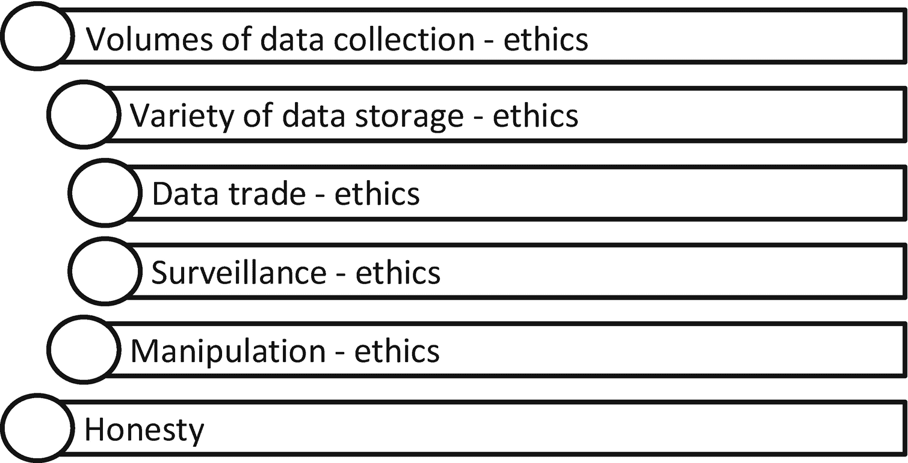
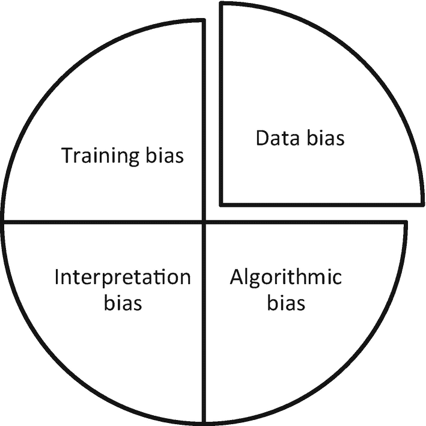
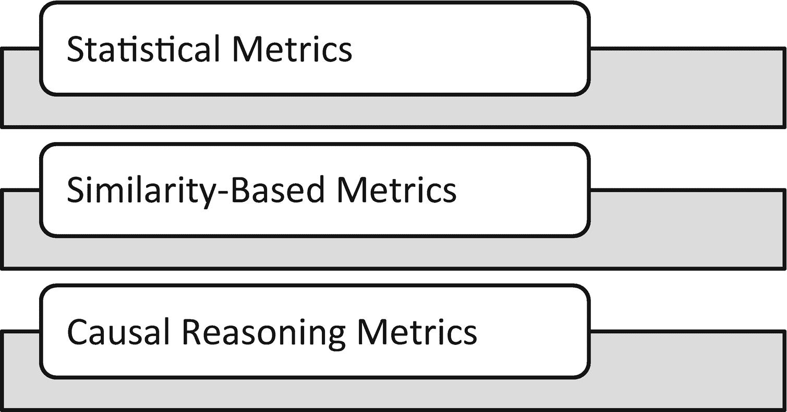
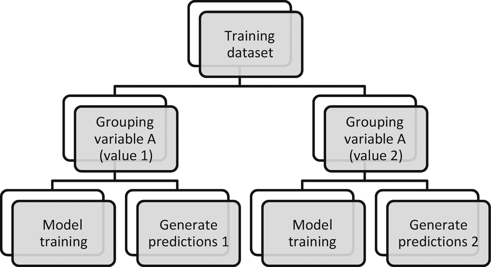
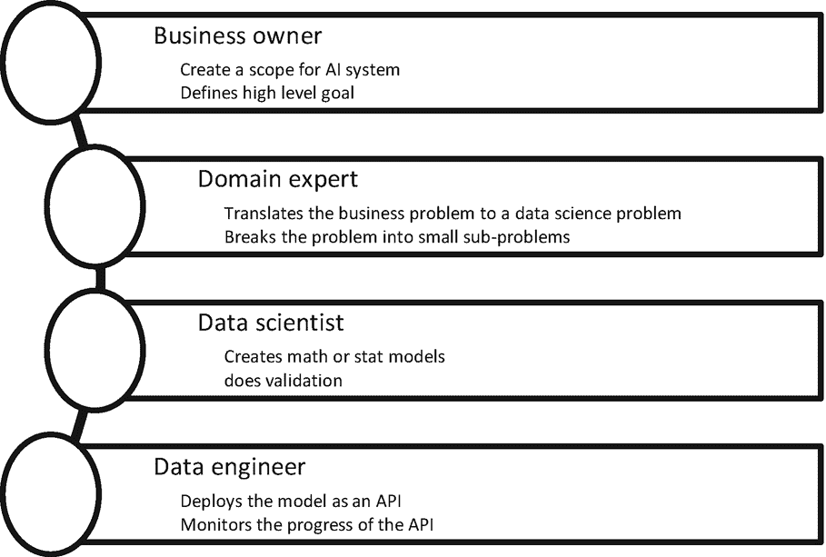

# 2.人工智能伦理、偏见和可靠性

本章涵盖了使用可解释人工智能(XAI) Python 库来控制偏见、执行可靠性原则以及在生成预测时维护道德的不同框架。随着数字化进程触及不同的行业，它们为人工智能和机器学习相关解决方案的应用开辟了一系列全新的机会。采用这些人工智能技术的主要挑战是道德、偏见和系统的可靠性，以及过程的透明度。这些人工智能系统提出了一些基本问题。我能相信人工智能系统做出的预测吗？我可以假设它是无偏的吗？它有什么样的风险？有没有什么过程可以让我控制人工智能系统以及它们对未来的预测？人工智能伦理更关注人工智能的合法使用，以造福人类。AI 不应该被用来毁灭人类文明。在这一章中，我们将讨论人工智能的各个方面。

## 人工智能伦理初级读本

人工智能是一个相对较新的领域，世界各地的不同政府正在简化它，因为他们看到了不一致的证据。人工智能被广泛认为是计算机为达到最终目标而展示或演示的智能行为。目标总是由业务定义的，例如在物流环境中安排仓库或定义机器人及其在仓库中提升和移动包裹的活动。或者它可以被定义为一个机器人，它可以在自卫的情况下通过观察来自人类的威胁来发射武器。这些场景完全不同。在第一种情况下，使用人工智能是允许的。在第二种情况下，这不是人工智能的最佳可能用途。人工智能系统可以推理、思考、感知行动和反应，因此可以被训练采取行动。人工智能的核心目标是创造能够帮助感知、逻辑推理、玩游戏、通过使用建模技术做出决策、理解自然语言处理、像人类一样生成文本等的机器。

学术界、政治家在各种公开演讲中以及从业者对人工智能伦理的主题进行了巨大的辩论。有很多话要说，但围绕人工智能的伦理制定某些政策的基础很少。这不仅仅是因为有这样做的意图，而是因为很难做到。人工智能正在发展，因此技术政策很难规划和执行。

提前估计 AI 技术对人们生活的影响，AI 在军事上的使用威胁，以及 AI 技术在其他领域的威胁，确实很难。因此，从伦理的角度来看，围绕人工智能使用的政策制定有时在本质上是非常反复的。由于不同的组织出于不同的目的使用人工智能，商业巨头之间在如何使用人工智能以及从伦理角度看什么是正确的问题上没有达成共识。世界各地的每个政府都希望在人工智能技术的使用方面占据主导地位并变得强大，因此在围绕人工智能的道德使用建立共同政策方面没有达成共识(图 [2-1](#Fig1) )。这遵循了过去核技术的道路。

图 2-1

人工智能中的伦理

*   数据量(非匿名):数据收集流程和存储系统主要是特定于云的，并且完全数字化。从用户那里收集的数据包括他们的个性化信息以及他们的在线行为。这种数据不再是匿名的，尽管公司在总体水平上使用这种信息，个人可识别信息(PIIs)大多被掩盖。这些活动仍然是个性化的。因此数据不再是匿名的；它可以归因于个人。个人的整个在线状态被存储、分析，并针对任何产品或服务销售活动。目前，许多组织遵守其客户制定的关于数据使用的规则。仍然需要使数据匿名的政策。

*   各种数据:如今，机器执行的每项活动都会被捕获和存储，以便提高机器性能、优化维护成本、防止生产过程中的故障等等。IoT(物联网)应用和系统产生了大量的数据，例如工业生产系统、道路上车辆的远程信息处理数据等等。

*   数据交易(有意的，无意的):从源系统中为一个目的收集的数据不应用于另一个目的，有意的或非有意的。当我们将数据用于其他用例时，就会出现数据交易的问题。GDPR 法规已经考虑到了这一点，不同的公司和不同的机构也实施了类似的法律，以确保数据交易不会发生。如果我们用交易数据创建一个人工智能系统，整个系统就会变得不道德。

*   监视(有针对性的，无针对性的):人工智能伦理也适用于对所有人群的全面监视，无论是有针对性的还是无针对性的，出于任何目的。道德辩论发生在何时以及如何实施监控系统的问题上。是的，没有额外安全措施的基于生物特征的认证系统是一个令人担忧的原因，这就是为什么世界各地一直有一场支持停止面部识别系统的运动。

*   操纵干预理性选择:从伦理的角度来看，人工智能应该是理性的。必须有一个合法的过程，人工智能系统应该透明

*   诚实:这是定义组织透明度的核心。从伦理的角度来看，组织坚持可解释性并为核心人工智能产品和应用提供技术透明度是很重要的。这适用于训练数据的来源、算法的选择、系统训练的精确程度、预测的生成方式等等。

## 人工智能中的偏见

许多人工智能系统通常使用 ML 和 DL 模型作为特定的预测模型。人工智能中的偏见意味着预测中的偏见。为什么会出现预测偏差？如何控制有偏见的预测是今天讨论的问题。人工智能系统算法决策的伦理后果是一个很大的问题。人工智能主导的决策中偏差的出现严重影响了人工智能的采用。为了建立一个公正的体系，需要有强烈的正义感来帮助决策者不带任何偏见和偏袒地公平行事。

## 数据偏差

偏差可以分为数据偏差和算法偏差。当我们考虑从一个角度标记数据的有限抽样并增加主要群体的存在时，数据偏倚就出现了。这导致了有偏见的数据集。这一过程可以通过连接到数据收集的自然来源来改进。如图 [2-2](#Fig2) 所示。我们通过一个例子来理解数据偏差。如果我们看一下电子商务公司过去 15 年的收入或利润趋势，肯定会有一个上升趋势，每 5 年就会有一个趋势突破。趋势中断是由于产品单价的增加。如果我们想建立一个机器学习模型来预测未来两年的收入，我们不能包含最近 15 年的数据。如果我们选择随机数据点来训练 ML 模型，将会有数据偏差，而这种数据偏差可能会导致不正确的预测。

## 算法偏差

算法偏差在某种程度上是由于数据偏差，因为数据偏差不能通过训练过程完全根除。因此，错误的模型得到训练，这导致有偏见的预测。为了减少训练过程中的偏差和数据偏差，需要对预测进行适当的解释(图 [2-2](#Fig2) )。无论是在全球层面还是在地方层面，预测的模型结果都需要向所有利益相关者解释。因此，我们一直需要一个 XAI 框架。可解释的人工智能平台和框架可以提供必要的工具和结构来阐述算法和数据中的偏见，并帮助教育决策者关于偏见的存在。

人工智能系统表现出智能行为，可以在生产系统中提供显著的效率，并帮助创建具有智能决策能力的智能应用程序。对于商业利益相关者和用户来说，AI 通常很难理解。如果任何软件的应用层使用人工智能模型，就很难向监管机构、执法机构和其他人解释人工智能系统做出的决定。数据的不确定性会导致人工智能决策系统的不确定性，并使组织陷入声誉受损的境地。有时，人工智能系统产生的结果对组织来说既不方便也不利。此外，预测不受组织的控制。在一个典型的软件开发场景中，我们知道软件在什么情况下能工作，什么时候不能工作。然而，在一个人工智能驱动的决策系统中，我们不能确定人工智能在什么条件下不起作用。很难预测。

## 偏差缓解过程

为了减少偏见和提高道德标准，治理起着重要的作用。人工智能治理意味着遵守一套规则、指南、标准、实践和过程，通过这些规则、指南、标准、实践和过程可以控制和治理基于人工智能的决策系统。通过设置治理标准，如数据评估、应用程序的严格测试等，可以减少数据偏差。

图 2-2

基于人工智能的决策系统中的偏见

## 解释偏差

如果预测没有按照预期的思路生成，那么一些实践者使用相同的度量和数学来改变模型结果的叙述。这对最终用户或商业用户来说更容易混淆。解释偏差被称为预测模型使用中的偏差。假设我们使用群体 A 训练一个 ML 模型，并得到所需的结果，但我们将该模型应用于群体 B，这在某种意义上称为机器学习中的迁移学习，以避免进一步的训练。这是解释偏差的经典例子。这是因为预测可能会有偏差，因为它是在不同的群体上训练的，这些群体可能具有不同的特征或特性。算法训练过程中的偏差是由于不断需要提高模型精度而产生的。我们通常采用平滑和特征变换方法，如对数变换和平方变换。有时为了限制在训练和测试阶段的过度拟合，我们也进行调整。这种调整模型系数和相关步骤的正则化过程也称为模型训练步骤中的算法偏差。

## 训练偏差

如果我们选择了一组不正确的超参数，错误地选择了模型类型，或者为了追求更高的任务精度而过度训练模型，那么人工智能系统中的训练偏差就会发生。在机器学习模型的开发中，超参数调整和交叉验证在模型的稳定性中起着主要作用。要评估一个算法是否没有偏差，我们需要查看为此目的收集的数据、模型训练过程和建模过程的假设。我们举一个例子，根据人们的人口统计特征和过去的消费模式，他们愿意为特定的服务 OTT 平台付费。任何人工智能系统都可以预测人们订阅 OTT 平台的付费意愿以及他们可以为一个月的订阅支付多少钱吗？在预测过程或模型训练过程中是否存在偏差？

表 2-1

偏差测量的程序方法和关系方法的区别

<colgroup><col class="tcol1 align-left"> <col class="tcol2 align-left"></colgroup> 
| 

程序的

 | 

有关系的

 |
| --- | --- |
| 这是算法特定的 | 这是数据特定的 |
| 更注重技巧 | 比较不同的数据集 |
| 任务的类型是已知的 | 任务未知 |

衡量偏见有两种不同的方法:程序方法和关系方法。见表 [2-1](#Tab1) 。如果我们在全球范围内以相似的比例从不同的群体、不同的国家、不同的年龄、性别和种族中按比例收集数据，那么我们可以说在收集的数据中不存在用于预测的偏差。关系方法有助于在数据集中找到这种偏差。程序性方法侧重于进行预测的算法训练过程。我们可能必须在不同的年龄组类别中训练不同的模型，因为不同年龄组中的属性和关系可能不相似。

表 2-2

偏差度量

<colgroup><col class="tcol1 align-left"> <col class="tcol2 align-left"> <col class="tcol3 align-left"></colgroup> 
| 

统计措施

 | 

同质性度量

 | 

因果推理度量

 |
| --- | --- | --- |
| 度量驱动 | 看起来像来自特性集的度量 | 这类似于 if/else 条件 |
| 有时没有意义 | 对每个人都有意义 | 极其有用 |
| 无法验证 | 可能验证 | 可能验证 |

三种最常用的偏差度量是统计度量、基于同质性的度量和基于因果推理的度量(图 [2-2](#Fig2) 和 [2-3](#Fig3) )。统计指标侧重于基于人口统计特征对不同群体的类似预测。如果一组和另一组的预测结果不同，并且来自相似模型的不同组的准确性存在差异，那么我们可以用统计学术语来测量这种偏差。统计方法很受欢迎。然而，它们对于某一组算法来说是不够的。

作为一个替代过程，我们可以看看相似性度量。如果两个客户从特征的角度来看完全相似，他们的预测结果应该是相似的。如果出现偏差，那么特定客户的算法就会对其他客户产生偏差。在这里，如果我们谈论客户流失分类、信用评分或贷款申请类型的用例，客户指的是训练数据集中的一个记录。为了使该方法成功，需要相似性度量来估计训练数据集中两个记录的相似程度。如果它们被完全复制，我们可以称之为完全相似。然而，如果一个次要或主要特征不同，那么相似性百分比是多少？当我们将它扩展到 n 个特性时，它会有什么用处呢？这种识别偏差的方法也有局限性。这里，该方法的成功在于相似性度量。相似性度量越强，结果越好。

估计偏差的第三个重要方法是因果推理，这可以通过创建类似 if/else 的条件来实现。我们可以更好地理解 if/else 条件，因此将记录分类为二进制类的因果推理将为算法的偏向性提供额外的见解。可以通过考虑训练数据集中存在的所有特征来应用 if/else/then 条件。

图 2-3

衡量偏差的标准

人工智能系统中的道德问题可以通过确保系统的质量来解决，系统的质量由过程的正确性、预测的效率、预测的稳健性、决策在个人层面的可解释性、确保安全和隐私考虑以及为每个人建立透明的架构来确定，以便所有的利益相关者都知道人工智能决策系统及其内部过程。一个好的人工智能系统应该对它产生的决策负责，因此决策需要公平。

当前形式的人工智能治理和相关政策限制了其他目的的数据重用，但没有限制机器学习中迁移学习的使用。在一个场景中训练的 ML 和 DL 模型可以在组织内部或外部的另一个场景中重用。但是，这些限制不适用于这些型号。模型拥有关于训练数据的关键信息，任何开发人员都可以对这些信息进行逆向工程，以获得附加信息并将其重新用于其他目的。例如，对于眼镜的虚拟试用，我们上传一张图像，系统将人脸分类到一个特定的类别，该类别由一个经过训练的模型产生，例如椭圆形、方形或圆形。相应地，系统显示为那种面部分类设计的帧。这个系统可以被另一个竞争公司用来生成他们自己的训练数据并创建一个并行系统。《通用数据保护条例》(GDPR)于 2018 年颁布，旨在确保个人有权基于其数据做出任何人工智能驱动的决定。如果是个人资料，则需要。但是，如果是非个人数据，则 GDPR 法规不适用。

图 [2-4](#Fig4) 显示了预测模型的高级偏差消除过程。预测 1 和预测 2 应该匹配。如果它们匹配，那么数据点被认为是无偏的；否则，就有失偏颇。如果数据点有偏差，那么应该将其从模型训练过程中丢弃，以便获得无偏差的模型。

图 2-4

从模型训练中消除偏差的过程

为了减少算法模型中的偏差，可解释性是必须的。机器学习模型通常在生产之前基于可解释性、鲁棒性、公平性、安全性和隐私性进行评估，并且还评估训练的模型是否已经学习了模式或者训练不足或训练过度。理想情况下，应出于两个具体原因评估 ML 模型的公平性:

*   模型的预测(即 ML 模型生成的决策)

*   数据偏差对模型公平性的作用

## 人工智能中的可靠性

人工智能技术的发展给医学影像领域带来了重大变化。3D 打印的 AR 和 VR 体验在软件环境中提供真实的体验。如果一个强健的人工智能系统能够不带任何偏见和成见地产生伦理洞见，那么它就是可靠的。在预测中出现了一些算法偏差的案例，这些偏差是种族、政治和性别导向的。为了给人工智能系统带来可靠性，我们需要将 ML 可解释性、ML 模型的设计考虑、ML 模型管理和培训纳入考虑范围。用于数据驱动的自动决策支持的 AI 系统的可靠性取决于算法的无偏性。

算法歧视是决策过程中偏见的负面后果之一。它导致基于种姓、信仰、宗教、性别和种族的不公平待遇。自动化决策支持系统的可靠性随着解决方案变得更少偏差和几乎没有歧视而增加。考虑一个信用评价或评估系统，其中人工智能系统对谁应该被授予信用和谁不应该被授予信用进行评价。算法做出的决定可能是合理的，但有时我们必须让它非常透明，这样某些人就不会认为这个决定对他们的群体不利。自动化决策系统中的偏见和歧视是两回事。

歧视是基于人口特征或属性对人群或阶层的不公平和不平等待遇。当批准用户的贷款和信用请求时，这种歧视出现在决策人工智能系统中。随着我们在智能系统中走向更多的自动化和 AI ML 的使用，在决策中发现歧视的风险更大。因此，必须通过解释决定和使过程非常透明，使该系统没有歧视。歧视是故意的。但是，偏见是无意的，是模型训练过程中固有的。因此，人工智能系统的可靠性只会增加，当我们建立一个没有歧视和偏见的系统时，人工智能系统的采用只会增加。

为了增加人工智能模型和围绕人工智能模型开发的相关服务的信任和可靠性，有必要解释决策是如何做出的。人工智能系统的可靠性应该是为客户开发人工智能解决方案的所有利益相关者的共同责任。通常，业务所有者是组织内部或外部的客户，他们提供系统的高级目标和他们想要开发的特性。

图 2-5

信任和可靠性之旅

在人工智能模型的创建和人工智能模型在生产系统中的部署中，确保信任和可靠性是所有利益相关者的职责(图 [2-5](#Fig5) )。为了赢得信任，在开发系统时需要适当的文档。文档应该解决某些问题。用什么数据来训练这样一个系统？这个模型可以用在其他领域和用例中吗？模型表现更好的最佳案例场景是什么？我们是否知道模型表现不佳的案例？如果我们知道模型在某些情况下表现不佳，我们如何处理系统中的这种偏差？有没有什么机制可以解释 AI 系统产生的预测？这些问题应该用域名和案例研究的例子和名称来记录。

## 结论

在这一章中，你学习了设计人工智能系统的道德规范、算法偏差和模型可靠性。我们人类总是想办法让我们的理解正确，想办法让它完美。人工智能系统是在一个不平等的世界中开发和使用的，在这个世界中灾难性的事情非常明显并且频繁发生。我们从错误中学习，并制定新的规则来处理未来的问题。从以上三个概念来看，重要的是将可解释的人工智能带到前台，以便至少提供关于人工智能系统所做决策的可解释性、信任和可靠性，并维护一套道德标准。