# 3.线性模型的可解释性

本章探讨了如何使用 SHAP、莱姆、溜冰者和 ELI5 库来解释线性模型对结构化数据的监督学习任务所做的决策。在这一章中，你将学习各种解释线性模型及其决策的方法。在监督机器学习任务中，有一个目标变量(也称为因变量)和一组自变量。目标是将因变量预测为输入变量或自变量的加权和。

## 线性模型

诸如用于预测实值输出的线性回归或用于预测类及其相应概率的逻辑回归模型的线性模型是监督学习算法。这些用于监督机器学习任务的线性模型非常容易解释。它们也很容易向商业利益相关者解释。为了模块的完整性，让我们从线性模型的可解释性开始。

## 线性回归

线性回归的用途是在给定一组预测因子的情况下，预测目标变量的定量结果。建模公式通常如下所示

y =β+β<sub>1</sub>x<sub>1</sub>++β<sub>p</sub>x<sub>p</sub>+11

β系数称为参数，ε项称为误差项。误差项可视为反映模型预测能力不足的综合指标。我们无法在现实世界中 100%准确地预测，因为数据的变化是现实存在的。数据不断变化。开发模型的目的是以最大可能的准确性和稳定性进行预测。当自变量取零值时，目标变量取截距项的值。您将使用在线可用的数据集`automobile.csv`，根据汽车的属性创建一个线性回归模型来预测汽车的价格。

```py
import pandas as pd
import numpy as np
import matplotlib.pyplot as plt
%matplotlib inline
from sklearn.model_selection import cross_val_score, train_test_split
from sklearn.linear_model import LinearRegression

from sklearn import datasets, linear_model
from scipy import linalg

df = pd.read_csv('automobile.csv')

df.info()
df.head()

```

有 6，019 条记录和 11 个要素，它们是该数据集中的基本要素。数据字典如表 [3-1](#Tab1) 所示。

表 3-1

特征的数据字典

<colgroup><col class="tcol1 align-left"> <col class="tcol2 align-left"> <col class="tcol3 align-left"></colgroup> 
| 

不，先生

 | 

功能名称

 | 

描述

 |
| --- | --- | --- |
| **0** | 价格 | 印度卢比价格 |
| **1** | 制造 | 制造商 |
| **2** | 位置 | 汽车之城 |
| **3** | 年龄 | 这辆车有多旧了 |
| **4** | 里程表 | 行驶公里数 |
| **5** | 可燃物类型 | 燃料类型 |
| **6** | 传动装置ˌ[机]变速器 | 传输类型 |
| **7** | 所有者类型 | 有多少业主 |
| **8** | 英里数 | 每升英里数 |
| **9** | 工程 | 汽车的 CC |
| **10** | 动力必和必拓 | 汽车的 BHP |

在进行数据清理和要素转换(这是进入模型开发步骤之前的一个基本步骤)之后，数据集将具有 11 个在数据集中记录数量相同的要素。下图显示了各种功能之间的相关性。这对于理解各种特征和因变量之间的关联很重要。结果显示在图 [3-1](#Fig1) 中，使用成对散点图。

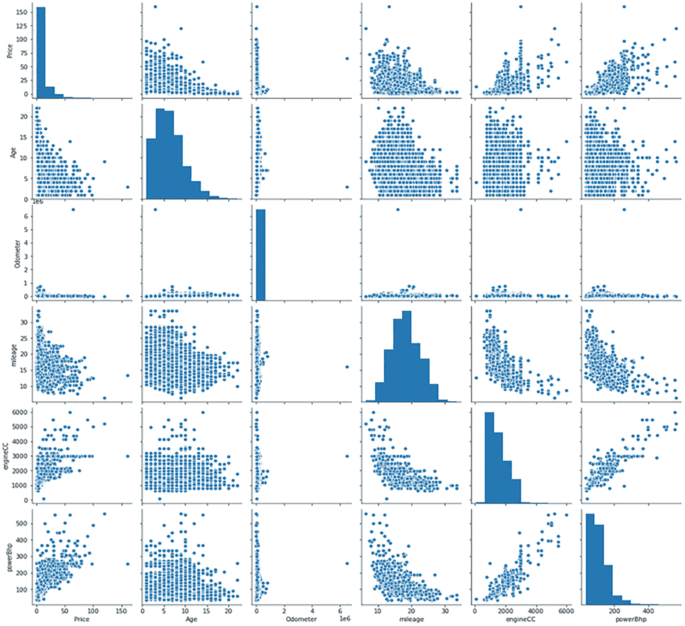

图 3-1

因变量和自变量之间的相关性

```py
 import seaborn as sns
sns.pairplot(df[['Price','Age','Odometer','mileage','engineCC','powerBhp']])

```

为了获得各种要素之间的精确关联，您需要计算关联表，以下脚本显示了这一点。见表 [3-2](#Tab2) 。

表 3-2

变量间的相关系数

<colgroup><col class="tcol1 align-left"> <col class="tcol2 align-left"> <col class="tcol3 align-left"> <col class="tcol4 align-left"> <col class="tcol5 align-left"> <col class="tcol6 align-left"> <col class="tcol7 align-left"></colgroup> 
|   | 

价格

 | 

年龄

 | 

里程表

 | 

英里数

 | 

工程

 | 

动力必和必拓

 |
| --- | --- | --- | --- | --- | --- | --- |
| **价格** | 1.000000 | -0.305327 | -0.011493 | -0.334989 | 0.659230 | 0.771140 |
| **年龄** | -0.305327 | 1.000000 | 0.173048 | -0.295045 | 0.050181 | -0.028722 |
| **里程表** | -0.011493 | 0.173048 | 1.000000 | -0.065223 | 0.090721 | 0.031543 |
| **里程** | -0.334989 | -0.295045 | -0.065223 | 1.000000 | -0.641136 | -0.545009 |
| **EngineCC** | 0.659230 | 0.050181 | 0.090721 | -0.641136 | 1.000000 | 0.863728 |
| **必和必拓** | 0.771140 | -0.028722 | 0.031543 | -0.545009 | 0.863728 | 1.000000 |

```py
 corrl = (df[['Price','Age','Odometer','mileage','engineCC','powerBhp']]).corr()
corrl

```

为了在同一张表上比较正相关和负相关，您可以使用梯度图。参见表 [3-3](#Tab3) 。

表 3-3

正负相关映射

<colgroup><col class="tcol1 align-left"> <col class="tcol2 align-left"> <col class="tcol3 align-left"> <col class="tcol4 align-left"> <col class="tcol5 align-left"> <col class="tcol6 align-left"> <col class="tcol7 align-left"></colgroup> 
|   | 

价格

 | 

年龄

 | 

里程表

 | 

英里数

 | 

工程

 | 

动力必和必拓

 |
| --- | --- | --- | --- | --- | --- | --- |
| **价格** | 1.000000 | -0.305327 | -0.011493 | -0.334989 | 0.659230 | 0.771140 |
| **年龄** | -0.305327 | 1.000000 | 0.173048 | -0.295045 | 0.050181 | -0.028722 |
| **里程表** | -0.011493 | 0.173048 | 1.000000 | -0.065223 | 0.090721 | 0.031543 |
| **里程** | -0.334989 | -0.295045 | -0.065223 | 1.000000 | -0.641136 | -0.545009 |
| **EngineCC** | 0.659230 | 0.050181 | 0.090721 | -0.641136 | 1.000000 | 0.863728 |
| **必和必拓** | 0.771140 | -0.028722 | 0.031543 | -0.545009 | 0.863728 | 1.000000 |

```py
corrl.style.background_gradient(cmap='coolwarm')

```

有时相关表也会显示虚假的相关性。为了验证这一点，您需要使用各种数字特征与目标变量之间的每个相关系数的统计显著性:

```py
np.where((df[['Price','Age','Odometer','mileage','engineCC','powerBhp']]).corr()>0.6,'Yes','No')
array([['Yes', 'No', 'No', 'No', 'Yes', 'Yes'],
       ['No', 'Yes', 'No', 'No', 'No', 'No'],
       ['No', 'No', 'Yes', 'No', 'No', 'No'],
       ['No', 'No', 'No', 'Yes', 'No', 'No'],
       ['Yes', 'No', 'No', 'No', 'Yes', 'Yes'],
       ['Yes', 'No', 'No', 'No', 'Yes', 'Yes']], dtype='<U3')

```

从表中可以看出，PowerBhp 与价格高度正相关，EngineCC 也与价格高度相关。为了执行矩阵乘法，需要为四个分类变量引入虚拟变量。您不能在计算过程中使用该字符串。在机器学习中，它被称为 *one hot encoder* ，需要应用于分类列，以生成对应于每个类别的标志，以便我们可以将信息引入模型。在统计建模框架中，同样的技术被称为*虚拟变量创建*。为其创建虚拟变量的变量是位置、燃料类型、传输和所有者类型。以下程序执行虚拟变量计算:

```py
Location_dummy = pd.get_dummies(df.Location,prefix='Location',drop_first=True)

FuelType_dummy = pd.get_dummies(df.FuelType,prefix='FuelType',drop_first=True)

Transmission_dummy = pd.get_dummies(df.Transmission,prefix='Transmission',drop_first=True)

OwnerType_dummy = pd.get_dummies(df.OwnerType,prefix='OwnerType',drop_first=True)

combine_all_dummy = pd.concat([df,Location_dummy,FuelType_dummy,Transmission_dummy,OwnerType_dummy],axis=1)

combine_all_dummy.head()
combine_all_dummy.columns
Index(['Price', 'Make', 'Location', 'Age', 'Odometer', 'FuelType',
       'Transmission', 'OwnerType', 'Mileage', 'EngineCC', 'PowerBhp',
       'mileage', 'engineCC', 'powerBhp', 'Location_Bangalore',
       'Location_Chennai', 'Location_Coimbatore', 'Location_Delhi',
       'Location_Hyderabad', 'Location_Jaipur', 'Location_Kochi',
       'Location_Kolkata', 'Location_Mumbai', 'Location_Pune',
       'FuelType_Diesel', 'FuelType_Electric', 'FuelType_LPG',
       'FuelType_Petrol', 'Transmission_Manual',
       'OwnerType_Fourth +ACY- Above', 'OwnerType_Second', 'OwnerType_Third'],
      dtype='object')
clean_df = combine_all_dummy.drop(columns=['Make','Location','FuelType','Transmission','OwnerType',
                                           'Mileage', 'EngineCC', 'PowerBhp'])
clean_df.columns
Index(['Price', 'Age', 'Odometer', 'mileage', 'engineCC', 'powerBhp',
       'Location_Bangalore', 'Location_Chennai', 'Location_Coimbatore',
       'Location_Delhi', 'Location_Hyderabad', 'Location_Jaipur',
       'Location_Kochi', 'Location_Kolkata', 'Location_Mumbai',
       'Location_Pune', 'FuelType_Diesel', 'FuelType_Electric', 'FuelType_LPG',
       'FuelType_Petrol', 'Transmission_Manual',
       'OwnerType_Fourth +ACY- Above', 'OwnerType_Second', 'OwnerType_Third'],
      dtype='object')

```

在创建线性回归模型之前，您需要检查模型的假设，这些假设在脚本笔记本中给出。在必要的功能转换(如列的规范化和异常值管理)之后，您得到了以下数据集:您将数据集分成 75%用于训练目的，25%用于模型的测试或验证。你使用 sklearn Python API，这是一个机器学习 API。

```py
#split the dataset into training and testig
data_train, data_test = train_test_split(clean_df,test_size=0.25,random_state=1234)

data_train.shape,data_test.shape

XTrain = np.array(data_train.iloc[:,0:(clean_df.shape[1]-1)])
YTrain = np.array(data_train['Price'])

XTest = np.array(data_test.iloc[:,0:(clean_df.shape[1]-1)])
YTest = np.array(data_test['Price'])

XTrain.shape, XTest.shape

```

模型训练结束后，提取训练精度和测试精度。两者都是 100%准确。当你查看系数时，你会发现所有系数都是 0，截距项是 1。出事了。可解释的人工智能在弄清楚发生了什么方面的作用来了。

```py
#multiple linear regression model
reg = linear_model.LinearRegression()
reg

reg.fit(XTrain,YTrain) #training the model

print('Coefficients: \n', np.round(reg.coef_,4))

print('Intercept: \n', np.round(reg.intercept_,0))

reg.score(XTrain,YTrain) # R-square value from the trained model

reg.score(XTest,YTest) # R-square value from the test set

```

为了验证结果，您还可以使用 stat 模型中的统计 API 来了解输出中是否有任何差异。表 [3-4](#Tab4) 显示了统计模型 API 的结果。

表 3-4

OLS 回归结果

<colgroup><col class="tcol1 align-left"> <col class="tcol2 align-left"></colgroup> 
| 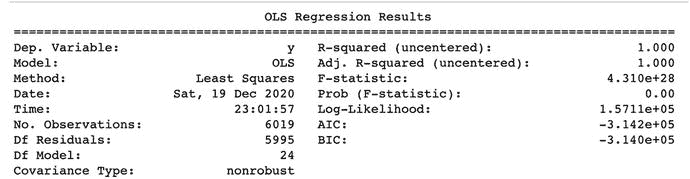 |

```py
from scipy import stats

# Using Statistical API

import statsmodels.api as sm

y = np.array(clean_df['Price'])
xx = np.array(clean_df[['Price', 'Age', 'Odometer', 'mileage', 'engineCC', 'powerBhp',
       'Location_Bangalore', 'Location_Chennai', 'Location_Coimbatore',
       'Location_Delhi', 'Location_Hyderabad', 'Location_Jaipur',
       'Location_Kochi', 'Location_Kolkata', 'Location_Mumbai',
       'Location_Pune', 'FuelType_Diesel', 'FuelType_Electric', 'FuelType_LPG',
       'FuelType_Petrol', 'Transmission_Manual',
       'OwnerType_Fourth +ACY- Above', 'OwnerType_Second', 'OwnerType_Third']])

y
mod = sm.OLS(y, xx)

results = mod.fit()
print(results.summary())

```

从 OLS 回归结果表可以清楚地看出，结果是相同的。没有区别。参见表 [3-4](#Tab4) 。

回归结果的汇总显示了模型创建过程中的错误。这可能是由于强烈的多重共线性。R 平方值显示 1.0，这意味着因变量的方差 100%可以由自变量解释。这个模型没有错误，这是很难相信的。各种变量之间的高度多重共线性可以用 VIF(方差膨胀因子)来解释。任何预测值的 VIF 都应小于 10。在任何情况下都不能超过 10。

```py
# This might indicate that there are strong multicollinearity

print('Parameters: ', results.params)
print('R2: ', results.rsquared)

print('Parameters: ', results.params)
print('Standard errors: ', results.bse)
print('Predicted values: ', results.predict())

```

以下脚本显示了如何计算所有变量的 VIF，对它们进行排序，并显示具有高 VIF 值的前五个变量:

<colgroup><col class="tcol1 align-left"> <col class="tcol2 align-left"> <col class="tcol3 align-left"></colgroup> 
| `Variables` | `VIF` |   |
| `0` | 年龄 | `6.322638` |
| **15** | `Transmission_Manual` | `3.482934` |
| **14** | `FuelType_Petrol` | `1.997771` |
| **6** | `Location_Hyderabad` | `1.838072` |
| **11** | `Location_Pune` | `1.760061` |

```py
infl = results.get_influence()
print(infl.summary_frame().filter(regex="dfb"))
from statsmodels.stats.outliers_influence import variance_inflation_factor

def calc_vif(X):

    # Calculating VIF
    vif = pd.DataFrame()
    vif["variables"] = X.columns
    vif["VIF"] = [variance_inflation_factor(X.values, i) for i in range(X.shape[1])]

    return(vif)

X = clean_df.drop('Price',axis=1)
vif_df = calc_vif(X)
vif_df.sort_values(by='VIF', ascending=False).head()
X = clean_df.drop(['Price','engineCC'],axis=1)

vif_df = calc_vif(X)

vif_df.sort_values(by='VIF', ascending=False).head()

X = clean_df.drop(['Price','engineCC','FuelType_Diesel'],axis=1)

vif_df = calc_vif(X)

vif_df.sort_values(by='VIF', ascending=False).head()

X = clean_df.drop(['Price','engineCC','FuelType_Diesel','mileage'],axis=1)

vif_df = calc_vif(X)

vif_df.sort_values(by='VIF', ascending=False).head()

# VIF less than 10 is acceptable
# the more your VIF increases, the less reliable your regression results are going to be.
# In general, a VIF above 10 indicates high correlation and is cause for concern.
X = clean_df.drop(['Price','engineCC','mileage'],axis=1)

vif_df = calc_vif(X)

vif_df.sort_values(by='VIF', ascending=False).head()

X = clean_df.drop(['Price','engineCC','FuelType_Diesel','mileage'],axis=1)

vif_df = calc_vif(X)

vif_df.sort_values(by='VIF', ascending=False).head()
X = clean_df.drop(['Price','engineCC','FuelType_Diesel','mileage','powerBhp'],axis=1)

vif_df = calc_vif(X)

vif_df.sort_values(by='VIF', ascending=False).head()

```

## VIF 及其可能产生的问题

VIF 是方差膨胀因子。该指标量化了模型中存在的多重共线性的程度。多重共线性可以定义为两个以上的自变量之间存在高度相关性。遵循 VIF < = 10 rule to detect multicollinearity in the model. The problem that it can generate can be explained by an example. Let’s take two features, X1 and X2\. Both can be used to predict a dependent variable Y. The coefficient of X1 is 0.20 and it can be defined as *是标准的行业惯例。如果 X1 改变一个单位，则***预计将改变 0.20 倍*，保持模型中的所有其他变量不变。当 X1 和 X2 都高度相关时，保持所有其他变量不变的假设就被违反了。因此，应该从模型中移除多重共线性，以便生成对应于每个预测变量的系数值的正确解释。*

 *小于 10 的 VIF 是可以接受的。你的 VIF 增加得越多，你的回归结果就越不可靠。一般来说，高于 10 的 VIF 表明高度相关，值得关注。以下脚本显示了删除多重共线性变量后的 VIF。该模型在精确的变量集上被重新训练。培训分数现在是 70%，测试分数现在是 69%，因此这是一个很好的模型。一旦模型最终确定为一个好的模型，你就可以使用可解释的 AI Python 包来解释模型的组件。

```py
y = clean_df['Price']
x = clean_df.drop(['Price','engineCC','FuelType_Diesel','mileage'],axis=1)
xtrain,xtest,ytrain,ytest = train_test_split(x,y,test_size=0.25,random_state=1234)

xtrain.shape,ytrain.shape,xtest.shape,ytest.shape

new_model = LinearRegression()

new_model.fit(xtrain,ytrain)

print(new_model.score(xtrain,ytrain))

print(new_model.score(xtest,ytest))

0.7000714797069869
0.6902967954209108

```

系数表显示变量名、它们的系数值以及它们在数据集中的顺序。

<colgroup><col class="tcol1 align-left"> <col class="tcol2 align-left"> <col class="tcol3 align-left"></colgroup> 
| 

`Variables`

 | 

`Coefficients`

 |   |
| --- | --- | --- |
| 

`13`

 | 

`FuelType_Electric`

 | 

`9.02`

 |
| --- | --- | --- |
| `17` | `OwnerType_Fourth +ACY- Above` | `4.70` |
| `5` | `Location_Coimbatore` | `2.35` |
| `3` | `Location_Bangalore` | `1.96` |
| `7` | `Location_Hyderabad` | `1.92` |
| `19` | `OwnerType_Third` | `1.66` |
| `14` | `FuelType_LPG` | `1.50` |
| `4` | `Location_Chennai` | `1.05` |
| `8` | `Location_Jaipur` | `0.65` |
| `12` | `Location_Pune` | `0.21` |
| `2` | `powerBhp` | `0.14` |
| `1` | `Odometer` | `0.00` |
| `9` | `Location_Kochi` | `-0.06` |
| `6` | `Location_Delhi` | `-0.12` |
| `18` | `OwnerType_Second` | `-0.53` |
| `11` | `Location_Mumbai` | `-0.60` |
| `0` | `Age` | `-0.93` |
| `10` | `Location_Kolkata` | `-0.97` |
| `15` | `FuelType_Petrol` | `-1.31` |
| `16` | `Transmission_Manual` | `-2.68` |

```py
resultsDF = pd.DataFrame()
resultsDF['Variables'] = pd.Series(xtrain.columns)
resultsDF['coefficients'] = pd.Series(np.round(new_model.coef_,2))
resultsDF.sort_values(by='coefficients',ascending=False)

```

回归模型的拟合优度可从调整后的 R 平方值中得知。由于在数据集/训练过程中添加了任何冗余变量，R 平方值可能很高。但是，调整后的 R 平方值考虑了模型训练过程中其他变量的影响。

<colgroup><col class="tcol1 align-left"> <col class="tcol2 align-left"> <col class="tcol3 align-left"> <col class="tcol4 align-left"></colgroup> 
| 

`Variables`

 | 

`Coefficients`

 | 

`p_value`

 |   |
| --- | --- | --- | --- |
| 

`13`

 | 

`FuelType_Electric`

 | 

`9.02`

 | 

`0.02`

 |
| --- | --- | --- | --- |
| `17` | `OwnerType_Fourth +ACY- Above` | `4.70` | `0.03` |
| `5` | `Location_Coimbatore` | `2.35` | `0.00` |
| `3` | `Location_Bangalore` | `1.96` | `0.00` |
| `7` | `Location_Hyderabad` | `1.92` | `0.00` |
| `19` | `OwnerType_Third` | `1.66` | `0.01` |
| `14` | `FuelType_LPG` | `1.50` | `0.29` |
| `4` | `Location_Chennai` | `1.05` | `0.01` |
| `8` | `Location_Jaipur` | `0.65` | `0.08` |
| `12` | `Location_Pune` | `0.21` | `0.31` |
| `2` | `powerBhp` | `0.14` | `0.00` |
| `1` | `Odometer` | `0.00` | `0.04` |
| `9` | `Location_Kochi` | `-0.06` | `0.44` |
| `6` | `Location_Delhi` | `-0.12` | `0.38` |
| `18` | `OwnerType_Second` | `-0.53` | `0.02` |
| `11` | `Location_Mumbai` | `-0.60` | `0.06` |
| `0` | `Age` | `-0.93` | `0.00` |
| `10` | `Location_Kolkata` | `-0.97` | `0.01` |
| `15` | `FuelType_Petrol` | `-1.31` | `0.00` |
| `16` | `Transmission_Manual` | `-2.68` | `0.00` |

```py
#adjusted R square
def AdjustedRSquare(model,X,Y):
    YHat = model.predict(X)
    n,k = X.shape
    sse = np.sum(np.square(YHat-Y),axis=0) #sum of suare error
    sst = np.sum(np.square(Y-np.mean(Y)),axis=0) # sum of square total
    R2 = 1- sse/sst #explained sum of squares
    adjR2 = R2-(1-R2)*(float(k)/(n-k-1))
    return adjR2, R2

from scipy import stats

def ReturnPValue(model,X,Y):
    YHat = model.predict(X)
    n,k = X.shape
    sse = np.sum(np.square(YHat-Y),axis=0)
    x = np.hstack((np.ones((n,1)),np.matrix(X)))
    df = float(n-k-1)
    sampleVar = sse/df
    sampleVarianceX = x.T*x
    covarianceMatrix = linalg.sqrtm(sampleVar*sampleVarianceX.I)
    se = covarianceMatrix.diagonal()[1:]
    betasTstat = np.zeros(len(se))
    for i in range(len(se)):
        betasTstat[i] = model.coef_[i]/se[i]
    betasPvalue = 1- stats.t.cdf(abs(betasTstat),df)
    return betasPvalue

resultsDF['p_value'] = pd.Series(np.round(ReturnPValue(new_model,xtrain,ytrain),2))
resultsDF.sort_values(by='coefficients',ascending=False)

```

```py
reg.adjR2, reg.R2 = AdjustedRSquare(new_model,xtrain,ytrain)
print (reg.adjR2, reg.R2)

0.6987363872507527 0.7000714797069869

def ErrorMetric(model,X,Y):
    Yhat = model.predict(X)
    MAPE = np.mean(abs(Y-Yhat)/Y)*100
    MSSE = np.mean(np.square(Y-Yhat))
    Error = sns.distplot(Y-Yhat)
    return MAPE, MSSE, Error

resultsDF.sort_values(by='p_value',ascending=False)

```

β系数概率值的 p 值显示了线性回归方案中预测值的统计显著性。p 值阈值被认为是 0.05，在统计检验中保持 5%的显著性水平。如果任何预测因子的 p 值小于 0.05，则该预测因子显著；否则，就不是。如果 p 值大于 0.05，β系数值将更接近于零。该模型中有五个变量的 p 值大于 0.05。图 [3-2](#Fig2) 显示了实际 Y 变量或目标变量与预测目标变量之间的相关性。你可以看到实际和预测的 Y 变量之间有很好的相关性，为 0.83，这意味着这是一个很好的模型。然后，您可以查看系数表，其中各个 p 值按降序排列。任何 p 值大于 0.05 的预测值都可以通过迭代方式从模型中移除。

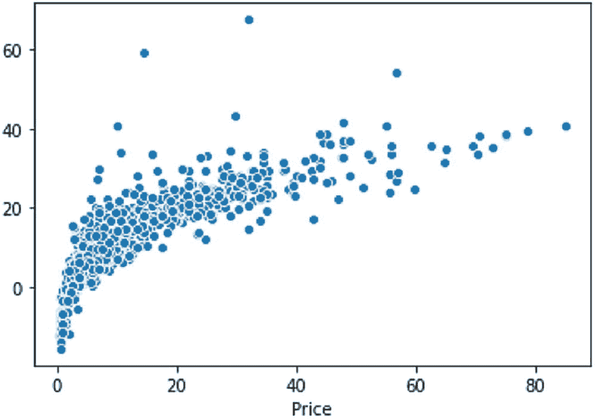

图 3-2

实际 Y 和预测 Y 之间的相关性

### 最终模型

在去除高度多重共线性变量和具有统计不显著性的冗余变量之后，模型精度在训练集上仍然保持接近 70%,在测试集上保持接近 69%。

```py
y = clean_df['Price']
x = clean_df.drop(['Price','engineCC','FuelType_Diesel','mileage','Location_Kochi'],axis=1)
xtrain,xtest,ytrain,ytest = train_test_split(x,y,test_size=0.25,random_state=1234)

xtrain.shape,ytrain.shape,xtest.shape,ytest.shape

new_model = LinearRegression()

new_model.fit(xtrain,ytrain)

print(new_model.score(xtrain,ytrain))

print(new_model.score(xtest,ytest))

```

### 模型可解释性

模型解释可以通过查看模型的贝塔系数来完成。线性回归模型的最大优点是简单和线性，这使得模型解释变得容易。线性回归也迫使预测成为特征的线性组合。置信区间是真实预测值将落入的值的范围。95%的置信区间意味着预测的真实值有 95%会落在该范围内。在当前示例中，您看到的是 95%的置信区间。显著性水平意味着在假设情景的双尾检验中，显著性水平为 5%，解释可在表 [3-5](#Tab5) 中解释。从解释的角度来看，截距值在建模场景中没有意义。如果训练数据中的所有数字特征都是零，并且所有二进制特征都处于它们的参考类别，则由模型生成的预测将等同于截距项。这是一种非常特殊的情况，但在这种情况下，所有数值特征都存在于训练数据集中，并且使用平均值 0 和标准差 1 对它们进行了标准化，则截距项反映了实例的预测结果，其中所有特征都处于平均值。

表 3-5

线性模型中模型参数的解释

<colgroup><col class="tcol1 align-left"> <col class="tcol2 align-left"></colgroup> 
| 

回归系数的解释

 | 

目标列是汽车的价格，它是各种变量的函数，包括数字变量和分类变量。

 |
| --- | --- |
| 年龄= -0.911 | 车龄增加一年，汽车价格估计会降低 0.911 个单位。假设价格为 000 美元，在保持所有其他特性不变的情况下，每运行一年，汽车价格将减少 911.00 美元。 |
| 动力 Bhp = 0.141 | 汽车的功率 Bph 增加一个单位导致汽车价格估计增加 0.141 个单位。BHP 越高，汽车的价格越高，假设所有其他功能都相同。 |
| 位置 _ 斋浦尔= 0.663 | 假设所有其他特征不变，如果汽车的基本位置是从斋浦尔到其他地方，汽车的估计价格将增加 663 美元。 |
| 燃料类型 _ 电力= 8.972 | 如果一辆汽车是电动汽车，相对于任何其他燃料类型，汽车的估计价格将增加 8972 美元，假设该模型的其他功能没有变化。 |
| OwnerType_Second = -0.54 | 假设其他特征没有变化，如果所有权是二手的，汽车的基础价格将减少 540 美元。 |
| 变速器 _ 手动= -2.671 | 如果变速器类型是手动的，在保持所有其他因素不变的情况下，汽车的价格将比所有其他类型降低 2671 美元。 |

```py
resultsDF = pd.DataFrame()
resultsDF['Variables'] = pd.Series(xtrain.columns)
resultsDF['coefficients'] = pd.Series(np.round(new_model.coef_,2))
resultsDF['p_value'] = pd.Series(np.round(ReturnPValue(new_model,xtrain,ytrain),2))
resultsDF.sort_values(by='p_value',ascending=False)

```

## 信任 ML 模型:SHAP

为了信任基于线性回归的机器学习模型，你需要了解从模型中导出的 R 平方值。R 平方值表示回归模型的拟合优度，即所有特征在目标变量中所占的解释方差比例。R 平方值的范围为 0.0-1.0。如果 R 平方值为零，则模型显示因变量和自变量之间没有相关性。如果它是 1，那么它显示特征是非常高度相关的。它应该是 0.80 或更高，才能成为一个好的模型，其预测可以信赖。在上面的汽车示例中，R 平方值为 0.70，非常接近您可以信任的标准模型。参考最多的不是 R 平方，而是校正后的 R 平方值，因为它考虑了模型中使用的要素数量。下面使用公式显示了 R 平方和调整后的 R 平方的关系。在下面的公式中，N 表示训练样本的总数，p 表示特征的总数:

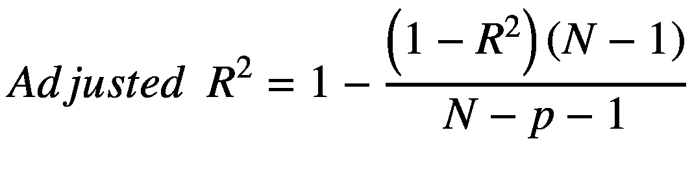

当您向模型中添加冗余变量时，R 平方值可能会增加，但调整后的 R 平方值将保持不变。只有当特征对整个模型的可解释性有任何贡献时，调整后的 R 平方才会增加。

为了生成额外的可解释性并更深入地理解模型如何工作，您可以从额外的基于 Python 的库中获得帮助。Shapley 值是合作博弈理论中广泛使用的一种方法，它具有令人满意的性质。通过模型系数，您可以了解当您改变输入参数时，预测或估计的结果变量是如何变化的。然而，它并没有告诉你哪些特性是重要的。每个系数的值取决于输入要素的比例。例如，车龄可以在 0-15 年之间变化。然而，在上述数据集中，BHP 的范围可以是 34.20-560.00。因此，在线性回归模型中，模型系数的大小不一定是特征重要性的良好度量。

一些数据科学家使用 t 统计的绝对值作为线性回归模型中要素重要性的度量。

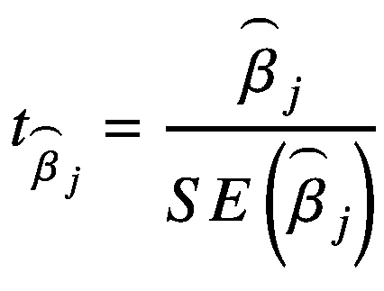T2】

理解特征重要性的方法之一是查看特征相对于模型输出的部分依赖关系图。

```py
!pip install shap

```

一旦成功安装了 SHAP，您就可以使用这个库来生成如图 [3-3](#Fig3) 所示的部分依赖图。

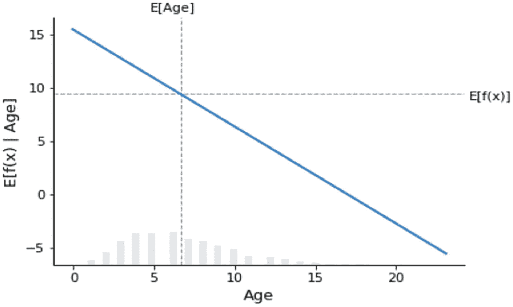

图 3-3

部分相关图

```py
import shap
shap.plots.partial_dependence("Age", new_model.predict,xtrain, ice=False, model_expected_value=True, feature_expected_value=True)

```

水平虚线显示应用于数据集时模型输出的预期值，垂直虚线显示平均年龄值特征，蓝色部分相关图线(将年龄特征固定为给定值时模型输出的平均值)在图表上始终穿过两条灰色预期值线的交点。这个交点可以被认为是相对于数据分布的部分相关图的“中心”。水平轴线上的垂直灰色方框显示年龄分布稍微向右倾斜。

Shapley value established 模型解释背后的主要思想是使用合作博弈理论结果的公平分布，在模型的输入特征之间分配模型输出(𝑥)的信用。为了将博弈论与机器学习模型联系起来，有必要将模型的输入特征与游戏中的玩家相匹配，并将模型功能与游戏规则相匹配。在游戏理论中，玩家可以选择加入或不加入游戏，类似于特征可以“加入”或“不加入”模型的方式。

什么是 SHAP 值，如何计算？这为 SHAP 值的解释和含义提供了一个合理的思路。每个特征值的形状值通过以下公式计算:

![$$ {\phi}_i=\sum \limits_{S\subseteq F\backslash \left\{i\right\}}\frac{\mid S\mid !\left(|F|-|S|-1\right)!}{\mid F\mid !}\left[{f}_{S\cup \left\{i\right\}}\left({x}_{S\cup \left\{i\right\}}\right)-{f}_S\left({x}_S\right)\right] $$](img/506619_1_En_3_Chapter_TeX_Equc.png)

以下几点阐明了它的工作原理:

*   为了计算每个特征的贡献，SHAP 要求在所有特征子集上重新训练模型

*   在上面的公式中，I 是个体特征。

*   f 是所有特征的集合。

*   s 是集合 f 中特征的子集。

*   对于任何特征 I，创建两个模型:具有特征 I 的模型 1 和没有特征 I 的模型 2。然后计算预测之间的差异。

*   一个特征对模型的影响取决于模型中其他特征的行为。

*   对所有可能的 S 子集计算预测中的差异，并取其平均值。

*   所有可能差异的加权平均值用于填充特征重要性。

定义特征“加入”模型的含义的最常见方法是，当我们知道该特征的值时，说该特征已经“加入模型”，当我们不知道该特征的值时，说该特征没有加入模型。当模型中特征的权重/系数假定为 0.000 时，就会发生这种情况，这时我们认为该特征没有加入游戏。如果一个特征的系数不等于 0.000，那么我们认为这个特征是游戏的一部分。让我们看看线性回归模型的 SHAP 值。

```py
# compute the SHAP values for the linear model
background = shap.maskers.Independent(xtrain, max_samples=2000)
background
xtrain.shape

```

这个`shap.maskers.Independent`函数通过对给定的背景数据集进行积分来屏蔽表格特征。这里，背景数据集有来自训练数据集的 4，500 条记录，这是从传递的背景数据中使用的最大样本数。如果数据多于`max_samples`，那么`shap.utils.sample`用于对数据集进行二次抽样。从掩蔽中出来的样本数(待积分)与背景数据集中的样本数相匹配。这意味着更大的后台数据集会导致更长的运行时间。通常大约 1、10、100 或 1000 个背景样本是合理的选择。

```py
explainer = shap.Explainer(new_model, background)
explainer

shap_values = explainer(xtrain)

shap_values

```

以上脚本显示了模型中 SHAP 值、背景数据样本和基值的输出。以下脚本显示了标准的部分相关性图，其中考虑了数据集中第 23 条样本记录的年龄特征和模型预测函数。特定要素𝑖的 SHAP 值就是预期模型输出与要素值𝑥𝑖处的偏相关图之间的差值，即 Shapley 值的可加性。Shapley 值的一个基本属性是，它们总是对所有玩家都在场时的游戏结果和没有玩家在场时的游戏结果之间的差异进行求和。对于机器学习模型，这意味着所有输入特征的 SHAP 值总和将始终等于基线(预期)模型输出与正在解释的预测的当前模型输出之间的差值。看到这一点的最简单的方法是通过一个瀑布图，它从你对房价的背景先验期望[(𝑋)]开始，然后一次添加一个特征，直到你达到当前的模型输出(𝑥).对应于 10 年的年龄特征，蓝线和灰色虚线之间的垂直差是该特征的 SHA 值。

### ML 模型中的局部解释和个体预测

SHAP 部分相关图(图 [3-4](#Fig4) )是解释个体预测、获得个体预测的额外洞察力以及解释对特定个体预测重要的特征的好方法。

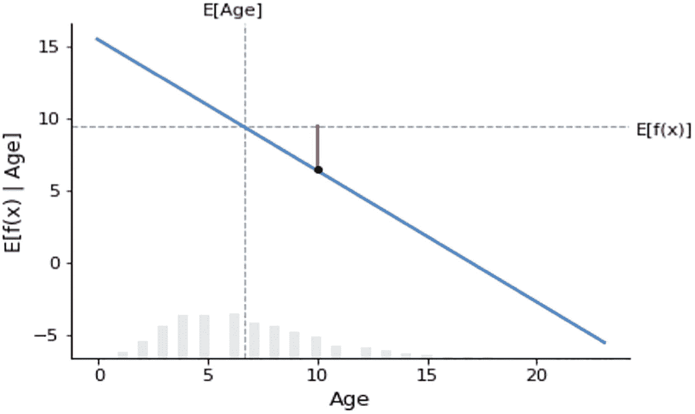

图 3-4

年龄与预测期望值的偏相关图

```py
# make a standard partial dependence plot
sample_ind = 23
fig,ax = shap.partial_dependence_plot(
    "Age", new_model.predict, xtrain, model_expected_value=True,
    feature_expected_value=True, show=False, ice=False,
    shap_values=shap_values[sample_ind:sample_ind+1,:],
    shap_value_features=X.iloc[sample_ind:sample_ind+1,:]
)

```

图 [3-5](#Fig5) 根据年龄特征和年龄特征的 SHAP 值之间的散点图解释了相关性。

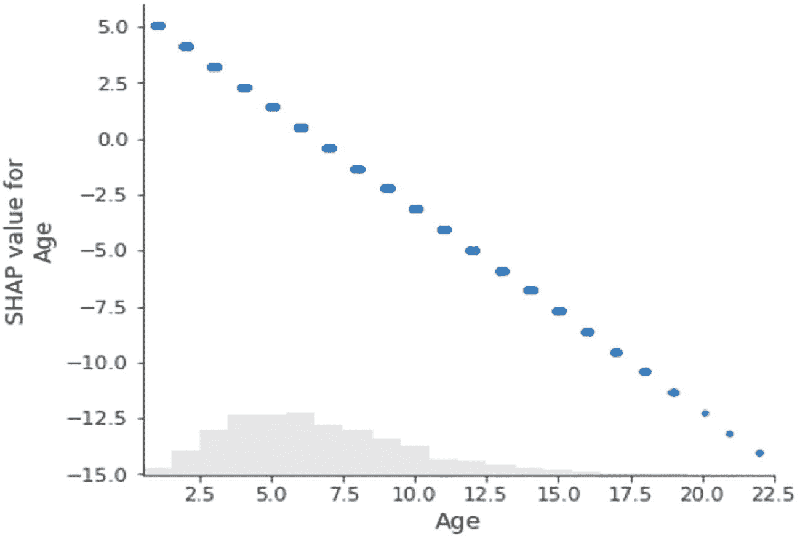

图 3-5

SHAP 年龄价值和年龄协会

```py
shap.plots.scatter(shap_values[:,"Age"])

```

从数据集中获取样本行的 SHAP 值可以通过瀑布图来解释(图 [3-6](#Fig6) )。这是当地的部分解释。瀑布图旨在显示对单个预测的解释，因此它们需要一行解释对象作为输入。瀑布图的底部从模型输出的预期值开始，然后每一行显示每个要素的正(红色)或负(蓝色)贡献如何将值从背景数据集上的预期模型输出移动到本次预测的模型输出。

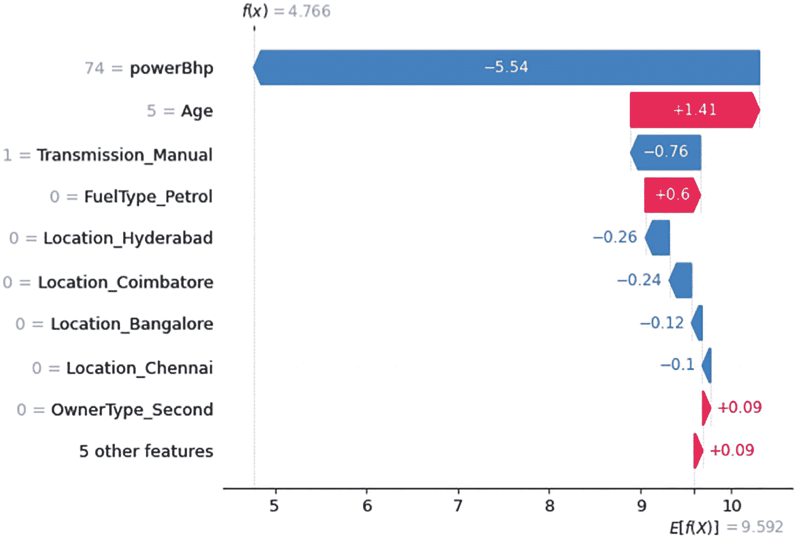

图 3-6

显示正负 SHAP 值的瀑布图

让我们举个例子来理解 SHAP 值:训练数据集中的第 60 条记录，它是整个数据集中的第 2966 <sup>行</sup>。将其用作新的数据点，并使用训练好的模型进行预测。预测值为 4.7656。然而，同一记录的实际价格值是 4.85。来自 SHAP 图书馆的瀑布图显示了预测值 4.766 是如何从函数的 SHAP 基础值达到预测值的。

```py
xtrain[60:61]

new_model.predict(xtrain[60:61])

ytrain[60:61]

# the waterfall_plot shows how we get from shap_values.base_values to model.predict(X)[sample_ind]
shap.plots.waterfall(shap_values[60])

```

从上面的瀑布图可以清楚地看出，对于 60 号记录，最有影响力的预测因素是动力 BHP、年龄、汽油燃料类型和手动变速器。有五个最不重要的特征折叠在一起，它们对预测的联合贡献为+0.09。如果取消折叠成单个要素限制，可以通过更改“最大显示”选项进行扩展。以下脚本显示了根据 SHAP 值修改的瀑布图，用于预测的局部解释(图 [3-7](#Fig7) ):

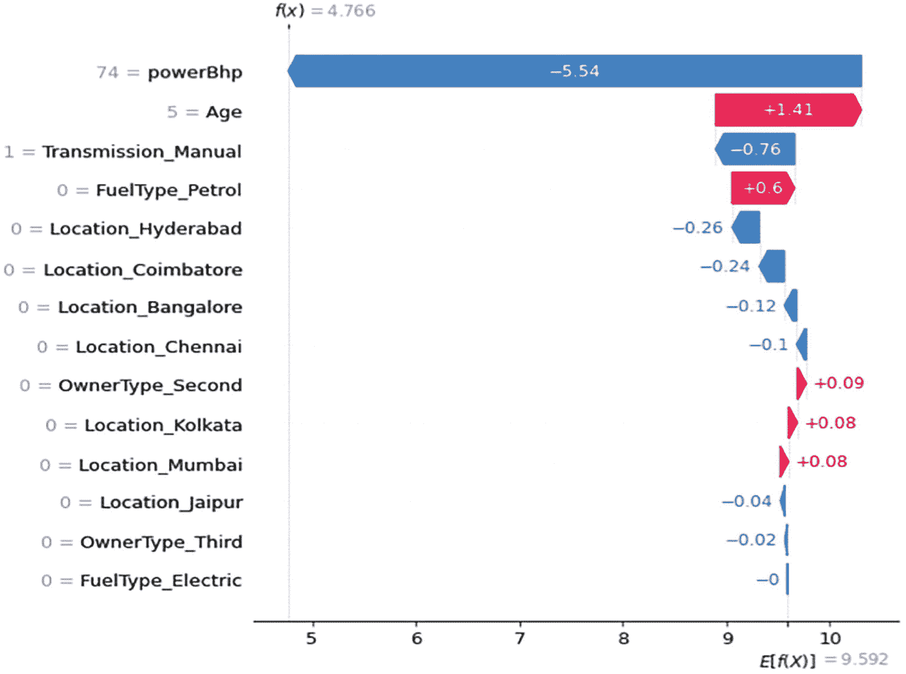

图 3-7

显示所有功能的扩展表单

```py
shap.plots.waterfall(shap_values[60],max_display=30)

```

### ML 模型中的整体解释和整体预测

蜂群图是一种可视化图，旨在显示数据集中的顶级要素如何影响模型输出的信息密集型摘要。给定解释的每个实例由每个特征行上的单个点表示。点的中心位置由该要素的 SHAP 值决定，点沿着每个要素行“堆积”起来以显示密度。颜色用于显示特征的原始值。在图 [3-8](#Fig8) 的曲线图中，可以看到年龄和功率 BHP 平均来说是最重要的特征。

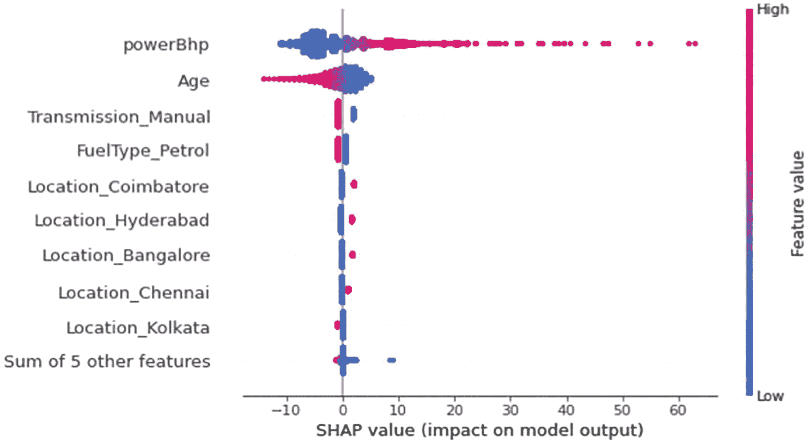

图 3-8

显示正负 SHAP 值的蜂群图表

*   功率 BHP 越高，对模型输出的影响就越大，因为你知道功率 BHP 越高，汽车价格就越高。

*   同样，车龄与汽车的预测价格负相关。因此，车越年轻，对模型输出的影响就越大，如下图所示。

*   默认情况下，蜂群图显示 10 个特征。您可以通过更改最大显示选项来更改该参数。默认情况下，基于 SHAP 值的平均绝对值对要素进行排序。

*   默认情况下，使用`shap_values.abs.mean(0)`对要素进行排序，T0 是每个要素的 SHAP 值的平均绝对值。然而，这一顺序更强调广泛的平均影响，而较少强调罕见但高强度的影响。

*   如果要查找对个人影响较大的要素，可以改为按最大绝对值排序。

```py
# the waterfall_plot shows how we get from shap_values.base_values to model.predict(X)[sample_ind]
shap.plots.beeswarm(shap_values)

```

默认情况下，蜂群图使用红色和蓝色。您也可以自定义和更改颜色(图 [3-9](#Fig9) )。

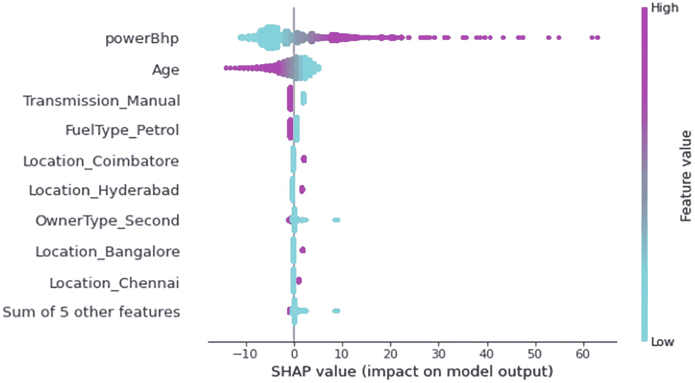

图 3-9

使用不同颜色味觉的蜂群图

```py
import matplotlib.pyplot as plt
shap.plots.beeswarm(shap_values, color=plt.get_cmap("cool"))

```

有一个选项可以使用条形图显示 SHAP 值，其中考虑了 SHAP 值的平均绝对平均值。图 [3-10](#Fig10) 中的横轴表示平均绝对 SHAP 值，纵轴表示特征。五个最不重要的功能组合在一起。此外，还有一个选项可以查看所有要素相对于这些要素的最大绝对值。最大绝对 SHAP 值表示训练数据集中影响预测的有影响力的观察值。将 SHAP 值矩阵传递给热图绘图函数将创建一个绘图，其中实例位于 x 轴上，模型输入位于 y 轴上，SHAP 值以色标编码。默认情况下，使用`shap.order.hclust`对样本进行排序，它根据解释相似性对样本进行分层聚类排序。参见图 [3-11](#Fig11) 和 [3-12](#Fig12) 。

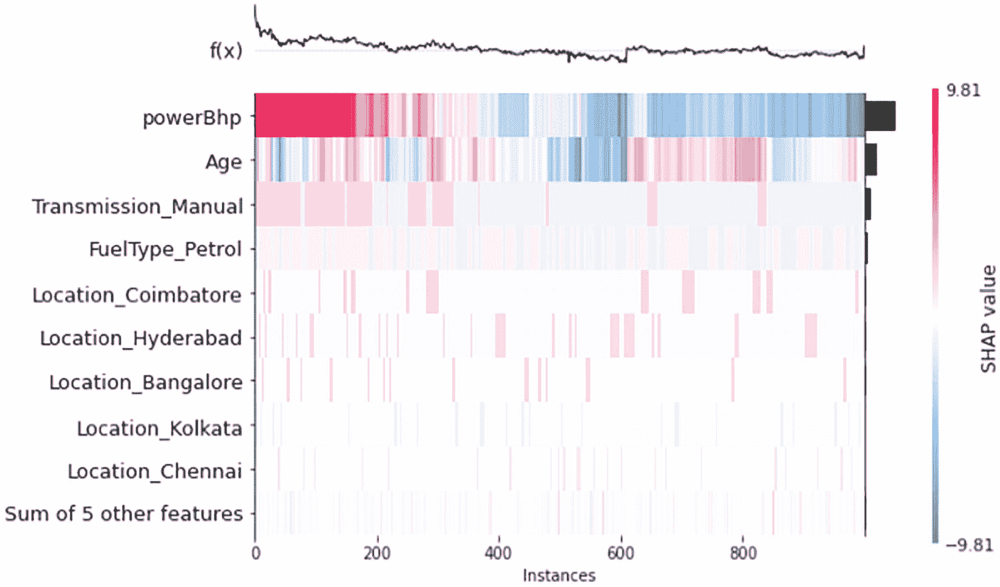

图 3-12

与 SHAP 关联的特征实例

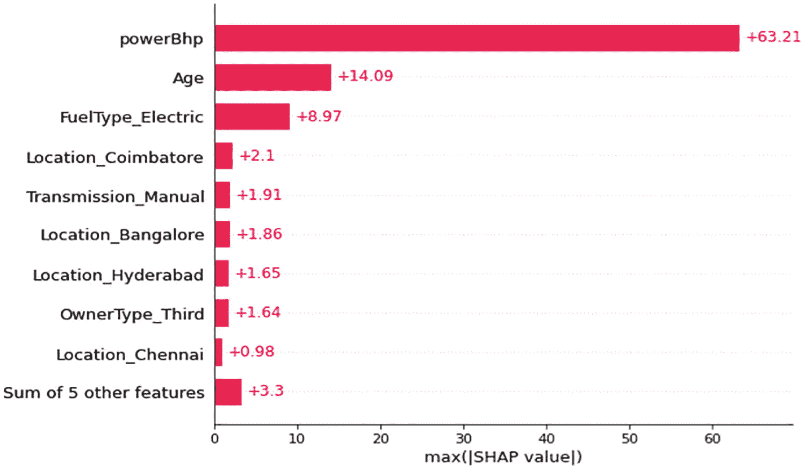

图 3-11

最大绝对 SHAP 值

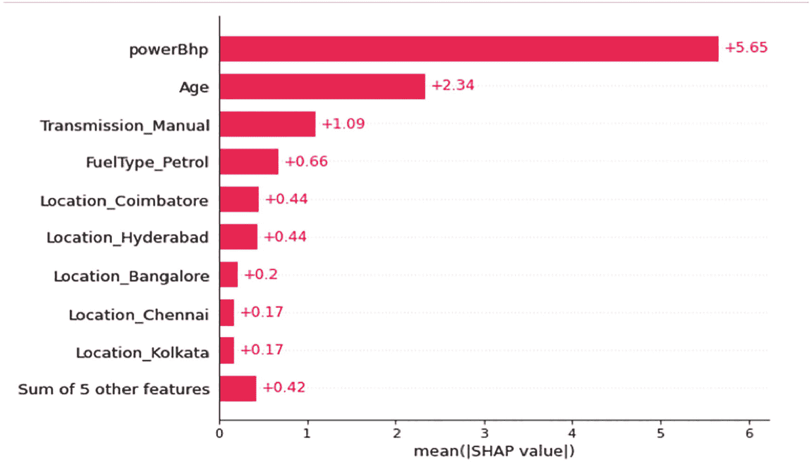

图 3-10

SHAP 值的平均绝对值

```py
shap.plots.bar(shap_values)

```

```py
shap.plots.bar(shap_values.abs.max(0))

```

```py
shap.plots.heatmap(shap_values[:1000])

```

这导致出于相同原因具有相同模型输出的样本被分组在一起(例如受动力 BHP 和年龄影响较大的人)。模型的输出显示在图 [3-12](#Fig12) 中的热图矩阵上方(以解释的`.base_value`为中心)，每个模型输入的全局重要性显示为图右侧的条形图(默认情况下，这是总体重要性的`shap.order.abs.mean`度量)。

## 石灰解释和 ML 模型

LIME，或局部可解释模型不可知解释，是一种算法，它可以通过用可解释模型局部近似任何分类器或回归器的预测，以忠实的方式解释它。它通过调整特征值来修改单个数据样本，并观察对输出产生的影响。它扮演“解释者”的角色，解释来自每个数据样本的预测。LIME 的输出是一组解释，表示每个特征对单个样本预测的贡献，这是局部可解释性的一种形式。例如，可解释的模型可以是线性回归或决策树，其在原始模型的小扰动(例如，添加噪声、移除单词或隐藏图像的部分)上被训练以提供良好的局部近似。可以使用 pip 命令安装 LIME。

您可以使用目标列作为模型训练数据集，并重新训练一个回归模型，而不是以前的模型对象`new_model`，因为 LIME 是一种与模型无关的技术，它在生成解释器的同时重新训练模型。LIME 将问题局部化，并在局部水平而非全局水平解释模型。

```py
!pip install lime

import lime
import lime.lime_tabular

explainer = lime.lime_tabular.LimeTabularExplainer(np.array(xtrain),
                                                   mode='regression',
                                                  feature_names=xtrain.columns,
                                                  class_names=['price'],
                                                  verbose=True)

```

LIME 表格解释器需要一个 numpy 数组作为输入，因此训练数据格式会发生变化。扰动后模式选择为回归，目标列为价格。一旦开发了解释器，就可以进一步生成详细的本地解释。“特征频率”选项提供了特征的分布以及它作为扰动过程的一部分的次数。

```py
explainer.feature_selection
explainer.feature_frequencies

```

如果您想要使用先前训练的模型对象，那么您可以使用解释实例选项。这需要一个测试数据集、模型对象和一些可以使用的特性。让我们从测试数据集中取出同样的第 60 条记录。您将获得截距项、局部预测值和右侧的全局预测值。对于测试数据集中的第 60 条记录，如果您使用 predict 函数，您将获得 27.5854 的预测值，该值等于 explain 实例中的正确值。预测的局部模式为 28.54，更接近实际预测值 35.0。

```py
# asking for explanation for LIME model
i = 60
exp = explainer.explain_instance(np.array(xtest)[i],
                                 new_model.predict,
                                 num_features=14
                                )

new_model.predict(xtest)[60]

ytest[60:61]

Intercept 18.186435664326485
Prediction_local [28.15539047]
Right: 27.58547373488966
exp.show_in_notebook(show_table=True)
exp.as_list()

```

您可以用表格格式显示解释器，在表格中显示预测值、正负特征值以及总体特征及其值。预测值为 46.62。在第二个图表中，显示了相同实例(编号 60)的正特征值和负特征值。第二个图表中的水平条表示记录的特征重要性。第三个表显示了与每个特征相对应的灰度值。方法论和当地的解释是非常直观的。这可以向任何商业用户解释。第 60 条记录的样本位置均匀且随机地选择单个数据点，从模型中创建扰动的数据点和相应的预测值。默认情况下，特征选择方法是自动。LIME 专注于使用样本权重在混洗数据集(扰动的)上拟合可解释模型，并使用新训练的模型提供局部解释。见图 [3-13](#Fig13) 。

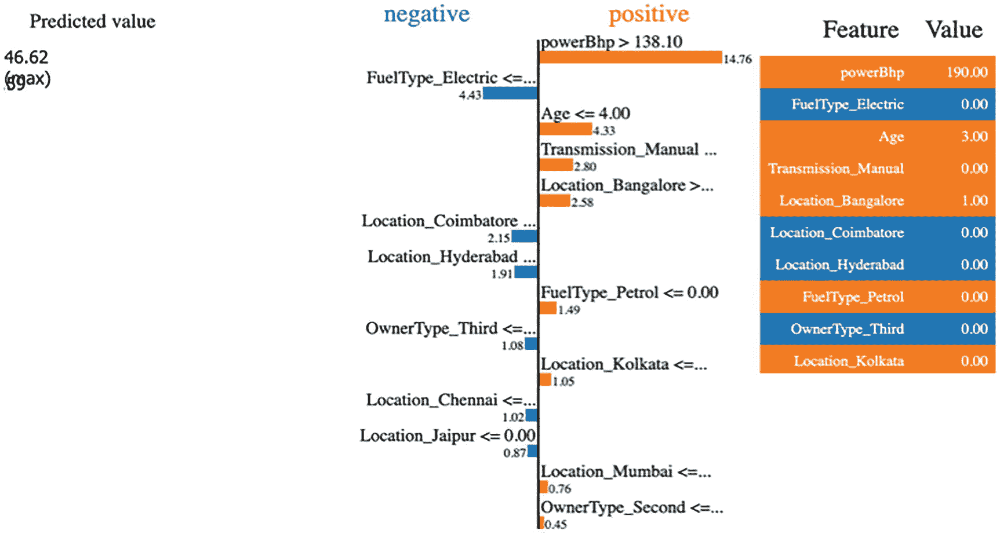

图 3-13

不同特征的正值和负值对预测值的贡献

第 60 条记录的解释者也可以显示为上面的列表。还有另一个类函数叫做子模块选择，用于生成全局决策边界。

```py
# Code for SP-LIME
import warnings
from lime import submodular_pick

# Remember to convert the dataframe to matrix values
# SP-LIME returns exaplanations on a sample set to provide a non redundant global decision boundary of original model
sp_obj = submodular_pick.SubmodularPick(explainer, np.array(xtrain),
                                        new_model.predict,
                                        num_features=14,
                                        num_exps_desired=10)

[exp.show_in_notebook() for exp in sp_obj.sp_explanations ]

```

这里，用于生成全局决策边界的特征数量是 14，并且期望的实验数量是 10。脚本的这一部分将需要一些时间来完成，因为您正在生成多个迭代。见图 [3-14](#Fig14) 。

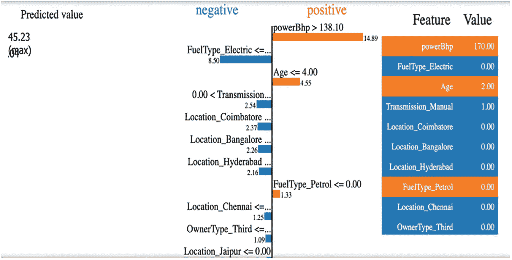

图 3-14

子模块选择说明

LIME 试图在保真度和可解释性之间进行权衡。保真度意味着模型应该能够在预测中使用的实例的本地复制模型行为。你已经知道的可解释性是清晰的，这样人们就可以理解模型的输出。下面的等式说明了两者的关系:

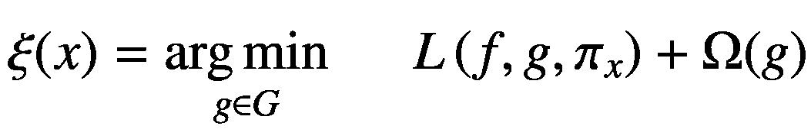

让我们来理解上述公式中使用的每个符号:

*   f 是原始预测值。

*   g 是模型解释。

*   原始特征是 x。

*   x 的圆周率是定义 xx 周围位置的邻近性度量。

*   x 的ω是用于解释的模型复杂度的度量。

LIME 的局限性之一是对邻域和邻近性的定义不准确。在对本地记录进行采样时，它使用高斯分布，该分布不考虑各种特征之间的关系。如果因变量和自变量之间的关系是非线性的，那么解释将是不准确的。另一个限制是子模块选择，它是数据集的一组 n 个样本，可以最好地解释模型。子模块 pick 生成大量输出，这些输出有时很难解释。尽管该模块存在局限性，但 LIME 主要用于生成独立预测的模型不可知的局部解释。它非常受欢迎，因为它的输出非常简单，而且很容易解释。

## 滑手**解说和 ML 模型**

Skater 是一个开源的统一框架，能够对所有形式的模型进行模型解释，以帮助我们建立一个可解释的机器学习系统，这是现实世界中经常需要的。Skater 支持算法在全局(基于完整数据集的推理)和局部(关于单个预测的推理)解开黑盒模型的已知结构。这个包最初是由 Aaron Kramer、Pramit Choudhary 和数据科学的其他人开发的。帮助数据科学家和数据爱好者获得更好的模型洞察力。Skater 通过提供根据需要推断和调试模型决策策略的能力来实现这一愿景，将“人带入循环”

可以使用 pip 或 conda 安装脚本来安装 Skater 库。它也很容易安装在 Jupyter 环境中。模型对象可以由两个类实现:内存模型和部署模型。作为可调用函数的模型可以通过内存模型使用；通过 Rest APIs 部署和调用的模型通过部署的模型对象公开。

```py
!pip install skater
import skater
from skater import Interpretation
# An Interpretation consumes a dataset, and optionally some meta data like feature names and row ids

interpreter = Interpretation(xtrain, feature_names=xtrain.columns)
interpreter

from skater.model import InMemoryModel

model = InMemoryModel(new_model.predict, examples = xtrain[:10])
model

```

解释模块消耗数据集。从解释器中，你可以提取回归对象的特性重要性。内存模型需要一个预测函数和一个需要解释预测的数据样本。

```py
interpreter.feature_importance.feature_importance(model)
#Computes feature importance of all features related to a model instance.
#Supports regression.

```

从上面的特征重要性表中，两个重要的特征是功率 BHP 和年龄；它们累计贡献了 75%的重要性。其他 12 个特征贡献了 25%的重要性。模型报告功能显示详细的元数据，例如模型类型训练、输出变量类型、输出形状、输入形状和关于模型的概率状态。

```py
model.model_report(examples=xtrain)

```

要生成部分依赖图或双向部分依赖图，解释器需要您再次加载训练数据集，还需要提供特征名称。

```py
# Skater is intutively designed to support
# - InMemoryModel : A model which is currently being built and estimator instance is still in the scope
# - DeployedModel: A model which is operationalized, or a third party deployed model
interpreter.load_data(xtrain, feature_names=xtrain.columns)

print("2-way partial dependence plots")
# Features can passed as a tuple for 2-way partial plot
pdp_features = [('Age', 'powerBhp')]
interpreter.partial_dependence.plot_partial_dependence(
    pdp_features, model, grid_resolution=10
)

```

利用因变量的两个强大功能，生成了图 [3-15](#Fig15) 所示的上述两个部分依赖图。图上的颜色仅显示关联，不应解释为因果关系。从图 [3-15](#Fig15) 的第二个梯度图来看，绿色显示了对预测值的较高贡献，深蓝色显示了这两个特征(年龄和 BHP 功率)对预测值的较低贡献。浅绿色显示较高的预测值，蓝色显示较低的预测值。类似地，可以生成单向部分依赖图。可以在同一个单向 PDP 图上填充具有置信区间的 PDP 图。

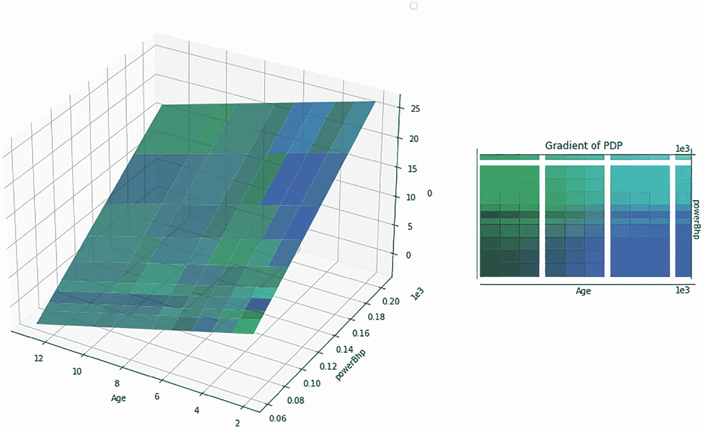

图 3-15

双向部分相关图

```py
print("1-way partial dependence plots")
# or as independent features for 1-way partial plots
pdp_features = ['powerBhp', 'Age']
interpreter.partial_dependence.plot_partial_dependence(
    pdp_features, model, grid_resolution=30
)
# Partial Plot with variance effect
interpreter.partial_dependence.plot_partial_dependence(
    pdp_features, model, grid_resolution=30, with_variance=True
)

```

来自两个图的两个图没有打印出来，因为此时它们不会增加太多价值。您可以根据需要从数据集中绘制任意数量的 PDP 图表。相关的那些提供了关于特性的重要见解。

## ELI5 解释和 ML 模型

ELI5 是一个 Python 包，可以帮助调试机器学习分类器并解释它们的预测。它支持以下机器学习框架和包:scikit-learn。目前，ELI5 可以解释 scikit-learn 线性分类器和回归器的权重和预测，将决策树打印为文本或 SVG，显示特征重要性，并解释决策树和基于树的集成的预测。ELI5 理解 scikit-learn 的文本处理实用程序，并能相应地突出显示文本数据。它还允许您通过撤销哈希来调试包含哈希矢量器的 scikit-learn 管道。

特征的权重也具有偏差特征。这只是线性回归模型的截距项。这些功能按其权重降序排列。ELI5 的意思是*解释一下，就像我是五个*。它支持所有的 scikit-learn 算法。它还使用`show_weights()`函数进行全局解释。它还具有使用`show_prediction()`功能的本地解释。在 ELI5 库中有一个排列模型。它只适用于全局解释。它是这样工作的:

*   首先，它从训练数据集中获取基线模型并计算误差。

*   它会改变特性的值，重新训练模型，并计算误差。

*   它比较了洗牌前后错误的减少。

如果洗牌后误差增量变得非常高，则特征被认为是重要的，而如果洗牌后误差率保持不变，则特征被认为是不重要的。结果显示了具有多个洗牌步骤的特征的平均重要性和标准偏差。这不是一种查看哪个特征影响模型性能的方法。它只告诉我们特征权重的变化幅度，所以我们不能真正地认为权重是某一尺度上的重要特征。使用以下脚本演示了上述过程:

```py
!pip install eli5
import eli5
eli5.show_weights(new_model,
                 feature_names=list(xtrain.columns))
eli5.explain_weights(new_model, feature_names=list(xtrain.columns))
eli5.explain_prediction(new_model,xtrain.iloc[60])
from eli5.sklearn import PermutationImportance
perm = PermutationImportance(new_model)
perm.fit(xtest, ytest)
eli5.show_weights(perm,feature_names=list(xtrain.columns))

```

解释单个预测提供了记录的局部解释。它还会告诉您在进行预测时权重较高的前三个特征。从排列重要性图中，很明显，功率 BHP 和年龄是最重要的特征。考虑到`automobile.csv`，这与迄今为止你实现的其他 XAI Python 库的类似练习是一致的。

现在，下一步，让我们来看一个线性分类模型，也称为逻辑回归模型，通过逻辑回归模型来了解 XAI 的各个方面。部分相关图描述了目标特征或因变量与称为自变量的特征之间的关系。该关系可以是线性的、非线性的、曲线的或更复杂的，如圆形或循环单调关系。

## 逻辑回归

当目标特征是连续的时，线性回归模型是适用的，但是当目标特征是二元的如 0 或 1，真或假，接受或拒绝时，线性回归模型是不适用的。这是因为目标要素的预测值可能会超出 0 和 1 的范围，但由于您需要分别预测这两个类，因此期望将输出限制为两个类。这就是为什么您需要一个逻辑回归模型，它采用二进制值来计算对数优势，称为优势比。优势比与特征呈线性相关。这就是为什么逻辑回归模型被称为线性模型。

当您需要对二元或多项结果的概率进行建模时，通常会使用逻辑回归。您不能在那里应用线性回归模型，因为在逻辑回归场景中，结果变量要么是 0 要么是 1(或者有时它也可以是多项式，其中两个以上的结果也是可能的)。如果在那里应用线性回归，预测范围可能会超过 0 和 1 的范围。它不会提供任何类别的概率。在多项式类分类模型中，类分离将是一个巨大的挑战。基于普通最小二乘法的线性回归模型假设因变量和自变量之间的关系是线性的；然而，逻辑回归模型假设这种关系是对数关系。

在许多现实生活场景中，感兴趣的变量本质上是绝对的，比如是否购买产品，是否批准信用卡，或者肿瘤是否癌变。逻辑回归不仅预测因变量类别，还预测属于因变量水平的情况的概率。独立变量不需要正态分布，也不需要具有相等的方差。逻辑回归属于非线性回归家族。如果因变量有两个级别，可以应用逻辑回归，但如果它有两个以上的级别，如高、中、低，则可以应用多项式回归模型。自变量可以是连续的、分类的或名义的。

逻辑回归模型可以用下面的等式来解释:

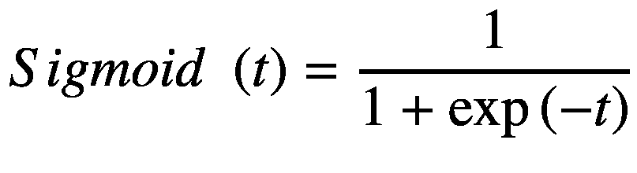

上述函数也称为 sigmoid 函数。

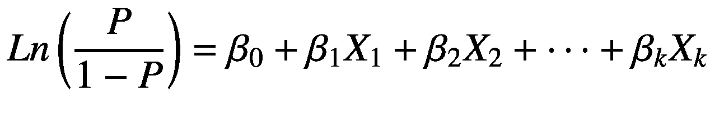T2】

Ln (P/1-P)是结果的对数概率。上述等式中提到的β系数解释了解释变量中每增加或减少一个单位，结果变量的几率如何增加或减少。图 [3-16](#Fig16) 显示了 sigmoid 函数的形状。它看起来像一条 s 形曲线。逻辑回归模型的解释与线性回归模型完全不同。右侧等式中的加权和被转换/变换为概率值。等式的左边称为对数概率，因为它是事件发生的概率与事件不发生的概率之比。通过考虑一个我们将进一步讨论的例子，可以理解关于对数概率的更多解释。

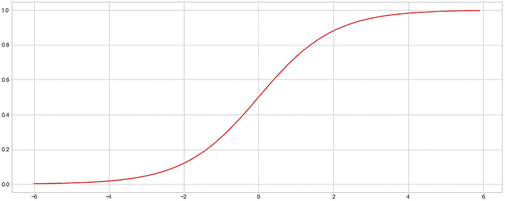

图 3-16

逻辑/sigmoid 函数，x 轴显示特征，y 轴显示概率

为了解释逻辑回归模型和决策是如何发生的，你还需要理解概率和优势比。您将使用`churndata.csv`，它属于电信领域，有将近 3333 条记录和 18 个特性。你要预测在给定特征值的情况下，客户是否会流失。

```py
import pandas as pd
import numpy as np
import matplotlib.pyplot as plt
%matplotlib inline

from sklearn.linear_model import LogisticRegression, LogisticRegressionCV

from sklearn.metrics import confusion_matrix, classification_report

df_train = pd.read_csv('ChurnData.csv')

```

第一步，获取数据，转换某些已经是字符串格式的要素，并应用标注编码器进行转换。转换后，您将 80%用于培训，20%用于测试。当创建训练/测试分割时，您维护流失案例和非流失案例的比例，以便维护类别之间的平衡。然后训练模型，将训练好的模型应用于测试数据，并比较训练数据集和测试数据集的准确性。

```py
del df_train['Unnamed: 0']

df_train.shape

df_train.head()

from sklearn.preprocessing import LabelEncoder

tras = LabelEncoder()

df_train['area_code_tr'] = tras.fit_transform(df_train['area_code'])

df_train.columns

del df_train['area_code']

df_train.columns

df_train['target_churn_dum'] = pd.get_dummies(df_train.churn,prefix='churn',drop_first=True)
df_train.columns
del df_train['international_plan']
del df_train['voice_mail_plan']
del df_train['churn']
df_train.info()

df_train.columns

from sklearn.model_selection import train_test_split

df_train.columns

X = df_train[['account_length', 'number_vmail_messages', 'total_day_minutes',
       'total_day_calls', 'total_day_charge', 'total_eve_minutes',
       'total_eve_calls', 'total_eve_charge', 'total_night_minutes',
       'total_night_calls', 'total_night_charge', 'total_intl_minutes',
       'total_intl_calls', 'total_intl_charge',
       'number_customer_service_calls', 'area_code_tr']]
Y = df_train['target_churn_dum']

```

仅转换区号变量。其余的特征要么是整数，要么是浮点数，这对于训练模型来说是很好的。

现在，您可以查看概率分布、对数比值比和比值比，以及模型中的模型参数，以便了解如何围绕预测做出决策。如果你以 SHAP 值为参考来解释逻辑回归模型的概率，你可以看到强烈的交互作用效应。这是由于概率空间中逻辑回归模型的非加性行为。如果您使用模型的对数概率作为输出，您可以看到模型的输入和输出之间有很强的相关性或完美的线性关系。

```py
xtrain,xtest,ytrain,ytest=train_test_split(X,Y,test_size=0.20,stratify=Y)
log_model = LogisticRegression()

log_model.fit(xtrain,ytrain)

print("training accuracy:", log_model.score(xtrain,ytrain)) #training accuracy

print("test accuracy:",log_model.score(xtest,ytest)) # test accuracy

```

通过查看精度，您可以得出结论，这是一个很好的模型，可能不存在过拟合问题，因为在训练和测试精度方面没有偏差。

```py
np.round(log_model.coef_,2)

log_model.intercept_

X.columns

```

您创建了两个效用函数来产生所需的输出，这两个函数可以进一步用于 SHAP 值的图形表示。

```py
# Provide Probability as Output
def model_churn_proba(x):
    return log_model.predict_proba(x)[:,1]

# Provide Log Odds as Output
def model_churn_log_odds(x):
    p = log_model.predict_log_proba(x)
    return p[:,1] - p[:,0]

```

因为你已经在本章的回归部分解释了依赖图，类似的解释也可以用于逻辑回归模型。部分依赖图以数据集中的一条记录为例，因为它是局部解释。

```py
# make a standard partial dependence plot
sample_ind = 25
fig,ax = shap.partial_dependence_plot(
    "total_day_minutes", model_churn_proba, X, model_expected_value=True,
    feature_expected_value=True, show=False, ice=False
)

```

对于记录号 25，图 [3-17](#Fig17) 中以分钟为单位的特征总天数的部分相关性图显示了函数的概率值或期望值与特征之间的关系为正，但似乎不是线性的。

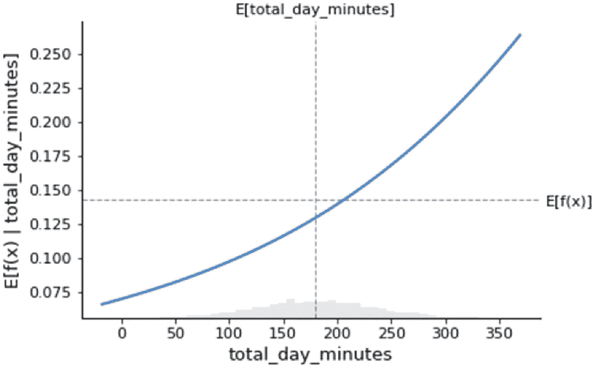

图 3-17

全天分钟数与流失概率的部分相关图

```py
# compute the SHAP values for the linear model
background_churn = shap.maskers.Independent(X, max_samples=1000)
explainer = shap.Explainer(log_model, background_churn,feature_names=list(X.columns))
shap_values_churn = explainer(X)
shap_values = pd.DataFrame(shap_values_churn.values)
shap_values.columns = list(X.columns)
shap_values

```

SHAP。解释器模块具有表 [3-6](#Tab6) 中列出的重要参数。

表 3-6

SHAP 库中的解释器参数

<colgroup><col class="tcol1 align-left"> <col class="tcol2 align-left"></colgroup> 
| 

参数

 | 

描述

 |
| --- | --- |
| **型号** | 模型对象名称 |
| **口罩** | 这是一个掩盖隐藏特征的功能 |
| **链接** | 该函数用于在模型的输出单位和 SHAP 值单位之间进行映射 |
| **算法** | 它用于估计形状值，名为自动，置换，分区，树，内核，采样，线性，深度和梯度。默认为自动。 |

当您查看账户长度与账户长度的 SHAP 值的散点图时(图 [3-18](#Fig18) )，会发现两者之间存在一种强而完美的线性关系。

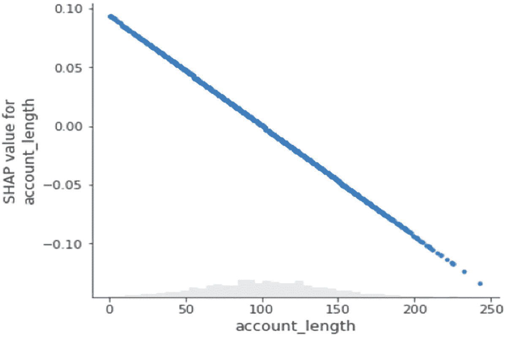

图 3-18

账户长度特征与 SHAP 值的关系

```py
shap.plots.scatter(shap_values_churn[:,'account_length'])

```

下图显示了各个特征的 SHAP 值和平均绝对值。这显示了在分类问题中哪个特征具有更高的权重。客户服务电话的数量是客户流失的一个很好的驱动因素，因为有更多抱怨的人更有可能打电话给客户服务，因此是骑墙派；他们可以在任何时候搅动。第二个最重要的因素是一天的总时间，第三个是语音邮件的数量。到最后，你可以看到七个最不重要的特性被组合在一起。SHAP 价值观还有另一种表达方式。虽然显示了每个要素的最大绝对 SHAP 值，但这两个图之间没有太大区别。另一种视图称为蜂群图，它显示了 SHAP 值及其对模型输出的影响。数千条记录的 SHAP 值的热图视图显示了 SHAP 值相对于模型要素的密度。最佳特征的 SHAP 值较高，特征重要性逐渐降低，SHAP 值也降低。参见图 [3-19](#Fig19) 至 [3-22](#Fig22) 。

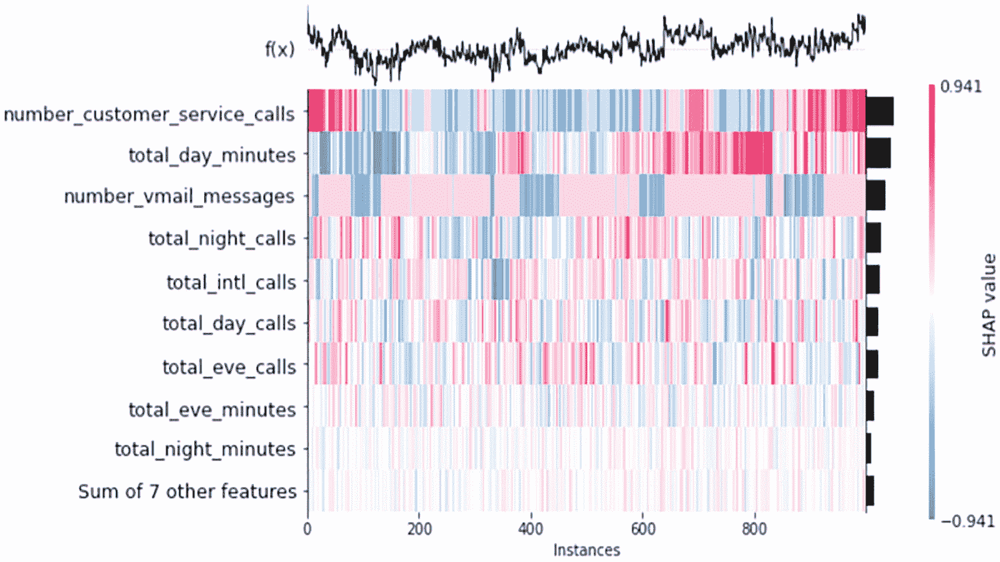

图 3-22

由训练过程中使用的实例的每个特征贡献的 SHAP 值的发生率

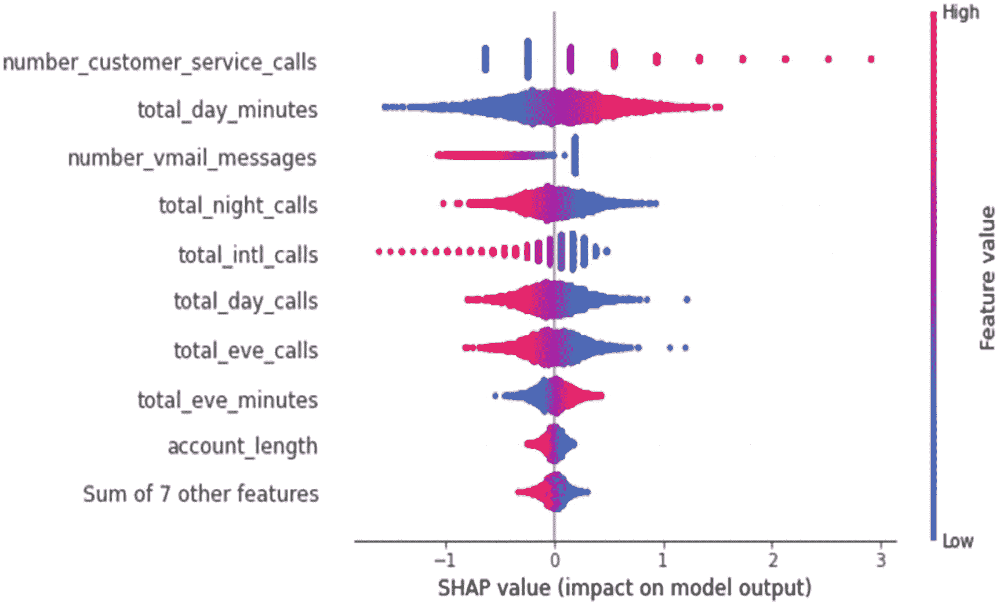

图 3-21

特征对 SHAP 值的积极和消极贡献

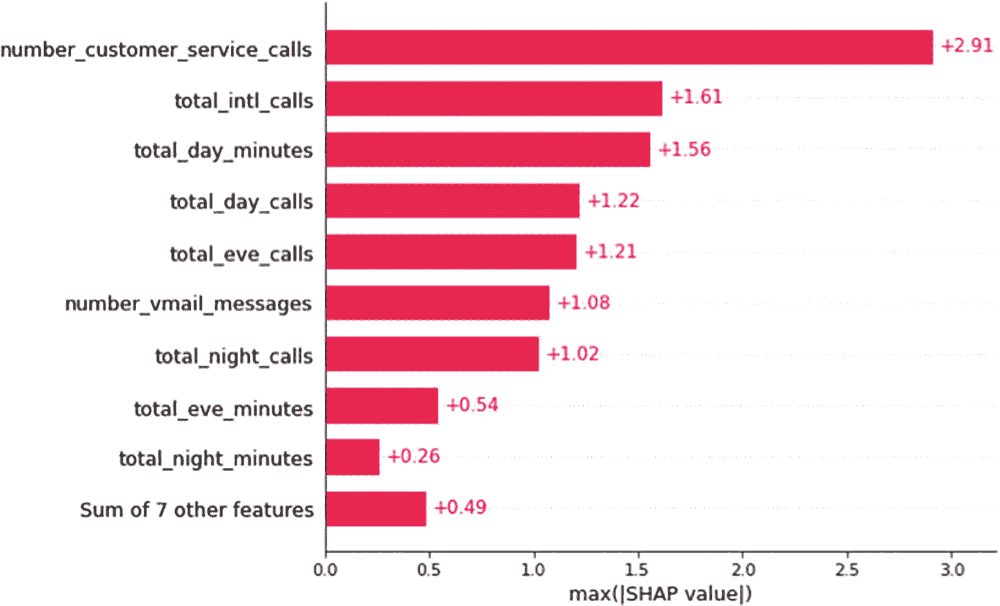

图 3-20

每个要素贡献的最大绝对 SHAP 值

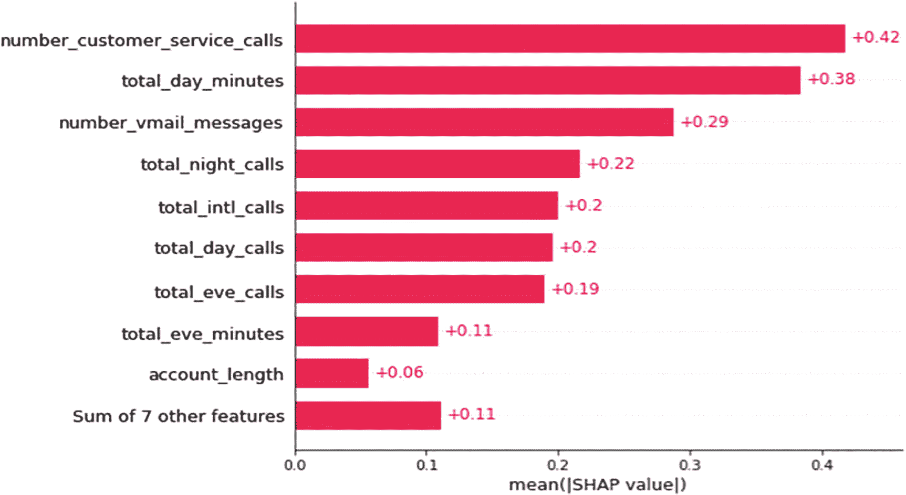

图 3-19

每个要素贡献的平均绝对 SHAP 值

```py
# make a standard partial dependence plot
sample_ind = 25
fig,ax = shap.partial_dependence_plot(
    "number_vmail_messages", model_churn_proba, X, model_expected_value=True,
    feature_expected_value=True, show=False, ice=False
)
shap_values_churn.feature_names

# compute the SHAP values for the linear model
explainer_log_odds = shap.Explainer(log_model, background_churn,feature_names=list(X.columns))
shap_values_churn_log_odds = explainer_log_odds(X)
shap_values_churn_log_odds
shap.plots.bar(shap_values_churn_log_odds)

```

```py
shap.plots.bar(shap_values_churn_log_odds.abs.max(0))

```

```py
shap.plots.beeswarm(shap_values_churn_log_odds)

```

```py
shap.plots.heatmap(shap_values_churn_log_odds[:1000])

```

<colgroup><col class="tcol1 align-left"> <col class="tcol2 align-left"> <col class="tcol3 align-left"></colgroup> 
| `Feature Name` | `Coefficients` |   |
| `14` | `number_customer_service_calls` | `0.383573` |
| `2` | `total_day_minutes` | `0.008251` |
| `4` | `total_day_charge` | `0.001378` |
| `5` | `total_eve_minutes` | `0.000947` |
| `7` | `total_eve_charge` | `0.000098` |
| `10` | `total_night_charge` | `-0.000048` |
| `13` | `total_intl_charge` | `-0.000196` |
| `11` | `total_intl_minutes` | `-0.000464` |
| `0` | `account_length` | `-0.000573` |
| `8` | `total_night_minutes` | `-0.001730` |
| `3` | `total_day_calls` | `-0.009254` |
| `9` | `total_night_calls` | `-0.010050` |
| `6` | `total_eve_calls` | `-0.012706` |
| `1` | `number_vmail_messages` | `-0.019944` |
| `15` | `area_code_tr` | `-0.033119` |
| `12` | `total_intl_calls` | `-0.097870` |

```py
temp_df = pd.DataFrame()
temp_df['Feature Name'] = pd.Series(X.columns)
temp_df['Coefficients'] = pd.Series(log_model.coef_.flatten())
temp_df.sort_values(by='Coefficients',ascending=False)

```

### 解释

当您将一个特性的值增加一个单位时，模型等式将产生两个赔率:一个是基础值，另一个是特性的增量值。这里的目标是查看每一个特性值增加或减少的几率比。一个单位的特征变化导致比值比以相应β系数的指数倍数变化。这可以使用下面的等式来进一步解释，其中β0 是截距项，β1 到βk 是模型的参数，x1 到 xk 是模型的独立预测值:

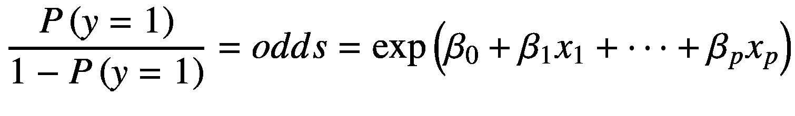

让我们把等式的右边称为 exp(a)，其中 a 是表示线性回归概念的等式。如果你增加模型的任何参数，那么方程将改变一个单位，因此让我们称之为 b，所以 RHS 变成 exp(b)。相对于预测值的一个单位值的变化的比值比为 odds_new/odd_old = exp(a-b)。您可以用这种格式解释所有数字特征。所有分类特征或二元特征都可以遵循这一点。

### 石灰推理

为了解释逻辑回归模型，可以使用 SHAP 值。然而，复杂的是时间。如果你有一百万条记录，你需要一个相当大的样本来生成所有的排列和组合，以达到一个全局的水平来解释局部的准确性，你需要更多的时间。为了避免处理大型数据集的瓶颈，LIME 在生成解释方面提供了速度。为了解释表格矩阵数据这种结构化数据，你必须使用石灰表格解释器。对于数值特征，根据训练数据中的平均值和标准偏差，通过从正态(0，1)采样并执行均值居中和缩放的逆运算来扰动它们。对于分类特征，通过根据训练分布进行采样来进行扰动，并在值与所解释的实例相同时生成为 1 的二元特征。

在生成 LIME explainer 时，您需要将数据作为数组传递，提供列名列表，提供目标列名，并根据您计划使用的机器学习任务将模式设置为回归和分类。verbose 选项用于启用模型预测。

```py
import lime
import lime.lime_tabular

explainer = lime.lime_tabular.LimeTabularExplainer(np.array(xtrain),
            feature_names=list(xtrain.columns),
            class_names=['target_churn_dum'],
            verbose=True, mode='classification')
# this record is a no churn scenario
exp = explainer.explain_instance(xtest.iloc[0], log_model.predict_proba, num_features=16)
exp.as_list()

```

一旦生成了解释器模型对象，您就可以检查用于生成解释的单个预测和全局预测。在有两个类或多个类的分类中，可以针对要素列为每个类生成单独的要素重要度。在这种情况下，您考虑两条记录:记录 1，其中模型正确预测了结果；记录 20，其中模型错误地做出了预测。你将为这两个场景解释为什么这个决定是由模型做出的。与目标类有正关系的要素是正数，而与目标类有负关系的类是负号。您可以在表格笔记本视图中显示结果。您还可以通过考虑视图中最重要的功能来限制视图。

```py
pd.DataFrame(exp.as_list())

```

数据帧视图中特征的权重如表 [3-7](#Tab7) 所示。

表 3-7

具有阈值的特征及其对预测值的权重

<colgroup><col class="tcol1 align-left"> <col class="tcol2 align-left"> <col class="tcol3 align-left"></colgroup> 
| **0** | **1** |
| **0** | 客户服务呼叫次数< = 1.00 | -0.106490 |
| **1** | 总分钟数< = 143.70 | -0.082492 |
| **2** | 数量邮件消息< = 0.00 | 0.063827 |
| **3** | 总通话次数> 114.00 | -0.046997 |
| **4** | 101.00 | -0.014762 |
| **5** | 总分钟数大于 235.07 | 0.009634 |
| **6** | 账户长度> 126.00 | -0.007626 |
| **7** | 1.00 | -0.007580 |
| **8** | 2.27 < total_intl_charge <= 2.75 | 0.006753 |
| **9** | 87.00 | 0.006710 |
| **10** | 166.93 | 0.005046 |
| **11** | 总天数费用< = 24.43 | -0.004913 |
| **12** | 3.00 | 0.004285 |
| **13** | 7.51 | -0.001845 |
| **14** | 总费用> 19.98 英镑 | -0.001836 |
| **15** | 8.40 < total_intl_minutes <= 10.20 | -0.000155 |

对应于记录号 1，可以生成下表。截距项为 0.126，通过 LIME 得到的本地预测流失概率为 0.18，通过 logistic 回归模型得到的预测流失概率为 0.15。基本上，它是截距项加上来自不同特征的所有权重。由于客户流失的可能性较小，因此将其归类为无客户流失的场景。因此，图 [3-23](#Fig23) 中的蓝色条显示无客户流失的概率为 0.84，客户流失的概率为 0.16。表的右侧显示了各要素的总体重要性(按权重)。中间的表格显示了特征值的权重。

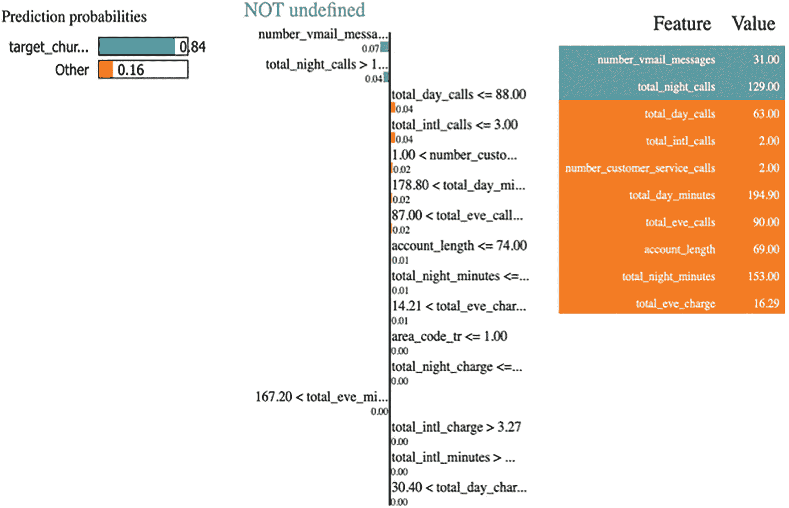

图 3-23

测试集中记录 1 的概要及其本地解释

```py
exp.show_in_notebook(show_table=True)

```

对于测试集中的记录 20，模型预测了不同的结果，而实际测试具有不同的结果。在这种情况下，模型预测与实际情况不同，因此模型需要解释为什么会发生这种情况。使用 LIME 本地实例可以获得更好的视图。

```py
# This is s churn scenario
exp = explainer.explain_instance(xtest.iloc[20], log_model.predict_proba, num_features=16)
exp.as_list()

exp.show_in_notebook(show_table=True)
xtest.iloc[20]

```

在图 [3-24](#Fig24) 中，预测概率有两个条形:蓝色条形显示没有客户流失的概率，橙色条形显示客户流失的概率。如果你看一下相邻的表格，它清楚地显示了特征及其在整个橙色条中所占的权重。

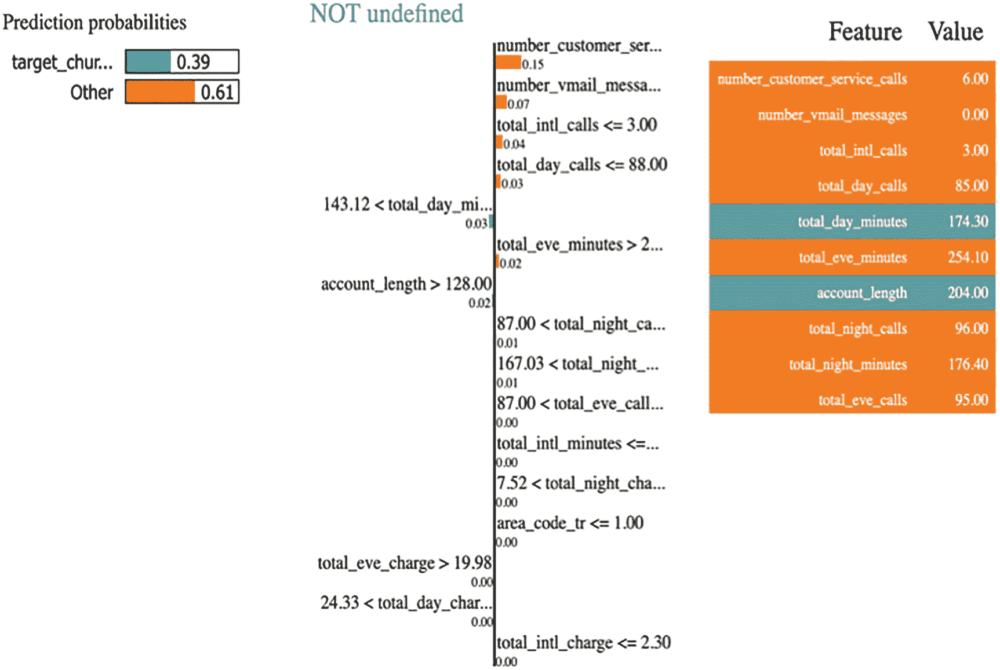

图 3-24

测试集中记录 20 的本地解释

除了总日分钟数和账户长度这两个特征之外，所有其他特征都对流失概率有贡献，因此模型正确地预测了结果，并且解释了预测。给出了每个特征的阈值及其权重。这为业务人员理解预测模型的行为提供了更好的图像。

```py
explainer = lime.lime_tabular.LimeTabularExplainer(np.array(xtrain),
            feature_names=list(xtrain.columns),
            class_names=['target_churn_dum'],
            verbose=True, mode='classification')
# Code for SP-LIME
import warnings
from lime import submodular_pick

# SP-LIME returns exaplanations on a sample set to provide a non redundant global decision boundary of original model
sp_obj = submodular_pick.SubmodularPick(explainer, np.array(xtrain),
                                        log_model.predict_proba,
                                        num_features=14,
                                        num_exps_desired=10)

```

子模块选择选项提供了原始模型的全局决策边界。您可以使用 explainer 对象、训练数据集和从训练模型中提取的概率，然后指定应该出现在描述中的特征数量和所需的表达式数量。参见图 [3-25](#Fig25) 至 [3-28](#Fig28) 。

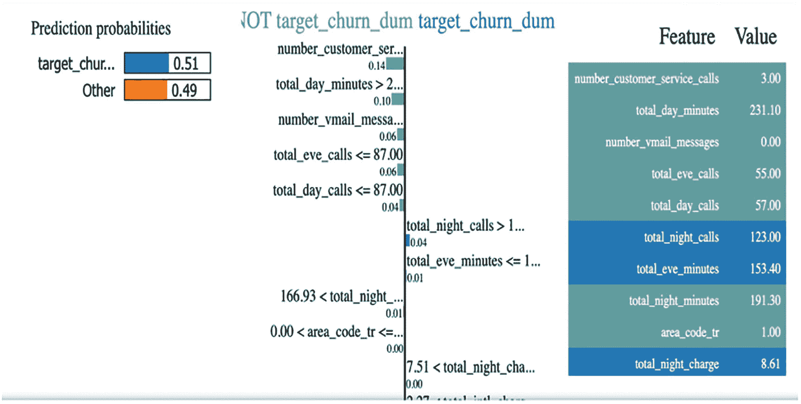

图 3-28

10 个记录中的第四个记录的本地解释

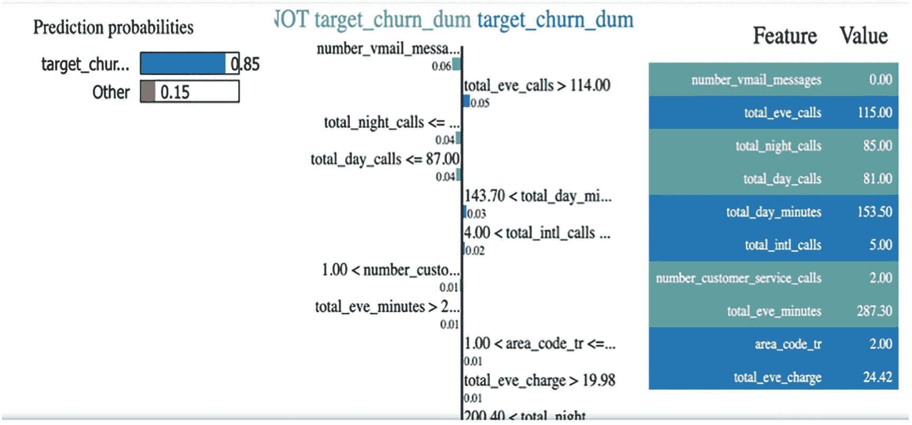

图 3-27

10 个记录中的第三个记录的本地解释

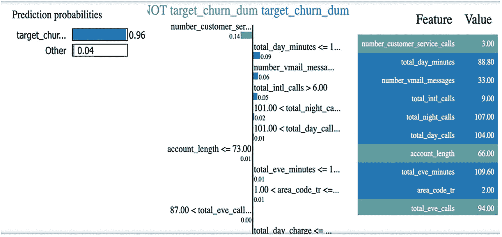

图 3-26

10 个记录中的第二个记录的本地解释

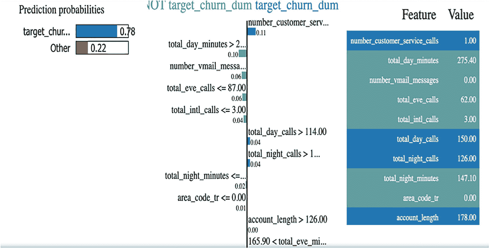

图 3-25

10 条记录中第一条记录的本地解释

Skater 生成与 LIME 库类似的结果，因此不详细描述，因为我们已经用 LIME 库介绍过了。ELI5 主要用于文本分类用例，因此不适用于解释线性或逻辑回归模型。更多信息见表 [3-8](#Tab8) 。

表 3-8

何时使用哪个库摘要视图

<colgroup><col class="tcol1 align-left"> <col class="tcol2 align-left"> <col class="tcol3 align-left"> <col class="tcol4 align-left"> <col class="tcol5 align-left"></colgroup> 
| 

库名

 | 

定义

 | 

何时使用

 | 

优势

 | 

限制

 |
| --- | --- | --- | --- | --- |
| **SHAP** | 使用 Shapley 值来解释任何机器学习模型 | 表格数据、图像数据 | 使用更多指标和统计数据进行更好的解释 | 不明显 |
| **石灰** | 本地可解释模型解释 | 对于局部解释，表格数据 | 有利于个别实例的可解释性 | 全局解释不直观。不适用于图像数据。 |
| **溜冰者** | Skater 包中的一般工作流是创建解释、创建模型和运行解释算法。 | 表格数据，在两个模块中可用:内存和部署模型 | 模型训练和解释需要运行一次。不需要作为单独的进程运行。 | 仅支持少数型号。没有涵盖所有类型的模型 |
| **以利 5** 为例 | 一个 Python 包，帮助调试机器学习分类器并解释它们的预测 | sci kit-学习模型、文本分类、Keras 模型解释 | 适用于文本分类 | 不是一个适合所有其他任务的成熟库。解释很基本。 |

## 结论

在本章中，您学习了如何解释线性模型、用于预测的线性回归模型以及用于二元分类的逻辑回归。以类似的方式，逻辑回归模型也可以扩展到多项分类。线性模型更容易解释，每个人都非常了解这些模型是如何工作的。因此，对线性模型的信任度总是很高的。然而，在这一章中，你看到了使用可解释的人工智能库，如莱姆和 SHAP，为线性模型创建视图的不同角度。在下一章，你将学习非线性模型的模型解释能力。*