# 4.非线性模型的可解释性

本章探索了使用莱姆、SHAP 和斯科普规则可解释的基于人工智能的 Python 库来解释非线性模型对结构化数据的监督学习任务做出的决策。在本章中，你将学习解释非线性和基于树的模型的各种方法，以及它们在预测因变量时的决策。在有监督的机器学习任务中，有一个目标变量(也称为因变量)和一组自变量。目标是将因变量预测为输入变量或自变量的加权和，其中存在高度的特征交互作用和非线性复杂关系。

## 非线性模型

决策树是一种非线性模型，它将自变量映射到因变量。在局部水平上，这可以被认为是分段线性回归，但是在全局水平上，这是非线性模型，因为在因变量和自变量之间没有一对一的映射。与线性回归模型不同，没有数学方程来显示输入和输出变量之间的关系。如果我们将最大树深度参数保持在无限水平，那么决策树可能会完美地拟合数据，这是模型过度拟合的经典场景。无论训练数据集是否是线性可分的，决策树都容易过拟合。这需要解决。为了得到一个最适合的决策树模型，人们通常会进行树修剪。人们可以将决策树视为一系列条件语句，这些语句在输出列中产生一个值或一个类。举个例子，如果一个人 45 岁，在私营部门工作，拥有博士学位，那么他们的年收入肯定超过 5 万美元。决策树是一种监督学习算法，适用于可能影响目标列的无限可能的功能组合。在决策树中，我们根据输入变量中最重要的分割器或区分器将总体分成两个或多个子总体。

决策树算法主要遵循 ID3(迭代二分法 3)算法，尽管还有其他算法，如 C4.5、CART、MARS 和 CHAID。它基于以下几点:

*   根据来自数据集的信息增益(具有高预测值)确定最佳属性或特征，并将其放在树的根部

*   将训练数据集拆分为子集，使每个子集的属性值相同

*   重复上述两个步骤，直到所有的类都被分成一个节点，或者满足该节点所需的最小样本数

在决策树模型中，为了预测记录的类别标签，我们从树根开始。我们比较根属性，并在开始时使用最佳属性，随后继续开发决策树。当我们看模型的可解释性时，决策树解释预测的能力相当好。更简单地说，决策树提供了任何应用程序都可以直接使用的规则。规则大多是一堆 if/else 语句。在特征之间存在关系的情况下，例如特征之间的相互作用，特征的平方或立方值与因变量等相关。在这种情况下，线性回归和逻辑回归必然会失败。这是因为功能交互的数量可能很多。基于树的模型考虑特征值，决定阈值，将特征分成两部分，并保持树的分支生长。将数据分成多个子组的过程有助于捕捉数据集中存在的非线性。以类似的方式，正方形和立方体特征也遵循模型概述的 if/else 规则。

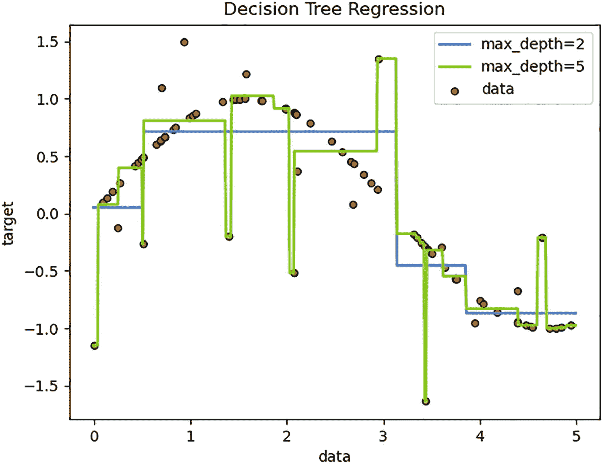

图 4-1

决策树回归捕捉非线性

如图 [4-1](#Fig1) (来源: [`https://scikit-learn.org/`](https://scikit-learn.org/) )所示，数据与目标之间的关系是非线性的。非线性由决策树模型通过增加最大深度参数来近似。随着最大深度参数从 2 增加到 5，曲线之外的所有点也成为模型的一部分，因此它们出现在决策树模型生成的规则集中。

## 决策树解释

图 [4-2](#Fig2) 描述了采油树的起点。使用根特征会发生这种情况。分支逻辑基于创建分割的最佳可能特征。

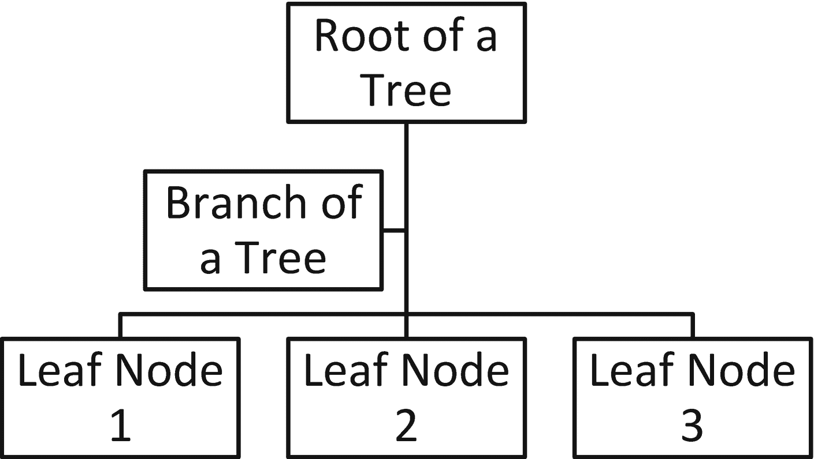

图 4-2

决策树的剖析

终端节点是树构造停止的结束节点。为了预测特定记录的结果，使用了总体数据的平均结果。

如图 [4-3](#Fig3) 所示，模型可解释性可以通过两种方式实现:XAI 库和基础 ML 库。

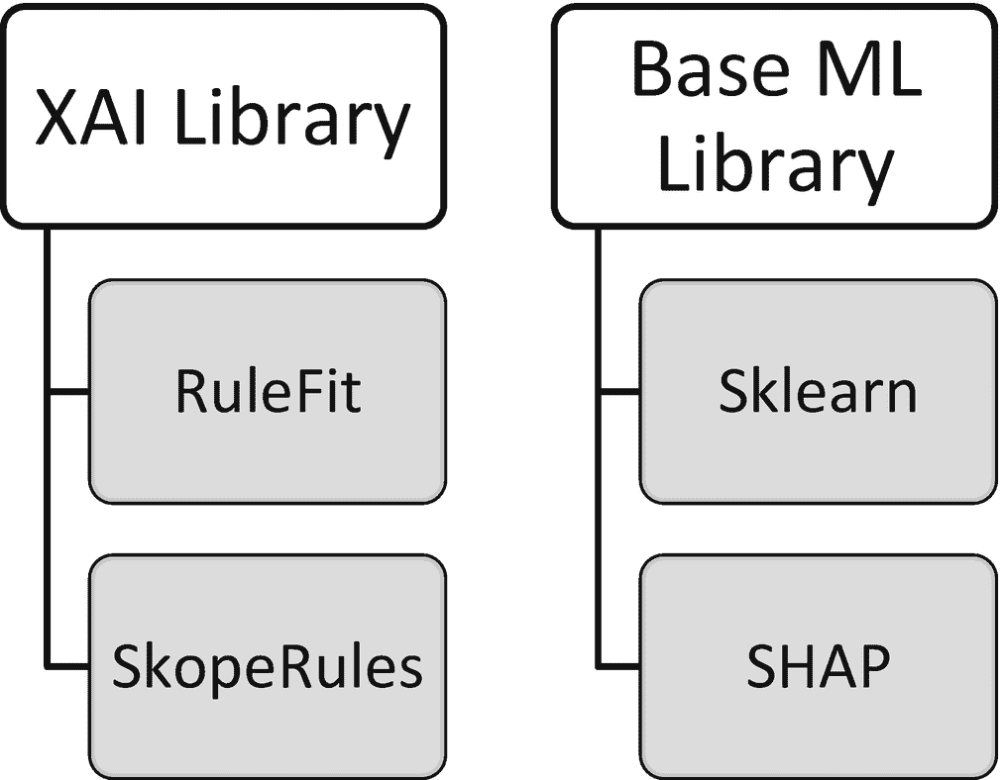

图 4-3

解释基于树的模型的两种方法

不同的是，如果我们使用的是父 ML 库，我们可以使用已经训练好的模型。否则，如果我们使用 XAI 库，我们可能必须再次训练 ML 模型。现在回到解释模型结果，如果我们重新训练模型，这是模型重新训练的开销。超参数调整和最佳模型选择是不同的过程，需要花费大量时间。

然而，如果我们有一个现成的模型，我们可以只生成模型解释，这对最终用户是有益的。以下代码显示了创建决策树模型所需的必要库。您将使用您在第 [3](03.html) 章中使用的电信客户流失数据。该数据集包含 20 个要素和 3，333 条记录。对于某些分类变量，如区号，您需要转换变量并执行标签编码。

## 决策树模型的数据准备

以下脚本显示了准备决策树模型所需的库。您还将导入所需的数据，以 CSV 格式开发模型。

```py
import pandas as pd
import numpy as np
import matplotlib.pyplot as plt
%matplotlib inline

import numpy as np, pandas as pd, matplotlib.pyplot as plt
from sklearn import tree, metrics, model_selection, preprocessing
from IPython.display import Image, display
from sklearn.metrics import confusion_matrix, classification_report

df_train = pd.read_csv('ChurnData.csv')
del df_train['Unnamed: 0']
df_train.shape
df_train.head()

```

数据中存在的附加列被删除。shape 函数提供了关于数据集中存在的行数和列数的概念。此外，head 函数提供了数据帧中的前五条记录。

```py
from sklearn.preprocessing import LabelEncoder

tras = LabelEncoder()

df_train['area_code_tr'] = tras.fit_transform(df_train['area_code'])

df_train.columns

del df_train['area_code']

df_train.columns

```

数据中存在一些字符串列，如区号。需要使用标签编码器将这些数据转换成数字。这是模型定型所必需的，因为不能直接使用字符串变量。

```py
df_train['target_churn_dum'] = pd.get_dummies(df_train.churn,prefix='churn',drop_first=True)
df_train.columns
del df_train['international_plan']
del df_train['voice_mail_plan']
del df_train['churn']
df_train.info()
df_train.columns

```

下一步，您将把数据集分成训练数据集和测试数据集。训练集用于开发模型，测试集用于生成推论或预测。

```py
from sklearn.model_selection import train_test_split

df_train.columns

X = df_train[['account_length', 'number_vmail_messages', 'total_day_minutes',
       'total_day_calls', 'total_day_charge', 'total_eve_minutes',
       'total_eve_calls', 'total_eve_charge', 'total_night_minutes',
       'total_night_calls', 'total_night_charge', 'total_intl_minutes',
       'total_intl_calls', 'total_intl_charge',
       'number_customer_service_calls', 'area_code_tr']]
Y = df_train['target_churn_dum']

xtrain,xtest,ytrain,ytest=train_test_split(X,Y,test_size=0.20,stratify=Y)

tree.DecisionTreeClassifier() # plain tree model

# default hyper-parameters for a decision tree classifier
class_weight=None,
criterion='gini',
max_depth=None,
max_features=None,
max_leaf_nodes=None,
min_impurity_decrease=0.0,
min_impurity_split=None,
min_samples_leaf=1,
min_samples_split=2,
min_weight_fraction_leaf=0.0,
presort=False,
random_state=None,
splitter='best'

dt1 = tree.DecisionTreeClassifier()
dt1.fit(xtrain,ytrain)
print(dt1.score(xtrain,ytrain))
print(dt1.score(xtest,ytest))

```

表 4-1

决策树的超参数解释

<colgroup><col class="tcol1 align-left"> <col class="tcol2 align-left"></colgroup> 
| 

因素

 | 

说明

 |
| --- | --- |
| `Class_weight` | 与类别相关的权重 |
| `Criterion` | 衡量分割质量、基尼系数和熵的函数 |
| `max_depth` | 树的最大深度 |
| `max_features` | 寻找最佳分割时要考虑的特征数量 |
| `max_leaf_nodes` | 以最佳优先的方式生长一个具有 max_leaf_nodes 的树 |
| `min_samples_leaf` | 叶节点所需的最小样本数 |
| `min_samples_split` | 分割内部节点所需的最小样本数 |

决策树模型中还有许多其他的超参数，但是表 [4-1](#Tab1) 中提到了重要的参数。一些超参数用于控制模型的过拟合，一些超参数用于增加模型的精度。

### 创建模型

下一步是创建模型，并验证训练精度和测试精度之间的精度。有两种模型，dt1 和 dt2:一种有最大深度限制，另一种没有最大深度限制。不同之处在于，dt1 是一个过拟合模型，而 dt2 是一个进行了树修剪的模型，并且该模型没有过拟合。

```py
dt1 = tree.DecisionTreeClassifier()
dt1.fit(xtrain,ytrain)
print(dt1.score(xtrain,ytrain))
print(dt1.score(xtest,ytest))

1.0
0.8590704647676162

dt2 = tree.DecisionTreeClassifier(max_depth=3)
dt2.fit(xtrain,ytrain)
print(dt2.score(xtrain,ytrain))
print(dt2.score(xtest,ytest))

0.9021005251312828
0.8875562218890555

```

不受限制的过度拟合模型的局限性在于，它将生成一个大型决策树，并且达到预测的规则将会很多。因此，所有的规则可能都不重要，因为随着树的增长，一些冗余的规则可能会参与树的构建过程。

```py
!pip install pydotplus
!pip install graphviz
import pydotplus

dot_data = tree.export_graphviz(dt1, out_file=None, filled=True, rounded=True,
                                feature_names=list(xtrain.columns),
                                class_names=['yes','no'])
graph = pydotplus.graph_from_dot_data(dot_data)
display(Image(graph.create_png()))

```

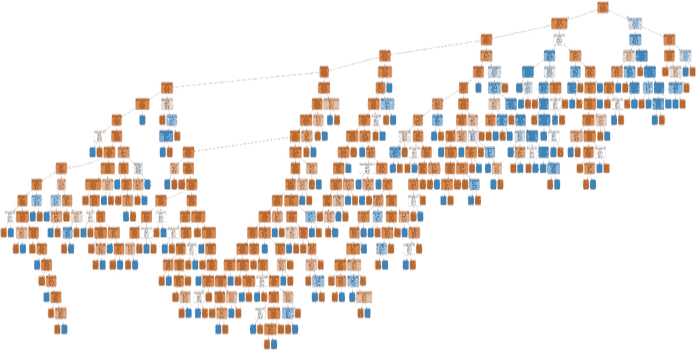

图 4-4

使用 GraphViz 的缺省模型的决策树可视化

用所有默认超参数训练的决策树将产生一个大树，并且还将导致多个规则的生成，这不仅难以解释，而且在实际项目场景中也难以实现。如图 [4-4](#Fig4) 所示的最大可能决策树是将树的最大深度参数设置为 None 的结果，这意味着您要求决策树保持增长的分支。

```py
dot_data = tree.export_graphviz(dt2, out_file=None, filled=True, rounded=True,
                                feature_names=list(xtrain.columns),
                                class_names=['yes','no'])
graph = pydotplus.graph_from_dot_data(dot_data)
display(Image(graph.create_png()))

```

```py
tree.plot_tree(dt1)
tree.plot_tree(dt2)

```

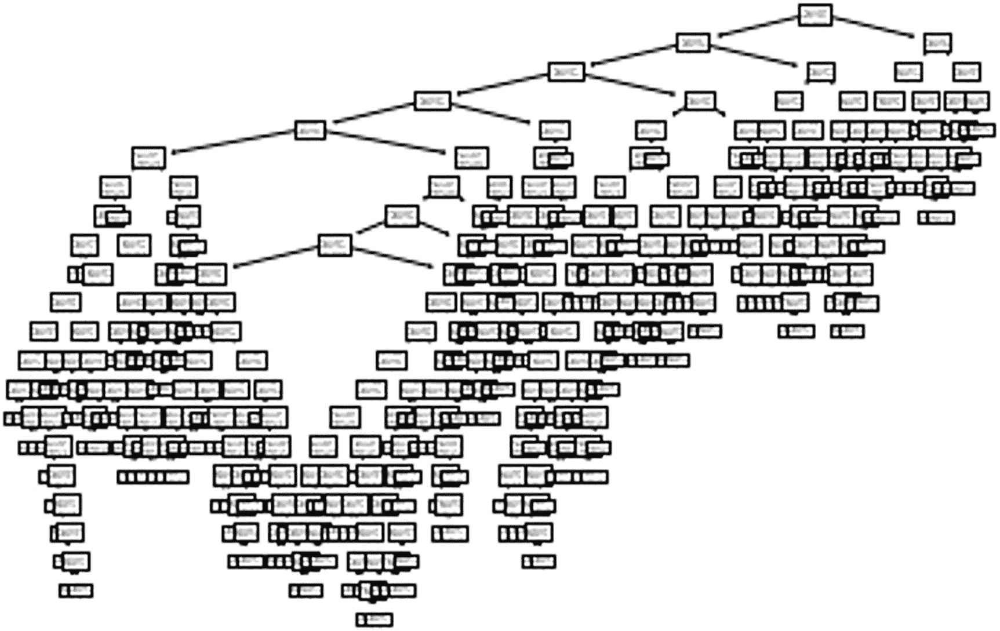

图 4-6

使用 plot_tree 方法的决策树可视化

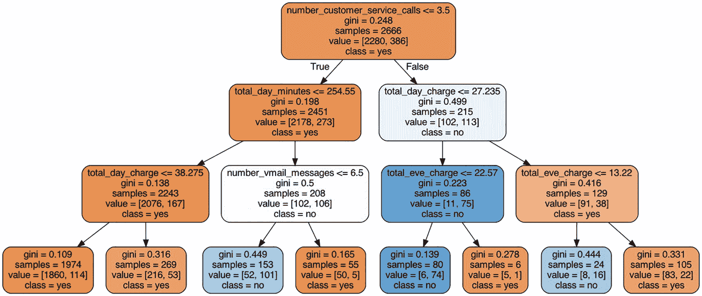

图 4-5

同一决策树模型的删减版本

图 [4-4](#Fig4) 中所示的同一型号复制在图 [4-5](#Fig5) 和 [4-6](#Fig6) 中。使用 sklearn Python 库的内置函数`plot_tree`，用另一个选项再现了后一幅图。没有区别；这只是两个图书馆的问题。如果在生产环境中 GraphViz 库安装或 Pydotplus 库安装有问题，您可以切换到绘图树功能。

dt1 模型的树太大了，任何人都很难导航和解释结果。在应用将最大深度参数限制为 3 的树修剪方法后，您可以看到一个更小的树，只有相关特征参与树的构建(图 [4-7](#Fig7) )。

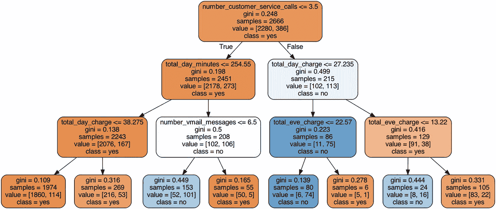

图 4-7

图 [4-5](#Fig5) 所示的决策树模型的删减版

决策树模型对象 dt2 的删减版本使用最大深度参数 3，这意味着在第三层分支之后，树应该停止进一步扩展。这个版本的模型产生了一个更小的树，具有健壮的规则作为要使用的 if/else 条件。这是避免过度拟合的最保守的决策树建模方法。

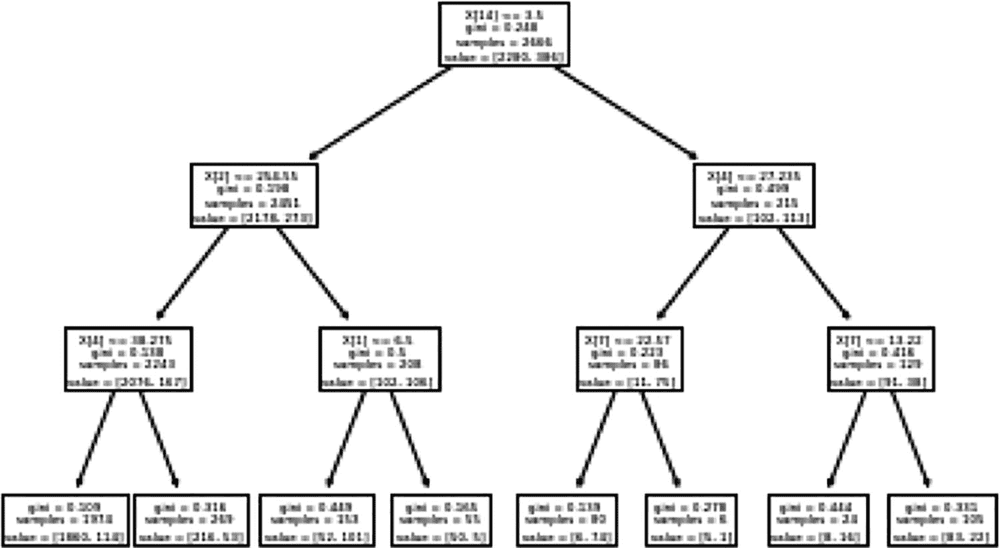

图 4-8

使用绘图树功能的修剪树视图

图 [4-8](#Fig8) 所示的决策树版本使用更少的规则，这使得更容易理解决策是如何做出的，并且更容易集成到任何生产系统中。

如果您想要解释、实现或者将决策树模型生成的规则嵌入到其他外部应用程序中，您可以通过导出规则文本来实现。

```py
from sklearn.tree import export_text
r = export_text(dt1,feature_names=list(xtrain.columns))
print(r)

```

从 dt1 模型中产生了许多难以解释的规则。让我们来看看 dt2 模型生成规则。类别 0 是无流失情形，类别 1 是可能流失客户的指示符。规则文本显示，如果一天的总费用小于或等于 44.96，客服呼叫次数小于或等于 3.5，一天的总分钟数小于或等于 223.25，则为无流失案例。类似地，相反的场景可以被解释为流失场景。您可以打印并查看下面的所有规则。

```py
from sklearn.tree import export_text
r = export_text(dt2,feature_names=list(xtrain.columns))
print(r)

|--- number_customer_service_calls <= 3.50
|   |--- total_day_minutes <= 254.55
|   |   |--- total_day_charge <= 38.27
|   |   |   |--- class: 0
|   |   |--- total_day_charge >  38.27
|   |   |   |--- class: 0
|   |--- total_day_minutes >  254.55
|   |   |--- number_vmail_messages <= 6.50
|   |   |   |--- class: 1
|   |   |--- number_vmail_messages >  6.50
|   |   |   |--- class: 0
|--- number_customer_service_calls >  3.50
|   |--- total_day_charge <= 27.24
|   |   |--- total_eve_charge <= 22.57
|   |   |   |--- class: 1
|   |   |--- total_eve_charge >  22.57
|   |   |   |--- class: 0
|   |--- total_day_charge >  27.24
|   |   |--- total_eve_charge <= 13.22
|   |   |   |--- class: 1
|   |   |--- total_eve_charge >  13.22
|   |   |   |--- class: 0

```

dt1 模型的特征重要性如下所示。

```py
list(zip(dt1.feature_importances_,xtrain.columns))

[(0.04051943775304626, 'account_length'),
 (0.08298083105277364, 'number_vmail_messages'),
 (0.0644144400251063, 'total_day_minutes'),
 (0.028172622004021135, 'total_day_calls'),
 (0.20486110565087778, 'total_day_charge'),
 (0.10259170929879882, 'total_eve_minutes'),
 (0.03586253729017199, 'total_eve_calls'),
 (0.0673761405897894, 'total_eve_charge'),
 (0.0613662104733965, 'total_night_minutes'),
 (0.05654698887273517, 'total_night_calls'),
 (0.03894924950827072, 'total_night_charge'),
 (0.01615654226052593, 'total_intl_minutes'),
 (0.039418913794511345, 'total_intl_calls'),
 (0.02842685405881307, 'total_intl_charge'),
 (0.11203068621155501, 'number_customer_service_calls'),
 (0.020325731155606916, 'area_code_tr')]

# extract the arrays that define the tree
children_left = dt2.tree_.children_left
children_right = dt2.tree_.children_right
children_default = children_right.copy() # because sklearn does not use missing values
features = dt2.tree_.feature
thresholds = dt2.tree_.threshold
values = dt2.tree_.value.reshape(dt2.tree_.value.shape[0], 2)
node_sample_weight = dt2.tree_.weighted_n_node_samples

print("     children_left", children_left)
# note that negative children values mean this is a leaf node
print("    children_right", children_right)
print("  children_default", children_default)
print("          features", features)
print("        thresholds", thresholds.round(3))
print("            values", values.round(3))
print("node_sample_weight", node_sample_weight)

```

决策树分类器模型有一个名为`tree_`的属性，它允许您获得关于模型对象的详细解释。它以并行数组的形式存储整个二叉树结构。节点 0 是根节点，其余参数在表 [4-2](#Tab2) 中解释。左子节点或右子节点的 ID，只要它呈现负值，如-1，就意味着它是一个叶节点，决策树在此终止。

表 4-2

决策树的低级属性提取

<colgroup><col class="tcol1 align-left"> <col class="tcol2 align-left"></colgroup> 
| 

因素

 | 

说明

 |
| --- | --- |
| `dt2.tree_.node_count` | 树中的节点总数 |
| `tree_.children_left[i]` | 节点 I 左侧子节点的 Id |
| `tree_.children_right[i]` | 节点 I 的右子节点的 Id |
| `tree_. feature[i]` | 用于分割节点 I 的特征 |
| `tree_.threshold[i]` | 节点 I 的阈值 |
| `tree_.n_node_samples[i]` | 到达节点 I 的训练样本的数量 |
| `tree_. impurity[i]` | 节点 I 处的杂质 |
| `tree_.weighted_n_node_samples` | `n_node_samples`是每个节点中实际数据集样本的计数。`weighted_n_node_samples`相同，由`class_weight`和/或`sample_weight`加权。 |

```py
# define a custom tree model
tree_dict = {
    "children_left": children_left,
    "children_right": children_right,
    "children_default": children_default,
    "features": features,
    "thresholds": thresholds,
    "values": values,
    "node_sample_weight": node_sample_weight
}
model = {
    "trees": [tree_dict]
}

import shap
explainer = shap.TreeExplainer(model)

# Provide Probability as Output
def model_churn_proba(x):
    return dt2.predict_proba(x)[:,1]

# Provide Log Odds as Output
def model_churn_log_odds(x):
    p = dt2.predict_log_proba(x)
    return p[:,1] - p[:,0]

# make a standard partial dependence plot
sample_ind = 25
fig,ax = shap.partial_dependence_plot(
    "total_day_minutes", model_churn_proba, X, model_expected_value=True,
    feature_expected_value=True, show=False, ice=False
)

```

## 决策树–SHAP

SHAP Python 库可以用来解释决策树。SHAP 库有一些有用的函数，为模型的可解释性提供了额外的见解。

```py
import shap
explainer = shap.TreeExplainer(model)
# Provide Probability as Output
def model_churn_proba(x):
    return dt2.predict_proba(x)[:,1]

# Provide Log Odds as Output
def model_churn_log_odds(x):
    p = dt2.predict_log_proba(x)
    return p[:,1] - p[:,0]
# make a standard partial dependence plot
sample_ind = 25
fig,ax = shap.partial_dependence_plot(
    "total_day_minutes", model_churn_proba, X, model_expected_value=True,
    feature_expected_value=True, show=False, ice=False
)

```

## 部分相关图

部分依赖图(PDP)用于可视化特征和目标列或响应列之间的交互。目标列有两个标签:0 表示无流失案例，1 表示流失案例。使用预测概率函数时，您可以生成类 0 和类 1 的概率。

```py
pd.DataFrame(dt2.predict_proba(X)) # 0 - No Churn, 1- Churn
model_churn_proba(X).max()
model_churn_proba(X).mean()
model_churn_proba(X).min()

```

在上面的脚本中，有一个函数用于选择第 1 列，这是客户流失的概率。例如，第一条记录显示概率为 0.090909，这意味着客户流失的几率小于 10%。你可以断定这是一个没有客户流失的样本。在下面的脚本中，`model_churn_proba`只显示了第二列的流失概率。

在根据全天分钟特性绘制流失概率图之前，如图 [4-10](#Fig10) 中的 PDP 图所示，您应该使用分布图来查看流失概率的分布。这将有助于你理解部分依赖图。概率分布如图 [4-9](#Fig9) 所示。

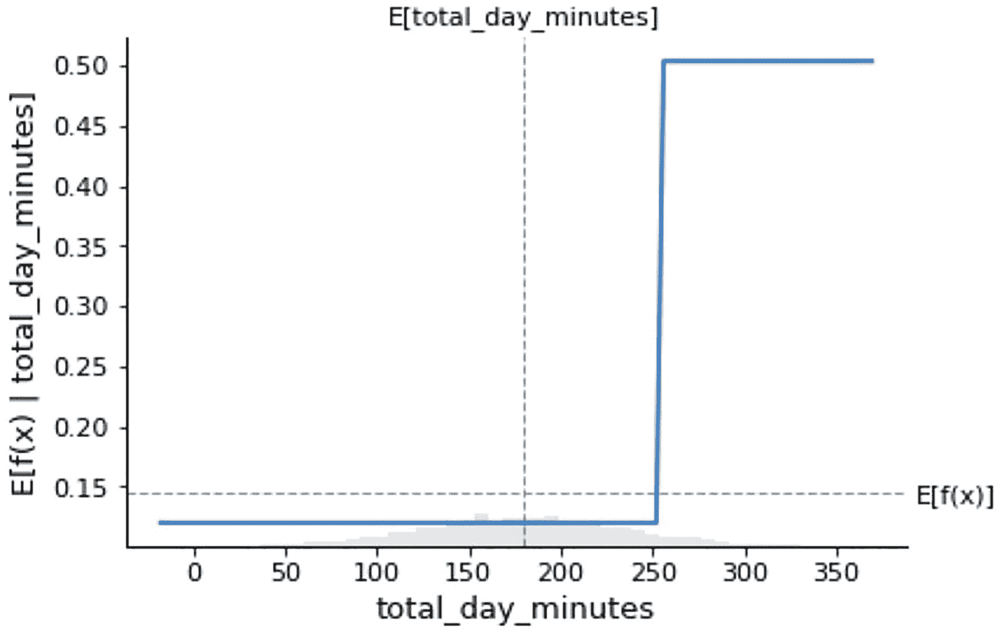

图 4-10

全天分钟数和客户流失概率

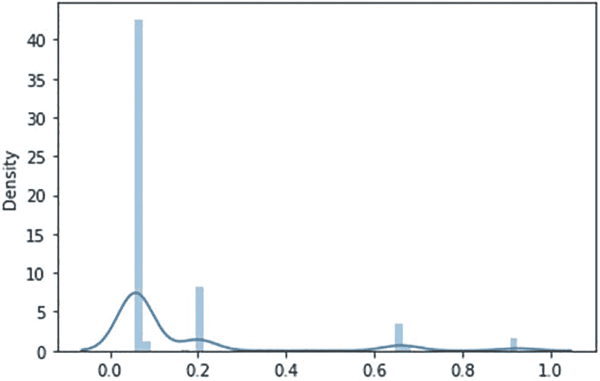

图 4-9

决策树模型中客户流失概率的分布

```py
import seaborn as sns
sns.distplot(model_churn_proba(X))
pd.DataFrame(model_churn_proba(X))
from sklearn.inspection import plot_partial_dependence
xtrain.columns
plot_partial_dependence(dt2, X, ['account_length', 'number_vmail_messages', 'total_day_minutes'])

plot_partial_dependence(dt2, X, [
       'total_day_calls', 'total_day_charge', 'total_eve_minutes',
  ])
plot_partial_dependence(dt2, X, [
       'total_eve_calls', 'total_eve_charge', 'total_night_minutes'])

```

图 [4-10](#Fig10) 中的图表上显示的日总分钟数和日总分钟数的期望值是分段线性的，但是当你看整条蓝线时，它不是线性的。这是 25 号样品的局部解释。总日分钟数是一个数字，在定型数据集中被视为一个连续列。对于相同的样本观察 25，语音邮件消息的数量也影响该特征对流失预测的边际贡献。在图 [4-10](#Fig10) 中，如果用户总共花费了 225 分钟，那么客户流失的概率将小于或等于客户流失的平均概率，即 14.25。即使在一天的总时间超过 225 分钟的情况下，客户流失的可能性仍然低于 25%。

```py
# make a standard partial dependence plot
sample_ind = 25
fig,ax = shap.partial_dependence_plot(
    "number_vmail_messages", model_churn_proba, X, model_expected_value=True,
    feature_expected_value=True, show=False, ice=False
)

```

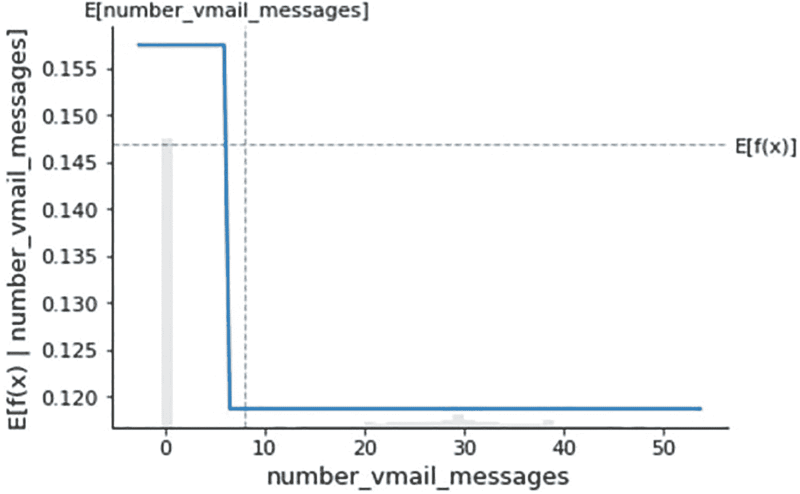

图 4-11

有流失可能性的语音邮件消息数量的 PDP

当你看账户长度对流失预测的边际贡献和账户长度的关系时，你可以看到一条蓝色的平行线(图 [4-11](#Fig11) )。这表明不管账户长度如何，边际贡献保持不变，这表明该特征没有预测价值，不重要，并且在流失预测模型中不起作用。

```py
# make a standard partial dependence plot
sample_ind = 25
fig,ax = shap.partial_dependence_plot(
    "account_length", model_churn_proba, X, model_expected_value=True,
    feature_expected_value=True, show=False, ice=False
)

```

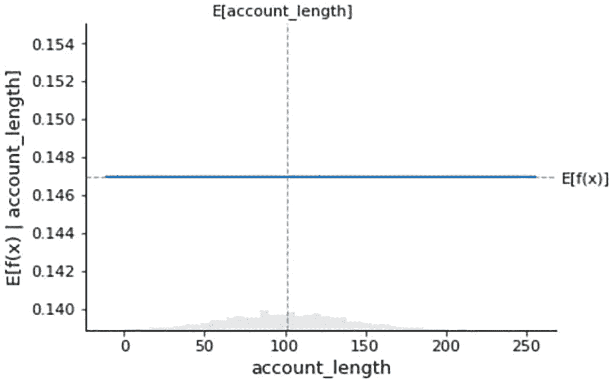

图 4-12

账户长度特性的 PDP

账户长度的 PDP 对客户流失的可能性没有影响，这从图 [4-12](#Fig12) 中的蓝色直线可以清楚地看出。蓝线表示流失值的平均概率。

```py
# make a standard partial dependence plot
sample_ind = 25
fig,ax = shap.partial_dependence_plot(
    "number_customer_service_calls", model_churn_proba, X, model_expected_value=True,
    feature_expected_value=True, show=False, ice=False
)

```

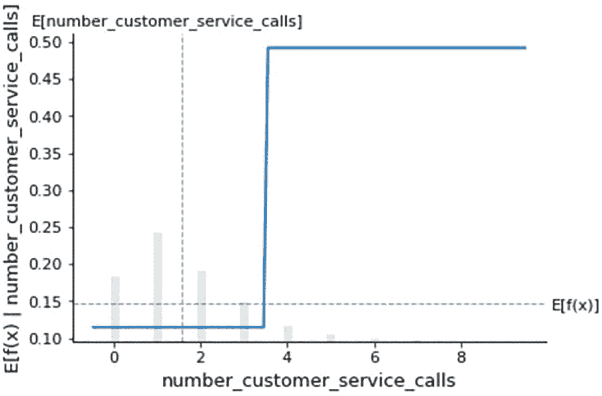

图 4-13

客户服务电话数量的 PDP

需要注意的是，客服电话数量越多，客户流失的概率就越高。这是因为有人面临问题，这就是客户服务电话数量上升的原因。你可以在图 [4-13](#Fig13) 中看到同样的模式:四次以上的通话增加了流失的概率。

```py
# make a standard partial dependence plot
sample_ind = 25
fig,ax = shap.partial_dependence_plot(
    "total_day_charge", model_churn_proba, X, model_expected_value=True,
    feature_expected_value=True, show=False, ice=False
)

```

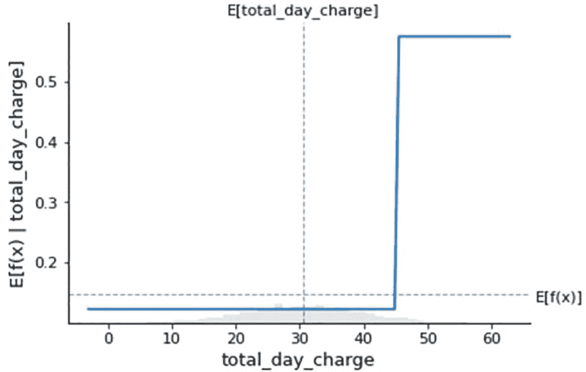

图 4-14

总日费用的 PDP

如果一天的总费用超过 45 美元，那么流失的概率会更高(图 [4-14](#Fig14) )。这是因为收费较高；用户将被迫选择替代提供商。

```py
# make a standard partial dependence plot
sample_ind = 25
fig,ax = shap.partial_dependence_plot(
    "total_eve_minutes", model_churn_proba, X, model_expected_value=True,
    feature_expected_value=True, show=False, ice=False
)

```

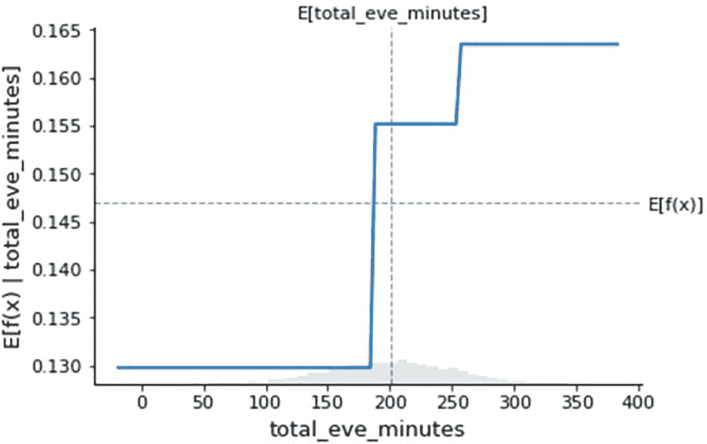

图 4-15

总晚间分钟数 PDP

晚上的总时间对客户流失的可能性有一些影响，但这并不会使用户从无客户流失的情况变成有客户流失的情况(图 [4-15](#Fig15) )。客户流失的可能性非常低，在总共 180 分钟的晚间时间里保持不变，为 13%。超过 180 分钟时，客户流失的概率会略微增加到 15.5%。在 250 分钟时和 250 分钟后，这种可能性增加到 16.5%，相对来说非常低。

```py
# make a standard partial dependence plot
sample_ind = 25
fig,ax = shap.partial_dependence_plot(
    "total_eve_calls", model_churn_proba, X, model_expected_value=True,
    feature_expected_value=True, show=False, ice=False
)

```

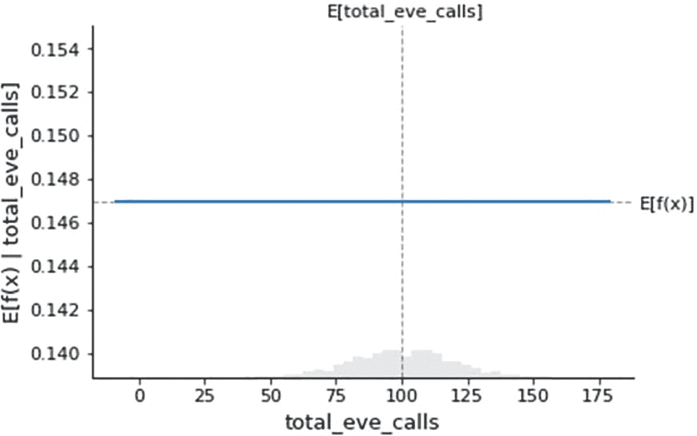

图 4-16

晚间通话总数的 PDP

晚间通话总量对客户流失的概率没有影响，因为无论晚间通话总量增加多少，客户流失的概率都保持在平均概率值不变(图 [4-16](#Fig16) )。表 [4-3](#Tab3) 显示了每个特征的特征重要性分数。

表 4-3

每个功能的功能重要性分数

<colgroup><col class="tcol1 align-left"> <col class="tcol2 align-left"> <col class="tcol3 align-left"></colgroup> 
| 

功能名称

 | 

得分

 |
| --- | --- |
| **4** | 总计 _ 天 _ 费用 | 0.306375 |
| **14** | 数量 _ 客户 _ 服务 _ 呼叫 | 0.282235 |
| **2** | 总计 _ 天 _ 分钟 | 0.223336 |
| **1** | 数字邮件消息 | 0.105760 |
| **5** | 总计 _ eve _ 分钟 | 0.082294 |
| **0** | 帐户 _ 长度 | 0.000000 |
| **3** | 总计 _ 天 _ 次呼叫 | 0.000000 |
| **6** | 总通话次数 | 0.000000 |
| **7** | 总费用 | 0.000000 |
| **8** | 总计 _ 夜 _ 分钟 | 0.000000 |
| **9** | 夜间通话总数 | 0.000000 |
| **10** | 总 _ 夜 _ 费 | 0.000000 |
| **11** | total _ intl _ minutes-总计 _ intl _ 分钟 | 0.000000 |
| **12** | 总呼叫次数 | 0.000000 |
| **13** | total_intl_charge | 0.000000 |
| **15** | 区域代码 | 0.000000 |

```py
shap_values_churn.feature_names
temp_df = pd.DataFrame()
temp_df['Feature Name'] = pd.Series(X.columns)
temp_df['Score'] = pd.Series(dt2.feature_importances_.flatten())
temp_df.sort_values(by='Score',ascending=False)

```

在上图中，您看到了基于 SHAP 库的部分依赖图。使用 scikit-learn 库检查模块可以生成相同的结果。

## 使用 Scikit 的 PDP 学习

scikit-learn 模块套件中有一个新模块可以帮助您生成部分依赖图。您可以使用 scikit-learn 库中的检测模块。参见图 [4-17](#Fig17) 至 [4-22](#Fig22) 。

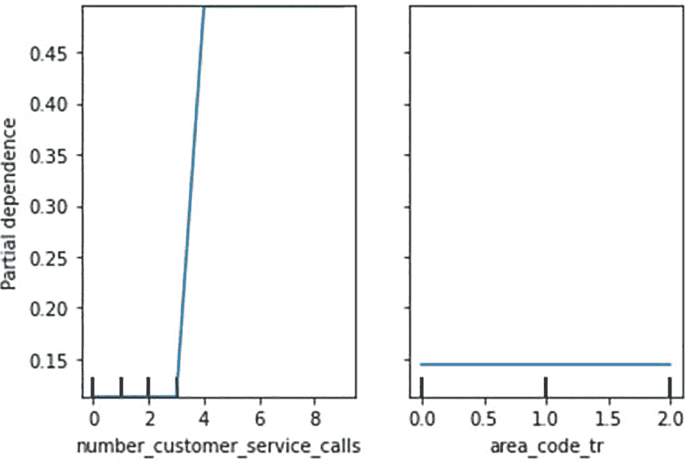

图 4-22

客户服务电话号码和区号的 PDP

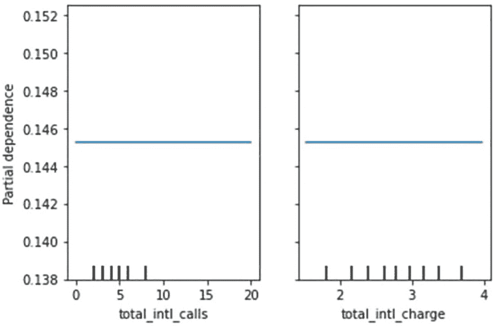

图 4-21

总国际通话和总国际费用的 PDP

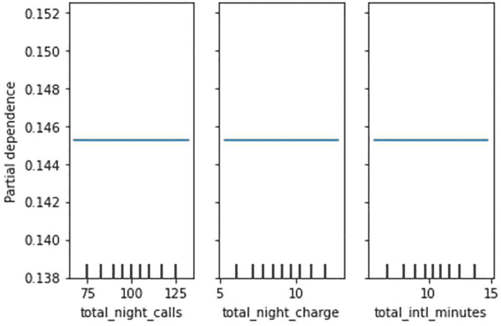

图 4-20

不影响客户流失概率的三个特性的 PDP

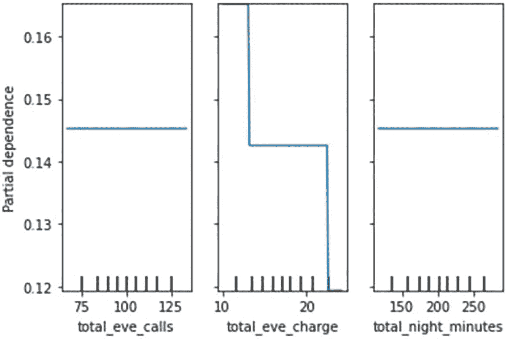

图 4-19

另外三个变量的 PDP

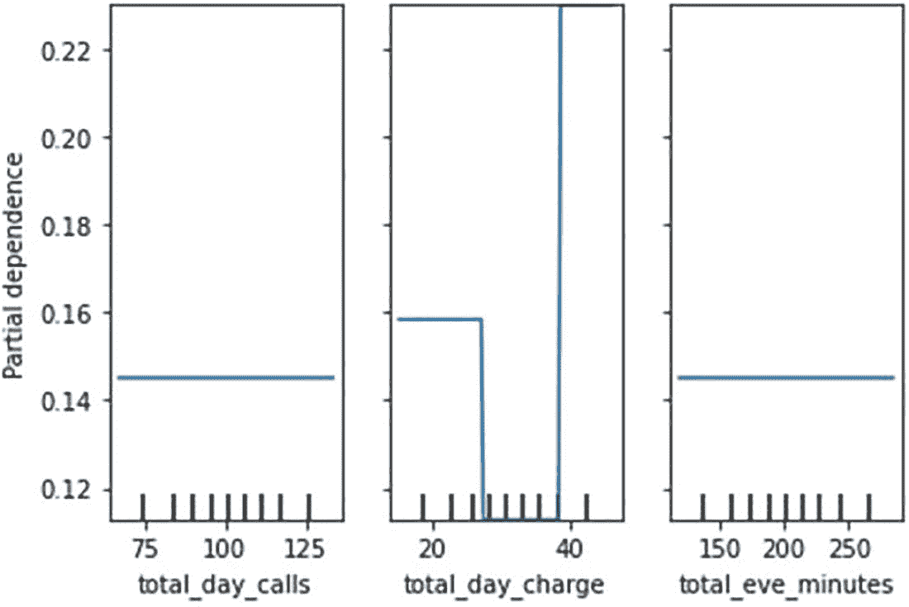

图 4-18

下一组三个功能的 PDP

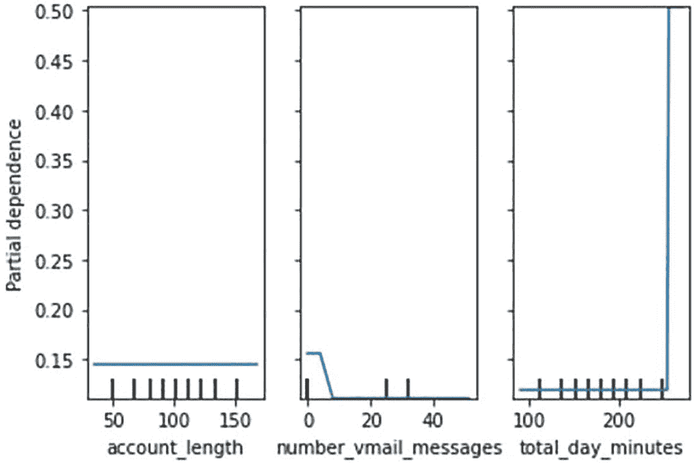

图 4-17

三个变量一起的 PDP

```py
from sklearn.inspection import plot_partial_dependence
xtrain.columns
plot_partial_dependence(dt2, X, ['account_length', 'number_vmail_messages', 'total_day_minutes'])

```

```py
plot_partial_dependence(dt2, X, [
       'total_day_calls', 'total_day_charge', 'total_eve_minutes',
  ])

```

```py
plot_partial_dependence(dt2, X, [
       'total_eve_calls', 'total_eve_charge', 'total_night_minutes'])

```

```py
plot_partial_dependence(dt2, X, [
       'total_night_calls', 'total_night_charge', 'total_intl_minutes'])

```

```py
plot_partial_dependence(dt2, X, [
       'total_intl_calls', 'total_intl_charge'])

```

```py
plot_partial_dependence(dt2,X, [
       'number_customer_service_calls', 'area_code_tr'])

```

图 [4-17](#Fig17) 到 [4-22](#Fig22) 是通过 scikit-learn 库的一部分的函数生成的，该函数产生类似于 SHAP 库的解释。解释也可以以类似的方式导出。

## 非线性模型解释-石灰

在流失预测过程中起作用的最重要的特征是全天总费用、客户服务呼叫次数、全天分钟数、语音邮件消息数和晚上分钟总数。其他功能没有作用，因此不相关功能的部分依赖图是平行线。

您还可以利用 LIME Python 库中的一些函数来解释决策树模型做出的决策。

```py
import lime
import lime.lime_tabular

explainer = lime.lime_tabular.LimeTabularExplainer(np.array(xtrain),
                    feature_names=list(xtrain.columns),
                    class_names=['target_churn_dum'],
                    verbose=True, mode='classification')
# this record is a no churn scenario
exp = explainer.explain_instance(xtest.iloc[0], dt2.predict_proba,
                                 num_features=16)
exp.as_list()
pd.DataFrame(exp.as_list())
exp.show_in_notebook(show_table=True)

```

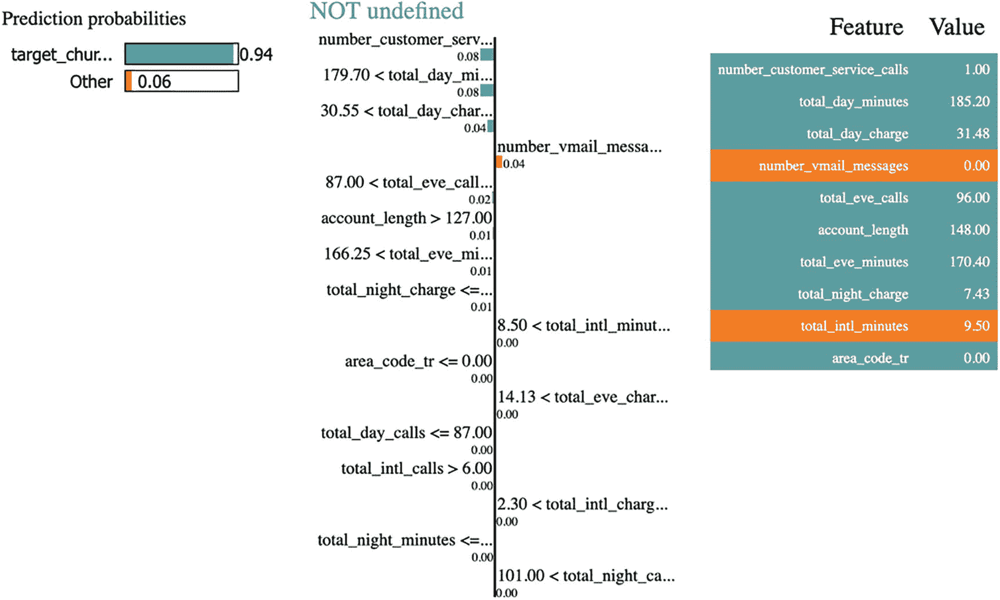

图 4-23

特征重要性以及对记录 0 的预测概率的正面和负面贡献

图 [4-23](#Fig23) 显示测试集 xtest[0]第一条记录的局部解释模型解释，图 [4-23](#Fig23) 中间的图表显示两种颜色。蓝色表示对目标流失预测概率的贡献，橙色表示对另一类的贡献，这是无流失场景。决策树以一系列值的形式生成特征，例如 179.90 到 216.20 之间的总分钟数，因为一个特征对流失概率的贡献为 0.08%(8%)。如果从客户服务呼叫的模型数量< = 1.00 和总日分钟数> 179.90 和< = 216.20 中移除两个特征，那么目标流失预测概率将减少 0.16 (16%)，即(0.94–0.08-0.08)，即 0.78 (78%)。另一方面，如果去除语音邮件消息的数量< =0.00，那么目标流失概率增加 4% (0.04)。图 [4-23](#Fig23) 中的第三表显示了每个特征对预测的贡献值。可以对更少的记录进行类似的分析和解释，如图 [4-24](#Fig24) 至 4-26 所示。

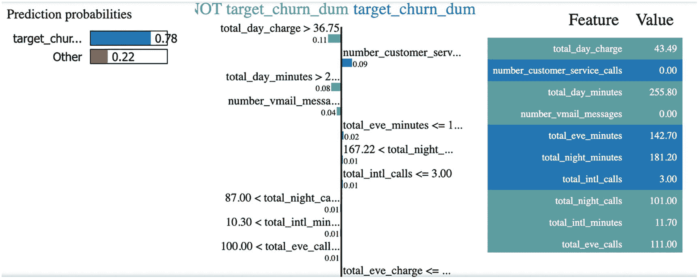

图 4-25

所有记录的特征重要性以及对预测概率的正面和负面贡献

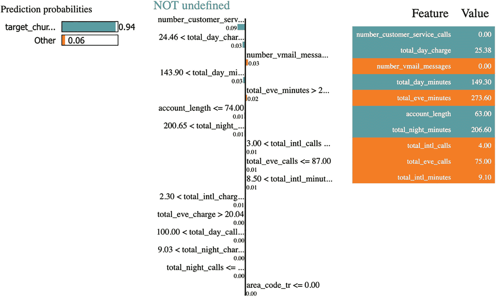

图 4-24

特征重要性以及对记录号 20 的预测概率的正面和负面贡献

```py
# This is s churn scenario
exp = explainer.explain_instance(xtest.iloc[20], dt2.predict_proba, num_features=16)
exp.as_list()
exp.show_in_notebook(show_table=True)

```

```py
xtest.iloc[20]
ytest.iloc[20]
dt2.predict(xtest)[20]
explainer = lime.lime_tabular.LimeTabularExplainer(np.array(xtrain),
                    feature_names=list(xtrain.columns),
                    class_names=['target_churn_dum'],
                    verbose=True, mode='classification')
# Code for SP-LIME
import warnings
from lime import submodular_pick

# SP-LIME returns exaplanations on a sample set to provide a non redundant global decision boundary of original model
sp_obj = submodular_pick.SubmodularPick(explainer, np.array(xtrain),
                                        dt2.predict_proba,
                                        num_features=14,
                                        num_exps_desired=10)

```

## 非线性解释-目的-规则

还有另一个名为 Skope-rules 的可解释库，可用于从训练模型中生成规则，这些规则可用于对任何新数据集进行预测。

以下代码可用于安装基于 Python 的库。参数见表 [4-4](#Tab4) 。

表 4-4

解释 Skope-Rules 参数

<colgroup><col class="tcol1 align-left"> <col class="tcol2 align-left"></colgroup> 
| 

因素

 | 

说明

 |
| --- | --- |
| `feature_names` | 用于以字符串格式返回规则的每个功能的名称 |
| `precision_min` | 要选择的规则的最小精度 |
| `recall_min` | 要选择的规则的最小召回 |
| `n_estimators` | 用于预测的基本估计量(规则)的数量 |
| `max_depth_duplication` | 规则重复数据删除的决策树的最大深度 |
| `max_depth` | 决策树的最大深度 |
| `max_samples` | 从 X 中抽取的用于训练每个决策树的样本数，从中生成和选择规则 |

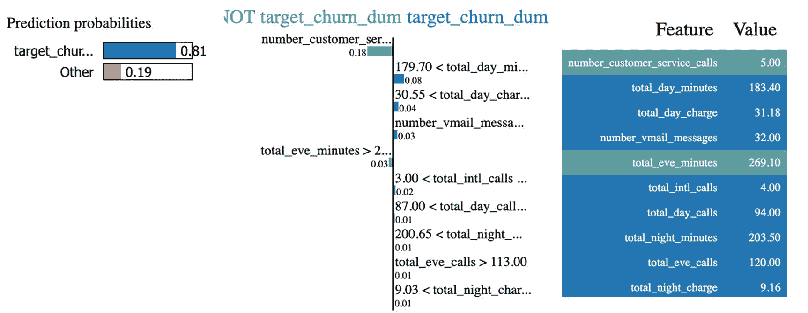

图 4-26

特征重要性以及对所有记录的预测概率的正面和负面贡献

```py
!pip install skope-rules
import six
import sys
sys.modules['sklearn.externals.six'] = six
import skrules
from skrules import SkopeRules
clf = SkopeRules(max_depth_duplication=2,
                 n_estimators=30,
                 precision_min=0.3,
                 recall_min=0.1,
                 feature_names=list(xtrain.columns))
clf
clf.fit(xtrain,ytrain)
print('The 5 most precise rules are the following:')
for rule in clf.rules_[:5]:
    print(rule[0])

```

使用`clf.fit()`方法可以训练决策树模型，并且可以得出以下规则。可以使用精度和召回参数来过滤或管理规则。如果将阈值降低到较低的水平，则意味着将生成大量规则，这对用户没有任何用处，因为假阳性规则将进入业务应用程序。更高的阈值将减少规则的数量，并且只有最相关的规则将被用在业务应用中。

五个最精确的规则如下:

```py
number_vmail_messages <= 5.5 and number_customer_service_calls <= 3.5 and total_day_minutes > 249.70000457763672

number_vmail_messages <= 6.5 and total_day_charge > 44.989999771118164 and total_eve_minutes > 145.39999389648438

number_customer_service_calls > 3.5 and total_day_minutes <= 263.5500030517578 and total_day_charge <= 29.514999389648438

number_customer_service_calls <= 3.5 and total_day_minutes > 245.0999984741211 and total_eve_minutes > 204.20000457763672

number_customer_service_calls > 3.5 and total_day_charge <= 30.65999984741211

clf.predict(xtest)
clf.predict_top_rules(xtest,5)
clf.score_top_rules(xtest)

```

`predict`函数使用所有规则来预测目标客户流失类别:0 表示没有客户流失，1 表示客户流失。

`predict_top_rules`函数用于利用五个规则来预测结果。五是用于预测的规则数量。如果 n_rules 中性能最好的规则之一被激活，则预测等于 1。对于每个观察值，该函数会根据所选的规则告知是否应该将其视为异常值(1 或 0)。

```py
clf.decision_function(xtrain)
clf.decision_function(xtest)

```

得分最高的规则，代表基本分类器(规则)之间的排序。当执行规则检测到实例时，得分较高。正分数代表异常值，空分数代表内值。

决策函数是输入样本的异常分数，并被计算为二元规则输出的加权和，权重是每个规则的相应精度。对于输入样本的异常分值，越高越异常。正分数代表异常值，空分数代表内值。

## 结论

在本章中，您学习了如何解释非线性模型，特别是决策树模型，而不是用于二元分类的逻辑回归。以类似的方式，决策树模型可以用于回归模型，也可以扩展到多项式分类。非线性模型更容易解释，每个人都知道这些模型是如何使用简单的 if/then else 规则工作的。因此，在基于树的非线性模型中存在高度信任。在这一章中，你从不同的角度看了如何使用可解释的人工智能库为非线性模型创建视图，比如莱姆、SHAP 和斯科普规则。在下一章，你将学习集合模型的模型可解释性。