# 7.自然语言处理的可解释性

本章解释了 ELI5 和 SHAP 可解释的基于人工智能的 Python 库与基于自然语言处理(NLP)的任务(如文本分类模型)的使用。机器学习模型为监督学习任务做出的预测决策是非结构化数据。文本分类是一项任务，您需要将文本句子或短语作为输入，并将它们分类到离散的类别中。一个例子是新闻分类，其中内容被用作输入，输出被分类为政治、商业、体育、技术等等。一个类似的用例是电子邮件分类中的垃圾邮件检测，其中电子邮件内容被用作输入，并被分类为垃圾邮件或非垃圾邮件。在这种情况下，知道一封电子邮件是否被归类为垃圾邮件是很重要的，那么为什么呢？内容中存在的哪些标记实际上导致了预测？这是最终用户感兴趣的。当我在这里说 NLP 任务时，有许多任务，但我将它限制在文本分类用例以及类似的用例，如实体识别、词性标注和情感分析。

## 自然语言处理任务

今天，整个世界通过万维网联系在一起。非结构化文本数据无处不在。它存在于社交媒体、电子邮件对话、通过各种应用程序的聊天、基于 HTML 的页面、word 文档、客户服务中心支持单、在线调查回复等等。以下是一些与非结构化数据相关的使用案例:

*   文档分类，其中输入是文本文档，输出可以是二进制类或多类标签。

*   有时，如果情感被标记，那么情感也遵循文档分类用例。否则，情感分类将是基于词典的分类。

*   命名实体识别(NER)模型，其中输入是文本文档，输出是命名实体类。

*   文本摘要，其中大文本被压缩并以紧凑的形式表示。

在 NLP 文本分类、NER 模型中，下一个词预测是常见的，其中输入是句子或词向量，输出是需要分类或预测的标签。在机器学习时代之前，文本分类任务是相当人工的，一组注释者用来阅读、理解文档中表达的文本的含义，并将其附加到一个类。随着非结构化数据的大规模爆炸，这种手动分类数据的方式变得非常困难。现在，一些带注释的数据可以输入到机器中，学习算法可以被训练，以便将来训练好的模型可以用来进行预测。

## 文本分类的可解释性

非结构化文档或输入文本向量是高度多维的。需要解释用于对文档进行分类的预测模型，因为需要向最终用户展示预测背后的原因或预测类别背后的特征。在文本分类的情况下，该模型预测类别 1 对类别 2，因此了解实际上对类别 1 是正面的对类别 1 是负面的关键词是很重要的。在多类分类中，这变得更加复杂，因为您需要解释导致特定类预测的所有关键字。在本章中，您将会看到这两种情况。

图 [7-1](#Fig1) 显示了将 XAI 加入文本分类模型所需的步骤。

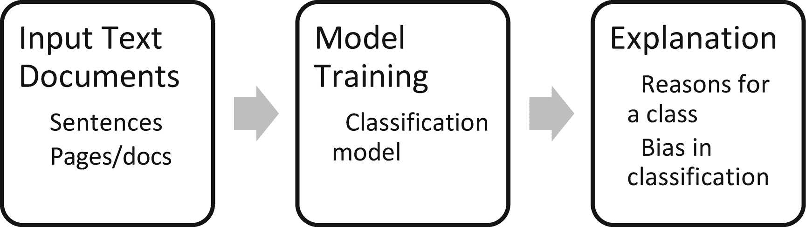

图 7-1

文本解释中涉及人工智能模型的步骤

输入文本以向量的形式表示，并且使用文档术语矩阵来开发分类模型，并且最终需要使用可解释性库来解释预测的类别，以便知道负责预测特定类别标签的特征或单词。

## 文本分类数据集

在本章中，您将使用来自 [`http://ai.stanford.edu/~amaas/data/sentiment/`](http://ai.stanford.edu/%257Eamaas/data/sentiment/) 的大型电影评论数据集。这个数据集有 50，000 条评论，其中 25，000 条已经被贴上了二元分类标签，例如正面或负面评论。它还有另外 25，000 条用于测试目的的评论。您将使用此数据集创建一个文本分类模型来预测电影评论。预测后你要分析预测的原因，并进一步解释这个文本分类机器学习模型的特征和其他可解释元素的重要性。在这项任务中，你向机器学习模型提供评论句子，该模型预测情绪是积极的还是消极的。因此，ML 模型在这里被认为是一个黑盒模型。这就引出了一个问题，人们怎么能相信黑盒模型的结果呢？

```py
import warnings
warnings.filterwarnings("ignore")
import pandas as pd
from keras.datasets import imdb
imdb = pd.read_csv('IMDB Dataset.csv')
imdb.head()

```

IMDB 电影数据集包含评论和观点。情感被贴上积极和消极的标签，这是一个二元的阶级标签系统。审查得到清理，停用词被删除，文本被转换成向量。以下脚本显示了使用 sklearn 库的函数`train-test-split`将数据集分割成训练和测试数据集:

```py
from sklearn.model_selection import train_test_split
from sklearn.feature_extraction.text import CountVectorizer
from sklearn.linear_model import LogisticRegressionCV
from sklearn.pipeline import make_pipeline
vec = CountVectorizer()
clf = LogisticRegressionCV()
clf.fit(vec,imdb.sentiment)

```

要将数据分布到训练集和测试集中，可以使用 sklearn 库中的`train-test-split`函数。计数矢量器转换记号并将记号表示为矢量，这是来自语料库的文档术语矩阵表示。计数向量被初始化并存储在`vec`中，然后带有交叉验证的逻辑回归模型被初始化以开发训练模型。初始化后的对象存储在`clf`中。最后一步是使用`fit`方法训练模型。

管道是一种方法，其中所有的预处理步骤、模型训练步骤和验证步骤都可以排序并触发一次。在这个管道中，您将文本数据从单词转换为计数向量，然后通过一个分类器。文本句子首先被转换成结构化数据表。这是通过计算每个句子中出现的单词来实现的。在上面的例子中，评审被认为是文档。每个文档都被解析成单词。从所有评论中收集唯一的单词列表，然后每个单词被认为是一个特征。如果你对各种评论中的每个词进行计数，这就叫做计数矢量器。由于这是一个电影评论情感分析数据集，它被分为正面类和负面类，这导致了二元分类问题。管道存储转换序列和训练步骤，并通过调用 sklearn 库中的`fit`方法来执行。

```py
from sklearn import metrics

def print_report(pipe):
    y_test = imdb.sentiment
    y_pred = pipe.predict(imdb.review)
    report = metrics.classification_report(y_test, y_pred)
    print(report)
    print("accuracy: {:0.3f}".format(metrics.accuracy_score(y_test, y_pred)))

print_report(pipe)

```

在上面这段脚本中，您预测了测试数据集上的情感，并计算了分类准确性的误差度量。在这个例子中，分类精度是 95%，这是一个非常好的精度。

## 解释如何使用 ELI5

为了解释文本分类模型，你需要安装可解释的 AI (XAI)库 ELI5。它被称为*解释它就像我是 5* 一样。这个库可以使用 pip install 或者使用来自 Anaconda 发行版的 conda install 来安装。

```py
!pip install eli5
import eli5
eli5.show_weights(clf, top=10) #this result is not meaningful, as weight and feature names are not there

```

一旦安装了这个库，您就可以编写一个 import 语句来调用这个库。

```py
eli5.show_weights(clf,feature_names=vec.get_feature_names(),target_names=set(imdb.sentiment))
#make sense

```

基本线性分类器的 ELI5 模块的结果没有意义。它提供重量和功能。功能名称没有意义。为了使它们有意义，您可以传递特性名和目标名。

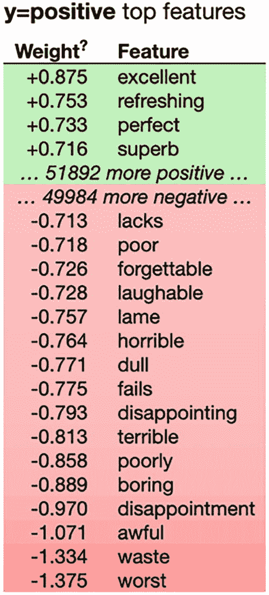

图 7-2

从正面情感类别的模型中提取的特征

图 [7-2](#Fig2) 中绿色的特征是目标类的正特征，红色的是支持另一类的负特征。特征权重和权重值一起指示了特征在将情感分类到一个类别中的相对重要性。

## 计算局部解释的特征权重

使用决策路径计算特征权重。决策路径遵循一系列 if/else/then 语句，这些语句从树的根到树的分支连接预测的类。在上面的例子中，逻辑回归被用作训练情感分类器的模型，因此权重是逻辑回归模型的系数。对于像随机森林或梯度推进模型这样的复杂模型，遵循树的决策路径。基本上，权重是您在模型训练阶段使用的估计参数。

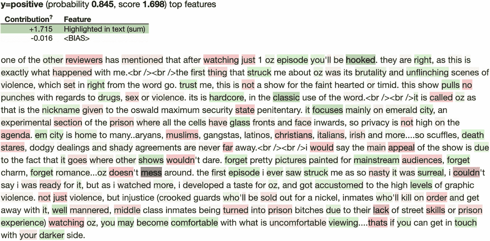

图 7-3

为了更清楚起见，标出句子的重要特征

### 本地解释示例 1

```py
eli5.show_prediction(clf, imdb.review[0], vec=vec,
                     target_names=set(imdb.sentiment))        # explain local prediction

```

偏差是逻辑回归分类器的截距项。我们可以使用计数矢量器和线性分类器，因此映射非常清楚，因为每个单词的权重对应于线性分类器的系数。为了解释单个电影评论，这被称为本地解释，您可以通过放映预测函数传递它。因为它是一个二元分类器，所以可以计算对数概率。对数赔率为 1.698。如果您使用公式 exp(对数赔率)/1+exp(对数赔率)，那么您将得到概率值 0.845。有 84.5%的几率是，评论[0]属于积极情绪。图 [7-3](#Fig3) 中突出显示的绿色文本指向正的对数优势分数，红色文本降低对数优势分数。总贡献是绿色和红色文本的贡献之和，最终结果是对数优势分数。

### 本地解释示例 2

同样，你也可以解释 123 号和 100 号评论。评论 123 被分类为负面的，并且负面类别的概率是 0.980。评论号 100 被分类为阳性，概率值为 0.670。见图 [7-4](#Fig4) 。

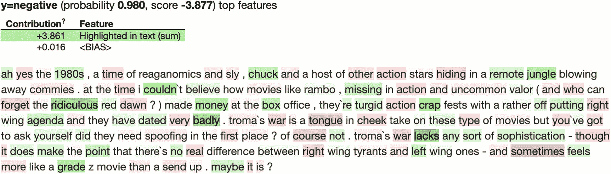

图 7-4

负类预测的局部解释

```py
eli5.show_prediction(clf, imdb.review[123], vec=vec,
                     target_names=set(imdb.sentiment)) # explain local prediction

```

### 局部解释示例 3

在示例 1 中，您查看了第一条记录，其中肯定类别的概率超过 80%。在示例 2 中，负类的概率是 98%。用绿色突出显示的单词有助于预测的负类。见图 [7-5](#Fig5) 。

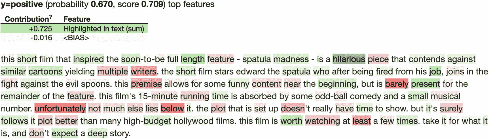

图 7-5

正类和负类的特征突出显示

```py
eli5.show_prediction(clf, imdb.review[100], vec=vec,
                     target_names=set(imdb.sentiment)) # explain local prediction

```

### 停用词删除后的解释

上面的分析是通过保留停用词来完成的，以便保留文本输入的上下文。如果从输入文本中移除停用词，那么将从输入向量中移除一些冗余特征。你将能够得到更有意义的特征的解释。偏差是模型中的截距项。在上面的脚本中，您查看了没有停止单词移除的单词包。

```py
vec = CountVectorizer(stop_words='english')
clf = LogisticRegressionCV()
pipe = make_pipeline(vec, clf)
pipe.fit(imdb.review, imdb.sentiment)

print_report(pipe)

```

表 7-1

细化处理后的分类器模型精度如表 [7-1](#Tab1) 所示

<colgroup><col class="tcol1 align-center"> <col class="tcol2 align-center"></colgroup> 
|  |

你试过线性分类器。随着模型复杂度的增加，可以获得更精确的令牌和更精确的上下文。见表 [7-1](#Tab1) 。例如，您将逻辑回归模型更新为具有交叉验证的逻辑回归模型。您可以看到 0 号评论有一个更精确的概率分数，为 78.7%，比早期的模型略低。

```py
eli5.show_prediction(clf, imdb.review[0], vec=vec,
                     target_names=set(imdb.sentiment),
                     targets=['positive'])

```

电影评论文本(图 [7-6](#Fig6) )显示了一些关键词的重复。如果有太多的重复，那么计数将在计数矢量器中膨胀。如果有许多单词的计数被夸大，那么它将反映特征重要性列表中的特征。为了避免计数矢量器中较高字数的影响，您必须应用归一化方法，以便所有特征在分类过程中获得同等的重要性。为了做到这一点，您可以引入一个新的矢量器，称为*术语频率和逆文档频率*，通常称为(tf-idf)矢量器。可以用下面的公式计算 tf-idf 的值:

> *第 j 个文档中第 I 个单词的 Tf-idf 值=第 j 个文档中第 I 个单词的词频* log(文档总数/包含第 I 个单词的文档数)*

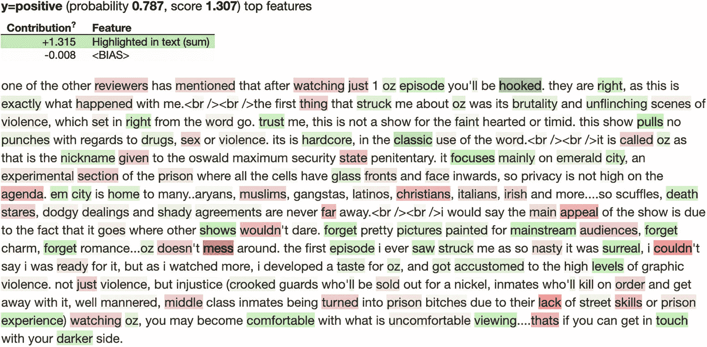

图 7-6

正面类的突出特征重要性

tf-idf 函数在从文本模块提取特征时可以从 sklearn 库中容易地获得。您不必为语料库计算 tf-idf 值；您可以应用以下方法:

```py
from sklearn.feature_extraction.text import TfidfVectorizer

vec = TfidfVectorizer()
clf = LogisticRegressionCV()
pipe = make_pipeline(vec, clf)
pipe.fit(imdb.review, imdb.sentiment)

print_report(pipe)

```

表 7-2

基于 tf-idf 矢量器的模型的分类报告

<colgroup><col class="tcol1 align-center"> <col class="tcol2 align-center"></colgroup> 
| 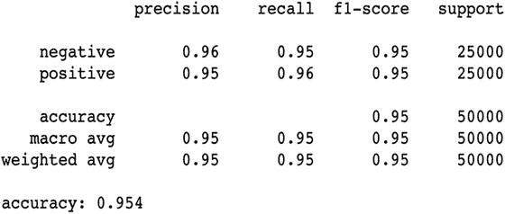 |

根据表 [7-2](#Tab2) 和图 [7-7](#Fig7) 可知，应用 tf-idf 变换后，模型精度没有明显差异。然而，概率值变化不大，分数也变化不大。

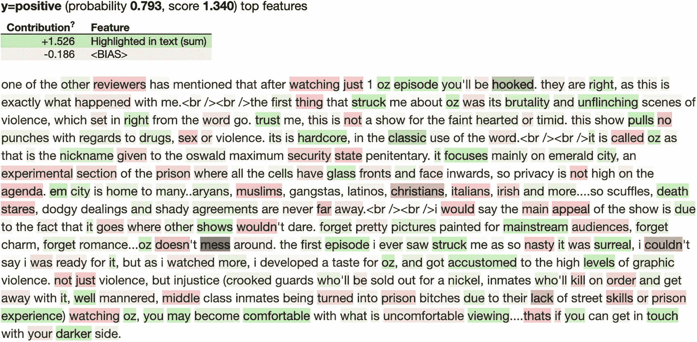

图 7-7

tf-idf 应用后阳性类的特征突出

```py
eli5.show_prediction(clf, imdb.review[0], vec=vec,
                     target_names=set(imdb.sentiment),
                     targets=['positive'])

```

```py
vec = TfidfVectorizer(stop_words='english')
clf = LogisticRegressionCV()
pipe = make_pipeline(vec, clf)
pipe.fit(imdb.review, imdb.sentiment)

print_report(pipe)

```

表 7-3

从 tf-idf vec 方法中移除停用词后的分类报告

<colgroup><col class="tcol1 align-center"> <col class="tcol2 align-center"></colgroup> 
|  |

Tf-idf 是基于向量的文本数据表示。当基于计数的特征具有高频率时，这非常有用。为了避免高频词对分类算法的影响，最好使用基于 tf-idf 的矢量器。初始化 tf-idf 矢量器时，如果您提供了停用词选项，则不会为停用词创建矢量。此外，对于 tf-idf 计算，不考虑停用词计数。停用词被定义为本身没有任何意义，但与其他词一起帮助我们理解上下文的词。作为一个特征，它们并没有给文本分类任务增加多少价值；相反，它们增加了数据的维度。因此，停用字词删除将有助于您通过减少数据维度来获得更好的准确性。参见图 [7-8](#Fig8) 。

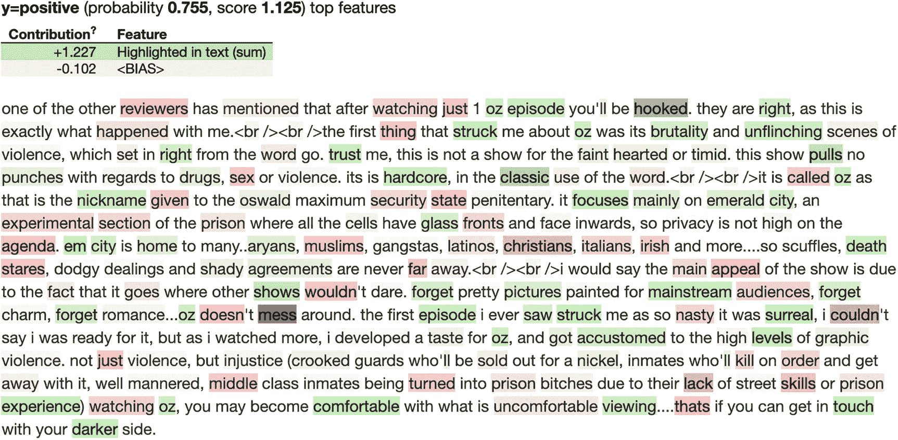

图 7-8

更加精致的模型突出了重要特性

```py
eli5.show_prediction(clf, imdb.review[0], vec=vec,
                     target_names=set(imdb.sentiment),
                     targets=['positive'])

```

## 基于 n 元语法的文本分类

让我们考虑两种开发文本分类模型的新方法。对于文本分类，要么可以用单词，要么可以用字符。下面的脚本分析字符并挑选出五个二元模型，并将这些 n 元模型作为特征保存在 tf-idf 矢量器中。在向量创建之后，用于审查的数据被馈送到管道，并且进行模型训练。对于情感分类的训练准确率为 99.8%，这是很好的。现在你可以解释个人预测，看看哪些因素有助于积极情绪，哪些因素有助于消极情绪(见表 [7-4](#Tab4) 和图 [7-9](#Fig9) )。

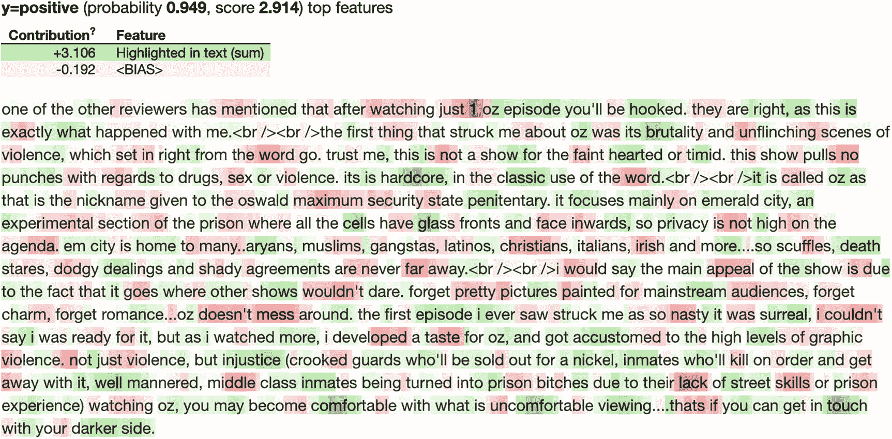

图 7-9

模型中的 2 克和 5 克特征亮点

表 7-4

基于 N-gram 的矢量器作为预处理方法，n-gram 2 到 n-gram 5 被认为是使用 TF-IDF 矢量器创建训练模型，下表 [7-4](#Tab4) 显示了分类报告

<colgroup><col class="tcol1 align-center"> <col class="tcol2 align-center"></colgroup> 
| 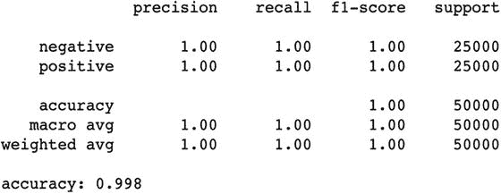 |

```py
vec = TfidfVectorizer(stop_words='english', analyzer='char',
                      ngram_range=(2,5))
clf = LogisticRegressionCV()
pipe = make_pipeline(vec, clf)
pipe.fit(imdb.review, imdb.sentiment)

print_report(pipe)

```

```py
eli5.show_prediction(clf, imdb.review[0], vec=vec,
                     target_names=set(imdb.sentiment),
                     targets=['positive'])

```

在上面的脚本中，您获得了第一个评论的总贡献，这是绿色加红色突出显示的文本元素的净结果，即+3.106。因为净结果是+3.106，所以它被分类为正面情感，这也被显示为正面情感的概率是 0.949，并且分类的对数概率是 2.914。-0.192 是偏差，也称为逻辑回归模型的截距项。

当文本文档的长度较短时，计数矢量器是合适的。如果文本的长度更长，这意味着每个单词在文本中出现的频率很高或重复多次，那么您应该使用 tf-idf 矢量器。计数矢量器就是用表格格式或数组表示的单词及其频率。在下面的脚本中，带有停用词移除功能的计数矢量器减少了要素的数量，并使其非常相关。对模型进行训练后，可以看到准确率为 94.8%。

此外，当您解释第一个评论时，绿色加红色突出显示文本的净结果之和是+1.315，并且由于净结果是正面的，因此该情感被标记为正面情感，其概率分数为 78.7%，对数赔率分数为 1.307。可以不断更新特征提取，不断更新模型类型，使预测更好。模型越好，对情感分类的解释就越好。以下脚本将 tf-idf 矢量显示为一个不包含停用词移除过程的功能。

你可以在图 [7-10](#Fig10) 中的高亮文本中看到，有几个停用词、二元模型和三元模型，它们没有正确地用颜色标注。为了解决这个问题，您可以使用分析器中的选项作为`char_wb`。`char`作为一个分析器你以前见过，因为它将文本解析成字符作为 n-grams，但这个过程需要时间。另外，`char_wb`更多的是微调，把那些 n 元文法不互相重叠的地方作为特征。

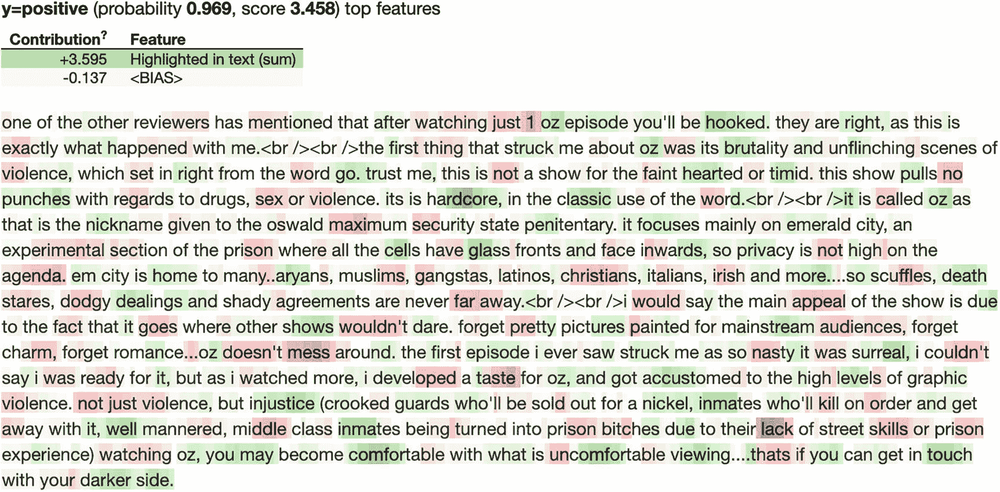

图 7-10

作为特征重要性的非重叠字符 N 元文法

```py
vec = TfidfVectorizer(stop_words='english', analyzer='char_wb',
                      ngram_range=(2,5))
clf = LogisticRegressionCV()
pipe = make_pipeline(vec, clf)
pipe.fit(imdb.review, imdb.sentiment)

print_report(pipe)

 eli5.show_prediction(clf, imdb.review[0], vec=vec,
                     target_names=set(imdb.sentiment),
                     targets=['positive'])

```

这一次结果看起来更好。举个例子，“只看 1”是一个不与任何其他 n 元语法重叠的负 n 元语法，这是有意义的。同样的，其他的 n-grams 更精炼。如果电影评论仅限于几行字，您可以使用计数矢量器或 tf-idf 矢量器，但如果评论变得冗长，那么哈希矢量器就可以拯救您。当评论长度增加时，词汇表也会增加，因此哈希矢量器非常有用。在下面的脚本中，介绍了带有高级 ML 模型随机梯度下降分类器之一的哈希矢量器。这产生了比早期模型更好的模型(图 [7-11](#Fig11) )。这是因为早期的模型也有点过度拟合。为了探索可解释性，你可以拿同样的第一篇评论文章，解释分类标签，同时看看哪些词有助于积极情绪和消极情绪。

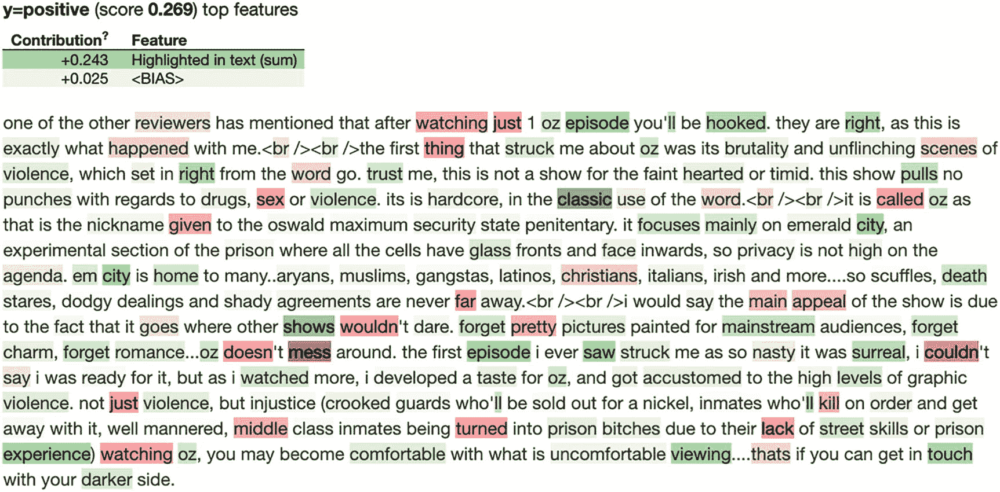

图 7-11

非常精确的突出显示特征可以更好地解释预测

```py
from sklearn.feature_extraction.text import HashingVectorizer
from sklearn.linear_model import SGDClassifier

vec = HashingVectorizer(stop_words='english', ngram_range=(1,2))
clf = SGDClassifier(random_state=42)
pipe = make_pipeline(vec, clf)
pipe.fit(imdb.review, imdb.sentiment)

print_report(pipe)

eli5.show_prediction(clf, imdb.review[0], vec=vec,
                     target_names=set(imdb.sentiment),
                     targets=['positive'])

```

第一条点评评论是正面情绪，整体正面得分+0.243，得分 0.269。它只考虑由绿色和红色文本突出显示的相关功能。

```py
from eli5.sklearn import InvertableHashingVectorizer
import numpy as np
ivec = InvertableHashingVectorizer(vec)
sample_size = len(imdb.review) // 10
X_sample = np.random.choice(imdb.review, size=sample_size)
ivec.fit(X_sample)

eli5.show_weights(clf, vec=ivec, top=20,
                  target_names=set(imdb.sentiment))

```

可逆散列矢量器有助于描述散列矢量器中的权重和特征名称，而不需要庞大的词汇表。图 [7-12](#Fig12) 中的笔记本输出显示了正负特性。

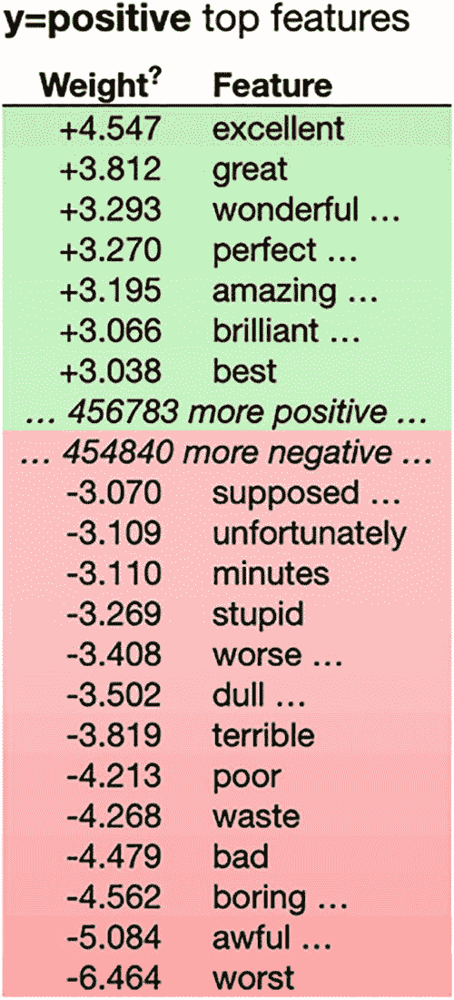

图 7-12

正面类别预测的主要特征

## 多类标签文本分类的可解释性

让我们来看看多类分类模型，其中在目标列中有两个以上的类别。多类分类是另一个用例，其中因变量或目标列可以有两个以上的类别或标签。这里所要求的可解释性是针对每个相应的类标签的，所以重要的正面和负面特征需要被显示出来。让我们使用一个客户投诉数据集，目标是预测客户投诉的类别或类型。

```py
import pandas as pd
df = pd.read_csv('complaints.csv')
df.shape
df.info()
# Create a new dataframe with two columns
df1 = df[['Product', 'Consumer complaint narrative']].copy()

# Remove missing values (NaN)
df1 = df1[pd.notnull(df1['Consumer complaint narrative'])]

# Renaming second column for a simpler name
df1.columns = ['Product', 'Consumer_complaint']

df1.shape

# Because the computation is time consuming (in terms of CPU), the data was sampled
df2 = df1.sample(20000, random_state=1).copy()

# Renaming categories
df2.replace({'Product':
             {'Credit reporting, credit repair services, or other personal consumer reports':
              'Credit reporting, repair, or other',
              'Credit reporting': 'Credit reporting, repair, or other',
             'Credit card': 'Credit card or prepaid card',
             'Prepaid card': 'Credit card or prepaid card',
             'Payday loan': 'Payday loan, title loan, or personal loan',
             'Money transfer': 'Money transfer, virtual currency, or money service',
             'Virtual currency': 'Money transfer, virtual currency, or money service'}},
            inplace= True)

df2.head()

pd.DataFrame(df2.Product.unique())

```

数据集的来源是 [`https://catalog.data.gov/dataset/consumer-complaint-database`](https://catalog.data.gov/dataset/consumer-complaint-database) `.`数据集被清理并准备预测投诉类别。读取数据后，Python 对象`DF`被创建。以下输出显示了数据集中的前几条记录。

从`DF`开始，您有一个副本，其中只有客户投诉叙述和产品列，用于开发分配给`DF1`对象的多类别分类模型。然后，通过删除 nan 并为变量输入更简单的名称来清理数据框架。

使用更短、更合适的名称来清理包含更多文本的较长描述，以便您可以更好地分析数据。有 13 个独特的产品类别的客户投诉叙述已被提及。

```py
# Create a new column 'category_id' with encoded categories
df2['category_id'] = df2['Product'].factorize()[0]
category_id_df = df2[['Product', 'category_id']].drop_duplicates()

# Dictionaries for future use
category_to_id = dict(category_id_df.values)
id_to_category = dict(category_id_df[['category_id', 'Product']].values)

# New dataframe
df2.head()

df2.Product.value_counts()

```

出于模型训练的目的，您需要将目标列文本编码成数字。因此，您通过分解 product 列来创建列`category_id`。上面脚本中接下来的两行代码创建了编码数字和类描述之间的映射。这对于生成预测后的反向转换非常有用。在下面几行代码中，您创建了一个 tf-idf 向量，其中 n-grams 从 1 到 2，并删除了停用词，保持次线性 tf 和最小文档频率为 5。如果你想减少由文件长度产生的偏差，那么你必须使用次线性术语 frequency TRUE。从 Zipf 定律可以知道，任何一个词的出现频率都和它的排名成反比。最小文档频率意味着在开发词汇表时，应该忽略文档频率低于定义阈值的术语。在下面的脚本中，它是 5，这意味着任何频率小于 5 的术语都不会是词汇表的一部分。

以下脚本的输出显示了多类分类目标列中每个类的计数。以下脚本使用计数矢量器作为起点来拟合多类别模型的逻辑回归。

```py
from sklearn.feature_extraction.text import CountVectorizer
from sklearn.linear_model import LogisticRegressionCV
from sklearn.pipeline import make_pipeline

vec = CountVectorizer()
clf = LogisticRegressionCV()
pipe = make_pipeline(vec, clf)
pipe.fit(df2.Consumer_complaint,df2.Product)

from sklearn import metrics

def print_report(pipe):
    y_test = df2.Product
    y_pred = pipe.predict(df2.Consumer_complaint)
    report = metrics.classification_report(y_test, y_pred)
    print(report)
    print("accuracy: {:0.3f}".format(metrics.accuracy_score(y_test, y_pred)))

print_report(pipe)

```

根据图 [7-13](#Fig13) ，模型精度似乎很好，为 89%。在多类分类问题中，通常会查看 f1 值，这是精确度和召回率的调和平均值。f1 分数的可接受极限是 75%或更高。你可以看到，对于消费贷款和其他金融服务，这一比例低于 75%。首先，让我们看一下在分类问题中作为每一类权重的术语。由于特征术语名称不可用，结果没有意义(图 [7-14](#Fig14) )。

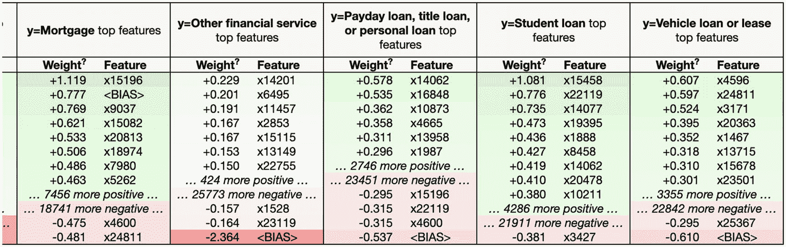

图 7-14

对每个类都很重要的示例功能


图 7-13

多类文本分类模型的分类精度

```py
import eli5
eli5.show_weights(clf, top=10)
#this result is not meaningful, as weight and feature names are not there

```

由于图 [7-14](#Fig14) 中没有术语形式的特征名称，您无法理解这一点。您需要稍微修改一下脚本，如下所示，以包括来自 vec 对象的特性名称，并包括作为唯一名称的目标名称。因此，您可以看到对类别标签有积极影响的术语用绿色表示，而有消极影响的术语用红色表示。对于每个类别，如银行帐户、服务或消费贷款，您可以看到主要功能。由于您有 10 个以上的类别，您无法在一个屏幕中容纳所有正面和负面的术语，因此您一次至少为 5 个标签拍摄不同的快照，以适应术语的可读性。

```py
eli5.show_weights(clf,feature_names=vec.get_feature_names(),target_names=set(df2.Product))
#make sense

```

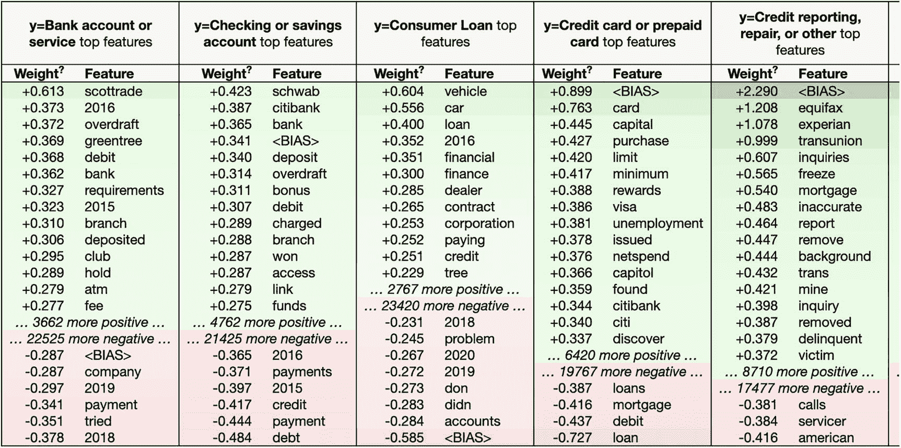

图 7-15

每个类别的主要功能及其名称

图 [7-15](#Fig15) 中的输出显示了目标列中的前五个类，显示了五个类及其主要特性，正面和负面。

从这些表格中可以得到什么？我们上`mortgage`课吧。诸如抵押、托管、再融资、修改、服务者和 ditech 等词是帮助预测类别`mortgage`的最积极的特征。以类似的方式，您可以解释消费者投诉中的所有其他类别和单词，这些类别和单词实际上有助于文本文档将特定类别预测为客户投诉的产品类别。因此，不仅仅是顶级特征的识别，而是整个上下文导致了类标签的预测。

### 本地解释示例 1

以下脚本和图 [7-16](#Fig16) 看第一个消费者投诉。银行账户或服务的预测概率非常低，为 0.008，这意味着第一次投诉不属于这一类。

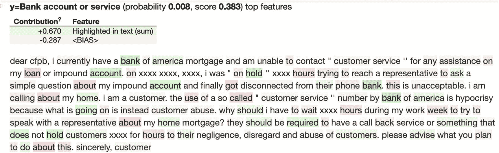

图 7-16

第一次投诉的分类预测解释

```py
eli5.show_prediction(clf, np.array(df2.Consumer_complaint)[0], vec=vec,
                     target_names=set(df2.Product)) # explain local prediction
np.array(df2.Consumer_complaint)[0]

```

由于概率为 0.083，第一次投诉不属于支票或服务账户(图 [7-17](#Fig17) )。

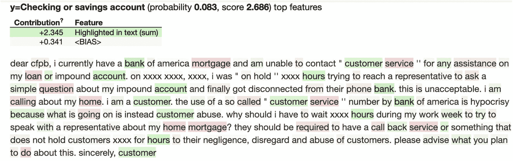

图 7-17

支票或储蓄账户的特征重要性

图 [7-18](#Fig18) 显示第一个消费者投诉属于抵押贷款类别的概率为 84.3%或 0.843。真正有助于预测的单词是绿色的。

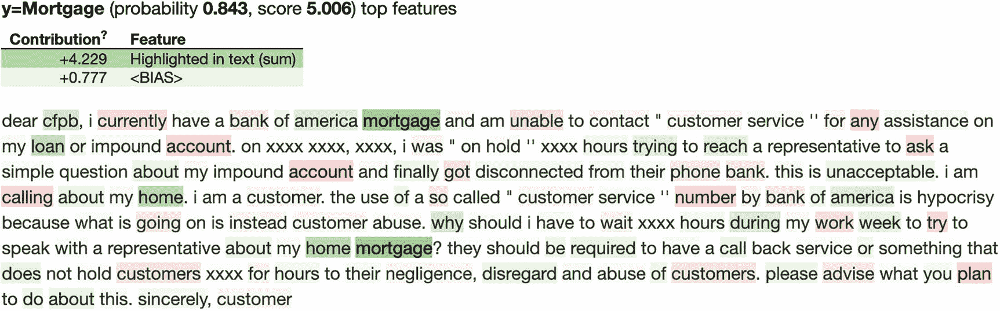

图 7-18

抵押贷款类别预测的特征重要性

以下输出显示了第一个消费者投诉的实际文本:

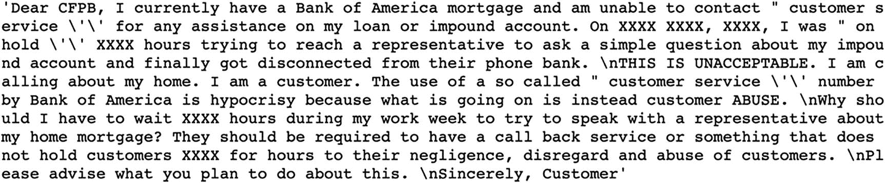

以类似的方式，你可以检查投诉编号 123，并看到投诉属于债务催收类。该文本属于讨债的概率为 0.740 (74%)。如果你根据做出贡献的确切文本来解释预测，这被称为局部解释。

### 本地解释示例 2

让我们看另一个例子，消费者投诉数据集中的第 123 条记录。每个类别的功能重要性如下所示。以下脚本接受投诉号 123，生成的本地预测显示它属于信用报告修复或其他类。概率为 0.515 (51.5%)。参见图 [7-19](#Fig19) 。

```py
 eli5.show_prediction(clf, np.array(df2.Consumer_complaint)[100], vec=vec,
                     target_names=set(df2.Product)) # explain local prediction

```

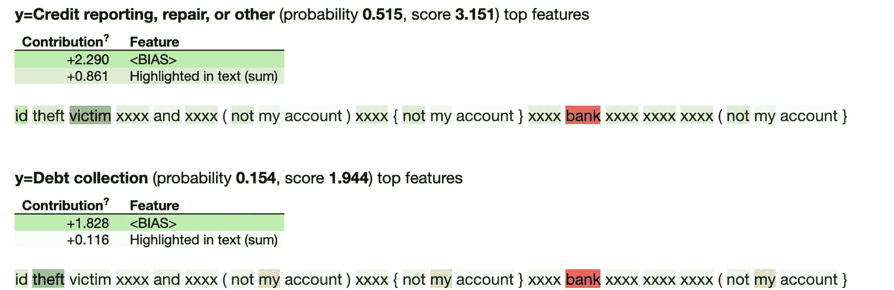

图 7-19

用正面词和负面词来突出重要性

上面解释的输出没有任何预处理或微调。如果对文本进行进一步的微调和预处理，可以得到更精确的结果。标准做法是删除停用词。以下脚本删除了停用词，并再次触发模型训练管道:

```py
vec = CountVectorizer(stop_words='english')
clf = LogisticRegressionCV()
pipe = make_pipeline(vec, clf)
pipe.fit(df2.Consumer_complaint, df2.Product)

print_report(pipe)

eli5.show_prediction(clf, np.array(df2.Consumer_complaint)[0], vec=vec,
                     target_names=set(df2.Product))

```

由于很多投诉没有足够的文字，去除停用词后，你失去了很多特征，这也是为什么准确率略微下降到 88.1%，如表 [7-5](#Tab5) 所示。

表 7-5

细化模型中多个类别的分类报告

<colgroup><col class="tcol1 align-center"> <col class="tcol2 align-center"></colgroup> 
|  |

### 本地解释示例 1

您可以采用改进的模型，并为 0 号消费者投诉生成本地解释。概率分数现在已经很小了；是 76.4%，如图 [7-20](#Fig20) 所示。

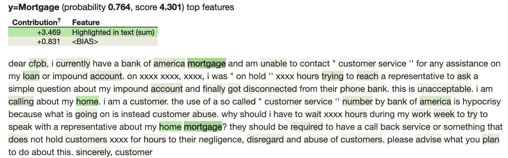

图 7-20

单一投诉预测的本地解释

```py
eli5.show_prediction(clf, np.array(df2.Consumer_complaint)[0], vec=vec,
                     target_names=set(df2.Product))

```

以类似的方式，将矢量器从 count vector 更改为 tf-idf vector，而不删除停用词，并查看它将对局部解释产生什么影响。您可以从以下脚本中看到这一点:

```py
from sklearn.feature_extraction.text import TfidfVectorizer

vec = TfidfVectorizer()
clf = LogisticRegressionCV()
pipe = make_pipeline(vec, clf)
pipe.fit(df2.Consumer_complaint, df2.Product)
print_report(pipe)

```

根据表 [7-6](#Tab6) ，看起来 tf-idf 方法将总体准确率提高到了 90.1%，首次投诉的局部解释的概率得分更高，为 72.5%。

表 7-6

tf-idf 矢量器模型的分类报告

<colgroup><col class="tcol1 align-center"> <col class="tcol2 align-center"></colgroup> 
|  |

```py
eli5.show_prediction(clf, np.array(df2.Consumer_complaint)[0], vec=vec,
                     target_names=set(df2.Product))

```

下一步，用去除停用词的 tf-idf 进行实验，看看第一次消费者投诉的预测在本地可解释性方面有什么不同。参见表 [7-7](#Tab7) 。

表 7-8

迭代后，下表 [7-8](#Tab8) 显示抵押贷款类别的多类别分类报告概率再次增加到 74.2%

<colgroup><col class="tcol1 align-center"> <col class="tcol2 align-center"></colgroup> 
| 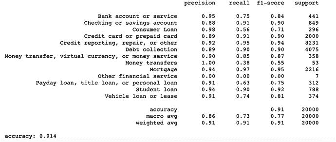 |

表 7-7

多类分类模型的分类报告

<colgroup><col class="tcol1 align-center"> <col class="tcol2 align-center"></colgroup> 
|  |

```py
vec = TfidfVectorizer(stop_words='english')
clf = LogisticRegressionCV()
pipe = make_pipeline(vec, clf)
pipe.fit(df2.Consumer_complaint, df2.Product)
print_report(pipe)

```

停用词移除对整体模型准确性没有重大影响。从 90.1%小幅上升至 90.6%。此外，`mortgage`类的概率得分变为 73.5%。

```py
eli5.show_prediction(clf, np.array(df2.Consumer_complaint)[0], vec=vec,
                     target_names=set(df2.Product))

```

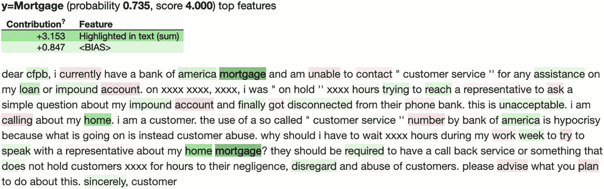

图 7-21

特征重要性对于理解因素对分类的积极和消极贡献是必要的，下图 [7-21](#Fig21) 用绿色突出显示积极的特征重要性，用红色背景颜色突出显示消极的特征重要性

作为进一步的改进步骤，您可以将字符作为一个分析器，并将二元模型作为特征创建。准确率提高到 91.4%，略高于先前的结果。

```py
vec = TfidfVectorizer(stop_words='english', analyzer='char',
                      ngram_range=(2,5))
clf = LogisticRegressionCV()
pipe = make_pipeline(vec, clf)
pipe.fit(df2.Consumer_complaint, df2.Product)

print_report(pipe)

```

```py
eli5.show_prediction(clf, np.array(df2.Consumer_complaint)[0], vec=vec,
                     target_names=set(df2.Product))

```

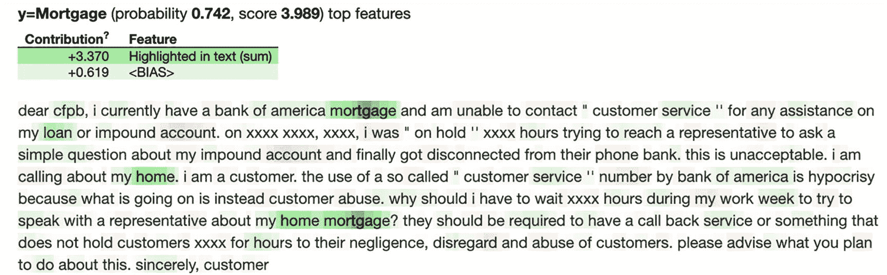

图 7-22

图 [7-22](#Fig22) 表示正面词作为以绿色突出显示的特征，负面词作为以红色背景突出显示的特征，用于抵押贷款类别

以类似的方式，您可以使用`char`和一个非重叠的二元模型来创建特征，二元模型最多 5 克。它将整体准确性降低到最低水平 88.4%，但您可以检查局部解释，看看它是否提高了可解释性。

```py
vec = TfidfVectorizer(stop_words='english', analyzer='char_wb',
                      ngram_range=(2,5))
clf = LogisticRegressionCV()
pipe = make_pipeline(vec, clf)
pipe.fit(df2.Consumer_complaint, df2.Product)

print_report(pipe)

```

它实际上并没有改善解释。如图 [7-23](#Fig23) 所示，只有抵押二字重要。其他单词用非常浅的绿色突出显示。即使是红色的文字也很苍白无力。

```py
eli5.show_prediction(clf, np.array(df2.Consumer_complaint)[0], vec=vec,
                     target_names=set(df2.Product))

```


图 7-23

突出显示的特征文本

为了照顾词汇长度，您可以引入带有随机梯度提升模型的哈希矢量器作为分类器。准确率进一步下降到 85.7%。你仍然可以检查解释。

```py
from sklearn.feature_extraction.text import HashingVectorizer
from sklearn.linear_model import SGDClassifier

vec = HashingVectorizer(stop_words='english', ngram_range=(1,2))
clf = SGDClassifier(random_state=42)
pipe = make_pipeline(vec, clf)
pipe.fit(df2.Consumer_complaint, df2.Product)
print_report(pipe)

```

表 7-9

下表 [7-9](#Tab9) 显示了多级分类报告的准确性

<colgroup><col class="tcol1 align-left"> <col class="tcol2 align-left"></colgroup> 
| 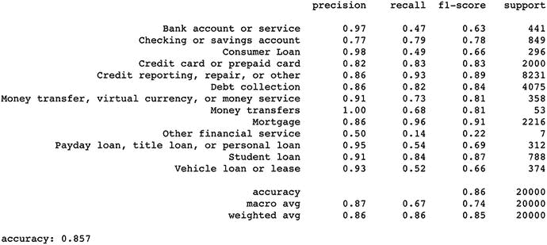 |

虽然整体模型精度下降，但概率得分增加到 78%。然而，只有占主导地位的特征抵押导致分类。其他特征并不重要。这是一个有偏差的模型。其他关键词权重很低。绿色和红色的强度定义了权重的值。比如房贷因为是深绿所以权重很高。其他所有文字为浅绿色(图 [7-24](#Fig24) )。

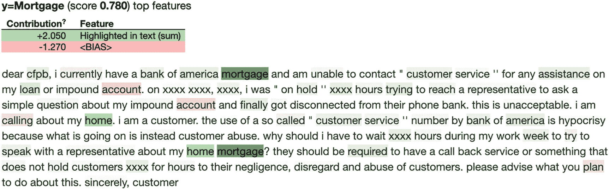

图 7-24

预测抵押贷款类别的更精确和更突出的功能

```py
eli5.show_prediction(clf, np.array(df2.Consumer_complaint)[0], vec=vec,
                     target_names=set(df2.Product))

```

```py
from eli5.sklearn import InvertableHashingVectorizer
import numpy as np

ivec = InvertableHashingVectorizer(vec)
sample_size = len(df2.Consumer_complaint) // 10
X_sample = np.random.choice(df2.Consumer_complaint, size=sample_size)
ivec.fit(X_sample)

eli5.show_weights(clf, vec=ivec, top=20,
                  target_names=set(df2.Product))

```

使用可逆哈希矢量器，您可以获得特征的名称及其在类预测中的相对权重。参见图 [7-25](#Fig25) 至 [7-27](#Fig27) 。

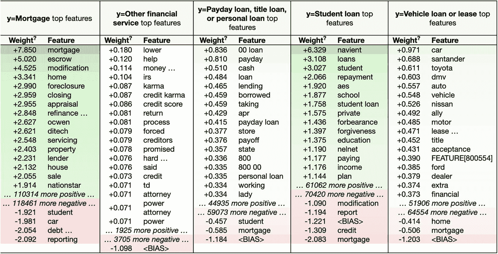

图 7-27

多类分类问题中每类对应的正负特征及其权重

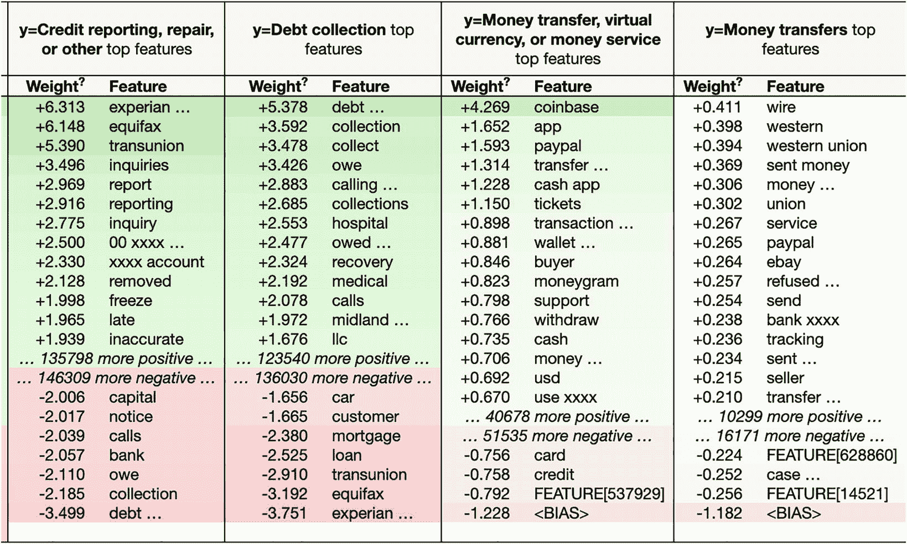

图 7-26

多类分类问题中每类对应的正负特征及其权重

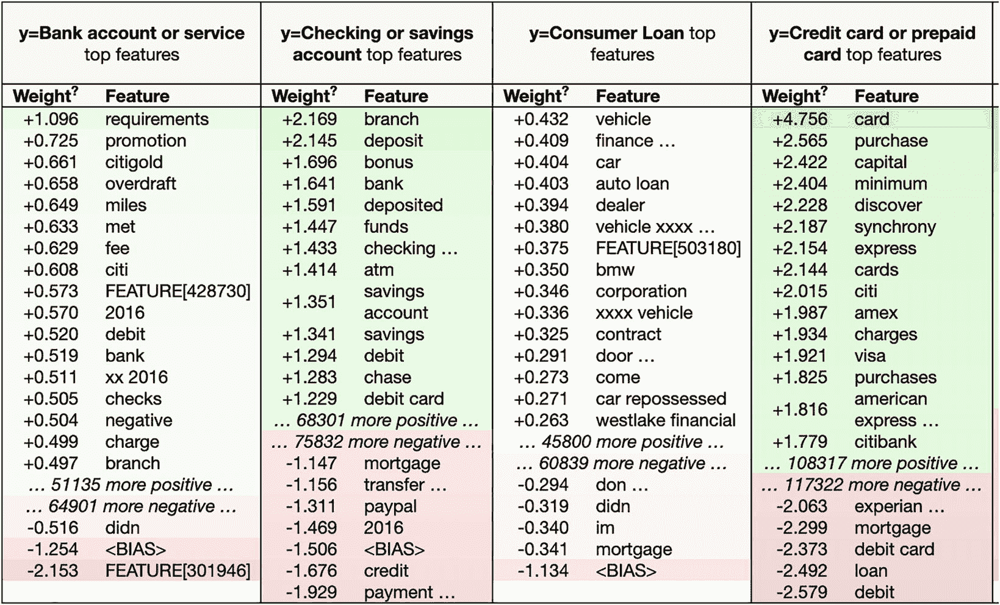

图 7-25

多类分类问题中每类对应的正负特征及其权重

## 结论

文本分类是自然语言处理领域中最重要的用例。对于消费者投诉的分类、原始文本到各种实体的分类、情绪到正面和负面的分类都很有用。我们说的是二元分类和多类分类。其他用例是主题建模和摘要，这包括在本章中，因为这些任务不是监督的机器学习模型。您只考虑了监督机器学习模型，因为当您生成预测的类结果时，解释通常会丢失。用户显然会考虑考虑哪些表征或特征，以及为什么预测的类别是如此等等。然而，对于来自 NLP 领域的基于无监督学习的任务，有更容易的方法来理解关系，但是在无监督学习中没有需要向最终用户解释的预测。在这一章中，您更多地关注了不同的预处理方法和模型以及它们的可解释性。