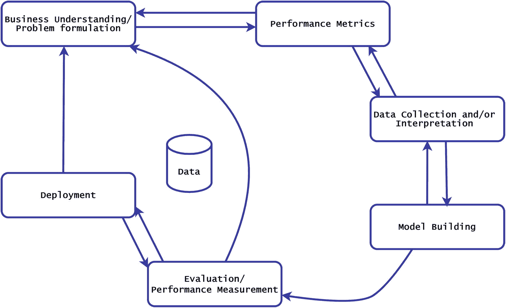

# 4.组织内部对人工智能的理解:走向透明

主流公众对人工智能的看法因个人视角和经历的不同而有很大差异。一方面，从用户的角度来看，它可以被视为一组依赖数据来实现新水平的创新、洞察力和组织绩效的服务。另一方面，从更技术性的角度来看，它可以被视为一种使用数学框架、计算基础设施以及相关软件和处理工具来分析和/或提取大量数据中的模式的技术。然而，这些观点中的每一个都不同于我们在第 [1](1.html) 章“对人工智能的需求”一节中的定义。 [1](#Fn1)

人工智能系统的开发和部署不仅从技术和设计的角度来看，而且从用户的角度来看，都涉及一定程度的复杂性。这突出了管理用户期望和理解系统功能的重要性。期望人工智能服务的用户理解他们所接受的服务所依赖的底层技术的复杂性是不现实的。然而，我们希望服务提供商作为一个组织，能够理解管理用户期望的重要性，就像法律公司理解他们提供的服务的全部复杂性一样，从而产生一系列潜在的结果，并在整个过程中让他们的客户充分了解情况。就律师事务所而言，领导团队通常由训练有素、拥有多年经验的律师组成，他们拥有监督向客户提供法律服务所需的技术专长。

AI 继续在广泛的行业和组织中寻找用例，因为这些行业和组织意识到它有能力改善他们与客户的运营和交互方式。这些组织中的大多数，尤其是小型、中型和传统企业， [2](#Fn2) 不像人工智能的主流采用者那样精通技术。因此，这些公司普遍缺乏对人工智能的透彻理解。这可能导致企业决策者和 AI 开发团队之间缺乏共同的理解和透明度。

本章讨论第 [3](3.html) 章中介绍的 SAIF 运营模式的流程-控制-治理模式。正如所强调的，所提出的方法旨在帮助组织评估此类技术的影响，并潜在地限制他们因使用人工智能系统而导致的不良后果。

本章的其余部分组织如下:

*   我们首先介绍受跨行业数据挖掘标准流程启发和增强的数据科学开发流程。

*   我们接下来检查对开发过程施加的控制，以帮助组织评估和改进他们对组织内实现 AI 的元素的理解。

*   第三，我们讨论治理策略或安排，通过它来实现和维护开发过程和控制。

*   最后，我们做一些总结。

## 数据科学发展过程

与软件开发等其他数字技术相比，关于 DS 过程的文献很少。这是因为 DS 过程通常是组织特有的。然而，现有的文献广泛认同典型的 DS 开发过程包括以下关键阶段:问题形成、数据收集和/或解释、模型构建、评估和部署。图 [4-1](#Fig1) 显示了数据挖掘的跨行业标准流程(Shearer 2000)的 DS 流程图的图形表示。每个阶段的简要概述如下。新引入的“性能度量”阶段，允许业务和开发团队清楚地指定正在开发的系统的预期行为，将在第 [5](5.html) 章中详细讨论和回顾。

图 4-1

数据科学发展过程

### 问题定式化

顾名思义，问题形成阶段旨在阐述和定义手头问题的边界。这一阶段的结果是人工智能团队将调查的研究问题或假设。为了实现这一点，领域专家、业务代表和数据科学团队协作确定业务问题，并将其转化为研究问题。这一过程可能会产生多个研究问题，这些问题应该由企业领导层进行优先排序。

### 性能指标

这一阶段的开发旨在确保人工智能系统有正确的目标。虽然性能测量通常作为评估的一部分来执行，但它通常无法整合与 AI 系统提出看似合适的结果或行动过程的能力不直接相关的业务和技术需求。例如，满足传统性能指标(例如，准确度、精确度、召回率等)的 AI 招聘系统。)可能无法实现组织的优先目标，例如避免性别偏见。在本书的其余部分，我们将组织的优先目标，如公平性，称为“软性能指标”

在流程的早期阶段定义性能指标有多种好处。这样做允许业务和 AI 团队设置项目的范围，并在早期调整预期。管理涉众的期望对于项目的成功尤其重要，因为需要满足任何不切实际的期望，例如，由于业务压力，经常会产生部署不可靠的系统或者简单地设置项目失败的风险。例如，人工智能系统的概率性质意味着它们很少能以完美的精度运行。然而，用户期望他们的应用表现一致和完美(Dzindolet et al. 2003)，所以期望需要适当地管理，以避免和/或减轻潜在的失望。IBM Watson Health 就是这样一个例子，它的交付既不符合公众的期望，也不符合公司的公开承诺。具体来说，IBM 宣传其 IBM Watson AI 平台将彻底改变癌症治疗，但直到现在它还没有兑现这一承诺。 [3](#Fn3) ， [4](#Fn4) ， [5](#Fn5)

此外，可用于判断系统操作和/或预期行为的标准应作为性能度量阶段的一部分进行识别和记录。因此，开发团队有了明确的目标。例如，在面部识别系统的情况下，除了其他因素之外，可以考虑将种族无偏性作为相关的软性能度量。有了这些知识，开发团队就可以设计一个满足组织期望的系统，从数据收集开始，直到选择使用哪种算法。

在某些情况下，这个阶段的结果可能是项目被认为是不可行的。以人工智能招聘系统为例，期望能够获得准确的数据，以了解特定员工在组织中成功或失败的原因，这可能是不现实的。 [6](#Fn6) 算法于是可以简单地反映当前的事态，考虑到它们分析历史信息，这可能会受到人们试图修正的偏见的影响。因此，可能无法交付一个不带偏见的系统。

决定使用哪些反映业务和伦理需求的软性能指标需要伦理、经济和通常的政治推理，这通常是上下文特定的，并受个人偏好的影响。因此，预先定义软性能指标的另一个好处在于，人们可以选择依靠算法方法来帮助维护整个系统的一致性。例如，一个人对公平的理解可能因人而异。这意味着不同个人设计的系统可能满足同一组织内对公平的不同解释。假设有可能就公平的定义达成一致，那么全组织对公平的一致定义或解释有助于减少差异。理想情况下，这种定义应该尽可能通过算法来建立。这样做可以使性能指标的定义更加一致和可持续。

软性能度量应该扩展到与人工智能系统操作相关的其他重要度量，以及更一般的需求，这些需求有时只是事后才考虑的。

这些度量可以包括紧凑性、可伸缩性、可靠性和安全性，其中

*   **紧凑性**描述了一种可以用有限的成本、能源和带宽进行部署的系统。

*   **可扩展性**是一个可以增长以管理不断增长的需求的系统。

*   **可靠性**描述了一个在保持高度完整性的同时，根据需要可用的系统。这对于自主系统尤其重要，例如自动驾驶汽车，它们可能需要依赖 GPS 信号才能正常工作。

*   **安全性**不仅仅与确保数据隐私有关，还认识到安全性问题应该贯穿于开发过程的所有阶段。例如，构建可扩展的模型通常需要依赖第三方进行计算，这就带来了与第三方访问相关的风险。人们应该理解每个场景的安全含义，尤其是在处理可能影响人类安全的问题时。例如，一些提供商可能会保留一份所收集信息的副本，并经常在其条款和条件中提及。应采取必要的预防措施，以确保只有经过审查符合约定规则的授权个人才能访问此类数据。

### 数据收集和/或解释

在过程的这一阶段，收集调查初始阶段产生的研究问题或假设所需的数据。传统上，针对当前问题收集数据是通过实验来实现的。然而，大数据可能不是这种情况，在大数据中，数据可能已经可用。

在这种情况下，数据科学团队需要与业务代表和领域专家合作，以了解数据代表的内容及其有效性。作为这个所谓的“解释阶段”的一部分，数据科学团队还要经历通常所说的“数据清理”过程。这包括从数据中提取相关信息和识别关键模式。此外，根据之前确定的性能指标对数据进行评估。在流程的这个阶段之前定义性能指标的一个主要好处是，开发团队可以在牢记这些指标的情况下执行数据收集工作。使用上一节中的公平性能指标示例，设计良好的数据收集策略有助于减轻偏差，因为偏斜的数据通常是与人工智能系统相关的偏差的主要因素之一。

在这一阶段，人们可能会遇到的一个常见问题是，基于数据的可用性，重新制定先前定义的假设的动机。通常不建议这样做，因为从数据中得出的假设可能不能很好地概括。此外，由于另一个假设可能更容易被证明，因此可能会有重新制定假设的动机，这可能会危及这项工作的总体有用性。使用面部识别软件的例子:在探索一个组织持有的关于其一些客户的数据时，它可以得出结论，执行面部识别是可能的，并继续为普通公众开发和部署面部识别 AI 系统。这可能会有问题，因为生成假设的数据和收集的最终用户数据之间存在潜在差异。

### 模型结构

这个阶段的输出是在问题形成阶段确定的研究问题的候选解决方案。建议的解决方案旨在最好地满足与企业共同定义的性能指标。与数据收集阶段类似，在这个阶段之前对性能指标的明确定义允许开发团队优先考虑最符合它们的模型。例如，天然气和电力市场办公室(Ofgem)要求英国的能源供应商能够向他们的客户解释能源消耗估计值，从而产生一个明确的性能指标。这是组织在依靠人工智能来估计能耗时优先考虑可解释和可解释的建模解决方案的一个令人信服的原因。更一般地说，性能指标可以指导模型构建过程中的一些决策。然而，让开发团队定期与业务领导和其他重要的利益相关者进行互动仍然是最重要的，例如，通过评审会议。这允许开发团队审查进展，并确认新出现的解决方案仍然符合预期。它还允许他们测试他们是否对正在开发的系统有清晰的理解。最重要的是，与企业领导的定期沟通确保他们完全认同所交付的解决方案。

### 估价

在评估阶段，应该确保模型回答了在问题形成阶段确定的业务问题。此外，在此阶段，您应该根据流程早期定义的性能指标来评估和记录它的执行情况。总之，评估阶段的目标是评估前一阶段模型的泛化能力。那就是评估它在看不见的数据上表现如何，这些数据在建立模型时没有被使用。换句话说，当正确执行时，这个阶段将提供模型在现实生活中表现如何的洞察力。总的来说，评估与 DS 过程的任何阶段一样重要。

### 部署

在流程的部署部分，模型(在前面的阶段被认为是成功的)要么与更广泛的受众共享，要么打包到生产级系统中进行分发。根据解决方案的不同，此阶段还可能涉及对最终系统的持续监控，以确保其继续满足组织的优先事项。

应该根据部署的系统评估与系统操作方面相关的软性能指标。包括安全性、可伸缩性、紧凑性和可靠性等指标，这些指标需要在性能指标阶段进行识别和记录。

## 人工智能开发过程控制

过程元素为人工智能系统的开发和部署提供了指导方针，而控制则为业务和技术需求的集成提供了模板。他们通过在流程的每一步施加一些必须遵守的约束来实现这一点，帮助管理最终结果。特定的控制也可能有助于将非技术合作者暴露给在组织内实现人工智能的元素。这进一步帮助参与项目的个人决定最终系统的标准。换句话说，人们可以通过定义特定的控制来指定人工智能系统应该如何行为，这些控制有助于强制执行和维护所需的行为。例如，在开发过程的部署阶段对公平性进行检查的控制有助于组织了解它满足其社会责任的程度。 [7](#Fn7) 控制的另一个功能是让组织了解正在开发的系统的风险和暴露程度。他们通过降低不期望的结果发生的概率，甚至限制可能的结果的范围来完全排除(一些)不期望的结果。以公平性为例，一个组织可能会因为对某些用户组的不公平待遇而受到批评。这可能导致失去机会、失去用户信任和/或监管制裁。如果控制能够有效地对系统施加约束，只产生公平的结果，这种风险就完全消除了。正如人们在下文中会注意到的，适当的控制取决于目标，并且本身可以采取过程的形式。

作为 SAIF 运营模式的一部分讨论的一组要求，包括道德、业务和技术要求，都在定义适当的控制中发挥作用。在某些情况下，这三种类型的要求可能相互矛盾。例如，对系统实施公平控制可能会以解决方案的效率或有效性为代价。这指出了在定义相关控制措施之前权衡道德要求、业务要求和技术要求的重要性，以确保它们朝着相同的总体目标协调工作。组织确保通过其治理安排建立和维护技术、业务和伦理需求之间的这种权衡；这将在“治理”一节中详细讨论。

在本节中，我们将讨论适用于 DS 开发过程不同阶段的控制。在业务理解阶段不需要定义任何控制，因为在开发的那个阶段，所有各方(业务和开发团队)必须就要解决的问题达成一致，从而对要进行的项目有一致的理解。

### 绩效指标的控制

正如前面所讨论的，定义合适的性能指标需要开发团队、业务和领域专家的共同努力。因此，业务目标仍然是性能度量的主要控制。商定的性能指标可以被认为是对开发中的整个人工智能系统的约束。但是，需要定义和实施特定的控制措施，以确保正确定义和测量性能指标。因此，对性能指标的控制包括定义一个组织范围的策略或程序来测量人工智能系统的性能。该策略可以是行业和/或应用特定的。

### 数据收集和/或解释的控制

缺乏数据可能是开发创新数据产品的最大挑战之一。大多数组织都必须经历一个数据收集或获取过程。此阶段的典型控制包括但不限于

*   定义并记录组织范围内的数据收集流程和处理指南。这可以通过以下问题来说明:是否有足够的证据证明被合并的记录来自同一个人？是否有缺失数据？如果是，那么后续的假设是什么？此控制应强调组织使用的数据收集程序的含义。例如，自我报告的主观数据只应被视为有用的输入，而不是用于做出重要决策。主观数据的例子包括关于患者评价他们正经历多少疼痛的信息。虽然这给出了他们疼痛程度的概念，但该信息仅对受影响的患者有效。

*   评估是否符合法规，如适用的 GDPR。 [8](#Fn8)

*   评估和报告数据质量及其来源、 [9](#Fn9) 类型(如人际主观数据)、目标人群，以及数据主体(收集数据的个人)是否知道数据的用途，尤其是当数据由第三方提供时。

*   定义组织范围的数据治理策略。这是为了确保识别和正确分类关键数据，并实施正确的访问控制。

### 模型构建控件

模型构建过程的典型控制包括

*   记录所选模型的假设和动机。这样做可以确保开发的模型是有动机的，并且是由它相对于商定的性能度量的性能来证明的，而不仅仅是开发团队最喜欢的算法。在“隐私”性能指标的情况下，开发团队可能决定通过联合学习围绕隐私保护算法构建一个模型。在联合学习设置中，使用驻留在用户设备上的分散数据来训练机器学习模型。换句话说，选定数量的用户设备中的每个设备训练一个模型，并将其发送到中央服务器。中央服务器将所有模型聚集成单个模型，并将其发送回用户的设备以供进一步训练。虽然联合学习是一种有前途的方法，但它相对较新，并引入了一系列新的挑战(Bonawitz 等人，2019 年)，需要由开发团队记录和缓解。

*   测试与性能度量标准(如可解释性)的符合性。这可以通过让负责开发的团队解释模型的随机输入和输出之间的关系来评估。值得注意的是，在某些情况下，设计一个可解释的模型可能并不重要。在这种情况下，开发团队不应该在没有必要的时候被迫依赖一个可解释的模型。

*   识别并记录可能增加不良道德后果风险的属性。虽然是应用特定的，但是这些属性可以包括例如性别、年龄组和种族。

*   确保模型具有良好的泛化能力，其中泛化指的是算法对未知数据表现良好的能力。换句话说，我们应该关注的是，确保为模型的评估和/或测试而保留的(输入)数据可以用来准确地评估模型的能力。

### 评估控制

评估阶段的控制确保模型的性能得到正确的测量和准确的报告。这包括定义和记录公司范围内评估和报告人工智能系统性能的程序和指南。作为这一过程的一部分，开发团队与企业分享一些方面的细节，如如何衡量人工智能系统的性能，使用哪些数据以及如何与目标人群保持一致，以及用于测试和培训的开发数据分区的统计数据。报告评估度量标准的过程适当地保证了所有相关方在将它转移到生产之前，都知道所生产的模型的推广潜力。

### 部署控制

部署控制通常包括根据某些性能指标检查系统。此外，必须建立相应的流程，以确保只有经过授权的个人才能访问通过部署的系统传输的数据。这是必要的，因为数据产品的设计方式往往是，一旦系统投入使用，数据就被储存起来，从而带来数据安全漏洞的风险。注意，对于隐私保护算法来说，这不一定是真的。软件系统的生命周期一般不会在产品化时结束；取而代之的是，系统进入维护阶段，定期进行评估，以确保系统不会过时。这同样适用于人工智能系统，尤其是考虑到它们对历史数据的强烈依赖。因此，开发团队应该为企业提供一个合理的系统维护计划。尽管是特定于应用的，但这通常包括监控数据、模型性能以及整个系统中任何其他未记录的变化。

当用于构建模型的数据与生产中遇到的数据之间存在差异时，可能会发生变化。减少这种情况发生的传统方法是在模型开发期间将数据分成训练集和测试集。因此，最基本的是，目标人群呈现出与建模期间从数据中看到的特征相同的特征。此外，由于其目标群体内的变化或来自部署行为的反馈，数据的分布可能随时间而变化。例如，由于部署了新的垃圾邮件检测器，垃圾邮件发送者可能会改变垃圾邮件的结构或内容。监控可确保此类变更得到识别并得到相应的处理。

虽然将数据分成测试集和训练集有助于控制模型开发过程中的变化，但自动编码器等专用架构可以为已部署的模型提供跟踪变化和评估数据完整性的动态方法(Baldi 2011)。

本节中讨论的控件并不详尽，只是为了让读者清楚地了解对它们的期望。下一节审查有效实施控制和开发过程所需的治理安排。

## 管理

到目前为止，本书已经讨论了 SAIF 运营模式三个核心要素中的两个。虽然这些对于一个组织成功的人工智能战略是有帮助的，但它们的实施需要清楚地理解或建立一个组织对其利益相关者的责任，利益相关者被理解为那些可以影响组织的行动或受组织的行动影响的人。这就是人工智能治理发挥作用的地方。它将一个组织的人工智能战略导向一个愿景，并确保日常发展符合组织的优先目标。换句话说，它协调和管理一个组织的人工智能战略，以确保人工智能发展保持一个组织的价值观和原则，同时窃取技术的好处。

就其核心而言，人工智能治理是一种公司治理形式，应该是任何数字化组织的治理安排所固有的。然而，由于人工智能系统的复杂性，人们通常不清楚人工智能治理意味着什么，以及对它的期望是什么。本节讨论了治理对于 AI 系统的可持续开发和部署的重要性。

*   我们首先提供了人工智能治理的实用定义，并强调了对它的期望。

*   接下来，我们将讨论人工智能治理的主要参与者及其职责。

*   最后，我们考察了评估组织内人工智能治理安排的实用方法。

### 对人工智能治理的期望

根据在线商业词典， [10](#Fn10) 治理被定义为由一个组织的管理机构的成员制定政策并持续监控其正确实施。这包括加强本组织繁荣和活力所需的机制。

AI 治理与上面的定义一致:它旨在定义、实现和监控组织内 AI 系统开发和部署的结构、过程和程序。它通过不断促进组织的价值观并确保日常运营与组织的目标保持一致，为组织走向繁荣的未来铺平了道路。因此，有效的人工智能治理策略应该提高组织的绩效，这可能包括运营效率、财务绩效和社会责任。相反，糟糕的人工智能治理，本书前面已经强调了一些例子，会使一个组织处于危险之中，或者让一个组织看不到它的目的。前面讨论的 SAIF 的人工智能开发过程和控制为开发和部署符合某些价值观和原则(包括伦理价值观)的人工智能系统提供了一个框架。这些价值观是通过组织的领导层灌输给组织的。因此，人们可以将 AI 治理视为一种安排，通过这种安排，AI 开发过程和控制通过其服务来实现和维护组织的价值观和原则。

通过其过程-控制-治理模型，SAIF 为开发团队和决策者提供工具，以确保最终系统符合组织的价值观以及必要的公共社会标准。更准确地说，它允许业务决策者(可能包括组织内的监管和法律顾问，如果有的话)和开发团队协作地为开发过程的每个步骤定义适当的控制，并通过治理安排监督它们的实现。评估和管理风险是使用 SAIF 框架所固有的。例如，当正确实施时，更严格的控制通常会减少风险和暴露，而放松控制则相反。为了说明这一点，做出招聘决定的人工智能系统可能需要通过其控制进行约束，以优化生产率、道德和合法性(Lipton 2016)。然而，一个组织可能会选择只关注生产力，从而暴露出与不符合道德和法律期望相关的潜在后果。这个例子进一步说明了开发团队和其他业务决策者之间持续协作的必要性。

为了说明流程、控制和治理元素之间的相互关系，让我们考虑一下估算英国家庭用电量的问题。模型的流程组件定义了构建模型解决问题的步骤。任何模型建立过程的第一步都是数据收集阶段。控制为流程的每一步提供了约束，以确保达到符合预期的解决方案。与数据收集阶段相关的适当控制可以包括多样化的家庭概况和客户特定信息，以个性化最终模型的估计。治理的角色是监督过程中每个步骤的实现和维护，以及相应的控制。在数据收集方面，治理安排可以将建立和维护对数据收集策略的监督的责任委托给业务代表，同时让开发团队负责评估和报告其质量。

### 人和价值观

一个组织的领导在其 AI 治理战略中起着核心作用。更准确地说，组织的领导层负责维护和协调组织的 AI 治理安排的持续发展。它通过将核心监督任务委派给其工作人员，并确保每个人都具备适当的技能或进行适当的培训来实现这一目标。这一点至关重要，因为授权核心监督可以建立问责和责任。此外，没有明确的责任，就不能保证组织的治理方法与其价值观一致。随着组织在战略性地使用数据方面越来越成功，这一点尤为重要。

虽然委派监督对于成功的人工智能治理策略是有帮助的，但最大的挑战之一是确保组织拥有定义和实施适当的治理策略所需的技能。为了实现这一点，一个组织的领导层可以依靠一个精心挑选的多元化人工智能治理委员会。该委员会可能在数据/人工智能主管的监督下，然后负责领导、决定和监督人工智能治理战略。更准确地说，AI 治理委员会与业务和技术专家一起定义、审查、监控和改进与 AI 开发过程的每个阶段相关的控制。此外，委员会通过控制，旨在在必要时推动组织内的人工智能意识和文化变革。

一旦定义完毕，开发团队就要确保 AI 治理委员会所定义的适当控制在 AI 开发过程的每个阶段都得到实施。随着组织不断发展，在战略性地使用数据方面变得更加成功，与现有控制措施相关的冲突可能会出现。这些应该向 AI 治理委员会报告，该委员会应该对情况进行审查和决策，并相应地向开发团队提出建议。冲突的来源可能包括战略变化的新要求、向世界其他地区的扩张以及收购另一个组织。作为整体治理策略的一部分，AI 治理委员会应该确保开发团队拥有实施控制的正确技能，并在必要时提供适当的培训和指导。这是必要的，因为如果他们没有资格执行他们负责的任务，就不能追究他们的责任。此外，可能需要对新工具(包括软件和基础设施以及流程)进行投资，以确保某些控制措施符合预期标准。

### 人工智能治理安排评估

人工智能治理策略并不仅仅局限于委派对核心任务的监督。重要的是，组织还需要能够评估其 AI 治理安排的有效性。组织如何知道它的治理策略正在起作用？正如在“人工智能开发过程控制”一节中所讨论的，SAIF 框架通过其控制元素，为组织提供了清晰定义其人工智能系统必须满足的特征的能力。这些特征中的大部分都可以与隐私、公平、安全、透明等实际指标联系起来。通过在其标准化的组织范围的评估标准中引入这些或类似的度量，并定期评估这些，组织可以有效地测量其 AI 治理安排的有效性。

例如，考虑到公平性，我们讨论了作为模型部署阶段控制的一部分的模型监控。组织可以通过检查模型在确定的时间段内的输出，并相应地调整其 AI 治理安排和实践，来定期评估其相对于公平性度量的表现。对于隐私和安全等指标，评估组织隐私和安全安排有效性的一种方法包括在确定的时间段内监控和报告隐私和安全问题。关于这些度量的改进的增加或缺乏表明需要重新审视现有的治理策略。

除了组织评估其 AI 治理安排的内部机制之外，为了引入外部问责制的进一步要素，组织可以依靠第三方组织的定期审计来评估其 AI 治理安排的有效性。

## 结论

在这一章中，我们介绍了我们提出的人工智能系统的设计、开发和部署的过程-控制-治理模型。这形成了 SAIF 运营模式的核心要素，并允许一个组织提高对其 AI 相关活动以及相关风险概况和暴露于不良后果的理解。“流程”方法是围绕数据挖掘的跨行业标准流程设计的，我们通过引入允许在流程中集成业务需求的性能度量阶段来增强该流程。我们进一步扩展了开发过程，以“过程”约束的形式进行控制，以确保每个阶段都能产生预期的结果。最后，我们介绍了治理，通过治理，组织授权其涉众实现开发过程和控制。

<aside aria-label="Footnotes" class="FootnoteSection" epub:type="footnotes">Footnotes [1](#Fn1_source)

对数据执行一系列操作的系统(如软件和/或硬件),以提供最佳的行动方案来实现设定的目标，同时维护某些人类/商业价值和原则。

  [2](#Fn2_source)

大多数符合这一特征的组织通常依赖于大型技术公司(如亚马逊、谷歌和微软)提供的人工智能服务。

  [3](#Fn3_source)

[T2`www.wsj.com/articles/ibm-bet-billions-that-watson-could-improve-cancer-treatment-it-hasnt-worked-1533961147`](http://www.wsj.com/articles/ibm-bet-billions-that-watson-could-improve-cancer-treatment-it-hasnt-worked-1533961147)

  [4](#Fn4_source)

[T2`https://spectrum.ieee.org/biomedical/diagnostics/how-ibm-watson-overpromised-and-underdelivered-on-ai-health-care`](https://spectrum.ieee.org/biomedical/diagnostics/how-ibm-watson-overpromised-and-underdelivered-on-ai-health-care)

  [5](#Fn5_source)

[T2`www.theverge.com/2018/7/26/17619382/ibms-watson-cancer-ai-healthcare-science`](http://www.theverge.com/2018/7/26/17619382/ibms-watson-cancer-ai-healthcare-science)

  [6](#Fn6_source)

仅仅识别组织内促成员工成功或失败的因素仍然是管理文献中的一个大的研究问题(苏茹、阿瓦西尔凯和 huţu 2016；Rafique 等人 2017)。

  [7](#Fn7_source)

假设公平是组织的企业价值观和对系统的道德要求之一。

  [8](#Fn8_source)

我们认为，无论法律是否要求，组织都应该努力遵守这些法规。

  [9](#Fn9_source)

数据起源可以被认为是一种记录线索，它说明了一段数据的来源，以及它是如何以及为什么到达现在这个位置的解释。

  [10](#Fn10_source)

[T2`www.businessdictionary.com`](http://www.businessdictionary.com)

 </aside>