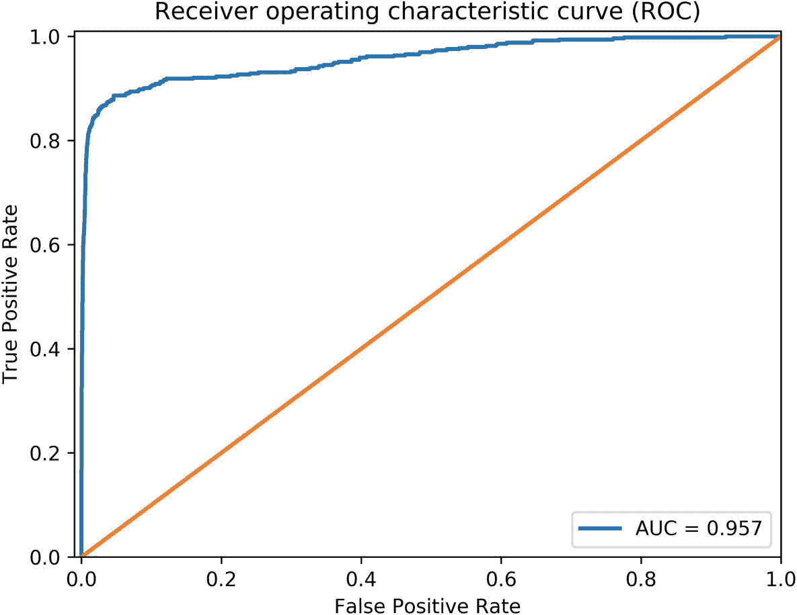

# 5.人工智能性能测量:思考商业价值

由汤姆·克鲁斯主演的电影《少数派报告》是少数几部探索科技对日常生活潜在影响的电影之一。除了对我们未来的理想主义观点，这部科幻电影还展示了一个几乎没有犯罪的未来，一个被称为“犯罪前部门”的特别警察单位根据“先知”提供的预知识别和逮捕罪犯。 [1](#Fn1) 为了便于理解我们通过这部电影所阐述的观点，以下是电影主要故事的简要概述:

> 这部电影以 2054 年为背景，DC 华盛顿州的犯罪前警察部门在杀人犯行动前阻止了他们，将谋杀率降低到了零。谋杀是通过预言师来预测的，他们通过接收未来的幻象来“预见”犯罪。联邦政府正在全国范围内采用该计划，这时犯罪前小组的负责人约翰·安德顿得知他将在 36 小时内谋杀一名陌生男子。当司法部指派来审计这个项目的特工维特沃开始搜捕时，约翰立即逃走了。安德顿寻求犯罪前技术的创造者艾里斯博士的建议。艾里斯博士透露，其中一个预言并不总是与其他两个一致，这是一个可能的替代未来的“少数派报告”。尽管 Iris 博士和 pre-crime 的主任和创始人 Burgess 知道这些信息，但这些信息对公众和 pre-crime 警察局项目是隐藏的。

为他们永远不会犯下的罪行逮捕罪犯是否有意义是另一天的讨论。相反，让我们从性能角度关注技术的使用。在这方面，这部电影提出了与数字技术的发展和广泛使用有关的基本问题。更准确地说，它突出了以下问题

*   为系统设定不切实际的期望，在这种情况下，开发团队不可能开发出满足期望的系统

*   就决策者而言，缺乏透明度和对当今尖端数字技术的理解

例如，犯罪前技术的用户除了预测和坚定不移地相信技术是正确和公平的之外，没有其他方法来评价/评估技术。他们依赖于一个他们对其表现知之甚少甚至一无所知的系统，以便对所谓的罪犯做出改变人生的决定。虽然是虚构的，但这部电影中的犯罪前技术在许多方面与当今的许多主流技术没有太大不同。例如，贷款批准预测算法通常用作接受或拒绝贷款申请的唯一依据。然而，鉴于被拒绝贷款的个人从未有机会表明他们有能力贷款，因此不可能确定对个人的还款意愿或能力做出正确的决定。

另一个人工智能系统在没有足够的评估和有效性信息的情况下向公众推出的例子是英国国家卫生服务机构采用的巴比伦卫生人工智能系统。在某些情况下，Babylon 的人工智能系统会分析患者的输入以及他们对一系列问题的回答，为他们提供相关的健康和分类信息。关于巴比伦人工智能系统的性能，来自 *The Lancet* 的一份出版物指出

> 无法确定 Babylon 诊断和分流系统在更广泛的随机病例集或由患者而非医生输入的数据上的表现如何。Babylon 的研究没有提供令人信服的证据，证明其 Babylon 诊断和分流系统在任何现实情况下都比医生表现得更好，而且有可能表现得明显更差。如果这项研究是巴比伦诊断和分类系统性能的唯一证据，那么它似乎处于 STEAD 框架的第 2 阶段(临床前)的早期。进一步的临床评估是必要的，以确保对患者安全的信心。[……](哈米什、恩里科和大卫 2018)

尽管声称系统的预测是确定的是不现实的，但是在过去性能的基础上量化和记录它的性能有助于减少这种知识差距，并且有助于协调系统用户和业务以及开发团队之间的期望。DS 实践者通常对如何评估他们开发的系统有很好的理解，但是经常不能清楚地向业务领导传达所报告的性能度量的含义和意义。当报告的性能指标不能说明系统的实际性能时，尤其如此。例如，一个人工智能系统预测一种致命但可治愈的疾病，这种疾病折磨着 0.01%的人口，准确率为 99.99%，但这可能仍然是一个糟糕的系统。在这种情况下，系统只需要预测“没有生病”,而不管其输入如何，以实现这种准确性。虽然 99.99%的准确率听起来非常好，但它没有考虑到当患者被错误地预测为“没有生病”时，他们可能会死亡的风险。因此，业务和开发团队使用的性能度量标准经常不一致也就不足为奇了。这指出了让开发团队和业务部门紧密合作的重要性，以保证开发中或使用中的系统为正确的目标而优化。

在这一章中，我们讨论了人工智能的性能度量标准，并考察了在定义人工智能系统的性能度量标准的过程中让商业决策者参与进来的必要性。本章的其余部分结构如下:

*   我们首先概述了评估人工智能系统的传统方法。

*   然后，我们扩展了评估人工智能模型的传统指标，以包括纳入组织开展业务的方式和价值观的指标，我们之前称之为软绩效指标。

*   最后，我们做一些总结。

## 人工智能性能指标概述

所有数字技术都有一些局限性，它们在执行设计任务时表现如何，人工智能技术也不例外。当考虑人工智能系统的性能时，有多个领域令人感兴趣，从人工智能算法的性能、跨系统性能到软性能。本节概述了人工智能算法的性能指标(人工智能算法和最大似然算法可以互换使用)。系统性能的讨论，指的是整个 AI 系统的性能， [2](#Fn2) 不在本书的讨论范围之内。相反，软性能的概念(将在下一节详细讨论)涉及独立于人工智能算法交付预期结果的能力的性能指标。例如，假设隐私是一个问题，侵犯数据主体隐私的 AI 系统通常在软性能尺度上表现不佳，与系统性能无关。

根据输入数据是否被标记，ML 算法可以粗略地分为监督算法和非监督算法。有监督的算法使用带标签的数据来学习一种系统化的方法来近似给定输入的标签，而无监督的算法试图找到模式并理解未标签的数据。换句话说，监督算法通常用于“监督问题”，这意味着我们有一个完整的样本，其中既有预测因子的信息，也有要预测的变量的信息。相比之下，无监督算法用于“无监督问题”，对此我们没有示例答案。监督和非监督问题的自然延伸是半监督问题类，其中算法提供有标记和非标记数据。

这几组问题可以用实例来说明。给定十个家庭的属性，例如，卧室和居住者的数量，以及关于每个家庭的电力消耗的*信息*，估计新家庭的电力消耗的任务是一个监督问题，对于该新家庭，我们也具有关于属性的全部信息。在此任务中，一个示例是家庭的属性及其实际用电量。现在，假设这些家庭属于三个年龄组，而我们不知道哪些家庭属于某个年龄组。将这些家庭分成三组，使得每组中的家庭属于同一年龄组的任务是无监督问题的一个例子。

下面回顾了每一类问题的性能指标。

### 监督问题

用于评估机器学习模型的性能的度量的选择通常取决于手边的应用。对于需要预测类别、种类或标签的分类问题，最流行的度量标准包括*分类准确度*(通常称为*准确度*)、*对数损失*、*混淆矩阵*、*曲线下面积(AUC)* 和*F-度量*。对于需要预测数量的回归问题，最常用的是*平均绝对误差*和*均方根误差*。请注意，这些指标只有在测试数据集上计算时才有意义，也就是说，这些数据集没有用于预测值的初始计算或模型的训练。

在继续之前，有必要通过一个例子详细说明其中的一些概念，例如信用卡欺诈。信用卡欺诈是商业街银行普遍面临的问题。因此，他们投入了相当大的努力来打击信用卡诈骗。为了支持这些努力，银行可以与他们的 DS 部门合作，DS 部门可以使用 AI 来积极监控和识别可疑或欺诈性的信用卡交易。根据我们之前的定义，这个问题可以被视为一个分类问题，因为它归结为决定一项交易是否属于以下类别之一:欺诈性和非欺诈性。或者，为了清楚起见，如果我们关心的是在每笔交易中从账户中取出的金额，那么这个问题将被视为回归问题。在开发阶段，DS 团队需要评估他们的机器学习算法在确定交易是否欺诈方面有多好。为了实现这种评估，通常的做法是依赖评估指标，我们将在下面讨论。为了继续阅读本书，没有必要理解它们，因此可以跳到“被监督问题的性能度量的总结”部分进行简短的总结。

#### 分类问题的评价指标

本节重点介绍最常用于评估分类问题的性能指标:

表 5-1

欺诈检测分类器的混淆矩阵

<colgroup><col class="tcol1 align-left"> <col class="tcol2 align-left"> <col class="tcol3 align-left"> <col class="tcol4 align-left"></colgroup> 
|   |   | 

预测

 |
| --- | --- | --- |
|   |   | **非欺诈性** | **欺诈** |
| **实际** | **非欺诈性** | (总氮) | (FP) |
| Twenty-eight thousand one hundred and fifty-eight | Two hundred and seventy-four |
| **欺诈** | (FN) | (TP) |
|   | Ninety-two | four hundred |

*   **分类准确率** **:** 一般称为准确率，是正确预测的比例。这个指标通常不是一个很好的模型性能指标。例如，在具有非常少的 0.2%欺诈交易的欺诈检测服务的情况下，考虑到欺诈交易的小比例，通常可以通过简单地将所有交易分类为非欺诈来实现非常高的准确度。这违背了识别欺诈交易的目的。

*   **对数损失** **:** 也称为 log loss，通过惩罚不正确的分类来量化一个分类器(分类算法)的准确性。这在有两个以上类别的设置中特别有用，也称为多类别分类。对数损失可以取的最小值是零(0)，在这种情况下，分类器是完美的。通常，接近零的值表示高精度，而远离零的值表示低精度。

*   **混淆矩阵** **:** 混淆矩阵通常被称为误差矩阵，混淆矩阵本身并不是一种评估指标，而是一种方便的表格结构，用于捕获和可视化分类模型的性能。此外，它还是下面讨论的其他指标的基础。使用前面介绍的欺诈检测问题，让我们假设我们有一个分类器，它将 28，925 笔交易作为输入，我们知道这些交易的真实标签。分类器的工作是将样本中的每笔交易标记为*欺诈*或*非欺诈*。我们可以使用如表 [5-1](#Tab1) 所示的混淆矩阵将我们的分类器的性能与真实标签进行比较，其中从左上角单元格到右下角的对角线上的值表示被正确分类的交易数量。

以下概念通常与混淆矩阵相关联:

*   **真阳性(TP):** 观察是欺诈性的(阳性)，并且预测是欺诈性的。

*   **真阴性(TN):** 观察结果为阴性(非欺诈性)，预测为阴性。

*   **假阳性(FP):** 观察结果为阴性(非欺诈性)，但预测为阳性(欺诈性)。

*   **假阴性(FN):** 观察结果为阳性(欺诈性)，但预测为阴性(非欺诈性)。

在这里，欺诈是积极的，非欺诈是消极的。

表 [5-1](#Tab1) 中突出显示的假阳性和假阴性特别令人感兴趣，因为它们告知算法做出错误决定的可能性。根据手头问题的性质，假阳性可能超过假阴性，反之亦然。以欺诈检测为例，假阳性可能比假阴性更好。

##### 曲线下面积

评估分类器质量的另一个度量是曲线下面积。从零到一，曲线下的面积用于评估二元分类器区分阳性和阴性观察值的能力。AUC 越高，模型就越能更好地将负面观察归类为负面，将正面观察归类为正面。这里所指的曲线是接收器工作特性(ROC)曲线，其中真阳性率(灵敏度或召回率)相对于相应的假阳性率(1-特异性)重复绘制，通过在改变分类器参数的同时重复估计分类器来获得。AUC 定义中涉及的术语定义如下:

*   **真阳性率/召回率/灵敏度:**也称为灵敏度或召回率，对应的是被正确归类为阳性的阳性观察值的比例。它可以被认为是一个概率，一个观察将被归类为积极的，因为它实际上是积极的。以欺诈检测为例，它是指交易在欺诈时被归类为欺诈的概率。形式上，它被定义为如方程式 [5.1](#Equ1) 所示。回忆强调假阴性，高回忆通常表示低假阴性。

(5.1)

*   **特异性:**特异性对应于当一个观察实际上是阴性时，该观察将被分类为阴性的概率。在我们的欺诈检测示例中，假设交易是非欺诈性的，则它被标记为非欺诈性的概率。等式 [5.2](#Equ2) 给出了特异性的正式定义。

(5.2)

*   **假阳性率(FPR):** 它对应于被错误分类为阳性的阴性样本的比例，并且可以从特异性中导出，如等式 [5.3](#Equ3) 所示

(5.3)

图 [5-1](#Fig1) 说明了欺诈检测问题的 AUC。对角线描绘了随机分类器的性能。这是一种随机将交易分类为欺诈或非欺诈的分类器，没有预测能力。低于对角线的分类器是坏的分类器，因为它的性能不比随机的好，而高于对角线的分类器通常是可接受的，这取决于问题。最佳情况是 AUC 跟踪垂直轴向上，并且在各种假阳性率中，真阳性率保持为 1。

图 5-1

欺诈检测分类任务的 AUC-ROC 曲线

##### 为分类选择“正确的”性能指标

有人可能想知道为什么有这么多指标可供选择。“正确的”度量标准的选择通常取决于人们试图解决的问题以及对应用领域的理解程度。这强调了 DS 团队与企业携手合作的必要性。为了说明这一点，考虑用于筛查癌症患者的分类器的例子。让我们假设分类器具有以下性能特征:

*   灵敏度= 0.90

*   特异性= 0.85

*   假阳性分数= 0.15

*   假阴性分数= 0.10

因此

*   如果患者患有癌症，筛查测试有 90%的可能性为阳性(分类器预测患者患有癌症)。

*   如果患者没有癌症，筛选测试将有 85%的可能性是阴性的(分类器预测患者没有患病)。

筛查测试的误差通过假阳性和假阴性分数来量化。

*   如果患者没有患癌症，则有 15%的可能性检测呈阳性。粗略地说，如果患者没有癌症，有 15%的概率分类器会错误地将患者标记为患有癌症。这可能是一个很大的问题，因为阳性结果可能会引起焦虑。

*   如果患者患有癌症，则有 10%的可能性检测为阴性。换句话说，如果患者患有癌症，分类器有 10%的概率将该患者标记为未患癌症，给患者及其家人一种虚假的安全感。

这表明，如上所述，最合适的性能指标可能取决于错误的含义，突出了在业务目标的背景下考虑性能指标的需要。在上面的癌症例子中，假阴性更麻烦，而假阳性至少允许患者进行更多的测试，以了解它是真还是假阳性测试结果。因此，我们可能希望减少假阴性的可能性，即使这意味着假阳性的增加。

Note

在临床环境中，置信区间(CI)通常与特异性和敏感性一起提供。从形式上来说，CI 为未知估计量提出了一系列似是而非的值。与此 CI 相关的是真实参数在建议范围内的置信水平。

在评估算法的性能时，跟踪灵敏度和特异性等多个指标可能会很困难，因为人们经常需要做出权衡。因此，使用将多个单独的指标组合成一个指标的指标通常是很方便的。一个这样的度量是下面讨论的 F-measure。

##### f-测度

也称为 F-score 或 F1-score，F-measure 通常用于二进制分类，并依赖于两个关键概念:*回忆一下我们前面介绍的*，以及下面介绍的*精度*。

精确度或阳性预测值(PPV)是所有被分类为阳性的观察值中被正确分类为阳性的观察值的比例。换句话说，具有阳性预测值的主体真正属于阳性类的概率。形式上，其定义如方程式 [5.4](#Equ4) 所示:

(5.4)

虽然 precision 会在观察结果不是阳性时(假阳性)将其分类为阳性，但 recall 会在观察结果是阳性时(假阴性)不将其分类为阳性。换句话说，当假阳性的成本高时，高精度是优选的，而当假阴性的成本高时，高召回是优选的。使用我们的欺诈检测示例，高召回率是更可取的，因为最好将交易错误地识别为欺诈，从而允许进行进一步的检查，而不是不识别它，从而错误地遗漏潜在的欺诈交易。

很难同时跟踪精确度和召回率，尤其是在开发阶段。这就是 F 分数发挥作用的地方。如方程 [5.5](#Equ5) 所示，定义为精度和召回率的调和平均值 [3](#Fn3) 。它可以被认为是精确度和召回率之间的某种平衡。调和平均值所固有的 F 度量的一个有趣的性质是，它更接近于精确度和召回率之间较小的度量。例如，如果精度小于召回率，则精度的倒数将大于召回率的倒数。因此，得到的 F 分数将比回忆起来更接近精确。

(5.5)

#### 回归问题的评价指标

如前所述，回归问题最流行的性能指标包括均方根误差和平均绝对误差。这些指标越低，模型越好。

*   **平均绝对误差(MAE):**MAE 测量预测值和实际值之间的绝对差值。它是预测和实际观察之间绝对差异的平均值。MAE 由方程 [5.6](#Equ6) 正式定义:

    

    (5.6)

    其中 *N* 为观察次数，*y*T5】I为观察值 *i* ，为观察值 *i* 的估计/预测值。

*   **均方根误差(RMSE):** 与 MAE 类似，RMSE 用于衡量预测值与实际(或测量)值之间的绝对差值。其计算如方程式 [5.7](#Equ7) 所示。请注意，求平均值之前先求差值的平方。因此，大误差比小误差对 RMSE 的贡献更大。因此，当不希望出现大误差时，RMSE 可能更合适。然而，它不像 MAE 那样容易解释。

例如，假设一个人工智能模型估计伦敦家庭每年的能源消耗，均方根误差为 4，我们真的能对算法的性能说些什么吗？这并没有说太多的实际估计。因此，在这种情况下，均方根误差是开发模型的好指标，但不一定是向企业报告模型性能的好指标。

(5.7)

这里， *N* 是观察次数，*y*T5】I是观察值 *i* ，是观察值 *i* 的估计/预测值。

#### 监督问题的性能度量摘要

监督学习问题的性能度量的共同特征是它们都有很强的数学基础。这是非常有用的，因为它为开发人员提供了一个框架来开发和评估模型，而业务决策者的干预很少。另一方面，业务决策者通常很少或根本不了解这些指标在他们的日常业务运营中意味着什么。这影响了性能度量在帮助 DS 团队开发最符合业务目标的模型方面的有用性。

### 无人监督的问题

常见的无监督问题一般可以分为聚类和降维和关联。聚类旨在发现数据固有的组。这种技术的实际应用是客户细分，其中服务提供商试图将其客户分成组，使得每个组中的客户具有一些共同点(例如，电力消耗模式、对广告活动的响应)。关联分析试图发现描述大部分数据的有趣的关系规则。例如，一家公用事业公司可能有兴趣了解客户在订购锅炉设备时可能会购买哪些其他产品。这些信息可以用来捆绑多种产品，或者在他们订购锅炉安装时推荐其他产品。降维最常见的应用是数据可视化。这种技术试图找到数据的新表示，以便尽可能多地保留关于原始数据的信息。它提供了实质性的好处，因为人们可以将数据的维度减少到两个或三个坐标，以便更好地可视化。生物学家广泛使用降维作为后续分析的预处理步骤(例如，可视化高维基因组数据)。

评估无监督问题的性能是一项困难的任务。这归因于这样一个事实，即对于无监督学习问题，通常没有参考“基础事实”结果来比较曾经提出的解决方案。对于聚类，关键方法包括内部、外部、人工和间接评估(费尔德曼和桑格 2006 年):

*   内部评估将聚类总结为反映其质量的分数。

*   对于外部评估，聚类与“基本事实”分类进行比较。

*   在手动评估设置中，聚类由人类专家检查。

*   间接评估包括评估聚类在其预期应用中的效用。在这种情况下，集群被认为是帮助执行另一项任务的一个步骤。然后通过查看其他任务的性能来评估适当的聚类。例如，在需求响应程序中， [4](#Fn4) 主要任务是让用户将他们的用电从高峰时段转移到非高峰时段。通常可以根据用户的用电模式将他们分成不同的部分。允许识别适合于需求响应程序的用户群。可以尝试一些聚类方法，并根据它们对需求响应任务的帮助程度来评估它们的结果。

与人工和间接评价方法不同，内部和外部评价方法在实际应用中很少用于判断一个聚类。然而，他们提供了有用的统计数据，以确定不良集群(韦斯等人，2004 年)。

在关联分析设置中，重点是从可能的规则集中选择感兴趣的规则(Hipp，Guntzer，和 Nakhaeizadeh 2000 霍尼克、格伦和哈斯勒 2005 年)。这是通过对各种重要和感兴趣的度量的约束来实现的。其中，最常用的是支持和信心的最低阈值。一个项集 [5](#Fn5) 的“支持度”可以认为是一个项集在一个数据集中的出现频率。给定两个项目集和链接它们的关联规则，规则的“置信度”是规则被发现为真的频率的指示。例如，考虑一家超市的情况，该超市具有以下项目集*{牛奶，面包}* 和*{黄油}* 以及关联规则*{牛奶，面包} =>{黄油}* (简单地说，意味着购买面包和牛奶的顾客也可能购买黄油)。项目集*{牛奶，面包}* 的支撑是包含牛奶和面包的交易比例。然后，让我们假设我们计算出示例关联规则的置信度为 0.5。这意味着，对于 50%包含牛奶和面包的交易，该规则是正确的(Hornik，Grün 和 Hahsler 2005)。

无监督问题的实际应用往往与商业期望一致，或者至少被商业决策者很好地理解。这是因为无监督学习的最终目标是创建在预期应用领域中有意义的聚类(在聚类的情况下)或规则(在关联学习的情况下)。粗略地说，无监督问题的实际应用通常被商业或领域专家所接受，因为

*   他们经常在验证阶段被咨询，因为广泛使用的间接和手工评估方法需要领域和业务专家的输入。

*   结果所讲述的故事通常是人们熟悉的事情，可以联系到或有明确的商业含义。

## 超越传统的人工智能性能指标

在本节中，我们将讨论软性能指标，并通过一个用例强调将传统人工智能性能指标作为业务目标的必要性。

### 软性能指标

正如本章前面所讨论的，人工智能性能指标可能既复杂又经常与业务目标脱节。第 [4](4.html) 章提倡扩展传统的人工智能性能指标，以包括一类新的指标，我们称之为软性能指标。

软性能度量可以被认为是在 AI 系统的整个生命周期中强加给它的约束。一个组织与另一个组织之间设置的约束可能会有很大的不同。因此，我们的讨论仅限于那些参与可持续发展和人工智能使用的构建模块。这些包括但不限于偏见、隐私和可解释性。考虑到定义这些概念的多种方法，组织需要在缺少标准的地方维护每个概念的组织范围的定义和解释。

#### 偏见

也称为算法偏差，它发生在当一个算法的结果是不公平的时候， [6](#Fn6) 一般是针对某个特定群体的个体。没有标准的方法来评估人工智能系统的偏见。尽管如此，我们可以通过仔细检查和监控算法使用的数据及其在整个 DS 开发过程中不需要的行为的结果来测试偏差。数据可以说是人工智能中偏见的最大贡献者，这可以归因于人工智能算法在开发阶段(训练)从根本上依赖于输入数据(知识库)来构建其决策逻辑。因此，算法的决策，不管手头的问题，继承了数据固有的缺陷和不完善。

揭示数据固有的缺陷和不完美包括理解人工智能系统的目标受众 [7](#Fn7) 。这有助于识别可能代表偏见来源的受众属性；我们将这些属性称为“敏感属性”敏感属性通常包括大多数人口统计信息，如性别、职业、年龄等。然后，人们可以监控系统的输出(预测和建议)在给定这些属性的情况下的偏差。减轻偏见的方法包括但不限于

*   在开发过程的早期让系统的最终用户和业务决策者参与进来。

*   调整分类器，使得所有组具有(几乎)相等的概率被分配给分类问题的正面结果。类似地，人们应该在回归设置中寻求所有组之间的平衡预测误差。

*   确保所有组具有相似的假阳性和假阴性率。

*   确保模型足以解决潜在的问题。使用估计家庭电力消耗的问题，可以决定创建一个模型，该模型简单地将一个家庭的电力消耗估计为同一街道上所有家庭的平均消耗。这种模型不足以解决这个问题，因为每个家庭都有自己的特点，而这些特点通常不能通过平均街道上家庭的消费来获得。因此，预测误差将明显大于使用考虑家庭个体特征的模型。

*   平衡敏感属性。例如，主要针对男性训练的面部识别系统将难以识别女性。在开发过程中使用几乎相等数量的男性和女性可以帮助算法学会平等地识别两组。

如前所述，没有足够的来自特定目标人群的数据点会导致偏见。过采样等数据增强技术和分层采样等方法有助于减少偏差(Vasileios 和 Eirini 2018)。简而言之，过采样(更准确地说，随机过采样)包括创建一个数据集，其中少数群体的实例与多数群体的实例一样多。这是通过复制少数群体的随机实例来实现的。合成少数过采样技术(SMOTE) (Chawla 等人，2002 年)是另一种流行的技术，旨在改善分类问题的随机过采样。与随机过采样不同，SMOTE 不会复制少数群体的实例，相反，正如其名称所示，它会创建少数群体的合成实例。更准确地说，SMOTE 过采样的工作原理是选取少数群体的每个实例，并找到其 k-最近邻。然后，它沿着连接少数实例及其任何或所有邻居的线创建一个合成实例。尽管取得了成功，但一些研究表明，SMOTE 在应用于大型数据集时可能不会产生显著影响(布拉格斯和苏露莎，2013 年)。

分层随机抽样等技术可用于确保目标人群中的每个亚组都得到适当的代表。然而，分层抽样并不总是可行的，尤其是在某些情况属于多个亚组的情况下。这是因为分层随机抽样根据共有特征将感兴趣的人群分成更小的组(称为阶层)。

分层 k 倍交叉验证是解决偏倚问题的另一种方法。k-fold 交叉验证是一种模型验证技术，通常在数据集规模较小时使用。在 k 倍交叉验证设置中，数据被随机分成 k 个大小相等的分区或折叠。k 个样本中的一个被保留作为验证数据集，而剩余的 k-1 个样本用于训练模型。这个过程重复 k 次，每个分区正好用作验证数据集一次。结果，总共创建并验证了 k 个模型。然后对这些模型的性能进行平均，以产生模型性能的单一估计。虽然 k-fold 交叉验证通常可以很好地估计模型的性能，但当数据集具有不平衡的类分布时，它就不那么有效了。这是因为在 k 倍交叉验证过程中创建的某些分区可能没有反映原始数据集的分布。换句话说，一些分区可能只有很少或没有少数类的实例。分层 k-fold 交叉验证通过确保 k-fold 过程的每个分区中的类分布与原始数据集的分布相匹配来解决这个问题(he 和 Ma 2013)。在这种设置下，模型需要正确预测少数类和多数类，以获得良好的性能，而不是只需要正确预测多数类的观察值。

最近，人工智能社区一直在积极研究有效识别和减少甚至消除算法偏差的方法。人工智能公平 360 开源工具包就是这种努力的例证。尽管如此，在人工智能系统的开发中让更广泛和多样化的受众参与进来，可能仍然是识别和减轻偏见的明智方法。这背后的基本原理是，人类通常倾向于在他们的决策中添加更多的上下文而不是算法。例如，根据胸部 x 光片预测患者是否患有结核病的 AI 系统使用固定的上下文，在这种情况下是胸部 x 光片。然而，承担同样任务的医生可能会纳入更多信息，如平衡症状与患者为减轻症状而采取的其他措施的副作用。

人工智能系统的额外信息可以通过图形表示学习来捕获(Bo et al . 2018Thomas 和 Welling 2016)或图形嵌入。后者可以被约束以加强公平性(Avishek 和 Hamilton 2019)并减少偏见。同样，其他用于减轻偏见的处理中(训练期间)方法涉及使用特殊技术，如对抗性机器学习(Beutel et al . 2017 张虎，布雷克和米切尔 2018 年)或应用算法的限制，使其表现出某种形式的公平(神岛，赤浩，佐久法史 2011 年；穆罕默德、瓦莱拉和曼努埃尔 2015)。

当讨论偏倚时，人们很自然地会怀疑将敏感属性从数据集中剔除是否能解决问题。不幸的是，这是不够的，因为许多属性往往与敏感的人口统计信息相关(神岛，赤浩，佐久法史 2011；费尔德曼等人 2014；阿迪蒂亚和罗伯特 2017)。

总之，重要的是要理解算法偏见可能会导致不公平的结果，例如，以歧视的形式。也就是说，鉴于目前的数据来源，可能不可能有一个无偏见的人工智能系统。因此，识别和记录算法偏差造成的限制已经是一大进步。由于算法偏差是我们社会固有的，因此也是当前知识库(数据)固有的，这可能意味着完全消除算法偏差最终需要丢弃我们迄今为止收集的现有数据。换句话说，目前大多数组织数据库中的数据质量很差，不适合(接近)无偏差的数据驱动策略。因此，当旨在开发一个接近无偏差的数据驱动策略时，组织将需要定义他们想要解决的问题，并相应地设计相关的数据收集。算法部署在我们用于医疗保健、教育、政府、刑事司法和经济系统的技术中。因此，算法偏见可以影响社会制度层面的运作，有效地作为一种具有非常广泛影响力的社会力量。减少并最终消除应用程序中的算法偏见应该是所有未来人工智能发展的关键优先事项，以避免现有的偏见永久化。

#### 隐私

隐私是一个很难理解的复杂概念。GDPR 等数据保护法规的出台，凸显了一个核心隐私方面，即对用户个人数据的控制权。然而，从组织的角度来看，满足用户对控制的需求比建立概念本身更复杂。这是因为非常敏感的个人属性可以从容易获得的行为数字记录(如社交媒体赞)中准确推断出来(Kosinski、Stillwell 和 Graepel 2013)。因此，组织需要制定和实施超越数据保护法规的隐私政策，以满足用户的期望。这种做法要求组织首先了解影响用户隐私需求的因素，其次设计和实施减轻隐私问题的政策。当组织使用第三方进行计算(例如，通过应用编程接口(API)使用机器学习服务)或共享用户数据时，这一点尤为重要。

一些组织通过在共享(与其他组织或公众)之前删除个人标识符来自然地匿名化用户数据。然而，如上所述，鉴于背景知识信息的广泛可用性，取消匿名化通常是可能的，这意味着匿名化本身通常不足以保护用户隐私。例如，Narayanan 和 Shmatikov (Narayanan 和 Shmatikov 2008 年)利用他们对互联网电影数据库(IMDb)和网飞为网飞电影推荐竞赛发布的匿名数据的了解，设法确定了已知用户的网飞记录，并进一步推断出他们明显的政治偏好。

可以考虑开发机器学习算法的替代方法。例如，隐私保护算法可以允许多方联合构建机器学习模型，而不必共享他们的输入数据集(Shokri 和 Shmatikov 2015 博纳维茨等人 2019；唐等 2019；Phong 等人 2018)。由谷歌开发的 TensorFlow 联邦框架是一种尝试，旨在使隐私保护算法可供更广泛的人工智能社区使用。尽管具有潜力，隐私保护技术仍存在与可扩展性和安全假设相关的具体挑战(Al-Rubaie 和 Chang 2019)。此外，需要采取必要的预防措施以避免偏见，并且应该理想地编码到保护隐私的学习框架中。

虽然大多数关于隐私的讨论都与人工智能和非人工智能系统相关，但后者需要更多的关注，因为

*   人工智能系统收集和聚合更多数据的需求

*   人工智能系统准确推断数据收集和汇总过程中未明确披露的信息的能力

为了说明，让我们假设一个组织收集关于其客户的数据(无论是否得到他们的同意)；主要有两种情况:(a)数据被人工智能系统使用，以及(b)数据不被人工智能系统使用。在后一种情况下，组织可以使用这些数据来计算关于其客户群的统计数据，这可以被认为是关于组织的客户群的“事实”。这样做对任何给定个人的隐私影响有限，因为这些事实可以从数据中明确获得。

在前一种情况下，人工智能系统有可能通过其内部过程，从数据中创建“新的” [9](#Fn9) 信息。由于新信息的性质和/或它对 AI 系统做出的决定的影响，这在某些情况下是不希望的。例如，系统可以准确地预测用户的种族，这是用户可能不愿意公开的，并且可以进一步基于用户可能不同意的这一信息做出决定。受影响的用户即使同意收集数据，也很少明确同意组织使用或拥有此类新信息。但是请注意，即使推断的信息是错误的或不准确的，组织仍然可能对其误用负责。

#### 可解释性

可解释性的概念长期以来，并且仍然是人工智能中的一个主要关注点。这可以归功于人工智能的成功及其影响我们生活几乎每个方面的能力。机器学习中的可解释性概念没有标准定义；然而，可解释性通常由人们(如用户)对机器学习模型决策过程的理解程度来判断(Miller 2017)。例如，线性回归和决策树等更简单的模型自然比神经网络等复杂模型更容易解释。相反，复杂的模型通常比简单的模型更准确。因此，准确性和可解释性可能经常代表相互冲突的目标，人们需要在两者之间找到正确的平衡。

由于机器学习模型从数据中继承了偏见，因此通过更容易地解释模型的决策来使模型更具可解释性，可以帮助人们评估模型在多大程度上表现出以下特征(Finale 和 Been 2017):

*   **公平性:**如前所述，该模型不应明确或隐含地歧视某一特定人群，而是旨在实现无偏见的预测。例如，一个可解释的模型可以透明地解释为什么它决定一个人处于犯罪的高风险中，允许人类评估该决定是仅仅基于敏感属性还是无偏见的逻辑。

*   **隐私:**一个可解释的模型应该更容易理解数据中的敏感信息是否受到保护。

*   **可靠性或稳健性:**输入的小变化不应导致输出的大变化。

*   **因果关系:**该模型依赖于因果关系，而不仅仅是相关性，这并不意味着预测能力。

*   信任:人们倾向于信任他们了解的系统。

虽然某些机器学习模型依赖数据来获得新的见解，但其他一些模型关注的是产生输入数据的新表示。光学字符识别(OCR)是机器学习的一种应用，它将打字、手写或印刷文本的图像转换为机器编码的文本。因此，它是后一类的一个例子，而评估个人犯罪风险的模型属于前一类。通常，与生成新的数据表示有关的模型(如 OCR)不需要是可解释的，因为它们只是旨在提供给它们的信息的“相同”表示。然而，组织应该评估和记录他们的哪些 AI 系统需要围绕可解释的机器学习模型来构建。在这方面，政策制定者可以通过提供关于需要可解释的应用程序的指南来帮助保持跨组织或行业的一致性。

Gillespie (Gillespie 2017)认为，用户可以根据自己的利益操纵输入的应用程序可能是不可解释的。例如，在上面介绍的欺诈检测示例中，如果欺诈用户知道随机提取大量现金会增加他们被检测到的可能性，他们可能会决定提取几次相对较低的现金金额。

通常，实现可解释性的方法包括以下之一:

*   将模型的能力限制为简单模型。例如，使用线性回归或决策树。

*   依赖于在训练阶段完成后分析模型的工具。例如，这些可以揭示每个属性对算法决策的贡献有多大。

### 人工智能性能指标设计中的业务参与:从性能指标到业务目标

本节通过一个用例强调了在数据科学开发过程中涉及业务 [10](#Fn10) 的必要性。本节以能耗估算为例，说明了如何将传统的人工智能性能指标转化为符合组织价值观和经营方式的业务指标。除了创建符合组织价值观的人工智能系统，将传统的人工智能性能指标转化为商业或组织价值观的一个关键好处是，它在参与人工智能系统开发的各方之间创建了一个自然的沟通渠道。如下图所示，这一过程可能会受到各种因素的影响，从监管因素到人为因素，再到寻求维护其声誉的组织。

### 能耗估算

以下讨论了估算英国一家能源供应商的直接借记客户的能源消耗的问题。为了建立直接借记(DD)客户，能源提供商通常会计算 12 个月的估计消耗量，从而为客户选择的费率计划提供年度报价。 [11](#Fn11) 但是，客户的环境可能会发生变化，导致他们的使用习惯上升或下降。因此，以上述方式得出的数量可能会发生变化。因此，DD 重新评估通常在 6 个月后进行，以确保付款与客户的实际消费相符。

现在，考虑重新评估初始估算和相关影响如何影响负责提供消耗计算器/估算器的数据科学团队的工作方式是一件有趣的事情。尽管任何方法都可以用于估计用户的电力消耗，但监管机构通常要求在英国运营的公用事业公司能够向其最终用户解释估计值。此外，随着竞争的不断加剧，销售人员需要能够解释，例如，为什么一居室公寓的报价似乎明显高于他们的预期。这就需要一个精确的、可解释的估算器，正如前面所强调的，这两个目标可能是相互冲突的。

组织自然地优先考虑可解释的估算者，而不是结果无法解释的精确的能量估算者。一般来说，准确性可能经常会因为类似的业务需求而受到损害。这当然取决于手头任务的性质；一般来说，一个可以解释的差的估计比一个不能解释的好的估计更好。

此外，对 DD 重新评估的需求进一步限制了数据科学如何评估估计量。DD 重新评估通常审查初始评估，并增加、减少或保持每月分期付款金额不变。由于我们的天性，如果他们的月 DD 突然下降，大多数人不会质疑他们的提供商，但如果上升，他们更有可能这样做。从商业角度来看，这将导致每次客户来电的处理成本，并可能影响提供商的声誉或留住客户的能力。换句话说，企业的利益在于最大限度地减少 DD 重新评估后可能收到的电话数量，同时确保他们从消费者那里收到足够和及时的付款。当这不可能时，业务部门需要对 DD 重新评估后可能致电的客户比例进行明确的估计。

如前所述，剩余均方误差是评估回归问题的一种常用方法，就像手头的这个问题一样。接下来的挑战是创建一个从剩余均方误差中提取的指标，以提供 6 个月后 DD 重新评估后潜在呼叫者数量的估计值。我们在本书中并没有设计出一个完整的解决方案，因为组织可以通过自己的努力来获得超越竞争对手的战略优势。总之，除了准确之外，估算器还需要可解释，同时最小化调用次数(调用次数可能会使估算产生偏差，从而高估耗电量)。更一般地说，本节强调了从业务需求中获取性能指标的重要性。

## 结论

本章讨论了评估人工智能系统性能的方法。这些方法可以分为传统方法和非传统方法。两者各有利弊。一方面，通常用于监督问题的传统方法已经被人工智能系统设计者很好地建立和理解。然而，它们经常与组织的目标脱节。另一方面，通常用于无监督问题的非传统度量通常符合组织的期望。然而，它们通常缺乏数学框架，难以定义，并且通常是特定于问题的。此外，本章扩展了人工智能系统的性能指标，以包括软性能指标，并强调需要从尽可能反映组织开展业务方式的目标中推导出这种人工智能性能评估指标。

<aside aria-label="Footnotes" class="FootnoteSection" epub:type="footnotes">Footnotes [1](#Fn1_source)

术语“预知者”是指有预知能力的人。

  [2](#Fn2_source)

包括适用于任何数字系统的性能指标。

  [3](#Fn3_source)

给定观察集的倒数的算术平均值的倒数(维基百科)。例如，给定三个数字 2、3 和 5，它们的倒数的平均值由(1/2 + 1/3 + 1/5) /3 = 1.03/3 给出，得到调和平均值 3/1.03 = 2.91。

  [4](#Fn4_source)

让客户有机会通过将高峰时段的用电转移到非高峰时段来提高电网的效率。

  [5](#Fn5_source)

相关元素组。

  [6](#Fn6_source)

例如给任意一组用户赋予比其他用户更高的特权。例如，当前最先进的面部识别系统在试图识别深色皮肤和女性面部时具有较高的错误率。

  [7](#Fn7_source)

目标受众是感兴趣的人群。

  [8](#Fn8_source)

[T2`https://aif360.mybluemix.net`](https://aif360.mybluemix.net)

  [9](#Fn9_source)

从组织的角度来看是新的，因为提供数据的客户可能已经掌握了推断的信息。

  [10](#Fn10_source)

一般来说，对系统结果感兴趣的任何一方。

  [11](#Fn11_source)

为简单起见，我们假设费率在估算期内是固定的。

 </aside>