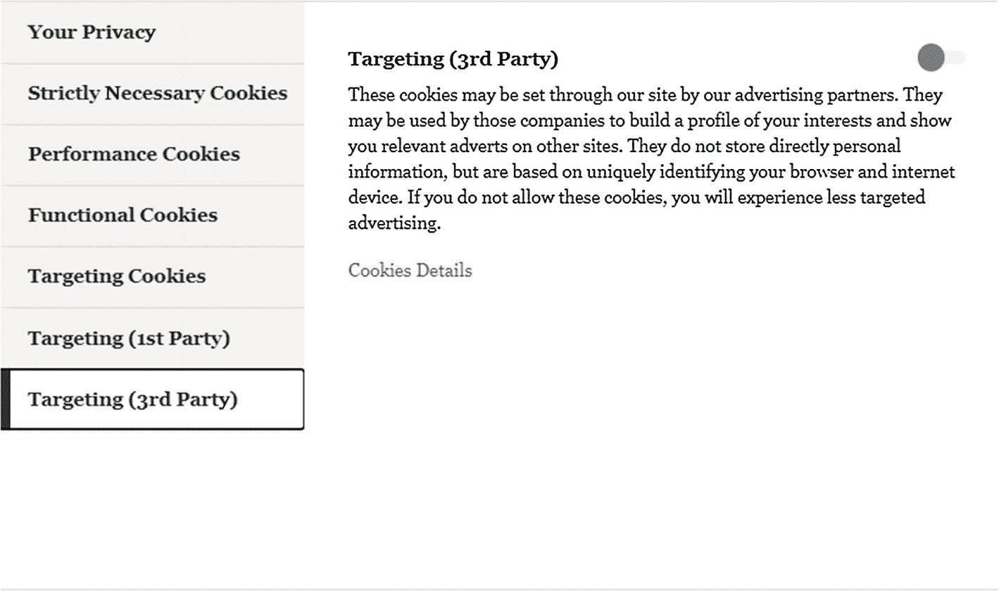
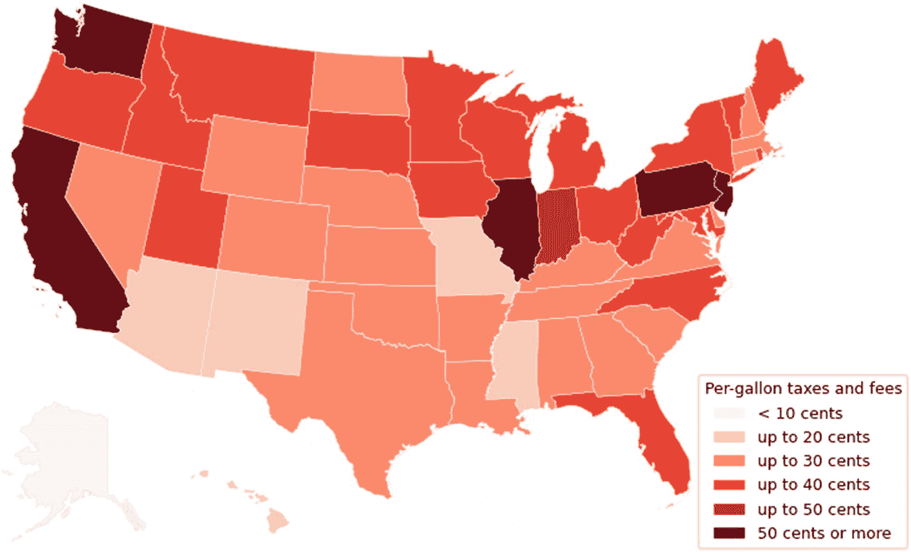

# 七、管理人工智能开发的替代途径

AI and Regulations

到目前为止，我们已经讨论了许多与人工智能系统相关的潜在伦理后果。更重要的是，我们提出了 SAIF，一种帮助组织及其利益相关者进行人工智能尽职调查的方法，以防止、识别、更好地理解和减轻人工智能系统开发和部署过程中由 DS 实践导致的不良后果。我们也看到一些国家，主要是发达国家，已经引入了监管措施，如 GDPR 的数据保护条例。此类法规要求服务提供商在收集用户数据(包括用户与服务交互产生的数据)之前，明确获得用户的知情同意。我们认为，到目前为止，这些法规无效的原因有多种，包括:

*   用户不能使用某些服务，除非他们同意收集数据。此外，条款和条件通常非常复杂，用户无法理解，并且经常被设计成允许服务提供商收集比提供服务所需更多的信息。换句话说，如果用户想继续使用某项服务，他们经常会发现自己被困在一个旨在最大限度地收集数据的系统中。更一般地说，系统的框架——即系统如何呈现给用户并被公众理解——通常掩盖了服务的各种操作方面。

*   监管者无法创造一个能够保证其监管体系有效性的环境。这样的环境需要技术资源、框架、工具和流程来执行现有的法规。

*   数据保护法因国家而异，有些根本没有。对于发展中国家来说，通常有比数据隐私更重要的事情。因此，与监管更严格的国家相比，这些国家的人们可能更容易受到数据利用的影响。公司在这些监管较少的地区出售服务，仅仅是为了获取和利用数据，这种情况并不少见。 [1](#Fn1)

有必要了解有效监管的一些要素，以便更好地理解为什么像 GDPR 这样的监管尽管有可能为公司和消费者创造公平的环境，但仍然存在问题。牛津学习词典 [2](#Fn2) 将 regulation 一词定义为“由政府或其他机构制定的官方规则”通常，一项法规包括三个主要部分:立法、执法和裁决(Swire 1997)。各自的立法规定了适当的规则，而执法则涉及对违反立法的个人或组织采取惩罚行动。第三个组成部分，即裁决，是决定是否发生了违法行为并相应实施制裁的过程。虽然前两个组件在 AI 环境中相对容易实现，但在撰写本书时，裁决还不是。

因此，对于一个组织来说，遵守像 GDPR 这样的法规是一回事。然而，满足这种监管的潜在期望是一个完全不同的问题，需要自愿投入必要的努力。简单地遵守法规并不能保证行为合乎道德。意识到这一点需要理解“合规”和“道德行为”之间的区别。遵从仅仅是按照要求(通常是由监管机构强加的)行动，以便获得奖励或避免惩罚。相反，道德行为要求自愿采取亲社会的行为，并受到做正确事情的愿望的激励。这实际上需要自我监管。

道德行为和遵守之间的区别表明，道德和遵守都是可取的，旨在实现相同的目标。为了实现这一目标，合规部将确保满足所有监管和法律要求。道德确保组织在无人监督的情况下，继续以值得尊敬的方式对待组织的利益相关者。然而，组织发现更容易遵守现有的法规，因为它消除了在考虑一个人想要做什么来符合道德行为时所需的弄清楚如何行为的阶段。这可能解释了为什么遵从通常比道德行为更受欢迎，在某些情况下道德行为可能是主观的。因此，需要在单个组织的范围之外制定跨组织的共同目标，以建立一种不仅有益于组织，而且有益于其利益相关者和社会的行为。具体来说，在人工智能系统的开发和部署方面，这些共同的目标规定了道德行为的最低要求。任何开发和/或销售人工智能产品的组织都必须遵循这套要求。

本章考察了确立这些目标的各种方法。更准确地说，它研究了各种调节人工智能系统开发和部署的机制。本章的其余部分结构如下:

*   首先，我们讨论自我调节作为一种灌输道德行为的机制，并强调其局限性。

*   然后，我们研究了第三方监管市场的想法，作为在人工智能系统的开发和部署过程中灌输道德行为的另一种机制。

*   接下来，对与数据货币化相关的更公平的收入再分配机制进行了研究。

*   最后，我们做一些总结。

## 自律与 DS 实践

“自律”一词没有单一的定义一方面，“行业自律”，正如在行业环境中经常提到的，意味着行业而不是政府在进行监管。在某些情况下，即使行业只涉及前面讨论的监管的三个组成部分(立法、执法和裁决)中的一个或两个，自我监管仍然可以发生。例如，政府可以为行业制定规则和目标，或者授予某些组织制裁违法者的法律权力(Gupta 和 Lad，1983)。在这种情况下，行业将负责裁决。另一方面，从个人的角度来看，自我调节可以被认为是使自己的行为符合环境中规定的规则的能力。在一个组织内，专业层面的自律可以与符合一般行为准则(组织和社会道德)的行为联系起来。因此，因为个人已经对社会进行了自我调节，只要公司的道德信仰与更广泛的社会相一致，自我调节就更有可能产生预期的道德效果。与此相一致，Andrew (Andrew 1998)认为，在职业层面灌输道德行为的自我调节方法比类似政策的措施更成功，因为前者建立了一种信任的文化，在这种文化中，道德行为通过分享这种文化的社会成员进行调节。然而，大多数组织都是受利润驱动的，不太可能采取任何可能影响其利润的行动，除非这些行动是监管机构强制实施的或客户要求的。

虽然个人层面的自我监管提供了一个框架，有助于减轻 DS 做法造成的道德后果，但它不一定在行业层面产生预期的效果，特别是当行业接管监管的所有三个方面时。在人工智能的背景下，这可以归因于数据对象和行业创造收入和推动创新的愿望之间关系的冲突性质。此外，人工智能的研究和开发也在不断演变和变化。随着争夺客户注意力的竞争变得越来越困难，组织继续通过新的用例和复杂的人工智能模型寻求创新和见解。这种创新和竞争优势的竞赛导致行业内缺乏一致性，使得行业自我监管变得困难，并且通常不受行业成员的欢迎，特别是如果他们必须共享数据的话。因此，包括脸书、亚马逊和谷歌在内的一些最大的 DS 用户宣布打算自我监管他们的服务就不足为奇了。然而，这不可能解决我们今天面临的所有问题。换句话说，有效监管很可能会受到行业自身利益的阻碍。

人工智能背景下行业自律的另一个阻碍因素是可能助长类似卡特尔的行为:行业自律安排是由少数几个强大的组织设计的，以推进或促进狭隘的利益，损害较小的公司和更广泛的社区。在撰写本书时，人工智能系统的开发和部署由少数组织主导，部分原因是他们在互联网上的压倒性存在和影响。因此，一般认为，在行业自律机制下，规则的设计很可能是为了保持这些公司的竞争优势和财务优势。这并不是人工智能特有的:最近一项针对科技行业巨头苹果公司关于应用内购买选项的应用商店政策的诉讼就是一个很好的例子，表明有权力的组织可能会制定不对称的规则，不利于消费者 [3](#Fn3) 和竞争公司。为了给这场诉讼提供一些背景，诉讼背后的公司 Epic Games 被踢出了 App Store，因为它为其热门游戏*堡垒之夜*引入了直接支付系统，以绕过苹果 30%的费用。值得注意的是，应用开发者被阻止使用应用商店，除非他们同意苹果公司过高的 30%的费用。诉讼之后，苹果宣布将把应用内购买的 30%下调至 15%。像 Epic Games 的诉讼一样，反垄断指控也针对其他强大的组织，如谷歌和亚马逊。 [6](#Fn6)

这些组织对竞争的态度可以从美国众议院司法委员会反垄断、商业和行政法小组委员会民主党多数派的“数字市场竞争调查:多数工作人员报告和建议”报告中总结如下:

> 那些曾经斗志昂扬、不被看好、挑战现状的初创公司，已经变成了我们上次在石油大亨和铁路大亨时代看到的那种垄断。尽管这些公司给社会带来了明显的好处，但亚马逊、苹果、脸书和谷歌的统治地位是有代价的。这些公司通常既管理市场，又在市场中竞争——这一地位使它们能够为他人制定一套规则，同时按照另一套规则行事，或者参与某种形式的私人准监管，这种监管除了自己之外对任何人都不负责任。 [7](#Fn7)

上面的引述表明，积累了权力的组织制定了对他们有利的规则。人工智能行业内部的权力分配没有太大不同，因为人工智能行业目前由少数强大的组织控制，这些组织也处于人工智能研究和开发的前沿。因此，可以认为人工智能行业可能还没有做好自我监管的准备。

尽管在人工智能的背景下，行业自我监管存在潜在的挑战，但人工智能行业内部的自我监管也有一些好处。重要的是，行业对主题的了解经常被认为是行业自律优于政府监管的最大优势之一。这种知识优势对于有效监管人工智能技术日益复杂和多学科的性质至关重要。仍然从技术角度来看，人工智能系统经常被描述为不透明的，因为它们的内部工作是复杂的，很难理解，并且人类几乎不可能在事后追溯。在这种情况下，集体产业可能比政府机构更有条件进行监管(Swire 1997)。此外，人工智能开发和部署的快节奏创新带来了额外的复杂性，这进一步限制了任何政府机构保持监管与时俱进的能力。

人工智能背景下行业自律的另一个好处是，它可以为人工智能技术在全球范围内的开发和部署设定最低标准。这样，无论国家司法机构允许什么，组织都可以被其行业同行要求对其行为负责。这一点尤其重要，尤其是对发展中国家而言。在这些国家，由于缺乏数据保护法规，西方公司继续为自身利益不择手段地收集数据，通常是在民众不知情的情况下(Hendricks、Mads 和 Silas 2018)。此外，即使存在法规，当地环境仍可能助长不良或不道德的行为。这是不幸的，因为某些组织可能会毫不犹豫地充分利用这种情况。有鉴于此，可以认为行业级的监管可能会阻止组织在规则和法规不存在或不执行的情况下滥用人工智能技术。

随着通过个性化服务吸引客户注意力的竞争继续加剧，人工智能系统的发展仍然处于可以被描述为专有不透明的状态。这指的是这样一个事实，尽管有公开的话语，但出于竞争的原因，组织不愿意披露他们的人工智能系统的内部工作。可以说，在这种情况下，行业自律为合规提供了更大的激励，因为证明其按照行业标准运营成为了一个组织的责任。

行业自律可以帮助解决的其他挑战与人工智能开发如何发生有关。除了不透明，人工智能开发通常还

*   谨慎，也就是说，它可以用有限的可见基础设施来开发

*   分散，意味着单个人工智能组件的开发者可能在不同的地区

*   离散，也就是说，在开发人工智能系统的独立组件时，不需要有意识的协调(舍雷尔 2015)

随着行业的自我监管，可以为每个参与成员制定一套最低标准。

在这一节中，我们提出了在人工智能背景下支持和反对行业自律的论点。虽然行业自律有一些好处，但从上述讨论中可以看出，单靠自律是不够的，需要政府以某种形式介入/干预才能有效。下一节将探讨一种机制，政府可以通过这种机制进行干预，以实现有效的行业自律。

## 走向第三方监管市场

在前一节中，我们认为，虽然在人工智能的背景下似乎不可取，但行业自我监管在某些情况下表现出有趣的属性。在这一节中，我们考察了一种监管安排，通过这种安排，人工智能行业内所期望的积极行为可以被设计和实现，以获得整个社区的更大利益。监管包括三个关键组成部分，如前面"自律和 DS 的实践"一节所强调的:立法、执法和裁决。通常，自我监管意味着所有或部分这些组成部分由行业本身执行。然而，政府可能会对监管的三个组成部分中的一个或两个保持控制。这可以通过政府授权政府机构执行相应方面的监管来实现。在本节中，我们现在将研究监管安排的主要参与者必须发挥的作用，以通过人工智能保证持续和可持续的发展和创新，同时有效地管理和减轻对社会的相关风险。这些参与者是政府、技术公司/人工智能行业和客户。[10](#Fn10)T3】

### 监管安排中的角色

为了更好地理解这三个角色在监管方面的作用，我们首先检查 GDPR 的一个非常有趣的方面:在撰写本文时，用户有权根据 GDPR 被“遗忘”，这意味着他们的所有数据都将被销毁。然而，用户在调用其被遗忘的权利之后，没有能力核实这确实发生了。具有讽刺意味的是，监管机构也没有，这意味着最好的选择是相信服务提供商的话，希望它真的从系统中删除了相关记录。在 GDPR，法规的立法和执行要素是由政府或立法者确定的。然而，正如这个例子所表明的，有效的裁决机制既缺乏又有待界定。

围绕人工智能的伦理发展、部署和使用的各种讨论的中心是如何设计有效的第三方监管结构。作为政府行为者和人工智能行业之间的中间实体，这样的监管结构应该激励组织设计创新的监管系统，以跟上人工智能技术的复杂性。具体而言，政府应该授权第三方组织集体接管监管的裁决部分。这种监管结构的主要好处是它创造了一个环境，让非营利和营利的私人或政府机构可以竞争开发工具和技术的权利，以支持人工智能技术进步的监管。我们认为，这种监管结构提供了一种机制，通过这种机制可以实现有效的监管。我们将这种结构称为市场，因为它允许组织获得某些权利。例如，在存在第三方监管市场的情况下，希望在特定行业部门内运营的组织将需要来自监管市场成员的认证或证书，并通过同样的方式将其技术提供给监管市场成员进行定期审核。AI 在各行业的广泛采用(并非所有行业都遵守相同的规则)表明，监管市场可能需要根据所需的保护级别设计特定于行业的证书。

在医疗保健等行业，监管市场的理念相对较为成熟，通过监管市场，组织可以获得特定行业内的运营权(通过从经认可的团体或组织获得证书)。例如，1996 年的健康保险流通和责任法案(HIPAA)是一项保护医疗信息的美国隐私法。虽然不需要证明其合规性，但在美国医疗保健行业运营的组织通常会完成 HIPAA 证书，以证明他们符合美国卫生与公众服务部(HHS)定义的 HIPAA 隐私、安全和违规通知规则的标准。在这种情况下，作为政府机构的 HHS 提供了此处所谓的立法，即 HIPAA 立法，而第三方 HIPAA 培训公司则为希望在医疗保健行业开展业务的组织提供证书，证明它们完全符合 HIPAA 立法。

HIPAA 的例子说明了监管制度如何在实践中发挥作用，由第三方市场或行业负责审计组织，以确保它们符合特定行业的人工智能标准。房地产和建筑咨询领域构成了个人通过从认证机构获得证书而获得经营或提供服务的“权利”的其他行业。具体来说，特许测量师必须获得皇家特许测量师学会(RICS)认可的学位，并通过专业能力评估(Ford 2007)。

尽管具有吸引力和巨大的潜力，但建立第三方监管市场面临的挑战是，人工智能的主要研发工作仅由数量有限的组织进行。这意味着，实际上，目前只有少数公司能够有效地竞争监管市场的一席之地。人工智能行业很清楚这些限制，包括人工智能社区内的知识不对称。有限的数据可用性是这种知识不对称的关键因素，这意味着拥有“数据”的组织比无法获得这些数据的组织更容易进行人工智能研究，从而进行创新。欧洲数据门户 [12](#Fn12) 和加州大学欧文分校(UCI)等组织正在开展的创建公开和免费可用的数据存储库的活动证实了这一点。

人工智能第三方监管市场可能面临的另一个挑战与市场准入规则和成员资格有关。这种规则必须由政府与行业、非营利组织和各种用户权利倡导者合作设计。要解决的主要问题是，进入监管市场的政策可能会带来回归到类似卡特尔的行为的风险，这种行为在自律机制中经常出现。例如，如果监管市场变得既占主导地位又有利可图，其成员可能会试图阻止被其成功所吸引的新进入者加入市场以保持其垄断利润。

从中小型企业到各种规模的组织都需要建立和维护一个不利于小团体利益的环境。为了确保这种多样性，可能需要专门的培训计划来帮助规模较小、资金紧张的公司进入监管市场。这可能有助于确保研究能力有限的组织能够获得参与监管市场所需的知识。

### 客户在监管安排中的角色

到目前为止，在这一章中，我们在很大程度上把讨论集中在参与者上，而不是客户。然而，不用说，客户通过影响人工智能相关立法的设计并要求组织按照最高标准运营，已经发挥并必须继续发挥基本作用。这是必要的，不仅因为人工智能系统正日益渗透到日常生活的几乎每一个方面，更重要的是因为

*   缺乏人工智能系统质量的参考基准。

*   人工智能系统质量的基本方面，如准确性和对数据隐私法律的遵守情况无法观察到。

*   日益增长的监管需求将刺激私人营利性和非营利性监管公司的崛起。虽然这对于一些读者来说似乎是光年之外的事情，但随着一些组织以某种方式或形式扩展其服务产品以包括人工智能和/或数据审计，该行业无疑正在朝着正确的方向发展。 [十三](#Fn13)

要使上述内容在实践中发挥作用，客户必须继续锻炼他们影响政策和组织运作方式的能力。正是通过要求高标准的服务，客户可以有选择地选择最符合他们期望的服务提供商。这样做，它们不仅鼓励竞争，更重要的是，它们隐含地规定了组织或机构为保持相关性而应遵循的标准。

让我们通过两个例子来说明这一点。

WhatsApp messenger(或简称 WhatsApp)是脸书旗下的一个大众信息平台。毫无疑问，它是最受欢迎的移动通讯应用，截至 2019 年，全球用户超过 15 亿。WhatsApp 最近宣布，WhatsApp 用户如果想继续使用该服务，必须在 2021 年 2 月 8 日前同意其新的服务条款和隐私政策。在此之后，WhatsApp 面临着巨大的反弹，其数百万用户转向了与之竞争的服务 Signal [14](#Fn14) 和 Telegram。 [15](#Fn15) 这种反弹主要是由缺乏隐私和用户个人信息的访问级别引发的，一旦用户同意新的服务条款和隐私政策，脸书及其子公司将获得这些信息。为了回应用户的担忧和批评，并进一步控制损害，WhatsApp 更新了其网站，引入了一个常见问题部分，试图通过该部分澄清新的隐私政策仅影响出于客户服务目的使用 WhatsApp 的企业(WhatsApp LLC 2021)。具体来说，该公司声明

> 我们希望明确的是，政策更新不会以任何方式影响您与朋友或家人的消息的隐私。这些变化与 WhatsApp 上的可选业务功能有关，并为我们如何收集和使用数据提供了进一步的透明度。
> 
> —常见问题解答，WhatsApp LLC (WhatsApp LLC 2021)

为了让用户放心，该公司进一步澄清，它不能看到个人信息或听到用户的电话或看到用户的共享位置，母公司脸书也不能。

该公司为回应用户对新条款的投诉而采取的另一项行动包括将条款的生效日期推迟至 2021 年 5 月 15 日。然而，希望继续使用该服务的用户必须在此日期前接受条款和条件。

考虑到 WhatsApp 对该事件的反应，一些人会认为这只是一个误解，源于起草不当的隐私条款，这些条款困惑了一些用户，疏远了那些转向竞争服务的用户。然而，一些人会辩称，这是该公司利用其在发展中市场的主导地位，以牺牲用户利益为代价的真实企图。无论如何，从这一事件中得到的教训是，用户愿意并且能够有足够的力量去影响，在某些情况下，影响企业的行为，尤其是现在对用户注意力的竞争比以往任何时候都激烈。

围绕英国普通中等教育证书(GCSE)和新冠肺炎疫情期间的水平评级的争议，提供了另一个例子，让人想起用户不仅有能力也愿意影响不符合他们期望的企业和政府行为。

2020 年，新冠肺炎疫情强制取消了英国所有的中学教育考试。因此，政府决定使用一种算法来标准化教师对 2020 年学生的预测分数。然后，英国国家的认证监管机构设计并实施了分级标准化算法。例如，在英格兰和苏格兰，这种算法分别由资格和考试监管办公室(Ofqual)和苏格兰资格管理局创建。该算法发布的分数遭到了公众的强烈抗议。具体来说，据观察，该算法有利于来自较高社会经济背景的学生，而牺牲了来自较低社会经济背景的学生，这些学生通常就读于公立学校。作为对抗议的回应，政府决定重新审视其立场，要么回到教师预测的成绩，要么在成绩标准化算法预测的成绩和教师预测的成绩之间选择最高的成绩。

与 WhatsApp 的例子类似，这说明用户有足够的权力影响和左右政策。但仍有一个问题:“他们会这么做吗？”有利于组织的一个因素是，要影响大公司，要求改变或更好政策的用户数量必须达到数百万。然而，随着对数据滥用或通过人工智能做出糟糕的数据相关决策的普遍认识不断上升，用户可能会推动所需的法规。例如，根据皮尤研究中心 2019 年的一项调查，81%的美国人认为公司收集关于他们的数据的潜在风险大于好处。因此，有理由相信用户将通过改变政府对该问题的态度来继续推动更多的监管(Brooke et al. 2019)。

## 数据相关收入的公平分配

可以说，数据是人工智能系统发展的内在因素。这种数据在大多数(如果不是所有的话)人工智能的商业环境中可以被认为是收集数据的个人的特征属性。这种关系在数据和收集数据的个人之间建立了一对一的联系。因此，正如第 [2](2.html) 章“数据——商业资产”一节所讨论的，个人经常被变成一种商品。为了说明这一点，让我们用一个非常原始的例子来类比奶农、奶牛和牛奶之间的关系。 [16](#Fn16) 农民、奶牛和牛奶之间的关系(以下称为奶牛关系)本质上类似于数据控制者、数据主体和数据之间的关系(以下称为控制者-数据主体关系)，除了数据主体当然不是商品。

奶牛关系和控制器-数据主体关系之间的另一个区别是，农场主通常必须将牛奶销售收入的一部分投资到奶牛身上。这意味着奶牛在适当的环境下是其产奶量的直接受益者。 [17](#Fn17) 根据组织的商业策略，在当今的数据驱动型行业中，情况并非总是如此——数据主体并不总是直接受益于对其自身数据的处理。通过一个组织提供的服务类型来看待这个问题可能更简单。通常，我们可以区分两类服务:付费服务和免费服务或通常称为免费增值服务。免费服务顾名思义就是一个组织免费向其用户提供的服务。然而，可以说用户免费获得服务只是为了交换他们的数据。这些服务包括社交媒体平台和免费搜索引擎。因此，在这种设置中，客户通常被称为用户。在付费服务环境中，与免费服务环境相反，客户通过他们的付款主动抵消提供他们所接受的服务的组织的运营成本。然而，仍然在付费服务的背景下，从服务提供商和客户之间的交互产生的数据仍然是服务提供商的唯一财产。换句话说，客户不仅为数据的创建做出贡献，还通过为服务付费来支持数据控制者的收入。然而，客户可以说受益于服务提供商从数据货币化中产生的收入。许多人可能不赞成这种不对称的收入分享模式。在本节中，我们将讨论更公平地分配数据收入的替代方案。

### 数据税

近年来，要求征收数据税和公平分配数据红利的呼声越来越高。可以认为，数据征税可能会迫使组织相应地调整其行为，从而减少当今大多数现代组织似乎表现出的“剥削”行为。从概念上讲，人们可以将数据税视为一种类似于碳税的税收，其最简单的形式是对碳基燃料(煤、石油、天然气)的燃烧征收的费用。其核心是，碳税旨在让组织为其造成的大气污染付出代价，因为它影响了全球变暖，并因此强烈刺激使用碳基燃料而支持其他更清洁的能源。

与碳税类似，数据税将根据企业为建立或发展业务而收集的用户数据量，按比例对企业进行处罚。这种税收的比例结构将确保初创企业等较小的组织仍能在市场上竞争或进入市场。例如，组织可以免费收集一定数量的数据。虽然科技公司经常出现在关于数据货币化的问题或讨论的头版，但重要的是要强调，它们不是唯一收集、开发和创造数据洞察力以增加利润的组织。实际上，这种做法在每个有利润可图的行业领域都是行之有效的，例如银行业、保险业、制药业和医疗保健业。数据税的主要好处在于，它可能是最简单、最有效的方式，至少在某种程度上保证组织通过数据持续产生的前所未有的利润得到更公平的分配。有多种安排可以实现这种再分配。例如，由此产生的税收可以以每年支付一次的形式在公民中直接再分配。另一种选择可能包括投资其他公共服务，如医疗保健、教育和/或公共交通。

与数据税的实际实施相关的一个具有挑战性的方面是，在收集哪些数据以及这些数据的用途方面缺乏操作透明度。缺乏透明度限制了有效确定一个组织从其用户那里收集了多少数据以及这些数据的用途的能力。然而，有足够的证据表明，组织从这些数据中获得了巨大的利润。

《GDPR 条例》的出台为数据税的实际实施提供了宝贵的见解。这可以通过 cookies 的例子来说明。在某些情况下，cookies 是网站保存在用户设备上的小文件，然后使用它来监控用户并记住特定用户的某些信息。更通俗地说，cookies 是保存的关于用户的信息，当用户浏览互联网时，它们会跟踪特定用户。通常，有两种类型的 cookie，第一方 cookie 由用户访问的网站放置，第三方 cookie 通常由在线广告商放置，以更好地跟踪用户的兴趣并相应地为他们提供广告。虽然 cookies 通常可用于改善在线用户体验，但它们的真正价值在于组织通过将其货币化所能产生的利润。GDPR 法规的实施导致组织必须通知用户并请求用户明确同意他们收集的每种类型的 cookies。因此，在撰写本文时，GDPR 下的组织经常要求用户选择他们希望组织在他们的设备上设置的 cookies。通常，如图 [7-1](#Fig1) 所示，用户被要求选择他们是否希望表现、功能和目标 cookie 被设置在所谓的“严格必要的 cookie”之上严格必要的 cookies 是否真的有必要是另外一个讨论。然而，这种分层结构提供了一种基本的机制，可以依靠它来

图 7-1

各种 cookies 的插图

*   监控和跟踪组织从用户那里收集了多少数据

*   实施多层税收策略，每个组织都可以获得一笔津贴，其中包含除了严格必要的 cookies 之外可以收集的固定数量的数据，而不会产生任何数据税

要让上述安排在实践中发挥作用，就需要新的法规。例如，在这样的法规下，组织不仅需要根据上面讨论的 cookie 的类别来标记他们收集的数据，而且还需要向适当的监管机构报告所收集的数据量，为了限制滥用，该监管机构还必须针对每个行业的哪些 cookie 被认为是严格必要的制定适当的规则。然而，设置这样的规则是一个乏味的过程，很可能导致一组不完整的规则。另一个选择是给组织一个绝对必要的饼干配额，他们可以免税收集。

从技术角度来看，营利性和非营利性组织可能会竞相开发软件和/或标准来帮助监管机构实现上述目标。例如，互联网浏览器可以集成插件，用户可以安装这些插件来监控并向相关监管机构报告各个组织从用户设备收集的大量数据。

反对征收数据税的另一个担忧是，对于普遍接受的数据估值方法缺乏共识。可以说，只有当数据从一个数据监管区转移到另一个数据监管区时，才需要对数据进行跨境估价。这种做法要么被法律禁止，要么被大多数数据保护法规所阻止。在这种情况下，政府或监管者可能会在一定程度上武断地决定适合他们的可量化数据估值。建立这种内部的 [19](#Fn19) 数据评估应该是决策者的优先事项，因为这种方法可以保证在国际论坛上很少或没有代表权和/或权力的政府(通常是发展中国家)能够获得对其数据的公平评估。这种方法与石油价格有相似之处，尽管石油价格被普遍接受，但从一个经济区或管辖区到另一个经济区或管辖区，石油价格仍然非常不稳定。例如，仅在美国，如图 [7-2](#Fig2) 所示，该图显示了各州对车用汽油的税费(截至 2021 年 1 月)，美国各州的汽油税差异很大。根据石油输出国组织(石油输出国组织)2019 年年度统计公报，在七国集团国家中观察到类似的石油税可变性。这证实了一个观点，即数据税不需要各国统一，而是应该由每个国家或地区确定，类似于石油税。

图 7-2

截至 2021 年 1 月，美国各州每加仑汽油价格变化的图示。资料来源:美国能源信息署,《石油营销月刊》

### 数据共享

> 我们正站在“人人共享”的网络和“赢家通吃”的网络之间的十字路口，前者能让全世界所有人改善生活机会，减少国家之间和国家内部的不平等，后者进一步将财富和政治权力集中在少数人手中。
> 
> —万维网基金会，2014–2015 年索引

上述引用自 2014-2015 年万维网基金会(WWWF)关于网络对社会、经济和政治进步的贡献的年度报告，是对 WWWF 2014-2015 指数报告发布时互联网发展方向的明确认可。不幸的是，随着对人工智能和相关技术的依赖日益增加，情况从 2015 年的糟糕倒退到 2021 年的更糟。

有人认为，数据共享有助于减少不平等，并使经济和政治权力多样化。准确地说，数据共享被理解为向第三方组织提供对其他“专有”数据集的访问，以产生价值。虽然这种方法已经取得了相对的成功，但是在商业环境中期望组织向竞争组织提供对他们收集和存储的数据的访问是不现实的。数据共享协议仅仅是商业协议，因为共享数据的组织的努力得到了补偿，这一事实证实了这一点。在这一过程中，数据创造者(在大多数情况下是用户)被抛在一边。

当前数据共享做法的一个公平合理的替代方案是，用户可以为他们创建的数据获得补偿。这可以通过数据市场来实现，用户可以有选择地决定与谁分享他们的数据，并作为交换获得报酬。实际上，这似乎可以通过两个组件来实现:

*   在线数据市场

*   位于最终用户设备上的插件 [20](#Fn20)

在这种配置中，具有用户授权的插件将创建从用户设备收集的所有 cookie 的副本，以及放置 cookie 的公司的参考。然后，它会相应地匿名复制 cookies，并通过安全连接将它们发送到市场。因为一个人的数据几乎没有价值，市场的运作与其他市场略有不同，因为人们无法购买与单个个人相关的信息/cookie。相反，市场将允许组织购买底层结构符合特定标准的数据。例如，对给定地理区域内的在线购买偏好感兴趣的组织可以从指定区域内的用户搜索和购买匿名 cookies，这些用户在过去 24 小时内在线搜索或购买了产品。符合这些标准的用户在每次出售他们的数据时都会收到一定比例的佣金。

上述市场本质上类似于任何其他数据市场；然而，它的不同之处在于它允许用户为他们的数据得到补偿。

## 结论

开发人工智能战略已经成为科技公司、大型零售商、银行和保险提供商等组织的优先事项。然而，实现和/或最大化这种策略的好处往往会导致大多数人不赞成的剥削做法和行为。法规是保护消费者的典型机制。不幸的是，人工智能由于其复杂性、快速发展和创新，目前缺乏这种控制机制或有效的监管。本章讨论了管理人工智能和建立有益于社会每个成员的人工智能生态系统的各种方法。准确地说，它研究了人工智能及其相关服务的开发和使用的政府监管和自律机制。由于这两种监管机制的互补性，有人认为，将这两种机制结合起来的监管安排最适合有效监管人工免疫。

此外，还研究了更好地重新分配由用户数据和相关服务产生的日益增长的利润的机制。确切地说，数据税和数据共享被强调为确保每个人都分享数据创造的财富的有效方法。

<aside aria-label="Footnotes" class="FootnoteSection" epub:type="footnotes">Footnotes [1](#Fn1_source)

[T2`https://privacyinternational.org/long-read/3390/2020-crucial-year-fight-data-protection-africa`](https://privacyinternational.org/long-read/3390/2020-crucial-year-fight-data-protection-africa)

  [2](#Fn2_source)

[`www.oxfordlearnersdictionaries.com`](https://www.oxfordlearnersdictionaries.com)(2010 年 11 月 28 日访问)

  [3](#Fn3_source)

产品的额外成本通常会转嫁给消费者。

  [4](#Fn4_source)

[T2`www.theguardian.com/technology/2020/nov/18/apple-to-reduce-its-cut-from-in-app-purchases-as-it-faces-new-lawsuit-from-fortnite-maker`](http://www.theguardian.com/technology/2020/nov/18/apple-to-reduce-its-cut-from-in-app-purchases-as-it-faces-new-lawsuit-from-fortnite-maker)

  [5](#Fn5_source)

[T2`www.bbc.co.uk/news/business-54619148`](http://www.bbc.co.uk/news/business-54619148)

  [6](#Fn6_source)

[T2`https://news.sky.com/story/amazon-hit-with-antitrust-charges-by-eu-regulators-12129148`](https://news.sky.com/story/amazon-hit-with-antitrust-charges-by-eu-regulators-12129148)

  [7](#Fn7_source)

[T2`https://judiciary.house.gov/uploadedfiles/competition_in_digital_markets.pdf`](https://judiciary.house.gov/uploadedfiles/competition_in_digital_markets.pdf)

  [8](#Fn8_source)

这意味着一旦人工智能系统做出了决定，通常很难甚至不可能确定地描述导致该决定的步骤。

  [9](#Fn9_source)

这些通常使用人工智能和物联网设备等相关技术来执行。

  [10](#Fn10_source)

正如前面提到的，客户是人工智能行业内运营的技术公司开发的产品和服务的用户。

  [11](#Fn11_source)

由多伦多大学的吉莉安·哈德菲尔德教授领导。

  [12](#Fn12_source)

[T2`https://data.europa.eu/en`](https://data.europa.eu/en)

  [13](#Fn13_source)

例如，一些组织向风险资本家提供人工智能和数据审计服务，这些风险资本家希望投资于依赖人工智能提供服务的快速增长的技术初创公司。

  [14](#Fn14_source)

[T2`https://signal.org/en/`](https://signal.org/en/)

  [15](#Fn15_source)

[T2`https://telegram.org`](https://telegram.org)

  [16](#Fn16_source)

鉴于许多反对农业技术的运动，这个类比特别有趣。

  [17](#Fn17_source)

研究表明，奶牛的舒适度对牛奶质量有积极影响(Krawczel 和 Grant 2009)。

  [18](#Fn18_source)

这些数据不仅限于个人数据，还包括用户与其服务交互产生的数据。

  [19](#Fn19_source)

内部，因为它将特定于某个管理区域或国家。

  [20](#Fn20_source)

也称为插件或附加元件，插件是向现有计算机程序添加特定功能的软件组件。

 </aside>